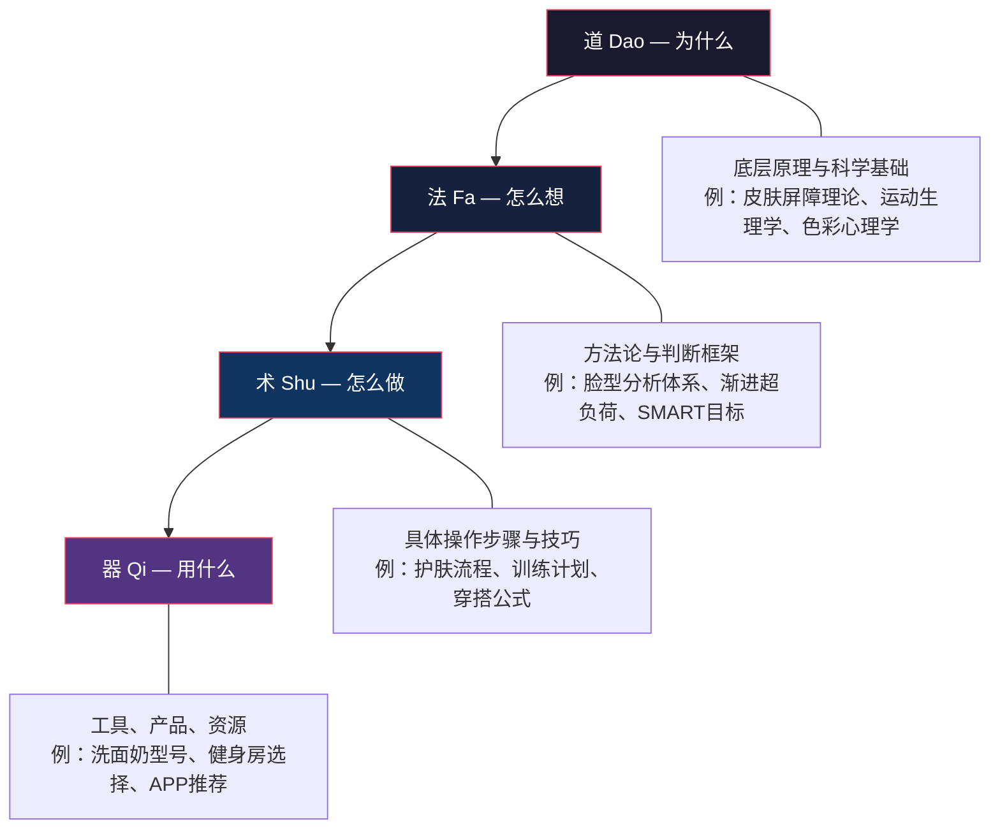
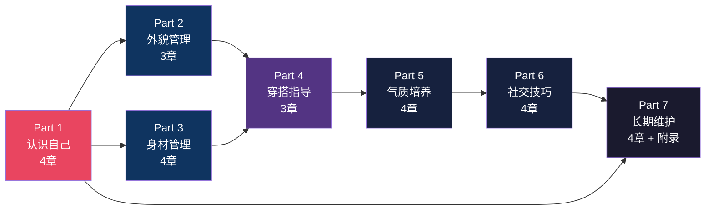
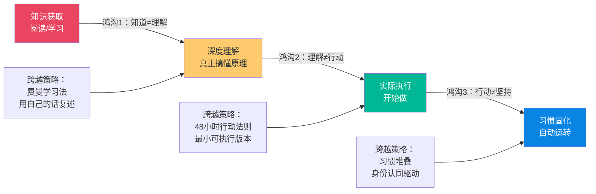
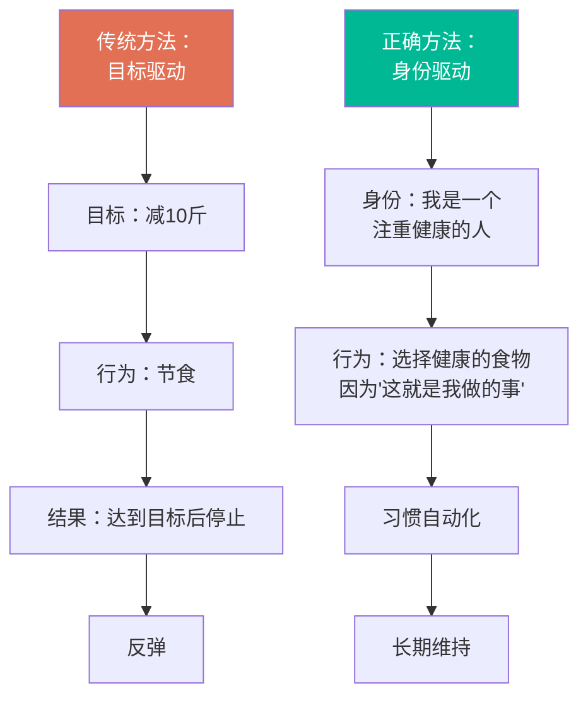
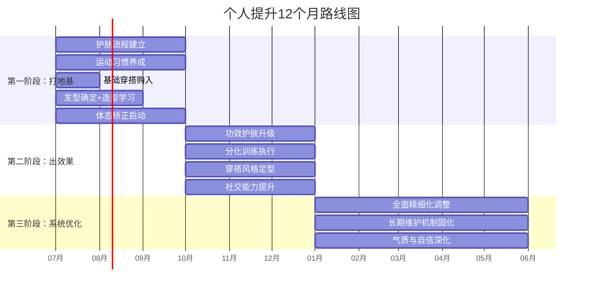

# 前言与导读

> 这不是一本鸡汤书，不是一本时尚杂志，更不是一本"改变命运"的成功学。这是一份针对具体的人、具体的身体条件、具体的生活状态而编写的**操作手册**。它的每一章都经过校准——校准的对象是一个真实的、28岁的、普通身高的中国男性开发者。

## 这本书为什么存在

你有没有过这样的经历：在网上看到一篇"男生提升指南"，点进去发现全是"要自信""要自律""要坚持"这类正确的废话？或者看了一堆穿搭博主的视频，发现自己普通身高、55开身材的条件根本套不进那些"万能公式"？

这不是你的问题。是大多数内容的问题——它们试图用一套方案覆盖所有人，结果对谁都不够用。

市面上95%的男性形象类内容存在以下硬伤：

| 问题 | 典型表现 | 后果 |
|------|---------|------|
| 泛泛而谈 | "注意穿搭""保持干净" | 看完等于没看，不知道具体怎么做 |
| 千人一面 | 所有人同一套方案 | 身材条件不同的读者根本无法执行 |
| 只讲术不讲道 | "买这件外套就好了" | 换个场景就不会了，永远依赖别人 |
| 忽视中国男性特征 | 照搬欧美审美标准 | 亚洲人发质、脸型、体态完全不同的解法 |
| 割裂式建议 | 穿搭归穿搭，护肤归护肤 | 形象是整体的，碎片化建议无法形成合力 |
| 不考虑成本 | "买这件2000块的外套" | 大多数人没有无限预算 |

**这本书不一样。** 它是一本**为具体的人写的具体的操作手册**。

为什么强调"具体"？因为一个普通身高、方形脸、头发塌的男生，和一个180cm、鹅蛋脸、发量充沛的男生，面对的穿搭问题完全不同。前者需要解决的是视觉重心上移、脸型修饰、发根蓬松这些技术活，后者可能只需要"怎么穿都行"。把"怎么穿都行"的建议塞给前者，不仅没用，还会制造焦虑。

所以这本书的逻辑很简单：**先认识自己，再对症下药**。

## 本书的核心理念：道法术器四层框架

本书不只是"技巧合集"，而是一套完整的个人提升系统。所有内容按照中国传统智慧中的**道法术器**四层结构组织，每一层都不可或缺：

**为什么大多数人学了技巧却没效果？** 因为他们只想要"器"和"术"——"告诉我用什么产品、穿什么衣服"。但没有"道"和"法"的支撑，你会永远依赖别人告诉你答案，遇到新情况就束手无策。

举一个具体的例子：很多人知道"深色显瘦"（术），但不知道为什么（道），所以他们只知道"穿黑色"，却不知道深色的作用是**降低视觉面积**——这意味着你还可以通过**同色系纵向延伸**、**V领拉长颈部线条**、**合身剪裁避免面料膨胀**等多种手段达到同样效果。理解了原理，一个技巧就变成了十个。

**正确使用本书的方式**：从"道"开始理解，用"法"建立框架，再用"术"和"器"落地执行。跳过前两层直接看技巧，你会发现记了一堆零散知识点，换个场景就懵了。

## 本书的目标读者

这本书最初是为一个具体的人写的，他有以下特征：

### 身体条件

| 项目 | 数据 |
|------|------|
| 性别 | 男 |
| 年龄 | 28岁 |
| 身高 | 普通身高 |
| 体重 | 正常体重（67kg） |
| BMI | 24.6（接近超重线） |
| 身材比例 | 55开（上下半身几乎等长） |

### 外貌特征
- **脸型**：方形脸，颧骨突出，额头和下巴相对窄
- **发质**：细软塌，发根支撑力不足，容易贴头皮
- **肤质**：中性偏微油，T区出油，两颊正常

### 生活状态
- **职业**：Java开发工程师，久坐办公
- **运动基础**：接近零基础
- **作息**：晚11-12点睡，早7-8点起
- **护肤**：已有基础护肤习惯（洗面奶+乳液+精华+防晒）

如果你和上述条件高度吻合，这本书几乎可以直接照搬执行。如果你只有部分相似（比如也是矮个子但脸型不同，或者也是塌发但身材比例好），同样值得参考——你只需要跳过不相关的部分，重点看方法论和调整逻辑。

**更广泛地说**，这本书适合以下人群：
- **形象管理新手**：从未系统关注过外在形象，但意识到"该做点什么了"
- **有改善意愿但不知从何下手的人**：尝试过改变，但效果不理想
- **面临关键场合的人**：面试、相亲、晋升答辩、重要商务活动
- **追求长期成长的人**：不满足于"临时抱佛脚"，希望建立可持续的形象管理体系

## 本书的完整内容地图

全书分为七大板块、二十七章，按照**认识自己→管理外在→塑造内在→社交外化→长期维护**的逻辑链展开：

### 第一板块：认识自己（第1-4章）

一切改变的起点是客观、全面地认识自己。你将建立一份精确的"个人特征档案"——脸型轮廓、身材比例、肤质类型、发质特点——为后续所有改善方案提供数据依据。

| 章节 | 主题 | 核心解决的问题 |
|------|------|----------------|
| 第一章 | 自我评估基础 | 建立评估体系，掌握测量方法，建立基准线 |
| 第二章 | 面部特征分析 | 脸型分类、方形脸特点、颧骨修饰策略 |
| 第三章 | 身材特征分析 | BMI解读、55开比例优化、体脂率目标设定 |
| 第四章 | 皮肤与头发分析 | 肤质精确定义、发质改善路径、季节性调整方案 |

### 第二板块：外貌管理（第5-7章）

这是投入产出比最高的部分。外在改变不需要天赋，只需要正确的信息和持续的执行。

| 章节 | 主题 | 核心解决的问题 |
|------|------|----------------|
| 第五章 | 发型设计与管理 | 脸型×发质的发型方案、塌发蓬松、日常造型流程 |
| 第六章 | 面部护理与修饰 | 完整护肤流程、问题皮肤处理、抗初老策略 |
| 第七章 | 个人形象细节 | 眉毛管理、眼部护理、唇部护理、鼻部护理 |

### 第三板块：身材管理（第8-11章）

身材管理的本质是健康管理。不是追求极端体型，而是通过科学运动让身体处于最佳状态。

| 章节 | 主题 | 核心解决的问题 |
|------|------|----------------|
| 第八章 | 身材管理基础 | 评估方法、科学原则、常见误区 |
| 第九章 | 健身计划制定 | 有氧/力量训练、从零到中级的完整计划 |
| 第十章 | 饮食管理 | 热量计算、宏量营养素、减脂/增肌饮食方案 |
| 第十一章 | 体态矫正 | 圆肩驼背矫正、骨盆前倾、日常体态维护 |

### 第四板块：穿搭指导（第12-14章）

穿搭是性价比最高的视觉改造手段。合适的穿搭可以让普通身高呈现出170-175cm的视觉效果。

| 章节 | 主题 | 核心解决的问题 |
|------|------|----------------|
| 第十二章 | 穿搭基础理论 | 色彩理论、搭配原则、面料知识 |
| 第十三章 | 风格定位 | 个人风格探索、风格元素运用、配饰选择 |
| 第十四章 | 场合着装 | 日常/职场/社交/特殊场合的完整着装方案 |

### 第五板块：气质培养（第15-18章）

气质是最难模仿也最持久的个人魅力。外貌决定第一印象，气质决定持久吸引力。

| 章节 | 主题 | 核心解决的问题 |
|------|------|----------------|
| 第十五章 | 仪态训练 | 站姿/坐姿/走姿/手势的规范与练习 |
| 第十六章 | 领导力培养 | 影响力、决策力、团队管理能力 |
| 第十七章 | 外语学习 | 英语能力提升、跨文化沟通 |
| 第十八章 | 家居生活 | 生活空间管理、居住品质提升 |

### 第六板块：社交技巧（第19-22章）

形象管理的终极目的是建立更好的人际关系。

| 章节 | 主题 | 核心解决的问题 |
|------|------|----------------|
| 第十九章 | 兴趣爱好 | 培养有深度的兴趣爱好，丰富社交话题 |
| 第二十章 | 社交技巧提升 | 沟通能力、社交礼仪、克服社交恐惧 |
| 第二十一章 | 时间管理 | 高效时间利用、习惯养成系统 |
| 第二十二章 | 阅读与学习 | 高效阅读方法、建立个人知识体系 |

### 第七板块：长期维护与综合能力（第23-27章 + 附录）

有了能力和形象，还需要系统的生活管理来支撑持续运转。

| 章节 | 主题 | 核心解决的问题 |
|------|------|----------------|
| 第二十三章 | 法律常识 | 劳动法、合同法、消费者权益等基础法律 |
| 第二十四章 | 财务管理 | 理财基础、消费规划、财务安全 |
| 第二十五章 | 职业发展 | Java开发的职业路径、副业探索 |
| 第二十六章 | 思维提升 | 核心思维模型、分析与决策能力 |
| 第二十七章 | 心理学基础 | 理解自我与他人、情商与人际敏感度 |
| 附录 | | 推荐资源汇总、工具清单、进度跟踪模板 |

## 怎么读这本书效果最好

大多数人读自我提升类书籍的流程是：翻开→觉得有道理→合上→什么都没变。

这不是意志力的问题，是方法的问题。认知科学的研究告诉我们，**阅读和改变之间存在三道鸿沟**，每一道都有对应的跨越策略：

### 第一步：通读目录，标记优先级（10分钟）

花10分钟浏览全书目录，用三个等级标记每个章节：
- 🔴 **紧迫**：当前最想改善的（标记2-3个）
- 🟡 **重要**：需要但不急的
- ⚪ **待定**：暂时不需要的

**怎么做标记**：拿一张纸，左边写你的痛点（"头发塌显脸大""穿什么都不好看""面试形象差"），右边对照目录找到对应章节。这就是你的个性化学习路径。

### 第二步：从一个章节开始，不要贪多

这是最常见的错误——同时启动护肤、运动、穿搭、阅读四个计划，两周后全部放弃。

**为什么"同时启动多个习惯"几乎必然失败？**

行为科学家BJ Fogg在其研究中发现，意志力不是性格特质，而是一种**有限的生理资源**。每次你做出一个决策（"今天要不要去健身""穿哪件衣服"），都在消耗同一个"自控力账户"。同时启动4个新习惯意味着每天要多做几十个新决策，自控力会在1-2周内被耗尽——这就是"全面启动，全面放弃"的根本原因。

**正确做法**：选一个最紧迫的章节，用2-4周把它的方案跑通，形成稳定习惯后，再开下一个。

推荐的启动顺序（基于见效速度和执行难度的平衡）：
1. **护肤**（最容易坚持，效果最直观，每天只需额外3分钟）
2. **穿搭**（立竿见影，增强信心，不需要长期积累）
3. **锻炼**（需要时间积累，但回报最大）
4. 其余章节按需展开

### 第三步：用执行模板，不要凭感觉

每个章节都会提供具体的执行方案和模板。**照着做**，不要"根据自己的理解调整"——至少先严格执行两周，确认效果后再微调。

为什么？因为大多数人的"自己的理解"其实是基于错误的直觉。举几个常见的错误直觉：

| 错误直觉 | 事实 | 来源 |
|----------|------|------|
| "我是油性皮肤，所以要强力控油" | 过度清洁反而刺激皮脂腺分泌更多油脂 | 皮肤屏障科学 |
| "减肥要少吃主食" | 低碳水饮食降低代谢率，长期反弹更严重 | 运动营养学 |
| "矮个子穿什么都一样" | 高腰线+同色系+V领可以让视觉身高增加5-8cm | 视觉比例原理 |
| "头发塌是发量少的问题" | 主要是油脂让发丝粘连，控油蓬松比增发更有效 | 毛发科学 |

先按方案执行，用结果验证；再根据结果调整。这就是科学方法的"假说→实验→验证"循环。

### 第四步：每周复盘，每月调整

每周花15分钟问自己三个问题：
1. 这周执行了什么？（记录完成情况）
2. 效果如何？有什么变化？（拍照+数据对比）
3. 下周需要调整什么？（基于反馈优化）

每月做一次大复盘，看看哪些方案有效、哪些需要修改、哪些可以放弃。

**复盘的正确方式**：不要只凭记忆复盘——人的记忆是有偏差的。用照片对比（每周在同一个角度、同一个光线下拍照），用数据说话（体重、体围、护肤产品的消耗量等客观指标）。

### 第五步：习惯固化后再拓展

一个领域的习惯稳定运行4周以上，才算真正建立。在此之前，不要急着开新战场。

**怎么判断习惯是否已经固化？** 一个简单的测试：你是否需要"提醒自己"去做这件事？如果还需要闹钟或意志力驱动，说明习惯还没固化。如果到了时间自然就去做了，甚至不做反而觉得缺了什么——恭喜，习惯已经变成了自动化行为。

行为科学的研究表明，习惯固化平均需要66天（Lally et al., 2010），而不是通常所说的21天。21天的说法来自一位整形外科医生的观察，没有经过严格验证。做好至少两个月的准备。

## 关于"完美"的最大误区

在开始之前，有必要对齐一个认知：**这本书的目标不是把你变成"完美男人"，而是让你在现有条件下做到最好。**

"完美"是一个商业概念，不是生活目标。媒体和广告不断告诉你：你应该更高、更帅、更富、更有魅力。它们制造焦虑，然后卖你解决方案。这个循环永远没有终点。

真相是：

| 不能改变的事实 | 可以改变的手段 | 预期效果 |
|---------------|---------------|---------|
| 普通身高的身高无法改变 | 优化穿搭比例、矫正体态 | 视觉上高5-8cm |
| 方形脸无法改变 | 发型两侧遮挡、柔和表情管理 | 脸型更协调、更亲和 |
| 55开的身材比例无法改变 | 高腰线穿搭、腿部增肌 | 视觉上呈现4:6效果 |
| 塌发无法改变发质 | 造型产品+吹风技巧+纹理烫 | 头发蓬松一整天 |
| 颧骨突出无法改变 | 太阳穴蓬松、眼镜选择、表情管理 | 面部线条更柔和 |

**区分"不能改变的"和"可以改变的"，把精力全部投入后者**——这不是认命，这是聪明。心理学中把这种认知称为"控制二分法"（Dichotomy of Control），源自古罗马斯多葛哲学：把你的注意力聚焦于你能控制的事情上（穿搭、运动、护肤、体态），接受你不能控制的事情（身高、骨架、基因），你会活得更从容也更高效。

## 改变的科学：为什么习惯比意志力可靠

很多人在开始自我提升时，依赖的是**意志力**——"我一定要坚持""我要逼自己"。这种方法在第1-2周通常有效，但到了第3-4周就开始崩溃。

**意志力为什么不可靠？**

2011年，佛罗里达州立大学心理学家Roy Baumeister的"自我损耗"（Ego Depletion）研究表明，自控力像肌肉一样会疲劳。虽然这项研究后来引发了复制危机，但核心发现仍然成立：**持续依赖自控力来维持行为，长期来看是不可持续的。**

**真正可靠的替代方案：身份驱动的习惯系统。**

James Clear在《Atomic Habits》中提出了一种更有效的习惯养成模型——不要聚焦于"目标"（我要减10斤），而要聚焦于"身份"（我是一个注重健康的人）：

**在本书中的应用**：不要想"我要坚持护肤"（目标驱动，依赖意志力），而是想"我是一个注重形象管理的人"（身份驱动，行为自然发生）。当护肤变成"像我这样的人会做的事"，你就不再需要提醒自己——它变成了你身份的一部分。

## 行为改变的五个阶段

心理学家James Prochaska的"跨理论模型"（Transtheoretical Model）将行为改变分为五个阶段。了解你目前在哪个阶段，能帮你选择最合适的策略：

| 阶段 | 你的状态 | 本书的建议 |
|------|---------|-----------|
| 前意向期 | "我现在挺好的，不需要改变" | 浏览前言和个性化说明，看看是否有些困扰你一直在忽略 |
| 意向期 | "我应该改变，但不知道怎么做" | 阅读全书目录，建立整体框架感 |
| 准备期 | "我准备好了，要开始行动" | 完成自我评估，制定90天计划 |
| 行动期 | "我已经在执行了" | 按章节顺序推进，每周复盘 |
| 维持期 | "习惯已经建立，想保持下去" | 重点看长期维护板块，定期优化 |

**如果你正在读这段话，你大概率已经从"意向期"进入了"准备期"**。这是最脆弱的阶段——你知道该做什么，但还没开始做。最好的策略是：**在接下来的48小时内，完成一件最小的事**。可以是：拍一组基准照片、量一下体围、或者买一瓶洗面奶。任何一件小事，只要它让你从"准备期"跨入"行动期"。

## 时间框架与阶段预期

本书设计了6-12个月的完整提升周期，分三个阶段。这个时间框架不是随意设定的，而是基于以下科学依据：

- **皮肤代谢周期**：约28天（角质层完全更新一次）
- **肌肉可见变化**：8-12周（新手红利期）
- **习惯自动化**：平均66天（Lally et al., 2010）
- **体态矫正**：4-8周（软组织适应性改变）
- **发型留长调整**：3-6个月（头发平均每月生长1-1.5cm）

### 第一阶段（第1-3个月）：打地基

这是最枯燥也最关键的阶段。主要任务是建立基本习惯：

- **护肤**：稳定早晚护肤流程，皮肤状态明显改善
- **运动**：从零开始，建立每周3次的运动习惯
- **穿搭**：购入5-8件基础单品，掌握基本搭配逻辑
- **发型**：找到适合自己的发型，学会日常打理
- **阅读**：建立每天20分钟的阅读习惯

**预期效果**：自己能感觉到变化，但外人可能还看不出来。这个阶段最容易放弃——因为付出和回报之间的时间差最大。坚持下去，复利效应即将启动。

**关键里程碑检查清单**：

| 检查项 | 达标标准 |
|--------|---------|
| 护肤 | 连续30天早晚护肤不断，肤质改善1个等级 |
| 运动 | 每周至少3次运动，体态有所改善 |
| 穿搭 | 有5-8件合身的基础款，出门穿搭时间<5分钟 |
| 发型 | 确定了适合的发型，学会了基本造型 |
| 自评 | 侧面照片对比，体态改善可见 |

### 第二阶段（第4-6个月）：出效果

基础习惯稳定后，开始进阶：

- **护肤**：进入功效护肤阶段，针对性解决皮肤问题
- **运动**：从泛练到分化训练，体型开始有变化
- **穿搭**：形成个人风格，不再需要照搬模板
- **思维**：阅读积累开始转化为思考能力
- **社交**：自信提升带动社交表现改善

**预期效果**：身边的人开始注意到你的变化，会主动问你"最近是不是在健身/换了发型"。这是最鼓舞人心的阶段——外部反馈会形成正向循环，进一步强化你的行为。

### 第三阶段（第7-12个月）：系统优化

各方面已进入自动运转，重点转向精细化：

- 各领域习惯已固化，执行不需要意志力
- 开始做针对性优化和个性化调整
- 职业发展方向清晰，有明确的下一步计划
- 生活节奏稳定，精力分配合理

**预期效果**：你已经不是一年前的那个人了。不是因为变成了别人，而是因为变成了更好的自己。

## 执行中的常见坑

提前了解这些，可以少走很多弯路。每个坑都附带了具体的"填坑策略"：

### 坑1：完美主义陷阱

**表现**："今天没时间做完整护肤流程，算了不做了。"
**心理机制**：完美主义者把"全部完成"和"完全不做"当作唯二选项，忽略了中间地带。
**填坑策略**：建立"最小执行版本"——没时间涂精华？至少洗个脸涂个乳液。没时间去健身房？至少做10个俯卧撑。做了总比不做好。研究显示，执行最小版本的人，有78%的概率会继续做下去——因为启动是最难的部分。

### 坑2：信息过载

**表现**：看了10个穿搭博主的视频，反而不知道怎么穿了。
**心理机制**：选择悖论——选项越多，决策越困难，满意度越低。
**填坑策略**：选定一个风格，先执行，再说优化。本书给你的是"原则"而非"趋势"——原则永远不过时。在你形成自己的审美判断之前，不要同时关注太多信息源。

### 坑3：急于求成

**表现**：锻炼两周没看到腹肌就放弃。
**心理机制**：即时满足偏好——大脑天然倾向于低估长期回报、高估短期成本。
**填坑策略**：设定**过程目标**而非**结果目标**。不要想"一个月练出腹肌"（结果目标，你无法直接控制），而是想"每周完成3次训练"（过程目标，你完全可以控制）。过程目标完成后，结果自然会来——体型改变至少需要3个月的持续训练，这不是鸡汤，是生理规律。

### 坑4：盲目对比

**表现**：刷到别人一年的变化对比照，觉得自己进度太慢。
**心理机制**：社交媒体上的"幸存者偏差"——你看到的是最好的那5%案例，而不是平均值。
**填坑策略**：只和昨天的自己比。每个人的起点、基因、可用时间都不同。你的参照物应该是你自己的基准照片，而不是别人的Instagram。

### 坑5：忽略基础

**表现**：直接买一堆高级护肤品、办健身卡、买潮牌。
**心理机制**：消费主义陷阱——把"花钱"等同于"改变"。
**填坑策略**：先把手头的东西用好，先用体重练好基础动作，先掌握基本搭配再谈风格。基础不牢，上层建筑怎么搭都会塌。

### 坑6：半途而废后的全盘否定

**表现**：中断了一周，觉得"前功尽弃了"，索性全部放弃。
**心理机制**："全有或全无"思维——认为中断等于失败。
**填坑策略**：记住一个原则——**永远不要连续错过两次**。错过一天没关系，但第二天必须回来。中断不等于归零，你之前积累的肌肉记忆、护肤习惯、搭配经验都不会凭空消失。

## 自我诊断：你现在的起点在哪里

在开始之前，花5分钟完成这份快速自评。这不是让你自我批评，而是帮你建立清晰的**起点**——有起点才能衡量进步。

| 评估维度 | 1分（需大幅改善） | 3分（中等水平） | 5分（优秀） | 你的评分 |
|---------|----------------|---------------|-----------|---------|
| 肤质状态 | 痘痘/暗沉/粗糙明显 | 偶尔出问题，基本稳定 | 光滑细腻，毛孔细小 | ___ |
| 发型适合度 | 随便剪的，没有打理 | 有基本造型，但不够精致 | 发型与脸型完美匹配 | ___ |
| 体态 | 明显圆肩/驼背/头前伸 | 偶尔不自觉含胸 | 站姿挺拔，肩背舒展 | ___ |
| 穿搭水平 | 随便穿，没有搭配意识 | 有基本配色概念 | 形成个人风格，得体有型 | ___ |
| 运动习惯 | 几乎不运动 | 偶尔运动 | 每周规律运动3次以上 | ___ |
| 自信程度 | 社交场合经常紧张 | 能应对，但不够自如 | 从容自信，不卑不亢 | ___ |

**评分解读**：
- **总分 6-12 分**：基础阶段——提升空间巨大，每一项改善都会有明显效果
- **总分 13-18 分**：进阶阶段——有基础但缺乏系统性，先通读全书建立框架
- **总分 19-24 分**：精进阶段——基础不错，重点关注气质和社交的跃迁
- **总分 25-30 分**：维护阶段——做得很好了，关注长期维护和持续微优化

## 写在最后

改变是一个过程，不是一个瞬间。

你不会在读完这本书的第二天就变成一个完全不同的人。但如果你认真执行书中的方案：

- **坚持1个月**，你会发现自己的皮肤状态、精神面貌有了可感知的改善
- **坚持3个月**，身边的人会注意到你的变化
- **坚持6个月**，你会建立一套自动运转的自我管理系统
- **坚持12个月**，你会成为一个连自己都感到惊讶的人

每一天的微小进步，都在为未来的自己积累复利。这就是复利效应的魔力——每天进步1%，一年后你将是今天的37.78倍。

不需要一次改变所有事情。从今天开始，选一件事，做好它。

让我们开始吧。

***

> 📅 本书创建时间：2026年6月18日
>
> 🎯 适用对象：28岁男性，普通身高，正常体重，55开身材，颧骨突出，方形脸，头发塌，中性偏微油皮肤
>
> ⏱ 预计提升周期：6-12个月
>
> 📚 全书规模：七大板块 · 二十七章 · 四个附录
>
> 🔧 方法论框架：道法术器四层贯通
