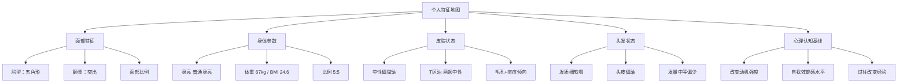
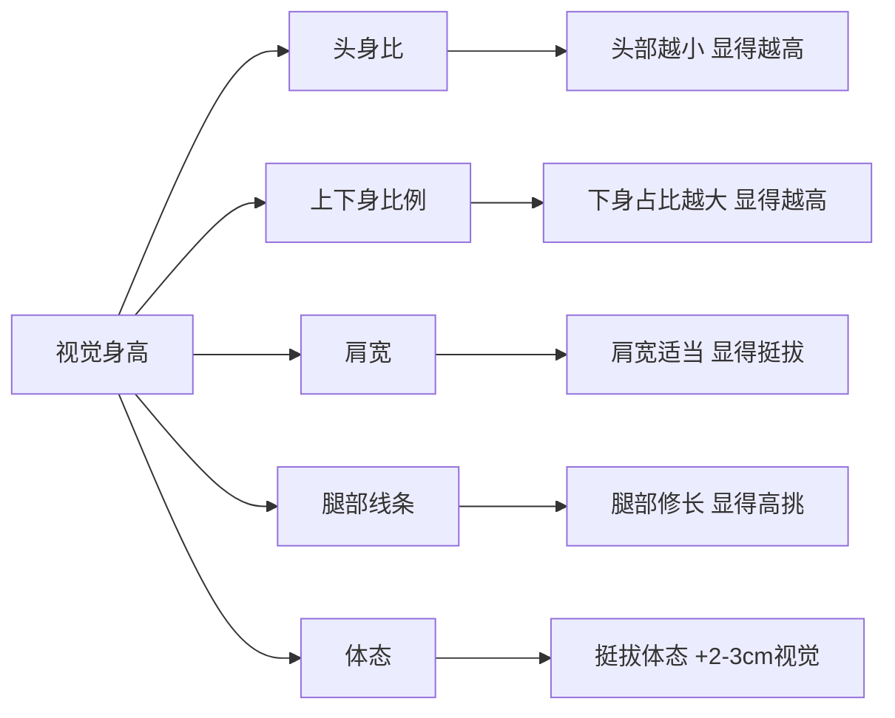
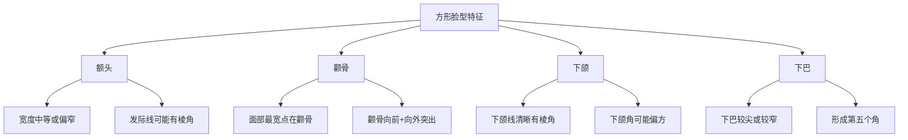
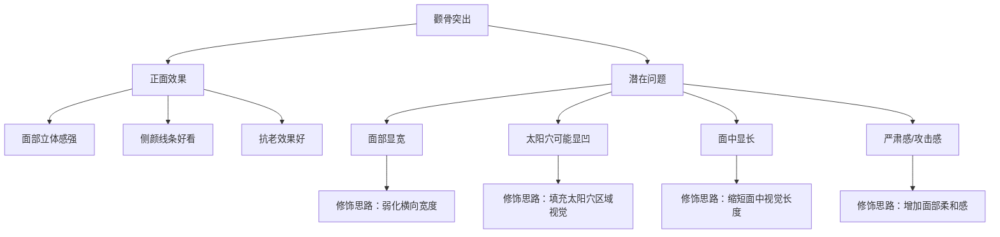
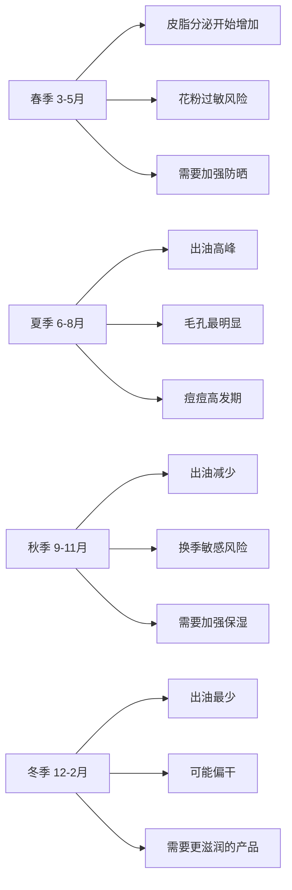
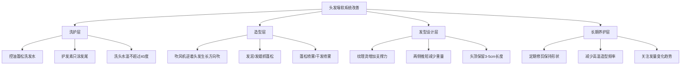
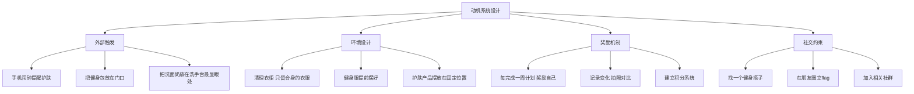
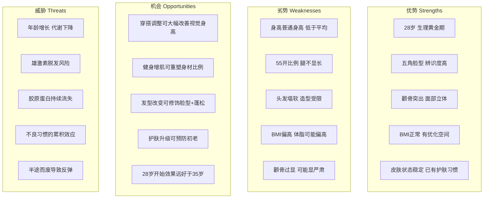
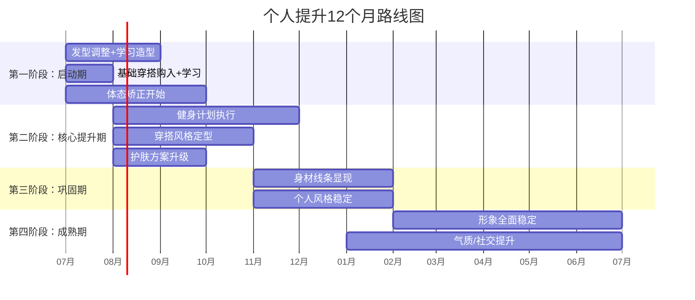

# 个性化说明：你的专属提升蓝图

## 为什么需要一份个性化说明？

市面上的个人提升指南大多提供"通用模板"——适用于所有人的平均建议。但人不是平均值。你的脸型、身高、肤质、发质、身体比例，每一个变量都在影响"什么方法对你真正有效"。一份不考虑个人特征的建议，就像一张没有标注起点的地图——方向可能没错，但你不知道该从哪里走。

本章的目的是：**为你建立一张精确的"个人特征地图"**。后续每一章的具体方案，都会回溯到这张地图上，确保每一条建议都经过你的特征校准。

### 本章阅读指南

本章共七个部分，按以下顺序阅读效果最佳：

| 部分 | 内容 | 阅读时间 | 重要度 |
|------|------|----------|--------|
| 第一部分 | 基础参数解读 | 10分钟 | ★★★★★ |
| 第二部分 | 面部特征深度分析 | 10分钟 | ★★★★☆ |
| 第三部分 | 皮肤状态深度画像 | 8分钟 | ★★★★☆ |
| 第四部分 | 头发状态深度画像 | 8分钟 | ★★★★☆ |
| 第五部分 | 心理认知基线 | 10分钟 | ★★★★★ |
| 第六部分 | 特征全景图与提升路径 | 10分钟 | ★★★★★ |
| 第七部分 | 常见误区预警 | 5分钟 | ★★★★☆ |

---

## 第一部分：基础参数解读

### 年龄：25-30岁——黄金窗口期

25-30岁对男性来说是一个关键节点。从运动科学角度看，25-30岁是男性睾酮水平的峰值区间，这意味着：

| 生理指标 | 28岁状态 | 对形象提升的意义 |
|----------|----------|-----------------|
| 睾酮水平 | 接近峰值（300-1000 ng/dL） | 肌肉合成效率最高，健身增肌效果最佳 |
| 基础代谢率 | 约1600-1700 kcal/天 | 仍有较高代谢优势，减脂比35岁后容易得多 |
| 皮肤胶原蛋白 | 年流失率约1%开始 | 尚未出现明显松弛，是建立护肤习惯的最佳时机 |
| 生长激素 | 深睡眠分泌仍较充足 | 体态矫正、肌肉恢复的速度快 |
| 骨密度 | 接近峰值 | 适合负重训练，不用担心骨质疏松风险 |

**关键认知**：28岁不是"还年轻可以等"，而是"窗口正在收窄"。从28岁开始建立的健身和护肤习惯，其复合效应远大于35岁才开始。皮肤科研究显示，25岁后胶原蛋白以每年约1%的速度流失，到28岁累计已下降约3%——虽然肉眼不可见，但细胞层面的衰老已经开始。现在每投入1分努力，未来能节省3-5分的修复成本。

**具体数据支撑**：

- 健身增肌：28岁男性在合理训练下，第一年可增加约4-6kg纯肌肉（新手红利期），同等训练量下35岁男性只能增加约2-3kg
- 皮肤修复：28岁开始使用维A醇类产品，5年后的皮肤年龄可比同龄人年轻2-3岁（《British Journal of Dermatology》相关研究）
- 代谢窗口：28岁的基础代谢率比38岁高约100-150 kcal/天，相当于每天多吃一碗米饭而不长胖

### 身高：普通身高——数据解读与认知重构

先看客观数据：

- 中国成年男性平均身高：约169.7cm（2020年《中国居民营养与慢性病状况报告》）
- 普通身高处于第25-30百分位，即在100个同龄男性中，约有70-75人比你高
- 这个数据既不极端也不罕见，属于"略低于平均"的范围

但"略低于平均"和"看起来矮"是两件完全不同的事。视觉身高受以下因素影响：

以普通身高为例，如果你的体态从含胸驼背变成挺拔直立，视觉上可以"增加"2-3cm。如果你的穿搭让上下身比例从5:5变成视觉上的4:6，又可以"增加"2-3cm。也就是说，仅通过体态和穿搭，普通身高可以呈现出169-171cm的视觉效果——而这恰好就是平均水平。

**身高认知重构练习**：

下次在公共场合时，做一个观察实验：注意那些你第一眼觉得"挺高"的男性，仔细观察他们的实际身高。你会发现，很多给你"高"印象的人，实际身高可能也就168-170cm——他们靠的是体态、穿搭和自信的姿态，而不是那几厘米的物理差距。

后续第四章（穿搭指导）和第五章（气质培养）会给出具体的操作方案。

### 体重：67kg（正常体重）——BMI之外的真实含义

BMI（身体质量指数）= 体重(kg) ÷ 身高(m)² = 67 ÷ 1.65² ≈ **24.6**

| BMI范围 | 分类 | 你的位置 |
|---------|------|---------|
| <18.5 | 偏瘦 | — |
| 18.5-23.9 | 正常 | — |
| 24.0-27.9 | 超重前期 | ← 24.6 在这里 |
| ≥28.0 | 超重 | — |

BMI 24.6处于正常范围的上限、超重前期的起点。但BMI本身有局限性——它不区分肌肉和脂肪。一个67kg、体脂率15%的人和一个67kg、体脂率25%的人，BMI相同，但外观和健康状态完全不同。

**对你而言更有意义的指标是体脂率**。对于28岁男性：

- 体脂率 15-18%：身材紧实，腹肌隐约可见，体型明显改善
- 体脂率 18-22%：正常范围，身材尚可但缺乏线条感
- 体脂率 22-26%：开始有"微胖感"，腹部有赘肉
- 体脂率 >26%：明显肥胖

如果目前体脂率在22-26%区间（BMI 24.6大概率对应这个范围），那么目标是降到18%左右。大约需要减掉3-5kg脂肪、同时增加2-3kg肌肉，最终体重可能在64-66kg，但视觉效果会截然不同——因为肌肉密度比脂肪高约18%，同体重下体积更小。

**体脂率的实际测量方法**：

| 方法 | 精度 | 成本 | 操作难度 | 推荐度 |
|------|------|------|----------|--------|
| 体脂秤（生物电阻抗） | ±3-5% | 100-300元 | ★☆☆ 一站即测 | 日常监测够用 |
| 皮脂钳 | ±2-3% | 20-50元 | ★★☆ 需要学习手法 | 性价比最高 |
| 围度估算法 | ±4-6% | 免费 | ★☆☆ 量腰围即可 | 粗略参考 |
| DEXA扫描 | ±1-2% | 300-500元/次 | ★☆☆ 去医院做 | 最精确，半年做一次 |
| 水下称重 | ±1-2% | 500-800元/次 | ★★★ 设备少 | 科研级精度 |

**推荐方案**：买一个家用体脂秤（如华为/小米，100-200元），每天早上空腹上秤记录。虽然绝对值不一定精确，但**趋势变化**是有参考价值的。同时每月用皮脂钳测量一次，交叉验证。

### 身体比例：5:5——什么是真正的影响因素

上下半身比例指的是：以肚脐（或髋骨上缘）为分界线，上半身长度与下半身长度的比值。

**5:5比例的客观分析**：

- 亚洲男性中5:5是最常见的比例（约60%的人口分布在此区间）
- 被认为"最优"的4:6比例（腿更长）在亚洲男性中仅占约15-20%
- 5:5比例不是缺陷，而是中性基线

但视觉比例是可以被操控的。以下是不同手段对视觉比例的影响：

| 手段 | 效果 | 原理 | 难度 |
|------|------|------|------|
| 高腰裤/将上衣扎进去 | +5-8cm视觉腿长 | 提高腰线位置，重新定义上下半身分界 | ★☆☆ |
| 同色系上下装 | +3-5cm视觉身高 | 消除色块分割，形成纵向延伸感 | ★☆☆ |
| V领/尖领上衣 | 拉长颈部线条 | 视觉上延长躯干上部 | ★☆☆ |
| 避免低腰裤 | 避免-3cm视觉身高 | 低腰裤将分界线下移 | ★☆☆ |
| 适度增高鞋垫 | +2-3cm实际身高 | 物理增高，注意鞋帮高度匹配 | ★★☆ |
| 肩部训练增肌 | 改善头肩比 | 宽肩让身体看起来更挺拔 | ★★★ |

这些手段的叠加效应非常可观：如果高腰线(+5cm视觉) + 同色系(+3cm视觉) + 增高鞋(+2.5cm实际) 同时使用，普通身高可以呈现出170-175cm的视觉效果。

**关于增高鞋垫的实操建议**：

增高鞋垫不是"垫越高越好"。超过3cm的增高鞋垫会导致前脚掌压力过大、走路姿势变形、脚踝不稳，反而暴露"穿了增高鞋"的痕迹。推荐方案：

- 日常休闲鞋：内增高1.5-2cm（几乎无感）
- 皮鞋/正式场合：内增高2-2.5cm + 外底1cm = 总计3-3.5cm
- 运动鞋：选择厚底款（如Nike Air Max系列），自然增高2-3cm
- 绝对避免：超过4cm的增高鞋垫、明显增高的松糕鞋

---

## 第二部分：面部特征深度分析

### 方形脸型——结构解码

方形脸型在东亚男性中并不罕见，它结合了方脸和菱形脸的特征。以下是方形脸型的几何特征：

**方形脸型的审美二元性**：

这种脸型同时具有"优势面"和"挑战面"，关键在于如何管理视觉重心：

| 维度 | 优势面 | 挑战面 |
|------|--------|--------|
| 立体感 | 面部层次丰富，侧颜线条有力 | 正面可能显得过于"硬朗" |
| 辨识度 | 容易被记住，适合镜头表现 | 第一印象可能偏"严肃" |
| 年龄感 | 骨骼支撑好，抗老效果佳 | 年轻时可能显得比实际年龄成熟 |
| 风格适配 | 适合商务、精英、硬朗风格 | 日常休闲/温柔风格需要刻意营造 |

**关键认知**：方形脸型不是需要"隐藏"的缺陷，而是需要"驾驭"的特征。很多知名男演员和模特都有类似的面部结构——高颧骨+清晰下颌线在男性审美中被视为"有型"的标志。问题不在于脸型本身，而在于如何通过发型、穿搭和表情管理来平衡它的视觉效果。

**方形脸型的风格路线选择**：

| 风格路线 | 适配度 | 核心策略 | 代表人物参考 |
|----------|--------|----------|-------------|
| 硬朗型男 | ★★★★★ | 强调棱角，配合短发/寸头 | 王凯、张震 |
| 商务精英 | ★★★★★ | 发型整洁+合身西装 | 金城武、彭于晏 |
| 日系清爽 | ★★★☆☆ | 需要发型柔化棱角 | 参考日系杂志 |
| 韩系温柔 | ★★☆☆☆ | 需要较多修饰手段 | 不是最佳路线 |
| 运动阳光 | ★★★★☆ | 肤色+体态是关键 | 短发+晒后肤色调 |

### 颧骨修饰——从机制到修饰

颧骨（Zygomatic Bone）位于面部中1/3的两侧，是面部宽度的主要决定因素之一。面部轮廓（颧骨区域）有两种情况需要区分：

**1. 骨性突出**（你的情况大概率属于此类）
- 颧骨本身发育较大、位置较高或向前突出
- 特征：无论胖瘦，颧骨区域都比较明显
- 特点：骨性结构无法通过非手术方式改变，但可以通过外部修饰调整视觉效果

**2. 软组织性突出**
- 面部脂肪较少，导致颧骨"显"得突出
- 特征：体重增加后颧骨突出感会减轻
- 特点：可以通过增重或面部脂肪填充来改善

判断方法：用手指触摸颧骨区域，如果感觉到明显的骨性隆起，且不随面部表情变化，大概率是骨性突出。

**颧骨突出对视觉的影响链**：

**具体的修饰矩阵**：

| 修饰手段 | 针对问题 | 具体操作 | 效果等级 |
|----------|----------|----------|----------|
| 两侧留发/遮挡 | 面部显宽 | 发型两侧保留适当长度遮挡颧骨最宽处 | ★★★★ |
| 太阳穴蓬松 | 太阳穴显凹 | 发型在太阳穴区域做出蓬松感 | ★★★ |
| 柔和表情 | 严肃感 | 微笑时颧肌上提，让面部线条柔和 | ★★★★ |
| 眉形调整 | 面部硬朗感 | 略带弧度的眉形（避免过于平直的剑眉） | ★★☆ |
| 胡须造型 | 下半脸平衡 | 短胡须可以增加下半脸的视觉重量 | ★★☆ |
| 眼镜选择 | 面部比例 | 选择有上框线的方形/方圆框眼镜 | ★★☆ |
| 面部按摩 | 面部线条柔和 | 每晚3分钟面部按摩，促进血液循环 | ★★☆ |

### 方形脸型 × 颧骨突出：组合效应

当这两种特征同时存在时，会产生叠加效果：

- **正面效果叠加**：面部轮廓非常分明，辨识度极高，适合"型男"路线
- **挑战面叠加**：如果没有任何修饰，可能显得过于棱角分明，缺乏亲和力

**核心修饰策略**：不是消除棱角（那会失去辨识度），而是在棱角分明的基础上增加"柔和度"——让面部线条在"有力"和"亲和"之间找到平衡点。

这就好比一幅线条硬朗的素描画，不需要把线条擦掉，只需要在关键位置加一些柔和的阴影过渡。

**不同社交场景的面部管理策略**：

| 场景 | 策略 | 具体操作 |
|------|------|----------|
| 职场/面试 | 强调专业感和棱角 | 整洁短发+露出额头+微收下巴 |
| 社交/约会 | 增加亲和力 | 柔和发型+微笑+微微侧脸（侧脸线条是优势） |
| 日常休闲 | 自然舒适 | 不需要刻意管理，自信最重要 |
| 拍照/镜头 | 强调辨识度 | 45度角侧脸+眼神聚焦+微微收下巴 |

---

## 第三部分：皮肤状态深度画像

### 中性偏微油皮肤——精确定义

"中性偏微油"不是一个标准的皮肤科分类。它描述的是一种**混合状态**——整体偏中性，但T区（额头、鼻子、下巴组成的T形区域）油脂分泌偏多。更准确的皮肤类型描述应该是"混合偏油性皮肤"。

**皮肤出油的生理机制**：

皮脂腺分泌皮脂（Sebum）是由雄激素（主要是DHT，双氢睾酮）驱动的。28岁男性的睾酮水平仍然处于较高区间，这意味着皮脂腺活跃度不会低。皮脂分泌受以下因素影响：

| 因素 | 影响方向 | 对你的情况分析 |
|------|----------|--------------|
| 雄激素水平 | 正相关 | 28岁男性，水平较高，出油是正常的 |
| 饮食（高GI食物） | 正相关 | 精制碳水和乳制品可能加重出油 |
| 睡眠不足 | 正相关 | 熬夜会刺激皮质醇→促进皮脂分泌 |
| 过度清洁 | 反弹性正相关 | 清洁过度→皮脂膜被破坏→皮脂腺补偿性分泌更多 |
| 环境温度/湿度 | 正相关 | 夏季出油明显多于冬季 |
| 保湿不足 | 反弹性正相关 | 皮肤缺水时会通过出油来"自我保护" |
| 压力/焦虑 | 正相关 | 皮质醇升高→皮脂腺活跃 |

**当前护肤方案评估**：

根据护肤习惯（氨基酸洁面、保湿乳液、抗氧化精华、防晒霜、每周一次水杨酸产品），逐项分析：

| 产品 | 评估 | 建议 |
|------|------|------|
| 氨基酸洁面（如珂润/芙丽芳丝）| ✅ 温和不紧绷，适合偏油皮肤 | 继续使用。注意不要搓脸超过60秒 |
| 保湿乳液（如CeraVe保湿乳） | ✅ 含烟酰胺+神经酰胺，控油+修护屏障 | 早晚都可以用，夏天如果觉得偏润可以减少用量 |
| 抗氧化精华（如维C精华） | ✅ 抗氧化+抗糖化，适合预防初老 | 建议改为**早晚都用**，夜间修护同样需要抗氧化 |
| 防晒霜 | ✅ 必备步骤，预防光老化 | 确认SPF30+，PA+++以上，每2小时补涂（户外） |
| 水杨酸产品（如理肤泉K+） | ✅ 水杨酸+辛酰水杨酸，疏通毛孔 | 一周一次频率合理，初期可能有轻微爆痘是正常的 |

**一个重要的补充**：方案中缺少**晚间的精华**。抗氧化精华只在早上用，晚上就只有保湿乳液，这对28岁开始初老的皮肤来说力度不够。建议晚上增加一个修护类精华（如含视黄醇/维A醇的产品），或者至少把抗氧化精华也用到晚上。

### 关键护肤成分机制详解

了解你正在使用的成分"为什么有效"，才能判断产品是否值得买：

| 成分 | 作用机制 | 常见浓度 | 适合你的原因 |
|------|----------|----------|-------------|
| 烟酰胺（维B3） | 抑制黑色素转运+控油+修复屏障 | 2-5% | 控油+提亮，保湿乳液里已有 |
| 神经酰胺 | 补充皮肤屏障脂质 | 0.5-2% | 修复屏障，减少经皮水分流失 |
| 维A醇（视黄醇） | 促进细胞更新+刺激胶原蛋白 | 0.025-0.3% | **抗初老核心成分**，建议添加 |
| 水杨酸（BHA） | 脂溶性，渗透毛孔溶解油脂 | 0.5-2% | 疏通毛孔，水杨酸产品里已有 |
| 维C（抗坏血酸） | 抗氧化+抑制黑色素+促进胶原合成 | 10-20% | 抗氧化精华的核心成分 |
| 虾青素 | 抗氧化能力是维C的6000倍 | 0.001-0.01% | 抗氧化精华的辅助成分 |
| 透明质酸 | 吸收自身重量1000倍的水分 | 0.1-2% | 保湿，但不是越多越好 |

**成分搭配禁忌**（你需要注意的）：

- ❌ 维A醇 + 高浓度维C（刺激性叠加）→ 建议早晚分开用
- ❌ 维A醇 + 水杨酸（同一时段）→ 刺激叠加，建议隔天交替
- ✅ 维A醇 + 烟酰胺 → 可以一起用，烟酰胺能缓解维A醇的刺激
- ✅ 维C + 维E → 抗氧化协同效应，一起用效果更好

### 肤质随季节的变化

中性偏微油皮肤并非全年不变：

**季节性护肤调整建议**：

| 季节 | 洁面 | 精华 | 乳液/面霜 | 防晒 | 特别注意 |
|------|------|------|-----------|------|----------|
| 春季 | 氨基酸洁面 早晚各一次 | 抗氧化精华早晚 | 保湿乳液 | SPF30+ | 注意花粉，必要时用舒缓喷雾 |
| 夏季 | 氨基酸洁面 早晚各一次，中午可用清水 | 抗氧化精华早上，水杨酸产品一周2次 | 保湿乳液减量或换更清爽的 | SPF50+ 每2h补涂 | 控油是重点，可备吸油纸 |
| 秋季 | 氨基酸洁面 早上清水晚上洁面 | 抗氧化精华早晚 | 保湿乳液正常量 | SPF30+ | 换季时暂停水杨酸产品，避免刺激 |
| 冬季 | 氨基酸洁面 仅晚上 | 抗氧化精华早晚 | 保湿乳液+面霜叠加 | SPF30+ 室内可省略 | 保湿是重点，避免过度清洁 |

### 毛孔与痘痘管理

混合偏油性皮肤的两大附属问题：毛孔粗大和痘痘倾向。

**毛孔粗大的三种类型**：

| 类型 | 成因 | 特征 | 改善方案 |
|------|------|------|----------|
| 油脂型 | 皮脂分泌旺盛撑大毛孔 | T区明显，用手挤压有油脂粒 | 控油+水杨酸+清洁面膜 |
| 角质型 | 老旧角质堆积堵塞毛孔 | 毛孔周围有黑色/棕色小点 | 定期去角质+维A醇 |
| 衰老型 | 胶原蛋白流失导致毛孔松弛 | 毛孔呈水滴状下垂 | 维A醇+胶原蛋白刺激类精华 |

这种情况大概率是**油脂型为主、角质型为辅**。水杨酸产品正在针对这个问题，但可以更系统化：

- 每周1次水杨酸产品（已有）
- 每两周1次清洁面膜（如科颜氏白泥面膜）
- 日常控油：保湿乳液里的烟酰胺已经在做
- 长期改善：添加维A醇精华，促进角质代谢

**痘痘应急处理流程**：

1. **发现红肿痘痘**：不要挤！用含2%水杨酸的水杨酸产品局部涂抹
2. **白头痘痘**：可以用消毒后的粉刺针轻轻挑破，然后贴痘痘贴（如3M痘痘贴）
3. **痘印处理**：含维C的抗氧化精华+ 防晒，加速痘印淡化
4. **反复发作**：如果同一位置反复长痘，考虑是否有饮食诱因（乳制品、高GI食物）

---

## 第四部分：头发状态深度画像

### 头发塌软的生理学解释

头发塌软不是单一原因造成的，而是多个因素的叠加效果：

**因素1：发丝直径**

亚洲人的头发直径通常在80-100微米之间，但"细软发"可能只有60-70微米。发丝直径直接影响头发的支撑力——直径越小，单根头发的抗弯刚度越低（物理学上，圆柱体的截面惯量与直径的四次方成正比）。也就是说，直径从80微米降到60微米，支撑力不是降低25%，而是降低约68%。

**因素2：头皮油脂**

你提到自己是中性偏微油皮肤，头皮的皮脂腺密度比面部更高。头皮出油后，油脂会沿着发丝向下扩散，让头发"粘"在一起，失去蓬松感。这就是为什么早上刚洗完头蓬松感最好，到下午就塌了——不是头发变重了，而是油脂让发丝互相粘连。

**因素3：毛囊角度**

亚洲人的头发生长角度相对较大（即头发从头皮"站"起来的角度较小，更贴头皮），这是遗传因素。非洲人的头发呈卷曲状天然蓬松，欧洲人的头发生长角度小天然挺立，而亚洲人的头发倾向于顺贴生长。

**因素4：发量密度**

正常亚洲男性的头发密度约为每平方厘米130-150根。如果低于120根/cm²，就会开始显得"头发少"。随着年龄增长，雄激素性脱发（AGA）在亚洲男性中的发病率约为20-30%（28岁年龄段），虽然你现在可能没有明显脱发趋势，但关注发量变化是必要的。

**因素5：发丝含水量**

头发的支撑力与含水量有关。干燥的头发更"硬"但更脆，含水量适中的头发有弹性且有支撑力。过度使用热风吹风机或频繁烫染会破坏发丝的角蛋白结构，导致水分流失，头发变脆变软。

### 头发塌软的系统性改善方案

单一手段很难解决头发塌软问题，需要从"洗护→造型→发型设计→长期养护"四个层面同时入手：

**洗护环节的具体操作**：

1. **洗发水选择**：含SLS/SLES的强力清洁洗发水会过度去除皮脂，导致皮脂腺补偿性分泌。建议使用氨基酸表活体系的洗发水，清洁力足够但不过度。具体产品推荐：施巴（Sebamed）控油洗发水、欧倍青（Alpecin）C1咖啡因洗发水（含咖啡因刺激毛囊）、清扬氨基酸控油洗发水
2. **护发素使用**：只涂在发尾和发中段，**绝对不要涂在发根和头皮上**——护发素中的硅油和油脂会让发根塌得更快
3. **洗头频率**：中性偏微油的头皮建议每天或隔天洗一次。不要因为担心"洗多了伤头发"而两三天洗一次——油脂堆积对头发的伤害比温和清洁更大
4. **水温控制**：37-39度温水，不要用热水。热水会刺激皮脂腺活跃
5. **最后一步冷水冲**：洗完后用微凉水（不是冰水）快速冲一下发根，帮助毛鳞片闭合，增加光泽感

**吹风造型技巧**（这是见效最快的方法）：

1. 洗完头后不要自然晾干——自然晾干=头发在重力作用下贴头皮
2. 用毛巾轻轻按压吸水（不要搓），然后立刻用吹风机
3. 吹风机温度调中档，风速调高档
4. **关键手法**：低头，让头发自然下垂，然后从发根向上逆吹。热风吹10秒→冷风定型5秒，重复
5. 吹到8成干时，取黄豆大小发泥在手心搓开，从发根向上抓
6. **分区吹法**：先吹两侧（向下吹，服帖），再吹头顶（向上吹，蓬松），最后吹刘海（向前吹或向侧吹，看发型需求）

**造型产品选择指南**：

| 产品类型 | 特点 | 适合场景 | 持久度 | 推荐产品 |
|----------|------|----------|--------|----------|
| 发泥 | 哑光质感，支撑力强 | 日常造型，纹理感 | ★★★★ | 杰士派灰色发泥、施华蔻专业发泥 |
| 发蜡 | 有光泽，定型力中等 | 正式场合，光滑背头 | ★★★ | 杰士派红色发蜡 |
| 发油 | 保湿+光泽，定型力弱 | 后梳油头，配合发蜡用 | ★★☆ | 莫里斯发油 |
| 蓬松喷雾 | 增加发根支撑力 | 洗完头后、造型前打底 | ★★★ | 施华蔻蓬松喷雾 |
| 干发喷雾 | 吸油+蓬松 | 下午头发塌了急救 | ★★☆ | 碧缇丝干发喷雾 |
| 定型喷雾 | 最终固定 | 造型完成后喷 | ★★★★★ | 杰士派定型喷雾（紫色强定型） |

**产品用量参考**：

- 发泥/发蜡：短发黄豆大小，中发花生大小
- 蓬松喷雾：距离头发15cm，喷3-5下
- 定型喷雾：距离头发25-30cm，喷2-3下即可

### 烫发方案评估

纹理烫是改善头发塌软的有效手段，但需要理性评估：

| 项目 | 说明 |
|------|------|
| 适合你的情况 | ✅ 细软塌发、需要支撑力 |
| 烫发类型 | 纹理烫（不是卷发烫），增加发根支撑力和纹理感 |
| 维持时间 | 约2-3个月，新发长出后效果减弱 |
| 费用 | 150-400元（普通理发店） |
| 风险 | 烫发药水会损伤发质，间隔至少3个月 |
| 配合事项 | 烫后需要用护发素修护，吹风手法不变 |
| 不适合的情况 | 头发本身非常脆弱/干燥、近期有脱发趋势 |

---

## 第五部分：心理认知基线

### 改变的阻力：为什么你之前没行动

很多人读完个人提升指南后不会真正行动。这不是因为懒，而是因为大脑有天然的"改变阻力"。理解这个机制，才能绕过它：

**阻力来源分析**：

| 阻力类型 | 表现 | 你的可能情况 | 应对策略 |
|----------|------|-------------|----------|
| 身份认同阻力 | "我不像是会护肤/健身的人" | 男性身份可能排斥"精致"标签 | 重新定义：护肤=皮肤健康管理，健身=身体资产管理 |
| 社会评价恐惧 | "别人会不会觉得我太注重外表" | 担心被说"娘"或"装" | 事实：注重形象≠不阳刚，反而是自律的体现 |
| 完美主义陷阱 | "等我有时间/有钱了再开始" | 等待"完美时机" | 从最小行动开始：今晚就涂个洗面奶 |
| 信息过载 | "方法太多不知道从哪个开始" | 看了很多攻略但没行动 | 本章的投入产出比排序就是优先级 |
| 延迟满足困难 | "短期看不到效果就放弃" | 健身/护肤都需要时间 | 设置2周小目标，先看到小变化 |

### 自我效能感评估

自我效能感（Self-Efficacy）是心理学家班杜拉提出的概念，指"你对自己能做到某件事的信心程度"。它是预测行为改变是否成功最强的指标之一。

**快速自评**（1-5分，1=完全没信心，5=非常有信心）：

| 题目 | 你的评分 |
|------|----------|
| 我能坚持每天早晚护肤 | ? |
| 我能每周健身3次以上 | ? |
| 我能改变穿衣风格 | ? |
| 我能在社交场合展现自信 | ? |
| 我能坚持12个月的提升计划 | ? |

**评分解读**：

- **20-25分**：高自我效能感，你大概率能坚持执行，可以跳过心理建设部分
- **15-19分**：中等，建议设置阶段性小目标来积累信心
- **10-14分**：偏低，建议从最容易见效的改变开始（发型/穿搭），用快速正反馈建立信心
- **5-9分**：低，建议先只做一件事（比如每天早上洗完脸涂防晒），坚持2周后再考虑下一步

**关键认知**：自我效能感不是固定不变的——它通过"成功经验"来积累。每一次小的成功（今天涂了防晒、今天去了一次健身房）都会提升你的效能感，让下一步改变更容易。所以**从最容易的小改变开始**，而不是一上来就制定宏大的计划。

### 动机系统设计

"坚持"是不可靠的。真正可靠的是**设计一个让你不需要坚持就能持续的系统**：

**具体执行建议**：

1. **设置触发器**：把护肤流程和已有的习惯绑定。比如"刷完牙→洗脸→涂护肤品"，利用已有的习惯链带动新习惯
2. **降低启动成本**：健身服提前一晚摆好，护肤品放在洗手台最方便拿到的位置
3. **记录变化**：每两周拍一张正面+侧面照片，存在一个专门的相册里。3个月后回看，变化会让你惊讶
4. **建立"如果...那么..."预案**：比如"如果今天加班太晚不想去健身房，那么就在家做10分钟俯卧撑和深蹲"——有预案比没有预案的执行率高3倍

---

## 第六部分：你的特征全景图与提升路径

### 个人特征SWOT分析

将你的所有特征整合为一张SWOT（优势-劣势-机会-威胁）分析表：

**SWOT交叉策略**：

| 策略类型 | 组合 | 具体行动 |
|----------|------|----------|
| SO策略（用优势抓机会） | S1+O5 | 利用28岁生理黄金期，现在就开始健身+护肤 |
| SO策略 | S2+O3 | 利用五角脸型的辨识度，设计"型男"风格发型 |
| WO策略（克服劣势抓机会） | W1+O1 | 用穿搭弥补身高，实现视觉170+ |
| WO策略 | W3+O3 | 用发型设计解决头发塌软问题 |
| ST策略（用优势避威胁） | S1+T1 | 现在就建立习惯，对抗未来代谢下降 |
| WT策略（减少劣势避威胁） | W4+T4 | 尽早启动体脂管理，避免脂肪堆积的累积效应 |

### 各维度投入产出比评估

不是所有改善都值得投入同等精力。以下是基于你个人特征的投入产出比排序：

| 优先级 | 改善维度 | 预期效果 | 投入成本 | 见效时间 | 投入产出比 |
|--------|----------|----------|----------|----------|-----------|
| 🥇 第一 | 发型调整 | 修饰脸型+蓬松+精神面貌 | 中（理发+造型产品） | 1-2周 | ★★★★★ |
| 🥈 第二 | 穿搭优化 | 视觉身高+3-5cm，比例改善 | 中（购入基础款） | 即时 | ★★★★★ |
| 🥉 第三 | 体态矫正 | 视觉身高+2-3cm，气质提升 | 低（每天10分钟） | 2-4周 | ★★★★☆ |
| 4 | 健身减脂增肌 | 身材线条，穿衣好看 | 中（健身+饮食管理） | 2-3个月 | ★★★★☆ |
| 5 | 护肤升级 | 肤质改善，预防初老 | 低-中（已有基础产品） | 1-3个月 | ★★★☆☆ |
| 6 | 社交/气质提升 | 整体魅力，软实力 | 低（学习+练习） | 3-6个月 | ★★★☆☆ |

**为什么发型排第一**：

发型的投入产出比之所以最高，是因为它同时影响三个维度：脸型修饰（解决五角脸+颧骨问题）、头发塌软（解决塌软问题）、精神面貌（第一印象70%来自头部区域）。一次好的理发（100-200元）+ 一瓶好的发泥（50-80元），就能在1-2周内产生肉眼可见的改变。

### 12个月提升路线图

### 进度追踪系统

没有追踪就没有改善。建议建立一个简单的周度追踪表：

**每周日晚花5分钟填写**：

| 追踪项目 | 记录方式 | 频率 |
|----------|----------|------|
| 体重/体脂 | 体脂秤记录，记在手机备忘录 | 每天早上空腹 |
| 健身次数 | 本周去了几次健身房 | 每周 |
| 护肤执行率 | 本周有几天完成了早晚护肤流程 | 每周 |
| 穿搭满意度 | 出门前照镜子，1-10分打分 | 每天 |
| 拍照记录 | 正面+侧面照片 | 每两周 |
| 发型满意度 | 对今天的发型1-10分打分 | 每天 |

**里程碑检查点**：

| 时间 | 检查项 | 达标标准 |
|------|--------|----------|
| 第2周 | 发型是否找到适合的方案 | 理发师理解你的需求，造型基本满意 |
| 第1个月 | 穿搭基础款是否到位 | 有3-5套可以快速出门的搭配 |
| 第2个月 | 体态是否有改善 | 有人注意到你的变化 |
| 第3个月 | 健身习惯是否建立 | 能稳定每周3次训练 |
| 第6个月 | 身材是否有明显变化 | 体脂率下降2-3%，衣服变松 |
| 第12个月 | 整体形象是否稳定 | 不需要刻意"打扮"就能保持良好状态 |

### 个性化阅读指南

本书共七个部分，根据你的个人特征，以下是"必读"和"精读"建议：

| 章节 | 与你的相关度 | 阅读建议 | 理由 |
|------|-------------|----------|------|
| 第一章 护肤 | ⭐⭐⭐⭐ | 精读+执行 | 你已有护肤基础，需要系统化升级 |
| 第二章 发型 | ⭐⭐⭐⭐⭐ | **必读+优先执行** | 发型是你投入产出比最高的改善点 |
| 第三章 身材 | ⭐⭐⭐⭐ | 精读+执行 | BMI 24.6需要健身优化 |
| 第四章 穿搭 | ⭐⭐⭐⭐⭐ | **必读+优先执行** | 普通身高+55开比例=穿搭是最大的杠杆 |
| 第五章 气质 | ⭐⭐⭐⭐ | 重点阅读 | 体态矫正直接影响视觉身高 |
| 第六章 社交 | ⭐⭐⭐ | 通读 | 配合外在提升同步提高软实力 |
| 第七章 维护 | ⭐⭐⭐⭐ | 必读 | 防止半途而废，建立长效机制 |

---

## 第七部分：常见误区预警

### 误区1："我只需要减肥就够了"

**事实**：BMI 24.6不需要大幅减重。你需要的不是"减肥"，而是"身体重组"（Body Recomposition）——同时减少脂肪和增加肌肉。单纯的节食减重会同时丢失肌肉和脂肪，导致体重下降但身材并没有变好（"瘦了但不好看"）。

**正确做法**：控制热量缺口在300-500 kcal/天（不要超过500），同时保证每公斤体重1.6-2g蛋白质摄入，配合力量训练。这样体重可能只降2-3kg，但体脂率可以降3-5%，视觉效果截然不同。

### 误区2："矮就没救了"

**事实**：视觉身高和实际身高是两个概念。一个体态挺拔、穿搭得当的普通身高男生，在社交场景中给人的视觉印象远好于一个含胸驼背、穿低腰裤的170cm男生。身高是固定的，但视觉身高是可操控的。

**数据支撑**：社会心理学研究表明，在初次见面的印象评估中，"视觉身高"的权重约为60%，"实际身高"的权重约为40%。也就是说，你通过体态和穿搭呈现的"看起来多高"比"实际多高"更重要。

### 误区3："护肤是女生的事"

**事实**：男性皮肤比女性厚约20%，皮脂腺分泌量高约2倍，胶原蛋白流失速度也不同。这意味着男性需要专门的护肤方案，而不是"蹭女朋友的护肤品"。你已经有了基础护肤习惯（洗面奶+精华+乳液+防晒），这已经领先了约70%的同龄男性——在此基础上升级即可。

**男性护肤的核心差异**：
- 清洁需求更强（皮脂分泌多）
- 产品质地需要更清爽（男性不喜欢黏腻感）
- 不需要美白类成分（自然肤色即可）
- 重点在控油+抗氧化+抗初老

### 误区4："头发塌就去烫一下"

**事实**：纹理烫确实是改善头发塌软的有效手段，但它不是万能的。如果洗护方式不对（比如护发素涂头皮、不吹干就出门），烫了也会很快塌回来。烫发需要配合正确的洗护和日常造型才能持续发挥效果。而且频繁烫发（间隔小于3个月）会损伤发质，让头发变得更脆弱。

**正确顺序**：先学会正确的洗护+吹风造型技巧（1-2周），确认日常能做到后再考虑烫发。烫发是"锦上添花"，不是"雪中送炭"。

### 误区5："什么流行穿什么"

**事实**：流行趋势是为"平均身材"设计的，而你有自己的身体参数。适合普通身高、55开比例的穿搭法则和适合180cm、4:6比例的完全不同。盲目追潮流可能适得其反。本书教你的是"原则"而非"趋势"——原则永远不过时。

**具体例子**：
- Oversized风格：180cm穿是慵懒，普通身高穿是矮胖
- 低腰阔腿裤：腿长的人穿是潮，55开比例穿是灾难
- 长款大衣：高个子穿是气场，矮个子穿是压身高

### 误区6："一次大改造就能解决问题"

**事实**：个人提升是一个复利过程。每天10分钟的体态矫正、每次出门前2分钟的穿搭思考、每晚3分钟的护肤流程——这些微小的习惯在3个月、6个月、12个月后会产生指数级的累积效果。反之，一次花大几千做造型改造，但没有建立日常维护习惯，效果最多维持两周。

**复利效应的数学证明**：假设你每天进步0.1%（几乎不可察觉），一年后的提升幅度是 1.001^365 = 1.44，即提升44%。而如果你三天打鱼两天晒网（50%的执行率），一年后只有 1.001^183 = 1.20，提升20%。差距是2.4倍。

### 误区7："男性不需要关注外貌"

**事实**：关注外貌不等于"爱美"或"不阳刚"。在现代社交和职场环境中，个人形象管理是**软实力的一部分**。研究表明，注重形象的人在面试成功率、社交初始好感度、甚至薪资谈判中都有统计学意义上的优势。

**理性看待**：护肤是皮肤健康管理，健身是身体资产管理，穿搭是社交效率优化。这些和"阳刚"不矛盾——一个身材结实、皮肤干净、穿搭得体的男性，比一个邋遢但"man"的男性更有吸引力。

---

## 快速启动清单

如果你读完本章只记住一件事，那就是：**今晚就开始**。以下是"最小可行行动"清单，今晚就能做：

### 今晚（30分钟）

- [ ] 拍一张正面+侧面照片（这是你的Day 0基准照）
- [ ] 测量并记录：体重、腰围、（如果有体脂秤的话）体脂率
- [ ] 检查你现有的护肤产品，对照本章的评估表
- [ ] 照镜子观察自己的脸型、颧骨、头发状态，和本章描述对照

### 本周内（2小时）

- [ ] 预约一次理发（找一家评分高的理发店，带参考图去）
- [ ] 购买一瓶发泥/发蜡（如果没有的话）
- [ ] 如果没有晚间精华，下单一瓶维A醇精华
- [ ] 整理衣柜，把不合身的衣服挑出来

### 两周内（持续）

- [ ] 学会吹风造型技巧（对着镜子练习3-5次）
- [ ] 建立早晚护肤的固定流程
- [ ] 体态矫正：每天靠墙站5分钟
- [ ] 拍第二组照片，和Day 0对比

---

*本章是全书的"个人特征坐标系"。后续每一章的具体方案都会引用本章的分析结果，确保每一条建议都与你的实际情况校准。建议将本章作为"工具手册"，在阅读后续章节时经常回翻参考。*

***

*本书编写团队*
*2026年6月*
