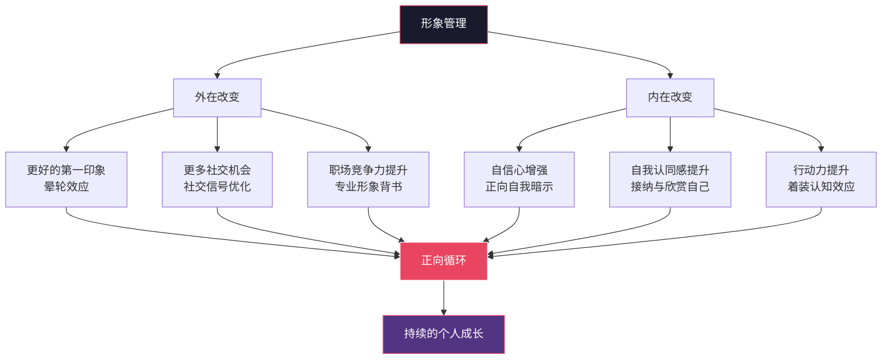
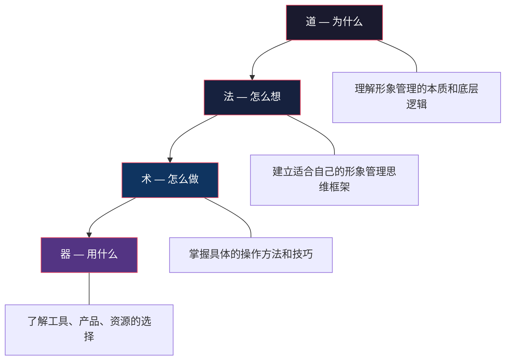
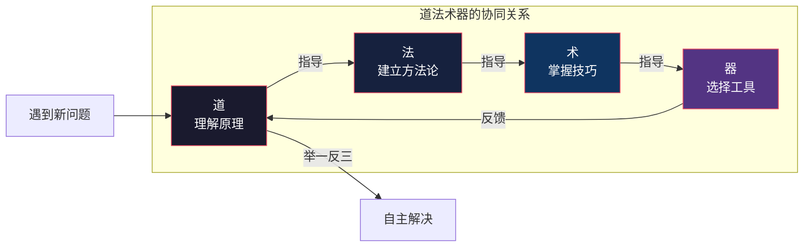
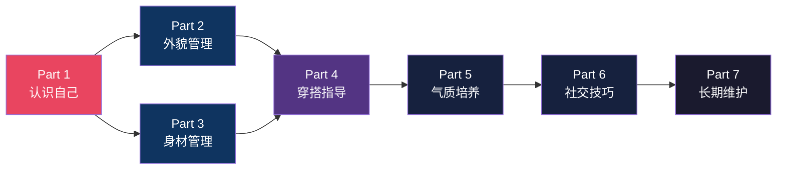
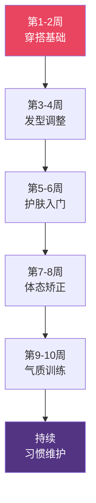

# 前言：从"还行"到"有型"，你只差一套系统方法

## 你可能正在经历这些

每天早上对着镜子，你是否总觉得哪里不太对——头发怎么弄都塌，衣服怎么搭都差那么一点，拍出来的照片永远不如别人好看？你试过在小红书上搜"男生穿搭"，结果发现博主的身材和你完全不同；你试过照着推荐买了一堆护肤品，用了一个月皮肤反而更差了；你甚至试过花大价钱去理发店，出了门就打回原形。

刷社交媒体的时候，你是否看到过这样的同龄人：同样的身高、差不多的长相，但人家就是看起来干净、精神、有型？你心里清楚，自己和他们之间差的不是基因，而是某些你还没学到的"门道"。

或者更现实一点——以下这些场景，你经历过几个？

**职场场景**：面试前临时买了一件"看起来正式"的衬衫，穿上后总觉得别扭，袖口太长遮住了手表，领口松垮显得没精神。走进会议室，看到竞争对手笔挺的西装和恰到好处的发型，你突然觉得自己像个偷穿大人衣服的小孩。

**社交场景**：朋友聚会拍照时，你下意识地躲到最后一排；公司团建合影发到群里，你第一件事是找自己——然后希望别人没注意到你那件洗得发白的T恤和油腻的刘海。

**约会场景**：相亲前手足无措，在衣柜前站了20分钟最后还是穿了那件灰色卫衣。到了餐厅发现对面的女生妆容精致、穿搭得体，你突然觉得自己是不是应该至少把领子翻好。

**日常场景**：拍证件照时被自己的形象吓了一跳——"我平时就长这样？"去商场买衣服，导购推荐什么都说"还行"，最后拎回家的永远是黑色和灰色。夏天不敢穿短袖，因为手臂太细；冬天不敢脱外套，因为肚子凸出来。

**家庭场景**：过年回家被亲戚说"怎么又胖了/怎么这么邋遢"，嘴上不在意，心里却开始犯嘀咕。父母催你找对象，你心想"就我这形象，找到也留不住"。

如果你有任何一个瞬间产生了共鸣，那么这本书就是为你写的。

不是因为你"不够好"，而是因为**你还没找到适合自己的方法**。形象管理不是天赋，而是一门可以学会的技能——就像开车、做饭、写代码一样，有原理、有方法、有步骤、有工具。一旦你掌握了这套系统，你会发现"变精神"这件事，比你想象的简单得多。

## 为什么男性更需要"形象觉醒"

### 被忽视的男性形象教育

在中国社会，男性形象管理长期处于一种尴尬的境地——女性从小就被教导如何打扮、如何护肤、如何搭配衣服，有无数的杂志、博主、课程为她们提供指导。而男性在这方面的教育几乎是空白。一个男生如果花太多时间在外表上，甚至可能被嘲笑"娘"或"不务正业"。

这种文化惯性造成了一个荒诞的现象：中国男性每年在护肤上的平均消费不到女性的十分之一，但男性皮肤问题的发生率（痤疮、脂溢性皮炎、毛孔粗大）却并不比女性低。不是没有需求，而是没有被教育过"这也是需要关注的事"。

但现实已经变了。

### 三大维度：为什么形象管理是刚需而非虚荣

#### 职场维度：你的形象就是你的简历封面

LinkedIn 2024年的一项调研显示，形象得体的求职者获得面试机会的概率比不注重形象者高出30%。哈佛商学院的研究进一步指出，在同等能力条件下，外在形象往往成为决定性的"软因素"——尤其在需要客户接触、团队管理、公开演讲的岗位上。

这不是不公平，这是人类认知的底层机制。心理学中的**晕轮效应**（Halo Effect）早在1920年代就被心理学家Edward Thorndike提出并验证：人们会不自觉地将一个人的某个正面特质（比如外在形象好）泛化到其他特质上——认为他更聪明、更可信、更有能力。后续的大量研究反复证实了这一效应在招聘、晋升、商务合作中的显著影响。

举一个具体的例子：假设你去见客户，穿着皱巴巴的衬衫和运动鞋，对方的第一反应不是"这人不拘小节"，而是"这人做事可能也不够认真"。你还没开口介绍方案，就已经在对方心里丢了分。反过来，如果你的形象专业、得体，对方会默认你"准备充分、值得信赖"——这就是晕轮效应的正向作用。

#### 社交维度：0.1秒决定第一印象

普林斯顿大学心理学家 Janine Willis 和 Alexander Todorov 在2006年发表的经典研究表明，人们在看到一张面孔的**0.1秒**内就会形成信任度、能力和亲和力的判断。更关键的是，后续延长观看时间并没有显著改变这些第一印象——0.1秒的判断和更长时间思考后的判断高度一致。

这意味着，在你开口说话之前，你的形象已经替你"说"了很多。你的发型、肤色、穿着、体态，都在无声地向对方传递信息："我是一个什么样的人"。

这不是让你焦虑，而是让你意识到：**形象管理是一种社交语言**。就像你会注意说话的措辞和语气一样，你也需要学会管理自己这门"无声的语言"。

#### 自我认知维度：外在改变会反向重塑内在

当你觉得自己看起来不错时，你的自信心、行动力甚至思维方式都会发生变化。这不是鸡汤，这是有实验证据的心理学现象。

2012年，西北大学Kellogg管理学院的Adam Galinsky和Hajo Adam发表了一项开创性研究，提出了**着装认知**（Enclothed Cognition）的概念。实验发现：穿上白大褂（被告知是医生的白大褂）的学生在注意力测试中的表现显著优于穿便装的学生——即使白大褂是同一件。关键不在于衣服本身，而在于穿着者对这件衣服的**象征意义的认知**。

换句话说，当你穿上一套合身的、你认为"得体"的衣服时，你不仅外表变了，你的内在状态也在悄然改变——你会更自信、更从容、更愿意主动社交。这种改变是真实的，不是心理安慰。

**这个正向循环一旦启动，就会自我强化**：形象改善→获得正面反馈→自信心提升→更愿意尝试→进一步改善。这也是为什么很多完成形象改造的人会说"早知道这么简单，我早就开始了"——难的不是过程，而是迈出第一步。

## 这本书和其他"形象指南"有什么不同

市面上关于男性形象的书籍和内容并不少，从时尚杂志到短视频博主，从知乎回答到小红书笔记，信息量巨大。但大多数内容存在以下问题：

| 问题维度 | 常见内容的做法 | 本书的做法 |
|---------|--------------|-----------|
| **深度不足** | "注意穿搭""保持干净""选适合自己的发型"——正确但无用的废话 | 给出具体到产品型号、搭配公式、操作步骤、量化的方案 |
| **千人一面** | 一套方案适用于所有人，不考虑个体差异 | 基于个人特征（脸型、体型、肤质、发质、预算）定制化指导 |
| **割裂式讲解** | 穿搭归穿搭，护肤归护肤，健身归健身，互不关联 | 从整体形象出发，打通外貌→身材→穿搭→气质的完整链路 |
| **只讲"术"不讲"道"** | 告诉你怎么做，不告诉你为什么，换个场景就不会了 | 道法术器贯通，理解原理后你才能举一反三，灵活应变 |
| **脱离国情** | 照搬欧美审美标准和产品推荐，和中国男性的实际情况脱节 | 针对中国男性特征（发质偏硬/偏软、脸型特点、肤色冷暖、体型比例）专门设计 |
| **忽视成本** | "买这件2000块的外套就好了"——仿佛钱不是问题 | 提供从0元到高配的多档预算方案，让每个人都能找到适合自己的路径 |
| **缺乏验证** | 推荐全凭个人经验或主观审美，没有数据和理论支撑 | 每个建议都有科学依据或实证数据支撑，可溯源、可验证 |

**本书的定位很明确：这不是一本让你"变帅"的书，而是一本让你"变精神"的书。**

"帅"是基因决定的，但"精神"、"干净"、"得体"、"有型"——这些是每个人都可以通过学习和实践获得的。一个普通身高的男生，完全可以通过合理的穿搭比例、清爽的发型和得体的仪态，展现出远超身高的个人魅力。这不是安慰，这是事实——你身边一定有这样的人。

## 本书的科学基础

本书不是一本"时尚博主的经验分享"，而是一本建立在多学科知识基础上的系统指南。以下是你在阅读过程中会频繁接触到的几个核心学科：

### 色彩学：穿对颜色比穿贵衣服重要10倍

色彩学是穿搭的底层操作系统。每个人都有适合自己的色彩范围——这由你的肤色冷暖、明度、对比度决定。穿对颜色，你的肤色会显得更健康、更有气色；穿错颜色，再贵的衣服也显得廉价。

本书会教你如何判断自己的色彩类型（冷皮/暖皮/中性皮），以及如何基于色彩理论构建自己的衣橱色盘。这不是玄学，而是基于色彩学中的**补色对比**、**邻近色协调**、**明度对比**等经过验证的原理。

### 人体工程学：比例比身高重要

为什么有些人170cm看起来像180cm，而有些人180cm看起来只有175cm？关键在于**视觉比例**。人体工程学和视觉心理学告诉我们，人眼对"比例"的感知远比对"绝对尺寸"的感知敏感。

本书会教你如何通过穿搭调整视觉比例——比如腰线位置对身高的影响、上下装颜色分割对体型的修饰、鞋型对整体比例的改变。这些不是"穿搭技巧"，而是经过视觉心理学验证的原理。

### 皮肤科学：护肤不是玄学

大多数男性对护肤的认知停留在"洗脸→涂东西"，对产品的选择全靠广告和博主推荐。但皮肤是人体最大的器官，有自己的生理机制——皮脂腺分泌、角质层代谢、皮肤屏障功能、炎症反应，每一个环节都有对应的科学护肤策略。

本书不会推荐"网红产品"，而是会教你理解皮肤的运作原理，然后基于原理选择适合自己的产品和流程。理解了原理，你就不需要再依赖任何人的推荐——你自己就是最好的护肤顾问。

### 行为心理学：习惯比意志力可靠

形象管理最大的挑战不是"不知道怎么做"，而是"坚持不下去"。行为心理学中的**习惯回路理论**（Charles Duhigg）、**微习惯策略**（BJ Fogg）、**环境设计原理**（Richard Thaler），为建立可持续的形象管理习惯提供了科学框架。

本书在每个模块的最后都会设计"习惯锚点"——将新的行为嵌入你已有的日常流程中，让形象管理变成像刷牙一样自然的事，而不是每天需要"想起来才能做"的额外任务。

## 本书的核心理念：道法术器

本书的内容按照"道法术器"四层结构组织，这是中国传统智慧中理解任何领域的完整框架。大多数人学习形象管理时只关注"术"（具体技巧），而忽略了其他三层，导致学到的东西零散、不可迁移、遇到新问题就不知道怎么办。

### 道（原理层）—— 为什么这样做有效

"道"解决的是**底层逻辑**问题。为什么某些穿搭显高？为什么油性皮肤要补水而不是控油？为什么颧骨较明显的人不适合把头发全部往后梳？为什么深色显瘦不只是"视觉错觉"而是有色彩学原理支撑的？

理解底层原理，你才能在遇到新问题时自己找到答案，而不是永远依赖别人告诉你怎么做。举个例子：如果你只知道"穿V领显瘦"，那遇到一件V领但花纹夸张的毛衣你就不知道该不该买了；但如果你理解"V领通过形成纵向视觉引导线来拉长颈部和躯干的视觉比例"，你就能自己判断——V领的深浅、宽度、搭配方式，都会影响最终效果。

**本书在每一个技巧背后都会解释原理**。不是为了凑字数，而是为了让你获得"举一反三"的能力。

### 法（方法论层）—— 用什么思路去想

"法"解决的是**思维框架**问题。如何系统地评估自己的形象现状？如何制定改善优先级？如何在有限的预算内做最优分配？如何建立一套可持续的形象管理体系？

很多人不是不想改变，而是不知道从哪里开始。面对海量的信息（该先护肤还是先换发型？该先买衣服还是先健身？），陷入了选择瘫痪。

本书提供的方法论框架包括：

- **个人形象诊断法**：通过系统化的自评流程，精准定位你当前最大的3个改善空间
- **投入产出比排序法**：用"改变成本×可见度×持久度"三维度评估每个改善项的优先级
- **渐进式改变策略**：避免"大换血"式的冲动改变，用最小可行改变（MVC）逐步推进
- **形象管理闭环**：诊断→计划→执行→反馈→调整的持续优化循环

### 术（实操层）—— 具体怎么操作

"术"解决的是**具体执行**问题。洗头的正确手法是什么？衬衫袖口应该露出西装几厘米？面试穿搭的完整检查清单有哪些？修眉应该从哪里开始？

每一个"术"都附带详细的操作说明、步骤图解、常见错误提示，确保你可以直接照做。不会出现"注意保持干净整洁"这种正确的废话——而是会告诉你"每天早上出门前用这5个步骤做30秒快速自检"。

本书的"术"分为三个层级：

| 层级 | 说明 | 示例 |
|------|------|------|
| **基础术** | 必须掌握的基本功 | 正确的洗脸手法、衬衫的正确穿法、基本色彩搭配 |
| **进阶术** | 提升品质感的技巧 | 如何卷袖口、如何选眼镜框型、如何做简单的发型定型 |
| **高阶术** | 展现个人风格的方法 | 如何混搭不同风格、如何用配饰提升辨识度、如何在正式场合穿出个人特色 |

### 器（工具层）—— 用什么东西来实现

"器"解决的是**工具选择**问题。具体买什么品牌的洗面奶？什么价位的吹风机性价比最高？用什么APP来记录穿搭？在哪些平台买东西最划算？

我们不会只说"买一瓶好的洗面奶"，而是会告诉你具体到品牌、型号、价格区间、适合肤质、购买渠道、使用方法。每个产品推荐都附带**替代方案**——如果买不到或预算不够，还有哪些同样有效的选择。

**特别强调**：本书推荐的所有产品都是基于成分分析和性价比评估，而非广告合作。我们还会标注产品的适用场景和禁忌，避免你花冤枉钱。

**为什么四层缺一不可？**

- 只有"道"没有"术"：你知道原理但不会操作，纸上谈兵
- 只有"术"没有"道"：你会操作但不理解原理，换个场景就懵了
- 只有"器"没有"法"：你买了一堆好东西但不知道怎么用，浪费钱
- 只有"法"没有"器"：你有思路但不知道用什么工具，执行不了

四层贯通，你才能做到：**面对任何新的形象问题，都能自己诊断→分析→制定方案→选择工具→执行→反馈调整**。这才是真正的"学会了"。

## 本书的完整内容地图

全书分为七大板块，覆盖个人提升的完整链条。建议按照以下顺序阅读，但每个板块也可以独立使用——如果你急需解决某个具体问题，可以直接跳到对应板块。

### Part 1 · 认识自己 —— 一切改变的起点

个人提升的起点不是"改变"，而是"了解"。你将学会如何科学地评估自己的面部特征、身材比例、肤质类型、发质特点，建立属于自己的**"个人形象档案"**。

这一部分包括：脸型自测（五角形、圆形、椭圆形等8种脸型的特征与判断方法）、体型分类（肩宽/腰围/臀围的比例关系）、肤色冷暖判断（金银饰品测试法、血管颜色测试法）、发质评估（粗硬/细软/塌软/自然卷等）、肤质诊断（干性/油性/混合性/敏感性）。完成这部分后，你会得到一份精确的"个人参数表"，后续所有章节的建议都会基于你的个人参数来定制。

**这是全书最重要的部分**——跳过这部分直接学穿搭或护肤，就像不做体检直接吃药，大概率会走弯路。

### Part 2 · 外貌管理 —— 颜值的80%可以后天改变

从发型设计到面部护理，从眉毛修整到胡须造型。针对中国男性常见的面部特征（如面部轮廓分明、下巴偏短、发质粗硬/细软塌等），提供系统性的解决方案。

重点内容包括：发型设计（根据脸型选择发型、如何和理发师沟通、日常打理技巧）、护肤全流程（从洁面到防晒的完整步骤、不同肤质的产品选择、痤疮/黑头/毛孔粗大的针对性方案）、眉毛修整（自然修眉法、避免"修坏了"的安全区域）、胡须管理（留还是不留、如何修剪、造型产品选择）。

**特别亮点**：每个方案都会标注"适合的脸型/肤质/发质"，避免千人一面的错误推荐。

### Part 3 · 身材管理 —— 不是变健身模特，是找到最佳状态

不是让你变成健身模特，而是帮你找到适合自己体型的最佳状态。包括科学的健身计划（不需要健身房，在家就能做的训练）、饮食方案（增肌/减脂/维持的不同策略）、体态矫正（圆肩驼背/骨盆前倾/头前伸的改善方法），以及如何通过穿搭"扬长避短"。

**关键理念**：身材管理的目标不是追求某个数字（体重、体脂率），而是追求**视觉比例的和谐**。一个普通身高但体态挺拔、比例协调的人，视觉效果远好于一个175cm但圆肩驼背、腹部突出的人。

### Part 4 · 穿搭指导 —— 最快见效的形象提升手段

从色彩理论到风格定位，从日常通勤到正式场合，从预算有限到品质升级。掌握穿搭的底层逻辑后，你将不再需要"抄作业"，而是能够自己搭配出得体的造型。

核心模块包括：色彩搭配（冷暖色判断→个人色彩类型→衣橱色盘构建→配色公式）、风格定位（商务/休闲/运动/混搭等风格的特征与适用场景）、场合着装（面试/约会/商务/日常/运动等不同场合的穿搭规范）、衣橱管理（必备单品清单、断舍离原则、一衣多穿技巧）、预算方案（500元/2000元/5000元三档预算的完整衣橱方案）。

**这是"投入产出比"最高的部分**——大多数人花1-2周学习穿搭，就能获得立竿见影的形象提升。

### Part 5 · 气质培养 —— 最难模仿也最持久的个人魅力

气质是最难模仿也最持久的个人魅力。这部分涵盖仪态训练（站姿/坐姿/走姿的正确方式）、表情管理（自然微笑/眼神交流/避免负面表情）、声音优化（语速/音量/语调的调整）、肢体语言（手势/距离/开放性姿态），以及如何在细节中展现从容与自信。

**核心认知**：气质不是"装"出来的，而是通过训练正确的身体习惯，让好的仪态成为你的自然状态。就像学开车一样，一开始需要注意力集中，但熟练后就变成了本能。

### Part 6 · 社交技巧 —— 形象管理的终极目的

形象管理的终极目的是建立更好的人际关系。这部分涵盖沟通表达（如何开启对话/维持话题/优雅结束）、社交礼仪（各种场合的行为规范）、网络形象管理（头像/朋友圈/社交媒体的个人形象维护）、以及如何在各种社交场合中游刃有余。

**特别说明**：这部分不是教你"社交套路"，而是帮你建立真诚、得体的社交风格。好的形象管理最终服务于好的人际关系——这是整个链条的闭环。

### Part 7 · 长期维护 —— 让好习惯成为你的默认状态

个人提升不是一次性工程。这部分帮你建立可持续的日常习惯体系（晨间/晚间形象管理流程）、定期自检机制（每月/每季度的形象复盘方法）、衣橱更新策略（季节更替/身材变化/风格演进时的调整方法），以及应对倦怠和瓶颈期的策略。

**目标**：让形象管理从"需要刻意做的事"变成"自然发生的事"。

## 本书的读者画像

本书的核心读者是**20-35岁的中国男性**，特别是以下几类人群：

### 画像一：形象管理新手

**特征**：从未系统地关注过自己的外在形象，衣橱以黑白灰为主，护肤停留在"用清水洗脸"阶段。可能是被某个事件触发（面试失败、被分手、看到自己的照片）才意识到"该做点什么了"。

**本书如何帮助你**：从零开始，手把手带你入门。不需要任何前置知识，所有概念都会解释清楚，所有步骤都会详细拆解。

### 画像二：有改善意愿但不知从何下手的人

**特征**：你可能已经尝试过一些改变（换过发型、买过新衣服、跟风买过护肤品），但总觉得效果不理想，或者坚持不下来。你困惑的是："为什么我做了这么多改变，还是没什么效果？"

**本书如何帮助你**：帮你找到问题的根源——通常是方向错了（做了不适合自己的改变）、方法错了（执行细节不到位）、或者优先级错了（在低回报的事情上花了太多精力）。

### 画像三：面临关键场合的人

**特征**：你有一个具体的、有时限的需求——面试、相亲、晋升答辩、重要商务活动、婚礼出席。你需要在短期内展现出最佳状态。

**本书如何帮助你**：直接跳到"场合着装"和"气质速成"部分，获得最直接的行动方案。配合"快速通道"阅读路径，2-3小时就能获得实用的改善方案。

### 画像四：追求长期成长的人

**特征**：你不满足于"临时抱佛脚"，而是希望建立一套可持续的形象管理体系，让它成为你个人竞争力的一部分。你理解形象管理是一个长期工程，愿意投入时间和精力。

**本书如何帮助你**：提供完整的系统框架——从个人诊断到长期维护的全流程。帮你建立习惯体系，让形象管理成为你生活的一部分，而不是额外的负担。

### 画像五：想要理解"为什么"的人

**特征**：你不喜欢盲目跟风，想要理解每个建议背后的原理。你不满足于"这样做"，你更想知道"为什么这样做"以及"如果不这样做会怎样"。

**本书如何帮助你**：本书的"道法术器"结构正是为你设计的。每个技巧都会解释原理，让你不仅知其然，更知其所以然。

> **特别说明**：本书以一位典型中国年轻男性为蓝本进行深度定制——中等身材、55开身材比例、面部轮廓分明的脸型、塌软发质、中性偏微油肤质。这些特征具有高度代表性，涵盖了中国男性最常见的一些形象困扰。你不需要完全匹配这些特征也能从本书中获益——核心方法论是通用的，具体参数可以根据你自己的情况调整。
>
> 在每一章中，我们会用"[蓝本]"标记出基于这位读者具体情况的定制方案，用"[通用]"标记出适用于所有人的通用建议。你可以根据自己的情况灵活参考。

## 写这本书的初衷

坦白说，写这本书的过程本身就是一次"形象觉醒"。

最初的动力很简单——作为一位身高普通身高、体重正常体重的普通男性，我长期处于一种"知道自己该改变，但不知道怎么改"的状态。试过各种零散的方法：跟风买过衣服（大部分压箱底了）、盲目用过护肤品（踩过不少雷）、换过无数发型（满意的屈指可数）。

转折点出现在我开始系统性地研究这些领域之后。我发现：**形象管理和编程一样，是有原理、有体系、有最佳实践的**。一旦你掌握了底层逻辑，零散的知识就会自动组织成体系，混乱的尝试就会变成有序的行动。

更让我惊讶的是，这些知识在中国男性群体中的普及率极低。我的朋友们——都是受过高等教育的聪明人——在形象管理上的认知水平，可能还不如一个高中女生。不是因为笨，而是因为没有人系统地教过他们。

所以我想写一本"给男性看的形象管理教科书"——不是时尚杂志那种浮光掠影的推荐，而是一本真正有深度、有体系、可操作的系统指南。一本你读完之后，不需要再看任何其他形象管理类内容的书。

**如果你读完这本书后，发现自己不再需要依赖任何人的穿搭建议，不再为"今天穿什么"而焦虑，不再在护肤品货架前无从选择——那就是我最大的成就感。**

## 阅读指南：怎么用这本书最高效

### 三种阅读路径

根据你的时间和需求，可以选择不同的阅读方式：

| 路径 | 适合人群 | 阅读内容 | 预计时间 | 预期收获 |
|------|---------|---------|---------|---------|
| **快速通道** | 时间紧迫，需要立刻见效 | Part 1（认识自己）+ Part 4（穿搭指导）中的基础章节 | 2-3小时 | 掌握基本穿搭逻辑，获得可立即执行的改善方案 |
| **标准路径** | 想要全面提升 | 按顺序读 Part 1→Part 5，跳过 Part 6-7 | 1-2周 | 系统掌握外貌、身材、穿搭、气质四大板块 |
| **深度研修** | 追求系统性成长 | 全书通读 + 每章末尾的实践任务 | 4-8周 | 完整的形象管理体系，可持续的个人提升习惯 |

**建议**：如果你不确定选哪条路径，从"快速通道"开始。完成后再决定是否继续深入。好处的改变往往是从一个小小的成功开始的。

### 实践优先原则

**这本书不是用来"读"的，是用来"做"的。**

每一章的末尾都有"行动清单"，列出了你可以立即执行的具体步骤。建议你遵循以下实践原则：

#### 1. 先拍照记录——建立你的"形象基线"

在开始任何改变之前，拍一组对比用的基础照片。这是最重要也最容易被忽略的一步。

**拍照要求**：
- 光线：自然光（白天靠窗），避免顶光和逆光
- 角度：正面、左右45度侧面、左右90度侧面
- 范围：面部特写、半身、全身
- 穿着：纯色贴身衣物（方便观察体型）
- 表情：自然放松，不笑不皱眉

拍完后存到一个专门的相册里，三个月后你会感谢现在的自己——对比照是最直观的进步证明。

#### 2. 一个模块一个模块来——避免"全面改变"的陷阱

不要试图同时改变所有方面。心理学研究表明，同时改变多个习惯的成功率不到5%，而逐个改变的成功率超过40%。

**推荐的改变顺序**：

先从最能立竿见影的部分开始（通常是穿搭和发型），建立信心后再逐步拓展到护肤、体态、气质等需要更长时间见效的领域。

#### 3. 建立"形象日记"——记录是最好的强化

每天花2分钟记录自己的穿搭、护肤、或当天学到的一个小技巧。不需要长篇大论，几个关键词就够了。

**记录模板**：
日期：
今日穿搭：（上衣/裤子/鞋子/配饰）
护肤流程：（做了什么，用了什么产品）
今日收获：（学到的一个新知识/一个改变）
他人反馈：（如果有）
自评打分：1-10分

记录本身是最好的强化——它让你对自己的改变保持觉察，也方便你回顾哪些改变效果好、哪些需要调整。

#### 4. 找到反馈机制——旁观者的眼睛很重要

找一个你信任的朋友或家人，定期让他们给你真实的反馈。镜子和照片会有盲区——你已经习惯了自己镜子里的样子，很多变化你自己注意不到。

**如何获取有效反馈**：
- 不要问"我看起来怎么样？"（太笼统，大多数人会礼貌地说"挺好的"）
- 要问具体的："你觉得我今天这个发型和上周比，哪个更好？""这件衬衫的颜色让我看起来气色好吗？"
- 最好找1-2个固定的"形象顾问"，他们能更准确地追踪你的变化

### 工具准备清单

在开始之前，建议准备以下基础工具：

| 类别 | 必备项 | 推荐项 | 说明 |
|------|--------|--------|------|
| **测量工具** | 体重秤、软尺 | 体脂秤、皮尺 | 软尺用于量肩宽/胸围/腰围/臀围，是穿搭参考的基础数据 |
| **记录工具** | 手机（拍照记录） | 三脚架/自拍杆、全身镜 | 全身镜用于日常自检，三脚架用于拍对比照 |
| **基础护肤** | 洁面乳、保湿霜、防晒霜 | 精华液、眼霜 | 防晒霜不是可选项，是必需品——紫外线是皮肤老化的首要原因 |
| **基础造型** | 梳子、吹风机 | 发蜡/发泥、定型喷雾 | 吹风机是被严重低估的造型工具，比任何发蜡都重要 |
| **镜子** | 普通镜子 | 全身镜、带灯化妆镜 | 带灯化妆镜可以帮你更准确地观察肤质和妆容细节 |
| **收纳工具** | — | 衣架（统一款式）、收纳盒 | 统一的衣架让衣橱看起来更整洁，也更容易挑选搭配 |

## 常见疑问与误区

在开始之前，让我们先回应几个你可能会有的疑问和误区。

### 疑问一："形象管理是不是就是打扮？会不会太肤浅？"

形象管理不是"打扮"，而是**管理你在他人眼中的第一印象**。就像你不会觉得"写一份好的简历"是肤浅的——简历是你的文字形象，而外在形象是你的视觉形象。两者都是沟通工具，都需要认真对待。

更深层地说，形象管理的本质是**自我管理**。它需要你了解自己、制定计划、持续执行、接受反馈、不断调整——这些能力在任何领域都是通用的。

### 疑问二："我又不是明星/模特，有必要这么讲究吗？"

恰恰相反——明星和模特有专业的造型团队，他们不太需要自己懂形象管理。而普通人没有这个条件，所以更需要自己掌握这套技能。

你不需要"讲究"到明星的程度，你只需要做到"得体"——在不同的场合展现适合的形象。面试时穿得专业，约会时穿得精神，日常时穿得干净。这不是讲究，是基本功。

### 误区一："买贵的衣服就等于穿得好"

价格和得体之间没有必然关系。一件500元但合身的衬衫，效果远好于一件2000元但不合身的衬衫。本书会教你如何用有限的预算穿出最好的效果——关键不是花多少钱，而是花对多少地方。

### 误区二："护肤是女生的事"

皮肤不分男女。紫外线对男性皮肤的伤害和女性一样大，痤疮在男性中的发病率甚至高于女性（因为雄性激素促进皮脂分泌）。护肤不是"女性化"的行为，而是基本的健康维护——就像刷牙一样，不分性别。

### 误区三："我底子太差，改变不了"

形象管理中，"底子"的影响远没有你想象的大。发型可以改变脸型的视觉效果，穿搭可以改变身材的视觉比例，护肤可以改善肤质，仪态可以改变气质。你以为的"底子差"，很多时候只是"没找对方法"。

本书的蓝本读者——普通身高、正常体重、方形脸、塌软发质——如果按传统审美标准来看，"底子"并不算好。但通过系统的方法，完全可以展现出干净、精神、有型的状态。这不是安慰，是可验证的事实。

### 误区四："形象管理就是追求时尚"

时尚是变化的，得体是永恒的。本书不教你追潮流——潮流来得快去得也快，今天流行的明天可能就过时了。本书教你的是**不变的底层原理**：色彩协调、比例和谐、场合适宜、个人特色。掌握了这些，你不需要追任何潮流，就能持续保持得体的形象。

## 关于"变好"这件事的几句真心话

最后，想和你聊几句可能会有点"鸡汤"但确实很重要的话。这些都是我在自己的形象管理旅程中，踩过坑之后的真实感悟。

**改变不需要"脱胎换骨"**。很多人一提到形象管理就想到整容、健身、大换血式的衣橱清理。但实际上，最有效的改变往往是细微的——把衬衫袖口多露一厘米、把刘海换个方向梳、把运动鞋换成一双干净的皮鞋、把弯着的背挺直一点。这些微小的调整积累起来，就是质的变化。

有一个心理学概念叫**"微调效应"**（Nudge Effect）：微小的、低成本的改变，往往能带来不成比例的巨大回报。形象管理中最有效的策略不是"大刀阔斧的改革"，而是"持续的微调"。

**不要追求"完美"**。完美是行动的敌人。你不需要变成吴彦祖或彭于晏，你只需要比昨天的自己好一点。个人提升是一场马拉松，不是百米冲刺。给自己留出犯错的空间——试错本身就是学习的一部分。

**警惕消费主义陷阱**。形象管理不等于买买买。在你还不了解自己需要什么之前，冲动消费大概率会浪费钱。本书会教你"先诊断再开药"，确保每一分钱都花在刀刃上。一个好的形象管理体系，反而能帮你省钱——因为你不再需要买一堆用不上的东西。

**保持耐心**。皮肤的新陈代谢周期是28天，发型的留长和调整需要2-3个月，体态的改变需要持续的训练4-8周，穿搭风格的确立需要反复尝试。给自己至少3个月的时间，你会看到明显的变化。

**不要和别人比，和昨天的自己比**。每个人的起点不同、资源不同、基因不同，横向比较毫无意义。唯一有意义的比较是：今天的你和昨天的你。

**这是一场值得的投资**。时间、精力、甚至金钱——投入到形象管理上的回报，远超你的预期。它不仅影响你的社交和职场，更影响你的自我认知和生活品质。当你开始认真对待自己的形象，你会发现你也在认真对待生活的其他方面——这是一种连锁反应。

28岁，不早也不晚。你有足够的成熟去理解自己，也有足够的精力去改变自己。

接下来，让我们从认识自己开始。

***

*AI Guides · 2026年6月*
