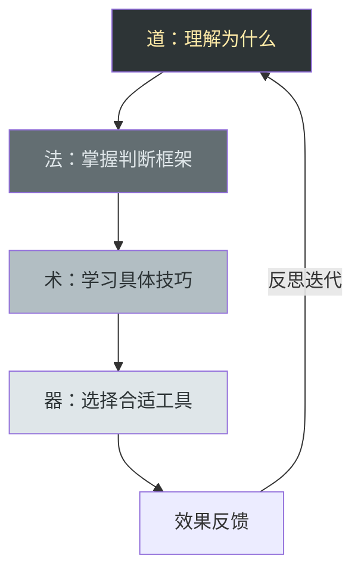
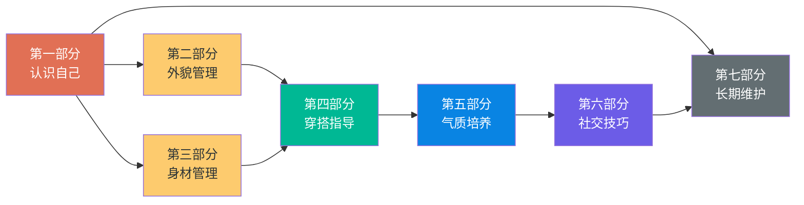
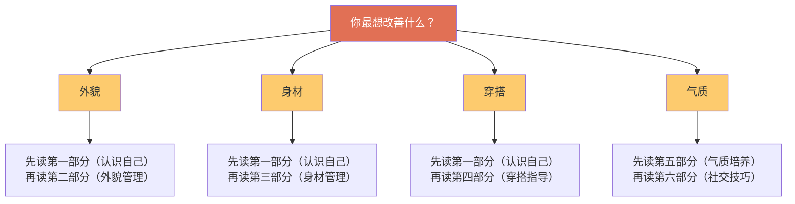
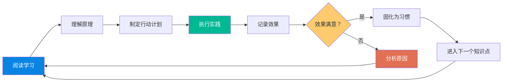

# 如何使用本书

> 工欲善其事，必先利其器。本章帮你建立正确的学习框架、制定个性化路线图、掌握高效的学习方法——让你投入的每一分钟都产生最大回报。

## 阅读导航：本章解决什么问题

大多数人拿到一本自我提升类书籍后的反应是：从头翻到尾，挑几条看起来有用的技巧记下来，然后……就没有然后了。这本书不希望你成为那样的读者。

本章是一份"使用说明书"，它的作用类似于导航App——你不需要背下所有路线，但你需要知道：起点在哪、终点在哪、有哪些路线可选、路上会遇到什么障碍。读完本章后，你将获得：

- **一套认知框架**：理解本书"道法术器"四层架构的底层逻辑，知道为什么要从"道"开始而不是直接跳到"术"
- **一份精准的起点**：通过自评量表量化你当前的状态，找到最值得优先投入的领域
- **一条最优路线**：根据你的时间和需求，从三条阅读策略中选择最适合你的那条
- **一个执行系统**：从"知道"到"做到"的完整闭环——基准线、计划、追踪、复盘
- **一组避坑指南**：前人踩过的坑，你不必再踩一遍

**建议阅读时间**：20-30分钟。这不是需要精读的章节，但它决定了你后续所有章节的阅读效率。花30分钟读这里，能为你后续节省30小时的无效阅读。

## 本书的底层逻辑：道法术器四层架构

本书不是一本零散的"变美小贴士合集"，而是一套完整的个人提升系统。所有内容按照"道法术器"四层架构组织，每一层都不可或缺：

| 层级 | 含义 | 本书对应内容 | 为什么重要 | 缺失的后果 |
|------|------|-------------|-----------|-----------|
| **道** | 核心理念与价值观 | 认识自己、审美哲学、自信内核 | 没有正确的"道"，再多技巧也是空中楼阁 | 方向错误，越努力越偏离 |
| **法** | 方法论与策略框架 | 脸型分析体系、色彩理论、身材分类法 | "法"给你判断标准，让你能独立决策 | 永远依赖别人告诉你答案 |
| **术** | 具体技巧与操作 | 发型打理步骤、护肤流程、穿搭公式 | "术"是日常执行层，直接产出效果 | 知道原理但不知道怎么做 |
| **器** | 工具与产品 | 具体产品推荐、APP工具、测量工具 | "器"是效率放大器，选对工具事半功倍 | 方法正确但效率低下 |

大多数人的问题是：只想要"术"和"器"——"告诉我用什么产品、穿什么衣服"。但没有"道"和"法"的支撑，你会永远依赖别人告诉你答案，无法形成自己的审美判断力。

**正确使用本书的方式**：从"道"开始理解，用"法"建立框架，再用"术"和"器"落地执行。跳过前两层直接看技巧，你会发现自己记了一堆零散知识点，但遇到新情况就不知道怎么办了。

### 道法术器的实际应用示例

为了让你更直观地理解这四层如何运作，以"选择发型"为例：

| 层级 | 在"选发型"中的体现 | 具体内容 |
|------|-------------------|---------|
| **道** | 理解发型的作用 | 发型的核心功能是调整视觉脸型比例，而非单纯"好看"。每个人的脸型有优势区域和劣势区域，发型的作用是放大优势、弱化劣势 |
| **法** | 掌握判断框架 | 学习脸型分类（椭圆/方/圆/长/菱形/五角形），理解"视觉平衡"原则——脸宽则两侧收窄、脸长则降低高度、颧骨宽则增加头顶蓬松度 |
| **术** | 学习具体操作 | 掌握吹风机倒吹发根技巧、发泥的正确用量和涂抹方式、分线位置的选择逻辑 |
| **器** | 选择合适工具 | 选择1600W以上带风嘴的吹风机、哑光发泥（避免油腻感）、蓬松喷雾（针对发根塌软） |

如果你只有"器"——买了一堆造型产品但不知道为什么用、怎么用，结果就是每天早上在镜子前手忙脚乱。但如果你从"道"理解了发型的底层逻辑，即使手边只有一把普通吹风机，也能做出不错的效果。

## 本书的结构说明

《个人提升方案》共分七个部分，它们之间存在递进和依赖关系：

### 第一部分：认识自己（地基）

这是一切改变的起点。你必须先建立对自己的客观认知——不是主观感觉，而是基于可量化指标的系统分析。这部分教你如何进行面部特征分析（脸型轮廓、五官比例、骨骼结构）、身材比例测量（上下身比例、肩宽腰围比、体脂率）、皮肤类型判定（油脂分泌量、敏感度、色素沉着情况）、发质评估（粗细、软硬、头皮油脂水平）。

**为什么必须从这里开始**：没有准确的自我认知，后面所有建议都会跑偏。举个例子，很多男生觉得自己"脸大"，但"大"可能是颧骨宽、下颌角方、还是脂肪堆积——三种原因对应完全不同的解决方案。如果你不先搞清楚原因，就盲目去瘦脸，可能越搞越糟。

### 第二部分：外貌管理（表面功夫做到极致）

外貌是最直观的第一印象来源，也是投入产出比最高的改善领域。这部分涵盖发型设计（根据脸型、发质、头型选择发型，日常打理技巧）、面部护理（完整护肤流程、问题皮肤处理、抗初老策略）、面部修饰（眉毛修整、胡须造型、眼镜选择）、个人卫生（口腔护理、鼻毛管理、指甲修剪、体味控制）。

**投入产出比分析**：外貌管理是最容易在短期内看到效果的领域。一套正确的护肤流程，2-4周就能看到肤质改善；一个适合脸型的发型，当天就能看到变化。建议优先投入这部分。

### 第三部分：身材管理（内在健康与外在形象的统一）

身材管理的价值不仅在于好看，更在于健康和精力。这部分包含体型分析（外胚/中胚/内胚型判定）、力量训练计划（按部位拆分，从新手到进阶）、有氧运动方案（心肺功能提升、体脂控制）、营养策略（热量计算、宏量营养素分配、补剂选择）、体态矫正（圆肩驼背、骨盆前倾、头前伸等常见问题）。

**关键认知**：身材管理是所有提升中耗时最长的，但它也是最持久的。发型可以换、衣服可以买，但一副好身材需要数月甚至数年的持续投入。好消息是，身材改善的收益是复利式的——一旦建立习惯，维护成本远低于从零开始。

### 第四部分：穿搭指导（最高效的视觉改造）

穿搭是性价比最高的视觉改造手段。合适的穿搭可以在不改变任何身体特征的情况下，让视觉身高增加3-5厘米，视觉体重减少5-10斤。这部分教你色彩理论（冷暖色调判定、配色公式、场合用色）、风格定位（休闲/商务/街头/极简等风格画像）、体型穿搭法则（不同身材的款式选择策略）、购物指南（预算分配、品牌选择、面料鉴别、合身标准）。

### 第五部分：气质培养（从"好看"到"有魅力"的跃迁）

气质是一种无法用钱买到、无法用技术伪装的东西。它来自内在的自信和外在的修养。这部分涉及仪态训练（站姿/坐姿/走姿/手势的规范与练习）、表情管理（眼神交流、微笑训练、微表情控制）、声音训练（语速/语调/音量/咬字的优化）、自信建设（认知行为调整、社交焦虑应对、内在价值感建立）。

**气质与外貌的关系**：外貌决定第一印象，气质决定持久吸引力。一个外貌80分但气质60分的人，长期交往后的吸引力不如外貌60分但气质80分的人。气质是唯一能随年龄增长而增值的"资产"。

### 第六部分：社交技巧（让提升的效果被世界看见）

个人提升的终极目的是让你在社交场景中更加自信从容。这部分涵盖沟通能力（倾听技巧、话题掌控、幽默感培养）、社交礼仪（餐桌礼仪、职场礼仪、网络礼仪）、人际关系（交友策略、维护关系、处理冲突）、网络形象（社交媒体经营、头像选择、个人简介撰写）。

### 第七部分：长期维护与提升（可持续的成长系统）

个人提升不是一次性工程，而是终身的自我管理。这部分建立一套可持续的维护系统，包括习惯养成（行为设计学在日常习惯中的应用）、定期评估（建立量化指标体系，定期复盘）、持续学习（信息筛选、知识更新、审美进化）、应对瓶颈期（当进步停滞时的突破策略）。

### 各部分投入产出比速查表

不同部分见效速度和投入成本差异很大。下表帮你做出优先级决策：

| 部分 | 见效速度 | 持续投入 | 成本门槛 | 效果持久性 | 推荐优先级 |
|------|---------|---------|---------|-----------|-----------|
| 第一部分（认识自己） | 即时 | 一次性 | 零成本 | 永久 | ⭐⭐⭐⭐⭐ |
| 第二部分（外貌管理） | 1-4周 | 每天15-20分钟 | 低（200-500元） | 需持续维护 | ⭐⭐⭐⭐⭐ |
| 第三部分（身材管理） | 4-12周 | 每周3-5小时 | 低-中（0-300元/月） | 高（习惯化后维护成本低） | ⭐⭐⭐⭐ |
| 第四部分（穿搭指导） | 即时 | 碎片时间 | 中（1000-3000元） | 高（审美一旦建立不会丢失） | ⭐⭐⭐⭐ |
| 第五部分（气质培养） | 2-8周 | 每天10-15分钟 | 零成本 | 极高（随年龄增值） | ⭐⭐⭐⭐ |
| 第六部分（社交技巧） | 2-4周 | 社交场景中练习 | 零成本 | 高 | ⭐⭐⭐ |
| 第七部分（长期维护） | 贯穿全程 | 每周30分钟复盘 | 零成本 | 永久 | ⭐⭐⭐⭐⭐ |

## 你在哪里：自我诊断清单

在开始学习之前，先花10分钟完成这份自评。这不是让你自我批评，而是帮你建立清晰的起点——有起点才能衡量进步。

**自评的正确心态**：这份清单的目的不是打分然后自我否定，而是"定位"。就像GPS需要知道你的当前位置才能规划路线一样，你需要知道自己在哪个阶段，才能选择最高效的提升路径。诚实面对现状是改变的第一步，给自己打"人情分"只会浪费你的时间。

### 面部与外貌自评

| 评估维度 | 1分（需大幅改善） | 3分（中等水平） | 5分（优秀） | 你的评分 |
|---------|----------------|---------------|-----------|---------|
| 肤质状态 | 痘痘/暗沉/粗糙明显 | 偶尔出问题，基本稳定 | 光滑细腻，毛孔细小 | ___ |
| 发型适合度 | 随便剪的，没有打理 | 有基本造型，但不够精致 | 发型与脸型完美匹配 | ___ |
| 眉毛形态 | 杂乱无修整 | 有基本形状 | 形态清晰，与五官协调 | ___ |
| 面部整洁度 | 鼻毛外露/胡须凌乱 | 基本整洁 | 每个细节都打理到位 | ___ |
| 牙齿口腔 | 牙齿不齐/明显牙渍 | 基本整齐洁白 | 整齐洁白，口气清新 | ___ |

### 身材与体态自评

| 评估维度 | 1分 | 3分 | 5分 | 你的评分 |
|---------|-----|-----|-----|---------|
| 体脂水平 | 肚腩明显或过瘦 | 略有小肚子或偏瘦 | 有基本肌肉线条 | ___ |
| 体态 | 明显圆肩/驼背/头前伸 | 偶尔不自觉含胸 | 站姿挺拔，肩背舒展 | ___ |
| 运动习惯 | 几乎不运动 | 偶尔运动 | 每周规律运动3次以上 | ___ |
| 饮食习惯 | 经常暴饮暴食/节食 | 基本规律但不够科学 | 营养均衡，热量可控 | ___ |

### 穿搭与形象自评

| 评估维度 | 1分 | 3分 | 5分 | 你的评分 |
|---------|-----|-----|-----|---------|
| 衣服合身度 | 经常偏大偏小 | 大部分合适 | 每件都剪裁合体 | ___ |
| 色彩搭配 | 随便穿，没有搭配意识 | 有基本配色概念 | 能根据场合灵活配色 | ___ |
| 风格统一性 | 风格混乱，没有个人特色 | 有大致方向 | 形成辨识度高的个人风格 | ___ |
| 整体整洁度 | 衣服起球/褶皱/污渍 | 基本整洁 | 熨烫平整，细节到位 | ___ |

### 气质与社交自评

| 评估维度 | 1分 | 3分 | 5分 | 你的评分 |
|---------|-----|-----|-----|---------|
| 自信程度 | 社交场合经常紧张不安 | 能应对，但不够自如 | 从容自信，不卑不亢 | ___ |
| 沟通能力 | 经常冷场或说错话 | 能正常交流 | 善于倾听，表达清晰有感染力 | ___ |
| 肢体语言 | 不知道手往哪放 | 有基本礼仪 | 举止自然得体，有感染力 | ___ |
| 第一印象 | 经常给人不修边幅的感觉 | 普通，不功不过 | 经常被夸"有气质" | ___ |

**评分解读**：

- **总分 16-32 分**：基础阶段——恭喜你，提升空间巨大，每一项改善都会有明显效果。优先从第一、二部分开始。
- **总分 33-48 分**：进阶阶段——你有基础但缺乏系统性。先通读全书建立框架，再针对薄弱环节重点突破。
- **总分 49-64 分**：精进阶段——你已经有不错的基础。重点关注气质培养和社交技巧，实现从"好看"到"有魅力"的跃迁。
- **总分 65-80 分**：维护阶段——你已经做得很好了。关注第七部分的长期维护策略，保持状态并持续微优化。

### 进阶：雷达图分析法

除了总分，更有效的方法是找出"木桶短板"。计算四个维度的平均分（每个维度满分5分）：

外貌平均分 = （肤质 + 发型 + 眉毛 + 整洁度 + 口腔）÷ 5 = ___
身材平均分 = （体脂 + 体态 + 运动 + 饮食）÷ 4 = ___
穿搭平均分 = （合身度 + 配色 + 风格 + 整洁度）÷ 4 = ___
气质平均分 = （自信 + 沟通 + 肢体语言 + 第一印象）÷ 4 = ___

**最低分的维度就是你的优先投入方向**。举个例子：如果你外貌4分、身材2分、穿搭3分、气质3分，那么身材管理就是你最大的杠杆点——同样的时间投入在身材上，整体形象的提升幅度远大于把外貌从4分拉到5分。

这也解释了为什么"木桶理论"在个人提升中比"长板理论"更适用：别人对你的整体印象不是各项的平均值，而是被最弱的那一项拖累。一个穿搭精致但体态驼背的人，给人的印象往往不如穿搭普通但体态挺拔的人。

## 阅读策略：三条路线任选

### 路线一：通读路线（推荐首次阅读）

**适合人群**：第一次系统接触个人提升知识的读者。

**方法**：按章节顺序完整阅读，不做跳跃。通读时注意以下几点：

1. **第一遍快速浏览**：不要纠结细节，目标是建立整体框架。每章花5-10分钟浏览标题和要点即可。总计约3-4小时。
2. **第二遍精读重点章节**：根据自我诊断结果，重点精读与你薄弱项相关的章节。每个重点章节花30-60分钟深入阅读。
3. **第三遍实操验证**：翻开书中的具体方法，边读边做。比如读到护肤流程时，立刻对照自己的产品清单，缺什么补什么。

**通读路线的时间规划**：

| 阶段 | 时间 | 内容 | 目标 |
|------|------|------|------|
| 第一遍（浏览） | 第1-2天，共3-4小时 | 全书快速翻阅 | 建立整体框架，标记感兴趣章节 |
| 第二遍（精读） | 第3-10天，每天30-60分钟 | 重点章节深入阅读 | 理解原理，建立判断框架 |
| 第三遍（实操） | 第11-30天，边读边做 | 对照执行 | 将知识转化为行动和习惯 |

### 路线二：问题导向路线

**适合人群**：已经有一定基础，有明确想要改善的方面。

**方法**：直接跳到对应章节，先解决问题，再逐步扩展。推荐阅读顺序：

注意：无论你选择哪条路线，**第一部分（认识自己）都不可跳过**。它是所有改善的前置条件。

**问题导向路线的额外建议**：解决了一个问题后，不要急着跳到下一个。先花一周时间巩固当前成果，确认新习惯已经稳定，再启动下一个改善目标。同时启动太多目标是放弃率最高的做法。

### 路线三：速效路线

**适合人群**：急需在短期内看到效果（比如两周后有重要场合）。

**方法**：只做投入产出比最高的几件事，按优先级排列：

| 优先级 | 改善项目 | 所需时间 | 预期效果 | 具体行动 |
|--------|---------|---------|---------|---------|
| 🔴 最高 | 换一个适合脸型的发型 | 2小时 | 面部视觉改善30%+ | 带着脸型分析结果去找发型师，明确说"要增加头顶高度、两侧收窄" |
| 🔴 最高 | 买两套合身的基础款衣服 | 半天 | 整体形象提升显著 | 白色T恤+深色直筒裤+白色运动鞋，合身是唯一标准 |
| 🟡 高 | 建立基础护肤流程 | 每天10分钟 | 2周内肤质可见改善 | 洁面→保湿→防晒，三步即可，不需要复杂流程 |
| 🟡 高 | 矫正站姿坐姿 | 每天5分钟 | 即刻气质提升 | 靠墙站5分钟：后脑勺、肩胛骨、臀部、脚跟贴墙 |
| 🟢 中 | 学习基础配色 | 2小时学习 | 穿搭不再出错 | 掌握"全身不超过3个颜色"和"上浅下深"两个原则就够用 |

速效路线不是长久之计，但它能帮你在最短时间内看到最大变化，从而建立信心。看到变化后，再回到通读路线系统学习。

### 三条路线的对比决策

| 维度 | 路线一（通读） | 路线二（问题导向） | 路线三（速效） |
|------|-------------|-----------------|-------------|
| 时间投入 | 30-60天 | 14-30天/个问题 | 3-7天 |
| 系统性 | ⭐⭐⭐⭐⭐ | ⭐⭐⭐ | ⭐⭐ |
| 见效速度 | 慢（但全面） | 中（针对性强） | 快（但不持久） |
| 适合场景 | 有充裕时间，想彻底改变 | 有明确短板，想精准突破 | 时间紧迫，需要快速见效 |
| 风险 | 可能因为周期长而中途放弃 | 可能忽略系统性，顾此失彼 | 基础不牢，后续需要补课 |

## 实践框架：从知道到做到

读书和实践之间有一道鸿沟。很多人读了很多书、收藏了很多教程，但生活没有任何改变。这部分帮你跨越这道鸿沟。

**这道鸿沟的本质**：不是你不够努力，而是缺少一个将知识转化为行为的系统。心理学研究表明，"知道"和"做到"之间至少有四个障碍：不知道从哪开始（启动障碍）、觉得太麻烦（摩擦力障碍）、看不到效果（反馈障碍）、三天后就忘了（记忆障碍）。下面的四步框架逐一解决这四个障碍。

### 第一步：建立基准线（第1周）

在开始任何改变之前，先记录你的"原始状态"。这是衡量进步的唯一参照物。

**为什么基准线如此重要**：人类对渐进变化的感知能力极差。你每天照镜子，很难察觉两周内肤质的改善——但对比两周前的照片，差异一目了然。没有基准线，你会因为"感觉没变化"而放弃，实际上可能已经进步了很多。

**拍照记录标准**：

| 拍摄类型 | 拍摄角度 | 光线要求 | 用途 | 注意事项 |
|---------|---------|---------|------|---------|
| 全身正面 | 相机与腰同高，双脚并拢 | 自然光或均匀灯光 | 整体比例评估 | 穿贴身衣物，不要用宽松T恤遮挡 |
| 全身侧面 | 同上，侧面90度 | 同上 | 体态评估（驼背/骨盆前倾） | 自然站立，不要刻意挺胸 |
| 全身背面 | 同上，背面 | 同上 | 肩背对称性评估 | 双臂自然下垂 |
| 面部正面 | 相机与眼同高，自然表情 | 正面柔光 | 肤质/五官评估 | 素颜，不要用滤镜 |
| 面部侧面 | 45度和90度各一张 | 同上 | 脸型轮廓评估 | 头发扎起或别到耳后 |

**拍照的标准化要求**：为了确保前后对比的有效性，每次拍照必须保持以下条件一致——同一时间（建议早上起床后）、同一位置、同一光线、同一角度、同一表情。变量越少，对比越可靠。

**数据测量清单**：

身体数据：
- 身高：___cm     体重：___kg     体脂率：___%（如无设备可跳过）
- 肩宽：___cm     胸围：___cm     腰围：___cm
- 臀围：___cm     上臂围：___cm   大腿围：___cm

面部数据：
- 脸长：___cm     脸宽：___cm（颧骨最宽处）
- 发际线到眉毛：___cm   眉毛到鼻底：___cm   鼻底到下巴：___cm

皮肤状态：
- 肤质类型：油性/干性/混合/中性
- 主要问题：痘痘/暗沉/毛孔粗大/黑头/敏感/色斑
- 早上起床后T区出油情况：无/轻微/明显/严重

**测量技巧**：

- **腰围**：站立呼气末，在肚脐水平绕一圈。不要吸气收腹，那样测出来的数据没有参考价值
- **肩宽**：从左肩峰到右肩峰的距离，找人帮你量，自己量误差大
- **体脂率**：家用体脂秤误差约±3-5%，但只要你每次都用同一个秤、同一个时间测量，趋势是准确的。绝对值不重要，变化方向才重要

### 第二步：制定行动计划（第1-2周）

基于自评结果和基准线数据，制定你的90天提升计划。计划必须符合SMART原则：

- **Specific（具体）**：不说"改善皮肤"，说"建立早晚护肤流程，消除额头闭口"
- **Measurable（可衡量）**：不说"变好看"，说"体重从正常体重降到126斤"
- **Achievable（可实现）**：不设不切实际的目标，如"一个月练出六块腹肌"
- **Relevant（相关）**：每个目标都与你的自评薄弱项直接相关
- **Time-bound（有时限）**：每个目标都有明确的截止日期

**制定计划的常见错误**：

| 错误做法 | 为什么错 | 正确做法 |
|---------|---------|---------|
| "每天健身2小时" | 太激进，一周后放弃 | "每周3次，每次45分钟" |
| "变帅" | 不可衡量，无法追踪 | "发型改造+护肤流程建立+3套合身搭配" |
| "同时改善所有方面" | 意志力耗尽，全面放弃 | "第一阶段只做护肤和体态，第二阶段加入健身" |
| "买最贵的产品" | 预算压力大，且贵≠适合 | "先买基础款确认适合自己，再升级" |

**90天计划模板**：

【第一阶段：第1-30天 —— 打基础】

目标1：建立基础护肤流程
- 具体行动：购买氨基酸洁面+保湿乳+防晒，每天早晚执行
- 衡量标准：连续30天不中断，肤质至少改善1个等级
- 预算：200-400元

目标2：体态矫正
- 具体行动：每天靠墙站5分钟 + 弹力带划船15次×3组
- 衡量标准：侧面照片对比，头前伸角度减少
- 预算：30元（弹力带）

目标3：清理衣橱
- 具体行动：扔掉/捐赠所有不合身、起球、变形的衣服
- 衡量标准：衣橱只保留合身且状态良好的单品
- 预算：0元

【第二阶段：第31-60天 —— 重点突破】

目标1：发型改造
- 具体行动：根据脸型分析结果，找专业发型师设计发型
- 衡量标准：获得至少3个正面评价
- 预算：200-500元

目标2：健身计划启动
- 具体行动：每周3次力量训练，每次45分钟
- 衡量标准：体重向目标值移动2-3斤
- 预算：健身房月卡或家用器械

目标3：穿搭体系建立
- 具体行动：根据色彩分析购买5-8件基础单品，组合出10套以上搭配
- 衡量标准：每天出门穿搭时间<5分钟，且不出错
- 预算：1000-3000元

【第三阶段：第61-90天 —— 全面优化】

目标1：气质训练
- 具体行动：每天对镜练习表情管理10分钟，练习演讲或朗读
- 衡量标准：社交场合自信度明显提升
- 预算：0元

目标2：社交能力提升
- 具体行动：每周至少1次社交活动，练习沟通技巧
- 衡量标准：能主动发起并维持15分钟以上的对话
- 预算：视活动而定

目标3：建立长期维护机制
- 具体行动：固化日常流程，建立月度复盘习惯
- 衡量标准：所有改善项目已融入日常，不需要刻意提醒
- 预算：0元

### 第三步：执行与追踪（第3周起）

执行是最难的环节。以下策略基于行为科学，能显著提高坚持率：

**习惯堆叠法**（来自斯坦福大学BJ Fogg教授的行为设计理论）：把新习惯绑定到已有的固定行为上。原理是：已有习惯是一个可靠的"触发器"，它每天都在发生，不需要额外的意志力来启动。把新习惯嫁接上去，就借用了已有习惯的"惯性"。

已有习惯          →    新习惯
早上刷牙后        →    执行3分钟护肤流程
出门前穿鞋时      →    检查全身穿搭是否整洁
晚上洗澡后        →    做5分钟体态矫正练习
午休开始前        →    站起来活动2分钟，检查坐姿

**两分钟规则**（来自James Clear《原子习惯》）：如果一个习惯的启动成本超过两分钟，你就很难坚持。解决方案是把习惯拆解到"两分钟版本"：

- 目标"健身1小时" → 两分钟版本"换上运动服，做10个俯卧撑"
- 目标"护肤10分钟" → 两分钟版本"洗完脸涂一层保湿乳"
- 目标"练习穿搭" → 两分钟版本"打开衣柜挑好明天要穿的衣服"

两分钟版本的意义在于：让你在状态不好的日子也能保持习惯不断。做了两分钟版本后，你往往会继续做下去——但即使没有，习惯链条也没有断。

**环境设计**：与其依赖意志力，不如改造环境，让正确的行为变成最省力的行为。

| 目标 | 环境设计 | 原理 |
|------|---------|------|
| 坚持护肤 | 把护肤品放在洗手台最显眼的位置，而不是柜子里 | 减少"寻找"这个启动步骤 |
| 坚持健身 | 前一晚把运动服放在床头，醒来就能看到 | 用视觉提示代替记忆 |
| 控制饮食 | 家里不囤零食，水果放在桌上最显眼处 | 增加不健康行为的摩擦力 |
| 改善体态 | 在电脑显示器边缘贴一张"挺胸"的便利贴 | 环境提示比内心提醒更可靠 |

**进度追踪表**（建议打印或设为手机壁纸）：

第___周追踪表              日期：____月____日 至 ____月____日

护肤（早晚）    □□□□□□□□□□□□□
体态练习        □□□□□□□
健身训练        □□□□□□□
穿搭记录        □□□□□□□□□□□□□
其他练习        □□□□□□□

本周亮点：_________________________________________
本周问题：_________________________________________
下周调整：_________________________________________

### 第四步：定期复盘（贯穿全程）

没有复盘的执行是盲目的。建立三级复盘机制：

**周复盘（每周日，15分钟）**：

1. 本周计划完成了多少？（用进度追踪表统计）
2. 哪些做得好？为什么？（找到有效因素）
3. 哪些没做到？为什么？（找到障碍因素）
4. 下周需要调整什么？

**月评估（每月最后一天，30分钟）**：

1. 对比本月照片和基准线照片，客观评估变化
2. 重新测量身体数据，对比变化趋势
3. 评估各维度自评分数是否提升
4. 调整下月计划——加强有效的，放弃无效的

**季度总结（每90天，1小时）**：

1. 全面回顾90天计划的完成情况
2. 用同样的拍摄标准重新拍照，制作前后对比
3. 制定下一个90天计划
4. 更新自我认知——你已经不是90天前的那个人了

**复盘模板**（每月填写）：

月份：____月

【数据对比】
- 体重：上月___kg → 本月___kg（变化___kg）
- 体脂率：上月___% → 本月___%（变化___%）
- 腰围：上月___cm → 本月___cm（变化___cm）

【自评分数变化】
- 外貌：上月___分 → 本月___分
- 身材：上月___分 → 本月___分
- 穿搭：上月___分 → 本月___分
- 气质：上月___分 → 本月___分

【本月最大进步】
_________________________________________________

【本月最大障碍】
_________________________________________________

【下月调整计划】
_________________________________________________

## 学习方法论：高效吸收知识的策略

### 批注阅读法

不要被动阅读。准备一支笔（或电子笔记），边读边做三种标记：

- **★ 标记**：核心概念和理论——这些是"法"的层面，需要理解原理
- **→ 标记**：可执行的行动项——这些是"术"的层面，需要立刻实践
- **？ 标记**：有疑问或与你情况不符的部分——需要进一步查证或调整

**批注的目的**：不是为了"划重点"好看，而是为了在第二遍阅读时快速定位。第一遍通读后，你只需要回看★和→标记的内容，不需要重新读整本书。

### 费曼学习法

检验你是否真正理解一个知识的最好方法，是尝试用简单的语言把它解释给别人听。读完一个章节后，合上书，尝试回答以下问题：

1. 这章的核心观点是什么？（一句话总结）
2. 作者用什么论据支撑这个观点？（列举关键证据）
3. 这个观点如何应用到我自己的情况？（具体化）
4. 我能给朋友解释清楚这个知识点吗？（检验理解深度）

如果你答不上来第4个问题，说明你还没有真正理解，需要重新阅读。

**费曼学习法的实操变体**：如果你找不到人来"教"，可以用以下替代方案——打开手机录音，假装在给朋友做语音讲解，讲3分钟。然后回听录音，找出你卡壳或含糊的地方，那就是你没真正理解的地方。

### 知行合一循环

**关键原则**：每读完一个知识模块，必须在48小时内至少做一次实践尝试。超过48小时不实践，知识留存率会从70%暴跌到20%以下。这不是建议，这是脑科学（艾宾浩斯遗忘曲线的变体应用）。

**知识留存率对比**（基于学习金字塔理论）：

| 学习方式 | 知识留存率 | 本书对应行为 |
|---------|-----------|------------|
| 只阅读 | 10% | 纯看书不做笔记 |
| 阅读+笔记 | 20% | 做了批注但没有实践 |
| 阅读+讨论 | 30% | 和朋友聊了聊 |
| 阅读+实操 | 75% | 读完就去做——**这是本书推荐的方式** |
| 阅读+实操+教别人 | 90% | 用费曼学习法给他人讲解 |

## 工具准备

### 基础工具清单

| 类别 | 工具 | 预算参考 | 优先级 | 选购建议 |
|------|------|---------|--------|---------|
| 观察 | 全身镜（至少150cm高） | 100-300元 | 🔴 必备 | 贴墙款比落地款省空间，确保能看到全身 |
| 观察 | 桌面小镜子（带放大功能） | 30-80元 | 🔴 必备 | 2-3倍放大即可，太高倍数反而看不清整体 |
| 测量 | 软尺（150cm） | 5-10元 | 🔴 必备 | 选带锁定功能的，自己量腰围时更方便 |
| 测量 | 电子体重秤 | 50-200元 | 🔴 必备 | 选有记忆功能的，能记录多次数据 |
| 测量 | 体脂秤（可选，更精准） | 100-300元 | 🟡 推荐 | 家用体脂秤误差大，但趋势追踪有用 |
| 记录 | 手机（拍照记录变化） | 已有 | 🔴 必备 | 建立专用相册，命名规则：日期+部位 |
| 记录 | 笔记本（专用提升日志） | 20-50元 | 🟡 推荐 | A5大小便于携带，选点阵内页更灵活 |
| 计时 | 手机计时器/秒表 | 已有 | 🔴 必备 | 用于护肤间隔、训练计时 |

### 护肤产品配置

针对中性偏微油皮肤的完整产品线：

**基础配置（预算300-500元，可用2-3个月）**：

| 步骤 | 产品类型 | 成分建议 | 使用频率 | 涂抹手法 |
|------|---------|---------|---------|---------|
| 1. 洁面 | 氨基酸洁面乳 | 椰油酰甘氨酸钾、月桂酰谷氨酸钠 | 每天早晚 | 加水打泡后上脸，轻柔打圈30秒，温水冲净 |
| 2. 爽肤水 | 控油保湿型 | 烟酰胺、透明质酸、水杨酸（低浓度） | 每天早晚 | 倒在手心轻拍上脸，或用化妆棉湿敷 |
| 3. 精华 | 抗氧化精华（早）/ 修护精华（晚） | 早：维C+虾青素；晚：视黄醇/烟酰胺 | 每天各一次 | 取2-3泵，点涂在额头/两颊/鼻子/下巴，轻拍吸收 |
| 4. 保湿 | 清爽型乳液 | 神经酰胺、角鲨烷 | 每天早晚 | 取黄豆大小，全脸均匀涂抹 |
| 5. 防晒 | SPF30+/PA+++ | 化学防晒或物化结合 | 每天早上出门前 | 用量约一元硬币大小，出门前15分钟涂 |

**进阶配置（在基础配置上增加）**：

| 产品 | 功效 | 使用频率 | 注意事项 |
|------|------|---------|---------|
| 水杨酸棉片 | 疏通毛孔、去闭口 | 每周2-3次 | 不与视黄醇同晚使用；先建立耐受，从每周1次开始 |
| 泥膜 | 深层清洁 | 每周1次 | 仅T区使用，敷8-10分钟，不要等到全干 |
| 水杨酸产品 | 局部祛痘/去闭口 | 点涂，每天1次 | 仅用于问题区域，不要全脸涂 |
| 眼霜 | 眼周保湿抗初老 | 每天早晚 | 用量米粒大小即可，用无名指轻拍 |

### 造型产品配置

针对头发塌软问题的造型方案：

| 产品 | 作用 | 选择要点 | 预算 |
|------|------|---------|------|
| 蓬松型洗发水 | 清洁+增加发根支撑力 | 含蛋白质成分，无硅油 | 50-100元 |
| 轻盈护发素 | 顺滑但不加重 | 只涂发中到发尾，避开头皮 | 40-80元 |
| 蓬松喷雾/摩丝 | 发根支撑 | 出门前喷在发根，配合吹风机 | 40-80元 |
| 发泥/发蜡 | 定型+纹理感 | 选哑光质地，避免油腻感 | 50-120元 |
| 吹风机 | 造型核心工具 | 带风嘴，至少1600W | 100-300元 |

### 衣橱基础配置

建立一个能应对80%场合的基础衣橱：

| 单品 | 数量 | 选择标准 | 预算（单件） |
|------|------|---------|------------|
| 纯色T恤（白/灰/黑） | 各2件 | 合身不紧身，纯棉，克重200+ | 50-150元 |
| 浅蓝色牛津衬衫 | 2件 | 合身剪裁，面料挺括 | 100-300元 |
| 深色修身西裤 | 2条 | 九分长度或刚好盖住鞋面 | 150-400元 |
| 深色直筒牛仔裤 | 2条 | 无破洞无刺绣，深蓝或黑色 | 150-300元 |
| 休闲西装外套 | 1件 | 深灰或藏青，合肩 | 300-800元 |
| 夹克/工装外套 | 1件 | 卡其或军绿 | 200-500元 |
| 运动鞋（白色） | 1双 | 简洁设计，百搭款 | 300-600元 |
| 休闲皮鞋 | 1双 | 棕色或黑色，切尔西靴/德比鞋 | 300-600元 |
| 皮带 | 2条 | 黑+棕，自动扣或针扣 | 50-200元 |
| 手表 | 1只 | 简约款，钢带或皮带 | 视预算 |

**衣橱配色逻辑**：以上单品全部基于"中性色+1个强调色"原则。白/灰/黑/藏青/卡其是中性色，它们之间可以任意组合而不违和。当你学会了基础配色后（第四部分会详细讲），再逐步加入彩色单品。

## 常见误区与纠正

### 误区一：想一次性改变所有方面

**症状**：买了一堆产品，报了健身房，买了新衣服，学了护肤教程——同时开始。结果两周后全部放弃。

**原因**：意志力是有限资源，同时启动太多新习惯会快速耗尽自控力。心理学上叫做"决策疲劳"——每做一个决定、每执行一个新行为，都会消耗你的意志力储备。同时启动5个新习惯，相当于一天要做10个以上的额外决策（早上用什么产品？中午吃什么？下班去不去健身房？穿什么衣服？），到第三天你的大脑就会开始"罢工"。

**纠正**：每次只启动1-2个新习惯，等它们变成自动化行为（通常需要21-66天）后再启动下一个。习惯自动化的标志是：你不需要提醒就会去做，做的时候不需要思考，不做反而觉得不舒服。

### 误区二：只关注产品不关注方法

**症状**：花大钱买贵妇护肤品，但护肤手法粗暴；买大牌衣服，但不知道怎么搭配。

**原因**：把"消费"等同于"提升"。产品是"器"，方法是"术"，没有"术"的"器"发挥不出价值。这就像买了顶配相机但不懂构图和光线，拍出来的照片还不如手机随手拍。

**纠正**：先学会正确的方法，再根据方法选择合适的产品。一个会护肤的人用平价产品，效果好过不会护肤的人用贵妇产品。

### 误区三：追求速效忽略根基

**症状**：想靠"3天美白""7天瘦脸"的速效方案解决问题。

**原因**：皮肤代谢周期是28天，肌肉生长需要4-8周，任何承诺短于这个时间的效果都是骗人的。

**纠正**：接受"慢就是快"的悖论。那些看起来"慢"的方法（坚持护肤、规律健身、持续学习穿搭）反而是最快见效的，因为它们不反弹。

**各领域的真实见效周期**：

| 领域 | 最短见效时间 | 明显变化时间 | 原因 |
|------|------------|------------|------|
| 护肤 | 1-2周 | 4-8周（1-2个代谢周期） | 表皮细胞28天更新一次 |
| 健身增肌 | 4周 | 8-12周 | 肌纤维需要4-8周适应新刺激 |
| 减脂 | 2周 | 6-8周 | 健康减脂速度为每周0.5-1斤 |
| 体态矫正 | 即时（靠墙站后） | 4-6周 | 肌肉记忆需要持续重复建立 |
| 穿搭改善 | 即时 | 2-4周 | 审美能力随练习提升 |
| 气质提升 | 2周 | 8-12周 | 神经通路重塑需要持续练习 |

### 误区四：盲目模仿他人

**症状**：看到某个博主的穿搭/发型/护肤方案很好，直接照搬到自己身上。

**原因**：每个人的体型、肤色、脸型、气质都不同，适合别人的方法未必适合你。博主展示的效果还受到滤镜、灯光、角度的影响，你看到的"效果"可能在现实中根本不存在。

**纠正**：学习别人的思路和方法论（"法"），而不是照搬具体方案（"术"）。理解了"为什么他这样做"，你才能推导出"我应该怎么做"。

### 误区五：忽略内在修养

**症状**：外在形象打造得很好，但一开口说话就暴露内在——紧张、没内容、不自信。

**原因**：只关注了"道法术器"中的"术"和"器"，忽略了"道"（内在自信和价值观）。

**纠正**：个人提升是内外兼修的系统工程。外在改善给你自信的起点，但持久的自信来自能力、知识和阅历的积累。第五部分和第六部分不可跳过。

### 误区六：完美主义导致拖延

**症状**：总觉得条件不够成熟、准备不够充分，迟迟不开始。"等我买齐了产品再开始护肤""等我研究透了再开始健身"。

**原因**：完美主义的本质是恐惧——害怕做得不好、害怕被评判、害怕付出没有回报。它用"追求完美"的伪装，让你心安理得地不行动。

**纠正**：80分的行动永远好过100分的计划。你不需要把本书全部读完才能开始改变，读到任何一个你觉得"这个我可以现在就做"的点，立刻去做。本书的结语里有一句话值得反复提醒自己：**先完成，再完美**。

### 误区七：忽视"复利效应"

**症状**：做了两周觉得"效果不明显"就放弃了。

**原因**：个人提升的收益是复利式的，前期变化很小，但会随时间加速。大多数人恰恰在"拐点"之前放弃——就像挖井人在离水源只有1米的地方停下了。

**纠正**：用数据而非感觉来判断进展。这就是为什么前面强调"基准线"和"定期拍照"——照片和数据不会骗人，但你的感觉会。在你想放弃的时候，翻出一个月前的照片对比一下，你很可能会发现比你想象中大的变化。

## 学习资源

### 推荐书籍

| 领域 | 书名 | 核心价值 | 推荐度 |
|------|------|---------|--------|
| 形象管理 | 《男人形象管理手册》 | 系统化的男性形象提升框架 | ⭐⭐⭐⭐⭐ |
| 穿搭 | 《穿搭的法则》 | 配色和风格定位的底层逻辑 | ⭐⭐⭐⭐ |
| 健身 | 《施瓦辛格健身全书》 | 最全面的力量训练百科 | ⭐⭐⭐⭐⭐ |
| 营养 | 《运动营养学》 | 科学的饮食策略 | ⭐⭐⭐⭐ |
| 护肤 | 《护肤成分全解析》 | 看懂成分表，不交智商税 | ⭐⭐⭐⭐⭐ |
| 体态 | 《姿势矫正》 | 自我体态评估和矫正方案 | ⭐⭐⭐⭐ |
| 行为改变 | 《福格行为模型》 | 习惯养成的科学方法 | ⭐⭐⭐⭐⭐ |
| 沟通 | 《非暴力沟通》 | 沟通能力的基础框架 | ⭐⭐⭐⭐⭐ |

### 实用工具APP

| APP名称 | 平台 | 功能 | 费用 |
|---------|------|------|------|
| 薄荷健康 | iOS/Android | 食物热量查询、饮食记录 | 基础免费 |
| Keep | iOS/Android | 健身计划、动作教学 | 基础免费 |
| 小红书 | iOS/Android | 穿搭灵感、护肤经验 | 免费 |
| 潮汐 | iOS/Android | 专注力训练、冥想 | 基础免费 |
| Habitica | iOS/Android | 游戏化习惯养成 | 基础免费 |

### 专业服务

当自学遇到瓶颈时，以下专业服务值得考虑：

| 服务 | 适合场景 | 费用参考 | 如何选择 |
|------|---------|---------|---------|
| 形象顾问 | 不确定自己的风格定位 | 500-2000元/次 | 看案例是否与你的体型/年龄匹配 |
| 健身教练 | 新手不知道如何开始训练 | 200-500元/节 | 优先选持有NSCA/ACE认证的 |
| 皮肤科医生 | 严重的痘痘/敏感/色斑问题 | 挂号费+药费 | 三甲医院皮肤科优先 |
| 发型师 | 不确定什么发型适合自己 | 100-500元 | 先在小红书找发型师的作品集，看风格是否匹配 |

**选择专业服务的避坑原则**：

1. **先做功课再消费**：不要带着"我什么都不知道"的心态去找专业人士。至少读完本书的相关章节，带着基础认知去，你才能判断对方的建议是否靠谱
2. **要求看案例**：任何声称"专业"的服务，都应该有可验证的客户案例。没有案例的，大概率是割韭菜
3. **警惕捆绑销售**：发型师推荐你办卡、健身教练推销补剂、形象顾问推荐指定品牌——这些大概率有利益关联，保持警惕
4. **一次只买一次服务**：不要第一次就买套餐或长期课程。先体验一次，确认质量后再决定是否继续

## 常见问题解答

### Q1：我需要一次性购买所有产品吗？

不需要，而且强烈建议不要。分阶段购买有三个好处：

1. **避免浪费**：你可能买了一堆不适合自己的产品。先买基础款，用一段时间确认适合自己后再补充。
2. **降低决策疲劳**：一次性选购10个产品会让你精疲力竭，每个都草草决定。
3. **更容易坚持**：少量新事物更容易融入日常。

建议购买顺序：基础护肤三件套（洁面+保湿+防晒） → 全身镜+软尺 → 发型改造 → 基础服装 → 其他补充。

### Q2：每天需要投入多少时间？

不同阶段的时间投入不同：

| 阶段 | 日常维护 | 学习投入 | 总计 |
|------|---------|---------|------|
| 第1-30天（建习惯） | 15-20分钟/天 | 30分钟/天 | 45-50分钟/天 |
| 第31-60天（重点突破） | 20-30分钟/天 | 20分钟/天 | 40-50分钟/天 |
| 第61-90天（全面优化） | 20-30分钟/天 | 10分钟/天 | 30-40分钟/天 |
| 90天后（维护模式） | 20-30分钟/天 | 碎片时间 | 20-30分钟/天 |

日常维护包括：护肤（早晚各5分钟）、体态练习（5分钟）、穿搭检查（2分钟）。这些不需要专门腾出时间，嵌入已有流程即可。

### Q3：效果不明显怎么办？

先做诊断，再对症下药：

效果不明显
├── 方法错误 → 对照书中标准流程检查执行是否正确
├── 执行不到位 → 用追踪表检查是否有遗漏
├── 时间不够 → 皮肤代谢周期28天，健身见效4-8周，请耐心
├── 方向错误 → 重新做自评，确认改善方向是否正确
└── 遇到瓶颈 → 正常现象，参考第七部分的瓶颈期应对策略

最常见的原因是"时间不够"——很多人做了两周就觉得"没效果"，但皮肤代谢都需要28天。给自己至少一个完整周期的时间再下结论。

### Q4：我可以跳过某些部分吗？

可以，但有条件：

- **绝对不能跳过**：第一部分（认识自己）。跳过这部分就像不看地图就出发——你可能走得很快，但方向是错的。
- **强烈建议不跳过**：第七部分（长期维护）。很多人做了90天提升后回到了老路，因为没有建立维护系统。
- **可以根据情况调整顺序**：第二到第六部分可以按照你的自评结果调整优先级，但建议最终都读完。

### Q5：预算有限，优先把钱花在哪里？

按照投入产出比排序：

性价比从高到低：
1. 发型改造（200-500元） —— 视觉改善最大
2. 基础护肤（200-400元） —— 肤质改善明显
3. 合身基础款衣服（500-1500元） —— 整体形象立竿见影
4. 健身（0元徒手训练 或 100-300元/月健身房） —— 长期收益最大
5. 体态矫正（0元，靠墙站/拉伸） —— 零成本高回报

注意第5项是零成本的。体态矫正只需要每天5分钟靠墙站+拉伸，不需要花一分钱，但对气质的提升非常显著。

**零成本提升清单**：如果目前一分钱都不想花，以下项目完全免费且效果显著——

1. 每天靠墙站5分钟（改善体态，即时见效）
2. 每天对镜练习微笑3分钟（改善表情管理）
3. 清理衣橱，只保留合身且状态好的衣服（改善穿搭）
4. 每天早晚认真洗脸+涂保湿（改善肤质）
5. 坐直、站直、走路抬头挺胸（改善气质）
6. 对着镜子整理发型2分钟（改善形象）

这6项加起来每天只需要15分钟，零成本，但坚持一个月你能看到明显变化。

### Q6：如何保持动力？

动力不足的本质是"反馈延迟"——你做了努力但看不到即时效果。以下策略能有效对抗反馈延迟：

1. **建立微观反馈**：每天记录一个"今日做得好的小细节"。不是每天都要大变化，但每天都可以找到一个小亮点。
2. **照片对比**：每两周拍一次照片，和基准线对比。照片比你照镜子更能捕捉渐进的变化。
3. **找到同行者**：找一个也在做自我提升的朋友互相监督。社交通报义务是最强的执行力保障。
4. **奖励机制**：每完成一个阶段性目标，给自己一个小奖励（买一件新衣服、吃一顿好的）。
5. **可视化进度**：把进度追踪表贴在每天都能看到的地方（冰箱上、镜子旁、手机壁纸）。
6. **接受波动**：状态有好有坏是正常的。状态不好的时候，执行"两分钟版本"就好，不要因为一天没做好就全盘放弃。

### Q7：我性格内向，社交部分怎么办？

内向不是缺陷，不需要"治疗"。本书第六部分（社交技巧）不是教你变成一个外向的人，而是教你——

- 在需要社交的场合能从容应对（而不是逃避）
- 用最少的社交能量获得最大的社交效果
- 建立高质量的少量深度关系，而非低质量的大量浅层关系

内向者的优势在于倾听能力、深度思考和真诚表达——这些恰恰是社交中最稀缺的品质。你不需要变成社交达人，只需要在需要的时候能"撑住场"就够了。

## 个性化调整建议

根据你的具体情况，以下是针对性的阅读和实践建议：

### 针对脸型的调整重点

面部轮廓分明，需要重点关注：

- **发型**：重点阅读发型设计章节中关于"增加头顶高度、两侧收窄"的策略。目标是用发型改变视觉脸型比例。
- **眼镜**：选择圆润线条的镜框来柔化颧骨。避免方形或棱角分明的镜框。
- **领口**：V领和小圆领比高领更适合，能拉长脸部视觉比例。
- **帽子**：如果戴帽子，选择帽檐适中的款式，避免紧贴头部的针织帽。

### 针对身材比例的调整重点

中等身材，55开身材比例，需要重点关注：

- **穿搭核心策略**：提高视觉腰线位置。高腰裤+塞衣角是最简单有效的方法。
- **色彩策略**：上浅下深或全身同色系，避免上下半身强烈的色彩分割。
- **裤装选择**：直筒或微锥形裤，避免紧身裤和过于宽松的阔腿裤。
- **鞋子选择**：带2-3cm内增高的鞋款，或厚底运动鞋，不露痕迹地增加身高。
- **健身重点**：优先训练肩部和背部，增加上半身的视觉宽度，改善55开比例。

### 针对皮肤的调整重点

中性偏微油皮肤，已有基础护肤（氨基酸洁面+保湿乳液+抗氧化精华+防晒+水杨酸产品），需要关注：

- **现有流程优化**：抗氧化精华只在早上用是对的（含抗氧化成分，配合防晒效果最佳）。晚上可以加一个温和的修护类精华。
- **水杨酸产品使用频率**：一周一次可能不够，如果闭口问题持续，可以增加到每周2-3次。
- **季节调整**：夏季可能需要更清爽的乳液，冬季可以在保湿乳液后叠加一层保湿霜。
- **防晒补涂**：如果长时间户外，每2小时需要补涂一次防晒。室内办公可以不补。

### 针对发质的调整重点

头发塌软问题，需要从洗护和造型两个维度同时解决：

- **洗护**：选无硅油蓬松型洗发水，护发素只涂发尾。洗头后不要用毛巾搓，用毛巾按压吸水。
- **吹干技巧**：低头倒吹发根，用圆筒梳向上提拉着吹，冷风定型。这一步是让头发蓬松的关键。
- **造型产品**：发根用蓬松喷雾或摩丝，发中发尾用少量发泥。不要用太多，否则适得其反。
- **长期改善**：定期修剪（每4-6周），保持头发健康状态。塌软部分原因是头发太长太重。

## 结语

个人提升不是一夜之间的蜕变，而是一场持续终生的自我经营。本书给你的是地图和指南针，但路要你自己走。

**三个最重要的原则**：

1. **先完成，再完美**。不要等到找到"完美方案"才开始行动。一个80分的计划立刻执行，好过一个100分的计划永远停留在纸上。
2. **系统大于意志力**。不要依赖"咬牙坚持"，而是设计好环境和流程，让正确的行为变成最容易的行为。
3. **耐心是最大的捷径**。所有看起来"速成"的方法都在骗你。那些真正有效的方法都需要时间，但它们的效果是持久的、可累积的、不会反弹的。

现在，翻到第一部分，开始你的旅程。

***
*本书编写团队*
*2026年6月*
