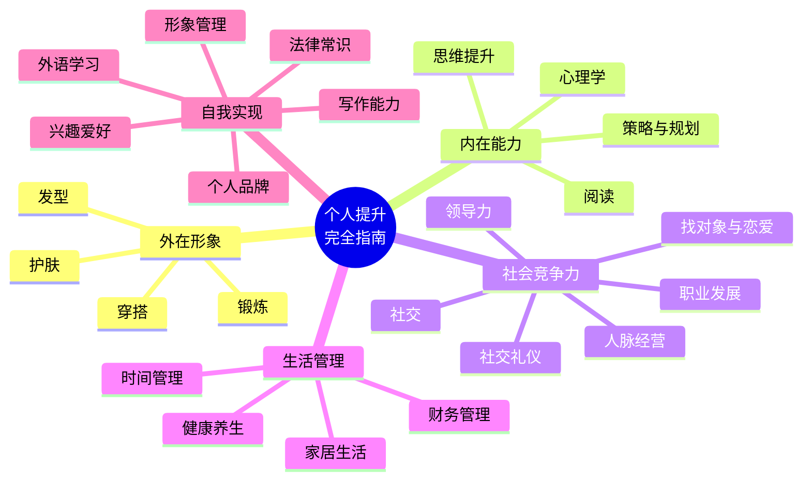
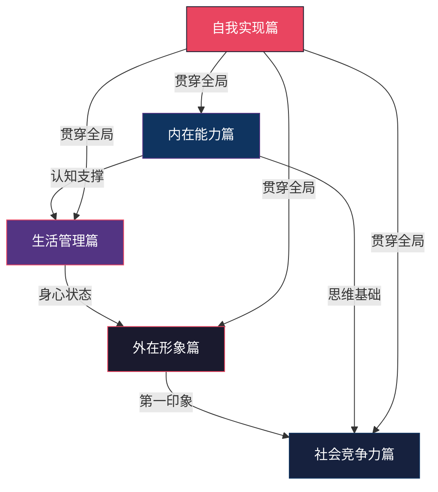
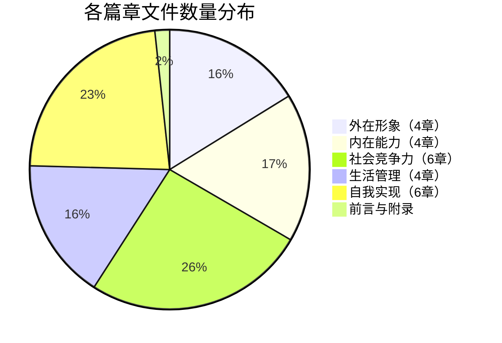

# 《个人提升完全指南》全书目录

## 全书概览

本书是一部为28岁男性量身定制的全方位个人提升指南。全书共**24章**，**600+子文件**，从外在形象到内在能力，从生活管理到社会竞争力，构建了一套完整的个人成长体系。每一章都遵循**道法术器**四层结构——理论基础→具体方案→产品推荐→学习路径——确保读者既能理解"为什么"，也能掌握"怎么做"。

### 本书的核心理念

| 理念 | 含义 | 实践体现 |
|------|------|----------|
| **道法术器贯通** | 每个主题从底层原理到具体操作，层层递进 | 每章分"基础理论→具体方案→产品推荐"三大模块 |
| **个性化定制** | 所有方案基于你的实际条件量身打造 | 普通身高/正常体重/55开身材/方形脸/中性偏微油肤质 |
| **由浅入深** | 每章提供入门→进阶→高级三阶段学习路径 | 学习路径模块明确标注各阶段目标和时间线 |
| **知行合一** | 理论之后必有实操，知识之后必有行动清单 | 每章结尾附"本章小结"和可执行的行动清单 |
| **常见误区警示** | 每章专门梳理典型错误认知，帮你少走弯路 | 每章独立的"常见误区"模块，列出错误认知与纠正方法 |
| **横向关联** | 各章节之间有明确的知识关联和交叉引用 | 篇章关系图展示五大维度的支撑与贯穿关系 |

### 目标读者画像

本书的目标读者具备以下特征，所有内容均围绕这些条件进行个性化定制：

| 维度 | 你的条件 | 影响的章节 |
|------|----------|------------|
| **年龄** | 28岁 | 护肤（抗初老）、职业发展（加速期）、恋爱（适婚窗口） |
| **身高** | 普通身高 | 穿搭（显高策略）、锻炼（体型优化重点） |
| **体重** | 正常体重（BMI 24.6） | 锻炼（减脂塑形）、健康养生（体重管理） |
| **身材比例** | 55开 | 穿搭（视觉比例调整）、锻炼（上下肢训练侧重） |
| **脸型** | 方形脸 | 发型（修饰脸型）、穿搭（领口选择）、形象管理 |
| **头发** | 塌、细软 | 发型（蓬松技术、烫发方案） |
| **肤质** | 中性偏微油 | 护肤（控油保湿平衡、产品选择） |
| **护肤习惯** | 氨基酸洁面+保湿乳液+抗氧化精华（早）+防晒+周水杨酸产品 | 护肤（现有方案优化与进阶） |

### 阅读建议

```mermaid
graph LR
    A[你是哪种读者？] --> B{有明确短板？}
    B -->|是| C[短板优先路径]
    B -->|否| D[系统提升路径]
    A --> E{时间有限？}
    E -->|是| F[核心精读路径]
    E -->|否| G[完整通读路径]

    C --> H[直奔对应章节<br/>先解决最紧迫的问题]
    D --> I[按五大篇顺序<br/>由外而内逐步提升]
    F --> J[每章只读"章节概览"<br/>+"具体方案"+"本章小结"]
    G --> K[每章完整阅读<br/>道法术器全部掌握]

    style A fill:#e94560,stroke:#1a1a2e,color:#fff
    style B fill:#533483,stroke:#e94560,color:#fff
    style E fill:#533483,stroke:#e94560,color:#fff
```

**三种推荐阅读路径：**

| 路径 | 适合人群 | 阅读顺序 | 预计时间 |
|------|----------|----------|----------|
| **短板优先** | 有明确需要改善的领域 | 直接跳转对应章节，解决最紧迫问题后再扩展 | 按需而定 |
| **系统提升** | 想要全面发展的读者 | 按篇章顺序：外在形象→内在能力→社会竞争力→生活管理→自我实现 | 3-6个月 |
| **核心精读** | 时间有限但想抓住重点 | 每章只读：章节概览→具体方案→本章小结，跳过理论深度 | 2-4周 |

### 全书知识地图



### 各篇章关系图



### 按需快速导航

遇到具体问题时，可以直接跳转到对应章节：

| 你遇到的问题 | 推荐章节 | 优先阅读内容 |
|-------------|----------|-------------|
| 皮肤出油、长痘、不知道用什么护肤品 | 第一章 护肤 | 肤质判断→定制方案→产品推荐 |
| 想减肥塑形但不知道怎么练 | 第二章 锻炼 | PPL训练计划→运动营养学→健身装备 |
| 不知道怎么穿才好看 | 第三章 穿搭 | 显高穿搭方案→10件必备单品 |
| 头发塌、不知道留什么发型 | 第四章 发型 | 脸型与发型搭配→蓬松技术 |
| 读书记不住、不知道读什么书 | 第五章 阅读 | 精读与笔记方法→选书原则 |
| 思考问题没逻辑、容易被忽悠 | 第六章 思维提升 | 批判性思维→思维模型大全 |
| 情绪不稳定、不了解自己 | 第七章 心理学 | 自我认知方法→情绪管理技巧 |
| 人生迷茫、不知道该做什么 | 第八章 策略与规划 | 人生战略规划框架→决策框架 |
| 社交恐惧、不知道怎么跟人打交道 | 第九章 社交 | 社交焦虑应对→社交技巧大全 |
| 总是拖延、时间不够用 | 第十章 时间管理 | GTD方法论→每日时间管理方案 |
| 想脱单但不知道怎么找对象 | 第十一章 找对象与恋爱 | 吸引力心理学→相亲策略→话术 |
| 工作没方向、想升职或跳槽 | 第十二章 职业发展 | 简历优化→面试技巧→晋升策略 |
| 月光族、不会理财 | 第十三章 财务管理 | 记账与预算→储蓄策略→投资入门 |
| 总是累、亚健康 | 第十四章 健康养生 | 睡眠科学→每日健康作息方案 |
| 想提升个人形象和气质 | 第十五章 形象管理 | 外在形象管理→气质培养理论 |
| 想带团队但没有领导力 | 第十六章 领导力 | 情境领导理论→团队建设策略 |
| 想学英语/日语但学不好 | 第十七章 外语学习 | 二语习得理论→听力/口语方案 |
| 租的房子住着不舒服 | 第十八章 家居生活 | 租房改造方案→收纳整理 |
| 业余时间不知道干什么 | 第十九章 兴趣爱好 | 兴趣分类体系→摄影/音乐方案 |
| 想做自媒体/打造个人IP | 第二十章 个人品牌 | 品牌定位→内容创作→社交媒体运营 |
| 想拓展人脉但不知道怎么做 | 第二十一章 人脉经营 | 弱关系理论→人脉构建策略 |
| 写东西没条理、表达能力差 | 第二十二章 写作能力 | 商务写作→自媒体写作 |
| 遇到法律问题不知道怎么处理 | 第二十三章 法律常识 | 劳动权益保护→合同签订注意事项 |
| 不懂社交礼仪、怕出丑 | 第二十四章 社交礼仪 | 日常社交礼仪→餐桌礼仪 |

---

## 前言与导读

| 序号 | 文件 | 内容说明 |
|------|------|----------|
| 01 | [前言](00-前言与导读/前言.md) | 写在前面：为什么写这本书，本书的核心理念 |
| 02 | [个性化说明](00-前言与导读/个性化说明.md) | 针对你的个人条件（年龄/身材/肤质等）的定制说明 |
| 03 | [如何使用本书](00-前言与导读/如何使用本书.md) | 本书的结构说明、阅读建议与使用方法 |

---

## 第一篇：外在形象

> **核心目标**：打造清爽、干净、有型的外在形象。外在形象是个人品牌的第一张名片，研究表明人们在初次见面的7秒内就会形成第一印象，而外在形象占信息传递效果的55%。
>
> **包含章节**：护肤、锻炼、穿搭、发型——从头到脚构建完整的外在形象体系。

### 第一章 护肤——打造清爽干净的肌肤

> 针对你的中性偏微油肤质，建立科学的护肤体系。从皮肤结构到产品选择，从晨间流程到季节调整，手把手教你养出好皮肤。

**本章共34个文件，分为5个模块：**

#### 章节概览与总览
- [00 章节概览](02-第一章-护肤/00-章节概览.md)：护肤的核心目标、整体框架与本章导读

#### 基础理论（道——理解皮肤的运作机制）
- [01 皮肤的结构](02-第一章-护肤/基础理论/01-一皮肤的结构.md)：表皮、真皮、皮下组织的完整结构与功能
- [02 肤质类型与判断方法](02-第一章-护肤/基础理论/02-二肤质类型与判断方法.md)：干性/油性/混合性/中性肤质详解，自测方法
- [03 核心护肤成分解析](02-第一章-护肤/基础理论/03-三核心护肤成分解析.md)：烟酰胺、透明质酸、维A醇等关键成分的作用机制
- [04 护肤的基本原理](02-第一章-护肤/基础理论/04-四护肤的基本原理.md)：清洁、保湿、防晒、功效四大核心原理
- [05 皮肤的生理节律](02-第一章-护肤/基础理论/05-五皮肤的生理节律.md)：昼夜节律与护肤时机的关系
- [06 环境因素对皮肤的影响](02-第一章-护肤/基础理论/06-六环境因素对皮肤的影响.md)：紫外线、温度、湿度、污染对皮肤的影响
- [07 建立正确的护肤认知](02-第一章-护肤/基础理论/07-七总结建立正确的护肤认知.md)：理论总结与核心认知框架

#### 具体方案（法——可执行的护肤流程）
- [01 护肤的基本框架](02-第一章-护肤/具体方案/01-一护肤的基本框架.md)：护肤流程的整体设计逻辑
- [02 早晨护肤流程](02-第一章-护肤/具体方案/02-二早晨护肤流程.md)：5-7分钟晨间护肤完整步骤
- [03 晚间护肤流程](02-第一章-护肤/具体方案/03-三晚间护肤流程.md)：8-10分钟晚间护肤完整步骤
- [04 不同肤质的护肤方案](02-第一章-护肤/具体方案/04-四不同肤质的护肤方案.md)：按肤质分类的定制方案
- [05 不同年龄段护肤方案](02-第一章-护肤/具体方案/05-五不同年龄段护肤方案.md)：20s/30s/40s各年龄段的重点调整
- [06 不同季节护肤方案](02-第一章-护肤/具体方案/06-六不同季节护肤方案.md)：春夏秋冬的护肤策略调整
- [07 针对你肤质的定制方案](02-第一章-护肤/具体方案/07-七针对你肤质的定制方案.md)：基于中性偏微油肤质的个性化方案
- [08 进阶护肤方案](02-第一章-护肤/具体方案/08-八进阶护肤方案.md)：3个月后的高阶护肤策略
- [09 常见场景的护肤调整](02-第一章-护肤/具体方案/09-九常见场景的护肤调整.md)：出差、熬夜、运动等场景的应对
- [10 建立护肤习惯的技巧](02-第一章-护肤/具体方案/10-十建立护肤习惯的技巧.md)：让护肤成为自动化习惯的方法

#### 产品推荐（器——具体的产品与工具）
- [01 产品推荐的原则](02-第一章-护肤/产品推荐/01-一产品推荐的原则.md)：选产品的核心标准与避坑指南
- [02 洗面奶推荐](02-第一章-护肤/产品推荐/02-二洗面奶推荐.md)：旁氏等氨基酸洁面产品对比
- [03 精华液推荐](02-第一章-护肤/产品推荐/03-三精华液推荐.md)：抗氧化精华等功效精华选择
- [04 乳液面霜推荐](02-第一章-护肤/产品推荐/04-四乳液面霜推荐.md)：保湿乳液等保湿产品对比
- [05 防晒霜推荐](02-第一章-护肤/产品推荐/05-五防晒霜推荐.md)：日常防晒产品选择指南
- [06 眼霜推荐](02-第一章-护肤/产品推荐/06-六眼霜推荐.md)：眼部护理产品入门推荐
- [07 特殊护理产品推荐](02-第一章-护肤/产品推荐/07-七特殊护理产品推荐.md)：水杨酸产品等特殊功效产品
- [08 不同预算的购物清单](02-第一章-护肤/产品推荐/08-八不同预算的购物清单.md)：按预算分层的完整购物方案
- [09 购买渠道建议](02-第一章-护肤/产品推荐/09-九购买渠道建议.md)：正品购买渠道与防伪指南

#### 学习路径与总结
- [04 学习路径](02-第一章-护肤/04-学习路径.md)：从护肤小白到成分达人的进阶路线
- [05 常见误区](02-第一章-护肤/05-常见误区.md)：男生不需要护肤、油皮不需要保湿等典型错误
- [06 本章小结](02-第一章-护肤/06-本章小结.md)：护肤要点回顾与行动清单

---

### 第二章 锻炼——从零开始塑造体型

> 针对你的BMI 24.6、55开身材比例，设计科学的训练方案。从运动生理学基础到PPL分化训练，从零基础到系统训练的完整路径。

**本章共30个文件，分为5个模块：**

#### 章节概览与总览
- [00 章节概览](03-第二章-锻炼/00-章节概览.md)：锻炼的目标设定与整体计划

#### 基础理论（道——运动科学原理）
- [01 运动生理学基础](03-第二章-锻炼/基础理论/01-一运动生理学基础.md)：肌肉收缩、能量系统、心肺功能的科学基础
- [02 训练原则](03-第二章-锻炼/基础理论/02-二训练原则.md)：超量恢复、渐进超负荷、特异性原则
- [03 力量训练理论](03-第二章-锻炼/基础理论/03-三力量训练理论.md)：肌肥大、肌力、肌耐力的训练机制
- [04 有氧训练理论](03-第二章-锻炼/基础理论/04-四有氧训练理论.md)：心率区间、脂肪氧化、有氧阈值
- [05 柔韧性与灵活性](03-第二章-锻炼/基础理论/05-五柔韧性与灵活性.md)：拉伸科学、关节活动度、损伤预防
- [06 运动营养学](03-第二章-锻炼/基础理论/06-六运动营养学.md)：蛋白质摄入、碳水策略、补剂科学
- [07 本节要点回顾](03-第二章-锻炼/基础理论/07-七本节要点回顾.md)：运动科学核心知识总结

#### 具体方案（法——分阶段训练计划）
- [01 为什么选择PPL](03-第二章-锻炼/具体方案/01-一为什么选择PPL.md)：推拉腿分化训练的优势分析
- [02 详细训练计划](03-第二章-锻炼/具体方案/02-二详细训练计划.md)：完整的PPL训练计划（动作、组数、次数）
- [03 有氧训练安排](03-第二章-锻炼/具体方案/03-三有氧训练安排.md)：有氧与力量的搭配策略
- [04 针对矮个子的塑形策略](03-第二章-锻炼/具体方案/04-四针对矮个子的塑形策略.md)：普通身高身高的视觉优化训练重点
- [05 训练计划的渐进调整](03-第二章-锻炼/具体方案/05-五训练计划的渐进调整.md)：从新手到进阶的计划升级方法
- [06 训练日志的重要性](03-第二章-锻炼/具体方案/06-六训练日志的重要性.md)：如何记录和分析训练数据
- [07 热身与放松](03-第二章-锻炼/具体方案/08-七热身与放松.md)：训练前热身和训练后拉伸的完整流程
- [08 常见问题解答](03-第二章-锻炼/具体方案/09-八常见问题解答.md)：训练中高频问题的科学解答
- [09 本节要点回顾](03-第二章-锻炼/具体方案/10-九本节要点回顾.md)：训练方案核心要点总结

#### 产品推荐（器——装备与营养）
- [01 健身装备](03-第二章-锻炼/产品推荐/01-一健身装备.md)：基础健身装备清单与选购指南
- [02 营养补剂](03-第二章-锻炼/产品推荐/02-二营养补剂.md)：蛋白粉、肌酸等补剂的科学选择
- [03 饮食工具](03-第二章-锻炼/产品推荐/03-三饮食工具.md)：食物秤、营养APP等辅助工具
- [04 健身房选择](03-第二章-锻炼/产品推荐/04-四健身房选择.md)：如何选择适合的健身房
- [05 本节要点回顾](03-第二章-锻炼/产品推荐/05-五本节要点回顾.md)：产品推荐核心要点

#### 学习路径与总结
- [04 学习路径](03-第二章-锻炼/04-学习路径.md)：从零基础到达人级的训练进阶路线
- [05 常见误区](03-第二章-锻炼/05-常见误区.md)：跑步掉肌肉、局部减脂、不吃碳水等典型错误
- [06 本章小结](03-第二章-锻炼/06-本章小结.md)：锻炼要点回顾与行动清单

---

### 第三章 穿搭——矮个子的显高穿搭术

> 针对你的普通身高身高、55开身材、方形脸型，提供系统的穿搭优化方案。从色彩理论到显高公式，从基础衣橱到场合穿搭。

**本章共25个文件，分为5个模块：**

#### 章节概览与总览
- [00 章节概览](04-第三章-穿搭/00-章节概览.md)：穿搭优化的核心目标

#### 基础理论（道——穿搭的底层逻辑）
- [01 色彩理论](04-第三章-穿搭/基础理论/01-一色彩理论.md)：色彩搭配原理、冷暖色调、配色方案
- [02 体型分析](04-第三章-穿搭/基础理论/02-二体型分析.md)：55开身材的视觉优化原理
- [03 风格理论](04-第三章-穿搭/基础理论/03-三风格理论.md)：日系/韩系/美式等主流风格解析
- [04 面料知识](04-第三章-穿搭/基础理论/04-四面料知识.md)：常见面料特性与选择指南
- [05 服装史与时尚趋势](04-第三章-穿搭/基础理论/05-五服装史与时尚趋势.md)：经典款式与流行趋势
- [06 穿搭原则](04-第三章-穿搭/基础理论/06-六穿搭原则.md)：穿搭的核心设计原则
- [07 小结](04-第三章-穿搭/基础理论/07-小结.md)：穿搭理论要点总结

#### 具体方案（法——可直接套用的穿搭方案）
- [01 显高穿搭方案](04-第三章-穿搭/具体方案/01-一显高穿搭方案.md)：视觉增高的穿搭技巧与公式
- [02 修饰脸型方案](04-第三章-穿搭/具体方案/02-二修饰脸型方案.md)：方形脸的领口、配饰选择
- [03 五五开身材优化方案](04-第三章-穿搭/具体方案/03-三五五开身材优化方案.md)：上下半身比例的视觉调整
- [04 场合穿搭方案](04-第三章-穿搭/具体方案/04-四场合穿搭方案.md)：职场/约会/休闲等场景穿搭模板
- [05 小结](04-第三章-穿搭/具体方案/05-小结.md)：穿搭方案要点总结

#### 产品推荐（器——品牌与单品）
- [01 10件必备单品](04-第三章-穿搭/产品推荐/01-一10件必备单品.md)：基础衣橱的10件核心单品
- [02 品牌推荐](04-第三章-穿搭/产品推荐/02-二品牌推荐.md)：平价到中端品牌推荐
- [03 配饰推荐](04-第三章-穿搭/产品推荐/03-三配饰推荐.md)：鞋子、帽子、包等配饰选择
- [04 购物策略](04-第三章-穿搭/产品推荐/04-四购物策略.md)：高性价比的购物方法
- [05 小结](04-第三章-穿搭/产品推荐/05-小结.md)：产品推荐要点总结

#### 学习路径与总结
- [04 学习路径](04-第三章-穿搭/04-学习路径.md)：从穿搭小白到风格达人的进阶路线
- [05 常见误区](04-第三章-穿搭/05-常见误区.md)：矮个子不能穿长款、黑色最显瘦等典型错误
- [06 本章小结](04-第三章-穿搭/06-本章小结.md)：穿搭要点回顾与行动清单

---

### 第四章 发型——方形脸的最佳发型方案

> 针对你的方形脸型和头发塌问题，提供科学的发型设计与打理方案。从头发生理学到造型技巧，从日常打理到烫染决策。

**本章共25个文件，分为5个模块：**

#### 章节概览与总览
- [00 章节概览](05-第四章-发型/00-章节概览.md)：发型优化的核心目标

#### 基础理论（道——头发与脸型的科学）
- [01 头发生理学](05-第四章-发型/基础理论/01-一头发生理学.md)：毛囊结构、头发生长周期、影响因素
- [02 发质分析](05-第四章-发型/基础理论/02-二发质分析.md)：发质类型判断与头发塌的原因分析
- [03 脸型与发型搭配](05-第四章-发型/基础理论/03-三脸型与发型搭配.md)：方形脸的发型选择原理
- [04 发型风格分类](05-第四章-发型/基础理论/04-四发型风格分类.md)：主流男士发型风格解析
- [05 头发护理科学](05-第四章-发型/基础理论/05-五头发护理科学.md)：洗护产品的成分与选择
- [06 染发原理与技术](05-第四章-发型/基础理论/06-六染发原理与技术.md)：染发的化学原理与注意事项
- [07 烫发原理与技术](05-第四章-发型/基础理论/07-七烫发原理与技术.md)：烫发的原理、类型与适合人群
- [08 年龄与发型的关系](05-第四章-发型/基础理论/08-八年龄与发型的关系.md)：不同年龄段的发型选择
- [09 发型设计的核心总结](05-第四章-发型/基础理论/09-九发型设计的核心总结.md)：发型设计核心知识总结

#### 具体方案（法——发型推荐与打理方法）
- [01 推荐发型详解](05-第四章-发型/具体方案/01-一推荐发型详解.md)：3种适合方形脸的推荐发型
- [02 打理技巧大全](05-第四章-发型/具体方案/02-二打理技巧大全.md)：日常5分钟打理流程
- [03 蓬松技术深度解析](05-第四章-发型/具体方案/03-三蓬松技术深度解析.md)：解决头发塌的专业技巧
- [04 不同场景的发型方案](05-第四章-发型/具体方案/04-四不同场景的发型方案.md)：职场/约会/运动等场景发型

#### 产品推荐（器——洗护与造型产品）
- [01 洗护产品体系](05-第四章-发型/产品推荐/01-一洗护产品体系.md)：洗发水、护发素选择指南
- [02 造型产品体系](05-第四章-发型/产品推荐/02-二造型产品体系.md)：发蜡、发泥、定型喷雾对比
- [03 工具推荐](05-第四章-发型/产品推荐/03-三工具推荐.md)：吹风机、梳子等造型工具
- [04 产品搭配方案](05-第四章-发型/产品推荐/04-四产品搭配方案.md)：不同发型的产品组合推荐

#### 学习路径与总结
- [04 学习路径](05-第四章-发型/04-学习路径.md)：从发型小白到造型达人的进阶路线
- [05 常见误区](05-第四章-发型/05-常见误区.md)：头发塌就去烫、发蜡越多越好等典型错误
- [06 本章小结](05-第四章-发型/06-本章小结.md)：发型要点回顾与行动清单

---

## 第二篇：内在能力

> **核心目标**：构建强大的认知体系和思维能力。内在能力是个人发展的发动机，决定了你能走多远、站多高。
>
> **包含章节**：阅读、思维提升、心理学、策略与规划——从知识输入到思维输出，构建完整的认知操作系统。

### 第五章 阅读——高效阅读与知识体系构建

> 阅读是成本最低、回报最高的自我投资方式。本章从认知科学角度解析阅读的价值，提供从速读到精读的完整方法论，帮你建立系统的知识体系。

**本章共36个文件，分为5个模块：**

#### 章节概览与总览
- [00 章节概览](06-第五章-阅读/00-章节概览.md)：阅读的目标与价值定位

#### 基础理论（道——阅读的科学原理）
- [01 阅读的价值](06-第五章-阅读/基础理论/01-第一节阅读的价值为什么阅读是最重要的个人投资.md)：阅读作为个人投资的回报分析
- [02 阅读的认知价值](06-第五章-阅读/基础理论/02-一阅读的认知价值.md)：阅读对大脑认知能力的提升机制
- [03 阅读的科学](06-第五章-阅读/基础理论/03-第二节阅读的科学眼动认知加工与大脑机制.md)：眼动、认知加工与大脑机制
- [04 阅读方法论](06-第五章-阅读/基础理论/04-第三节阅读方法论从会读书到善读书.md)：从会读书到善读书的方法论
- [05 速读理论与技巧](06-第五章-阅读/基础理论/05-第四节速读理论与技巧.md)：速读的科学基础与训练方法
- [06 记忆与理解](06-第五章-阅读/基础理论/06-第五节记忆与理解如何让读过的内容真正留下.md)：遗忘曲线与长期记忆策略
- [07 遗忘的科学](06-第五章-阅读/基础理论/07-一遗忘的科学.md)：艾宾浩斯遗忘曲线的实践应用
- [08 本节总结](06-第五章-阅读/基础理论/08-本节总结.md)：阅读理论核心要点

#### 具体方案（法——阅读方法与计划）
- [01 速读训练方案](06-第五章-阅读/具体方案/01-第一部分速读训练方案.md)：系统化的速读训练计划
- [02 速读训练的科学基础](06-第五章-阅读/具体方案/02-一速读训练的科学基础.md)：速读训练背后的认知科学
- [03 精读与笔记方法](06-第五章-阅读/具体方案/03-第二部分精读与笔记方法.md)：SQ3R、康奈尔笔记等精读方法
- [04 主题阅读方案](06-第五章-阅读/具体方案/04-第三部分主题阅读方案.md)：围绕主题的系统化阅读方法
- [05 阅读计划制定](06-第五章-阅读/具体方案/05-第四部分阅读计划制定.md)：年度/月度/周度阅读计划模板
- [06 不同类型书籍阅读方法](06-第五章-阅读/具体方案/06-第五部分不同类型书籍阅读方法.md)：实用书/小说/学术书等不同读法
- [07 电子书与纸质书选择](06-第五章-阅读/具体方案/07-第六部分电子书与纸质书选择.md)：两种媒介的优劣对比与选择建议
- [08 两种媒介的优劣对比](06-第五章-阅读/具体方案/08-一两种媒介的优劣对比.md)：深度对比分析
- [09 本节总结](06-第五章-阅读/具体方案/09-本节总结.md)：阅读方案要点总结

#### 产品推荐（器——书籍与工具）
- [01 选书原则](06-第五章-阅读/产品推荐/01-选书原则.md)：如何挑选高质量书籍
- [02 沟通与表达](06-第五章-阅读/产品推荐/02-一沟通与表达.md)：沟通类必读书籍推荐
- [03 思维方法](06-第五章-阅读/产品推荐/03-二思维方法.md)：思维类必读书籍推荐
- [04 心理学](06-第五章-阅读/产品推荐/04-三心理学.md)：心理学类必读书籍推荐
- [05 商业与管理](06-第五章-阅读/产品推荐/05-四商业与管理.md)：商业类必读书籍推荐
- [06 哲学与人文](06-第五章-阅读/产品推荐/06-五哲学与人文.md)：哲学类必读书籍推荐
- [07 科技与前沿](06-第五章-阅读/产品推荐/07-六科技与前沿.md)：科技类必读书籍推荐
- [08 学习方法](06-第五章-阅读/产品推荐/08-七学习方法.md)：学习方法类书籍推荐
- [09 健康与生活](06-第五章-阅读/产品推荐/09-八健康与生活.md)：健康生活类书籍推荐
- [10 阅读工具与平台推荐](06-第五章-阅读/产品推荐/10-阅读工具与平台推荐.md)：电子书阅读器、笔记工具、读书APP
- [11 本节总结](06-第五章-阅读/产品推荐/11-本节总结.md)：产品推荐要点总结

#### 学习路径与总结
- [04 学习路径](06-第五章-阅读/04-学习路径.md)：从阅读新手到达人的进阶路线
- [05 常见误区](06-第五章-阅读/05-常见误区.md)：读书越多越好、必须从头读到尾等典型错误
- [06 本章小结](06-第五章-阅读/06-本章小结.md)：阅读要点回顾与行动清单

---

### 第六章 思维提升——核心思维模型与思考力训练

> 思维能力是所有能力的底层操作系统。本章系统介绍认知科学、批判性思维、创造性思维、系统思维等核心思维框架，并提供100个实用思维模型。

**本章共26个文件，分为5个模块：**

#### 章节概览与总览
- [00 章节概览](07-第六章-思维提升/00-章节概览.md)：思维提升的目标与价值

#### 基础理论（道——思维的科学基础）
- [01 认知科学基础](07-第六章-思维提升/基础理论/01-一认知科学基础理解大脑如何思考.md)：大脑如何思考，认知偏误的来源
- [02 批判性思维](07-第六章-思维提升/基础理论/02-二批判性思维理性判断的基石.md)：理性判断的逻辑框架与训练方法
- [03 创造性思维](07-第六章-思维提升/基础理论/03-三创造性思维突破常规的力量.md)：创新思维的培养方法
- [04 系统思维](07-第六章-思维提升/基础理论/04-四系统思维看见整体与关联.md)：看见整体与关联的思维方式
- [05 概率思维与统计思维](07-第六章-思维提升/基础理论/05-五概率思维与统计思维在不确定性中决策.md)：在不确定性中做出理性决策
- [06 元认知](07-第六章-思维提升/基础理论/06-六元认知思考的思考.md)：对自己思维过程的觉察与调控
- [07 六大领域的整合](07-第六章-思维提升/基础理论/07-七六大领域的整合.md)：思维能力的综合框架

#### 具体方案（法——思维模型与训练方法）
- [01 思维模型大全](07-第六章-思维提升/具体方案/01-一思维模型大全100个改变你思维方式的模型.md)：100个实用思维模型详解
- [02 决策框架](07-第六章-思维提升/具体方案/02-二决策框架从混乱到清晰.md)：从混乱到清晰的决策方法论
- [03 问题解决方法论](07-第六章-思维提升/具体方案/03-三问题解决方法论.md)：系统化的问题分析与解决流程
- [04 创新思维训练](07-第六章-思维提升/具体方案/04-四创新思维训练.md)：SCAMPER、六顶思考帽等创新工具
- [05 逻辑思维训练](07-第六章-思维提升/具体方案/05-五逻辑思维训练.md)：形式逻辑、谬误识别、论证分析
- [06 综合训练计划](07-第六章-思维提升/具体方案/06-六综合训练计划.md)：每日/每周思维训练计划

#### 产品推荐（器——学习资源）
- [01 经典书籍推荐](07-第六章-思维提升/产品推荐/01-一经典书籍推荐.md)：思维提升必读书单
- [02 在线课程推荐](07-第六章-思维提升/产品推荐/02-二在线课程推荐.md)：优质思维课程推荐
- [03 数字工具推荐](07-第六章-思维提升/产品推荐/03-三数字工具推荐.md)：思维导图、笔记软件等工具
- [04 播客与博客推荐](07-第六章-思维提升/产品推荐/04-四播客与博客推荐.md)：优质思维类播客与博客
- [05 学习资源使用建议](07-第六章-思维提升/产品推荐/05-五学习资源使用建议.md)：如何高效利用学习资源

#### 学习路径与总结
- [04 学习路径](07-第六章-思维提升/04-学习路径.md)：从思维新手到思考达人的进阶路线
- [05 常见误区](07-第六章-思维提升/05-常见误区.md)：聪明等于思维强、模型越多越好等典型错误
- [06 本章小结](07-第六章-思维提升/06-本章小结.md)：思维提升要点回顾

---

### 第七章 心理学——了解自己，理解他人

> 心理学是理解人类行为的钥匙。本章从认知心理学到社会心理学，从情绪管理到人际关系，帮你建立科学的自我认知框架和人际互动能力。

**本章共28个文件，分为5个模块：**

#### 章节概览与总览
- [00 章节概览](08-第七章-心理学/00-章节概览.md)：心理学学习的目标与价值

#### 基础理论（道——心理学核心知识）
- [01 心理学的历史与发展](08-第七章-心理学/基础理论/01-一心理学的历史与发展.md)：从精神分析到认知革命的发展脉络
- [02 认知心理学](08-第七章-心理学/基础理论/02-二认知心理学.md)：注意力、记忆、思维的认知机制
- [03 发展心理学](08-第七章-心理学/基础理论/03-三发展心理学.md)：人生各阶段的心理发展特征
- [04 社会心理学](08-第七章-心理学/基础理论/04-四社会心理学.md)：从众、服从、偏见等社会心理现象
- [05 情绪心理学](08-第七章-心理学/基础理论/05-五情绪心理学.md)：情绪的产生机制与调节方法
- [06 人格心理学](08-第七章-心理学/基础理论/06-六人格心理学.md)：大五人格等人格理论
- [07 异常心理学基础](08-第七章-心理学/基础理论/07-七异常心理学基础.md)：常见心理问题的识别与应对
- [08 总结](08-第七章-心理学/基础理论/08-总结.md)：心理学核心知识总结

#### 具体方案（法——心理学实践应用）
- [01 自我认知方法](08-第七章-心理学/具体方案/01-一自我认知方法.md)：自我觉察、价值观澄清、优势发现
- [02 情绪管理技巧](08-第七章-心理学/具体方案/02-二情绪管理技巧.md)：ABC理论、正念、情绪调节策略
- [03 自信建立](08-第七章-心理学/具体方案/03-三自信建立.md)：自我效能感提升的科学方法
- [04 压力管理](08-第七章-心理学/具体方案/04-四压力管理.md)：压力源识别与应对策略
- [05 心理健康维护](08-第七章-心理学/具体方案/05-五心理健康维护.md)：日常心理健康保养方法
- [06 人际关系心理学应用](08-第七章-心理学/具体方案/06-六人际关系心理学应用.md)：非暴力沟通、共情、冲突解决
- [07 积极心理学实践](08-第七章-心理学/具体方案/07-七积极心理学实践.md)：幸福感提升的科学方法
- [08 心理学在生活中的应用](08-第七章-心理学/具体方案/08-八心理学在生活中的应用.md)：心理学在职场/恋爱/社交中的应用
- [09 整合与持续实践](08-第七章-心理学/具体方案/09-整合与持续实践.md)：心理学实践的长期规划

#### 产品推荐（器——学习资源）
- [01 推荐书籍](08-第七章-心理学/产品推荐/01-一推荐书籍.md)：心理学入门到进阶书单
- [02 推荐APP](08-第七章-心理学/产品推荐/02-二推荐APP.md)：心理健康类APP推荐
- [03 选择建议](08-第七章-心理学/产品推荐/03-三选择建议.md)：如何选择适合自己的学习资源

#### 学习路径与总结
- [04 学习路径](08-第七章-心理学/04-学习路径.md)：从心理学小白到自我达人的进阶路线
- [05 常见误区](08-第七章-心理学/05-常见误区.md)：学心理能看透别人、心理问题等于精神病等典型错误
- [06 本章小结](08-第七章-心理学/06-本章小结.md)：心理学要点回顾

---

### 第八章 策略与规划——人生策略与决策框架

> 策略思维是把人生当棋局来下的能力。本章融合军事战略、商业战略、博弈论等理论，构建系统的人生规划框架，涵盖职业、财务、学习、人际关系四大维度。

**本章共31个文件，分为5个模块：**

#### 章节概览与总览
- [00 章节概览](09-第八章-策略与规划/00-章节概览.md)：策略思维的目标与整体框架

#### 基础理论（道——战略思维的理论根基）
- [01 战略思维的本质与历史演变](09-第八章-策略与规划/基础理论/01-一战略思维的本质与历史演变.md)：从孙子兵法到现代战略理论
- [02 军事战略理论](09-第八章-策略与规划/基础理论/02-二军事战略理论.md)：克劳塞维茨、孙子等军事战略思想
- [03 商业战略理论](09-第八章-策略与规划/基础理论/03-三商业战略理论.md)：波特五力、蓝海战略等商业框架
- [04 博弈论基础](09-第八章-策略与规划/基础理论/04-四博弈论基础.md)：纳什均衡、囚徒困境等博弈思维
- [05 系统思维](09-第八章-策略与规划/基础理论/05-五系统思维.md)：复杂系统中的决策方法
- [06 认知科学与决策](09-第八章-策略与规划/基础理论/06-六认知科学与决策.md)：认知偏误对决策的影响
- [07 概率思维与贝叶斯推理](09-第八章-策略与规划/基础理论/07-七概率思维与贝叶斯推理.md)：用概率思维做决策
- [08 战略思维的整合框架](09-第八章-策略与规划/基础理论/08-八战略思维的整合框架.md)：将各理论整合为统一框架
- [09 本节小结](09-第八章-策略与规划/基础理论/09-本节小结.md)：策略理论核心要点

#### 具体方案（法——人生各维度规划）
- [01 人生战略规划框架](09-第八章-策略与规划/具体方案/01-一人生战略规划框架.md)：人生规划的整体方法论
- [02 职业发展策略](09-第八章-策略与规划/具体方案/02-二职业发展策略.md)：SWOT分析、职业路径规划
- [03 财务规划策略](09-第八章-策略与规划/具体方案/03-三财务规划策略.md)：理财基础、投资入门
- [04 学习成长策略](09-第八章-策略与规划/具体方案/04-四学习成长策略.md)：高效学习方法与知识管理
- [05 人际关系策略](09-第八章-策略与规划/具体方案/05-五人际关系策略.md)：社交圈层、人脉经营策略
- [06 决策矩阵与工具](09-第八章-策略与规划/具体方案/06-六决策矩阵与工具.md)：实用的决策分析工具
- [07 决策的常见陷阱与对策](09-第八章-策略与规划/具体方案/07-七决策的常见陷阱与对策.md)：沉没成本、确认偏误等决策陷阱
- [08 综合规划模板](09-第八章-策略与规划/具体方案/08-八综合规划模板.md)：可直接使用的人生规划模板
- [09 本节小结](09-第八章-策略与规划/具体方案/09-本节小结.md)：策略方案要点总结

#### 产品推荐（器——学习资源）
- [01 战略思维经典书籍20本详解](09-第八章-策略与规划/产品推荐/01-一战略思维经典书籍20本详解.md)：20本战略思维必读书籍
- [02 在线课程推荐](09-第八章-策略与规划/产品推荐/02-二在线课程推荐.md)：优质策略课程推荐
- [03 决策工具与软件](09-第八章-策略与规划/产品推荐/03-三决策工具与软件.md)：辅助决策的工具推荐
- [04 案例库与学习资源](09-第八章-策略与规划/产品推荐/04-四案例库与学习资源.md)：经典商业/军事案例库
- [05 本节小结](09-第八章-策略与规划/产品推荐/05-本节小结.md)：产品推荐要点

#### 学习路径与总结
- [04 学习路径](09-第八章-策略与规划/04-学习路径.md)：从策略新手到决策达人的进阶路线
- [05 常见误区](09-第八章-策略与规划/05-常见误区.md)：成功有捷径、人脉就是认识人多等典型错误
- [06 本章小结](09-第八章-策略与规划/06-本章小结.md)：策略与规划要点回顾

---

## 第三篇：社会竞争力

> **核心目标**：在社会交往中建立竞争优势。人是社会性动物，个人价值的实现离不开与他人的有效互动。
>
> **包含章节**：社交、找对象与恋爱、职业发展、领导力、人脉经营、社交礼仪——覆盖从日常社交到职场晋升的全部社交场景。

### 第九章 社交——社交技巧与人际关系

> 社交能力是个人价值变现的放大器。本章从社交心理学到实战技巧，从克服社恐到建立深度关系，提供完整的社交能力提升方案。

**本章共31个文件，分为5个模块：**

#### 章节概览与总览
- [00 章节概览](10-第九章-社交/00-章节概览.md)：社交提升的目标与框架

#### 基础理论（道——社交的科学基础）
- [01 社交心理学](10-第九章-社交/基础理论/01-一社交心理学.md)：首因效应、近因效应、晕轮效应
- [02 人际关系理论](10-第九章-社交/基础理论/02-二人际关系理论.md)：社会交换理论、自我表露理论
- [03 沟通理论](10-第九章-社交/基础理论/03-三沟通理论.md)：沟通模型、倾听理论、非暴力沟通
- [04 社交网络理论](10-第九章-社交/基础理论/04-四社交网络理论.md)：弱关系、结构洞、社交资本
- [05 情商理论](10-第九章-社交/基础理论/05-五情商理论.md)：戈尔曼情商模型与实践应用
- [06 社交神经科学](10-第九章-社交/基础理论/06-六社交神经科学.md)：镜像神经元、催产素与社交行为
- [07 本节小结](10-第九章-社交/基础理论/07-本节小结.md)：社交理论核心要点

#### 具体方案（法——社交技巧提升）
- [01 社交技巧大全](10-第九章-社交/具体方案/01-一社交技巧大全.md)：开场白、倾听、回应等核心技巧
- [02 社交场景应对](10-第九章-社交/具体方案/02-二社交场景应对.md)：职场/聚会/饭局等场景的社交策略
- [03 社交焦虑应对](10-第九章-社交/具体方案/03-三社交焦虑应对.md)：克服社交恐惧的科学方法
- [04 社交资本积累](10-第九章-社交/具体方案/04-四社交资本积累.md)：从零开始建立社交网络
- [05 社交礼仪](10-第九章-社交/具体方案/05-五社交礼仪.md)：基本社交礼仪规范
- [06 建立信任](10-第九章-社交/具体方案/06-六建立信任.md)：信任建立的科学方法
- [07 处理社交冲突](10-第九章-社交/具体方案/07-七处理社交冲突.md)：冲突管理与修复关系
- [08 社交中的边界管理](10-第九章-社交/具体方案/08-八社交中的边界管理.md)：如何设定和维护个人边界
- [09 社交能量管理](10-第九章-社交/具体方案/09-九社交能量管理.md)：内向者的社交能量管理策略
- [10 本节小结](10-第九章-社交/具体方案/10-本节小结.md)：社交方案要点总结

#### 产品推荐（器——学习资源）
- [01 书籍推荐](10-第九章-社交/产品推荐/01-一书籍推荐.md)：社交能力提升书单
- [02 课程与学习资源](10-第九章-社交/产品推荐/02-二课程与学习资源.md)：社交类课程推荐
- [03 工具与应用](10-第九章-社交/产品推荐/03-三工具与应用.md)：社交辅助工具推荐
- [04 社交测评工具](10-第九章-社交/产品推荐/04-四社交测评工具.md)：社交能力自测工具
- [05 专业服务推荐](10-第九章-社交/产品推荐/05-五专业服务推荐.md)：社交教练、心理咨询等服务
- [06 本节小结](10-第九章-社交/产品推荐/06-本节小结.md)：产品推荐要点

#### 学习路径与总结
- [04 学习路径](10-第九章-社交/04-学习路径.md)：从社交恐惧到社交达人的进阶路线
- [05 常见误区](10-第九章-社交/05-常见误区.md)：外向更擅长社交、社交就是迎合别人等典型错误
- [06 本章小结](10-第九章-社交/06-本章小结.md)：社交要点回顾

---

### 第十一章 找对象与恋爱——从理论到实战的脱单指南

> 恋爱是人生中最重要的体验之一。本章基于心理学、社会学、进化生物学的研究成果，提供系统、科学、实用的恋爱指南。不谈PUA，只讲真诚与价值匹配。

**本章共28个文件，分为5个模块：**

#### 章节概览与总览
- [00 章节概览](12-第十一章-找对象与恋爱/00-章节概览.md)：恋爱指南的核心理念

#### 基础理论（道——吸引力的科学）
- [01 吸引力心理学](12-第十一章-找对象与恋爱/基础理论/01-一吸引力心理学.md)：吸引力的科学原理与构成要素
- [02 依恋理论](12-第十一章-找对象与恋爱/基础理论/02-二依恋理论.md)：安全型/焦虑型/回避型依恋风格
- [03 爱情三角理论](12-第十一章-找对象与恋爱/基础理论/03-三爱情三角理论.md)：斯滕伯格的亲密-激情-承诺模型
- [04 两性择偶策略差异](12-第十一章-找对象与恋爱/基础理论/04-四两性择偶策略差异.md)：进化心理学视角的择偶策略
- [05 理论综合应用](12-第十一章-找对象与恋爱/基础理论/05-五理论综合应用.md)：将理论转化为实践策略
- [06 本节小结](12-第十一章-找对象与恋爱/基础理论/06-六本节小结.md)：恋爱理论核心要点

#### 具体方案（法——从脱单到经营）
- [01 相亲策略](12-第十一章-找对象与恋爱/具体方案/01-一相亲策略.md)：相亲平台选择、准备与技巧
- [02 约会策略](12-第十一章-找对象与恋爱/具体方案/02-二约会策略.md)：约会邀请、地点选择、话题引导
- [03 恋爱经营](12-第十一章-找对象与恋爱/具体方案/03-三恋爱经营.md)：长期关系的维护与深化
- [04 分手挽回](12-第十一章-找对象与恋爱/具体方案/04-四分手挽回.md)：挽回的科学方法与时机判断
- [05 针对用户情况的定制建议](12-第十一章-找对象与恋爱/具体方案/05-五针对用户情况的定制建议.md)：基于个人条件的个性化建议
- [06 行动清单](12-第十一章-找对象与恋爱/具体方案/06-六行动清单.md)：可立即执行的行动步骤

#### 话术集（器——实战话术模板）
- [01 开场白话术20个](12-第十一章-找对象与恋爱/话术集/01-一开场白话术20个.md)：20个经过验证的开场白
- [02 聊天话术30个场景](12-第十一章-找对象与恋爱/话术集/02-二聊天话术30个场景.md)：30个场景的聊天话术
- [03 约会话术15个场景](12-第十一章-找对象与恋爱/话术集/03-三约会话术15个场景.md)：15个约会场景的话术
- [04 表白话术10个模板](12-第十一章-找对象与恋爱/话术集/04-四表白话术10个模板.md)：10个表白场景的话术模板
- [05 挽回话术10个场景](12-第十一章-找对象与恋爱/话术集/05-五挽回话术10个场景.md)：10个挽回场景的话术
- [06 长期关系话术15个场景](12-第十一章-找对象与恋爱/话术集/06-六长期关系话术15个场景.md)：15个长期关系维护场景
- [07 话术使用原则](12-第十一章-找对象与恋爱/话术集/07-七话术使用原则.md)：话术使用的核心原则与底线

#### 实战案例与总结
- [04 实战案例](12-第十一章-找对象与恋爱/04-实战案例.md)：真实场景的案例分析
- [05 常见误区](12-第十一章-找对象与恋爱/05-常见误区.md)：恋爱中的典型错误认知
- [06 学习路径](12-第十一章-找对象与恋爱/06-学习路径.md)：从恋爱小白到经营达人的进阶路线
- [07 本章小结](12-第十一章-找对象与恋爱/07-本章小结.md)：恋爱要点回顾与行动清单

---

### 第十二章 职业发展——从初级到高级的成长路径

> 职业发展是个人价值实现的核心通道。本章从经典职业理论到实战技巧，从简历优化到副业发展，提供完整的职业发展方法论。

**本章共30个文件，分为5个模块：**

#### 章节概览与总览
- [00 章节概览](13-第十二章-职业发展/00-章节概览.md)：职业发展的目标与框架

#### 基础理论（道——职业发展的理论根基）
- [01 引言](13-第十二章-职业发展/基础理论/01-一引言为什么需要理论指导.md)：为什么需要理论指导
- [02 经典职业发展理论](13-第十二章-职业发展/基础理论/02-二经典职业发展理论.md)：舒伯、霍兰德等经典理论
- [03 自我分析工具](13-第十二章-职业发展/基础理论/03-三自我分析工具.md)：MBTI、DISC、盖洛普优势等工具
- [04 职场竞争力模型](13-第十二章-职业发展/基础理论/04-四职场竞争力模型.md)：构建个人核心竞争力
- [05 职业转型理论](13-第十二章-职业发展/基础理论/05-五职业转型理论.md)：转行的科学方法与风险评估
- [06 职业倦怠与应对](13-第十二章-职业发展/基础理论/06-六职业倦怠与应对.md)：倦怠的识别、预防与恢复
- [07 职业决策模型](13-第十二章-职业发展/基础理论/07-七职业决策模型.md)：重大职业决策的分析框架
- [08 从理论到实践的桥梁](13-第十二章-职业发展/基础理论/08-八从理论到实践的桥梁.md)：理论落地的方法论

#### 具体方案（法——职业发展实操）
- [01 引言](13-第十二章-职业发展/具体方案/01-一引言从理论到行动.md)：从理论到行动的过渡
- [02 简历优化](13-第十二章-职业发展/具体方案/02-二简历优化让HR在6秒内记住你.md)：让HR在6秒内记住你的简历技巧
- [03 面试技巧](13-第十二章-职业发展/具体方案/03-三面试技巧从准备到复盘的全流程方法论.md)：面试准备到复盘的全流程方法论
- [04 职场晋升策略](13-第十二章-职业发展/具体方案/04-四职场晋升策略从执行者到领导者.md)：从执行者到领导者的晋升路径
- [05 跳槽决策框架](13-第十二章-职业发展/具体方案/05-五跳槽决策框架理性规划每一次职业变动.md)：理性规划职业变动
- [06 副业发展策略](13-第十二章-职业发展/具体方案/06-六副业发展策略构建职业的第二曲线.md)：构建职业的第二曲线
- [07 自由职业转型](13-第十二章-职业发展/具体方案/07-七自由职业转型从雇员到自我雇佣.md)：从雇员到自我雇佣的转型路径
- [08 职业发展的长期策略](13-第十二章-职业发展/具体方案/08-八职业发展的长期策略.md)：长期职业规划与执行

#### 产品推荐（器——学习资源）
- [01 引言](13-第十二章-职业发展/产品推荐/01-一引言用对工具事半功倍.md)：工具选择的重要性
- [02 推荐书籍](13-第十二章-职业发展/产品推荐/02-二推荐书籍.md)：职业发展必读书单
- [03 推荐工具](13-第十二章-职业发展/产品推荐/03-三推荐工具.md)：求职/职场工具推荐
- [04 推荐平台与社群](13-第十二章-职业发展/产品推荐/04-四推荐平台与社群.md)：求职平台与行业社群
- [05 推荐认证与课程](13-第十二章-职业发展/产品推荐/05-五推荐认证与课程.md)：提升竞争力的认证与课程
- [06 如何选择适合自己的资源](13-第十二章-职业发展/产品推荐/06-六如何选择适合自己的资源.md)：资源选择的方法论

#### 学习路径与总结
- [04 学习路径](13-第十二章-职业发展/04-学习路径.md)：从初级到高级的成长路线图
- [05 常见误区](13-第十二章-职业发展/05-常见误区.md)：35岁就完了、技术好就够了等典型错误
- [06 本章小结](13-第十二章-职业发展/06-本章小结.md)：职业发展要点回顾

---

### 第十六章 领导力——从个人贡献者到团队领袖

> 领导力不是职位，而是影响力。本章从领导力特质理论到情境领导，从团队建设到变革管理，帮你系统构建领导力能力体系。

**本章共35个文件，分为5个模块：**

#### 章节概览与总览
- [00 章节概览](17-第十六章-领导力/00-章节概览.md)：领导力提升的目标与框架

#### 基础理论（道——领导力理论体系）
- [01 领导力的本质与定义](17-第十六章-领导力/基础理论/01-一领导力的本质与定义.md)：什么是领导力，领导与管理的区别
- [02 领导力特质理论](17-第十六章-领导力/基础理论/02-二领导力特质理论TraitTheory.md)：天生特质 vs 后天培养
- [03 领导力行为理论](17-第十六章-领导力/基础理论/03-三领导力行为理论BehavioralTheory.md)：任务导向 vs 关系导向
- [04 情境领导理论](17-第十六章-领导力/基础理论/04-四情境领导理论SituationalLeaders.md)：根据情境调整领导风格
- [05 变革型领导理论](17-第十六章-领导力/基础理论/05-五变革型领导理论TransformationalL.md)：激发团队潜能的领导方式
- [06 领导力模型](17-第十六章-领导力/基础理论/06-六领导力模型.md)：主流领导力模型整合
- [07 领导力发展理论](17-第十六章-领导力/基础理论/07-七领导力发展理论.md)：领导力的成长阶段
- [08 领导力心理学](17-第十六章-领导力/基础理论/08-八领导力心理学.md)：领导者的心理特质与修炼
- [09 东方领导力智慧](17-第十六章-领导力/基础理论/09-九东方领导力智慧.md)：儒道兵法中的领导智慧
- [10 总结与整合](17-第十六章-领导力/基础理论/10-十总结与整合.md)：领导力理论整合框架
- [11 本章核心要点](17-第十六章-领导力/基础理论/11-本章核心要点.md)：领导力理论核心要点

#### 具体方案（法——领导力实践）
- [01 领导力自我评估](17-第十六章-领导力/具体方案/01-一领导力自我评估.md)：领导力现状评估工具
- [02 团队建设策略](17-第十六章-领导力/具体方案/02-二团队建设策略.md)：高效团队的构建方法
- [03 决策与问题解决](17-第十六章-领导力/具体方案/03-三决策与问题解决.md)：领导者的决策方法论
- [04 沟通与影响力](17-第十六章-领导力/具体方案/04-四沟通与影响力.md)：领导者的沟通技巧
- [05 授权与赋能](17-第十六章-领导力/具体方案/05-五授权与赋能.md)：如何有效授权和培养下属
- [06 激励方法](17-第十六章-领导力/具体方案/06-六激励方法.md)：内在激励与外在激励的科学
- [07 变革管理](17-第十六章-领导力/具体方案/07-七变革管理.md)：组织变革的领导方法
- [08 教练式领导](17-第十六章-领导力/具体方案/08-八教练式领导.md)：用教练技术发展团队
- [09 领导力实践项目](17-第十六章-领导力/具体方案/09-九领导力实践项目.md)：领导力提升的实践项目
- [10 领导力提升工具箱](17-第十六章-领导力/具体方案/10-十领导力提升工具箱.md)：领导者的实用工具集
- [11 本章核心要点](17-第十六章-领导力/具体方案/11-本章核心要点.md)：领导力方案核心要点

#### 产品推荐（器——学习资源）
- [01 经典书籍推荐](17-第十六章-领导力/产品推荐/01-一经典书籍推荐.md)：领导力必读书单
- [02 优质课程推荐](17-第十六章-领导力/产品推荐/02-二优质课程推荐.md)：领导力课程推荐
- [03 实用工具推荐](17-第十六章-领导力/产品推荐/03-三实用工具推荐.md)：领导力工具推荐
- [04 播客与视频资源](17-第十六章-领导力/产品推荐/04-四播客与视频资源.md)：领导力学习资源
- [05 学习建议](17-第十六章-领导力/产品推荐/05-五学习建议.md)：如何高效学习领导力

#### 学习路径与总结
- [04 学习路径](17-第十六章-领导力/04-学习路径.md)：从个人贡献者到团队领袖的进阶路线
- [05 常见误区](17-第十六章-领导力/05-常见误区.md)：领导力等于权力、领导就是发号施令等典型错误
- [06 本章小结](17-第十六章-领导力/06-本章小结.md)：领导力要点回顾

---

### 第二十一章 人脉经营——构建高效人际网络

> 超过80%的工作机会和商业合作来自于人际关系网络。本章从社会资本理论到实战方法，教你如何系统化地构建、维护和变现你的人脉网络。

**本章共31个文件，分为5个模块：**

#### 章节概览与总览
- [00 章节概览](22-第二十一章-人脉经营/00-章节概览.md)：人脉经营的目标与框架

#### 基础理论（道——人脉的科学基础）
- [01 社会资本理论](22-第二十一章-人脉经营/基础理论/01-一社会资本理论SocialCapitalTheor.md)：社会资本的定义、类型与价值
- [02 弱关系理论](22-第二十一章-人脉经营/基础理论/02-二弱关系理论TheStrengthofWeakTi.md)：格兰诺维特的弱关系力量
- [03 结构洞理论](22-第二十一章-人脉经营/基础理论/03-三结构洞理论StructuralHolesTheo.md)：伯特的结构洞与竞争优势
- [04 社交网络分析](22-第二十一章-人脉经营/基础理论/04-四社交网络分析SocialNetworkAnaly.md)：网络结构与节点分析
- [05 互惠原则](22-第二十一章-人脉经营/基础理论/05-五互惠原则ReciprocityPrinciple.md)：互惠在人脉经营中的核心作用
- [06 邓巴数](22-第二十一章-人脉经营/基础理论/06-六邓巴数DunbarsNumber.md)：150人社交上限的科学解释
- [07 理论整合](22-第二十一章-人脉经营/基础理论/07-七理论整合人脉经营的核心框架.md)：人脉经营的核心理论框架
- [08 本节小结](22-第二十一章-人脉经营/基础理论/08-本节小结.md)：人脉理论核心要点

#### 具体方案（法——人脉经营实操）
- [01 人脉构建策略](22-第二十一章-人脉经营/具体方案/01-一人脉构建策略如何从零开始建立有效的人脉网络.md)：从零开始建立有效人脉网络
- [02 人脉维护方法](22-第二十一章-人脉经营/具体方案/02-二人脉维护方法如何让人脉持续保鲜.md)：让人脉持续保鲜的维护方法
- [03 人脉拓展渠道](22-第二十一章-人脉经营/具体方案/03-三人脉拓展渠道在哪里找到有价值的人.md)：在哪里找到有价值的人
- [04 人脉管理工具](22-第二十一章-人脉经营/具体方案/04-四人脉管理工具如何系统化管理你的人脉.md)：系统化管理人脉的工具
- [05 人脉变现方法](22-第二十一章-人脉经营/具体方案/05-五人脉变现方法如何将人脉转化为实际价值.md)：将人脉转化为实际价值
- [06 日常实践框架](22-第二十一章-人脉经营/具体方案/06-六人脉经营的日常实践框架.md)：每日/每周/每月的人脉经营动作
- [07 进阶技巧](22-第二十一章-人脉经营/具体方案/07-七人脉经营的进阶技巧.md)：高阶人脉经营策略
- [08 本节小结](22-第二十一章-人脉经营/具体方案/08-本节小结.md)：人脉方案要点总结

#### 产品推荐（器——学习资源）
- [01 推荐书籍](22-第二十一章-人脉经营/产品推荐/01-一推荐书籍.md)：人脉经营必读书单
- [02 实用工具推荐](22-第二十一章-人脉经营/产品推荐/02-二实用工具推荐.md)：人脉管理工具推荐
- [03 推荐关注的公众号博主](22-第二十一章-人脉经营/产品推荐/03-三推荐关注的公众号博主.md)：优质人脉类内容创作者
- [04 推荐参加的线下活动类型](22-第二十一章-人脉经营/产品推荐/04-四推荐参加的线下活动类型.md)：拓展人脉的线下活动
- [05 推荐在线课程](22-第二十一章-人脉经营/产品推荐/05-五推荐在线课程.md)：人脉经营课程推荐
- [06 产品选择建议](22-第二十一章-人脉经营/产品推荐/06-六产品选择建议.md)：如何选择适合自己的资源
- [07 本节小结](22-第二十一章-人脉经营/产品推荐/07-本节小结.md)：产品推荐要点

#### 学习路径与总结
- [04 学习路径](22-第二十一章-人脉经营/04-学习路径.md)：从社交新手到达人的进阶路线
- [05 常见误区](22-第二十一章-人脉经营/05-常见误区.md)：人脉就是认识人多、功利社交等典型错误
- [06 本章小结](22-第二十一章-人脉经营/06-本章小结.md)：人脉经营要点回顾

---

### 第二十四章 社交礼仪——得体举止，优雅社交

> 礼仪不是繁文缛节，而是对他人的尊重和对自己的要求。本章从礼仪的本质到日常/商务/餐桌/国际礼仪，帮你建立得体的社交形象。

**本章共26个文件，分为5个模块：**

#### 章节概览与总览
- [00 章节概览](25-第二十四章-社交礼仪/00-章节概览.md)：社交礼仪学习的目标

#### 基础理论（道——礼仪的理论根基）
- [01 礼仪的本质与核心原则](25-第二十四章-社交礼仪/基础理论/01-一礼仪的本质与核心原则.md)：礼仪的本质是尊重与舒适
- [02 礼仪的起源与发展](25-第二十四章-社交礼仪/基础理论/02-二礼仪的起源与发展.md)：从周礼到现代礼仪的演变
- [03 社交心理学基础](25-第二十四章-社交礼仪/基础理论/03-三社交心理学基础.md)：礼仪背后的心理学原理
- [04 非语言沟通](25-第二十四章-社交礼仪/基础理论/04-四非语言沟通.md)：肢体语言、表情、空间距离
- [05 跨文化礼仪](25-第二十四章-社交礼仪/基础理论/05-五跨文化礼仪.md)：不同文化背景下的礼仪差异
- [06 商务礼仪理论](25-第二十四章-社交礼仪/基础理论/06-六商务礼仪理论.md)：商务场合的礼仪规范
- [07 本章小结](25-第二十四章-社交礼仪/基础理论/07-本章小结.md)：礼仪理论核心要点

#### 具体方案（法——各类场景礼仪实操）
- [01 日常社交礼仪](25-第二十四章-社交礼仪/具体方案/01-一日常社交礼仪.md)：见面/介绍/称呼等日常礼仪
- [02 商务礼仪](25-第二十四章-社交礼仪/具体方案/02-二商务礼仪.md)：会议/名片/邮件等商务礼仪
- [03 餐桌礼仪](25-第二十四章-社交礼仪/具体方案/03-三餐桌礼仪.md)：中餐/西餐/酒桌礼仪规范
- [04 职场礼仪](25-第二十四章-社交礼仪/具体方案/04-四职场礼仪.md)：上下级/同事/客户间的职场礼仪
- [05 国际礼仪](25-第二十四章-社交礼仪/具体方案/05-五国际礼仪.md)：跨文化交往的礼仪要点
- [06 数字社交礼仪](25-第二十四章-社交礼仪/具体方案/06-六数字社交礼仪.md)：微信/邮件/视频会议等数字礼仪
- [07 本章小结](25-第二十四章-社交礼仪/具体方案/07-本章小结.md)：礼仪方案要点总结

#### 产品推荐（器——学习资源）
- [01 经典书籍推荐](25-第二十四章-社交礼仪/产品推荐/01-一经典书籍推荐.md)：礼仪类必读书籍
- [02 优质课程推荐](25-第二十四章-社交礼仪/产品推荐/02-二优质课程推荐.md)：礼仪课程推荐
- [03 实用工具推荐](25-第二十四章-社交礼仪/产品推荐/03-三实用工具推荐.md)：礼仪学习辅助工具
- [04 学习资源选择建议](25-第二十四章-社交礼仪/产品推荐/04-四学习资源选择建议.md)：如何选择适合的学习资源

#### 学习路径与总结
- [04 学习路径](25-第二十四章-社交礼仪/04-学习路径.md)：从礼仪小白到达人的进阶路线
- [05 常见误区](25-第二十四章-社交礼仪/05-常见误区.md)：礼仪等于装、太刻意不自然等典型错误
- [06 本章小结](25-第二十四章-社交礼仪/06-本章小结.md)：社交礼仪要点回顾

---

## 第四篇：生活管理

> **核心目标**：建立高效、有序、健康的生活系统。生活管理是个人发展的基础设施，决定了你的日常效率和长期幸福感。
>
> **包含章节**：时间管理、财务管理、健康养生、家居生活——从时间分配到空间管理，构建稳定运转的生活操作系统。

### 第十章 时间管理——高效利用每一天

> 时间是最稀缺的资源。本章从四代时间管理理论到GTD方法，从番茄工作法到能量管理，提供科学的时间管理完整方案。

**本章共32个文件，分为5个模块：**

#### 章节概览与总览
- [00 章节概览](11-第十章-时间管理/00-章节概览.md)：时间管理的目标与框架

#### 基础理论（道——时间管理的科学原理）
- [01 时间管理理论的演变](11-第十章-时间管理/基础理论/01-一时间管理理论的演变四代时间管理.md)：四代时间管理理论的发展脉络
- [02 优先级排序理论](11-第十章-时间管理/基础理论/02-二优先级排序理论艾森豪威尔矩阵深度解析.md)：艾森豪威尔矩阵深度解析
- [03 番茄工作法](11-第十章-时间管理/基础理论/03-三番茄工作法专注力的科学.md)：专注力的科学与番茄工作法
- [04 GTD方法论](11-第十章-时间管理/基础理论/04-四GTD方法论无压工作的系统.md)：无压工作的GTD系统
- [05 时间心理学](11-第十章-时间管理/基础理论/05-五时间心理学理解你与时间的关系.md)：理解你与时间的心理关系
- [06 能量管理](11-第十章-时间管理/基础理论/06-六能量管理超越时间管理.md)：超越时间管理的能量管理
- [07 经典时间管理理论汇总](11-第十章-时间管理/基础理论/07-七经典时间管理理论汇总.md)：主流时间管理理论对比
- [08 本节总结](11-第十章-时间管理/基础理论/08-八本节总结.md)：时间管理理论核心要点

#### 具体方案（法——时间管理实操）
- [01 每日时间管理方案](11-第十章-时间管理/具体方案/01-一每日时间管理方案.md)：从起床到睡觉的每日时间管理
- [02 每周计划方法](11-第十章-时间管理/具体方案/02-二每周计划方法.md)：周计划的制定与执行
- [03 每月复盘方法](11-第十章-时间管理/具体方案/03-三每月复盘方法.md)：月度复盘的框架与方法
- [04 项目时间管理](11-第十章-时间管理/具体方案/04-四项目时间管理.md)：项目制的时间管理方法
- [05 工作与生活平衡](11-第十章-时间管理/具体方案/05-五工作与生活平衡.md)：平衡工作与生活的策略
- [06 数字化时间管理工具](11-第十章-时间管理/具体方案/06-六数字化时间管理工具.md)：数字工具的时间管理应用
- [07 不同人群的定制方案](11-第十章-时间管理/具体方案/07-七不同人群的定制方案.md)：程序员/自由职业者等人群定制方案
- [08 时间审计](11-第十章-时间管理/具体方案/08-八时间审计了解你的时间去了哪里.md)：了解你的时间去了哪里
- [09 GTD方法实战方案](11-第十章-时间管理/具体方案/09-九GTD方法实战方案.md)：GTD的完整实操流程
- [10 习惯养成实践方案](11-第十章-时间管理/具体方案/10-十习惯养成实践方案.md)：微习惯、习惯叠加等方法
- [11 本节总结](11-第十章-时间管理/具体方案/11-十一本节总结.md)：时间管理方案要点总结

#### 产品推荐（器——工具与资源）
- [01 推荐书籍](11-第十章-时间管理/产品推荐/01-一推荐书籍.md)：时间管理必读书单
- [02 推荐APP](11-第十章-时间管理/产品推荐/02-二推荐APP.md)：时间管理APP推荐
- [03 推荐工具](11-第十章-时间管理/产品推荐/03-三推荐工具.md)：时间管理工具推荐
- [04 工具选择建议](11-第十章-时间管理/产品推荐/04-四工具选择建议.md)：如何选择适合自己的工具
- [05 本节总结](11-第十章-时间管理/产品推荐/05-五本节总结.md)：产品推荐要点

#### 学习路径与总结
- [04 学习路径](11-第十章-时间管理/04-学习路径.md)：从时间管理新手到达人的进阶路线
- [05 常见误区](11-第十章-时间管理/05-常见误区.md)：时间管理等于排满、早起等于高效等典型错误
- [06 本章小结](11-第十章-时间管理/06-本章小结.md)：时间管理要点回顾

---

### 第十三章 财务管理——掌控金钱，掌控人生

> 财务管理是最容易被忽视、却最具杠杆效应的个人能力。本章从财务自由的数学定义到复利效应，从记账到投资，帮你建立完整的财务管理体系。

**本章共26个文件，分为5个模块：**

#### 章节概览与总览
- [00 章节概览](14-第十三章-财务管理/00-章节概览.md)：财务管理的目标与框架

#### 基础理论（道——财务的底层逻辑）
- [01 财务自由](14-第十三章-财务管理/基础理论/01-一财务自由从梦想走向现实.md)：财务自由的数学定义与实现路径
- [02 复利效应](14-第十三章-财务管理/基础理论/02-二复利效应世界第八大奇迹.md)：复利的数学原理与实践应用
- [03 投资理论](14-第十三章-财务管理/基础理论/03-三投资理论现代投资组合理论与有效市场假说.md)：现代投资组合理论与有效市场假说
- [04 资产配置](14-第十三章-财务管理/基础理论/04-四资产配置投资的基石.md)：资产配置的原则与方法
- [05 风险管理理论](14-第十三章-财务管理/基础理论/05-五风险管理理论.md)：风险评估与对冲策略
- [06 行为金融学](14-第十三章-财务管理/基础理论/06-六行为金融学理解你的投资心理.md)：认知偏误对投资决策的影响
- [07 综合应用](14-第十三章-财务管理/基础理论/07-七综合应用建立个人财务理论框架.md)：建立个人财务理论框架

#### 具体方案（法——财务管理实操）
- [01 记账与预算管理](14-第十三章-财务管理/具体方案/01-一记账与预算管理掌握你的资金流向.md)：掌握资金流向的记账方法
- [02 储蓄策略](14-第十三章-财务管理/具体方案/02-二储蓄策略积少成多的艺术.md)：系统化的储蓄方法
- [03 投资策略](14-第十三章-财务管理/具体方案/03-三投资策略.md)：从零开始的投资实操指南
- [04 保险规划](14-第十三章-财务管理/具体方案/04-四保险规划为人生系上安全带.md)：保险配置的科学方法
- [05 税务筹划](14-第十三章-财务管理/具体方案/05-五税务筹划合法节税的艺术.md)：合法节税的策略
- [06 退休规划](14-第十三章-财务管理/具体方案/06-六退休规划为未来的自己负责.md)：长期退休规划方法
- [07 综合行动清单](14-第十三章-财务管理/具体方案/07-七综合行动清单.md)：可立即执行的财务行动步骤

#### 产品推荐（器——工具与资源）
- [01 推荐书籍](14-第十三章-财务管理/产品推荐/01-一推荐书籍.md)：财务管理必读书单
- [02 推荐APP](14-第十三章-财务管理/产品推荐/02-二推荐APP.md)：记账/投资APP推荐
- [03 理财产品推荐](14-第十三章-财务管理/产品推荐/03-三理财产品推荐.md)：基金/保险等理财产品
- [04 其他实用资源](14-第十三章-财务管理/产品推荐/04-四其他实用资源.md)：财经媒体/社区等资源

#### 学习路径与总结
- [04 学习路径](14-第十三章-财务管理/04-学习路径.md)：从理财小白到达人的进阶路线
- [05 常见误区](14-第十三章-财务管理/05-常见误区.md)：年轻不需要理财、投资就是炒股等典型错误
- [06 本章小结](14-第十三章-财务管理/06-本章小结.md)：财务管理要点回顾

---

### 第十四章 健康养生——建立科学的健康管理体系

> 健康是一切的基石。本章从健康四大支柱（睡眠、营养、运动、心理）到中医养生智慧，从日常健康方案到季节性调整，帮你建立全面的健康管理意识。

**本章共29个文件，分为5个模块：**

#### 章节概览与总览
- [00 章节概览](15-第十四章-健康养生/00-章节概览.md)：健康养生的目标与理念

#### 基础理论（道——健康科学基础）
- [01 健康四大支柱概述](15-第十四章-健康养生/基础理论/01-一健康四大支柱概述.md)：睡眠、营养、运动、心理四大支柱
- [02 睡眠科学](15-第十四章-健康养生/基础理论/02-二睡眠科学.md)：睡眠周期、昼夜节律、睡眠质量
- [03 营养学基础](15-第十四章-健康养生/基础理论/03-三营养学基础.md)：宏量营养素、微量营养素、膳食指南
- [04 运动科学](15-第十四章-健康养生/基础理论/04-四运动科学.md)：运动对健康的全面影响
- [05 心理与压力管理](15-第十四章-健康养生/基础理论/05-五心理与压力管理.md)：心理健康与压力管理的科学
- [06 中医养生智慧](15-第十四章-健康养生/基础理论/06-六中医养生智慧.md)：传统中医养生的现代解读
- [07 建立科学的健康观](15-第十四章-健康养生/基础理论/07-七建立科学的健康观.md)：科学健康观的核心要点
- [08 现代健康科学前沿](15-第十四章-健康养生/基础理论/08-八现代健康科学前沿.md)：抗衰老、基因检测等前沿领域
- [09 本章总结](15-第十四章-健康养生/基础理论/09-本章总结.md)：健康理论核心要点

#### 具体方案（法——健康管理实操）
- [01 每日健康作息方案](15-第十四章-健康养生/具体方案/01-一每日健康作息方案.md)：从起床到睡觉的健康作息
- [02 营养搭配方案](15-第十四章-健康养生/具体方案/02-二营养搭配方案.md)：每日营养摄入的科学搭配
- [03 运动计划](15-第十四章-健康养生/具体方案/03-三运动计划.md)：适合不同体能水平的运动方案
- [04 睡眠改善方案](15-第十四章-健康养生/具体方案/04-四睡眠改善方案.md)：提升睡眠质量的具体方法
- [05 压力管理方案](15-第十四章-健康养生/具体方案/05-五压力管理方案.md)：日常压力管理的科学方法
- [06 常见健康问题应对](15-第十四章-健康养生/具体方案/06-六常见健康问题应对.md)：亚健康/失眠/消化不良等问题应对
- [07 季节性健康方案](15-第十四章-健康养生/具体方案/07-七季节性健康方案.md)：春夏秋冬的健康调整方案
- [08 本章总结](15-第十四章-健康养生/具体方案/08-本章总结.md)：健康方案要点总结

#### 产品推荐（器——健康工具与资源）
- [01 推荐书籍](15-第十四章-健康养生/产品推荐/01-一推荐书籍.md)：健康养生必读书单
- [02 保健品推荐](15-第十四章-健康养生/产品推荐/02-二保健品推荐.md)：维生素/鱼油等保健品选择
- [03 健康工具推荐](15-第十四章-健康养生/产品推荐/03-三健康工具推荐.md)：手环/体脂秤等健康工具
- [04 产品选择与使用建议](15-第十四章-健康养生/产品推荐/04-四产品选择与使用建议.md)：如何选择健康产品

#### 学习路径与总结
- [04 学习路径](15-第十四章-健康养生/04-学习路径.md)：从健康小白到达人的进阶路线
- [05 常见误区](15-第十四章-健康养生/05-常见误区.md)：周末补觉能补回来、睡前喝酒助眠等典型错误
- [06 本章小结](15-第十四章-健康养生/06-本章小结.md)：健康养生要点回顾

---

### 第十八章 家居生活——打造舒适高效的生活空间

> 你的居住环境塑造你的生活品质。本章从环境心理学到极简主义，从收纳整理到智能家居，帮你打造一个舒适、高效、有品位的生活空间。

**本章共28个文件，分为5个模块：**

#### 章节概览与总览
- [00 章节概览](19-第十八章-家居生活/00-章节概览.md)：家居生活优化的目标

#### 基础理论（道——家居生活科学）
- [01 环境心理学](19-第十八章-家居生活/基础理论/01-一环境心理学.md)：环境对心理和行为的影响
- [02 极简主义哲学](19-第十八章-家居生活/基础理论/02-二极简主义哲学.md)：少即是多的生活哲学
- [03 收纳整理理论](19-第十八章-家居生活/基础理论/03-三收纳整理理论.md)：近藤麻理惠等收纳方法论
- [04 家居美学](19-第十八章-家居生活/基础理论/04-四家居美学.md)：色彩/材质/灯光的美学原则
- [05 智能家居技术](19-第十八章-家居生活/基础理论/05-五智能家居技术.md)：智能家居的技术架构与生态
- [06 家居生活品质理论](19-第十八章-家居生活/基础理论/06-六家居生活品质理论.md)：生活品质的定义与提升方法
- [07 本节小结](19-第十八章-家居生活/基础理论/07-七本节小结.md)：家居理论核心要点

#### 具体方案（法——家居优化实操）
- [01 收纳整理方案](19-第十八章-家居生活/具体方案/01-一收纳整理方案.md)：各区域收纳整理的实操方法
- [02 家居清洁方案](19-第十八章-家居生活/具体方案/02-二家居清洁方案.md)：高效清洁的方法与频率
- [03 家居布置方案](19-第十八章-家居生活/具体方案/03-三家居布置方案.md)：空间布局与装饰方案
- [04 智能家居方案](19-第十八章-家居生活/具体方案/04-四智能家居方案.md)：从零搭建智能家居系统
- [05 租房改造方案](19-第十八章-家居生活/具体方案/05-五租房改造方案.md)：低成本租房改造技巧
- [06 家庭预算管理](19-第十八章-家居生活/具体方案/06-六家庭预算管理.md)：家居开支的预算管理
- [07 本节小结](19-第十八章-家居生活/具体方案/07-七本节小结.md)：家居方案要点总结

#### 产品推荐（器——家居好物）
- [01 收纳工具推荐](19-第十八章-家居生活/产品推荐/01-一收纳工具推荐.md)：收纳盒/置物架等收纳工具
- [02 清洁工具推荐](19-第十八章-家居生活/产品推荐/02-二清洁工具推荐.md)：扫地机器人/吸尘器等清洁工具
- [03 家居好物推荐](19-第十八章-家居生活/产品推荐/03-三家居好物推荐.md)：提升生活品质的家居好物
- [04 智能家居推荐](19-第十八章-家居生活/产品推荐/04-四智能家居推荐.md)：智能灯/智能锁等智能家居产品
- [05 选购建议](19-第十八章-家居生活/产品推荐/05-五选购建议.md)：如何选择适合的家居产品
- [06 本节小结](19-第十八章-家居生活/产品推荐/06-六本节小结.md)：产品推荐要点

#### 学习路径与总结
- [04 学习路径](19-第十八章-家居生活/04-学习路径.md)：从家居小白到达人的进阶路线
- [05 常见误区](19-第十八章-家居生活/05-常见误区.md)：家居优化等于花钱、极简等于简陋等典型错误
- [06 本章小结](19-第十八章-家居生活/06-本章小结.md)：家居生活要点回顾

---

## 第五篇：自我实现

> **核心目标**：在各个维度实现个人价值的最大化。自我实现是个人提升的终极目标，涵盖形象、语言、兴趣、品牌、写作、法律等多元能力。
>
> **包含章节**：形象管理、外语学习、兴趣爱好、个人品牌、写作能力、法律常识——从内在修养到外在表达，全面提升个人综合竞争力。

### 第十五章 形象管理——从外在到内在的全面形象塑造

> 形象管理不是简单的穿衣打扮，而是一门融合心理学、社会学、传播学的综合能力。本章涵盖外在形象、内在气质、线上形象、不同场合的形象管理。

**本章共22个文件，分为5个模块：**

#### 章节概览与总览
- [00 章节概览](16-第十五章-形象管理/00-章节概览.md)：形象管理的目标与框架

#### 基础理论（道——形象管理理论）
- [01 形象管理的心理学基础](16-第十五章-形象管理/基础理论/01-第一节形象管理的心理学基础.md)：首因效应、晕轮效应与形象认知
- [02 个人品牌理论](16-第十五章-形象管理/基础理论/02-第二节个人品牌理论.md)：个人品牌的定义与构建
- [03 气质培养理论](16-第十五章-形象管理/基础理论/03-第三节气质培养理论.md)：气质的构成与培养方法
- [04 非语言沟通理论](16-第十五章-形象管理/基础理论/04-第四节非语言沟通理论.md)：肢体语言、表情、声音的管理
- [05 形象与职业发展](16-第十五章-形象管理/基础理论/05-第五节形象与职业发展.md)：形象对职业发展的影响
- [06 理论整合](16-第十五章-形象管理/基础理论/06-理论整合形象管理的系统观.md)：形象管理的系统观

#### 具体方案（法——形象管理实操）
- [01 外在形象管理](16-第十五章-形象管理/具体方案/01-第一节外在形象管理.md)：仪容仪表的管理方法
- [02 内在形象管理](16-第十五章-形象管理/具体方案/02-第二节内在形象管理.md)：气质、谈吐、修养的提升
- [03 线上形象管理](16-第十五章-形象管理/具体方案/03-第三节线上形象管理.md)：社交媒体/微信/朋友圈的形象管理
- [04 不同场合的形象管理](16-第十五章-形象管理/具体方案/04-第四节不同场合的形象管理.md)：职场/社交/约会等场合的形象策略
- [05 形象提升计划](16-第十五章-形象管理/具体方案/05-第五节形象提升计划.md)：30天形象提升行动计划

#### 产品推荐（器——学习资源）
- [01 推荐书籍](16-第十五章-形象管理/产品推荐/01-第一节推荐书籍.md)：形象管理必读书籍
- [02 推荐课程](16-第十五章-形象管理/产品推荐/02-第二节推荐课程.md)：形象管理课程推荐
- [03 推荐工具与资源](16-第十五章-形象管理/产品推荐/03-第三节推荐工具与资源.md)：形象管理辅助工具

#### 学习路径与总结
- [04 学习路径](16-第十五章-形象管理/04-学习路径.md)：从形象管理小白到达人的进阶路线
- [05 常见误区](16-第十五章-形象管理/05-常见误区.md)：形象管理等于包装、内在比外在重要等典型错误
- [06 本章小结](16-第十五章-形象管理/06-本章小结.md)：形象管理要点回顾

---

### 第十七章 外语学习——科学高效的多语言习得

> 语言是连接世界的桥梁。本章从二语习得理论到实操方法，从英语到日语，提供科学、系统的外语学习方案。

**本章共40个文件，分为5个模块：**

#### 章节概览与总览
- [00 章节概览](18-第十七章-外语学习/00-章节概览.md)：外语学习的目标与框架

#### 基础理论（道——语言学习的科学基础）
- [01 第二语言习得理论概述](18-第十七章-外语学习/基础理论/01-一第二语言习得理论概述.md)：克拉申、斯温等核心理论
- [02 认知语言学与语言学习](18-第十七章-外语学习/基础理论/02-二认知语言学与语言学习.md)：认知视角的语言学习方法
- [03 二语习得心理学](18-第十七章-外语学习/基础理论/03-三二语习得心理学.md)：焦虑、动机、自我效能感
- [04 记忆科学与语言学习](18-第十七章-外语学习/基础理论/04-四记忆科学与语言学习.md)：间隔重复、联想记忆等记忆策略
- [05 语言学习策略](18-第十七章-外语学习/基础理论/05-五语言学习策略.md)：元认知/认知/社交策略
- [06 关键期假说与年龄因素](18-第十七章-外语学习/基础理论/06-六关键期假说与年龄因素.md)：年龄对语言学习的影响
- [07 动机理论与语言学习](18-第十七章-外语学习/基础理论/07-七动机理论与语言学习.md)：内在动机与外在动机的驱动
- [08 认知负荷理论](18-第十七章-外语学习/基础理论/08-八认知负荷理论与语言学习设计.md)：降低认知负荷的学习设计
- [09 多语言学习](18-第十七章-外语学习/基础理论/09-九多语言学习.md)：同时学习多种语言的策略
- [10 语言学习中的神经科学基础](18-第十七章-外语学习/基础理论/10-十语言学习中的神经科学基础.md)：大脑语言区的可塑性
- [11 本节小结](18-第十七章-外语学习/基础理论/11-十一本节小结.md)：语言学习理论核心要点

#### 具体方案（法——语言学习实操）
- [01 英语学习的整体方法论](18-第十七章-外语学习/具体方案/01-一英语学习的整体方法论.md)：英语学习的系统方法
- [02 听力训练方案](18-第十七章-外语学习/具体方案/02-二听力训练方案.md)：从精听到泛听的训练方法
- [03 口语提升方案](18-第十七章-外语学习/具体方案/03-三口语提升方案.md)：口语表达能力的系统提升
- [04 阅读能力培养](18-第十七章-外语学习/具体方案/04-四阅读能力培养.md)：分级阅读与精读方法
- [05 写作能力培养](18-第十七章-外语学习/具体方案/05-五写作能力培养.md)：从句子到篇章的写作训练
- [06 词汇积累方案](18-第十七章-外语学习/具体方案/06-六词汇积累方案.md)：科学的词汇记忆与扩展方法
- [07 日语学习方案](18-第十七章-外语学习/具体方案/07-七日语学习方案.md)：从零开始的日语学习路径
- [08 其他语言学习方案](18-第十七章-外语学习/具体方案/08-八其他语言学习方案.md)：韩语/法语/西班牙语等语言入门
- [09 词汇记忆方法详解](18-第十七章-外语学习/具体方案/09-九词汇记忆方法详解.md)：词根词缀、联想记忆等方法
- [10 口语提升方法详解](18-第十七章-外语学习/具体方案/10-十口语提升方法详解.md)：影子跟读、情景模拟等方法
- [11 考试备考策略](18-第十七章-外语学习/具体方案/11-十一考试备考策略.md)：四六级/雅思/托福等考试备考
- [12 制定个性化学习计划](18-第十七章-外语学习/具体方案/12-十二制定个性化学习计划.md)：根据目标定制学习计划
- [13 本节小结](18-第十七章-外语学习/具体方案/13-十三本节小结.md)：语言学习方案要点总结

#### 产品推荐（器——学习工具与资源）
- [01 经典书籍推荐](18-第十七章-外语学习/产品推荐/01-一经典书籍推荐.md)：语言学习必读书籍
- [02 学习APP推荐](18-第十七章-外语学习/产品推荐/02-二学习APP推荐.md)：多邻国/扇贝等学习APP
- [03 在线课程推荐](18-第十七章-外语学习/产品推荐/03-三在线课程推荐.md)：优质语言课程推荐
- [04 学习工具推荐](18-第十七章-外语学习/产品推荐/04-四学习工具推荐.md)：词典/翻译/记忆工具
- [05 学习资源网站](18-第十七章-外语学习/产品推荐/05-五学习资源网站.md)：优质语言学习网站
- [06 学习设备推荐](18-第十七章-外语学习/产品推荐/06-六学习设备推荐.md)：电子词典/点读笔等设备
- [07 选择学习产品的原则](18-第十七章-外语学习/产品推荐/07-七选择学习产品的原则.md)：如何选择适合自己的学习产品
- [08 本节小结](18-第十七章-外语学习/产品推荐/08-八本节小结.md)：产品推荐要点

#### 学习路径与总结
- [04 学习路径](18-第十七章-外语学习/04-学习路径.md)：从外语小白到达人的进阶路线
- [05 常见误区](18-第十七章-外语学习/05-常见误区.md)：没有语言天赋、背单词就够了等典型错误
- [06 本章小结](18-第十七章-外语学习/06-本章小结.md)：外语学习要点回顾

---

### 第十九章 兴趣爱好——培养有价值的业余生活

> 兴趣爱好是生活的调味剂，也是个人魅力的重要来源。本章从兴趣的价值到具体培养方案，涵盖摄影、音乐、运动、手工等领域。

**本章共28个文件，分为5个模块：**

#### 章节概览与总览
- [00 章节概览](20-第十九章-兴趣爱好/00-章节概览.md)：兴趣爱好培养的目标

#### 基础理论（道——兴趣的科学基础）
- [01 兴趣的价值与意义](20-第十九章-兴趣爱好/基础理论/01-一兴趣的价值与意义.md)：兴趣对个人发展的全面价值
- [02 爱好的分类体系](20-第十九章-兴趣爱好/基础理论/02-二爱好的分类体系.md)：创造型/运动型/智力型等分类
- [03 技能培养的科学方法](20-第十九章-兴趣爱好/基础理论/03-三技能培养的科学方法.md)：刻意练习、心流理论
- [04 兴趣与职业的关系](20-第十九章-兴趣爱好/基础理论/04-四兴趣与职业的关系.md)：兴趣变现与副业发展
- [05 不同人生阶段的兴趣选择](20-第十九章-兴趣爱好/基础理论/05-五不同人生阶段的兴趣选择.md)：20s/30s/40s各阶段的兴趣选择
- [06 兴趣爱好的心理学视角](20-第十九章-兴趣爱好/基础理论/06-六兴趣爱好的心理学视角.md)：兴趣与心理健康的关系
- [07 本节小结](20-第十九章-兴趣爱好/基础理论/07-本节小结.md)：兴趣理论核心要点

#### 具体方案（法——兴趣培养实操）
- [01 摄影入门方案](20-第十九章-兴趣爱好/具体方案/01-一摄影入门方案.md)：从手机摄影到相机摄影的入门路径
- [02 音乐学习方案](20-第十九章-兴趣爱好/具体方案/02-二音乐学习方案.md)：吉他/钢琴等乐器学习方案
- [03 运动选择方案](20-第十九章-兴趣爱好/具体方案/03-三运动选择方案.md)：游泳/跑步/篮球等运动入门
- [04 手工创作方案](20-第十九章-兴趣爱好/具体方案/04-四手工创作方案.md)：木工/皮具/模型等手工入门
- [05 兴趣组合策略](20-第十九章-兴趣爱好/具体方案/05-五兴趣组合策略.md)：如何搭配多个兴趣爱好
- [06 常见误区与解决方案](20-第十九章-兴趣爱好/具体方案/06-六常见误区与解决方案.md)：兴趣培养中的常见问题
- [07 本节小结](20-第十九章-兴趣爱好/具体方案/07-本节小结.md)：兴趣方案要点总结

#### 产品推荐（器——装备与资源）
- [01 摄影入门装备推荐](20-第十九章-兴趣爱好/产品推荐/01-一摄影入门装备推荐.md)：相机/镜头/三脚架等摄影装备
- [02 音乐学习装备推荐](20-第十九章-兴趣爱好/产品推荐/02-二音乐学习装备推荐.md)：吉他/钢琴等乐器选择
- [03 运动装备推荐](20-第十九章-兴趣爱好/产品推荐/03-三运动装备推荐.md)：各类运动装备推荐
- [04 手工创作装备推荐](20-第十九章-兴趣爱好/产品推荐/04-四手工创作装备推荐.md)：木工/皮具等手工工具
- [05 通用学习资源推荐](20-第十九章-兴趣爱好/产品推荐/05-五通用学习资源推荐.md)：B站/YouTube等学习平台
- [06 本节小结](20-第十九章-兴趣爱好/产品推荐/06-本节小结.md)：产品推荐要点

#### 学习路径与总结
- [04 学习路径](20-第十九章-兴趣爱好/04-学习路径.md)：从兴趣新手到达人的进阶路线
- [05 常见误区](20-第十九章-兴趣爱好/05-常见误区.md)：兴趣等于烧钱、三分钟热度等典型错误
- [06 本章小结](20-第十九章-兴趣爱好/06-本章小结.md)：兴趣爱好要点回顾

---

### 第二十章 个人品牌——打造你的个人影响力

> 在社交媒体时代，个人品牌是最有价值的无形资产。本章从品牌定位到内容创作，从社交媒体运营到品牌变现，帮你系统构建个人品牌。

**本章共30个文件，分为5个模块：**

#### 章节概览与总览
- [00 章节概览](21-第二十章-个人品牌/00-章节概览.md)：个人品牌建设的目标

#### 基础理论（道——品牌建设理论）
- [01 个人品牌的定义与本质](21-第二十章-个人品牌/基础理论/01-一个人品牌的定义与本质.md)：什么是个人品牌，为什么需要它
- [02 品牌营销理论](21-第二十章-个人品牌/基础理论/02-二品牌营销理论.md)：品牌定位、品牌资产等核心理论
- [03 社交媒体时代的特点](21-第二十章-个人品牌/基础理论/03-三社交媒体时代的特点.md)：流量逻辑、算法推荐、内容生态
- [04 影响力的本质与传播](21-第二十章-个人品牌/基础理论/04-四影响力的本质与传播.md)：影响力的构成要素与传播机制
- [05 品牌定位理论](21-第二十章-个人品牌/基础理论/05-五品牌定位理论.md)：差异化定位的方法论
- [06 信任建立理论](21-第二十章-个人品牌/基础理论/06-六信任建立理论.md)：信任的构成要素与建立方法
- [07 内容营销理论](21-第二十章-个人品牌/基础理论/07-七内容营销理论.md)：内容创作的底层逻辑
- [08 社交媒体营销理论](21-第二十章-个人品牌/基础理论/08-八社交媒体营销理论.md)：各平台的运营策略
- [09 个人品牌的长期价值](21-第二十章-个人品牌/基础理论/09-九个人品牌的长期价值.md)：品牌复利与长期主义
- [10 本节小结](21-第二十章-个人品牌/基础理论/10-本节小结.md)：品牌理论核心要点

#### 具体方案（法——品牌建设实操）
- [01 品牌定位与规划](21-第二十章-个人品牌/具体方案/01-一品牌定位与规划.md)：找到你的独特定位
- [02 内容创作策略](21-第二十章-个人品牌/具体方案/02-二内容创作策略.md)：高质量内容的创作方法
- [03 社交媒体运营](21-第二十章-个人品牌/具体方案/03-三社交媒体运营.md)：各平台的运营实操指南
- [04 品牌变现路径](21-第二十章-个人品牌/具体方案/04-四品牌变现路径.md)：知识付费/广告/带货等变现方式
- [05 品牌维护与危机管理](21-第二十章-个人品牌/具体方案/05-五品牌维护与危机管理.md)：品牌维护与舆情应对
- [06 本节小结](21-第二十章-个人品牌/具体方案/06-本节小结.md)：品牌方案要点总结

#### 产品推荐（器——创作工具与资源）
- [01 内容创作工具](21-第二十章-个人品牌/产品推荐/01-一内容创作工具.md)：写作/设计/视频创作工具
- [02 社交媒体管理工具](21-第二十章-个人品牌/产品推荐/02-二社交媒体管理工具.md)：多平台管理与数据分析工具
- [03 学习资源](21-第二十章-个人品牌/产品推荐/03-三学习资源.md)：个人品牌学习书单与课程
- [04 硬件设备推荐](21-第二十章-个人品牌/产品推荐/04-四硬件设备推荐.md)：麦克风/摄像头/灯光等设备
- [05 工具选择建议](21-第二十章-个人品牌/产品推荐/05-五工具选择建议.md)：如何选择适合自己的工具
- [06 本节小结](21-第二十章-个人品牌/产品推荐/06-本节小结.md)：产品推荐要点

#### 学习路径与总结
- [04 学习路径](21-第二十章-个人品牌/04-学习路径.md)：从品牌新手到达人的进阶路线
- [05 常见误区](21-第二十章-个人品牌/05-常见误区.md)：个人品牌等于自吹、粉丝多等于品牌强等典型错误
- [06 本章小结](21-第二十章-个人品牌/06-本章小结.md)：个人品牌要点回顾

---

### 第二十二章 写作能力——用文字构建影响力

> 写作是最底层的元能力之一。本章从写作心理学到修辞学，从商务写作到自媒体写作，帮你系统提升文字表达能力。

**本章共25个文件，分为5个模块：**

#### 章节概览与总览
- [00 章节概览](23-第二十二章-写作能力/00-章节概览.md)：写作能力提升的目标

#### 基础理论（道——写作的理论基础）
- [01 写作心理学](23-第二十二章-写作能力/基础理论/01-一写作心理学.md)：写作中的心理障碍与突破方法
- [02 修辞学基础](23-第二十二章-写作能力/基础理论/02-二修辞学基础.md)：逻辑/情感/人格三大说服力
- [03 叙事理论](23-第二十二章-写作能力/基础理论/03-三叙事理论.md)：故事结构、叙事视角、情节设计
- [04 文体学](23-第二十二章-写作能力/基础理论/04-四文体学.md)：不同文体的特点与写作规范
- [05 写作流程](23-第二十二章-写作能力/基础理论/05-五写作流程.md)：从构思到修改的完整写作流程
- [06 写作能力的构成要素](23-第二十二章-写作能力/基础理论/06-六写作能力的构成要素.md)：词汇/句式/结构/逻辑四大要素
- [07 写作的冰山模型](23-第二十二章-写作能力/基础理论/07-七写作的冰山模型.md)：表面文字之下的深层能力
- [08 本节小结](23-第二十二章-写作能力/基础理论/08-本节小结.md)：写作理论核心要点

#### 具体方案（法——写作能力实操）
- [01 商务写作](23-第二十二章-写作能力/具体方案/01-一商务写作.md)：邮件/报告/方案等商务写作
- [02 自媒体写作](23-第二十二章-写作能力/具体方案/02-二自媒体写作.md)：公众号/知乎/小红书等平台写作
- [03 技术写作](23-第二十二章-写作能力/具体方案/03-三技术写作.md)：技术文档/博客/API文档写作
- [04 创意写作](23-第二十二章-写作能力/具体方案/04-四创意写作.md)：小说/散文/诗歌等创意写作
- [05 写作能力的持续提升](23-第二十二章-写作能力/具体方案/05-五写作能力的持续提升.md)：日常写作训练与反馈机制

#### 产品推荐（器——写作工具与资源）
- [01 必读书籍](23-第二十二章-写作能力/产品推荐/01-一必读书籍.md)：写作能力提升必读书单
- [02 推荐工具](23-第二十二章-写作能力/产品推荐/02-二推荐工具.md)：写作/排版/发布工具推荐
- [03 推荐课程与社群](23-第二十二章-写作能力/产品推荐/03-三推荐课程与社群.md)：写作课程与创作者社群
- [04 工具选择建议](23-第二十二章-写作能力/产品推荐/04-四工具选择建议.md)：如何选择适合自己的工具

#### 学习路径与总结
- [04 学习路径](23-第二十二章-写作能力/04-学习路径.md)：从写作小白到达人的进阶路线
- [05 常见误区](23-第二十二章-写作能力/05-常见误区.md)：写作靠天赋、好文章一气呵成等典型错误
- [06 本章小结](23-第二十二章-写作能力/06-本章小结.md)：写作能力要点回顾

---

### 第二十三章 法律常识——保护自己的法律武器

> 法律是现代社会的游戏规则。本章从法律体系概述到劳动权益保护，从合同签订到知识产权，帮你建立基本的法律意识和自我保护能力。

**本章共26个文件，分为5个模块：**

#### 章节概览与总览
- [00 章节概览](24-第二十三章-法律常识/00-章节概览.md)：法律常识学习的目标

#### 基础理论（道——法律基础知识）
- [01 法律体系概述](24-第二十三章-法律常识/基础理论/01-一法律体系概述.md)：中国法律体系的整体框架
- [02 民法基础](24-第二十三章-法律常识/基础理论/02-二民法基础.md)：合同/物权/侵权等民法核心知识
- [03 劳动法基础](24-第二十三章-法律常识/基础理论/03-三劳动法基础.md)：劳动合同/加班/离职等劳动法知识
- [04 知识产权法](24-第二十三章-法律常识/基础理论/04-四知识产权法.md)：著作权/专利/商标的保护
- [05 消费者权益保护](24-第二十三章-法律常识/基础理论/05-五消费者权益保护.md)：消费者权利与维权途径
- [06 网络安全法](24-第二十三章-法律常识/基础理论/06-六网络安全法.md)：个人信息保护与网络安全
- [07 小结](24-第二十三章-法律常识/基础理论/07-小结.md)：法律理论核心要点

#### 具体方案（法——法律实操指南）
- [01 劳动权益保护实操](24-第二十三章-法律常识/具体方案/01-一劳动权益保护实操方案.md)：加班/裁员/工伤等场景的维权方法
- [02 合同签订注意事项](24-第二十三章-法律常识/具体方案/02-二合同签订注意事项.md)：租房/就业/商业合同的审查要点
- [03 知识产权保护实操](24-第二十三章-法律常识/具体方案/03-三知识产权保护实操.md)：代码/文章/设计的版权保护
- [04 维权方法](24-第二十三章-法律常识/具体方案/04-四维权方法.md)：投诉/调解/仲裁/诉讼的维权路径
- [05 法律风险防范](24-第二十三章-法律常识/具体方案/05-五法律风险防范.md)：日常生活中的法律风险预防
- [06 本节总结](24-第二十三章-法律常识/具体方案/06-本节总结.md)：法律方案要点总结

#### 产品推荐（器——法律资源）
- [01 推荐书籍](24-第二十三章-法律常识/产品推荐/01-一推荐书籍.md)：法律常识入门书单
- [02 法律服务平台](24-第二十三章-法律常识/产品推荐/02-二法律服务平台.md)：法律咨询/援助平台推荐
- [03 法律类播客与视频](24-第二十三章-法律常识/产品推荐/03-三法律类播客与视频.md)：优质法律科普内容
- [04 法律工具书与模板](24-第二十三章-法律常识/产品推荐/04-四法律工具书与模板.md)：合同模板/维权指南等工具
- [05 选择建议](24-第二十三章-法律常识/产品推荐/05-选择建议.md)：如何选择适合的法律资源

#### 学习路径与总结
- [04 学习路径](24-第二十三章-法律常识/04-学习路径.md)：从法律小白到有法律意识的进阶路线
- [05 常见误区](24-第二十三章-法律常识/05-常见误区.md)：打官司太麻烦、口头协议不算数等典型错误
- [06 本章小结](24-第二十三章-法律常识/06-本章小结.md)：法律常识要点回顾

---

## 附录

| 序号 | 文件 | 内容说明 |
|------|------|----------|
| 01 | [推荐资源汇总](99-附录/推荐资源.md) | 全书推荐的书籍、课程、工具、APP汇总 |
| 02 | [工具清单](99-附录/工具清单.md) | 全书涉及的所有工具与APP清单 |
| 03 | [每周检查清单](99-附录/每周检查清单.md) | 每周自我检查的标准化清单 |
| 04 | [月度复盘模板](99-附录/月度复盘模板.md) | 月度复盘的标准化模板 |
| 05 | [进度跟踪表](99-附录/进度跟踪表.md) | 全书各章节学习进度跟踪 |

---

## 全书数据统计

| 指标 | 数据 |
|------|------|
| 总章数 | 24章 + 前言 + 附录 |
| 总文件数 | 600+ 个 Markdown 文件 |
| 篇章结构 | 5大篇（外在形象/内在能力/社会竞争力/生活管理/自我实现） |
| 每章结构 | 章节概览 → 基础理论 → 具体方案 → 产品推荐 → 学习路径 → 常见误区 → 本章小结 |
| 理论深度 | 道法术器四层贯通，每个主题从底层原理到具体操作 |
| 个性化程度 | 基于28岁男性/普通身高/正常体重/55开身材/方形脸/中性偏微油肤质量身定制 |

### 各篇章文件数量分布



### 各章文件数量明细

| 篇章 | 章节 | 文件数 | 核心关键词 |
|------|------|--------|-----------|
| 一·外在形象 | 第一章 护肤 | 34 | 中性偏微油肤质、氨基酸洁面、防晒 |
| 一·外在形象 | 第二章 锻炼 | 30 | BMI 24.6、PPL训练、运动营养 |
| 一·外在形象 | 第三章 穿搭 | 25 | 普通身高显高、55开身材、色彩搭配 |
| 一·外在形象 | 第四章 发型 | 25 | 方形脸、头发塌、蓬松技术 |
| 二·内在能力 | 第五章 阅读 | 36 | 速读/精读、知识体系、遗忘曲线 |
| 二·内在能力 | 第六章 思维提升 | 26 | 100个思维模型、批判性思维、元认知 |
| 二·内在能力 | 第七章 心理学 | 28 | 自我认知、情绪管理、大五人格 |
| 二·内在能力 | 第八章 策略与规划 | 31 | 博弈论、人生规划、决策框架 |
| 三·社会竞争力 | 第九章 社交 | 31 | 社交焦虑、信任建立、边界管理 |
| 三·社会竞争力 | 第十一章 恋爱 | 28 | 吸引力科学、依恋理论、话术模板 |
| 三·社会竞争力 | 第十二章 职业发展 | 30 | 简历优化、面试技巧、副业发展 |
| 三·社会竞争力 | 第十六章 领导力 | 35 | 情境领导、团队建设、变革管理 |
| 三·社会竞争力 | 第二十一章 人脉经营 | 31 | 弱关系、邓巴数、人脉变现 |
| 三·社会竞争力 | 第二十四章 社交礼仪 | 26 | 餐桌礼仪、商务礼仪、数字礼仪 |
| 四·生活管理 | 第十章 时间管理 | 32 | GTD、番茄工作法、能量管理 |
| 四·生活管理 | 第十三章 财务管理 | 26 | 复利效应、资产配置、记账 |
| 四·生活管理 | 第十四章 健康养生 | 29 | 四大支柱、睡眠科学、中医养生 |
| 四·生活管理 | 第十八章 家居生活 | 28 | 极简主义、收纳整理、智能家居 |
| 五·自我实现 | 第十五章 形象管理 | 22 | 首因效应、气质培养、线上形象 |
| 五·自我实现 | 第十七章 外语学习 | 40 | 二语习得、间隔重复、多语言策略 |
| 五·自我实现 | 第十九章 兴趣爱好 | 28 | 心流理论、刻意练习、兴趣变现 |
| 五·自我实现 | 第二十章 个人品牌 | 30 | 品牌定位、内容营销、社交媒体 |
| 五·自我实现 | 第二十二章 写作能力 | 25 | 修辞学、商务写作、自媒体写作 |
| 五·自我实现 | 第二十三章 法律常识 | 26 | 劳动法、知识产权、消费者权益 |

---

> 📖 **全书共24章，600+子文件**，涵盖外在形象、内在能力、社会竞争力、生活管理、自我实现五大维度
>
> 🎯 **针对28岁男性**，普通身高，正常体重，55开身材，方形脸，头发塌，中性偏微油皮肤量身定制
>
> 💡 **每一章都遵循道法术器结构**：理论基础→具体方案→产品推荐→学习路径→常见误区→本章小结
