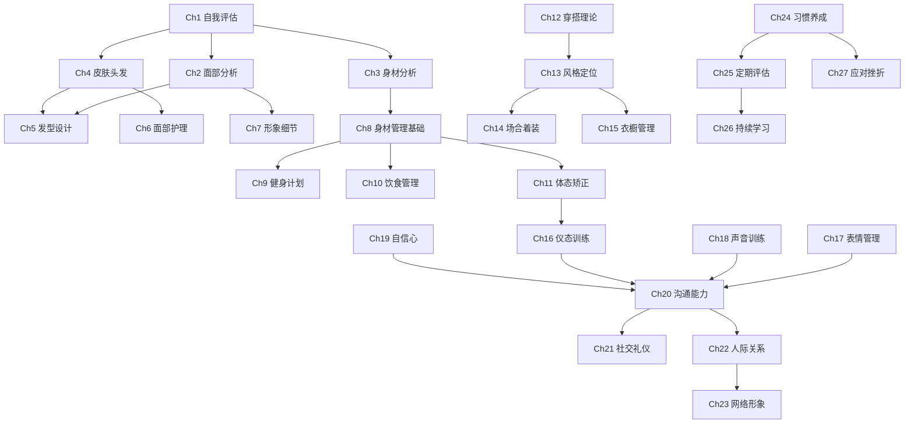
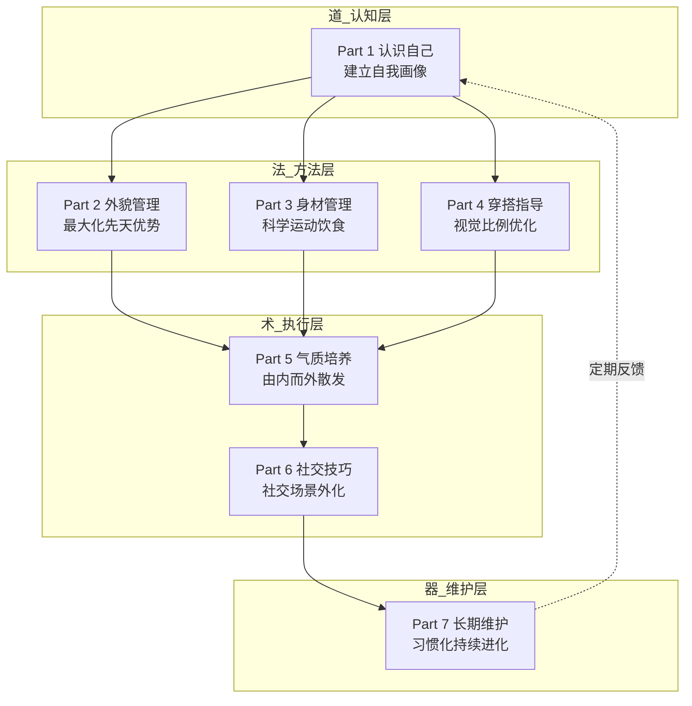

# 全书目录

## 《个人提升方案》完整导读

这是一本面向 28 岁左右、希望系统性提升个人形象与气质的男性读者的实操指南。全书遵循"道法术器"四层架构——先建立认知框架（道），再掌握方法论（法），然后落地为可执行的操作流程（术），最后匹配具体工具与产品（器）。

全书共 **7 大部分、27 章、4 个附录**，按照"认识自己 → 管理外在 → 塑造内在 → 社交外化 → 长期维护"的逻辑链展开。以下目录不仅是章节索引，更是你的**阅读导航图**——每章标注了核心关键词、预计阅读时间和难度等级，帮助你根据自身需求快速定位。

### 这本书适合谁

| 读者画像 | 典型诉求 | 推荐起点 |
|---|---|---|
| 25-35 岁男性，形象意识刚觉醒 | "不知道自己该怎么打扮" | Part 1 认识自己 → Part 2 外貌管理 |
| 有一定基础但缺乏系统性 | "偶尔打扮得不错，但不稳定" | Part 4 穿搭指导 → Part 5 气质培养 |
| 身材管理需求迫切 | "想减脂/增肌/改善体态" | Part 3 身材管理（第 8-11 章） |
| 社交场景频繁但表现不佳 | "形象还行，但社交时放不开" | Part 5 气质培养 → Part 6 社交技巧 |
| 已经在实践，需要长期坚持 | "知道怎么做，但总是半途而废" | Part 7 长期维护 |

### 本书的三个独特之处

1. **个性化定制**——不是泛泛而谈的"男性穿搭指南"，而是围绕具体身材数据（普通身高/正常体重、55 开比例、方形脸）给出针对性方案
2. **道法术器贯通**——每个知识点都从"为什么"讲到"怎么做"再到"用什么做"，不停留在表面建议
3. **可验证可迭代**——附录提供评估表格，第 25 章建立定期评估体系，让改变有据可循

### 全书阅读时间估算

| 阅读方式 | 预计用时 | 适用场景 |
|---|---|---|
| 通读全书（仅阅读） | 约 30 小时（8 周，每天 45 分钟） | 系统学习 |
| 边读边练（阅读+实操） | 约 60 小时（12 周，每天 1 小时） | 深度掌握 |
| 按需查阅 | 按具体问题定位章节 | 解决即时需求 |
| 快速改善（精选路线） | 约 15 小时（2-3 周） | 紧急提升形象 |

---

## 全书知识体系总览

```mermaid
graph TD
    A[个人提升方案] --> B[Part 1 认识自己]
    A --> C[Part 2 外貌管理]
    A --> D[Part 3 身材管理]
    A --> E[Part 4 穿搭指导]
    A --> F[Part 5 气质培养]
    A --> G[Part 6 社交技巧]
    A --> H[Part 7 长期维护]

    B --> B1[面部特征]
    B --> B2[身材特征]
    B --> B3[皮肤与头发]

    C --> C1[发型设计]
    C --> C2[面部护理]
    C --> C3[形象细节]

    D --> D1[健身计划]
    D --> D2[饮食管理]
    D --> D3[体态矫正]

    E --> E1[色彩与面料]
    E --> E2[风格定位]
    E --> E3[场合着装]
    E --> E4[衣橱管理]

    F --> F1[仪态训练]
    F --> F2[表情管理]
    F --> F3[声音训练]
    F --> F4[自信心]

    G --> G1[沟通能力]
    G --> G2[社交礼仪]
    G --> G3[人际关系]
    G --> G4[网络形象]

    H --> H1[习惯养成]
    H --> H2[定期评估]
    H --> H3[持续学习]
    H --> H4[应对挫折]

    style A fill:#1a1a2e,stroke:#e94560,color:#fff
    style B fill:#16213e,stroke:#0f3460,color:#fff
    style C fill:#16213e,stroke:#0f3460,color:#fff
    style D fill:#16213e,stroke:#0f3460,color:#fff
    style E fill:#16213e,stroke:#0f3460,color:#fff
    style F fill:#16213e,stroke:#0f3460,color:#fff
    style G fill:#16213e,stroke:#0f3460,color:#fff
    style H fill:#16213e,stroke:#0f3460,color:#fff
```



---

## 难度与能力成长路径

```mermaid
graph LR
    subgraph 入门⭐
        A1[Ch1 自我评估]
        A2[Ch2 面部分析]
        A3[Ch3 身材分析]
        A4[Ch4 皮肤头发]
        A5[Ch8 身材管理基础]
        A6[Ch15 衣橱管理]
        A7[Ch25 定期评估]
    end

    subgraph 初级⭐⭐
        B1[Ch5 发型设计]
        B2[Ch6 面部护理]
        B3[Ch7 形象细节]
        B4[Ch11 体态矫正]
        B5[Ch12 穿搭理论]
        B6[Ch13 风格定位]
        B7[Ch14 场合着装]
        B8[Ch16 仪态训练]
        B9[Ch17 表情管理]
        B10[Ch18 声音训练]
        B11[Ch21 社交礼仪]
        B12[Ch23 网络形象]
        B13[Ch24 习惯养成]
        B14[Ch26 持续学习]
    end

    subgraph 中级⭐⭐⭐
        C1[Ch9 健身计划]
        C2[Ch10 饮食管理]
        C3[Ch19 自信心]
        C4[Ch20 沟通能力]
        C5[Ch22 人际关系]
        C6[Ch27 应对挫折]
    end

    入门⭐ --> 初级⭐⭐ --> 中级⭐⭐⭐
```

---

## 章节依赖关系图

下图展示了各章之间的前置依赖关系——箭头指向的章节需要先学习箭头来源的章节。没有前置依赖的章节可以独立阅读。



---

## 阅读路线推荐

不同需求的读者可以选择不同的阅读路径：

| 你的核心需求 | 推荐路线 | 优先阅读章节 | 预计用时 | 核心收益 |
|---|---|---|---|---|
| 快速改善形象 | 外貌优先路线 | 第 1-2 章 → 第 5-6 章 → 第 12-14 章 | 约 2 周 | 2 周内外在形象有明显变化 |
| 减脂塑形 | 身材管理路线 | 第 3 章 → 第 8-11 章 → 第 10 章（饮食） | 约 4 周 | 建立科学训练+饮食体系 |
| 提升社交能力 | 社交突破路线 | 第 16-19 章 → 第 20-22 章 | 约 3 周 | 气质和社交表现显著提升 |
| 全面系统提升 | 完整学习路线 | 按顺序从第 1 章读到第 27 章 | 约 8 周 | 从内到外的系统性蜕变 |
| 解决具体问题 | 按需查阅路线 | 直接跳转对应章节 | 按需 | 精准解决当前痛点 |
| 面试/职场突击 | 职场形象路线 | 第 5 章 → 第 14.2 节 → 第 21 章 → 第 18 章 | 约 1 周 | 职场形象和表达能力快速提升 |
| 约会/社交准备 | 社交形象路线 | 第 5-7 章 → 第 14.4 节 → 第 17 章 → 第 21.4 节 | 约 10 天 | 外在+内在+礼仪全方位准备 |

### 各部分之间的关系



---

## 第一部分：认识自己

> **核心理念**：一切改变的起点是客观、全面地认识自己。不自欺，不自卑，不盲目——用数据和事实建立准确的自我画像。
>
> **阅读提示**：建议准备一面全身镜、一部手机（用于拍照记录）、一把软尺和一个体重秤。边读边做评估，效果远超纯阅读。
>
> **本部分定位**：这是全书的"地基"。后续所有改善方案——发型选什么、护肤用什么、训练怎么做、穿搭怎么搭——都建立在本部分建立的自我画像之上。跳过这部分直接看后面的章节，就像不量尺寸就去买衣服，大概率不合适。
>
> **预计总阅读时间**：约 2.5 小时 | **难度**：⭐ 入门

### 第一章 自我评估基础

**核心关键词**：自我认知 · 评估方法 · 记录工具
**难度**：⭐ 入门 | **预计阅读**：30 分钟
**前置依赖**：无（全书起点）
**本章成果**：完成个人"形象档案"初稿，包含面部、身材、皮肤、头发的基础数据

本章是全书的基石。你将学会如何科学、客观地评估自己的身体特征，建立个人"形象档案"，为后续所有改善方案提供数据依据。

#### 1.1 为什么要认识自己
- 自我认知的重要性——为什么"不了解自己"是一切形象问题的根源：不知道自己的脸型就选错发型，不知道自己的体型就买错衣服，不知道自己的肤质就用错护肤品
- 客观评估的意义——主观感受 vs 客观数据，哪个更可靠：研究表明人们对自身外貌的判断偏差率高达 40%，镜子里的你和照片里的你差异巨大
- 常见自我认知偏差——邓宁-克鲁格效应（能力差的人反而高估自己）、聚光灯效应（别人根本没那么关注你）、镜像偏差（镜像与真实方向相反）在形象认知中的表现

#### 1.2 身体特征评估方法
- 面部特征分析方法——脸型、五官比例、轮廓线条的系统评估
- 身材比例测量技巧——上下身比例、肩腰比、腿长比的精确测量
- 皮肤状况评估要点——肤质类型、含水量、油脂分泌、敏感度评估
- 头发特点分析方法——发质、发量、生长方向、头皮状况评估

#### 1.3 记录与分析工具
- 照片拍摄技巧——光线、角度、距离的标准化拍摄方法
- 数据测量工具使用——软尺、体脂秤、皮脂钳的操作指南
- 评估表格设计——结构化记录模板，包含所有关键指标
- 分析方法介绍——如何从数据中提取可行动的改善方向

---

### 第二章 面部特征分析

**核心关键词**：脸型分类 · 方形脸 · 颧骨修饰 · 面部比例
**难度**：⭐ 入门 | **预计阅读**：40 分钟
**前置依赖**：第一章（需要先完成基础评估）
**关联章节**：第五章（发型设计）、第七章（形象细节）、第十三章（风格定位）
**本章成果**：明确自己的脸型分类、优势区域和需要修饰的区域

本章深入解析面部结构，帮助你理解自己的脸型特点，并找到最适合的修饰策略。

#### 2.1 脸型分类与特点
- 常见脸型分类——圆形、方形、椭圆形、心形、菱形、五角形、长形等 7 种主流脸型
- 各脸型的特点分析——每种脸型的视觉印象、优势区域和需要修饰的区域
- 脸型与个人风格的关系——不同脸型适合的气质路线

#### 2.2 你的面部特征详解
- 方形脸型特点分析——方形脸的骨骼结构、视觉特征、在男性中的分布
- 颧骨突出的成因与影响——骨骼结构、脂肪分布、咬肌发达等多重因素分析
- 面部比例评估——三庭五眼标准、中庭偏长/偏短的修饰方法
- 优势与改善空间分析——哪些特征是优势需要强化，哪些需要视觉弱化

#### 2.3 面部特征与形象设计
- 脸型与发型搭配原则——不同脸型的发型禁忌与推荐
- 面部轮廓修饰方法——发型、胡须、光影的综合运用
- 五官比例优化技巧——眉毛、鼻梁、下颌的视觉调整方法
- 整体协调性设计——面部各元素的统一风格设计

---

### 第三章 身材特征分析

**核心关键词**：身材类型 · 55开比例 · 身高体重 · 体型成分
**难度**：⭐ 入门 | **预计阅读**：35 分钟
**前置依赖**：第一章（需要先完成基础评估）
**关联章节**：第八章（身材管理基础）、第十二章（穿搭理论）、第十四章（场合着装）
**本章成果**：明确自己的体型分类、体脂率范围、改善优先级

本章从骨骼结构、肌肉分布、脂肪比例三个维度全面解析身材特征。

#### 3.1 身材类型分类
- 常见身材类型介绍——外胚型（瘦长）、中胚型（运动）、内胚型（粗壮）三种基本体型
- 各身材类型的特点——骨骼宽度、肌肉增长潜力、脂肪堆积倾向
- 身材类型与穿搭关系——不同体型的服装选择策略

#### 3.2 你的身材特征详解
- 身高体重比例分析——普通身高/正常体重的 BMI 计算、体脂率估算、健康评估
- 55开身材比例特点——上下身比例接近 1:1 的视觉影响与优化策略
- 体型成分分析——肌肉量、脂肪量、骨量、水分的综合评估
- 改善空间评估——哪些维度可以通过训练改变，哪些需要通过穿搭优化

#### 3.3 身材管理原则
- 健康体重范围——基于身高、年龄、骨架的合理体重区间
- 身材优化目标设定——减脂、增肌、塑形的优先级排序
- 科学管理方法——运动、饮食、休息三位一体的管理框架
- 长期维护策略——从短期冲刺到长期习惯的转变方法

---

### 第四章 皮肤与头发分析

**核心关键词**：中性偏微油 · 头发塌软 · 护肤需求 · 发质改善
**难度**：⭐ 入门 | **预计阅读**：35 分钟
**前置依赖**：第一章（需要先完成基础评估）
**关联章节**：第五章（发型设计）、第六章（面部护理）
**本章成果**：明确自己的肤质类型、发质类型，建立个性化护理需求清单

本章针对皮肤和头发两大外在特征进行深度分析，建立个性化的护理起点。

#### 4.1 皮肤类型分类
- 常见皮肤类型介绍——干性、油性、中性、混合性、敏感性五种基本肤质
- 各皮肤类型的特点——皮脂分泌量、水分含量、屏障功能的差异
- 皮肤类型与护理关系——不同肤质的核心护理原则和产品选择逻辑

#### 4.2 你的皮肤特征详解
- 中性偏微油皮肤特点——皮脂分泌规律、T区与U区差异、季节性变化
- 皮肤问题分析——毛孔粗大、黑头、偶尔冒痘等问题的成因
- 护肤需求评估——控油、保湿、防晒、抗氧化的优先级排序
- 改善方向建议——从当前护肤流程到理想护理方案的升级路径

#### 4.3 头发类型分类
- 常见头发类型介绍——直发、卷发、粗硬发、细软发等分类
- 各头发类型的特点——毛鳞片状态、弹性、光泽度、造型难度
- 头发类型与造型关系——发质决定了哪些发型可行、哪些不可行

#### 4.4 你的头发特征详解
- 头发塌软的原因分析——发丝直径、毛囊密度、头皮油脂等多因素分析
- 发质特点评估——当前发质状态、健康度评分、可改善空间
- 造型难点分析——塌软发质在造型时遇到的具体问题
- 改善方法概述——从洗护到造型的系统改善思路

---

## 第二部分：外貌管理

> **核心理念**：外貌管理不是"伪装"，而是用科学方法最大化你的先天优势，弱化不足。好的形象管理是让别人看到最好的你，而不是一个假的你。
>
> **阅读提示**：这一部分包含大量产品推荐和操作步骤，建议准备好购物清单，按需采购。
>
> **本部分定位**：如果说 Part 1 是"体检报告"，那 Part 2 就是"治疗方案"。本部分针对第一部分发现的每个外在特征，给出具体的改善方法和工具。从发型到护肤到细节，覆盖男性外貌管理的完整链条。
>
> **预计总阅读时间**：约 3 小时 | **难度**：⭐⭐ 初级

### 第五章 发型设计与管理

**核心关键词**：脸型搭配 · 发质改善 · 造型技巧 · 推荐发型
**难度**：⭐⭐ 初级 | **预计阅读**：50 分钟
**前置依赖**：第二章（脸型分析）、第四章（头发分析）
**关联章节**：第十三章（风格定位）、第十四章（场合着装）
**本章成果**：确定 2-3 款适合自己的发型，掌握日常造型流程

发型是男性形象的第一张名片。本章从原理到实操，帮你找到最适合的发型并学会日常打理。

#### 5.1 脸型与发型搭配原理
- 脸型与发型的视觉关系——发型如何改变脸型的视觉比例
- 修饰脸型的发型设计原则——"缺什么补什么"的核心逻辑
- 方形脸型的发型选择——适合方形脸的具体发型方案
- 颧骨修饰的发型技巧——通过两侧鬓角和顶部长度修饰颧骨

#### 5.2 发质改善与护理
- 头发塌软的根本原因——从毛囊健康到发丝结构的深层分析
- 洗护产品选择指南——洗发水、护发素、发膜的成分解读与选择
- 正确的洗头方法——水温、手法、频率的科学指导
- 头发护理的日常习惯——睡前、出门前的护发要点

#### 5.3 发型造型技巧
- 吹风造型基础技巧——吹风机的正确使用方法、风向与温度控制
- 造型产品使用方法——发蜡、发泥、定型喷雾的区别与使用场景
- 日常快速造型方案——5 分钟出门发型的完整流程
- 特殊场合发型设计——面试、约会、商务场合的发型选择

#### 5.4 推荐发型详解
- 纹理烫短发设计——适合发量少、头发塌的纹理烫方案
- 侧分短发造型——经典商务休闲风格的侧分方案
- 飞机头打造方法——增高显精神的飞机头造型步骤
- 其他适合的发型——根据具体场景推荐的备选方案

---

### 第六章 面部护理与修饰

**核心关键词**：护肤理论 · 护肤方案 · 轮廓修饰 · 个人卫生
**难度**：⭐⭐ 初级 | **预计阅读**：50 分钟
**前置依赖**：第四章（皮肤分析）
**关联章节**：第七章（形象细节）、第十九章（自信心——外在改善对内在自信的影响）
**本章成果**：建立完整的日常护肤流程，掌握 2-3 种应急护肤方案

本章建立完整的护肤知识体系，并针对你的肤质给出具体方案。

#### 6.1 护肤基础理论
- 皮肤结构与功能——表皮、真皮、皮下组织的结构与功能
- 护肤成分解析——烟酰胺、水杨酸、透明质酸、维C等核心成分的作用机制
- 护肤步骤原理——为什么要按这个顺序护肤，每一步的作用是什么
- 产品选择原则——如何看懂成分表，避免被营销话术误导

#### 6.2 中性偏微油皮肤护理方案
- 日常护肤步骤详解——早晚护肤的完整流程（基于你现有产品优化升级）
- 产品推荐与使用方法——旁氏洗面奶、保湿乳液、抗氧化精华、防晒霜的最佳使用方法
- 季节变化调整策略——春夏控油、秋冬保湿的切换方案
- 特殊问题处理方法——爆痘、晒伤、换季敏感的应急处理

#### 6.3 面部轮廓修饰
- 化妆修饰基础技巧——男性自然妆容的底线在哪里
- 阴影与高光运用——修容粉/棒的使用方法，视觉收窄颧骨
- 自然妆容打造方法——遮瑕、均匀肤色的自然手法
- 日常快速修饰方案——2 分钟完成的自然修饰流程

#### 6.4 个人卫生习惯
- 日常清洁要点——面部、身体、手部的清洁频率和方法
- 口腔护理指南——牙齿清洁、口气管理、定期检查
- 身体护理建议——沐浴、体毛管理、指甲护理
- 清爽形象维护——止汗、体味管理、衣物清洁

---

### 第七章 个人形象细节

**核心关键词**：眉毛 · 眼部 · 唇部 · 鼻部
**难度**：⭐⭐ 初级 | **预计阅读**：40 分钟
**前置依赖**：第二章（面部特征分析，用于确定适合的眉形等）
**关联章节**：第六章（面部护理——共享护肤知识）、第十七章（表情管理——眼部细节影响眼神表达）
**本章成果**：掌握眉毛、眼部、唇部、鼻部四大细节区域的护理方法

魔鬼在细节中。本章关注那些容易被忽略但对形象影响巨大的小细节。

#### 7.1 眉毛管理
- 眉形与脸型搭配——不同脸型适合的眉形（方形脸适合略带角度的自然眉）
- 修眉基础技巧——工具选择、修眉步骤、常见错误避免
- 眉毛护理方法——眉毛生长方向调整、稀疏区域填补
- 自然眉形打造——避免"修过头"的自然感把控

#### 7.2 眼部护理
- 眼部皮肤特点——眼周皮肤为什么最容易老化
- 眼部护理产品选择——眼霜、眼膜的选择标准
- 黑眼圈与眼袋处理——不同类型黑眼圈（血管型/色素型/结构型）的针对性方案
- 眼镜框型选择——根据脸型选择镜框的完整指南

#### 7.3 唇部护理
- 唇部皮肤特点——唇部为什么容易干裂、唇色为什么会变深
- 唇部护理方法——润唇膏选择、去角质、防晒
- 唇部问题处理——干裂、脱皮、唇色暗沉的解决方案
- 自然唇色维护——保持健康唇色的日常习惯

#### 7.4 鼻部护理
- 鼻部皮肤特点——鼻翼毛孔为什么容易粗大
- 黑头处理方法——黑头的成因、物理/化学去黑头方法对比
- 鼻部毛孔护理——收敛毛孔的正确方法与常见误区
- 鼻部轮廓修饰——通过修容视觉调整鼻部比例

---

## 第三部分：身材管理

> **核心理念**：身材管理的本质是健康管理。不是追求极端体型，而是通过科学的运动和饮食，让身体处于最佳状态。对于 普通身高/正常体重的体型，核心目标是降低体脂率、增加肌肉比例、改善体态。
>
> **阅读提示**：开始任何训练计划前，建议先做一次全面体检。有膝盖、腰椎等问题的读者，请在医生指导下选择运动方式。
>
> **本部分定位**：外貌管理解决的是"表面问题"，身材管理解决的是"结构问题"。一个好的身材不仅让衣服更好看，更重要的是提升精力、改善体态、增强自信。本部分从认知到执行，建立完整的运动+饮食+体态管理体系。
>
> **预计总阅读时间**：约 3.5 小时 | **难度**：⭐⭐ 初级 → ⭐⭐⭐ 中级

### 第八章 身材管理基础

**核心关键词**：身材评估 · 管理误区 · 科学原则
**难度**：⭐ 入门 | **预计阅读**：30 分钟
**前置依赖**：第三章（身材特征分析）
**关联章节**：第九章（健身计划）、第十章（饮食管理）
**本章成果**：建立正确的身材管理认知，明确自己的身材管理目标和优先级

建立正确的身材管理认知，避免走弯路。

#### 8.1 身材管理的重要性
- 身材与健康的关系——体脂率与心血管、代谢、关节健康的关系
- 身材与形象的关系——同样的衣服穿在不同体型上的视觉差异
- 身材与自信的关系——身材管理对心理状态的正向影响
- 长期管理的意义——为什么"突击减肥"注定失败

#### 8.2 身材评估方法
- 体脂率测量方法——家用体脂秤、皮脂钳、目测法的精度对比
- 身材比例评估——肩宽、腰围、臀围、腿围的标准测量方法
- 身体成分分析——肌肉量、脂肪量、骨量、水分的综合解读
- 目标设定原则——SMART 原则在身材管理中的应用

#### 8.3 身材管理误区
- 常见误区解析——"不吃主食减肥""只做有氧不做力量""局部减脂"等 10 大误区
- 科学管理原则——热量缺口、渐进超负荷、恢复周期的三大支柱
- 健康第一理念——为什么"看起来健康"比"体重秤上的数字"更重要
- 避免极端方法——节食、过量运动、减肥药的风险

---

### 第九章 健身计划制定

**核心关键词**：有氧运动 · 力量训练 · 训练计划 · 运动生理
**难度**：⭐⭐⭐ 中级 | **预计阅读**：60 分钟
**前置依赖**：第八章（身材管理基础——需要先理解训练原理和误区）
**关联章节**：第十章（饮食管理——训练和饮食必须配合）、第十一章（体态矫正——部分训练动作重叠）
**本章成果**：制定一份适合自己当前水平的训练计划，掌握核心训练动作的标准姿势

全书最硬核的实操章节。从零开始构建你的训练体系。

#### 9.1 健身基础理论
- 运动生理学基础——能量系统（磷酸原/糖酵解/有氧氧化）的工作原理
- 能量代谢原理——基础代谢率、食物热效应、运动消耗的计算
- 肌肉生长机制——肌纤维撕裂→修复→超量恢复的科学原理
- 训练原则介绍——渐进超负荷、特异性、可逆性、个体差异四大原则

#### 9.2 有氧运动指南
- 有氧运动类型介绍——跑步、游泳、骑行、跳绳、HIIT 的对比
- 跑步训练计划——从零基础到 5 公里的 8 周渐进计划
- 游泳训练方法——适合大体重人群的低冲击有氧方案
- 其他有氧运动——跳绳、椭圆机、划船机的使用指南

#### 9.3 力量训练指南
- 力量训练基础动作——深蹲、硬拉、卧推、划船、推举五大复合动作
- 胸部训练方法——平板/上斜/下斜卧推、飞鸟、俯卧撑
- 背部训练方法——引体向上、划船、下拉、反向飞鸟
- 肩部训练方法——推举、侧平举、面拉、前平举
- 腿部训练方法——深蹲、腿举、箭步蹲、腿弯举
- 核心训练方法——平板支撑、死虫、鸟狗、卷腹

#### 9.4 综合训练计划
- 初级训练计划——适合零基础的 3 天/周全身训练计划（含组数、次数、休息时间）
- 中级训练计划——适合有 3-6 个月经验的 4 天/周上下肢分化计划
- 高级训练计划——适合 1 年以上经验的 5-6 天/周部位分化计划
- 训练计划调整——如何根据进度、疲劳度、时间灵活调整计划

---

### 第十章 饮食管理

**核心关键词**：营养学 · 减脂饮食 · 增肌饮食 · 饮食习惯
**难度**：⭐⭐⭐ 中级 | **预计阅读**：50 分钟
**前置依赖**：第八章（身材管理基础——需要先理解能量平衡原理）
**关联章节**：第九章（健身计划——训练和饮食必须配合）、第二十四章（习惯养成——饮食习惯是核心习惯之一）
**本章成果**：制定一份符合自己目标的饮食计划，掌握日常饮食决策能力

"三分练七分吃"——饮食管理是身材管理中最重要的环节。

#### 10.1 营养学基础
- 宏量营养素介绍——蛋白质、碳水化合物、脂肪的功能、比例、食物来源
- 微量营养素介绍——维生素、矿物质的日常需求与补充策略
- 能量平衡原理——热量摄入 vs 热量消耗的平衡方程
- 每日热量需求计算——基于你的体重、活动量的精确计算方法

#### 10.2 饮食计划设计
- 减脂饮食方案——热量缺口 300-500 大卡的减脂食谱示例
- 增肌饮食方案——热量盈余 200-300 大卡的增肌食谱示例
- 维持体重方案——热量平衡的日常饮食结构
- 特殊情况处理——外食、聚餐、出差时的饮食策略

#### 10.3 饮食习惯培养
- 健康饮食习惯——定时定量、细嚼慢咽、先菜后肉的饮食顺序
- 饮食误区解析——"晚上不吃会瘦""蛋白质吃多了伤肾"等常见误区
- 外食选择技巧——外卖、食堂、餐厅的健康选择策略
- 长期饮食管理——如何在社交和享受美食的同时保持饮食纪律

---

### 第十一章 体态矫正

**核心关键词**：圆肩 · 驼背 · 骨盆前倾 · 体态维护
**难度**：⭐⭐ 初级 | **预计阅读**：45 分钟
**前置依赖**：第八章（身材管理基础——需要先理解身体结构）
**关联章节**：第九章（健身计划——力量训练中的很多动作兼具体态矫正功能）、第十六章（仪态训练——体态矫正的"应用层"）
**本章成果**：识别自己是否存在体态问题，掌握每天 15 分钟的体态矫正例行训练

体态比体型更容易被忽视，但对形象的影响同样巨大。好的体态能让你看起来高 3-5 厘米、瘦 5-10 斤。

#### 11.1 常见体态问题
- 圆肩问题分析——久坐导致的胸肌紧张、背肌薄弱
- 驼背问题分析——上交叉综合征的表现与成因
- 骨盆前倾分析——下交叉综合征的表现与成因
- 其他体态问题——高低肩、X/O型腿、头前伸的识别

#### 11.2 体态评估方法
- 自我评估技巧——靠墙站立测试、侧面拍照分析
- 专业评估介绍——物理治疗师评估、运动功能筛查
- 问题识别方法——疼痛部位与体态问题的对应关系
- 改善目标设定——从最严重的问题开始，逐步改善

#### 11.3 体态矫正训练
- 圆肩矫正训练——胸肌拉伸 + 中下斜方肌强化的具体动作
- 驼背矫正训练——胸椎灵活性训练 + 背部力量强化
- 骨盆前倾矫正——髂腰肌拉伸 + 臀肌强化 + 腹肌训练
- 综合体态改善——每天 15 分钟的体态矫正例行训练

#### 11.4 日常体态维护
- 正确站姿要点——重心分布、脊柱中立、肩膀位置
- 正确坐姿要点——办公椅调节、屏幕高度、定时起身
- 正确走姿要点——步幅、摆臂、目光方向
- 体态意识培养——将正确体态融入日常生活的提醒机制

---

## 第四部分：穿搭指导

> **核心理念**：穿搭的本质是"视觉管理"——通过服装的色彩、款式、比例来优化你的视觉形象。对于 普通身高 的身高，穿搭的核心任务是：拉长视觉比例、营造挺拔感、建立个人风格。
>
> **阅读提示**：建议边读边整理衣橱，把不符合原则的衣物淘汰，按推荐清单逐步补充。
>
> **本部分定位**：前面三个部分解决了"你是什么样的人"（认识自己）和"如何改善硬件"（外貌+身材），本部分解决"如何用服装包装自己"。穿搭是最快速、最低成本的形象提升手段——换一套搭配可能只需要 10 分钟，效果却立竿见影。
>
> **预计总阅读时间**：约 2.5 小时 | **难度**：⭐⭐ 初级

### 第十二章 穿搭基础理论

**核心关键词**：色彩理论 · 穿搭原则 · 面料知识
**难度**：⭐⭐ 初级 | **预计阅读**：40 分钟
**前置依赖**：无（可独立阅读，但先读完 Part 1 效果更好）
**关联章节**：第十三章（风格定位——理论基础直接支撑风格选择）
**本章成果**：掌握色彩搭配原理、穿搭四大原则、常见面料特性

穿搭的底层逻辑。掌握这些原理，你就能自己判断任何一套搭配是否合理。

#### 12.1 色彩理论基础
- 色彩三要素介绍——色相、明度、纯度在穿搭中的应用
- 色彩搭配原理——同色系、互补色、对比色的搭配方法
- 个人色彩诊断——冷暖色调判断、适合的色彩范围
- 色彩与身材关系——深色收缩、浅色膨胀的视觉原理

#### 12.2 穿搭基本原则
- 比例协调原则——上短下长、腰线位置、视觉重心的控制
- 风格统一原则——同一套搭配中风格元素的一致性
- 场合适应原则——不同场合的着装规范与灵活变通
- 个性表达原则——在得体的框架内展现个人特色

#### 12.3 服装面料知识
- 常见面料介绍——棉、麻、丝、毛、化纤、混纺的特点
- 面料特性分析——透气性、垂感、弹性、耐久性的对比
- 面料选择技巧——不同季节、场合的面料搭配
- 面料护理方法——不同面料的清洗、熨烫、存放要点

---

### 第十三章 风格定位

**核心关键词**：个人风格 · 休闲 · 商务休闲 · 正式商务
**难度**：⭐⭐ 初级 | **预计阅读**：40 分钟
**前置依赖**：第十二章（穿搭基础理论——需要先理解色彩和比例）
**关联章节**：第十四章（场合着装——风格在不同场合的具体应用）、第十五章（衣橱管理——风格决定买什么）
**本章成果**：确定 1-2 个主要风格方向，建立个人风格关键词

找到属于你的风格，让穿搭成为你个性的延伸。

#### 13.1 个人风格探索
- 风格类型介绍——休闲、商务休闲、正式商务、街头、极简、复古等主流风格
- 个人偏好分析——通过衣橱分析发现你的风格倾向
- 生活方式考量——日常通勤、社交活动、休闲场景的着装需求
- 职业要求评估——不同行业对着装的要求与灵活空间

#### 13.2 适合你的风格推荐
- 休闲风格详解——舒适自然的日常休闲穿搭方案
- 商务休闲风格——Smart Casual 的搭配公式与适用场景
- 正式商务风格——商务正装的选择与搭配要点
- 混搭风格探索——不同风格元素的创新组合

#### 13.3 风格元素运用
- 色彩运用技巧——主色、辅色、点缀色的 6:3:1 法则
- 款式搭配方法——宽松与修身的平衡、层次感的营造
- 配饰点缀技巧——手表、腰带、包袋、帽子的选择
- 细节处理要点——袖口、领口、裤脚的精致处理

---

### 第十四章 场合着装

**核心关键词**：日常休闲 · 职场 · 社交 · 特殊场合
**难度**：⭐⭐ 初级 | **预计阅读**：45 分钟
**前置依赖**：第十三章（风格定位——需要先确定自己的风格方向）
**关联章节**：第二十一章（社交礼仪——着装是礼仪的一部分）、第二十三章（网络形象——线上形象也需要场合意识）
**本章成果**：建立完整的场合着装决策框架，能快速判断任何场合该穿什么

不同场合穿什么——这是最实用的穿搭指南。

#### 14.1 日常休闲着装
- 休闲场合特点——周末、逛街、朋友聚会的着装自由度
- 休闲装搭配方案——T恤+牛仔裤、卫衣+休闲裤等基础公式
- 舒适与时尚平衡——如何在舒服的前提下不显得邋遢
- 快速搭配技巧——"闭眼穿"也不会出错的基础款组合

#### 14.2 职场着装
- 职场着装要求——互联网、金融、创意等不同行业的着装规范
- 商务正装搭配——西装、衬衫、领带、皮鞋的完整搭配
- 商务休闲搭配——不穿西装也能显得专业的搭配方案
- 职场形象管理——面试、日常办公、客户见面的不同要求

#### 14.3 社交场合着装
- 正式社交场合——晚宴、颁奖典礼的着装规范
- 半正式社交场合——商务酒会、行业论坛的着装建议
- 休闲社交场合——聚餐、KTV、户外活动的轻松搭配
- 特殊场合着装——毕业典礼、同学会等场合的选择

#### 14.4 特殊场合着装
- 婚礼着装指南——作为宾客/伴郎的着装规范
- 面试着装指南——不同行业面试的穿搭策略
- 约会着装指南——第一次约会、日常约会的不同风格
- 旅行着装指南——飞机、高铁、景区的舒适又好看搭配

---

### 第十五章 购物与衣橱管理

**核心关键词**：聪明购物 · 基础款 · 衣橱系统 · 服装保养
**难度**：⭐ 入门 | **预计阅读**：35 分钟
**前置依赖**：第十三章（风格定位——需要先知道自己的风格方向才能决定买什么）
**关联章节**：第十二章（穿搭理论——面料知识帮助鉴别品质）
**本章成果**：整理出现有衣橱的"保留/淘汰"清单，建立 20 件基础款购物计划

管好你的衣橱，让每一件衣服都物尽其用。

#### 15.1 聪明购物指南
- 购物计划制定——按需购物 vs 冲动购物的区别
- 预算管理技巧——如何分配服装预算（基础款 vs 潮流款的比例）
- 购物时机选择——换季折扣、品牌促销的最佳时机
- 品质鉴别方法——面料、做工、版型的质量判断标准

#### 15.2 衣橱系统建设
- 基础款清单——男性必备的 20 件基础款衣物清单
- 必备单品介绍——白T、深色牛仔裤、海军蓝西装外套等核心单品详解
- 衣橱结构设计——按场合/季节/颜色的衣橱组织方法
- 季节性调整——春夏与秋冬衣橱的切换策略

#### 15.3 服装保养
- 日常保养方法——不同材质衣物的日常护理要点
- 清洗注意事项——水温、洗涤剂、机洗/手洗的选择
- 存放技巧——衣架选择、折叠方法、防虫防潮
- 延长使用寿命——小修补、定期护理让衣物穿更久

---

## 第五部分：气质培养

> **核心理念**：气质是外在形象的灵魂。再好的穿搭和发型，配上畏缩的体态和闪躲的眼神，都会大打折扣。气质培养的核心是：让身体成为你自信的载体。
>
> **阅读提示**：气质训练需要时间积累，建议每天抽出 10-15 分钟做针对性练习。
>
> **本部分定位**：前面四个部分解决的是"看起来怎么样"，本部分解决"感觉怎么样"。气质是一种综合感受——你的站姿、眼神、微笑、声音、自信程度，共同构成了别人对你的"气场"感知。气质无法速成，但可以通过系统训练逐步提升。
>
> **预计总阅读时间**：约 2.5 小时 | **难度**：⭐⭐ 初级 → ⭐⭐⭐ 中级

### 第十六章 仪态训练

**核心关键词**：站姿 · 坐姿 · 走姿 · 肢体语言
**难度**：⭐⭐ 初级 | **预计阅读**：40 分钟
**前置依赖**：第十一章（体态矫正——先矫正体态问题，再训练仪态表达）
**关联章节**：第十七章（表情管理——仪态+表情=完整的身体语言）、第二十章（沟通能力——非语言沟通的基础）
**本章成果**：掌握正确的站/坐/走姿，能有意识地控制自己的肢体语言

仪态是气质的物理基础。好的仪态能让你看起来更有气场、更值得信赖。

#### 16.1 站姿训练
- 正确站姿要点——头顶延伸感、肩膀下沉、核心收紧、重心均匀分布
- 站姿训练方法——靠墙站立、头顶书本等具体训练动作
- 站姿改善技巧——针对含胸、塌腰、重心偏移的矫正方法
- 日常站姿维护——等电梯、排队、交谈时的站姿意识

#### 16.2 坐姿训练
- 正确坐姿要点——脊柱中立、双脚平放、肩膀放松、目光平视
- 坐姿训练方法——核心稳定训练、髋关节灵活性训练
- 坐姿改善技巧——久坐族的坐姿矫正方案
- 不同场合坐姿——办公、会议、咖啡厅、沙发的不同坐姿要求

#### 16.3 走姿训练
- 正确走姿要点——步幅适中、脚跟先着地、手臂自然摆动、目光前方
- 走姿训练方法——直线行走、节奏控制、上半身稳定性训练
- 走姿改善技巧——内八/外八、拖沓步态的矫正方法
- 步态优化方案——让你的走路姿态更有气场

#### 16.4 手势与肢体语言
- 手势运用技巧——交谈时的手势规范、演讲时的手势增强
- 肢体语言解读——读懂他人的肢体信号（交叉手臂、脚尖方向等）
- 正面肢体语言——开放姿态、适度前倾、镜像效应的运用
- 避免负面肢体语言——抖腿、抱臂、低头等削弱气场的习惯

---

### 第十七章 表情管理

**核心关键词**：第一印象 · 微笑训练 · 眼神交流 · 表情控制
**难度**：⭐⭐ 初级 | **预计阅读**：35 分钟
**前置依赖**：无（可独立阅读，但先完成第七章的形象细节能提升效果）
**关联章节**：第十六章（仪态训练——仪态+表情=完整的身体语言）、第二十章（沟通能力——表情是非语言沟通的核心）
**本章成果**：掌握自然微笑的技巧，能进行有意识的眼神交流，控制无意识的负面表情

你的表情决定了别人对你的第一印象。学会管理表情，就是学会管理别人对你的感受。

#### 17.1 表情的重要性
- 表情与第一印象——心理学研究：人们在 0.1 秒内就形成了对你的第一印象
- 表情与沟通效果——同样的内容，不同的表情传达出完全不同的信息
- 表情与个人形象——"面无表情"和"表情丰富"各自的优缺点
- 表情管理的意义——不是"演戏"，而是让真实的内心状态正确地外化

#### 17.2 微笑训练
- 微笑的种类——社交性微笑、真诚微笑、礼节性微笑的区别
- 自然微笑训练——苹果肌发力、嘴角上扬角度、眼睛参与的练习方法
- 微笑时机把握——什么时候微笑最合适，什么时候不该笑
- 微笑与亲和力——微笑如何拉近人际距离

#### 17.3 眼神交流
- 眼神交流技巧——注视区域（三角区）、持续时间、转移频率
- 眼神表达含义——自信、友善、专注、回避等不同眼神的含义
- 眼神训练方法——镜前练习、日常对话中的刻意练习
- 避免眼神问题——死盯、飘忽、翻白眼等不良眼神习惯

#### 17.4 面部表情控制
- 面部肌肉训练——额头、眉毛、嘴角的肌肉控制练习
- 表情控制技巧——在紧张/生气/尴尬时保持镇定的方法
- 避免负面表情——皱眉、撇嘴、翻白眼等无意识负面表情的纠正
- 表情与场合匹配——严肃场合、轻松场合、悲伤场合的表情分寸

---

### 第十八章 声音训练

**核心关键词**：发音 · 语调 · 音量 · 语速
**难度**：⭐⭐ 初级 | **预计阅读**：40 分钟
**前置依赖**：无（可独立阅读）
**关联章节**：第二十章（沟通能力——声音是沟通的载体）、第十九章（自信心——声音状态反映心理状态）
**本章成果**：改善发音清晰度，掌握语调变化技巧，能根据场合调整音量和语速

声音是被严重低估的形象元素。一个好听、清晰、有控制力的声音能显著提升你的说服力和魅力。

#### 18.1 声音的重要性
- 声音与个人形象——声音占第一印象权重的 38%（梅拉比安法则）
- 声音与沟通效果——同样的内容用不同声音表达的效果差异
- 声音与自信表达——声音颤抖、音量过小如何暴露内心的不自信
- 声音训练的意义——声音是可以训练的，每个人都能改善

#### 18.2 发音训练
- 普通话发音基础——声母、韵母、声调的准确认知
- 发音清晰度训练——绕口令、口腔开合度、舌头灵活性练习
- 发音准确性提升——常见易错字音的纠正清单
- 发音习惯改善——方言口音、含混不清的系统矫正

#### 18.3 语调训练
- 语调变化技巧——升调、降调、平调的情感色彩
- 语调与情感表达——如何通过语调传递热情、严肃、关心等情绪
- 语调与说服力——重点词的重音处理、句末语调的控制
- 语调训练方法——跟读练习、录音回听、模仿优秀演讲者

#### 18.4 音量与语速控制
- 音量控制技巧——根据场合调整音量、用腹部发声增强音量
- 语速控制方法——过快/过慢的语速问题、找到最佳语速
- 音量与场合匹配——会议室、咖啡厅、电话等不同场景的音量
- 语速与表达效果——关键信息放慢、过渡内容加快的节奏感

---

### 第十九章 自信心建设

**核心关键词**：自信 · 自我认知 · 心理建设 · 长期维护
**难度**：⭐⭐⭐ 中级 | **预计阅读**：45 分钟
**前置依赖**：无（可独立阅读，但在完成前面外在改善后阅读效果更佳——外在改善会自然增强自信）
**关联章节**：第二十七章（应对挫折——挫折是自信的最大敌人）、第二十四章（习惯养成——自信行为需要习惯化）
**本章成果**：识别自己的自信障碍，建立 3-5 个日常自信维护习惯

自信是所有外在改善的内在根基。没有自信，再好的外形也只是空壳。

#### 19.1 自信心的重要性
- 自信与个人形象——自信的人自带"光环效应"，让人不自觉地高估其能力
- 自信与人际关系——自信的人更容易建立平等、健康的人际关系
- 自信与事业发展——自信影响面试表现、谈判能力、领导力
- 自信与生活质量——自信的人更敢于尝试、更少焦虑、更享受生活

#### 19.2 自我认知建设
- 自我认知偏差分析——冒名顶替综合征、完美主义、灾难化思维的识别
- 客观自我评估——用事实和数据替代主观感受
- 优势发现与强化——列出你的 10 个优势并持续强化
- 不足接纳与改善——区分"可以改变的"和"需要接纳的"

#### 19.3 自信心培养方法
- 积极心理暗示——自我对话的重塑、肯定语的正确使用方法
- 成功经验积累——"小胜累积法"：从微小成就开始建立信心
- 恐惧克服训练——暴露疗法的日常应用、舒适区渐进扩展
- 自信行为练习——"假装自信直到真正自信"的行为疗法

#### 19.4 自信心维护
- 自信心波动应对——正常化自信的波动，不要因为一次低谷否定全部
- 挫折后的信心恢复——失败复盘的正确方法、从挫折中提取养分
- 长期自信力建设——通过持续学习和成长建立稳固的自信根基
- 自信与谦逊平衡——自信不等于自大，保持开放和学习的心态

---

## 第六部分：社交技巧

> **核心理念**：个人提升的最终目的是更好地与他人连接。社交技巧不是"套路"，而是真诚地与人建立关系的能力。这一部分教你如何把前面所有的内在和外在提升，在社交场景中自然地展现出来。
>
> **阅读提示**：社交技巧的最佳练习场景是日常——每一次对话、每一次聚会都是练习机会。
>
> **本部分定位**：前面五个部分解决的是"个人层面"的问题，本部分进入"关系层面"。你改善了外形、提升了气质，最终要在社交场景中"变现"。本部分从沟通、礼仪、人际关系、网络形象四个维度，建立完整的社交能力体系。
>
> **预计总阅读时间**：约 3 小时 | **难度**：⭐⭐ 初级 → ⭐⭐⭐ 中级

### 第二十章 沟通能力提升

**核心关键词**：沟通理论 · 语言表达 · 倾听技巧 · 非语言沟通
**难度**：⭐⭐⭐ 中级 | **预计阅读**：50 分钟
**前置依赖**：第十七章（表情管理）、第十八章（声音训练）、第十六章（仪态训练）——这三章是"非语言沟通"的基础
**关联章节**：第二十一章（社交礼仪——沟通在礼仪框架中的应用）、第二十二章（人际关系——沟通是关系建立的核心能力）
**本章成果**：掌握结构化表达方法，提升倾听能力，能综合运用语言和非语言沟通

沟通能力是社交的核心技能。本章从理论到实操，系统提升你的沟通水平。

#### 20.1 沟通基础理论
- 沟通的要素——发送者、信息、渠道、接收者、反馈、噪声的完整模型
- 沟通的类型——口头、书面、非语言沟通的特点与适用场景
- 沟通的障碍——认知偏差、情绪干扰、文化差异、语言障碍
- 有效沟通原则——清晰、简洁、共情、倾听的四大原则

#### 20.2 语言表达技巧
- 表达清晰度提升——结构化表达（结论先行）、避免歧义、举例说明
- 逻辑性训练——因果关系、时间顺序、总分结构的表达框架
- 说服力增强——亚里士多德的说服三角（逻辑/情感/信誉）
- 幽默感培养——幽默的类型、时机把握、避免踩雷

#### 20.3 倾听技巧
- 主动倾听方法——复述、提问、总结的三步法
- 倾听的障碍——选择性倾听、急于回应、内心评判
- 倾听与反馈——如何给出建设性的回应而非敷衍
- 倾听与理解——区分"听到"和"听懂"的差距

#### 20.4 非语言沟通
- 肢体语言运用——开放姿态、适度前倾、镜像效应
- 表情管理应用——微笑、眼神接触、眉毛动作的沟通功能
- 空间距离把握——亲密距离、个人距离、社交距离、公共距离
- 非语言信号解读——识别对方的真实态度（言行不一致时以非语言为准）

---

### 第二十一章 社交礼仪

**核心关键词**：日常礼仪 · 餐桌礼仪 · 商务礼仪 · 特殊场合
**难度**：⭐⭐ 初级 | **预计阅读**：45 分钟
**前置依赖**：第二十章（沟通能力——礼仪的本质是沟通规范）
**关联章节**：第十四章（场合着装——着装是礼仪的视觉部分）、第二十二章（人际关系——礼仪是关系维护的润滑剂）
**本章成果**：掌握日常、餐桌、商务、特殊场合四大场景的礼仪规范

礼仪是社交的润滑剂。掌握基本礼仪让你在任何场合都从容不迫。

#### 21.1 日常社交礼仪
- 见面礼仪规范——握手、点头、称呼的规范与文化差异
- 介绍礼仪要点——自我介绍、为他人介绍的顺序与技巧
- 交谈礼仪规范——话题选择、回应方式、结束对话的技巧
- 告别礼仪要点——得体的告别方式、后续跟进

#### 21.2 餐桌礼仪
- 中餐礼仪规范——座次安排、点菜技巧、敬酒规矩、筷子禁忌
- 西餐礼仪规范——刀叉使用、用餐顺序、餐巾礼仪
- 商务宴请礼仪——谁点菜、谁买单、如何交谈
- 自助餐礼仪——取餐顺序、盘子使用、社交分寸

#### 21.3 商务礼仪
- 商务见面礼仪——名片交换、握手力度、目光接触
- 商务交谈礼仪——话题禁区、倾听姿态、适时回应
- 商务宴请礼仪——选餐厅、定时间、座次安排
- 商务礼品礼仪——送礼时机、金额分寸、文化禁忌

#### 21.4 特殊场合礼仪
- 婚礼礼仪规范——份子钱标准、着装要求、敬酒礼节
- 面试礼仪要点——提前到达、进门礼仪、坐姿、告别
- 约会礼仪指南——邀请方式、餐厅选择、买单习惯
- 公共场合礼仪——电影院、图书馆、公共交通的行为规范

---

### 第二十二章 人际关系管理

**核心关键词**：社交圈 · 冲突处理 · 关系维护 · 社交网络
**难度**：⭐⭐⭐ 中级 | **预计阅读**：45 分钟
**前置依赖**：第二十章（沟通能力——关系建立和维护的基础是沟通）
**关联章节**：第二十三章（网络形象——线上关系管理）、第二十四章（习惯养成——关系维护需要习惯化）
**本章成果**：建立自己的社交圈分层模型，掌握冲突处理和关系维护的核心方法

建立和维护高质量的人际关系，是个人提升的长期回报。

#### 22.1 人际关系基础
- 人际关系的重要性——社会支持网络对心理健康和事业发展的影响
- 人际关系的类型——工作关系、朋友关系、亲密关系、泛社交关系
- 人际关系的建立——共同兴趣、互惠互利、真诚连接的三个基础
- 人际关系的维护——定期联络、主动关心、价值交换的长期策略

#### 22.2 社交圈建设
- 社交圈的构成——核心圈（5人）、亲密圈（15人）、朋友圈（50人）、认识圈（150人）
- 社交圈扩展方法——兴趣社群、行业活动、朋友介绍、线上社区
- 社交圈质量提升——淘汰消耗型关系、培养滋养型关系
- 社交圈维护技巧——定期聚会、节日问候、信息共享

#### 22.3 人际冲突处理
- 冲突的原因分析——利益冲突、认知差异、沟通误解、性格摩擦
- 冲突的预防方法——提前沟通期望、建立共同规则、定期检查关系
- 冲突的解决技巧——非暴力沟通、换位思考、寻找双赢方案
- 冲突后的关系修复——道歉的艺术、信任重建、关系升级

#### 22.4 社交网络管理
- 社交网络的重要性——弱关系理论：最有机会的连接往往来自弱关系
- 社交网络建设方法——主动提供价值、参加行业活动、维护校友关系
- 社交网络维护技巧——定期互动、信息分享、互惠互助
- 社交网络风险防范——社交工程攻击、隐私泄露、关系边界

---

### 第二十三章 网络形象管理

**核心关键词**：网络形象 · 社交媒体 · 专业形象 · 网络礼仪
**难度**：⭐⭐ 初级 | **预计阅读**：35 分钟
**前置依赖**：第二十二章（人际关系——网络形象是人际关系的延伸）
**关联章节**：第二十一章（社交礼仪——网络礼仪是社交礼仪的线上版本）
**本章成果**：优化个人社交媒体形象，建立专业网络形象

在数字时代，你的网络形象就是你的第二张名片。

#### 23.1 网络形象的重要性
- 网络形象与现实形象——线上形象如何影响线下的机会
- 网络形象的影响——HR 背调、社交搜索、合作方评估
- 网络形象管理的意义——主动塑造 vs 被动暴露
- 网络形象风险防范——负面信息的预防与应对

#### 23.2 社交媒体形象
- 社交媒体选择——微信、微博、抖音、小红书等平台的定位差异
- 内容发布策略——分享什么、不分享什么、发布的频率与时机
- 互动技巧提升——评论、转发、私信的社交规范
- 负面信息处理——被误解、被攻击时的应对策略

#### 23.3 专业网络形象
- 专业平台选择——LinkedIn、GitHub、知乎等专业平台的定位
- 个人资料优化——头像、简介、经历的优化技巧
- 专业内容分享——行业见解、项目经验、学习笔记的分享策略
- 专业形象维护——持续更新、回应评论、建立专业声誉

#### 23.4 网络礼仪
- 网络沟通礼仪——文字沟通的语气、表情包使用、回复时效
- 网络评论规范——理性讨论、避免人身攻击、尊重不同观点
- 网络隐私保护——个人信息的保护策略、隐私设置
- 网络安全意识——密码管理、钓鱼识别、社交工程防范

---

## 第七部分：长期维护与提升

> **核心理念**：个人提升不是一次性工程，而是持续终身的自我投资。这一部分解决的核心问题是：如何把短期改变变成长期习惯，如何在遇到挫折时坚持下去，如何持续进化。
>
> **阅读提示**：这是全书的"收官"部分，建议在完成前面 1-2 个部分的实践后再阅读，效果更好。
>
> **本部分定位**：前面六个部分教了你"怎么做"，本部分解决"怎么坚持"和"怎么持续进步"。很多人的个人提升之所以失败，不是因为不知道方法，而是因为没有建立可持续的系统。本部分帮你把一次性改变变成终身习惯。
>
> **预计总阅读时间**：约 2 小时 | **难度**：⭐⭐ 初级 → ⭐⭐⭐ 中级

### 第二十四章 习惯养成

**核心关键词**：微习惯 · 习惯叠加 · 习惯追踪 · 形象管理习惯
**难度**：⭐⭐ 初级 | **预计阅读**：35 分钟
**前置依赖**：无（可独立阅读，但在实践中阅读效果更佳）
**关联章节**：第二十五章（定期评估——习惯需要评估来验证效果）、第二十七章（应对挫折——习惯中断是最大的挫折）
**本章成果**：为自己的形象管理建立一套"自动化"的日常习惯系统

所有长期改变最终都归结为习惯。本章帮你把前面学到的一切变成自动执行的日常行为。

#### 24.1 习惯的重要性
- 习惯与个人形象——90% 的日常行为是习惯驱动的
- 习惯与生活质量——好习惯的复利效应
- 习惯与长期成功——自律 ≠ 痛苦，习惯化的行为不消耗意志力
- 习惯养成的意义——从"刻意做"到"自然而然"

#### 24.2 习惯养成方法
- 习惯养成原理——提示 → 渴求 → 回应 → 奖赏的四步循环
- 微习惯策略——从"小到不可能失败"的行为开始
- 习惯叠加技巧——把新习惯绑定到已有的日常行为上
- 习惯追踪方法——打卡表、进度条、量化记录的使用

#### 24.3 形象管理习惯
- 日常护理习惯——早晚护肤、出门前形象检查的标准化流程
- 穿搭管理习惯——每周搭配计划、衣物护理的定时提醒
- 健身运动习惯——固定时间、固定地点、固定流程的运动仪式感
- 学习提升习惯——每天 30 分钟的自我提升阅读/学习

#### 24.4 习惯维护与调整
- 习惯维护技巧——环境设计、社交承诺、奖励机制
- 习惯中断处理——"不要连续错过两次"的恢复策略
- 习惯优化调整——定期审视习惯的有效性，淘汰无效习惯
- 新习惯培养——何时增加新习惯、如何与现有习惯协调

---

### 第二十五章 定期评估与调整

**核心关键词**：评估方法 · 评估周期 · 调整策略 · 数据驱动
**难度**：⭐ 入门 | **预计阅读**：30 分钟
**前置依赖**：第二十四章（习惯养成——评估的对象是习惯的执行效果）
**关联章节**：第一章（自我评估——定期评估是第一章评估方法的周期性复用）、第二十六章（持续学习——评估结果决定学习方向）
**本章成果**：建立日/周/月/季四级评估体系，能用数据驱动自己的提升方向

没有评估的改变是盲目的。本章建立科学的评估体系，让你的提升有据可循。

#### 25.1 评估的重要性
- 评估与改进——没有数据就没有方向
- 评估与动力——看到进步是最好的动力来源
- 评估与目标——定期评估帮助校准目标的合理性
- 评估与调整——及时发现问题，避免在错误方向上越走越远

#### 25.2 评估方法
- 照片对比方法——同角度、同光线的定期照片对比
- 数据测量方法——体重、体脂率、围度的定期测量
- 自我感受评估——精力、自信、舒适度的主观评分
- 他人反馈收集——如何获取真实有效的外部反馈

#### 25.3 评估周期设定
- 日常检查要点——每天 1 分钟的形象自检清单
- 周度评估内容——每周回顾本周的执行情况
- 月度评估重点——每月对比照片和数据，评估趋势
- 季度评估规划——每季度全面审视目标和策略

#### 25.4 调整策略
- 计划调整原则——"微调优于大改"的渐进式调整
- 目标调整方法——目标过高/过低时的重新校准
- 策略调整技巧——A/B 测试思维在个人提升中的应用
- 资源调整建议——时间、金钱、精力的重新分配

---

### 第二十六章 持续学习与成长

**核心关键词**：学习资源 · 学习方法 · 知识应用 · 学习社区
**难度**：⭐⭐ 初级 | **预计阅读**：30 分钟
**前置依赖**：第二十五章（定期评估——评估结果决定学习方向）
**关联章节**：第十九章（自信心——持续成长是长期自信的根基）
**本章成果**：建立个人学习资源库，掌握高效学习方法

个人提升没有终点。持续学习让你始终保持进化。

#### 26.1 学习的重要性
- 学习与个人提升——知识和技能是唯一越用越多的资源
- 学习与时代发展——审美标准、社交规则、职业要求都在变化
- 学习与竞争力——持续学习者在职场和社交中的长期优势
- 学习与生活质量——学习新事物本身就是快乐的来源

#### 26.2 学习资源利用
- 书籍阅读指南——形象管理、心理学、社交技巧的推荐书单
- 网络学习资源——YouTube、B站、知乎等平台的优质内容筛选
- 课程学习选择——线上课程、线下工作坊的选择标准
- 实践学习方法——"学一个用一个"的实践驱动学习

#### 26.3 学习方法优化
- 高效学习技巧——费曼学习法、间隔重复、主动回忆的运用
- 学习计划制定——每周/每月的学习目标设定
- 学习效果评估——如何检验自己是否真正掌握了所学内容
- 学习习惯培养——把学习变成像刷牙一样的日常行为

#### 26.4 知识应用与分享
- 知识应用方法——从"知道"到"做到"的转化策略
- 学习成果输出——写笔记、做分享、教别人是最好的学习
- 知识分享技巧——如何在社交媒体上分享有价值的内容
- 学习社区参与——加入同好社群、参加线下活动、建立学习伙伴

---

### 第二十七章 应对挑战与挫折

**核心关键词**：动力不足 · 时间管理 · 压力管理 · 长期坚持
**难度**：⭐⭐⭐ 中级 | **预计阅读**：40 分钟
**前置依赖**：第二十四章（习惯养成——习惯中断是最大的挑战来源）
**关联章节**：第十九章（自信心——挫折是自信的最大敌人）、第二十五章（定期评估——评估帮助发现挫折的根源）
**本章成果**：建立个人的"挫折应对预案"，能在动力低谷时自我恢复

改变的路上一定会有挫折。本章帮你提前准备应对方案。

#### 27.1 常见挑战分析
- 动力不足问题——三分钟热度的心理机制与破解方法
- 时间管理困难——如何在繁忙的工作和生活中挤出提升时间
- 经济压力影响——预算有限时的优先级排序策略
- 社会压力应对——来自家人、朋友、同事的不理解与质疑

#### 27.2 挫折应对策略
- 挫折心理调适——正常化挫折感、避免灾难化思维
- 失败经验总结——"失败日志"的记录方法与复盘框架
- 重新出发勇气——从"我不行"到"我还没学会"的思维转变
- 长期坚持方法——找到你的"为什么"，让它成为坚持的燃料

#### 27.3 压力管理
- 压力来源分析——工作、社交、自我期望的三重压力
- 压力应对技巧——认知重评、问题解决、情绪调节的三种策略
- 压力释放方法——运动、冥想、社交、创作等健康释放方式
- 压力预防措施——提前规划、设置边界、学会说"不"

#### 27.4 长期动力维持
- 目标重新设定——每 3-6 个月重新审视和更新目标
- 动力源泉发掘——内在动机 vs 外在动机的平衡
- 支持系统建设——找到你的"同行者"，建立互相支持的圈子
- 成就感培养——记录进步、庆祝里程碑、分享成果

---

## 附录

### 附录A 个人评估表格

可打印使用的结构化评估工具，对应第一章的评估方法：

| 表格名称 | 对应章节 | 评估内容 | 使用频率 |
|---|---|---|---|
| 面部特征评估表 | 第 2 章 | 脸型、五官比例、皮肤状况 | 每季度 1 次 |
| 身材特征评估表 | 第 3 章 | 身高、体重、体脂率、各部位围度 | 每月 1 次 |
| 皮肤状况评估表 | 第 4 章 | 肤质类型、问题区域、护理需求 | 每月 1 次 |
| 头发特点评估表 | 第 4 章 | 发质、发量、头皮状况 | 每季度 1 次 |
| 综合形象评分表 | 第 25 章 | 全维度综合评估 | 每季度 1 次 |

### 附录B 产品推荐清单

经过筛选的高性价比产品推荐，按使用场景和价位段分类：

| 品类 | 预算区间 | 推荐原则 | 对应章节 |
|---|---|---|---|
| 护肤产品 | 100-300 元/月 | 成分优先，不追品牌溢价 | 第 6 章 |
| 造型产品 | 50-150 元/件 | 按发质选，不囤货 | 第 5 章 |
| 服装品牌 | 200-500 元/件 | 基础款为主，品质优先 | 第 15 章 |
| 工具设备 | 一次性投入 | 实用为主，不买鸡肋 | 第 9 章、附录 A |

### 附录C 参考资料

延伸学习的资源导航，按主题分类：

- **形象管理**——《男人的风格》《Dress Like a Man》等经典书目
- **运动科学**——《力量训练基础》《运动解剖学》等专业书籍
- **营养学**——《中国居民膳食指南》《运动营养学》等权威资料
- **心理学**——《自卑与超越》《社会心理学》等基础读物
- **网络资源**——优质博客、频道、社区的链接合集
- **专业机构**——形象顾问、健身教练、皮肤科医生的找寻渠道

### 附录D 术语解释

全书使用的核心术语速查表：

| 领域 | 核心术语 | 解释 |
|---|---|---|
| 形象管理 | 比例、风格、色调、剪裁 | 见第 12 章 |
| 健身训练 | RM、组数、次数、超级组、递减组 | 见第 9 章 |
| 护肤美容 | 烟酰胺、水杨酸、SPF、PA | 见第 6 章 |
| 时尚穿搭 | Smart Casual、Business Formal、Athleisure | 见第 13-14 章 |
| 心理学 | 光环效应、邓宁-克鲁格、聚光灯效应 | 见第 1、19 章 |
| 沟通 | 非暴力沟通、镜像效应、梅拉比安法则 | 见第 18、20 章 |

---

## 全书快速参考卡

当你遇到具体问题时，直接跳转到对应位置：

| 我遇到的问题 | 直接跳转 | 快速解决方案 |
|---|---|---|
| 不知道自己适合什么发型 | 5.1 + 5.4 | 先看脸型搭配原理，再看推荐发型 |
| 皮肤出油/冒痘怎么办 | 6.2 | 查看日常护肤方案和应急处理 |
| 不知道怎么搭配衣服 | 12.2 + 14.1 | 掌握四大原则 + 基础款公式 |
| 身材不好看怎么穿 | 12.1 + 14.2 | 色彩收缩原理 + 职场搭配 |
| 站没站相坐没坐相 | 16.1 + 16.2 | 靠墙站立 + 办公椅调节 |
| 说话紧张/声音小 | 18.1 + 18.4 | 腹部发声 + 音量控制 |
| 社交场合不知道说什么 | 20.2 + 21.1 | 结构化表达 + 见面礼仪 |
| 想减肥但不知道怎么开始 | 8.3 + 9.4 + 10.2 | 先避误区，再选初级计划 |
| 三分钟热度怎么办 | 24.2 + 27.1 | 微习惯策略 + 动力维持 |
| 坚持不下去了 | 27.2 + 19.4 | 挫折应对 + 自信维护 |

---

## 结语

通过本书 27 章的系统学习和持续实践，你将建立起从内到外的完整个人提升体系。这不是一本读完就放下的书，而是一本需要反复翻阅、边学边做的行动指南。

记住三个核心原则：

1. **系统性**——形象提升不是零散的技巧堆叠，而是有体系的自我投资
2. **渐进性**——不要试图一夜之间改变所有，从最紧迫的问题开始，逐步扩展
3. **持续性**——短期的冲刺不如长期的坚持，习惯化的行为才是真正的改变

### 给不同阶段读者的行动建议

| 你现在的状态 | 今天就做这件事 | 本周目标 | 本月目标 |
|---|---|---|---|
| 刚翻开这本书 | 完成第一章的自我评估 | 读完 Part 1，建立形象档案 | 开始 Part 2 的外貌管理 |
| 已经读了一部分 | 把读到的知识点用起来 | 完成一个完整的改善周期 | 建立日常习惯系统 |
| 读完了但没行动 | 从最简单的一个习惯开始 | 坚持 7 天不中断 | 看到第一个可衡量的变化 |
| 行动了一段时间但想放弃 | 重新翻到第 27 章 | 找到一个同行者 | 做一次全面评估，看到进步 |

开始行动吧。从今天开始，从最简单的一件事开始。

***

*本书编写团队*
*2026年6月*
