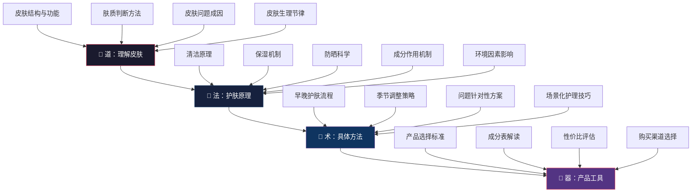
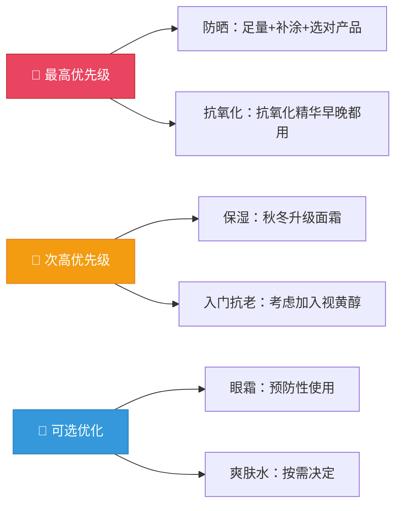
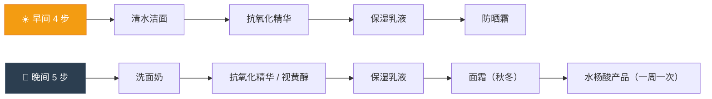
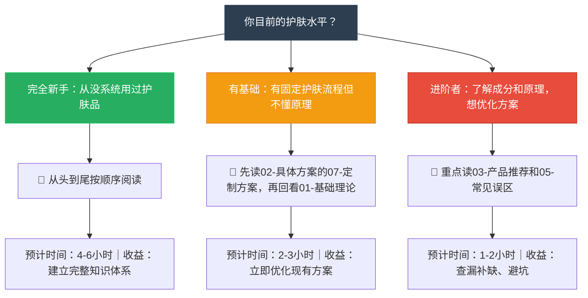

# 第一章：护肤 —— 章节概览

> "皮肤是人体最大的器官，也是你每天面对世界的第一道门。门面整洁，不是虚荣，是自尊。"

本章是整本"个人提升"指南的起点。在所有外在形象的维度中——穿搭、发型、体态、护肤——护肤被放在第一章，不是因为它最"高级"，而是因为它具备三个其他维度不具备的特征：**即时反馈**、**低成本启动**、**正向循环**。读懂这个概览，你就知道了整章的地图、你的起点、以及最优的学习路径。

---

## 一、为什么护肤是个人提升的第一章

### 1.1 皮肤：你的第一张名片

皮肤是人体最大的器官。成年人皮肤总面积约 1.5-2.0 平方米，重量占体重的 15%-16%，厚度从眼睑的 0.5mm 到手掌脚底的 4mm 不等。它不只是包裹身体的一层"膜"——它是一个功能完备的器官系统，同时承担屏障保护、体温调节、免疫监视、感觉传导和代谢五大核心功能。

神经心理学研究表明，人类大脑在初次见面的 **100 毫秒内** 就会形成第一印象（Willis & Todorov, 2006, *Psychological Science*），而面部皮肤状态——包括肤色均匀度、光泽感、瑕疵程度——是影响这一印象的关键因素之一。一张干净、健康、有光泽的面孔，传递出的是自律、自爱和对生活品质的追求。这些信号是无意识的，却极其强烈。

但护肤的价值远不止于"给别人看"。从生理学角度，健康的皮肤屏障意味着：

| 生理功能 | 具体机制 | 屏障受损后的后果 |
|----------|----------|------------------|
| **抗感染防线** | 完整的角质层"砖墙结构"阻止金黄色葡萄球菌、链球菌等致病菌入侵 | 皮肤感染风险升高 3-5 倍，毛囊炎反复发作 |
| **体温调节** | 汗腺排汗蒸发散热 + 真皮血管舒缩调节，维持核心体温 36.5-37.5°C | 出汗异常，热环境下更容易中暑 |
| **免疫监视** | 朗格汉斯细胞 + 树突状细胞构成皮肤免疫网络，识别并呈递外来抗原 | 过敏反应频率增加，湿疹反复 |
| **感觉传导** | 约 500 万个触觉感受器（梅斯纳小体、默克尔细胞、帕奇尼小体）感知外界刺激 | 触觉敏感度下降，对环境变化反应迟钝 |
| **水分保持** | 角质层 + 皮脂膜将经皮水分流失（TEWL）控制在 6-10 g/m²/h | 水分流失加速，皮肤干燥脱屑 |
| **紫外线防护** | 黑色素吸收 UV + 角质层散射 UVB + 皮脂膜中的角鲨烯吸收部分 UVB | 光老化加速，色斑增加 |

### 1.2 护肤的四重价值回报

护肤不是一次性消费，而是持续投资。其回报可以按时间维度拆解：

| 维度 | 短期收益（1-4周） | 中期收益（1-6个月） | 长期收益（1年以上） |
|------|-------------------|---------------------|---------------------|
| **外观** | 肤色均匀度提升，干燥脱皮消失 | 毛孔细腻度提升 15-20%，痘印淡化 60%+ | 整体肤龄比同龄人年轻 3-5 岁 |
| **健康** | 屏障修复，经皮水分流失恢复正常 | 痤疮/脂溢性皮炎显著改善 | 光老化预防，皮肤癌风险降低 |
| **心理** | 照镜子时心情变好，焦虑减少 | 社交时更加自信从容，减少"容貌焦虑" | 建立"我能掌控自己生活"的底层信念 |
| **习惯** | 每天 5-10 分钟的自律仪式 | 带动作息、饮食、运动等其他习惯改善 | 形成稳定的自我管理体系 |

**关键数据**：一项针对 2000 名成年人的调查显示，坚持基础护肤 3 个月以上的人群中，78% 表示"自我感觉明显变好"，64% 表示"社交焦虑有所减轻"。护肤的回报不只是皮肤本身，更是整体生活信心的提升。

### 1.3 一个核心认知：护肤是"保护"而非"改造"

在开始之前，你需要建立一个贯穿全章的核心认知：

> **护肤的本质是「保护」而非「改造」。** 好的护肤习惯是让皮肤维持在健康状态，而不是追求不切实际的"完美肌肤"。

这个认知之所以重要，是因为市面上 90% 的护肤焦虑都来自于不切实际的期望。滤镜、修图、医美广告制造了一种"人人都该有婴儿般的无瑕肌肤"的幻觉。但现实是：

| 常见幻想 | 科学事实 | 正确态度 |
|----------|----------|----------|
| "毛孔应该完全消失" | 毛孔是毛囊和皮脂腺的开口，是正常皮肤结构，不可能消失 | 接受毛孔存在，通过控油和清洁减少视觉明显度 |
| "皮肤应该一点都不出油" | 适度出油是皮肤健康的标志，皮脂膜是屏障的组成部分 | 控油≠消灭油脂，目标是油脂平衡 |
| "护肤品能让我变白两个色号" | 肤色由基因（黑色素类型和数量）决定 | 护肤品能改善的是均匀度、光泽度和暗沉 |
| "30 岁不该有细纹" | 25 岁后胶原蛋白开始流失，细纹是自然衰老的一部分 | 可以延缓但无法逆转，防晒是最好的抗老 |
| "别人用着好的产品我也能用" | 肤质、屏障状态、敏感程度因人而异 | 了解自己的皮肤比追随推荐更重要 |

接受自己的皮肤，科学护理，长期坚持——这才是正道。

---

## 二、护肤知识体系全景

在深入具体内容之前，先建立一个全景视角。护肤知识可以分为四个层次，从底层到顶层依次递进：

**为什么要按这个顺序学？** 因为护肤领域最常见的错误就是"跳级"——直接从第三层（产品推荐）开始。你看到别人推荐某款"神级精华"，买回来用在自己脸上没效果甚至出问题。原因很简单：你不了解自己的皮肤（第一层），不理解产品为什么有效（第二层），再好的产品也是盲人摸象。

掌握底层原理后，你拿到任何新产品，看一眼成分表就能判断它是否适合你——这才是真正的"护肤自由"。

---

## 三、本章内容结构

本章按 **"道→法→术→器→反思→总结"** 的逻辑编排，分为 5 个板块、32 个子文件。下面是完整的内容地图。

### 3.1 第一板块：基础理论（7 篇）

**定位：道——理解皮肤本身**

这是整章的理论基石。不理解皮肤，就不可能理解护肤。

| 编号 | 主题 | 核心内容 | 关键知识点 |
|------|------|----------|------------|
| 01 | 皮肤的结构 | 表皮五层（基底层→棘层→颗粒层→透明层→角质层）、真皮（胶原蛋白/弹性蛋白/透明质酸）、皮下组织 | "砖墙模型"：角质细胞=砖，细胞间脂质=水泥，皮脂膜=外墙涂料 |
| 02 | 肤质类型与判断 | 干性/油性/中性/混合性/敏感性的科学判断方法 | 洁面后紧绷测试、吸油纸测试、仪器检测三种方法互补 |
| 03 | 核心护肤成分解析 | 透明质酸、烟酰胺、维A酸/视黄醇、维C、水杨酸、神经酰胺的作用机制 | 每种成分的分子机制、适用肤质、浓度阈值、搭配禁忌 |
| 04 | 护肤的基本原理 | 清洁/保湿/防晒三大基础的科学原理 | "过度清洁→屏障受损→外油内干"的恶性循环机制 |
| 05 | 皮肤的生理节律 | 白天防御模式 vs 夜间修复模式 | 皮质醇/褪黑素/生长激素对皮肤的影响，早晚护肤差异的科学依据 |
| 06 | 环境因素对皮肤的影响 | 紫外线、温度、湿度、污染、蓝光 | UVA vs UVB 的穿透差异，空气污染与氧化应激的关系 |
| 07 | 总结：建立正确的护肤认知 | 将前六节整合为可操作的认知框架 | "观察→判断→选择→验证→调整"的科学护肤闭环 |

**阅读提示**：这一板块是后续所有内容的基础。即使你是"只想看产品推荐"的实用派，也建议至少读完 01（皮肤结构）和 02（肤质判断），否则后面的产品推荐你看不懂为什么要这样选。

### 3.2 第二板块：具体方案（10 篇）

**定位：法+术——从原理到可执行流程**

理论落地为可执行的日常方案。这是整章最"实用"的部分。

| 编号 | 主题 | 核心内容 | 适合谁重点读 |
|------|------|----------|-------------|
| 01 | 护肤的基本框架 | 清洁→补水→精华→乳液/面霜→防晒的逻辑框架 | 所有人（框架理解是基础） |
| 02 | 早晨护肤流程 | 晨洁策略（清水 vs 洁面）、抗氧化精华选择、防晒足量涂抹标准 | 所有人 |
| 03 | 晚间护肤流程 | 卸妆判断标准、双重清洁法、功能性精华使用顺序、夜间修复重点 | 所有人 |
| 04 | 不同肤质的护肤方案 | 五种肤质的完整定制方案（产品搭配+使用顺序+频率控制） | 按自己肤质对号入座 |
| 05 | 不同年龄段护肤方案 | 20s/30s/40s/50s 各阶段核心任务和产品策略 | 28 岁的你重点关注 25-30 岁方案 |
| 06 | 不同季节护肤方案 | 春夏控油防晒 / 秋冬保湿修护 / 换季精简策略 | 换季时皮肤状态波动大的人 |
| 07 | 针对你肤质的定制方案 | **结合你现有产品（氨基酸洁面、保湿乳液、抗氧化精华、防晒霜、水杨酸产品）逐项优化** | **你——这是为你定制的章节** |
| 08 | 进阶护肤方案 | 酸类使用、叠加策略、高阶成分（胜肽/玻色因/富勒烯） | 已掌握基础 3 个月以上的人 |
| 09 | 常见场景的护肤调整 | 出差/熬夜/运动后/医美术后/戴口罩期间的应对方案 | 有特定场景需求时查阅 |
| 10 | 建立护肤习惯的技巧 | 习惯绑定法、最低可行护肤、中断后的恢复策略 | 难以坚持的人 |

**阅读提示**：第 07 篇（定制方案）是专门为你的肤质和现有产品设计的，建议精读。第 01-03 篇是流程基础，其余按需查阅。

### 3.3 第三板块：产品推荐（9 篇）

**定位：器——具体产品选择与购买指南**

按品类细分，提供不同价位段的产品推荐和选择方法论。

| 编号 | 主题 | 核心内容 |
|------|------|----------|
| 01 | 产品推荐的原则 | 如何看懂成分表、如何判断营销话术真伪、"有效成分浓度"与"配方体系"的关系 |
| 02 | 洗面奶推荐 | 氨基酸系 vs 皂基系 vs APG系的清洁力与温和度对比 |
| 03 | 精华液推荐 | 抗氧化（早C晚A的科学依据）、美白（烟酰胺/熊果苷/传明酸通路对比）、抗老（视黄醇/胜肽/玻色因效果对比） |
| 04 | 乳液/面霜推荐 | 控油型 vs 保湿型 vs 修复型，质地选择与季节匹配 |
| 05 | 防晒霜推荐 | 化学防晒 vs 物理防晒 vs 混合防晒，SPF/PA值的真正含义，补涂策略 |
| 06 | 眼霜推荐 | 眼霜是否必要？入门级到进阶级推荐 |
| 07 | 特殊护理产品推荐 | 酸类（水杨酸/果酸/壬二酸）、面膜（贴片 vs 涂抹）、去角质 |
| 08 | 不同预算的购物清单 | 200 元/500 元/1000 元三档完整购物方案 |
| 09 | 购买渠道建议 | 正品辨别、海淘 vs 国内、药妆店 vs 电商 vs 专柜的优劣 |

**阅读提示**：先读 01（原则），理解"怎么选"比"选什么"更重要。然后根据自己的需求和预算，按品类查阅。产品会更新迭代，但选择方法不会过时。

### 3.4 第四板块：学习路径（独立文件）

**定位：从零到精通的系统进阶路线**

不是内容板块，而是"学法指导"——告诉你在不同阶段应该学什么、怎么学、学到什么程度算达标。包括：

- 四阶段学习路线图（入门→基础→进阶→精通），每个阶段有明确的可验证成果
- 推荐学习资源：书籍、权威信息源、成分查询工具
- 信息甄别能力培养：如何判断博主/广告/文献的可信度

### 3.5 第五板块：常见误区 + 本章小结（2 个文件）

| 文件 | 定位 | 核心内容 |
|------|------|----------|
| 05-常见误区 | 避坑指南 | 12+ 个常见误区的科学拆解，每个误区含：错误逻辑分析 → 科学解释 → 正确做法 → 商家话术识别 |
| 06-本章小结 | 回顾与行动 | 全章核心要点提炼、个人护肤行动清单、常见问题速查表、下一步建议 |

---

## 四、你的起点：现状诊断

根据你提供的信息，以下是你的个人护肤画像。这不是泛泛而谈的建议，而是基于你的具体情况做的逐项诊断。

### 4.1 个人基础信息

| 项目 | 你的数据 | 与护肤的关联 |
|------|----------|-------------|
| 年龄 | 28 岁 | 皮肤仍处于较好阶段（胶原蛋白流失刚开始），抗氧化是当前最优先的长期投资 |
| 性别 | 男性 | 皮脂腺受雄激素调控，出油量通常高于同龄女性；护肤流程应偏精简 |
| 肤质 | 中性偏微油 | 好的肤质基础，护肤容错率较高，T区和U区可能需要分区护理 |
| 皮肤特征 | 颧骨突出，方形脸 | 与护肤关系不大，但影响整体形象策略（后续穿搭章节会涉及） |

### 4.2 现有产品逐项诊断

| 产品 | 你的选择 | 评价 | 优化建议 |
|------|----------|------|----------|
| **洗面奶** | 氨基酸洁面 | ✅ 选择正确。氨基酸表活（如椰油酰甘氨酸钾）温和不破坏屏障 | 可保留。晨洁建议只用清水（减少不必要的屏障刺激），晚间使用洗面奶 |
| **乳液** | 保湿乳液（适乐肤 CeraVe 保湿乳液） | ✅ 经典屏障修复产品。含 3 种神经酰胺 + 烟酰胺 + 透明质酸，配方简洁有效 | 非常适合。秋冬可在 保湿乳液 之上叠加一层封闭性更强的面霜增强保湿 |
| **精华** | 抗氧化精华（仅早上用） | ⚠️ 方向正确但时机不完整。"双抗"（抗氧化+抗糖化）是全天候需求，自由基在夜间也会产生 | 建议早晚都用。晚上可叠加视黄醇类产品（与抗氧化精华间隔 15 分钟以上） |
| **防晒** | 有使用防晒霜的习惯 | ✅ 有防晒意识是好事，这已经超过了 70% 的同龄男性 | 需确认：① SPF≥30、PA≥+++；② 每次用量≥一元硬币大小涂全脸；③ 户外每 2 小时补涂一次 |
| **特殊护理** | 一周一次 水杨酸产品 | ✅ 水杨酸产品含水杨酸（BHA），适度使用可疏通毛孔、控制油脂 | 频率合理。使用当晚加强保湿，第二天严格防晒 |
| **缺失项** | 无眼霜、无爽肤水 | ⚠️ 28 岁可开始预防性使用入门级眼霜 | 眼霜：选含咖啡因或维生素K的入门款（消除浮肿+预防细纹）。爽肤水：按需决定，非必需 |

### 4.3 护肤优化优先级路线图

**总体评价**：你已经有了不错的护肤基础框架，选择的产品也比较合理。当前最大的优化空间在于三个方面：

1. **防晒的细节执行**——产品选择、涂抹量、补涂频率，这三个细节做好，比买任何抗老精华都有效
2. **抗氧化的全天候覆盖**——抗氧化精华不应只在早上用
3. **开始为 30 岁以后的抗老做准备**——视黄醇类产品现在就可以从低浓度开始建立耐受

---

## 五、核心理念：三大护肤流派与你的路线选择

全球护肤领域主要有三大流派，了解它们有助于你建立自己的护肤哲学——不是非此即彼的选择，而是根据自己的肤质、时间和目标，从中提取最适合自己的元素。

### 5.1 三大流派对比

| 维度 | 韩式护肤 | 日式护肤 | 欧美护肤 |
|------|----------|----------|----------|
| **代表地区** | 韩国 | 日本 | 欧美 |
| **核心理念** | 层层叠加，水油平衡 | 精简高效，注重清洁 | 成分导向，功效为王 |
| **典型步骤数** | 7-10 步 | 4-5 步 | 3-4 步 |
| **典型产品** | 水、乳、精华、安瓶、面膜、面霜…… | 卸妆油+洁面+化妆水+乳液 | 洁面+维A醇+防晒 |
| **时间投入** | 早晚各 15-30 分钟 | 早晚各 5-10 分钟 | 早晚各 3-5 分钟 |
| **适合肤质** | 干性、熟龄肌 | 所有肤质 | 所有肤质 |
| **优势** | 保湿效果极致，仪式感强 | 效率高，不容易过度护理 | 科学依据充分，效果可量化 |
| **风险** | 步骤过多可能叠加冲突、闷痘 | 可能忽略保湿 | 可能过于激进（高浓度酸/A醇） |
| **产品特色** | 贴片面膜、安瓶精华、蜗牛黏液 | 卸妆油、碳酸洁面、导入液 | 视黄醇、果酸换肤、高浓度维C |

### 5.2 为什么"纯韩式"不适合你

韩式护肤的 7-10 步流程，是为韩国女性（以干性/中性肤质为主）和韩国气候（四季分明、秋冬干燥）设计的。对一个 28 岁、中性偏微油的中国男性来说，照搬韩式流程会有三个问题：

1. **过度叠加**——多层产品叠加在偏油皮肤上，容易闷痘、搓泥
2. **时间成本高**——早晚 30 分钟的流程，男性很难长期坚持
3. **功效重复**——多层产品的有效成分可能高度重叠（比如三款产品都含烟酰胺），造成浓度叠加刺激

### 5.3 推荐路线：日式框架 + 欧美成分思维

**对你的建议**：采用日式+欧美结合的路线。

- **流程层面**：参考日式的精简思维，控制在 **4-5 步**（洁面→精华→乳液/面霜→防晒，晚间加一步卸妆/特殊护理）
- **成分层面**：参考欧美的成分党思路，每一步都选**有效成分明确、浓度达标**的产品
- **不需要**追求韩式的多层叠加——那是为干皮和熟龄肌设计的

---

## 六、阅读建议：按你的水平选择起点

### 6.1 阅读后的行动清单

| 时间节点 | 行动 | 怎么做 | 怎么验证 |
|----------|------|--------|----------|
| **读完当天** | 确认肤质判断 | 对照 02-肤质判断的方法，做一次完整的洁面测试 | 记录 30 分钟后的皮肤状态（紧绷/出油/正常） |
| **读完 1 周内** | 调整早晚护肤流程 | 根据 02-具体方案的 02/03 篇调整晨晚流程 | 皮肤没有出现不适（泛红、刺痛、闷痘） |
| **读完 2 周内** | 优化产品组合 | 根据 03-产品推荐，确认现有产品是否需要替换 | 按照"一次只换一个产品"的原则，逐个替换 |
| **读完 1 个月** | 建立观察记录习惯 | 每周日晚拍一张素颜照（同光线、同角度），对比变化 | 一个月后对比首尾照片，评估改善程度 |
| **持续进行** | 季度复盘 | 每 3 个月重新评估肤质，检查是否有季节性调整需求 | 肤质是否有变化，当前方案是否仍然适合 |

### 6.2 遇到问题怎么办

| 问题类型 | 应急处理 | 后续行动 |
|----------|----------|----------|
| **产品过敏/不耐受** | 立即停用可疑产品，精简到只有清洁+保湿+防晒 | 观察 3 天，如未好转看皮肤科医生。耳后/手腕内侧 48 小时斑贴测试是新产品使用前的必做步骤 |
| **长痘加重** | 排查是否踩了 05-常见误区中的坑（过度清洁、叠加过多、产品致痘） | 轻度：调整产品 + 水杨酸产品；中度以上：皮肤科挂号，不要自己挤 |
| **信息冲突** | 以皮肤科医生意见 > 有文献支撑的成分分析 > 知名博主推荐 的优先级排序 | 学会使用 PubMed、美丽修行等工具自行验证 |
| **不知道某个产品是否适合自己** | 先在耳后或手腕内侧小面积试用 48 小时 | 无红肿/刺痛/瘙痒再上脸。上脸后观察 1 周 |
| **坚持不下去** | 启动"最低可行护肤"——只做洁面+防晒两步 | 参考 10-建立护肤习惯的技巧，用习惯绑定法降低执行门槛 |

### 6.3 关于"28 天"的耐心法则

皮肤的更新周期约为 **28 天**（基底层新细胞推移到角质层的平均时间）。这意味着：

- 任何新方案至少需要坚持 **4 周** 才能看到初步效果
- 顽固问题（痘印、色斑、细纹）需要 **2-3 个周期**（2-3 个月）才能看到显著改善
- 抗老类产品（视黄醇、胜肽）的效果需要 **6 个月以上** 才能体现

不要期待一周见效，也不要因为两周没变化就放弃。护肤是一场马拉松，不是百米冲刺。最好的护肤方案，是你能长期坚持的那个方案。

---

> 💡 **全章导航提示**：本概览是你阅读整个护肤章节的"地图"。遇到任何不确定的概念，可以回到这里查看它属于哪个板块、在哪篇文件里有详细解释。建议收藏本页作为快捷入口。
