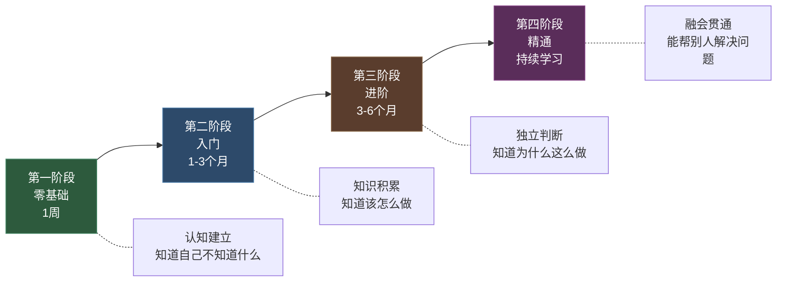
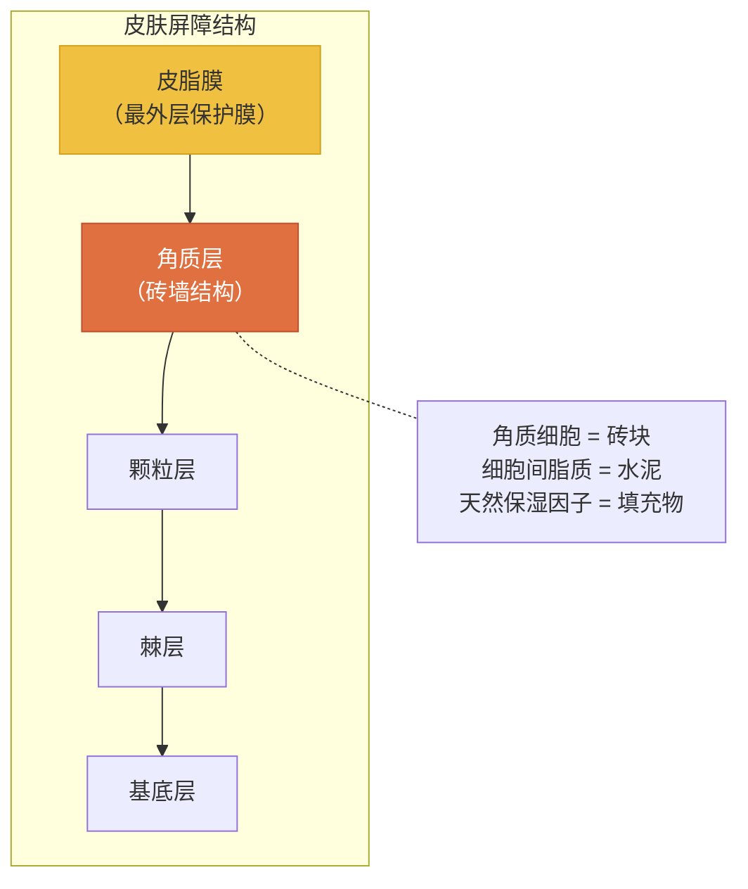
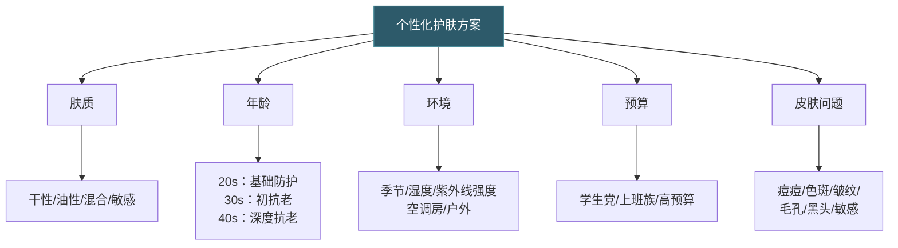
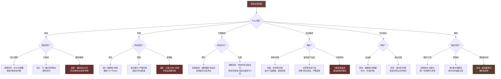
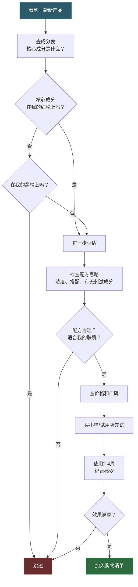
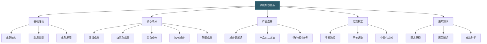

# 学习路径：从零基础到精通

> "护肤是一门科学，也是一门艺术。系统学习能让你少走弯路、少花冤枉钱。"

很多人护肤多年，花了几万块买产品，皮肤却没有明显改善。根本原因不是产品不好，而是缺乏系统的知识体系——今天听博主说烟酰胺好就买，明天看到广告说视黄醇抗老就跟风，后天朋友推荐医美就去尝试。碎片化的知识带来碎片化的决策，碎片化的决策带来混乱的护肤方案。

本章为你提供一条清晰的学习路径：从完全不懂护肤的小白，到能够独立判断产品、制定方案、辨别伪科学的护肤专家。每个阶段有明确的学习目标、具体内容、推荐资源和可检验的成果，确保你不走弯路。

---

## 一、学习路径总览

护肤学习可以分为四个阶段，每个阶段的知识深度和实践要求逐级递进：

| 阶段 | 时长 | 核心任务 | 关键产出 |
|------|------|---------|---------|
| 零基础 | 1周 | 建立认知、判断肤质、养成基础习惯 | 知道自己是什么肤质，手边有洁面+保湿+防晒 |
| 入门 | 1-3个月 | 认识核心成分、学会看成分表、建立完整流程 | 能看懂80%成分表，有稳定的早晚护肤流程 |
| 进阶 | 3-6个月 | 理解配方逻辑、掌握功效成分、制定个性化方案 | 能独立判断产品，能根据季节和状态调整方案 |
| 精通 | 持续 | 跟踪前沿研究、形成方法论、帮助他人 | 能辨别伪科学，有自己的产品筛选体系 |

**重要提醒：** 每个阶段的时长只是参考。皮肤代谢周期是28天，任何护肤方案至少需要4-6周才能看到初步效果。不要急于跳到下一阶段——基础不牢，越往上越容易被营销话术和伪科学忽悠。

---

## 二、第一阶段：零基础（第1周）

### 2.1 学习目标

这个阶段的核心任务只有一个：**建立认知框架**。你需要知道自己面对的是什么（皮肤的结构和功能），自己属于什么类型（肤质判断），以及最基本的应对策略（清洁-保湿-防晒）。

具体目标：
- 了解皮肤的基本结构和功能，理解"皮肤屏障"为什么重要
- 准确判断自己的肤质类型
- 建立最基础的护肤习惯（清洁→保湿→防晒），能够每天坚持执行

### 2.2 每日学习计划

**Day 1-2：认识你的皮肤**

皮肤不是一层"皮"，而是一个复杂的器官。你至少需要了解以下内容：

- **表皮层**（最外层，厚度约0.1mm）：
  - 角质层：由15-20层死亡的角质细胞组成，是皮肤屏障的核心。健康角质层含水量20%-35%，低于10%就会出现干燥脱皮
  - 基底层：位于表皮最底部，不断分裂产生新细胞，新细胞向上推移约28天到达表面变成角质细胞脱落——这就是"皮肤代谢周期"
  - 黑色素细胞：分布在基底层，负责产生黑色素保护皮肤免受紫外线伤害

- **真皮层**（表皮之下，厚度约1-2mm）：
  - 胶原蛋白：占真皮干重的70%-80%，提供皮肤的支撑力和弹性
  - 弹力蛋白：让皮肤能够回弹，像弹簧一样
  - 透明质酸（玻尿酸）：1克透明质酸可以锁住6升水，是皮肤的天然保湿因子
  - 血管和神经：为皮肤输送营养，感受外界刺激

- **皮下组织**（最深层）：
  - 脂肪细胞：保温、缓冲、储能
  - 血管和淋巴管：代谢废物排出通道

**为什么要了解这些？** 因为所有的护肤品都在和这些结构打交道——保湿产品补充角质层的脂质和水分，抗氧化产品保护真皮层的胶原蛋白，防晒产品减少紫外线对基底层黑色素细胞的刺激。理解了结构，你就理解了护肤的底层逻辑。

**皮肤屏障：你最重要的防线**

皮肤屏障由角质层细胞（砖块）和细胞间脂质（水泥）组成的"砖墙结构"，外加一层皮脂膜（最外面的油性保护膜）。

**推荐阅读：** 本文档"01-基础理论"的第一节，详细了解皮肤结构和屏障功能。

**Day 3-4：判断你的肤质**

肤质判断是护肤的起点。判断错误，后面所有产品选择都会跟着错。以下是三种最常用的判断方法：

**方法一：洗脸测试法（最推荐）**
1. 用温水和温和洗面奶洗脸
2. 轻轻拍干，不涂任何产品
3. 等待60分钟
4. 观察皮肤状态：

| 表现 | 肤质判断 |
|------|---------|
| 全脸紧绷、起皮 | 干性皮肤 |
| T区（额头、鼻子）出油，两颊偏干 | 混合性皮肤 |
| 全脸出油但不紧绷 | 油性皮肤 |
| 无明显油光也无紧绷感 | 中性皮肤（理想状态，成人少见） |
| 使用新产品后容易发红、刺痛 | 敏感性皮肤（可与上述类型叠加） |

**方法二：吸油纸测试法（快速判断）**
1. 洗脸后2小时，用吸油纸按压T区和两颊
2. 吸油纸几乎没有油渍 → 干性
3. T区有油渍，两颊干净 → 混合性
4. 全脸都有明显油渍 → 油性

**方法三：观察法（长期判断）**
观察自己日常的皮肤状态：
- 换季时是否容易脱皮、发红？→ 敏感倾向
- 中午脸上是否油光明显？→ 油性倾向
- 涂粉底是否容易卡粉起皮？→ 干性倾向
- 毛孔是否粗大，容易长黑头？→ 油性/混合性

**关键认知：** 肤质不是一成不变的。它会随季节（夏天偏油、冬天偏干）、年龄（25岁后油脂分泌逐渐减少）、环境（空调房会加重干燥）、身体状态（熬夜后出油增加）而变化。所以每隔3-6个月重新评估一次自己的肤质是很有必要的。

**推荐阅读：** 本文档"01-基础理论"的第二节，了解不同肤质的详细护理要点。

**Day 5-7：建立基础三步曲**

恭喜你，现在你知道了自己的肤质。接下来用三天时间选购并开始执行最基础的护肤流程：

**第一步：选洁面**
- 所有肤质的首选：氨基酸洁面（温和不伤屏障）
- 干性/敏感性：选择无泡或低泡配方，避免皂基
- 油性：可用氨基酸复配皂基的洁面，清洁力稍强但不过度
- 关键词：pH值5.5-6.5（接近皮肤天然pH值）、无酒精、无香精（敏感肌）

**第二步：选保湿**
- 干性皮肤：选含神经酰胺、角鲨烷的面霜，质地偏厚
- 油性皮肤：选含透明质酸、甘油的乳液，质地轻薄
- 混合性皮肤：T区用乳液，两颊用面霜（分区护理）
- 敏感性皮肤：选含积雪草、泛醇的修复型保湿产品

**第三步：选防晒**
- 日常通勤：SPF30、PA+++即可
- 户外活动：SPF50、PA++++
- 油性皮肤：选化学防晒或物化结合，质地清爽
- 干性皮肤：选物化结合或物理防晒，有一定滋润度
- 敏感性皮肤：首选物理防晒（氧化锌、二氧化钛），刺激性最低

**每日执行模板：**

| 时间 | 步骤 | 操作 | 用时 |
|------|------|------|------|
| 早上 | 清洁 | 温水洗脸（油性可用少量洁面） | 1分钟 |
| 早上 | 保湿 | 涂保湿乳液/面霜 | 1分钟 |
| 早上 | 防晒 | 涂防晒霜，一元硬币大小涂全脸 | 1分钟 |
| 晚上 | 清洁 | 洁面乳起泡后轻揉全脸，温水冲净 | 2分钟 |
| 晚上 | 保湿 | 涂保湿产品 | 1分钟 |

**总用时：每天6分钟。** 这就是你需要投入的全部时间。不需要更多，6分钟足以建立一个有效的基础护肤习惯。

**推荐阅读：** 本文档"02-具体方案"和"03-产品推荐"，选购适合自己的产品。

### 2.3 学习资源

- **本文档**：直接阅读本章所有内容即可建立完整的知识框架
- **美丽修行APP**：国内最主流的成分查询工具，可查产品成分表、成分功效、安全评分，还有用户真实评价
- **CosDNA**：国际版成分查询工具，收录全球品牌，数据更全面，适合查询海外产品
- **你今天真好看APP**：拍照测肤质，有AI分析功能，适合零基础快速了解自己

### 2.4 阶段成果自检

完成这个阶段后，你应该能够：

- [x] 说出皮肤的三层结构和皮肤屏障的作用
- [x] 准确判断自己的肤质类型，并知道这个肤质的核心护理要点
- [x] 手边有洁面、保湿、防晒三件基础产品
- [x] 能够坚持每天早晚执行基础护肤流程
- [x] 知道"先水后油"的基本使用顺序

**如果以上有任何一项做不到，不要急着进入下一阶段。** 把基础打牢比什么都重要。

---

## 三、第二阶段：入门（第1-3个月）

### 3.1 学习目标

进入这个阶段，你已经有了基础的护肤习惯。现在需要往这个框架里填充知识——了解常见的护肤成分是什么、做什么、怎么用，学会自己读成分表而不是完全依赖别人的推荐。

具体目标：
- 理解常见护肤成分的功效、作用机制和正确使用方法
- 学会看产品成分表，能快速判断一款产品的核心功效
- 能够根据自己的需求独立选择合适的产品
- 建立完整的早晚护肤流程（在三步曲基础上扩展）

### 3.2 学习内容

**第1-2周：认识核心成分**

不要试图一次性学完所有成分。先掌握最常用、最核心的几类，建立知识框架后再逐步扩展。

**保湿成分（护肤的基石）：**

| 成分 | 作用机制 | 适合肤质 | 典型浓度 |
|------|---------|---------|---------|
| 透明质酸（玻尿酸） | 吸收自身重量1000倍的水分，形成保湿膜 | 所有肤质 | 0.1%-2% |
| 神经酰胺 | 补充细胞间脂质，修复皮肤屏障 | 干性、敏感性 | 0.5%-3% |
| 角鲨烷 | 模拟皮脂膜，锁水保湿 | 干性、中性 | 1%-10% |
| 甘油 | 从空气中吸收水分到皮肤表面 | 所有肤质 | 2%-10% |
| 泛醇（维生素B5） | 促进屏障修复，深层保湿 | 敏感性、干性 | 1%-5% |

**抗氧化成分（对抗自由基损伤）：**

| 成分 | 作用机制 | 稳定性 | 使用注意 |
|------|---------|--------|---------|
| 维生素C（L-抗坏血酸） | 中和自由基，促进胶原蛋白合成 | 差（易氧化变黄） | 早上用配合防晒效果翻倍，避免与烟酰胺同时用 |
| 维生素E（生育酚） | 脂溶性抗氧化剂，保护细胞膜 | 较好 | 常与维C搭配，协同增效 |
| 烟酰胺（维生素B3） | 抗氧化、美白、控油、修复屏障 | 好 | 部分人不耐受（泛红刺痛），从低浓度2%开始 |
| 虾青素 | 抗氧化能力是维E的1000倍 | 一般 | 呈橘红色，使用后皮肤可能暂时偏黄 |

**防晒成分（护肤中最重要的一步）：**

| 类型 | 代表成分 | 优点 | 缺点 |
|------|---------|------|------|
| 化学防晒 | 阿伏苯宗、甲氧基肉桂酸乙基己酯 | 质地轻薄，肤感好 | 可能刺激敏感肌，需提前15-20分钟涂 |
| 物理防晒 | 氧化锌、二氧化钛 | 即涂即生效，温和不刺激 | 可能泛白、质地偏厚 |
| 物化结合 | 两种类型混合 | 兼顾肤感和温和性 | 价格通常偏高 |

**推荐学习方法：** 拿出你手边正在用的护肤品，打开美丽修行APP，逐一查看每个成分的功效和安全等级。这个过程比看十篇科普文章都有效——因为你是在用自己实际使用的产品来学习，知识会和你的亲身体验绑定在一起。

**第3-4周：学会看成分表**

成分表是护肤品的"配料表"，学会读懂它就等于获得了透视产品真相的能力。

**成分表的基本规则：**

1. **排列顺序规则**：成分按浓度从高到低排列（浓度>1%的成分），低于1%的成分可以不按顺序排列
2. **"1%分割线"**：通常防腐剂（如苯氧乙醇）的添加量在1%左右，防腐剂之后的成分浓度基本都在1%以下
3. **成分表≠配方**：成分表只能告诉你有什么成分，不能告诉你具体浓度、纯度和配方技术

**实操练习——以一款保湿乳液为例：**

假设成分表为：水、甘油、角鲨烷、烟酰胺、神经酰胺NP、透明质酸钠、苯氧乙醇、香精

分析思路：
- 前三位是水、甘油、角鲨烷——水是基底（所有护肤品第一位都是水），甘油保湿，角鲨烷锁水
- 烟酰胺排第四——浓度应该不低（可能2%-5%），有抗氧化美白功效
- 神经酰胺NP排第五——修复屏障
- 苯氧乙醇——防腐剂，出现在这里说明前面的成分浓度>1%
- 透明质酸钠在防腐剂之后——浓度<1%，但透明质酸低浓度也能起效
- 香精排最后——添加量很低，但敏感肌需要注意

**结论：** 这是一款以保湿为主、兼顾美白和屏障修复的乳液，适合混合偏干肤质。

**每周练习任务：** 拿3-5款你感兴趣的产品（不一定要买），在美丽修行上查成分表，用上面的方法分析它们的核心功效。12周下来你就能分析30-60款产品，看成分表的水平会有质的飞跃。

**第5-6周：扩展护肤流程**

基础三步曲已经不够了。这个阶段你需要建立更完整的护肤流程：

**标准早晚护肤流程：**

| 步骤 | 早上 | 晚上 | 作用 |
|------|------|------|------|
| 1. 卸妆 | 不需要 | 用卸妆油/卸妆膏（化了妆或涂了防水防晒才需要） | 溶解油性污垢 |
| 2. 洁面 | 温水即可（油性可用少量洁面） | 洁面乳 | 清洁水溶性污垢 |
| 3. 化妆水/爽肤水 | 可选（二次清洁/补水） | 可选 | 调理角质层，促进后续吸收 |
| 4. 精华液 | 抗氧化精华（如维C） | 功效精华（如美白/抗老） | 高浓度活性成分 |
| 5. 眼霜 | 可选（25岁后建议用） | 同左 | 针对眼部细纹、黑眼圈 |
| 6. 乳液/面霜 | 乳液（质地轻薄） | 面霜（质地厚重） | 保湿锁水 |
| 7. 防晒 | 必须 | 不需要 | 防止紫外线损伤 |

**顺序原则：** 先水后油，先薄后厚，先小分子后大分子。水状产品先用，油性产品后用；轻薄质地先用，厚重质地后用。

**第7-8周：学会产品对比**

学会对比同类产品，是避免"冲动消费"和"被营销忽悠"的关键技能。

**产品对比的维度：**

1. **成分对比**：核心成分是否相同？浓度是否有差异？
2. **配方对比**：辅助成分是否合理？有没有不必要的刺激成分（酒精、香精、色素）？
3. **价格对比**：计算"每毫升/每克"价格，而不是只看总价
4. **口碑对比**：真实用户的长期使用反馈（不是开箱体验）
5. **自身匹配**：是否适合你的肤质、季节、当前的皮肤状态

**实例分析：如何对比两款维C精华**

| 对比维度 | 产品A | 产品B |
|---------|-------|-------|
| 维C形式 | L-抗坏血酸（原型维C） | 抗坏血酸葡糖苷（维C衍生物） |
| 标注浓度 | 15% | 未标注（成分表排位靠前，推测5%-10%） |
| pH值 | 3.5（偏酸，刺激性较强） | 5.5-6（温和，刺激性低） |
| 辅助成分 | 维E+阿魏酸（经典组合） | 透明质酸（保湿为主） |
| 稳定性 | 差（开封后3个月内用完） | 好（不易氧化） |
| 价格 | ¥380/30ml | ¥180/30ml |
| 适合人群 | 耐受性好的皮肤，追求强效抗氧化 | 敏感肌或维C新手 |

**结论：** 不是越贵越好，也不是浓度越高越好。关键是匹配你的需求和肤质。

**学会看评价——识别营销软文的技巧：**
- 软文特征：大量感叹号、"一生推""绝绝子""用过最好"等绝对化表述、产品图拍得极其精美、无任何缺点描述
- 真实评价特征：有具体使用时间（"用了4周"）、有前后对比、提到优点也提到不足、语气平淡自然
- 建议平台：美丽修行的用户评价（相对客观）、知乎成分党回答（有专业背景）、豆瓣护肤小组（讨论氛围好）

**第9-12周：实践与调整**

这是入门阶段最重要的四周——把学到的知识转化为实际的护肤经验。

**实践要点：**
- 按照你建立的完整流程坚持护肤至少4周（皮肤代谢周期是28天）
- 每周用手机在同一光线下拍一张素颜照，记录皮肤变化
- 准备一个简单的护肤日记（纸质或手机备忘录），记录：
  - 今天用了什么产品
  - 皮肤状态如何（有没有出油、干燥、长痘、泛红）
  - 天气和环境（换季、空调房、出差等）
- 4周后对比照片，评估哪些产品有效、哪些需要调整

**调整原则：** 一次只换一个产品，观察2-4周再决定是否保留。如果同时换多个产品，你无法判断哪个有效、哪个导致问题。

**护肤日记模板（可复制使用）：**

坚持记录是进步最快的方式。以下是一个简洁实用的日记模板，每天花2分钟填写即可：

日期：____年__月__日  天气：____  温度：____  湿度：____

【早上护肤】
洁面：________________（用量/感受）
精华：________________（用量/感受）
保湿：________________（用量/感受）
防晒：________________（用量：□足量 □不足）

【晚上护肤】
卸妆：________________（□需要 □不需要）
洁面：________________（用量/感受）
功效产品：____________（名称/浓度/感受）
保湿：________________（用量/感受）

【皮肤状态评分】（1-5分，5分最好）
出油程度：___  干燥程度：___  泛红程度：___
痘痘数量：___  整体感受：___

【今日备注】
（记录异常情况：新产品首次使用/换了护肤品/吃了辛辣/
熬夜/生理期/情绪压力大等）

【本周照片】□已拍 □未拍（同一光线、同一角度）

**记录的关键原则：**
- 只记变化，不记常态（"今天和昨天一样"不需要写）
- 异常情况必须记录（长痘、泛红、刺痛）并关联可能原因
- 每周同一光线拍一张素颜照，4周后对比
- 产品无效8周以上才考虑更换——给足时间

### 3.3 学习资源

**书籍推荐：**

| 书名 | 作者 | 推荐理由 | 适合阶段 |
|------|------|---------|---------|
| 《护肤问莫嫡》 | 莫嫡 | 国内护肤科普入门经典，语言通俗易懂，覆盖基础理论和产品选择 | 零基础-入门 |
| 《The Skincare Bible》 | Anjali Mahto | 英国皮肤科医生写的护肤指南，科学严谨，有循证依据 | 入门-进阶 |
| 《美丽圣经》 | Paula Begoun | 宝拉·培冈的经典著作，涵盖大量成分分析和产品点评方法 | 入门-进阶 |
| 《皮肤的秘密》 | Yael Adler | 德国皮肤科医生写的趣味科普，从皮肤视角解读人体健康 | 入门（轻松读物） |

**博主/UP主推荐：**

| 账号 | 平台 | 特点 | 推荐理由 |
|------|------|------|---------|
| 言安堂 | 微信公众号 | 成分分析专业客观，有实验室检测 | 国内护肤科普标杆，内容可信赖 |
| 基础颜究 | 微信公众号 | 清华博士团队运营，科学性极强 | 想了解成分原理看这里 |
| Kenjijoel | B站 | 成分党博主，产品分析深入细致 | 适合入门阶段学习看成分表 |
| 糊奔奔 | B站 | 护肤科普UP主，讲解清晰有趣 | 零基础也能听懂 |
| 骆王宇 | 抖音/B站 | 前欧莱雅配方师，产品分析有专业背景 | 了解大牌产品的配方逻辑 |

**APP推荐：**

| APP | 核心功能 | 适用场景 |
|-----|---------|---------|
| 美丽修行 | 成分查询、产品点评、肤质测试、AI测肤 | 日常查成分、选产品 |
| CosDNA | 国际版成分查询，数据更全面 | 查询海外品牌产品 |
| 小红书 | 搜索具体产品的使用感受 | 看真实用户体验（注意辨别广告） |
| 你今天真好看 | 拍照测肤质，AI分析皮肤问题 | 入门阶段快速了解肤质 |

### 3.4 阶段成果自检

- [x] 能看懂产品成分表的80%，知道常见成分的功效
- [x] 知道自己需要什么成分，不需要什么成分（基于肤质判断）
- [x] 建立了完整的早晚护肤流程（至少包含洁面+精华+保湿+防晒）
- [x] 使用一套护肤品至少4周，观察到皮肤变化
- [x] 能够对比同类产品的核心差异，不被营销话术左右
- [x] 有一份简单的护肤日记，记录了产品的使用感受

---

## 四、第三阶段：进阶（第3-6个月）

### 4.1 学习目标

这个阶段的核心转变是：从"别人告诉我用什么"变成"我自己判断用什么"。你需要深入理解成分的作用机制，理解配方背后的逻辑，能够根据自己的需求制定个性化方案。

具体目标：
- 深入理解功效性成分的作用机制、使用方法和协同/冲突关系
- 能够独立判断一款产品是否值得购买（不只是看成分表，还要看配方思路）
- 了解护肤品的配方体系，理解"为什么同一成分在不同产品中效果不同"
- 能够根据季节、环境、皮肤状态制定和调整个性化护肤方案

### 4.2 学习内容

**第1-2个月：深入功效性成分**

这个阶段需要深入了解三大类"猛药"成分——它们效果强大，但使用不当也会翻车。

**维A类（抗老金标准）：**

维A酸（Tretinoin）是目前被研究最多、证据最充分的抗老成分，FDA批准用于治疗光老化。但维A酸是处方药，日常护肤用的是它的衍生物：

| 成分 | 转化步骤 | 刺激性 | 效果 | 获取途径 |
|------|---------|--------|------|---------|
| 维A酸（Tretinoin） | 直接作用 | 最强 | 最强 | 处方药（需医生开具） |
| 视黄醛（Retinal） | 1步转化 | 强 | 强 | 化妆品（较少见） |
| 视黄醇（Retinol） | 2步转化 | 中等 | 中等 | 化妆品（最常见） |
| 视黄醇棕榈酸酯 | 3步转化 | 弱 | 弱 | 化妆品（温和但效果慢） |

**建立耐受的正确方法（非常重要，搞错会烂脸）：**

1. **从最低浓度开始**：视黄醇0.1%-0.25%
2. **从低频率开始**：第一周只用1次，第二周2次，第三周3次，逐步增加到每晚1次
3. **短接触法**：涂上等待20-30分钟后洗掉，逐步延长停留时间
4. **"三明治"法**：先涂保湿→再涂视黄醇→再涂一层保湿，减少刺激
5. **建立耐受期**：通常需要6-12周，在此期间可能出现干燥、脱皮、泛红（正常现象），但持续刺痛、红肿（不正常，需要停用）

**维A类的禁忌搭配：**
- 不要同时使用其他酸类（水杨酸、果酸、壬二酸）——叠加刺激
- 不要同时使用高浓度维C（pH冲突+叠加刺激）
- 使用期间必须严格防晒（维A类会增加光敏感性）

**酸类成分（化学去角质）：**

| 酸类 | 代表成分 | 作用层次 | 主要功效 | 适合肤质 |
|------|---------|---------|---------|---------|
| AHA（果酸） | 乙醇酸、乳酸 | 表皮层 | 去角质、提亮肤色、改善粗糙 | 干性、中性、非敏感 |
| BHA（水杨酸） | 水杨酸 | 可渗透毛孔内部 | 控油、疏通毛孔、祛痘、去黑头 | 油性、痘痘肌 |
| PHA（葡糖酸内酯） | 葡糖酸内酯 | 表皮浅层 | 温和去角质、保湿 | 敏感性皮肤 |
| 壬二酸 | 壬二酸 | 表皮层+真皮浅层 | 美白、抗炎、祛痘 | 痘痘肌、玫瑰痤疮 |

**刷酸的正确方法：**
1. 从低浓度开始（AHA 5%-8%，BHA 0.5%-1%）
2. 从低频率开始（每周1-2次），逐步增加
3. 刷酸当晚不要叠加其他刺激性成分（维A、高浓度维C）
4. 刷酸后做好保湿和防晒
5. 过度刷酸的信号：持续泛红、刺痛、脱皮加重、皮肤变薄透亮
6. 过度刷酸的修复：停用所有酸类和维A，只用温和洁面+修复型保湿+防晒，至少修复2-4周

**美白成分（了解机制差异）：**

| 成分 | 作用机制 | 优势 | 注意事项 |
|------|---------|------|---------|
| 烟酰胺 | 抑制黑色素转运到角质细胞 | 温和，多功能（同时控油修复） | 部分人不耐受，从2%开始 |
| 维C（L-抗坏血酸） | 抑制酪氨酸酶活性，还原已生成的黑色素 | 效果最明确，有大量临床证据 | 不稳定，需避光保存 |
| 熊果苷（α-熊果苷） | 抑制酪氨酸酶活性 | 温和，稳定性好 | 效果相对慢 |
| 苯乙基间苯二酚（377） | 强效抑制酪氨酸酶 | 活性高，用量少即可起效 | 浓度上限0.5% |
| 传明酸（氨甲环酸） | 抑制黑色素细胞活化 | 温和，适合黄褐斑 | 需要较长时间才能见效 |

**美白的"天花板"：** 你能白到什么程度，取决于你大腿内侧或上臂内侧（未被紫外线照射过的区域）的肤色——那是你基因决定的底色，任何美白产品都无法突破这个上限。美白的本质不是"让你变白"，而是"还原你本来的肤色"。

**美白与防晒的关系：** 不防晒的美白等于白做。紫外线是刺激黑色素生成的最大外因，一边美白一边暴晒，就像一边堵水龙头一边开水龙头——永远看不到效果。美白必须配合严格的防晒才有意义。

**活性成分搭配矩阵（必背）：**

掌握了单个成分还不够，进阶的关键是理解成分之间的"合"与"冲"。以下是核心成分的搭配规则：

| 组合 | 能否叠加 | 原因 | 建议用法 |
|------|---------|------|---------|
| 维C + 维E + 阿魏酸 | ✅ 强烈推荐 | 经典抗氧化铁三角，协同增效，维E再生被氧化的维C | 同一产品或同一步骤使用 |
| 烟酰胺 + 透明质酸 | ✅ 推荐 | 烟酰胺控油修复，透明质酸补水，互补 | 可同一步骤叠加 |
| 烟酰胺 + 维C | ⚠️ 谨慎 | 旧说法认为两者反应生成烟酸（实际在常温下反应极慢），但叠加可能增加刺激性 | 早晚分开用最稳妥，耐受肌可同时用 |
| 视黄醇 + 烟酰胺 | ✅ 推荐 | 烟酰胺可减轻视黄醇的刺激性，且两者功效互补 | 同一步骤使用（烟酰胺在前） |
| 视黄醇 + 酸类（AHA/BHA） | ❌ 避免 | pH冲突+叠加刺激，极易导致屏障受损 | 早晚分开或隔天交替 |
| 视黄醇 + 高浓度维C | ❌ 避免 | pH冲突（维C需低pH，视黄醇在中性pH更稳定）+叠加刺激 | 早C晚A（经典搭配） |
| 酸类 + 高浓度维C | ⚠️ 谨慎 | 两者都需低pH，叠加刺激性大 | 不建议同一步骤，可早晚分开 |
| 水杨酸 + 烟酰胺 | ✅ 可以 | 两者不冲突，水杨酸疏通毛孔，烟酰胺控油修复 | 可同一步骤使用 |
| 壬二酸 + 烟酰胺 | ✅ 推荐 | 两者都温和，美白+抗炎协同 | 可同一步骤使用 |
| 任何活性成分 + 防晒 | ✅ 必须 | 所有功效成分（尤其是维A、酸类、维C）使用期间必须严格防晒 | 早上最后一步必涂防晒 |

**记忆口诀：**
- **早C晚A**：早上维C抗氧化，晚上维A抗老修复——最经典的进阶搭配
- **酸A不同台**：酸类和维A类不要在同一步骤叠加
- **维C铁三角**：维C+维E+阿魏酸，三者搭配抗氧化效果最大化
- **烟酰胺百搭**：和大多数成分都能共用，是成分界的"万金油"

**第3-4个月：理解配方逻辑**

这是从"成分党"进阶到"配方党"的关键阶段。同样的成分表，不同品牌的效果可能天差地别——因为配方技术决定了成分能否真正发挥作用。

**护肤品的配方体系：**

- **乳化体系**：决定产品是水包油（O/W，质地轻薄）还是油包水（W/O，质地厚重）。乳化技术好，活性成分才能均匀分散并稳定释放
- **促渗体系**：决定活性成分能否穿透角质层到达目标位置。常见的促渗技术包括脂质体包裹、微乳化、纳米载体等
- **防腐体系**：没有防腐体系，护肤品几天就会长菌变质。常见防腐剂包括苯氧乙醇、山梨酸钾等。"无防腐"产品通常用了多元醇（如戊二醇）替代，本质上也是防腐
- **增稠体系**：决定产品的质地和触感。与功效无关，但影响使用体验

**"概念性添加"vs"有效浓度"：**

这是成分党最容易被忽悠的地方。成分表上出现某个明星成分，不代表它在产品中的浓度足够发挥作用。

- **概念性添加**：成分确实存在，但浓度极低（<0.01%），只是为了宣传卖点。例如：成分表最后一位写着"XX干细胞提取物"
- **有效浓度**：成分浓度达到临床研究证明有效的水平。例如：烟酰胺有效浓度2%-5%，视黄醇有效浓度0.1%-1%

**判断方法：**
1. 成分表中排在防腐剂之后的成分，浓度基本<1%（不一定是无效，但需要更多证据）
2. 如果产品宣传某个成分但成分表中排位很靠后，大概率是概念性添加
3. 有些品牌会主动标注核心成分浓度（如"15%维C精华"），这种相对可信赖

**第5-6个月：个性化方案制定**

这是进阶阶段的终极目标——能够为自己和他人制定科学、合理、个性化的护肤方案。

**个性化方案的考量维度：**

**不同季节的方案调整：**

| 季节 | 皮肤特点 | 调整方向 |
|------|---------|---------|
| 春季 | 温度回升，皮脂分泌增加，花粉易致敏 | 减少面霜用量，注意抗敏，加强防晒 |
| 夏季 | 出油高峰，紫外线最强 | 清爽质地为主，加强防晒（SPF50+），可加入控油成分 |
| 秋季 | 温度下降，空气干燥 | 增加保湿力度，换用面霜，减少刷酸频率 |
| 冬季 | 最干燥，屏障最脆弱 | 用厚重面霜，加入角鲨烷/神经酰胺修复屏障，减少刺激性产品 |

**皮肤问题诊断决策树：**

当皮肤出现问题时，不要急着买新产品。先诊断问题根源，再决定对策：

**核心原则：先诊断，再行动。** 很多人的皮肤问题不是产品不够好，而是用错了方向——比如用美白产品治痘痘，用控油产品治脱皮。方向错了，产品再贵也白搭。

**皮肤问题排查清单（产品无效时的自查流程）：**

当你用了一款产品4-8周后没有任何改善，按以下顺序排查：

| 排查步骤 | 检查内容 | 常见问题 |
|---------|---------|---------|
| 1. 确认问题类型 | 你试图解决的问题到底是什么？ | 把痘印当色斑治，把屏障受损当敏感治 |
| 2. 检查使用方法 | 用量、频率、使用顺序是否正确？ | 防晒涂太少（一元硬币大小涂全脸）、维A频率太高 |
| 3. 检查搭配冲突 | 是否和其他产品冲突？ | 维A+酸类同用、维C+烟酰胺叠加刺激 |
| 4. 检查屏障状态 | 皮肤是否处于屏障受损状态？ | 屏障受损时功效成分无法正常发挥作用 |
| 5. 检查生活习惯 | 睡眠、饮食、压力是否影响？ | 熬夜出油增加、高糖饮食加重痤疮 |
| 6. 重新评估产品 | 成分浓度是否足够？是否是概念性添加？ | 排在防腐剂之后的成分浓度<1% |
| 7. 考虑就医 | 是否是护肤品无法解决的问题？ | 囊肿型痤疮、黄褐斑、玫瑰痤疮等 |

**判断是否需要就医（皮肤科）：**

有些皮肤问题不是护肤品能解决的，需要寻求专业医生的帮助。以下情况建议去皮肤科：

- 持续性痤疮（护肤品+合理护肤3个月无改善）
- 大面积囊肿型痤疮（有硬结、疼痛、化脓）
- 玫瑰痤疮（面部持续性潮红、毛细血管扩张）
- 黄褐斑（对称分布在颧骨和脸颊的大片色斑）
- 接触性皮炎（使用新产品后大面积红肿、水泡）
- 脂溢性皮炎（头皮、鼻翼两侧反复脱皮发红）
- 痤疮后严重痘坑（需要医美手段如点阵激光）

**常见医美项目基础认知：**

| 项目 | 原理 | 适合问题 | 频率 | 恢复期 |
|------|------|---------|------|--------|
| 光子嫩肤（IPL） | 强脉冲光刺激胶原再生 | 色斑、红血丝、毛孔粗大 | 每月1次，3-5次一个疗程 | 几乎无恢复期 |
| 水光针 | 将玻尿酸等注入真皮层 | 干燥、暗沉、细纹 | 每月1次，3次一个疗程 | 2-3天针眼恢复 |
| 果酸换肤 | 高浓度果酸剥脱表皮 | 痘痘、色沉、粗糙 | 每2-4周1次 | 3-7天脱皮期 |
| 点阵激光 | 微创刺激皮肤自我修复 | 痘坑、疤痕、皱纹 | 每月1次，3-5次一个疗程 | 5-10天恢复期 |
| 肉毒素注射 | 阻断神经肌肉信号 | 动态皱纹（鱼尾纹、抬头纹） | 每4-6个月1次 | 3-7天起效 |

**医美提醒：** 医美是"锦上添花"而非"雪中送炭"。基础护肤没做好的人去做医美，效果会大打折扣。而且医美有严格的术后护理要求（防晒、保湿、避免刺激），术后护理做不好反而会适得其反。

**皮肤周期循环法（Skin Cycling）：**

当你开始使用多种功效成分时，如何安排它们的使用频率是一门学问。"皮肤周期循环法"是近年流行的科学安排方式——将护肤按周期循环，避免每天叠加多种刺激性成分。

**经典四天循环模板：**

| 天数 | 晚间主题 | 操作 | 目的 |
|------|---------|------|------|
| 第1晚 | 去角质 | 使用AHA/BHA产品，之后涂保湿 | 化学去角质，促进后续成分吸收 |
| 第2晚 | 维A修复 | 使用视黄醇/视黄醛产品，前后用保湿"三明治" | 抗老修复（去角质后吸收更好） |
| 第3晚 | 修复休息 | 只用温和洁面+修复型保湿（含神经酰胺/泛醇） | 让皮肤修复前两晚的刺激 |
| 第4晚 | 修复休息 | 同第3晚 | 继续修复，屏障恢复 |
| 第5晚 | 循环 | 回到第1晚，重新开始 | 持续循环 |

**皮肤周期循环的优势：**
- 避免每天使用刺激性成分导致屏障受损
- 去角质后的皮肤对维A的吸收更好，效果更强
- 修复日让皮肤有喘息时间，降低翻车风险
- 适合进阶阶段开始叠加多种活性成分的人

**皮肤周期循环的调整建议：**
- 新手版：去掉第1晚（去角质），改为3天循环（维A→修复→修复）
- 高阶版：第1晚可叠加维C精华（在去角质之后），增强抗氧化
- 敏感肌版：改为5-7天循环，只用1天维A，其余全部修复
- 夏季版：可加入1天控油（烟酰胺/水杨酸），替换1天修复日

### 4.3 学习资源

**进阶书籍：**

| 书名 | 作者 | 推荐理由 |
|------|------|---------|
| 《化妆品配方与工艺》 | 李东光 | 了解护肤品的配方原理和生产工艺 |
| 《皮肤科学》教材 | 各医学院校版本 | 深入了解皮肤的生理和病理 |
| 《Functional Plant Biology》相关章节 | — | 了解植物提取物在护肤中的应用机制 |

**专业渠道：**

| 渠道 | 用途 | 使用建议 |
|------|------|---------|
| PubMed | 搜索护肤成分的临床研究论文 | 搜索关键词如"retinol anti-aging clinical trial" |
| Paula's Choice成分字典 | 在线查询每个成分的详细信息和研究证据 | 快速查阅不熟悉成分的功效和安全性 |
| INCI Decoder | 国际版成分解读工具 | 比CosDNA更专业，有成分的功能分类和研究引用 |
| 知乎 | 护肤成分讨论 | 关注有专业背景的答主（配方师、皮肤科医生） |
| FutureDerm | 英文护肤科学博客 | 成分分析非常深入，有原始研究引用 |

**社群学习建议：**
- 加入护肤成分党社群（知乎圈子、豆瓣小组、小红书成分党话题）
- 关注皮肤科医生的科普账号（如@皮肤科杨希川教授、@三石医生护肤）
- 参与产品讨论，但保持独立判断——社群中也有大量营销内容
- 学会区分"个人体验"和"科学证据"：一个人说好用不代表真的好用，但一篇随机双盲对照试验说有效就值得重视

### 4.4 阶段成果自检

- [x] 能够看懂90%以上的成分表，能识别"概念性添加"
- [x] 能够独立判断一款产品是否值得购买（综合考虑成分、配方、价格、口碑）
- [x] 能够根据季节和皮肤状态调整护肤方案
- [x] 了解常见功效成分的正确使用方法和禁忌搭配
- [x] 知道哪些皮肤问题需要就医而不是靠护肤品解决
- [x] 有自己的"成分红黑榜"——记录了哪些成分对自己有效、哪些不耐受

---

## 五、第四阶段：精通（持续学习）

### 5.1 学习目标

到这个阶段，你已经具备了扎实的护肤知识和丰富的实践经验。接下来的目标是：保持对行业前沿的敏感度，形成自己的护肤方法论，能够辨别伪科学和营销骗局。

具体目标：
- 跟踪护肤行业的最新研究和技术进展
- 能够评估新兴成分和技术的可靠性（而不是被"新概念"忽悠）
- 形成自己的护肤方法论和产品筛选体系
- 能够帮助他人解答护肤问题

### 5.2 学习内容

**（1）关注行业前沿**

护肤行业的技术在不断进步。关注前沿不是为了追新，而是为了在新技术经过验证后第一时间受益。

**值得关注的新兴方向：**

- **皮肤微生物组**：研究发现皮肤上生活着约1000种微生物，它们的平衡影响痤疮、敏感、老化等问题。益生菌/益生元护肤品（如乳酸杆菌发酵产物）是近年的研究热点
- **外泌体技术**：细胞分泌的纳米级囊泡，携带生长因子和信号分子，被用于促进皮肤修复和再生。目前研究阶段，商业化产品良莠不齐
- **基因护肤/个性化护肤**：基于基因检测定制护肤方案，目前还处于早期阶段，但方向值得关注
- **微脂囊包裹技术**：将活性成分包裹在脂质体中，提高渗透率和稳定性。已有多项研究证明有效
- **蓝光防护**：除了紫外线，电子屏幕的蓝光也被发现会加速皮肤老化和色素沉着

**如何评估新成分/新技术的可靠性：**

1. 是否有公开发表的临床研究（PubMed可查）？
2. 研究样本量是否足够大（>30人）？是否有对照组？
3. 是独立研究还是品牌赞助研究（后者可能存在利益冲突）？
4. 成分的稳定性如何？在配方中能否保持活性？
5. 是否有足够的安全数据（长期使用是否有副作用）？

**（2）深入皮肤科学**

如果你想真正理解皮肤问题的根源，而不是停留在"用什么产品"的层面，需要深入了解以下领域：

- **皮肤免疫学**：皮肤是人体最大的免疫器官，表皮中的朗格汉斯细胞、真皮中的T细胞都在维护皮肤健康。理解免疫反应有助于理解过敏、炎症、痤疮等皮肤问题
- **皮肤微生物组**：皮肤菌群失衡与痤疮（痤疮丙酸杆菌过度增殖）、脂溢性皮炎（马拉色菌过度增殖）、敏感肌（菌群多样性降低）都有关联
- **皮肤老化的分子机制**：内源性老化（端粒缩短、线粒体功能下降、蛋白质糖基化）和外源性老化（紫外线、污染、压力）的机制不同，应对策略也不同
- **皮肤疾病的基础知识**：了解特应性皮炎、玫瑰痤疮、银屑病、脂溢性皮炎等常见皮肤疾病的病因、症状和治疗原则，能帮助你区分"需要护肤品解决的问题"和"需要医生解决的问题"

**（3）形成方法论**

这是精通阶段的终极目标——从"学知识"变成"用知识"。

**建立自己的"成分红黑榜"：**

经过几个月的使用和观察，你应该已经积累了足够的经验来建立自己的成分档案：

- **红榜（对我有效）**：记录有效成分名称、使用浓度、使用感受、效果描述
- **黑榜（我不耐受）**：记录不耐受成分名称、出现的症状、浓度和使用频率
- **灰榜（待验证）**：记录感兴趣但还没尝试的成分

**形成产品筛选流程：**

**在"跟风尝试"和"保守不变"之间找到平衡：**

- 不盲目追新：新产品至少等3-6个月，看市场反馈再决定是否尝试
- 不固步自封：如果自己的方案已经6个月没有调整，评估是否需要根据季节、年龄、环境变化做调整
- 核心产品（洁面、保湿、防晒）保持稳定，功效产品（精华、面膜）可以适度尝试新品
- 尝试新品时遵循"一次一个"原则，避免同时引入多个不确定因素

### 5.3 持续学习资源

| 资源类型 | 推荐 | 用途 |
|---------|------|------|
| 国际学术期刊 | Journal of Investigative Dermatology、British Journal of Dermatology、Contact Dermatitis | 追踪皮肤科学的最新研究 |
| 国内学术平台 | 中国知网、万方数据 | 查找国内皮肤科学研究 |
| 行业展会 | 中国国际美容博览会（CBE）、PCHi（中国国际化妆品个人护理品原料展） | 了解行业最新技术和产品趋势 |
| 专业会议 | IFSCC（国际化妆品化学家联合会）大会论文 | 化妆品科学的顶级学术交流 |
| 专业培训 | 化妆品配方师培训、皮肤管理师认证 | 如果想从事相关行业 |

### 5.4 阶段成果自检

- [x] 能够快速评估一个新成分或新技术的可靠性
- [x] 有自己的成分红黑榜和产品筛选流程
- [x] 能够辨别市场上的虚假宣传和伪科学
- [x] 能够帮助他人解决基础的护肤问题
- [x] 护肤成为一种自然而然的生活习惯，不需要刻意坚持

---

## 六、学习方法与技巧

### 6.1 建立知识框架

不要碎片化地学习护肤知识。碎片化学习的最大问题是：你可能知道"烟酰胺美白"、"视黄醇抗老"、"水杨酸祛痘"，但不知道它们之间的搭配关系、使用顺序、适用肤质的差异——这些知识只有在系统化的框架中才能建立。

**推荐的知识框架：**

### 6.2 学习与实践结合

护肤知识最大的特点是：**不实践就没有意义**。你知道透明质酸保湿，不涂在脸上就等于不知道。

- **每学一个新知识，就在当天的护肤中尝试应用**（比如学了"先水后油"，今天就按这个顺序来）
- **每用一个新产品，就花5分钟查看其成分表并分析**（为什么这个产品用了这些成分？搭配逻辑是什么？）
- **每周花10分钟记录皮肤状态变化**（拍照+文字记录），形成"学习→实践→观察→调整"的反馈循环

### 6.3 保持批判性思维

护肤行业充斥着大量的营销信息和伪科学。以下是一套"信息可靠性评估框架"：

**信息来源可信度排序（从高到低）：**

| 等级 | 来源类型 | 可信度 | 示例 |
|------|---------|--------|------|
| 1 | 多项随机双盲对照试验的系统综述 | 最高 | Cochrane系统综述 |
| 2 | 单项随机双盲对照试验 | 高 | PubMed上的临床研究论文 |
| 3 | 皮肤科医生/配方师的专业分析 | 较高 | 学术会议报告、专业科普文章 |
| 4 | 品牌方提供的体外实验数据 | 中等 | 品牌实验室的离体皮肤测试 |
| 5 | 有专业背景的博主长期使用报告 | 中等 | 配方师/皮肤科医生的个人博客 |
| 6 | 普通用户的个人体验 | 较低 | 小红书、微博的使用感受 |
| 7 | 品牌营销文案 | 最低 | 广告、软文、KOL推广 |

**警惕以下表述：**
- "100%有效"——没有100%有效的护肤品
- "所有人都适用"——没有适合所有人的产品
- "一周见效"——皮肤代谢周期至少28天，一周见效的产品要么含激素，要么只是暂时的视觉效果
- "纯天然无添加"——"天然"不等于"安全"（毒蘑菇也是天然的），而且几乎所有护肤品都需要防腐
- "XX成分是智商税"——不要轻信任何"一刀切"的判断，成分的好坏取决于浓度、配方和你的肤质

**伪科学鉴别实操练习：**

以下是一些常见的护肤"伪科学"说法，试试你能否识别：

| 说法 | 真假 | 分析 |
|------|------|------|
| "毛孔可以永久缩小" | ❌ 伪 | 护肤品只能暂时清洁和收敛毛孔，无法改变毛孔的物理大小。毛孔大小主要由基因和年龄决定 |
| "拍打可以促进吸收" | ❌ 伪 | 轻拍可以促进产品均匀分布，但不会增加成分渗透率。过度拍打反而可能刺激皮肤 |
| "天然成分比化学成分安全" | ❌ 伪 | "天然"和"安全"没有因果关系。精油是天然的但刺激性很强；烟酰胺是合成的但非常温和 |
| "油皮不需要保湿" | ❌ 伪 | 油性皮肤也需要保湿（补水），只是选择质地轻薄的保湿产品即可。缺水反而会刺激更多出油 |
| "面膜可以每天敷" | ❌ 伪 | 高频率敷面膜会导致角质层过度水合，反而削弱屏障功能。建议每周2-3次 |
| "护肤品可以收缩毛孔" | ⚠️ 半真半假 | 含烟酰胺、水杨酸的产品可以清洁毛孔让其看起来更小，但不能真正缩小毛孔的物理尺寸 |
| "防晒霜会闷痘" | ⚠️ 半真半假 | 某些质地厚重的防晒可能致痘，但不是所有防晒都会。选择适合自己肤质的防晒即可 |
| "维C不能白天用" | ❌ 误传 | 维C白天用反而能增强防晒效果（抗氧化+防光损伤），只是需要配合防晒 |

**鉴别方法论：**
1. 看来源：是否有权威机构或学术论文支持？
2. 看逻辑：因果关系是否成立？是否偷换概念？
3. 看动机：说这话的人是否在推销产品？
4. 看极端性：任何"绝对""100%""所有人都"的表述都值得怀疑

### 6.4 不要信息过载

学习护肤知识最容易犯的错误就是"学太多、用太少"。

- **每天花15-30分钟学习护肤知识就足够了**——多了容易焦虑
- **不要同时关注太多博主/公众号**，选择2-3个专业可靠的即可——关注太多会导致信息冲突和决策瘫痪
- **不要频繁更换产品**，给皮肤至少4-8周的适应期——频繁更换是"烂脸"的最常见原因之一
- **核心公式：坚持使用一套合理的产品 >> 频繁尝试各种"爆款"**

### 6.5 学习时间规划建议

| 时间段 | 每日学习时长 | 学习内容 | 学习方式 |
|--------|------------|---------|---------|
| 第1周 | 30分钟 | 皮肤结构、肤质判断、基础三步曲 | 阅读本文档基础理论部分 |
| 第2-4周 | 15-20分钟 | 核心成分的功效和使用方法 | 阅读+查成分表实操 |
| 第2个月 | 10-15分钟 | 成分表解读、产品对比 | 分析3-5款产品/周 |
| 第3-4个月 | 10分钟 | 功效成分深入、配方逻辑 | 读书+看专业博主分析 |
| 第5-6个月 | 10分钟 | 个性化方案、医美认知 | 实践+社群讨论 |
| 6个月以后 | 随意 | 前沿研究、方法论完善 | 偶尔阅读深度分析，护肤已成为习惯 |

### 6.6 生活方式与皮肤的关系

护肤品只解决皮肤问题的30%-50%，剩下的由你的生活方式决定。很多人花几千块买护肤品，却忽略了一杯奶茶对皮肤的伤害可能比一瓶精华的修复更大。

**睡眠与皮肤：**

| 睡眠状况 | 对皮肤的影响 | 机制 |
|---------|------------|------|
| 睡眠不足（<6小时） | 出油增加、暗沉、黑眼圈加重 | 皮质醇升高→皮脂腺活跃；血液循环差→肤色暗沉 |
| 熬夜（凌晨后入睡） | 屏障修复受阻、敏感度增加 | 夜间是皮肤修复的黄金期（细胞分裂速度是白天2倍） |
| 睡眠充足（7-8小时） | 皮肤修复正常、光泽度好 | 生长激素在深睡眠时分泌达峰，促进胶原蛋白合成 |

**饮食与皮肤：**

| 饮食因素 | 对皮肤的影响 | 建议 |
|---------|------------|------|
| 高糖饮食（奶茶、甜点、白米饭过量） | 加速糖化反应→胶原蛋白变硬变黄→皮肤暗沉松弛 | 控制精制糖摄入，选择低GI食物 |
| 高乳制品（每天大量牛奶/奶酪） | 可能加重痤疮（乳制品中的IGF-1促进皮脂分泌） | 痘痘肌可尝试减少乳制品观察2-4周 |
| 缺乏omega-3 | 皮肤干燥、炎症反应加重 | 每周吃2-3次深海鱼，或补充鱼油 |
| 缺乏维生素C | 胶原蛋白合成减少、抗氧化能力下降 | 每天吃新鲜水果蔬菜 |
| 充足饮水 | 维持皮肤含水量 | 每天1500-2000ml（不是越多越好） |

**压力与皮肤：**

长期压力通过"脑-皮轴"直接影响皮肤状态：
- 皮质醇升高 → 皮脂分泌增加 → 毛孔堵塞 → 痘痘
- 免疫功能下降 → 皮肤敏感度增加 → 容易泛红发炎
- 睡眠质量下降 → 皮肤修复受阻 → 加速老化

**实用建议：** 如果你发现护肤方案一直没效果，先检查一下自己的睡眠、饮食和压力管理。很多时候，早睡一周的效果比换一瓶精华更明显。

---

## 七、常见学习误区

### 7.1 "成分党"的陷阱

- **误区**：只看成分表就判断产品好坏。"这款产品有烟酰胺、维C、透明质酸，成分表很漂亮，一定是好产品"
- **现实**：成分表只是"配料清单"，它不能告诉你每种成分的浓度、纯度、配方中的实际存在形态（游离态还是包裹态）、以及成分之间的协同或拮抗关系。同样的成分表，用微脂囊包裹技术和直接混合的技术，效果可能相差数倍
- **正确做法**：成分表是重要的参考之一，但不是唯一标准。还要综合考虑品牌研发实力（是否有自研实验室）、配方技术（是否有专利技术）、用户长期口碑（不是开箱体验）、以及最重要的——自己的实际使用感受

### 7.2 盲目追求"猛药"

- **误区**：认为浓度越高越好，越刺激越有效。"视黄醇0.1%太温和了，我直接上1%"
- **现实**：护肤遵循"剂量-反应曲线"——低浓度时效果随浓度增加而增加，但到达一个拐点后，再增加浓度带来的边际效果递减，而刺激性却持续增加。以视黄醇为例，0.025%和0.1%的抗老效果差异不大，但刺激性差异显著
- **正确做法**：从最低有效浓度开始，给皮肤4-8周适应时间，确认耐受后再考虑升级。如果低浓度效果已经让你满意，没有必要追求更高浓度

### 7.3 过度依赖网络评价

- **误区**：看到某款产品"全网好评"就认为适合自己，或者看到"全网差评"就认为产品不好
- **现实**：每个人的肤质不同，同一产品效果因人而异。而且网络评价中存在大量商业推广——很多"真实分享"其实是付费软文。即使是真实评价，个人体验也受很多因素影响（使用方法是否正确、是否同时使用了其他产品、心理暗示效应等）
- **正确做法**：参考评价时重点看"与自己肤质相似"的用户的长期使用反馈（>4周）。有条件的话先买小样或试用装试用，不要一次性买正装

### 7.4 忽略基础，追求高阶

- **误区**：还没做好清洁-保湿-防晒，就开始追求高浓度维A酸、医美项目
- **现实**：基础护肤没做好，皮肤屏障处于受损状态，再好的功效成分也无法发挥正常作用——甚至会加重皮肤问题。就像一栋地基没打好的房子，装修得再豪华也会出问题
- **正确做法**：先把基础三步曲做到位（每天坚持，至少4周），确认皮肤屏障健康后（不干燥、不泛红、不刺痛），再逐步加入功效性产品

### 7.5 追求"速效"

- **误区**：希望用了一款产品就能立竿见影看到效果
- **现实**：皮肤的代谢周期是28天，胶原蛋白的更新周期更长（约3-6个月）。几乎所有有效的护肤成分都需要至少4-6周才能看到初步效果，抗老成分甚至需要3-6个月。能够"立竿见影"的产品，要么含违禁成分（如激素），要么只是暂时的物理遮盖效果
- **正确做法**：给护肤品足够的起效时间（至少4-6周），用照片记录变化。如果一款产品使用8周后仍无任何改善，可以考虑更换

### 7.6 同时引入太多新产品

- **误区**：一次性买了五六款新产品，同时开始用
- **现实**：如果同时使用多款新产品，当皮肤出现问题时你无法判断是哪款产品导致的。而且多种活性成分同时使用可能产生冲突或叠加刺激
- **正确做法**：一次只引入一款新产品，使用2-4周确认没问题后再引入下一款。这是护肤的"控制变量法"——只有控制住变量，才能找到因果关系

---

## 八、特殊人群的学习建议

### 8.1 男性护肤学习建议

男性皮肤与女性存在生理差异：皮脂分泌量高约2倍，皮肤厚度厚约20%，胶原蛋白流失速度较慢但一旦开始流失速度更快。

**男性学习重点：**
- 优先掌握控油和清洁——男性皮脂分泌旺盛，清洁不当容易导致毛孔堵塞和痘痘
- 剃须后的皮肤护理——剃须会造成微损伤，需要修复型保湿（含泛醇、积雪草的产品）
- 不需要照搬女性护肤流程——男性通常简化为洁面+保湿+防晒三步即可，不需要精华、面膜等步骤
- 防晒同样重要——男性皮肤癌发病率高于女性（部分原因是男性防晒意识更低）

**男性常见护肤误区：**

| 误区 | 正确做法 |
|------|---------|
| "男人不需要护肤" | 男性皮肤同样会老化、长斑、受损。基础的清洁+保湿+防晒是健康需求，不分性别 |
| "用肥皂洗脸就行" | 肥皂（皂基）pH值9-10，远高于皮肤的5.5，长期使用会破坏屏障。改用氨基酸洁面 |
| "出油多就多洗脸" | 过度清洁会刺激皮肤分泌更多油脂。每天洗脸不超过2次，油性选择温和控油洁面 |
| "男人不用防晒" | 男性户外活动多，紫外线暴露量更大。建议日常涂SPF30+防晒 |
| "剃须后涂酒精须后水" | 酒精会加重剃须后的刺激和干燥。选择含泛醇/积雪草的无酒精须后乳 |

### 8.2 学生党（预算有限）的学习建议

**预算分配原则：**
- 防晒 > 保湿 > 洁面 > 精华——防晒的投入产出比最高
- 不需要买贵妇品牌——国产平价品牌（如薇诺娜、至本、珂润的基础线）的配方并不比大牌差
- 学会看成分而非品牌——同一成分，20块的产品和2000块的产品在功效上可能没有本质区别
- 小样/试用装先行——不确定是否适合自己的产品，先买小样试用，避免浪费

**性价比护肤方案示例（月预算100-200元）：**

| 产品 | 推荐选择 | 价格区间 |
|------|---------|---------|
| 洁面 | 氨基酸洁面乳 | 30-60元/120ml |
| 保湿 | 保湿乳液/面霜 | 40-80元/50ml |
| 防晒 | 日常通勤防晒 | 40-80元/50ml |
| 精华（可选） | 烟酰胺/维C精华 | 50-100元/30ml |

### 8.3 敏感肌的学习建议

敏感肌的学习路径和其他肤质有重要区别——**修复优先于功效**。

**敏感肌学习重点：**
- 第一阶段只学"什么不该做"：不用皂基洁面、不刷酸、不用高浓度活性成分、不频繁更换产品
- 屏障修复是第一要务：含神经酰胺、泛醇、积雪草的产品优先
- 学会区分"敏感肌"和"皮肤过敏"：敏感肌是长期状态（皮肤屏障功能弱），皮肤过敏是急性反应（接触过敏原后的免疫反应），处理方式不同
- 功效性产品（维A、酸类、高浓度维C）推迟到屏障修复后（通常需要3-6个月）再考虑引入

### 8.4 不同人生阶段的护肤重点

皮肤状态随年龄和激素水平变化，护肤策略也需要相应调整：

| 年龄段 | 皮肤特点 | 护肤重点 | 核心成分推荐 |
|--------|---------|---------|------------|
| 15-20岁 | 青春期激素波动，皮脂分泌旺盛，痘痘高发 | 清洁控油+防晒，不折腾 | 水杨酸、烟酰胺、基础保湿 |
| 20-25岁 | 皮肤状态最好的时期，但开始接触紫外线累积损伤 | 基础防护+抗氧化，预防光老化 | 维C、烟酰胺、防晒 |
| 25-30岁 | 胶原蛋白开始流失（每年减少约1%），初现细纹 | 初抗老+持续抗氧化 | 维C、视黄醇（低浓度入门）、防晒 |
| 30-40岁 | 色斑开始显现，弹性下降，法令纹初现 | 深度抗老+美白+紧致 | 视黄醇（中浓度）、维C、烟酰胺、胜肽 |
| 40-50岁 | 胶原蛋白加速流失，皮肤变薄，深层皱纹 | 强化抗老+修复+医美辅助 | 视黄醇（高浓度/处方维A酸）、胜肽、生长因子 |
| 50岁+ | 绝经后雌激素下降，皮肤干燥加剧，松弛明显 | 深度保湿+抗老+医美 | 神经酰胺、视黄醇、玻尿酸、射频/光子 |

**女性激素周期与护肤：**

女性的皮肤状态会随月经周期波动，了解这个规律可以更好地调整护肤：

| 生理周期阶段 | 时间 | 激素变化 | 皮肤表现 | 护肤建议 |
|------------|------|---------|---------|---------|
| 月经期 | 第1-5天 | 雌激素和孕激素最低 | 皮肤干燥、暗沉、敏感 | 精简护肤，加强保湿修复 |
| 卵泡期 | 第6-13天 | 雌激素逐渐升高 | 皮肤状态最佳，光滑有光泽 | 可以尝试新产品或加强功效成分 |
| 排卵期 | 第14天左右 | 雌激素达到峰值 | 皮肤最水润、最有弹性 | 整体状态好，正常护肤即可 |
| 黄体期 | 第15-28天 | 孕激素升高，雌激素波动 | 出油增加、毛孔变大、容易长痘 | 加强控油清洁，避免使用厚重产品 |

**实用建议：** 在黄体期（月经前1-2周）长痘是正常的激素反应，不要因此焦虑或频繁更换产品。这个阶段做好清洁控油，月经结束后痘痘通常会自行消退。

---

## 九、学习路线图速查表

以下是一张完整的学习路线速查图，可以截图保存作为日常参考：

| 周数 | 学习主题 | 核心任务 | 产出 |
|------|---------|---------|------|
| 第1周 | 皮肤基础 | 了解皮肤结构、判断肤质、购买基础产品 | 知道肤质，有三件基础产品 |
| 第2-4周 | 核心成分 | 学习保湿/抗氧化/防晒成分 | 能识别10种以上常见成分 |
| 第5-8周 | 成分表解读 | 每周分析3-5款产品的成分表 | 能看懂80%成分表 |
| 第9-12周 | 流程建立 | 建立完整早晚流程并坚持4周 | 有稳定的护肤流程 |
| 第13-16周 | 功效成分 | 深入维A、酸类、美白成分 | 知道如何安全使用"猛药" |
| 第17-20周 | 配方逻辑 | 学习配方体系、区分概念性添加 | 能判断产品的真实价值 |
| 第21-24周 | 方案制定 | 学会个性化方案制定和季节调整 | 有自己的护肤方案 |
| 第25周+ | 持续精进 | 关注前沿、完善方法论 | 能帮助他人解答问题 |

> 📖 **下一节预告**：学习了正确知识，还需要避免错误。下一节将盘点10个最常见的护肤误区，帮你避坑。
