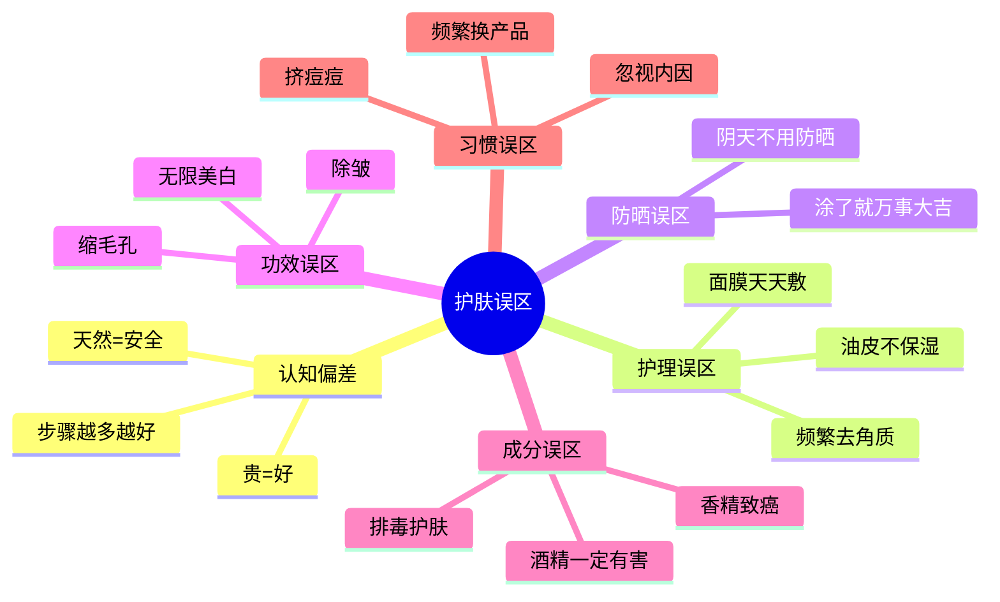
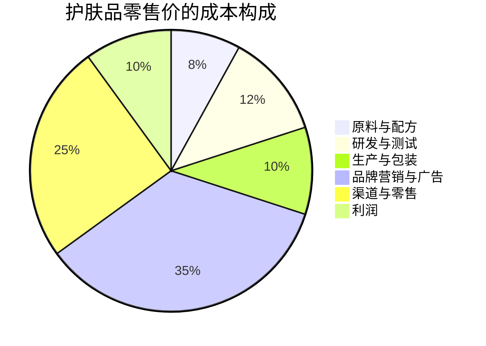
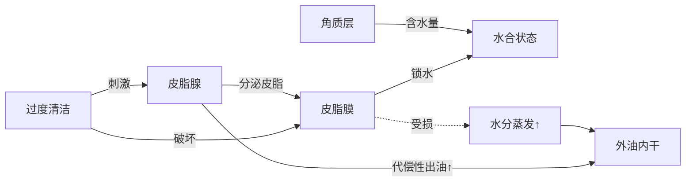
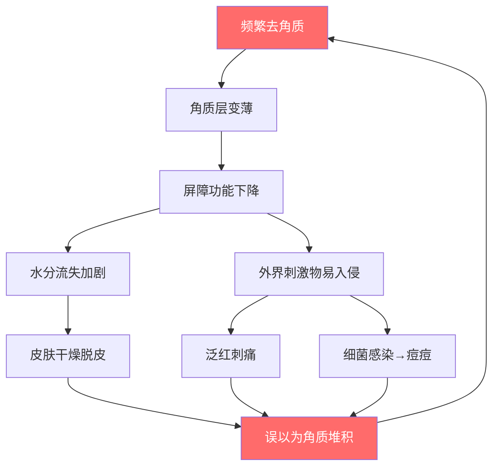
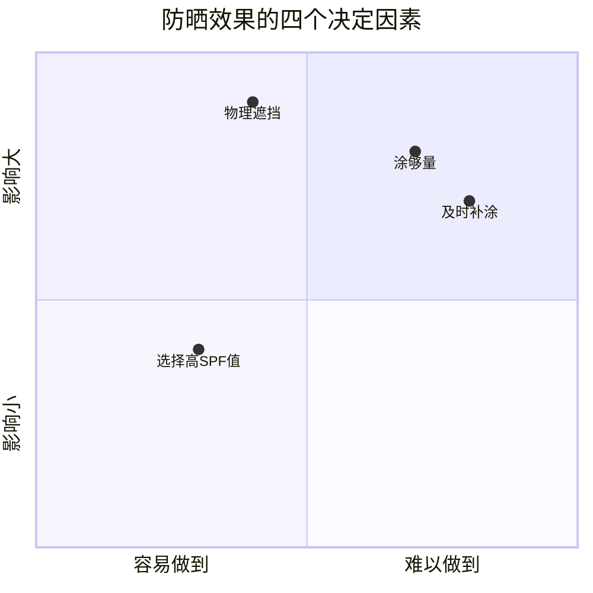
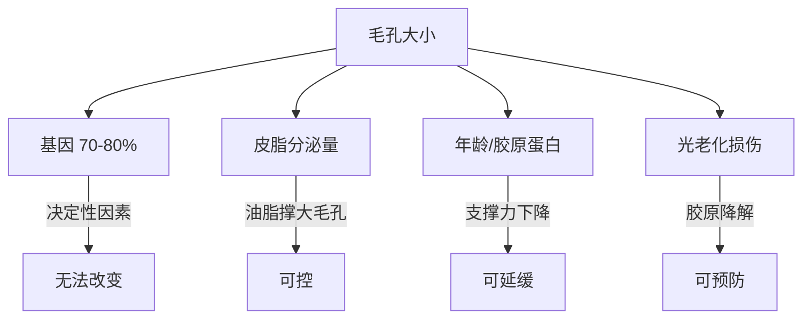
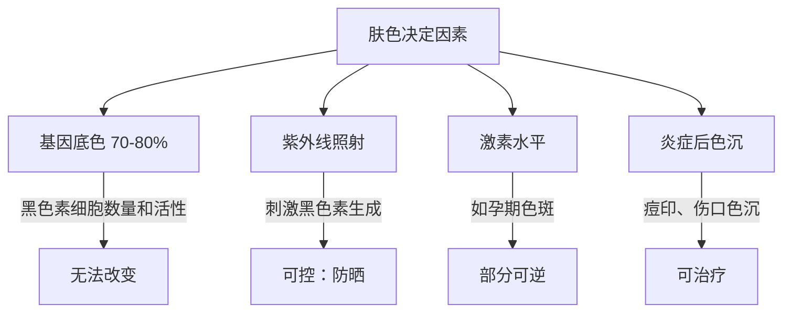

# 常见误区：你可能正在犯的护肤错误

> "避开错误，比追求正确更重要。" —— 很多皮肤问题不是因为"做得不够"，而是因为"做错了"。

护肤是一门科学，但互联网上充斥着大量未经验证的"经验之谈"和商业营销话术。这些误区轻则让你浪费金钱和时间，重则破坏皮肤屏障、引发敏感和炎症。本章系统梳理护肤领域最常见的认知误区，逐一拆解其错误逻辑，并给出科学依据和正确做法。

***

## 第一部分：认知偏差类误区

这类误区源于人类的认知捷径——用简单标签替代复杂判断。

### 误区一：天然/纯植物就是安全的

#### 错误观念
"这个产品是纯天然植物提取的，肯定比化学成分安全。"

#### 科学真相
"天然"不等于"安全"，"化学"不等于"有害"。这是护肤品营销中最成功的认知植入之一。

**天然成分的真实风险**：
- **精油致敏**：薰衣草精油、茶树精油是常见的接触性皮炎诱源。德国皮肤病学杂志的研究显示，茶树精油的过敏率在2000年后上升了约5倍，与其在护肤品中的大量使用直接相关
- **植物提取物的光毒性**：柑橘类精油（柠檬、佛手柑、甜橙）含有呋喃香豆素，涂抹后经紫外线照射会引发严重的光毒性反应，导致皮肤灼伤和色素沉着
- **"纯天然"防腐不足**：没有有效的防腐体系，水性产品（如纯露、植物精华液）在开封后极易滋生细菌和霉菌，使用这样的产品相当于往脸上涂抹微生物培养基
- **一切物质都是化学物质**：水是H₂O，植物提取物中的有效成分（如芦荟中的芦荟苷、绿茶中的EGCG）都是化学物质。"不含化学成分"这句话本身就是自相矛盾的

**"天然"标签的营销套路**：
| 营销话术 | 实际含义 | 真实情况 |
|---------|---------|---------|
| "纯植物配方" | 含有植物提取物 | 仍需化学防腐剂和乳化剂才能成配方 |
| "不含防腐剂" | 未添加常见防腐剂 | 可能使用了替代性防腐成分（如多元醇）或产品本身不稳定 |
| "有机认证" | 通过了某种有机认证 | 各国有机认证标准差异巨大，且有机≠安全 |
| "零化学" | 字面意思 | 物理上不可能，任何物质都是化学物质 |

#### 正确做法
- 不要被"天然"、"纯植物"、"无化学成分"等营销话术迷惑
- 关注产品的**完整成分表和配方逻辑**，而非营销概念
- 任何产品（无论天然还是化学）都可能引起过敏，使用新产品前先在耳后或手腕内侧试用48小时
- 如果你偏好植物来源的成分，选择有正规备案、成分透明的品牌，而非"三无"手工产品

***

### 误区二：贵的产品一定比便宜的好

#### 错误观念
"这个精华1000多块，肯定比那个100多的好用。"

#### 科学真相
护肤品的价格由以下因素决定，而有效成分成本通常只占很小一部分：

**价格与效果的真实关系**：

| 价格区间 | 典型特征 | 性价比分析 |
|---------|---------|-----------|
| 50元以下 | 基础保湿、简单配方 | 洗面奶、基础保湿可选，精华类效果存疑 |
| 50-200元 | 有核心成分、配方成熟 | **性价比最高的区间**，国货品牌集中区 |
| 200-500元 | 成分浓度更高、使用感更好 | 精华、防晒值得投入的区间 |
| 500-1000元 | 品牌溢价开始显著 | 配方可能更精致，但边际收益递减 |
| 1000元以上 | 高端/奢侈品牌 | 支付的主要是品牌价值、包装设计和消费体验 |

**平价逆袭的案例**：
- The Ordinary的10%烟酰胺精华售价约60元，核心成分与某些售价500+的烟酰胺精华完全一致
- 珂润面霜（约150元）的神经酰胺配方技术成熟度不输很多高端品牌
- 很多国货品牌的成分配方比某些国际大牌更"实在"——因为它们没有巨额的品牌营销成本需要分摊

#### 正确做法
- **看成分表而非价格标签**：学会识别核心成分及其在成分表中的位置（排名越靠前含量越高）
- **把钱花在刀刃上**：精华和防晒最值得投资（直接接触皮肤、需要有效浓度），洗面奶和基础保湿可以选平价款
- 不要因为便宜就怀疑产品效果，也不要因为贵就认为一定好用
- 关注成分的**实际添加浓度**，而非品牌宣称——有些高价产品核心成分排在成分表末尾，含量微乎其微

***

### 误区三：护肤步骤越多越好

#### 错误观念
"韩国女生护肤要10个步骤，所以步骤越多皮肤越好。"

#### 科学真相
"10步护肤法"是2010年代韩国护肤品行业为了卖出更多产品而成功推广的营销概念，它创造了一种"少一步就不完整"的焦虑感。事实上：

1. **护肤步骤越多，皮肤负担越重**：每增加一步，就多一层产品叠加在皮肤上。过多的层叠可能导致毛孔堵塞、闷痘、搓泥
2. **成分冲突的风险增加**：同时使用太多活性成分可能导致刺激（如维A醇+高浓度VC+果酸同时上脸），或成分之间相互抵消效果（如某些肽类与酸性环境不兼容）
3. **时间和金钱成本增加**：复杂的流程难以长期坚持。护肤最重要的不是某一次的"全套操作"，而是每天坚持
4. **皮肤科医生的共识**：大多数皮肤科医生建议日常护肤步骤控制在3-6步

**不同步骤数的适用场景**：

| 步骤数 | 适用场景 | 核心步骤 |
|-------|---------|---------|
| 3步 | 极简主义、敏感肌、皮肤状态好 | 清洁 → 保湿 → 防晒（白天） |
| 5步 | 标准日常护理 | 清洁 → 化妆水 → 精华 → 乳液/面霜 → 防晒 |
| 7-8步 | 有特定诉求（美白、抗老） | 在5步基础上加入眼霜、特定功效精华、面膜等 |
| 10步+ | 不推荐日常使用 | 仅在特殊场合（如重要活动前急救）偶尔使用 |

#### 正确做法
- **基础护肤3步永远是核心**：清洁 → 保湿 → 防晒（白天）。把这三步做到位，比做10步但每步都敷衍要好得多
- 根据自己的皮肤状态和诉求**按需叠加**，而非机械执行固定流程
- 每引入一个新产品，给皮肤1-2周的适应期，观察是否有不良反应
- **护肤是长期主义**，简单可坚持的流程 > 复杂难以持续的流程

***

## 第二部分：护理方法类误区

这类误区涉及日常护肤操作中的常见错误。

### 误区四：油性皮肤不需要保湿

#### 错误观念
"我脸上这么油，再涂保湿产品不是更油吗？"

#### 科学真相
**油≠水**。皮肤的"油"（皮脂）来自皮脂腺分泌，而"水"是角质层中的含水量。两者是完全独立的系统，由不同的机制调控。

油性皮肤完全可能出现"外油内干"的情况——表面油光满面，但角质层水分不足。这种情况的形成机制如下：

1. **过度清洁**：使用皂基洗面奶或频繁清洁，破坏了皮脂膜这层天然的"锁水屏障"
2. **只控油不保湿**：角质层含水量下降，屏障功能受损
3. **屏障受损后的恶性循环**：屏障受损 → 水分蒸发加速 → 角质层发出"缺水"信号 → 皮脂腺为了补偿而分泌更多油脂 → 油光更严重 → 更想去控油清洁 → 屏障进一步受损

**油性皮肤保湿与不保湿的对比**：

| 维度 | 只控油不保湿 | 控油+保湿 |
|------|------------|----------|
| 短期感受 | 暂时清爽，很快又出油 | 持续水润，出油速度减慢 |
| 屏障状态 | 逐渐受损 | 维持健康 |
| 皮肤质感 | 外油内干、粗糙 | 水油平衡、细腻 |
| 长期后果 | 敏感、痘痘加重 | 稳定、少问题 |

#### 正确做法
- 油性皮肤**必须**保湿，但选择**质地清爽**的保湿产品（凝胶、乳液，而非厚重面霜）
- 推荐含神经酰胺（修复屏障）、透明质酸（抓水）、烟酰胺（控油+修复）的轻薄乳液
- 洗完脸后趁皮肤微湿时立即涂抹保湿产品（"湿涂法"），锁水效果更好
- 避免使用高酒精含量的"控油"产品，它们短期控油但长期破坏屏障

***

### 误区五：频繁去角质能让皮肤更光滑

#### 错误观念
"一周去两三次角质，皮肤会更光滑透亮。"

#### 科学真相
角质层是皮肤屏障的主体，由15-20层扁平的角质细胞组成，像"砖墙结构"一样保护皮肤。正常情况下，老旧角质会自然脱落（约28天一个代谢周期），无需人为干预。

**频繁去角质的连锁反应**：

这个恶性循环是很多人"越去角质皮肤越差，越差越想去角质"的根本原因。

**不同去角质方式的对比**：

| 方式 | 原理 | 刺激性 | 适合肤质 | 频率建议 |
|------|------|--------|---------|---------|
| 物理磨砂 | 颗粒摩擦去除死皮 | 较高 | 仅限耐受性强的油皮 | 一周1次 |
| 果酸（AHA） | 溶解角质细胞间连接 | 中等 | 中性/干性皮肤 | 一周1-2次 |
| 水杨酸（BHA） | 渗入毛孔溶解油脂+角质 | 较低 | 油性/痘痘皮肤 | 一周1-2次 |
| 酶类（木瓜蛋白酶等） | 分解角质蛋白 | 低 | 敏感肌也适用 | 一周1次 |

#### 正确做法
- **健康皮肤**：使用温和的化学去角质产品（低浓度水杨酸或果酸），一周1-2次即可
- **敏感皮肤**：避免去角质，专注于屏障修复。等屏障恢复健康后再考虑
- 如果你已经在使用含酸类的日常护肤品（如含水杨酸的洁面），无需再额外去角质
- 去角质后必须做好两件事：**保湿**（修复屏障）和**防晒**（新生角质更易受紫外线伤害）
- 出现泛红、刺痛、脱皮时立即停止去角质，给皮肤至少2周修复时间

***

### 误区六：面膜每天敷，皮肤越来越好

#### 错误观念
"范冰冰一天敷好几张面膜，所以皮肤那么好。"

#### 科学真相
面膜的原理是通过"封包效应"（occlusion）——用面膜布/膜体覆盖皮肤表面，阻止水分蒸发，使角质层暂时吸收大量水分，看起来饱满透亮。但这个机制有一个关键限制：

**过度水合（Over-hydration）的危害**：

角质层的正常含水量在20-35%之间。当含水量超过这个范围（过度水合），角质细胞会过度膨胀，导致：

1. **细胞间脂质被冲散**：角质层的"砖墙结构"中的"水泥"（细胞间脂质）被稀释，屏障功能显著下降
2. **皮肤通透性异常增加**：外界刺激物更容易渗透进皮肤深层
3. **角质层反而加速脱水**：过度水合后的角质层在恢复过程中，水分蒸发速度比正常状态更快
4. **面膜中的防腐剂和香精**在过度水合的高渗透性下，更容易引起刺激和过敏

**面膜频率的科学建议**：

| 面膜类型 | 推荐频率 | 单次时长 | 注意事项 |
|---------|---------|---------|---------|
| 补水保湿面膜 | 一周2-3次 | 15-20分钟 | 不要超过20分钟 |
| 清洁泥膜 | 一周1次 | 10-15分钟 | 干性/敏感肌两周1次 |
| 功效型面膜（美白、抗老） | 一周1-2次 | 按说明 | 活性成分浓度高，注意耐受 |
| 睡眠面膜 | 一周2-3次 | 过夜 | 本质是厚涂面霜，薄涂即可 |

#### 正确做法
- 补水面膜一周2-3次足够，不需要天天敷
- **每次15-20分钟**，面膜开始变干时就应该取下（面膜变干后会反向吸收皮肤水分）
- 敷完面膜后**必须涂抹乳液/面霜锁住水分**，否则水分蒸发后皮肤可能比敷之前更干
- 日常的保湿（化妆水+精华+乳液/面霜）比面膜更重要，面膜是锦上添花而非雪中送炭
- 不要迷信明星的"一天N张面膜"说法——她们的好皮肤更多来自医美、基因和专业团队管理

***

## 第三部分：防晒认知类误区

防晒是护肤中最重要的一步，也是误解最多的领域之一。

### 误区七：涂了防晒就不怕晒了

#### 错误观念
"我涂了SPF50的防晒霜，可以放心晒太阳了。"

#### 科学真相
防晒霜的防护效果取决于四个变量，大多数人只关注了SPF值这一个：

**涂抹量是最大的变量**：
- 防晒产品的SPF值是在标准用量（2mg/cm²）下测试得出的
- 换算到面部，大约需要1元硬币大小的量（约1g）
- 研究显示，大多数人实际涂抹量只有标准量的1/4到1/2
- 涂抹量减半时，SPF50的实际防护效果可能降至SPF7-10

**SPF值的数学真相**：

| SPF值 | UVB阻挡率 | 未阻挡率 | 相比SPF15的额外收益 |
|-------|----------|---------|-------------------|
| SPF15 | 93.3% | 6.7% | 基准 |
| SPF30 | 96.7% | 3.3% | +3.4% |
| SPF50 | 98.0% | 2.0% | +1.3%（相比SPF30） |
| SPF100 | 99.0% | 1.0% | +1.0%（相比SPF50） |

SPF值越高，边际收益越小。**涂够量比选高SPF重要得多**。

**补涂的科学**：
- 化学防晒剂（如阿伏苯宗）在紫外线照射下会逐渐分解，2小时后防护力显著下降
- 出汗、摩擦（擦脸、戴口罩）会物理性地去除防晒膜
- 在室内靠窗工作也需要补涂——UVA可以穿透玻璃

#### 正确做法
- **防晒霜是防晒体系的一部分，不是全部**。最有效的防晒是物理遮挡
- 完整的防晒体系：涂够量的防晒霜 + 遮阳帽（帽檐>7.5cm）+ 太阳镜 + 防晒衣/遮阳伞
- 涂够量（面部约1g）比选择高SPF值更重要
- 每2小时补涂一次，出汗或擦脸后立即补涂
- 尽量避免在紫外线最强的时段（上午10点-下午4点）长时间户外活动

***

### 误区八：阴天/冬天/在室内不需要防晒

#### 错误观念
"今天阴天，没有太阳，不用涂防晒了。"
"冬天太阳不大，不用防晒。"
"我在办公室里，又不出门，不用防晒。"

#### 科学真相
紫外线分为UVA（长波）和UVB（中波），它们的穿透力不同：

| 紫外线类型 | 波长 | 云层穿透率 | 玻璃穿透率 | 主要伤害 |
|-----------|------|-----------|-----------|---------|
| UVB | 280-315nm | 会被云层部分阻挡 | 不能穿透普通玻璃 | 晒伤、晒红 |
| UVA | 315-400nm | **云层几乎无法阻挡** | **可以穿透普通玻璃** | 光老化、色沉、皮肤癌 |

**关键事实**：
- 阴天时UVB确实减少（所以不觉得晒），但UVA仍能穿透云层到达地面，强度约为晴天的80%
- UVA是导致光老化（皱纹、色斑、松弛）的主要元凶，它的伤害是**日积月累**的
- 冬天的紫外线强度虽然比夏天低，但仍有显著的UVA，尤其在雪地（反射率80%）和高海拔地区
- 靠窗办公的人，左脸（靠窗侧）的光老化通常比右脸明显——UVA可以穿透玻璃

#### 正确做法
- **一年四季、晴天阴天都需要防晒**，这是护肤最重要的单一习惯
- 阴天/冬天可以使用较低SPF的防晒产品（SPF15-30），但不要完全不涂
- 室内靠窗工作者建议使用日常防晒产品
- 如果你只能养成一个护肤习惯，**选防晒**——它对皮肤的保护价值超过所有精华和面霜的总和

***

## 第四部分：功效期待类误区

这类误区源于对护肤品功效的不合理期待。

### 误区九：护肤品可以收缩毛孔

#### 错误观念
"这款收敛水能收缩毛孔，用完毛孔真的变小了。"

#### 科学真相
毛孔是一个**物理结构**——它是毛囊和皮脂腺在皮肤表面的开口。其大小主要由以下因素决定：

**"收敛水"的真相**：
- 含酒精或单宁酸的收敛水通过使角质层暂时脱水收缩，制造出毛孔"变小"的视觉假象
- 这种效果是**极其短暂**的——几十分钟到几小时后角质层恢复正常含水量，毛孔回到原来大小
- 长期使用高浓度酒精产品反而会刺激皮脂腺、破坏屏障，导致更多出油和更大毛孔
- 没有任何外用产品可以真正改变毛孔的物理尺寸

#### 正确做法
- 毛孔大小主要由基因决定，护肤品无法从根本上"缩小"毛孔，但可以通过以下方式**改善毛孔外观**：
  - **控油**：减少皮脂分泌，毛孔就不会被撑得那么大（烟酰胺2-5%、水杨酸2%）
  - **抗老**：促进胶原蛋白合成，增强毛孔周围的支撑力（维A醇、胜肽）
  - **清洁**：保持毛孔通畅，避免油脂堆积形成黑头（定期使用BHA）
- 想要显著改善毛孔问题，需要医美手段（如果酸换肤、点阵激光、光子嫩肤），这些可以真正改变毛孔周围的胶原结构

***

### 误区十：护肤品可以去除皱纹

#### 错误观念
"这款抗皱面霜用了之后皱纹真的消失了。"

#### 科学真相
皱纹分为两种，它们的形成机制和可逆性完全不同：

| 类型 | 形成原因 | 出现时机 | 护肤品能否改善 | 医美能否改善 |
|------|---------|---------|--------------|------------|
| 动态纹 | 面部肌肉反复运动 | 表情时出现 | 不能（只能暂时填充） | 肉毒素注射有效 |
| 静态纹 | 胶原蛋白+弹性蛋白流失 | 不做表情也存在 | 浅纹可改善，深纹不能 | 填充剂、激光有效 |
| 光老化纹 | 紫外线累积损伤 | 长期日晒后 | 可预防和延缓 | 激光、化学换肤有效 |

**护肤品能做到的**：
- ✅ **预防**新皱纹的产生（防晒是最有效的抗老手段，没有之一）
- ✅ 改善**浅表细纹**（通过保湿使角质层充盈，细纹看起来变浅）
- ✅ **延缓**胶原蛋白流失（维A醇是证据最充分的非处方抗老成分）
- ✅ 改善皮肤整体质感和光泽度

**护肤品做不到的**：
- ❌ 无法去除已形成的**深层静态纹**
- ❌ 无法替代医美手段的效果（肉毒素、填充剂、激光等）
- ❌ 无法逆转已经流失的大量胶原蛋白

**维A醇（视黄醇）的抗老证据**：
维A醇是目前非处方护肤品中证据最充分的抗老成分。它通过以下机制发挥作用：
1. 促进角质层正常代谢
2. 刺激真皮层成纤维细胞产生新的胶原蛋白
3. 抑制胶原蛋白降解酶（MMP）的活性
4. 改善皮肤弹性和紧致度

但维A醇的效果需要**至少12-24周**才能在临床评估中看到显著改善，而且它能改善的是浅纹和整体肤质，不是让深纹消失。

#### 正确做法
- **预防 >> 修复**：20岁开始防晒比30岁开始用抗老精华更有效
- 对已形成的深层皱纹，护肤品效果有限，需要理性预期
- 如果你关注抗老，核心三件套：**防晒 + 维A醇 + 保湿**
- 想要显著改善已有的皱纹和松弛，需要医美手段，护肤品只是辅助

***

### 误区十一：美白产品能让你"白成一道光"

#### 错误观念
"用了很多美白产品，为什么还是没有白成范冰冰？"

#### 科学真相
肤色主要由以下因素决定：

黑色素分为两种类型：
- **真黑色素（Eumelanin）**：深褐色/黑色，提供较强的紫外线防护
- **褐黑色素（Pheomelanin）**：黄红色，防护能力较弱

基因决定了你的黑色素细胞中这两种类型的比例，以及黑色素细胞的活性水平。这就是为什么不同人种的肤色差异如此之大，也是为什么护肤品无法改变你的"基因底色"。

**美白护肤品的机制与局限**：

| 作用环节 | 代表成分 | 能做到 | 做不到 |
|---------|---------|-------|-------|
| 抑制酪氨酸酶活性 | 维C、熊果苷、传明酸 | 减少新黑色素生成 | 改变基因决定的基线生成量 |
| 阻断黑色素转运 | 烟酰胺 | 让黑色素不转移到角质细胞 | 消除已有的黑色素 |
| 加速角质更新 | 果酸、维A醇 | 让含黑色素的老角质更快脱落 | 改变真皮层的黑色素 |
| 抗氧化 | 维C、维E | 减少氧化应激引发的色素沉着 | 逆转已形成的色斑 |

**美白的时间线**：
- 角质层的代谢周期约28天，所以至少需要**4-8周**才能看到初步效果
- 真正明显的效果需要**2-3个月**持续使用
- 如果你同时不做好防晒，美白的速度远远赶不上晒黑的速度

#### 正确做法
- 美白的前提是**严格防晒**——不做好防晒，再多美白产品也白搭
- 理性期待：美白产品可以帮助你恢复到自己的"最白状态"（即不被晒黑时的自然肤色）
- 美白是一个长期过程，需要坚持使用至少2-3个月
- 不要追求不切实际的"白成一道光"，健康均匀的肤色比过度追求白更有质感

***

## 第五部分：成分认知类误区

这类误区涉及对特定护肤成分的误解。

### 误区十二：香精致癌，护肤品里不能有香精

#### 错误观念
"香精是化学合成的，会致癌，买护肤品一定要选无香精的。"

#### 科学真相
香精（Fragrance/Parfum）确实在敏感肌人群中是常见的过敏原之一，但"香精致癌"这个说法需要拆解：

**香精与过敏的关系**：
- 香精混合物（Fragrance Mix）是斑贴试验中排名前列的接触性过敏原，约1-4%的人群对其过敏
- 常见致敏香精成分包括：肉桂醛、羟基香茅醛、橡苔提取物等
- 欧盟化妆品法规（EC 1223/2009）要求标注26种高致敏香精成分，当其浓度超过0.001%（驻留型产品）时必须在成分表中单独列出

**"香精致癌"的真相**：
- 目前没有经过同行评审的研究证明化妆品中合规使用的香精浓度会致癌
- 早期对香精的担忧主要来自工业级香精工人长期高浓度暴露的职业健康研究，与消费者日常使用护肤品的暴露量相差几个数量级
- 某些天然精油（如薰衣草精油中的芳樟醇氧化物）在体外细胞实验中表现出潜在的内分泌干扰活性，但体外实验结果不能直接外推到人体使用场景
- 国际香料协会（IFRA）对每种香料成分都有安全使用限量标准，正规品牌使用的香精配方需符合IFRA标准

**香精在护肤品中的实际作用**：
- 掩盖原料本身的不良气味（如某些油脂的哈喇味、活性成分的化学味）
- 提升使用体验，增加愉悦感——这不是"虚荣"，愉悦的使用感有助于坚持护肤
- 某些香精成分本身具有功能性（如薰衣草精油有一定的舒缓抗菌作用）

**无香精 vs 有香精的理性对比**：

| 维度 | 无香精产品 | 含香精产品 |
|------|----------|----------|
| 致敏风险 | 较低（但其他成分仍可能致敏） | 较高（尤其敏感肌） |
| 使用体验 | 可能有原料本身的味道 | 愉悦感更强 |
| 适合人群 | 敏感肌、屏障受损期间 | 健康皮肤、非过敏体质 |
| 价格 | 不一定更贵 | 香精成本占比极低 |

#### 正确做法
- **敏感肌、屏障受损、湿疹/皮炎患者**：优先选择无香精产品，降低致敏风险
- **健康皮肤**：含合规香精的护肤品无需恐惧，不必一刀切排斥
- 如果你对香精过敏，需要避开的不仅是"香精"（Fragrance/Parfum），还要注意天然精油成分（如薰衣草油、茶树油等同样可能致敏）
- "无香精"不等于"零风险"——无香精产品中其他成分（防腐剂、乳化剂）同样可能引起反应
- 真正需要警惕的是：成分表中香精排名靠前（含量高）且产品来源不正规的小品牌

***

### 误区十三：护肤品含酒精就是烂脸产品

#### 错误观念
"这个成分表里有酒精（乙醇），肯定刺激皮肤，不能用。"

#### 科学真相
酒精（乙醇/Alcohol Denat.）在护肤品中是一个被严重"妖魔化"的成分。它的问题和价值需要分情况讨论：

**酒精在护肤品中的正面作用**：
- 作为溶剂帮助活性成分溶解和渗透
- 提供清爽的使用感，加速产品干燥
- 具有一定的抑菌作用
- 帮助其他成分更好地渗透进皮肤

**酒精的潜在风险**：
- 高浓度（成分表前三位）长期使用可能破坏皮肤屏障
- 对已经敏感或屏障受损的皮肤可能造成刺激
- 可能加速皮肤水分蒸发

**关键在于浓度和配方**：
- 成分表中排名靠后的酒精（含量低），在成熟配方中通常是安全的
- 日系护肤品（如奥尔滨、黛珂）大量使用酒精，但配方技术成熟，数十年来使用者皮肤并没有普遍出问题
- 真正需要警惕的是**酒精含量高+配方简单粗暴**的产品

#### 正确做法
- 不要看到成分表里有酒精就一票否决
- 关注酒精在成分表中的**位置**（越靠后含量越低）
- **敏感肌/屏障受损时**：尽量避免含酒精的产品
- **健康油皮**：含适量酒精的清爽产品是可接受的
- 判断一个产品好不好，看的是**整体配方和实际效果**，不是单一成分

***

### 误区十四：护肤品可以"排毒"

#### 错误观念
"这款排毒面膜可以吸出皮肤里的毒素。""爆痘是在排毒，说明产品在起作用。"

#### 科学真相
**皮肤没有"毒素"需要排**。这是护肤品营销中最荒谬但也最成功的概念之一。

**"排毒"概念的解剖**：
- 人体的"排毒"由肝脏和肾脏负责，通过代谢和排泄完成。皮肤不是排毒器官
- 皮肤上所谓的"毒素"——灰尘、油脂、代谢废物——通过正常的清洁就可以去除
- 深层的重金属、化学物质残留等，不是面膜能"吸出来"的
- 所谓"排毒面膜"变黑，通常是因为面膜中的成分（如活性炭、高岭土）氧化变色，与"毒素"无关

**"爆痘排毒"的真相**：
- 使用新产品后出现的痘痘，在绝大多数情况下**不是排毒**，而是：
  1. **产品致痘**：配方中含有你的皮肤不耐受的成分
  2. **成分刺激**：活性成分（如维A醇、果酸）浓度过高引发的刺激反应
  3. **封闭性过强**：产品质地过于厚重，堵塞毛孔
- 真正的"适应期反应"（如维A醇初期的轻微脱皮）和"致痘"需要区分。如果使用新产品后持续爆痘超过2-3周，应该停止使用

#### 正确做法
- 忽略所有宣称"排毒"功效的护肤品
- 皮肤护理的核心是：**清洁 + 保护屏障 + 防晒**，不需要"排毒"
- 使用新产品后出现持续性爆痘，立即停用——这是皮肤在告诉你"这个产品不适合我"
- 如果你真的担心身体"毒素"积累，关注肝脏和肾脏健康（少喝酒、多喝水、均衡饮食），而非往脸上涂东西

***

### 误区十五：护肤品能替代药物治疗皮肤问题

#### 错误观念
"我长痘了，买祛痘产品就行，不用看医生。""湿疹/皮炎用护肤品就能治好。"

#### 科学真相
护肤品和药物有明确的法律和功能边界：

| 维度 | 护肤品 | 药物（OTC/处方） |
|------|--------|----------------|
| 法律定义 | 用于清洁、美化、保护皮肤 | 用于诊断、治疗、预防疾病 |
| 功效宣称 | 只能宣称"改善外观" | 可以宣称"治疗XX疾病" |
| 成分浓度 | 受限（如维A醇通常<1%） | 可以使用治疗浓度（如维A酸0.025-0.1%） |
| 监管要求 | 备案制，上市前无需临床验证 | 需要临床试验验证安全性和有效性 |

**护肤品无法治疗的皮肤问题**：
- **痤疮（中重度）**：需要外用维A酸、过氧化苯甲酰、抗生素等药物，严重的需要口服异维A酸
- **湿疹/特应性皮炎**：需要外用糖皮质激素、钙调神经磷酸酶抑制剂等
- **银屑病**：需要系统性治疗
- **真菌感染（如脚气、体癣）**：需要抗真菌药物
- **严重的色素性疾病**：如黄褐斑，需要综合治疗方案

**护肤品能做到的辅助作用**：
- 维护皮肤屏障（如使用含神经酰胺的保湿产品辅助治疗湿疹）
- 配合药物治疗使用（如用药期间加强保湿和防晒）
- 预防问题复发（如痘痘控制后使用含水杨酸的产品预防复发）

#### 正确做法
- **以下情况请看皮肤科医生**，不要自己用护肤品解决：
  - 痘痘反复不好、面积大、有脓包/囊肿
  - 皮肤出现不明原因的红斑、脱屑、瘙痒
  - 皮肤问题影响到生活质量或心理状态
  - 使用护肤品2-4周后没有任何改善
- 护肤品是皮肤健康的"日常维护"，不是"故障修理"
- 看医生不丢人，皮肤病需要专业诊断，自我判断可能延误治疗

***

## 第六部分：生活习惯类误区

这类误区涉及影响皮肤健康的日常生活习惯。

### 误区十六：痘痘可以挤，挤掉好得快

#### 错误观念
"痘痘里的白色东西挤出来就好了，不挤反而好得慢。"

#### 科学真相
挤痘痘是皮肤科医生**明确反对**的行为，原因如下：

**挤痘的直接危害**：
1. **手上的细菌**会通过挤压进入皮肤深层，可能将浅表的粉刺变成深层的炎症性痘痘（脓肿）
2. **不当的挤压力量**会破坏毛囊壁，导致炎症扩散到周围组织——本来一颗小痘痘，挤完变成一片红肿
3. **真皮层损伤**会触发过度的修复反应，形成**痘印**（炎症后色素沉着）甚至**痘坑**（萎缩性疤痕）
4. 痘坑一旦形成，护肤品**完全无法修复**，需要激光等医美手段

**"挤出来白色东西"是什么**：
- 那是皮脂和角质细胞的混合物（脂质栓），不是"毒素"或"脏东西"
- 它是毛囊皮脂腺的正常代谢产物，问题在于排出通道堵塞

**不挤痘 vs 挤痘的结果对比**：

| 维度 | 不挤（自然愈合） | 挤（人为干预） |
|------|----------------|--------------|
| 愈合时间 | 5-10天 | 可能更长（因为造成额外损伤） |
| 留印风险 | 低 | 高（炎症后色沉） |
| 留坑风险 | 极低 | 高（真皮层损伤） |
| 感染风险 | 低 | 高（手部细菌引入） |

#### 正确做法
- **不要用手挤痘痘**，这是最重要的一条
- 如果痘痘有明显的白色脓头，可以使用**痘痘贴**（水胶体贴），它能吸收分泌物，同时隔离细菌
- 使用含**水杨酸（2%）**或**过氧化苯甲酰（2.5-5%）**的祛痘产品点涂
- 对于大的、痛的囊肿型痘痘，不要试图自己处理，去看皮肤科医生——医生可以在无菌条件下安全处理，或注射糖皮质激素快速消炎
- 管住手是祛痘最难但最有效的一步

***

### 误区十七：频繁更换护肤品才能找到最好的

#### 错误观念
"这个产品用了两周没效果，换一个试试。"

#### 科学真相
皮肤对新产品的适应需要时间，频繁更换是很多人"皮肤一直不好"的重要原因：

**皮肤适应的时间线**：
- **1-3天**：皮肤初次接触新产品，可能出现轻微不适（正常适应反应）
- **1-2周**：皮肤开始适应新产品，初期反应消退
- **4-6周**：皮肤的更新周期（约28天），此时才能初步评估产品效果
- **8-12周**：功效型产品（美白、抗老）需要这个时间才能看到临床可测量的效果

**频繁更换的代价**：
1. 每次更换新产品，皮肤都要重新适应，可能导致新一轮的不适
2. 无法准确判断哪个产品有效，哪个有问题
3. 钱花了，但没有给任何产品足够的起效时间
4. 增加了接触更多潜在过敏原的机会

#### 正确做法
- 引入新产品后，给它**至少4-6周**的评估时间
- 同一时间段内只引入**一个**新产品，这样如果出现不良反应，可以准确归因
- 建立一个**护肤日志**（可以用手机备忘录），记录每天的皮肤状态、使用的产品，便于追踪效果
- "有效"的产品不需要多——找到适合自己的清洁、保湿、防晒三件套后，其他产品按需添加

***

### 误区十八：护肤只需要外用，内调不重要

#### 错误观念
"护肤品用好就行了，吃什么、睡不睡觉跟皮肤没关系。"

#### 科学真相
皮肤是人体最大的器官，它的健康状况是**内在健康的外在表现**。再好的护肤品，也无法弥补不健康的生活方式对皮肤的损害。

**生活方式与皮肤的科学关联**：

| 生活因素 | 对皮肤的影响机制 | 科学证据 |
|---------|----------------|---------|
| 睡眠不足 | 皮质醇升高→皮脂分泌增加→出油/痘痘；生长激素分泌减少→修复减缓 | 2015年《Sleep》期刊研究：睡眠不足的女性皮肤屏障修复速度显著减慢 |
| 高糖饮食 | 血糖升高→胰岛素样生长因子(IGF-1)↑→刺激皮脂腺→痘痘加重 | 2007年《American Journal of Clinical Nutrition》：低糖饮食组痤疮显著改善 |
| 压力 | 皮质醇和肾上腺素→皮脂分泌↑+炎症反应↑→痘痘、湿疹加重 | 2014年《Brain, Behavior, and Immunity》：考试期间学生痤疮显著加重 |
| 脱水 | 角质层含水量下降→皮肤干燥、暗沉 | 直接的生理学因果关系 |
| 吸烟 | 破坏胶原蛋白和弹性蛋白→加速老化；减少皮肤血流→肤色暗沉 | 多项长期队列研究：吸烟者面部皱纹评分显著高于非吸烟者 |

**内调外养的优先级**：

底层（生活方式）对皮肤的影响权重远大于顶层（护肤品），但大多数人把80%的注意力和预算花在了顶层。

#### 正确做法
- **睡眠**：保证7-8小时高质量睡眠，23点前入睡，这是最便宜的"抗老精华"
- **饮食**：减少高糖食物（奶茶、蛋糕、白面包），增加蔬菜水果和优质蛋白
- **水分**：每天喝1.5-2L水，不需要更多，但不能更少
- **运动**：规律运动促进血液循环，改善皮肤供氧和营养
- **压力管理**：长期压力对皮肤的损害不亚于不涂防晒
- 护肤品是锦上添花，健康的生活方式才是根本

***

## 第七部分：决策判断类误区

这类误区涉及护肤消费和选择中的决策偏差。

### 误区十九：别人用了好，我用也一定好

#### 错误观念
"我朋友用了这个产品效果特别好，我也买一个。""这个博主推荐的，肯定没错。"

#### 科学真相
护肤品的效果具有**高度的个体差异性**，原因包括：

1. **肤质不同**：油皮、干皮、混合皮、敏感肌对同一产品的反应可能完全相反
2. **皮肤问题不同**：同样是"痘痘"，成因可能完全不同（激素、屏障受损、饮食、细菌），解决方案也不同
3. **皮肤状态不同**：同一个人在不同季节、不同生理周期的皮肤状态也在变化
4. **基因差异**：对成分的代谢速度、敏感程度、皮脂分泌量都由基因影响

**关于"博主推荐"和"用户评价"**：
- 博主推荐可能涉及商业合作（广告），并不客观
- 用户评价中存在大量安慰剂效应——花了钱、认真用了，会倾向于觉得"有效"
- 少数好评无法代表普遍效果，样本量太小
- "用了之后皮肤变好了"可能是因为同时改变了其他习惯（如作息、饮食）

#### 正确做法
- 了解自己的**肤质类型**和**核心诉求**，在此基础上选产品
- 参考多人评价，但不要盲从。关注与你**肤质相近**的人的评价
- 任何新产品先**小面积试用**48小时，确认无不良反应后再大面积使用
- 如果有预算，可以先买小样/旅行装试用，而不是直接买正装

***

### 误区二十：成分表排名靠前=浓度高=效果好

#### 错误观念
"烟酰胺排在成分表第二位，浓度肯定很高，效果一定好。"

#### 科学真相
成分表排名确实是按含量从高到低排列的（中国法规要求），但这不等于"排名靠前就浓度高、效果好"：

**成分表的"陷阱"**：

1. **水是最大的欺骗**：几乎所有护肤品的第一位都是"水"（Aqua），它占了产品50-80%的重量。去掉水之后，其他成分的相对比例会完全不同
2. **1%分界线**：防腐剂（如苯氧乙醇）的添加量通常在1%以下。防腐剂之后的成分，排序可能不再严格按含量排列
3. **有效浓度 ≠ 成分存在**：
   - 烟酰胺的有效浓度：2-5%（很多人耐受上限是5%）
   - 维C（L-抗坏血酸）的有效浓度：10-20%
   - 水杨酸的有效浓度：0.5-2%（中国化妆品法规上限2%）
   - 一个成分在成分表上"出现"不代表达到了有效浓度
4. **配方技术比单一成分更重要**：同样含10%维C的产品，包裹技术好的配方稳定性和渗透性远优于简单溶解的配方

#### 正确做法
- 成分表是**必要信息**但不是**充分信息**——它告诉你产品含有什么，但不告诉你含有多少以及配方好不好
- 关注核心成分的**有效浓度范围**，如果品牌没有标注浓度，可以通过成分表排序大致推断
- 选择**信息公开透明**的品牌（愿意标注核心成分浓度的品牌通常更可信）
- 配方的**整体逻辑**（成分之间是否协同、是否有稳定技术、渗透技术如何）比单一成分的排名更重要

***

## 总结：常见误区速查表

| 序号 | 误区 | 真相 | 核心建议 |
|------|------|------|---------|
| 1 | 天然=安全 | 天然也可能致敏，化学≠有害 | 看成分表，不看营销话术 |
| 2 | 贵=好 | 成分相同，溢价在于品牌和包装 | 钱花在精华和防晒上 |
| 3 | 步骤越多越好 | 3-6步足够，做到位比做多步重要 | 基础3步是核心 |
| 4 | 油皮不保湿 | 油≠水，油皮也需要清爽保湿 | 选质地清爽的乳液 |
| 5 | 频繁去角质 | 过度破坏屏障，一周1-2次足够 | 温和化学去角质>物理磨砂 |
| 6 | 面膜天天敷 | 过度水合损害屏障，一周2-3次 | 15-20分钟，敷后锁水 |
| 7 | 涂了防晒就万事大吉 | 涂够量+补涂+物理遮挡才完整 | 面部约1g，每2小时补涂 |
| 8 | 阴天/冬天不用防晒 | UVA穿透云层和玻璃 | 一年四季都要防晒 |
| 9 | 护肤品能缩毛孔 | 只能改善外观，基因决定大小 | 控油+抗老+必要时医美 |
| 10 | 护肤品能除皱 | 能预防和改善浅纹，深纹需医美 | 防晒是最有效的抗老 |
| 11 | 美白能白成一道光 | 只能恢复到基因底色 | 严格防晒+长期坚持 |
| 12 | 香精致癌 | 合规浓度无致癌证据，但可能致敏 | 敏感肌避开，健康皮肤无需恐惧 |
| 13 | 含酒精=烂脸 | 低浓度酒精在成熟配方中无害 | 看整体配方，不妖魔化单一成分 |
| 14 | 护肤品能排毒 | 皮肤不需要排毒，肝脏才是排毒器官 | 忽略所有"排毒"宣称 |
| 15 | 护肤品能替代药物 | 皮肤病需要看医生 | 持续2-4周无改善就就医 |
| 16 | 痘痘可以挤 | 挤痘增加感染、留印、留坑风险 | 管住手，用痘痘贴或药物 |
| 17 | 频繁换产品找最好的 | 皮肤适应需要4-6周 | 新产品至少给4周评估期 |
| 18 | 只需外用不需内调 | 睡眠、饮食、压力对皮肤影响巨大 | 生活方式>护肤品 |
| 19 | 别人好用我也好用 | 个体差异巨大 | 了解自己肤质再选产品 |
| 20 | 成分表排名靠前=效果好 | 排名不等于有效浓度 | 关注浓度和配方技术 |

***

> 避开这20个误区，你已经超越了90%的护肤消费者。记住：护肤的本质是**科学地维护皮肤健康**，而不是在脸上堆叠越来越多的产品。简单、坚持、适合自己的，才是最好的。
