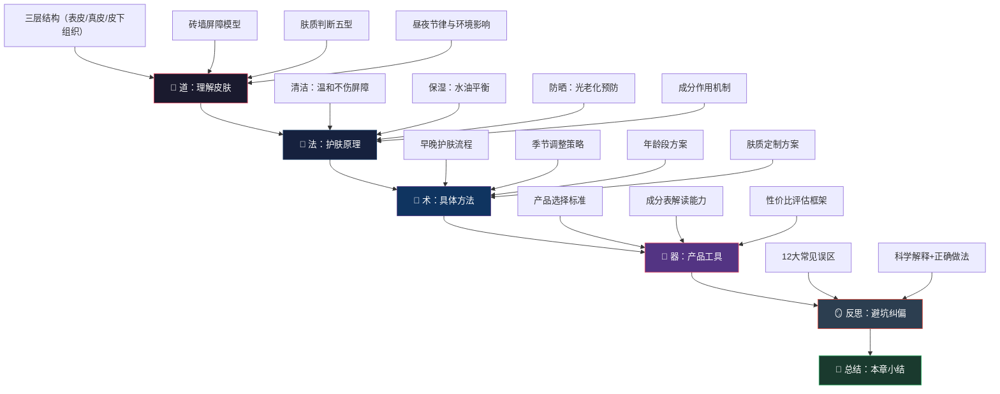
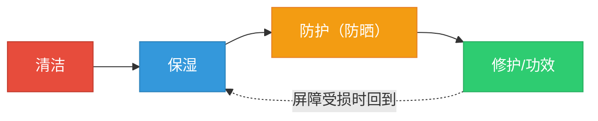
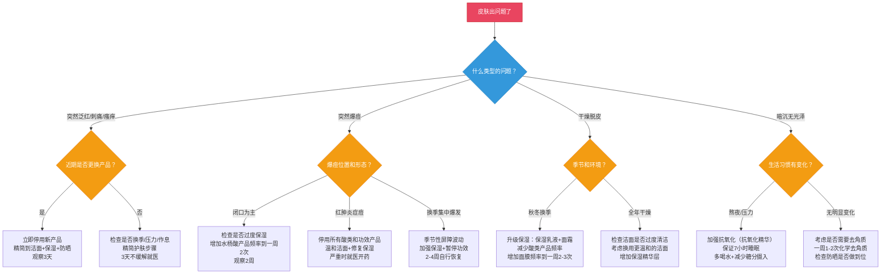
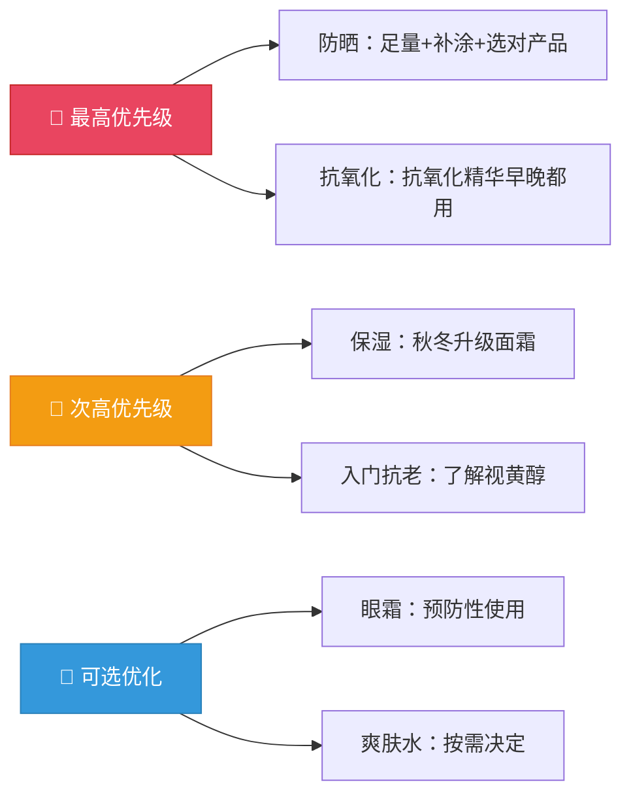
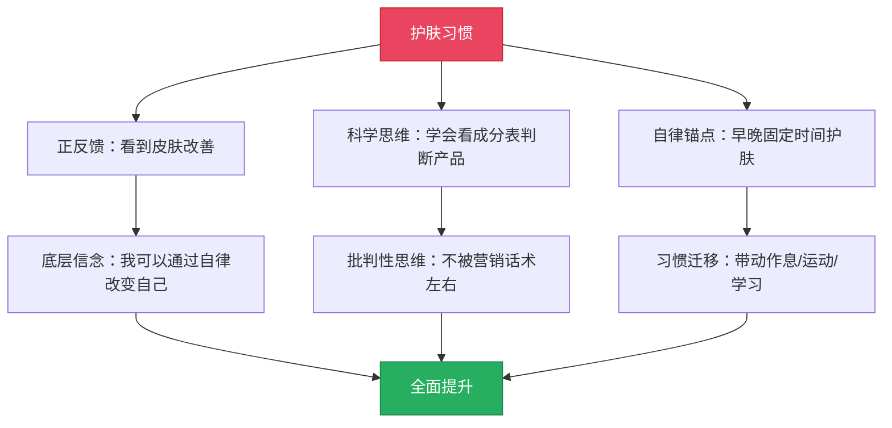

# 本章小结：从碎片知识到体系能力

> "护肤的本质是保护，不是改造。最好的护肤方案，不是最贵的那个，而是你能每天坚持的那个。"

本章从皮肤的微观结构出发，经由护肤原理、具体方案、产品推荐、学习路径、常见误区五个维度，构建了一套完整的个人护肤知识体系。本小结的任务是将这六个章节的内容提炼、串联、升华，帮你把碎片知识编织成体系，把理论转化为可执行的日常习惯。

读完本小结后，你应该能做到三件事：**说清楚**自己的护肤逻辑链（为什么用这些产品、为什么在这个顺序）、**判断得了**任何一款新产品是否适合自己、**应对得了**皮肤突发状况而不慌张。

***

## 一、章节回顾：六步走完，你学到了什么

在串联知识之前，先快速回顾每一章的核心内容。这不是简单的重复，而是帮你确认：哪些知识你已经内化，哪些还需要回头补课。

### 1.1 章节概览（第一章开篇）

这一节回答了"为什么护肤是个人提升的第一章"。核心论点有三个：

- **即时反馈**：护肤是所有自我提升领域中见效最快的，4周即可看到肤色均匀度和干燥脱皮的改善
- **低成本启动**：每天5-10分钟，不需要器械、不需要场地、不需要专业知识入门
- **正向循环**：皮肤改善→自信心提升→自律习惯迁移→其他领域同步改善

这三点决定了护肤是建立"我可以通过自律改变自己"这一底层信念的最佳入口。

### 1.2 基础理论（道：理解皮肤）

这一部分建立了护肤的科学地基，包含七个知识模块：

| 模块 | 核心要点 | 为什么重要 |
|------|---------|-----------|
| 皮肤结构 | 表皮/真皮/皮下组织三层，角质层15-20层砖墙结构 | 不了解结构就不知道护肤品在哪个层面起作用 |
| 肤质判断 | 五大肤质类型（干/油/中性/混合/敏感），自我判断方法 | 所有护肤方案的起点，选错肤质=选错方案 |
| 成分解析 | 神经酰胺、透明质酸、烟酰胺、维A醇、水杨酸等核心成分的作用机制 | 看懂成分表才能独立判断产品，不被营销话术左右 |
| 护肤原理 | 清洁、保湿、防晒三大基础目标的科学机制 | 理解"为什么这样做"比"怎么做"更重要 |
| 生理节律 | 昼夜节律对皮肤修复/分泌的影响 | 解释为什么早晚护肤方案不同 |
| 环境因素 | 紫外线、温度湿度、空气污染、蓝光对皮肤的影响 | 帮助理解季节调整策略和防晒的极端重要性 |
| 认知建立 | 从"护肤是消费"到"护肤是投资"的认知转变 | 态度决定执行力度 |

**自检问题**：你能否用自己的话解释"砖墙屏障"模型？能否说出自己肤质的判断依据？如果能，说明这部分你已经内化；如果不能，建议回头重读基础理论章节。

### 1.3 具体方案（术：你的定制化护肤流程）

这一部分把理论翻译成可执行的动作，覆盖了十个场景：

- **早晚护肤流程**：从洁面到防晒的完整步骤，每一步的产品用量和手法
- **不同肤质方案**：干皮、油皮、中性皮、混合皮、敏感肌的差异化处理
- **不同年龄段方案**：20s防护为主、25+抗氧化、30+抗老、40+修复的分层策略
- **季节调整策略**：春夏秋冬四季的产品质地和使用频率变化
- **进阶方案**：刷酸、维A醇、功效叠加的进阶玩法
- **场景应对**：出差、熬夜、换季、过敏等突发情况的应急方案
- **习惯建立**：让护肤变成像刷牙一样自然的行为习惯技巧

**关键洞察**：方案不是一成不变的模板，而是需要根据季节、年龄、皮肤状态动态调整的"活系统"。掌握了调整逻辑，你就不再需要每次换季都去网上搜索"换季用什么"。

### 1.4 产品推荐（器：工具选择）

这一部分解决了"具体买什么"的问题，涵盖洗面奶、精华、乳液面霜、防晒霜、眼霜、特殊护理产品六大品类，以及不同预算的购物清单和购买渠道建议。

**核心原则贯穿始终**：

1. 成分优先于品牌——同一成分在不同品牌间效果差异远小于你以为的
2. 贵不等于好——护肤品原料成本通常只占零售价的8%左右
3. 适合自己的才是最好的——脱离肤质和需求谈产品推荐就是耍流氓

**自检问题**：你能否看懂产品成分表的前五位成分？能否判断一款产品是"真有效"还是"概念性添加"？这是判断你是否进入"入门"阶段的核心标志。

### 1.5 常见误区（纠偏：避开陷阱）

这一部分拆解了12个最常见的护肤误区，每个误区都包含：错误做法→错误逻辑分析→科学解释→正确做法→关键证据。

这些误区之所以危险，是因为它们往往听起来"很有道理"——"油皮不保湿""天然成分更安全""面膜天天敷"——但科学证据明确指向相反的结论。

### 1.6 学习路径（成长地图）

这一部分设计了从零基础到精通的四阶段学习路线，每个阶段有明确的能力产出和自检标准。它回答的问题是："我现在在哪里？下一步该学什么？"

***

## 二、知识体系全景：道法术器贯通

整章遵循 **"道→法→术→器"** 的逻辑编排。理解这个框架，你就能在任何时候判断自己"缺什么、该补什么"。

**为什么这个顺序不能跳？** 护肤领域最常见的错误就是"跳级"——直接从第三层（产品推荐）开始，买了别人推荐的好产品，用在自己脸上没效果甚至出问题。原因很简单：你不了解自己的皮肤（第一层），不理解产品为什么有效（第二层），再好的产品也是盲人摸象。掌握原理后，你拿到任何新产品，看一眼成分表就能判断它是否适合你——这才是真正的"护肤自由"。

### 2.1 道：理解你的皮肤（基础理论）

皮肤不是一层"膜"，而是人体最大的器官，由外到内分三层：

| 层级 | 厚度 | 核心组成 | 护肤意义 |
|------|------|---------|---------|
| **表皮层** | 0.1-0.3mm | 角质层（15-20层扁平细胞）、基底层、黑色素细胞 | 护肤品直接作用区域，屏障功能的核心 |
| **真皮层** | 1-2mm | 胶原蛋白（干重70-80%）、弹性蛋白、透明质酸、成纤维细胞 | 决定皮肤弹性和紧致度，抗老的核心目标 |
| **皮下组织** | 数mm | 脂肪细胞、血管、淋巴管 | 保温缓冲，护肤品基本无法触及 |

**核心概念：砖墙屏障**

角质层的"砖墙结构"是一切护肤的底层逻辑：

- **砖块** = 角质细胞（15-20层）
- **灰浆** = 细胞间脂质（神经酰胺约50%、胆固醇约25%、游离脂肪酸约15%）
- **外墙涂料** = 皮脂膜（pH 4.5-6.5的弱酸性保护膜）

屏障健康 → 保湿力强、抵御外界刺激、不易敏感泛红。屏障受损 → 水分流失加速、外界刺激物入侵、恶性循环。**屏障健康是一切功效护肤的前提条件**——在屏障没修好之前，谈美白、抗老、刷酸都是空中楼阁。

**你的肤质：中性偏微油**——这是一个容错率较高的好肤质。皮脂分泌略高于正常，T区可能更明显，但整体处于水油平衡的健康区间。护肤的核心诉求是：控油平衡 + 抗氧化 + 预防痘痘和闭口。

### 2.2 法：护肤的四大核心目标

所有护肤行为，无论产品多花哨、流程多复杂，本质上都在服务四个目标：

| 目标 | 核心原则 | 关键指标 |
|------|---------|---------|
| **清洁** | 温和不伤屏障，pH 5.5-6.5 | 洗后不紧绷、不假滑 |
| **保湿** | 补水+锁水，水油平衡 | 角质层含水量20-35% |
| **防晒** | 足量+补涂+物理遮挡 | 面部约1g用量，SPF30/PA+++起步 |
| **修护/功效** | 屏障优先，功效成分循序渐进 | 建立耐受，观察28天+ |

**优先级铁律：屏障健康 > 基础保湿 > 严格防晒 > 功效护肤。** 任何时候皮肤出问题，先回溯检查前一步是否做到位。

### 2.3 术：你的定制化护肤方案

**早晨流程（防御模式）：**
温水洁面（油时用氨基酸洁面） → 抗氧化精华（2-3泵） → 保湿乳液（适量） → 防晒霜（一元硬币大小）

**晚间流程（修复模式）：**
氨基酸洁面（涂了防晒可双重清洁） → 抗氧化精华（2-3泵） → 保湿乳液（适量）

**水杨酸产品之夜（一周一次）：**
氨基酸洁面 → 水杨酸产品薄涂T区/问题区（等5-10分钟吸收） → 保湿乳液（加强保湿）

**关键优化点：**

| 项目 | 原方案 | 优化方案 | 原因 |
|------|--------|---------|------|
| 抗氧化精华 | 仅早上 | **早晚都用** | 抗氧化是全天候需求，夜间是修复高峰 |
| 水杨酸产品频率 | 一周一次 | 保持，夏季可增到两次 | 水杨酸需要逐步建立耐受 |
| 冬季保湿 | 保湿乳液 | 保湿乳液 + 面霜叠加 | 秋冬干燥需要更强的封闭保湿 |
| 早洁 | 固定洗面奶 | 根据出油情况决定 | 中性偏微油早晨可能只需清水 |

**季节调整策略：**

| 季节 | 调整要点 |
|------|---------|
| 春季 | 减少面霜用量，注意花粉抗敏，防晒升级 |
| 夏季 | 清爽质地为主，SPF50+，水杨酸产品可增频，控油加强 |
| 秋季 | 增加保湿力度，换用面霜，减少刷酸频率 |
| 冬季 | 保湿乳液+面霜双重保湿，防晒不减量，精简功效步骤 |

### 2.4 器：产品选择与成分认知

**你当前的产品组合评价：**

| 产品 | 评价 | 核心成分 | 建议 |
|------|------|---------|------|
| 氨基酸洁面 | ✅ 优秀选择 | 氨基酸表活 | 继续使用，性价比极高 |
| 保湿乳液（适乐肤） | ✅ 方案稳定器 | 神经酰胺+烟酰胺 | 四季通用，秋冬可叠加面霜 |
| 抗氧化精华（珀莱雅） | ⚠️ 时机优化 | 虾青素+麦角硫因 | **改为早晚都用** |
| 防晒霜 | ✅ 有意识 | 取决于产品 | 确认SPF/PA值，确保足量涂抹 |
| 水杨酸产品（理肤泉） | ✅ 频率合理 | 水杨酸 | 使用后加强保湿，避免同晚叠加其他酸类 |

**成分表解读能力是"护肤自由"的关键。** 掌握以下规则就能判断任何产品：

1. 成分按浓度从高到低排列（浓度>1%的成分）
2. 防腐剂（如苯氧乙醇）通常在1%分割线位置
3. 防腐剂之后的成分浓度基本<1%，但低浓度不一定无效（如透明质酸）
4. 成分表出现 ≠ 有效浓度，排位靠后可能是"概念性添加"

**选购核心原则：成分优先于品牌，贵≠好，适合自己的才是最好的。** 护肤品零售价中，原料与配方成本通常只占8%左右，品牌营销占35%。50-200元区间是性价比最高的国货品牌集中区。

***

## 三、必须记住的关键数字

这些数字不是用来背的，而是在你需要做判断时的"锚点"。把这张表收藏好，遇到困惑时翻出来对照。

### 3.1 皮肤生理数字

| 数字 | 含义 | 实际应用 |
|------|------|---------|
| **28天** | 皮肤细胞更新周期 | 评估任何护肤品效果的最低等待时间 |
| **4-8周** | 评估一款护肤品是否有效的最低使用时间 | 不要用了两周就下结论 |
| **12-24周** | 维A醇类成分见效的临床评估周期 | 抗老是持久战，不是速效药 |
| **500道尔顿** | 能有效渗透皮肤的成分分子量上限 | 超过这个分子量的成分很难穿透角质层 |
| **pH 4.5-6.5** | 皮肤的天然酸碱度范围 | 选择洁面产品时的pH参考值 |
| **15-20层** | 角质层的细胞层数 | 这就是"砖墙屏障"的砖块数量 |
| **20-35%** | 角质层正常含水量 | 低于10%会出现明显干燥脱皮 |

### 3.2 防晒关键数字

| 数字 | 含义 | 实际应用 |
|------|------|---------|
| **SPF30 / PA+++** | 日常通勤的最低防晒标准 | 不是越高越好，涂够量更重要 |
| **1g** | 面部防晒霜的标准用量 | 约一元硬币大小，大多数人只涂了1/4-1/2 |
| **2mg/cm²** | SPF测试的标准涂抹密度 | 实际达不到这个密度，SPF值会打折 |
| **2小时** | 户外活动时防晒霜的建议补涂间隔 | 化学防晒剂会分解，出汗摩擦会去除 |
| **SPF50 → SPF7-10** | 涂抹量减半时的实际防护效果 | 涂够量比选高SPF重要得多 |
| **80%** | 阴天UVA的相对强度 | 阴天不防晒 = 接受80%的光老化紫外线 |

### 3.3 使用规范数字

| 数字 | 含义 | 实际应用 |
|------|------|---------|
| **15-20分钟** | 面膜的标准使用时间 | 超时后面膜反吸皮肤水分 |
| **48小时** | 新产品小面积试用的观察期 | 耳后或手腕内侧测试 |
| **2-4周** | 更换单个产品的观察期 | 一次只换一个，否则无法判断哪个有效 |
| **一周1-2次** | 化学去角质的推荐频率 | 健康皮肤即可，敏感肌避免 |
| **5-10分钟** | 水杨酸产品等待吸收的时间 | 涂完等吸收再叠加后续产品 |

***

## 四、避坑速查：最重要的三大原则

本章"常见误区"一节梳理了12个典型误区。如果你只能记住三条，记住这三条：

### 原则一：油皮也要保湿——油≠水

皮肤的"油"（皮脂）来自皮脂腺分泌，"水"是角质层中的含水量，两者由完全独立的系统调控。不保湿 → 屏障受损 → 水分蒸发加速 → 皮脂腺代偿性出油 → 更油 → 更想控油 → 恶性循环。

**正确做法：** 油性皮肤选质地清爽的保湿产品（凝胶、乳液），含神经酰胺+透明质酸+烟酰胺的配方最理想。

### 原则二：防晒是最重要的护肤步骤——没有之一

紫外线UVA全年恒定、穿透云层和玻璃，是光老化（皱纹、色斑、松弛）的主因。防晒的价值超过所有精华和面霜的总和。

**正确做法：** 一年四季涂防晒，足量（1g/面部），及时补涂（每2小时），配合物理遮挡（帽子+墨镜+防晒衣）。

### 原则三：屏障健康优先于功效护肤

在屏障没修好之前，美白、抗老、刷酸都是空中楼阁。过度清洁、频繁去角质、叠加太多活性成分，都会破坏屏障，引发敏感、泛红、爆痘。

**正确做法：** 先做好基础三步（清洁+保湿+防晒），皮肤稳定后再逐步加入功效成分，一次一个，观察2-4周。

***

## 五、皮肤问题决策树

遇到皮肤问题时，不要慌，按下面的决策路径排查。这张图覆盖了日常生活中90%的皮肤突发状况：

**决策树使用原则**：

1. **先精简再排查**——不管什么问题，第一步永远是减少护肤步骤，排除产品叠加的干扰
2. **一次只改一个变量**——同时改两样东西就不知道哪个导致了改善或恶化
3. **给皮肤时间**——大多数调整需要2-4周才能看到效果，不要反复折腾
4. **该就医就就医**——如果精简护肤3天后症状没有缓解，或者出现水泡、大面积红肿、持续瘙痒，直接挂皮肤科

***

## 六、常见场景速查表

遇到以下场景时，快速查阅：

### 6.1 日常突发场景

| 场景 | 处理方案 | 恢复周期 |
|------|---------|---------|
| **产品过敏/不耐受** | 立即停用，精简到只有温和洁面+修复保湿+防晒，观察3天。不缓解看皮肤科 | 轻度3-5天，中度1-2周 |
| **突然爆痘** | 排查近期是否新增产品/换季/作息变化，停用功效产品，只用基础护理，严重时就医 | 闭口2-4周，炎症痘4-8周 |
| **换季皮肤干燥** | 增加保湿力度（叠加面霜），减少酸类频率，避免新产品尝试 | 1-2周适应 |
| **晒后急救** | 冷敷降温→厚涂修复保湿→暂停所有功效产品→严格防晒→等屏障自然修复 | 轻度3-5天，晒伤1-2周 |
| **熬夜后皮肤变差** | 加强抗氧化（抗氧化精华），保湿补水，不要叠加刺激性成分 | 1-3天恢复 |
| **不确定新产品是否适合自己** | 先在耳后或手腕内侧小面积试用48小时，无异常再上脸 | 48小时观察期 |

### 6.2 特殊时期场景

| 场景 | 处理方案 | 注意事项 |
|------|---------|---------|
| **出差/旅行护肤** | 带小样/旅行装，保持核心三步（洁面+保湿+防晒），暂停功效产品 | 飞机上机舱极度干燥，提前加强保湿 |
| **运动前后** | 运动前卸妆/清洁，运动后及时洁面+基础护肤 | 运动后30分钟内洁面，汗液长时间停留会刺激皮肤 |
| **长时间戴口罩** | 选择轻薄质地产品，口罩区减少面霜用量，加强T区清洁 | 可能引发"口罩痘"，注意口罩内湿度管理 |
| **信息冲突不知道听谁** | 以皮肤科医生意见为第一优先，其次参考有文献支撑的成分分析 | 美容博主和品牌方有利益关联，保持警惕 |

### 6.3 进阶场景

| 场景 | 处理方案 | 前提条件 |
|------|---------|---------|
| **想要加入新的功效成分** | 先确认基础三步稳固→选择一个成分→从低浓度开始→观察2-4周→确认耐受再提高频率 | 屏障必须健康，不能同时叠加多种新成分 |
| **想尝试刷酸** | 从水杨酸2%或果酸5%开始，一周1次→耐受后增加到一周2次→观察至少4周 | 水杨酸产品本身就是低浓度水杨酸，已有基础 |
| **想开始抗老** | 从视黄醇0.1%-0.3%浓度起步，一周2次→逐步增加→配合严格防晒 | 28岁可以开始预防性使用，不急于追求高浓度 |

***

## 七、你的行动清单

### 7.1 立即执行（本周）

- [ ] **确认产品使用顺序**：参照上方"你的定制化护肤方案"核对早晚流程
- [ ] **抗氧化精华加入晚间流程**：从今天起晚上也用，2-3泵轻拍至吸收
- [ ] **检查防晒霜用量**：挤出一元硬币大小涂全脸，用量不够等于白涂
- [ ] **下载"美丽修行"APP**：查看当前使用产品的完整成分表，了解你每天在脸上涂什么

### 7.2 短期目标（1个月内）

- [ ] **坚持早晚护肤形成习惯**：每天早晚各5分钟，不需要更多
- [ ] **拍照记录初始状态**：在固定光线下拍素颜照，作为后续对比基准
- [ ] **学会看成分表前5位**：拿出你的保湿乳液和抗氧化精华，对照美丽修行APP逐个认成分
- [ ] **评估是否需要眼霜**：28岁可开始入门级眼霜预防细纹，观察眼周是否有干纹

### 7.3 中期目标（3个月内）

- [ ] **每周拍照记录对比**：观察优化方案下皮肤的变化趋势
- [ ] **了解维A醇成分**：评估是否需要加入抗老步骤（当前非必须，但可以开始学习）
- [ ] **根据季节调整方案**：下一季到来前一周开始逐步调整产品质地和使用频率
- [ ] **独立判断新产品**：拿到任何新产品，先看成分表再看价格和品牌

### 7.4 长期目标（6个月以上）

- [ ] **形成稳定的个性化方案**：护肤像刷牙一样自然，不需要每天纠结
- [ ] **看懂90%以上的成分表**：不依赖他人推荐，自己判断产品优劣
- [ ] **不再盲目跟风**：理解"爆款"背后的营销逻辑，理性消费
- [ ] **帮助身边的人**：能解答朋友的基础护肤问题，知识内化为能力

***

## 八、学习路径回顾与进阶指南

本章设计了从零基础到精通的四阶段学习路线，每个阶段有明确的能力产出：

| 阶段 | 时长 | 能力产出 | 自检标准 |
|------|------|---------|---------|
| **零基础** | 1周 | 知道自己是什么肤质，手边有洁面+保湿+防晒 | 能说出肤质类型和屏障的作用 |
| **入门** | 1-3个月 | 能看懂80%成分表，有稳定的早晚护肤流程 | 能对比两款同类产品的核心差异 |
| **进阶** | 3-6个月 | 能独立判断产品，根据季节和状态调整方案 | 能帮朋友做基础的产品分析 |
| **精通** | 持续 | 能辨别伪科学，有自己的产品筛选体系 | 不再被营销话术左右 |

**关键提醒：** 每个阶段的时长只是参考。皮肤代谢周期是28天，任何护肤方案至少需要4-6周才能看到初步效果。基础不牢，越往上越容易被忽悠。

### 8.1 每个阶段的核心突破点

**零基础 → 入门**：学会区分"事实"和"观点"。网上90%的护肤内容是观点（"我觉得这个好用"），你需要学会找到那10%的事实（成分浓度、临床试验、皮肤科共识）。入门的标志是：看到一个产品推荐时，第一反应是"成分表在哪里"而不是"多少钱"。

**入门 → 进阶**：建立"皮肤日记"习惯。记录每天的护肤步骤、产品用量、皮肤状态变化，坚持一个月后回看，你会发现很多之前注意不到的规律——比如每次熬夜后下巴必爆痘，或者每次换季时脸颊会泛红。这些规律比任何博主的推荐都有价值，因为它是你自己的数据。

**进阶 → 精通**：学会阅读原始文献。不需要读懂每一个专业术语，但要能判断一篇科普文章的结论是否有文献支撑。PubMed、Google Scholar上搜索成分名，看摘要的结论部分就够了。精通的标志是：朋友发来一个"网红爆款"，你能30秒内判断它是真有效还是纯营销。

### 8.2 推荐学习资源

| 类型 | 资源 | 适用阶段 | 推荐理由 |
|------|------|---------|---------|
| 书籍 | 《护肤问莫嫡》莫嫡 | 零基础-入门 | 中文护肤科普标杆，语言通俗，案例丰富 |
| 书籍 | 《The Skincare Bible》Anjali Mahto | 入门-进阶 | 皮肤科医生写的全面指南，科学性强 |
| 书籍 | 《美丽圣经》Paula Begoun | 入门-进阶 | 成分分析鼻祖，产品评测客观 |
| APP | 美丽修行 | 全阶段 | 国内最全的成分查询工具，支持扫码查成分 |
| APP | CosDNA | 入门以上 | 国际版成分数据库，覆盖面更广 |
| 公众号 | 言安堂 | 入门以上 | 成分分析专业客观，不恰烂饭 |
| 公众号 | 基础颜究 | 进阶以上 | 清华博士团队运营，科学性在国内护肤圈首屈一指 |
| 网站 | PubMed / Google Scholar | 进阶以上 | 查原始研究文献，验证任何护肤宣称 |

***

## 九、你的起点与优化方向

根据你提供的信息，对你的护肤现状做一个全景评估：

| 项目 | 现状 | 评分 | 核心优化点 |
|------|------|------|-----------|
| 肤质 | 中性偏微油 | ✅ 优秀 | 容错率高，护肤方案灵活度大 |
| 年龄 | 28岁 | ✅ 黄金期 | 抗氧化是当前最优先的长期投资 |
| 洁面 | 氨基酸洁面 | ✅ 正确 | 氨基酸系温和不伤屏障，继续用 |
| 保湿 | 保湿乳液 | ✅ 正确 | 神经酰胺+烟酰胺，屏障修复+控油双管齐下 |
| 精华 | 双抗（仅早上） | ⚠️ 可优化 | **改为早晚都用**，抗氧化全天候覆盖 |
| 防晒 | 有防晒霜 | ⚠️ 需确认 | 确认SPF/PA值，确保足量涂抹 |
| 特殊护理 | 水杨酸产品一周一次 | ✅ 合理 | 频率得当，注意使用后保湿 |
| 缺失项 | 无眼霜、无爽肤水 | ⚠️ 可选补充 | 28岁可开始入门级眼霜 |

### 9.1 优化优先级

**总体评价：** 你已经有了不错的护肤基础框架，产品选择也比较合理。当前最大的优化空间在于三点：① 防晒的细节执行（产品选择、涂抹量、补涂频率）；② 抗氧化的全天候覆盖（抗氧化精华早晚都用）；③ 开始为30岁以后的抗老做准备（了解维A醇，不急于上脸）。

### 9.2 你的三个月路线图

第1周    →  确认早晚流程，抗氧化精华改为早晚都用，下载美丽修行APP
第2-4周  →  每天坚持，拍初始状态照片，学习成分表基础
第5-8周  →  评估防晒产品是否需要升级，学习维A醇基础知识
第9-12周 →  根据季节调整方案，独立评估一款新产品，对比照片看变化

***

## 十、护肤与个人提升的关系

护肤是本书的第一章，放在这个位置有三层用意：

**第一层：建立正反馈循环。** 护肤是最容易看到效果的自我提升领域——每天5-10分钟，4周就能看到皮肤状态的改善。这种"投入→产出"的正反馈，能帮你建立"我可以通过自律改变自己"的底层信念，这个信念会迁移到健身、学习、职业发展等更复杂的领域。

**第二层：培养科学思维。** 护肤领域充斥着营销话术和伪科学，学会用成分表、作用机制、临床证据来判断产品的过程，本质上是在训练你的批判性思维和信息筛选能力。这种能力在任何领域都有价值。

**第三层：建立日常自律的锚点。** 每天早晚5分钟的护肤仪式，是你与自己的身体对话的时间。它帮你建立稳定的作息节奏，而稳定的作息是一切个人提升的基础。

> 💡 **下一步**：完成本章学习后，建议进入本书的下一章内容。护肤只是个人提升的一个方面，外在的改变配合内在的成长，才能实现真正的全面提升。重要的不是追求完美，而是持续进步。

***

> ⚠️ **免责声明**：本章内容基于公开的皮肤科学研究和护肤行业共识，仅供学习参考。如有皮肤疾病或严重皮肤问题，请及时咨询专业皮肤科医生。护肤是日常维护，不能替代医疗。
