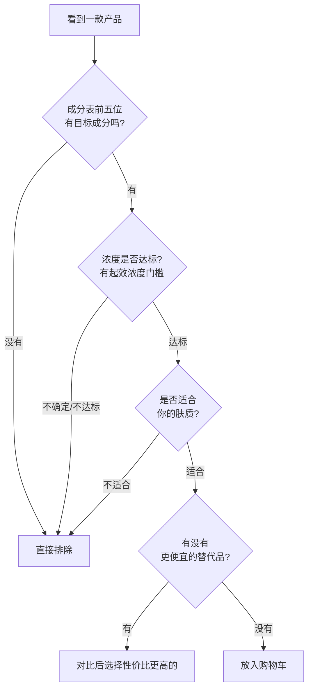
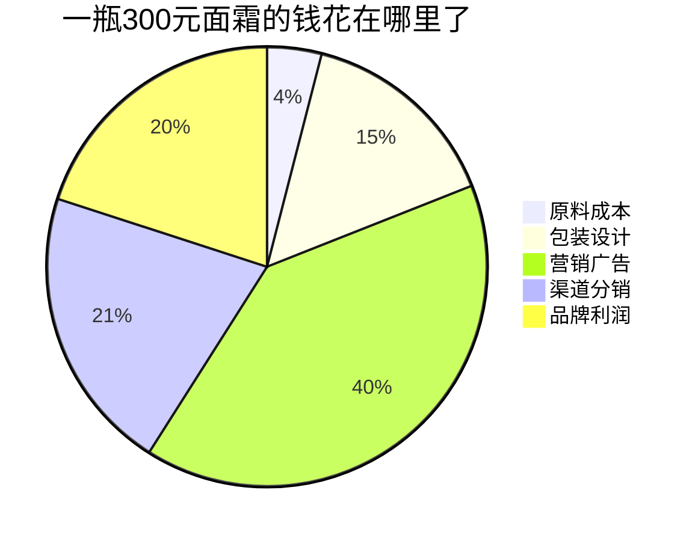
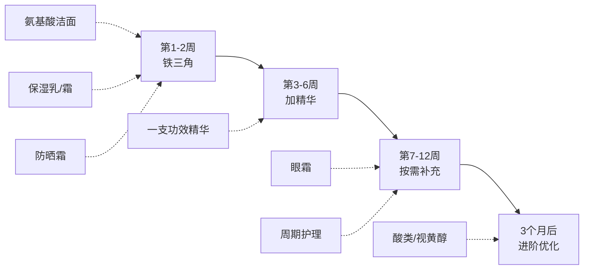
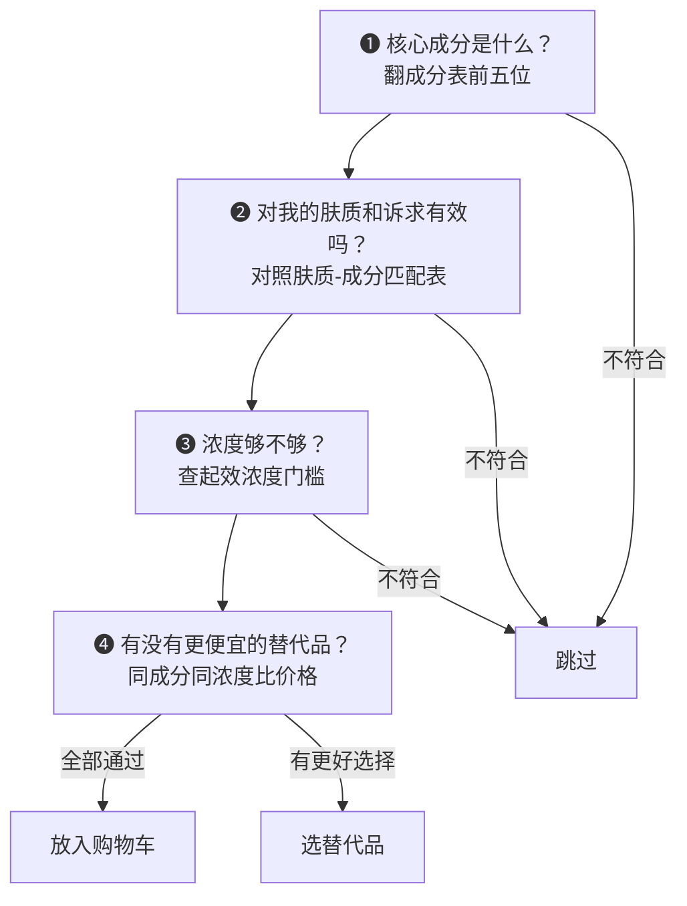

## 一、产品推荐的原则

在打开任何购物App之前，先花15分钟彻底理解以下原则。这些原则能帮你省下几千块的"试错税"——大多数人买护肤品踩的坑，本质上都是因为缺乏一套清晰的筛选标准。本节不只是列几条建议，而是帮你建立一套**完整的护肤消费决策系统**，让你面对任何产品都能独立判断，而不是依赖博主推荐或销量排行。

### 为什么需要一套选购原则

护肤品市场是一个典型的信息不对称市场。消费者面对的是：成百上千个品牌、上万种产品、每个品牌都在讲自己的"独家故事"。没有原则的人会陷入两种极端——要么跟风买贵的（"贵的总没错"），要么贪便宜随便买（"反正都差不多"）。两种策略都是盲目的。

**信息不对称的根源**：护肤品行业不需要公开完整的配方细节，成分表只列名称不标浓度，功效宣称的监管标准远低于药品。这意味着消费者天然处于信息劣势——你看到的永远是品牌想让你看到的。

一套好的选购原则应该帮你做到四件事：

1. **过滤噪音**——在5秒内排除80%不适合你的产品
2. **精准匹配**——在剩下的20%中找到真正适合你的那一款
3. **避免陷阱**——识别营销包装下的真实价值
4. **建立直觉**——经过几次实践后，你不需要查表也能快速判断

### 五大核心原则

#### 原则一：成分优先于品牌

一个产品的效果，100%取决于它的成分配方，而非瓶身上的Logo。这不是主观判断，而是皮肤科学的基本事实——皮肤不认识品牌，只认识涂在上面的化学物质。

**举个具体的例子**：烟酰胺（维生素B3）是公认的美白、控油、修复成分。一瓶大牌精华液含5%烟酰胺卖400元，一瓶国产品牌同样含5%烟酰胺卖80元——从成分功效角度看，两者几乎没有本质区别。你多花的320元，买的是品牌溢价、包装设计和营销费用。

**但要注意**，"成分相同"不等于"配方相同"。同样含5%烟酰胺的两款产品，如果一款的基质配方（载体、乳化体系、防腐体系）更好，它的透皮吸收率、稳定性、肤感都可能更优。所以"成分优先"不是说只看单一成分，而是说**先看成分，再看配方，最后才看品牌**。

##### 如何读懂成分表

成分表是护肤产品的"真相说明书"，根据中国《化妆品监督管理条例》，成分表必须按含量从高到低排列（含量≤1%的成分可以不按顺序）。掌握以下规则，你就能看穿大多数营销话术：

| 规则 | 说明 | 实例 |
|------|------|------|
| 排在前五位的成分决定产品本质 | 前五通常是水、甘油、各种油脂/乳化剂 | 如果前五全是基础保湿成分，它就是一瓶保湿产品，不管包装上写了什么 |
| 有效成分排在哪里比"含有"更重要 | 有效成分排在防腐剂（苯氧乙醇、羟苯甲酯等）之后，含量通常＜1% | 一款主打"烟酰胺美白"的精华，烟酰胺排在苯氧乙醇后面，实际含量可能只有0.3% |
| 看INCI名而非商品名 | 商品名"专利成分XX"往往就是普通成分换了个名字 | "Pro-Xylane玻色因"的INCI名是Hydroxypropyl Tetrahydropyrantriol |
| 浓度不写在成分表上 | 成分表不标浓度，需要从品牌宣传或第三方检测推断 | 品牌宣传"含2%水杨酸"，浓度信息来自品牌而非成分表本身 |
| 注意成分的形态差异 | 同一活性物可能以不同盐、酯、前体形式出现，生物利用度差异巨大 | "抗坏血酸葡糖苷"（AA2G）比纯L-抗坏血酸稳定但透皮效率不同；"视黄醇棕榈酸酯"远不如纯视黄醇活性强 |

**实操建议**：下载「美丽修行」或「CosDNA」App，输入产品名即可查看完整成分表及每种成分的功效、风险评级。养成习惯——买任何产品前先查成分表。

##### 关键成分的起效浓度门槛

这是很多人忽略的核心知识点。很多成分必须达到一定浓度才能发挥功效，低于这个浓度等于白涂：

| 成分 | 起效浓度 | 最佳浓度范围 | 常见误区 |
|------|---------|-------------|---------|
| 烟酰胺 | ≥2% | 3%-5% | 浓度越高越好？错，超过5%刺激性大增，收益不增 |
| 水杨酸（去角质） | ≥0.5% | 1%-2% | 日常护理1%足够，2%适合问题肌 |
| 维C（L-抗坏血酸） | ≥5% | 10%-20% | 超过20%不再增效，只增加刺激 |
| 视黄醇（A醇） | ≥0.025% | 0.1%-0.5% | 新手从0.025%起步，0.5%已是强效 |
| 透明质酸 | ≥0.05% | 0.1%-1% | 高分子量保湿在表面，低分子量渗透深 |
| 神经酰胺 | ≥0.5% | 1%-3% | 需要配比胆固醇和脂肪酸才最佳 |
| 果酸（AHA） | ≥4% | 5%-10% | 日常5%-8%，医美级可到30%-70% |
| 壬二酸 | ≥10% | 10%-20% | 对痘印和玫瑰痤疮特别有效 |
| 胜肽 | ≥0.001% | 因种类而异 | 种类比浓度更重要，信号肽vs神经肽不同机制 |
| 泛醇（B5） | ≥1% | 2%-5% | 修复屏障的明星成分，温和到敏感肌可用 |
| 传明酸（氨甲环酸） | ≥2% | 2%-5% | 美白+抗炎双效，对色沉和红痘印均有效 |

##### 被忽视的"非活性"成分同样重要

很多人只关注"活性成分"（烟酰胺、维C、视黄醇等），却忽略了配方中的"配角"——但这些配角往往决定了产品的最终效果：

- **渗透促进剂**：如乙醇、丙二醇、氮酮，帮助活性成分穿透角质层。没有渗透促进剂，活性成分再高浓度也可能"浮在表面"
- **pH调节剂**：维C（L-抗坏血酸）需要pH＜3.5才能有效透皮；水杨酸在pH 3-4之间活性最佳。如果产品的pH不对，活性成分可能形同虚设
- **抗氧化保护剂**：维E、阿魏酸等，保护不稳定的活性成分（如维C）不被提前氧化。修丽可CE精华的经典配方就是维C+维E+阿魏酸的协同体系
- **乳化体系**：决定产品的质地、稳定性和释放速率。同样是5%烟酰胺，水剂配方吸收快但可能拔干，乳液配方吸收慢但保湿好

**实操意义**：不要只看"含有XX成分"，要看整体配方是否为这个活性成分创造了起效条件。一个配方设计精良的中端产品，往往胜过一个只堆活性成分的"原料桶"。

#### 原则二：适合自己的才是最好的

"全网好评"不等于适合你。护肤品的适配性取决于三个核心变量：

- **肤质**：油皮用干皮的厚重面霜，闷痘是必然的
- **当前皮肤状态**：屏障受损时用高浓度酸类，烂脸是必然的
- **所处环境**：南方潮湿地区和北方干燥地区，同一款产品的使用感受天差地别

##### 肤质判断的科学方法

不要靠"感觉"判断肤质，用这个标准化测试：

1. **晚上用温和洁面奶洗脸**，擦干后**不涂任何东西**
2. **等待2小时**，期间不触摸面部
3. **用吸油纸按压T区和两颊**，观察结果：

| T区 | 两颊 | 判断结果 |
|-----|------|---------|
| 出油 | 出油 | 油性皮肤 |
| 出油 | 不油不干 | 混合偏油（最常见） |
| 微油 | 偏干 | 混合偏干 |
| 不油 | 不油不干 | 中性皮肤 |
| 不油 | 紧绷起皮 | 干性皮肤 |

**你的情况**：中性偏微油。这意味着：
- 清洁力中等的氨基酸洁面就够了，皂基洁面会过度清洁
- 质地轻薄的乳液比厚重面霜更适合
- T区可能需要控油，两颊注意保湿平衡
- 护肤品质地选择：春夏选乳液/凝胶，秋冬可选轻薄面霜

##### 进阶：肤质不是固定不变的

很多人把肤质当成一辈子不变的标签，这是一个常见误区。肤质会随着以下因素动态变化：

| 变化因素 | 影响方向 | 举例 |
|---------|---------|------|
| 年龄增长 | 皮脂分泌逐渐减少 | 20岁油皮→30岁混合→40岁偏干 |
| 季节变化 | 温度湿度直接影响皮脂和水分 | 夏天偏油冬天偏干是正常现象 |
| 激素波动 | 雄激素升高→出油增多 | 经期前后、孕期、压力大时皮肤变化 |
| 护肤习惯 | 长期过度清洁→屏障受损→代偿性出油 | 皂基洁面用久了反而更油 |
| 药物影响 | 异维A酸→极度干燥；避孕药→可能改善痘痘 | 服用药物期间肤质可能完全改变 |

**实操建议**：每3个月重新评估一次肤质，尤其是在换季、更换药物、生活状态大变的时候。用同一套测试方法，记录结果变化。

##### 肤质与成分速配表

| 肤质 | 推荐成分 | 避开成分 | 质地偏好 |
|------|---------|---------|---------|
| 油性 | 烟酰胺、水杨酸、锌PCA | 矿油、椰子油、可可脂 | 凝胶、水乳、无油配方 |
| 干性 | 神经酰胺、角鲨烷、透明质酸 | 高浓度酒精、强效表活 | 面霜、油类、封闭性强的乳霜 |
| 混合性 | 烟酰胺、神经酰胺、低浓度酸类 | 极端厚重或极端清爽的产品 | 乳液、分区护理 |
| 中性偏微油 | 氨基酸、烟酰胺、透明质酸 | 皂基、高浓度酒精 | 轻薄乳液、水润质地 |
| 敏感性 | 神经酰胺、泛醇、红没药醇 | 香精、酒精、酸类、精油 | 无香精、极简配方 |

##### 皮肤状态的动态调整

除了基础肤质，你还需要根据**当前皮肤状态**临时调整产品选择：

| 当前状态 | 应该做什么 | 绝对不要做什么 |
|---------|-----------|---------------|
| 屏障受损（泛红、刺痛、脱皮） | 精简护肤：温和洁面+修复乳+防晒，只用3样 | 用酸类、视黄醇、磨砂膏等任何刺激性产品 |
| 爆痘期 | 局部点涂水杨酸/过氧化苯甲酰，整体保湿 | 全脸用高浓度酸、频繁更换产品、用手挤痘 |
| 晒后修复 | 冷敷+含泛醇/积雪草的修复产品 | 立即用美白产品、酸类产品 |
| 换季敏感 | 回归基础护肤，暂停所有功效型产品 | 贪心叠加多种活性成分 |
| 医美术后 | 严格遵医嘱，通常只用医用修复产品 | 自行使用任何非医用产品 |

##### 季节和环境调整

同一款产品在不同季节可能需要调整：

- **春夏（湿热）**：减少油脂含量，增加清爽质地，防晒指数拉满
- **秋冬（干冷）**：增加保湿封闭性，减少酸类频率，加入修复成分
- **空调房/暖气房**：空气湿度低（通常＜30%），需要更强的保湿锁水
- **雾霾/污染环境**：加强抗氧化，做好清洁
- **高海拔/强紫外线地区**：防晒是第一优先级，SPF50+ PA++++是底线
- **长期面对屏幕**：蓝光可能加重色沉，含氧化铁的防晒霜可同时防护蓝光

#### 原则三：贵≠好——理解护肤品的成本结构

护肤品的成本结构大致是：

也就是说，你花300元买的面霜，真正用在"护肤"上的钱可能只有30-45元。

很多经典平价产品的核心成分与高端产品完全相同：

| 平价产品 | 高端产品 | 核心成分 | 价格差 | 效果差 |
|---------|---------|---------|--------|--------|
| CeraVe保湿修复霜（~80元） | La Mer经典面霜（~2500元） | 神经酰胺 | 31倍 | 极小 |
| 珂润保湿乳（~90元） | 资生堂时光琉璃修复乳（~1200元） | 神经酰胺 | 13倍 | 小 |
| 理肤泉B5修复霜（~100元） | 修丽可B5保湿凝胶（~600元） | 泛醇+透明质酸 | 6倍 | 小 |
| 宝拉珍选水杨酸（~150元） | 博乐达水杨酸面膜（~300元） | 水杨酸2% | 2倍 | 接近 |
| The Ordinary 10%烟酰胺（~60元） | OLAY小白瓶（~250元） | 烟酰胺 | 4倍 | 肤感差较大，功效接近 |

**不是说贵的一定不好**，而是价格和效果之间不是线性关系：

- **50-200元**：效果提升最明显，基础成分和配方质量差别大
- **200-400元**：甜蜜区，品质与价格的最佳平衡点
- **400-800元**：边际收益递减，提升主要在肤感、香氛、包装体验
- **800元以上**：你主要在为品牌故事、使用仪式感和心理满足买单

**一个判断标准**：如果两款产品核心成分和浓度相同，配方体系（乳化、防腐、渗透）相近，但价格差3倍以上——大概率是品牌溢价。

##### 聪明花钱：预算分配策略

与其把预算集中在一两件"贵妇单品"上，不如科学分配到整个护肤流程：

| 产品类型 | 建议预算占比 | 原因 |
|---------|------------|------|
| 防晒霜 | ★★★★★（最值得投资） | 每天用、用量大、防晒是抗衰第一步，但好用的平价防晒很多 |
| 精华 | ★★★★★（最值得投资） | 活性成分浓度最高、功效最直接，200-400元区间的精华已经很优秀 |
| 洁面 | ★★☆☆☆（能省则省） | 只在脸上停留30秒-1分钟，冲掉的东西不值得花大钱。50-100元的氨基酸洁面完全够用 |
| 保湿乳/霜 | ★★★☆☆（适度投资） | 100-200元的保湿产品配方已经很成熟，不需要花500+ |
| 眼霜 | ★★★☆☆（看需求） | 眼部皮肤薄且敏感，但如果预算有限，好的面部精华完全可以涂眼周 |
| 面膜 | ★★☆☆☆（能省则省） | 即时效果好但长期性价比低，不如把钱花在日常精华上 |

#### 原则四：循序渐进，不要一步到位

新手最容易犯的错误就是一口气买齐"全套护肤品"。结果要么用不过期浪费，要么各种成分冲突导致皮肤问题。

##### 正确的购买路线图

**第一步（第1-2周）：护肤"铁三角"**——洁面+保湿+防晒，做好这三步已经超越80%的人。选产品标准：温和、简单、无香精。先用2周确认没有过敏反应。

**第二步（第3-6周）：加入一支精华**——根据你最想改善的问题选择：
- 想控油/缩毛孔 → 烟酰胺精华
- 想美白/淡斑 → 维C精华或烟酰胺
- 想抗氧化 → 维C或虾青素
- 想修复屏障 → 神经酰胺或泛醇精华

**第三步（第7-12周）：按需补充**——眼霜、面膜、周期护理（酸类去角质，一周1-2次）。

**第四步（3个月后）：进阶优化**——引入视黄醇、高浓度酸类等活性成分。

##### 新产品引入的"2周法则"

每引入一个新产品，给皮肤至少两周的适应期。正确做法：

1. **先在耳后或手腕内侧涂少量**，观察24小时无异常
2. **前3天只在半边脸使用**，对比两侧反应
3. **第4天起全脸使用**，但不要同期引入其他新产品
4. **第14天评估**：如果出现泛红、刺痛、闷痘，立刻停用排查

**常见"正常反应"vs"警告信号"**：

| 正常反应（继续观察） | 警告信号（立即停用） |
|--------------------|--------------------|
| 轻微刺痛，1-2分钟内消失 | 持续刺痛超过5分钟 |
| 微微发热，半小时内消退 | 明显泛红，持续数小时不退 |
| 初期微微爆痘（排毒期，1-2周内消退） | 大面积闭口或脓包，持续恶化 |
| 轻微脱皮（尤其酸类产品） | 严重脱皮伴灼烧感 |

##### 成分冲突：不要乱叠加

不是所有好成分都能一起用。以下是最常见的成分冲突：

| 组合 | 为什么冲突 | 正确做法 |
|------|-----------|---------|
| 维C + 烟酰胺 | 酸性环境下烟酰胺可能水解为烟酸，导致面部潮红（实际影响比传言小，但敏感肌最好避开） | 早晚分开用：早上维C，晚上烟酰胺 |
| 维C + 酸类（AHA/BHA） | 双重酸性刺激，pH过低导致屏障受损 | 不要在同一护肤步骤中叠加，分早晚或分天使用 |
| 视黄醇 + 酸类 | 两者都加速角质代谢，叠加使用极易烂脸 | 交替使用：一三五视黄醇，二四六酸类 |
| 视黄醇 + 维C（L-抗坏血酸） | pH需求不同（维C需酸性，视黄醇需中性偏弱酸），且都可能刺激 | 早上维C抗氧化，晚上视黄醇修复，不要同一步骤叠加 |
| 水杨酸 + 高浓度果酸 | 两种酸同时去角质，屏障崩溃风险极高 | 选一种就够了，不需要"酸上加酸" |

**安全搭配示例**：
- 早上：维C精华 → 保湿乳 → 防晒霜
- 晚上：洁面 → 烟酰胺精华 → 视黄醇（低浓度，建立耐受后） → 保湿霜
- 周护理：单独用一次水杨酸或果酸（替换当晚的视黄醇）

#### 原则五：学会看穿营销话术

护肤品行业的营销话术层出不穷。掌握以下"翻译对照表"，你就能看穿90%的营销包装：

| 营销说法 | 真相 | 理性应对 |
|---------|------|---------|
| "含有XX种珍贵成分" | 成分多≠有效，关键看核心成分的浓度和配方。100种0.001%的成分不如1种5%的有效成分 | 看成分表排位，不看种类数量 |
| "XX同款/明星推荐" | 推广费到位谁都能推荐，跟产品效果无关。明星皮肤好是因为有钱做医美+专业护肤团队 | 看成分表和第三方检测报告 |
| "医美级/院线级" | 没有行业标准定义，纯营销概念。真正的医美用药和设备有严格的医疗器械监管 | 忽略这个标签，看实际成分 |
| "天然/纯植物" | 天然不等于安全（毒蘑菇也是天然的），化学合成不等于有害。很多天然成分反而容易致敏（精油、植物提取物） | 关注成分本身的安全性数据 |
| "7天见效" | 皮肤代谢周期约28天，7天见效多半是假象或刺激。美白、抗皱类产品至少需要1-2个代谢周期才能看到真实效果 | 对"速效"承诺保持警惕 |
| "专利成分/独家技术" | 专利只意味着配方独特，不代表效果更好。很多专利成分的临床数据有限 | 查看是否有公开发表的临床研究 |
| "皮肤科医生推荐" | 很多是付费代言，并非真正的临床推荐。真正的皮肤科推荐是基于循证医学的 | 查看是否有peer-reviewed研究 |
| "无添加/零防腐" | 要么保质期极短（需要冷链），要么用了替代防腐手段（如多元醇体系，本身也有防腐功能），要么干脆偷偷添加 | 关注整体配方的安全性 |
| "XX实验室/XX研究所" | 大品牌都有自己的实验室，这不等于产品经过了严格的临床验证 | 关注是否有独立第三方的双盲临床试验 |
| "秒杀大牌/平替天花板" | 可能核心成分相似，但配方工艺、稳定性、肤感可能差距明显 | 买来试试，但不要期望100%等效 |
| "排毒/排激素" | 皮肤没有"排毒"功能，所谓的排毒反应很可能是产品导致的接触性皮炎 | 出现不良反应立刻停用，不要相信"排毒期" |

##### 一个关键概念：成分浓度的"边际收益递减"

很多成分存在一个浓度-效果曲线：低于起效浓度无效，达到最佳浓度后继续增加浓度，效果提升越来越小，而刺激性可能大幅增加。这就像喝水——你渴了喝第一杯水最解渴，喝到第五杯就开始难受了。

比如烟酰胺：
- 2%：开始有美白控油效果
- 5%：效果显著，大多数人耐受良好
- 10%：效果比5%提升有限，但刺激性明显增加
- 20%：几乎没有额外效果，但刺激性是5%的数倍

所以"高浓度"不等于"更好"，找到适合自己皮肤的"甜点浓度"才是关键。

##### 如何验证产品宣称的功效

面对任何功效宣称，你可以通过以下方式交叉验证：

1. **查看成分表**：宣称"美白"的产品是否真的含有美白活性成分？浓度是否在起效范围内？
2. **搜索临床文献**：在PubMed或Google Scholar搜索"[成分名] + [功效]"，看是否有同行评审的研究支持
3. **查看第三方检测**：国家药监局备案信息（[NMPA官网](http://www.nmpa.gov.cn/)）、SGS/Intertek等第三方检测报告
4. **参考成分分析平台**：美丽修行、CosDNA等平台的功效评级（注意：这些平台的数据也并非100%准确，作为参考而非定论）
5. **关注真实用户长期反馈**：1-2周的使用报告参考价值低，至少1-2个月的长期反馈才有意义

### 一个实用的决策框架

面对任何一款产品，问自己这四个问题：

能过这四关的产品，才值得放进购物车。

### 价格区间参考

以下推荐中会使用统一的价格标识：

- 💰 **入门级（50-150元）**：学生党、试水阶段的首选，性价比之王
- 💰💰 **中端（150-400元）**：品质与价格的甜蜜点，大多数人最适合的区间
- 💰💰💰 **中高端（400-800元）**：有一定护肤经验后的升级选择
- 💰💰💰💰 **高端（800元以上）**：追求极致体验或特定需求时考虑

### 产品的储存与保质期

买对了产品，还要存对。错误的储存方式会让好产品变废品：

| 储存要点 | 说明 |
|---------|------|
| 避光保存 | 维C、视黄醇等光敏成分遇光会氧化失效。深色瓶装≠可以暴晒 |
| 阴凉干燥 | 卫生间潮湿高温是最差的存放地点。卧室梳妆台优于浴室 |
| 注意开封后保质期 | 成分表下方的"PAO"标志（开盖小罐图标）标注开封后可用月数。通常为6M、12M、24M |
| 维C类产品特别注意 | 开封后变黄/棕色=氧化失效，应丢弃。未开封冷藏可延长保质期 |
| 防晒霜 | 开封后通常6-12个月内用完，过期防晒霜的SPF值大幅下降 |
| 泵头/压泵包装优于广口瓶 | 广口瓶每次用手指取用，反复接触空气和细菌，活性成分氧化更快 |

**常见成分的"变质信号"**：

- **维C精华变深黄/棕色**：已氧化，丢弃
- **乳液/面霜分层**：乳化体系破坏，丢弃
- **有异味或酸败味**：防腐体系失效，丢弃
- **质地明显改变（变稀或变稠）**：可能变质，谨慎使用
- **防晒霜出现水油分离**：配方破坏，防晒效果不可靠，丢弃

### 如何评估网上的产品评价

不是所有评价都值得参考。学会筛选信息源：

| 信息源 | 可信度 | 说明 |
|-------|-------|------|
| 品牌官方宣传 | ★☆☆☆☆ | 广告，永远只展示最好的一面 |
| 短视频博主推荐 | ★★☆☆☆ | 大概率是广告，尤其"自用好物分享" |
| 电商平台评价 | ★★★☆☆ | 可参考差评（看具体描述），好评可能刷单 |
| 美丽修行/CosDNA成分分析 | ★★★★☆ | 成分数据客观，但不代表实际使用效果 |
| 皮肤科医生/药师推荐 | ★★★★★ | 基于循证医学，但注意区分真医生和假医生 |
| PubMed等学术文献 | ★★★★★ | 最权威，但需要一定专业知识解读 |

**一个实用技巧**：在电商平台看评价时，重点看**带图的中评**（3星评价），这些往往是真实用户的真实感受——既有优点也有缺点，比满屏五星好评更接近真相。

**辨别刷评的几个信号**：
- 大量评价的措辞高度雷同（模板化好评）
- 好评集中在上架后1-2周内（刷评冲量期）
- 评价账号的历史记录几乎都是5星好评（水军账号）
- "效果很好""推荐购买"等空洞好评泛滥，缺少具体使用感受

### 本节总结

买护肤品不是"越贵越好"，也不是"跟风就对"。建立一套完整的选购决策系统，比记住一百个品牌名字有用得多：

1. **成分思维**——先看成分表，再看品牌
2. **自我认知**——了解自己的肤质、诉求和环境
3. **理性消费**——不为品牌溢价买单，把钱花在成分上
4. **循序渐进**——从铁三角开始，逐步构建护肤流程
5. **独立判断**——看穿营销话术，不被情绪化宣传左右

接下来的具体产品推荐，都会基于以上原则展开，帮你做出理性、高效的选择。
