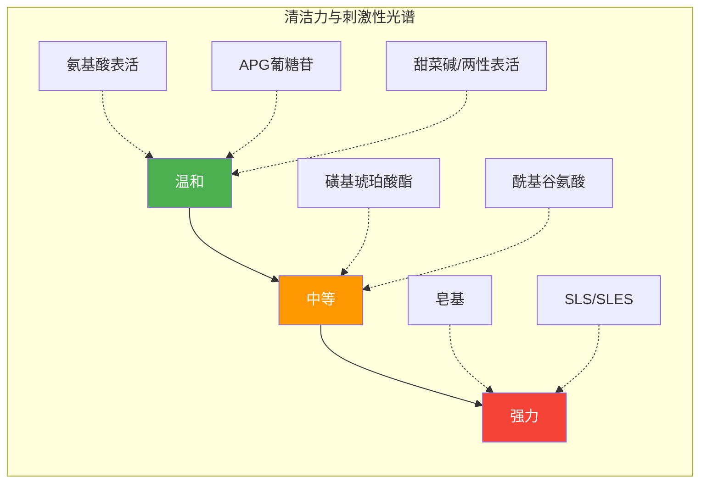
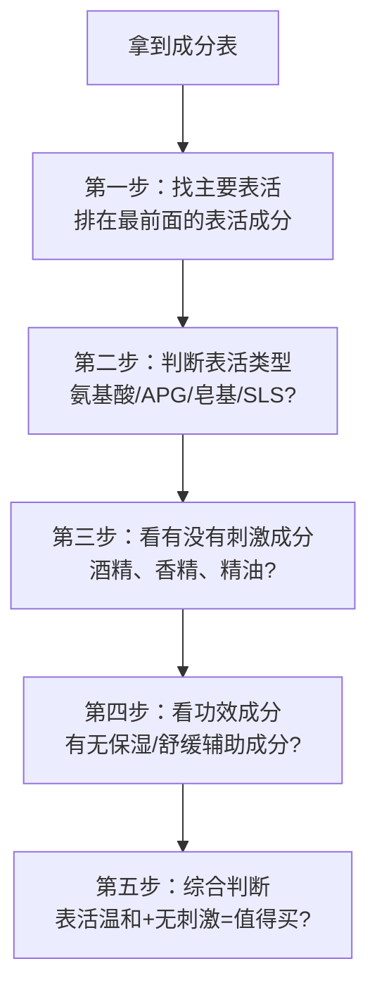
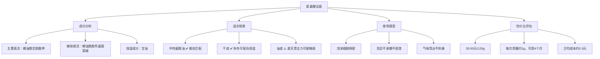
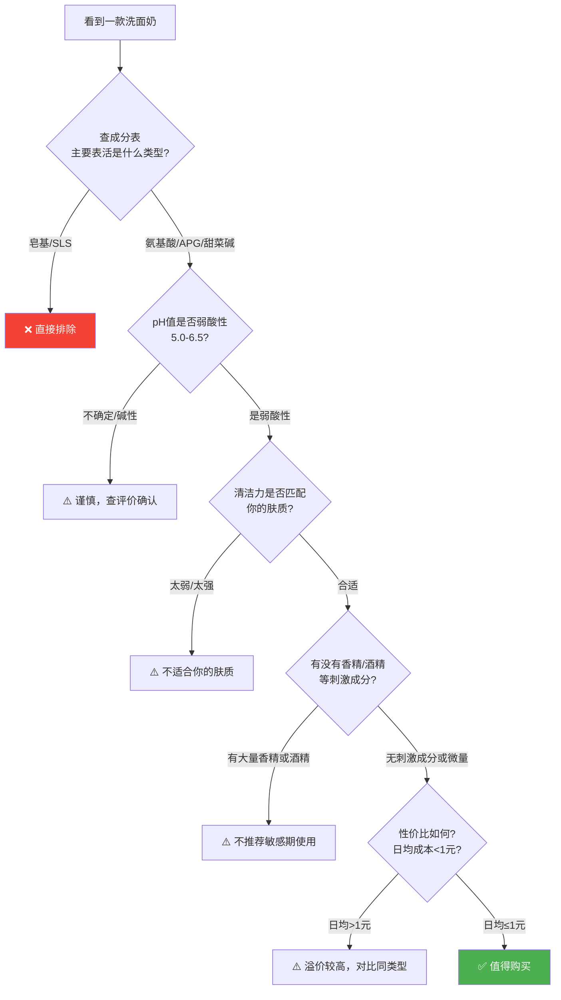
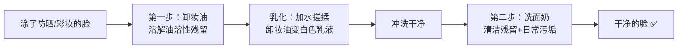
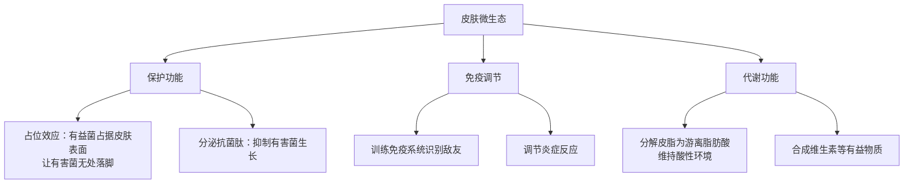
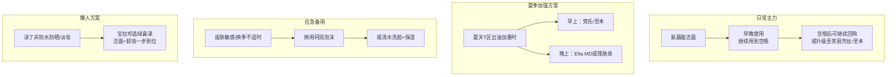

## 二、洗面奶推荐

洗面奶是整个护肤流程的**第一步**，也是每天早晚都要用的基础产品。这一步做对了，后续的精华、乳液、防晒才能真正发挥作用；做错了——清洁过度破坏屏障、清洁不足堵塞毛孔——后面用再贵的产品都是白搭。

但"洗脸"这件看似简单的事，背后的学问远比大多数人想象的深。市面上洗面奶从9.9元到几百元不等，配方差异巨大，营销话术满天飞。本节将从洁面产品的底层原理出发，帮你建立一套**独立判断能力**——不依赖任何博主推荐，自己拿到一款洗面奶就能判断好坏，然后结合你的**中性偏微油肤质**，给出具体的产品推荐和使用方法。

### 2.1 洁面产品的核心原理

#### 2.1.1 洗面奶到底在洗什么

面部皮肤每天会产生以下"污垢"，理解它们的性质是选对洁面产品的前提：

| 类型 | 来源 | 性质 | 清洗难度 |
|------|------|------|---------|
| 皮脂 | 皮脂腺分泌 | 油溶性 | 普通水洗不掉，需要表活乳化 |
| 汗液 | 汗腺分泌 | 水溶性 | 清水可冲走 |
| 老废角质 | 角质层代谢 | 固态，附着在皮肤表面 | 需要适度清洁带走 |
| 空气污染物 | PM2.5、灰尘、重金属颗粒 | 混合型，部分嵌入毛孔 | 需要清洁力 |
| 化妆品残留 | 防晒霜、彩妆 | 油溶性/防水型 | 需要专门卸妆或强力洁面 |
| 微生物代谢物 | 皮肤表面菌群代谢 | 水溶性/混合型 | 正常洁面即可清除 |
| 氧化皮脂 | 皮脂接触空气后氧化 | 油溶性，已变性 | 需要表活乳化，比新鲜皮脂更难清洁 |

**关键认知：** 并非所有"脏东西"都需要强力清洁。汗液和微生物代谢物用水就能冲掉；真正需要洗面奶帮忙的是皮脂、氧化皮脂和化妆品残留。清洁的目标不是"把脸洗到完全无油"，而是**清除多余油脂和外来污染物，同时保留必要的皮脂膜和角质层**。

这里有一个容易被忽视的概念——**氧化皮脂**。新鲜分泌的皮脂是透明的液态油脂，但接触空气后会发生氧化反应，颜色变深、质地变粘稠，更容易堵塞毛孔并引发炎症。这就是为什么T区（额头、鼻子）比脸颊更容易长黑头和粉刺——T区皮脂腺密度高、分泌旺盛，氧化皮脂积累更快。理解这一点，你就能明白为什么洁面时T区需要比脸颊多花几秒钟按摩。

#### 2.1.2 表面活性剂的分类与对比

这是选购洗面奶时**最核心的知识点**，没有之一。不同类型的表活，清洁力和刺激性差异巨大。掌握这个分类体系，你就能看穿90%的营销话术。

**表活的工作原理：** 表活分子是"两亲性分子"——一端亲水（水溶性头部），一端亲油（油溶性尾巴）。当表活分子遇到皮肤上的油脂时，亲油端插入油脂中，亲水端朝向水相，多个表活分子把油脂包裹成一个"胶束"（micelle），胶束外层亲水，就能被水冲走了。这个过程叫**乳化**。

**详细对比表：**

| 表活类型 | 代表成分（INCI名） | 清洁力 | 刺激性 | pH范围 | 适合肤质 | 典型产品 |
|---------|------------------|-------|-------|-------|---------|---------|
| 氨基酸系 | Sodium Cocoyl Glutamate, Sodium Lauroyl Glutamate, Potassium Cocoyl Glycinate | 中等 | 低 | 弱酸性 5.5-6.5 | 所有肤质，敏感肌首选 | 氨基酸洁面、芙丽芳丝洗面霜 |
| APG葡糖苷 | Decyl Glucoside, Lauryl Glucoside | 中等偏强 | 低 | 弱酸性 | 所有肤质，油皮友好 | 宝拉珍选绿鼻涕 |
| 甜菜碱/两性 | Cocamidopropyl Betaine | 弱-中 | 极低 | 弱酸性 | 敏感肌、干皮 | 常作为复配成分使用 |
| 磺基琥珀酸酯 | Disodium Laureth Sulfosuccinate | 中等 | 低-中 | 弱酸性 | 所有肤质 | 部分温和型洁面的辅助表活 |
| 酰基谷氨酸 | Sodium Cocoyl Glutamate | 中等 | 低 | 弱酸性 | 所有肤质 | 芙丽芳丝、Fancl洁面粉 |
| 皂基 | Sodium Palmitate, Potassium Stearate, Triethanolamine + 脂肪酸 | 强 | 高 | 碱性 9-10 | 不推荐日常使用 | 资生堂洗颜专科、丝塔芙经典洁面 |
| SLS/SLES | Sodium Lauryl Sulfate, Sodium Laureth Sulfate | 强 | 高（SLS）/中（SLES） | 碱性 | 不推荐面部使用 | 部分平价洗发水、沐浴露 |

**关于"复配"的说明：** 市面上大多数洗面奶不是只用一种表活，而是多种表活复配。复配的目的是平衡清洁力和温和度。比如"氨基酸+甜菜碱"复配，氨基酸负责清洁，甜菜碱负责降低刺激性并增泡。判断一款复配洁面的刺激性，看**排在成分表最前面的表活**——它占比最大，决定产品的整体特性。

**关键结论：** 对于中性偏微油肤质，**氨基酸系**是首选，清洁力足够但不破坏屏障。APG类或氨基酸+APG复配也是优秀选择。**避开皂基和SLS**。

#### 2.1.3 pH值为什么重要

健康皮肤表面呈弱酸性（pH 4.5-6.5，平均约5.5），这层酸性环境被称为**"酸膜"**（acid mantle），它能：

1. **抑制有害菌生长**——大多数致病菌（如金黄色葡萄球菌、痤疮丙酸杆菌的过度繁殖株）在碱性环境下繁殖更快，而有益菌（如表皮葡萄球菌）更适应弱酸性环境。酸膜就像一道"微生物屏障"，维持皮肤表面菌群的平衡。
2. **维持酶活性**——参与角质代谢的酶（如丝氨酸蛋白酶）在弱酸性环境下才能正常工作。这些酶负责将老废角质从角质层"松绑"，让它们自然脱落。碱性环境会激活另一种酶——丝氨酸蛋白酶的活性在pH 8时比pH 5.5高出约10倍，导致角质被过度分解，屏障变薄。
3. **保护屏障功能**——碱性环境会破坏角质层的脂质结构，特别是神经酰胺和胆固醇这些"砖墙结构"中的"灰浆"成分。研究表明，皮肤接触pH 10的溶液30分钟后，经皮水分流失（TEWL）增加约20%。

皂基洗面奶的pH通常在9-10之间，使用后皮肤pH需要**4-6小时**才能恢复到正常水平。每天早晚各用一次，等于你的皮肤一整天都处于"碱性→恢复→碱性→恢复"的恶性循环中，屏障受损只是时间问题。

氨基酸表活的pH通常在5.5-6.5之间，与皮肤天然pH接近，不会造成这种"过山车效应"。

**实操建议：** 如果你对某款洗面奶的pH有疑虑，可以买pH试纸（几块钱一包）自己测。方法很简单：挤一点洗面奶加少量纯净水稀释，用试纸测pH。弱酸性（5.0-6.5）为合格，碱性（>7.5）为不推荐。

#### 2.1.4 洗面奶的质地类型

不同质地的洗面奶在使用体验和适用场景上有明显差异，选择适合自己的质地能让洁面过程更舒适、更高效：

| 质地 | 特点 | 适合肤质 | 使用感受 | 适用场景 |
|------|------|---------|---------|---------|
| 膏体/乳霜 | 需手动起泡，清洁力可控 | 所有肤质 | 泡沫多少自己控制，用量省 | 日常主力洁面 |
| 啫喱/凝胶 | 透明质地，清爽不油腻 | 油性、混合性 | 洗后清爽，不紧绷 | 夏季、油皮日常 |
| 泡沫型（按压出泡） | 直接按压出泡沫，方便省事 | 懒人、敏感肌 | 泡沫细腻，减少摩擦 | 早上快速洁面、敏感期 |
| 洁面乳液 | 质地柔和，清洁力较弱 | 干性、敏感性 | 洗后滋润不紧绷 | 冬季、干皮、晨洁 |
| 洁面油/卸妆油 | 以油溶油，清洁力最强 | 卸妆专用 | 需要二次清洁或乳化彻底 | 卸妆、双重清洁第一步 |
| 洁面慕斯 | 自动起泡，泡沫绵密 | 所有肤质 | 使用体验好，消耗较快 | 追求使用感、旅行便携 |
| 洁面粉 | 粉状，加水起泡，保存性好 | 所有肤质 | 需要加水搓泡，清洁力可控 | 旅行、活性成分保存 |

**质地选择的核心逻辑：** 质地本身不决定温和度，真正决定温和度的是表活类型。但质地影响使用体验——如果你讨厌手动搓泡，就选泡沫型或慕斯；如果你喜欢控制清洁力度，就选膏体。不要因为"啫喱听起来比膏体温和"就做选择，这是营销制造的错觉。

### 2.2 如何看懂洗面奶成分表

这是你建立独立判断能力的关键技能。学会看成分表，你就不需要再依赖任何人的推荐——自己就能判断一款洗面奶的好坏。

#### 2.2.1 成分表的基本规则

根据中国《化妆品监督管理条例》和国际通行的INCI命名规范：

1. **成分按浓度从高到低排列**——排在前面的浓度高，排在后面的浓度低
2. **浓度低于1%的成分可以不按顺序排列**——通常以防腐剂为分界线（防腐剂浓度一般在0.1%-1%之间）
3. **成分名称使用INCI名**（国际化妆品成分命名法）——如果你看到英文名，可以对照翻译

#### 2.2.2 5步速读法

拿到一款洗面奶的成分表，按以下5步快速判断：

**第一步：找主要表活。** 在成分表中找到排在最前面的表活成分（通常是水和甘油之后的第一个表活）。常见的表活成分名称对照：

| INCI名 | 中文名 | 类型 | 评价 |
|--------|--------|------|------|
| Sodium Cocoyl Glutamate | 椰油酰谷氨酸钠 | 氨基酸 | ✅ 推荐 |
| Potassium Cocoyl Glycinate | 椰油酰甘氨酸钾 | 氨基酸 | ✅ 推荐 |
| Sodium Lauroyl Glutamate | 月桂酰谷氨酸钠 | 氨基酸 | ✅ 推荐 |
| Decyl Glucoside | 癸基葡糖苷 | APG | ✅ 推荐 |
| Lauryl Glucoside | 月桂基葡糖苷 | APG | ✅ 推荐 |
| Cocamidopropyl Betaine | 椰油酰胺丙基甜菜碱 | 两性 | ✅ 推荐（通常复配用） |
| Sodium Laureth Sulfate | 月桂醇聚醚硫酸酯钠 | SLES | ⚠️ 不推荐面部 |
| Sodium Lauryl Sulfate | 月桂醇硫酸酯钠 | SLS | ❌ 避开 |
| Potassium/Stearic Acid + NaOH/KOH | 脂肪酸+碱 | 皂基 | ❌ 避开 |

**第二步：判断复配策略。** 如果成分表里有2-3种表活复配，注意它们的排列顺序。排在第一位的是主要表活，决定产品整体特性。例如"水、椰油酰甘氨酸钾、椰油酰胺丙基甜菜碱、癸基葡糖苷"——氨基酸为主，甜菜碱和APG为辅，这是优秀的复配方案。

**第三步：警惕刺激成分。** 以下成分在洗面奶中属于减分项：

| 成分 | 为什么有问题 | 常见伪装名 |
|------|------------|-----------|
| 酒精（Alcohol/Alcohol Denat.） | 加速皮脂蒸发，破坏屏障 | 变性乙醇、SD Alcohol |
| 薄荷醇（Menthol） | 刺激皮肤，引发炎症反应 | 薄荷脑 |
| 桉叶油（Eucalyptus） | 精油类刺激物 | 蓝桉叶油 |
| 大量香精 | 潜在致敏源 | Parfum/Fragrance |
| 水杨酸（Salicylic Acid） | 不是不好，但洗面奶中浓度低且停留时间短，效果有限 | BHA |

**第四步：加分项。** 以下成分在洗面奶中属于锦上添花（虽然效果有限，但至少不减分）：

| 成分 | 作用 | 评价 |
|------|------|------|
| 甘油（Glycerin） | 保湿，减少洗后紧绷感 | 基础保湿，几乎所有洁面都有 |
| 神经酰胺（Ceramide） | 修复屏障 | 有比没有好，但洗面奶中效果有限 |
| 积雪草提取物（Centella Asiatica） | 舒缓抗炎 | 同上 |
| 尿囊素（Allantoin） | 舒缓、促进修复 | 温和成分，加分项 |

#### 2.2.3 实战案例：解读氨基酸洁面成分表

以你正在使用的氨基酸洁面为例，完整成分表解析：

水、甘油、椰油酰甘氨酸钾、椰油酰胺丙基甜菜碱、月桂酰谷氨酸钠、
氯化钠、柠檬酸、苯氧乙醇、EDTA二钠、（其他微量成分）

- **椰油酰甘氨酸钾**（排第3位，在水和甘油之后）：主要表活，氨基酸系，温和清洁。✅
- **椰油酰胺丙基甜菜碱**（排第4位）：辅助表活，两性表活，增泡增稠，降低刺激性。✅
- **月桂酰谷氨酸钠**（排第5位）：第二氨基酸表活，增强清洁力。✅
- **氯化钠**：增稠剂，让产品质地更浓稠。正常。✅
- **柠檬酸**：pH调节剂，确保产品呈弱酸性。✅
- **苯氧乙醇**：防腐剂，安全浓度范围内使用。✅
- **EDTA二钠**：螯合剂，稳定配方。✅

**结论：** 纯氨基酸复配体系，无刺激成分，配方简洁干净。这就是为什么旁氏被称为"性价比之王"——便宜但配方扎实。

### 2.3 你正在使用：氨基酸洁面

| 项目 | 详情 |
|------|------|
| 价格 | 💰 约30-50元/120g |
| 主要表活 | 椰油酰甘氨酸钾（氨基酸系） |
| 辅助表活 | 椰油酰胺丙基甜菜碱（两性表活，增泡增稠） |
| pH值 | 约5.5-6.0（弱酸性） |
| 适合肤质 | 所有肤质，中性偏微油为最佳匹配 |
| 优点 | 温和不刺激、清洁力适中、泡沫细腻、性价比极高 |
| 不足 | 无功效性成分（但这不是洗面奶该干的事） |
| 建议 | **继续使用，不需要更换** |

**为什么说旁氏已经够用？** 洗面奶在脸上停留时间通常只有**30-60秒**，这个时间不足以让任何功效成分渗透到皮肤发挥作用。所以洗面奶的核心评价标准只有两个：**①清洁力是否合适 ②是否足够温和**。旁氏在这两点上都做得很好。

很多品牌在洗面奶里添加烟酰胺、透明质酸、植物提取物等成分来卖高价——但从皮肤科学角度看，这些成分在冲洗型产品中几乎不可能起效。你多花的钱买的是"心理安慰"，不是真正的护肤效果。

**旁氏的"隐形优势"：** 配方简洁。成分越少，潜在的致敏源就越少。那些号称"添加XX种珍贵成分"的洗面奶，每多一种成分就多一种潜在的过敏风险。洁面产品追求的应该是"少即是多"——把清洁这件事做好就够了，不要贪心。

### 2.4 升级推荐（按需求分类）

以下推荐基于你"中性偏微油"的肤质，按使用场景分类，而非简单的价格排序。每款产品都标注了核心优势和适用时机。

#### 2.4.1 日常通勤之选：温和清洁，不出错

##### 芙丽芳丝净润洗面霜

| 项目 | 详情 |
|------|------|
| 价格 | 💰💰 约150元/130g |
| 主要表活 | 椰油酰谷氨酸钾（氨基酸系） |
| 核心成分 | 烟酰胺、多种植物提取物 |
| pH值 | 约5.5（弱酸性） |
| 适合肤质 | 所有肤质，敏感肌友好 |
| 泡沫表现 | 泡沫绵密丰富，比旁氏更厚实 |
| 清洁力 | 中等偏强，比旁氏稍强一点 |
| 洗后感 | 不紧绷、不假滑，触感柔嫩 |
| 日均成本 | 约0.4元（每次用量约1g，可用4个月） |

**推荐理由**：被称为氨基酸洗面奶的"标杆产品"，在日本和中国市场都畅销多年。配方成熟稳定，表活纯度高，几乎找不到缺点。如果你想从旁氏"小升级"一下，芙丽芳丝是最稳妥的选择。

**与旁氏的差异**：清洁力比旁氏稍强一点点，泡沫更厚实绵密，洗后肤感更细腻。但差距不大，没有迫切升级的必要——如果旁氏用着舒服，没必要换。

##### 至本舒颜修护洁面乳

| 项目 | 详情 |
|------|------|
| 价格 | 💰 约59元/120g |
| 主要表活 | 椰油酰甘氨酸钾 + 椰油酰谷氨酸二钠（氨基酸复配） |
| 核心成分 | 积雪草提取物、神经酰胺NP |
| pH值 | 约5.5（弱酸性） |
| 适合肤质 | 所有肤质 |
| 泡沫表现 | 泡沫细腻，起泡速度快 |
| 清洁力 | 中等，与旁氏相当 |
| 洗后感 | 柔润不紧绷 |
| 日均成本 | 约0.5元 |

**推荐理由**：国货良心产品，配方成分与芙丽芳丝高度相似，但价格只有芙丽芳丝的三分之一。积雪草提取物有一定的舒缓效果（虽然洗面奶里停留时间短，但聊胜于无）。性价比极高，是"旁氏之外的平替首选"。

**使用建议**：如果你对旁氏感到厌倦想换个口味，至本是最安全的替代选择。两者清洁力和温和度相近，可以随意切换。

#### 2.4.2 油皮加强之选：清洁力稍强，不伤屏障

##### Elta MD氨基酸泡沫洁面

| 项目 | 详情 |
|------|------|
| 价格 | 💰💰 约168元/207ml |
| 主要表活 | 椰油酰羟乙基磺酸钠 + 椰油酰胺丙基甜菜碱 |
| 核心特色成分 | 菠萝蛋白酶（Bromelain，温和酶解角质） |
| pH值 | 约6.0（弱酸性） |
| 适合肤质 | 油性、混合性、中性偏油 |
| 泡沫表现 | 自动起泡设计（按压后泡沫自动膨胀），无需手动搓泡 |
| 清洁力 | 中等偏强，比一般氨基酸洗面奶更有力 |
| 洗后感 | 清爽不紧绷，有轻微"净透感" |
| 日均成本 | 约0.4元（每次用量约1ml，可用7个月） |

**推荐理由**：这是本清单中**最适合你肤质**的产品之一。菠萝蛋白酶是一种天然的蛋白水解酶，能温和溶解老废角质，相当于"洁面+轻度去角质"二合一。对于中性偏微油肤质，T区容易有轻微角质堆积和暗沉，这款洗面奶正好能针对性解决。

**注意事项**：
- 菠萝蛋白酶虽然温和，但极少数人可能过敏——首次使用建议先在耳后测试
- 自动起泡设计意味着泵头出的是已经成型的泡沫，不需要在手心搓泡
- 207ml大容量，每天用一次能用6-7个月，实际日均成本很低

##### 宝拉珍选大地之源洁面凝胶（绿鼻涕）

| 项目 | 详情 |
|------|------|
| 价格 | 💰💰 约198元/200ml |
| 主要表活 | 癸基葡糖苷（APG）+ 椰油酰谷氨酸钠（氨基酸）复配 |
| 核心特色 | APG+氨基酸双重表活体系，清洁力强但温和 |
| pH值 | 约5.5-6.0（弱酸性） |
| 适合肤质 | 所有肤质，油皮/混油皮特别适合 |
| 泡沫表现 | 凝胶质地，泡沫较少但清洁力强 |
| 清洁力 | 强，可卸淡妆和非防水防晒 |
| 洗后感 | 清爽干净，有轻微"毛孔通畅感" |
| 日均成本 | 约0.5元 |

**推荐理由**：宝拉珍选是成分党圈子里的"教科书品牌"，创始人宝拉·培冈本身就是护肤成分研究的权威。这款洁面凝胶的独特之处在于**APG+氨基酸复配**——APG清洁力强于纯氨基酸，但刺激性远低于皂基，两者搭配实现了"清洁力够强+温和度够高"的平衡。

**最大的优势**：可以**直接洗掉非防水型防晒霜和淡妆**，省去单独卸妆的步骤。如果你日常涂防晒但不化浓妆，用这款洁面一步到位就够了。

**"绿鼻涕"绰号的由来**：凝胶呈半透明淡绿色，质地粘稠，挤出来像一团绿色鼻涕——名字虽不雅，但产品确实好用。

**缺点**：泡沫少，习惯了丰富泡沫的人可能觉得"洗不干净"（实际上清洁力很强，只是泡沫少而已）。

#### 2.4.3 敏感修复之选：屏障受损时的救命稻草

##### 珂润润浸保湿洗颜泡沫

| 项目 | 详情 |
|------|------|
| 价格 | 💰💰 约108元/150ml |
| 主要表活 | 月桂酰天冬氨酸钠（氨基酸系）+ 椰油酰胺丙基甜菜碱 |
| 核心成分 | 神经酰胺（类神经酰胺功能成分） |
| pH值 | 约5.5（弱酸性） |
| 适合肤质 | 干性、敏感性、屏障受损期 |
| 泡沫表现 | 按压直接出泡沫，泡沫细腻轻盈 |
| 清洁力 | 弱-中，非常温和 |
| 洗后感 | 柔润，有轻微保湿膜感 |
| 日均成本 | 约0.7元（消耗较快） |

**推荐理由**：珂润是花王旗下专为敏感肌设计的品牌，全线产品都以"神经酰胺修复"为核心理念。这款洁面泡沫的清洁力偏弱，但对于屏障受损期间的皮肤来说，**清洁力弱恰恰是优点**——皮肤屏障受损时，任何多余的清洁都是二次伤害。

**什么时候用**：
- 皮肤泛红、刺痛、脱皮期间（换季敏感、刷酸过度、医美术后）
- 冬天皮肤特别干燥的时候
- 早上洁面（早上不需要强清洁力）

**对你（中性偏微油）的适用建议**：不推荐作为主力洁面使用——清洁力对你来说偏弱，夏天T区可能洗不干净。但可以**备一瓶放在洗手台**，作为以下场景的备用：
- 早上洁面（用清水洗完脸后，用珂润轻轻过一遍）
- 皮肤状态不好、换季敏感期间的临时替换
- 冬天特别干燥的时候配合使用

##### 薇诺娜舒敏保湿洁面乳

| 项目 | 详情 |
|------|------|
| 价格 | 💰💰 约128元/80g |
| 主要表活 | 椰油酰谷氨酸钠（氨基酸系） |
| 核心成分 | 马齿苋提取物、青刺果油 |
| pH值 | 约5.5（弱酸性） |
| 适合肤质 | 敏感肌、玫瑰痤疮、屏障受损 |
| 清洁力 | 弱 |
| 洗后感 | 柔润，有保护膜感 |

**推荐理由**：国产皮肤学级品牌，在国内皮肤科医生中口碑很好。马齿苋提取物有明确的抗炎舒缓作用，青刺果油富含不饱和脂肪酸，辅助修复屏障。适合在中国气候和水质条件下使用（配方针对国内市场优化）。

#### 2.4.4 夏日控油之选：应对高温出油高峰

##### 理肤泉清痘净肤舒缓洁面啫喱

| 项目 | 详情 |
|------|------|
| 价格 | 💰💰 约150元/200ml |
| 主要表活 | 椰油基甜菜碱 + 癸基葡糖苷（APG） |
| 核心成分 | 锌PCA（控油）、甘油（保湿） |
| pH值 | 约5.5（弱酸性） |
| 适合肤质 | 油性、混合性、中性偏油 |
| 泡沫表现 | 啫喱质地，泡沫中等 |
| 清洁力 | 中等偏强 |
| 洗后感 | 清爽不黏腻，无残留感 |
| 日均成本 | 约0.4元 |

**推荐理由**：理肤泉是欧莱雅旗下的皮肤学级护肤品牌，产品配方都经过皮肤科医生审核。锌PCA是一种有效的控油成分，能在清洁的同时抑制皮脂分泌。夏天出油旺盛时，这款洁面比纯氨基酸洁面更有针对性。

**使用建议**：夏天可以和旁氏/芙丽芳丝交替使用——早上用温和氨基酸洁面，晚上用理肤泉这款加强清洁。秋冬出油减少后换回纯氨基酸洁面。

##### 悦木之源均衡泡沫洁面慕斯

| 项目 | 详情 |
|------|------|
| 价格 | 💰💰 约220元/150ml |
| 主要表活 | 椰油酰羟乙基磺酸钠 + 椰油酰胺MEA |
| 核心成分 | 碧萝芷（抗氧化）、薄荷醇（清凉感） |
| pH值 | 约5.5-6.0 |
| 适合肤质 | 油性、混合偏油 |
| 泡沫表现 | 慕斯质地，泡沫极其绵密 |
| 清洁力 | 中等偏强 |
| 洗后感 | 清凉爽快，适合夏天 |
| 日均成本 | 约0.7元 |

**使用建议**：适合夏天早上使用，薄荷醇带来的清凉感能提神醒脑。但薄荷醇对敏感肌有刺激，如果你皮肤状态不稳定时不要用。秋冬季不推荐——清凉感在冷天不太舒适。

### 2.5 选购决策流程图

面对一款洗面奶，按这个流程判断：

### 2.6 双重清洁法：防晒和彩妆的正确洗法

这是很多护肤指南忽略的重要环节。如果你日常涂防晒（你正在用防晒霜），"只用洗面奶洗一次"是否足够，取决于防晒产品的类型和洗面奶的清洁力。

#### 2.6.1 什么是双重清洁

双重清洁（Double Cleansing）源自日本护肤理念，分两步：

1. **第一步：油基清洁**——用卸妆油/卸妆膏/洁面油，以油溶油，溶解防晒霜和彩妆中的油溶性成分
2. **第二步：水基清洁**——用普通洗面奶，洗掉第一步残留的卸妆产品和剩余的水溶性污垢

#### 2.6.2 你是否需要双重清洁

| 情况 | 是否需要双重清洁 | 推荐方案 |
|------|---------------|---------|
| 涂了防水型防晒霜（标注Water Resistant） | ✅ 需要 | 卸妆油/膏 + 氨基酸洗面奶 |
| 涂了非防水型防晒霜 | ⚠️ 看洗面奶清洁力 | 清洁力强的洗面奶（如宝拉绿鼻涕）可以一步搞定；温和型洗面奶建议双重清洁 |
| 只涂了保湿霜/乳液 | ❌ 不需要 | 洗面奶足够 |
| 化了浓妆 | ✅ 需要 | 卸妆膏/油 + 氨基酸洗面奶 |
| 化了淡妆（BB霜/气垫） | ⚠️ 看情况 | 清洁力强的洗面奶可能够，不确定就双重清洁 |

**对你（涂防晒不化妆）的建议：**

- **如果你用的是非防水防晒**（大多数化学防晒、部分物化结合防晒）：宝拉绿鼻涕可以一步搞定，或者用你现在的旁氏洗两遍（第一遍30秒快速过一遍溶解防晒，冲掉后再挤一次正常洗60秒）
- **如果你用的是防水防晒**（标注Very Water Resistant/Super Water Resistant）：建议备一瓶卸妆产品。推荐：

| 卸妆产品 | 价格 | 特点 | 适合 |
|---------|------|------|------|
| DHC深层卸妆油 | 💰💰 约150元/200ml | 橄榄油基底，乳化彻底 | 所有肤质 |
| 逐本清欢卸妆油 | 💰 约69元/150ml | 国货，植物油基底 | 中性/偏干 |
| 芭妮兰卸妆膏 | 💰💰 约120元/100ml | 膏体质地，乳化快 | 所有肤质 |

#### 2.6.3 双重清洁的正确步骤

1. **手和脸保持干燥**——卸妆油必须在干燥状态下使用，遇水会提前乳化，降低清洁效果
2. **取适量卸妆油（约2-3泵）在手心**
3. **在脸上轻柔按摩1-2分钟**——重点T区和涂了防晒的区域，让油脂充分溶解防晒霜
4. **加少量水继续按摩**——你会看到卸妆油变成白色乳液状，这叫"乳化"，是关键步骤
5. **用温水彻底冲洗干净**
6. **进行第二步：正常用洗面奶洗一遍**

**常见错误：**
- 在湿脸上用卸妆油——水会阻碍油脂溶解防晒，清洁效果大打折扣
- 乳化不彻底——没有加水搓到白色乳液状就冲洗，油脂残留会导致闷痘
- 第二步洗面奶用量太大——卸妆油已经做了主要清洁工作，洗面奶只需少量

### 2.7 洗面奶使用方法详解

产品选对了，使用方法不对也会出问题。很多人洗脸的方式就是"挤出来搓搓冲掉"，这其实有好几个细节没做到位。

#### 2.7.1 正确的洁面步骤

| 步骤 | 操作 | 时间 | 注意事项 |
|------|------|------|---------|
| 1. 洗手 | 先用洗手液把手洗干净 | 20秒 | 手上的细菌会转移到脸上 |
| 2. 打湿面部 | 用温水（约32-35℃）打湿全脸 | 5秒 | 水温不要过热或过冷 |
| 3. 起泡 | 挤约1g（黄豆到蚕豆大小）在手心，加少量水搓出泡沫 | 15秒 | 一定要先起泡再上脸，不要把膏体直接涂脸上 |
| 4. 按摩清洁 | 用泡沫轻轻按摩全脸，重点T区 | 30-45秒 | 力度要轻，用指腹而非指甲；不要超过60秒 |
| 5. 冲洗 | 用温水彻底冲洗干净，特别注意发际线、鼻翼两侧 | 15-20秒 | 残留的表活会刺激皮肤，一定要冲干净 |
| 6. 擦干 | 用干净毛巾或一次性洗脸巾轻轻按压吸干水分 | 5秒 | 不要用力擦，按压吸干即可 |

**起泡技巧详解：** 很多人觉得"搓不出泡沫"，其实方法不对：

1. 手掌微湿（不是滴水），挤洗面奶在掌心
2. 用另一只手的食指和中指在掌心画小圈快速搓动，约15-20秒
3. 如果泡沫不够，加2-3滴水继续搓——水少量多次加，不要一次倒很多
4. 理想的泡沫状态：绵密、有弹性、立在手心不塌

**懒人替代方案：** 如果你实在懒得手动搓泡，可以买一个起泡网（几块钱）或起泡瓶。起泡网的原理是增加表面积和摩擦力，让表活更快起泡。把洗面奶挤在湿的起泡网上，揉几下就能出大量泡沫。

#### 2.7.2 常见洁面错误

| 错误做法 | 为什么是错的 | 正确做法 |
|---------|------------|---------|
| 直接把洗面奶涂在脸上搓 | 浓度太高，局部刺激性大；起泡不均匀 | 先在手心充分起泡，再上脸 |
| 用很热的水洗脸 | 高温加速皮脂流失，破坏屏障 | 用温水（32-35℃，手感温热不烫） |
| 洗脸超过1分钟 | 过度清洁，表活长时间接触皮肤增加刺激 | 控制在30-60秒 |
| 一天洗脸3次以上 | 过度清洁，破坏皮脂膜 | 早晚各一次足够，中午出油可用清水 |
| 用毛巾用力擦脸 | 物理摩擦损伤角质层 | 用干净毛巾或洗脸巾按压吸干 |
| 不洗发际线和下巴 | 这些区域容易残留洗面奶，导致闷痘 | 冲洗时特别注意发际线、下巴、耳前 |
| 用冷水洗脸"收缩毛孔" | 冷水不能收缩毛孔，只是暂时让皮肤紧绷 | 温水洁面，之后的爽肤水/精华才有收缩毛孔的成分 |
| 洗完脸不立即护肤 | 洗脸后皮肤水分蒸发最快，30秒内就开始紧绷 | 洗完脸后30秒内开始护肤步骤 |

#### 2.7.3 早晚洁面的区别

| | 早上 | 晚上 |
|---|------|------|
| **清洁目标** | 清除夜间分泌的油脂和代谢物 | 清除一天积累的油脂、灰尘、防晒/彩妆残留 |
| **清洁力度** | 轻柔，甚至可以只用清水 | 需要足够的清洁力 |
| **推荐产品** | 温和氨基酸洁面或珂润泡沫 | 清洁力中等的氨基酸洁面（旁氏/芙丽芳丝/Elta MD） |
| **特殊情况** | 如果前一天晚上用了猛药（酸类/A醇），早上建议清水洗脸 | 如果涂了防水防晒或化了妆，先卸妆再洁面 |

**为什么早上可以只用清水？** 夜间皮肤分泌的皮脂是一层天然的保护膜，对白天的皮肤屏障有保护作用。如果你是中性偏微油肤质，早上起来T区有点油是正常的——用温水冲掉多余的油脂就够了，不需要再用洗面奶"深层清洁"。过度清洁反而会刺激皮脂腺代偿性分泌更多油脂。

**判断早上是否需要洗面奶的标准：** 用手摸一下T区——如果感觉油腻粘手，用温和洗面奶洗一遍；如果只是微微油润，清水就够了。

#### 2.7.4 洗脸巾 vs 毛巾

这是一个值得讨论的实际问题：

| 对比项 | 一次性洗脸巾 | 传统毛巾 |
|--------|------------|---------|
| 卫生程度 | ✅ 一次性使用，无细菌滋生风险 | ⚠️ 潮湿环境下容易滋生细菌 |
| 环保性 | ❌ 产生垃圾 | ✅ 可反复清洗使用 |
| 成本 | 约0.1-0.3元/张 | 一次性购买，长期使用 |
| 肤感 | 柔软，按压吸水 | 取决于毛巾材质 |
| 推荐度 | ✅ 推荐（特别是敏感肌） | ⚠️ 需要勤换（每2-3天更换一次） |

**建议：** 如果你目前用的是普通毛巾，有两个选择：
1. **换一次性洗脸巾**——成本不高，卫生更有保障
2. **勤换毛巾**——每2-3天换一条干净的，用后挂在通风处晾干，不要放在浴室潮湿处

### 2.8 水质对洁面的影响

很少有护肤指南提到这一点，但水质确实会影响洁面效果和皮肤状态。

#### 2.8.1 硬水 vs 软水

| 水质类型 | 矿物质含量 | 对洁面的影响 | 对皮肤的影响 |
|---------|-----------|------------|------------|
| 软水 | <60mg/L钙镁离子 | 泡沫丰富，洗面奶容易起泡 | 洗后皮肤柔滑，无残留感 |
| 中等硬度 | 60-120mg/L | 泡沫正常 | 影响不大 |
| 硬水 | >120mg/L | 泡沫减少，需要更多洗面奶 | 钙镁离子与表活结合形成皂垢，残留在皮肤上可能导致干燥、紧绷 |
| 极硬水 | >180mg/L | 泡沫明显减少 | 长期使用可能加重皮肤干燥和敏感 |

**中国主要城市水质概况：**
- **北方城市**（北京、天津、石家庄等）：水质偏硬，钙镁离子含量高
- **南方城市**（上海、广州、深圳等）：水质相对较软
- **具体数据**：各地自来水公司官网可查水质报告，或买TDS测试笔（约20元）自测

#### 2.8.2 硬水区的洁面解决方案

如果你所在地区水质偏硬：

1. **使用氨基酸表活洗面奶**——氨基酸表活比皂基表活更耐硬水，不容易形成皂垢
2. **洁面后用爽肤水擦拭一遍**——爽肤水可以清除残留的矿物质
3. **安装净水器**——厨房和浴室都装，不仅对皮肤好，对头发也有好处
4. **用纯净水/矿泉水洗脸**——成本太高，只适合敏感期临时使用

### 2.9 皮肤微生态与洁面

近年来皮肤科学领域最大的发现之一，就是**皮肤微生态**（skin microbiome）的重要性。你的皮肤表面生活着约1000种微生物，总数达数万亿，它们构成了一个复杂的生态系统，对皮肤健康至关重要。

#### 2.9.1 皮肤微生物的作用

#### 2.9.2 洁面如何影响微生态

**过度清洁的危害：** 强力洁面产品（皂基、SLS）不仅洗掉了多余油脂，也洗掉了皮肤表面的微生物和它们的"食物"（皮脂）。微生态被破坏后：
- 有害菌趁虚而入，引发痘痘、敏感、炎症
- 皮肤pH失衡，进一步恶化微生态
- 形成"过度清洁→屏障受损→微生态失衡→更需要清洁"的恶性循环

**温和洁面的保护作用：** 氨基酸系洗面奶只清除多余皮脂和外来污染物，保留足够的皮脂和微生物"基底"。微生态维持稳定，皮肤自然健康。

**实操启示：**
- 不要追求"洗到完全没有油脂"的肤感——那种"极度清爽"往往是过度清洁的信号
- "搓盘感"（洗完脸感觉像搓盘子一样干涩）是屏障受损的前兆，出现这种感觉说明你的洗面奶清洁力太强或使用频率太高
- 益生元/后生元洁面产品（含低聚果糖、乳酸杆菌发酵产物等）可以"喂养"有益菌，但效果在洗面奶中有限——留驻型产品（乳液、精华）更适合维持微生态

### 2.10 过度清洁与清洁不足的自检

很多人不知道自己的洁面习惯是否正确。以下是一套自检标准，帮你判断自己是否在"过度清洁"或"清洁不足"的区间。

#### 2.10.1 过度清洁的信号

| 信号 | 表现 | 原因 |
|------|------|------|
| 洗完脸紧绷 | 洗后1-2分钟内感觉皮肤发紧，甚至起皮 | 皮脂膜被过度清除 |
| 越洗越油 | 洗完脸后1-2小时T区就出油，比以前更严重 | 皮脂腺代偿性分泌 |
| 频繁泛红 | 两颊经常泛红，特别是洗完脸后 | 屏障受损，血管扩张 |
| 用护肤品刺痛 | 涂保湿乳液/精华时有刺痛感 | 角质层变薄，神经末梢暴露 |
| 换季敏感加重 | 每到换季皮肤就出问题 | 屏障长期受损，季节变化时问题集中爆发 |
| 痘痘反复 | 痘痘消了又长，总是反复 | 微生态失衡，有害菌反复感染 |

**如果你有以上3个或更多信号，说明你正在过度清洁。** 立即行动：
1. 换用最温和的氨基酸洁面（如珂润泡沫）
2. 减少洁面频率（早上清水，晚上温和洁面）
3. 停用所有去角质产品（磨砂膏、酸类、洁面仪）
4. 加强保湿和屏障修复（神经酰胺、角鲨烷类产品）

#### 2.10.2 清洁不足的信号

| 信号 | 表现 | 原因 |
|------|------|------|
| 黑头粉刺增多 | 鼻子、额头黑头明显，下巴闭口多 | 氧化皮脂和老废角质堵塞毛孔 |
| 肤色暗沉 | 脸色发黄、没有光泽 | 老废角质堆积，光线反射不均匀 |
| 护肤品搓泥 | 涂精华/乳液时出现白色絮状物 | 皮肤表面老废角质与护肤品混合 |
| 防晒不服帖 | 防晒霜涂上去斑驳、浮粉 | 皮肤表面有油脂和角质残留 |
| 后背/下巴反复长痘 | 特别是下巴和下颌线 | 洗脸时没洗到这些区域，或清洁力不够 |

**如果你有以上信号，说明清洁力度不足。** 调整方案：
1. 确认洗面奶的清洁力是否匹配你的肤质（油皮用纯氨基酸可能不够）
2. 检查是否彻底冲洗干净（特别是发际线、下巴、耳前）
3. 如果涂了防晒，确认是否需要双重清洁
4. 适当增加T区的按摩时间

#### 2.10.3 洁面效果评估量表

每周评估一次，打分后跟踪趋势：

| 评估项目 | 1分（差） | 3分（一般） | 5分（好） |
|---------|----------|-----------|----------|
| 洗后肤感 | 紧绷/干燥 | 轻微紧绷 | 柔润不紧绷 |
| 出油情况 | 2小时内出油 | 4-6小时出油 | 8小时以上才出油 |
| 毛孔状态 | 黑头/粉刺明显 | 少量黑头 | 毛孔干净 |
| 肤色均匀度 | 暗沉不均 | 轻微不均 | 均匀有光泽 |
| 敏感程度 | 经常泛红刺痛 | 偶尔不适 | 稳定无不适 |

**总分20-25分：** 洁面方案非常适合你，继续保持。
**总分15-19分：** 基本OK，微调即可（可能是季节变化需要调整产品）。
**总分10-14分：** 需要调整，参考上述过度/不足的信号排查。
**总分<10分：** 洁面方案有严重问题，建议全面调整。

### 2.11 特殊场景的洁面方案

#### 2.11.1 刷酸/用A醇期间

使用水杨酸、果酸、视黄醇等活性成分期间，皮肤屏障可能暂时变薄，需要调整洁面策略：

- **换用最温和的洁面**：珂润泡沫或清水洁面
- **减少洁面时间**：控制在20-30秒
- **不要同时使用磨砂膏或洁面仪**
- **如果出现刺痛、脱皮**：停用所有活性成分，只做"清水洗脸+保湿"，等屏障恢复
- **水杨酸洁面产品例外**：如果你正在用水杨酸洁面（如CeraVe SA洁面），不需要额外再用水杨酸精华，避免叠加

#### 2.11.2 运动后

运动后大量出汗，皮脂分泌旺盛：

- 不要立即用洗面奶——先用清水冲洗汗液
- 等体温降下来后（约10-15分钟），再用温和洁面清洁
- 不要因为"感觉很油"就用强力洁面——运动后的油脂保护着汗液蒸发后的皮肤
- 如果是健身房运动后需要洁面，随身带一瓶旅行装氨基酸洁面就够了

#### 2.11.3 出差/旅行

- 携带旅行装（100ml以内符合登机标准）
- 如果忘带洗面奶，酒店的洗发水可以临时应急（比香皂温和，但不要长期替代）
- 长期出差建议带洁面泡沫——比膏体更方便，不需要起泡
- 洁面粉也是旅行好选择——固体粉末不受液体限制，体积小重量轻

#### 2.11.4 医美术后

如果你做了光电项目（光子嫩肤、激光）、化学焕肤（果酸换肤）或其他医美术后：

- **术后1-3天**：只用清水洗脸，或用医用级洁面产品（如薇诺娜、可复美）
- **术后4-7天**：可以恢复温和氨基酸洁面，但力度要比平时更轻
- **术后1-2周**：恢复正常洁面，但仍避免磨砂、洁面仪等物理去角质
- **核心原则**：医美术后的皮肤处于修复期，任何多余的刺激都会延缓恢复

#### 2.11.5 口罩期间

长期戴口罩会导致口罩覆盖区域（下半脸）的湿度、温度和摩擦力都发生变化：

- 口罩区域更容易出汗和出油，但频繁清洁会加重摩擦损伤
- **建议**：早晚正常洁面，中间如果口罩内感觉不适，用清水轻拍即可，不要用洗面奶反复洗
- 口罩边缘摩擦区域如果发红，可以涂一层薄薄的凡士林或修复霜作为物理缓冲

### 2.12 洗面奶的常见问题解答

#### Q1：洗面奶需要经常换吗？

**不需要。** 如果一款洗面奶用着温和不刺激、清洁力合适，可以一直用下去。皮肤不会对洗面奶"产生耐受性"（这是谣言——耐受性只针对活性成分如酸类、A醇，不针对清洁产品）。

什么时候需要换：
- 肤质发生变化（比如从油皮变成中性偏干）
- 季节变化导致出油量改变
- 产品配方升级或停产
- 想尝试新产品的个人偏好

#### Q2：洗面奶可以美白/祛痘/缩毛孔吗？

**基本不能。** 洗面奶在脸上停留30-60秒，任何功效成分都来不及渗透到需要作用的皮肤层次。品牌宣传的"美白洁面""祛痘洁面"大多是营销概念。

**唯一例外**：含有水杨酸的洁面产品（如CeraVe SA洁面）对痘痘有一定辅助效果——水杨酸在短暂停留时间内可以软化表面角质、疏通毛孔口。但效果远不如驻留型水杨酸精华（如宝拉珍选2%水杨酸精华液）。

**数据支撑：** 一项研究比较了含2%水杨酸的洁面产品与含2%水杨酸的驻留型精华对痤疮的效果。12周后，驻留型精华组痤疮减少约70%，而洁面组只减少约30%。差距明显——洁面产品中的活性成分效果大约只有驻留型产品的一半不到。

#### Q3：皂基洗面奶真的完全不能用吗？

不是完全不能用，但**不适合长期日常使用**。偶尔用一次（比如运动后大量出汗、户外灰尘很大时）没有问题。但把它当日常洁面用，长期碱性环境会：
- 破坏酸膜，增加细菌感染风险
- 溶解细胞间脂质，导致屏障受损
- 使角质层变薄，皮肤变敏感
- 刺激皮脂腺反馈性分泌更多油脂（越洗越油）

**如何识别皂基洗面奶：** 成分表中同时出现"脂肪酸"（如硬脂酸Stearic Acid、棕榈酸Palmitic Acid、月桂酸Lauric Acid）和"碱"（如氢氧化钾Potassium Hydroxide、氢氧化钠Sodium Hydroxide、三乙醇胺Triethanolamine），就是皂基配方。经典的"资生堂洗颜专科"就是典型的皂基洁面。

#### Q4：洗面奶的保质期和储存

| 项目 | 说明 |
|------|------|
| 未开封保质期 | 通常3年（看包装标注） |
| 开封后使用期限 | 通常6-12个月（看PAO标志——一个打开的罐子图标，上面写着"6M""12M"等） |
| 储存位置 | 阴凉干燥处，避免浴室高温潮湿环境 |
| 变质信号 | 质地分层、气味异常、颜色变化 |
| 泵头式产品 | 泵头比管状更卫生，减少细菌污染风险 |

**浴室储存的隐患：** 浴室温度高、湿度大，是化妆品变质的"加速器"。如果你习惯把洗面奶放在浴室淋浴区旁边，建议改放在洗手台下方的柜子里，或者洗完澡后开窗/开排风扇通风。

#### Q5：需要配合洁面仪使用吗？

**大多数人不需要。** 洁面仪（如Luna、科莱丽等）通过物理振动增强清洁效果，但对中性偏微油肤质来说，手动清洁已经足够。

洁面仪的适用场景：
- 毛孔粗大、角质堆积明显（T区特别粗糙）
- 长期化妆，需要更强的清洁力
- 局部使用（只在T区使用，避开两颊）

**不推荐**：
- 敏感肌、屏障受损期间
- 正在刷酸或用A醇
- 每天使用（一周2-3次足够，每天用会过度去角质）

**洁面仪的替代方案：** 如果你觉得手动清洁力度不够，比起买洁面仪，不如：
1. 先确认洗面奶的清洁力是否匹配（可能只是洗面奶太温和）
2. 适当延长按摩时间（从30秒增加到45秒）
3. T区重点按摩（画圈方式，每个区域10秒）
4. 每周1-2次使用含酶类成分的洁面（如Elta MD的菠萝蛋白酶洁面）

#### Q6：早上不洗脸可以吗？

这是一个有争议的话题。答案取决于你的肤质和皮肤状态：

| 肤质 | 早上是否可以不洗脸 | 说明 |
|------|------------------|------|
| 干性/敏感性 | ✅ 可以 | 夜间分泌的皮脂是天然保护膜，保留它 |
| 中性 | ✅ 可以 | 清水冲洗即可 |
| 中性偏油 | ⚠️ 看情况 | T区油就用温和洁面洗一下，不油就清水 |
| 油性 | ❌ 建议洗 | 夜间分泌的油脂过多，不洗会影响后续护肤吸收 |

**对你（中性偏微油）的建议：** 早上用手摸一下T区——如果只是微微油润，清水冲一下就够了；如果感觉油腻粘手，用旁氏快速洗一遍（不需要像晚上那么仔细）。

#### Q7：手工皂/冷制皂比洗面奶好吗？

**不好。** 手工皂无论制作工艺多精细，本质上还是皂基——脂肪酸+碱反应生成的脂肪酸盐。pH值通常在8-10之间，呈碱性。

手工皂营销中常见的说法及其真相：
- "冷制皂保留了甘油"——确实保留了一些甘油，但碱性环境对皮肤的伤害远大于甘油带来的好处
- "天然成分，不含防腐剂"——皂基本身就不容易长菌，不需要防腐剂，这不是什么优势
- "洗完不紧绷"——可能是因为添加了大量油脂来掩盖皂基的干燥感，但这些油脂残留在脸上可能堵塞毛孔

#### Q8：氨基酸洗面奶怎么有"假氨基酸"？

这是一个重要的行业"坑"。有些产品标注"氨基酸洁面"，但实际主要表活并不是氨基酸系。

**辨别方法：**
- **真正的氨基酸洁面**：成分表中排名靠前（前5位）有"XX酰XX氨酸X"格式的成分（如椰油酰甘氨酸钾、月桂酰谷氨酸钠）
- **"假氨基酸"洁面**：成分表中氨基酸成分排名很靠后（10位以后），主要表活其实是皂基或SLS，只是添加了少量氨基酸成分来打营销概念

**记住：** 判断一款洗面奶是什么类型，看的是**主要表活在成分表中的位置**，不是看包装上写了什么字。

### 2.13 你的个性化洁面方案

基于你的肤质（中性偏微油）和当前使用的氨基酸洁面，以下是我为你定制的洁面方案：

**分季节使用建议：**

| 季节 | 早上 | 晚上 | 特殊处理 |
|------|------|------|---------|
| 春季（3-5月） | 旁氏/至本（温和氨基酸） | 旁氏/至本 | 换季敏感期如不适，换珂润 |
| 夏季（6-8月） | 旁氏/至本 | Elta MD/理肤泉（加强清洁） | 出汗后用清水先冲，再正常洁面 |
| 秋季（9-11月） | 旁氏/至本 | 旁氏/芙丽芳丝 | 秋季干燥，减少清洁力度 |
| 冬季（12-2月） | 清水或珂润（轻洁面） | 旁氏/至本 | 早上可以只用清水，减少屏障负担 |

**洁面与后续护肤的衔接：**

**关键时间节点：** 洁面后30秒内开始护肤。刚洗完脸时角质层含水量最高，此时涂抹护肤品吸收效果最好。如果等皮肤完全干燥再涂，水分已经蒸发，吸收效率降低约40%。

### 2.14 产品对比总览

将本节所有推荐产品横向对比，方便你根据需求快速选择：

| 产品 | 价格 | 表活类型 | 清洁力 | 温和度 | 特色 | 推荐场景 |
|------|------|---------|-------|-------|------|---------|
| 氨基酸洁面 | 💰 30-50元 | 氨基酸 | ⭐⭐⭐ | ⭐⭐⭐⭐ | 性价比之王 | 日常万能之选 |
| 芙丽芳丝 | 💰💰 150元 | 氨基酸 | ⭐⭐⭐⭐ | ⭐⭐⭐⭐⭐ | 泡沫绵密，肤感细腻 | 日常升级之选 |
| 至本舒颜 | 💰 59元 | 氨基酸复配 | ⭐⭐⭐ | ⭐⭐⭐⭐ | 国货良心，配方优秀 | 平价替代首选 |
| Elta MD | 💰💰 168元 | 氨基酸+酶 | ⭐⭐⭐⭐ | ⭐⭐⭐⭐ | 菠萝蛋白酶去角质 | 中性偏油、夏天晚间 |
| 宝拉珍选绿鼻涕 | 💰💰 198元 | APG+氨基酸 | ⭐⭐⭐⭐⭐ | ⭐⭐⭐⭐ | 卸妆洁面二合一 | 涂防晒/淡妆时 |
| 珂润泡沫 | 💰💰 108元 | 氨基酸 | ⭐⭐ | ⭐⭐⭐⭐⭐ | 神经酰胺修复 | 敏感期/屏障受损 |
| 薇诺娜洁面乳 | 💰💰 128元 | 氨基酸 | ⭐⭐ | ⭐⭐⭐⭐⭐ | 马齿苋舒缓 | 敏感肌/玫瑰痤疮 |
| 理肤泉清痘 | 💰💰 150元 | APG+甜菜碱 | ⭐⭐⭐⭐ | ⭐⭐⭐⭐ | 锌PCA控油 | 夏天油皮/混合皮 |
| 悦木之源慕斯 | 💰💰 220元 | 复配 | ⭐⭐⭐⭐ | ⭐⭐⭐ | 薄荷醇清凉感 | 夏天早上提神 |

### 2.15 总结

洗面奶是护肤流程中最简单、但最容易犯错的一步。记住以下核心要点：

1. **表活类型决定一切**——氨基酸系/APG类是首选，避开皂基和SLS
2. **pH值比品牌重要**——弱酸性（5.0-6.5）是硬性标准
3. **学会看成分表**——这是你独立判断的基础，5步速读法让你不再被营销话术忽悠
4. **洗面奶不需要功效成分**——停留时间太短，任何功效成分都不起效
5. **你的旁氏已经很好**——不急着换，等用完再说
6. **如果要升级**——中性偏微油首选Elta MD（菠萝蛋白酶去角质）或宝拉绿鼻涕（卸妆洁面二合一）
7. **敏感期备一瓶珂润**——屏障受损时的救命稻草
8. **方法比产品重要**——先起泡再上脸、温水、30-60秒、按压擦干
9. **关注自己的皮肤信号**——紧绷、越洗越油是过度清洁的警报，黑头暗沉是清洁不足的信号
10. **双重清洁不是每天必须**——只在涂了防水防晒或彩妆时才需要

洁面做好了，后面每一步的效果都会更好。这也是为什么护肤流程的"铁三角"里，洁面排在第一位。
