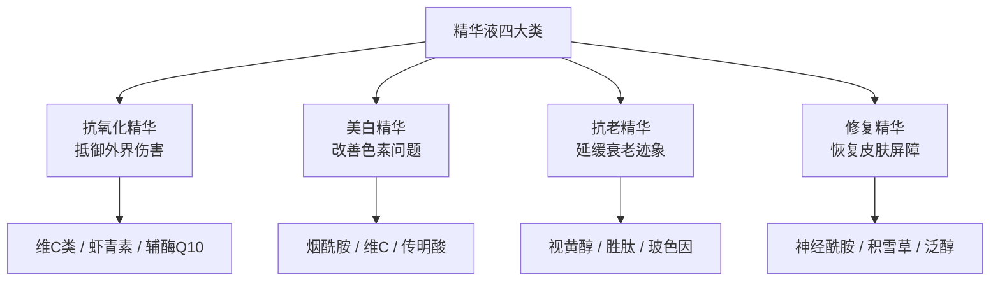
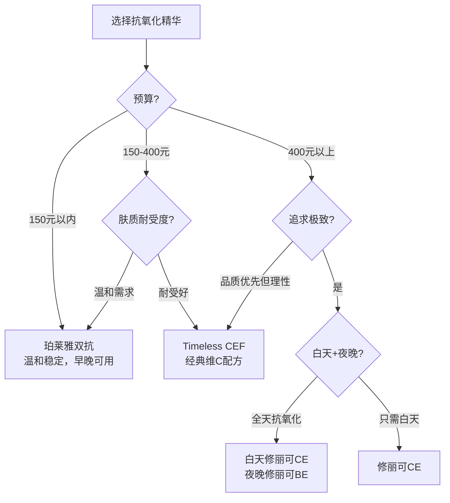
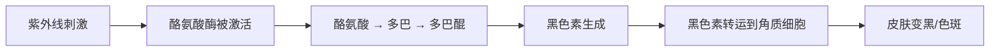
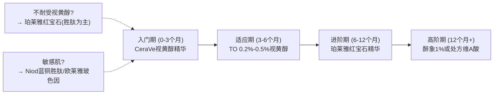
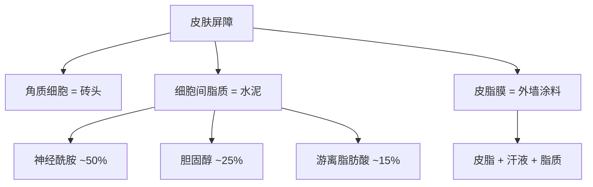
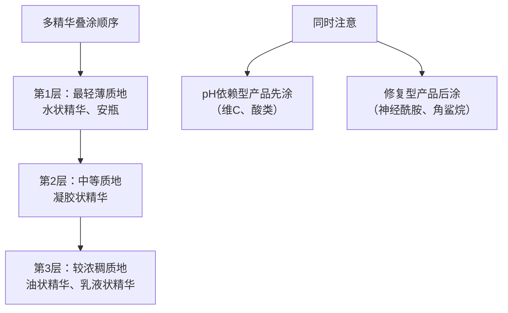
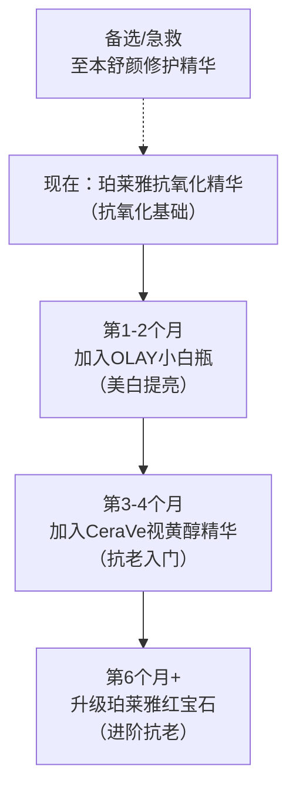

## 三、精华液推荐

精华液是护肤品中活性成分浓度最高、渗透路径最深的产品，也是整个护肤流程中投入产出比最高的品类。如果预算有限只能在一种护肤品上花钱，答案永远是精华液——因为它是唯一能从根本上改变皮肤状态的产品，而非仅仅提供表面的保湿或遮盖。

本章将从透皮吸收机制讲起，覆盖抗氧化、美白、抗老、修复四大核心功效类别，每类提供成分解析、产品评测、搭配策略和进阶路线。无论你是刚入门的新手还是已有多年护肤经验的进阶用户，都能找到适合自己的方案。

### 3.1 精华液的基础认知

#### 什么是精华液，和乳液有什么区别

很多新手分不清精华液和乳液的区别，觉得"都是往脸上抹的东西"。实际上两者的定位完全不同：

| 对比维度 | 精华液 | 乳液/面霜 |
|---------|--------|----------|
| 核心功能 | 高浓度活性成分渗透到皮肤深层，解决特定问题 | 保湿锁水、维护屏障 |
| 质地 | 水状、凝胶状、轻薄油状 | 乳状、霜状，质地更厚重 |
| 活性成分浓度 | 高（通常3%-20%） | 低（通常1%-3%） |
| 分子量 | 小分子为主，能渗透到真皮层 | 大分子为主，在表皮层形成保护膜 |
| 使用顺序 | 洁面后、乳液前 | 精华液后 |
| 投资回报比 | 最高 | 中等 |
| 目标 | 解决特定皮肤问题 | 维持整体皮肤状态 |

简单来说：**精华液是"药"，乳液是"饭"**。药治病，饭养人，两者缺一不可，但解决不同层面的问题。

#### 精华液的透皮吸收原理

理解精华液为什么有效，需要先了解皮肤的吸收机制。皮肤并不是完全密封的墙——活性成分可以通过三条途径进入皮肤内部：

```mermaid
flowchart TD
    A[活性成分渗透途径] --> B[细胞间脂质通道<br>通过角质细胞之间的"水泥"渗透]
    A --> C[跨细胞途径<br>直接穿过角质细胞本身]
    A --> D[附属器途径<br>通过毛囊、汗腺等通道]
    
    B --> B1[脂溶性成分优先<br>如视黄醇、维E]
    C --> C1[小分子水溶性成分<br>如维C、烟酰胺]
    D --> D1[大分子也可渗透<br>但贡献率仅约0.1%]
```

影响渗透效率的关键因素：

| 因素 | 说明 | 对精华选择的启示 |
|------|------|----------------|
| 分子量 | 分子量<500道尔顿的成分更容易渗透（"500道尔顿规则"） | 透明质酸分子量极大（>100万Da），主要在表面保湿；小分子透明质酸（<1万Da）才能渗透 |
| 脂溶性/水溶性 | 脂溶性成分更容易穿过角质层的脂质屏障 | 视黄醇（脂溶性）渗透效率高；纯维C（水溶性）需要低pH环境辅助 |
| 浓度梯度 | 浓度越高，渗透驱动力越大 | 但存在边际效应，超过最佳浓度后渗透效率不再显著提升 |
| pH值 | 酸性环境可暂时松动角质层结构 | 维C精华的pH通常在2.5-3.5，这既是起效需要也是促渗手段 |
| 促渗技术 | 促渗剂、纳米包裹、脂质体等技术 | 脂质体包裹的维C比普通维C渗透率高3-5倍 |

这就是为什么"精华液比乳液有效"——它的配方设计（高活性浓度、小分子、优化pH、促渗技术）就是为了让活性成分真正到达皮肤深层，而不是浮在表面。

#### 精华液的分类体系

精华液按功能可以分为四大类，对应皮肤护理的核心诉求：



**重要原则**：不需要同时使用四类精华。根据你当前最迫切的皮肤问题，选择1-2类即可。贪多嚼不烂——同时使用太多活性成分反而可能造成刺激和成分冲突。

如何判断自己最需要哪类精华：

| 你的主要问题 | 首选精华类型 | 原因 |
|-------------|------------|------|
| 肤色暗沉、不均匀 | 抗氧化 | 氧化应激是暗沉的首要原因 |
| 有色斑、痘印 | 美白 | 需要干预黑色素生成/转运 |
| 开始出现细纹、松弛 | 抗老 | 胶原蛋白流失需要主动干预 |
| 皮肤敏感、泛红、脱皮 | 修复 | 屏障健康是一切功效护肤的前提 |
| 没有明显问题但想预防 | 抗氧化 | 预防性抗氧化是性价比最高的投资 |

#### 精华液的正确使用方法

用量和手法直接影响精华液的效果：

1. **用量**：每次2-3泵（约一颗黄豆大小），薄薄一层即可。涂太厚不会增加效果，反而浪费
2. **手法**：取适量于掌心，用指腹轻轻按压至全脸吸收，不要用力涂抹或拍打。按压而非涂抹的原因是：涂抹会产生摩擦力，可能拉扯皮肤导致微损伤；按压则能让精华液均匀分布并被皮肤自然吸收
3. **顺序**：洁面 → 爽肤水（可选） → 精华液 → 乳液/面霜 → 防晒（白天）
4. **等待时间**：涂完精华液后等待1-2分钟让活性成分渗透，再涂后续产品。不需要等到完全干透——皮肤的吸收主要靠浓度梯度驱动，不是靠"晾干"

**关于"叠涂"多支精华**：如果你确实需要多种功效，可以同时使用2-3支精华，但要注意：
- 先涂质地轻薄的，后涂质地浓稠的
- 避免同时使用两种高浓度酸类产品
- 视黄醇和高浓度维C不要同时使用（晚上用视黄醇，白天用维C）
- 新产品逐个引入，不要同时上三支新精华
- 如果叠涂两支以上，每层之间等待30秒-1分钟让前一层吸收

**判断精华是否被吸收的方法**：涂完等待2分钟后，用手背轻触面部。如果感觉滑腻但不粘手，说明已吸收；如果感觉表面有一层明显湿润膜，说明还在吸收中，再等一会儿；如果5分钟后仍然有明显残留，可能是用量过多或该精华质地不适合你的肤质。

### 3.2 抗氧化精华

#### 为什么抗氧化是护肤的第一道防线

你的皮肤每天都在遭受"氧化攻击"——紫外线、空气污染、蓝光辐射、熬夜压力，这些因素会产生大量自由基。自由基就像微型炸弹，会攻击皮肤细胞的DNA、蛋白质和脂质，导致：

- 胶原蛋白降解 → 皮肤松弛、出现皱纹
- 黑色素合成加速 → 色斑、暗沉
- 皮肤屏障受损 → 敏感、干燥
- 细胞DNA损伤 → 长期累积可能导致皮肤癌

抗氧化精华的作用就是在自由基造成破坏之前把它们"中和"掉。**这是一切护肤的基础——不抗氧化，后面的美白、抗老都是在"补漏"**。

#### 自由基与抗氧化的深层机制

自由基（Free Radicals）是含有不成对电子的分子，极不稳定，会从周围分子"抢夺"电子，导致链式反应。皮肤中最常见的自由基类型：

| 自由基类型 | 缩写 | 主要来源 | 危害 |
|-----------|------|---------|------|
| 超氧阴离子 | O₂⁻ | 线粒体代谢、紫外线 | 启动自由基链式反应 |
| 羟基自由基 | ·OH | Fenton反应（铁催化） | 攻击力最强，破坏DNA |
| 过氧化氢 | H₂O₂ | 细胞代谢、外界刺激 | 渗透性强，可穿透细胞膜 |
| 单线态氧 | ¹O₂ | 紫外线照射 | 直接氧化脂质和蛋白质 |
| 过氧自由基 | ROO· | 脂质过氧化链式反应 | 导致脂质氧化，破坏细胞膜 |

抗氧化剂的工作原理是"牺牲自己"——主动把电子给自由基，使其稳定下来，从而终止链式反应。不同抗氧化剂清除不同类型的自由基，这就是为什么"多通路抗氧化"比单一成分更有效。

**人体自身的抗氧化系统**包括：超氧化物歧化酶（SOD）、过氧化氢酶（CAT）、谷胱甘肽过氧化物酶（GPx）等。但随着年龄增长和外界压力增大，自身抗氧化能力下降，需要外源性补充。

#### 抗氧化的核心成分对比

| 成分 | 作用机制 | 起效浓度 | 稳定性 | 刺激性 | 代表产品 |
|------|---------|---------|--------|--------|---------|
| L-抗坏血酸（维C） | 直接中和自由基，促进胶原合成，抑制黑色素 | ≥8% | 差，易氧化 | 中等 | 修丽可CE、Timeless CEF |
| 维C衍生物（AA-2G等） | 在皮肤内转化为维C起效 | ≥1-2% | 好 | 低 | 珀莱雅双抗、乐敦CC |
| 虾青素 | 清除自由基能力是维C的6000倍 | ≥0.01% | 好 | 极低 | 珀莱雅双抗 |
| 麦角硫因 | 保护线粒体DNA，超强抗氧化 | ≥0.1% | 好 | 极低 | 珀莱雅双抗、醉象 |
| EUK-134 | 模拟超氧化物歧化酶，持续清除自由基 | ≥0.01% | 极好 | 极低 | 珀莱雅双抗 |
| 白藜芦醇 | 激活SIRT1基因，抗氧化+抗炎 | ≥0.5% | 中等 | 低 | 修丽可BE精华 |
| 辅酶Q10（泛醌） | 参与线粒体能量代谢，中和自由基 | ≥0.01% | 中等 | 极低 | 部分日系精华 |
| 富勒烯 | 持续清除自由基，不被消耗（"自由基海绵"） | ≥0.01% | 极好 | 极低 | Dr.Ci:Labo等 |
| 阿魏酸 | 稳定维C/E，增强光保护能力 | ≥0.5% | 好 | 低 | 修丽可CE（配角成分） |

**关键认知**：抗氧化不是"一种成分就能搞定"的事。皮肤中有多个氧化应激通路，单一抗氧化剂只能覆盖其中一部分。理想的抗氧化方案应该是"水溶性+脂溶性+酶模拟型"的组合——这就是为什么修丽可CE的维C+维E+阿魏酸组合效果远超单独维C。

#### 推荐产品详细评测

##### （1）修丽可CE精华（SkinCeuticals C E Ferulic）

| 项目 | 详情 |
|------|------|
| 价格 | 💰💰💰💰 约1200-1500元/30ml |
| 核心成分 | 15% L-抗坏血酸 + 1% 维生素E + 0.5% 阿魏酸 |
| 功效 | 抗氧化"金标准"配方，抗老、美白、光保护 |
| 适合肤质 | 非敏感肌，有一定护肤基础的用户 |
| 专利背景 | 杜克大学Sheldon Pinnell教授的研究成果，发表过多项临床研究 |
| 优点 | 效果经过大量同行评审研究验证；维C+E+阿魏酸三者协同，抗氧化效果提升8倍（相比单独使用维C） |
| 缺点 | 价格昂贵；开封后易氧化变黄（3个月内用完最佳）；有铁锈味（维C的正常气味）；pH值低（2.5-3.0），对敏感肌刺激性强 |
| 单次使用成本 | 约13-17元/次（按每天一次，3个月用完计算） |
| 建议 | 如果预算充足且追求极致抗氧化效果可以考虑。注意必须放在冰箱冷藏保存，开封后尽快用完。变深棕色即已氧化失效，应丢弃 |

**配方原理解析**：为什么是维C+维E+阿魏酸这个组合？维C是水溶性抗氧化剂，维E是脂溶性抗氧化剂，两者结合能同时保护细胞的水相和脂相。阿魏酸的作用是稳定维C并增强其光保护能力——三者组合后，对抗紫外线损伤的能力提升了约8倍。这个配方获得了美国专利（US Patent 5,177,063），是抗氧化领域的里程碑式研究。Pinnell教授的后续研究（2005年发表于《皮肤病学研究杂志》）进一步证实，在pH 2.5-3.0条件下，15%是维C的最佳透皮浓度。

##### （2）Timeless CEF精华

| 项目 | 详情 |
|------|------|
| 价格 | 💰💰💰 约250-350元/30ml |
| 核心成分 | 20% L-抗坏血酸 + 1% 维生素E + 0.5% 阿魏酸 |
| 功效 | 修丽可CE的仿制配方，核心成分和比例基本相同 |
| 适合肤质 | 非敏感肌 |
| 优点 | 配方几乎复刻修丽可CE，价格只有修丽可的1/4-1/5 |
| 缺点 | 使用感略差（质地更油），稳定性不如修丽可（无专利的稳定化工艺），氧化速度可能更快 |
| 单次使用成本 | 约3-4元/次 |
| 建议 | 适合想要尝试维C+维E+阿魏酸经典配方但预算有限的用户。购买时注意选择有冷链运输的渠道，收到后立即放入冰箱冷藏 |

##### （3）修丽可BE夜间精华（SkinCeuticals Resveratrol B E）

| 项目 | 详情 |
|------|------|
| 价格 | 💰💰💰💰 约1200-1400元/30ml |
| 核心成分 | 1% 白藜芦醇 + 0.5% 黄芩苷 + 1% 维E |
| 功效 | 夜间修复氧化损伤，激活SIRT1长寿基因 |
| 适合肤质 | 有抗老需求的非敏感肌 |
| 评价 | 白藜芦醇是近年抗氧化研究的明星成分，通过激活SIRT1基因表达来增强细胞自我修复能力。但白藜芦醇的透皮吸收率是个挑战，修丽可的配方解决了这个问题 |
| 建议 | 适合搭配CE精华使用——白天用CE（光保护），晚上用BE（修复），形成完整的24小时抗氧化体系。但价格是主要门槛 |

##### （4）The Ordinary 23%维C悬浮液

| 项目 | 详情 |
|------|------|
| 价格 | 💰 约70元/30ml |
| 核心成分 | 23% L-抗坏血酸悬浮液 |
| 功效 | 高浓度抗氧化、美白 |
| 适合肤质 | 非敏感肌，皮肤耐受力强的用户 |
| 优点 | 极致性价比，维C浓度高 |
| 缺点 | 质地呈颗粒悬浮状，上脸油腻且有颗粒感，使用体验在所有维C产品中垫底；23%浓度已超过最佳浓度范围（10%-20%），刺激性大但效果提升有限 |
| 建议 | 适合预算极有限且不在意肤感的用户。可以混入乳液中使用改善肤感。如果预算允许，Timeless CEF的综合体验远超这款 |

##### （5）醉象C聚变日间精华（Drunk Elephant C-Firma）

| 项目 | 详情 |
|------|------|
| 价格 | 💰💰💰 约500-650元/30ml |
| 核心成分 | 15% L-抗坏血酸 + 0.5% 阿魏酸 + 南瓜发酵提取物 |
| 功效 | 抗氧化、提亮、温和去角质 |
| 适合肤质 | 非敏感肌 |
| 评价 | 配方思路类似修丽可CE但加入了发酵成分。品牌主打"生物兼容"理念，去掉了常见刺激性成分 |
| 建议 | 中等价位的维C精华，品质不错但没有特别突出的优势。如果对修丽可CE望而却步，Timeless是更经济的选择 |

##### （6）珀莱雅抗氧化精华

| 项目 | 详情 |
|------|------|
| 价格 | 💰💰 约169元/30ml |
| 核心成分 | 虾青素、麦角硫因、EUK-134、维C衍生物（AA-2G） |
| 功效 | 多通路抗氧化、抗糖化、提亮肤色 |
| 适合肤质 | 所有肤质，温和度高 |
| 优点 | 国货抗氧化精华的天花板之一。虾青素+麦角硫因+EUK-134构成三重抗氧化体系，不用传统的高浓度维C路线，温和且稳定，性价比极高。不含纯维C，避免了氧化失效问题 |
| 缺点 | 多通路抗氧化的思路好，但各成分具体浓度未公开，无法判断是否都达到最佳起效浓度 |
| 建议 | **早晚都应该使用**。很多人只在早上用抗氧化精华，这是误解——皮肤内部也会产生自由基（代谢过程），晚上同样需要抗氧化保护 |

##### （7）夸迪5D玻尿酸清润次抛精华

| 项目 | 详情 |
|------|------|
| 价格 | 💰💰 约189元/30支（每支1.5ml） |
| 核心成分 | 5种不同分子量透明质酸 + 虾青素 + 麦角硫因 |
| 功效 | 抗氧化 + 深层保湿 |
| 适合肤质 | 所有肤质，尤其适合干性肌肤 |
| 优点 | 次抛包装避免活性成分氧化；多种分子量透明质酸兼顾表面保湿和深层渗透 |
| 缺点 | 单支用量固定，无法灵活调整；包装成本推高了产品价格 |
| 建议 | 适合经常出差或对产品新鲜度要求高的用户。次抛设计确实在保鲜方面优于传统瓶装 |

#### 抗氧化精华选购决策树



#### 抗氧化精华的储存与保质

纯维C类产品是所有精华中最"娇贵"的。L-抗坏血酸在接触空气、光线和高温后会快速氧化——从透明变为浅黄、深黄、最终棕色。氧化后的维C不仅失去抗氧化能力，还可能产生促氧化物质。

| 状态 | 颜色 | 判断 |
|------|------|------|
| 新鲜 | 透明或极浅黄色 | 最佳使用状态 |
| 轻度氧化 | 浅黄色 | 仍有部分活性，可以使用 |
| 中度氧化 | 深黄色 | 活性大幅降低，建议尽快用完 |
| 严重氧化 | 棕色 | 已完全失效，丢弃 |

**延长维C精华保质期的方法**：
- 开封后放入冰箱冷藏（4-8°C）
- 每次使用后立即拧紧瓶盖，减少空气接触
- 避免放在浴室等高温高湿环境
- 维C衍生物（如AA-2G）比纯维C稳定得多，如果不方便冷藏，优先选择衍生物配方

### 3.3 美白精华

#### 黑色素的生成机制

要理解美白精华的工作原理，首先要了解黑色素是怎么产生的：



美白精华可以在黑色素生成的多个环节进行干预：

| 干预环节 | 成分 | 机制 |
|---------|------|------|
| 抑制酪氨酸酶活性 | 熊果苷、曲酸、传明酸、377 | 直接抑制黑色素合成的关键酶 |
| 抗氧化阻断氧化 | 维C、谷胱甘肽 | 还原多巴醌，阻止黑色素形成 |
| 阻断黑色素转运 | 烟酰胺 | 阻止黑色素从黑色素细胞转运到角质细胞 |
| 加速角质代谢 | 果酸、水杨酸、视黄醇 | 加快含有黑色素的角质细胞脱落 |
| 抗炎抑制 | 传明酸、甘草酸二钾 | 减少炎症后色素沉着 |

**关键认知**：美白是一个持续过程，不是"用了一瓶就变白"。皮肤代谢周期约28天，至少需要1-2个代谢周期才能看到明显效果。任何号称"7天美白"的产品，要么是假象（物理遮盖），要么含有违禁成分（如汞、铅、高浓度氢醌）。

#### 美白成分的深度解析

##### 烟酰胺：美白的"万金油"成分

烟酰胺（维生素B3的活性形式）是目前研究最充分、适用面最广的美白成分。它的美白机制是"阻断黑色素转运"——不阻止黑色素产生，而是阻止已经产生的黑色素从底层传递到皮肤表面。除此之外，烟酰胺还具有：

- 控油：调节皮脂分泌，减少油光
- 修复屏障：增加神经酰胺合成
- 抗老：促进胶原蛋白合成
- 抗炎：减少炎症后色素沉着

**起效浓度**：2%-5%。超过5%效果提升有限，刺激性大增。对于中性偏微油的肤质，3%-5%是最佳区间。

**烟酰胺不耐受问题**：约5%-10%的人群对烟酰胺不耐受，使用后出现泛红、刺痒。这通常是因为烟酰胺中的杂质"烟酸"引起的，而非烟酰胺本身。解决方法：从低浓度（2%）开始建立耐受；或选择大品牌产品（纯度更高，烟酸残留更少）。

##### 377（苯乙基间苯二酚）

377的美白机制是直接抑制酪氨酸酶活性，效果是熊果苷的100倍以上、曲酸的20倍以上。它是目前护肤品中抑制酪氨酸酶活性最强的成分之一。

377的特点：
- 起效浓度低（0.1%-0.5%即可）
- 脂溶性好，渗透效率高
- 国内法规限制浓度≤0.5%
- 刺激性中等，敏感肌需谨慎

##### 传明酸（氨甲环酸）

传明酸原本是一种止血药物，在皮肤科意外发现了美白功效。它的美白机制独特——不是抑制酪氨酸酶，而是阻断紫外线诱导的黑色素细胞活化信号，减少黑色素细胞对紫外线的"过度反应"。

传明酸特别适合：炎症后色素沉着（痘印）、黄褐斑、光老化色斑。它还有抗炎作用，对敏感肌也相对友好。

##### 壬二酸

壬二酸（杜鹃花酸）是一个被低估的美白成分。它的功效覆盖多个领域：
- 美白：抑制酪氨酸酶活性，效果与氢醌相当但更安全
- 控油抗菌：对痤疮丙酸杆菌有杀灭作用
- 抗炎：减轻炎症后色素沉着
- 去角质：温和促进角质更新

壬二酸适合的人群：有色斑+痘痘双重困扰的人。浓度15%-20%的壬二酸在皮肤科处方中广泛使用（如Finacea凝胶）。

#### 推荐产品详细评测

##### （1）OLAY小白瓶（光感小白瓶）

| 项目 | 详情 |
|------|------|
| 价格 | 💰💰 约200-280元/30ml |
| 核心成分 | 5% 烟酰胺 + Sepiwhite美白因子（十一碳烯酰基苯丙氨酸） |
| 功效 | 美白提亮、控油、改善暗沉 |
| 适合肤质 | 所有肤质（需建立烟酰胺耐受） |
| 优点 | 宝洁公司数十年烟酰胺研究积累，配方成熟稳定；Sepiwhite是从黑色素合成源头抑制，与烟酰胺的转运阻断机制形成双重美白 |
| 缺点 | 初次使用可能有轻微刺痛（正常现象，1-2周后消失）；对不耐受烟酰胺的人群可能引起泛红 |
| 建议 | 烟酰胺美白的经典标杆产品。使用前需要建立耐受：第一周隔天使用，第二周起每天使用。如果出现持续泛红刺痛，说明你不耐受烟酰胺，应停用 |

##### （2）The Ordinary 10%烟酰胺 + 1%锌

| 项目 | 详情 |
|------|------|
| 价格 | 💰 约60元/30ml |
| 核心成分 | 10% 烟酰胺 + 1% PCA锌 |
| 功效 | 美白、控油、收缩毛孔外观 |
| 适合肤质 | 油性、混合性（干性肌慎用） |
| 优点 | 极致性价比；PCA锌协同控油，对油皮特别友好 |
| 缺点 | 10%浓度偏高，容易不耐受；质地偏粘，容易搓泥；配方相对粗糙 |
| 建议 | 适合预算有限的油皮用户。**强烈建议从OLAY小白瓶（5%）开始建立耐受**，确认能耐受后再尝试10%。可以与乳液混合使用降低浓度 |

##### （3）珀莱雅双白瓶（源力精华）

| 项目 | 详情 |
|------|------|
| 价格 | 💰💰 约179元/30ml |
| 核心成分 | 烟酰胺、传明酸、VC衍生物 |
| 功效 | 多通路美白提亮、淡化色斑 |
| 适合肤质 | 所有肤质 |
| 优点 | 三种美白成分覆盖不同环节——传明酸抑制酪氨酸酶、烟酰胺阻断转运、VC衍生物抗氧化还原，多管齐下 |
| 缺点 | 各成分浓度未公开标注，无法精确判断是否都达到起效浓度 |
| 建议 | 国货美白精华中配方思路优秀的产品，适合想要"多通路美白"但预算有限的用户 |

##### （4）乐敦CC美白精华液

| 项目 | 详情 |
|------|------|
| 价格 | 💰 约60-80元/20ml |
| 核心成分 | 高浓度维C衍生物（抗坏血酸棕榈酸酯） |
| 功效 | 淡化痘印、提亮肤色 |
| 适合肤质 | 所有肤质 |
| 优点 | 维C衍生物稳定性好，不易氧化；性价比高；日本药妆品牌，配方简洁 |
| 缺点 | 质地偏油，油皮夏天使用可能觉得油腻 |
| 建议 | 非常适合用来淡化新鲜痘印。可以局部点涂在痘印处，不需要全脸使用 |

##### （5）城野医生377精华

| 项目 | 详情 |
|------|------|
| 价格 | 💰💰 约200-280元/18g |
| 核心成分 | 苯乙基间苯二酚（377）+ 维C衍生物 |
| 功效 | 强效美白、淡化色斑 |
| 适合肤质 | 非敏感肌 |
| 优点 | 377是目前抑制酪氨酸酶活性最强的成分之一（效果是熊果苷的100倍以上）；配合维C衍生物双管齐下 |
| 缺点 | 377在国内有浓度限制（≤0.5%），部分人群可能出现刺激反应 |
| 建议 | 适合有色斑困扰且皮肤耐受的用户。建议从隔天使用开始，确认无刺激后改为每天使用 |

##### （6）HBN α-熊果苷鎏光精华液

| 项目 | 详情 |
|------|------|
| 价格 | 💰💰 约189元/30ml |
| 核心成分 | α-熊果苷 + 烟酰胺 + 光甘草定 |
| 功效 | 美白提亮、淡化色斑、控油 |
| 适合肤质 | 所有肤质，温和度较高 |
| 优点 | α-熊果苷比β-熊果苷美白效果强10倍以上；光甘草定（"美白黄金"）是天然酪氨酸酶抑制剂；三种美白成分协同 |
| 缺点 | 光甘草定成本高，实际添加浓度存疑 |
| 建议 | 国货美白精华的新锐代表，配方思路先进。适合想要温和美白的用户 |

#### 美白精华搭配策略

| 搭配方案 | 适用场景 | 成分组合 | 风险提示 |
|---------|---------|---------|---------|
| 烟酰胺 + 维C衍生物 | 日常美白提亮 | 两者的美白机制互补 | 纯维C（L-抗坏血酸）与高浓度烟酰胺同时使用可能降低各自效果，但维C衍生物不受影响 |
| 377 + 烟酰胺 | 顽固色斑 | 从源头+转运双环节干预 | 两者都有刺激性，需要分别建立耐受 |
| 传明酸 + 维C | 炎症后色素沉着（痘印） | 抗炎+抗氧化 | 刺激性较低，适合新手 |
| 壬二酸 + 烟酰胺 | 色斑+痘痘 | 抑制酪氨酸酶+阻断转运+控油 | 壬二酸初期可能有轻微刺痒，属正常现象 |
| 视黄醇 + 烟酰胺 | 美白+抗老 | 加速角质代谢+阻断转运 | 两者协同增效，烟酰胺还能缓解视黄醇刺激 |

**你的最优策略**：目前你已经在使用珀莱雅抗氧化精华（含维C衍生物），这是很好的抗氧化基础。如果想进一步美白，可以加入一支烟酰胺精华（推荐OLAY小白瓶），两者搭配形成"抗氧化+美白转运阻断"的完整体系。**注意**：两支精华不要同时涂抹，先涂质地轻薄的（通常是双抗），等待1分钟吸收后再涂烟酰胺精华。

### 3.4 抗老精华

#### 皮肤衰老的科学机制

皮肤衰老分为两种：

- **内源性衰老（自然老化）**：随年龄增长，胶原蛋白每年流失约1%，弹性纤维退化，皮肤变薄、松弛。这是基因决定的，无法完全阻止，只能延缓
- **外源性衰老（光老化）**：紫外线是皮肤衰老的头号外因，约80%的面部老化迹象来自光老化。表现为深皱纹、色斑、毛细血管扩张、皮革样质地

**关键数据**：研究表明，坚持使用防晒+抗氧化可以延缓光老化约10-15年。而视黄醇是目前唯一经FDA批准、有大量临床证据支持的"逆转"已有老化迹象的成分。

#### 衰老的分子层面机制

要理解抗老成分为什么有效，需要了解皮肤衰老的分子机制：

| 衰老机制 | 说明 | 对应的抗老策略 |
|---------|------|--------------|
| 胶原蛋白降解 | 基质金属蛋白酶（MMP）分解胶原纤维 | 视黄醇抑制MMP；维C促进胶原合成 |
| 弹性纤维退化 | 弹性蛋白交联异常，失去弹性 | 视黄醇促进弹性蛋白再生 |
| 细胞更新减缓 | 角质细胞更新周期从28天延长到40-60天 | 视黄醇、果酸加速细胞更新 |
| 糖胺聚糖减少 | 透明质酸等保湿因子减少，皮肤失去饱满度 | 玻色因刺激GAGs合成 |
| 线粒体功能下降 | 细胞能量工厂衰退 | 抗氧化剂保护线粒体DNA |
| 端粒缩短 | 细胞分裂次数达到上限 | 白藜芦醇激活SIRT1基因 |

#### 抗老核心成分深度解析

##### 视黄醇（维A醇）

视黄醇是抗老成分的"金标准"，它的作用机制是：
1. 促进角质细胞更新，加速老旧角质脱落
2. 刺激真皮层成纤维细胞产生新的胶原蛋白和弹性蛋白
3. 抑制基质金属蛋白酶（MMP）——这种酶会降解胶原蛋白
4. 调节皮脂腺功能，减少油脂分泌

**视黄醇浓度梯度与效果**：

| 浓度 | 效果 | 刺激性 | 适用人群 |
|------|------|--------|---------|
| 0.025%-0.05% | 轻度角质更新 | 极低 | 视黄醇零基础的敏感肌 |
| 0.1%-0.2% | 明显角质更新，开始刺激胶原合成 | 低-中 | 已建立一定耐受的入门用户 |
| 0.3%-0.5% | 抗老效果显著，胶原合成加速 | 中等 | 有3-6个月视黄醇使用经验的用户 |
| 0.5%-1% | 强效抗老 | 较高 | 耐受良好的进阶用户 |
| 1%以上 | 医美级，需专业指导 | 高 | 需要医生处方或专业指导 |

**视黄醇使用的关键规则**：
- **只在晚上使用**：视黄醇遇紫外线会分解失效，且增加光敏感性
- **必须搭配防晒**：使用视黄醇期间，白天的防晒是硬性要求
- **从低浓度起步**：即使是0.025%也能起效，不要追求高浓度
- **建立耐受需要8-12周**：初期的脱皮、干燥、刺痛是正常反应，不代表产品有问题
- **"三明治法"降低刺激**：乳液 → 视黄醇精华 → 乳液，中间层隔绝可减少直接刺激

**视黄醇的转化路径**：视黄醇→视黄醛→视黄酸（维A酸）。护肤品中的视黄醇需要在皮肤内经过两步酶促反应才能转化为真正起效的视黄酸。每一步转化都会损失部分活性，这就是为什么视黄醇的效力远低于处方维A酸（已经是视黄酸形式）。

##### 胜肽（多肽）

胜肽是氨基酸的短链，根据功能分为几类：

| 胜肽类型 | 作用机制 | 代表成分 | 代表产品 |
|---------|---------|---------|---------|
| 信号肽 | 发送信号刺激胶原蛋白合成 | 棕榈酰五肽-4（Matrixyl） | 珀莱雅红宝石精华 |
| 神经肽 | 抑制神经信号传递，减少表情纹 | 乙酰基六肽-8（Argireline） | 珀莱雅红宝石精华 |
| 载体肽 | 运输微量元素促进修复 | 铜肽（GHK-Cu） | Niod CAIS精华 |
| 抑制肽 | 抑制特定酶活性 | 类蛇毒肽（SYN-AKE） | 部分高端抗老精华 |

胜肽的优势在于温和——几乎没有刺激性，适合敏感肌或不耐受视黄醇的人群。但效果通常比视黄醇慢，需要长期坚持（3-6个月）才能看到明显变化。

**胜肽的分子量问题**：多数胜肽分子量在200-1000道尔顿之间，满足500道尔顿规则的渗透要求。但一些大分子胜肽（如铜肽GHK-Cu，分子量约340Da）需要特殊载体才能有效渗透。选择胜肽产品时，品牌是否采用了促渗技术（脂质体包裹、纳米乳液等）非常重要。

##### 玻色因（Pro-Xylane）

玻色因是欧莱雅集团的专利成分（Hydroxypropyl Tetrahydropyrantriol），它的作用机制是刺激真皮-表皮连接层（DEJ）的糖胺聚糖（GAGs）合成，从而增加皮肤的饱满度和紧致度。

玻色因的优势：
- 温和度高，几乎不刺激
- 在低浓度（3%）就能起效
- 与视黄醇、胜肽可以叠加使用

玻色因的局限：
- 高浓度（20%-30%）的产品价格昂贵（欧莱雅集团高端线）
- 独立抗老效果不如视黄醇
- 欧莱雅专利保护期内，其他品牌的"玻色因"浓度和纯度难以保证

##### 蓝铜胜肽（GHK-Cu）

蓝铜胜肽是一种载体肽，由三个氨基酸（甘氨酸-组氨酸-赖氨酸）与铜离子螯合形成。它在抗老领域的独特价值：

- 促进胶原蛋白和弹性蛋白合成
- 加速伤口愈合和组织修复
- 抗炎抗氧化
- 促进血管生成，改善皮肤微循环

蓝铜胜肽的注意事项：
- 不能与酸性产品（维C、AHA/BHA）同时使用——酸性环境会破坏铜肽结构
- 不能与抗氧化剂（特别是螯合剂如EDTA）同时使用
- 建议单独使用，或与温和保湿产品搭配

#### 推荐产品详细评测

##### （1）The Ordinary 0.5%视黄醇角鲨烷精华

| 项目 | 详情 |
|------|------|
| 价格 | 💰 约70元/30ml |
| 核心成分 | 0.5% 视黄醇 + 角鲨烷 |
| 功效 | 抗老、促进细胞更新、控油 |
| 适合肤质 | 有一定护肤基础的入门用户 |
| 优点 | 角鲨烷是优秀的皮肤屏障成分，能缓解视黄醇的干燥刺激；价格亲民 |
| 缺点 | 0.5%对于零基础新手可能偏高；质地偏油 |
| 建议 | 如果你从未使用过视黄醇，**建议先从The Ordinary 0.2%视黄醇角鲨烷精华起步**，使用2-3个月建立耐受后再升级到0.5% |

##### （2）CeraVe视黄醇精华

| 项目 | 详情 |
|------|------|
| 价格 | 💰💰 约180元/30ml |
| 核心成分 | 视黄醇 + 3种神经酰胺 + 烟酰胺 + 透明质酸 |
| 功效 | 抗老 + 修复屏障双重功效 |
| 适合肤质 | 所有肤质 |
| 优点 | 神经酰胺和烟酰胺能有效缓解视黄醇的刺激性，"边抗老边修护"的设计非常适合入门用户。与你目前使用的保湿乳液同属CeraVe品牌，成分体系高度一致 |
| 缺点 | 视黄醇浓度未公开标注（估计在0.1%-0.3%之间），抗老力度相对温和 |
| 建议 | **这是你开始使用视黄醇的最佳入门选择**。与保湿乳液搭配使用，建立耐受过程会更加平稳 |

##### （3）珀莱雅红宝石精华

| 项目 | 详情 |
|------|------|
| 价格 | 💰💰 约229元/30ml |
| 核心成分 | 六胜肽（乙酰基六肽-8）+ 维A醇 |
| 功效 | 抗老、淡化表情纹 |
| 适合肤质 | 25岁以上所有肤质 |
| 优点 | 胜肽+视黄醇的"双靶点"组合——胜肽抑制表情纹（神经肽机制），视黄醇促进胶原再生（信号肽+细胞更新机制），两种抗老路径互补 |
| 缺点 | 两种活性成分叠加，刺激性比单一成分更高；对视黄醇零基础的人可能偏强 |
| 建议 | 适合有3个月以上视黄醇使用经验后的升级选择 |

##### （4）醉象A-Passioni视黄醇精华

| 项目 | 详情 |
|------|------|
| 价格 | 💰💰💰 约480-580元/30ml |
| 核心成分 | 1% 视黄醇 + 多肽 + 三酸甘油酯 |
| 功效 | 强效抗老、改善皱纹和弹性 |
| 适合肤质 | 视黄醇进阶用户 |
| 优点 | 1%浓度是护肤品中视黄醇的天花板水平，搭配多种舒缓成分减轻刺激 |
| 缺点 | 浓度高，新手绝对不能直接使用；价格偏贵 |
| 建议 | 适合已使用0.5%视黄醇6个月以上且耐受良好的进阶用户。不建议作为入门产品 |

##### （5）欧莱雅紫熨斗眼霜（全脸可用）

| 项目 | 详情 |
|------|------|
| 价格 | 💰💰 约260元/30ml |
| 核心成分 | 玻色因（Pro-Xylane）+ 玻尿酸 + 咖啡因 |
| 功效 | 抗老紧致、淡化细纹、改善眼部浮肿 |
| 适合肤质 | 所有肤质，温和度极高 |
| 优点 | 玻色因是欧莱雅集团的专利抗老成分，温和无刺激；咖啡因辅助改善微循环 |
| 缺点 | 玻色因浓度未公开（估计3%-5%），抗老力度温和；作为眼霜容量偏小 |
| 建议 | 适合不耐受视黄醇但想开始抗老的敏感肌用户。可以全脸使用 |

##### （6）Niod CAIS蓝铜胜肽精华

| 项目 | 详情 |
|------|------|
| 价格 | 💰💰💰 约350-450元/30ml |
| 核心成分 | 1% GHK-Cu（蓝铜胜肽） |
| 功效 | 促进胶原合成、修复、抗炎 |
| 适合肤质 | 所有肤质，尤其适合敏感肌抗老 |
| 优点 | 蓝铜胜肽是最温和的抗老成分之一，同时具有修复和抗炎功能；Niod是The Ordinary的高端线，配方工艺更好 |
| 缺点 | 效果比视黄醇慢；不能与酸性产品搭配；铜离子可能使枕套染色 |
| 建议 | 适合敏感肌或不能耐受视黄醇的用户。使用期间需要避开所有酸性产品 |

#### 抗老精华进阶路线图



**特别说明：处方维A酸（Tretinoin）**

如果追求最强抗老效果，处方维A酸（全反式维A酸）是皮肤科公认的最有效成分——它的活性是视黄醇的20倍以上。需要在皮肤科医生指导下使用，起始浓度通常为0.025%。在国内部分三甲医院皮肤科可以开具。这不是每个人都需要的，但如果视黄醇已经无法满足你的抗老需求，这是下一步的方向。

**处方维A酸 vs 护肤品视黄醇的对比**：

| 对比维度 | 处方维A酸 | 护肤品视黄醇 |
|---------|----------|------------|
| 活性 | 直接起效，无需转化 | 需两步转化才能起效 |
| 效力 | 视黄醇的20倍以上 | 1倍（基准） |
| 刺激性 | 高，需要严格建立耐受 | 中等，较易管理 |
| 获取方式 | 需皮肤科处方 | 柜台/电商直接购买 |
| 浓度 | 0.025%-0.1% | 0.01%-1% |
| 证据等级 | 大量RCT临床试验 | 体外和小规模临床研究 |

### 3.5 修复精华

#### 皮肤屏障的结构

皮肤屏障主要由角质层的"砖墙结构"构成：



当屏障受损时，"水泥"（细胞间脂质）流失，皮肤会出现：泛红、刺痛、干燥紧绷、对护肤品敏感、外油内干。修复精华的核心任务就是补充"水泥"——特别是神经酰胺。

#### 屏障受损的常见原因

了解原因才能避免反复受损：

| 原因 | 机制 | 表现 |
|------|------|------|
| 过度清洁 | 清洁剂溶解皮脂膜和细胞间脂质 | 洗脸后紧绷、干燥 |
| 频繁去角质 | 物理/化学去角质过度，角质层变薄 | 皮肤变薄、容易泛红 |
| 酸类产品过度使用 | 果酸、水杨酸等破坏角质层结构 | 刺痛、脱皮 |
| 视黄醇不耐受 | 加速角质更新但皮肤来不及适应 | 干燥脱皮、发红 |
| 环境因素 | 干燥、寒冷、风吹、紫外线 | 季节性敏感 |
| 长期戴口罩 | 湿热环境+摩擦导致微损伤 | "口罩脸"，口周泛红 |
| 医美项目后 | 激光、刷酸等项目暂时破坏屏障 | 术后敏感期 |

#### 修复的核心成分

| 成分 | 作用机制 | 适用场景 | 起效浓度 |
|------|---------|---------|---------|
| 神经酰胺 | 补充细胞间脂质，修复砖墙结构 | 屏障受损、干燥脱皮 | ≥0.5% |
| 胆固醇 | 与神经酰胺协同，增强屏障完整性 | 需与神经酰胺配合使用 | 与神经酰胺1:1-3:1比例 |
| 泛醇（维生素B5） | 促进皮肤愈合，深层保湿 | 创面修复、激光术后 | ≥2% |
| 积雪草苷/羟基积雪草苷 | 促进胶原合成，抗炎修复 | 痘印修复、敏感泛红 | ≥0.1% |
| 马齿苋提取物 | 抗炎、抗氧化、舒缓 | 敏感期舒缓 | ≥0.5% |
| 红没药醇 | 抗炎、抗菌 | 炎症后修复 | ≥0.2% |
| 角鲨烷 | 模拟皮脂膜，锁水保湿 | 干燥环境、屏障修复期 | 1%-5% |
| 依克多因 | 细胞保护，抗炎，保湿 | 极端环境下的屏障保护 | ≥0.5% |

**神经酰胺的类型**：皮肤中天然存在至少9种神经酰胺，护肤品中最常用的是：
- 神经酰胺1（EOS）：修复角质层最外层
- 神经酰胺3（NP）：补充细胞间脂质
- 神经酰胺6-II（AP）：促进角质代谢

理想的修复产品应该包含多种神经酰胺，而不是只有单一类型。

#### 推荐产品详细评测

##### （1）至本舒颜修护精华

| 项目 | 详情 |
|------|------|
| 价格 | 💰💰 约129元/30ml |
| 核心成分 | 积雪草苷、神经酰胺NP、角鲨烷 |
| 功效 | 修复屏障、舒缓泛红、促进皮肤愈合 |
| 适合肤质 | 敏感肌、屏障受损、医美术后 |
| 优点 | 积雪草苷的修复能力在临床研究中有大量证据支持；神经酰胺补充细胞间脂质；配方极简温和，不含香精、酒精、色素 |
| 缺点 | 功效相对单一，主要聚焦修复，美白抗老功能有限 |
| 建议 | 如果你偶尔出现皮肤敏感或泛红，这是最值得备用的修复精华。不一定每天使用，但应该常备一支，在皮肤状态不稳定时拿出来用 |

##### （2）薇诺娜舒敏保湿修护精华

| 项目 | 详情 |
|------|------|
| 价格 | 💰💰 约238元/30ml |
| 核心成分 | 青刺果油、马齿苋提取物、透明质酸 |
| 功效 | 舒缓敏感、修复屏障、深层保湿 |
| 适合肤质 | 敏感肌 |
| 优点 | 皮肤科医生推荐率最高的国货护肤品牌之一，有医院临床验证背书 |
| 缺点 | 价格在国货修复精华中偏高；青刺果油的循证研究不如神经酰胺和积雪草充分 |
| 建议 | 适合敏感肌人群的长期使用修复精华。如果预算有限，至本舒颜修护精华的性价比更高 |

##### （3）理肤泉B5修复精华

| 项目 | 详情 |
|------|------|
| 价格 | 💰💰 约200-280元/30ml |
| 核心成分 | 5%泛醇（维生素B5）+ 透明质酸 + 马达加斯加积雪草 |
| 功效 | 深层修复、促进愈合、保湿 |
| 适合肤质 | 所有肤质，尤其适合屏障受损和医美术后 |
| 优点 | 泛醇是皮肤科广泛使用的修复成分，临床证据充分；配方简洁温和 |
| 缺点 | 质地偏粘，油皮夏天可能觉得厚重 |
| 建议 | 理肤泉B5系列是皮肤科认可度最高的修复线之一，值得信赖 |

##### （4）修丽可B5保湿凝胶

| 项目 | 详情 |
|------|------|
| 价格 | 💰💰💰 约550-650元/30ml |
| 核心成分 | 泛醇 + 透明质酸 |
| 功效 | 深层修复保湿 |
| 适合肤质 | 所有肤质 |
| 评价 | 核心成分与理肤泉B5几乎相同（泛醇+透明质酸），但价格是理肤泉的2-3倍。溢价主要来自品牌定位 |
| 建议 | 从纯成分角度看，理肤泉B5是更理性的选择 |

##### （5）SKIN1004马达加斯加积雪草安瓶精华

| 项目 | 详情 |
|------|------|
| 价格 | 💰 约80-120元/30ml |
| 核心成分 | 马达加斯加积雪草提取物（高浓度） |
| 功效 | 舒缓泛红、修复敏感、抗炎 |
| 适合肤质 | 所有肤质，尤其适合敏感和泛红肌 |
| 优点 | 韩国品牌，主打单一高浓度积雪草成分；质地清爽不粘腻；价格亲民 |
| 缺点 | 成分相对单一，缺乏神经酰胺等脂质补充成分 |
| 建议 | 适合作为日常舒缓精华使用，或搭配含神经酰胺的乳液/面霜使用。单独使用修复力有限 |

##### （6）CeraVe修护保湿精华

| 项目 | 详情 |
|------|------|
| 价格 | 💰💰 约160-200元/30ml |
| 核心成分 | 3种神经酰胺 + 烟酰胺 + 透明质酸 + MVE缓释技术 |
| 功效 | 修复屏障、保湿、提亮 |
| 适合肤质 | 所有肤质 |
| 优点 | CeraVe的MVE缓释技术能让神经酰胺持续释放24小时，修复效果更持久；3种神经酰胺覆盖不同修复环节 |
| 缺点 | 烟酰胺含量可能对极敏感肌肤有轻微刺激 |
| 建议 | 如果你的保湿乳液用完了想换一款修复精华，这是最无缝衔接的选择 |

#### 什么时候需要修复精华

不是每个人都需要专门的修复精华。以下情况建议加入修复精华：

- 皮肤频繁泛红、刺痛、脱皮
- 使用视黄醇/酸类产品期间（搭配修复精华降低刺激）
- 换季时皮肤状态不稳定
- 医美项目后的恢复期
- 长期佩戴口罩导致的"口罩脸"

**你的情况**：中性偏微油肤质，目前使用抗氧化精华和保湿乳液。保湿乳液已含有神经酰胺和烟酰胺，具备基础的屏障维护功能。如果未来引入视黄醇产品，建议同步准备一支修复精华（至本或理肤泉B5），在视黄醇建立耐受期间搭配使用。

### 3.6 精华液的搭配与冲突

#### 经典搭配组合

| 搭配 | 功效 | 使用方式 | 注意事项 |
|------|------|---------|---------|
| 维C（白天） + 视黄醇（晚上） | 24小时抗老+抗氧化 | 早晚分开用 | 维C白天用提供光保护，视黄醇晚上用促进修复 |
| 烟酰胺 + 视黄醇 | 美白+抗老+修复 | 可同一时段使用 | 两者协同增效，烟酰胺还能缓解视黄醇刺激 |
| 维C + 维E + 阿魏酸 | 超强抗氧化 | 同一产品内 | 已在修丽可CE等产品中配好 |
| 胜肽 + 视黄醇 | 双靶点抗老 | 可同一时段使用 | 两种不同的抗老机制互补 |
| 积雪草 + 神经酰胺 | 深度修复 | 可同一时段使用 | 抗炎+补充脂质，修复效果加倍 |
| 烟酰胺 + 神经酰胺 | 美白+修复 | 可同一时段使用 | 烟酰胺本身也能促进神经酰胺合成 |

#### 应避免的组合

| 组合 | 风险 | 替代方案 |
|------|------|---------|
| 高浓度维C + 高浓度烟酰胺 | 纯维C（L-抗坏血酸）在酸性环境下与烟酰胺反应生成烟酸，导致皮肤潮红 | 间隔30分钟使用，或选择维C衍生物（不受影响） |
| 视黄醇 + 高浓度酸类（AHA/BHA） | 双重角质层过度剥脱，屏障严重受损 | 酸类和视黄醇交替日使用 |
| 视黄醇 + 纯维C | pH值冲突（维C需酸性pH，视黄醇需中性pH） | 早晚分开使用 |
| 多种高浓度酸类叠加 | 过度去角质，皮肤屏障崩溃 | 一次只用一种酸类 |
| 蓝铜胜肽 + 酸性产品 | 酸性环境破坏铜肽结构，失去活性 | 蓝铜胜肽单独使用或搭配中性产品 |
| 蓝铜胜肽 + 纯维C | 维C的还原性会破坏铜肽的螯合结构 | 早晚分开使用或选择不同产品线 |

#### 多精华叠涂的顺序原则

当你需要同时使用2-3支精华时，涂抹顺序至关重要：



**实例：晚间三支精华的叠涂顺序**

假设你同时拥有：珀莱雅抗氧化精华（水状）+ OLAY小白瓶（乳液状）+ CeraVe视黄醇精华（乳霜状）

正确顺序：
1. 抗氧化精华（最轻薄，抗氧化打底）
2. 等待1分钟
3. OLAY小白瓶（中等质地，美白）
4. 等待1分钟
5. CeraVe视黄醇精华（最浓稠，抗老+修复）

如果使用修复精华（如至本舒颜），放在视黄醇之后——修复精华的"封层"作用能减少视黄醇的刺激。

### 3.7 精华液选购建议：你的个性化方案

根据你目前的情况（中性偏微油，已在使用珀莱雅抗氧化精华早晚都用、保湿乳液、氨基酸洁面洁面、防晒霜），建议的精华液进阶路线如下：



#### 优先级排序

| 优先级 | 产品 | 理由 | 使用时间 |
|--------|------|------|---------|
| P0 已有 | 珀莱雅抗氧化精华 | 抗氧化是一切护肤的基础，继续早晚使用 | 早晚 |
| P1 下一步 | OLAY小白瓶 | 建立美白基础，烟酰胺还能控油 | 晚上（在双抗之后） |
| P2 进阶 | CeraVe视黄醇精华 | 开启抗老，与保湿乳液成分体系一致 | 晚上（替代OLAY或交替使用） |
| P3 备用 | 至本舒颜修护精华 | 皮肤敏感期急救 | 随时 |

#### 精华液使用的季节调整

| 季节 | 调整建议 |
|------|---------|
| 春夏 | 精华液可以不叠加乳液（如果质地够滋润）；加强抗氧化；视黄醇频率可适当降低（出汗多时更容易刺激）；选择质地清爽的精华 |
| 秋冬 | 精华液后必须叠加乳液/面霜锁水；修复精华使用频率增加；视黄醇可以正常使用；可以叠涂保湿精华（含透明质酸的产品） |

#### 不同预算的精华液方案

| 预档 | 抗氧化 | 美白 | 抗老 | 月度总花费 |
|------|--------|------|------|-----------|
| 经济档（月<100元） | 珀莱雅双抗 169元/30ml | 乐敦CC 70元/20ml | — | 约80元/月 |
| 进阶档（月100-300元） | 珀莱雅双抗 | OLAY小白瓶 240元/30ml | CeraVe视黄醇 180元/30ml | 约200元/月 |
| 品质档（月300-600元） | Timeless CEF 300元/30ml | 城野医生377 240元/18g | 珀莱雅红宝石 229元/30ml | 约400元/月 |
| 旗舰档（月600元+） | 修丽可CE 1350元/30ml | 修丽可发光瓶 | 醉象视黄醇 530元/30ml | 约800元/月 |

### 3.8 常见误区与纠正

| 误区 | 真相 | 正确做法 |
|------|------|---------|
| "精华液越贵越好" | 成分和配方决定效果，与价格无关 | 按成分选产品，不按价格选 |
| "同时用越多精华越好" | 活性成分过多会导致刺激和冲突 | 1-2支精华足够，按优先级选择 |
| "精华液可以替代乳液" | 精华液负责渗透，乳液负责锁水，功能不重叠 | 两者配合使用 |
| "用了美白精华就不用防晒" | 不防晒的话，所有美白都是白费 | 防晒是美白的前提条件 |
| "视黄醇用了脱皮说明不适合" | 初期脱皮是正常的"视黄醇化"过程 | 降低频率，搭配修复精华，给皮肤适应时间 |
| "维C精华变黄了还能用" | 深黄色/棕色说明已氧化失效 | 变浅黄可能还有效，变深棕立即丢弃 |
| "敏感肌什么精华都不能用" | 修复类精华对敏感肌反而有益 | 选择神经酰胺、泛醇、积雪草等温和成分 |
| "白天不能用维C" | 维C白天用反而是最正确的——它能增强光保护能力 | 白天用维C，搭配防晒效果更好 |
| "精华液要等完全吸收再涂下一步" | 完全干燥反而说明渗透不好，皮肤需要适度湿润 | 等1-2分钟触感不粘手即可涂下一步 |
| "天然成分比化学成分安全" | "天然"不等于安全，"化学"不等于危险 | 关注成分的循证研究和起效浓度，而非来源 |
| "护肤品可以替代医美" | 护肤品改善有限，深层皱纹/严重色斑需要医美手段 | 合理期望：护肤品能预防和轻度改善，不能"逆转"严重老化 |

### 3.9 精华液的储存与变质判断

精华液是护肤品中最"娇贵"的品类，储存不当会直接失效：

| 成分类型 | 储存要求 | 变质信号 | 开封后有效期 |
|---------|---------|---------|------------|
| 纯维C（L-抗坏血酸） | 冰箱冷藏、避光、密封 | 变深黄/棕色 | 2-3个月 |
| 维C衍生物 | 阴凉避光 | 变色、异味 | 6-12个月 |
| 视黄醇 | 避光、阴凉 | 变色、质地改变 | 6-12个月 |
| 烟酰胺 | 常温避光 | 一般较稳定 | 12个月 |
| 透明质酸/神经酰胺 | 常温 | 分层、异味 | 12个月 |
| 胜肽类 | 阴凉避光 | 活性降低（不易察觉） | 6个月 |
| 虾青素 | 避光、阴凉 | 颜色变淡 | 6-12个月 |

**通用规则**：开封后的精华液，如果质地、颜色、气味出现任何明显变化，无论是否在保质期内，都应停止使用。

**延长精华液寿命的实用技巧**：
- 大部分精华液放在卧室阴凉处即可，不需要放冰箱（纯维C除外）
- 不要把精华液放在浴室——高温高湿是活性成分的天敌
- 次抛包装（如夸迪次抛）是保鲜最好的形式，但成本更高
- 开封时在瓶身写上开封日期，避免遗忘
- 滴管瓶比按压泵更容易接触空气，氧化风险更高
