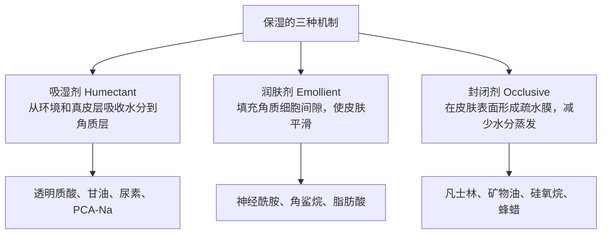
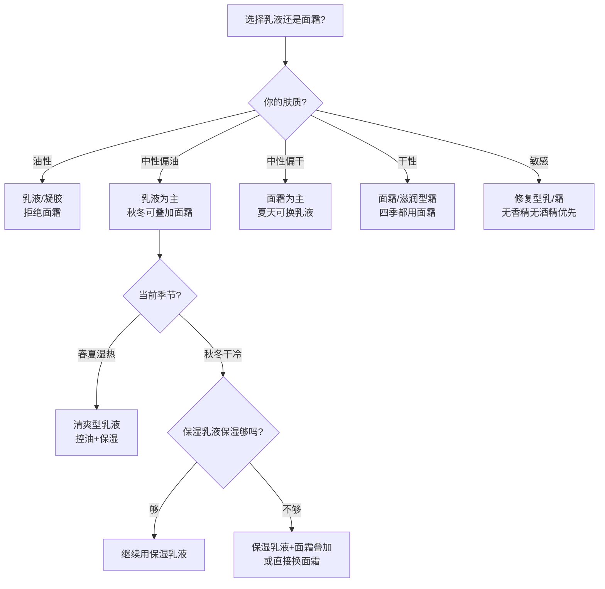
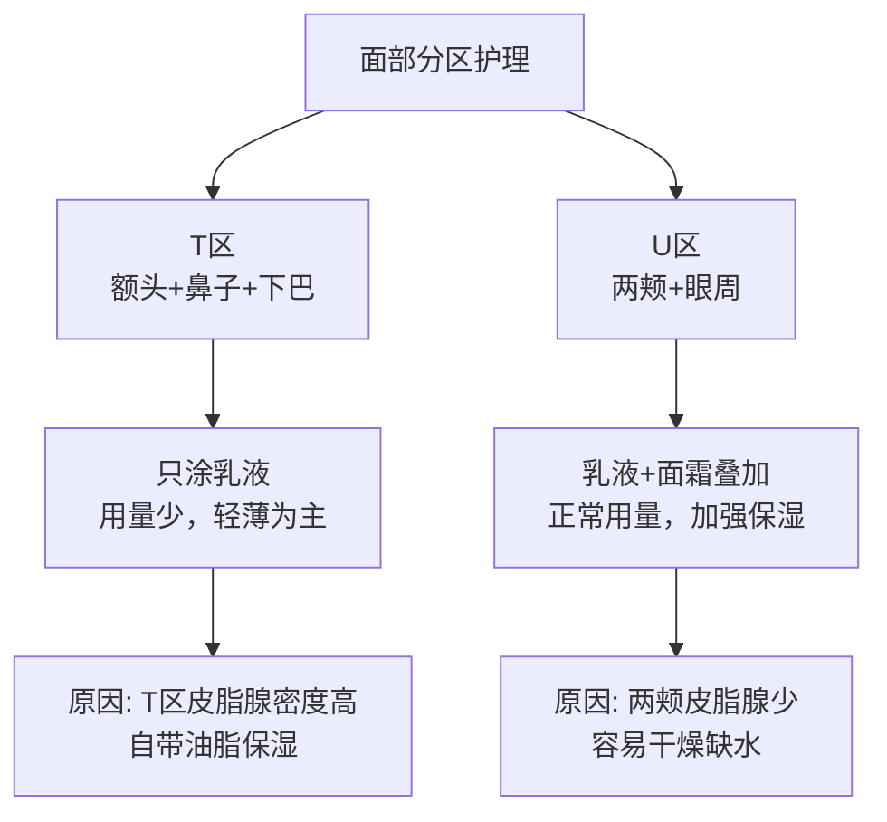
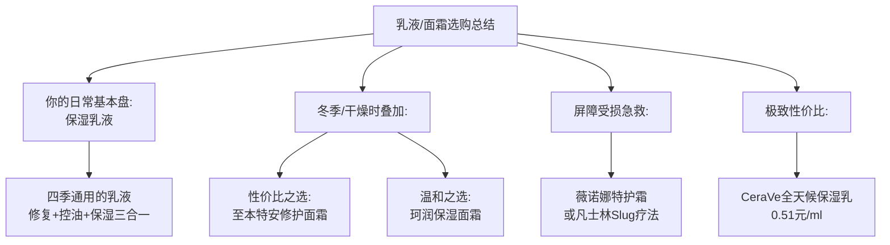

## 四、乳液/面霜推荐

乳液和面霜是护肤流程中承担"保湿锁水"和"屏障维护"的核心产品。如果说精华液是"治病的药"，那乳液/面霜就是"养人的饭"——它不负责解决特定的皮肤问题，而是为皮肤提供一个稳定、健康的微环境，让前面涂的精华液能够持续起效，同时防止皮肤水分流失。

很多人觉得乳液/面霜"随便涂涂就行"，这是一个严重的认知偏差。选错质地（油皮用厚重面霜导致闷痘）、用错顺序（乳液涂在精华前面导致精华无法渗透）、忽略季节调整（夏天还在用冬天的厚霜）——这些看似细小的错误，日积月累会严重影响整体护肤效果。

本节将从乳液/面霜的底层原理出发，讲清楚"保湿"这件事的科学本质，然后结合你的**中性偏微油肤质**和具体使用场景，给出详细的产品评测和选购建议。

### 4.1 乳液与面霜：它们到底在做什么

#### 4.1.1 皮肤为什么会"干"

要理解乳液/面霜的作用，首先要明白皮肤干燥的根本原因。皮肤的含水量取决于两个因素：**内部供水**和**外部锁水**。

皮肤最外层是角质层，只有10-20微米厚（大约一张A4纸的厚度），但它承担了皮肤90%以上的屏障功能。角质层的结构可以类比为"砖墙"：

```mermaid
flowchart LR
    subgraph 角质层的"砖墙"结构
        A["🧱 角质细胞<br>（砖头）"] --- B["🧈 细胞间脂质<br>（水泥）"]
        B --- C["💧 天然保湿因子NMF<br>（砖头内部的水分）"]
        C --- D["🫧 皮脂膜<br>（墙外的防水涂层）"]
    end
```

| 结构组分 | 占比 | 功能 | 缺失后果 |
|---------|------|------|---------|
| 角质细胞 | 约70% | 物理屏障，防止外界物质侵入 | 屏障功能丧失 |
| 细胞间脂质（神经酰胺50%+胆固醇25%+脂肪酸15%） | 约20% | 填充细胞间隙，防止水分从细胞间蒸发 | 经皮水分流失（TEWL）激增 |
| 天然保湿因子（NMF：氨基酸、PCA-Na、乳酸等） | 约10% | 吸收并保持水分，维持角质层含水量 | 角质层干燥、粗糙 |
| 皮脂膜（皮脂+汗液+NMF） | 极薄一层 | 最外层封闭，减少蒸发 | 皮肤失去天然保护层 |

**皮肤变干的三个根本原因**：

1. **皮脂分泌不足**：皮脂腺产生的油脂不够，皮脂膜这层"防水涂层"变薄，水分蒸发加快。干性皮肤的典型原因
2. **细胞间脂质流失**：过度清洁（皂基洁面、频繁去角质）、紫外线损伤、年龄增长都会导致神经酰胺等脂质减少，"水泥"出现裂缝，水分从缝隙中蒸发
3. **天然保湿因子不足**：角质层内部的"蓄水池"容量下降，皮肤自身保水能力降低

**乳液/面霜的作用，就是在皮肤表面重建这道屏障**——补充脂质、模拟皮脂膜、减少水分蒸发，同时为角质层提供额外的保湿因子。

#### 4.1.2 保湿的三层机制：吸湿、润肤、封闭

护肤品的保湿不是"补水"——涂在皮肤上的水分会迅速蒸发，根本留不住。真正的保湿是通过三种机制协同工作来**减少水分流失**和**增加皮肤含水量**：



| 机制 | 工作原理 | 代表成分 | 占比 |
|------|---------|---------|------|
| **吸湿（Humectant）** | 像海绵一样从周围环境和真皮层吸收水分到角质层中 | 透明质酸、甘油、丙二醇、尿素、山梨醇、PCA-Na | 乳液中通常10%-30% |
| **润肤（Emollient）** | 填充角质细胞之间的缝隙，使皮肤表面变得光滑柔软 | 神经酰胺、角鲨烷、异壬酸异壬酯、辛酸/癸酸甘油三酯 | 乳液中通常10%-25% |
| **封闭（Occlusive）** | 在皮肤表面形成一层疏水膜，阻止水分蒸发 | 凡士林、矿物油、蜂蜡、聚二甲基硅氧烷、牛油果树果脂 | 面霜中通常15%-40% |

**为什么需要三种机制协同？**

只用吸湿剂（如纯透明质酸）而不配合封闭剂，反而可能让皮肤更干——吸湿剂从环境中吸水，但在干燥环境中（湿度<60%），它只能从真皮层往上拉水，如果没有封闭剂锁住，这些水分会迅速蒸发，甚至带走皮肤原有的水分。这就是为什么在北方干燥的冬天，单用透明质酸精华反而会"越涂越干"。

**完整的保湿逻辑应该是**：吸湿剂负责"找水"，润肤剂负责"填充缝隙"，封闭剂负责"盖盖子"。三者缺一不可，只是在不同肤质和季节中，三者的配比不同。

#### 4.1.3 乳液和面霜的区别：不只是浓稠度的差异

很多人以为乳液就是"稀一点的面霜"，面霜就是"稠一点的乳液"。从配方科学角度看，两者的本质区别在于**油水比**和**乳化体系**：

| 对比维度 | 乳液（Lotion/Emulsion） | 面霜（Cream） |
|---------|------------------------|--------------|
| 油水比 | 水相>油相（通常6:4到8:2） | 油相>水相（通常4:6到6:4） |
| 质地 | 流动性强，轻薄易推开 | 浓稠，膏状，延展性低 |
| 封闭性 | 弱到中等 | 中等到强 |
| 渗透速度 | 快，约1-2分钟吸收 | 慢，约3-5分钟吸收 |
| 适合肤质 | 油性、混合性、中性偏油 | 干性、中性偏干 |
| 适合季节 | 春夏（湿热环境） | 秋冬（干冷环境） |
| 含油量 | 通常10%-25% | 通常25%-50% |
| 保湿持久力 | 4-6小时 | 6-12小时 |

**对于你的中性偏微油肤质**：乳液是日常首选，质地清爽不增加油脂负担。冬季如果觉得保湿力不够，可以在乳液之后叠加一层面霜，或者直接更换为质地稍厚的面霜。

### 4.2 乳液/面霜的核心成分深度解析

#### 4.2.1 神经酰胺：皮肤屏障的"钢筋水泥"

神经酰胺是乳液/面霜中最重要的修复类成分，没有之一。它是角质层细胞间脂质的核心组分，占细胞间脂质总量的约50%。

**为什么神经酰胺这么重要？**

角质层的屏障功能主要依赖细胞间脂质形成的"砖墙结构"。当神经酰胺不足时，砖墙的"水泥"出现缝隙——水分从缝隙中蒸发（经皮水分流失TEWL升高），外界刺激物更容易侵入皮肤（敏感、泛红、刺痛）。补充神经酰胺就是在"修补水泥"。

**神经酰胺的类型与功能差异**：

| 类型 | INCI名称 | 占皮肤神经酰胺比例 | 主要功能 |
|------|---------|-----------------|---------|
| 神经酰胺1（EOP） | Ceramide EOP | 约6% | 形成脂质双层的"外壁"，与脂肪酸结合紧密 |
| 神经胺3（NP） | Ceramide NP | 约22% | 最主要的屏障修复成分，保水能力最强 |
| 神经酰胺6-II（AP） | Ceramide AP | 约14% | 促进角质层正常脱屑，参与角质代谢 |
| 神经酰胺前体（植物鞘氨醇） | Phytosphingosine | — | 促进皮肤自身合成神经酰胺 |

**关键知识点——"黄金比例"**：

单靠补充神经酰胺并不够。皮肤科研究表明，神经酰胺、胆固醇和脂肪酸以**等摩尔比（约1:1:1）**补充时，屏障修复效果最佳。任何一种成分过多或过少，都会导致修复效率下降。这也是为什么配方优秀的屏障修复产品会同时包含这三种成分，而不是只堆神经酰胺。

> **你的保湿乳液含有3种神经酰胺**，配方设计合理。搭配使用含胆固醇和脂肪酸的产品（如凡士林封闭）可以进一步提升修复效果。

#### 4.2.2 角鲨烷：最接近人体皮脂的油脂

角鲨烷（Squalane）是角鲨烯（Squalene，人体皮脂的天然成分之一）的氢化衍生物。人体皮脂中约含12%的角鲨烯，但角鲨烯在空气中极易氧化（这也是皮脂氧化变色的原因），氢化后的角鲨烷稳定性大幅提升，同时保留了角鲨烯的优异亲肤性。

**角鲨烷的优势**：
- 与人体皮脂高度相似，涂抹后能自然融入皮脂膜，不会产生"异物感"
- 质地轻薄，虽是油脂但不油腻，油皮也能用
- 不致粉刺（comedogenic rating: 0-1），几乎不会堵塞毛孔
- 具有一定的抗氧化能力，帮助保护皮脂膜不被氧化
- 可以促进其他活性成分的渗透（角鲨烷本身是一种良好的透皮促渗剂）

**来源差异**：传统角鲨烷来自鲨鱼肝脏（每条鲨鱼只能提取少量），现在主流品牌已全面转向植物来源——橄榄提取、甘蔗发酵、棕榈提取。成分表上无法区分来源，但大多数品牌会在宣传中标注"植物角鲨烷"或"甘蔗角鲨烷"。

#### 4.2.3 透明质酸（玻尿酸）

透明质酸是护肤品中使用最广泛的吸湿剂。它能吸收自身重量1000倍的水分，是天然保湿因子的重要补充。

**分子量与功能的对应关系**（在乳液/面霜中的表现）：

| 分子量 | 渗透深度 | 在乳液中的作用 | 选择建议 |
|--------|---------|--------------|---------|
| 高分子量（>1000kDa） | 不渗透，留在表面 | 形成透气保湿膜，即时改善皮肤光泽感 | 适合妆前保湿 |
| 中分子量（100-1000kDa） | 角质层浅层 | 在角质层间隙中蓄水，提升含水量 | 日常保湿 |
| 低分子量（10-100kDa） | 表皮深层 | 从内部补水，改善深层缺水 | 适合干性肌肤 |
| 超小分子量（<10kDa） | 可达真皮层 | 促进皮肤自身合成透明质酸和胶原蛋白 | 抗老需求 |

**使用注意**：在干燥环境（湿度<60%，如北方冬天的暖气房），透明质酸从环境中吸不到足够的水分，反而会从真皮层往上拉水，导致皮肤深层缺水。因此，含透明质酸的乳液/面霜必须搭配封闭性成分（如角鲨烷、凡士林）使用，才能真正发挥保湿效果。

#### 4.2.4 其他值得关注的保湿成分

| 成分 | 类型 | 功能 | 特点 |
|------|------|------|------|
| 泛醇（维生素B5） | 吸湿+修复 | 保湿、促进屏障修复、舒缓抗炎 | 温和度极高，敏感肌也能用 |
| 甘油 | 吸湿剂 | 经典保湿，从环境中吸收水分 | 安全性极高，但浓度>10%可能黏腻 |
| 胆固醇 | 润肤剂 | 与神经酰胺、脂肪酸协同修复屏障 | "黄金三角"不可缺少的一角 |
| 脂肪酸（亚油酸、亚麻酸等） | 润肤剂 | 构成细胞间脂质、维护屏障完整 | 来源：月见草油、玫瑰果油等 |
| 牛油果树果脂（乳木果油） | 封闭+润肤 | 强封闭保湿，同时含天然植物甾醇 | 质地厚重，适合干皮和秋冬使用 |
| 尿囊素 | 舒缓+修复 | 促进细胞增殖、舒缓刺激 | 常用于修复类产品中 |
| 蓝桉叶提取物 | 抗炎+修复 | 抗炎舒缓，促进角质层恢复正常 | 珂润的核心成分之一 |
| 积雪草提取物 | 修复+抗炎 | 促进胶原合成、抗炎、修复微损伤 | 痘肌和敏感肌均适用 |

#### 4.2.5 需要警惕的成分

| 成分 | 风险 | 在乳液/面霜中的存在形式 |
|------|------|---------------------|
| 高浓度酒精（乙醇） | 破坏皮脂膜、加速水分蒸发、长期使用导致屏障受损 | 排在成分表前5位时需警惕 |
| 香精（Fragrance/Parfum） | 最常见的致敏源之一，可能引起接触性皮炎 | 多数日化产品都含有，选择"无香"更安全 |
| 矿物油（Mineral Oil） | 争议成分。高纯度矿物油安全且封闭性好，但低纯度可能含杂质 | 国际大品牌使用的高纯度矿物油是安全的 |
| MIT/CMIT（甲基异噻唑啉酮类） | 已被欧盟限制在驻留型产品中使用，刺激性较强 | 部分老配方产品仍含有 |

### 4.3 乳液/面霜选购决策指南

#### 4.3.1 肤质-质地匹配矩阵

选乳液还是面霜，取决于三个变量的综合判断：



**你的具体判断**：

你属于中性偏微油肤质，日常使用乳液是最优解。面霜只在以下情况考虑叠加：
- 冬季室内外温差大，皮肤出现干燥脱皮
- 长时间处于空调/暖气环境，湿度低于30%
- 皮肤因使用酸类产品（你目前在用水杨酸产品）而出现干燥

#### 4.3.2 不同预算的乳液/面霜推荐矩阵

| 预算 | 乳液首选 | 面霜首选 | 适用场景 |
|------|---------|---------|---------|
| 💰 100元以内 | CeraVe全天候保湿乳、至本舒颜修护乳 | 凡士林经典润肤霜 | 学生党、试水阶段 |
| 💰💰 100-200元 | **保湿乳液**、珂润保湿乳 | 至本特安修护面霜、珂润面霜 | 日常护肤、性价比优选 |
| 💰💰💰 200-400元 | IPSA自律循环乳、黛珂牛油果乳液 | 科颜氏高保湿面霜 | 追求肤感和品质 |
| 💰💰💰💰 400元以上 | 资生堂时光琉璃乳液 | La Mer经典面霜、赫莲娜黑绷带 | 极致体验、不差钱 |

### 4.4 产品详细评测

#### 4.4.1 你正在使用：适乐肤保湿乳液（CeraVe PM Facial Moisturizing Lotion）

| 项目 | 详情 |
|------|------|
| 价格 | 💰💰 约130-160元/52ml |
| 核心成分 | 3种神经酰胺（1/3/6-II）、4%烟酰胺、透明质酸、植物鞘氨醇 |
| 功效 | 修复屏障、保湿、控油提亮 |
| 适合肤质 | 所有肤质，尤其适合中性至油性 |
| 质地 | 轻薄乳液，流动性好，推开后迅速吸收 |
| 香味 | 无香精，基本无味 |

**深度解析保湿乳液为什么适合你**：

保湿乳液的配方设计堪称屏障修复的"教科书"——3种神经酰胺覆盖了皮肤脂质的核心组分，植物鞘氨醇作为神经酰胺前体能促进皮肤自身合成神经酰胺，4%烟酰胺在起效浓度范围内（2%-5%）同时提供控油和提亮效果，透明质酸负责吸湿补水。

对于你"中性偏微油"的肤质，保湿乳液的优势在于：
- 质地轻薄不闷：水相为主的乳液配方，不会加重油脂负担
- 烟酰胺控油：4%的浓度恰好在控油的甜点区间，长期使用有助于调节T区油脂分泌
- 屏障维护：你在使用的水杨酸产品（水杨酸产品）会对角质层产生一定刺激，保湿乳液的神经酰胺可以对冲这个副作用，维持屏障稳定
- 四季通用：春夏单独用够清爽，秋冬可叠加面霜增强保湿

**建议**：保湿乳液是你的"基本盘"，不需要更换。只需要根据季节变化灵活调整——冬天叠加面霜，夏天单独用保湿乳液即可。

#### 4.4.2 其他乳液推荐

**（1）至本舒颜修护乳液**

| 项目 | 详情 |
|------|------|
| 价格 | 💰 约89元/100ml |
| 核心成分 | 神经酰胺、角鲨烷、积雪草提取物、泛醇 |
| 功效 | 修复屏障、保湿、舒缓 |
| 适合肤质 | 所有肤质 |
| 质地 | 比保湿乳液略厚一档，但仍属轻薄范围 |
| 香味 | 无香精 |
| 单位价格 | 约0.89元/ml（保湿乳液约2.88元/ml） |

**与保湿乳液的对比分析**：

| 对比维度 | 保湿乳液 | 至本舒颜修护乳 |
|---------|------|--------------|
| 屏障修复 | 3种神经酰胺+植物鞘氨醇 | 神经酰胺+角鲨烷 |
| 控油提亮 | 含4%烟酰胺 | 无烟酰胺 |
| 舒缓抗炎 | 无专门抗炎成分 | 含积雪草提取物 |
| 质地 | 更轻薄 | 略厚一点 |
| 性价比 | 💰2.88元/ml | 💰0.89元/ml |
| 综合评价 | 控油+修复二合一 | 纯修复+舒缓 |

**购买建议**：如果你想要一款更便宜的屏障修复乳液，至本是很好的选择。但如果你看重保湿乳液的烟酰胺控油功能，那保湿乳液无可替代。也可以这样搭配：夏天用保湿乳液（控油），冬天换至本（温和修复）。

**（2）珂润润浸保湿乳液（Curel Moisture Lotion）**

| 项目 | 详情 |
|------|------|
| 价格 | 💰💰 约158元/120ml |
| 核心成分 | 神经酰胺（鲸蜡基-PG羟乙基棕榈酰胺）、蓝桉叶提取物、尿囊素 |
| 功效 | 保湿、修复屏障、抗炎舒缓 |
| 适合肤质 | 干性、敏感性、屏障受损 |
| 质地 | 比保湿乳液稍厚，介于乳液和面霜之间 |
| 香味 | 无香精、无酒精、无色素（"三无"配方） |

**深度评价**：

珂润的核心技术是其专利成分"鲸蜡基-PG羟乙基棕榈酰胺"——这是一种伪神经酰胺（Pseudo-Ceramide），结构与天然神经酰胺相似，但生产成本更低。它能有效补充细胞间脂质、修复屏障。蓝桉叶提取物提供抗炎舒缓作用，尿囊素促进角质层修复。

珂润的产品线由日本花王集团研发，以"敏感肌专研"著称。整个配方极简——不含香精、酒精、色素、紫外线吸收剂，致敏风险极低。

**与你的适配性分析**：珂润乳液偏"干敏肌"设计，质地比保湿乳液厚，对于你中性偏微油的肤质来说，**更适合秋冬季节使用**。夏天用可能会觉得偏滋润。

**（3）CeraVe全天候保湿乳（CeraVe Moisturizing Lotion）**

| 项目 | 详情 |
|------|------|
| 价格 | 💰💰 约100-130元/236ml |
| 核心成分 | 3种神经酰胺、透明质酸、MVE缓释技术 |
| 功效 | 保湿、修复屏障 |
| 适合肤质 | 所有肤质，面部和身体均可使用 |
| 质地 | 比保湿乳液更轻薄，流动性更强 |
| 香味 | 无香精 |
| 单位价格 | 约0.51元/ml（所有推荐中性价比最高） |

**深度评价**：

这是CeraVe的经典"大碗"产品，性价比在所有推荐中最高。配方核心与保湿乳液相似（3种神经酰胺+透明质酸），但不含烟酰胺，因此少了控油提亮功能。同时，它采用了MVE（多层乳液缓释技术）——微囊化的保湿成分在涂抹后持续缓慢释放，提供长达24小时的保湿效果。

**与保湿乳液的区别**：全天候乳的定位是"基础保湿"，保湿乳液的定位是"保湿+功效（控油提亮）"。如果你想要最简单的选择——只求保湿不求其他功能——全天候乳的性价比远超保湿乳液。它的大容量（236ml）也意味着可以同时用于面部和身体，一瓶多用。

#### 4.4.3 面霜推荐（冬季/干性区域加强保湿）

面霜的核心价值在于更强的**封闭性**——在皮肤表面形成一层保护膜，大幅减少水分蒸发。以下三种面霜按封闭性从弱到强排列：

**（1）珂润润浸保湿面霜**

| 项目 | 详情 |
|------|------|
| 价格 | 💰💰 约188元/40g |
| 核心成分 | 神经酰胺（鲸蜡基-PG羟乙基棕榈酰胺）、角鲨烷、蓝桉叶提取物 |
| 功效 | 深层保湿、修复屏障、舒缓 |
| 适合肤质 | 干性、敏感性、屏障受损 |
| 质地 | 乳霜状，质地滋润但不厚重，涂抹后不泛油光 |
| 香味 | 无香精 |

**深度评价**：

珂润面霜延续了珂润品牌的"极简安全"理念。角鲨烷提供封闭保湿（比乳液的封闭性强一档），神经酰胺修复屏障，蓝桉叶抗炎舒缓。整体质地做到了"滋润但不油腻"——对于中性偏微油肤质，在秋冬使用不会觉得过重。

**适合你的使用场景**：
- 冬天晚上，在保湿乳液之后薄薄涂一层，提升夜间保湿力
- 水杨酸产品（水杨酸）使用后皮肤出现干燥脱皮时，作为急救修复
- 不建议夏天使用，封闭性过强可能导致闷痘

**（2）至本特安修护面霜**

| 项目 | 详情 |
|------|------|
| 价格 | 💰💰 约139元/50g |
| 核心成分 | 神经酰胺、角鲨烷、牛油果树果脂、积雪草提取物 |
| 功效 | 深层修复、保湿、舒缓 |
| 适合肤质 | 干性、敏感性、屏障受损 |
| 质地 | 比珂润面霜稍厚，更接近传统面霜质地 |
| 香味 | 无香精 |
| 单位价格 | 约2.78元/g |

**深度评价**：

牛油果树果脂（乳木果油）是这款面霜的亮点——它是一种天然植物油脂，含有丰富的植物甾醇和不皂化物，不仅提供强封闭保湿，还能促进皮肤自身的修复。积雪草提取物则在修复的同时提供抗炎功能。

与珂润面霜相比，至本面霜的封闭性更强、修复力更全面（神经酰胺+角鲨烷+积雪草三重修复），价格也更亲民。如果你只需要一款冬季面霜，至本的综合性价比优于珂润。

**（3）科颜氏高保湿面霜（Kiehl's Ultra Facial Cream）**

| 项目 | 详情 |
|------|------|
| 价格 | 💰💰💰 约300-380元/50ml |
| 核心成分 | 角鲨烷、冰川蛋白（假交替单胞菌发酵产物）、牛油果树果脂 |
| 功效 | 深层保湿、抗冻防裂 |
| 适合肤质 | 干性、中性（油皮慎用） |
| 质地 | 膏状，质地厚实，滋润度极高 |
| 香味 | 微弱的原料气味，无添加香精 |

**深度评价**：

科颜氏高保湿面霜是一款经典的"保湿旗舰"产品。它的核心卖点是"冰川蛋白"——来自南极冰川微生物（假交替单胞菌）的发酵提取物，富含胞外多糖，能在极端干燥和低温环境下保护细胞膜完整性。配方中的角鲨烷和牛油果树果脂提供双重封闭。

**坦诚评价**：这款面霜的保湿力确实很强，但它300+的价格在"成分功效"维度上并不比至本面霜有本质优势——主要差距在于品牌溢价、肤感细腻度和使用体验。如果你追求"够用就好"，至本面霜的性价比更高；如果你追求品牌和肤感，科颜氏不会让你失望。

**对你的适配性**：你的中性偏微油肤质**不太适合**这款面霜的日常使用——质地偏厚，容易在T区造成闷感。建议仅在极干燥环境或屏障严重受损时局部使用（如两颊干燥处），T区仍然用保湿乳液即可。

#### 4.4.4 值得关注的进阶选择

**（1）薇诺娜舒敏保湿特护霜**

| 项目 | 详情 |
|------|------|
| 价格 | 💰💰 约188元/50g |
| 核心成分 | 马齿苋提取物、青刺果油、透明质酸 |
| 功效 | 舒缓敏感、修复屏障、抗炎 |
| 适合肤质 | 敏感肌、玫瑰痤疮、屏障受损 |
| 评价 | 国货敏感肌修复领域的标杆产品。马齿苋提取物具有显著的抗炎和抗氧化活性，青刺果油富含不饱和脂肪酸，与皮肤脂质相容性好。不含香精、酒精、色素 |

**适用场景**：如果你使用水杨酸产品后出现持续泛红、刺痛等屏障受损症状，可以临时切换为薇诺娜特护霜，待屏障恢复后再换回保湿乳液。它不适合作为日常乳液——封闭性偏强，长期用在中性偏油肤质上可能过于滋润。

**（2）凡士林经典修护晶冻（Vaseline Original）**

| 项目 | 详情 |
|------|------|
| 价格 | 💰 约20-30元/100g |
| 核心成分 | 100%凡士林（矿脂） |
| 功效 | 极强封闭保湿 |
| 适合肤质 | 所有肤质（局部使用） |
| 评价 | 世界上最经典的封闭剂。纯凡士林的封闭率高达99%——几乎没有水分能穿过它蒸发。但质地极度油腻，不适合全脸日常使用 |

**你可能觉得奇怪，为什么推荐凡士林？** 因为它在特定场景下无可替代：
- **"Slug疗法"**：晚上护肤最后一步，在两颊等干燥区域薄涂一层凡士林，第二天早上洗掉。封闭率99%意味着你涂的乳液/精华中的保湿成分会被"锁"在皮肤上整夜工作
- **水杨酸产品/酸类后急救**：酸类导致的局部干燥脱皮，凡士林是最简单有效的急救措施
- **唇部护理**：比大多数润唇膏更有效、更便宜

### 4.5 乳液/面霜的使用技巧

#### 4.5.1 用量标准

很多人乳液/面霜的用量不对——要么太少（硬币大小涂全脸，薄到几乎没有封闭效果），要么太多（涂成"面具"既浪费又闷痘）。

| 产品类型 | 建议用量 | 判断标准 |
|---------|---------|---------|
| 乳液 | 1-2泵 或 约一颗蚕豆大小 | 涂开后全脸均匀覆盖一层，不堆积不搓泥 |
| 面霜 | 约一颗黄豆到蚕豆大小 | 涂开后皮肤有滋润感但不泛油光 |
| 凡士林（局部） | 薄薄一层，米粒大小涂一个区域 | 刚好覆盖住干燥区域即可 |

#### 4.5.2 涂抹手法

涂抹乳液/面霜的手法看似简单，但直接影响吸收效率和肤感：

**正确手法——按压法**：
1. 取适量乳液/面霜于掌心
2. 双掌轻轻搓开，让产品均匀分布在掌面
3. 用手掌轻轻按压面部——额头、两颊、鼻子、下巴
4. 用指腹从面部中央向外侧轻柔推开
5. 最后用手掌包裹面部，按压10-15秒，利用手掌温度促进吸收

**避免以下错误手法**：
- ❌ 用力来回涂抹：产生摩擦力，可能拉扯皮肤造成微损伤
- ❌ 拍打脸部：并不能促进吸收，反而可能刺激皮肤
- ❌ 只涂脸颊忽略T区：T区也需要保湿（只是用量可以少一些）
- ❌ 涂完立刻化妆/涂防晒：至少等待1-2分钟让乳液成膜

#### 4.5.3 使用顺序与等待时间

乳液/面霜在护肤流程中的正确位置：

洁面 → 爽肤水(可选) → 精华液 → [等待1-2分钟] → 乳液/面霜 → [等待1-2分钟] → 防晒(白天)

**关于等待时间的科学解释**：
- 精华液涂完后等待1-2分钟：让活性成分有时间渗透到皮肤深层。如果立刻涂乳液，乳液中的油脂和封闭剂会在表面形成膜，阻碍精华的渗透
- 乳液涂完后等待1-2分钟：让乳液中的水分蒸发、油脂成膜，形成均匀的保护层后再涂防晒或化妆，避免搓泥

**不需要等到完全干透**：皮肤吸收主要靠浓度梯度驱动，不是靠"晾干"。等太久反而会让精华液中的水分蒸发，减少透皮渗透的驱动力。

#### 4.5.4 叠加使用：乳液+面霜的正确方法

在秋冬季节或皮肤干燥时，你可能需要在乳液之后叠加面霜。正确的叠加方法：

1. 先涂乳液（质地轻薄的先上），等待1分钟吸收
2. 再涂面霜（质地厚重的后上），用按压法均匀覆盖
3. 总用量不需要翻倍——乳液用正常量的2/3，面霜用正常量的2/3即可
4. 叠加后如果出现搓泥，说明两者的乳化体系不兼容——换成同一品牌的产品（配方体系一致），或减少用量

**分区护理法（适合中性偏油肤质）**：



### 4.6 季节调整策略

| 季节 | 环境特点 | 推荐策略 | 具体操作 |
|------|---------|---------|---------|
| **春季** | 气温回升，湿度增加，花粉增多 | 逐步减少封闭性，注意防敏 | 保湿乳液单独使用，暂停面霜。如出现换季敏感，可临时加入珂润乳液 |
| **夏季** | 高温高湿，皮脂分泌旺盛 | 最大限度清爽，减少油脂负担 | 保湿乳液薄涂一层即可。如果出汗多，可以考虑更轻薄的乳液如CeraVe全天候乳 |
| **秋季** | 气温下降，湿度减少 | 渐进增加保湿力度 | 保湿乳液正常用量，如果出现干燥信号（紧绷、起皮），开始叠加面霜 |
| **冬季** | 低温低湿，暖气房极度干燥 | 最大保湿封闭 | 保湿乳液+面霜叠加，必要时在干燥区域涂凡士林 |

**空调房/暖气房的特殊处理**：

长期处于空调或暖气环境中（室内湿度通常低于30%），皮肤面临的干燥挑战远超季节变化本身。应对策略：
- 在办公桌放一个小型加湿器，将周围湿度维持在40%-60%
- 中午补涂一次乳液——不需要卸妆重新涂，直接在妆面上用掌心按压乳液即可
- 晚上护肤后在两颊涂一层凡士林（Slug疗法），第二天早上洗掉

### 4.7 常见误区与纠正

#### 误区一：油皮不需要保湿

**真相**：油皮的"油"（皮脂）和"水"（角质层含水量）是两回事。皮脂分泌旺盛≠皮肤含水量充足。事实上，很多油皮的角质层含水量反而偏低——过度清洁（皂基洁面）去除了过多皮脂，皮肤屏障受损，水分流失加快，但皮脂腺代偿性分泌更多油脂。结果就是"外油内干"——表面油腻，底层缺水。

**纠正**：油皮需要的是"无油/轻油保湿"——选择质地轻薄、不含致痘油脂的乳液，重点补充吸湿剂（透明质酸、甘油）和屏障修复成分（神经酰胺），而不是用厚重面霜去"滋润"。

#### 误区二：乳液涂得越多越保湿

**真相**：皮肤的吸收能力是有限的。涂太厚不仅不会增加保湿效果，反而会造成：
- 毛孔堵塞→闷痘、闭口
- 浪费产品
- 肤感粘腻，影响后续防晒/化妆

**纠正**：按标准用量涂抹即可（乳液1-2泵，面霜黄豆大小）。如果涂完后仍有明显的"浮油"感，说明用量过多。

#### 误区三：夏天不需要面霜

**真相**：大多数情况下这是对的——夏天皮脂分泌旺盛，乳液的保湿力度通常足够。但在以下场景中，夏天也需要面霜：
- 长时间处于空调环境（办公室、商场、地铁）
- 使用了高浓度酸类产品后皮肤偏干
- 到干燥地区出差/旅行

**纠正**：夏天以乳液为主，但根据具体环境灵活调整。不需要完全排除面霜。

#### 误区四：贵的面霜一定比便宜的好

**真相**：护肤品的效果取决于成分配方，不取决于价格。前面在"产品推荐原则"中已经详细分析了成本结构——一瓶300元的面霜，真正用在"护肤"上的成本可能只有30-45元。神经酰胺就是神经酰胺，不管是放在100元的产品里还是1000元的产品里。

**纠正**：把"选购决策四问"（成分→肤质适配→起效浓度→性价比）作为购买标准，而不是看价格和品牌。

#### 误区五：涂完乳液马上化妆

**真相**：乳液/面霜中的油脂和乳化剂需要1-2分钟才能在皮肤表面形成均匀的保护膜。如果立刻化妆，防晒霜和化妆品的粉体颗粒会破坏这层膜，导致：
- 搓泥（产品相互"打架"）
- 妆面不均匀
- 乳液的保湿效果打折扣

**纠正**：涂完乳液后等待1-2分钟再涂防晒，涂完防晒再等待1-2分钟再上妆。总共只需要多等2-3分钟，效果差距巨大。

#### 误区六：面霜可以替代眼霜

**真相**：眼周皮肤是面部最薄的区域（仅约0.5mm，是面部其他区域的1/3-1/5），皮脂腺极少，更容易干燥和产生细纹。面霜的配方针对面部皮肤设计，其油脂组成、活性成分浓度、刺激性水平可能不适合娇嫩的眼周。

**纠正**：预算充足时使用专门的眼霜；预算有限时，可以选择温和无刺激的乳液（如保湿乳液）轻轻带过眼周，但避免使用含高浓度活性成分（如酸类、高浓度视黄醇）的面霜涂眼周。

### 4.8 乳液/面霜与其他产品的协同

#### 4.8.1 与精华液的搭配

乳液/面霜与精华液的搭配原则：

| 精华类型 | 搭配乳液/面霜的策略 | 理由 |
|---------|-------------------|------|
| 抗氧化精华（维C类） | 乳液选择轻薄型，不含高浓度酸 | 维C需要酸性环境起效，过于封闭的面霜可能影响渗透 |
| 美白精华（烟酰胺类） | 保湿乳液本身就含4%烟酰胺，注意总浓度不要过高 | 多产品叠加烟酰胺可能超过5%导致刺激 |
| 抗老精华（视黄醇类） | 必须搭配保湿修复型乳液/面霜 | 视黄醇会导致干燥脱皮，需要乳液/霜"兜底" |
| 修复精华（神经酰胺/泛醇类） | 搭配含封闭剂的面霜效果翻倍 | 修复成分需要封闭剂"锁"在皮肤上才能持续起效 |

**你的搭配方案**：
- 早上：洁面 → 抗氧化精华（抗氧化） → 保湿乳液 → 防晒
- 晚上：洁面 → 水杨酸产品（水杨酸，局部） → 保湿乳液 → [冬季干燥时叠加面霜]

#### 4.8.2 与防晒霜的搭配

乳液/面霜与防晒霜的搭配需要注意：
- 乳液必须完全吸收后再涂防晒（等待1-2分钟），否则防晒成膜不均匀，防护力下降
- 选择质地轻薄的乳液可以减少与防晒的搓泥风险
- 如果你的防晒霜本身保湿力够好（如理肤泉大哥大），夏天可以省略乳液，直接洁面→精华→防晒

### 4.9 产品储存与保质期

乳液/面霜的储存比精华液简单得多（不含纯维C等易氧化成分），但仍需注意：

| 储存要点 | 说明 |
|---------|------|
| 避免高温 | 高温会导致乳化体系破坏，乳液分层。不要放在窗台、暖气旁 |
| 避免阳光直射 | 紫外线可能降解某些活性成分（如神经酰胺） |
| 卫生间不是好位置 | 浴室高温高湿，反复开关盖带入水汽，加速变质 |
| 注意PAO标志 | 开盖小罐图标标注开封后可用月数。乳液/面霜通常为6M-12M |
| 泵头包装优于广口瓶 | 泵头每次取用不接触空气和手指，卫生且延缓氧化 |

**乳液/面霜的变质信号**：
- **分层或水油分离**：乳化体系破坏，立即停用
- **异味或酸败味**：防腐体系失效，立即停用
- **质地明显改变**（变稀、变稠、出现颗粒）：可能变质，不建议继续使用
- **颜色变化**：如果从白色变为黄色/灰色，可能氧化或微生物污染

### 4.10 本节选购总结



**一句话建议**：保湿乳液是你的"基本盘"，不需要更换。冬天觉得保湿力不够时叠加至本面霜或珂润面霜。任何时候出现屏障受损，回归保湿乳液+凡士林Slug疗法。中性偏微油肤质不建议日常使用过于厚重的面霜，以免堵塞毛孔。

***
