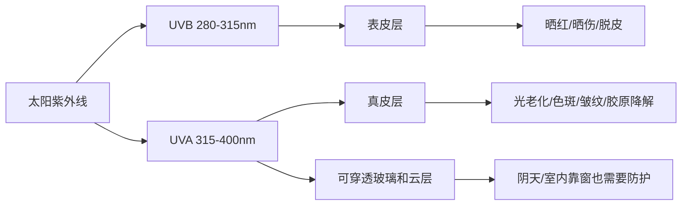
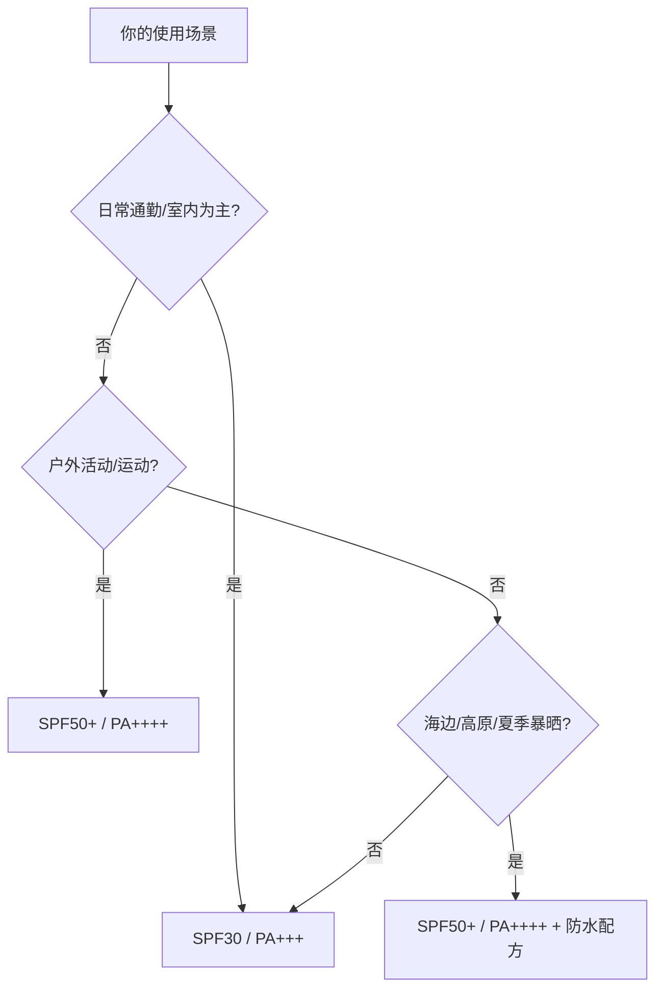
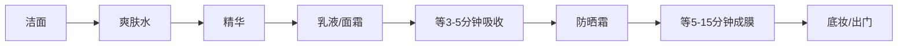
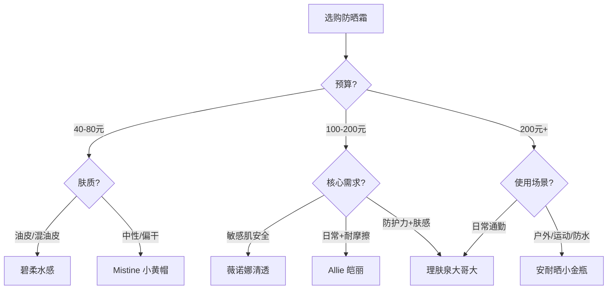

## 五、防晒霜推荐

防晒是护肤体系中投入产出比最高的一步。紫外线（UV）是导致皮肤光老化、色斑沉着、胶原蛋白流失的头号外源性因素——研究表明，面部老化迹象中约 **80%** 来自光老化而非自然衰老（来源：British Journal of Dermatology, 2013）。换句话说，你花在精华、面霜上的钱，如果没有防晒做基础，效果会被紫外线大幅抵消。

对于中性偏微油肤质，防晒产品的选择尤其重要：质地太油腻会加重出油和闷痘风险，太轻薄又可能防护力不足。本章从原理到产品，系统讲解如何选对、用对防晒霜。

### 5.1 紫外线基础：你到底在防什么

#### 5.1.1 紫外线的分类

太阳光中的紫外线按波长分为三种，对皮肤的伤害机制各不相同：

| 类型 | 波长范围 | 到达地面比例 | 对皮肤的主要伤害 |
|------|----------|-------------|-----------------|
| **UVC** | 100-280nm | 几乎为零（被臭氧层吸收） | 杀菌力强，但日常不需防护 |
| **UVB** | 280-315nm | 约5% | 表皮层伤害：晒红、晒伤、急性炎症，是晒伤的直接原因 |
| **UVA** | 315-400nm | 约95% | 真皮层伤害：穿透更深，导致光老化、色斑、胶原降解、免疫抑制 |

**关键认知：** UVB 会让你晒红晒伤（肉眼可见），UVA 则在"看不见"的地方持续破坏真皮层——等你察觉到皱纹和色斑时，伤害已经积累了多年。这就是为什么阴天、冬天、室内靠窗也需要防晒：UVA 可以穿透云层和玻璃。

#### 5.1.2 UV 指数与防护决策

UV 指数（UVI）是衡量地面紫外线强度的国际标准。根据 WHO 的建议：

- **UVI 0-2（低）**：无需特殊防护，可正常外出
- **UVI 3-5（中等）**：建议戴帽、使用SPF30+防晒
- **UVI 6-7（高）**：必须涂抹防晒，减少正午外出
- **UVI 8-10（很高）**：严格防晒，10:00-16:00避免户外
- **UVI 11+（极高）**：极度危险，尽量留在室内

中国大部分地区夏季正午 UVI 可达 8-11，华南地区甚至更高。即便冬季阴天，UVI 也常在 2-4 范围，仍有防护必要。

### 5.2 防晒霜的两大体系：化学防晒 vs 物理防晒 vs 混合防晒

市面上的防晒霜按作用机制分为三大类，各有优劣：

#### 5.2.1 化学防晒（有机防晒剂）

**原理：** 化学防晒剂分子吸收紫外线光子后，将其转化为热能释放，从而避免紫外线对皮肤的直接伤害。相当于在皮肤表面涂了一层"紫外线吸热层"。

**常见成分：**
- **阿伏苯宗（Avobenzone）**：UVA 防护主力，但自身光稳定性差，需搭配稳定剂（如奥克立林 Octocrylene）
- **奥克立林（Octocrylene）**：UVB 防护 + 稳定阿伏苯宗
- **胡莫柳酯（Homosalate）**：UVB 吸收
- **水杨酸乙基己酯（Ethylhexyl Salicylate/ Octisalate）**：UVB 吸收
- **Tinosorb S / Tinosorb M（双-乙基己氧苯酚甲氧苯基三嗪）**：新型广谱防晒剂，光稳定性好，兼具 UVA+UVB 防护
- **Mexoryl SX / Mexoryl XL**：欧莱雅专利 UVA 防护成分

**优点：** 质地轻薄、肤感好、不泛白、容易做成高 SPF 值
**缺点：** 部分成分可能刺激敏感肌；需要等待 15-20 分钟成膜后才能发挥防护效果；部分老一代成分（如二苯酮-3）存在争议

#### 5.2.2 物理防晒（无机防晒剂/矿物防晒）

**原理：** 物理防晒剂（氧化锌、二氧化钛）以微粒形式覆盖在皮肤表面，通过反射和散射紫外线来阻挡其进入皮肤。相当于给皮肤穿了一层"物理铠甲"。

**常见成分：**
- **氧化锌（Zinc Oxide）**：广谱防护，同时覆盖 UVA 和 UVB，是防护最全面的单一成分
- **二氧化钛（Titanium Dioxide）**：UVB 防护优秀，UVA 防护较弱

**优点：** 温和不刺激，涂抹后即刻生效（不需等待成膜），光稳定性极好不会降解，适合敏感肌和儿童
**缺点：** 容易泛白（尤其在深色肤色上更明显），质地偏厚重，可能有"面具感"，出汗后容易斑驳

#### 5.2.3 混合防晒

市面上大多数主流防晒产品采用化学+物理混合配方，取两者之长：用化学防晒剂保证肤感和防护广度，用少量物理防晒剂补强稳定性和 UVA 覆盖。安耐晒小金瓶、Allie 皑丽、薇诺娜都是典型的混合防晒。

#### 三种类型对比总结

| 维度 | 化学防晒 | 物理防晒 | 混合防晒 |
|------|---------|---------|---------|
| 质地 | 轻薄、水润 | 厚重、可能泛白 | 中等，兼顾肤感 |
| 成膜时间 | 需等 15-20 分钟 | 涂抹即生效 | 约 5-10 分钟 |
| 刺激性 | 部分成分可能致敏 | 最温和 | 取决于具体配方 |
| 防水性 | 中等 | 较好 | 较好 |
| 清洁难度 | 洁面乳可卸 | 可能需要卸妆 | 一般洁面乳可卸 |
| 适合肤质 | 油皮/中性皮 | 敏感肌/干皮 | 大多数肤质 |
| 适合场景 | 日常通勤 | 敏感期/医美后 | 通用 |

### 5.3 解读防晒参数：SPF、PA 和你真正需要的防护等级

#### 5.3.1 SPF（Sun Protection Factor）

SPF 衡量的是对 **UVB** 的防护能力。数值含义：

- **SPF 15**：阻挡约 93% 的 UVB
- **SPF 30**：阻挡约 96.7% 的 UVB
- **SPF 50**：阻挡约 98% 的 UVB
- **SPF 50+**：阻挡 98% 以上

注意：SPF 从 30 到 50 只多了约 1.3% 的 UVB 阻挡率，但这 1.3% 在高强度紫外线环境下意义重大——SPF 30 允许约 3.3% 的 UVB 穿透，SPF 50 只允许约 2%，穿透量减少了近 40%。

**实际建议：** 日常通勤 SPF30 足够，户外活动、夏季正午、高海拔地区选择 SPF50+。

#### 5.3.2 PA（Protection Grade of UVA）

PA 是日本制定的 UVA 防护等级标准（以 PFA 值为依据），用"+"号表示：

- **PA+**：PFA 2-4，轻度 UVA 防护
- **PA++**：PFA 4-8，中度 UVA 防护
- **PA+++**：PFA 8-16，高度 UVA 防护
- **PA++++**：PFA 16+，极高 UVA 防护

**为什么 PA 比 SPF 更重要？** 因为 UVB 导致的晒伤是急性、可逆的（几天就能恢复），而 UVA 导致的光老化是慢性、累积、几乎不可逆的。长期来看，PA 等级比 SPF 更值得关注。

**其他地区的 UVA 标识：**
- **欧洲**：要求 UVA 防护值 ≥ SPF 的 1/3（标注"UVA 圆圈"标志）
- **美国**：标注"Broad Spectrum（广谱）"表示同时防护 UVA 和 UVB
- **中国**：参照 PA 标准

#### 5.3.3 你需要什么等级？

对于你的肤质（中性偏微油），以下参数组合是最优解：
- **通勤日**：SPF30 / PA+++，选清爽型
- **户外日**：SPF50+ / PA++++，选防水防汗型
- **如果只买一支**：选 SPF50+ / PA++++，通勤用也不会太厚重（现代配方已经做得很清爽）

### 5.4 推荐产品详解

以下是经过市场验证、口碑稳定的防晒产品，按价格从高到低排列。每款产品均标注适用场景、核心成分、肤感特点和使用建议。

---

#### 5.4.1 安耐晒小金瓶（资生堂）

| 项目 | 详情 |
|------|------|
| **价格** | 💰💰💰 约 200-280 元 / 60ml |
| **SPF/PA** | SPF50+ / PA++++ |
| **类型** | 化学 + 物理混合防晒 |
| **核心技术** | 资生堂 Auto Booster 技术：遇汗、遇水、遇热时防晒膜自动增强 |
| **主要防晒剂** | 氧化锌 + 二氧化钛 + 甲氧基肉桂酸乙基己酯 + 奥克立林等 |
| **质地** | 摇摇乐液态质地，流动性强，涂抹后快速成膜 |
| **适合肤质** | 所有肤质，油皮友好 |
| **防水防汗** | ⭐⭐⭐⭐⭐ 极强 |

**优势分析：** 安耐晒的核心竞争力是"极端场景防护力"。它的 Auto Booster 技术让防晒膜在出汗、接触水分后反而变得更均匀紧密，这在户外运动、海边游泳场景下是真正的刚需。实测在连续出汗 2 小时后仍有 80% 以上的防护力残留。

**注意事项：**
- 需要卸妆或使用皂基洁面才能彻底清洁
- 含酒精成分，极敏感肌可能有轻微刺激
- 日常通勤用略显"杀鸡用牛刀"，但如果你不想分场景买两支也没问题

**选购建议：** 户外运动、海边度假、军训、长时间暴晒场景的首选。日常通勤也可以用，只是性价比不如轻薄型产品。

---

#### 5.4.2 理肤泉每日防晒乳（大哥大）

| 项目 | 详情 |
|------|------|
| **价格** | 💰💰💰 约 200-260 元 / 50ml |
| **SPF/PA** | SPF50+ / PA++++ |
| **类型** | 纯化学防晒 |
| **核心技术** | 欧莱雅专利 Mexoryl SX + Mexoryl XL 广谱防晒体系 |
| **主要防晒剂** | Mexoryl SX + Mexoryl XL + Tinosorb S + 阿伏苯宗 + 奥克立林 |
| **质地** | 乳液质地，流动性好，涂抹后有轻微润泽感 |
| **适合肤质** | 所有肤质，敏感肌友好 |
| **防水防汗** | ⭐⭐⭐ 中等 |

**优势分析：** 理肤泉大哥大的核心优势是"全波段 UVA 防护"。欧莱雅集团的 Mexoryl 系列成分是目前市面上 UVA 防护能力最强的化学防晒剂之一，尤其是 Mexoryl XL 在长波 UVA（340-400nm）区间的吸收峰值远超其他成分。搭配 Tinosorb S 的光稳定性增强，整体配方在 UVA 防护上做到了顶尖水平。

**注意事项：**
- 质地比安耐晒略润，油皮夏季可能会觉得偏油
- 不含酒精，对酒精过敏的人群可以放心使用
- 日常通勤使用体验优秀，不泛白、不搓泥

**选购建议：** 日常通勤 + 轻度户外的全能型选手，尤其适合追求 UVA 防护（抗光老化）的用户。

---

#### 5.4.3 薇诺娜清透防晒乳

| 项目 | 详情 |
|------|------|
| **价格** | 💰💰 约 130-168 元 / 50ml |
| **SPF/PA** | SPF48 / PA+++ |
| **类型** | 化学 + 物理混合防晒 |
| **核心技术** | 马齿苋提取物 + 甘草酸二钾舒缓体系 |
| **主要防晒剂** | 二氧化钛 + 甲氧基肉桂酸乙基己酯 |
| **质地** | 乳液质地，轻薄不黏腻，微微提亮 |
| **适合肤质** | 敏感肌首选，所有肤质适用 |
| **防水防汗** | ⭐⭐ 一般 |

**优势分析：** 薇诺娜是国产功效护肤品中口碑最稳的品牌之一，其防晒产品的核心卖点是"敏感肌可用的安全性"。配方中不含酒精、不含高致敏防腐剂，同时添加了马齿苋和甘草酸二钾两个经典舒缓成分，在防晒的同时提供一层抗炎保护。

**注意事项：**
- SPF48 / PA+++ 的参数在强紫外线环境下防护力略弱于 SPF50+ / PA++++ 的竞品
- 防水性一般，出汗后需要及时补涂
- 适合日常通勤、室内办公，不建议用于高强度户外场景

**选购建议：** 敏感肌、换季不稳期、医美术后恢复期的首选。性价比不错，国货之光。

---

#### 5.4.4 Allie 皑丽防晒（佳丽宝）

| 项目 | 详情 |
|------|------|
| **价格** | 💰💰 约 130-180 元 / 60ml |
| **SPF/PA** | SPF50+ / PA++++ |
| **类型** | 化学 + 物理混合防晒 |
| **核心技术** | 佳丽宝 Friction Proof 耐摩擦技术 |
| **主要防晒剂** | 氧化锌 + Tinosorb S + Uvinul A Plus |
| **质地** | 啫喱乳液质地，清爽不黏腻 |
| **适合肤质** | 所有肤质，油皮友好 |
| **防水防汗** | ⭐⭐⭐⭐ 较强 |

**优势分析：** Allie 的 Friction Proof 技术解决了一个被大多数人忽略的问题——防晒膜被衣物、口罩、手触碰摩擦后会局部脱落。在日常生活中，口罩边缘、衣领接触区域、手背频繁洗手后的防护空白是非常常见的。Allie 通过成膜剂配方优化，让防晒膜更耐摩擦，在这些高频摩擦区域的防护持久性优于普通防晒。

**注意事项：**
- 国内渠道价格波动较大，建议关注电商大促节点
- 啫喱质地在极干皮上可能不够滋润，干皮建议先做好保湿打底

**选购建议：** 日常通勤 + 轻度户外的高性价比之选，尤其适合戴口罩的日常场景。防护力、肤感、耐摩擦性三者兼顾，综合评分很高。

---

#### 5.4.5 碧柔水感防晒（花王）

| 项目 | 详情 |
|------|------|
| **价格** | 💰 约 50-80 元 / 50ml |
| **SPF/PA** | SPF50+ / PA++++ |
| **类型** | 纯化学防晒 |
| **核心技术** | 花王微粒乳化技术（水包油配方） |
| **主要防晒剂** | 甲氧基肉桂酸乙基己酯 + 乙基己基三嗪酮 + Uvinul A Plus |
| **质地** | 极度水润，接近化妆水的流动感 |
| **适合肤质** | 所有肤质，油皮/混油皮极友好 |
| **防水防汗** | ⭐⭐ 一般 |

**优势分析：** 碧柔水感是"平价防晒天花板"级别的存在。50-80 元的价位做到了 SPF50+ / PA++++ 的防护等级和极其优秀的肤感——涂抹时完全没有传统防晒的厚重感，更像在涂一层清爽的保湿水。对于学生党、每日大量涂抹（全身使用）的场景，性价比碾压一切。

**注意事项：**
- 防水性差是最大短板，出汗后防护力下降明显，户外运动不推荐
- 含酒精，极敏感肌需谨慎
- 便宜大碗但需要更频繁补涂（建议每 2 小时补涂一次）

**选购建议：** 日常通勤、学生党、身体防晒的性价比首选。面部使用也完全可以，但如果你是重度出汗体质，建议搭配一支防水型产品。

---

#### 5.4.6 Mistine 蜜丝婷小黄帽防晒

| 项目 | 详情 |
|------|------|
| **价格** | 💰 约 40-60 元 / 40ml |
| **SPF/PA** | SPF50+ / PA++++ |
| **类型** | 纯化学防晒 |
| **主要防晒剂** | 甲氧基肉桂酸乙基己酯 + 乙基己基三嗪酮 + Tinosorb S |
| **质地** | 乳液质地，水润易推开 |
| **适合肤质** | 所有肤质 |
| **防水防汗** | ⭐⭐⭐ 中等（比碧柔好） |

**优势分析：** 泰国是热带国家，紫外线强度常年处于高位，泰国本土品牌在防晒产品的研发上天然有"实战检验"的优势。Mistine 小黄帽在东南亚市场销量长期领先，配方中加入了 Tinosorb S 这一光稳定性极好的新型防晒剂，在同价位产品中防护配方的含金量较高。

**注意事项：**
- 40ml 容量偏小，每日使用约 2-3 周用完
- 国内购买渠道需注意辨别正品（建议选择官方旗舰店）
- 肤感和防护力在 40-60 元价位段属于第一梯队

**选购建议：** 极致性价比之选，适合预算有限但对防护力有要求的用户。日常通勤完全够用。

---

#### 5.4.7 产品速查对比表

| 产品 | 价格(元/ml) | SPF/PA | 类型 | 肤感 | 防水性 | 最佳场景 |
|------|------------|--------|------|------|--------|---------|
| 安耐晒小金瓶 | 3.3-4.7 | 50+/++++ | 混合 | 清爽 | ⭐⭐⭐⭐⭐ | 户外/运动/海边 |
| 理肤泉大哥大 | 4.0-5.2 | 50+/++++ | 化学 | 微润 | ⭐⭐⭐ | 通勤+轻度户外 |
| 薇诺娜清透 | 2.6-3.4 | 48/+++ | 混合 | 轻薄 | ⭐⭐ | 敏感肌日常 |
| Allie 皑丽 | 2.2-3.0 | 50+/++++ | 混合 | 清爽 | ⭐⭐⭐⭐ | 通勤+戴口罩 |
| 碧柔水感 | 1.0-1.6 | 50+/++++ | 化学 | 极水润 | ⭐⭐ | 通勤/学生党 |
| Mistine小黄帽 | 1.0-1.5 | 50+/++++ | 化学 | 水润 | ⭐⭐⭐ | 极致性价比 |

### 5.5 涂多少才够？——防晒用量的黄金标准

很多人防晒效果不好，不是产品选错了，而是 **用量不够**。防晒产品的 SPF 测试标准用量是 **2mg/cm²**，换算到面部大约需要：

- **面部**：一元硬币大小的量（约 0.8-1g）
- **面部 + 颈部**：约 1.2-1.5g
- **全身（短袖短裤）**：约 30-40g

**一个简单的验证方法：** 正常使用一支 50ml 的防晒霜，如果每天只涂面部，一个月用完是合理的用量。如果你一支用了 3 个月以上，说明你涂得太少了。

用量不足会导致防护力大幅衰减。SPF50 的产品如果只涂一半用量，实际防护力可能只有 SPF7 左右——这个衰减是非线性的。

### 5.6 正确的涂抹方法

#### 5.6.1 涂抹顺序

防晒霜是护肤的最后一步、化妆的第一步：

#### 5.6.2 涂抹手法

1. **取足量**：挤出一元硬币大小到手心
2. **五点法分布**：额头、鼻尖、左颊、右颊、下巴各点一点
3. **单方向推开**：从内向外、从上向下均匀推开，不要来回打圈（打圈容易搓泥）
4. **轻拍按压**：推开后用手掌轻轻按压，帮助成膜均匀
5. **别忘死角**：耳前、发际线、下巴下缘、颈部正面
6. **等待成膜**：涂完后等 5-15 分钟再出门或上妆，让防晒膜充分干燥成型

#### 5.6.3 补涂策略

防晒霜会因为出汗、出油、摩擦而逐渐失效，补涂是维持防护的关键：

- **纯室内办公**：下午补涂一次即可
- **户外活动**：每 2 小时补涂一次
- **出汗/游泳后**：立即补涂
- **带妆补涂方法**：用防晒喷雾轻轻喷一层，或用粉扑蘸取防晒乳轻拍按压

### 5.7 防晒与护肤的搭配原则

#### 5.7.1 防晒 + 保湿

对于中性偏微油肤质，夏季使用清爽型防晒时，前面的保湿步骤可以简化：用轻薄的乳液代替面霜即可。如果使用的是纯化学防晒（如碧柔、理肤泉），保湿产品不要选择含大量硅油的（如含 dimethicone 靠前的），否则容易搓泥。

#### 5.7.2 防晒 + 精华

- **烟酰胺精华 + 防晒**：烟酰胺本身有一定的光保护作用，与防晒搭配有协同增效效果。早上使用抗氧化精华（含抗氧化成分）再叠加防晒，是科学的"抗光老化组合拳"
- **维C精华 + 防晒**：早C晚A 的经典搭配中，早上用维C精华后必须叠加防晒——维C 具有光敏性，且能中和紫外线产生的自由基
- **酸类产品 + 防晒**：使用水杨酸、果酸等促进角质代谢的产品后，皮肤对紫外线更敏感，必须严格防晒

#### 5.7.3 防晒霜是否会阻碍维生素D 合成？

答案是：**理论上会，实际上影响不大**。研究表明，即使严格使用 SPF50 防晒霜，日常暴露（如手背、前臂未涂防晒区域）仍能合成足够的维生素D。如果你每天涂了面部防晒但手臂、腿部有短时间裸露（哪怕 10-15 分钟），维生素D 合成不会受到显著影响。只有全身严格防晒 + 完全不暴露皮肤的人群才需要关注维D 补充。

### 5.8 常见防晒误区与纠正

#### 误区 1：「我皮肤黑，不需要防晒」

**纠正：** 深色皮肤虽然有更多的黑色素提供一定的天然保护（约 SPF 3-4 的等效防护），但 UVA 导致的光老化和色斑对所有肤色一视同仁。事实上，深色皮肤出现色沉后更难恢复。防晒防的不只是晒黑，更是光老化。

#### 误区 2：「阴天/冬天不用防晒」

**纠正：** UVA 可以穿透云层（阴天仍有 60-80% 的 UVA 到达地面）和玻璃。冬天虽然 UVB 强度降低，但 UVA 全年变化不大。365 天防晒不是营销口号，是科学事实。

#### 误区 3：「防晒倍数越高越好」

**纠正：** SPF50 已经能阻挡 98% 的 UVB，SPF100 只比 SPF50 多阻挡约 1%。超高倍数的防晒往往质地更厚重、刺激性更大，日常场景下 SPF30-50 已经足够。选择合适场景的防护等级比盲目追求高倍数更合理。

#### 误区 4：「涂了防晒就万事大吉」

**纠正：** 防晒只是紫外线防护的其中一个环节。完整的光防护体系包括：
1. **规避**：避免 10:00-16:00 长时间暴露在阳光下
2. **遮挡**：帽子、太阳镜、防晒衣、遮阳伞（物理遮挡的效果远超防晒霜）
3. **防晒霜**：涂抹足够量，按时补涂

三者结合才是最有效的防晒策略。

#### 误区 5：「防晒霜会闷痘」

**纠正：** 悶痘的原因通常是：(1) 防晒霜质地不适合你的肤质（油皮用了太滋润的防晒）；(2) 用量太大没有等待成膜就叠加后续产品；(3) 没有彻底清洁防晒残留。选择适合肤质的防晒 + 正确清洁 = 不会闷痘。不涂防晒导致的紫外线炎症反应反而更容易引发痘痘恶化。

#### 误区 6：「用了带防晒值的隔离/粉底就不用单独涂防晒了」

**纠正：** 隔离霜、粉底中的防晒值是在标准用量（2mg/cm²）下测试的。但没有人会涂一元硬币大小的粉底——实际使用量通常只有标准用量的 1/4 到 1/5，实际防护力大幅缩水。必须先涂足量防晒霜，再上妆。

### 5.9 不同场景的防晒方案推荐

根据你的肤质（中性偏微油）和使用习惯，以下是分场景的具体方案：

| 场景 | 推荐产品 | 用量 | 补涂频率 | 额外防护 |
|------|---------|------|---------|---------|
| 日常通勤（步行/地铁） | 碧柔水感 / Allie | 面部 1g | 下午 1 次 | 戴帽子即可 |
| 办公室全天 | 理肤泉 / 薇诺娜 | 面部 0.8g | 下午 1 次 | 靠窗注意遮挡 |
| 周末户外逛街 | Allie / 安耐晒 | 面部 1g | 每 2-3 小时 | 帽子 + 遮阳伞 |
| 运动/打球 | 安耐晒小金瓶 | 面部 1g + 身体 20g | 每 1-2 小时 | 运动帽 |
| 海边/游泳 | 安耐晒小金瓶 | 全身 30-40g | 出水即补 | 防晒衣 |
| 冬季阴天日常 | 碧柔水感 / 薇诺娜 | 面部 0.8g | 无需补涂 | — |

### 5.10 防晒霜的保质期与存储

- **未开封**：一般保质期为 3 年（以包装标注为准）
- **开封后**：建议在 **12 个月内** 用完（开封后的防晒活性成分会逐渐降解）
- **存储条件**：避免高温（不要放在车内暴晒）和阳光直射，室温阴凉处存放
- **判断是否变质**：质地分离、出现异味、颜色变化——出现任何一种情况立即停用

**实操建议：** 在防晒霜瓶身用记号笔标注开封日期。每年 4-5 月购入新防晒，用到来年 3-4 月正好一个周期。

### 5.11 总结与选购决策树

**最终建议：** 防晒是最值得投入的护肤步骤，没有之一。与其纠结哪支精华能"抗老"，不如先确保每天做好防晒。一支 50-80 元的防晒霜坚持用一年，比一支 500 元的精华偶尔用，对皮肤的保护效果好十倍。

对于你目前的护肤习惯（早上旁氏洁面 → 乳液 → 抗氧化精华 → 防晒），这个顺序是正确的。建议根据季节和场景准备 2 支防晒：一支清爽型日常通勤用（碧柔或 Allie），一支防水型户外场景用（安耐晒）。这样组合覆盖所有场景，总花费也控制在合理范围内。
