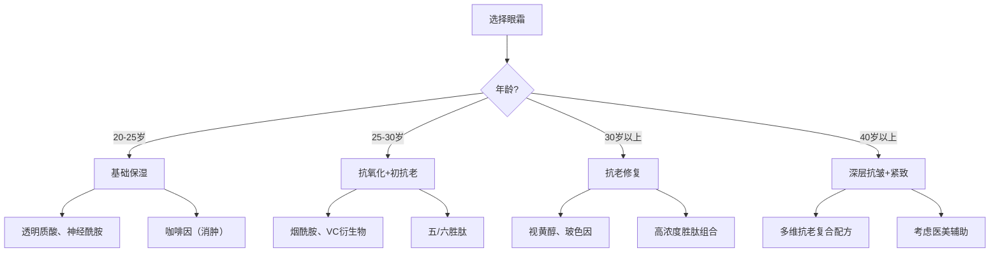

## 六、眼霜推荐

### 6.1 为什么眼周需要专门护理

眼周皮肤是面部最脆弱、最先衰老的区域，理解它的特殊性才能明白为什么"面霜不能代替眼霜"。

#### 6.1.1 眼周皮肤的解剖学特征

| 对比维度 | 眼周皮肤 | 面部其他区域 |
|----------|----------|-------------|
| 厚度 | 0.3-0.5mm，仅为面部皮肤的1/3-1/5 | 1.5-2.0mm |
| 皮脂腺 | 极少，几乎不分泌油脂 | 丰富，T区尤多 |
| 汗腺 | 稀少 | 分布密集 |
| 胶原蛋白 | 含量低，弹性纤维弱 | 相对充足 |
| 血管分布 | 极其丰富，毛细血管网密集 | 相对稀疏 |
| 每日运动 | 眨眼约10000-15000次，肌肉持续运动 | 运动量小 |
| 骨骼支撑 | 眼眶为凹陷结构，缺乏支撑 | 颧骨、下颌支撑充分 |

这些特征导致三个核心问题：**保水能力差**（缺皮脂膜保护）、**代谢废物堆积快**（血管密集但淋巴循环慢）、**机械磨损大**（眨眼+表情肌运动），这三者叠加使眼周成为面部最早出现老化迹象的区域。

#### 6.1.2 眼周问题的成因与分类

**黑眼圈的三种类型及成因：**

| 类型 | 外观特征 | 成因 | 自测方法 |
|------|----------|------|----------|
| 色素型 | 棕色/茶色，上下眼睑均有 | 紫外线损伤、炎症后色素沉着、遗传（东亚人群常见） | 拉伸皮肤后颜色不变淡 |
| 血管型 | 青紫色/蓝紫色，多见于下眼睑 | 眼周微循环不畅、血液含氧量低、皮肤薄透出血管颜色 | 拉伸皮肤后颜色变淡 |
| 结构型 | 有阴影感，泪沟/眼袋造成 | 泪沟凹陷、眼袋突出、脂肪位移 | 改变光照角度后阴影变化 |

大多数人的黑眼圈是**混合型**，即2-3种类型同时存在。例如你可能同时有轻微的色素沉着（棕）+ 血管透出（青紫）+ 泪沟阴影。

**眼袋 vs 水肿型浮肿的区分：**

| 特征 | 真性眼袋 | 水肿型浮肿 |
|------|----------|-----------|
| 出现时间 | 持续存在，逐渐加重 | 晨起明显，午后消退 |
| 触感 | 软而有弹性，脂肪感 | 松软，按压有凹陷 |
| 诱因 | 年龄增长、遗传、眶隔脂肪位移 | 睡前饮水、高盐饮食、睡眠不足 |
| 眼霜效果 | 无法逆转，仅能延缓 | 咖啡因等成分可快速改善 |

**细纹与皱纹的演变：**

眼周细纹的发展遵循"干纹→细纹→动态纹→静态纹→深层皱纹"的递进路径：
- **干纹**：仅在缺水时出现，补水后消失——可逆，保湿即可解决
- **细纹**：即使皮肤水润也隐约可见，光照下明显——早期胶原流失
- **动态纹**：笑、眯眼时加深，放松后减轻——表情肌反复运动
- **静态纹**：不表情时也可见——胶原蛋白和弹性纤维断裂
- **深层皱纹**：明显凹陷的沟壑——真皮层结构性塌陷

眼霜能有效改善前三种，对后两种只能延缓进程，无法逆转。

### 6.2 眼霜的核心成分解析

理解成分才能不被营销话术忽悠。以下按功效分类详解：

#### 6.2.1 保湿锁水类

| 成分 | 作用机制 | 适合场景 | 注意事项 |
|------|----------|----------|----------|
| 透明质酸（玻尿酸） | 吸收自身重量1000倍的水分，在皮肤表面形成保湿膜 | 所有肤质的基础保湿 | 分子量越小渗透越深，大分子量在表面成膜 |
| 神经酰胺 | 补充细胞间脂质，修复皮肤屏障 | 屏障受损、干燥脱皮 | 与胆固醇、脂肪酸按3:1:1比例效果最佳 |
| 角鲨烷 | 模拟皮脂，在表面形成保护膜锁水 | 干性皮肤、秋冬季节 | 油皮少量使用，可能有闷感 |
| 甘油/丁二醇 | 吸湿性保湿剂，从环境中抓取水分 | 所有肤质 | 浓度过高在干燥环境下反而吸皮肤水分 |
| 泛醇（维生素B5） | 渗透性保湿+修复屏障 | 敏感肌、屏障受损 | 温和安全，几乎无刺激 |

#### 6.2.2 抗氧化类

| 成分 | 作用机制 | 稳定性 | 适合场景 |
|------|----------|--------|----------|
| 维生素C（L-AA） | 中和自由基，促进胶原合成，抑制黑色素 | 差，易氧化变黄 | 色素型黑眼圈、初抗老 |
| 维生素E（生育酚） | 脂溶性抗氧化剂，保护细胞膜 | 中等 | 与VC协同使用效果倍增 |
| 烟酰胺（维生素B3） | 抗氧化+美白+修复屏障，多效合一 | 好 | 万金油成分，适合大多数人 |
| 虾青素 | 抗氧化能力是VE的1000倍、VC的6000倍 | 差，易降解 | 抗氧化需求高的人群 |
| EGCG（表没食子儿茶素没食子酸酯） | 绿茶提取物，强效抗氧化+抗炎 | 中等 | 浮肿+抗氧化双重需求 |
| 辅酶Q10 | 线粒体层面抗氧化 | 中等 | 30岁以上的抗氧化需求 |

#### 6.2.3 抗老紧致类

| 成分 | 作用机制 | 起效时间 | 刺激性 |
|------|----------|----------|--------|
| 视黄醇（维A醇） | 加速细胞更新，促进胶原蛋白合成，减少皱纹 | 8-12周 | 较高，需建立耐受 |
| 胜肽（六胜肽/五胜肽） | 信号肽促进胶原合成，神经肽放松表情肌（类肉毒素效果） | 4-8周 | 低，温和 |
| 玻色因（羟丙基四氢吡喃三醇） | 促进糖胺聚糖合成，增加真皮层厚度 | 8-12周 | 极低 |
| 二裂酵母发酵产物溶胞物 | 修复DNA损伤，增强皮肤自我修复能力 | 持续使用 | 极低 |
| 腺苷 | 促进胶原蛋白合成，抗皱 | 4-8周 | 低 |

**胜肽家族详解：**

胜肽是眼霜领域的明星成分，不同数字的胜肽功能不同：
- **三胜肽（GHK-Cu）**：铜胜肽，促进伤口愈合和胶原合成
- **五胜肽（Matrixyl）**：信号肽，告诉成纤维细胞"该造胶原了"
- **六胜肽（Argireline）**：类肉毒素肽，阻断神经肌肉信号传递，减少表情纹
- **棕榈酰四肽-7**：抗炎，减少眼周炎症性衰老

#### 6.2.4 改善循环类

| 成分 | 作用机制 | 适合场景 |
|------|----------|----------|
| 咖啡因 | 收缩血管，促进水分排出，减少浮肿 | 晨起浮肿、血管型黑眼圈 |
| 维生素K | 促进血液凝固因子合成，减少微血管渗漏 | 血管型黑眼圈（临床证据有限） |
| 七叶树提取物 | 强化血管壁，促进微循环 | 血管型黑眼圈、浮肿 |

#### 6.2.5 关于"功效成分浓度"的真相

很多人看成分表觉得"含XX成分"就等于有效，实际上：
- 成分表是按浓度从高到低排列的，但**1%以下的成分可以不分先后**
- 很多有效成分在0.01%-0.1%就有活性，不必追求高浓度
- 某些成分（如VC）必须达到一定浓度才有效（L-AA通常需要5-20%）
- 眼周皮肤薄，刺激性成分（A醇、高浓度VC）浓度应低于面部产品

### 6.3 眼霜选购指南

#### 6.3.1 按年龄段选择

#### 6.3.2 按核心诉求选择

| 核心诉求 | 关键成分 | 产品方向 |
|----------|----------|----------|
| 保湿去干纹 | 透明质酸、神经酰胺、角鲨烷 | 保湿型眼霜/眼部精华 |
| 消肿+黑眼圈 | 咖啡因、EGCG、七叶树提取物 | 咖啡因类眼部精华 |
| 抗初老+淡纹 | 五/六胜肽、烟酰胺 | 胜肽类眼霜 |
| 深层抗老 | 视黄醇、玻色因、二裂酵母 | 高端抗老眼霜 |
| 美白提亮 | VC衍生物、烟酰胺、传明酸 | 美白型眼霜 |

#### 6.3.3 按肤质选择

- **油性皮肤**：选择凝胶/啫喱质地，轻薄不闷。含咖啡因的产品兼具消肿和清爽感
- **干性皮肤**：选择乳霜/膏状质地，含角鲨烷、神经酰胺等封闭性成分
- **混合性皮肤**：乳液质地，兼顾保湿和清爽
- **敏感皮肤**：避开酒精、香精、高浓度活性成分，优先选神经酰胺、泛醇类产品

### 6.4 产品推荐

#### 6.4.1 入门基础款（50-150元）

**The Ordinary 咖啡因眼部精华**

| 项目 | 详情 |
|------|------|
| 价格 | 💰 约60元/30ml |
| 核心成分 | 5% 咖啡因 + EGCG |
| 质地 | 水状精华液，轻薄透明 |
| 功效 | 消除眼部浮肿、改善血管型黑眼圈、紧致眼周 |
| 适合肤质 | 所有肤质，尤其适合油性皮肤 |
| 使用感 | 清爽不油腻，吸收快，无香味 |
| 局限性 | 单纯保湿力不足，干皮需叠加保湿产品；对色素型黑眼圈效果有限 |
| 评价 | 入门级眼部产品首选，30ml的大容量在眼霜产品中极为少见，性价比极高。对晨起浮肿和血管型青紫色黑眼圈有肉眼可见的改善效果。建议搭配保湿眼霜使用。 |

**CeraVe 修复眼霜**

| 项目 | 详情 |
|------|------|
| 价格 | 💰💰 约130-160元/14.2ml |
| 核心成分 | 3种神经酰胺（1/3/6-II）、烟酰胺、透明质酸、MVE缓释技术 |
| 质地 | 轻盈乳霜，不厚重 |
| 功效 | 修复眼周皮肤屏障、持久保湿、舒缓 |
| 适合肤质 | 所有肤质，敏感肌友好 |
| 使用感 | 涂抹顺滑，无香精无刺激，保湿持久 |
| 局限性 | 没有针对黑眼圈和皱纹的活性成分，功效偏基础 |
| 评价 | 成分体系与CeraVe 保湿乳液一致，如果你在用保湿乳液，这款眼霜是天然搭档。主打屏障修复，适合眼周敏感、脱皮、换季不稳定时使用。没有花哨的抗老成分，但基础保湿做得扎实可靠。 |

#### 6.4.2 性价比抗初老款（150-350元）

**珀莱雅 冰陀螺眼霜**

| 项目 | 详情 |
|------|------|
| 价格 | 💰💰 约179元/20g |
| 核心成分 | 六胜肽（Argireline）、咖啡因、冰感陶瓷按摩头 |
| 质地 | 轻薄乳液状 |
| 功效 | 淡化表情纹、消肿、即时紧致感 |
| 适合肤质 | 所有肤质，20-35岁 |
| 使用感 | 陶瓷按摩头冰凉舒适，涂抹过程有仪式感，早晨使用提神醒脑 |
| 局限性 | 六胜肽浓度未公开，长期抗老效果不如视黄醇类产品 |
| 评价 | 国货眼霜的代表之作。六胜肽主打放松表情肌，类肉毒素原理但效果温和得多，需要长期坚持。自带按摩头是加分项，冰感能快速消肿。整体适合25岁左右开始用作日常抗初老。 |

**OLAY 多效修护眼霜**

| 项目 | 详情 |
|------|------|
| 价格 | 💰💰 约200-280元/15ml |
| 核心成分 | 烟酰胺（浓度约5%）、五胜肽（Matrixyl）、泛醇 |
| 质地 | 柔润乳霜，不油腻 |
| 功效 | 淡化细纹、提亮眼周、改善色素型黑眼圈、屏障修复 |
| 适合肤质 | 所有肤质，25岁以上 |
| 使用感 | 延展性好，吸收后有润泽感但不糊眼 |
| 局限性 | 烟酰胺浓度较高，少数人初次使用可能有轻微刺痛，需建立耐受 |
| 评价 | OLAY的烟酰胺技术积累深厚，五胜肽（Matrixyl）是经过大量临床验证的抗老胜肽。这款在200元价位段做到了抗老+美白+保湿三合一，是日常通勤型抗初老眼霜的稳妥选择。 |

#### 6.4.3 经典高端款（400-800元）

**雅诗兰黛 小棕瓶眼霜（Advanced Night Repair Eye）**

| 项目 | 详情 |
|------|------|
| 价格 | 💰💰💰💰 约450-590元/15ml |
| 核心成分 | 二裂酵母发酵产物溶胞物、透明质酸、咖啡因、三肽-32 |
| 质地 | 丰润乳霜，柔滑细腻 |
| 功效 | 深层修复、抗老、淡化细纹和黑眼圈 |
| 适合肤质 | 25岁以上所有肤质 |
| 使用感 | 品牌调性带来的心理满足感+实际功效兼备 |
| 局限性 | 性价比低，同等成分在开架品牌中可以找到更便宜的替代 |
| 评价 | 二裂酵母是雅诗兰黛的核心专利成分，有多项临床研究支持其修复DNA损伤的能力。这款眼霜的配方确实成熟稳定，使用体验优秀，但溢价明显。如果你预算充足且追求品牌体验感，它不会让你失望；如果追求性价比，可以考虑其他选项。 |

**兰蔻 小黑瓶发光眼霜**

| 项目 | 详情 |
|------|------|
| 价格 | 💰💰💰💰 约500-650元/15ml |
| 核心成分 | 二裂酵母、透明质酸、腺苷、云母（即时提亮） |
| 质地 | 丝滑凝霜状 |
| 功效 | 改善黑眼圈、淡化细纹、即时提亮 |
| 适合肤质 | 25岁以上，偏油性皮肤会喜欢它的清爽感 |
| 使用感 | 涂抹后眼周有自然光泽感，不假亮 |
| 局限性 | 含云母是即时物理提亮，卸妆后效果消失，非真正美白 |
| 评价 | 与雅诗兰黛小棕瓶同属"二裂酵母"阵营，但质地更轻薄。云母成分的加入让它有即时提亮效果，适合化妆前打底。如果你想要一款涂完就有好气色的眼霜，它比小棕瓶更合适。 |

#### 6.4.4 进阶专业款

**资生堂 悦薇眼霜（Vital Perfection）**

| 项目 | 详情 |
|------|------|
| 价格 | 💰💰💰💰💰 约600-800元/15ml |
| 核心成分 | VP8活肤配方（当归、柴胡等植物提取复合物）、4MSK（甲氧基水杨酸钾）、视黄醇 |
| 质地 | 浓郁乳霜，滋润度高 |
| 功效 | 深层抗老、改善深层皱纹、紧致提升 |
| 适合肤质 | 30岁以上，干性/中性皮肤 |
| 局限性 | 含视黄醇，白天必须配合防晒，敏感肌需建立耐受 |
| 评价 | 资生堂的抗老科技集大成者，4MSK是资生堂专利美白成分，配合视黄醇实现美白+抗老双通路。适合30+开始认真对抗眼周衰老的人群，滋润度高，秋冬使用体验尤佳。 |

**修丽可 AOX+眼部精华**

| 项目 | 详情 |
|------|------|
| 价格 | 💰💰💰💰💰 约800-1000元/15ml |
| 核心成分 | 5% L-AA（左旋VC）、1%根皮素、0.5%阿魏酸 |
| 质地 | 水状精华，略带油感 |
| 功效 | 强效抗氧化、淡化色素型黑眼圈、促进胶原合成 |
| 适合肤质 | 25岁以上，色素型黑眼圈严重者 |
| 局限性 | 价格高昂；L-AA有一定刺激性，敏感肌慎用 |
| 评价 | 修丽可的VC技术是业界标杆，CE精华的经典配方（VC+VE+阿魏酸）在抗氧化领域有大量临床数据支持。如果你的黑眼圈以色素型为主且预算充足，这是目前市面上最有效的淡化方案之一。 |

### 6.5 眼霜使用方法

#### 6.5.1 正确涂抹手法

错误的涂抹方式会加重眼周负担，甚至拉扯出更多细纹。

**标准步骤：**

1. **取量**：用无名指蘸取米粒大小（单眼约半粒米）
2. **预热**：两无名指指腹轻揉3-5秒，利用体温软化产品
3. **点涂**：将眼霜分别点在下眼眶骨内侧、中间、外侧三个点，以及上眼皮中央
4. **推开**：用无名指指腹从内眼角→下眼睑→外眼角→上眼睑→内眼角，沿眼眶骨画圈轻拍
5. **按压**：最后用无名指轻按太阳穴、眉头下方、内眼角三个穴位，各3秒

**关键原则：**
- 力度控制在"不拉扯皮肤"的程度，想象在用羽毛触碰眼周
- 始终使用无名指，它的力度在五指中最轻
- 不要涂抹到睫毛根部（容易进入眼睛引起刺激）
- 上眼皮只涂中央区域，不要过于靠近眉毛

#### 6.5.2 使用频率与时机

| 时机 | 建议 |
|------|------|
| 早晨 | 清洁→爽肤水→眼霜→精华→乳液/面霜→防晒。含咖啡因的眼霜更适合早上用，帮助消肿 |
| 晚上 | 清洁→爽肤水→眼霜→精华→乳液/面霜。含A醇/胜肽的眼霜适合晚间，利用夜间修复周期 |
| 眼膜/眼贴 | 每周1-2次，可在眼霜前使用，作为密集护理 |

#### 6.5.3 眼霜的正确用量

- **太少**（几乎看不见）= 无效，等于没涂
- **太多**（厚厚的糊一层）= 长脂肪粒，浪费产品
- **正确用量**：单眼约半粒米大小，双眼合计一粒米大小
- 如果涂完后1分钟内眼周仍有明显湿润感，说明偏多了

### 6.6 常见误区与纠正

#### 误区一："面霜可以代替眼霜"

**真相**：面霜的活性成分浓度、渗透压、配方体系是针对面部1.5-2mm厚的皮肤设计的。眼周皮肤仅0.3-0.5mm，直接用面霜可能造成：
- 刺激性成分（如A醇、果酸）引发过敏和红肿
- 过于厚重的质地导致脂肪粒
- 某些面霜含酒精，对眼周皮肤伤害更大

但反过来，如果面霜配方足够温和（无酒精、无刺激性活性成分、质地轻薄），**短期**用来应急是可以的。

#### 误区二："25岁以下不需要眼霜"

**真相**：眼霜的核心功能是**保湿**，而不是抗老。如果你的眼周已经出现干纹（洗完脸后眼周紧绷），即使只有20岁也应该开始使用基础保湿型眼霜。眼霜的使用时机取决于**皮肤状态**，不是年龄。20-25岁用保湿眼霜，不叫"抗老"，叫"防患于未然"。

#### 误区三："眼霜能消除眼袋"

**真相**：真性眼袋是眶隔脂肪位移导致的，属于**结构性问题**。任何眼霜——无论多贵——都无法把脂肪推回去。眼霜能做到的极限是：
- 通过咖啡因等成分**临时**收紧浮肿（对水肿型浮肿有效）
- 通过紧致成分让眼袋周围的皮肤看起来更紧实（视觉上减淡）
- 真性眼袋只有手术（内切/外切去眼袋）才能根本解决

#### 误区四："涂了眼霜会长脂肪粒所以不敢用"

**真相**：脂肪粒（粟丘疹）的成因是角质堵塞了毛囊口或汗腺导管，与眼霜的直接因果关系很弱。真正容易导致脂肪粒的情况是：
- 涂抹过量，皮肤无法吸收
- 使用了过于厚重、封闭性过强的产品
- 眼周有微小伤口（揉眼、卸妆粗暴），愈合过程中角质异常增生

预防方法：控制用量、选择适合肤质的质地、温柔对待眼周皮肤。

#### 误区五："贵的眼霜一定比便宜的好"

**真相**：价格高≠成分好。高端品牌的溢价来自品牌建设、包装设计、营销投入和"使用仪式感"。从纯成分角度看，The Ordinary的5%咖啡因精华（60元/30ml）在消除浮肿方面的效果，不会比800元的贵妇眼霜差。理性评估标准是：**核心成分是否针对你的诉求 + 浓度是否足够 + 配方是否温和**。

### 6.7 眼霜搭配方案

以下是针对不同场景的搭配建议：

#### 场景一：基础保湿（20-25岁/学生党）
- 早晨：The Ordinary咖啡因精华（消肿）→ CeraVe修复眼霜（保湿）
- 晚上：CeraVe修复眼霜（保湿修复）
- 月预算：约100元

#### 场景二：抗初老（25-30岁/上班族）
- 早晨：珀莱雅冰陀螺眼霜（胜肽+按摩消肿）
- 晚上：OLAY多效修护眼霜（烟酰胺+五胜肽抗老）
- 加班/熬夜急救：The Ordinary咖啡因精华湿敷5分钟
- 月预算：约200元

#### 场景三：深层抗老（30岁以上）
- 早晨：兰蔻小黑瓶发光眼霜（即时提亮+抗氧化）
- 晚上：资生堂悦薇眼霜（视黄醇深层抗老）
- 密集护理：每周2次资生堂悦薇眼膜
- 月预算：约500元

#### 场景四：黑眼圈专项改善
- 色素型：早晨修丽可AOX+（VC抗氧化+抑制黑色素）→ 晚上OLAY眼霜（烟酰胺美白）
- 血管型：The Ordinary咖啡因精华（收缩血管）+ 冰敷按摩
- 结构型：眼霜改善有限，建议咨询医美（泪沟填充等）

### 6.8 眼部护理的辅助手段

眼霜是核心但不是全部，以下辅助措施同样重要：

**日常习惯：**
- **防晒**：眼周防晒是一切抗老的基础。戴墨镜是眼周防晒最有效的方式，防晒霜涂到眼眶骨即可（避免进入眼睛）
- **睡眠**：仰卧侧卧会压迫眼周导致水肿和皱纹加深，仰卧最理想（虽然很难做到）
- **减少揉眼**：揉眼会拉扯皮肤、加速胶原断裂、引入细菌
- **控制用眼时间**：长时间盯屏幕导致眼疲劳，间接加重黑眼圈

**辅助工具：**
- **眼部按摩仪**：冷敷/热敷功能交替使用，冷敷消肿（晨起），热敷促进循环（晚间）
- **蒸汽眼罩**：睡前使用15-20分钟，促进血液循环和睡眠质量
- **眼部冰敷**：冷藏的勺子或冰敷眼罩，30秒-1分钟快速消肿（约会急救法）

### 6.9 选购决策树

根据你的实际情况快速定位产品：

1. 你最想解决的问题是什么？
   - **浮肿** → The Ordinary咖啡因精华（必入，无争议的最佳选择）
   - **干纹** → CeraVe修复眼霜（屏障修复保湿）
   - **黑眼圈** → 先判断类型（参考6.1.2），色素型选含VC/烟酰胺的产品，血管型选咖啡因类产品
   - **细纹/初老** → 珀莱雅冰陀螺或OLAY多效修护（胜肽+烟酰胺）
   - **深层抗老** → 资生堂悦薇或雅诗兰黛小棕瓶（视黄醇/二裂酵母）

2. 你的预算区间？
   - **100元以内**：The Ordinary咖啡因精华，一瓶解决浮肿+黑眼圈
   - **100-300元**：CeraVe + 珀莱雅/OLAY，日间消肿+夜间抗老
   - **300-600元**：OLAY + 雅诗兰黛小棕瓶，中端组合
   - **600元以上**：资生堂悦薇 + 修丽可AOX+，全面抗老+美白

3. 你当前的护肤步骤？
   - 如果还没用面霜/精华 → 先把基础护肤做好，眼霜可以暂缓
   - 基础护肤已经稳定 → 加入一款基础保湿眼霜
   - 基础+保湿眼霜已到位 → 根据诉求升级功效型眼霜

***
