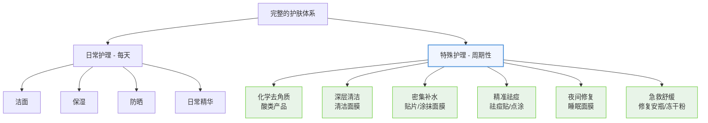
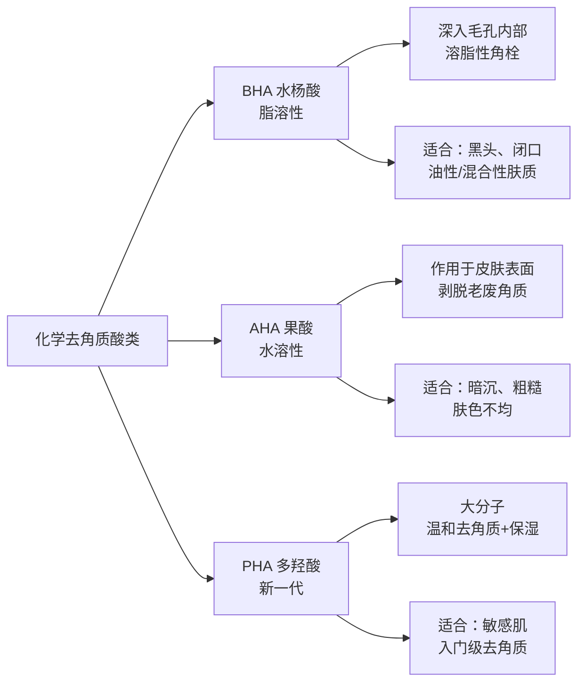
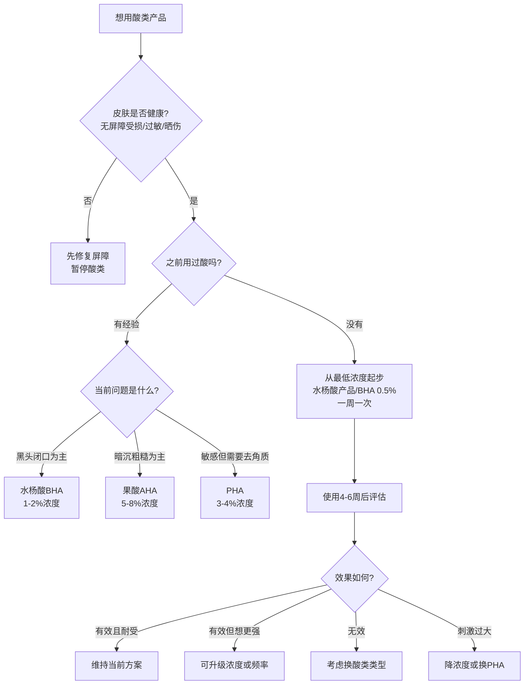
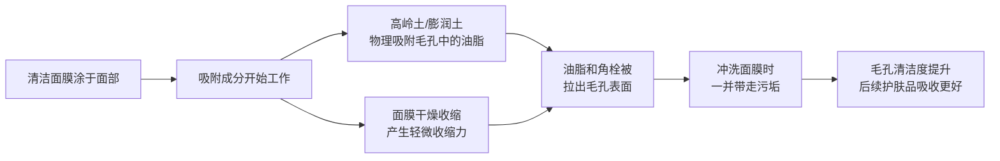
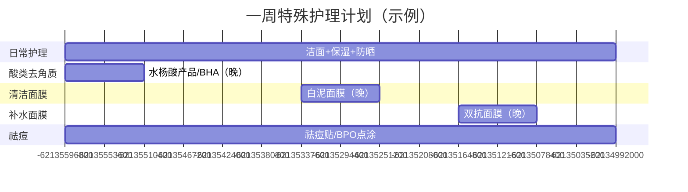

## 七、特殊护理产品推荐

日常护肤的"铁三角"（洁面、保湿、防晒）做好了，皮肤的基本面就有了保障。但如果你想进一步改善闭口、黑头、暗沉、毛孔粗大等特定问题，就需要在日常流程中穿插**特殊护理产品**——它们不是每天必用，而是在特定时间、以特定频率发挥作用，像"精准打击"一样针对具体问题。

### 什么是特殊护理？它和日常护肤有什么区别？

日常护肤解决的是"维持皮肤健康状态"——清洁、保湿、防护，日复一日。特殊护理解决的是"改善特定问题"——去角质、深层清洁、密集修复、祛痘，周期性使用。

两者的本质区别在于**使用频率和活性成分浓度**：

| 维度 | 日常护理 | 特殊护理 |
|------|---------|---------|
| 使用频率 | 每天1-2次 | 每周1-3次 |
| 活性成分浓度 | 温和，适合长期使用 | 较高，需要控制频率 |
| 主要目的 | 维持屏障健康、基础防护 | 改善特定问题（闭口、黑头、暗沉） |
| 风险等级 | 低，正常使用几乎不会出问题 | 中等，使用不当可能刺激屏障 |
| 典型产品 | 洁面、乳液、防晒、日常精华 | 酸类、清洁面膜、祛痘贴、睡眠面膜 |

### 7.1 化学去角质——酸类产品

酸类是特殊护理中最核心、最有效的品类。它们通过溶解角质层的"黏合剂"（角质细胞间的桥粒），加速老废角质脱落，从而改善闭口、黑头、粗糙、暗沉等问题。正确使用酸类产品，是很多皮肤问题的"终局方案"。

#### 酸类的三大门派

| 维度 | BHA（水杨酸） | AHA（果酸） | PHA（多羟酸） |
|------|-------------|------------|-------------|
| 代表成分 | 水杨酸（Salicylic Acid）、辛酰水杨酸（LHA） | 甘醇酸（Glycolic Acid）、乳酸（Lactic Acid）、杏仁酸（Mandelic Acid） | 葡糖酸内酯（Gluconolactone）、乳糖酸（Lactobionic Acid） |
| 溶解性 | **脂溶性**——能渗入毛孔内部 | 水溶性——主要作用于皮肤表面 | 水溶性，分子量最大 |
| 作用深度 | 深入毛孔，溶解油脂和角栓 | 皮肤表面，加速角质脱落 | 表皮最外层，温和剥脱 |
| 起效浓度 | 0.5%-2% | 4%-10%（日常）；30%-70%（医美级） | 4%-10% |
| 最佳pH | 3-4 | 3-4 | 3-5 |
| 适合肤质 | 油性、混合性、痘痘肌 | 所有肤质（敏感肌从低浓度开始） | 敏感肌、干性肌 |
| 适合问题 | 黑头、闭口、毛孔粗大、出油 | 暗沉、粗糙、色沉、鸡皮肤 | 轻度角质堆积、需要保湿+去角质 |
| 刺激性 | 中等 | 中-高（浓度越高刺激越大） | 低 |
| 使用频率 | 一周1-2次 | 一周1-2次 | 一周2-3次 |

#### 你正在使用的：理肤泉水杨酸产品（Effaclar K+）深度解析

你目前一周使用一次水杨酸产品的频率非常合理。水杨酸产品是BHA类产品的经典入门选择，我们来深入理解它：

| 项目 | 详情 |
|------|------|
| 产品全称 | 理肤泉Effaclar K+ |
| 价格 | 💰💰 约150-200元/30ml |
| 核心成分 | 水杨酸（0.5%）+ 辛酰水杨酸LHA（0.5%） |
| 辅助成分 | 烟酰胺（控油）、吡罗克酮乙醇胺盐（抑菌）、理肤泉温泉水（舒缓） |
| 功效机制 | 水杨酸疏通毛孔深层角栓，LHA温和剥脱表层老旧角质，烟酰胺控油提亮 |
| 适用场景 | 闭口粉刺、黑头、T区出油、毛孔粗大 |
| 使用方法 | 洁面后，取黄豆大小，涂抹于T区或有闭口的区域，避开眼周。不需要冲洗，后续正常保湿 |
| 评价 | ✅ 水杨酸类产品的经典之作，低浓度双酸配方兼顾温和性和有效性，非常适合一周一次的周期护理 |

**水杨酸产品的进阶使用建议**：

- **前4周**：一周一次，只涂T区，观察皮肤反应
- **第5-8周**：如果耐受良好，可以扩展到全脸（避开眼周），仍然一周一次
- **第9周起**：如果闭口问题持续，可以增加到一周两次，但中间至少间隔3天
- **重要提醒**：使用水杨酸产品的当晚，不要叠加视黄醇、高浓度维C、其他酸类产品，避免过度刺激

#### 酸类产品全品类推荐

##### BHA类（针对黑头、闭口、油性肤质）

| 产品 | 浓度 | 价格 | 特点 | 适合谁 |
|------|------|------|------|--------|
| **理肤泉Effaclar K+** | 水杨酸0.5%+LHA 0.5% | 💰💰 ~180元/30ml | 双酸配方，温和入门，质地清爽 | BHA入门者、中性偏油肤质 |
| **宝拉珍选2%水杨酸精华** | 水杨酸2% | 💰💰 ~160元/118ml | 2%满浓度，液体配方，不含酒精，配方经典 | 有BHA使用经验、闭口黑头严重者 |
| **The Ordinary 2%水杨酸溶液** | 水杨酸2% | 💰 ~60元/30ml | 超高性价比，配方简单 | 预算有限、想尝试2%浓度 |
| **博乐达超分子水杨酸面膜** | 水杨酸2% | 💰💰 ~280元/100g | 超分子缓释技术，降低刺激性 | 敏感但需要水杨酸的人 |
| **COSRX BHA黑头精华液** | 天然BHA（柳树皮提取物） | 💰 ~90元/100ml | 温和到每天可用，但效果也更温和 | 日常温和去角质 |

##### AHA类（针对暗沉、粗糙、肤色不均）

| 产品 | 类型/浓度 | 价格 | 特点 | 适合谁 |
|------|----------|------|------|--------|
| **The Ordinary 7%甘醇酸爽肤水** | 甘醇酸7% | 💰 ~70元/240ml | 性价比之王，日常爽肤水用法 | AHA入门、预算有限 |
| **Dr.Wu 6%杏仁酸精华** | 杏仁酸6% | 💰💰 ~150元/15ml | 杏仁酸分子量大、渗透温和，亚洲品牌配方更适合亚洲人皮肤 | 暗沉但怕刺激的人 |
| **Paula's Choice 8% AHA凝胶** | 甘醇酸8% | 💰💰 ~200元/100ml | 凝胶质地，缓释配方，低刺激 | 想要更显著去角质效果 |
| **芯丝翠果酸凝胶** | 甘醇酸（浓度因型号而异） | 💰💰💰 ~300元/30ml | 医美背景品牌，专业级配方 | 有果酸使用经验的人 |
| **理肤泉B5多效修复霜** | 非酸类，但常与酸类搭配使用 | 💰💰 ~120元/40ml | 泛醇B5+积雪草苷，修复酸类后的微损伤 | **所有用酸者都应备一支** |

##### PHA类（敏感肌的去角质首选）

| 产品 | 浓度 | 价格 | 特点 | 适合谁 |
|------|------|------|------|--------|
| **芯丝翠活性乳液** | 葡糖酸内酯4% | 💰💰💰 ~350元/40g | PHA概念的创始品牌，保湿+去角质 | 敏感肌、第一次尝试化学去角质 |
| **The Inkey List PHA爽肤水** | 葡糖酸内酯3% | 💰 ~70元/100ml | 平价PHA入门 | 想尝试PHA但预算有限 |

#### 酸类使用的完整操作流程

使用酸类产品不是随便涂上去就行，正确的操作流程直接影响效果和安全性：

**步骤一：皮肤准备**
1. 用温和洁面奶清洁面部
2. 轻轻拍干（不要用力擦），保持皮肤微湿
3. 等待3-5分钟，让皮肤完全干透——酸类产品在干燥皮肤上渗透更均匀

**步骤二：涂抹酸类**
1. 取适量产品于指尖（通常黄豆到1元硬币大小）
2. 避开眼周、嘴角、鼻翼等皮肤薄嫩区域
3. 重点涂抹在问题区域（T区、闭口集中处）
4. 不需要按摩，轻轻涂匀即可

**步骤三：等待与后续**
1. BHA类产品：不需要冲洗，直接进行后续保湿
2. AHA类产品（低浓度）：不需要冲洗，后续保湿
3. AHA类产品（高浓度/面膜型）：按说明书时间后冲洗掉
4. 后续使用保湿乳/霜，锁住水分，缓解可能的干燥

**步骤四：次日防护**
1. 用酸后第二天，**防晒必须加强**——酸类加速角质脱落，新生皮肤对紫外线更敏感
2. 如果出现轻微脱皮，属于正常反应，加强保湿即可

#### 酸类使用的核心安全守则

| 守则 | 说明 | 违反的后果 |
|------|------|-----------|
| **先低浓度，后高浓度** | 新手从0.5%水杨酸或5%果酸起步，每4-6周评估是否升级 | 直接上高浓度，大概率烂脸：泛红、脱皮、刺痛 |
| **先低频率，后高频率** | 一周一次→一周两次→隔天一次，每次频率升级至少观察2周 | 天天用酸，屏障崩溃，皮肤变成敏感肌 |
| **不叠加多种酸** | 同一个护肤步骤中只用一种酸类 | 酸上加酸=化学灼伤 |
| **不与视黄醇同晚使用** | 酸类和视黄醇都加速角质代谢，叠加=过度去角质 | 交替使用：一三五酸类，二四六视黄醇 |
| **必须防晒** | 用酸后角质层变薄，紫外线穿透力增加 | 不防晒反而更黑、更容易色沉 |
| **皮肤状态差时停用** | 屏障受损、晒伤、过敏期间，所有酸类暂停 | 在伤口上撒酸=严重刺激和感染风险 |

### 7.2 清洁面膜——深层清洁的周期性武器

清洁面膜的作用是**物理吸附+化学清洁**的双重机制：面膜中的吸附成分（高岭土、膨润土、活性炭等）在干燥过程中从毛孔中"吸出"多余油脂和角栓，同时面膜基质中的辅助成分软化表层死皮。

#### 清洁面膜的工作原理

#### 清洁面膜分类推荐

| 类型 | 吸附力 | 适合肤质 | 代表产品 |
|------|--------|---------|---------|
| **高岭土面膜** | 中等 | 所有肤质，尤其混合性 | 科颜氏白泥面膜 |
| **膨润土面膜** | 强 | 油性、混合性 | Aztec Secret印度膨润土 |
| **活性炭面膜** | 强-极强 | 油性、毛孔粗大 | 悦诗风吟火山泥面膜 |
| **矿物泥面膜** | 中等 | 所有肤质 | 贝佳斯绿泥 |
| **蜂蜜/燕麦面膜** | 弱（温和清洁） | 干性、敏感性 | 纯天然DIY |

##### （1）科颜氏白泥面膜——清洁面膜的标杆

| 项目 | 详情 |
|------|------|
| 产品全称 | 科颜氏亚马逊白泥面膜（Rare Earth Deep Pore Cleansing Masque） |
| 价格 | 💰💰💰 约280-340元/125ml |
| 核心成分 | 亚马逊白泥（高岭土）、燕麦仁细粉、芦荟提取物 |
| 功效机制 | 高岭土吸附毛孔中的多余油脂和角栓，燕麦仁细粉温和软化角质，芦荟舒缓保湿防止过度干燥 |
| 适用场景 | T区出油、毛孔粗大、黑头明显、护肤品吸收不好 |
| 使用频率 | 一周1次，仅T区；或两周1次全脸 |
| 使用方法 | 洁面后，避开眼周，均匀涂抹一层（约2mm厚），等待10-15分钟至半干（不要等到完全干裂），温水打圈按摩冲洗 |
| 评价 | ✅ 清洁面膜界的"标准答案"，配方温和但吸附力足够，中性偏微油肤质的理想选择。性价比不错，一罐能用3-4个月 |

**使用技巧**：
- 不要等面膜完全干透再洗——完全干透的泥膜会过度吸收皮肤水分，导致干燥紧绷。**半干**（表面微微发白但还有弹性）时洗掉最好
- 冲洗时用温水，以打圈方式按摩，利用水流和手指的物理力辅助清洁
- 用完后立刻涂保湿产品，趁毛孔"打开"的状态加强保湿

##### （2）Aztec Secret印度天然膨润土面膜——性价比之王

| 项目 | 详情 |
|------|------|
| 产品全称 | Aztec Secret Indian Healing Clay |
| 价格 | 💰 约40-60元/454g |
| 核心成分 | 100%食品级膨润土（Calcium Bentonite Clay） |
| 功效机制 | 膨润土具有极强的阳离子交换能力，能强力吸附毛孔中的油脂、毒素和杂质 |
| 适用场景 | 油性皮肤深层清洁、黑头严重、毛孔粗大 |
| 使用方法 | 取1勺粉末，加入等量苹果醋（推荐）或纯净水，搅拌至无颗粒的泥状，涂于面部，等待10-15分钟至半干，温水冲洗 |
| 评价 | ✅ 454g一大罐能用一年以上，吸附力比高岭土更强，但刺激性也略高。用苹果醋调和比用水效果更好——醋的酸性环境能激活膨润土的吸附能力 |

**注意事项**：
- 膨润土面膜吸附力强，**中性偏微油肤质建议只用于T区**，两颊皮肤薄，可能会过度干燥
- 不要使用金属容器或金属勺搅拌——膨润土接触金属会降低活性。用塑料或木制工具
- 初次使用有轻微刺痛感是正常的（膨润土的离子交换反应），但如果刺痛持续超过2分钟或出现泛红，立即洗掉

##### （3）其他值得关注的清洁面膜

| 产品 | 类型 | 价格 | 特点 | 适合谁 |
|------|------|------|------|--------|
| **悦诗风吟火山泥面膜** | 火山灰 | 💰 ~80元/100ml | 韩系平价选择，清洁力适中 | 学生党入门 |
| **贝佳斯绿泥** | 意大利矿物泥 | 💰💰 ~200元/430ml | 经典老牌，清洁力强但含薄荷醇，有凉感 | 油性、非敏感肌 |
| **格莱魅发光面膜** | 高岭土+果酸 | 💰💰💰 ~400元/50ml | 清洁+去角质二合一，效果强 | 进阶用户 |
| **Origins活性炭毛孔清洁面膜** | 活性炭 | 💰💰 ~250元/75ml | 活性炭吸附+高岭土双重清洁 | 毛孔问题严重者 |
| **Swisse蜂蜜面膜** | 麦卢卡蜂蜜+高岭土 | 💰 ~80元/70g | 温和清洁+抗菌 | 干性/敏感性想做清洁面膜 |

#### 清洁面膜的使用节奏

| 肤质 | 推荐频率 | 重点区域 | 注意事项 |
|------|---------|---------|---------|
| 油性 | 一周1-2次 | 全脸或T区+下巴 | 不要天天用，皮脂膜也需要恢复 |
| 混合性（偏油/偏干） | 一周1次 | T区为主 | 两颊薄涂或不涂 |
| 中性偏微油（你的情况） | 一周1次 | T区 | 两颊可以跳过或薄涂 |
| 干性 | 两周1次 | 仅T区 | 选温和型（高岭土），避免膨润土 |
| 敏感性 | 一个月1次或不用 | 仅鼻头 | 选最温和的配方，或用PHAs替代 |

### 7.3 补水面膜——密集保湿的急救方案

补水面膜是日常护肤的"加强版"——当皮肤出现干燥、起皮、换季不适，或者你需要在重要场合前快速改善肤质时，补水面膜能在短时间内给皮肤"灌水"。

#### 贴片面膜 vs 涂抹面膜

| 维度 | 贴片面膜 | 涂抹式保湿面膜 |
|------|---------|--------------|
| 原理 | 精华液浸润膜布，通过封闭作用促进透皮吸收 | 乳霜/凝胶状，在皮肤表面形成保湿膜 |
| 使用时长 | 15-20分钟 | 10-30分钟（或过夜） |
| 即时效果 | ★★★★★ 非常明显，用完立刻水润 | ★★★★ 持续性更好 |
| 方便程度 | ★★★★★ 撕开就用 | ★★★ 需要涂抹和清洗 |
| 环保性 | ★★ 产生大量包装和膜布垃圾 | ★★★★ 罐装更环保 |
| 适合场景 | 急救补水、约会前、换季敏感 | 日常保湿加强、晚间修复 |

#### 补水面膜推荐

##### 贴片面膜

| 产品 | 价格 | 核心成分 | 特点 | 适合谁 |
|------|------|---------|------|--------|
| **珀莱雅双抗面膜** | 💰 ~5-8元/片 | 虾青素+麦角硫因 | 与抗氧化精华同系列，抗氧化+补水，成分协同 | 已在用抗氧化精华的人（你的情况✅） |
| **春雨蜂蜜面膜** | 💰 ~3-5元/片 | 蜂蜜提取物、透明质酸 | 经典平价补水面膜，温和不刺激 | 日常补水、学生党 |
| **可复美类人胶原蛋白敷料** | 💰💰 ~15-20元/片 | 类人胶原蛋白 | 医美背景，修复+补水，适合术后或敏感期 | 屏障受损、医美术后 |
| **敷尔佳白膜** | 💰💰 ~12-18元/片 | 透明质酸 | 医用敷料级别，温和安全 | 敏感肌、换季补水 |
| **SK-II前男友面膜** | 💰💰💰💰 ~80元/片 | Pitera（半乳糖酵母发酵滤液） | 效果确实好但价格夸张，非必要不推荐 | 预算充足、特殊场合急救 |

##### 涂抹式保湿面膜

| 产品 | 价格 | 核心成分 | 特点 | 适合谁 |
|------|------|---------|------|--------|
| **兰芝睡眠面膜** | 💰💰 ~120元/70ml | 透明质酸、月见草根提取物 | 免洗型，睡前涂一层即可 | 懒人补水 |
| **薇诺娜舒敏保湿面膜** | 💰💰 ~100元/75g | 马齿苋提取物、透明质酸 | 国货敏感肌专用品牌，温和度极高 | 敏感肌补水 |
| **凡士林厚涂法** | 💰 ~20元/100g | 凡士林（矿脂） | 极致性价比——保湿乳之后薄涂一层凡士林，封闭锁水效果顶级 | 干燥季节、极致性价比追求者 |

#### 补水面膜的正确使用方法

**贴片面膜使用规范**：

1. **洁面后使用**——面膜前不需要涂其他产品，干净的皮肤吸收效率最高
2. **敷15-20分钟**——不要超过20分钟。膜布干燥后会反向吸收皮肤水分，敷越久越干（这是最常见的错误）
3. **揭掉后轻拍**——让残余精华液吸收，不需要冲洗
4. **立刻涂乳液/面霜**——面膜补水后需要"锁水"，否则水分会快速蒸发，等于白敷

**频率控制**：
- 普通补水面膜：一周1-2次足够
- 医用修复面膜：按需使用，屏障受损期可以每天1片（连续不超过7天）
- 不建议每天用普通贴片面膜——过度水合会破坏角质层结构

### 7.4 精准祛痘——点涂产品与祛痘贴

当痘痘冒出来时，全脸用酸类产品是"地毯式轰炸"，而精准祛痘产品是"定点清除"——只作用于痘痘本身，不影响周围健康皮肤。

#### 祛痘产品的两大流派

| 流派 | 机制 | 代表成分 | 适合的痘痘类型 |
|------|------|---------|--------------|
| **化学溶解型** | 渗透痘痘，溶解堵塞物，杀菌 | 水杨酸、过氧化苯甲酰（BPO）、壬二酸 | 闭口、黑头、红肿痘 |
| **物理吸附/保护型** | 吸收分泌物，创造无菌环境，促进愈合 | 水胶体（痘痘贴）、茶树精油 | 白头脓包、已破口的痘痘 |

#### 产品推荐

##### （1）过氧化苯甲酰（BPO）——祛痘金标准

过氧化苯甲酰是全球皮肤科医生公认的一线祛痘成分，它通过释放活性氧杀灭痤疮丙酸杆菌（导致痘痘的核心细菌），而且**不会产生耐药性**——这是它比抗生素类祛痘产品优越的核心原因。

| 产品 | 浓度 | 价格 | 特点 |
|------|------|------|------|
| **班赛（Benzihex）过氧化苯甲酰凝胶** | 5% | 💰 ~30-50元/20g | 国内最容易买到的BPO，OTC药品 |
| **露得清2.5%BPO祛痘膏** | 2.5% | 💰 ~60元/30g | 2.5%浓度与5%效果接近但更温和 |
| **La Roche-Posay Effaclar Duo** | BPO 5.5%（美国版） | 💰💰 ~200元/40ml | BPO+水杨酸复配，双效祛痘 |

**使用要点**：
- **点涂**：只涂在痘痘上，不要大面积涂抹——BPO有漂白性，会氧化织物和毛巾
- **浓度选择**：2.5%和5%的祛痘效果几乎没有差别，但2.5%的刺激性明显更低。新手从2.5%起步
- **建立耐受**：前3天涂5-10分钟就洗掉，之后逐渐延长到过夜
- **配合保湿**：BPO会使皮肤干燥，使用后30分钟涂保湿乳

##### （2）祛痘贴——物理型祛痘神器

祛痘贴（水胶体贴）是近年来最实用的祛痘创新产品，它的原理非常简单：水胶体材料吸收痘痘分泌物，同时创造一个湿润、无菌的封闭环境，加速痘痘愈合，还能防止你手贱去挤。

| 产品 | 价格 | 特点 | 适合场景 |
|------|------|------|---------|
| **3M Nexcare痘痘贴** | 💰 ~30元/盒 | 经典款，粘附力强，吸收力好 | 白头脓包、已冒头的痘痘 |
| **VT老虎痘痘贴** | 💰 ~25元/盒 | 含积雪草成分，修复+吸附 | 需要修复功能的痘痘 |
| **COSRX痘痘贴** | 💰 ~20元/盒 | 韩国爆款，薄款隐形度高 | 日间使用（不影响外观） |
| **Olive Young痘痘贴** | 💰 ~15元/盒 | 性价比高，多种尺寸 | 家庭常备 |

**祛痘贴使用指南**：

1. **时机**：痘痘已经冒白头、或者已经被挤破（是的，如果你已经手贱挤了，贴上痘痘贴比让它裸露好得多）的时候使用效果最佳
2. **方法**：清洁痘痘区域，贴上痘痘贴，按压3秒确保粘附
3. **更换**：贴片变白（吸收了分泌物）后更换，通常4-8小时
4. **不要在闭口上用**——痘痘贴对没有开口的闭口无效，它需要接触到分泌物才能工作

##### （3）壬二酸——祛痘+淡印的双料选手

壬二酸（Azelaic Acid）是一个被严重低估的成分——它同时具有祛痘、淡印、抗炎、抗菌四重功效，而且温和度远高于水杨酸和BPO。

| 产品 | 浓度 | 价格 | 特点 |
|------|------|------|------|
| **The Ordinary壬二酸10%悬浮液** | 10% | 💰 ~70元/30ml | 入门级浓度，注意悬浮液质地可能搓泥 |
| **Finacea壬二酸凝胶** | 15% | 💰💰 ~150元/30g | 处方级，澳洲/欧洲常用 |
| **博乐达壬二酸面膜** | 15% | 💰💰 ~260元/100g | 超分子缓释，温和度好 |

#### 你的祛痘策略建议

根据你目前的护肤方案（水杨酸产品一周一次 + 抗氧化精华 + 保湿乳液），建议的祛痘组合：

- **预防性**：水杨酸产品一周一次，保持毛孔通畅
- **偶尔冒痘时**：祛痘贴（物理吸附）+ 次日加强防晒
- **持续反复冒痘区域**：在水杨酸产品之外，局部使用2.5% BPO点涂
- **痘印淡化**：抗氧化精华（抗氧化防色沉）+ 水杨酸产品（加速代谢）已经能覆盖，如果痘印严重可以加入壬二酸

### 7.5 睡眠面膜——懒人的密集修复方案

睡眠面膜本质上是一层**高封闭性保湿膜**——在你睡觉的时候持续为皮肤提供保湿和修复成分，同时通过封闭作用减少经皮水分流失（TEWL）。

#### 睡眠面膜 vs 晚间面霜

| 维度 | 睡眠面膜 | 晚间面霜 |
|------|---------|---------|
| 封闭性 | 极高——形成保护膜 | 中等 |
| 活性成分 | 以保湿修复为主 | 可含视黄醇、烟酰胺等功效成分 |
| 使用频率 | 一周1-3次 | 每天 |
| 肤感 | 偏黏、有膜感 | 更接近日常乳霜 |
| 核心价值 | 密集补水、急救修复 | 日常维护 |

**对于你（中性偏微油）的建议**：睡眠面膜不是必需品，但在以下场景很有价值——
- 换季皮肤干燥脱皮时
- 用酸类产品后需要加强保湿修复时
- 空调房待了一整天，皮肤紧绷时
- 第二天有重要场合，想要皮肤状态好一点时

| 产品 | 价格 | 核心成分 | 特点 |
|------|------|---------|------|
| **兰芝睡眠面膜** | 💰💰 ~120元/70ml | 透明质酸、月见草根 | 免洗经典款，补水效果好 |
| **珀莱雅睡眠面膜** | 💰 ~60元/120g | 珊藻提取物、透明质酸 | 国货平价替代 |
| **雪花秀雨润面膜** | 💰💰💰 ~300元/120ml | 人参提取物 | 滋养修复，但质地偏厚，油皮慎选 |
| **薇诺娜舒敏保湿睡眠面膜** | 💰💰 ~100元/75g | 马齿苋、透明质酸 | 敏感肌专用 |

### 7.6 急救修复——安瓶、冻干粉、修复精华

当皮肤出现突发状况——过敏泛红、晒伤脱皮、医美术后、换季大面积不适——需要的是高浓度、少添加、快速起效的"急救型"产品。

#### 什么情况下需要急救修复？

| 皮肤状态 | 典型症状 | 需要什么 |
|---------|---------|---------|
| **屏障受损** | 泛红、刺痛、紧绷、脱皮 | 神经酰胺、泛醇B5、角鲨烷 |
| **晒后修复** | 发红、发热、刺痛 | 泛醇、积雪草、冷敷 |
| **过敏反应** | 瘙痒、红疹、肿胀 | 停用一切功效产品，冷敷+就医 |
| **医美术后** | 红肿、结痂、敏感 | 严格遵医嘱，使用医用修复产品 |
| **酸类过度使用** | 大面积脱皮、灼烧感 | 停酸，纯保湿修复至少2周 |

#### 推荐产品

| 产品 | 类型 | 价格 | 核心成分 | 适用场景 |
|------|------|------|---------|---------|
| **理肤泉B5多效修复霜** | 修复霜 | 💰💰 ~120元/40ml | 泛醇5%+积雪草苷+铜锌锰 | 屏障受损、酸后修复、万能修复——**每个用酸的人都该备一支** |
| **可复美类人胶原蛋白敷料** | 医用敷料 | 💰💰 ~15元/片 | 类人胶原蛋白 | 医美术后、严重屏障受损 |
| **Haa虾青素抗氧化精华** | 安瓶 | 💰 ~80元/盒 | 虾青素、传明酸 | 抗氧化急救、晒后修复 |
| **玉泽皮肤屏障修护保湿霜** | 修复霜 | 💰💰 ~120元/50g | 神经酰胺、植物鞘氨醇 | 国货屏障修复代表作 |
| **珂润保湿面霜** | 保湿修复霜 | 💰💰 ~130元/40g | 神经酰胺（鲸蜡基-PG羟乙基棕榈酰胺） | 敏感肌日常+急救均可 |

### 7.7 其他值得关注的特殊护理品类

#### （1）唇部护理

嘴唇没有皮脂腺，角质层极薄（只有面部皮肤的1/3），是全身最脆弱的皮肤区域之一。唇部护理常被男性忽视，但干裂脱皮的嘴唇会严重影响整体形象。

| 产品 | 价格 | 特点 |
|------|------|------|
| **凡士林经典润唇膏** | 💰 ~15元/7g | 极简成分，封闭锁水，睡前厚涂当唇膜 |
| **资生堂Moilip药用唇膏** | 💰 ~40元/8g | 含维生素B6和尿囊素，修复干裂效果好 |
| **小蜜蜂Burt's Bees蜂蜡唇膏** | 💰 ~30元/4.25g | 天然成分，日常使用 |
| **Laneige唇膜** | 💰💰 ~80元/20g | 夜间修复唇膜，适合唇部严重干燥 |

**唇部护理要点**：
- 不要舔嘴唇——唾液蒸发会带走更多水分，越舔越干
- 润唇膏随时备着，感觉干就涂
- 睡前厚涂凡士林或唇膜，夜间修复效率最高
- 如果唇部持续干裂脱皮超过2周，可能需要排除唇炎

#### （2）颈部护理

颈部皮肤比面部薄，皮脂腺更少，胶原蛋白流失更快——所以很多人"脸很年轻，脖子显老"。但颈部不需要单独买一套产品，把面部护肤品"顺手"延伸到颈部就够了。

**具体做法**：
- 洁面时顺带到颈部
- 涂精华、乳液、防晒时，从下巴向下延伸到锁骨
- 颈部皮肤更薄，酸类产品和视黄醇的用量要减半
- 不需要单独买"颈霜"——面部精华和乳液完全够用

#### （3）磨砂膏——物理去角质

化学去角质（酸类）已经足够高效，物理磨砂膏在现代护肤中不是必需品。如果你仍然想用：

| 产品 | 价格 | 磨砂颗粒 | 适合频率 |
|------|------|---------|---------|
| **St.Ives杏子磨砂膏** | 💰 ~30元/170g | 核桃壳粉（颗粒粗） | 一周1次，力度要轻 |
| **Curel珂润去角质凝胶** | 💰💰 ~100元/100g | 化学+物理混合，温和 | 一周1-2次 |
| **Rosette去角质凝胶** | 💰 ~40元/120g | 果酸+凝胶搓泥 | 一周1次 |

**磨砂膏使用的铁律**：
- **力度**：用手指轻轻带过即可，不是越用力越干净。用力摩擦只会损伤角质层
- **频率**：一周最多1次，与酸类产品错开使用
- **避开**：痘痘区域、炎症区域、破损皮肤
- **你的建议**：既然已经在用水杨酸产品（化学去角质），不需要额外用磨砂膏。化学去角质更精准、更均匀、更可控

### 7.8 特殊护理产品的周计划模板

把以上所有特殊护理产品编排进一周的时间表中，才能做到科学、不冲突、不过度：

以下是一个具体的时间安排，以**中性偏微油肤质、一周一次水杨酸产品**为基础：

| 星期 | 早间 | 晚间特殊护理 | 说明 |
|------|------|-------------|------|
| **周一** | 洁面→抗氧化精华→保湿乳液→防晒 | 洁面→**水杨酸产品（T区）**→保湿乳液 | 水杨酸产品去角质日，不用其他活性成分 |
| **周二** | 洁面→抗氧化精华→保湿乳液→防晒 | 洁面→保湿乳液 | 休息日，让皮肤从酸类中恢复 |
| **周三** | 洁面→抗氧化精华→保湿乳液→防晒 | 洁面→保湿乳液 | 休息日 |
| **周四** | 洁面→抗氧化精华→保湿乳液→防晒 | 洁面→**白泥面膜（T区）**→保湿乳液 | 深层清洁日 |
| **周五** | 洁面→抗氧化精华→保湿乳液→防晒 | 洁面→保湿乳液 | 休息日 |
| **周六** | 洁面→抗氧化精华→保湿乳液→防晒 | 洁面→**双抗面膜**→保湿乳液 | 密集补水日 |
| **周日** | 洁面→抗氧化精华→保湿乳液→防晒 | 洁面→保湿乳液 | 休息日 |

**时间表的核心逻辑**：
- 酸类和清洁面膜不要放在同一天——两者都对角质有影响，叠加使用风险高
- 酸类后第二天不做任何特殊护理，给皮肤恢复时间
- 补水面膜放在清洁面膜后两天——先清后补，效果最好
- 每周至少3天"纯休息"——只做日常护理，不做任何特殊护理

### 7.9 常见误区与纠正

| 误区 | 真相 | 后果 |
|------|------|------|
| "清洁面膜可以收缩毛孔" | 泥膜只是暂时清理了毛孔中的油脂，视觉上看起来小了。毛孔大小由基因和胶原蛋白决定，护肤品无法真正改变 | 失望，进而频繁使用泥膜，损伤屏障 |
| "补水面膜天天敷皮肤会更好" | 过度水合破坏角质层结构，皮肤变得更敏感。角质层的"砖墙结构"需要正常的含水量，不是越湿越好 | 皮肤敏感、屏障功能下降 |
| "痘痘贴能治痘痘" | 痘痘贴只处理已经冒头的痘痘，对深层的闭口、囊肿无效。它是"善后"手段，不是"预防"手段 | 忽视根本原因，痘痘反复 |
| "酸类产品会让皮肤变薄" | 正确使用酸类只是加速老废角质的脱落，不会减少正常角质层的厚度。长期合理用酸反而能促进角质层更新，让皮肤更健康 | 因恐惧而放弃最有效的改善手段 |
| "面膜敷越久越吸收" | 面膜精华液在前10-15分钟已被充分吸收，之后膜布干燥会反向吸收皮肤水分 | 敷30分钟反而比敷15分钟更干 |
| "天然的就是安全的" | 膨润土、蜂蜜、燕麦等天然成分也可能致敏。天然≠无害，化学≠有毒 | 盲信天然产品，忽略过敏风险 |
| "用完酸类产品马上用修复霜是浪费" | 用酸后皮肤屏障短暂变弱，及时涂修复霜能减少酸类的副作用，是科学的"减负"策略 | 不做修复，酸类副作用放大 |

### 7.10 进阶：医美级特殊护理（仅供了解）

如果你的皮肤问题严重到护肤品无法解决（大面积痤疮、深层色斑、严重光老化），医美手段可能是更高效的选择。以下是几种常见的医美级"特殊护理"：

| 项目 | 适合问题 | 原理 | 单次价格 | 疗程 |
|------|---------|------|---------|------|
| **果酸焕肤** | 闭口、暗沉、色沉 | 高浓度果酸（30%-70%）化学剥脱 | 💰💰💰 300-800元/次 | 4-6次，间隔2-4周 |
| **水杨酸焕肤** | 痘痘、油性皮肤 | 超分子水杨酸温和焕肤 | 💰💰💰 400-1000元/次 | 3-5次 |
| **光子嫩肤** | 色沉、红血丝、毛孔 | 强脉冲光（IPL）分解色素 | 💰💰💰💰 1000-3000元/次 | 3-5次 |
| **微针** | 痘坑、毛孔、色沉 | 微针穿刺刺激胶原再生 | 💰💰💰 500-1500元/次 | 3-6次 |

**重要提醒**：医美≠无风险。必须选择正规医疗机构，由有执业资质的医生操作。医美术后需要严格遵循修复方案——这时前面提到的修复产品（理肤泉B5、可复美敷料等）就派上用场了。

### 本节核心要点

1. **特殊护理是日常护理的补充**，不是替代——铁三角（洁面+保湿+防晒）永远是基础
2. **酸类产品**是改善闭口、黑头、暗沉最有效的手段，你正在用的水杨酸产品是优秀的BHA入门选择
3. **清洁面膜**一周一次，T区为主，不要等到完全干透再洗
4. **补水面膜**不是越频繁越好，一周1-2次，敷完必须涂乳液锁水
5. **祛痘贴**是处理已冒头痘痘的最佳工具，BPO是顽固痘痘的金标准
6. **修复产品**（理肤泉B5）是所有用酸者的必备后盾
7. **节奏感**比产品本身更重要——酸类、清洁面膜、补水面膜错开使用，每周留出至少3天纯休息日

***
