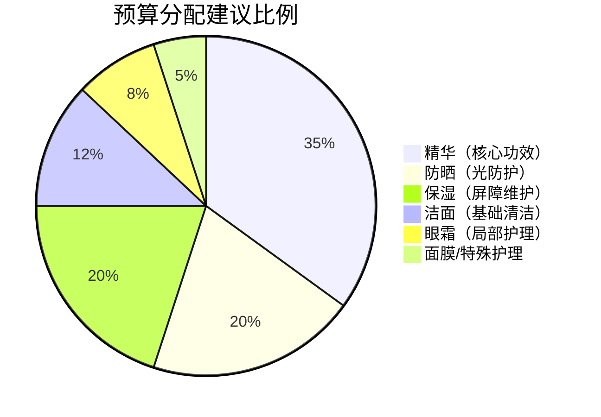
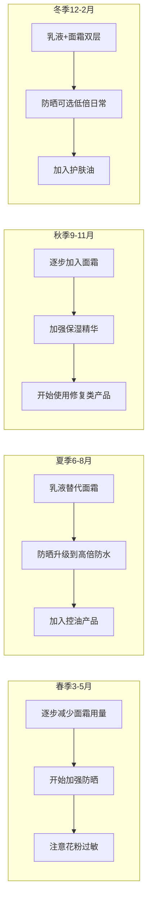

## 八、不同预算的购物清单

护肤不是有钱人的专利，但也不是"随便买点就行"的事。核心矛盾在于：**有限的预算如何分配到最有效的产品上**。本节不只给你一张购物清单——而是教你一套预算分配的思维框架，让你无论手里有多少钱，都能做出最聪明的选择。

### 8.1 预算分配的核心逻辑：钱该花在哪

在讨论具体数字之前，先理解一个关键问题：**护肤步骤的投入产出比是不一样的**。把1000元全花在洗面奶上是浪费，全花在精华上才是正道。

#### 8.1.1 护肤步骤的优先级排序

不同护肤步骤对皮肤状态的贡献度差异巨大。以下是基于皮肤科学的优先级排序：

| 优先级 | 步骤 | 对皮肤的影响 | 预算占比建议 | 原因 |
|--------|------|-------------|-------------|------|
| ⭐⭐⭐⭐⭐ | 防晒 | 防止80%的皮肤老化 | 15-25% | 光老化是皮肤衰老的首要外因，防晒是性价比最高的抗老手段 |
| ⭐⭐⭐⭐⭐ | 精华 | 针对性解决核心问题 | 25-40% | 活性成分浓度最高、渗透最深，是真正"治病"的步骤 |
| ⭐⭐⭐⭐ | 保湿（乳液/面霜） | 维持屏障健康 | 15-25% | 屏障受损会导致一切问题加剧，保湿是基础中的基础 |
| ⭐⭐⭐ | 洁面 | 清洁但不过度 | 10-15% | 洗干净就行，不需要花哨功能，过度清洁反而有害 |
| ⭐⭐ | 眼霜 | 针对眼周特殊需求 | 10-15% | 眼周皮肤薄、易老化，但普通面霜也能基本覆盖 |
| ⭐ | 面膜/特殊护理 | 锦上添花 | 5-10% | 非必需，效果是暂时性的，预算紧张时可以省略 |

#### 8.1.2 "省"与"投"的黄金法则

**该省钱的地方**：洁面、面膜、爽肤水。这些步骤的产品差异主要体现在肤感和香味上，对最终护肤效果的影响有限。一款30元的氨基酸洁面和一款300元的氨基酸洁面，在清洁层面的区别远没有价格差距那么大。

**该投资的地方**：精华、防晒。精华是活性成分的载体，配方技术（渗透技术、缓释技术、稳定性处理）直接决定效果，这里的差距是真实的。防晒则关乎使用体验——防晒力够不够、会不会泛白、油不油、要不要补涂——便宜的防晒往往让你不想用，不想用的防晒等于没有。

**一个实用的心算公式**：单次使用成本 = 产品价格 ÷ 预计使用次数。一管60元用60天的防晒，单次1元；一管230元用90天的防晒，单次2.5元。但后者可能让你愿意每天涂——那么2.5元/次的防晒，实际效果远好于1元/次但被你闲置在抽屉里的那管。

### 8.2 五档预算方案：从生存级到享受级

以下按月均花费分五档，每档都给出完整早晚流程的产品组合。**所有价格为2024-2025年国内电商日常价（非大促价），实际购买时大促期间通常可再降20-40%**。

#### 8.2.1 生存级：月均50-100元

**适用人群**：预算极度紧张的学生、刚工作的年轻人、想先试试护肤但不想投入太多的人。

**核心策略**：只保留最必要的三步——洁面+保湿+防晒。精华暂时用不起可以先不做，但防晒不能省。

| 品类 | 推荐产品 | 参考价 | 容量/使用时长 | 单次成本 |
|------|---------|--------|-------------|---------|
| 洁面 | 旁氏米粹氨基酸洁面乳 | ~25元 | 120g / 约2个月 | ~0.4元 |
| 保湿 | 标婷维E乳 | ~15元 | 100g / 约2个月 | ~0.25元 |
| 防晒 | 碧柔水活防晒保湿凝蜜 | ~55元 | 50g / 约1.5个月 | ~0.6元 |

**月均花费**：约50-70元

**这套方案能做什么**：维持基本的清洁和屏障健康，防止紫外线对皮肤的持续伤害。不能解决痘痘、色斑、衰老等问题，但能保证皮肤不会因为"啥都不涂"而持续变差。

**不能省的底线**：哪怕只有50块，防晒也必须买。紫外线造成的光老化是累积性的、不可逆的——20岁不防晒的代价要在30岁以后才显现，但那时候修复的成本是防晒的100倍。

**可选加分项**：如果偶尔能多花30-40元，加一瓶The Ordinary咖啡因眼部精华（~60元，用3个月），解决黑眼圈和浮肿问题。

#### 8.2.2 基础级：月均150-250元

**适用人群**：有稳定收入但预算有限的上班族、注重性价比的学生。

**核心策略**：在生存级基础上加入一款基础精华，开始解决具体皮肤问题。这个档位已经能建立一套完整的护肤流程。

**早晚流程**：

| 品类 | 推荐产品 | 参考价 | 容量/使用时长 | 单次成本 |
|------|---------|--------|-------------|---------|
| 洁面 | 旁氏米粹氨基酸洁面乳 | ~25元 | 120g / 约2个月 | ~0.4元 |
| 精华 | 珀莱雅抗氧化精华2.0 | ~170元 | 30ml / 约2-3个月 | ~2.5元 |
| 乳液 | 适乐肤保湿乳液 | ~140元 | 52ml / 约3个月 | ~1.5元 |
| 防晒 | 碧柔水活防晒保湿凝蜜 | ~55元 | 50g / 约1.5个月 | ~0.6元 |

**月均花费**：约150-200元

**为什么选这几款**：

- **旁氏米粹**：氨基酸表活，pH值接近皮肤（5.5-6.5），清洁力足够日常使用，不会破坏屏障。市面上同价位（20-30元）的氨基酸洁面里，它的配方成熟度和品控稳定性是最优之一。
- **珀莱雅抗氧化精华**：虾青素+麦角硫因的抗氧化组合，配合脱羧肌肽抗糖化。在200元以内的精华中，它的抗氧化配方完整度几乎没有对手。注意只在早上使用——抗氧化精华的核心价值是配合防晒对抗日间自由基。
- **适乐肤保湿乳液**：含三重神经酰胺（1/3/6-II），模拟皮肤天然脂质结构，修复屏障。无香精、无酒精、配方极简，敏感肌也能用。"PM"指的是夜间修护，但实际早晚都能用。
- **碧柔防晒**：化学防晒，质地轻薄不泛白，日常通勤足够。缺点是防水性一般，出汗多需要补涂。

**早晚流程安排**：

| 时段 | 步骤 | 产品 | 用量 |
|------|------|------|------|
| 早上 | 1.洁面 | 清水或旁氏（出油多才用） | 黄豆大小 |
| | 2.精华 | 珀莱雅抗氧化精华 | 2-3泵 |
| | 3.乳液 | 适乐肤保湿乳液 | 1泵 |
| | 4.防晒 | 碧柔防晒 | 一元硬币大小 |
| 晚上 | 1.洁面 | 旁氏米粹 | 黄豆大小 |
| | 2.精华 | 珀莱雅抗氧化精华（或其他功效精华） | 2-3泵 |
| | 3.乳液 | 适乐肤保湿乳液 | 1-2泵 |

#### 8.2.3 进阶级：月均300-500元

**适用人群**：有一定护肤经验、开始关注抗老/美白/祛痘等具体功效的人。

**核心策略**：在基础保湿之上叠加功效型精华，引入眼霜和周期性深层清洁。这个档位可以针对性解决大部分皮肤问题。

| 品类 | 推荐产品 | 参考价 | 容量/使用时长 | 选择理由 |
|------|---------|--------|-------------|---------|
| 洁面 | 芙丽芳丝净润洗面霜 | ~150元 | 100g / 约3个月 | 氨基酸表活+枣果提取物，温和度极高，敏感肌首选 |
| 抗氧化精华 | 珀莱雅抗氧化精华2.0 | ~170元 | 30ml / 约2-3个月 | 日间抗氧化，配合防晒对抗光老化 |
| 功效精华 | 珀莱雅红宝石精华3.0 | ~230元 | 30ml / 约2-3个月 | 六胜肽+维A醇衍生物，平价抗老精华天花板 |
| 乳液 | 适乐肤保湿乳液 | ~140元 | 52ml / 约3个月 | 神经酰胺修复屏障 |
| 防晒 | 理肤泉大哥大防晒 | ~230元 | 50ml / 约2个月 | 麦色滤技术，全波段防护，防护力顶级 |
| 眼霜 | 珀莱雅冰陀螺眼霜 | ~180元 | 20g / 约3个月 | 咖啡因+胜肽，针对黑眼圈和细纹 |
| 清洁面膜 | 科颜氏白泥面膜 | ~300元 | 142g / 约6-8个月 | 亚马逊白泥吸附毛孔油脂，一周一次 |

**月均花费**：约350-450元

**升级点分析**（相比基础级多了什么）：

1. **洁面升级**：芙丽芳丝比旁氏温和度更高，长期使用对屏障更友好。但如果你用旁氏没有不适，省下这100元完全合理——洁面的升级优先级是最低的。
2. **双精华策略**：早上用抗氧化精华（双抗），晚上用功效精华（红宝石），这是"早C晚A"思路的平价实现。抗氧化精华对抗日间自由基，功效精华在夜间修复时发挥作用。
3. **防晒升级**：理肤泉大哥大的麦色滤（Mexoryl SX + XL）是欧莱雅集团的专利防晒剂，UVA防护力在所有平价防晒中最强。如果你关注抗老，UVA防护是关键——因为UVA是导致光老化（皱纹、色斑）的主因。
4. **引入眼霜**：25岁以后眼周开始出现细纹，眼霜的介入时机正好。珀莱雅冰陀螺的按摩头设计还能促进血液循环，缓解黑眼圈。
5. **周期清洁**：一周一次白泥面膜，清除毛孔深层油脂和老废角质，防止闭口和黑头。

**针对不同皮肤问题的功效精华替代方案**：

| 皮肤问题 | 替代红宝石精华的产品 | 参考价 | 核心成分 |
|----------|-------------------|--------|---------|
| 痘痘/闭口 | 理肤泉水杨酸产品/DUO乳 | ~150-200元 | 水杨酸+烟酰胺 |
| 色斑/暗沉 | 优色林双管精华 | ~250元 | 肽安密多（Thiamidol） |
| 敏感泛红 | 薇诺娜舒敏精华 | ~200元 | 青刺果油+马齿苋 |
| 毛孔粗大 | The Ordinary烟酰胺10%+锌1% | ~70元 | 烟酰胺+锌 |

#### 8.2.4 品质级：月均600-1000元

**适用人群**：对护肤有明确目标、愿意为配方技术和使用体验付费的人。

**核心策略**：核心精华使用中高端产品（配方技术更成熟、渗透效率更高），其他步骤保持高性价比选择。**精华花钱，其他省钱**是这个档位的核心思路。

| 品类 | 推荐产品 | 参考价 | 容量/使用时长 | 升级理由 |
|------|---------|--------|-------------|---------|
| 洁面 | 芙丽芳丝净润洗面霜 | ~150元 | 100g / 约3个月 | 洁面不需要继续升级 |
| 早间精华 | 修丽可CE精华（CF精华） | ~1400元 | 30ml / 约3个月 | 15%L-AA+1%VE+0.5%FA，抗氧化金标准 |
| 晚间精华 | 珀莱雅红宝石精华3.0 | ~230元 | 30ml / 约2-3个月 | 国货抗老性价比之王，不必升级 |
| 乳液 | 适乐肤保湿乳液 | ~140元 | 52ml / 约3个月 | 神经酰胺修复，配方已足够好 |
| 面霜 | 珂润浸润保湿面霜 | ~190元 | 40g / 约2个月 | 干皮/秋冬加一层面霜锁水 |
| 防晒 | 安耐晒小金瓶 | ~250元 | 60ml / 约2个月 | 遇水更强技术，户外场景必备 |
| 眼霜 | 雅诗兰黛小棕瓶眼霜 | ~550元 | 15ml / 约3个月 | 二裂酵母发酵产物溶胞物，修复+抗老 |
| 清洁面膜 | 科颜氏白泥面膜 | ~300元 | 142g / 约6-8个月 | 不需要升级 |

**月均花费**：约700-1000元

**本档位的核心升级只有一个——精华**。修丽可CE精华（SkinCeuticals C E Ferulic）是抗氧化领域的"教科书级"产品，其专利配方（2005年获得美国专利US7179841）证明了15%L-抗坏血酸+1%维生素E+0.5%阿魏酸的三重组合能提供8倍于皮肤自身抗氧化能力的光防护。这个配方被无数品牌模仿，但原版的渗透率和稳定性至今是行业标杆。

**一个关键的认知**：花1400元买精华、150元买洁面，不是"有钱任性"，而是**严格按照投入产出比分配预算**。如果你把这1400元拆成700元买精华+700元升级洁面和乳液，总效果反而会下降——因为洁面和乳液的配方技术天花板很低，超过200元以后的提升微乎其微。

**为什么红宝石精华不用升级**：珀莱雅红宝石3.0的核心成分是六胜肽（乙酰基六肽-8）和维A醇衍生物（HPR），这个配方在抗老领域的有效性已经得到大量临床验证。国际大牌的同类产品（如雅诗兰黛线雕精华、倩碧紫光瓶）价格是它的3-5倍，但核心成分和浓度差异不大。在抗老精华这个品类里，国货已经做到了"同样的效果、五分之一的价格"。

#### 8.2.5 享受级：月均1500元以上

**适用人群**：护肤爱好者、追求极致体验和效果、预算充裕的人。

**核心策略**：在保证功效的前提下追求最优的使用体验（肤感、香味、包装设计），可以引入高端线产品和进阶护理。

| 品类 | 推荐产品 | 参考价 | 选择理由 |
|------|---------|--------|---------|
| 洁面 | SK-II护肤洁面霜 | ~460元 | Pitera+氨基酸表活，洗感极致顺滑 |
| 早间精华 | 修丽可CE精华 | ~1400元 | 抗氧化天花板，无可替代 |
| 晚间精华 | 雅诗兰黛小棕瓶精华 | ~700元 | 二裂酵母+三肽-32，夜间修复 |
| 眼部精华 | 赫莲娜绿宝瓶眼精华 | ~800元 | 海茴香提取物+咖啡因，紧致消肿 |
| 乳液/面霜 | 海蓝之谜精华面霜 | ~2200元 | 神奇活性精萃Miracle Broth，修复+抗老 |
| 防晒 | 安耐晒小金瓶 | ~250元 | 防晒不需要升级，这款已经是顶级 |
| 眼霜 | 赫莲娜黑绷带眼霜 | ~1200元 | 30%玻色因溶液，抗老+修复 |

**月均花费**：约2000-3000元

**坦诚说**：这个档位的边际效益已经明显递增。你花在海蓝之谜上的2200元，买到的核心功效成分（藻提取物、矿物油、凡士林）并不比200元的珂润面霜更"有效"——你更多是在为品牌故事、极致肤感、和"护肤仪式感"付费。这不是贬义——如果你的预算允许，且使用高端产品带来的愉悦感能让你更坚持护肤流程，那这个投入就是值得的。**最好的护肤品是你愿意每天用的那个**。

### 8.3 按肤质微调方案

以上五档是通用模板。根据你的具体肤质，需要做以下调整：

#### 8.3.1 油性/混油皮肤

| 调整项 | 原方案 | 调整后 | 原因 |
|--------|--------|--------|------|
| 乳液 | 适乐肤保湿乳液 | 适乐肤保湿乳液（薄涂）或珂润乳液 | 保湿乳液质地偏厚，油皮薄涂即可 |
| 防晒 | 任意 | 碧柔/理肤泉大哥大（清爽型） | 避免油腻感导致不想涂 |
| 面霜 | 珂润面霜 | 省略或仅冬天用 | 油皮乳液已够，面霜会闷 |
| 额外加项 | 无 | 水杨酸产品（如理肤泉水杨酸产品） | 控油+疏通毛孔 |

#### 8.3.2 干性皮肤

| 调整项 | 原方案 | 调整后 | 原因 |
|--------|--------|--------|------|
| 洁面 | 旁氏/芙丽芳丝 | 芙丽芳丝（必须升级） | 干皮屏障脆弱，洁面温和度不能妥协 |
| 乳液 | 适乐肤保湿乳液 | 保湿乳液+珂润面霜叠加 | 干皮需要乳液+面霜双层锁水 |
| 防晒 | 碧柔 | 安耐晒小金瓶/理肤泉 | 碧柔含酒精，干皮可能刺激 |
| 额外加项 | 无 | 角鲨烷油（如Haba美容油） | 秋冬干燥时加1-2滴混合面霜使用 |

#### 8.3.3 敏感皮肤

| 调整项 | 原方案 | 调整后 | 原因 |
|--------|--------|--------|------|
| 洁面 | 任意 | 芙丽芳丝/至本舒颜修护洁面乳 | 精简配方、无香精、无酒精 |
| 精华 | 双抗/红宝石 | 薇诺娜舒敏精华/修丽可B5 | 先修复屏障，再上功效成分 |
| 防晒 | 化学防晒 | 纯物理防晒（如Fancl防晒） | 化学防晒剂可能刺激敏感肌 |
| 去除项 | 白泥面膜 | 暂时不用 | 敏感期间避免任何深层清洁 |

#### 8.3.4 痘痘皮肤

| 调整项 | 原方案 | 调整后 | 原因 |
|--------|--------|--------|------|
| 精华 | 红宝石 | 理肤泉DUO+/班赛 | 先控痘再考虑抗老 |
| 乳液 | 适乐肤保湿乳液 | 理肤泉B5面霜（局部） | 痘印修复+不致粉刺 |
| 防晒 | 任意 | 选择标注"non-comedogenic"的产品 | 避免防晒闷痘 |
| 加项 | 无 | 2%水杨酸（如宝拉珍选） | 每周2-3次，疏通毛孔 |

### 8.4 季节性调整策略

护肤品不需要一年四季同一套。根据季节调整，既省钱又更有效。

#### 8.4.1 四季调整总览

| 季节 | 防晒调整 | 保湿调整 | 精华调整 | 特别注意 |
|------|---------|---------|---------|---------|
| 春季 | SPF30日常即可 | 乳液为主 | 维持原方案 | 花粉季敏感肌减少活性成分 |
| 夏季 | SPF50+防水型必须 | 省略面霜，乳液薄涂 | 可加入烟酰胺控油 | 出汗多要勤补涂防晒 |
| 秋季 | SPF30-50 | 开始叠加面霜 | 加入修复类精华 | 换季期避免尝试新产品 |
| 冬季 | SPF30日常够用 | 乳液+面霜+护肤油 | 可加大A醇用量 | 室内暖气注意保湿 |

#### 8.4.2 换季期间的省钱技巧

换季不是"换一整套产品"，而是调整用量和搭配：

1. **春夏换季**：把面霜用量减半或停用，不需要买新的乳液。用手上现有的产品调整即可。
2. **秋冬换季**：在现有面霜里加1-2滴角鲨烷油（一瓶100元用半年），比买一罐新面霜便宜得多。
3. **防晒的季节策略**：夏天用高倍防水型（安耐晒），冬天用日常型（碧柔）。两管防晒交替用，比一年四季用同一管高端防晒更划算。

### 8.5 省钱实战技巧

知道买什么之后，怎么买更便宜同样重要。

#### 8.5.1 大促节奏与购买时机

中国电商的大促节奏已经高度规律化，掌握节奏可以省20-40%：

| 大促节点 | 时间 | 力度 | 适合买什么 |
|----------|------|------|-----------|
| 年货节 | 1月初 | 中等 | 清库存产品、囤日用品 |
| 38女王节 | 3月初 | 较大 | 护肤品主力促销期 |
| 618 | 6月1-18日 | 最大之一 | 全品类，精华/面霜值得囤 |
| 双11 | 11月1-11日 | 全年最大 | 全品类，适合囤全年用量 |
| 双12 | 12月12日 | 中等 | 查漏补缺 |

**核心策略**：在618和双11各囤半年的用量。具体操作：

1. **提前一个月加购物车**——大促前产品会悄悄涨价，加购物车后可以对比历史价格。
2. **用比价工具**——慢慢买、什么值得买等平台可以查看产品半年内的价格走势，判断当前是否真优惠。
3. **算清满减**——天猫/京东的满减通常是"每满300减50"或"每满200减30"，凑单时尽量刚好达到门槛，多买反而不划算。
4. **关注品牌会员日**——很多品牌有自己的会员日（如薇诺娜每月25日），折扣力度不亚于大促。

#### 8.5.2 替代品思维

同一功效成分的产品，价格可能差10倍。学会找"平替"能省大量开支：

| 贵价产品 | 核心成分 | 平价替代 | 核心成分 | 价格差 |
|----------|---------|---------|---------|--------|
| 修丽可CE精华（1400元） | 15%VC+VE+FA | 珀莱雅抗氧化精华（170元） | 虾青素+麦角硫因 | 8倍 |
| SK-II神仙水（1500元） | Pitera（半乳糖酵母发酵滤液） | 自然之名酵母水（80元） | 酵母发酵产物 | 19倍 |
| 兰蔻小黑瓶精华（1080元） | 二裂酵母 | 珀莱雅源力精华（200元） | 二裂酵母+神经酰胺 | 5倍 |
| 雅诗兰黛小棕瓶眼霜（550元） | 二裂酵母+咖啡因 | 珀莱雅冰陀螺眼霜（180元） | 咖啡因+胜肽 | 3倍 |
| 海蓝之谜面霜（2200元） | 藻提取物+矿物油 | 珂润面霜（190元） | 神经酰胺+角鲨烷 | 12倍 |

**注意**：平替不是"完全一样"，而是"核心功效接近，价格大幅降低"。修丽可CE的渗透技术确实比珀莱雅双抗强，但如果你的预算只够买珀莱雅，它提供的抗氧化效果已经是"有"和"没有"的区别——远好于因为太贵而干脆不用。

#### 8.5.3 购买渠道价格对比

同一产品在不同渠道的价格差异可达30-50%：

| 渠道 | 价格水平 | 正品保障 | 适合买什么 |
|------|---------|---------|-----------|
| 天猫/京东官方旗舰店 | 基准价 | ★★★★★ | 大促期间的主力渠道 |
| 品牌官网/小程序 | 与旗舰店持平或略高 | ★★★★★ | 独家套装、小样赠品多 |
| 天猫国际/京东国际 | 比国内便宜10-30% | ★★★★ | 进口产品（修丽可、理肤泉等） |
| 免税店/CDF会员购 | 便宜20-40% | ★★★★ | 大牌精华、面霜 |
| 拼多多百亿补贴 | 便宜10-20% | ★★★ | 国货产品（珀莱雅、薇诺娜等） |
| 线下丝屈臣氏/调色师 | 与线上持平或略高 | ★★★★★ | 首次购买试用质地 |

**避雷提示**：

- 拼多多百亿补贴的国货产品基本可信（有平台背书），但进口产品要谨慎。
- 微商/朋友圈代购价格可能低50%以上，但假货率极高——护肤品假货不只是"没效果"，劣质原料可能导致接触性皮炎。
- 闲鱼二手护肤品不要买——无法确认存储条件和使用情况。

#### 8.5.4 小样和旅行装的价值

很多人忽略了一个省钱思路：**用小样试错，用正装长期使用**。

- **试错成本**：想尝试一款300元的精华但不确定适不适合？先花30-50元买个小样/中样试用一周。不合适就止损，合适再买正装。
- **哪里买小样**：天猫U先试用（官方渠道）、品牌会员积分兑换、大促赠品转卖（闲鱼上搜品牌名+小样）。
- **注意**：小样开封后保质期短（通常3-6个月），不要囤太多。

### 8.6 不同人生阶段的预算建议

护肤预算不是一成不变的，跟着人生阶段走更合理。

#### 8.6.1 学生期（18-22岁）

**推荐档位**：生存级或基础级（月均50-200元）

**重点**：防晒+基础保湿。这个阶段皮肤自身修复能力最强，不需要太多功效产品。把防晒习惯养成，比用任何抗老精华都有效。

**预算分配**：防晒30%+洁面20%+保湿50%。不需要眼霜和抗老精华。

#### 8.6.2 初入职场（22-26岁）

**推荐档位**：基础级或进阶级（月均200-400元）

**重点**：抗氧化+抗初老。开始出现第一条细纹、肤色开始不均——这是引入抗氧化精华和A醇类产品的最佳时机。

**预算分配**：精华40%+防晒25%+保湿20%+洁面15%。

#### 8.6.3 职场稳定期（26-35岁）

**推荐档位**：进阶级或品质级（月均400-1000元）

**重点**：针对性抗老+修复。细纹加深、色斑出现、皮肤弹性下降——需要更强效的活性成分和更精准的护理。

**预算分配**：精华45%+防晒20%+眼霜15%+保湿10%+洁面10%。

#### 8.6.4 成熟期（35岁以上）

**推荐档位**：品质级或享受级（月均800元以上）

**重点**：全面抗老+深层修复。可以考虑医美配合（光子嫩肤、热玛吉等），日常护肤作为医美的辅助和维持。

**预算分配**：精华40%+眼霜15%+防晒15%+保湿15%+洁面5%+医美基金10%。

### 8.7 预算规划的常见误区

#### 误区一：一步到位买最贵的

**错误想法**：与其买便宜的以后升级，不如一步到位买最好的。

**事实**：护肤是需要学习的过程。新手用修丽可CE精华，可能因为不会搭配防晒而浪费了VC的光保护作用；可能因为用量不够而达不到效果；可能因为不耐受而烂脸。先用平价产品建立护肤习惯和知识，再逐步升级，才是正道。

#### 误区二：所有步骤都要升级

**错误想法**：预算增加了，每个步骤都换更好的。

**事实**：正确做法是**只升级投入产出比最高的步骤**。从基础级到进阶级，最该升级的是精华（加入功效精华），而不是把旁氏洁面换成芙丽芳丝——后者对皮肤状态的改善微乎其微。

#### 误区三：跟风买大牌小样凑一套

**错误想法**：买一堆大牌小样，每样都用用，比买正装便宜。

**事实**：小样的核心价值是试错，不是长期使用。护肤品的效果需要持续使用4-8周才能显现，用小样"浅尝辄止"既浪费钱又看不到效果。选定适合自己的产品后，坚持用正装才是有效护肤。

#### 误区四：大促囤太多

**错误想法**：双11打折力度大，多囤点总没错。

**事实**：护肤品有保质期（未开封通常3年，开封后6-12个月）。囤超过一年的用量，后期产品可能过期或变质。建议每次大促囤半年用量即可。

#### 误区五：省掉防晒

**错误想法**：防晒不重要，或者用隔离/粉底里的防晒值就够了。

**事实**：这是最昂贵的"省钱"。光老化占皮肤衰老原因的80%（自然老化只占20%）。一瓶60元的防晒，每天用，一年花费约150元。而光老化导致的色斑、皱纹、松弛，后期医美修复的费用是数万到数十万元。防晒是所有护肤步骤中**投入产出比最高**的一步。

### 8.8 各档位产品速查对比表

| 维度 | 生存级(50-100) | 基础级(150-250) | 进阶级(300-500) | 品质级(600-1000) | 享受级(1500+) |
|------|---------------|----------------|----------------|-----------------|--------------|
| 洁面 | 旁氏米粹 | 旁氏米粹 | 芙丽芳丝 | 芙丽芳丝 | SK-II |
| 早间精华 | 无 | 珀莱雅双抗 | 珀莱雅双抗 | 修丽可CE | 修丽可CE |
| 晚间精华 | 无 | 珀莱雅双抗 | 珀莱雅红宝石 | 珀莱雅红宝石 | 雅诗兰黛小棕瓶 |
| 乳液 | 标婷维E乳 | 适乐肤保湿乳液 | 适乐肤保湿乳液 | 适乐肤保湿乳液 | 海蓝之谜面霜 |
| 防晒 | 碧柔水活 | 碧柔水活 | 理肤泉大哥大 | 安耐晒小金瓶 | 安耐晒小金瓶 |
| 眼霜 | 无 | 无 | 珀莱雅冰陀螺 | 雅诗兰黛小棕瓶 | 赫莲娜黑绑带 |
| 面膜 | 无 | 无 | 科颜氏白泥 | 科颜氏白泥 | 按需选择 |
| 解决问题 | 清洁+保湿+防晒 | +抗氧化 | +抗老+眼周+深层清洁 | +极致抗氧化 | +极致体验+全面抗老 |
| 性价比 | ★★★★★ | ★★★★★ | ★★★★ | ★★★ | ★★ |

### 8.9 你的个人定制方案示例

以你目前的护肤习惯为例（氨基酸洁面洁面、适乐肤保湿乳液、珀莱雅抗氧化精华早间使用、防晒霜、一周一次水杨酸产品），你的方案处于**基础级到进阶级之间**，月均花费约200-300元。

**优化建议**：

1. **抗氧化精华用法优化**：你目前只在早上用双抗——这是正确的，抗氧化精华就应该早上用。晚上可以加入珀莱雅红宝石精华（A醇类），形成"早C晚A"组合，抗老效果翻倍。
2. **水杨酸产品的位置**：理肤泉水杨酸产品含水杨酸，你一周用一次的频率是合理的。可以在洁面后、精华前使用，等5分钟吸收后再上精华。不要和A醇精华同一天晚上用——酸+A醇同时刺激可能过度。
3. **下一步升级方向**：如果预算允许，优先升级防晒（碧柔→理肤泉大哥大），这是投入产出比最高的升级。其次考虑加入眼霜（珀莱雅冰陀螺，~180元用3个月）。

***

> 📖 **下一节预告**：知道了买什么产品、花多少钱，还需要知道在哪买最划算、最安全。下一节将详细介绍各类购买渠道的优劣势和避坑指南。
