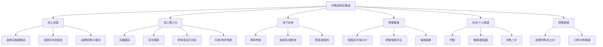
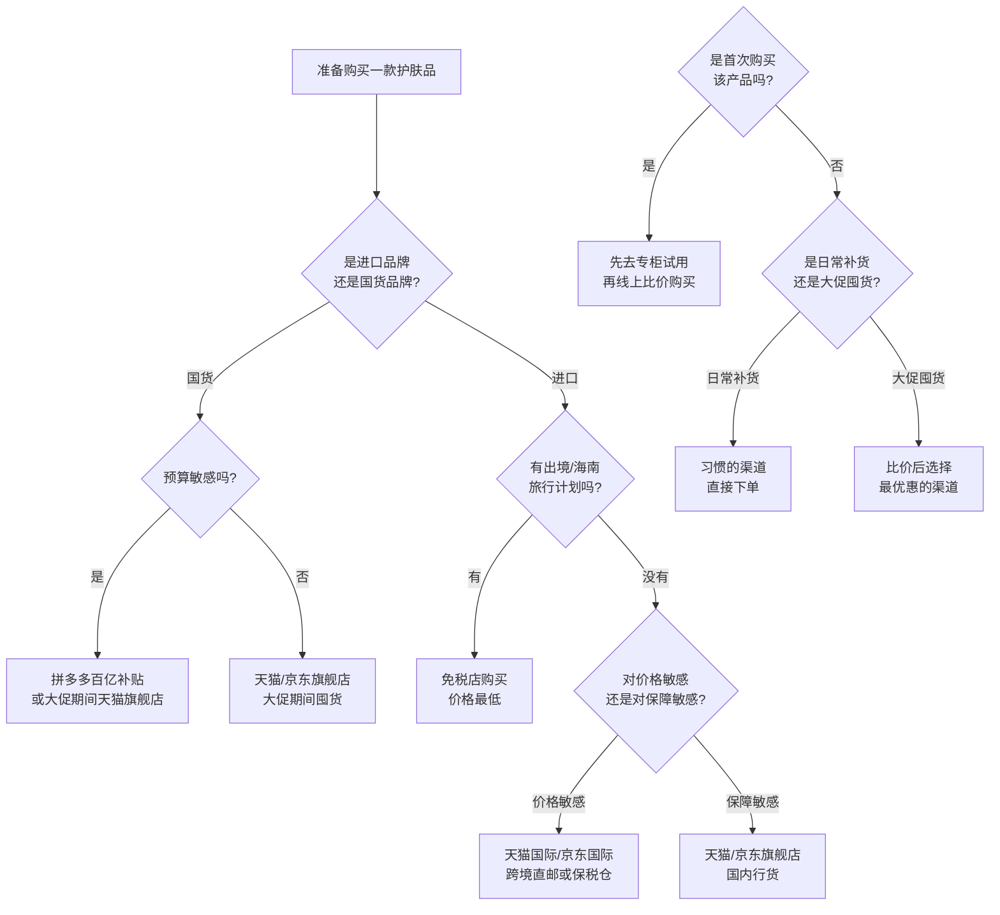

## 九、购买渠道建议

选对了产品，还要选对购买渠道。同一款产品在不同渠道的价格可能相差30%-50%，而假冒伪劣产品的流通渠道也混杂其中。购买渠道的选择本质上是在三个维度之间找平衡：**价格、正品保障、售后便利**。没有一个渠道在三个维度上都是最优的——你需要根据产品类型、价格区间和个人风险承受能力，选择最合适的组合。

### 9.1 购买渠道全景图

在深入每个渠道之前，先建立一个全局视角。国内护肤品的购买渠道可以分为六大类：

下面逐一拆解每个渠道的优劣势、适用场景和避坑要点。

### 9.2 线上自营渠道：正品保障的首选

#### 9.2.1 天猫品牌旗舰店

**运作机制**：品牌在天猫开设的官方店铺，由品牌方直接运营或授权代运营。天猫对旗舰店有严格的资质审核——品牌需要提供商标注册证、营业执照、化妆品生产许可证等文件。大部分主流护肤品牌（珀莱雅、薇诺娜、理肤泉、修丽可等）在天猫都有旗舰店。

**正品保障**：★★★★★。旗舰店的货源直接来自品牌方或品牌授权的经销商，假货概率极低。天猫平台本身也有"正品保障"承诺，如果买到假货可以获得赔偿。

**价格特点**：
- 日常价通常等于或略高于品牌指导价
- 大促期间（618、双11）折扣力度大，叠加满减和优惠券后可达5-7折
- 经常有买正装送小样的活动，小样的隐性价值不可忽视

**适用场景**：
- 大促期间批量囤货（主力渠道）
- 购买国货品牌（珀莱雅、薇诺娜、至本等），国货在旗舰店的价格往往已经是全网最低
- 需要正品保障的贵价产品（修丽可、赫莲娜等）

**避坑要点**：
- 注意区分"旗舰店"和"专卖店"——专卖店是经销商开的，正品保障略低于旗舰店
- 大促前一个月关注产品价格，部分商家会先涨价再打折
- 赠品小样要看清是品牌官方赠品还是店铺自行搭配的（后者可能是临期产品）

#### 9.2.2 京东自营/品牌旗舰店

**运作机制**：京东的护肤品渠道分为两种——京东自营（京东自己采购、仓储、配送）和品牌旗舰店（品牌方入驻运营）。京东自营的货源来自品牌授权的经销商或直接从品牌采购。

**正品保障**：★★★★★。京东自营的供应链管理严格，且京东物流全程可控，中间环节少。售后方面，京东的退换货效率在电商平台中最高。

**价格特点**：
- 日常价与天猫持平
- 京东PLUS会员有额外折扣（通常95折）
- 大促力度与天猫相当，但满减规则不同，有时京东更划算

**适用场景**：
- 重视物流速度和售后体验（京东自营通常次日达）
- 购买进口产品（京东国际有保税仓发货，速度快）
- 京东PLUS会员购买时有额外优惠

**避坑要点**：
- 确认商品标注"京东自营"而非第三方店铺
- 京东国际的产品是从保税仓发货，退换货流程与国内产品略有不同

#### 9.2.3 品牌官网/官方小程序

**运作机制**：品牌自建的电商渠道，直接面向消费者销售。部分品牌的官网/小程序会提供与电商平台不同的独家套装或限定产品。

**正品保障**：★★★★★。这是唯一一个"品牌自己卖给你"的渠道，不存在任何中间环节。

**价格特点**：
- 日常价通常与电商平台持平或略高
- 优势在于独家套装（正装+小样组合）、会员积分体系、生日礼等
- 部分品牌官网有新人首单折扣（如修丽可官网新用户85折）

**适用场景**：
- 品牌忠实用户（长期复购同品牌产品，积分体系划算）
- 追求独家套装和小样赠品
- 需要品牌官方的个性化护肤建议（部分官网有在线咨询）

**避坑要点**：
- 官网的物流速度通常不如电商平台
- 部分小品牌官网的安全性存疑（支付安全、隐私保护），优先选择知名品牌的官网

### 9.3 线上第三方渠道：价格优势明显但需要甄别

#### 9.3.1 天猫国际/京东国际

**运作机制**：跨境电商平台，产品从海外直邮或从国内保税仓发货。进口产品不需要经过国内的化妆品备案流程（走跨境电商的"正面清单"机制），因此可以买到一些国内未正式上市的产品。

**正品保障**：★★★★☆。天猫国际和京东国际对入驻商家有审核机制，保税仓发货的产品有海关监管。但跨境渠道的监管力度不如国内旗舰店严格，假货风险略高。

**价格特点**：
- 进口产品通常比国内旗舰店便宜10%-30%
- 原因：跨境电商享受税收优惠（单次交易限值5000元，年度限值26000元，关税暂设为0）
- 大促期间叠加优惠后，价格优势更明显

**适用场景**：
- 购买进口品牌（修丽可、理肤泉、CeraVe、The Ordinary等）
- 购买国内未正式上市的产品
- 对价格敏感但又需要一定正品保障

**避坑要点**：
- 优先选择"天猫国际官方直营"或"京东国际自营"，正品保障高于第三方跨境商家
- 跨境商品通常不支持七天无理由退货（因为涉及海关清关），下单前确认好产品规格
- 注意保质期——跨境渠道有时会流通临近保质期的产品

#### 9.3.2 拼多多百亿补贴

**运作机制**：拼多多平台对部分产品进行价格补贴，由平台承担差价。护肤品类的百亿补贴产品通常来自品牌授权经销商或大经销商。

**正品保障**：★★★☆☆。拼多多对百亿补贴产品有"假一赔十"承诺，且要求商家提供品牌授权书。国货品牌（珀莱雅、薇诺娜、至本等）的百亿补贴基本可信——因为这些品牌的供应链管理严格，经销商不敢冒险卖假。但进口品牌的保障力度相对较低。

**价格特点**：
- 通常比旗舰店便宜10%-20%
- 国货品牌的价格优势最明显（因为国货的经销商体系透明，平台补贴空间大）
- 进口品牌的价格优势有时不如天猫国际

**适用场景**：
- 购买国货品牌（珀莱雅、薇诺娜、至本、润百颜等）
- 对价格高度敏感
- 不急于收货（拼多多物流通常比京东慢1-2天）

**避坑要点**：
- 只买百亿补贴专区的产品，不要在拼多多上随便搜索购买
- 收到产品后第一时间验证防伪码（详见9.6节真伪鉴别）
- 进口产品谨慎购买——百亿补贴的进口产品供应链不如天猫国际透明
- 注意查看店铺评分和历史评价

#### 9.3.3 抖音/快手电商

**运作机制**：短视频/直播平台的电商功能，品牌方或达人通过直播带货销售护肤品。

**正品保障**：★★★☆☆。平台对品牌旗舰店有审核，但达人带货的供应链复杂度高，中间环节多，正品保障不如天猫/京东。

**价格特点**：
- 直播间价格有时低于其他渠道（品牌方给达人的专属优惠）
- 但要注意"先涨后降"的套路——直播间的"原价"可能虚高
- 赠品丰富（小样、面膜等），但赠品品质参差不齐

**适用场景**：
- 有信任的护肤类博主（长期关注、内容专业、不频繁换推荐品牌）
- 品牌官方直播间（非达人直播间）的大促活动

**避坑要点**：
- 只在品牌官方直播间购买，不要在达人直播间冲动下单
- 达人推荐的"小众品牌""工厂品牌"要格外警惕——配方和品控可能不达标
- 直播间的"限时秒杀"制造紧迫感，目的是让你来不及思考就下单
- 一定要保留订单记录和聊天截图，方便售后维权

### 9.4 线下实体渠道：体验为王

#### 9.4.1 商场专柜

**运作机制**：品牌在百货商场设立的销售专柜，由品牌方或代理商直接运营。柜员经过品牌培训，可以提供产品试用和护肤建议。

**正品保障**：★★★★★。专柜产品直接来自品牌方，是所有渠道中正品保障最高的。

**价格特点**：
- 全价销售，几乎不打折（少数商场有满减活动）
- 但专柜的优势在于：可以试用产品质地、获得小样、享受会员服务
- 部分品牌专柜有"买赠"活动（如买正装送等量小样），实际性价比不低

**适用场景**：
- **首次购买某产品**——在专柜试用质地、闻香、感受肤感后再决定是否购买，避免线上盲买踩坑
- 购买需要色号匹配的产品（如粉底液、有色防晒）
- 品牌忠实用户享受会员服务（如赫莲娜、海蓝之谜的面部护理服务）

**实操建议**：去专柜试用，记下产品名称和感受，回家在线上渠道比价后购买。专柜的价值在于"体验"而非"购买"。

#### 9.4.2 屈臣氏/调色师/WOW COLOUR等美妆集合店

**运作机制**：连锁美妆零售店，汇集多个品牌的护肤品和彩妆。导购员会推荐产品，但需要注意他们的推荐可能受佣金影响。

**正品保障**：★★★★☆。大型连锁集合店的供应链管理规范，正品有保障。但小型/非连锁的美妆店要谨慎。

**价格特点**：
- 价格通常与线上持平或略高
- 会员卡可以打折（屈臣氏会员通常9折左右）
- 经常有"第二件半价""买三免一"等组合促销

**适用场景**：
- 需要立即购买（应急补货）
- 想在线下试用多个品牌的产品
- 购买日用品（洁面、卸妆、面膜等），不需要精挑细选的品类

**避坑要点**：
- 导购推荐的高利润产品不一定是适合你的产品——坚持自己的选择，不要被话术左右
- 注意保质期——集合店的产品周转速度不如电商平台，有时会流通临期产品

#### 9.4.3 药房/皮肤科诊所

**运作机制**：部分功效型护肤品（如薇诺娜、理肤泉、雅漾）在药房有售。一些皮肤科诊所也会推荐或销售医学护肤品。

**正品保障**：★★★★★。药房渠道的产品来自品牌授权经销商，且有药监部门的监管。

**价格特点**：
- 价格通常不打折
- 但医保个人账户可以在部分城市的药房刷卡购买（限部分产品）

**适用场景**：
- 购买功效型护肤品（薇诺娜、理肤泉、雅漾等"药妆"品牌）
- 皮肤科医生推荐的产品，在诊所直接购买省去比价环节
- 需要专业药师建议的人群

### 9.5 跨境与免税渠道：进口产品的价格洼地

#### 9.5.1 线下免税店（中免CDF、日上、海旅免税等）

**运作机制**：免税店免除进口关税、增值税和消费税，因此价格低于国内市场。国内免税店主要包括：机场免税店（日上、中免）、海南离岛免税店（cdf海口/三亚）、市内免税店。

**正品保障**：★★★★★。免税店由持牌免税运营商经营，产品直接来自品牌方，正品保障最高。

**价格特点**：
- 比国内专柜便宜20%-40%
- 海南离岛免税店额度为每人每年10万元
- 日上免税店（上海/北京机场）常有套装折扣，叠加会员积分后价格极具竞争力

**适用场景**：
- 出入境旅行时购买（机场免税店）
- 海南旅游时购买（离岛免税店）
- 适合购买大牌精华、面霜等高单价产品——价格差越大，免税优势越明显

**实用技巧**：
- **cdf会员购**（微信小程序）：中免集团的线上免税平台，不需要出入境也能购买（部分产品），价格与线下免税店接近。适合不出门又想享受免税价的人。
- **日上优选**：上海日上的线上平台，同样可以线上购买免税产品
- 提前在免税店官网/小程序查看价格和库存，到店后直接购买，节省时间
- 免税店的套装通常比单品更划算——对比单价后再决定

#### 9.5.2 跨境电商平台（考拉海购、亚马逊海外购等）

**运作机制**：通过跨境电商模式进口海外产品，产品从海外仓或国内保税仓发货。

**正品保障**：★★★★☆。大型跨境平台（考拉海购、亚马逊海外购）的供应链相对可靠，但小型跨境平台要谨慎。

**价格特点**：
- 比国内专柜便宜15%-35%
- 黑色星期五（11月）和Prime Day（7月）期间折扣力度最大

**适用场景**：
- 购买国内不容易买到的海外品牌（如CeraVe、The Ordinary、Paula's Choice的某些产品线）
- 海淘经验丰富、不介意较长物流时间的用户

**避坑要点**：
- 跨境商品通常不支持无理由退货
- 物流时间长（7-15天甚至更久）
- 注意汇率波动对价格的影响
- 海关税费政策可能变化，购买前确认当前税率

### 9.6 真伪鉴别：买到正品的最后一道防线

无论在哪个渠道购买，收到产品后都应该进行真伪验证。以下是系统性的鉴别方法：

#### 9.6.1 官方防伪验证

大多数品牌都有官方的防伪查询系统：

| 验证方式 | 操作步骤 | 适用品牌 |
|---------|---------|---------|
| 防伪码查询 | 刮开产品包装上的防伪涂层，登录品牌官网或拨打防伪电话输入编码 | 珀莱雅、薇诺娜、自然堂等国货品牌 |
| 批次号查询 | 在品牌官网或微信公众号输入产品批次号验证 | 国际品牌（欧莱雅、资生堂集团等） |
| 扫码验证 | 微信扫描产品上的二维码，跳转到品牌官方验证页面 | 多数主流品牌 |
| 美丽修行App | 输入产品名称查看成分表，对比实物成分表是否一致 | 通用方法 |

#### 9.6.2 物理鉴别方法

除了官方验证，还可以通过观察产品本身的细节来判断：

**包装鉴别**：
- 印刷质量：正品的字体清晰、颜色均匀、无模糊或溢色
- 瓶身材质：正品的瓶身接缝平整、无毛刺、材质厚实
- 封口工艺：正品的封口膜/锡纸平整贴合，假货可能有气泡或褶皱
- 批次号/生产日期：正品的喷码清晰、位置规范，假货喷码可能模糊或位置随意

**产品本身鉴别**：
- 质地：正品的乳液/面霜质地均匀，无颗粒感或分层
- 气味：正品的香味一致且稳定，假货可能有刺鼻的化学味或香味过于浓烈
- 颜色：正品的颜色批次间差异很小，假货颜色可能明显不同

**一个实用的对比方法**：如果你之前用过正品，保留空瓶或拍下产品照片。收到新购买的产品后，逐项对比——包装细节、产品质地、气味、使用感受。任何明显差异都值得警惕。

#### 9.6.3 常见假货特征速查表

| 特征 | 正品 | 假货 |
|------|------|------|
| 包装盒印刷 | 颜色饱和、字体锐利 | 颜色偏暗/偏亮、字体模糊 |
| 产品批号 | 激光喷印，字迹清晰，不易擦除 | 喷墨印刷，易擦除或模糊 |
| 瓶盖/泵头 | 开合顺畅、阻尼感一致 | 松动、卡顿、或过于紧涩 |
| 膏体/液体 | 质地均匀、颜色稳定 | 可能有颗粒、分层、颜色异常 |
| 气味 | 与专柜试用一致 | 刺鼻、过浓、或与正品不同 |
| 价格 | 在正常区间内 | 远低于市场价（低于6折要警惕） |

### 9.7 购买渠道的决策矩阵

面对具体购买场景时，如何快速选择最优渠道？以下是一个实用的决策框架：

#### 按产品类型选择渠道

| 产品类型 | 推荐渠道 | 原因 |
|---------|---------|------|
| 国货品牌（珀莱雅、薇诺娜等） | 天猫旗舰店（大促）+ 拼多多百亿补贴（日常） | 国货供应链透明，各渠道价格差不大，大促和百亿补贴是最佳时机 |
| 进口平价品牌（CeraVe、The Ordinary等） | 天猫国际/京东国际 | 跨境价格优势明显，保税仓发货速度快 |
| 进口中高端品牌（修丽可、理肤泉等） | 天猫国际（日常）+ 免税店（有条件时） | 天猫国际比国内专柜便宜15-30%，免税店便宜20-40% |
| 进口高端品牌（赫莲娜、海蓝之谜等） | 免税店 > 天猫旗舰店（大促） | 高单价产品在免税店的价格差最明显，一套可能省上千元 |
| 功效型护肤品（薇诺娜、理肤泉等） | 药房/皮肤科诊所 + 线上旗舰店 | 药房有专业指导，线上价格更优，可以诊所试用后线上购买 |

### 9.8 验证与售后：购买后的保障

#### 9.8.1 收货后立即检查清单

收到产品后，按以下清单逐项检查：

1. **外包装完整性**：塑封是否完好、包装盒有无挤压变形
2. **批次号与生产日期**：登录品牌官网验证批次号，确认生产日期在合理范围内
3. **保质期**：未开封保质期通常为3年，收到时剩余保质期不应少于1年
4. **开封后保质期（PAO）**：查看瓶身的"开盖小罐"图标，确认开封后的使用期限
5. **产品状态**：打开后检查质地、颜色、气味是否正常

#### 9.8.2 售后维权指南

如果发现产品有问题（疑似假货、临期、变质等），按以下步骤维权：

1. **保留所有证据**：订单截图、产品照片（包括包装、批号、产品本身）、快递单号
2. **联系商家**：先在平台内联系商家客服，说明问题并提供证据
3. **平台介入**：如果商家不处理，在天猫/京东等平台申请"平台介入"
4. **品牌验证**：将产品照片和批次号发给品牌官方客服，请求验证真伪
5. **消费者投诉**：如果平台处理不满意，拨打12315或在"全国12315平台"小程序投诉
6. **假货举报**：确认假货后，可以向市场监督管理局举报（假一赔十的法律依据：《消费者权益保护法》第55条）

### 9.9 不同预算的渠道组合策略

结合上一节的预算方案，给出每个档位的最优渠道组合：

| 预算档位 | 核心渠道 | 辅助渠道 | 省钱策略 |
|---------|---------|---------|---------|
| 生存级（50-100元/月） | 拼多多百亿补贴 | 天猫旗舰店（大促） | 国货品牌在拼多多的价格已经很低，日常在此购买即可 |
| 基础级（150-250元/月） | 天猫旗舰店（大促囤货） | 拼多多百亿补贴（日常补货） | 618和双11各囤半年用量，中间缺货用百亿补贴补 |
| 进阶级（300-500元/月） | 天猫旗舰店 + 天猫国际 | 免税店（有条件时） | 国货走旗舰店，进口走天猫国际，大牌精华考虑免税店 |
| 品质级（600-1000元/月） | 天猫国际 + 免税店 | 天猫旗舰店（国货） | 核心精华（修丽可CE）走免税店或天猫国际，其他走旗舰店 |
| 享受级（1500元+） | 免税店 + 品牌官网 | 天猫旗舰店（日常） | 高端产品走免税店省20-40%，品牌官网积分体系长期划算 |

### 9.10 绝对要避开的渠道和陷阱

以下渠道存在较高的假货风险或消费陷阱，强烈建议避免：

#### 9.10.1 高风险渠道

| 渠道 | 风险等级 | 具体风险 | 建议 |
|------|---------|---------|------|
| 微商/朋友圈代购 | ⚠️ 极高 | 无平台监管、假货率极高、无法维权。所谓的"海外直邮"可能是国内高仿发货 | 绝对不要购买。再便宜也不要买——假护肤品不只是没效果，劣质原料可能导致接触性皮炎、激素脸 |
| 非官方拼多多店铺 | ⚠️ 高 | 百亿补贴之外的店铺监管力度弱，假货风险高 | 只在百亿补贴专区购买，不要贪图更低价格在普通店铺购买 |
| 闲鱼二手护肤品 | ⚠️ 高 | 无法确认存储条件、开封状态、是否过期。即使是正品，不当存储也可能导致变质 | 不要购买任何二手护肤品，包括小样和正装 |
| 不明来源的免税代购 | ⚠️ 中高 | 可能真假掺卖，用真瓶灌假货。"免税店小票"可以伪造 | 如果一定要代购，只信任长期关注、可验证身份的真人代购，且收货后必须验真 |
| 短视频平台非品牌直播间 | ⚠️ 中高 | 达人带货的供应链复杂，部分达人为追求利润会选择低质货源 | 只在品牌官方直播间购买 |

#### 9.10.2 常见消费陷阱

**陷阱一："海关扣押/员工内部价"**
- 说辞：声称有海关扣押的正品护肤品，或品牌员工内部渠道
- 真相：海关罚没物品有专门的拍卖渠道，不会在朋友圈或小红书销售。品牌员工内购确实存在，但价格通常只是7-8折，而非3-5折
- 判断：价格低于6折的"正品"，99%是假货

**陷阱二："海外代购小票造假"**
- 说辞：提供免税店或专柜购物小票作为正品证明
- 真相：购物小票可以PS造假，即使是真小票也不能证明寄给你的是同一瓶产品
- 判断：小票不是正品的可靠证据，防伪码验证才是

**陷阱三："清仓/临期特价"**
- 说辞：品牌清仓、海关扣押品、临期特卖
- 真相：正规的清仓和临期产品确实存在，但渠道透明（如天猫超市临期专区）。来路不明的"清仓品"很可能是假货借清仓之名销售
- 判断：只在有平台背书的临期专区购买（如天猫超市、京东自营的临期商品），不要在私人渠道购买

### 9.11 实用工具与资源

| 工具/平台 | 用途 | 使用方法 |
|----------|------|---------|
| 慢慢买（manmanbuy.com） | 历史价格查询 | 输入产品名称或链接，查看半年内的价格走势，判断当前是否真优惠 |
| 什么值得买（smzdm.com） | 优惠信息聚合 | 关注护肤品分类，获取各渠道的实时优惠信息和用户评价 |
| 美丽修行App | 成分查询与验证 | 输入产品名称查看成分表，收货后对比实物成分表验证一致性 |
| 全国12315平台 | 消费维权 | 遇到假货或消费纠纷时，在线投诉举报 |
| 品牌官方微信公众号 | 防伪验证与活动信息 | 关注常用品牌的公众号，获取防伪查询入口和会员活动信息 |
| 天猫/京东价格保护 | 大促降价后补差 | 大促购买后如果发现价格下降，在订单页面申请价保退款 |

### 9.12 购买渠道的长期策略

护肤是一个长期行为，购买渠道的选择也应该有长期视角：

**建立"主渠道+辅渠道"模式**：
- 主渠道（70%的购买）：选择一个你信任的、售后有保障的渠道作为日常购买的主力（推荐天猫旗舰店或京东自营）
- 辅渠道（30%的购买）：在大促、免税、百亿补贴等渠道捡漏，作为补充

**记录购买历史**：
养成记录每次购买的习惯——在哪个渠道买的、什么价格、保质期到什么时候。这能帮你：
- 发现哪些渠道真的更便宜（而非感觉便宜）
- 避免囤太多导致过期
- 在需要维权时有据可查

**关注品牌官方动态**：
关注常用品牌的官方微信公众号和天猫店铺。品牌的会员日、新品首发、限定套装等信息通常只在官方渠道发布，这些往往是性价比最高的购买时机。

***

> 📖 **下一节预告**：知道了用什么产品、花多少钱、在哪买，还需要知道怎么学习护肤知识。下一节将为你规划从零基础到精通的学习路径。
