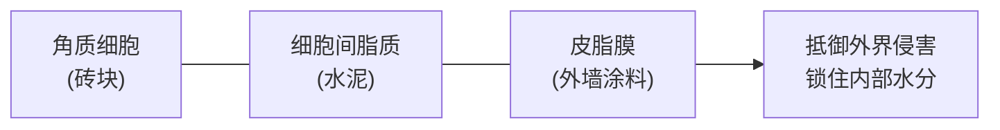
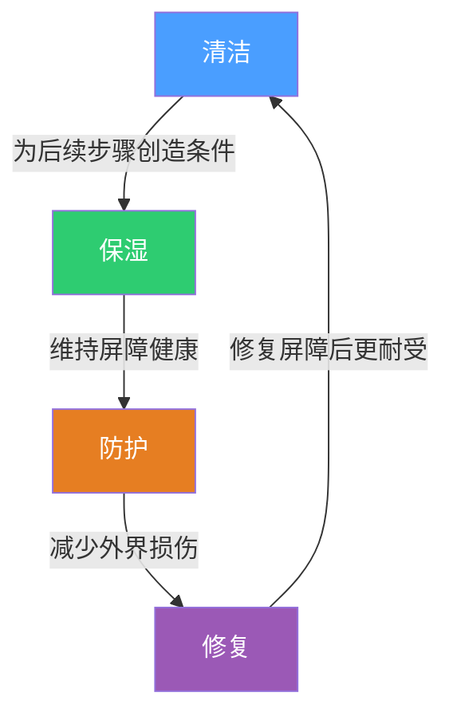
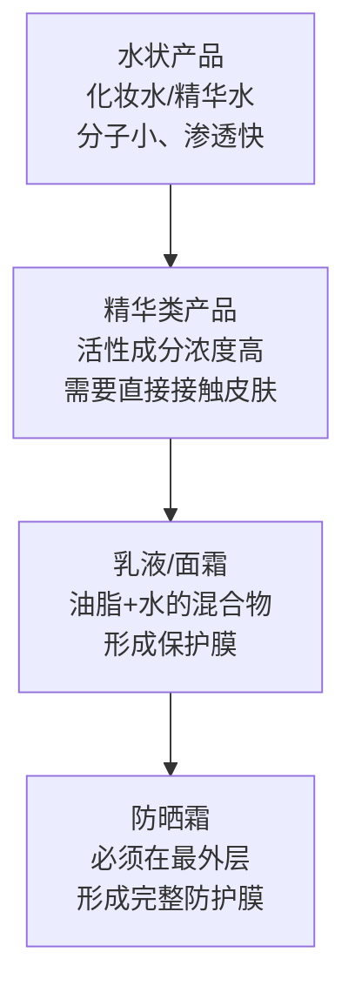
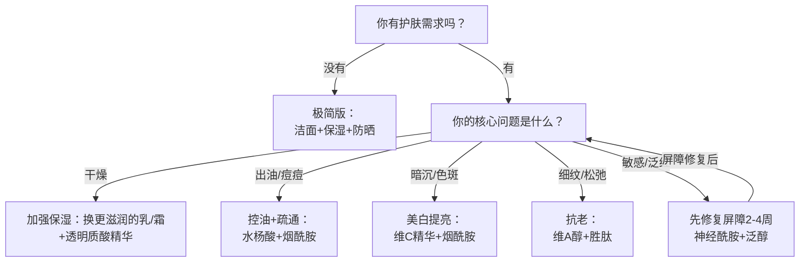

## 一、护肤的基本框架

护肤这件事，最怕的不是产品不够贵，而是没有章法。很多人买了一堆瓶瓶罐罐，却不知道什么先用、什么后用、什么该搭配、什么会冲突。更常见的情况是：被社交媒体上的"12步护肤法""早C晚A""以油养肤"等概念牵着走，今天跟风买这个，明天又换那个，皮肤状态反而越来越差。

本节给你一个**可迁移的框架**。有了它，不管产品怎么换、潮流怎么变，你的护肤逻辑都不会乱。这个框架回答三个核心问题：护肤到底在做什么？用什么顺序做？哪些东西能一起做、哪些会打架？

### 1.1 护肤的本质：皮肤屏障思维

#### 为什么"屏障"是一切的起点

皮肤不是一张被动承受涂抹的画布，而是一个**主动运作的防御系统**。理解这个系统的工作原理，是所有护肤决策的基础。

皮肤最外层是角质层，它由15-20层扁平的死细胞（角质细胞）组成，细胞之间填充着脂质（主要是神经酰胺、胆固醇和脂肪酸），形成经典的"砖墙结构"：

- **角质细胞**是"砖"，提供物理强度
- **细胞间脂质**是"水泥"，填充砖缝，阻止水分蒸发和外界物质入侵
- **皮脂膜**是最外层的油性薄膜，由皮脂腺分泌的油脂+汗液+天然保湿因子（NMF）组成，相当于外墙的防水涂料

当这三层结构完整时，皮肤表现为：水润、有弹性、不易过敏、对外界刺激有抵抗力。当屏障受损时，皮肤会出现：干燥脱皮、泛红刺痛、外油内干、反复长痘、用什么都觉得刺激。

**所有护肤行为，归根结底都是在做两件事：维护屏障、在屏障完好的前提下解决问题。**

#### 屏障受损的常见原因

| 原因 | 机制 | 典型表现 |
|------|------|----------|
| 过度清洁 | 皮脂膜被洗掉，角质层失去保护 | 洗完脸紧绷、起皮 |
| 频繁去角质 | 角质层变薄，"砖墙"结构被破坏 | 皮肤变薄、泛红、刺痛 |
| 不当刷酸 | 酸类浓度过高或频率过密 | 脱皮、灼热、反黑 |
| 过度叠加功效产品 | 多种活性成分同时刺激皮肤 | 敏感、爆痘、屏障功能下降 |
| 环境因素 | 紫外线、干燥、寒冷、污染 | 光老化、干燥性脱屑 |

这就是为什么"护肤框架"的第一条原则不是"用什么产品"，而是"不要伤害屏障"。

### 1.2 护肤的四大目标

理解了屏障思维，护肤的目标就清晰了——围绕屏障的维护和优化，具体拆分为四个目标：

| 目标 | 核心任务 | 对应屏障层 | 关键指标 |
|------|----------|------------|----------|
| **清洁** | 去除多余油脂、污垢、老废角质 | 皮脂膜 | 洗后不紧绷、不滑腻 |
| **保湿** | 为角质层补充水分并锁住 | 角质层 + 细胞间脂质 | 皮肤含水量、经皮水分流失（TEWL） |
| **防护** | 抵御紫外线和环境伤害 | 整体屏障 | 无光损伤、无色沉 |
| **修复** | 修复屏障损伤、促进细胞更新 | 角质层 + 基底层 | 屏障功能恢复、肤质改善 |

这四个目标之间的关系是：

注意这是一个**循环**，不是线性关系。清洁做不好，后续产品吸收差；保湿做不好，屏障脆弱，防护和修复效果打折；防护做不好，白天的损伤靠晚上的修复补不回来。

### 1.3 护肤步骤的底层逻辑：渗透梯度原则

为什么护肤要有顺序？因为皮肤是一道屏障，产品要穿透这道屏障才能起作用。不同产品的渗透能力不同，使用顺序决定了哪些成分能到达皮肤深层。

核心原则只有一条：**从轻薄到厚重，从水溶到油溶**。

详细说明：

| 步骤 | 质地 | 分子大小 | 作用位置 | 排序原因 |
|------|------|----------|----------|----------|
| 化妆水/精华水 | 水状 | 小 | 角质层表面 | 先补水，为后续产品创造湿润环境，提高渗透率 |
| 功效精华 | 液态/凝胶 | 中小 | 角质层→基底层 | 活性成分浓度高，需要直接接触目标层，被面霜阻挡会失效 |
| 眼霜 | 乳霜状 | 中 | 眼周薄皮 | 眼周皮肤薄且敏感，需要专门产品，在精华后面霜前 |
| 乳液/面霜 | 乳霜状 | 大 | 角质层表面 | 油脂成分形成封闭膜，锁住前面的水分和营养 |
| 防晒霜 | 膜状 | — | 皮肤最表面 | 必须形成连续完整的防护膜，任何后续产品都会破坏这层膜 |

**一个常犯的错误**：把精华涂在面霜之后。面霜的油脂膜会在皮肤表面形成一层封闭层，阻碍精华中活性成分的渗透。相当于你把钥匙放在了锁的外面——再好的成分也进不去。

**另一个常犯的错误**：防晒之后再涂其他东西。防晒膜一旦被破坏，防护效果大打折扣。所有护肤步骤必须在防晒之前完成。

### 1.4 产品叠加的科学：哪些能共存，哪些会打架

护肤品不是随便叠加就行的。成分之间存在协同效应（1+1>2）和拮抗效应（1+1<1甚至1+1<0），了解这些关系是高效护肤的关键。

#### 协同组合：搭配使用效果翻倍

| 组合 | 协同机制 | 效果 | 最佳使用时间 |
|------|----------|------|--------------|
| 维C + 维E + 阿魏酸 | 维C再生维E，阿魏酸稳定两者并增强光保护 | 抗氧化效果提升约8倍（Pinnell等研究） | 早上（配合防晒） |
| 烟酰胺 + 透明质酸 | 烟酰胺强化屏障，透明质酸补水，屏障好了保湿更持久 | 美白+保湿双效 | 早晚均可 |
| 维A醇 + 神经酰胺 | 维A醇促进更新但会暂时削弱屏障，神经酰胺同步修复 | 抗老+屏障维护 | 晚上 |
| 水杨酸 + 烟酰胺 | 水杨酸疏通毛孔，烟酰胺控油缩毛孔 | 控油+收毛孔+改善痘肌 | 晚上 |
| 透明质酸 + 神经酰胺 | 透明质酸抓水，神经酰胺锁水 | 深层保湿+屏障修复 | 早晚均可 |
| 壬二酸 + 烟酰胺 | 壬二酸抑菌抗炎，烟酰胺控油 | 痘痘+色沉双管齐下 | 晚上 |

#### 拮抗组合：避免同时使用

| 组合 | 冲突原因 | 正确用法 |
|------|----------|----------|
| 维A醇 + 高浓度果酸 | 两者都是强效角质调节剂，叠加使用屏障负荷过大 | 隔天交替：周一三五用维A醇，周二四六用果酸 |
| 维A醇 + 高浓度原型VC（L-抗坏血酸） | 原型VC需要低pH（<3.5）才能渗透，维A醇在弱酸性（pH 5-6）下更稳定，两者最佳pH范围冲突 | VC早上，VA晚上，各在自己的最佳pH环境下工作 |
| 多种酸类叠加（果酸+水杨酸+壬二酸同时用） | 过度去角质，破坏"砖墙"结构 | 每次只用一种酸类，酸后必保湿 |
| 高浓度VC（低pH）+ 胜肽类 | 低pH环境可能降解某些胜肽分子 | VC早上，胜肽晚上 |

**关于"维C和烟酰胺不能一起用"的澄清**：这是一个流传很广但已被现代研究修正的说法。早期研究认为两者混合会产生烟酸（niacin）导致皮肤泛红，但后续研究表明：(1) 需要高温长时间混合才会发生反应；(2) 即使产生少量烟酸，浓度也不足以引起问题；(3) 实际涂抹在皮肤上，两者各自被吸收，混合反应微乎其微。所以维C和烟酰胺**可以在同一个护肤流程中使用**，只要按质地从轻到重的顺序涂抹即可。如果你仍然担心，分早晚使用是最稳妥的方案。

### 1.5 三种版本的护肤方案

根据你的时间、预算和护肤需求，选择适合自己的版本。这不是"低配/中配/高配"的关系——极简版已经覆盖了护肤最核心的需求，多步骤只有在你有明确的改善目标时才有意义。

#### 极简版：3步，5分钟

**适合人群**：护肤新手、皮肤状态本身不错、不愿意在护肤上花太多时间的人

早上：洁面 → 保湿乳/霜 → 防晒
晚上：洁面 → 保湿乳/霜

**执行要点**：
- **洁面**：选择氨基酸类表面活性剂（如椰油酰谷氨酸钠、月桂酰谷氨酸钾），pH 5.5-6.5，温和不破坏皮脂膜。避免皂基类（肉蔻酸/棕榈酸+氢氧化钾），虽然洗得干净但长期使用会破坏屏障
- **保湿**：一瓶含神经酰胺或透明质酸的乳液/面霜就够。神经酰胺补充"水泥"，透明质酸抓水保湿。如果皮肤偏油选乳液，偏干选面霜
- **防晒**：SPF30/PA+++以上，涂够量（面部约一元硬币大小，约1g）。即使极简版，防晒也不能省——紫外线是皮肤老化的头号外因，占外源性老化的80%

**这个版本已经覆盖了护肤的本质需求**。不要觉得"步骤少就效果差"——多数皮肤问题的根源不是缺少某瓶精华，而是基础护理没做到位。

#### 标准版：5步，10分钟

**适合人群**：有一定护肤基础、想要针对性改善（美白、抗老、控油）的人

早上：洁面 → 化妆水 → 维C精华 → 乳液/面霜 → 防晒
晚上：卸妆 → 洁面 → 化妆水 → 功效精华 → 乳液/面霜

**执行要点**：
- **化妆水**：选保湿型即可（含透明质酸、甘油、泛醇等），不需要追求"二次清洁"的概念。"二次清洁"本质上是用含酒精或表面活性剂的化妆水进一步清除残留，但好的洁面产品已经不需要这一步。过度"二次清洁"反而会破坏屏障
- **维C精华（早上）**：优先选择原型VC（L-抗坏血酸，浓度10-20%）或VC衍生物（如抗坏血酸葡糖苷AA2G、3-O-乙基抗坏血酸）。原型VC效果最强但稳定性差、可能刺激；衍生物更温和稳定，适合新手
- **功效精华（晚上）**：根据你的核心需求选择一种：
  - 抗老首选维A醇（从0.1%低浓度起步）
  - 美白首选烟酰胺（浓度3-5%）或α-熊果苷
  - 控油/改善痘痘首选水杨酸（浓度0.5-2%）
  - 修复首选神经酰胺或积雪草
- **乳液和面霜二选一**：功能一样（锁水保湿），只是质地不同。油皮选乳液（含水量高、质地轻薄），干皮选面霜（含油量高、封闭性强）
- **功效精华不要叠加超过两种**：活性成分叠加过多，皮肤承受不了，容易"烂脸"

#### 进阶版：6-7步，15分钟

**适合人群**：护肤老手、有明确的多维度改善目标、愿意投入时间研究产品搭配的人

早上：洁面 → 化妆水 → 维C精华 → 眼霜 → 乳液/面霜 → 防晒
晚上：卸妆 → 洁面 → 化妆水 → 精华1（功效） → 精华2（修复） → 眼霜 → 靡霜

**执行要点**：
- **多步骤的前提是每个步骤都有明确目的**。如果增加的步骤不能解决一个具体问题，那就是多余的。7步是上限，再多皮肤吸收不了
- **两种精华的搭配逻辑**：一种针对问题（如维A醇抗老），一种维护屏障（如神经酰胺修复）。不要两种都是强功效型
- **眼霜的位置**：在精华之后、面霜之前。眼周皮肤厚度只有面部的1/3-1/5，皮脂腺少，需要专门的温和配方。但不需要单独买"眼部精华"——面部精华避开眼周即可
- **进阶版需要更强的成分搭配知识**，否则容易"烂脸"。建议先熟练掌握标准版至少2个月再升级

**选择建议**：不确定自己该用哪个版本？从极简版开始，运行2-4周。如果皮肤状态稳定但你有更具体的改善需求，再升级到标准版。直接跳到进阶版，对新手来说风险大于收益。

### 1.6 不同肤质的框架调整

框架是通用的，但具体执行要根据肤质微调。肤质判断的详细方法见本章基础理论部分，这里直接给出调整方案：

#### 油性皮肤

**核心矛盾**：油脂分泌旺盛，但不代表皮肤不缺水。很多油皮的屏障其实是受损的（"外油内干"），过度控油反而会刺激皮脂腺分泌更多油脂。

| 步骤 | 调整要点 | 原因 |
|------|----------|------|
| 清洁 | 早晚各一次，可选含水杨酸的洁面（0.5-1%） | 水杨酸是脂溶性的，能深入毛孔清理油脂 |
| 化妆水 | 选清爽型（如含金缕梅、烟酰胺），避免黏稠型 | 控油同时不增加负担 |
| 功效 | 优先水杨酸（疏通毛孔）、烟酰胺（控油缩毛孔）、壬二酸（控油+抗炎） | 针对油脂过多和毛孔堵塞 |
| 保湿 | 用乳液代替面霜，选"无油配方"（oil-free） | 油皮也需要保湿，但要避免厚重的封闭性油脂 |
| 防晒 | 选控油型防晒（含硅粉体、成膜剂），质地选摇摇乐/水感型 | 避免油腻感，减少闷痘风险 |

**关键提醒**：油皮不代表不需要保湿。缺水时皮脂腺会代偿性分泌更多油脂，做好保湿反而能减少出油。

#### 干性皮肤

**核心矛盾**：皮脂分泌少，天然保湿因子不足，屏障容易出现"缺口"，外界刺激物更容易入侵。

| 步骤 | 调整要点 | 原因 |
|------|----------|------|
| 清洁 | 早上只用清水，晚上用温和氨基酸洁面 | 减少皮脂流失，保护天然油脂 |
| 化妆水 | 选高保湿型（含透明质酸、甘油、角鲨烷），可叠加使用 | 干皮需要更多补水 |
| 功效 | 优先透明质酸（多分子量）、神经酰胺（修复屏障）、角鲨烷（模拟皮脂） | 补水+补油+修复屏障三管齐下 |
| 保湿 | 面霜是必须的，选含角鲨烷、乳木果油、矿脂等封闭性成分的 | 干皮需要更强的封闭层来锁水 |
| 防晒 | 选滋润型防晒（含角鲨烷、甘油等保湿成分），避免高酒精含量的 | 酒精会加速水分蒸发，加重干燥 |

#### 混合性皮肤

**核心矛盾**：T区（额头、鼻子、下巴）出油，两颊干燥。同一张脸有两种需求，不能一刀切。

**方案一：分区护理（推荐）**
- T区按油皮方案：用控油型产品、乳液质地
- 两颊按干皮方案：用保湿型产品、面霜质地
- 这种方案效果最好，但需要两种产品，成本稍高

**方案二：折中方案（省事）**
- 全脸用温和的保湿型产品
- T区减少乳液/面霜的用量（薄涂或只涂一次）
- 两颊正常用量或稍多

**判断标准**：洗完脸30分钟后观察——T区明显出油而两颊紧绷，就是混合皮。如果全脸都油或都干，分别对应油皮和干皮方案。

#### 敏感性皮肤

**核心矛盾**：屏障功能薄弱，外界刺激物容易入侵，免疫系统过度反应。

| 步骤 | 调整要点 | 原因 |
|------|----------|------|
| 清洁 | 最温和的洁面（氨基酸类、无香精无色素），早上只用清水 | 减少一切不必要的刺激 |
| 化妆水 | 不含酒精、香精、色素，优选含泛醇/积雪草的 | 泛醇（维生素B5）舒缓，积雪草修复 |
| 功效 | **避免**维A醇、果酸、高浓度VC；**优选**神经酰胺、积雪草、泛醇、β-葡聚糖 | 敏感期先修复屏障，再考虑功效 |
| 保湿 | 面霜必须有屏障修复功能（含神经酰胺/胆固醇/脂肪酸的"仿生脂质"配方） | 直接补充屏障缺失的"水泥" |
| 防晒 | 选物理防晒（氧化锌/二氧化钛），避免化学防晒剂 | 物理防晒不被皮肤吸收，刺激性最低 |

**敏感肌的核心原则**：少即是多。减少步骤、减少成分、减少更换频率。先修复屏障（2-4周），等皮肤耐受性恢复后，再逐步加入温和的功效成分。

### 1.7 阴晴表：快速判断当前方案是否需要调整

| 信号 | 可能原因 | 调整建议 |
|------|----------|----------|
| 洗完脸紧绷、起皮 | 清洁过度或保湿不足 | 换更温和的洁面，增加保湿步骤 |
| 用新产品后刺痛泛红 | 成分刺激或屏障已受损 | 停用该产品，先修复屏障 |
| T区油光两颊干燥 | 混合皮未做分区护理 | 分区使用不同质地产品 |
| 用什么都觉得油 | 产品质地不适合肤质 | 换更轻薄的乳液/啫喱质地 |
| 反复长痘且无好转 | 产品致痘或屏障受损导致的炎症 | 排查致痘成分，简化护肤步骤 |
| 皮肤变薄、能看见红血丝 | 屏障严重受损 | 停用所有功效产品，只做基础护理 |
| 防晒后搓泥 | 产品不兼容或用量过多 | 减少前面步骤的产品用量，或换防晒 |

### 1.8 从零开始的行动方案

如果你之前完全没有护肤习惯，不要一步到位。皮肤需要时间适应新产品，突然叠加太多步骤反而会出问题。

**第1周：建立基础（清洁+保湿）**
- 买一瓶氨基酸洁面乳和一瓶保湿乳/霜
- 早晚各一次，先让皮肤适应基础护理
- 观察皮肤是否有改善：紧绷感减少、起皮现象消失

**第2周：加入防晒**
- 买一瓶SPF30/PA+++以上的防晒霜
- 每天早上出门前涂抹（室内也要涂，紫外线能穿透玻璃）
- 涂够量：面部约一元硬币大小（约1g），脖子和耳朵别忘

**第3-4周：按需加入功效产品**
- 只加一种，从低浓度开始，先隔天使用
- 想美白：加一瓶维C精华（早上用，在化妆水之后、面霜之前）
- 想抗老：加一瓶低浓度维A醇（0.1%起步，晚上用，建立耐受后再升浓度）
- 想控油/改善痘痘：加一瓶水杨酸（晚上用，先从0.5%开始）
- 修复屏障：加一瓶含神经酰胺的精华（早晚都可以用）

**第2个月起：优化和调整**
- 观察每种新产品的反应：如果用后出现持续泛红、刺痛、爆痘，可能是不耐受或过敏
- 建立完整的早晚护肤流程，坚持至少28天（一个完整的皮肤更新周期）再评估效果
- 效果满意就保持，不满意再考虑调整或升级步骤

**护肤是长期工程**。皮肤细胞从基底层分化、迁移到角质层脱落，大约需要28天（随年龄增长会延长到40-50天）。至少坚持一个月才能看到真正的变化，三个月才能看到显著改善。不要期待一周见效，也不要一周没效果就全盘否定。

### 1.9 常见误区深度解析

#### 误区一："步骤越多越好"

**为什么是错的**：皮肤的吸收能力有上限。角质层的渗透速率取决于浓度梯度、分子大小和皮肤状态，不会因为你涂了更多层就吸收得更多。涂太多层的后果是：(1) 每层都被稀释，活性成分浓度达不到有效阈值；(2) 多层油脂膜叠加，闷痘风险上升；(3) 产品之间可能发生反应，降低稳定性。

**正确做法**：5步已经足够覆盖所有核心需求。7步是上限。每增加一个步骤，都要问自己：这个步骤解决的是什么问题？如果回答不了，就不需要加。

#### 误区二："化妆水是必须的"

**为什么不是必须的**：化妆水的传统功能有两个：(1) 补水——角质层确实能吸收水分，但好的精华和面霜也能做到；(2) 调节pH值——现代氨基酸洁面已经是弱酸性（pH 5.5-6.5），不需要再用化妆水调回酸性。

化妆水真正有价值的情况：(1) 皮肤偏干、需要额外补水层；(2) 含有特定功效成分（如含烟酰胺的美白水、含水杨酸的控油水）；(3) 帮助后续产品更好地铺展和渗透。

**正确做法**：如果你的皮肤状态好、洁面后不紧绷、后续产品吸收良好，化妆水可以省略。如果省略化妆水后觉得皮肤更干了，就加上。

#### 误区三："面霜和乳液可以同时用"

**为什么不需要**：面霜和乳液的核心成分一样（水+油+乳化剂），区别只在水油比例——乳液含水量高、质地轻薄；面霜含油量高、质地厚重。同时涂抹两层不会"加倍保湿"，只会让皮肤表面积累过多油脂，增加闷痘和粉刺风险。

**正确做法**：根据肤质选择一种。油皮选乳液，干皮选面霜，混合皮分区选择。如果涂完乳液仍觉得干，说明这款乳液的封闭性不够，换一款更滋润的乳液或直接换面霜。

#### 误区四："敏感肌什么都不能用"

**为什么是错的**：敏感肌不是"什么都不做"，而是"有选择地做"。完全不护肤，屏障会越来越差——皮肤无法自我修复到健康状态，特别是已经受损的屏障需要外源性补充神经酰胺等"建材"。

**正确做法**：核心原则是"少而精"。选择成分简单、不含香精色素酒精的产品，优先使用含有屏障修复成分（神经酰胺、胆固醇、脂肪酸、泛醇、积雪草）的护肤品。等皮肤耐受性恢复后（通常2-4周），再逐步引入温和的功效成分。

#### 误区五："天然成分一定比化学成分安全"

**为什么是错的**："天然"不等于"安全"，"化学"不等于"危险"。很多天然植物提取物（如精油、花粉、某些草本成分）是常见的致敏原。而很多经过严格测试的合成成分（如烟酰胺、透明质酸、神经酰胺）安全性反而更高。

**正确做法**：不要根据"天然"或"化学"来判断安全性，要看：(1) 是否有临床研究支持；(2) 成分浓度是否合理；(3) 产品配方是否稳定。

#### 误区六："防晒会闷痘所以不涂"

**为什么是错的**：紫外线会加重痘痘的炎症后色沉（痘印），还可能刺激皮脂腺分泌更多油脂。不涂防晒，你用的美白精华、去痘印产品效果会大打折扣。

**正确做法**：选择不致痘的防晒产品——查看成分表，避免含异硬脂酸异丙酯、肉豆蔻酸异丙酯等高致痘风险成分。质地选摇摇乐型、水感型或控油型。如果涂防晒后确实长痘，可能是产品不适合你，换一款就好，但不要放弃防晒。

### 1.10 快速参考：护肤决策树

当你不确定该怎么做的时候，用这个决策树：

记住：先搞定基础（清洁+保湿+防晒），再谈功效。基础没做好就上功效产品，等于在烂墙上刷漆——看着光鲜，底子是虚的。
