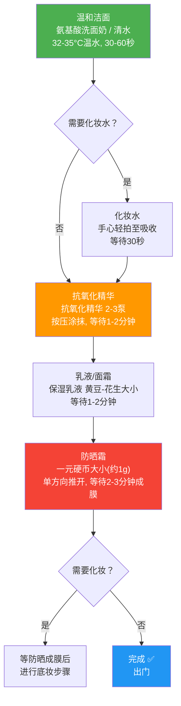

## 二、早晨护肤流程

早晨护肤的核心逻辑是**防御**——为皮肤构建一整天的保护屏障，抵御紫外线、自由基、污染物和蓝光的侵袭。如果说晚间护肤是"施工修复"，那早晨护肤就是"穿上盔甲出门"。理解这个定位，才能明白为什么早晨的步骤和产品选择与晚间截然不同。

### 2.1 为什么早晨护肤和晚间不一样

这不是营销话术，而是有生物学基础的。皮肤在白天和夜间执行的任务完全不同：

| 维度 | 白天（6:00-18:00） | 夜间（20:00-6:00） |
|------|-------------------|-------------------|
| 核心任务 | 防御外界侵害 | 修复白天损伤 |
| 皮脂分泌 | 上午10点达峰值，下午再次上升 | 逐渐减少，凌晨最低 |
| 皮肤含水量 | 早上最高，逐渐下降 | TEWL增加，水分流失加快 |
| 屏障功能 | 最强，角质层紧密排列 | 皮肤渗透性增强 |
| 黑色素合成 | 紫外线刺激后活跃 | 减缓 |
| 适合的成分 | 抗氧化剂、防晒剂 | 维A醇、酸类、修复成分 |

因此，早晨护肤的配方思路是：**温和清洁 + 抗氧化防御 + 锁水保湿 + 防晒**。不需要使用维A醇、高浓度酸类等"猛药"——这些成分会增加光敏感性，白天使用反而有害。

### 2.2 标准早晨流程（5步详解）

#### 第一步：温和洁面

**目的**：去除夜间分泌的多余油脂和代谢产物，为后续产品创造干净的吸收面。

**为什么早晨洁面要"温和"**：
- 夜间皮肤处于修复模式，皮脂分泌减少，表面的油脂层（皮脂膜）是天然保护层
- 过度清洁会洗掉这层保护膜，导致皮肤在还没有"穿好盔甲"之前就暴露在外界刺激中
- 早晨洁面的清洁力需求远低于晚间（晚间需要清除防晒、彩妆和一天的污染物）

**具体操作**：
1. 水温控制在32-35°C（微温，接近体温），过热会破坏皮脂膜，过冷清洁力不足
2. 取黄豆大小的氨基酸洗面奶，在手心加少量水搓出泡沫
3. 将泡沫涂抹于面部，用指腹轻柔打圈按摩30-60秒
4. 重点清洁T区（额头、鼻子、下巴），两颊轻轻带过即可
5. 用温水彻底冲洗干净，特别注意发际线、鼻翼两侧等容易残留的部位
6. 用干净毛巾或一次性洗脸巾轻轻按压吸干水分，不要来回擦拭

**你目前使用氨基酸洁面，完全适合早晨使用**。氨基酸类洁面的pH值（5.5-6.5）与皮肤接近，不会破坏皮脂膜。

**早晨可以只用清水的情况**：
- 干性皮肤：夜间皮脂分泌本就少，清水足够
- 敏感肌正在修复期：减少一切不必要的刺激
- 前一晚没有使用厚重的护肤品
- 冬季皮肤偏干的时期

**判断标准**：洗完脸后等1分钟，如果感觉清爽不紧绷，说明洁面产品和方法合适；如果紧绷、起皮，说明清洁过度，需要换更温和的产品或减少用量。

#### 第二步：化妆水/爽肤水（可选）

**目的**：为角质层补充水分，调节皮肤表面环境，为后续精华的渗透做准备。

**这一步到底有没有必要？**

化妆水不是必须步骤。它的核心价值取决于你的皮肤状态和后续产品：
- **需要的情况**：皮肤偏干需要额外补水层；洁面后有紧绷感需要快速缓解；后续使用的精华质地较浓稠需要化妆水帮助铺展
- **可以省略的情况**：皮肤状态良好，洁面后不紧绷；后续精华本身就是水状质地；你的护肤流程已经足够简洁高效

**化妆水的四种类型与适用场景**：

| 类型 | 核心成分 | 适用肤质 | 使用方法 |
|------|---------|---------|---------|
| 保湿型 | 透明质酸、甘油、泛醇、丁二醇 | 所有肤质，特别是干皮 | 倒在手心轻拍，或用化妆棉湿敷3分钟 |
| 控油型 | 烟酰胺、水杨酸、金缕梅提取物 | 油皮、混合皮T区 | 化妆棉轻拍，T区可多拍一次 |
| 舒缓型 | 积雪草、洋甘菊、红没药醇、泛醇 | 敏感肌、屏障受损 | 手心轻拍，避免化妆棉摩擦 |
| 功效型 | 低浓度果酸、传明酸、维C衍生物 | 有特定改善需求 | 按产品说明使用，注意与其他功效成分的冲突 |

**使用技巧**：
- **手法一（推荐）**：倒适量在手心，双手轻搓后按压到面部，从中间向两侧轻轻拍打至吸收。这种方法用量省、刺激小
- **手法二**：用化妆棉蘸取，轻轻擦拭面部。优点是可以带走洁面残留，缺点是用量大、摩擦可能刺激敏感肌
- **湿敷法**：用化妆棉浸透化妆水，敷在两颊或额头3-5分钟。适合皮肤特别干燥时急救，但不建议每天使用（过度水合会损害屏障）

**你的肤质建议**：中性偏微油，化妆水属于"可选"范畴。如果使用，选择清爽型保湿化妆水即可，不需要控油型（你的保湿乳液已经有控油成分）。

#### 第三步：抗氧化精华

**目的**：这是早晨护肤中最核心的功效步骤——在皮肤表面建立"自由基中和站"，对抗白天持续产生的氧化损伤。

**为什么抗氧化是早晨的头等大事**：

白天皮肤面临的氧化压力来源：
1. **紫外线**：UVA和UVB照射皮肤后产生大量活性氧（ROS），是光老化的直接推手
2. **蓝光（HEV光）**：电子屏幕发出的高能可见光，能穿透到真皮层，诱导自由基产生
3. **空气污染**：PM2.5、臭氧等污染物在皮肤表面引发氧化应激
4. **代谢副产物**：皮肤自身代谢过程中也会产生自由基

自由基会攻击细胞膜的脂质（脂质过氧化）、破坏DNA、降解胶原蛋白——这就是皮肤暗沉、老化、色斑的底层机制。抗氧化精华的作用是"牺牲自己"：它的成分优先被氧化，从而保护皮肤细胞。

**你目前使用珀莱雅抗氧化精华（仅早上），这个选择非常正确**。抗氧化精华的核心成分：

| 成分 | 抗氧化机制 | 特点 |
|------|-----------|------|
| 虾青素 | 类胡萝卜素，猝灭单线态氧和过氧自由基 | 抗氧化能力是维E的500-1000倍，自然界最强抗氧化剂之一 |
| 麦角硫因 | 螯合金属离子，减少金属催化的氧化反应 | 高温和极端pH下仍稳定，独特的细胞保护机制 |

**具体使用方法**：
1. 洁面后趁皮肤微湿时使用（微湿状态有助于活性成分渗透）
2. 取2-3泵精华液于手心
3. 双手轻搓均匀后，从面部中央向两侧轻轻按压涂抹
4. 重点关注容易光损伤的区域：颧骨（最容易长色斑）、鼻梁、额头
5. 轻轻拍打至完全吸收，等待1-2分钟让活性成分渗透后再进行下一步
6. 不要用力揉搓——精华需要时间渗透，揉搓反而会把它从皮肤上"搓走"

**优化建议**：抗氧化精华的抗氧化成分不仅对抗紫外线产生的自由基，还能对抗夜间代谢产生的活性氧。**建议晚上也叠加使用**，实现24小时不间断的抗氧化保护。早晚各用2-3泵，一个月大约消耗一瓶（30ml规格）。

**如果想要更强的抗氧化效果**：可以考虑在抗氧化精华之后叠加一层原型维C精华（L-抗坏血酸，浓度10-15%）。维C+虾青素+麦角硫因的三重抗氧化组合，防护力远超单一成分。但要注意：原型维C需要低pH环境（<3.5）才能有效渗透，可能对敏感肌有刺激，新手建议先单独使用抗氧化精华1-2个月再考虑叠加。

#### 第四步：乳液/面霜

**目的**：锁住前序产品的水分和活性成分，在皮肤表面形成保护膜，维持屏障完整性。

**乳液和面霜的区别**：

| 维度 | 乳液 | 面霜 |
|------|------|------|
| 水油比例 | 含水量高（60-80%），油量低 | 含油量高（40-60%），水量低 |
| 质地 | 轻薄、流动性强 | 浓稠、膏状 |
| 封闭性 | 弱，透气性好 | 强，锁水能力更强 |
| 适用肤质 | 油皮、混合皮、中性皮 | 干皮、极干皮 |
| 适用季节 | 夏季、春秋季 | 冬季、干燥季节 |

**核心原则：二选一，不要同时使用**。面霜和乳液的功能一样（锁水保湿），同时涂抹不会"加倍保湿"，只会让皮肤表面积累过多油脂，增加闷痘和粉刺风险。

**你目前使用保湿乳液（适乐肤保湿乳液），这款产品非常适合你的肤质**：
- **神经酰胺1/3/6-II**：直接补充角质层细胞间脂质（"水泥"），修复和强化屏障
- **烟酰胺（约4%）**：控油、提亮、促进神经酰胺合成，一举多得
- **MVE缓释技术**：活性成分缓慢释放，提供24小时持续保湿
- **质地轻薄不油腻**：中性偏微油肤质使用没有负担

**季节性调整**：
- **夏季**：保湿乳液的质地已经足够，不需要额外叠加。如果感觉出油多，可以减少用量（薄薄一层即可）
- **春秋季**：正常使用保湿乳液，取黄豆到花生大小的量，均匀涂抹
- **冬季**：如果感觉保湿力度不够，可以在保湿乳液之后叠加一层清爽型面霜。或者在特别干燥的局部区域（如两颊）多涂一层保湿乳液

**涂抹手法**：
1. 取适量于手心（黄豆到花生大小，根据季节和肤质调整）
2. 双手轻搓温热后，从面部中央向两侧按压涂抹
3. 从下往上、从内往外的方向，对抗地心引力（虽然单靠涂抹不能抗老，但至少不要加速下垂）
4. 颈部也要涂抹——颈部皮肤同样需要保湿，而且颈部老化非常显眼
5. 等待1-2分钟让乳液完全吸收后再涂防晒

#### 第五步：防晒霜

**目的**：抵御紫外线，防止光老化。这是早晨护肤流程中最重要的一步，没有之一。

**为什么防晒是"最重要的一步"**：

紫外线对皮肤的伤害是累积性的、不可逆的：
- **UVA（长波紫外线，320-400nm）**：穿透力强，能穿透玻璃和云层，直达真皮层。破坏胶原蛋白和弹性蛋白，导致皮肤松弛、皱纹、色斑。UVA是光老化的主因，占外源性皮肤老化的80%
- **UVB（中波紫外线，280-320nm）**：主要作用于表皮层，导致晒伤、晒红、炎症。UVB强度随季节和时间变化明显
- **HEV光（蓝光，400-500nm）**：电子屏幕、LED灯发出的高能可见光。虽然能量低于紫外线，但长期暴露也能诱导自由基产生和色素沉着

一项著名的研究（《新英格兰医学杂志》2012年）展示了一位卡车司机的面部照片：靠窗一侧的皮肤因28年的UVA暴露严重老化，出现深度皱纹和皮革样质地，而另一侧相对正常。这就是UVA"不动声色"的破坏力。

**用量——防晒效果的生命线**：

防晒霜的防护效果与涂抹量直接相关。SPF测试标准用量是2mg/cm²，换算到面部大约是**一元硬币大小的量（约1g）**。

| 涂抹量（相对标准量） | 实际SPF防护 | 说明 |
|-------------------|------------|------|
| 100%（标准量） | 标注SPF值 | 理想状态 |
| 75% | 约50-60%标注值 | 大多数人的实际涂抹量 |
| 50% | 约30%标注值 | 常见的"薄涂一层" |
| 25% | 约10%标注值 | 几乎等于没涂 |

涂不够=没防晒。很多人抱怨防晒没效果，根本原因是用量不足。

**涂抹技巧**：
1. 在护肤最后一步（乳液/面霜吸收后）使用
2. 先在面部点涂5-6个点：额头正中、鼻尖、左颊、右颊、下巴
3. 用指腹从内向外均匀推开，**单方向推开，不要来回涂抹**（来回涂抹容易搓泥，也破坏防晒膜的均匀性）
4. 容易遗漏的区域必须覆盖：发际线、耳朵正面和耳后、下巴边缘、颈部
5. 颈部前后都要涂——颈部皮肤同样容易光老化，而且颈部皱纹（"颈纹"）非常显老
6. 涂抹后**等待2-3分钟让防晒成膜**。成膜后防晒才能发挥最大防护力，在这之前不要碰脸或涂其他东西
7. 如果需要化妆，等防晒成膜后再进行底妆步骤

**补涂策略**：

| 场景 | 补涂频率 | 补涂方法 |
|------|---------|---------|
| 室内办公（不靠窗） | 不需要补涂 | 防晒膜足够维持一天 |
| 室内靠窗/开车 | 每3-4小时补涂一次 | 防晒喷雾或防晒粉饼 |
| 户外活动 | 每2小时补涂一次 | 先用纸巾按压去油，再涂防晒 |
| 游泳/大量出汗 | 出水后立即补涂 | 使用防水型防晒，每次出水都要补 |
| 户外高强度（登山/海边） | 每1-1.5小时补涂 | 防水型防晒+物理遮挡（帽子、墨镜） |

**你目前有使用防晒霜的习惯，非常好**。针对你的中性偏微油肤质，防晒选择建议：
- **质地**：摇摇乐型、水感型、控油型，避免滋润型（容易油腻闷痘）
- **成分偏好**：含硅粉体（如聚二甲基硅氧烷）的防晒通常更清爽控油
- **避免**：高酒精含量的防晒（虽然肤感清爽，但长期使用可能破坏屏障）

### 2.3 早晨护肤流程的进阶优化

#### 等待时间：被忽略的关键细节

很多人的早晨护肤效果不好，不是产品选错了，而是步骤之间没有留出足够的等待时间。活性成分需要时间渗透到皮肤中，赶着涂下一层会稀释前一层的浓度，甚至导致产品之间"打架"。

**推荐的等待时间**：

| 步骤 | 最短等待时间 | 原因 |
|------|------------|------|
| 化妆水→精华 | 30秒-1分钟 | 让角质层充分水合，提高精华渗透率 |
| 精华→乳液/面霜 | 1-2分钟 | 让活性成分渗透到目标层，而不是被面霜"封"在表面 |
| 乳液/面霜→防晒 | 1-2分钟 | 让保湿膜稳定，减少与防晒的搓泥风险 |
| 防晒涂抹→出门/化妆 | 2-3分钟 | 让防晒膜完全形成，发挥最大防护力 |

**总计**：完整的早晨流程需要6-10分钟。如果觉得太慢，可以在等待时间里做其他事情（刷牙、换衣服、准备早餐），把护肤融入日常节奏。

#### 产品兼容性：早晨护肤的"打架"预警

早晨使用的成分相对简单（主要是抗氧化+保湿），冲突风险比晚间低。但仍有一些需要注意的组合：

| 组合 | 问题 | 解决方案 |
|------|------|---------|
| 原型维C（低pH）+ 烟酰胺 | 理论上可能生成烟酸，实际风险极低 | 可以一起用；担心的话先VC后烟酰胺，间隔2分钟 |
| 维C精华 + 含金属离子的化妆水 | 金属离子催化维C氧化 | 避免同时使用含铜/铁离子的产品 |
| 高浓度酒精化妆水 + 防晒 | 酒精可能破坏防晒膜 | 先等化妆水完全吸收再涂防晒 |
| 多种精华叠加 | 总量过多影响吸收 | 早晨最多1-2种精华，多了皮肤吸收不了 |

**最安全的早晨组合**：氨基酸洁面 → 保湿化妆水 → 抗氧化精华 → 保湿乳液 → 防晒。这个组合中的成分没有任何冲突，可以放心每天使用。

#### 针对不同肤质的早晨微调

| 肤质 | 洁面调整 | 精华调整 | 乳液/面霜调整 | 防晒调整 |
|------|---------|---------|-------------|---------|
| 油皮 | 正常使用氨基酸洁面，T区可多按摩几秒 | 抗氧化精华正常用 | 乳液薄涂，夏季可只涂T区以外 | 选控油型/摇摇乐质地 |
| 干皮 | 早晨可只用清水 | 抗氧化精华正常用 | 面霜代替乳液，或乳液后叠加面霜 | 选滋润型，避免高酒精 |
| 混合皮 | 正常使用，T区重点清洁 | 抗氧化精华正常用 | T区薄涂，两颊正常量 | 全脸统一用清爽型即可 |
| 敏感肌 | 早晨只用清水或极温和洁面 | 抗氧化精华如无刺激正常用 | 含神经酰胺的修复型乳液 | 物理防晒（氧化锌/二氧化钛） |

### 2.4 早晨护肤流程图

**预计用时**：5-8分钟（不含等待时间中的"顺便做其他事"）

### 2.5 不同场景的早晨护肤方案

#### 场景一：时间充裕（10-15分钟）

按标准5步流程执行，每步之间留足等待时间。这是效果最好的方案。

氨基酸洁面（1分钟）→ 等待30秒 → 化妆水轻拍 → 等待30秒
→ 抗氧化精华按压涂抹 → 等待2分钟 → 保湿乳液涂抹 → 等待2分钟
→ 防晒霜涂抹 → 等待3分钟成膜 → 出门

#### 场景二：时间紧张（3-5分钟）

精简为3步核心流程，省略化妆水，压缩等待时间：

清水/快速洁面（30秒）→ 抗氧化精华快速涂抹 → 防晒霜（可选带保湿功能的防晒代替乳液+防晒两步）

**省时技巧**：
- 使用带保湿功能的防晒霜（如含透明质酸的防晒），可以省略乳液步骤
- 洁面用清水代替洗面奶（前提是前一晚护肤不过于厚重）
- 精华等产品在刷牙时等待吸收，把时间"叠"起来用

#### 场景三：极简版（1分钟）

如果只能做一步，选择防晒：

清水洗脸 → 防晒霜（兼具保湿功能的防晒）

防晒是唯一不可替代的步骤。抗氧化、保湿可以靠前一天晚上的护肤"预存"，但防晒只能在白天实时提供。

#### 场景四：居家办公/不出门

很多人认为"不出门不用防晒"，这是一个需要区分对待的问题：

| 情况 | 是否需要防晒 | 原因 |
|------|------------|------|
| 完全不靠近窗户 | 可以不涂 | 紫外线无法穿透墙壁 |
| 靠窗办公/坐在窗边 | 必须涂 | UVA能穿透玻璃 |
| 开灯办公（LED灯） | 建议涂 | LED灯发出少量蓝光 |
| 短暂出门取快递/倒垃圾 | 建议涂 | 紫外线365天存在，即使阴天 |

**居家办公的简化方案**：清水洁面 → 抗氧化精华 → 保湿乳液（省略防晒，除非靠窗）。

#### 场景五：运动前的护肤

晨跑或晨练前的护肤需要特别考虑：

- **运动前30分钟涂防晒**（户外运动必须涂）
- **不要涂太厚重的乳液/面霜**：运动时出汗多，厚重产品会堵塞毛孔
- **运动后重新洁面+护肤**：汗水和油脂混合会堵塞毛孔，运动后需要重新清洁
- **选择防水型防晒**：出汗不会冲掉

运动前：清水洁面 → 防晒（防水型）
运动后：氨基酸洁面 → 化妆水 → 抗氧化精华 → 保湿乳液 → 防晒（重新涂）

### 2.6 早晨护肤的季节性调整

#### 春季（3-5月）

春季温差大、花粉多，皮肤容易敏感。早晨护肤的重点是**维稳**：
- 洁面：温和氨基酸洁面，不要换新产品
- 精华：抗氧化精华正常用，暂时不要叠加新的功效成分
- 乳液：保湿乳液正常用
- 防晒：SPF30-50，注意选择不含酒精的温和配方
- **额外注意**：花粉季节，外出回来后建议用清水冲洗面部，减少花粉残留

#### 夏季（6-8月）

夏季皮脂分泌旺盛，紫外线最强。早晨护肤的重点是**控油+高倍防晒**：
- 洁面：可以正常力度清洁，T区可多按摩几秒
- 化妆水：可选控油型（含烟酰胺的）
- 精华：抗氧化精华正常用
- 乳液：保湿乳液薄涂即可，夏季不需要额外面霜
- 防晒：SPF50+/PA++++，必须涂够量，户外每2小时补涂
- **省时技巧**：夏天可以用清爽型防晒代替乳液+防晒的两步

#### 秋季（9-11月）

秋季空气湿度下降，夏季紫外线损伤开始显现。早晨护肤的重点是**保湿过渡+修复**：
- 洁面：开始从清洁型向温和型过渡
- 化妆水：保湿型化妆水开始派上用场
- 精华：抗氧化精华正常用，可以考虑叠加一层保湿精华（如透明质酸精华）
- 乳液：保湿乳液正常用量
- 防晒：SPF30-50即可，但不能停

#### 冬季（12-2月）

冬季皮脂分泌最少，室内外温差大，暖气导致空气干燥。早晨护肤的重点是**深层保湿+屏障维护**：
- 洁面：早晨只用清水或极温和洁面，减少皮脂流失
- 化妆水：高保湿型，可以叠加两次（拍两遍）
- 精华：抗氧化精华正常用
- 乳液：保湿乳液之后可以在干燥区域（两颊）叠加清爽面霜
- 防晒：SPF30即可，选择滋润型防晒，避免高酒精含量

### 2.7 早晨护肤的常见错误

#### 错误一：早上不用洗面奶直接护肤

**为什么是错的**：虽然早晨洁面可以温和，但完全不清洁直接护肤，前一晚的护肤品残留和夜间分泌的油脂会阻碍后续产品的吸收。对于中性偏微油肤质，至少用清水清洗。

**正确做法**：根据肤质选择——油皮用氨基酸洁面，中性皮清水或温和洁面，干皮清水即可。

#### 错误二：精华涂在面霜之后

**为什么是错的**：面霜的油脂膜会在皮肤表面形成封闭层，阻碍精华中活性成分的渗透。精华的分子小、需要渗透到皮肤深层，被面霜"挡"在外面就失去了意义。

**正确做法**：严格遵守"先水后油、先薄后厚"的顺序。精华一定在乳液/面霜之前。

#### 错误三：防晒涂不够量

**为什么是错的**：防晒的SPF值是在2mg/cm²的标准用量下测得的。涂一半的量，防护力不是减半，而是可能只有标称值的1/3甚至更低。

**正确做法**：面部使用一元硬币大小的量（约1g），宁可多涂不要少涂。觉得油腻？换一款质地更清爽的防晒，而不是减少用量。

#### 错误四：涂完防晒立刻出门

**为什么是错的**：防晒霜需要时间在皮肤表面形成均匀的防护膜。化学防晒剂需要15-20分钟与皮肤充分结合；即使是物理防晒，也需要2-3分钟让膜稳定。

**正确做法**：涂完防晒后等待至少2-3分钟（化学防晒建议15-20分钟），让防晒成膜后再出门。

#### 错误五：只涂脸不涂脖子

**为什么是错的**：颈部皮肤比面部更薄、皮脂腺更少，更容易老化和产生皱纹。颈部老化是"出卖年龄"的重灾区。

**正确做法**：防晒和乳液都要延伸到颈部，前后都要涂。如果觉得浪费，可以把涂完面部后手上残留的产品拍到脖子上。

#### 错误六：早晨使用维A醇/高浓度酸类

**为什么是错的**：维A醇会增加皮肤对紫外线的敏感性，白天使用不仅不能抗老，反而会加速光损伤。高浓度果酸/水杨酸同理——去角质后的皮肤屏障暂时变弱，白天使用等于"裸奔"。

**正确做法**：维A醇、酸类产品只在晚间使用。早晨的精华选抗氧化类（如抗氧化精华、维C精华）。

### 2.8 早晨护肤常见问题解答

**Q：早上不化妆需要涂防晒吗？**

需要。紫外线无处不在——晴天、阴天、雨天、室内靠窗、开车都有UVA照射。前面提到的卡车司机案例证明，UVA能穿透玻璃，28年的日常暴露足以造成严重的光老化。防晒不是"化妆"的一部分，而是"护肤"的一部分。

**Q：防晒霜之后可以化妆吗？**

可以。等防晒成膜后（2-3分钟），再进行底妆步骤。需要注意：
- 选择与防晒质地兼容的底妆产品，避免"搓泥"
- 如果防晒是水基的，底妆也选水基的；防晒是硅基的，底妆选硅基兼容的
- 搓泥的常见原因：防晒没等成膜就上底妆、底妆和防晒成分冲突、前面步骤涂了太多层

**Q：早上时间紧张怎么办？**

最简版：清水洗脸 → 防晒。如果只能做一步，选择防晒。
省时版：使用带保湿功能的防晒，省略乳液步骤，把精华和防晒的等待时间用来做其他事。

**Q：涂了防晒需要卸妆吗？**

取决于防晒类型：
- **非防水型防晒**：氨基酸洗面奶清洗两遍即可（双重清洁法）
- **防水型防晒**：建议先用卸妆产品，再用洗面奶
- **纯物理防晒**：因为不渗入皮肤，洗面奶通常能洗干净

**Q：抗氧化精华和防晒的顺序可以反过来吗？**

不可以。抗氧化精华需要渗透到皮肤中才能发挥作用，防晒需要在最外层形成完整的防护膜。如果防晒在精华下面，防晒膜会阻碍精华的渗透；如果精华在防晒上面，精华会破坏防晒膜的完整性。正确顺序：精华→乳液→防晒。

**Q：阴天/冬天需要涂防晒吗？**

需要。UVA穿透力极强，阴天仍有80%的UVA穿透云层。冬季紫外线虽然弱于夏季，但累积效应不可忽视——你脸上的每一条皱纹和每一个色斑，都是过去所有紫外线暴露的总和。防晒是365天的事。

**Q：抗氧化精华用了几个月效果不明显怎么办？**

首先确认期望值是否合理——抗氧化的主要作用是"预防"而非"逆转"。你看不到的自由基被中和了、光损伤被减缓了，这些效果体现在"没有变得更差"上，而不是明显的视觉改善。如果想要可见的美白效果，可以在抗氧化精华之后叠加维C精华（10-15%原型VC或VC衍生物），或者在晚间加入烟酰胺/熊果苷等美白成分。

**Q：护肤品用在防晒之前会不会影响防晒效果？**

正常的护肤步骤（洁面→化妆水→精华→乳液→防晒）不会影响防晒效果，前提是每一步都留出足够的吸收时间。真正影响防晒效果的是：(1) 用量不足；(2) 涂抹不均匀；(3) 防晒膜被后续产品破坏（如在防晒上面再涂东西）。

***

