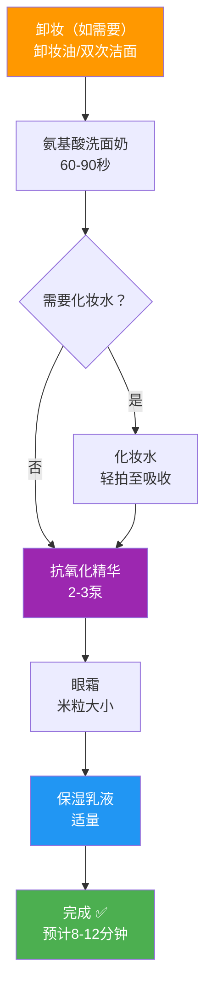

## 三、晚间护肤流程

晚间护肤的核心逻辑是**修复**——利用夜间皮肤的自我修复窗口期，通过清洁去除一天的负担，再用功效性成分为皮肤的"施工队"提供原料。如果说早晨护肤是"穿上盔甲出门"，那晚间护肤就是"脱下盔甲、检修加固"。理解这个定位，才能明白为什么晚间可以使用比早晨更"猛"的成分，以及为什么清洁步骤比早晨更复杂。

### 3.1 为什么晚间护肤比早晨更重要

这不是营销话术。从皮肤生物学的角度看，夜间是皮肤真正的"工作时间"：

#### 夜间皮肤发生了什么

| 维度 | 白天（6:00-18:00） | 夜间（20:00-6:00） |
|------|-------------------|-------------------|
| 核心任务 | 防御外界侵害 | 修复白天损伤 |
| 细胞分裂速度 | 基准水平 | 比白天快约2倍（晚11点-凌晨2点峰值） |
| 皮脂分泌 | 上午10点达峰值，下午再次上升 | 逐渐减少，凌晨2-4点最低 |
| 皮肤含水量 | 早上最高，逐渐下降 | TEWL增加，水分流失加快 |
| 皮肤pH值 | 5.5-6.0（偏中性） | 4.5-5.0（更偏酸性） |
| 皮肤温度 | 约32-33°C | 比白天高约0.5°C，毛细血管扩张 |
| 屏障功能 | 最强，角质层紧密排列 | 皮肤渗透性增强，吸收效率提高 |
| 激素环境 | 皮质醇（压力激素）水平高 | 皮质醇下降，生长激素上升，褪黑素分泌增加 |
| 适合的成分 | 抗氧化剂、防晒剂 | 维A醇、酸类、修复成分 |

这些变化意味着三件事：

**第一，夜间吸收效率更高。** 皮肤渗透性增强，活性成分更容易到达目标层。这就是为什么维A醇、酸类等"猛药"适合在晚间使用——同样的成分，夜间的利用效率比白天高，同时不用担心紫外线带来的光敏感问题。

**第二，细胞更新在夜间达到高峰。** 晚上11点至凌晨2点，皮肤细胞分裂速度比白天快约2倍。细胞更新需要原料——蛋白质、脂质、抗氧化物质。如果你没有通过护肤提供这些"建材"，细胞更新就只能"巧妇难为无米之炊"。

**第三，夜间水分流失加快。** TEWL（经皮水分流失）在夜间增加，如果不做好保湿，皮肤会在你睡觉时悄悄变干。这就是为什么晚间保湿不能省略，而且可以比早晨稍厚一些。

> **科学背景**：2017年诺贝尔生理学或医学奖授予了生物钟基因（Period基因）的发现者，证实了昼夜节律对全身（包括皮肤）的深远影响。皮肤的CLOCK、BMAL1、PER、CRY等生物钟基因调控着细胞分裂、皮脂分泌、屏障修复等几乎所有功能。晚间护肤的本质，是顺应这些基因的工作节律。

### 3.2 晚间护肤的完整逻辑框架

在进入具体步骤之前，先理解晚间护肤的底层逻辑。所有步骤都围绕一个核心目标：**清洁 → 修复 → 保湿**。

```mermaid
flowchart TD
    A["日间积累"] --> B["卸妆/洁面<br/>去除负担"]
    B --> C["化妆水<br/>打开通道"]
    C --> D["功效精华<br/>提供原料"]
    D --> E["眼霜<br/>精细护理"]
    E --> F["乳液/面霜<br/>锁住营养"]
    F --> G["特殊护理<br/>每周1-2次"]

    B -.->|"去除|防晒、彩妆、油脂、污染物、灰尘"]
    D -.->|"提供|维A醇、胜肽、神经酰胺、抗氧化剂"]
    F -.->|"形成|封闭性保护膜，减少夜间TEWL"]

    style A fill:#f44336,color:#fff
    style B fill:#FF9800,color:#fff
    style D fill:#9C27B0,color:#fff
    style F fill:#2196F3,color:#fff
```

**为什么晚间需要"先清后补"**：白天皮肤表面积累了一层"负担"——防晒膜、皮脂、空气污染物（PM2.5、重金属微粒）、汗液蒸发后的盐分结晶。这些东西如果不清除，会：(1) 阻碍后续功效成分的渗透；(2) 堵塞毛孔，引发粉刺和痘痘；(3) 在皮肤表面持续产生氧化应激。所以晚间护肤的第一步，一定是彻底清洁。

### 3.3 标准晚间流程（5-6步详解）

#### 第一步：卸妆（如使用了防晒霜/化妆品）

**目的**：溶解和去除油性污垢——防晒膜、彩妆、多余皮脂。

**为什么需要专门卸妆**：

防晒霜（尤其是防水型）的配方设计就是要"牢牢附着在皮肤上"。普通的氨基酸洗面奶（水溶性表面活性剂）对这类油性成膜剂的清洁力有限。如果防晒没有被彻底清除，残留物会堵塞毛孔，长期下来导致闭口粉刺和肤色暗沉。

**卸妆产品的分类与选择**：

| 类型 | 主要成分 | 清洁力 | 温和度 | 适用场景 | 使用方法 |
|------|---------|--------|--------|---------|---------|
| 卸妆油 | 植物油/矿物油+乳化剂 | ★★★★★ | ★★★ | 浓妆、防水防晒 | 干手干脸按摩1-2分钟，加水乳化至白色，冲洗 |
| 卸妆膏 | 油脂+蜡质+乳化剂 | ★★★★★ | ★★★ | 浓妆、防水防晒 | 挖取适量在手心搓热，上脸按摩，加水乳化 |
| 卸妆乳 | 水油乳化体系 | ★★★ | ★★★★ | 淡妆、日常防晒 | 干手干脸按摩后冲洗 |
| 卸妆啫喱 | 水溶性凝胶 | ★★ | ★★★★★ | 极淡妆、非防水防晒 | 干手干脸按摩后冲洗 |
| 卸妆水 | 水+表面活性剂 | ★★ | ★★★★ | 淡妆、日常防晒 | 化妆棉蘸取擦拭 |
| 卸妆湿巾 | 无纺布+卸妆液 | ★★ | ★★ | 应急、外出携带 | 擦拭，不作为常规方案 |

**双重清洁法（Double Cleansing）详解**：

这是目前护肤界公认最有效的清洁策略，分两步完成：

1. **第一遍：油溶性清洁**（卸妆油/膏）——"以油溶油"。防晒膜、彩妆、多余皮脂都是油溶性的，需要用油基产品来溶解。卸妆油中的油脂成分与皮肤表面的油性污垢相似相溶，乳化剂遇水后将溶解了污垢的油脂带走。
2. **第二遍：水溶性清洁**（氨基酸洗面奶）——去除卸妆产品的残留和水溶性污垢（汗液、灰尘）。

**关键操作细节**：
- 卸妆油必须**干手干脸**使用——手上或脸上有水会提前乳化，降低清洁效果
- 按摩时间1-2分钟即可，不要超过3分钟——过长时间按摩反而会把溶解的污垢重新按进毛孔
- 加水乳化时，要按摩至卸妆油完全变成**白色乳液状**，这说明乳化充分
- 乳化不彻底是卸妆最常见的问题——残留的卸妆油会堵塞毛孔
- 水温建议32-35°C微温水，有助于乳化

**你目前使用氨基酸洁面，防晒霜如果不是特别防水的类型，可以采用"双次洁面法"代替卸妆**：用氨基酸洗面奶洗两遍。第一遍快速去除表面油脂和大部分防晒（30秒），第二遍深层清洁（60-90秒）。这个方法对非防水型防晒已经足够。

#### 第二步：洁面

**目的**：去除卸妆产品残留、深层污垢和多余油脂，为后续功效成分创造干净的吸收面。

**为什么晚间洁面力度可以比早晨大**：
- 晚间需要清除的"负担"更重（防晒、一天的油脂和污染物）
- 晚间清洁后不需要立刻出门面对外界刺激
- 夜间皮肤进入修复模式，即使清洁力度稍大，也有整夜时间恢复

**具体操作**：
1. 水温控制在32-35°C（微温，接近体温）。**温度是关键**——过热的水（>40°C）会破坏皮脂膜，加速水分流失，还会刺激皮脂腺反射性分泌更多油脂；过冷的水（<25°C）清洁力不足，无法有效去除油脂
2. 取黄豆到花生大小的氨基酸洗面奶，在手心加少量水充分搓出泡沫
3. 将泡沫涂抹于面部，用指腹轻柔打圈按摩60-90秒
4. 晚间可以比早晨多按摩30秒——重点清洁T区（额头、鼻子、下巴），两颊轻轻带过
5. 特别注意清洁死角：发际线（容易残留洗面奶）、鼻翼两侧（皮脂分泌旺盛）、下巴边缘（容易被忽略）
6. 用温水彻底冲洗干净，至少冲洗20次以上——残留的表面活性剂会刺激皮肤
7. 用干净毛巾或一次性洗脸巾**轻轻按压吸干水分**，不要来回擦拭

**洁面水温对照表**：

| 水温 | 效果 | 建议 |
|------|------|------|
| 冷水（<25°C） | 清洁力不足，毛孔收缩不利于清洁 | 不推荐 |
| 微温水（32-35°C） | 清洁力好，不破坏皮脂膜 | ✅ 最佳选择 |
| 温水（36-40°C） | 清洁力强，但开始破坏皮脂膜 | 偶尔可用，不推荐每天 |
| 热水（>40°C） | 严重破坏皮脂膜，刺激皮脂腺 | ❌ 禁止 |

**判断清洁是否适度的标准**：洗完脸等1分钟，如果感觉清爽不紧绷，说明清洁适度；如果紧绷、起皮、发涩，说明清洁过度。晚间可以接受比早晨略紧一点的感觉（因为后续会用功效产品和保湿），但如果明显紧绷，说明产品或方法需要调整。

#### 第三步：化妆水/爽肤水（可选）

**目的**：为角质层补充水分，调节皮肤表面pH值，为后续精华渗透打开通道。

**晚间化妆水与早晨的区别**：

| 维度 | 早晨 | 晚间 |
|------|------|------|
| 核心功能 | 基础保湿、舒缓 | 可以带功效性 |
| 成分选择 | 保湿型、舒缓型 | 可选含低浓度果酸、传明酸等功效成分 |
| 使用手法 | 轻拍 | 轻拍或湿敷 |
| 注意事项 | 不影响后续防晒膜 | 不与酸类精华叠加 |

**晚间化妆水的进阶用法**：
- **湿敷法**：用化妆棉浸透化妆水，敷在两颊或额头3-5分钟。适合皮肤特别干燥或暗沉时急救。但**不建议每天使用**——过度水合会破坏角质层结构，反而损害屏障
- **叠加法**：拍两遍化妆水，第一遍快速补水，第二遍等30秒再拍，让角质层充分水合。适合换季干燥时期
- **功效型化妆水**：含低浓度果酸（2-5%甘醇酸或乳酸）的化妆水可以在晚间使用，起到温和去角质的作用。但**当晚不要再叠加酸类精华**，避免过度刺激

**你目前的建议**：中性偏微油肤质，晚间化妆水属于可选步骤。如果使用，选清爽型保湿化妆水即可。

#### 第四步：功效性精华（核心步骤）

**目的**：这是晚间护肤最核心的步骤——利用夜间皮肤渗透性增强的优势，将高浓度活性成分送达目标层，执行修复、抗老、美白、控油等任务。

**为什么晚间可以使用更"猛"的成分**：

| 成分 | 为什么适合晚间 | 为什么不适合白天 |
|------|--------------|----------------|
| 维A醇（视黄醇） | 促进细胞更新，与夜间细胞分裂高峰协同 | 光敏感，紫外线加速降解并增加皮肤敏感性 |
| 高浓度酸类（果酸/水杨酸） | 去角质后皮肤屏障暂时变弱，夜间有时间修复 | 去角质后的皮肤更易受紫外线伤害 |
| 高浓度维C（原型VC） | 深层美白、促进胶原合成 | 低pH配方可能增加光敏感性（VC衍生物白天可用） |
| 修复类成分（神经酰胺、积雪草） | 与夜间屏障修复机制协同 | 白天也可用，但夜间渗透率更高，效果更好 |

**当前方案优化**：你目前只在早上使用抗氧化精华，**建议晚间也加入**。原因：
- 抗氧化不仅对抗紫外线产生的自由基，还要对抗代谢副产物和蓝光（电子屏幕）产生的活性氧
- 夜间细胞更新过程中也会产生自由基，抗氧化成分能保护新生细胞
- 虾青素和麦角硫因在夜间渗透率更高，利用效率更好
- 实现24小时不间断的抗氧化保护

**晚间精华的进阶选择**（根据需求选择1-2种，不要同时使用太多）：

**选项一：维A醇（视黄醇）精华——抗老金标准**

维A醇是目前证据最充分的抗老成分，被皮肤科医生称为"抗老金标准"。

作用机制：
- 促进角质细胞更新，加速老旧角质脱落
- 刺激真皮层成纤维细胞合成胶原蛋白
- 抑制胶原蛋白降解酶（MMPs）的活性
- 调节皮脂腺功能，减少皮脂分泌
- 抑制黑色素生成，淡化色斑

维A类成分的转化链路：
视黄醇酯（最温和）→ 视黄醇 → 视黄醛 → 维A酸（最强效）
   ↑ 需要3步转化      ↑ 需要2步转化  ↑ 需要1步转化  ↑ 直接起效
   ↑ 效果最弱          ↑ 非处方主流    ↑ 效果更强     ↑ 处方药

建立耐受的方法（以0.3%视黄醇为例）：
1. 第1周：每隔3天使用一次（一周2次）
2. 第2周：每隔2天使用一次（一周3次）
3. 第3周：隔天使用
4. 第4周及以后：每天使用

注意事项：
- 孕妇、备孕期禁用（维A酸类成分有致畸风险）
- 初期可能出现"爆痘期"——皮肤加速代谢，将深层闭口排出，通常持续2-4周
- 使用维A醇的当晚，**不要叠加酸类产品**（水杨酸、果酸），否则刺激性翻倍
- 第二天早上**必须加强防晒**（SPF50+，涂够量）

**选项二：烟酰胺精华——全能选手**

- 控油：调节皮脂腺分泌
- 美白：阻断黑色素向角质细胞的转运
- 修复屏障：促进神经酰胺合成
- 抗炎：减轻炎症后色素沉着

有效浓度：2-5%（日常护肤），10%以上需谨慎。

你目前使用的保湿乳液中已含有约4%的烟酰胺，如果再叠加高浓度烟酰胺精华，总浓度可能过高，少数人会出现泛红、刺痛（不耐受反应）。**建议先确认保湿乳液中的烟酰胺含量是否满足需求，再决定是否额外叠加。**

**选项三：胜肽精华——温和抗老**

胜肽是小分子蛋白质片段，能向皮肤细胞发送信号，调节细胞功能。常见类型：

| 胜肽类型 | 代表成分 | 作用 | 特点 |
|---------|---------|------|------|
| 信号肽 | 棕榈酰五肽-4（Matrixyl） | 刺激胶原蛋白和弹性蛋白合成 | 温和，适合入门 |
| 神经递质抑制肽 | 乙酰基六肽-8（Argireline） | 抑制表情肌收缩，淡化动态纹 | 被称为"类肉毒肽" |
| 载体肽 | 铜肽（GHK-Cu） | 携带铜离子促进愈合和胶原再生 | 修复能力强 |
| 酶抑制肽 | 大豆蛋白肽 | 抑制MMPs，减缓胶原蛋白降解 | 与其他胜肽协同 |

胜肽的优点是温和不刺激，可与大多数成分搭配，适合不耐受维A类成分的人群。局限性是效果比维A醇温和，需要较长时间才能看到效果。

**选项四：修复精华——屏障急救**

含神经酰胺、积雪草、泛醇等成分的修复精华，适合以下场景：
- 屏障受损时期（使用酸类/维A醇后出现泛红、刺痛）
- 换季敏感时期
- 皮肤状态不稳定的维护期

**精华的使用顺序原则**（如叠加两种精华）：
1. **先水后油**：水状精华先用，油状/乳状精华后用
2. **先薄后厚**：质地轻薄的先用，浓稠的后用
3. **先渗透后屏障**：需要深入渗透的（如维A醇）先用，作用于表面的（如烟酰胺）后用
4. 不确定时，按"先水后油"原则

**具体使用方法**：
1. 洁面后趁皮肤微湿时使用（微湿状态有助于活性成分渗透）
2. 取2-3泵精华液于手心
3. 双手轻搓均匀后，从面部中央向两侧轻轻按压涂抹
4. 重点关注区域：T区（控油需求）、颧骨（色斑风险区）、法令纹区域（抗老需求）
5. 轻轻拍打至完全吸收，等待2-3分钟让活性成分渗透后再进行下一步
6. 不要用力揉搓——精华需要时间渗透，揉搓反而会把它从皮肤上"搓走"

#### 第五步：眼霜

**目的**：针对性护理眼周这个面部最脆弱的区域。

**为什么眼周需要单独护理**：

眼周皮肤与面部其他区域有显著差异：

| 维度 | 眼周皮肤 | 面部其他区域 |
|------|---------|-------------|
| 厚度 | 约0.5mm | 约2mm |
| 皮脂腺 | 极少 | 较多 |
| 胶原蛋白 | 少，支撑力弱 | 较多 |
| 毛细血管 | 密集，容易透出 | 较少 |
| 运动频率 | 每天眨眼约10000次 | 相对静止 |

这些差异导致眼周最容易出现：干燥细纹（皮脂腺少，保湿能力差）、黑眼圈（毛细血管透出+色素沉着）、眼袋（支撑力弱+水肿）、表情纹（频繁运动）。

**眼霜的选择逻辑**：

| 眼周问题 | 优先选择的成分 | 说明 |
|---------|--------------|------|
| 干燥细纹 | 透明质酸、神经酰胺、角鲨烷 | 保湿是基础 |
| 黑眼圈（血管型） | 咖啡因、维生素K | 促进微循环 |
| 黑眼圈（色素型） | 烟酰胺、维C、熊果苷 | 抑制黑色素 |
| 浮肿/眼袋 | 咖啡因、七叶树皂苷 | 促进排水 |
| 表情纹 | 胜肽（乙酰基六肽-8） | 抑制表情肌收缩 |
| 深层抗老 | 维A醇（低浓度）、玻色因 | 促进胶原合成 |

**具体使用方法**：
1. 取米粒大小的量（约0.5cm直径）——眼霜不是越多越好，过量反而会导致脂肪粒
2. 用**无名指**——无名指力度最小，不容易拉扯皮肤
3. 点按手法：从眼尾 → 下眼睑 → 内眼角 → 上眼睑 → 回到眼尾，轻轻点按一圈
4. 每个点按位置停留1-2秒，让眼霜附着
5. 不要涂在太靠近睫毛根部的位置（容易进入眼睛引起刺激）
6. 不要用力拉扯眼周皮肤——眼周皮肤薄，拉扯会加速松弛和皱纹形成
7. 眼霜涂完后等待1-2分钟再进行下一步

**常见错误**：
- ❌ 用面霜代替眼霜——面霜的活性成分浓度和配方不适合眼周薄皮
- ❌ 涂太多——米粒大小足够，涂多了长脂肪粒
- ❌ 用力涂抹——轻轻点按就好
- ❌ 只涂下眼睑——上眼睑也需要护理（上眼皮松弛会导致双眼皮变窄、眼睛显小）

#### 第六步：乳液/面霜

**目的**：在皮肤表面形成封闭性保护膜，锁住前序产品的水分和活性成分，减少夜间经皮水分流失（TEWL）。

**为什么晚间保湿比早晨更重要**：

夜间TEWL增加，如果最后一道"锁水屏障"不够，前面涂的精华就白白流失了。晚间可以接受比早晨稍厚的质地——不需要出门面对外界环境，不需要化妆，厚重一些的保湿产品不会造成负担。

**乳液 vs 面霜的选择**：

| 维度 | 乳液 | 面霜 |
|------|------|------|
| 水油比例 | 含水量高（60-80%） | 含油量高（40-60%） |
| 封闭性 | 弱 | 强 |
| 适用肤质 | 油皮、混合皮、中性皮 | 干皮、极干皮 |
| 适用季节 | 夏季 | 冬季 |
| 晚间适用性 | 偏油肤质首选 | 偏干肤质或冬季使用 |

**核心原则：二选一，不要同时使用。** 同时涂抹不会"加倍保湿"，只会让皮肤表面积累过多油脂。

**你目前使用保湿乳液（适乐肤保湿乳液），非常适合晚间使用**：
- 神经酰胺1/3/6-II：直接补充角质层细胞间脂质（"水泥"），修复和强化屏障
- 烟酰胺（约4%）：控油、提亮、促进神经酰胺合成
- MVE缓释技术：活性成分缓慢释放，提供24小时持续保湿——这在夜间特别有价值，确保皮肤整晚都有保湿供给

**涂抹手法**：
1. 取适量于手心（黄豆到花生大小，晚间可比早晨稍多）
2. 双手轻搓温热后，从面部中央向两侧按压涂抹
3. 从下往上、从内往外的方向
4. **颈部也要涂抹**——颈部皮肤比面部更薄、皮脂腺更少，更容易老化。颈部皱纹（"颈纹"）非常显眼
5. 等待1-2分钟让乳液完全吸收

**季节性调整**：
- **夏季**：保湿乳液薄薄一层即可，不需要额外叠加
- **春秋季**：正常用量
- **冬季**：如果感觉保湿力度不够，可以在保湿乳液之后在干燥区域（两颊）叠加一层清爽型面霜

#### 第七步：特殊护理（每周1-2次）

**水杨酸产品之夜（水杨酸）**：

你目前一周使用一次水杨酸产品，频率合理。水杨酸产品之夜的流程需要特别调整：

卸妆（如需要）→ 氨基酸洗面奶洁面
    ↓
（跳过化妆水和功效精华）
    ↓
水杨酸产品薄涂于T区/问题区域
    ↓
等待5-10分钟（让水杨酸充分渗透）
    ↓
眼霜
    ↓
保湿乳液（加强保湿）

**水杨酸产品之夜的关键原则**：
- 当晚**跳过所有酸类产品和维A醇**——水杨酸本身就有去角质作用，叠加其他酸类会导致过度刺激
- 水杨酸产品之后**必须加强保湿**——水杨酸渗透毛孔后会溶解油脂，可能导致局部干燥
- 使用水杨酸产品的第二天**必须做好防晒**——去角质后的皮肤更易受紫外线伤害
- 如果出现明显刺痛、泛红、脱皮，减少使用频率或降低用量

**面膜（可选）**：

| 面膜类型 | 频率 | 时间 | 核心作用 | 适用场景 |
|---------|------|------|---------|---------|
| 补水面膜 | 1-2次/周 | 15-20分钟 | 封包效应让角质层暂时吸收更多水分 | 皮肤干燥、换季 |
| 清洁面膜（泥膜） | 1次/周 | 10-15分钟 | 黏土吸附毛孔中的油脂和污垢 | T区出油、毛孔粗大 |
| 睡眠面膜 | 按需 | 过夜 | 本质是质地较薄的面霜，加强锁水 | 特别干燥时 |

**面膜的正确使用方式**：
1. 洁面后使用（确保干净的吸收面）
2. 补水面膜敷15-20分钟，**不要超过30分钟**——面膜纸变干后会反向吸收皮肤水分
3. 取下面膜后，将残留的精华液轻轻按摩至吸收
4. 补水面膜之后**仍然需要涂乳液/面霜**——面膜补水，乳液锁水，两者缺一不可
5. **不建议频繁使用面膜**——过度水合反而会损害角质层屏障，导致皮肤变得敏感

### 3.4 产品兼容性：晚间护肤的"打架"预警

晚间使用的活性成分比早晨多，冲突风险更高。以下是需要注意的组合：

| 组合 | 问题 | 解决方案 |
|------|------|---------|
| 维A醇 + 酸类（水杨酸/果酸） | 叠加刺激性，可能导致泛红脱皮 | 不要在同一天晚上使用。水杨酸产品之夜跳过维A醇 |
| 维A醇 + 高浓度维C（原型VC） | 双重刺激，pH环境冲突 | 分开使用：一晚维A醇，一晚维C |
| 原型维C（低pH）+ 烟酰胺 | 理论上可能生成烟酸（实际风险极低） | 可以一起用；担心的话先VC后烟酰胺，间隔2分钟 |
| 酸类 + 酸类（不同种类叠加） | 过度去角质，破坏屏障 | 一晚只用一种酸 |
| 高浓度酒精产品 + 维A醇 | 双重刺激+破坏屏障 | 避免搭配使用 |

**最安全的晚间组合**（你的当前方案）：
氨基酸洁面 → 抗氧化精华 → 保湿乳液 → 每周一次水杨酸产品（单独使用）

**进阶组合**（建立耐受后）：
氨基酸洁面 → 抗氧化精华 → 维A醇（隔天）→ 保湿乳液 → 水杨酸产品之夜单独用

### 3.5 晚间护肤流程总结

#### 普通夜晚流程



卸妆（如需要）→ 氨基酸洗面奶洁面
    ↓
化妆水（可选）
    ↓
抗氧化精华（2-3泵）
    ↓
眼霜（米粒大小）
    ↓
保湿乳液（适量）

#### 水杨酸产品之夜流程

卸妆（如需要）→ 氨基酸洗面奶洁面
    ↓
化妆水（可选）
    ↓
水杨酸产品（薄涂于T区/问题区域）
    ↓
等待5-10分钟
    ↓
眼霜
    ↓
保湿乳液（加强保湿）

#### 进阶版流程（建立耐受后）

卸妆（如需要）→ 氨基酸洗面奶洁面
    ↓
化妆水（可选）
    ↓
抗氧化精华（2-3泵）→ 等待2分钟
    ↓
维A醇精华（0.3%起）→ 等待3-5分钟
    ↓
眼霜
    ↓
保湿乳液（适量）

**注意**：维A醇之夜不要叠加水杨酸产品或任何酸类产品。建议维A醇和水杨酸产品交替使用——例如周一、三、五用维A醇，周六用水杨酸产品，其他时间正常护肤。

**预计用时**：
- 普通夜晚：8-12分钟
- 水杨酸产品之夜：12-15分钟
- 进阶版：12-15分钟

### 3.6 晚间护肤的季节性调整

#### 春季（3-5月）

春季温差大、花粉多，皮肤容易敏感。晚间护肤的重点是**维稳+轻度修复**：
- 洁面：温和清洁，不要更换新产品
- 精华：抗氧化精华正常用，暂不叠加新的功效成分
- 保湿：保湿乳液正常用
- 特别注意：花粉季节，晚间洁面要更仔细——花粉颗粒会附着在皮肤表面，诱发敏感

#### 夏季（6-8月）

夏季皮脂分泌旺盛，紫外线最强。晚间护肤的重点是**清洁+控油修复**：
- 洁面：双重清洁法必须到位（防晒霜+汗水+油脂的清洁需求最大）
- 精华：抗氧化精华正常用。如果出油严重，可以考虑加入烟酰胺精华（控油）
- 保湿：保湿乳液薄涂即可，不需要额外面霜
- 面膜：补水面膜可以帮助修复白天的紫外线损伤
- 特别注意：夏季出汗多，晚间清洁一定要彻底，否则汗液+油脂混合堵塞毛孔

#### 秋季（9-11月）

秋季空气湿度下降，夏季紫外线损伤开始显现。晚间护肤的重点是**修复夏季损伤+保湿过渡**：
- 洁面：从清洁型向温和型过渡
- 精华：抗氧化精华正常用，可以考虑叠加修复精华（神经酰胺/积雪草）
- 保湿：保湿乳液正常用量，干燥区域可叠加
- 面膜：补水面膜频率可以增加到2次/周
- 特别注意：秋季是开始使用维A醇的好时机——紫外线强度下降，皮肤更容易耐受

#### 冬季（12-2月）

冬季皮脂分泌最少，室内外温差大，暖气导致空气干燥。晚间护肤的重点是**深层保湿+屏障维护**：
- 洁面：减少清洁力度，避免过度清洁导致皮脂流失
- 精华：抗氧化精华正常用。维A醇使用频率可以适当降低（皮肤干燥时耐受性下降）
- 保湿：保湿乳液 + 清爽面霜叠加（在特别干燥的区域）
- 面膜：睡眠面膜是冬季晚间的好帮手——涂一层薄薄的睡眠面膜代替面霜
- 特别注意：暖气房间湿度低，可以在卧室放加湿器（目标湿度40-60%），这对皮肤保湿的帮助比任何护肤品都大

### 3.7 不同场景的晚间护肤方案

#### 场景一：时间充裕（15-20分钟）

按完整流程执行，每步之间留足等待时间。这是效果最好的方案。

卸妆油按摩（2分钟）→ 乳化冲洗 → 氨基酸洁面（90秒）→ 按压吸干
→ 化妆水轻拍（30秒）→ 等待30秒
→ 抗氧化精华按压涂抹 → 等待2-3分钟
→ 眼霜点按（1分钟）
→ 保湿乳液涂抹（1分钟）→ 完成

#### 场景二：时间紧张（3-5分钟）

精简为3步核心流程：

氨基酸洁面（60秒）→ 抗氧化精华快速涂抹 → 保湿乳液

省时技巧：
- 跳过化妆水（可选步骤，不影响核心效果）
- 防晒不是防水型的话，用双次洁面代替卸妆
- 精华和乳液之间的等待时间可以用来刷牙

#### 场景三：极简版（1分钟）

如果只能做两步，选择**清洁+保湿**：

氨基酸洁面 → 保湿乳液

如果连洗面奶都不想用，至少做到：

卸妆湿巾擦脸 → 保湿乳液

清洁+保湿是底线。完全不护肤的夜晚，第二天皮肤状态会明显变差——水分流失一整夜，加上白天积累的污垢堵塞毛孔，短期内暗沉出油，长期加速老化。

#### 场景四：熬夜/加班后的急救护肤

如果凌晨才回到家，皮肤状态通常较差（皮质醇水平升高、油脂分泌异常、暗沉加重）。急救方案：

双重清洁（彻底清除一天的负担）→ 保湿化妆水（湿敷3分钟急救补水）
→ 修复精华（神经酰胺/积雪草）→ 保湿乳液（厚涂）

第二天早上：清水洁面 → 抗氧化精华 → 保湿乳液 → 防晒（加强防晒保护疲惫的皮肤）

#### 场景五：喝酒/聚会后的护肤

酒精会导致皮肤脱水、血管扩张（泛红）。聚会妆通常较浓，清洁需求更大：

卸妆油（彻底清洁浓妆）→ 氨基酸洁面 → 舒缓化妆水（含积雪草/洋甘菊）
→ 修复精华 → 厚涂保湿乳液 → 第二天多喝水

### 3.8 晚间护肤的进阶技巧

#### 技巧一：利用等待时间

晚间护肤的等待时间比早晨更充裕，可以把等待融入日常节奏：
- 涂完精华等待2-3分钟：刷牙、准备第二天的东西
- 涂完眼霜等待1-2分钟：涂身体乳
- 涂完乳液：直接上床睡觉（保湿乳液的MVE缓释技术会持续工作）

#### 技巧二：根据皮肤状态灵活调整

不要每天晚上都用完全相同的流程。根据当天的皮肤状态调整：
- 出油多的晚上：正常清洁 → 抗氧化精华 → 保湿乳液薄涂
- 皮肤干燥的晚上：温和清洁 → 化妆水 → 修复精华 → 保湿乳液厚涂
- 长痘痘的晚上：正常清洁 → 抗氧化精华 → 局部涂水杨酸产品 → 保湿乳液
- 皮肤状态好的晚上：正常清洁 → 抗氧化精华 → 保湿乳液（保持稳定就好，不要过度折腾）

**核心原则：皮肤状态好时维持，状态差时修复。不要在皮肤状态好时盲目叠加功效成分——过度护肤比不护肤更危险。**

#### 技巧三：夜间环境优化

护肤品只是一部分，睡眠环境同样重要：
- **枕头套**：建议使用真丝或天丝材质——摩擦系数低，减少对皮肤的物理摩擦。每周更换1-2次
- **睡姿**：仰卧最好——侧卧和俯卧会在面部产生压力，长期下来可能加深法令纹和颈纹
- **室内湿度**：40-60%为宜。暖气/空调房间湿度通常只有20-30%，使用加湿器
- **室温**：18-22°C最佳。过高温度影响睡眠质量，也会增加皮肤水分流失

### 3.9 晚间护肤的常见问题

**Q：晚上不涂防晒可以吗？**

可以。晚上没有紫外线，不需要防晒。但如果晚上使用了维A醇等光敏感成分，**第二天早上一定要做好防晒**（SPF50+，涂够量）。

**Q：涂了防晒/隔离需要卸妆吗？**

取决于防晒类型：
- **非防水型防晒**：氨基酸洗面奶清洗两遍（双次洁面法）即可
- **防水型防晒**：建议先用卸妆产品，再用洗面奶
- **纯物理防晒**：因为不渗入皮肤，洗面奶通常能洗干净

**Q：太累了不想护肤怎么办？**

至少做到**清洁+保湿**。如果实在不想动：
1. 用卸妆湿巾擦一下脸（去除最表面的防晒和油脂）
2. 涂一层乳液（保湿乳液）
3. 这比什么都不做好得多

**完全不护肤的代价**：防晒霜残留堵塞毛孔（第二天长闭口）、水分流失一整夜（第二天干燥暗沉）、污染物在皮肤表面持续氧化（加速老化）。

**Q：晚间可以不涂眼霜吗？**

可以省略，但不建议。眼周皮肤薄、皮脂腺少、保湿能力最弱，是最容易暴露老化痕迹的区域。如果你只有一支眼霜，建议放在晚间使用——夜间渗透率更高，眼霜中的活性成分利用效率更好。

**Q：面膜可以天天敷吗？**

不建议。频繁使用面膜（尤其是补水面膜）会导致**过度水合**——角质层吸收过多水分后结构变松散，屏障功能下降，皮肤反而变得敏感、脆弱。正常频率是补水面膜一周1-2次，清洁面膜一周1次。

**Q：晚上用了维A醇，第二天脸发红脱皮怎么办？**

这是正常的"建立耐受"反应。处理方法：
1. 暂停维A醇2-3天，让皮肤恢复
2. 恢复后降低使用频率（从隔天改为每隔2天）
3. 可以尝试"三明治法"：先涂一层薄薄的保湿乳液 → 再涂维A醇 → 再涂一层保湿乳液。这样可以缓冲维A醇的刺激性
4. 如果持续泛红脱皮超过2周，说明当前浓度不适合你，换更低浓度的产品

**Q：晚间护肤后可以玩手机吗？**

可以。手机屏幕发出的蓝光（HEV光）虽然能诱导自由基产生，但其强度远低于紫外线。你涂的抗氧化精华（虾青素+麦角硫因）已经提供了抗氧化保护。不过，从睡眠质量的角度看，蓝光会抑制褪黑素分泌，影响入睡——这比对皮肤的影响更值得关注。

**Q：护肤品涂了多久可以睡觉？**

涂完乳液/面霜后等待1-2分钟就可以。不需要等到"完全干透"——护肤品的吸收不会因为你躺着就停止。保湿乳液的MVE缓释技术会在你睡觉时持续释放活性成分。唯一需要注意的是**不要涂完立刻把脸埋进枕头里**——至少等1-2分钟让产品稍微吸收，否则会蹭到枕头上。

**Q：晚间护肤需要涂颈部吗？**

需要。颈部皮肤比面部更薄、皮脂腺更少、更容易老化。颈部皱纹（"颈纹"）是"出卖年龄"的重灾区。涂完面部后，手上残留的乳液/精华顺手涂到颈部即可，不需要额外用量。

***

