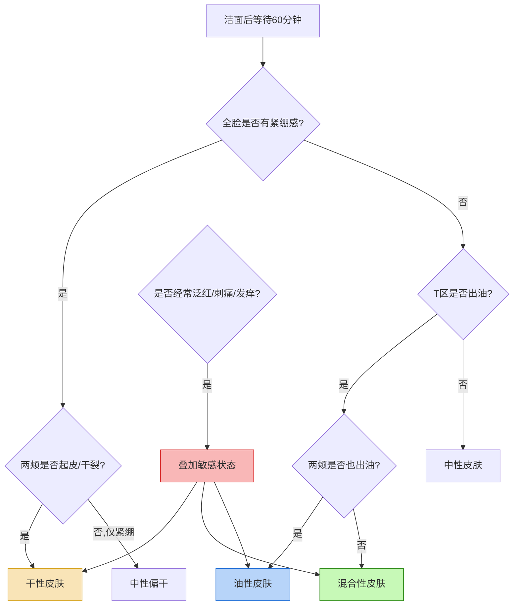
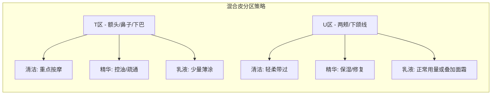
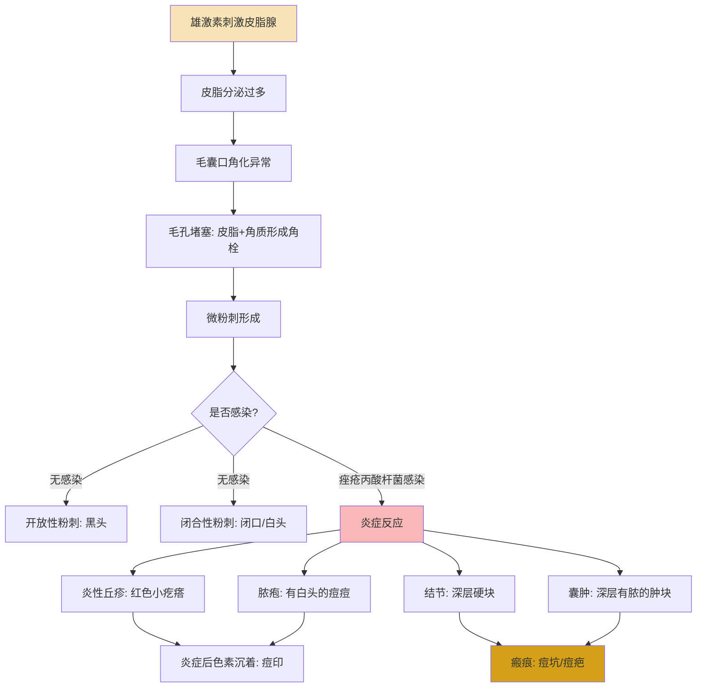
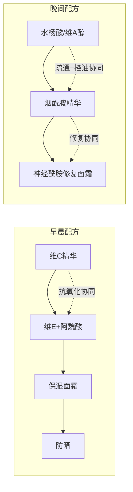

## 四、不同肤质的护肤方案

护肤的核心逻辑是"因肤制宜"——同样的产品，用在不同肤质上效果可能天差地别。一个干皮用了油皮推荐的控油产品，屏障会越洗越薄；一个油皮跟风干皮的厚重面霜，闷痘只是时间问题。本章从肤质判断入手，为每种肤质提供从理论到实操的完整方案。

### 4.0 肤质判断：你的皮肤到底属于哪种类型

在制定方案之前，必须先准确判断自己的肤质。错误的肤质判断是护肤踩坑的第一大原因。

#### 4.0.1 经典洗脸测试法

最简单也最常用的方法：

1. 用温和洁面产品（氨基酸洗面奶）彻底清洁面部
2. 用毛巾轻轻按干水分，不涂抹任何产品
3. 等待 60 分钟，观察皮肤状态

**判断标准：**

| 等待后皮肤表现 | 肤质判断 |
|---|---|
| 全脸紧绷、起皮、有干裂感 | 干性皮肤 |
| T 区出油，两颊紧绷或正常 | 混合性皮肤 |
| 全脸均匀出油，无紧绷感 | 油性皮肤 |
| 泛红、刺痛、发痒，或出现红斑 | 敏感性皮肤（可与其他类型叠加） |

#### 4.0.2 吸油纸辅助法

洁面 2 小时后，分别用吸油纸按压额头、鼻子、两颊、下巴：

- **吸油纸几乎没有油渍**：干性皮肤
- **T 区有明显油渍，两颊干净**：混合性皮肤
- **全脸都有明显油渍**：油性皮肤

#### 4.0.3 需要注意的几个要点

- **肤质不是固定不变的**。年龄、季节、激素水平、生活作息都会影响肤质。很多人夏天偏油、冬天偏混合，25 岁之前偏油、30 岁之后偏干。
- **敏感是状态，不是肤质**。严格来说，敏感性皮肤是一种皮肤状态，可以叠加在任何肤质上——油性敏感、干性敏感、混合敏感都是真实存在的组合。
- **痘痘肌是问题，不是肤质**。痘痘（痤疮）是一种皮肤问题，油皮容易长痘但不等于油皮就是痘痘肌，干皮也可能因为屏障受损而爆痘。
- **不要凭主观感觉判断**。有些人觉得自己"油"，实际上是因为缺水导致的外油内干——这是屏障受损的表现，需要的不是控油而是修复。

### 4.1 干性皮肤方案

#### 4.1.1 干性皮肤的生理机制

干性皮肤的根本问题是**皮脂腺分泌不足**和/或**角质层含水量过低**。

皮脂腺分泌的油脂（皮脂）是皮肤天然保湿体系的关键组成部分。皮脂在皮肤表面形成一层"油膜"，与角质层中的天然保湿因子（NMF）和细胞间脂质（主要是神经酰胺、胆固醇、游离脂肪酸）共同构成皮肤屏障。当皮脂分泌不足时：

- 水分蒸发速度加快（经皮水分流失率 TEWL 升高）
- 皮肤屏障功能下降，外界刺激物更容易侵入
- 角质层含水量低于 10% 时，皮肤出现肉眼可见的干燥、脱屑

干性皮肤的人往往角质层较薄，对外界刺激（风、冷空气、暖气、紫外线）更敏感，也更容易出现细纹和早期老化迹象。

#### 4.1.2 核心诉求与策略

| 诉求 | 策略 | 原理 |
|---|---|---|
| 保湿 | 补水 + 锁水 + 封闭三层保湿体系 | 单纯补水没有封闭层，水分会快速蒸发 |
| 修复屏障 | 补充细胞间脂质（神经酰胺、胆固醇） | 干皮屏障脂质不足，需要外部补充 |
| 抗老 | 使用维A醇、胜肽促进胶原合成 | 干皮更容易出现细纹，需要提前抗老 |
| 减少刺激 | 避免过度清洁和刺激性成分 | 干皮屏障薄，刺激物更容易渗透 |

#### 4.1.3 早晨护肤流程

清水/温和洁面乳 → 保湿化妆水 → 保湿精华（透明质酸） → 眼霜 → 滋润面霜 → 防晒霜

**逐步详解：**

**清洁**：干皮早晨可以用清水直接洗脸，不需要使用洁面产品。如果前一晚使用了厚重的修复面霜，可以少量使用温和洁面乳（选择无泡或低泡型）。洗脸水温控制在 32-35°C，不要用热水——热水会溶解皮肤表面本就不多的油脂。

**保湿化妆水**：选择含有透明质酸、甘油、泛醇等保湿成分的化妆水。用手轻拍上脸，不要用化妆棉擦拭——擦拭会增加物理摩擦，对干皮屏障不友好。如果化妆水质地较稀，可以拍两到三层。

**保湿精华**：透明质酸（玻尿酸）精华是干皮的标配。注意：纯透明质酸精华在极度干燥的环境下可能反吸皮肤水分，建议在皮肤微湿时使用（拍完化妆水后立即涂精华）。高分子量透明质酸在皮肤表面形成保湿膜，低分子量渗透到角质层内部补水，选择含有多种分子量的复合配方效果更好。

**眼周护理**：眼周皮肤厚度只有面部其他部位的 1/3，干皮的眼周更容易出现干纹。选择质地滋润的眼霜，含有神经酰胺、角鲨烷、咖啡因等成分。用无名指轻轻点涂按压，不要拉扯。

**面霜**：这是干皮保湿体系中最关键的一步——面霜起到"封闭"作用，锁住前面步骤补充的水分和活性成分。选择含有以下封闭性成分的面霜：
- **角鲨烷**：与人体皮脂成分接近，亲肤性好，封闭效果温和
- **神经酰胺**：直接补充细胞间脂质，修复屏障
- **凡士林（矿脂）**：封闭效果最强，适合极度干燥或冬季使用
- **牛油果树果脂**：天然植物油脂，封闭性好且含有维生素E

**防晒**：干皮适合使用质地滋润的防晒产品。化学防晒或物化结合防晒都可以，避免使用纯化学防晒中含高浓度酒精的配方。如果防晒霜涂后觉得拔干，可以在防晒前多涂一层面霜。

#### 4.1.4 晚间护肤流程

卸妆乳/膏 → 温和洁面乳 → 保湿化妆水 → 抗老精华（维A醇/胜肽） → 眼霜 → 修复面霜

**逐步详解：**

**卸妆**：干皮首选卸妆膏或卸妆乳，避免卸妆水+化妆棉的擦拭方式。卸妆膏通过"以油溶油"的原理溶解彩妆和防晒，不需要大力摩擦。推荐含有角鲨烷、荷荷巴油等成分的卸妆膏。

**二次清洁**：使用温和的氨基酸洁面乳，打出泡沫后轻柔按摩全脸 30-60 秒即可。干皮不需要使用皂基洁面或深层清洁产品。

**抗老精华**：晚间是使用活性成分的最佳时间，因为夜间皮肤进入修复模式，细胞更新速度加快。
- **维A醇（视黄醇）**：促进胶原蛋白合成、加速角质更新、改善细纹。干皮使用维A醇需要特别注意：从最低浓度（0.025%-0.05%）开始，每周使用 2-3 次，适应 2-4 周后再逐步增加频率和浓度。如果出现脱皮、泛红，减少使用频率或搭配修复面霜缓冲。
- **胜肽类**：比维A醇温和得多，适合干皮敏感期使用。六胜肽（乙酰基六肽-8）针对表情纹，铜肽（蓝铜胜肽）促进修复。

**修复面霜**：晚间面霜可以比日间更厚重。选择含有神经酰胺复合物（神经酰胺 NP、AP、EOP 等多种类型搭配胆固醇和脂肪酸，模拟皮肤天然脂质比例）的修复面霜。冬季干燥严重时，可以在面霜后薄涂一层角鲨烷油或凡士林加强封闭。

#### 4.1.5 关键调整与进阶技巧

- **冬季加强方案**：在面霜前加一层护肤油（角鲨烷油、玫瑰果油），利用"水-精华-油-霜"的分层保湿法。室内暖气环境建议使用加湿器，保持湿度在 40-60%。
- **夏季简化方案**：如果夏季皮肤不那么干，可以将厚重面霜替换为质地轻盈的保湿乳液，但不要完全省略封闭步骤。
- **维A醇耐受训练**：干皮建立维A醇耐受的方法——第 1-2 周：每周 1 次；第 3-4 周：每周 2 次；第 5-8 周：隔天 1 次；8 周后：每天使用（如果没有不适）。可以采用"三明治法"——先涂一层面霜打底，再涂维A醇，再涂一层面霜，减少刺激。
- **密集修复期**：如果皮肤出现明显干燥脱皮，暂停所有功效性成分（维A醇、酸类），只做"清洁+保湿+修复+防晒"四步，持续 1-2 周直到屏障恢复。

#### 4.1.6 推荐成分与避免成分

| 类别 | 推荐 | 说明 |
|---|---|---|
| 保湿剂 | 透明质酸、甘油、泛醇（维生素B5）、尿囊素 | 从环境中吸收水分并保持在角质层中 |
| 封闭剂 | 角鲨烷、凡士林、神经酰胺、牛油果脂 | 在皮肤表面形成油膜，减少水分蒸发 |
| 修复剂 | 神经酰胺、胆固醇、游离脂肪酸 | 补充细胞间脂质，修复屏障结构 |
| 抗老剂 | 维A醇、胜肽、玻色因 | 促进胶原合成，改善细纹 |

| 类别 | 避免 | 原因 |
|---|---|---|
| 清洁类 | 皂基洁面、SLS/SLES | 清洁力过强，破坏本就薄弱的皮脂膜 |
| 溶剂类 | 高浓度酒精（变性乙醇） | 加速水分蒸发，加剧干燥 |
| 去角质类 | 高浓度果酸（AHA>10%）、磨砂膏 | 干皮角质层薄，过度去角质会损伤屏障 |

#### 4.1.7 常见误区

- **误区一：干皮不需要防晒**。真相：干皮因为屏障薄弱，紫外线伤害更大，更需要严格防晒。选择滋润型防晒即可。
- **误区二：疯狂补水就能解决干燥**。真相：如果只补水不锁水（没有封闭步骤），水分蒸发后皮肤会更干。保湿的核心是"锁水"，不是"灌水"。
- **误区三：干皮不能用维A醇**。真相：干皮可以用维A醇，但需要更缓慢地建立耐受，配合修复面霜使用。
- **误区四：护肤油会闷痘**。真相：选择合适的油脂（角鲨烷、荷荷巴油）不会闷痘。角鲨烷与人体皮脂成分接近，致痘风险极低。

### 4.2 油性皮肤方案

#### 4.2.1 油性皮肤的生理机制

油性皮肤的根源是**皮脂腺功能亢进**——皮脂腺分泌的油脂远超皮肤所需。

影响皮脂分泌的因素：

- **雄激素水平**：雄激素（特别是二氢睾酮 DHT）是刺激皮脂腺分泌的最主要因素。青春期雄激素水平升高，皮脂分泌旺盛；男性比女性皮脂分泌更多，也与雄激素水平有关。
- **遗传因素**：皮脂腺的大小和活跃程度有明显的遗传倾向。
- **温度和湿度**：环境温度每升高 1°C，皮脂分泌量增加约 10%。这就是为什么很多人夏天比冬天更油。
- **饮食**：高糖、高乳制品饮食会通过升高胰岛素样生长因子-1（IGF-1）间接促进皮脂分泌。
- **压力和睡眠**：压力激素（皮质醇）会间接刺激皮脂腺。

皮脂分泌过多带来的直接问题：
1. **毛孔粗大**：过多的皮脂撑大了毛孔出口
2. **黑头/白头**：皮脂与角质混合堵塞毛孔，氧化后形成黑头
3. **痘痘**：痤疮丙酸杆菌以皮脂为食，皮脂过多为细菌繁殖提供了温床
4. **暗沉**：过多油脂在皮肤表面氧化，导致肤色暗沉发黄

#### 4.2.2 核心诉求与策略

| 诉求 | 策略 | 原理 |
|---|---|---|
| 控油 | 使用调节皮脂分泌的活性成分 | 从源头减少皮脂分泌，而不是单纯吸油 |
| 疏通毛孔 | 定期使用酸类产品溶解角栓 | 保持毛孔通畅，预防黑头和痘痘 |
| 预防痘痘 | 抗菌+控油+疏通三管齐下 | 痘痘是多因素问题，需要综合治理 |
| 轻薄保湿 | 选择无油或低油配方 | 油皮也需要保湿，但不能加重油腻 |

#### 4.2.3 早晨护肤流程

氨基酸洗面奶 → 控油化妆水（含烟酰胺） → 抗氧化精华 → 清爽乳液 → 控油防晒

**逐步详解：**

**清洁**：油皮早晚都需要使用洗面奶。选择氨基酸系或温和表活复配的洁面产品，既能清洁多余油脂，又不会过度刺激。水温 32-35°C，不要用冷水（洗不干净油脂）也不要用热水（刺激皮脂腺分泌更多）。洗脸时间控制在 60 秒以内，重点按摩 T 区（额头、鼻子、下巴）。

**控油化妆水**：含有烟酰胺（维生素B3）的化妆水是油皮首选。烟酰胺的控油机制是抑制皮脂腺细胞中脂质的合成，从源头减少皮脂分泌。浓度 2-5% 即可起效，不需要追求高浓度。此外，含有水杨酸（BHA）的化妆水可以帮助溶解毛孔口的角质栓塞，保持毛孔通畅。

**抗氧化精华**：油皮出油后皮脂在皮肤表面氧化，是导致肤色暗沉的主要原因之一。使用抗氧化精华（维生素C、维生素E、阿魏酸、白藜芦醇等）可以减缓皮脂氧化，保持肤色明亮。维生素C（L-抗坏血酸）浓度 10-20% 即可有效抗氧化，同时还能抑制黑色素生成，预防痘印。

**乳液**：选择质地清爽的无油乳液或啫喱。油皮的保湿策略是"补水不补油"——选择含有透明质酸、甘油等水溶性保湿剂的产品，避免含有矿物油、椰子油等致痘风险较高的油脂。T 区（额头、鼻子）可以少涂或不涂乳液，两颊正常涂抹。

**防晒**：油皮选择防晒最怕"越涂越油"。推荐选择带有"控油""哑光"标识的防晒产品。物化结合防晒中，氧化锌本身有一定的吸附油脂效果。如果实在觉得油腻，可以用防晒粉饼或散粉定妆控油。

#### 4.2.4 晚间护肤流程

卸妆水/卸妆油 → 氨基酸洗面奶 → 控油化妆水 → 水杨酸/维A醇精华 → 清爽乳液

**逐步详解：**

**卸妆**：油皮选择卸妆油反而比卸妆水更好——卸妆油通过"以油溶油"可以更彻底地溶解防晒和多余皮脂。关键是乳化要彻底：干手干脸涂抹卸妆油，按摩 1-2 分钟后加水乳化（变成白色乳液状），再用清水冲洗干净。如果乳化不彻底，残留的卸妆油反而会堵塞毛孔。

**功效精华**：晚间是使用控油和疏通毛孔成分的最佳时机。
- **水杨酸（BHA）**：浓度 0.5-2%，脂溶性，可以深入毛孔内部溶解油脂和角质栓塞。水杨酸还具有抗炎和轻微抗菌作用，对黑头、闭口、痘痘都有效。使用频率：从每周 2-3 次开始，耐受后可以每天使用。
- **维A醇**：从根本上调节角质代谢，减少毛孔堵塞，长期使用可以缩小毛孔、控制出油。维A醇需要 8-12 周才能看到明显效果，需要耐心。油皮对维A醇的耐受性通常比干皮好，可以从 0.1-0.3% 浓度开始。

**重要提醒**：水杨酸和维A醇**不要在同一天同时使用**。建议交替使用——例如周一三五用水杨酸，周二四六用维A醇，周日休息。两者同时使用会过度刺激皮肤，导致屏障受损。

#### 4.2.5 关键调整与进阶技巧

- **泥膜深层清洁**：每周 1-2 次，T 区使用高岭土或膨润土泥膜，吸附毛孔深层油脂。敷 10-15 分钟，不要等到完全干透（完全干透会过度吸油，刺激皮脂腺分泌更多）。敷完后做好保湿。
- **吸油纸的正确使用**：吸油纸可以应急使用，但不要过于频繁。频繁吸油会向皮肤发出"缺油"信号，反而刺激皮脂腺分泌更多油脂。每天最多使用 2-3 次，轻轻按压不要擦拭。
- **壬二酸**：如果你的油皮伴随炎症性痘痘或玫瑰痤疮，壬二酸是比水杨酸更好的选择。壬二酸浓度 15-20%，具有抗菌、抗炎、控油、美白四重功效，且刺激性相对较低。
- **烟酰胺的叠加使用**：控油化妆水含烟酰胺 + 晚间乳液也含烟酰胺，可以在不同步骤叠加，增强控油效果。但注意烟酰胺浓度总和不要超过 10%，否则可能引起泛红刺痛（不耐受）。
- **饮食调整辅助**：减少高糖食物（甜食、精制碳水）和乳制品的摄入。研究表明，低 GI 饮食 12 周后皮脂分泌量显著下降。

#### 4.2.6 推荐成分与避免成分

| 类别 | 推荐 | 说明 |
|---|---|---|
| 控油成分 | 烟酰胺（2-5%）、PCA锌、壬二酸 | 抑制皮脂合成，调节油脂分泌 |
| 疏通毛孔 | 水杨酸（0.5-2%）、维A醇 | 溶解角栓，促进角质更新 |
| 抗菌抗炎 | 壬二酸、过氧化苯甲酰（2.5-5%）、茶树精油 | 杀灭痤疮丙酸杆菌，减轻炎症 |
| 抗氧化 | 维生素C（10-20%）、阿魏酸、绿茶提取物 | 减缓皮脂氧化，预防暗沉 |
| 清爽保湿 | 透明质酸、甘油、烟酰胺 | 补水不补油，维持水油平衡 |

| 类别 | 避免 | 原因 |
|---|---|---|
| 油脂类 | 矿物油、椰子油、可可脂 | 致痘风险高，加重毛孔堵塞 |
| 质地类 | 过于厚重的面霜、睡眠面膜 | 增加皮肤负担，闷痘风险 |
| 清洁类 | 过度清洁（一天洗脸超过3次、使用皂基） | 破坏屏障，刺激皮脂腺报复性分泌 |

#### 4.2.7 常见误区

- **误区一：油皮不需要保湿**。真相：油皮也会缺水。"外油内干"就是因为只控油不保湿，导致角质层含水量不足，皮脂腺为了保护皮肤反而分泌更多油脂。油皮也需要保湿，只是选择质地清爽的产品。
- **误区二：频繁洗脸可以控油**。真相：过度清洁会破坏皮肤屏障，刺激皮脂腺分泌更多油脂（"报复性出油"）。每天早晚各洗一次脸就够了。
- **误区三：油皮不能用油类产品**。真相：荷荷巴油、角鲨烷等与人体皮脂成分接近的油脂，反而可以帮助调节皮脂分泌，不会堵塞毛孔。
- **误区四：用手挤黑头/痘痘**。真相：手上的细菌会导致感染扩散，挤压会损伤毛孔周围组织，导致毛孔永久性扩大甚至形成痘坑。
- **误区五：含酒精的控油产品可以长期用**。真相：短期酒精确实可以快速控油，但长期使用会损伤皮肤屏障，导致皮肤敏感。选择不含酒精的控油产品更安全。

### 4.3 混合性皮肤方案

#### 4.3.1 混合性皮肤的生理机制

混合性皮肤是最常见的肤质类型，其特征是**面部不同区域的皮脂腺分布和活跃程度不一致**。

T 区（额头、鼻子、下巴）的皮脂腺密度高、体积大，分泌旺盛；而 U 区（两颊、下颌线）的皮脂腺相对不活跃，偏干甚至脱屑。这种不均匀分布主要受以下因素影响：

- **面部皮脂腺分布不均**：T 区每平方厘米的皮脂腺数量是两颊的 2-3 倍
- **激素敏感度差异**：T 区皮脂腺对雄激素更敏感
- **外部环境影响**：经常戴口罩的人，口罩覆盖区域（鼻子以下）可能更油

混合性皮肤的护理难度在于：同一张脸上需要不同的护理策略，如果全脸用同一套产品，必然有一边不满意。

#### 4.3.2 分区护理的核心原则

混合性皮肤的关键是**"分区护理"**——T 区按油皮思路，U 区按干皮思路，但在实际操作中不需要完全用两套产品，而是通过"用量调整"和"产品叠加"来实现分区效果。

#### 4.3.3 早晨护肤流程

氨基酸洗面奶 → 化妆水 → 抗氧化精华 → 保湿乳液（全脸）→ 防晒

**逐步详解：**

**清洁**：使用氨基酸洗面奶全脸清洁，但手法上做区分——T 区多按摩 30 秒，U 区轻柔带过即可。水温 32-35°C。

**化妆水**：全脸使用同一款温和保湿化妆水即可。如果 T 区特别油，可以在 T 区额外拍一层含烟酰胺的控油化妆水。

**抗氧化精华**：全脸使用维生素C或烟酰胺精华。烟酰胺对混合皮尤其友好——既能控油（对T区），又能保湿修复（对U区），是真正意义上的"全能成分"。

**乳液**：保湿乳液（如含有烟酰胺的保湿乳液）全脸使用。T 区薄涂一层，U 区正常涂抹。如果两颊偏干明显，可以在两颊额外叠加一层面霜。

**防晒**：全脸均匀涂抹。T 区偏油可以选择控油型防晒，或者全脸涂完后 T 区用散粉定妆控油。

#### 4.3.4 晚间护肤流程

卸妆 → 氨基酸洗面奶 → 化妆水 → 精华 → 保湿乳液
每周1次：T区水杨酸产品 + 两颊保湿面膜

**逐步详解：**

**卸妆+清洁**：与早晨类似，T 区重点清洁，U 区轻柔。如果只涂了防晒没有化妆，可以用卸妆水或卸妆乳代替卸妆油。

**精华选择——分区策略**：
- **T 区**：使用水杨酸精华或维A醇精华，疏通毛孔、控制出油
- **U 区**：使用保湿修复精华（神经酰胺、透明质酸、角鲨烷）
- 如果不想用两款精华，可以在全脸使用温和的烟酰胺精华，T 区重点区域（鼻头、额头）局部点涂水杨酸

**乳液**：全脸涂抹 PM 乳。两颊偏干可以叠加修复面霜。

**每周深度护理**：
- **T 区**：使用 K 乳（水杨酸类产品）或泥膜，疏通毛孔、清理黑头
- **两颊**：使用保湿面膜（片状或涂抹式），密集补水

#### 4.3.5 季节调整策略

混合性皮肤的季节变化比单一肤质更明显：

| 季节 | T 区变化 | U 区变化 | 调整策略 |
|---|---|---|---|
| 春季 | 开始出油增多 | 可能敏感（花粉季） | T区开始引入控油产品，U区加强修复 |
| 夏季 | 明显出油 | 可能偏中性 | 全脸清爽化，T区控油加强，U区减少面霜 |
| 秋季 | 出油减少 | 开始偏干 | T区控油减弱，U区开始叠加面霜 |
| 冬季 | 偏中性或微油 | 明显干燥 | T区简化控油，U区加强保湿封闭 |

#### 4.3.6 常见误区

- **误区一：混合皮全脸用一套产品就好**。真相：如果不做分区护理，T 区和 U 区必然有一边不满足。至少在用量和产品叠加层面做区分。
- **误区二：混合皮等于"正常皮肤"**。真相：混合皮的护理比单一肤质更复杂，需要根据不同区域和不同季节灵活调整。
- **误区三：混合皮不需要用油**。真相：两颊偏干的混合皮，在秋冬季节可以在两颊区域使用护肤油（角鲨烷油），T 区避开。

### 4.4 敏感性皮肤方案

#### 4.4.1 敏感性皮肤的生理机制

敏感性皮肤的本质是**皮肤屏障功能受损 + 神经末梢过度反应**。

正常情况下，皮肤屏障（主要由角质层和皮脂膜构成）能够有效阻挡外界刺激物的侵入。当屏障受损时：

1. 外界刺激物（化妆品成分、污染物、微生物）更容易穿透角质层
2. 刺激物接触到真皮层的神经末梢，引发刺痛、灼热、瘙痒等感觉
3. 免疫系统被激活，释放炎症因子，导致泛红、肿胀
4. 炎症进一步损伤屏障，形成"屏障受损→刺激→炎症→屏障更受损"的恶性循环

导致皮肤敏感的常见原因：
- **过度清洁**：频繁使用皂基洁面、深层清洁面膜、去角质产品
- **不当护肤**：叠加过多活性成分（同时使用多种酸类、高浓度维C+维A醇等）
- **紫外线损伤**：长期不防晒导致的光损伤累积
- **环境因素**：极端温度、干燥、风沙、空气污染
- **医美后**：刷酸、激光、光子嫩肤等医美术后，皮肤处于暂时性敏感状态
- **皮肤病**：玫瑰痤疮、脂溢性皮炎、湿疹等皮肤疾病导致的持续敏感

#### 4.4.2 判断你的敏感程度

| 级别 | 表现 | 处理方式 |
|---|---|---|
| 轻度敏感 | 偶尔刺痛（换季/换产品时），使用新产品有轻微不适 | 精简护肤，使用温和产品，避免已知刺激物 |
| 中度敏感 | 经常泛红，使用多数产品都有刺痛感，皮肤薄可见红血丝 | 停用所有功效成分，专注屏障修复 4-8 周 |
| 重度敏感 | 持续泛红、灼热、脱皮，接触任何产品都刺痛，可能有丘疹 | 建议就医，排除玫瑰痤疮等皮肤病，遵医嘱用药 |

#### 4.4.3 核心策略：精简护肤

敏感肌的护肤哲学是**"少即是多"**——去掉一切不必要的步骤和成分，只做最基础的清洁、保湿、修复、防晒。

**精简护肤的黄金法则：**
- 产品总数不超过 4 个（洁面+保湿+修复+防晒）
- 每个产品成分表越短越好
- 不叠加多个功效成分
- 不频繁更换产品
- 屏障修复期内不引入新产品

#### 4.4.4 早晨护肤流程

清水洗脸 → 舒缓化妆水 → 修复精华（神经酰胺/积雪草） → 修复面霜 → 物理防晒

**逐步详解：**

**清洁**：早晨只用清水洗脸，32-35°C 温水，不要使用任何洁面产品。敏感肌的皮脂膜已经在受损状态，早晨不需要再清洁一次。

**舒缓化妆水**：选择含有舒缓抗炎成分的化妆水：
- **积雪草提取物（Centella Asiatica）**：含积雪草苷和羟基积雪草苷，促进伤口愈合、抗炎
- **甘草酸二钾**：强效抗炎成分，可以抑制炎症因子的释放
- **红没药醇（bisabolol）**：洋甘菊提取物，舒缓抗敏
- **β-葡聚糖**：增强皮肤免疫功能，促进修复

用手轻拍上脸，不要用化妆棉。

**修复精华**：这是敏感肌护肤的核心产品。选择含有以下成分的精华：
- **神经酰胺**：补充细胞间脂质，直接修复屏障结构
- **积雪草提取物**：促进胶原合成，加速屏障修复
- **泛醇（维生素B5）**：保湿+促进伤口愈合

**修复面霜**：选择成分简单的修复面霜。关键成分：神经酰胺+胆固醇+脂肪酸（模拟皮肤天然脂质的 3:1:1 比例），以及角鲨烷、牛油果脂等封闭性成分。避免含有香精、精油、色素的产品。

**防晒**：敏感肌首选**物理防晒**（主要成分：氧化锌、二氧化钛）。物理防晒的原理是在皮肤表面形成一层物理屏障，反射紫外线，不被皮肤吸收，因此刺激性最小。化学防晒需要被皮肤吸收后才能起效，对敏感肌可能造成额外刺激。物理防晒的缺点是质地偏厚重、可能泛白，但对敏感肌来说安全性是第一位的。

#### 4.4.5 晚间护肤流程

温和卸妆水 → 氨基酸洗面奶 → 舒缓化妆水 → 修复精华 → 修复面霜

**逐步详解：**

**卸妆**：选择温和的卸妆水或卸妆乳，不要使用卸妆油（需要乳化步骤，增加摩擦）。如果只涂了防晒，可以直接用氨基酸洗面奶清洁。

**清洁**：使用氨基酸洁面乳，温和起泡后轻柔按摩 30 秒。不要使用洁面仪、洁面刷等工具——敏感肌不需要深层清洁。

**晚间护理**：与早晨相同——舒缓化妆水+修复精华+修复面霜。晚间面霜可以比日间稍厚，利用夜间修复窗口期加强屏障修复。

#### 4.4.6 屏障修复期的详细方案

敏感肌的屏障修复通常需要 **4-8 周**，严重者可能需要 **3-6 个月**。这个过程需要耐心，不要急于求成。

| 阶段 | 时间 | 目标 | 护肤方案 |
|---|---|---|---|
| 急性期 | 第1-2周 | 停止刺激，镇静舒缓 | 只用清水+修复面霜+物理防晒，停用一切功效成分 |
| 修复期 | 第3-6周 | 修复屏障结构 | 温和洁面+舒缓化妆水+神经酰胺精华+修复面霜+防晒 |
| 巩固期 | 第7-8周 | 巩固屏障功能 | 可以缓慢引入温和的功效成分（如低浓度烟酰胺） |
| 维护期 | 第9周起 | 维持屏障健康 | 可以逐步恢复正常护肤，但避免高刺激成分 |

**屏障修复期的红线：**
- 不使用任何酸类产品（果酸、水杨酸、维A酸）
- 不使用高浓度活性成分（高浓度维C、高浓度烟酰胺）
- 不使用磨砂膏、洁面仪
- 不进行任何医美项目
- 不频繁更换产品
- 不化浓妆（减少卸妆对皮肤的摩擦）

#### 4.4.7 推荐成分与避免成分

| 类别 | 推荐 | 说明 |
|---|---|---|
| 屏障修复 | 神经酰胺、胆固醇、脂肪酸 | 补充细胞间脂质，修复屏障结构 |
| 舒缓抗炎 | 积雪草、甘草酸二钾、红没药醇、β-葡聚糖 | 抑制炎症反应，减轻泛红刺痛 |
| 温和保湿 | 透明质酸、甘油、泛醇、角鲨烷 | 补水锁水，不增加刺激 |
| 防晒 | 氧化锌、二氧化钛（物理防晒） | 不被皮肤吸收，刺激性最低 |

| 类别 | 避免 | 原因 |
|---|---|---|
| 香精/香料 | 人工香精、天然精油（薰衣草、茶树等） | 最常见的致敏原之一 |
| 防腐剂 | MIT/CMIT（甲基异噻唑啉酮类） | 高致敏性防腐剂 |
| 酒精 | 变性乙醇、异丙醇 | 破坏屏障，加剧干燥和刺激 |
| 酸类 | 果酸、水杨酸、维A酸 | 加速角质脱落，对受损屏障是雪上加霜 |
| 表面活性剂 | SLS/SLES、皂基 | 清洁力过强，破坏皮脂膜 |

#### 4.4.8 常见误区

- **误区一：敏感肌什么都不能用**。真相：敏感肌需要用对产品，而不是什么都不用。不护肤会让屏障无法自我修复。关键是选择成分简单、温和、有修复功能的产品。
- **误区二：天然/有机产品就不会过敏**。真相：天然成分（如精油、植物提取物）反而是常见的致敏原。"天然≠温和"，"化学≠刺激"。
- **误区三：敏感肌不能用防晒**。真相：紫外线会进一步损伤屏障，敏感肌更需要防晒。选择物理防晒即可。
- **误区四：敏感肌用了刺痛说明产品在"起效"**。真相：使用护肤品后刺痛是皮肤发出的警报信号，说明产品或成分对你的皮肤造成了刺激。任何声称"刺痛是正常的"的说法都是错误的。
- **误区五：敏感肌不需要卸妆**。真相：如果涂了防晒或化了妆，仍然需要卸妆。但要选择温和的卸妆方式（卸妆水+轻柔按压），不要使用卸妆油大力按摩。

### 4.5 痘痘肌肤方案

#### 4.5.1 痘痘形成的完整机制

痤疮（痘痘）的形成是一个多步骤的病理过程：

痘痘形成的四个关键因素：
1. **皮脂分泌过多**：雄激素刺激皮脂腺过度分泌
2. **毛囊口角化异常**：角质细胞不能正常脱落，堆积在毛囊口
3. **痤疮丙酸杆菌（C. acnes）增殖**：堵塞的毛孔形成缺氧环境，厌氧的痤疮丙酸杆菌大量繁殖
4. **炎症反应**：细菌代谢产物和酶激活免疫系统，引发炎症

所有祛痘策略都围绕这四个因素展开：控油、疏通毛孔、抗菌、抗炎。

#### 4.5.2 痘痘分级与对应方案

| 级别 | 表现 | 处理方式 |
|---|---|---|
| Ⅰ级（轻度） | 以粉刺为主（黑头、闭口），少量炎性丘疹 | 外用护肤成分：水杨酸、维A醇、壬二酸 |
| Ⅱ级（中度） | 炎性丘疹和脓疱较多，有粉刺 | 外用药物：过氧化苯甲酰+外用抗生素，配合护肤 |
| Ⅲ级（重度） | 大量炎性丘疹、脓疱，有结节 | 就医：口服抗生素+外用药，可能需要口服异维A酸 |
| Ⅳ级（重度） | 结节囊肿型，大面积炎症 | 必须就医：口服异维A酸是首选，可能需要配合其他治疗 |

**重要提醒**：Ⅱ级以上建议就医，不要只靠护肤品解决。痤疮是一种皮肤病，严重的痤疮需要医学治疗。护肤品可以辅助，但不能替代药物。

#### 4.5.3 早晨护肤流程

氨基酸洗面奶 → 控油化妆水 → 抗氧化精华（含维C） → 清爽乳液 → 防晒（痘印需要严格防晒）

**逐步详解：**

**清洁**：使用氨基酸洗面奶，温和但彻底地清洁。痘痘肌的清洁要把握"温和但有效"的平衡——清洁不彻底会导致毛孔堵塞加重，但过度清洁会刺激皮脂腺分泌更多油脂。T 区重点按摩，痘痘区域轻柔带过，不要用力搓洗。

**控油化妆水**：含有烟酰胺（2-5%）或低浓度水杨酸（0.5%）的化妆水，控油+轻微疏通毛孔。

**抗氧化精华**：维生素C精华（10-15%浓度的L-抗坏血酸或其衍生物）有两个重要作用：一是抗氧化、减缓皮脂氧化导致的暗沉；二是抑制黑色素生成，预防痘印变成深色色素沉着。注意：纯L-抗坏血酸在低pH值下才能有效渗透，可能对痘痘破损区域有刺激。如果你的痘痘正在发炎破损，可以暂时跳过维C，或选择更温和的维C衍生物（如抗坏血酸葡糖苷 AA2G）。

**乳液**：选择无油（oil-free）配方的清爽乳液。痘痘肌不需要"厚涂"，薄薄一层即可。

**防晒**：痘印（炎症后色素沉着，PIH）如果不严格防晒，颜色会加深、消退时间会大大延长。选择轻薄不闷痘的防晒产品。如果痘痘严重到不想涂防晒霜，至少做好硬防晒（帽子、口罩、遮阳伞）。

#### 4.5.4 晚间护肤流程

卸妆 → 氨基酸洗面奶 → 化妆水 → 水杨酸/壬二酸 → 清爽乳液
每周2-3次：维A醇（与水杨酸错开使用）

**逐步详解：**

**功效成分——痘痘肌的核心武器：**

**水杨酸（BHA）**：痘痘肌的首选酸类。
- 浓度：0.5-2%（家用护肤品），30%（医美刷酸，必须专业操作）
- 作用机制：脂溶性，可以深入毛孔内部，溶解油脂和角质栓塞；抗炎，减轻痘痘红肿；轻微抗菌
- 使用方法：洁面后，用水杨酸精华液或棉片涂抹全脸（重点T区和痘痘区域），等待 5-10 分钟吸收后再进行下一步
- 见效时间：4-8 周可以看到明显改善

**壬二酸**：痘痘肌的多面手。
- 浓度：10-20%
- 作用机制：抗菌（杀灭痤疮丙酸杆菌）、抗炎（抑制炎症因子）、控油（抑制5α-还原酶，减少DHT对皮脂腺的刺激）、美白（抑制酪氨酸酶，淡化痘印）
- 特别适合：炎症性痘痘、玫瑰痤疮、伴有色素沉着的痘痘
- 使用方法：洁面后涂抹，可以全脸使用，对痘痘区域重点涂抹
- 刺激性：比水杨酸和维A醇温和，但初次使用可能有轻微刺痒感，属于正常反应

**维A醇（视黄醇）**：长期控制痘痘的最佳选择。
- 作用机制：从根本上调节角质细胞的更新速度，防止毛囊口角化异常；抑制皮脂腺活性；抗炎
- 优势：是唯一经过大量临床验证的、可以从根源上减少痘痘发生的成分
- 使用方法：从低浓度（0.025-0.05%）开始，每周 2-3 次，逐步增加频率。与水杨酸错开使用（例如一三五水杨酸，二四六维A醇）
- 见效时间：8-12 周才能看到明显效果，需要耐心
- 注意：维A醇有"爆痘期"——使用初期可能因为加速角质更新而导致原本堵塞在深层的粉刺快速浮出表面，表现为痘痘暂时增多。这个阶段通常持续 2-6 周，之后会逐渐改善

#### 4.5.5 痘痘的阶段护理

| 阶段 | 表现 | 护理重点 | 推荐成分 |
|---|---|---|---|
| 急性炎症期 | 红肿、疼痛的炎性痘痘 | 抗炎消肿，避免刺激 | 壬二酸、过氧化苯甲酰（2.5%）、甘草酸二钾 |
| 消退期 | 痘痘缩小、不再红肿 | 疏通毛孔，防止新痘 | 水杨酸、维A醇 |
| 痘印期 | 红色/棕色痘印 | 淡化色素，严格防晒 | 烟酰胺、维C、壬二酸、防晒 |
| 痘坑期 | 凹陷性瘢痕 | 护肤品效果有限，考虑医美 | 维A醇（辅助改善）、点阵激光、微针（医美） |

**痘印的颜色判断：**
- **红色痘印**（炎症后红斑 PIE）：炎症导致毛细血管扩张，血液淤积。处理：壬二酸、烟酰胺、防晒。通常需要 3-6 个月自然消退。
- **棕色/黑色痘印**（炎症后色素沉着 PIH）：炎症刺激黑色素细胞过度产生黑色素。处理：维C、烟酰胺、壬二酸、果酸（屏障健康的前提下）、严格防晒。可能需要 6-12 个月甚至更久消退。

#### 4.5.6 绝对不能做的事

- **不要挤痘**：挤痘是痘痘护理中最大的禁忌。挤压会导致：感染向深层扩散（本来的小痘痘变成大结节）、炎症加重、真皮层受损（形成痘坑/痘疤）、细菌扩散到周围皮肤（引发更多痘痘）。如果实在需要处理已经"成熟"的白色脓头痘痘，使用消毒后的粉刺针轻轻挑破，用痘痘贴吸附脓液，事后做好消毒和修复。
- **不要频繁更换祛痘产品**：大多数祛痘成分需要 4-12 周才能见效。频繁更换产品意味着每种产品都没有足够时间发挥作用，同时增加皮肤受到不同成分刺激的风险。
- **不要同时叠加多种酸类**：水杨酸+果酸+维A醇同时使用会造成严重的过度去角质，破坏屏障，反而加重痘痘。
- **不要用牙膏、大蒜等"偏方"祛痘**：这些东西对皮肤有刺激性，没有任何祛痘效果。
- **不要忽视饮食和作息**：高糖饮食、乳制品、熬夜、压力都是痘痘的诱因。调整生活方式是祛痘的基础。

#### 4.5.7 推荐成分与避免成分

| 类别 | 推荐 | 作用 |
|---|---|---|
| 疏通毛孔 | 水杨酸（0.5-2%）、维A醇 | 溶解角栓，促进角质正常代谢 |
| 抗菌 | 过氧化苯甲酰（2.5-5%）、壬二酸 | 杀灭痤疮丙酸杆菌 |
| 抗炎 | 壬二酸、甘草酸二钾、积雪草 | 减轻炎症反应，舒缓红肿 |
| 控油 | 烟酰胺、PCA锌、壬二酸 | 调节皮脂分泌 |
| 淡化痘印 | 维C、烟酰胺、壬二酸、传明酸 | 抑制黑色素生成，淡化色素沉着 |
| 清爽保湿 | 透明质酸、甘油 | 补水不补油，维持水油平衡 |

| 类别 | 避免 | 原因 |
|---|---|---|
| 致痘油脂 | 矿物油、椰子油、可可脂 | 堵塞毛孔，加重痘痘 |
| 刺激成分 | 高浓度酒精、薄荷、樟脑 | 刺激炎症，加重红肿 |
| 过度护理 | 磨砂膏、洁面仪、撕拉面膜 | 物理刺激加重炎症，可能传播细菌 |
| 封闭性过强的产品 | 厚重面霜、睡眠面膜 | 增加毛孔堵塞风险 |

#### 4.5.8 什么时候该看医生

以下情况说明你的痘痘已经超出了护肤品的处理范围，需要及时就医：

- 痘痘持续 3 个月以上没有改善
- 出现大面积炎性丘疹、脓疱、结节或囊肿
- 痘痘留下明显的凹陷性瘢痕（痘坑）
- 痘痘严重影响心理健康（焦虑、社交回避）
- 女性伴有月经不调、多毛等高雄激素症状（可能需要排查多囊卵巢综合征）

皮肤科医生可以提供：口服异维A酸（重度痤疮的"终极武器"）、口服抗生素、外用维A酸（处方级）、激素检查和调节、光动力治疗、果酸焕肤等专业治疗。

### 4.6 特殊场景的肤质应对

#### 4.6.1 换季过渡期

换季（特别是秋冬→冬春、冬春→春夏）是皮肤问题的高发期。温度和湿度的剧烈变化会影响皮脂分泌和屏障功能。

**通用原则**：
- 提前 2 周开始调整护肤品（不要等到皮肤出问题了再换）
- 换季期间不引入新产品、不做医美
- 保湿和防晒始终不变，调整的是活性成分的使用频率和产品质地

#### 4.6.2 长期戴口罩

长时间佩戴口罩会形成一个高温高湿的封闭环境，导致：
- 口罩覆盖区域皮脂分泌增加
- 摩擦导致物理性损伤
- 细菌繁殖加速

**应对方法**：
- 口罩下不化浓妆，只涂防晒即可
- 选择透气性好的口罩材质
- 每 2-4 小时更换一次口罩
- 取下口罩后用温和洁面产品清洁
- 在口罩覆盖区域使用含有烟酰胺的控油产品

#### 4.6.3 不同年龄段的调整

| 年龄段 | 皮肤特点 | 护理重点 | 注意事项 |
|---|---|---|---|
| 18-25岁 | 皮脂分泌旺盛，痘痘高发 | 清洁+控油+防晒 | 建立防晒习惯，不要过度清洁 |
| 25-30岁 | 开始出现初老迹象，出油减少 | 控油+初抗老+防晒 | 开始使用抗氧化精华和低浓度维A醇 |
| 30-40岁 | 细纹增多，皮肤弹性下降 | 抗老+修复+防晒 | 维A醇可以升级浓度，增加胜肽类抗老产品 |
| 40岁以上 | 皱纹明显，松弛，可能缺水缺油 | 深度抗老+密集修复+防晒 | 考虑医美辅助，护肤品注重保湿封闭 |

### 4.7 产品搭配的禁忌与协同

了解成分之间的相互作用，可以让你的护肤方案更高效、更安全。

#### 4.7.1 不建议同时使用的组合

| 组合 | 原因 | 正确做法 |
|---|---|---|
| 维A醇 + 高浓度酸类（果酸/水杨酸） | 两者都加速角质更新，叠加使用过度刺激 | 错开使用：一三五酸类，二四六维A醇 |
| 维A醇 + 高浓度维C（L-抗坏血酸） | 两者pH值要求不同，且叠加刺激性强 | 早上维C（抗氧化），晚上维A醇（修复抗老） |
| 过氧化苯甲酰 + 维A醇 | 过氧化苯甲酰会氧化分解维A醇，使其失效 | 错开使用：早上过氧化苯甲酰，晚上维A醇 |
| 多种酸类叠加 | 果酸+水杨酸+壬二酸同时使用过度去角质 | 选择一种主力酸类，坚持使用 |

#### 4.7.2 协同增效的组合

| 组合 | 效果 | 原理 |
|---|---|---|
| 维生素C + 维生素E + 阿魏酸 | 抗氧化能力提升 8 倍 | 三者互相再生，延长抗氧化持续时间 |
| 烟酰胺 + 透明质酸 | 保湿+控油+修复 | 烟酰胺修复屏障，透明质酸深层补水 |
| 神经酰胺 + 胆固醇 + 脂肪酸 | 最佳屏障修复组合 | 模拟皮肤天然脂质的 3:1:1 比例 |
| 水杨酸 + 烟酰胺 | 疏通毛孔+控油+淡化痘印 | 水杨酸疏通，烟酰胺控油和淡化色素 |
| 维A醇 + 神经酰胺面霜 | 抗老+修复 | 维A醇促进更新，神经酰胺修复维A醇可能造成的屏障损伤 |

