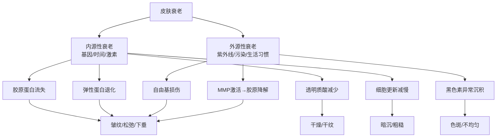
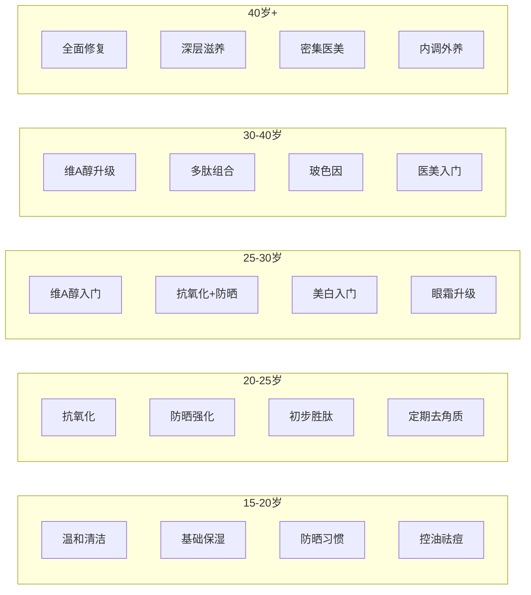

## 五、不同年龄段护肤方案

皮肤是一个随时间持续变化的活器官。15岁时困扰你的满脸痘痘，到了35岁可能被法令纹和色斑取代——不同年龄段面临的皮肤问题截然不同，护肤策略也必须随之调整。很多人犯的最大错误是"用20岁的方法护理40岁的皮肤"，或者反过来过早使用高浓度抗老产品给年轻肌肤增加负担。

本章按年龄段拆解皮肤的生理变化规律，为每个阶段提供从理论到实操的完整方案。

### 5.0 皮肤衰老的生物学基础

在进入具体方案之前，先理解"皮肤为什么会老"——这是所有抗老策略的理论根基。

#### 5.0.1 内源性衰老（自然老化）

内源性衰老是由基因和时间决定的不可逆过程，主要机制包括：

- **细胞分裂极限（Hayflick极限）**：人体细胞大约能分裂50-70次，每次分裂后端粒缩短。当端粒短到临界长度，细胞进入衰老状态，不再分裂更新。这意味着皮肤的"自我修复预算"是有限的
- **胶原蛋白降解**：25岁之后，胶原蛋白以每年约1%-1.5%的速度递减。到40岁时，胶原蛋白含量比20岁时减少约20%-30%。I型胶原蛋白（占皮肤胶原的80%-90%）流失导致皮肤支撑力下降，出现皱纹和松弛
- **弹性蛋白退化**：弹性蛋白赋予皮肤"回弹"能力。随着年龄增长，弹性蛋白纤维断裂、变性，皮肤失去弹性，按压后恢复变慢
- **透明质酸减少**：皮肤中透明质酸含量在40岁后显著下降，到60岁时仅为年轻时的50%左右。这直接导致皮肤含水量降低、出现干纹
- **激素变化**：雌激素对皮肤厚度、胶原合成和水分保持有重要保护作用。更年期雌激素水平骤降，是女性皮肤在45-55岁间加速老化的重要原因
- **细胞自噬能力下降**：年轻细胞能高效清除受损蛋白质和细胞器（自噬），随年龄增长这一能力衰退，代谢废物积累，加速皮肤老化

#### 5.0.2 外源性衰老（光老化为主）

外源性衰老是可预防的，其中紫外线是最大的"皮肤杀手"：

- **UVA（长波紫外线）**：穿透到真皮层，直接破坏胶原蛋白和弹性蛋白纤维。UVA全年存在，能穿透玻璃，是光老化的主要元凶。它通过产生活性氧自由基（ROS）激活基质金属蛋白酶（MMPs），加速胶原降解
- **UVB（中波紫外线）**：主要作用于表皮层，导致晒伤、色斑。UVB强度随季节和日照时间变化明显
- **累积效应**：光老化是长年累月积累的结果。研究显示，80%的面部老化迹象（皱纹、色斑、松弛）可归因于紫外线暴露。也就是说，如果从不晒太阳，你在60岁时的皮肤状态可能接近从未光老化的人在30-40岁时的水平

#### 5.0.3 关键时间节点

理解这些生物学里程碑，才能在正确的时间做正确的事：

| 年龄节点 | 发生的生理变化 | 护肤意义 |
|---|---|---|
| 12-14岁 | 青春期启动，雄激素上升 | 皮脂分泌激增，需要开始基础清洁和防晒 |
| 20-22岁 | 皮脂分泌开始回落 | 可以逐步引入功效性成分 |
| 25岁 | 胶原蛋白开始以每年~1%速度流失 | 抗老的"黄金起跑线"，抗氧化+防晒 |
| 30岁 | 细胞更新周期从28天延长到35-40天 | 皮肤自我修复变慢，需要更多外部辅助 |
| 35岁 | 弹性蛋白纤维开始明显退化 | 需要更积极的抗老策略 |
| 40岁 | 雌激素水平开始下降 | 皮肤干燥加速，胶原流失加速 |
| 45-55岁 | 更年期，雌激素断崖式下降 | 皮肤厚度可能减少30%+，需要全面修复策略 |
| 60岁+ | 皮下脂肪层萎缩 | 面部凹陷、松弛，护肤重点转向保湿修复 |

> 注意：以上为平均值参考，个体差异很大。基因、生活习惯、防晒历史都会显著影响实际进程。长期严格防晒的人，皮肤衰老进程可能比同龄人慢10-15年。

---

### 5.1 15-20岁：基础护肤期

#### 5.1.1 这个年龄段的皮肤发生了什么

青春期是皮肤的"风暴期"。下丘脑-垂体-性腺轴激活，雄激素（主要是睾酮和二氢睾酮/DHT）水平上升，直接刺激皮脂腺增大并分泌更多皮脂。这就是为什么青春期几乎人人都会经历不同程度的出油和痘痘问题。

具体生理变化：

- **皮脂分泌量激增**：青春期皮脂分泌量可能是儿童期的5-8倍，T区尤为明显
- **角质代谢加快但不稳定**：角质细胞更新速度加快，但有时角质脱落不完全，堵塞毛孔形成闭口粉刺
- **痤疮丙酸杆菌增殖**：过多的皮脂为痤疮丙酸杆菌（C. acnes）提供了理想的繁殖环境，引发炎症反应
- **自我修复能力强**：好消息是，年轻皮肤的细胞更新周期约28天，胶原蛋白充足，受损后修复速度快
- **皮肤屏障功能完整**：年轻皮肤的角质层脂质组成健康，屏障功能通常很好，不需要过度修复

#### 5.1.2 护肤核心策略：温和+精简

这个年龄段的护肤原则可以用四个字概括：**少即是多**。年轻皮肤自身能力很强，过度护肤反而会破坏屏障、加重问题。

**核心任务清单：**

1. **温和清洁**
   - 选择氨基酸系或APG（烷基糖苷）类洁面产品，pH值5.0-6.0
   - 每天早晚各洗一次，不要超过两次
   - 避免皂基洁面（pH偏高，破坏皮脂膜）和磨砂类产品（过度去角质）
   - 水温用温水（32-35°C），不要用热水

2. **控油祛痘**
   - 轻度痤疮（闭口粉刺为主）：使用含水杨酸（BHA 0.5%-2%）的产品，每周2-3次
   - 中度痤疮（红肿丘疹）：含过氧化苯甲酰（2.5%-5%）的点涂产品
   - 重度痤疮（囊肿、结节）：**必须就医**，皮肤科医生可能开具阿达帕林、维A酸等处方药
   - 不要手挤痘痘——挤压会导致炎症扩散、留下痘印和痘坑

3. **保湿**
   - 油皮也需要保湿！很多人以为出油就不需要保湿，实际上缺水的皮肤会代偿性分泌更多皮脂
   - 选择轻薄的乳液或凝露，避开厚重面霜
   - 优先选择含神经酰胺、透明质酸、甘油的保湿产品

4. **防晒（最重要的长期投资）**
   - 从现在开始建立终身防晒习惯。20岁之前累积的紫外线暴露量占一生总量的很大比例
   - 日常选择SPF30-50、PA+++以上的防晒产品
   - 通勤用防晒霜即可，户外活动需要加强补涂（每2小时一次）

**不需要做的事情：**
- 不需要抗老精华、眼霜——没有抗老需求
- 不需要高浓度果酸、维A醇——年轻皮肤不需要这些刺激
- 不需要频繁更换产品——皮肤需要时间适应
- 不需要过多步骤——3-4步足矣

#### 5.1.3 推荐早晚流程

早晨（3步）：
温和洁面 → 轻薄乳液 → 防晒霜（SPF30+ PA+++）

晚间（3-4步）：
温和洁面 → 水杨酸产品（每周2-3次，痘痘肌）→ 轻薄乳液

#### 5.1.4 常见误区与纠正

| 错误做法 | 为什么错 | 正确做法 |
|---|---|---|
| 用强力控油洗面奶洗到"嘎吱响" | 破坏皮脂膜，皮肤代偿出油更多 | 用温和氨基酸洁面，洗完不紧绷 |
| 频繁刷酸祛痘 | 过度刺激导致屏障受损、敏感爆痘 | 低浓度起步，每周2-3次，观察耐受 |
| 痘痘用手挤 | 细菌扩散+真皮损伤=痘坑痘印 | 点涂祛痘产品或就医 |
| 不防晒（"年轻晒不黑"） | 晒伤不等于光老化，紫外线损伤是累积的 | 每天防晒，不看天气和季节 |
| 跟风买贵妇产品 | 年轻皮肤不需要，浪费钱且可能增加负担 | 精简护肤，把钱省下来 |
| 长痘不就医，自己买药乱涂 | 可能延误治疗，留下永久疤痕 | 中重度痤疮看皮肤科 |

#### 5.1.5 特殊情况处理

**青春期痤疮严重怎么办？**
- 轻度（<20个粉刺）：外用水杨酸/阿达帕林，通常8-12周见效
- 中度（粉刺+炎性丘疹）：外用药+口服抗生素（医生处方），疗程通常3-6个月
- 重度（囊肿/结节）：口服异维A酸（泰尔丝），需要在皮肤科医生指导下使用，定期检查肝功能和血脂
- 女性可考虑口服短效避孕药（如达英-35）调节激素水平，同时改善痤疮

**月经周期与痘痘**
- 女性在月经前1-2天容易爆痘，与黄体期孕酮水平升高、皮脂分泌增加有关
- 可在经期前一周加强清洁和水杨酸使用，经期后恢复正常频率

---

### 5.2 20-25岁：预防护肤期

#### 5.2.1 这个年龄段的皮肤发生了什么

这是一个"过渡期"——青春期的剧烈激素波动趋于平缓，皮脂分泌量逐渐回落到稳定水平，痘痘问题通常会减轻（但不会完全消失）。与此同时，皮肤的老化过程悄然开始：20岁之后，身体的抗氧化能力开始下降，自由基损伤开始积累。

具体变化：

- **皮脂分泌趋于稳定**：不再像青春期那样大起大落，但T区可能仍然偏油
- **初期光老化信号**：如果之前防晒做得不好，可能开始出现雀斑或肤色不均
- **表情纹初现**：大笑、皱眉等表情动作反复折叠皮肤，动态纹开始出现（但放松后消失）
- **角质更新仍然活跃**：28天左右的更新周期，皮肤自我修复能力良好
- **抗氧化压力开始上升**：熬夜、压力、紫外线产生的自由基开始超过身体的清除能力

#### 5.2.2 护肤核心策略：抗氧化+防晒

这个阶段的关键词是"预防"。抗老的最佳时机不是出现皱纹之后，而是在皱纹出现之前。25岁之前建立抗氧化习惯，相当于给皮肤"存养老金"。

**核心任务清单：**

1. **防晒——仍然是一切的基础**
   - 不再多说，这个习惯应该已经建立。如果还没建立，现在是最后的"低成本"窗口

2. **抗氧化——这个阶段最重要的新增步骤**
   - **维生素C（L-抗坏血酸）**：最经典的抗氧化成分，能中和自由基、抑制黑色素合成、促进胶原蛋白合成。选择10%-20%浓度的左旋维C，pH值2.5-3.5效果最佳
   - **虾青素（Astaxanthin）**：抗氧化能力是维C的6000倍、维E的1000倍（体外实验数据）。适合对维C不耐受的人群
   - **白藜芦醇（Resveratrol）**：激活SIRT1长寿基因，辅助抗氧化
   - 抗氧化精华用在早晨，配合防晒霜形成"抗氧化+防晒"的双重防护

3. **基础保湿升级**
   - 根据肤质调整保湿力度：油皮用乳液，混合皮T区乳液+两颊面霜，干皮用面霜
   - 可以开始使用含透明质酸的化妆水打底

4. **初步抗老意识**
   - 不需要高强度抗老产品，但可以开始使用含胜肽（如棕榈酰三肽-5、乙酰基六肽-8）的眼霜
   - 眼周皮肤最薄（约0.5mm），最早出现老化迹象，提前护理有意义

5. **定期去角质**
   - 每周1-2次温和化学去角质（果酸/水杨酸），帮助代谢老旧角质
   - 不要同时使用物理+化学去角质产品

#### 5.2.3 推荐早晚流程

早晨（5步）：
氨基酸洁面 → 化妆水 → 维C/抗氧化精华 → 乳液/面霜 → 防晒霜

晚间（4-5步）：
氨基酸洁面 → 化妆水 → 功效精华（烟酰胺/果酸，交替使用）→ 眼霜 → 乳液/面霜

#### 5.2.4 维生素C的选购和使用

维C是这个阶段最值得投资的成分，但市面上产品参差不齐，需要学会挑选：

| 维生素C类型 | 浓度 | 稳定性 | 刺激性 | 适合人群 |
|---|---|---|---|---|
| L-抗坏血酸（纯维C） | 10-20% | 差（易氧化变黄） | 较高 | 耐受性好的油皮/混油皮 |
| 维C衍生物（AA2G等） | 中等 | 好 | 低 | 敏感肌入门 |
| 维C乙基醚 | 3-5% | 好 | 低 | 所有肤质 |
| 酯化维C（VC-IP） | 中等 | 很好 | 很低 | 干皮/敏感肌 |

使用注意：
- 维C在低pH下效果最好，但刺激性也最大。第一次使用可能有轻微刺痛，属正常现象
- 纯维C溶液氧化后会变黄/棕色，变色后不要继续使用
- 存放在避光、密封、低温环境，开封后尽快用完（建议3个月内）
- 可以与维E协同使用，抗氧化效果显著提升

#### 5.2.5 常见误区与纠正

| 错误做法 | 为什么错 | 正确做法 |
|---|---|---|
| "我还年轻，不需要抗氧化" | 20岁后抗氧化能力已开始下降 | 从20岁开始用抗氧化精华 |
| 盲目跟风"早C晚A" | 维A醇对20-25岁大部分人的皮肤来说过强 | 25岁之前以维C为主，25岁后再考虑维A醇 |
| 同时上多种高浓度活性成分 | 容易导致刺激、屏障受损 | 一次只引入一个新成分，建立耐受后再叠加 |
| 不卸防晒霜直接洗面奶洗 | 防晒霜（尤其防水型）需要专门卸除 | 防水防晒先用卸妆产品，再洁面 |

---

### 5.3 25-30岁：初期抗老期

#### 5.3.1 这个年龄段的皮肤发生了什么

25岁是皮肤状态的一个"分水岭"。很多研究将25岁视为皮肤老化的起始点——不是说25岁突然变老，而是从这个年龄开始，老化速度超过了修复速度。

具体变化：

- **胶原蛋白开始净流失**：合成速度跟不上降解速度，每年净减少约1%。这意味着如果你25岁时皮肤含有100单位胶原蛋白，到30岁时只剩约95单位——感觉不多，但这是累积效应的起点
- **角质更新周期延长**：从28天逐渐延长到30-35天，老废角质堆积导致肤色暗沉
- **黑色素代谢减慢**：色斑更容易形成且消退更慢
- **表情纹固化**：动态纹（做表情时出现）开始向静态纹（不做表情也有）转化
- **眼周细纹出现**：眼周是面部最薄的皮肤，最早显现老化
- **代谢能力下降**：熬夜后的恢复时间变长，"睡一觉就好"的时代结束了

#### 5.3.2 护肤核心策略：抗氧化+抗老双线并行

25-30岁是抗老的"黄金窗口"——皮肤还有不错的自我修复能力，此时引入抗老成分能获得最大的边际收益。

**核心任务清单：**

1. **维A醇（Retinol）——抗老的"金标准"成分**
   - 维A醇是目前研究最充分、证据最扎实的抗老外用成分，能促进胶原蛋白合成、加速角质更新、减少细纹
   - **入门指南**：
     - 起始浓度：0.1%-0.3%
     - 使用频率：第一周1次，第二周2次，逐步增加到隔天一次，最终每晚使用
     - 建立耐受通常需要4-8周，期间可能出现脱皮、干燥、泛红——这是正常反应
     - 如果反应严重（大面积红肿、刺痛），降低浓度或减少频率
   - **使用方法**：洁面→化妆水→等待皮肤完全干燥→取黄豆大小维A醇→涂全脸（避开眼周和嘴角）→等待吸收→保湿面霜
   - **重要禁忌**：
     - 不与酸类产品（AHA/BHA）同时使用，至少间隔30分钟或早晚分开
     - 使用期间严格防晒（维A醇会增加光敏感性）
     - 孕期和备孕期禁用
     - 与水杨酸产品（含水杨酸）错开使用

2. **继续强化抗氧化**
   - 早晨维C精华仍然是标配
   - 可以考虑增加维E、阿魏酸等复合抗氧化配方（如修丽可CE精华的配方思路：15%维C+1%维E+0.5%阿魏酸）

3. **美白成分引入**
   - 如果有色斑或暗沉问题，可以开始使用美白成分：
     - **烟酰胺（维生素B3）**：抑制黑色素转运，浓度3%-5%，同时有控油、修复屏障功效
     - **熊果苷（α-熊果苷效果更好）**：抑制酪氨酸酶活性
     - **传明酸（氨甲环酸）**：抑制黑色素细胞活性，温和有效
   - 美白和维A醇可以搭配使用（晚间维A醇，或者美白精华→维A醇→保湿）

4. **眼霜升级**
   - 从单纯的保湿眼霜升级为含抗氧化+抗老成分的眼霜
   - 有效成分：维C衍生物、胜肽（棕榈酰四肽-7、乙酰基六肽-8）、咖啡因（消除浮肿）
   - 使用手法：取米粒大小，用无名指轻拍在眼眶骨上，不要拉扯眼周皮肤

#### 5.3.3 推荐早晚流程

早晨（5步）：
温和洁面 → 化妆水 → 维C精华 → 乳液/面霜 → 防晒霜（SPF50 PA++++）

晚间（5-6步）：
温和洁面 → 化妆水 → 维A醇（逐步建立耐受）→ 美白精华（可选）→ 眼霜 → 修复面霜

维A醇建立耐受的参考时间表：

| 周次 | 使用频率 | 备注 |
|---|---|---|
| 第1-2周 | 每周1次 | 观察是否有明显刺激反应 |
| 第3-4周 | 每周2次 | 如有轻微脱皮，属正常 |
| 第5-6周 | 隔天1次 | 脱皮应逐渐减轻 |
| 第7-8周起 | 每晚使用 | 皮肤完全耐受后维持 |

#### 5.3.4 关于"早C晚A"的正确理解

"早C晚A"（早晨维C、晚间维A醇）是近年来流行的护肤公式，其科学依据是：

- **维C在早晨使用**：中和日间紫外线产生的自由基，配合防晒霜增强光防护效果
- **维A醇在晚间使用**：维A醇有光敏性（遇光分解+增加皮肤对紫外线的敏感），必须夜间使用

但这个公式不是万能的：
- 不是所有人都需要或适合同时使用维C和维A醇
- 敏感肌可以先只用维C，等皮肤状态稳定后再逐步引入维A醇
- 维A醇需要4-8周建立耐受，不要急于求成

#### 5.3.5 常见误区与纠正

| 错误做法 | 为什么错 | 正确做法 |
|---|---|---|
| 一上来就用高浓度维A醇 | 皮肤不耐受，大面积脱皮、红肿 | 从0.1%起步，慢慢建立耐受 |
| 维A醇用了两周没效果就放弃 | 维A醇起效需要8-12周 | 坚持使用至少3个月再评估 |
| 维A醇+酸类产品同一步骤使用 | 双重刺激，屏障直接崩塌 | 错开使用（早晚分开或隔天交替） |
| "25岁才抗老是不是晚了" | 25岁是黄金起点，永远不算晚 | 从现在开始，越早越好 |
| 只关注脸部，忽略颈部 | 颈部皮肤薄且皮脂腺少，老化更快 | 面部护肤产品同步延伸到颈部 |

---

### 5.4 30-40岁：强化抗老期

#### 5.4.1 这个年龄段的皮肤发生了什么

30岁之后，皮肤老化进入"加速期"。如果说25-30岁是缓慢滑坡，30-40岁就是明显下滑。胶原蛋白流失加速，真皮层结构开始出现质变。

具体变化：

- **胶原蛋白流失加速**：每年减少1%-1.5%，30岁到40岁累计流失10%-15%。在显微镜下，真皮层的胶原纤维网从密集有序变得稀疏紊乱
- **皱纹从动态转为静态**：法令纹、鱼尾纹、抬头纹开始在不做表情时也可见
- **弹性下降，松弛初现**：面部轮廓线开始模糊，下颌线不再紧致
- **色素问题加重**：色斑（日光性雀斑、黄褐斑）增多，消退变慢
- **皮肤修复能力明显下降**：细胞更新周期延长到35-40天，伤口和痘印恢复变慢
- **皮脂腺功能可能改变**：部分人从油皮转为混合或偏干
- **面部脂肪垫下移和萎缩**：面部脂肪开始重新分布，泪沟、苹果肌凹陷逐渐明显

#### 5.4.2 护肤核心策略：多靶点抗老

单一成分已经不够了，需要"组合拳"——多种抗老成分协同作用。

**核心任务清单：**

1. **维A醇升级**
   - 从0.3%-0.5%浓度的维A醇起步（如果前期已建立耐受，可以直接用这个浓度）
   - 进阶选择：视黄醛（Retinaldehyde）比维A醇更强效但刺激性接近，是维A醇和处方维A酸之间的折中选择
   - 终极选择：如果条件允许，可以考虑使用处方级维A酸（如0.025%维A酸乳膏），效果最强但需要医生指导

2. **胜肽类——补充胶原蛋白信号**
   - 胜肽是短链氨基酸序列，能模拟胶原蛋白降解碎片发出的"修复信号"，刺激成纤维细胞合成新的胶原蛋白
   - 关键胜肽及作用：
     - **棕榈酰三肽-5（Pal-KTTKS）**：直接刺激胶原蛋白I型合成
     - **乙酰基六肽-8（Argireline）**：类肉毒素效果，减少表情纹
     - **铜肽（GHK-Cu）**：促进伤口愈合和胶原重塑
     - **棕榈酰四肽-7**：抗炎、减少眼袋
   - 胜肽的优点是温和、不刺激，可以与维A醇搭配使用

3. **玻色因（Pro-Xylane）**
   - 欧莱雅集团的专利成分（专利已过期），能促进真皮层GAGs（糖胺聚糖，如透明质酸）合成
   - 临床试验显示3%浓度使用2个月后，皮肤紧致度和弹性有显著改善
   - 与维A醇搭配使用，一个促胶原、一个补透明质酸，形成互补

4. **美白淡斑**
   - 30岁后色斑问题更突出，需要更有针对性的美白策略：
     - **维C+传明酸+烟酰胺**：三者作用于黑色素生成的不同环节，联合使用效果更好
     - **壬二酸（杜鹃花酸）**：15%-20%浓度，对黄褐斑特别有效
     - **果酸换肤**：20%-35%浓度的果酸可以加速色斑代谢（建议在专业机构操作）
   - 顽固色斑可考虑医美手段（见下文）

5. **屏障修复加强**
   - 30岁后屏障修复能力下降，加上使用维A醇等活性成分，屏障维护变得更重要
   - 日常使用含神经酰胺、胆固醇、脂肪酸的修复类产品
   - 定期（每周1-2次）使用修复面膜或厚涂修复面霜做"密集修复"

6. **防晒——从防护升级到修复**
   - 防晒仍然是第一位的，但现在可以选择含抗氧化+修复成分的防晒产品
   - 物理防晒剂（氧化锌、二氧化钛）对敏感的30岁+皮肤可能更友好
   - 补涂意识要加强——室内也要注意蓝光防护（虽然证据还在积累，但预防无害）

#### 5.4.3 推荐早晚流程

早晨（6步）：
温和洁面 → 保湿化妆水 → 维C精华 → 抗老眼霜 → 滋润面霜 → 高倍防晒（SPF50+ PA++++）

晚间（6-7步）：
卸妆 → 温和洁面 → 化妆水 → 维A醇/视黄醛 → 胜肽精华 → 抗老眼霜 → 修复面霜

建议的每周护肤安排：

| 星期 | 晚间重点 | 备注 |
|---|---|---|
| 周一 | 维A醇 | 正常浓度 |
| 周二 | 休息（修复日） | 只用保湿修复产品 |
| 周三 | 维A醇 | 正常浓度 |
| 周四 | 果酸/水杨酸 | 促进角质更新 |
| 周五 | 维A醇 | 正常浓度 |
| 周六 | 休息（修复日） | 密集修复面膜 |
| 周日 | 维A醇 | 正常浓度 |

> 如果皮肤耐受良好，可以增加维A醇的使用频率到每晚一次。但建议每周至少留1天"休息日"让皮肤自我修复。

#### 5.4.4 医美入门指南

30岁之后，护肤品的天花板开始显现——再好的维A醇也无法达到医美的效果。以下是这个阶段值得考虑的医美项目：

| 项目 | 原理 | 适合解决的问题 | 频率 | 费用参考（单次） |
|---|---|---|---|---|
| 光子嫩肤（IPL） | 强脉冲光分解色素、刺激胶原 | 色斑、红血丝、肤色不均 | 每月1次，3-5次一疗程 | 800-3000元 |
| 果酸换肤 | 化学剥脱加速角质更新 | 闭口、暗沉、浅层色斑 | 每2-4周1次 | 300-1500元 |
| 水光针 | 注射透明质酸到真皮层 | 深层补水、细纹 | 每3-6个月1次 | 1500-5000元 |
| 热玛吉（Thermage） | 射频加热真皮层刺激胶原再生 | 松弛、轮廓模糊 | 每年1次 | 8000-30000元 |
| 超声刀（HIFU） | 聚焦超声能量作用于筋膜层 | 面部提升、下颌线 | 每1-2年1次 | 5000-20000元 |

医美注意事项：
- 选择正规医疗机构和有资质的医生，不要去美容院做医美项目
- 第一次做任何项目之前，先做皮肤检测和医生面诊
- 医美后皮肤屏障会有不同程度的损伤，术后护理（修复+防晒）比项目本身更重要
- 医美是护肤的"加速器"，不是"替代品"——日常护肤仍然需要坚持

#### 5.5.5 常见误区与纠正

| 错误做法 | 为什么错 | 正确做法 |
|---|---|---|
| "30岁了应该用最贵的产品" | 贵≠有效，关键看成分和配方 | 根据成分选择，不根据价格 |
| 同时用5种以上活性成分 | 成分冲突+过度刺激 | 每个时间段2-3种活性成分足矣 |
| 忽略颈部护理 | 颈纹暴露年龄 | 面部所有产品延伸到颈部 |
| 医美"一劳永逸"心态 | 所有医美效果都是暂时的 | 医美+日常护肤结合才能维持 |
| 完全不医美或过度依赖医美 | 两个极端都有问题 | 合理医美+科学护肤，取长补短 |

---

### 5.5 40岁以上：深层修复期

#### 5.5.1 这个年龄段的皮肤发生了什么

40岁之后，皮肤老化不仅是"量变"而是"质变"。如果说之前的胶原流失是"滴水穿石"，更年期带来的激素剧变就是"雪崩"。

具体变化（以女性为例，男性老化相对缓慢但也存在类似趋势）：

- **胶原蛋白大幅减少**：40-50岁期间，胶原蛋白流失速度可能是之前的2-3倍。更年期女性在停经后5年内，胶原蛋白可减少30%
- **皮肤显著变薄**：表皮层和真皮层都在变薄，皮肤透光性增加，更容易看到血管
- **皱纹深且明显**：法令纹、木偶纹、额纹等静态纹已经固化，深度可达真皮层中部
- **松弛和下垂**：面部支撑结构（脂肪垫、韧带、筋膜层）全面退化，面部轮廓模糊
- **色素沉着加重**：大面积色斑、黄褐斑、脂溢性角化（老年斑前身）增多
- **皮肤干燥加重**：皮脂腺功能下降+透明质酸减少，皮肤含水量可能降至年轻时的60%-70%
- **伤口愈合变慢**：免疫功能和细胞更新都减慢，皮肤对外界刺激更脆弱
- **男性皮肤变化**：男性虽然没有更年期激素断崖，但睾酮缓慢下降也会影响胶原合成。男性皮肤通常比女性厚约20%，老化出现较晚但一旦出现进展更快

#### 5.5.2 护肤核心策略：全面修复+深层滋养

这个阶段的护肤策略从"预防和初期抗老"转向"修复和维持"。目标不是让皱纹消失（护肤品做不到），而是减缓进一步老化、维持皮肤健康状态。

**核心任务清单：**

1. **高浓度维A醇或处方维A酸**
   - 维A醇浓度可以使用0.5%-1%
   - 如果此前建立了良好的耐受基础，可以考虑在医生指导下使用处方维A酸（如0.025%-0.05%全反式维A酸），效果是维A醇的5-10倍
   - 维A酸使用方法：初期每周1-2次薄涂，建立耐受后增加频率。与保湿面霜混合使用可降低刺激

2. **多种抗老成分联合使用**
   - **维A醇/酸**：促进胶原合成、加速细胞更新（晚间使用）
   - **胜肽组合**：信号肽+神经肽+载体肽，多靶点刺激胶原修复（早晚均可）
   - **玻色因**：补充真皮层透明质酸和GAGs
   - **生长因子（EGF/bFGF）**：促进细胞增殖和修复（争议性成分，但部分研究显示有效）
   - 这些成分可以叠加使用，因为它们作用于不同靶点

3. **深层保湿和屏障修复**
   - 保湿不再是可选项，而是每天的刚需
   - 选择"补充+封闭"双重保湿策略：
     - 补充层：透明质酸、甘油、氨基酸等吸水成分
     - 封闭层：角鲨烷、牛油果树脂、矿脂等锁水成分
   - 护肤油（如角鲨烷油、玫瑰果油）可以作为面霜前的最后一步，增强封闭效果
   - 含有胆固醇、脂肪酸、神经酰胺（1:1:1摩尔比）的屏障修复产品是首选

4. **美白淡斑——持续对抗**
   - 40岁后色斑更顽固，可能需要更强力的手段：
     - 处方级氢醌（2%-4%）——短期使用（不超过3个月），需医生处方
     - 壬二酸（15%-20%）——长期使用安全，对黄褐斑有效
     - 传明酸（口服+外用联合）——对顽固黄褐斑有临床证据
   - 色斑治疗要有耐心，通常需要3-6个月才能看到明显改善

5. **防晒——比任何时候都重要**
   - 40岁后的皮肤对紫外线更敏感、修复能力更差，一次严重晒伤的影响可能比20岁时大得多
   - 选择物理+化学复合防晒，SPF50+ PA++++
   - 不仅涂脸，还要涂颈、手背——这些部位最容易暴露年龄

#### 5.5.3 推荐早晚流程

早晨（6-7步）：
温和洁面 → 保湿化妆水 → 维C精华 → 胜肽精华 → 抗老眼霜 → 滋润面霜 → 高倍防晒霜

晚间（7-8步）：
卸妆 → 温和洁面 → 保湿化妆水 → 维A醇/酸 → 胜肽精华 → 抗老眼霜 → 修复面霜 → 护肤油（可选）

#### 5.5.4 进阶医美选择

40岁之后，医美的重要性进一步上升。一些更有针对性的选择：

| 项目 | 原理 | 解决的问题 | 频率 | 效果维持 |
|---|---|---|---|---|
| 热玛吉（Thermage FLX） | 单极射频加热真皮层至65-75°C，即刻收缩胶原+长期刺激新生 | 松弛、轮廓线模糊 | 每1-2年1次 | 1-2年 |
| 超声刀（HIFU） | 聚焦超声能量作用于SMAS筋膜层 | 面部提升、下颌线紧致 | 每1-2年1次 | 1-2年 |
| 嗨体注射 | 注射含多种氨基酸+透明质酸的复合液到真皮层 | 颈纹、面部细纹 | 每月1次，3次一疗程 | 6-12个月 |
| 肉毒素 | 阻断神经-肌肉信号传递 | 动态皱纹（鱼尾纹、抬头纹、皱眉纹） | 每4-6个月1次 | 4-6个月 |
| 玻尿酸填充 | 物理填充凹陷部位 | 泪沟、法令纹、苹果肌、太阳穴凹陷 | 每6-18个月1次 | 6-18个月 |
| 线雕（埋线提升） | 可吸收线材物理提拉+刺激胶原 | 面部下垂、轮廓线 | 每1-2年1次 | 1-2年 |

#### 5.5.5 内调外养——不容忽视的内在因素

40岁之后，"由内而外"的调理比以往任何时候都重要：

**饮食调整：**
- **增加优质蛋白摄入**：胶原蛋白的合成需要充足的氨基酸原料，每天蛋白质摄入量建议1.0-1.2g/kg体重
- **补充胶原蛋白肽**：口服胶原蛋白肽（分子量2000-5000Da）有临床研究支持其对皮肤弹性和水分的改善效果。每天5-10g，坚持8周以上
- **维生素C**：不仅外用，口服维生素C（每天500-1000mg）是胶原蛋白合成的必要辅因子
- **Omega-3脂肪酸**：深海鱼油或亚麻籽油，减少炎症、改善皮肤含水量
- **抗氧化食物**：蓝莓、番茄（煮熟的番茄中番茄红素吸收率更高）、绿茶、深色蔬菜

**睡眠：**
- 皮肤的修复主要发生在深度睡眠阶段（夜间10点-凌晨2点），生长激素在此期间分泌最旺盛
- 睡眠不足会加速胶原蛋白降解（皮质醇水平升高→MMP活性增强→胶原降解加速）
- 目标：每晚7-8小时高质量睡眠

**运动：**
- 规律运动能改善血液循环，增加皮肤供氧和营养供给
- 高强度间歇运动（HIIT）能促进生长激素分泌，有助于皮肤修复
- 但要注意运动后及时清洁——汗水+油脂混合物可能堵塞毛孔

**压力管理：**
- 慢性压力→皮质醇持续升高→胶原蛋白降解加速+皮肤屏障功能下降
- 冥想、瑜伽、深呼吸等减压方式对皮肤健康有间接但重要的影响

#### 5.5.6 常见误区与纠正

| 错误做法 | 为什么错 | 正确做法 |
|---|---|---|
| "40岁了护肤没用了" | 虽然无法逆转老化，但能显著减缓 | 坚持科学护肤+合理医美 |
| 同时做多种医美项目 | 可能导致过度治疗和并发症 | 每次1-2个项目，间隔至少2-4周 |
| 只关注脸部，忽视颈部和手部 | 颈部和手部是最先暴露年龄的部位 | 全面防晒+护理，包括颈、手、前胸 |
| 迷信"贵妇面霜"能逆转皱纹 | 面霜无法逆转真皮层结构性老化 | 合理预期，护肤品重在维持和减缓 |
| 不做防晒就去做医美 | 医美后皮肤更脆弱，不防晒反而加速老化 | 任何时候都要严格防晒 |

---

### 5.6 全年龄段护肤要素对比

下表汇总了不同年龄段的核心护肤要素，方便快速参考：

| 护肤要素 | 15-20岁 | 20-25岁 | 25-30岁 | 30-40岁 | 40岁+ |
|---|---|---|---|---|---|
| **清洁** | 温和氨基酸洁面 | 温和氨基酸洁面 | 温和洁面 | 温和洁面+必要卸妆 | 温和洁面+卸妆 |
| **保湿** | 轻薄乳液 | 乳液/面霜 | 根据肤质选择 | 滋润面霜 | 滋润面霜+护肤油 |
| **防晒** | SPF30+ PA+++ | SPF50 PA++++ | SPF50 PA++++ | SPF50+ PA++++ | SPF50+ PA++++ |
| **抗氧化** | 不需要 | 维C入门 | 维C强化 | 维C+多维抗氧化 | 全面抗氧化 |
| **抗老** | 不需要 | 不需要/胜肽眼霜 | 维A醇入门 | 维A醇+胜肽+玻色因 | 高浓度维A酸+全面抗老 |
| **美白** | 不需要 | 不需要 | 烟酰胺入门 | 多靶点美白 | 强效美白+医美 |
| **修复** | 不需要 | 偶尔修复 | 基础屏障维护 | 定期密集修复 | 全面屏障修复 |
| **医美** | 不需要 | 不需要 | 不需要/可选 | 入门项目 | 积极医美 |
| **内调** | 均衡饮食 | 规律作息 | 抗氧化饮食 | 胶原蛋白+运动 | 全面内调 |

### 5.7 给不同年龄段读者的行动建议

#### 如果你现在15-20岁
> 你最大的优势是时间和年轻皮肤的自我修复力。现在养成的每一个好习惯（尤其防晒）都会在未来10-20年给你丰厚回报。不要焦虑，不要过度护肤，把精力放在打好基础上。

**立即行动：**
1. 买一瓶温和的氨基酸洗面奶，早晚各洗一次
2. 买一瓶轻薄的保湿乳液
3. 买一瓶SPF30以上的防晒霜，每天出门前涂
4. 如果有痘痘问题，去看皮肤科医生，不要自己乱挤

#### 如果你现在20-25岁
> 你正站在抗老的起跑线上。现在引入抗氧化精华，就像20多岁开始交社保——短期看不到回报，但10年后你会感谢自己。

**立即行动：**
1. 在早晨护肤中加入维C精华（从10%浓度起步）
2. 选择一支含胜肽的入门级眼霜
3. 确保每天涂防晒（如果还没有这个习惯的话）
4. 每周做1-2次温和的化学去角质

#### 如果你现在25-30岁
> 你正处于抗老的黄金窗口期。维A醇是这个阶段最值得投资的成分——它是目前研究最充分、证据最扎实的抗老外用成分。

**立即行动：**
1. 购买一瓶低浓度维A醇产品（0.1%-0.3%），按照建立耐受的时间表开始使用
2. 确保早晨的维C+防晒组合已到位
3. 如果有色斑问题，开始使用烟酰胺或传明酸
4. 考虑升级眼霜为含抗氧化+抗老成分的产品

#### 如果你现在30-40岁
> 你需要从"单一成分"思维升级到"组合方案"思维。多种抗老成分协同配合，比任何单一成分都有效。

**立即行动：**
1. 升级维A醇浓度（0.3%-0.5%），或咨询医生是否适合使用处方维A酸
2. 在护肤流程中加入胜肽精华和玻色因产品
3. 每周安排1-2天"修复日"，让皮肤休息
4. 开始考虑适合自己的医美项目（建议从光子嫩肤或果酸换肤入手）
5. 护肤延伸到颈部，不要只管脸

#### 如果你现在40岁以上
> 你现在需要的是"系统工程"——护肤品、医美、内调三管齐下。单独依靠任何一个维度都不够。

**立即行动：**
1. 全面检查你的护肤流程，确保包含了维A醇/酸、胜肽、玻色因、抗氧化剂
2. 增加保湿力度——面霜+护肤油的组合
3. 咨询正规医美机构，制定适合自己的医美方案
4. 开始口服胶原蛋白肽+维生素C
5. 关注睡眠质量和运动习惯——它们对皮肤的影响比你想象的大

***

> 本章的核心信息：**护肤是长期主义**。没有任何单一产品能在一夜之间改变你的皮肤，但每天正确的护理习惯会在5年、10年、20年后给你肉眼可见的回报。无论你现在处于哪个年龄段，最好的开始时间永远是"现在"。
