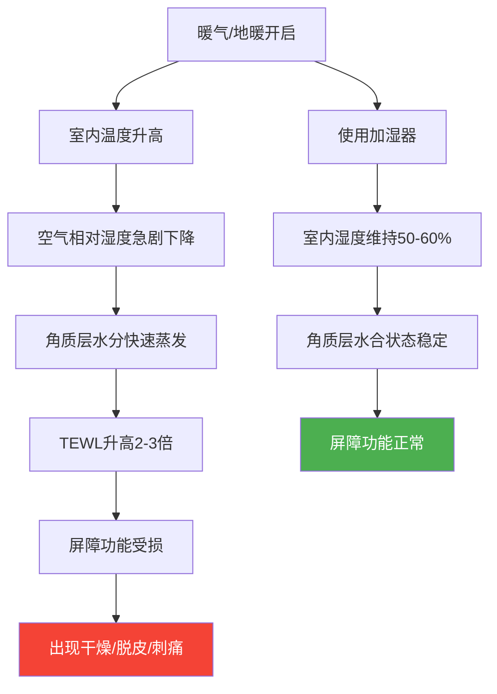
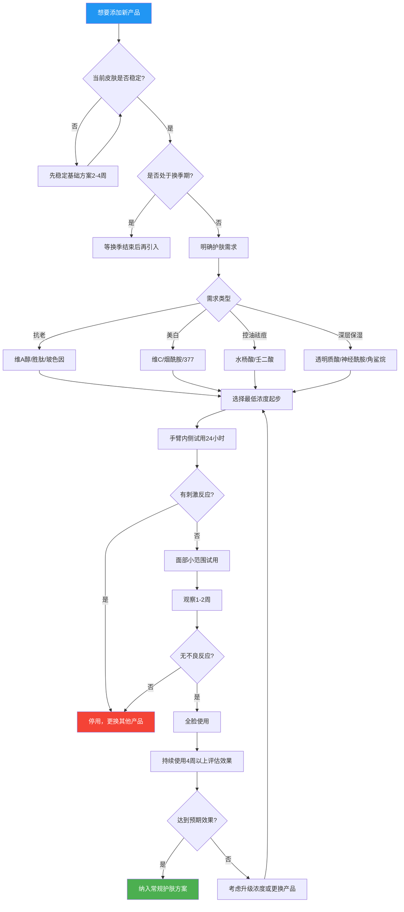

## 六、不同季节护肤方案

皮肤是人体最大的器官，也是与外界环境接触最直接的屏障。季节更替带来的温度、湿度、紫外线强度、空气污染物浓度等环境因素变化，会直接影响皮肤的生理状态——皮脂腺分泌量、角质层含水量、经皮水分流失率（TEWL）、屏障功能完整性等关键指标都会随之波动。理解这些变化的底层逻辑，才能做到"因时制宜"，让同一套基础产品在不同季节发挥最大效能。

### 6.1 皮肤随季节变化的科学原理

#### 6.1.1 温度对皮脂分泌的影响

皮脂腺的活性与环境温度密切相关。研究表明，环境温度每升高1°C，皮脂分泌量约增加10%左右。这是因为：

- **温度升高 → 皮脂腺细胞代谢加速 → 皮脂合成增加**
- **温度升高 → 皮脂粘度降低 → 更容易从毛孔排出**
- **温度升高 → 皮肤表面水分蒸发加快 → 角质层含水量下降**

这就解释了为什么夏天出油多却仍然可能"外油内干"——皮脂分泌增加不代表皮肤不缺水。

#### 6.1.2 湿度对屏障功能的影响

角质层的正常含水量需要维持在20%-35%之间，而环境湿度直接影响角质层的水合状态：

- **高湿环境（>60%）**：角质层容易吸收空气中的水分，含水量充足，屏障功能稳定
- **低湿环境（<40%）**：角质层水分向外蒸发加快，经皮水分流失率（TEWL）升高，屏障功能下降
- **暖气/空调环境**：室内湿度可低至20%-30%，相当于沙漠级别干燥

#### 6.1.3 紫外线的季节性波动

紫外线（UV）强度受太阳高度角影响，呈现明显的季节性变化：

- **UVB（导致晒伤）**：夏季强度约为冬季的3-5倍，变化显著
- **UVA（导致光老化）**：全年变化相对较小，冬季强度约为夏季的60%-80%
- **云层遮挡**：多云天气UV强度降低约20%-40%，但不会降至零
- **海拔因素**：海拔每升高1000米，UV强度增加约10%-12%
- **地面反射**：雪地可反射80%的紫外线，水面反射约20%，草地仅反射约3%

这意味着：**冬季也需要防晒**，尤其是雪天户外活动时，紫外线强度甚至可能超过夏季阴天。

#### 6.1.4 季节转换期的皮肤应激

换季期间（约2-4周），皮肤面临的主要挑战是**适应性滞后**——环境因素变化快于皮肤自身的调节速度，导致：

- 皮脂腺分泌节律紊乱：可能突然出油增多或减少
- 屏障功能暂时性下降：对外界刺激更敏感
- 免疫调节波动：容易出现过敏反应
- 角质代谢异常：可能出现脱皮或粗糙

**核心原则：换季期间"维稳"优先于"功效"，任何新的功效性产品都应避开换季期引入。**

### 6.2 春季护肤方案（3-5月）

#### 6.2.1 春季皮肤状态特征

春季是冬季向夏季的过渡期，皮肤正在经历以下变化：

| 指标 | 冬季状态 | 春季变化趋势 | 影响 |
|------|----------|--------------|------|
| 皮脂分泌 | 最低 | 逐渐增加 | 从偏干过渡到偏中性 |
| 角质含水量 | 偏低 | 逐渐恢复 | 脱皮现象减少 |
| 紫外线强度 | 弱 | 明显增强 | UVB强度可达冬季2倍 |
| 过敏原浓度 | 低 | 急剧升高 | 花粉、柳絮等致敏物增多 |
| 空气湿度 | 干燥 | 波动大 | 时而潮湿时而干燥 |

#### 6.2.2 春季早间护肤流程

**具体操作：**

1. **洁面**：继续使用氨基酸洁面。春季出油量开始增加，但仍以温和清洁为主，不要因为"感觉有点油"就换成皂基洁面。如果T区出油明显增加，可以在T区多按摩10-15秒，而不是增加清洁力度。

2. **抗氧化精华**：早晚各使用一次。春季紫外线增强，抗氧化需求上升，抗氧化精华中的抗氧化成分可以帮助中和紫外线诱导的自由基，减轻光损伤。

3. **保湿乳液**：全脸均匀涂抹。春季皮肤含水量逐渐恢复，保湿乳液的保湿力度基本够用，不需要额外叠加面霜。如果两颊仍感觉偏干，可以在两颊区域多涂一层薄薄的保湿乳液。

4. **防晒**：升级到SPF30/PA+++及以上。春季紫外线强度明显回升，尤其是3月下旬开始，UVB强度可达到冬季的2倍。即使阴天也要涂抹防晒，因为UVA可以穿透云层。

#### 6.2.3 春季晚间护肤流程

1. **洁面**：使用氨基酸洁面，确保清洁掉防晒和一天积累的污垢、花粉等过敏原。春季晚上洁面尤其重要，因为白天附着在皮肤表面的花粉如果不清除，可能在夜间引发过敏反应。

2. **抗氧化精华**：晚间继续使用，夜间是皮肤修复的黄金时段，抗氧化成分可以清除日间积累的氧化损伤产物。

3. **保湿乳液**：正常涂抹，维持夜间保湿。

4. **水杨酸产品**：维持一周一次的频率，建议安排在周末晚间使用，给皮肤足够的恢复时间。

#### 6.2.4 春季特殊注意事项

**过敏季应对策略：**

春季是过敏高发期，花粉、柳絮、尘螨等过敏原浓度急剧上升。即使你之前没有明显的过敏史，也可能在某个春季突然出现皮肤敏感。应对策略包括：

- **简化护肤步骤**：如果出现泛红、瘙痒，立即停用水杨酸产品和抗氧化精华，只保留洁面+保湿乳液+防晒三步基础护理
- **不换新产品**：换季期间绝不引入新产品，减少变量
- **物理防护**：花粉高峰期（晴天、有风的日子）外出后及时洁面，清除附着的过敏原
- **应急处理**：如果出现明显过敏反应（持续泛红、瘙痒、起疹），不要自行处理，及时就医

**春季防晒升级时机：**

不要等到"感觉晒了"才加强防晒。3月中旬开始就应该切换到SPF30以上的防晒产品。判断标准不是"热不热"，而是紫外线指数（UV Index）。当UV Index≥3时就需要防护，而春季大部分地区的UV Index在3-6之间。

### 6.3 夏季护肤方案（6-8月）

#### 6.3.1 夏季皮肤状态特征

夏季是皮肤面临的最大挑战期，高温、高湿、强紫外线三重压力叠加：

| 指标 | 春季状态 | 夏季变化 | 挑战 |
|------|----------|----------|------|
| 皮脂分泌 | 中等 | 最高 | T区油光、毛孔粗大 |
| 紫外线 | 中等 | 最强 | UVB达全年峰值 |
| 出汗量 | 正常 | 显著增加 | 防晒被冲刷、需要频繁补涂 |
| 室内环境 | 正常 | 空调低温低湿 | 室内外温差大，皮肤适应困难 |
| 毛孔状态 | 正常 | 扩张 | 容易堵塞，黑头/粉刺增多 |

#### 6.3.2 夏季早间护肤流程

1. **洁面**：早晚都使用氨基酸洁面。夏季皮脂分泌旺盛，晚间睡眠期间也会大量分泌油脂，早晨洁面是必要的。可以在T区（额头、鼻子）多按摩15-20秒，帮助清除多余油脂。

2. **抗氧化精华**：早晚使用，夏季紫外线最强，抗氧化需求达到全年最高峰。抗氧化精华可以帮助抵御紫外线诱导的氧化应激，减轻光损伤。注意用量不要太多，薄薄一层即可，避免后续搓泥。

3. **保湿乳液**：全脸涂抹，但用量可以比冬季少约1/3。如果你的T区特别油，可以采取"分区护理"策略：
   - T区（额头、鼻子、下巴）：薄涂或不涂保湿乳液
   - 两颊、眼周：正常涂抹保湿乳液
   
4. **防晒**：升级到SPF50/PA++++，这是全年防晒要求最高的季节。选择要点：
   - 质地清爽的化学防晒或物化结合防晒，避免过于厚重导致闷痘
   - 用量要足：面部需要约一元硬币大小的量（约1g），很多人防晒效果不佳的根本原因是用量不足
   - 出门前15-20分钟涂抹，让防晒膜成膜
   - 户外活动每2小时必须补涂一次
   - 大量出汗后立即补涂

**夏季防晒补涂的实操方案：**

补涂防晒是很多人做不到的难点，以下是几种实用方案：

| 场景 | 推荐方案 | 操作方法 |
|------|----------|----------|
| 日常通勤 | 不需要补涂 | 早晨涂抹足够量即可 |
| 午间外出 | 防晒喷雾 | 喷2-3层，轻拍吸收 |
| 户外运动 | 防晒棒 | 直接在脸上涂抹，不脏手 |
| 带妆状态 | 防晒粉饼 | 用粉扑按压补涂 |
| 长时间户外 | 先吸油再补涂 | 用吸油纸按压后，涂防晒或用防晒喷雾 |

#### 6.3.3 夏季晚间护肤流程

1. **洁面**：如果白天涂了高倍防晒或化了妆，建议先用卸妆产品（卸妆油或卸妆乳）进行第一步清洁，再用氨基酸洗面奶做二次清洁。夏季防晒用量大、质地厚，单靠洗面奶可能清洁不彻底，导致毛孔堵塞。

2. **抗氧化精华**：正常用量，帮助修复日间紫外线造成的氧化损伤。

3. **保湿乳液**：正常涂抹，夜间空调环境下皮肤水分流失加快，保湿乳液的保湿作用不可省略。

4. **水杨酸产品**：夏季出油增多，毛孔堵塞风险增加，水杨酸产品（含水杨酸）可以帮助疏通毛孔、控制黑头。如果皮肤耐受良好，可以考虑增加到一周两次（比如周三和周日晚上），但要密切观察皮肤反应。如果出现脱皮或刺痛，立即恢复一周一次。

#### 6.3.4 夏季特殊注意事项

**空调环境的皮肤护理：**

夏季长时间待在空调环境中，皮肤面临"冰火两重天"的挑战——室外高温高湿，室内低温低湿。空调会将室内湿度降至30%-40%，相当于秋冬季节的干燥程度。应对策略：

- 工位上放一杯水，虽然对整体湿度影响有限，但可以提醒自己多喝水
- 如果条件允许，使用小型桌面加湿器，将局部湿度维持在50%左右
- 空调温度不要设置过低（建议26°C），温差过大会刺激皮肤血管反复收缩扩张
- 从室外进入空调房前，可以用保湿喷雾轻喷面部，帮助皮肤过渡

**控油的正确姿势：**

夏季控油是很多人的核心需求，但"控油"不等于"去油"：

- **吸油纸**：中午可以用吸油纸轻轻按压T区，注意是"按压"不是"擦拭"，擦拭会刺激皮脂腺分泌更多油脂
- **控油散粉**：可以在防晒之后轻拍一层控油散粉，帮助吸附多余油脂，延长清爽感
- **不要过度清洁**：出油多不代表要增加洁面次数或使用强力洁面产品，过度清洁会破坏皮脂膜，反而刺激皮脂腺"报复性"分泌更多油脂

**痘痘/粉刺高发期管理：**

夏季是痘痘和粉刺的高发期，主要原因：

1. 皮脂分泌增加 → 毛孔内油脂堆积
2. 出汗 → 角质层水合过度 → 毛孔口角化异常
3. 高温 → 痤疮丙酸杆菌繁殖加速
4. 防晒产品厚重 → 可能堵塞毛孔

应对方案：
- 水杨酸产品一周两次，保持毛孔通畅
- 选择标注"不致粉刺"（non-comedogenic）的防晒产品
- 出汗后尽快清洁，不要让汗液长时间停留在皮肤上
- 如果痘痘严重，及时就医，不要自行挤压

### 6.4 秋季护肤方案（9-11月）

#### 6.4.1 秋季皮肤状态特征

秋季是夏季向冬季的过渡期，也是皮肤的"修复窗口期"——经历了整个夏季的紫外线损伤，秋季是修复和恢复的最佳时机：

| 指标 | 夏季状态 | 秋季变化 | 机会/挑战 |
|------|----------|----------|-----------|
| 皮脂分泌 | 旺盛 | 逐渐减少 | 出油减少，但不代表不需控油 |
| 紫外线 | 最强 | 明显下降 | 修复夏季光损伤的好时机 |
| 空气湿度 | 高 | 明显下降 | 皮肤开始感到干燥 |
| 角质代谢 | 旺盛 | 减缓 | 可能出现暗沉、粗糙 |
| 温度 | 高 | 逐渐下降 | 需要增加保湿力度 |

#### 6.4.2 秋季早间护肤流程

1. **洁面**：根据皮肤状态灵活调整。如果感觉两颊偏干，早晨可以只用清水洗脸，省略洗面奶。判断标准是：早晨起床后摸两颊，如果感觉不油不腻，清水即可；如果T区仍有明显油光，可以用洗面奶重点清洁T区。

2. **抗氧化精华**：继续早晚使用。秋季紫外线强度虽然下降，但UVA全年变化不大，仍然会导致光老化。同时，夏季积累的氧化损伤需要持续的抗氧化支持来修复。

3. **保湿乳液**：正常涂抹。如果进入10月后两颊开始感觉紧绷，可以在保湿乳液之后叠加一层保湿面霜。面霜选择要点：
   - 含神经酰胺：补充细胞间脂质，修复屏障
   - 含角鲨烷：模拟皮脂膜成分，锁住水分
   - 含透明质酸：抓取空气中的水分，维持角质层含水量
   - 质地选择：乳霜状（cream）优于啫喱状（gel），秋季需要更强的封闭性

4. **防晒**：降至SPF30/PA+++。虽然紫外线强度下降，但防晒不能停。很多人在秋季放松防晒意识，结果不知不觉中积累光损伤。

#### 6.4.3 秋季晚间护肤流程

1. **洁面**：使用氨基酸洁面，正常清洁。

2. **抗氧化精华**：继续使用。如果皮肤偏干，可以在精华后等待1-2分钟让其吸收，再进行下一步。

3. **保湿叠加**（根据需要）：
   - 第一层：保湿乳液
   - 第二层：保湿面霜（如果两颊干燥明显）
   - 第三层：护肤油（如果面霜后仍感觉不够，可以在面霜后再薄薄涂一层角鲨烷油）

   **注意**：不要一次叠加太多层，从保湿乳液开始，观察皮肤状态，逐层增加。过度叠加可能导致闷痘。

4. **水杨酸产品**：回到一周一次的频率。秋季皮肤开始偏干，水杨酸的去角质作用需要更谨慎地使用。

5. **修复窗口期**：秋季是引入维A醇（视黄醇）类产品的好时机：
   - 为什么选秋季？紫外线强度下降、皮肤出油减少，维A醇的光敏性和刺激性风险相对较低
   - 如何引入？从低浓度（0.1%-0.3%）开始，每周2-3次晚间使用
   - 使用顺序：洁面→维A醇→等待20分钟→保湿乳液→面霜
   - **注意**：维A醇和水杨酸产品不要在同一天使用，避免过度刺激

#### 6.4.4 秋季特殊注意事项

**秋季换季敏感期（9月中-10月中）：**

这段时间是第二个换季敏感高发期（第一个是春季），主要表现为：

- 两颊泛红、有灼热感
- 使用平时没问题的产品突然感觉刺痛
- 皮肤变得粗糙、脱皮

应对策略与春季类似：
- 简化护肤步骤，停用功效性产品（水杨酸产品、维A醇）
- 只保留洁面+保湿乳液+防晒
- 等皮肤稳定2-4周后再逐步恢复功效性产品

**秋季是"打底"的关键期：**

如果把全年护肤比作一场马拉松，秋季就是"冬季备战期"。在秋冬交替之前做好以下准备：

- 修复夏季紫外线损伤：持续使用抗氧化精华
- 强化皮肤屏障：适当增加保湿力度，使用含神经酰胺的产品
- 温和去角质：用水杨酸产品维持角质代谢正常，避免冬季角质堆积
- 引入修复成分：如维A醇、烟酰胺等，为冬季的深层修复打下基础

### 6.5 冬季护肤方案（12-2月）

#### 6.5.1 冬季皮肤状态特征

冬季是皮肤面临的最大保湿挑战期，干燥、寒冷、暖气三重打击：

| 指标 | 秋季状态 | 冬季变化 | 风险 |
|------|----------|----------|------|
| 皮脂分泌 | 中等偏低 | 全年最低 | 皮脂膜保护作用最弱 |
| 空气湿度 | 中等 | 极低（尤其暖气房） | TEWL急剧升高 |
| 角质含水量 | 中等 | 最低 | 脱皮、粗糙、细纹 |
| 皮肤弹性 | 正常 | 下降 | 干纹、表情纹明显 |
| 屏障功能 | 中等 | 最脆弱 | 容易受到外界刺激 |

#### 6.5.2 冬季早间护肤流程

1. **洁面**：早晨只用清水洗脸。冬季皮脂分泌最少，早晨起来皮肤表面的油脂是非常珍贵的天然保护膜，不需要用洗面奶洗掉。用温水（约32-34°C，略低于体温）轻拍面部即可。

2. **抗氧化精华**：继续早晚使用。即使在冬季，UVA仍然存在，抗氧化仍然是必要的。

3. **保湿精华**（新增步骤）：如果皮肤特别干燥，可以在抗氧化精华之后增加一层保湿精华。选择含以下成分的产品：
   - **透明质酸（玻尿酸）**：分子量越小渗透越深，大分子量在表面形成保湿膜
   - **泛醇（维生素B5）**：促进皮肤自身保湿因子的合成
   - **氨基酸复合物**：模拟天然保湿因子（NMF）成分

4. **保湿乳液**：正常涂抹，作为保湿的基础层。

5. **保湿面霜**（必加步骤）：冬季保湿乳液的保湿力度可能不够，需要叠加面霜：
   - 取黄豆大小量，在手心乳化后按压上脸
   - 重点关注两颊、下巴等容易干燥的部位
   - 面霜的作用是"封闭"——在皮肤表面形成一层油膜，减少水分蒸发

6. **防晒**：继续使用SPF30/PA+++。冬季很多人忽略防晒，但以下场景紫外线仍然很强：
   - 雪天户外（雪地反射80%紫外线，可以达到夏季水平）
   - 高海拔地区（滑雪等）
   - 长时间靠窗办公（UVA可以穿透玻璃）

#### 6.5.3 冬季晚间护肤流程

冬季晚间是深度修复和保湿的关键时段：

1. **洁面**：使用氨基酸洁面，但可以减少用量（挤出平时2/3的量即可）。如果白天没有化妆或涂高倍防晒，甚至可以用清水+柔软毛巾轻轻擦拭代替洗面奶。

2. **抗氧化精华**：正常用量。

3. **保湿精华**（如果需要）：在抗氧化精华之后使用。

4. **保湿乳液**：正常涂抹。

5. **保湿面霜**：必涂，比早间用量可以稍多。

6. **护肤油**（如果面霜后仍感觉不够）：
   - **角鲨烷油**：最推荐的选择，成分与人体皮脂相似，亲肤性好，不会致痘
   - **用法**：取2-3滴在手心搓热，按压在面霜之上，重点在两颊和下巴
   - **时机**：在面霜之后使用，作为最后的"封层"

7. **水杨酸产品**：降低到两周一次。冬季皮肤干燥敏感，水杨酸的刺激性相对增强，需要降低频率。如果使用后出现明显脱皮或刺痛，可以进一步降低到三周一次，或暂停使用。

8. **每周深度保湿**：
   - 保湿面膜：每周1-2次，选择贴片式保湿面膜，敷15-20分钟
   - 面膜后不需要清洗，将剩余精华液按摩吸收，然后直接涂面霜锁住水分

#### 6.5.4 冬季特殊注意事项

**暖气/地暖环境的皮肤护理：**

北方供暖地区和南方使用电暖器的家庭，室内湿度可低至15%-25%，这对皮肤是极大的考验：

具体措施：
- **加湿器**：目标将室内湿度维持在50%-60%。如果使用超声波加湿器，建议使用纯净水或蒸馏水，避免自来水中的矿物质随水雾扩散
- **远离热源**：不要让暖气片或暖风机直接对着面部吹
- **睡前加湿**：睡前30分钟开启加湿器，让卧室湿度在入睡时达到舒适水平

**洗澡水温控制：**

冬天洗热水澡很舒服，但过热的水温（>42°C）会：

- 大量溶解皮脂膜，破坏皮肤的天然保护层
- 加速角质层水分蒸发
- 导致皮肤发红、瘙痒

建议：
- 水温控制在38-40°C（略高于体温，感觉温热但不烫）
- 洗澡时间控制在10-15分钟
- 洗完澡后在皮肤还微湿的时候（3分钟内）涂抹身体乳，锁住水分
- 面部护肤在洗澡后立即进行

**冬季嘴唇护理：**

嘴唇没有皮脂腺，冬季最容易干裂：

- 不要舔嘴唇：唾液蒸发会带走更多水分，形成"越舔越干"的恶性循环
- 使用含蜂蜡、羊毛脂或凡士林的润唇膏，出门前和睡前各涂一次
- 如果已经干裂，睡前厚涂一层凡士林作为"唇膜"，第二天会有明显改善

**冬季手部护理：**

手部皮肤皮脂腺少、频繁洗手、暴露在外，是冬季最容易干燥的部位：

- 每次洗手后立即涂护手霜
- 选择含甘油、尿素或神经酰胺的护手霜
- 睡前厚涂护手霜+戴棉手套，做"手膜"护理
- 做家务（洗碗、洗衣服）时戴橡胶手套，避免清洁剂刺激

### 6.6 四季护肤调整总结表

| 项目 | 春季（3-5月） | 夏季（6-8月） | 秋季（9-11月） | 冬季（12-2月） |
|------|---------------|---------------|----------------|----------------|
| **早晨洁面** | 洗面奶 | 洗面奶 | 清水或洗面奶 | 仅清水 |
| **晚间洁面** | 洗面奶 | 卸妆+洗面奶 | 洗面奶 | 洗面奶（减量） |
| **抗氧化精华** | 早晚各一次 | 早晚各一次 | 早晚各一次 | 早晚各一次 |
| **保湿乳液** | 全脸正常量 | 分区护理（T区少涂） | 全脸正常量 | 全脸正常量 |
| **保湿面霜** | 不需要 | 不需要 | 两颊干燥时叠加 | 全脸必涂 |
| **护肤油** | 不需要 | 不需要 | 特别干燥时使用 | 面霜后封层 |
| **防晒SPF值** | SPF30/PA+++ | SPF50/PA++++ | SPF30/PA+++ | SPF30/PA+++ |
| **防晒补涂** | 长时间户外补涂 | 每2小时补涂 | 一般不需要 | 一般不需要 |
| **水杨酸产品频率** | 一周一次 | 一周1-2次 | 一周一次 | 两周一次 |
| **面膜** | 补水1次/周 | 清洁1次/周 | 补水1次/周 | 补水2次/周 |
| **特殊关注** | 防过敏、不换新品 | 防晒+控油 | 修复窗口期 | 深层保湿 |
| **环境对策** | 避开花粉高峰 | 空调加湿、吸油 | 换季维稳 | 加湿器、控水温 |

### 6.7 季节转换过渡策略

季节转换不是"某一天突然切换"，而是一个渐进的过程。以下是换季过渡的具体策略：

#### 6.7.1 春→夏过渡（5月中-6月中）

**信号识别：**
- 早晨起床T区明显出油
- 中午面部有油光感
- 气温持续超过28°C

**调整步骤：**
1. 第一周：早晨洁面后减少保湿乳液用量（约减少1/3）
2. 第二周：如果仍然偏油，T区改为薄涂或不涂保湿乳液
3. 第三周：升级防晒到SPF50，开始注意补涂
4. 第四周：如果水杨酸产品耐受良好，从一周一次增加到一周两次

#### 6.7.2 夏→秋过渡（8月下-9月中）

**信号识别：**
- 两颊开始感觉紧绷
- 午后T区出油减少
- 早晚温差明显增大

**调整步骤：**
1. 第一周：恢复T区正常涂抹保湿乳液
2. 第二周：水杨酸产品频率降回一周一次
3. 第三周：如果两颊干燥，在保湿乳液后叠加面霜
4. 第四周：观察是否有换季敏感，如有则简化护肤步骤

#### 6.7.3 秋→冬过渡（11月中-12月中）

**信号识别：**
- 早晨清水洗脸后两颊有紧绷感
- 使用保湿乳液后1-2小时两颊又感觉干燥
- 出现局部脱皮现象

**调整步骤：**
1. 第一周：早晨改为仅清水洗脸，停用洗面奶
2. 第二周：增加保湿面霜，全脸使用
3. 第三周：水杨酸产品降低到两周一次
4. 第四周：晚间增加护肤油封层，准备加湿器

#### 6.7.4 冬→春过渡（2月下-3月中）

**信号识别：**
- T区开始出油
- 气温回升，出汗增多
- 皮肤状态趋于稳定

**调整步骤：**
1. 第一周：早晨恢复使用洗面奶
2. 第二周：去掉护肤油和保湿面霜
3. 第三周：水杨酸产品恢复到一周一次
4. 第四周：升级防晒到SPF30，注意花粉季到来

**换季过渡的核心原则：一次只调整一个变量，观察一周再调整下一个。** 不要在换季时一次性改变多个步骤，这样如果出现问题，你无法判断是哪个改变导致的。

### 6.8 不同地区气候的特殊调整

中国的气候差异很大，同样的季节在不同地区可能需要完全不同的护肤策略：

#### 6.8.1 北方干燥地区（华北、东北、西北）

**特点**：冬季漫长干燥，暖气房湿度极低（15%-25%），春季多风沙

**特殊调整**：
- 冬季护肤油是必需品，不是可选项
- 加湿器全年使用，冬季尤其重要
- 春季风沙天气外出后需要温和洁面，清除附着的沙尘
- 润唇膏和护手霜全年必备

#### 6.8.2 南方潮湿地区（华南、华东沿海）

**特点**：夏季高温高湿持续时间长，冬季湿冷，回南天湿度极高

**特殊调整**：
- 夏季控油是核心需求，保湿乳液可以全脸薄涂
- 回南天（2-3月）湿度极高，护肤品容易滋生细菌，注意产品保质期和开封后使用期限
- 冬季湿冷环境下，虽然温度不低，但高湿度+低温的组合会让体感更冷，皮肤更容易敏感

#### 6.8.3 云贵高原地区

**特点**：紫外线全年都很强，四季如春但日温差大

**特殊调整**：
- 防晒全年SPF50/PA++++，不能降低标准
- 日温差大（可达15-20°C），早晚护肤需要灵活调整
- 紫外线强，光老化风险高，抗氧化和防晒是重中之重

#### 6.8.4 西北干旱地区

**特点**：全年干燥少雨，日照强，风沙大

**特殊调整**：
- 保湿是全年第一要务，冬季护肤油+面霜双重封闭
- 防晒全年高倍，紫外线强度不亚于高原地区
- 风沙天气外出建议戴口罩+围巾，物理防护

### 6.9 季节性皮肤问题应急处理

#### 6.9.1 春季过敏应急

**症状**：面部泛红、瘙痒、起小疹子、灼热感

**应急处理**：
1. 立即停用所有功效性产品（水杨酸产品、抗氧化精华）
2. 只保留：清水洁面→保湿乳液（或更温和的凡士林）
3. 如果瘙痒明显，可以用干净的纱布浸湿生理盐水（0.9%氯化钠溶液）湿敷面部，每次10-15分钟，每天2-3次
4. 不要用手抓挠
5. 如果48小时内没有改善，及时就医

#### 6.9.2 夏季晒伤应急

**症状**：皮肤发红、发烫、刺痛，严重时起水泡

**应急处理**：
1. 立即远离阳光，转移到阴凉处
2. 用冷水（不是冰水）浸湿毛巾冷敷，每次15-20分钟
3. 大量补水（喝水）
4. 涂抹含芦荟或泛醇的舒缓产品
5. **不要**：使用含酒精的产品、不要撕脱皮的皮肤、不要在晒伤期间使用任何酸类产品
6. 如果出现大面积水泡、发烧、恶心等症状，立即就医

#### 6.9.3 秋季脱皮应急

**症状**：两颊、下巴出现细碎脱皮，皮肤粗糙

**应急处理**：
1. 不要用手撕脱皮，会损伤新生皮肤
2. 增加保湿力度：保湿乳液→面霜→护肤油三层叠加
3. 暂停水杨酸产品和其他去角质产品
4. 每晚使用保湿面膜，连续3-5天
5. 通常3-5天可以缓解

#### 6.9.4 冬季皲裂应急

**症状**：皮肤出现裂纹、出血、疼痛

**应急处理**：
1. 清洁后立即涂抹含尿素（5%-10%）的修复霜
2. 外层涂抹凡士林做封闭
3. 如果在手部，涂完后戴棉手套过夜
4. 如果裂纹较深或有感染迹象（红肿、化脓），及时就医

### 6.10 产品引入决策流程

无论什么季节，引入新产品都需要遵循科学的流程，避免因不当使用导致皮肤问题：

**产品引入的关键原则：**

1. **一次只引入一个新产品**：如果同时引入多个产品，一旦出现问题，无法判断是哪个产品导致的
2. **不在换季期引入**：换季期间皮肤状态不稳定，引入新产品会增加皮肤负担
3. **从最低浓度开始**：即使是口碑很好的产品，也需要从最低浓度起步，让皮肤逐步适应
4. **给足评估时间**：至少使用4周才能判断一个产品是否有效，很多产品需要8-12周才能看到明显效果
5. **记录使用日记**：记录每天的皮肤状态、使用的产品和用量，有助于发现规律和问题
