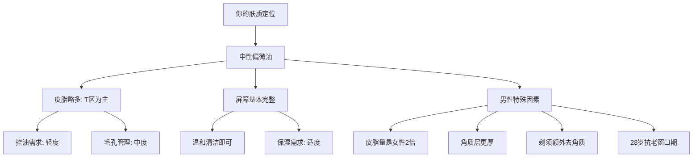
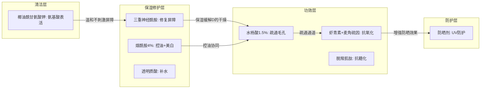
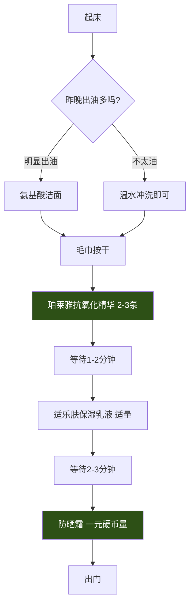
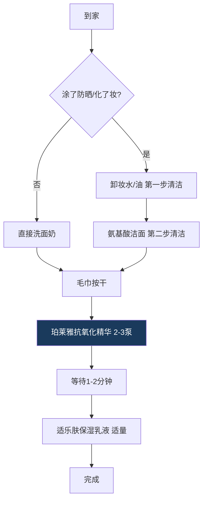
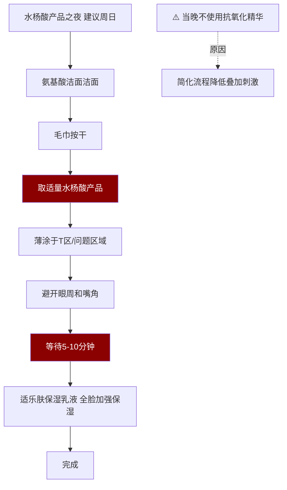
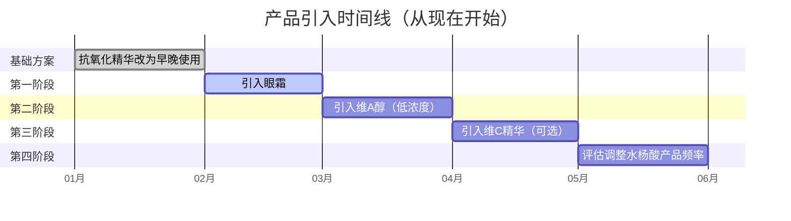
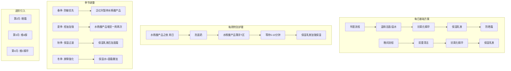

## 七、针对你肤质的定制方案

前面几章分别讲了不同肤质、不同季节、不同年龄段的通用方案，但"通用"意味着它不是为你量身定做的。本章要做一件事：**把所有理论拉回到一个具体的人身上**——28岁男性、中性偏微油、有基础护肤意识、使用氨基酸洁面+保湿乳液+抗氧化精华+防晒霜+水杨酸产品。我们将逐个拆解这些产品的底层逻辑，找出可以优化的细节，然后给出一套完整的、可执行的、按季节调整的定制方案。

### 7.1 你的肤质画像：精确诊断而非模糊猜测

#### 7.1.1 诊断依据

"中性偏微油"是一个非常具体的肤质定位，它意味着：

| 维度 | 你的状态 | 科学解释 |
|------|----------|----------|
| 皮脂分泌 | 略高于正常水平 | 皮脂腺活跃度受雄激素调控，28岁男性睾酮水平仍处于高位，皮脂分泌天然比女性旺盛 |
| T区表现 | 额头、鼻子出油更明显 | T区皮脂腺密度（400-900个/cm²）远高于两颊（100-200个/cm²），因此出油不均匀是正常的 |
| 屏障功能 | 基本完整 | 使用氨基酸洗面奶和保湿乳液（含神经酰胺）说明你没有过度清洁，屏障未受损 |
| 毛孔状况 | 可能偏大，有黑头/闭口风险 | 微油肤质+男性皮脂成分中角鲨烯比例高→氧化后形成黑头的概率更大 |
| 主要矛盾 | 控油 vs 保湿的平衡 | 既不能像干皮那样堆叠厚重保湿，也不能像大油皮那样一味控油 |

#### 7.1.2 自测验证方法

理论判断需要实测验证。做以下测试，确认你的肤质定位是否准确：

**测试一：洗脸后60分钟观察法**

1. 晚间用氨基酸洁面清洁面部
2. 毛巾按干，不涂任何产品
3. 等待60分钟，在自然光下观察

预期结果对照：

- 全脸无紧绷感、T区有可见油光 → 确认"中性偏微油"
- 全脸紧绷、起皮 → 可能偏干，需要重新评估
- 全脸明显油光、摸上去黏腻 → 可能偏油，方案需调整
- 两颊泛红刺痛 → 叠加了敏感属性，方案需特别处理

**测试二：吸油纸分区法**

洁面2小时后，分别按压额头、鼻子、左颊、右颊：

- T区吸油纸有明显油渍、两颊几乎无油渍 → 典型混合偏油
- 四个区域都有中等油渍 → 偏油性，"微油"定位可能低估了
- 两颊也有轻度油渍 → 中性偏微油，和你的判断一致

**测试三：季节变化记录**

肤质不是恒定的。连续记录一周，观察：

- 夏季出油明显增多 → 正常，皮脂分泌与温度正相关（温度每升高1°C，皮脂分泌增加约10%）
- 冬季两颊偶尔起皮 → 中性肤质的季节性偏干，需要冬季加强保湿
- 春秋季最稳定 → 最接近你"基准肤质"的状态

#### 7.1.3 男性肤质的特殊性

很多护肤指南默认面向女性读者，但男性皮肤有几个显著不同点，直接影响方案设计：

**第一，皮脂分泌量大。** 男性皮脂分泌量约为女性的2倍，这不是"缺点"而是"特点"——意味着你的天然保湿因子更充足，但毛孔堵塞和痘痘的风险也更高。

**第二，角质层更厚。** 男性表皮厚度比女性厚约20-30%，这意味着：对活性成分的渗透有一定"屏障"作用，部分产品需要更长的作用时间才能起效；同时耐受性通常更好，可以承受稍高浓度的酸类。

**第三，胶原蛋白流失模式不同。** 男性胶原蛋白总量更高，但流失速度在30岁后会加快。28岁是一个关键节点——现在开始抗老，效果远好于35岁再补救。

**第四，剃须对皮肤的影响。** 每次剃须都是对角质层的物理去角质，因此：
- 剃须后不需要再用化学去角质产品
- 剃须后的舒缓修复很重要（含泛醇、积雪草的产品）
- 剃须区域的护肤品应选择质地清爽的，避免堵塞刚被"打开"的毛孔

### 7.2 逐产品深度分析：不只告诉你用什么，还要告诉你为什么

#### 7.2.1 氨基酸洁面 ✅ 继续使用

**成分与机制拆解：**

旁氏米粹润泽洁面乳的核心清洁成分是**椰油酰甘氨酸钾**（Potassium Cocoyl Glycinate），属于氨基酸系表面活性剂。它的分子结构一端亲水、一端亲油，能包裹住皮肤表面的油脂和污垢，随水冲走。

**为什么适合你：**

| 对比维度 | 皂基洗面奶 | 氨基酸洁面 |
|----------|------------|-------------------|
| pH值 | 9-10（碱性） | 5.5-6.5（弱酸性） |
| 清洁力 | 强，去脂力过猛 | 中等，清洁力适中 |
| 对屏障的影响 | 破坏皮脂膜，长期使用导致屏障受损 | 温和不破坏，维持屏障完整 |
| 洗后感受 | 紧绷、干燥（"假干净"） | 不紧绷、微滑 |
| 适合肤质 | 大油皮短期可用 | 中性、偏油、敏感均可 |

**使用优化建议：**

- **早晨**：中性偏微油肤质，晨起出油量通常不多。建议用温水冲洗即可，保留夜间皮肤自然分泌的皮脂膜作为天然保护层。只有在夏季闷热、晨起明显出油时才用洗面奶。
- **晚间**：必用。如果白天涂了防晒霜，建议先用卸妆产品（卸妆水或卸妆油）进行第一步清洁，再用氨基酸洗面奶做第二步清洁——这就是"双重清洁法"。
- **用量**：黄豆大小，先在手心打出泡沫再上脸。直接往脸上糊会局部浓度过高，刺激皮肤。
- **水温**：32-35°C微温水。过热的水会加速皮脂流失，过冷的水不利于乳化清洁。

**常见误区：**

- ❌ "洗完脸觉得紧绷才是洗干净了" → 紧绷说明去脂过度，屏障正在被破坏
- ❌ "出油多就多洗几次" → 过度清洁会刺激皮脂腺代偿性分泌更多油脂（越洗越油）
- ❌ "洗面奶要在脸上按摩很久" → 30-60秒足够，时间太长反而刺激皮肤

#### 7.2.2 适乐肤保湿乳液 ✅ 继续使用，这是你方案的"压舱石"

**成分与机制拆解：**

保湿乳液（CeraVe PM Facial Moisturizing Lotion）的核心配方是**三重神经酰胺（1/3/6-II）+ 烟酰胺（4%）+ 透明质酸**，通过多层脂质体（MVE）技术实现缓释。

**三重神经酰胺的作用：**

皮肤屏障的"砖墙结构"中，角质细胞是"砖"，细胞间脂质是"灰浆"。神经酰胺占细胞间脂质的约50%，是维持屏障完整性的关键成分。保湿乳液中的三种神经酰胺分别对应：

- **神经酰胺1（EOP）**：修复脂质屏障，增强皮肤锁水能力
- **神经酰胺3（NP）**：补充细胞间脂质，减少经皮水分流失（TEWL）
- **神经酰胺6-II（AP）**：促进角质层正常代谢，防止角质堆积

**4%烟酰胺的多重功效：**

烟酰胺（维生素B3的活性形式）是少有的"全能选手"成分：

1. **控油**：抑制皮脂腺中脂肪酸和甘油三酯的合成，减少油脂分泌约20-30%
2. **美白**：抑制黑色素从黑色素细胞向角质细胞的转运
3. **抗炎**：降低促炎因子IL-6、IL-8的表达，缓解轻度炎症
4. **屏障修复**：促进神经酰胺和其他细胞间脂质的合成
5. **抗老**：促进胶原蛋白合成，减少细纹

**为什么它是"压舱石"：**

你的整个方案中，保湿乳液是最"安全"的产品——不刺激、不过敏、不会和任何其他成分冲突。它是你每天护肤的"最后一道防线"，无论其他产品怎么调整，保湿乳液始终在。

**使用优化建议：**

- **用量**：一元硬币大小（约0.8-1g），均匀涂抹全脸
- **涂抹手法**：由内向外、由下向上轻拍按压，不要来回搓
- **季节调整**：
  - 春夏：单独使用即可，质地清爽足够
  - 秋冬：如果两颊有干燥感，在保湿乳液之后叠加一层封闭性更强的面霜（如珂润面霜），锁住水分
  - 特别干燥时：可以在保湿乳液之前先拍一层保湿水/精华水，增加水相保湿

#### 7.2.3 珀莱雅抗氧化精华 ⚠️ 建议调整为早晚都用

**成分与机制拆解：**

抗氧化精华的核心是"抗氧化+抗糖化"双通路设计：

**抗氧化通路：**
- **虾青素（Astaxanthin）**：自然界最强的抗氧化剂之一，抗氧化能力是维生素E的1000倍、维生素C的6000倍。它的分子结构能嵌入细胞膜的磷脂双分子层，同时保护膜的内外两侧。但虾青素的缺点是稳定性差，珀莱雅用了脂质体包裹技术来提高其稳定性。
- **麦角硫因（Ergothioneine）**：一种天然含硫氨基酸，人体无法自行合成。它的独特之处在于能被细胞主动转运吸收（通过OCTN1转运蛋白），在细胞内直接清除自由基。紫外线照射后皮肤中麦角硫因浓度会显著下降，说明它在"第一线"参与了抗氧化防御。

**抗糖化通路：**
- **脱羧肌肽（Carnosine）**：抑制蛋白质非酶糖基化反应，减少晚期糖基化终产物（AGEs）的生成。AGEs会导致胶原蛋白交联、变硬、失去弹性，是皮肤暗黄和松弛的重要原因之一。

**为什么早晚都该用：**

很多人以为"抗氧化=防晒伴侣，只在早上用"，这是一个误解。

- **早上**：对抗外源性氧化压力（紫外线UVA→产生单线态氧、空气污染→产生超氧阴离子、蓝光→产生自由基）
- **晚上**：对抗内源性氧化压力（线粒体代谢产生的ROS、白天紫外线造成的延迟性氧化损伤在夜间仍在继续、皮肤夜间修复高峰期需要抗氧化支持）

**使用优化建议：**

- **用量**：2-3泵（约0.5-0.8ml），掌心搓匀后按压全脸
- **等待时间**：涂抹后等待1-2分钟让活性成分渗透，再进行下一步
- **存放**：避光、阴凉处。虾青素对光和热敏感，开封后尽量在3个月内用完
- **搭配禁忌**：避免与高浓度果酸（>10%）同时使用，酸性环境可能影响虾青素稳定性

**效果预期时间线：**

- 第1-2周：几乎无明显变化，活性成分在积累
- 第3-4周：肤色开始变得更均匀，暗沉感减轻
- 第6-8周：抗氧化效果充分显现，皮肤整体亮度提升
- 第12周+：长期抗氧化积累效果，皮肤质感改善

#### 7.2.4 防晒霜 ✅ 继续使用，但需要精细化

**防晒的核心意义：**

在所有护肤步骤中，防晒的投入产出比最高。皮肤老化的80%来自光老化（photoaging），而非自然老化（chronoaging）。具体来说：

- UVA（320-400nm）：穿透力强，直达真皮层，破坏胶原蛋白和弹性纤维，导致光老化、色斑
- UVB（280-320nm）：作用于表皮层，导致晒伤、红斑，也是皮肤癌的主要诱因
- 蓝光（400-500nm）：屏幕蓝光也会产生氧化应激，长期暴露可能导致色素沉着

**用量是关键中的关键：**

研究表明，大多数人只涂了推荐量的1/4到1/2，这意味着实际防护力大幅缩水：

| 标注SPF | 实际涂抹量 | 有效SPF |
|---------|-----------|---------|
| SPF50 | 100%（推荐量） | 50 |
| SPF50 | 75% | 25-30 |
| SPF50 | 50% | 7-10 |
| SPF50 | 25% | 2-3 |

**正确用量标准：**
- 面部：约1g（一元硬币大小的量）
- 颈部：额外0.5g
- 如果用的是涂抹型，取两指长（食指和中指并拢，从指尖到指根的量）

**补涂规则：**
- 室内办公：中午补涂一次即可
- 户外活动：每2小时补涂
- 出汗/擦脸后：立即补涂
- 补涂方式：可以用防晒喷雾或防晒粉饼，比直接涂霜更方便

**适合你肤质的防晒选择建议：**

中性偏微油肤质应优先选择：
- **质地**：乳液状或凝胶状，避免厚重的霜状
- **成膜感**：成膜快、不泛白、不黏腻
- **附加功能**：含控油成分（硅石、高岭土等吸油粉末）的防晒更适合你
- **推荐类型**：化学防晒或物化结合型，纯物理防晒（氧化锌/二氧化钛）对偏油肤质可能偏厚重

#### 7.2.5 理肤泉水杨酸产品 ✅ 继续使用，科学安排频率

**成分与机制拆解：**

水杨酸产品（Effaclar K+）的核心活性成分是**1.5%水杨酸（BHA）+ LHATM微脂技术**。

**水杨酸的作用机制：**

水杨酸是β-羟基酸（BHA），与α-羟基酸（如果酸AHA）的关键区别在于：**水杨酸是脂溶性的**。这意味着它能溶解在油脂中，顺着皮脂渗透进毛孔内部，从内部疏通堵塞。

作用层次：

1. **角质层表面**：松解角质细胞之间的"桥粒"连接，促进老废角质脱落
2. **毛孔内部**：溶解皮脂栓和角质栓（即黑头和闭口的"根"）
3. **皮脂腺导管**：减少皮脂分泌，从源头控油

**为什么一周一次的频率合理：**

对于中性偏微油肤质，水杨酸的使用频率需要平衡"疏通效果"和"屏障安全"：

- 每天使用：过度去角质→屏障受损→敏感泛红
- 一周一次：刚好维持毛孔通畅，同时给皮肤足够的恢复时间
- 两周一次：对于偏油肤质可能间隔太长，效果不明显

**进阶调整策略：**

- **夏季**：皮脂分泌旺盛，可增加到一周两次（如周三、周日）
- **冬季**：皮脂分泌减少，维持一周一次或两周一次
- **皮肤状态好的月份**：可以降回一周一次
- **闭口/黑头复发期**：临时增加到连续使用2-3天（密集疏通），然后恢复常规频率

**水杨酸产品使用后的关键注意事项：**

1. **保湿必须跟上**：水杨酸溶解了部分皮脂，皮肤保水能力暂时下降，使用水杨酸产品当晚的保湿步骤不能省略
2. **次日必须严格防晒**：去角质后的新生角质层对紫外线更敏感
3. **避免与其他酸类叠加**：如果同时用果酸、杏仁酸等，会造成过度去角质
4. **出现以下情况立即停用**：持续泛红超过24小时、脱皮面积扩大、刺痛感不减反增

### 7.3 产品搭配的底层逻辑：成分之间的协同与冲突

#### 7.3.1 你的成分组合全景图

你的5个产品涉及以下活性成分，它们之间的关系决定了使用顺序和搭配策略：

#### 7.3.2 成分兼容性速查表

| 组合 | 兼容性 | 说明 |
|------|--------|------|
| 抗氧化精华 + 保湿乳液 | ✅ 完美搭配 | 抗氧化+屏障修复，互不干扰 |
| 抗氧化精华 + 防晒 | ✅ 协同增效 | 抗氧化增强防晒的光保护效果 |
| 水杨酸产品 + 保湿乳液 | ✅ 推荐搭配 | 水杨酸后用神经酰胺修复，缓解干燥 |
| 水杨酸产品 + 抗氧化精华 | ⚠️ 错开使用 | 水杨酸产品当晚建议只用保湿乳液，简化流程降低刺激 |
| 烟酰胺 + 水杨酸 | ⚠️ 敏感肌慎用 | 你不是敏感肌，但水杨酸产品当晚还是建议简化 |
| 抗氧化精华 + 高浓度果酸 | ❌ 避免同时用 | 酸性环境影响虾青素稳定性 |

#### 7.3.3 护肤品涂抹顺序的科学依据

护肤品的涂抹顺序不是随便定的，遵循一个核心原则：**先水后油、先薄后厚、先活性后封闭**。

1. **水溶性小分子先用**：分子量小、水溶性的成分（如透明质酸、烟酰胺）先涂，它们能快速渗透
2. **脂溶性活性成分次之**：如虾青素、维A醇，需要一定的渗透时间
3. **乳液/面霜最后**：它们含有封闭性成分（如神经酰胺、角鲨烷），在皮肤表面形成保护膜，锁住前面的产品
4. **防晒永远最后**：防晒需要在皮肤表面形成均匀的防护膜，任何后续涂抹都会破坏这个膜

**你的方案中，每个步骤的等待时间：**

| 步骤 | 等待时间 | 原因 |
|------|----------|------|
| 洁面 → 抗氧化精华 | 毛巾按干即可 | 皮肤微湿时渗透性更好 |
| 抗氧化精华 → 保湿乳液 | 1-2分钟 | 让虾青素和麦角硫因充分渗透 |
| 保湿乳液 → 防晒 | 2-3分钟 | 让乳液完全吸收、成膜 |
| 洁面 → 水杨酸产品 | 毛巾按干 | 酸类需要直接接触皮肤发挥效果 |
| 水杨酸产品 → 保湿乳液 | 5-10分钟 | 让水杨酸充分作用后再保湿 |

### 7.4 你的优化版完整方案

#### 7.4.1 早晨流程

**详细操作要点：**

1. **洁面判断**：晨起用手触摸T区，如果感觉油腻，用洗面奶；如果只是微微润，温水足够
2. **抗氧化精华**：取2-3泵于掌心，双手搓匀后，从面部中央向两侧按压。重点区域是颧骨（日晒最多）和额头（出油最多、氧化压力大）
3. **保湿乳液**：取一元硬币大小，同样按压手法涂抹。注意嘴角和鼻翼两侧不要遗漏
4. **防晒**：这是最关键的一步。取足量（约1g），点涂在额头、两颊、鼻子、下巴五点，然后均匀抹开。不要忘记耳朵、脖子后侧（如果穿圆领衫）

#### 7.4.2 晚间流程（普通夜晚）

**为什么晚间也要用抗氧化精华：**

前面已经解释过，这里补充一个数据：研究显示，皮肤中的自由基清除酶（如超氧化物歧化酶SOD）在夜间的活性比白天低约30%，这意味着夜间皮肤的"内源性抗氧化防线"更薄弱，外源性抗氧化补充在夜间反而更重要。

#### 7.4.3 晚间流程（水杨酸产品之夜，一周一次）

**水杨酸产品使用的精细操作：**

1. **薄涂是关键**：水杨酸产品不是涂得越多越好。薄薄一层覆盖问题区域即可，涂太厚会增加刺激性而不会增强效果
2. **问题区域优先**：重点涂在额头、鼻子、下巴（出油多、毛孔粗大的区域），两颊如果状态好可以跳过
3. **等待时间的科学**：水杨酸需要5-10分钟才能充分渗透进毛孔。如果你涂完立刻叠保湿乳液，保湿乳液中的脂质成分会稀释水杨酸的浓度，降低效果
4. **保湿不能省**：虽然叫"水杨酸产品之夜"，但水杨酸产品后面一定要跟保湿乳液。水杨酸溶解了部分皮脂，不保湿的话第二天两颊可能会起皮

### 7.5 季节性调整方案

#### 7.5.1 春季（3-5月）：防敏+控油过渡期

春季气温回升、湿度增加，皮脂分泌开始活跃。同时花粉、柳絮等过敏原增多，是皮肤敏感的高发期。

**调整要点：**
- 洗面奶：保持早晚使用，不需要调整
- 抗氧化精华：早晚正常使用
- 保湿乳液：春季湿度上升，用量可以略微减少
- 防晒：开始加强，SPF30以上
- 水杨酸产品：维持一周一次，花粉高峰期如果出现泛红暂停一周

**春季特别注意：**
- 如果出现季节性敏感（泛红、刺痒），暂停水杨酸产品和抗氧化精华，简化为洗面奶+保湿乳液+防晒
- 恢复后逐步加回产品，每次加一个，观察3天

#### 7.5.2 夏季（6-8月）：控油+强化防晒

夏季是皮脂分泌最旺盛的季节，也是紫外线最强的季节。

**调整要点：**
- 洗面奶：早晚都用，必要时中午可以清水洗脸一次
- 抗氧化精华：早晚使用，抗氧化需求最高
- 保湿乳液：可以用更清爽的版本（如果觉得保湿乳液在夏天偏厚），或减少用量
- 防晒：SPF50+ PA++++，每2小时补涂
- 水杨酸产品：可增加到一周两次（周三、周日）
- 额外：可以加入泥膜（高岭土/膨润土面膜），一周一次深层清洁

**夏季控油小技巧：**
- 随身携带吸油纸，中午按压T区（不要用纸巾擦，会拉扯皮肤）
- 可以在防晒前加一层控油妆前乳（含硅石成分的）
- 空调房内放加湿器，避免皮肤因干燥代偿性出油

#### 7.5.3 秋季（9-11月）：修复+保湿过渡期

秋季气温下降、湿度降低，皮脂分泌逐渐减少，皮肤进入换季敏感期。

**调整要点：**
- 洗面奶：早晨恢复温水洁面，晚间用洗面奶
- 抗氧化精华：早晚使用
- 保湿乳液：恢复标准用量，如果两颊干燥可以在保湿乳液后加一层面霜
- 防晒：SPF30以上即可
- 水杨酸产品：恢复一周一次

**秋季换季敏感处理：**
- 如果两颊出现脱皮、紧绷感，暂停水杨酸产品两周
- 在保湿乳液前加一层含透明质酸的精华水
- 夜间可以使用睡眠面膜加强保湿

#### 7.5.4 冬季（12-2月）：保湿+屏障强化

冬季是皮肤屏障最脆弱的季节——低温、低湿度、室内外温差大，三重打击。

**调整要点：**
- 洗面奶：早晨只用温水，晚间用洗面奶
- 抗氧化精华：早晚使用
- 保湿乳液：用量增加，全脸涂抹后在两颊叠加一层面霜
- 防晒：室内可以降低到SPF15-30，户外仍需SPF30以上
- 水杨酸产品：维持一周一次，如果皮肤紧绷明显则两周一次

**冬季保湿叠加方案：**

晚间：洁面 → 保湿水/精华水（拍2-3层） → 抗氧化精华 → 保湿乳液 → 面霜

推荐的冬季叠加面霜选择：
- 珂润面霜：含神经酰胺，和保湿乳液协同修复屏障
- 薇诺娜特护霜：含马齿苋提取物，舒缓泛红
- 凡士林（仅两颊脱皮区域）：最强封闭性，但质地厚重，局部使用

### 7.6 每周护理计划表

#### 7.6.1 常规版（春秋季基准）

| 星期 | 早晨 | 晚间 | 特别护理 |
|------|------|------|----------|
| 周一 | 温水 + 抗氧化精华 + 保湿乳液 + 防晒 | 洗面奶 + 抗氧化精华 + 保湿乳液 | — |
| 周二 | 温水 + 抗氧化精华 + 保湿乳液 + 防晒 | 洗面奶 + 抗氧化精华 + 保湿乳液 | — |
| 周三 | 温水 + 抗氧化精华 + 保湿乳液 + 防晒 | 洗面奶 + 抗氧化精华 + 保湿乳液 | — |
| 周四 | 温水 + 抗氧化精华 + 保湿乳液 + 防晒 | 洗面奶 + 抗氧化精华 + 保湿乳液 | — |
| 周五 | 温水 + 抗氧化精华 + 保湿乳液 + 防晒 | 洗面奶 + 抗氧化精华 + 保湿乳液 | — |
| 周六 | 温水 + 抗氧化精华 + 保湿乳液 + 防晒 | 洗面奶 + 抗氧化精华 + 保湿乳液 | 可选：补水面膜 |
| 周日 | 温水 + 抗氧化精华 + 保湿乳液 + 防晒 | **水杨酸产品之夜**：洗面奶 → 水杨酸产品 → 等待10分钟 → 保湿乳液 | 水杨酸产品之夜 |

#### 7.6.2 夏季加强版

| 星期 | 早晨 | 晚间 | 特别护理 |
|------|------|------|----------|
| 周一 | 洗面奶 + 双抗 + 保湿乳液 + SPF50防晒 | 洗面奶 + 双抗 + 保湿乳液 | — |
| 周二 | 洗面奶 + 双抗 + 保湿乳液 + SPF50防晒 | 洗面奶 + 双抗 + 保湿乳液 | — |
| 周三 | 洗面奶 + 双抗 + 保湿乳液 + SPF50防晒 | **水杨酸产品之夜** | 水杨酸产品第一晚 |
| 周四 | 洗面奶 + 双抗 + 保湿乳液 + SPF50防晒 | 洗面奶 + 双抗 + 保湿乳液 | — |
| 周五 | 洗面奶 + 双抗 + 保湿乳液 + SPF50防晒 | 洗面奶 + 双抗 + 保湿乳液 | — |
| 周六 | 洗面奶 + 双抗 + 保湿乳液 + SPF50防晒 | 洗面奶 + 双抗 + 保湿乳液 | 可选：泥膜深层清洁 |
| 周日 | 洗面奶 + 双抗 + 保湿乳液 + SPF50防晒 | **水杨酸产品之夜** | 水杨酸产品第二晚 |

#### 7.6.3 冬季保湿版

| 星期 | 早晨 | 晚间 | 特别护理 |
|------|------|------|----------|
| 周一 | 温水 + 双抗 + 保湿乳液 + 面霜 + 防晒 | 洗面奶 + 保湿水 + 双抗 + 保湿乳液 + 面霜 | — |
| 周二 | 温水 + 双抗 + 保湿乳液 + 面霜 + 防晒 | 洗面奶 + 保湿水 + 双抗 + 保湿乳液 + 面霜 | — |
| 周三 | 温水 + 双抗 + 保湿乳液 + 面霜 + 防晒 | 洗面奶 + 保湿水 + 双抗 + 保湿乳液 + 面霜 | — |
| 周四 | 温水 + 双抗 + 保湿乳液 + 面霜 + 防晒 | 洗面奶 + 保湿水 + 双抗 + 保湿乳液 + 面霜 | — |
| 周五 | 温水 + 双抗 + 保湿乳液 + 面霜 + 防晒 | 洗面奶 + 保湿水 + 双抗 + 保湿乳液 + 面霜 | — |
| 周六 | 温水 + 双抗 + 保湿乳液 + 面霜 + 防晒 | 洗面奶 + 保湿水 + 双抗 + 保湿乳液 + 面霜 | 补水面膜 |
| 周日 | 温水 + 双抗 + 保湿乳液 + 面霜 + 防晒 | **水杨酸产品之夜**：洗面奶 → 水杨酸产品 → 等10分钟 → 保湿乳液 + 面霜 | 水杨酸产品之夜 |

### 7.7 进阶方案：产品引入的阶梯式路径

当前方案运行稳定（至少1-2个月，皮肤没有不良反应）之后，可以逐步引入以下进阶产品。**核心原则：一次只引入一个新产品，观察2-4周确认无不良反应后再引入下一个。**

#### 7.7.1 第一阶段：眼霜（第2个月引入）

**为什么需要眼霜：**

眼周皮肤是面部最薄的区域（约0.5mm，面部其他区域约2mm），皮脂腺分布极少，是最早出现老化迹象的部位。28岁开始使用眼霜不是"超前消费"，而是"及时止损"。

**选择建议：**

- **入门级（25-28岁）**：保湿型眼霜，含透明质酸、角鲨烷等基础保湿成分
- **进阶级（28-30岁）**：含咖啡因（消肿）+ 胜肽（抗纹）的功能性眼霜
- **用量**：每只眼睛一粒米大小，用无名指点涂（无名指力度最轻）

**使用顺序：** 在精华之后、保湿乳液之前，眼周区域单独涂抹

#### 7.7.2 第二阶段：维A醇精华（第3个月引入）

**维A醇的科学依据：**

维A醇（Retinol）是目前有最多临床证据支持的抗老成分，它的作用机制是：

1. **促进胶原蛋白合成**：激活成纤维细胞，增加I型和III型胶原蛋白的产量
2. **加速角质更新**：促进角质细胞的正常脱落和新生，改善肤质粗糙
3. **减少细纹**：通过增厚真皮层，使细纹在视觉上变浅
4. **控油**：调节皮脂腺功能，减少油脂分泌
5. **淡化色素**：加速含有黑色素的角质细胞脱落

**引入策略：**

| 阶段 | 频率 | 持续时间 | 观察指标 |
|------|------|----------|----------|
| 建立耐受期 | 一周2次 | 2周 | 无泛红、脱皮、刺痛 |
| 适应期 | 隔天一次 | 2周 | 皮肤状态稳定 |
| 常规使用 | 每晚使用 | 持续 | 肤质改善 |

**使用顺序：** 晚间，洁面 → 抗氧化精华 → 维A醇 → 等待5分钟 → 保湿乳液

**与水杨酸产品的安排：**

维A醇和水杨酸（水杨酸产品）都有去角质作用，不能在同一晚使用。建议：
- 周一、三、五：维A醇之夜
- 周日：水杨酸产品之夜
- 周二、四、六：普通之夜（双抗+保湿乳液）

**注意事项：**

- 从低浓度（0.1-0.3%）开始，不要心急上高浓度
- 初期可能出现"维A醇皮炎"（干燥、脱皮、泛红），这是正常建立耐受的过程，通常2-4周缓解
- 使用期间严格防晒（维A醇会增加光敏感性）
- 孕期/备孕期禁用维A醇

#### 7.7.3 第三阶段：维C精华（第4个月可选引入）

**维C vs 抗氧化精华的区别：**

你已经在用的抗氧化精华主打虾青素+麦角硫因，维C精华（如15-20%左旋VC或VC衍生物）则走另一条抗氧化路径。两者可以互补但不重叠：

- **左旋VC**：直接中和水溶性自由基，同时促进胶原蛋白合成、抑制黑色素生成
- **虾青素**：中和脂溶性自由基，保护细胞膜

**搭配方案：** 早上在抗氧化精华之前先用维C精华（维C分子量更小，先渗透），晚上继续用抗氧化精华

**维C的选择建议：**

- **左旋VC（L-ascorbic acid）**：效果最强但最不稳定，需要避光保存，容易氧化变黄
- **乙基维C（3-O-Ethyl Ascorbic Acid）**：稳定性好、刺激性低、渗透性好，适合入门
- **VC-IP（Ascorbyl Tetraisopalmitate）**：脂溶性VC衍生物，渗透性最佳，但价格较高

#### 7.7.4 第四阶段：烟酰胺精华（可选，与保湿乳液协同）

保湿乳液已含4%烟酰胺，如果想进一步加强控油和美白效果，可以额外叠加5%烟酰胺精华。

**风险提示：** 烟酰胺浓度叠加后如果超过皮肤耐受阈值，会出现泛红、刺痛（"烟酰胺不耐受"）。如果叠加后出现不适，立即停用额外的烟酰胺精华，退回保湿乳液即可。

### 7.8 产品引入时间线总览

### 7.9 生活方式对皮肤的影响：护肤品之外的变量

护肤品能做的大约占皮肤状态改善的30-40%，剩下的60-70%取决于生活方式。忽略这一块，再贵的护肤品也事倍功半。

#### 7.9.1 饮食与皮肤

| 食物类型 | 对皮肤的影响 | 机制 |
|----------|-------------|------|
| 高GI食物（白米饭、甜食、含糖饮料） | 促进皮脂分泌、加速糖化 | 血糖飙升→胰岛素↑→IGF-1↑→皮脂腺活跃；同时加速AGEs生成 |
| 乳制品（尤其脱脂牛奶） | 部分人群会加重痘痘 | 牛奶中的IGF-1和类固醇激素可能刺激皮脂腺 |
| 深色蔬菜（西兰花、菠菜） | 抗氧化、抗炎 | 富含维生素C、E、类胡萝卜素 |
| 深海鱼（三文鱼、鲭鱼） | 抗炎、维持屏障 | Omega-3脂肪酸抑制促炎因子 |
| 坚果（核桃、杏仁） | 抗氧化、滋润皮肤 | 维生素E、锌、硒 |
| 充足的水（每天1.5-2L） | 维持皮肤含水量 | 角质层含水量直接影响皮肤弹性和光泽 |

#### 7.9.2 睡眠与皮肤

- **黄金修复时段**：晚10点到凌晨2点是生长激素分泌高峰期，皮肤细胞更新速度最快。错过这个时段，再好的晚间护肤品也补不回来
- **睡眠不足的代价**：连续一周每天只睡6小时，皮肤含水量下降约10%，经皮水分流失增加约15%，毛孔明显变大
- **枕头套的卫生**：每周更换一次枕套，或使用真丝枕套（减少摩擦，减少细菌附着）

#### 7.9.3 运动与皮肤

运动对皮肤有直接正面影响：
- 促进血液循环，增加皮肤营养供给
- 通过出汗排出毛孔中的部分代谢废物
- 降低皮质醇水平（压力激素），减少压力相关的皮肤问题

**运动后的护肤要点：**
- 运动后30分钟内清洁面部（汗水+油脂混合物在脸上停留太久会刺激皮肤）
- 如果不方便洗脸，至少用湿纸巾按压T区
- 清洁后做好保湿，运动后皮肤水分流失快

#### 7.9.4 压力管理与皮肤

慢性压力通过HPA轴（下丘脑-垂体-肾上腺轴）影响皮肤：
- 皮质醇升高 → 皮脂分泌增加 → 毛孔堵塞风险增大
- 皮质醇升高 → 屏障功能下降 → 皮肤更容易敏感
- 压力还可能诱发或加重特应性皮炎、银屑病等皮肤疾病

实用减压方法：冥想、规律运动、充足社交、保证睡眠。这些不是"鸡汤"，而是直接影响你皮肤状态的生物学变量。

### 7.10 效果追踪与方案迭代

#### 7.10.1 建立皮肤状态日志

建议每周拍一张标准光照条件下的正面照（浴室灯、同一角度），记录：

- 出油程度（1-5分）
- 闭口/痘痘数量
- 肤色均匀度（1-5分）
- 皮肤触感（粗糙/光滑）
- 任何不适反应（泛红、刺痛、脱皮）

这样做的好处是：皮肤变化往往是渐进的，单靠记忆很难判断方案是否有效。有了照片和评分记录，2-3个月后回看，效果一目了然。

#### 7.10.2 方案调整的判断标准

**需要减少活性成分的信号：**
- 持续泛红超过48小时
- 使用产品时持续刺痛
- 脱皮面积扩大
- 皮肤变得粗糙、暗沉（可能是屏障受损）

**可以增加活性成分的信号：**
- 当前方案使用6周以上，皮肤完全耐受
- 没有出现任何不适反应
- 皮肤状态稳定但没有进一步改善（瓶颈期）

**需要更换产品的信号：**
- 使用8周以上完全没有效果
- 出现持续性过敏反应（停用后缓解、复用后复发）
- 产品质地/使用感受严重影响使用依从性

### 7.11 常见问题解答

**Q1：抗氧化精华早晚都用，会不会太刺激？**
A：抗氧化精华的活性成分（虾青素、麦角硫因、脱羧肌肽）都属于温和型抗氧化剂，不含酸类，刺激性极低。早晚使用完全没有问题。如果你是第一次改为早晚使用，可以先观察一周，如果没有不适就放心用。

**Q2：水杨酸产品涂完感觉有轻微刺痛，正常吗？**
A：水杨酸初次使用或间隔较久后再次使用，有轻微刺痛感是正常的，通常在1-2分钟内消失。但如果刺痛持续超过5分钟，或伴随明显泛红，说明皮肤对该浓度的水杨酸还不耐受，建议缩短涂抹时间（3分钟后洗掉），或降低频率到两周一次。

**Q3：防晒霜涂完感觉油腻，怎么办？**
A：选择更清爽的防晒产品（凝胶质地或含硅石的控油型）。另外，可以在防晒前用一层散粉/蜜粉吸附多余油脂，或者选择防晒+控油二合一的产品。不要因为嫌油腻就不涂防晒——这比涂了油腻的防晒危害大得多。

**Q4：冬天保湿乳液不够保湿怎么办？**
A：在保湿乳液之后叠加一层面霜（如珂润面霜、薇诺娜特护霜）。如果还是不够，在保湿乳液之前加一层含透明质酸的精华水（拍2-3层）。关键是"水相补水+油相锁水"双管齐下。

**Q5：用了水杨酸产品后第二天起皮了，是过敏吗？**
A：大概率不是过敏，而是水杨酸的角质调节作用导致的正常脱屑。处理方式：水杨酸产品当晚加强保湿，第二天暂停所有活性成分（只用洗面奶+保湿乳液+防晒），脱皮通常1-2天缓解。如果脱皮持续3天以上或伴随红肿，则可能是过敏，停用水杨酸产品并就医。

**Q6：多久能看到效果？**
A：设定合理预期很重要：

| 改善目标 | 预期时间 | 说明 |
|----------|----------|------|
| 控油效果 | 2-4周 | 烟酰胺和水杨酸的控油效果较快显现 |
| 肤色提亮 | 4-8周 | 抗氧化+烟酰胺的美白效果需要积累 |
| 毛孔改善 | 6-12周 | 水杨酸疏通毛孔需要多个代谢周期 |
| 抗老效果 | 12周+ | 胶原蛋白合成是缓慢过程 |

### 7.12 你的方案总览：一张图看全

***

> **总结：** 这套方案的核心逻辑是——以保湿乳液为屏障基底，以抗氧化精华为日常抗氧化主力，以水杨酸产品为每周毛孔管理工具，以防晒为光老化防护屏障。四个产品各司其职、互相配合。在此基础上，按季节微调频率和用量，按时间线逐步引入进阶产品。记住：护肤是一场马拉松，稳定执行比追求速效重要一百倍。
