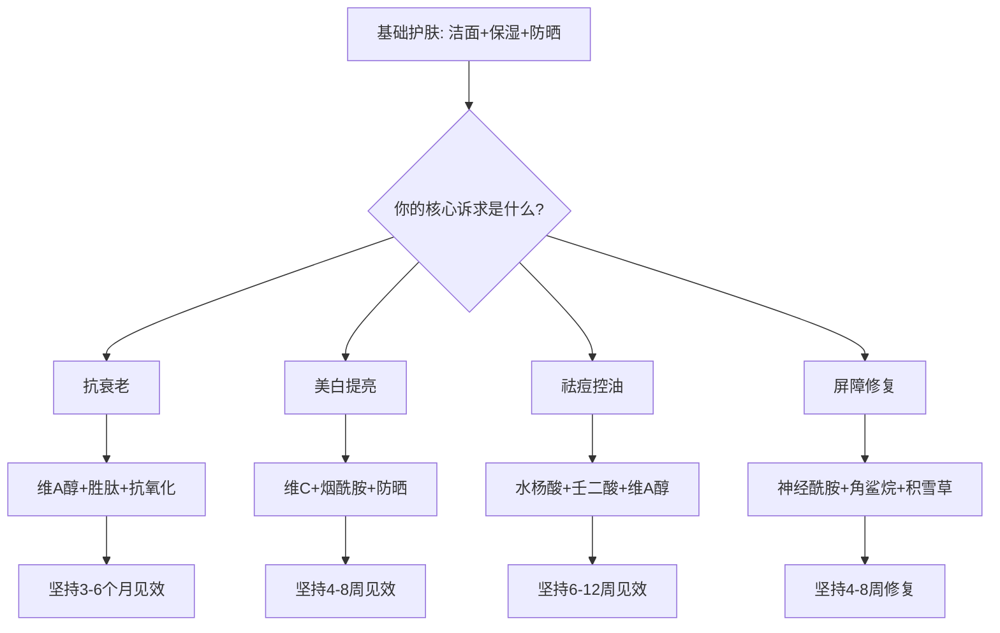
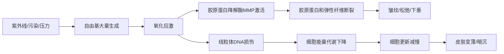
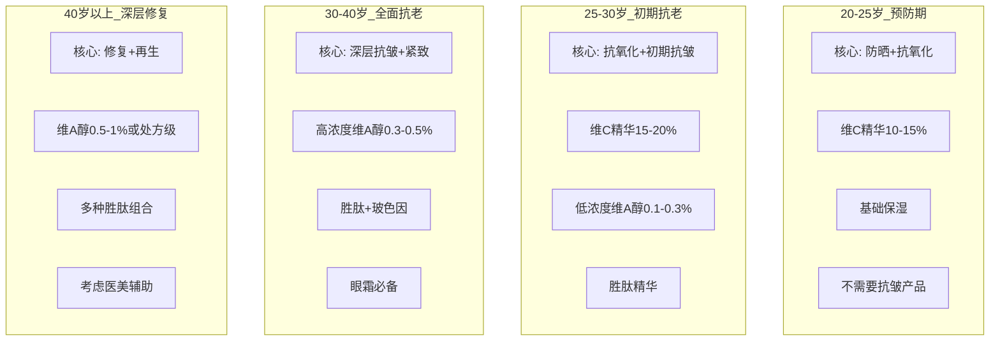
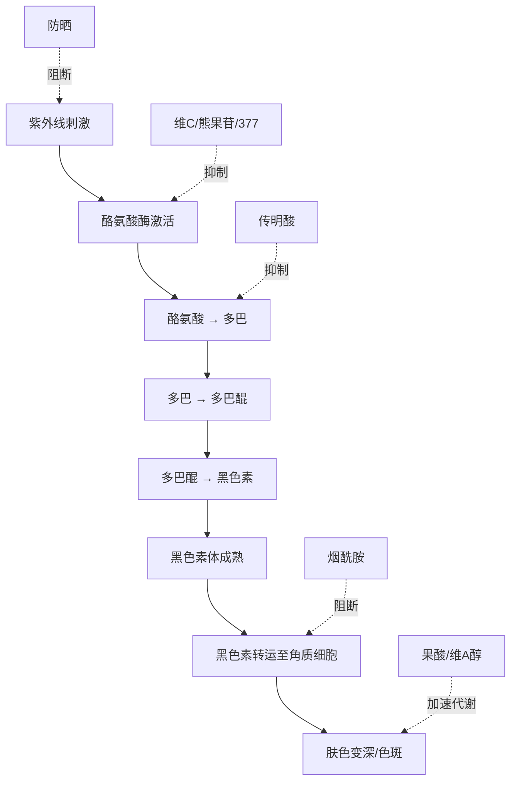
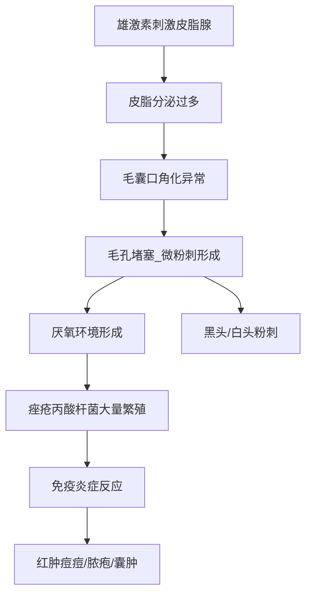
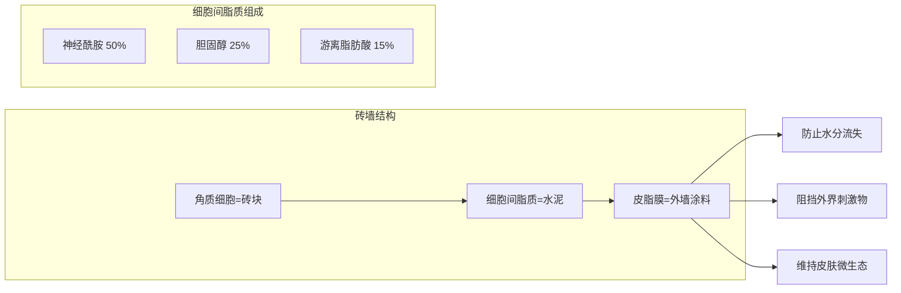
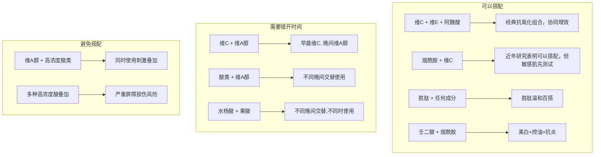

## 八、进阶护肤方案

当你已经掌握了基础护肤框架（洁面-保湿-防晒），并能根据自己的肤质、季节、年龄做出合理调整之后，就可以进入进阶阶段。进阶护肤的核心是**针对特定皮肤问题，使用功效性成分进行精准干预**。

本章覆盖四个最主流的进阶方向：抗衰老、美白、祛痘、屏障修复。每个方向都从**原理机制→核心成分→具体方案→常见误区**层层展开，确保你不仅知道"怎么做"，更知道"为什么这么做"。

---

### 8.1 抗衰老方案

#### 8.1.1 皮肤衰老的底层逻辑

皮肤衰老分为两大类：

**内源性衰老（自然老化）**：随年龄增长，胶原蛋白以每年约1%的速度流失，弹性纤维退化，透明质酸减少，表皮变薄，真皮层变薄。这是基因决定的，无法逆转，只能延缓。

**外源性衰老（光老化为主）**：紫外线（尤其是UVA）穿透表皮到达真皮层，产生大量自由基，破坏胶原蛋白和弹性纤维的结构。研究显示，面部皱纹中约80%来自光老化，而非自然老化。这意味着**防晒是抗衰老的第一道防线，没有之一**。

皮肤衰老的分子机制：

#### 8.1.2 抗衰老四大核心策略

**策略一：防晒——抗老的基石**

紫外线中的UVA（长波，320-400nm）全年存在，能穿透玻璃，深入真皮层，是光老化的主因。UVB（中波，280-320nm）主要导致晒伤，但也会加速老化。

| 防护维度 | 具体措施 | 说明 |
|---------|---------|------|
| 化学防晒 | 每天使用SPF30+/PA+++以上防晒霜 | 用量要足：面部约一元硬币大小（约1g） |
| 物理遮挡 | 帽子+墨镜+防晒衣 | UPF50+的织物可阻挡98%紫外线 |
| 避免高峰 | 上午10点-下午3点减少户外活动 | 此时段紫外线强度占全天的60%以上 |
| 补涂 | 每2小时补涂一次（户外活动时） | 室内靠窗也需要补涂，UVA可穿透玻璃 |

**策略二：抗氧化——中和自由基**

自由基是不稳定的分子，会攻击细胞膜、蛋白质和DNA。抗氧化成分的作用是"牺牲自己"去中和自由基，保护皮肤细胞。

| 抗氧化成分 | 作用机制 | 浓度建议 | 特点 |
|-----------|---------|---------|------|
| 左旋维C（L-AA） | 直接中和自由基，促进胶原合成 | 10-20% | 效果最强但不稳定，需避光保存 |
| 维C衍生物（AA2G/SAP/MAP） | 在皮肤内转化为维C发挥作用 | 按产品标注 | 更稳定，刺激性更低 |
| 维E（生育酚） | 保护细胞膜脂质免受氧化 | 配合维C效果更佳 | 维C+维E协同增效 |
| 虾青素 | 抗氧化能力是维E的1000倍 | 0.1-1% | 天然红色，适合夜间使用 |
| 阿魏酸 | 稳定维C和维E，三者协同 | 0.5-1% | 维C+维E+阿魏酸是经典组合 |
| 白藜芦醇 | 激活SIRT1长寿基因 | 0.5-1% | 需要与维C搭配使用 |

**策略三：促进胶原蛋白合成**

这是抗衰老的"治本"之策——不仅要防止胶原蛋白被破坏，还要促进新的胶原蛋白生成。

| 成分 | 作用机制 | 有效浓度 | 起效时间 | 注意事项 |
|-----|---------|---------|---------|---------|
| 维A醇（视黄醇） | 加速细胞更新，促进胶原I型和III型合成 | 0.1-1% | 8-12周 | 需建立耐受，从低浓度开始 |
| 维A醛（视黄醛） | 比维A醇更接近活性形式，效率更高 | 0.05-0.1% | 6-10周 | 刺激性略高于维A醇 |
| 胜肽（多肽） | 信号肽刺激胶原合成，神经肽放松肌肉 | 按产品标注 | 4-8周 | 温和无刺激，可与其他成分搭配 |
| 玻色因（Pro-Xylane） | 促进GAGs（糖胺聚糖）合成 | 3-10% | 8-12周 | 欧莱雅专利成分，温和有效 |
| 表皮生长因子（EGF） | 促进细胞增殖和修复 | 按产品标注 | 4-8周 | 争议成分，需正规品牌 |

**策略四：保湿——维持皮肤年轻态**

干燥的皮肤更容易出现干纹，长期干燥会加速真性皱纹的形成。保持皮肤含水量是抗老的基础工作。

- **透明质酸**：1g可吸收1000g水，但分子量不同效果不同。大分子（>1000kDa）在表面成膜保湿，小分子（<50kDa）可渗透到真皮层
- **神经酰胺**：修复皮脂膜，减少水分流失，占细胞间脂质的50%
- **角鲨烷**：与皮脂成分相似，形成保护膜，适合干性皮肤

#### 8.1.3 年龄分层抗老方案

#### 8.1.4 进阶抗老日常方案

**晨间方案（防护为主）**：

| 步骤 | 产品 | 作用 | 用量 |
|-----|------|------|------|
| 1 | 温和洁面 | 清洁夜间代谢物 | 黄豆大小 |
| 2 | 抗氧化精华（维C+维E+阿魏酸） | 中和日间自由基 | 3-4滴 |
| 3 | 胜肽精华 | 促进胶原合成 | 2-3滴 |
| 4 | 眼霜 | 眼周抗皱保湿 | 绿豆大小/眼 |
| 5 | 滋润面霜 | 锁水保湿 | 黄豆大小 |
| 6 | 高倍防晒SPF50+ | 防止光老化 | 1元硬币大小 |

**夜间方案（修复为主）**：

| 步骤 | 产品 | 作用 | 用量 |
|-----|------|------|------|
| 1 | 卸妆油/膏 | 溶解防晒和彩妆 | 2-3泵 |
| 2 | 氨基酸洁面 | 二次清洁 | 黄豆大小 |
| 3 | 化妆水/精华水 | 打底，促进后续吸收 | 适量 |
| 4 | 维A醇精华 | 促进细胞更新和胶原合成 | 黄豆大小（建立耐受后） |
| 5 | 胜肽精华 | 协同抗皱 | 2-3滴 |
| 6 | 眼霜 | 眼周修复 | 绿豆大小/眼 |
| 7 | 修复面霜 | 深层修复，锁住活性成分 | 黄豆大小 |

**维A醇使用注意事项**（重要）：

维A醇是抗衰老的"金标准"成分，但也是最容易用错的成分。以下是完整的使用指南：

1. **建立耐受**：第1-2周每3天用一次，第3-4周隔天用一次，第5周起可每晚使用
2. **用量控制**：初期用豌豆大小涂抹全脸，耐受后可适当增加
3. **搭配禁忌**：不要与果酸、水杨酸同时使用（分不同晚间）；不要与高浓度维C同时使用（早晚分开）
4. **副作用**：初期可能出现干燥、脱皮、泛红（"维A醇反应"），通常2-4周后缓解
5. **防晒加强**：使用维A醇期间，皮肤对紫外线更敏感，防晒必须更严格
6. **禁忌人群**：孕妇/哺乳期禁用，严重敏感肌慎用

#### 8.1.5 抗衰老常见误区

| 误区 | 真相 |
|-----|------|
| "25岁才需要抗老" | 20岁就应该开始防晒和抗氧化，预防远比修复容易 |
| "抗皱面霜能消除皱纹" | 护肤品只能改善细纹和预防新皱纹，已形成的深纹需要医美 |
| "越贵的抗老产品越有效" | 关键看活性成分和浓度，不看价格。30元的维A醇可能比3000元的面霜更有效 |
| "天然成分比化学成分安全" | "天然"不等于安全，蛇毒也是天然的。关键看成分本身的安全性和有效性 |
| "胶原蛋白口服/涂抹能直接补充" | 口服胶原蛋白被消化分解，涂抹的大分子无法穿透皮肤。促进自身合成才是正道 |

---

### 8.2 美白方案

#### 8.2.1 黑色素生成的完整通路

要理解美白，必须先理解黑色素是怎么来的。黑色素的生成是一个多步骤的生物化学过程，每个步骤都有对应的抑制靶点：

美白不是单一通路的事，而是要**多通路协同**。只在一个环节发力，效果有限。最有效的美白方案是：防晒（阻断源头）+ 抑制酪氨酸酶（减少生成）+ 阻断转运（减少传递）+ 加速代谢（促进排出）。

#### 8.2.2 核心美白成分深度解析

| 成分 | 作用靶点 | 有效浓度 | 优缺点 | 适合肤质 |
|-----|---------|---------|--------|---------|
| **左旋维C** | 抑制酪氨酸酶 + 抗氧化 | 10-20% | 效果最全面，但不稳定、易氧化 | 耐受性皮肤 |
| **α-熊果苷** | 竞争性抑制酪氨酸酶 | 2-7% | 温和稳定，效果中等 | 所有肤质 |
| **苯乙基间苯二酚（377）** | 强效抑制酪氨酸酶 | 0.1-0.5% | 效果强，但可能刺激 | 耐受性皮肤 |
| **烟酰胺** | 阻断黑色素转运 + 控油 | 2-5% | 多效合一，温和 | 所有肤质（少数人不耐受） |
| **传明酸（氨甲环酸）** | 抑制黑色素活化信号 | 2-3% | 温和，对黄褐斑效果好 | 所有肤质 |
| **果酸（甘醇酸）** | 加速角质更新，排出黑色素 | 5-10%（家用） | 见效快，但有刺激性 | 耐受性皮肤 |
| **壬二酸** | 抑制酪氨酸酶 + 抗炎 | 10-20% | 对炎症后色素沉着特别有效 | 敏感肌可用 |

**烟酰胺特别说明**：

烟酰胺是性价比最高的美白成分之一，但有一个争议点——不耐受。约5-10%的人使用烟酰胺后出现泛红、刺痒，这通常是因为产品中含有微量烟酸（烟酰胺的前体杂质）。解决方法：

1. 选择纯度高的烟酰胺产品（大品牌通常纯度更高）
2. 从低浓度（2%）开始，逐步提升到5%
3. 如果持续不耐受，换用其他美白成分

#### 8.2.3 美白方案设计

**方案A：温和美白（适合新手/敏感肌）**

早晨：洁面 → 传明酸化妆水 → 烟酰胺精华（2-3%）→ 乳液 → 高倍防晒
晚间：卸妆 → 洁面 → 传明酸化妆水 → 熊果苷精华 → 乳液

**方案B：进阶美白（适合有护肤经验者）**

早晨：洁面 → 维C精华（15-20%）→ 烟酰胺精华（5%）→ 乳液 → 高倍防晒
晚间A：卸妆 → 洁面 → 377精华 → 乳液
晚间B（隔天）：卸妆 → 洁面 → 低浓度果酸（5%）→ 修复乳液

**方案C：强效美白（适合耐受性皮肤，已建立酸类耐受）**

早晨：洁面 → 维C精华（20%）+ 阿魏酸 → 烟酰胺精华（5%）→ 眼霜 → 面霜 → 高倍防晒SPF50+
晚间A：卸妆 → 洁面 → 377精华 → 胜肽精华 → 修复面霜
晚间B：卸妆 → 洁面 → 甘醇酸（8-10%）→ 修复乳液

#### 8.2.4 不同色斑类型的针对性方案

| 色斑类型 | 成因 | 首选方案 | 治疗周期 |
|---------|------|---------|---------|
| 晒斑 | 紫外线累积损伤 | 维C+防晒+果酸 | 3-6个月 |
| 黄褐斑 | 激素+紫外线+炎症 | 传明酸+壬二酸+严格防晒 | 6-12个月，易反复 |
| 炎症后色沉（痘印） | 痤疮/外伤后色素沉着 | 壬二酸+烟酰胺+防晒 | 2-6个月 |
| 雀斑 | 遗传+紫外线 | 护肤品效果有限，考虑激光 | 需医美 |

#### 8.2.5 美白核心注意事项

1. **防晒是前提中的前提**：不防晒，用再贵的美白产品都是白费。紫外线会持续刺激黑色素生成，美白成分的抑制速度远赶不上紫外线的刺激速度
2. **不要追求速效**：正常皮肤代谢周期是28天，美白至少需要1-2个代谢周期才能看到效果。宣称"7天美白"的产品要么是假的，要么含有违禁成分（汞、铅、强效糖皮质激素）
3. **基因决定底色**：你能达到的最白程度大约是大腿内侧或上臂内侧的肤色，这是你未受紫外线照射区域的天然肤色。超过这个限度的美白诉求是不现实的
4. **不要叠加太多美白成分**：选择1-2个核心成分搭配即可，太多反而可能互相干扰或增加刺激风险
5. **美白期间避免使用高浓度酸类**：酸类会剥脱角质，让皮肤更脆弱。美白和去角质要错开使用

#### 8.2.6 美白常见误区

| 误区 | 真相 |
|-----|------|
| "珍珠粉/牛奶敷脸能美白" | 珍珠粉主要成分是碳酸钙，无法被皮肤吸收。牛奶中的酪蛋白分子量太大，无法透皮。都是无科学依据的偏方 |
| "柠檬水敷脸能美白" | 柠檬中的维C浓度不稳定且含光敏物质呋喃香豆素，敷脸后晒太阳反而会导致光敏性皮炎 |
| "白醋洗脸能美白" | 醋酸会破坏皮肤屏障，导致敏感和色素沉着加重 |
| "美白产品会让皮肤变薄" | 正规美白成分不会让皮肤变薄。但含汞的违禁美白产品会损伤皮肤 |
| "停用美白产品会反弹" | 如果不持续防晒，紫外线会重新刺激黑色素生成，这不是"反弹"，而是正常反应 |

---

### 8.3 祛痘方案

#### 8.3.1 痤疮的发病机制

痤疮（痘痘）不是简单的"皮肤脏了"，而是一个涉及四个环节的病理过程：

理解这个机制，就知道祛痘要从多个环节同时入手：控油（减少皮脂）、疏通毛孔（防止堵塞）、杀菌抗炎（控制感染）、修复（预防痘印）。

#### 8.3.2 痤疮严重程度分级

不同严重程度的痤疮，需要不同的处理策略。判断自己属于哪一级，是选择方案的前提：

| 等级 | 表现 | 自行处理? | 核心策略 |
|-----|------|----------|---------|
| I级（轻度） | 以粉刺为主（黑头、闭口），偶发小红痘 | 可以 | 外用水杨酸+维A醇 |
| II级（中度） | 粉刺+炎性丘疹（红痘），数量中等 | 可以尝试 | 外用酸类+壬二酸+维A醇 |
| III级（重度） | 大量炎性丘疹+脓疱 | 建议就医 | 外用+可能需要口服药 |
| IV级（重度） | 囊肿/结节型痤疮，有疤痕倾向 | 必须就医 | 皮肤科处方治疗 |

**重要提醒**：III级及以上痤疮，或者持续3个月以上自行处理无效的痤疮，一定要去正规医院皮肤科就诊。痤疮是一种皮肤病，不是"忍忍就过去了"。延误治疗可能导致永久性疤痕。

#### 8.3.3 核心祛痘成分解析

| 成分 | 作用机制 | 有效浓度 | 使用方法 | 刺激性 |
|-----|---------|---------|---------|--------|
| **水杨酸（BHA）** | 脂溶性，深入毛孔溶解油脂和角质 | 0.5-2% | 可每天使用，洁面后第一步 | 中等 |
| **壬二酸** | 抗菌+抗炎+抑制角化+淡化痘印 | 10-20% | 可每天使用，温和度较好 | 低-中 |
| **过氧化苯甲酰（BPO）** | 强效杀灭痤疮丙酸杆菌 | 2.5-5% | 点涂在痘痘上，不要全脸 | 较高 |
| **维A醇** | 调节角质代谢，从根本上防止毛孔堵塞 | 0.1-0.3%（祛痘起步） | 夜间使用，需建立耐受 | 中-高 |
| **果酸（甘醇酸）** | 加速角质更新，改善闭口 | 5-10% | 每周2-3次，与水杨酸错开 | 中等 |
| **茶树精油** | 天然抗菌成分，适合偶尔冒痘 | 5%（需稀释） | 点涂，不建议大面积使用 | 低 |

**水杨酸 vs 果酸的选择**：

水杨酸是脂溶性的，能渗透进充满油脂的毛孔内部，所以对黑头、闭口和炎性痘痘更有效。果酸是水溶性的，主要作用在皮肤表面，对浅层角质堆积导致的粗糙和闭口更有效。简单来说：**油皮痘痘用水杨酸，粗糙暗沉用果酸，两者可以交替使用但不要同时使用**。

#### 8.3.4 分阶段祛痘方案

**第一阶段：控制炎症期（第1-4周）**

目标：减少活跃痘痘，控制炎症。

早晨：氨基酸洗面奶 → 控油化妆水 → 壬二酸（15%）→ 清爽乳液 → 防晒（选择不致痘配方）
晚间：氨基酸洗面奶 → 水杨酸（2%）→ 修复乳液

**第二阶段：疏通毛孔期（第5-8周）**

目标：清除粉刺，减少新痘生成。在第一阶段基础上引入维A醇。

晚间A：氨基酸洗面奶 → 水杨酸（2%）→ 壬二酸 → 修复乳液
晚间B（隔天）：氨基酸洗面奶 → 维A醇（0.1-0.25%）→ 修复乳液
（维A醇从每周2次开始，逐步增加到隔天）

**第三阶段：巩固修复期（第9-12周+）**

目标：预防新痘，淡化痘印。

早晨：氨基酸洗面奶 → 维C精华（10-15%）→ 烟酰胺（5%）→ 清爽乳液 → 防晒
晚间：氨基酸洗面奶 → 维A醇（0.25-0.5%）→ 修复乳液
每周1-2次：水杨酸面膜（用于T区控油疏通）

#### 8.3.5 祛痘期间的关键原则

1. **不要挤痘**：手指上的细菌会导致感染加重，挤痘的压力会把炎症物质推入更深的真皮层，导致更严重的炎症和疤痕。特别是"危险三角区"（鼻根到两侧嘴角的三角区域），挤痘有极小概率导致颅内感染
2. **不要过度清洁**：一天洗脸不超过两次。过度清洁会刺激皮脂腺分泌更多油脂，形成"越洗越油"的恶性循环
3. **不要频繁更换产品**：祛痘产品通常需要4-8周才能看到明显效果。频繁更换产品既无法判断哪个有效，又会增加皮肤刺激
4. **注意致痘成分**：选择标注"non-comedogenic"（不致痘）的护肤品。常见的致痘成分包括：可可脂、椰子油、异硬脂酸异丙酯、肉豆蔻酸异丙酯
5. **饮食调整**：有较强证据支持的饮食因素包括：
   - **高GI食物**（白米饭、白面包、糖果）：升高血糖→升高胰岛素→刺激雄激素→增加皮脂分泌
   - **乳制品**（尤其是脱脂牛奶）：含IGF-1和类激素物质，可能加重痤疮
   - **建议**：尝试减少高GI食物和乳制品摄入4-8周，观察皮肤变化

#### 8.3.6 痘印分类与处理

痘印分为两种，处理方法完全不同：

| 类型 | 表现 | 成因 | 治疗方案 | 恢复周期 |
|-----|------|------|---------|---------|
| **红色痘印（PIE）** | 红色/紫红色印记，按压会变白 | 炎症导致毛细血管扩张 | 壬二酸+防晒+时间（会自然消退） | 3-6个月 |
| **褐色痘印（PIH）** | 褐色/棕色印记，按压不变色 | 炎症后色素沉着 | 维C+烟酰胺+果酸+防晒 | 3-12个月 |
| **凹陷性疤痕** | 皮肤表面凹坑 | 真皮层胶原蛋白被破坏 | 护肤品几乎无效，需要医美（点阵激光、微针等） | 需医美 |
| **增生性疤痕** | 凸起的红色疤痕 | 胶原蛋白过度增生 | 硅酮凝胶+局部注射，需要医美 | 需医美 |

#### 8.3.7 祛痘常见误区

| 误区 | 真相 |
|-----|------|
| "痘痘是因为脸没洗干净" | 痤疮是毛囊皮脂腺的慢性炎症，不是"脏"导致的。过度清洁反而加重 |
| "长痘不能用保湿产品" | 皮肤屏障需要维护，痘痘肌也需要保湿，选择轻薄不致痘的产品即可 |
| "痘痘挤出来好得快" | 挤痘会导致感染扩散、炎症加重、留疤风险增加 |
| "牙膏/蒜头能祛痘" | 这些东西刺激性极强，会导致接触性皮炎，让情况更糟 |
| "痘痘说明体内有毒/排毒" | 痤疮是皮肤科疾病，有明确的病理机制，与"排毒"无关 |
| "成年后就不会长痘了" | 成人痤疮很常见，尤其与激素波动、压力、饮食有关 |

---

### 8.4 屏障修复方案

#### 8.4.1 皮肤屏障的结构与功能

皮肤最外层的角质层是人体的第一道防线，由"砖墙结构"组成：

当这个"砖墙结构"被破坏时，皮肤就会出现一系列问题：

- **经皮水分流失（TEWL）增加**：皮肤锁不住水，持续干燥
- **外界刺激物容易渗透**：以前用着没事的产品突然开始刺痛
- **炎症反应加剧**：泛红、瘙痒、灼热
- **微生态失衡**：有害菌过度繁殖，进一步加重炎症

#### 8.4.2 屏障受损的常见原因

| 原因 | 机制 | 典型表现 |
|-----|------|---------|
| 过度清洁 | 皮脂膜被洗掉，角质层脂质流失 | 洗完脸紧绷、干燥 |
| 频繁去角质 | 角质层变薄，屏障物理结构被破坏 | 皮肤变薄、可见红血丝 |
| 酸类使用不当 | 高浓度/高频次酸类剥脱角质 | 刺痛、泛红、脱皮 |
| 维A醇不耐受 | 加速角质更新导致屏障暂时变薄 | 干燥、脱皮、泛红 |
| 环境因素 | 干冷气候、空调房、紫外线 | 季节性干燥敏感 |
| 不当护肤 | 含酒精/香精/刺激性防腐剂的产品 | 持续性泛红和不适 |

#### 8.4.3 屏障修复核心成分

| 成分 | 作用机制 | 推荐浓度 | 说明 |
|-----|---------|---------|------|
| **神经酰胺** | 补充细胞间脂质的核心成分 | 按产品标注 | 神经酰胺1/3/6-II型最关键 |
| **胆固醇** | 与神经酰胺协同修复脂质层 | 配合神经酰胺使用 | 单独使用效果有限 |
| **游离脂肪酸** | 补充砖墙结构的"水泥" | 配合以上两种 | 三者按3:1:1比例效果最佳 |
| **角鲨烷** | 模拟皮脂，形成保护膜 | 按产品标注 | 亲肤性好，不致痘 |
| **泛醇（维生素B5）** | 促进皮肤修复，保湿 | 2-5% | 温和无刺激 |
| **积雪草提取物** | 促进胶原合成，抗炎修复 | 按产品标注 | 适合敏感和受损皮肤 |
| **尿囊素** | 促进细胞增殖，舒缓抗炎 | 0.1-2% | 温和的修复辅助成分 |
| **β-葡聚糖** | 激活皮肤免疫修复，保湿 | 按产品标注 | 修复+保湿双效 |

#### 8.4.4 屏障修复完整方案

**原则**：停用所有功效性成分 → 精简步骤 → 修复保湿为主 → 逐步恢复

**修复期方案（第1-4周）**：

| 时段 | 步骤 | 产品选择 | 注意 |
|-----|------|---------|------|
| 早晨 | 1. 清洁 | 清水洗脸（不用洗面奶） | 如果出油不多，清水即可 |
| | 2. 化妆水 | 无酒精、无香精的舒缓型 | 含积雪草/洋甘菊的优先 |
| | 3. 修复精华 | 神经酰胺+泛醇精华 | 避免含酸类/维A醇的产品 |
| | 4. 面霜 | 含神经酰胺的修复面霜 | 质地偏滋润，不用清爽型 |
| | 5. 防晒 | 纯物理防晒（氧化锌/二氧化钛） | 避免化学防晒剂的刺激 |
| 晚间 | 1. 卸妆 | 温和卸妆水/卸妆乳 | 不用卸妆油（可能过度清洁） |
| | 2. 洁面 | 氨基酸洗面奶 | 用量减半，时间控制30秒内 |
| | 3. 化妆水 | 同早晨 | |
| | 4. 修复精华 | 同早晨 | 可以厚涂在特别干燥/敏感的区域 |
| | 5. 面霜 | 同早晨 | 可以涂两层：薄涂全脸+厚涂重点区域 |

**恢复过渡期（第5-8周）**：

皮肤状态稳定后（不泛红、不刺痛、不脱皮），逐步引入功效性产品：

1. 第5周：引入烟酰胺（2%，从隔天晚上开始）
2. 第6周：如果耐受良好，烟酰胺提升到5%，可每天使用
3. 第7周：引入低浓度维C（10%，从早晨隔天开始）
4. 第8周：如果耐受良好，可引入维A醇（0.1%，每周2次晚间）

**关键原则**：每次只引入一个新成分，观察至少一周无不良反应后再引入下一个。

#### 8.4.5 屏障修复期间的绝对禁忌

| 禁忌 | 原因 |
|-----|------|
| 使用酸类（果酸/水杨酸/壬二酸） | 进一步剥脱角质，加重屏障损伤 |
| 使用维A醇/A醛 | 加速角质更新，屏障来不及修复 |
| 使用高浓度维C（>15%） | 低pH值可能刺激受损皮肤 |
| 使用含酒精的产品 | 酒精挥发带走水分，加重干燥 |
| 使用含香精的产品 | 香精是常见的致敏源，受损皮肤更容易过敏 |
| 使用面膜（任何类型） | 过度水合会软化角质层，加重屏障损伤 |
| 去角质/磨砂 | 物理摩擦直接破坏角质层 |
| 频繁更换产品 | 让皮肤无法建立稳定的修复环境 |
| 热水洗脸 | 热水溶解皮脂，加重屏障损失 |

#### 8.4.6 屏障修复常见误区

| 误区 | 真相 |
|-----|------|
| "皮肤敏感就什么都不要用" | 皮肤需要基本的保湿和保护，什么都不涂反而会因为干燥加重屏障损伤 |
| "敏感肌只能用婴儿产品" | 婴儿产品的配方针对婴儿皮肤设计，不一定适合成人。关键是选择无刺激、含修复成分的产品 |
| "芦荟胶能修复屏障" | 芦荟胶主要是舒缓和补水，不能补充细胞间脂质。修复屏障需要神经酰胺、胆固醇等脂质成分 |
| "用油敷脸能修复屏障" | 油脂可以辅助锁水，但不能替代细胞间脂质。纯油敷脸还可能导致毛孔堵塞 |
| "敏感是永久的，没法改善" | 大多数屏障受损是可逆的，坚持正确修复4-8周，皮肤可以恢复正常 |

---

### 8.5 活性成分搭配速查表

进阶护肤最大的坑就是成分冲突。以下是最常用的活性成分搭配指南：

| 成分A | 成分B | 搭配建议 |
|------|------|---------|
| 维C（早晨） | 维A醇（晚间） | ✅ 早晚分开使用 |
| 维C | 烟酰胺 | ⚠️ 可以搭配，敏感肌先小面积测试 |
| 维C | 阿魏酸 | ✅ 协同增效，同时使用 |
| 维A醇 | 胜肽 | ✅ 温和搭配，可以同时使用 |
| 维A醇 | 果酸/水杨酸 | ❌ 不要同时使用，不同晚间交替 |
| 维A醇 | 壬二酸 | ✅ 可以搭配，壬二酸温和 |
| 烟酰胺 | 果酸 | ⚠️ 低浓度可以，高浓度分开 |
| 水杨酸 | 果酸 | ❌ 不同时使用，刺激叠加 |

---

### 8.6 进阶护肤的心理建设

最后，也是最容易被忽略的一点：**进阶护肤需要耐心和理性**。

**预期管理**：

- 护肤品不是医美，不要期望"换脸"效果
- 大多数功效性成分需要**至少4-12周**才能看到明显变化
- 皮肤改善是一个螺旋上升的过程，中间会有反复，这是正常的
- 适合别人的产品不一定适合你，护肤是高度个体化的事

**理性消费**：

- 贵≠好，很多平价产品（如The Ordinary、CeraVe）的活性成分浓度和配方工艺不输大牌
- 不要因为焦虑而囤积产品，护肤品有保质期，开封后更有使用期限
- 一个精简但正确的方案，远胜过一堆乱用的产品

**什么时候该看医生**：

- 大面积炎性痤疮（III级以上）
- 持续性面部泛红（可能是玫瑰痤疮/脂溢性皮炎）
- 使用护肤品后出现严重过敏反应
- 不明原因的色素沉着或皮肤变化
- 任何你不确定的皮肤问题

皮肤科医生拥有护肤品无法替代的处方手段（外用药物、口服药物、激光等），及时就医不是"没面子"，而是对自己皮肤负责。
