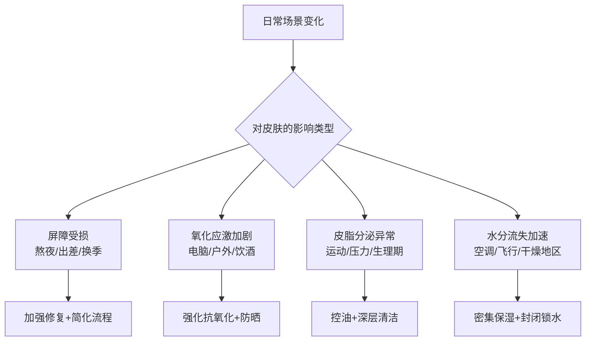

## 九、常见场景的护肤调整

护肤不是一套流程走天下。日常生活中的各种场景——熬夜、运动、出差、换季、长时间面对屏幕——都会对皮肤产生不同的影响，需要有针对性地调整护肤策略。本章将系统梳理十五个常见生活场景，分析每个场景对皮肤的具体影响机制，并给出可立即执行的调整方案。

掌握"场景化护肤"的核心思维：**基础流程不变，根据场景增减特定步骤**。这比每次都重新设计一套方案要高效得多。

---

### 9.1 熬夜后

熬夜是皮肤的头号敌人之一。即使是偶尔一次晚睡，也会在第二天让你的皮肤状态肉眼可见地下滑。

#### 9.1.1 熬夜对皮肤的影响机制

| 影响维度 | 具体变化 | 可见表现 |
|---------|---------|---------|
| 屏障功能 | 经皮水分流失（TEWL）增加 20%-30% | 皮肤干燥、紧绷、脱皮 |
| 皮脂分泌 | 皮质醇升高刺激皮脂腺，出油增加 | T区泛油、毛孔粗大 |
| 血液循环 | 微循环减慢，代谢废物堆积 | 面色暗沉、黑眼圈加重 |
| 炎症水平 | 促炎因子 IL-6、TNF-α 上升 | 泛红、痘痘爆发 |
| 胶原合成 | 生长激素分泌减少，修复效率降低 | 长期熬夜后皮肤松弛、细纹 |

皮肤的修复高峰在夜间 11 点到凌晨 2 点之间，这段时间生长激素分泌最旺盛，细胞更新速度最快。错过这个窗口期，皮肤就失去了最佳修复时机。

#### 9.1.2 熬夜当晚的护肤调整

如果你已经知道自己要熬夜（赶项目、看球赛等），提前做好准备：

1. **提前做好晚间护肤**：不要等到凌晨才洗脸。在正常时间（10-11点）就完成晚间护肤流程，让修复成分有更多时间发挥作用
2. **加一层修复面霜**：在乳液之后再叠一层封闭性更强的面霜（如含神经酰胺、角鲨烷的产品），锁住水分减少整夜的水分流失
3. **眼部加强**：涂一层厚一点的眼霜，配合轻柔按摩，减缓黑眼圈的形成

#### 9.1.3 熬夜后的晨间应急方案

第二天早上的护肤要围绕"急救"展开：

**第一步：温和清洁 + 冷敷（5分钟）**

用温水配合温和洗面奶清洁面部。之后用冰镇的湿毛巾或冷藏过的勺子敷在眼周和面颊 2-3 分钟，收缩扩张的毛细血管，减轻浮肿和暗沉。冷敷的原理是通过低温引起血管反射性收缩，改善局部血液循环。

**第二步：加强抗氧化（抗氧化精华加量）**

氧化应激是熬夜后皮肤变差的核心原因之一。抗氧化精华可以比平时多涂一层，或者在精华之后再加一层含维生素 C（10%-15% 浓度）的精华。维生素 C 是经研究证实最有效的外用抗氧化成分之一，能直接中和自由基，同时抑制黑色素生成。

**第三步：提亮型防晒**

选择带有轻微润色效果的防晒霜，或者在防晒之后加一层素颜霜。物理遮盖效果可以即时改善暗沉外观。注意选择带抗氧化成分（如烟酰胺、虾青素）的防晒产品，提供双重保护。

**第四步：简化彩妆**

如果需要化妆，以轻薄为主。用妆前乳打底，薄薄一层粉底液或气垫，重点遮瑕黑眼圈。避免厚重的遮瑕产品堆积在眼下，容易卡纹。

#### 9.1.4 熬夜后的恢复期（2-3天）

熬夜后的 2-3 天是皮肤的修复期，需要特别注意：

- **停用所有酸类产品**（水杨酸、果酸、A醇等）：此时屏障功能下降，酸类的刺激性会被放大，可能导致泛红、脱皮
- **简化晚间流程**：洗面奶 → 保湿精华 → 修复面霜，三步即可。暂停一切"猛药"
- **加强补水**：可以连续 2-3 天晚间使用补水面膜（成分简单、不含酒精的那种）
- **早睡**：尽量在接下来的 2-3 天恢复 11 点前入睡，给皮肤完整的修复周期

#### 9.1.5 常见误区

- **误区**：熬夜后早上用冷水洗脸就能"醒肤"。冷水确实能暂时收缩血管，但不能逆转熬夜的损伤，过度冷刺激反而可能引起敏感
- **误区**：熬夜后疯狂敷面膜补救。面膜不能替代睡眠，过度使用面膜（每天一片以上）可能导致皮肤过度水合，反而削弱屏障
- **误区**：熬夜后用更强效的护肤品"加倍补偿"。皮肤此时处于脆弱状态，使用高浓度功效产品容易适得其反

---

### 9.2 长时间面对电脑

现代人每天面对屏幕的时间普遍超过 8 小时，办公室工作者甚至超过 10 小时。电脑屏幕发出的蓝光（高能可见光，HEV，波长 380-500nm）对皮肤的影响长期被低估。

#### 9.2.1 蓝光对皮肤的影响

蓝光的穿透力比紫外线更强，能到达皮肤的真皮层。2018 年发表在《Journal of Investigative Dermatology》上的研究表明，蓝光可以：

- **诱导氧化应激**：激活皮肤中的光敏物质（如核黄素、卟啉），产生活性氧自由基（ROS）
- **加速色素沉着**：在深色肤色人群中，蓝光引起的色素沉着比 UVA 更持久
- **干扰生物钟**：蓝光抑制褪黑素分泌，影响皮肤的夜间修复节律
- **破坏胶原**：长期暴露可激活基质金属蛋白酶（MMP），加速胶原降解

不过需要注意的是，电脑屏幕的蓝光强度远低于日光。一天对着电脑的蓝光暴露量大约是户外日光的 1/10 到 1/100。所以不需要过度恐慌，做好基础防护即可。

#### 9.2.2 日常防护方案

**基础防护（每天执行）：**

- **早晨抗氧化精华必涂**：抗氧化精华或其他含维生素 C、烟酰胺、虾青素的抗氧化产品，形成对抗自由基的第一道防线
- **防晒不能省**：即使在室内，如果靠窗（UVA 可穿透玻璃），仍然需要涂防晒。不靠窗的情况下，带防晒值的日霜也足够
- **含蓝光防护的防晒产品**：部分防晒霜添加了氧化铁（Iron Oxides），对蓝光有额外防护效果。如果你长时间面对屏幕，可以优先选择这类产品

**工作间隙的护理：**

- **每 2-3 小时喷一次保湿喷雾**：空调环境加上集中注意力时眨眼频率降低，面部水分流失加速。喷雾能即时补水。喷完后用纸巾轻轻按压吸走多余水分，避免自然蒸发带走更多水分（蒸发反而让皮肤更干）
- **桌上放加湿器**：小型 USB 加湿器可以将周围环境湿度维持在 40%-60%，这是皮肤最舒适的湿度范围
- **20-20-20 护眼法则**：每 20 分钟看 20 英尺（约 6 米）远的地方 20 秒。这主要保护眼睛，但也能让面部肌肉放松，间接改善面部血液循环

#### 9.2.3 常见误区

- **误区**：电脑辐射伤害皮肤。实际上电脑的电磁辐射极低，远低于安全标准，不会对皮肤造成损伤。真正需要防护的是蓝光和空调导致的干燥
- **误区**：涂了防辐射隔离霜就够了。市面上的"防辐射"产品大多是营销概念，没有经过严格验证。选择正规的抗氧化精华和防晒霜才是正道

---

### 9.3 运动后

运动对皮肤的好处和风险并存。适度运动促进血液循环、加速代谢、降低皮质醇水平，长期来看对皮肤有益。但运动过程中和运动后的护理不当，反而可能引发皮肤问题。

#### 9.3.1 运动对皮肤的影响

| 运动类型 | 皮肤影响 | 注意重点 |
|---------|---------|---------|
| 户外跑步/骑行 | 紫外线暴露、风蚀、汗水混合防晒霜堵塞毛孔 | 防晒 + 及时清洁 |
| 健身房力量训练 | 出汗增多、接触公共器材可能传播细菌 | 清洁 + 设备擦拭 |
| 游泳 | 氯水/海水破坏皮脂膜、皮肤脱水 | 游前防护 + 游后修复 |
| 瑜伽/普拉提 | 面部朝下的体式可能压迫皮肤 | 练习前素颜 + 瑜伽垫清洁 |

#### 9.3.2 运动前的护肤准备

**户外运动（跑步、骑行、登山等）：**

1. 涂抹 SPF50+、PA++++ 的防水型防晒霜。选择"运动型"或"防水抗汗型"防晒产品，这类产品通常采用成膜技术，不容易被汗水冲掉
2. 在容易晒伤的部位（鼻尖、耳后、后颈）重点涂抹，这些地方往往被忽略
3. 如果运动时间超过 2 小时，随身携带防晒喷雾用于补涂
4. 戴帽子和运动太阳镜，提供物理防护

**室内运动（健身房、瑜伽等）：**

1. 带妆运动是大忌。彩妆混合汗水和皮脂，极易堵塞毛孔，导致"运动性痤疮"（Acne Mechanica）。运动前用卸妆湿巾或温和洗面奶清洁面部即可
2. 如果皮肤偏干不想完全裸脸，可以涂一层轻薄的保湿乳液
3. 自带毛巾，不要用健身房提供的公用毛巾（细菌温床）
4. 用酒精湿巾擦拭健身器材的接触面

#### 9.3.3 运动后的护理流程

运动结束后，不要急着马上洗脸。让身体先降温 10-15 分钟，心率恢复到正常水平后再进行面部清洁。

**核心流程：**

1. **温和清洁**（运动后 30 分钟内）：用温水和温和洗面奶清洁面部，重点清洁发际线、下巴、鼻翼等容易积汗的区域。如果使用了防水防晒霜，需要先用卸妆产品再用洗面奶（双重清洁法）
2. **补水**：清洁后皮肤 pH 值可能偏高（汗液偏碱性），用含烟酰胺或透明质酸的精华恢复皮肤的水润状态
3. **保湿锁水**：涂一层保湿乳液或面霜，恢复皮脂膜
4. **防晒补涂**（如果继续户外活动）：在出门前再次涂防晒

**游泳后的特别护理：**

泳池中的氯和海水中的盐分都会严重破坏皮脂膜。游泳后需要用大量清水冲洗全身，然后使用含神经酰胺或角鲨烷的保湿产品进行修复。面部可以敷一片补水面膜加速恢复。如果头发和皮肤明显干燥，可以在游泳前涂一层椰子油作为保护层。

#### 9.3.4 常见问题处理

- **运动后脸部发红**：这是正常的血管扩张反应，一般 30-60 分钟内自行消退。如果超过 2 小时不退或伴有刺痛，可能是运动性荨麻疹，需要就医
- **运动性痤疮**：反复在运动后出现的痘痘，常见于发际线、额头、下巴。解决方法是运动前卸妆 + 运动后立即清洁 + 保持装备（头带、帽子）清洁
- **汗疱疹**：手掌、脚底出现的小水泡，与出汗有关。保持局部干燥，严重时使用含酮康唑的药膏

---

### 9.4 出差与旅行

旅行时的环境变化是皮肤状态突然变差的常见原因。时差、气候变化、水质差异、紫外线强度变化，都可能在短时间内给皮肤带来压力。

#### 9.4.1 旅行前的准备

**出发前一周：**
- 不要尝试任何新的护肤产品。在旅途中出现过敏反应是最糟糕的情况——你既不了解当地皮肤科，随身带的产品也未必对症
- 如果要前往紫外线强烈的地区（热带、高原、雪地），提前一周开始强化使用抗氧化精华，增强皮肤的紫外线防御能力
- 修复好已有的皮肤问题（痘痘、泛红等），带着健康的状态出发

**随身护肤包清单：**

| 产品 | 用途 | 建议规格 |
|------|------|---------|
| 温和洗面奶 | 日常清洁 | 30-50ml 旅行装 |
| 保湿精华 | 补水修复 | 15-30ml |
| 保湿乳液/面霜 | 锁水屏障 | 30-50ml |
| 防晒霜 SPF50+ | 紫外线防护 | 30ml 旅行装 |
| 补水面膜（2-3片） | 急救补水 | 独立包装 |
| 保湿喷雾 | 随时补水 | 100ml 以内（可带上飞机） |
| 润唇膏（含防晒） | 唇部防护 | 1支 |
| 眼霜 | 眼部护理 | 5-10ml |

注意：液体产品单件不超过 100ml，总量不超过 1L，装入透明密封袋可随身带上飞机。

#### 9.4.2 飞机上的护肤

机舱是护肤的极端环境——湿度通常只有 10%-20%（正常室内为 40%-60%），相当于沙漠的干燥程度。再加上高空中紫外线强度是地面的 2 倍（透过舷窗），长时间飞行对皮肤的损伤不容忽视。

**飞行中的护肤方案：**

1. **登机前**：涂好防晒（靠窗座位）+ 保湿面霜。如果飞行超过 4 小时，可以涂得比平时厚一些
2. **飞行中**：每 2 小时喷一次保湿喷雾，轻拍吸收后涂一层保湿乳液锁水。不要让喷雾在脸上自然蒸发
3. **长途飞行（超过 6 小时）**：起飞后 2-3 小时可以贴一片补水面膜，敷 15-20 分钟。选择不需要清洗的睡眠面膜更方便
4. **降落前**：用湿纸巾轻擦面部，重新涂保湿乳液和防晒，以清爽的状态到达目的地

#### 9.4.3 不同气候区的应对策略

**热带/湿热地区：**
- 换成轻薄质地的乳液，避免厚重面霜闷痘
- 防晒霜选择清爽型，每 2 小时补涂一次（出汗会加速防晒失效）
- 加强清洁，可以使用双重清洁法（卸妆油 + 洗面奶）清除多余皮脂和防晒
- 控油散粉可以随时用，吸收多余油脂

**干燥/寒冷地区：**
- 将乳液升级为面霜，增加封闭性
- 使用含透明质酸、甘油等吸水性保湿成分的精华
- 避免使用含酒精的产品（酒精蒸发会带走更多水分）
- 睡前可以涂一层厚厚的修复面霜当睡眠面膜

**高原地区（海拔 3000m 以上）：**
- 紫外线强度比平原高 30%-50%，必须使用 SPF50+、PA++++ 的防晒
- 每 1.5-2 小时补涂防晒
- 佩戴宽檐帽和 UV400 太阳镜
- 空气极度干燥，保湿要加倍

**海滨/雪地：**
- 水面和雪面都会反射紫外线，实际紫外线暴露量是普通户外的 1.5-2 倍
- 必须使用防水型防晒霜，并频繁补涂
- 晒后立刻进行修复护理（详见 9.12 晒后修复）

#### 9.4.4 时差调整

跨时区旅行会打乱皮肤的生物钟。研究显示，昼夜节律紊乱会导致皮肤屏障修复效率下降、皮脂分泌失调。

- 到达后尽快按当地时间作息，帮助身体和皮肤同步调整
- 到达当天晚上按当地时区做晚间护肤，即使你还不困
- 可以使用含褪黑素的夜间护肤产品，帮助皮肤"校准"生物钟

---

### 9.5 生理期

女性的皮肤状态与月经周期密切相关。了解周期各阶段的皮肤特点，可以精准调整护肤策略。

#### 9.5.1 月经周期与皮肤的关系

| 周期阶段 | 时间（以28天周期为例） | 激素变化 | 皮肤表现 |
|---------|---------------------|---------|---------|
| 月经期 | 第 1-5 天 | 雌激素、孕激素均低 | 皮肤干燥、敏感、面色苍白 |
| 卵泡期 | 第 6-13 天 | 雌激素逐渐升高 | 皮肤状态最佳，光泽有弹性 |
| 排卵期 | 第 14 天左右 | 雌激素达峰值 | 皮肤最光滑细腻 |
| 黄体期前期 | 第 15-21 天 | 孕激素升高 | 皮脂分泌增加，开始出油 |
| 黄体期后期 | 第 22-28 天 | 激素急剧下降 | 痘痘爆发、水肿、暗沉 |

#### 9.5.2 各阶段护肤方案

**月经期（第 1-5 天）——温和修复**

皮肤处于最脆弱的状态，一切以温和为主：
- 使用氨基酸洗面奶，避免皂基类产品
- 精华选择含神经酰胺、角鲨烷等修复成分的产品
- 暂停所有酸类产品和高浓度活性成分
- 可以敷一片舒缓修复面膜（含积雪草、芦荟等成分）

**卵泡期（第 6-13 天）——功效护肤**

这是皮肤状态最好的阶段，也是使用功效性产品的最佳时机：
- 可以正常使用 A醇、果酸等"猛药"
- 美白、抗老类精华在这个阶段效果最明显
- 可以尝试之前没用过的新产品（皮肤耐受度最高）
- 做面膜的效果也最好，吸收力最强

**黄体期（第 15-28 天）——控油抗痘**

皮脂分泌增加，痘痘风险最高：
- 加强控油：晨间使用含烟酰胺的精华，烟酰胺可以调节皮脂分泌
- 预防性使用水杨酸：在容易长痘的区域（下巴、下颌线）薄涂含 2% 水杨酸的产品
- 如果已经出现红肿痘痘，局部点涂壬二酸或含茶树精油的祛痘产品
- 不要挤痘，黄体期的痘痘炎症反应更强，挤痘后更容易留疤

#### 9.5.3 黄体期爆痘的特别处理

黄体期痘痘通常出现在下巴和下颌线，呈现红肿的炎性痘痘。处理方案：

1. **早发现早干预**：在经前 7-10 天开始预防性使用水杨酸
2. **局部治疗**：痘痘冒头后，点涂含 2%-5% 苯甲酰过氧化物（BPO）的产品，杀灭痤疮丙酸杆菌
3. **不要过度清洁**：频繁洗脸会刺激皮脂腺分泌更多油脂
4. **饮食辅助**：黄体期减少高糖、高乳制品食物的摄入。研究表明高血糖指数（GI）食物和乳制品与痤疮加重有关

---

### 9.6 压力大时

心理压力对皮肤的影响是有科学依据的，这个领域被称为"心理皮肤学"（Psychodermatology）。

#### 9.6.1 压力如何影响皮肤

当你感到压力时，身体的 HPA 轴（下丘脑-垂体-肾上腺轴）被激活，释放皮质醇（压力激素）。皮质醇对皮肤的影响是多方面的：

- **皮脂分泌增加**：皮质醇直接刺激皮脂腺，导致出油增多、毛孔粗大
- **屏障功能下降**：皮质醇抑制角质层中脂质的合成，皮肤更容易失水和受到刺激
- **炎症反应增强**：慢性压力使皮肤处于"促炎状态"，容易出现痘痘、湿疹、银屑病等
- **愈合变慢**：压力状态下，皮肤的伤口愈合速度可降低 40%
- **加速衰老**：皮质醇会降解胶原蛋白，长期压力导致皮肤提前老化

#### 9.6.2 压力期护肤方案

**护肤层面：**
- **维持基础流程不变**：压力大时最容易放弃护肤，但此时皮肤更需要护理
- **强化抗氧化**：压力增加自由基产生，抗氧化精华不可或缺
- **简化步骤**：如果实在没有精力做完整流程，至少完成"清洁→保湿→防晒"三步
- **选择舒缓型产品**：含洋甘菊、积雪草、神经酰胺等成分的产品可以帮助舒缓皮肤

**生活方式层面：**
- **睡眠优先**：每晚保证 7-8 小时睡眠。如果失眠，使用含镁的助眠补充剂或尝试冥想
- **运动减压**：每周 3-4 次中等强度有氧运动（快走、游泳、骑行），持续 30 分钟以上可以显著降低皮质醇水平
- **深呼吸练习**：4-7-8 呼吸法（吸气 4 秒，屏气 7 秒，呼气 8 秒）每天做 3-4 组，可以快速降低交感神经兴奋度
- **减少咖啡因**：咖啡因会加重焦虑感并影响睡眠质量，压力大时建议减量

#### 9.6.3 压力性痤疮的处理

压力性痤疮（Stress Acne）的特点是：突然爆发、分布广泛、以炎性痘痘为主。

**紧急方案：**
1. 早晨：温和洗面奶 → 含烟酰胺的精华（控油+抗炎）→ 轻薄保湿 → 防晒
2. 晚间：双重清洁 → 含 2% 水杨酸的产品（隔天使用）→ 保湿修复面霜
3. 局部治疗：红肿痘痘点涂壬二酸（15%-20%），既杀菌又消炎

如果持续 2 周以上没有好转，或者出现大面积囊肿型痤疮，建议就医。皮肤科医生可能会开口服药物（如短程抗生素或异维 A 酸）。

---

### 9.7 换季

换季是皮肤问题高发期，尤其在秋冬交替和冬春交替时。温度和湿度的骤变让皮肤来不及适应。

#### 9.7.1 换季皮肤问题的成因

| 换季类型 | 环境变化 | 常见皮肤问题 |
|---------|---------|------------|
| 夏→秋 | 温度下降、湿度降低 | 干燥脱皮、敏感泛红、干纹明显 |
| 秋→冬 | 温度骤降、暖气开启 | 严重干燥、皲裂、湿疹复发 |
| 冬→春 | 温度回升、花粉增多 | 过敏性皮炎、痘痘、油脂分泌恢复但不稳定 |
| 春→夏 | 温度湿度升高、紫外线增强 | 出油增多、防晒不足导致晒伤、光敏反应 |

#### 9.7.2 换季过渡策略

核心原则：**提前两周开始调整，不要等到皮肤出问题再改**。

**从清爽过渡到滋润（夏→秋→冬）：**
1. 第 1 周：将乳液换成质地稍厚的乳霜
2. 第 2 周：在精华中加入一滴护肤油（如角鲨烷油），增强保湿
3. 第 3 周：如果还不够，增加睡眠面膜作为最后一步
4. 持续关注：每周评估一次皮肤的干燥程度，动态调整

**从滋润过渡到清爽（冬→春→夏）：**
1. 第 1 周：面霜换回乳液
2. 第 2 周：减少护肤油的使用
3. 第 3 周：如果出油明显增加，加入含烟酰胺的控油精华
4. 同步加强防晒：春季紫外线已经开始增强

#### 9.7.3 换季敏感期的特别护理

换季时皮肤屏障脆弱，容易出现"换季敏感"——表现为泛红、刺痛、瘙痒、起小疹子。

**应对方案：**
- 停用所有刺激性产品（酸类、A醇、高浓度 VC）
- 使用"神经酰胺 + 胆固醇 + 脂肪酸"三合一的修复产品，这三种成分按 1:1:1 的摩尔比可以最有效地修复皮肤屏障
- 选择不含香精、酒精、色素的产品
- 清洁用清水或极温和的氨基酸洗面奶
- 如果症状持续超过一周，考虑是否是过敏性皮炎，及时就医

---

### 9.8 长时间佩戴口罩

口罩已成为日常用品，但长时间佩戴对皮肤的影响不容忽视，医学上称为"口罩相关皮肤问题"（Mask-related Skin Issues）。

#### 9.8.1 口罩对皮肤的影响

- **物理摩擦**：口罩边缘反复摩擦皮肤，导致机械性刺激和屏障损伤
- **湿热环境**：呼吸产生的水汽被困在口罩内，形成高温高湿的微环境，有利于细菌和真菌繁殖
- **皮脂堆积**：封闭环境导致皮脂无法正常排出，堵塞毛孔
- **接触性皮炎**：口罩材料（无纺布、金属鼻夹、橡胶耳带）可能引起过敏反应

#### 9.8.2 口罩肌肤护理方案

**戴口罩前：**
- 只做基础护肤：洗面奶 → 轻薄保湿乳液 → 防晒（选择成膜快、不油腻的类型）
- 避免在口罩覆盖区域使用厚重面霜、护肤油或浓稠的精华
- 如果需要化妆，口罩遮盖区域只涂防晒即可，彩妆集中在眼部

**摘口罩后：**
- 立即用温和洗面奶清洁口罩覆盖区域
- 涂抹含泛醇（维生素 B5）或积雪草的修复产品
- 如果已经有摩擦发红的区域，厚涂一层修复面霜

**口罩选择：**
- 皮肤敏感者优先选择纯棉内层的口罩
- 每 4 小时更换一次性口罩
- 可重复使用的口罩每天清洗，使用无香型洗涤剂
- 口罩带子不要太紧，减少压迫性摩擦

#### 9.8.3 "口罩痘"（Maskne）的预防和处理

Maskne 是 Mask + Acne 的合成词，特指口罩区域反复出现的痘痘。

**预防：**
- 口罩覆盖区域简化护肤，减少产品用量
- 使用含水杨酸的洁面产品清洁口罩区域
- 定期更换口罩，避免细菌累积

**已出现 Maskne 时：**
- 晚间在口罩区域使用 2% 水杨酸或壬二酸
- 不要用手触摸口罩覆盖区域
- 如果条件允许，每 2 小时找通风处摘口罩 5-10 分钟，让皮肤透气

---

### 9.9 空调环境

无论冬夏，空调都是室内皮肤干燥的元凶。长时间处于空调环境中，皮肤水分流失速度可增加 25%-40%。

#### 9.9.1 空调对皮肤的影响

空调通过制冷/制热过程不断降低室内湿度。典型的空调办公室湿度在 20%-35%，远低于皮肤舒适的 40%-60% 范围。在这种环境中：

- 皮肤角质层含水量下降，出现干燥、紧绷
- 细纹暂时性加深（干纹），尤其是眼周和法令纹区域
- 皮脂腺可能反射性增加油脂分泌（外油内干）
- 屏障功能下降，皮肤更容易受到外界刺激

#### 9.9.2 空调环境下的护肤策略

**桌面必备三件套：**

1. **保湿喷雾**：含透明质酸或甘油的喷雾，每 2-3 小时喷一次。使用后用纸巾轻按吸走多余水分，然后涂一层保湿乳液锁水。单纯的矿泉水喷雾没有保湿效果，蒸发后反而会让皮肤更干
2. **小型加湿器**：维持周围微环境湿度在 40%-60%
3. **护手霜**：手部皮脂腺少，空调环境下最先干燥

**护肤调整：**
- 选择含透明质酸、神经酰胺、角鲨烷等保湿成分的乳液
- 眼周加强：使用滋润型眼霜，预防干纹
- 如果经常在空调房和室外切换（温差大），选择温变适应性好的护肤品——质地轻薄但保湿力强的产品

---

### 9.10 饮酒后

酒精对皮肤的影响是全身性的，不仅仅局限于面部。

#### 9.10.1 酒精对皮肤的影响

- **脱水**：酒精是利尿剂，大量饮酒导致全身脱水，皮肤含水量下降。这也是酒后第二天皮肤看起来暗沉的原因之一
- **血管扩张**：酒精导致面部毛细血管扩张，出现面部潮红。长期饮酒可能导致毛细血管永久性扩张（酒糟鼻）
- **炎症加剧**：酒精增加全身炎症反应，可能加重痘痘、玫瑰痤疮等炎症性皮肤病
- **睡眠质量下降**：虽然酒精让人昏昏欲睡，但会破坏深度睡眠，影响皮肤的夜间修复

#### 9.10.2 饮酒前后的护肤调整

**饮酒前：**
- 喝大量的水（每喝一杯酒配一杯水），提前补充水分
- 涂一层保湿面霜，给皮肤多一层保护
- 不要在饮酒前做酸类护理，酒精的刺激加上酸类可能引发敏感

**饮酒当晚：**
- 回家后先喝一大杯水
- 认真做晚间护肤，不要因为醉意就跳过
- 精华选择含透明质酸的产品，加强补水
- 面霜涂厚一些

**次日恢复：**
- 早晨用温水清洁后，冷敷面部 2-3 分钟收缩扩张的毛细血管
- 加强抗氧化：涂抗氧化精华
- 防晒选择带润色效果的，遮盖暗沉
- 大量喝水，补充电解质
- 当天晚间恢复正常护肤流程，可以加一片补水面膜

---

### 9.11 剃须后

男性剃须是每天最常见的面部刺激源之一。剃须过程中，刀片不仅切断胡须，还会削去角质层的最外层，造成微观损伤。

#### 9.11.1 剃须对皮肤的影响

- **角质层损伤**：每次剃须都会削去 1-2 层角质细胞，频繁剃须可能导致皮肤屏障变薄
- **微小伤口**：肉眼不可见的刀片划伤，为细菌入侵提供了通道
- **胡须内生**：剃须后胡茬卷曲重新长入皮肤，形成红色小丘疹（假性毛囊炎）
- **刺激性接触皮炎**：对剃须膏中的香料或防腐剂过敏

#### 9.11.2 剃须前后的正确护理

**剃须前：**
1. 先用温水洗脸或用热毛巾敷脸 1-2 分钟，软化胡须和打开毛孔
2. 涂抹剃须膏或剃须泡沫，等待 1-2 分钟让其充分渗透软化胡须
3. 使用锋利的刀片（钝刀片需要更多摩擦力，造成更大刺激）

**剃须后：**
1. 用冷水冲洗面部，收缩毛孔和血管
2. 轻拍干（不要擦拭），涂含泛醇或芦荟的剃须后舒缓产品
3. 等待 5-10 分钟让皮肤镇定后，再涂保湿乳液
4. 避免使用含酒精的须后水（传统须后水酒精含量高达 40%-60%，虽然有清凉感但会破坏皮肤屏障）

**预防胡须内生：**
- 剃须时顺着胡须生长方向剃，不要逆刮
- 每周使用一次温和的去角质产品（含低浓度果酸的洁面乳），防止角质堵塞毛囊
- 已经出现内生胡须时，不要用镊子拔，可以用含水杨酸的产品局部涂抹

---

### 9.12 晒后修复

即使做足了防晒，偶尔的晒伤仍然难以避免。晒后的正确处理可以最大程度减少紫外线对皮肤的长期损伤。

#### 9.12.1 晒伤的分级

| 程度 | 症状 | 处理方式 |
|------|------|---------|
| 轻度晒伤 | 皮肤发红、发热、轻微刺痛 | 居家护理即可 |
| 中度晒伤 | 明显红肿、灼热感、触摸疼痛 | 居家护理 + 密切观察 |
| 重度晒伤 | 大面积水泡、剧烈疼痛、寒战、恶心 | 立即就医 |

#### 9.12.2 晒后急救流程（黄金 72 小时）

**晒后 0-6 小时（急性期）：**
1. 立即转移到阴凉处
2. 用冷水（不是冰水）湿敷晒伤区域，每次 15-20 分钟，可以重复多次。冷水能降低皮肤温度、减轻炎症反应
3. 大量喝水，补充因出汗和皮肤屏障受损而流失的水分
4. 口服布洛芬（如果不过敏），可以减轻炎症和疼痛

**晒后 6-24 小时（修复期开始）：**
1. 继续冷敷，频率可降低到每 3-4 小时一次
2. 使用含芦荟（90% 以上纯度）的凝胶涂抹晒伤区域。芦荟中的多糖和甾醇具有抗炎和促进愈合的作用
3. 不要使用含油脂的厚重产品（如凡士林），热量散发不出去会加重不适
4. 不要使用含酒精的产品
5. 绝对不要挑破水泡——完整的水泡是最好的天然敷料

**晒后 24-72 小时（修复高峰期）：**
1. 皮肤可能开始脱皮，这是正常的修复过程，不要撕扯脱皮
2. 使用含透明质酸和神经酰胺的保湿产品，帮助重建屏障
3. 可以开始使用含烟酰胺的产品，帮助修复紫外线引起的 DNA 损伤
4. 继续避免阳光直射，如果必须外出，用物理遮挡（帽子、长袖衣物）代替防晒霜（晒伤皮肤可能不耐受化学防晒成分）

**晒后 72 小时以后（长期修复）：**
1. 恢复正常护肤流程，但保持温和
2. 加强抗氧化：使用含维生素 C 和 E 的精华，对抗紫外线产生的自由基
3. 开始使用含视黄醇（A醇）的产品促进细胞更新（从低浓度开始）
4. 后续 2-4 周密切关注皮肤变化，如果出现异常色素沉着或不愈合的创面，及时就医

#### 9.12.3 晒后修复的常见误区

- **误区**：晒伤后涂牙膏。牙膏中的薄荷醇确实有清凉感，但其中的氟化物和其他成分可能刺激受损皮肤
- **误区**：晒伤后涂黄油/食用油。油脂会封住热量，让皮肤温度更高，加重损伤
- **误区**：晒伤后立即美白。皮肤还在发炎阶段使用美白产品会加重刺激，美白应在晒后 1-2 周皮肤稳定后进行
- **误区**：脱皮说明晒伤快好了。脱皮是皮肤损伤的结果，不是恢复的标志。脱皮期间皮肤仍然脆弱

---

### 9.13 约会/重要场合前

重要场合前的护肤以"即时提亮、减少瑕疵"为目标，同时不能因为临时折腾导致过敏或爆痘。

#### 9.13.1 提前 1 周准备

- **不要尝试新产品**：距离重要日期不到一周时，任何新产品都有可能引起过敏或不耐受反应
- **保持常规护肤流程**：稳定是最好的策略
- **如果有痘痘**：使用水杨酸或壬二酸局部点涂，不要挤痘（挤痘的恢复期比自然消退更长）
- **加强补水**：连续 3-4 天每晚使用补水面膜，让角质层充分含水，皮肤看起来更饱满透亮

#### 9.13.2 前一晚的急救

1. 温和清洁后，使用一片补水面膜或睡眠面膜
2. 眼霜涂厚一些，配合轻柔的按摩手法，预防第二天的黑眼圈和浮肿
3. 早点睡觉——充足睡眠是任何护肤品都替代不了的
4. 睡前少喝水，避免第二天早上面部浮肿

#### 9.13.3 当天早晨的快速提亮方案

1. **冷水洁面**或冷敷 1-2 分钟，收紧毛孔
2. **保湿精华 + 眼霜**：快速补水
3. **妆前乳**：选择带提亮效果的妆前乳，可以即时提亮肤色
4. **防晒**：带润色效果的防晒霜一物两用
5. 如果需要化妆，选择轻薄底妆，重点在遮瑕（黑眼圈、痘印）和提亮（T区、苹果肌）

---

### 9.14 冬季户外活动

滑雪、冬季徒步、冬泳等冬季户外活动对皮肤的挑战是多重的——低温、干燥、强风、强烈紫外线（雪面反射率高达 80%）。

#### 9.14.1 冬季户外的护肤挑战

- **冻伤风险**：暴露在外的面部皮肤在零下温度和寒风中容易冻伤
- **紫外线叠加**：雪地的紫外线反射率是草地的 4-5 倍，加上高海拔地区紫外线更强，实际暴露量可达到普通户外的 2-3 倍
- **极端干燥**：寒冷空气含水量极低，加上寒风吹拂，皮肤水分流失极快
- **温差冲击**：从零下十几度的户外进入二十多度的室内，剧烈温差可能引起毛细血管反应

#### 9.14.2 冬季户外护肤方案

**出发前：**
1. 温和清洁后，使用含透明质酸和甘油的保湿精华
2. 涂一层厚实的含角鲨烷或凡士林的面霜，形成保护膜
3. 涂抹 SPF50+、PA++++ 的防水型防晒霜，重点覆盖鼻尖、颧骨、耳朵
4. 涂含 SPF 的润唇膏（唇部没有皮脂腺，最容易冻裂）

**户外期间：**
- 每 2 小时补涂防晒
- 随身携带润唇膏，干燥时随时涂抹
- 如果感觉面部皮肤紧绷刺痛，用围巾遮挡

**活动结束后：**
1. 进入室内后不要立即用热水洗脸（温差太大刺激血管），先让皮肤自然回温 15-20 分钟
2. 用温水温和清洁
3. 涂抹修复型精华和厚实的保湿面霜
4. 如果有冻伤迹象（皮肤发白、麻木），用温水（38-40°C）缓慢回温，不要揉搓

---

### 9.15 痘痘爆发期

偶尔的痘痘爆发几乎每个人都会经历。在痘痘集中出现的时期，护肤策略需要全面调整。

#### 9.15.1 痘痘爆发期的护肤原则

1. **简化流程**：暂停不必要的产品（抗老精华、美白精华等），保留核心的清洁-保湿-防晒
2. **温和优先**：即使在出油严重的区域，也不要使用强力控油产品。过度清洁会刺激皮脂腺反射性分泌更多油脂
3. **不挤痘**：挤痘会导致炎症扩散、细菌深入真皮层，增加留疤风险。如果实在需要处理，去正规皮肤科做针清
4. **换枕套**：每 2-3 天更换一次枕套，减少细菌和油脂的累积

#### 9.15.2 爆痘期的每日方案

**晨间：**
1. 温和氨基酸洗面奶
2. 含烟酰胺的保湿精华（控油 + 修复 + 抗炎，一物多用）
3. 轻薄保湿乳液
4. 清爽型防晒霜

**晚间：**
1. 双重清洁（卸妆产品 + 洗面奶），彻底清除防晒和多余皮脂
2. 含 2% 水杨酸的产品（如果皮肤能耐受），或含壬二酸的产品
3. 保湿修复面霜（不要因为出油就跳过保湿——痘痘皮肤也需要保湿）

**局部治疗：**
- 红肿炎性痘痘：点涂含苯甲酰过氧化物（2.5%-5%）的产品
- 闭口粉刺：局部涂抹含水杨酸或维 A 酸的产品
- 有脓头的痘痘：贴痘痘贴（水胶体贴），既能吸收分泌物又能防止手去碰

#### 9.15.3 何时该看医生

以下情况建议及时就医：
- 痘痘持续 2 周以上没有好转
- 出现大面积囊肿型或结节型痤疮（又硬又痛的大包）
- 痘痘留下明显的凹陷性疤痕
- 使用非处方产品后出现严重过敏反应
- 怀疑是激素相关痤疮（女性下巴和下颌线反复长痘，与月经周期无关）

---

### 场景化护肤决策速查表

以下表格汇总了十五个常见场景的核心调整要点，方便快速查阅：

| 场景 | 核心问题 | 关键调整 | 要避免的操作 |
|------|---------|---------|------------|
| 熬夜后 | 屏障受损、暗沉出油 | 加抗氧化+修复，停酸类 | 过度敷面膜、用猛药 |
| 长时间电脑 | 蓝光氧化、干燥 | 抗氧化必涂+定时补水 | 迷信防辐射产品 |
| 运动后 | 汗液刺激、细菌风险 | 30分钟内清洁+补水 | 带妆运动、不清洁 |
| 出差旅行 | 环境变化、时差 | 提前准备旅行装，按气候调整 | 途中试新产品 |
| 生理期 | 激素波动致痘 | 按周期阶段调整产品 | 黄体期用猛药 |
| 压力大时 | 皮质升高、炎症加剧 | 维持基础流程+舒缓 | 完全放弃护肤 |
| 换季 | 温湿度骤变 | 提前2周过渡，温和修复 | 等出问题再调整 |
| 口罩佩戴 | 摩擦+湿热闷痘 | 简化口罩区域护肤 | 厚涂面霜+浓妆 |
| 空调环境 | 持续干燥脱水 | 喷雾+加湿器+锁水 | 只喷雾不锁水 |
| 饮酒后 | 全身脱水+血管扩张 | 补水+厚涂面霜+次日修复 | 用热水洗脸 |
| 剃须后 | 角质损伤+微小伤口 | 顺刮+冷敷+泛醇修复 | 含酒精须后水 |
| 晒后 | 紫外线DNA损伤 | 冷敷+芦荟+保湿修复 | 涂油脂、撕脱皮 |
| 重要场合前 | 即时提亮不翻车 | 提前1周补水+当天急救 | 临时试新产品 |
| 冬季户外 | 冻伤+强紫外线+干燥 | 厚涂防护+高频补防晒 | 热水洗脸 |
| 痘痘爆发期 | 炎症集中、屏障脆弱 | 简化流程+水杨酸+不挤 | 强力控油、挤痘 |

---

### 总结：建立场景化护肤思维

场景化护肤的核心不是记住每个场景的具体操作，而是理解"环境/状态变化→皮肤影响→针对性调整"这个逻辑链条。掌握了这个思维方式，面对任何新场景你都能快速判断该如何调整。

**三个通用原则：**

1. **变化越大，护肤越简**：环境剧变、身体状态不佳时，皮肤处于脆弱期，简化流程、温和护理是第一优先级
2. **预防优于修复**：提前准备（如出发前涂好防晒、经前开始用水杨酸）远比事后补救有效
3. **基础流程是底线**：无论任何场景，"清洁→保湿→防晒"三步不能省。在此基础上根据场景增减步骤

你的皮肤每天都在面对不同的挑战。当你能根据当天的情况灵活调整护肤方案，而不是机械地执行同一套流程，你的护肤水平就已经超越了大多数人。
