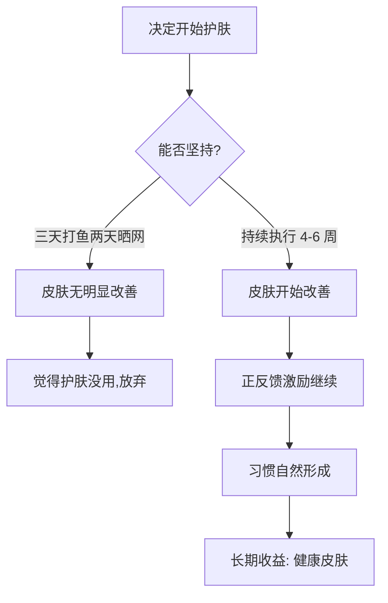
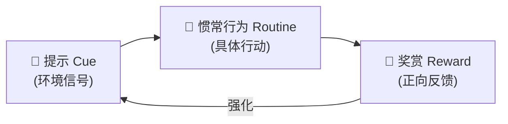

## 十、建立护肤习惯的技巧

前面九章系统地讲了护肤的原理、流程、产品和场景调整方案。但再好的方案，如果不能坚持执行，就等于零。护肤的本质不是某一次用了多贵的产品，而是日复一日地执行正确的流程。皮肤细胞的更新周期约为 28 天，任何护肤品的效果都需要至少 4-6 周才能显现。这意味着"三天打鱼两天晒网"式的护肤不仅浪费产品，更浪费了本可以改善皮肤的时间。

本章将从行为科学的角度出发，帮你把护肤从"想起来才做"的随机行为，变成像刷牙一样自然的日常习惯。

---

### 10.1 为什么习惯比产品更重要

很多人的护肤困境不是"不知道用什么"，而是"知道但做不到"。你可能已经买了合适的产品、学了正确的流程，但就是执行不下去。这不是意志力的问题——把护肤失败归咎于"我太懒了"是一种错误的归因。真正的原因是：**你没有把护肤设计成一个容易执行的习惯**。

#### 10.1.1 习惯的神经科学基础

习惯的形成依赖大脑的基底神经节（Basal Ganglia）。当你反复执行某个行为时，大脑会逐渐将这个行为"自动化"，从需要前额叶皮层（负责决策和意志力）主导，转移到基底神经节主导。这个过程叫做"习惯固化"（Habit Chunking）。

研究显示，一个新习惯的固化时间平均需要 **66 天**（伦敦大学学院 2009 年研究，发表在《European Journal of Social Psychology》），而不是广为流传的"21 天"。而且不同习惯的固化时间差异很大，从 18 天到 254 天不等，取决于行为的复杂度和个人差异。

这意味着：

- 前两个月是最难的，需要刻意坚持
- 简单习惯（如"洗完脸后涂乳液"）比复杂习惯（如"做完一整套晚间流程"）固化得更快
- 偶尔漏掉一天不会前功尽弃，但连续漏掉多天会大幅延长固化时间

#### 10.1.2 习惯回路：提示→惯常行为→奖赏

每个习惯都由三个要素组成，这被称为"习惯回路"（Habit Loop）：

**提示（Cue）**：触发行为的信号。对护肤来说，可以是：
- 时间信号（早上 7 点起床后）
- 行为信号（刷完牙之后）
- 环境信号（走进浴室看到护肤品）

**惯常行为（Routine）**：具体的护肤步骤。降低步骤的复杂度是关键——初期不要追求完整流程，先建立最简版本的习惯。

**奖赏（Reward）**：完成后的正向感受。可以是皮肤的即时触感（涂完乳液后的滋润感）、镜子里看到的改善、或者单纯的"今天也完成了"的成就感。

理解这个回路后，你就可以主动设计护肤习惯，而不是靠意志力硬撑。

---

### 10.2 降低启动成本——让护肤变得"容易做"

行为经济学告诉我们，人类天然倾向于选择阻力最小的路径。如果你的护肤品放在抽屉里、需要翻找才能找到，你就更有可能跳过这个步骤。**降低启动成本是建立习惯的第一步**。

#### 10.2.1 环境设计：让护肤品"看得见、够得着"

**摆放位置的优化原则：**

| 原则 | 具体做法 | 原理 |
|------|---------|------|
| 可见性 | 把护肤品放在洗手台最显眼的位置，不要藏在柜子里 | 视觉提示是最强的行为触发器 |
| 可及性 | 按使用顺序从左到右排列（卸妆→洗面奶→水→精华→乳液→防晒） | 减少思考和寻找的时间 |
| 整洁性 | 保持洗手台区域整洁，只放每天用的产品 | 环境混乱会增加心理阻力 |
| 备用性 | 在旅行包里常备一套迷你装护肤品 | 避免出差时"忘带"的借口 |

**具体操作方案：**

1. **主战场（家里浴室）**：准备一个旋转托盘或分层收纳架，把早晚用的产品分区摆放。早晨用的（洗面奶→水→精华→乳液→防晒）放在右侧，晚间用的（卸妆→洗面奶→水→精华→面霜）放在左侧。产品正面朝外，标签清晰可见。

2. **副战场（办公室）**：桌上放一瓶保湿喷雾和一支护手霜。这两样东西放在触手可及的地方，能在工作间隙完成最基础的护理。

3. **移动战场（随身包）**：常备一支润唇膏和一小瓶防晒霜。这两个是日常最容易需要补涂的产品。

#### 10.2.2 准备两套护肤品

这是降低启动成本最实用的策略之一。很多人出差或旅行时因为"没带护肤品"而中断了护肤流程，回来后又懒得重新开始。

**必备两套配置：**

- **家用套装**：完整的全套产品，放在浴室固定位置
- **出行套装**：分装瓶装好的旅行装，常备在行李箱或随身包里。即使是周末去朋友家住一晚，带上这套就够了

出行套装不需要复杂，三个小瓶足够覆盖基础需求：
1. 洁面乳（30ml 分装瓶）
2. 保湿乳液（30ml 分装瓶）
3. 防晒霜（15ml 旅行装或独立小包装）

#### 10.2.3 时间锚定：把护肤绑定到已有的习惯上

行为科学家 B.J. Fogg（斯坦福大学）提出的"微习惯"理论指出：最有效的新习惯策略是"锚定"——把新行为绑定到一个已经稳固的旧习惯之后。

**护肤的锚定方案：**

| 已有习惯（锚点） | 绑定的护肤行为 | 适用场景 |
|----------------|--------------|---------|
| 刷完牙之后 | 立即做晨间护肤 | 早晨流程 |
| 洗完澡之后 | 立即做晚间护肤（不要等到睡前） | 晚间流程 |
| 到公司坐下后 | 喷保湿喷雾 | 办公室补水 |
| 午饭后洗手时 | 补涂防晒 | 下午防晒补涂 |
| 躺上床之前 | 涂润唇膏 + 护手霜 | 睡前简单护理 |

**关键提示：晚间护肤不要等到睡前再做。** 人在晚上越晚越疲惫，意志力越低。最佳策略是在洗完澡后——此时精力尚可、皮肤毛孔处于张开状态——立即完成晚间护肤流程。如果你习惯 11 点睡觉，那就 9 点半洗澡、10 点前完成护肤。把护肤和睡觉之间留出一段缓冲时间，而不是把护肤放在"最后一个任务"的位置。

#### 10.2.4 最小可行流程（MVP）：从三步开始

如果你现在完全没有护肤习惯，不要一上来就追求完整的六步流程。从"最小可行流程"开始，让习惯先固化，再逐步增加步骤。

**阶段一（第 1-2 周）——三步核心：**

早晨：洗面奶 → 保湿乳液 → 防晒霜
晚间：洗面奶 → 保湿乳液（仅此而已）

**阶段二（第 3-4 周）——加入精华：**

早晨：洗面奶 → 精华 → 保湿乳液 → 防晒霜
晚间：洗面奶 → 精华 → 保湿乳液

**阶段三（第 5 周起）——完整流程：**

早晨：洗面奶 → 化妆水 → 抗氧化精华 → 保湿乳液 → 防晒霜
晚间：卸妆 → 洗面奶 → 化妆水 → 保湿精华 → 保湿面霜

每一步新增都等前一步变成"不用想就能做"的自动化行为之后再加入。这个策略的核心逻辑是：**先保证执行率，再追求完整度**。一个每天都能坚持的简单流程，远比一个执行率只有 30% 的"完美流程"有效。

---

### 10.3 记录与反馈——让效果"看得见"

护肤效果的变化是渐进的、微小的，日常照镜子很难察觉。如果没有客观的记录和反馈机制，你很容易觉得"好像没什么用"，从而丧失坚持的动力。

#### 10.3.1 对比拍照法：最直观的反馈方式

**拍照规范：**

| 要素 | 标准做法 | 为什么重要 |
|------|---------|-----------|
| 光线 | 固定在同一光源下拍摄（推荐窗户旁的自然光，或固定的台灯） | 不同光线会让皮肤看起来差异巨大，干扰判断 |
| 角度 | 正面 + 左侧 45° + 右侧 45°，三个角度各拍一张 | 单一角度可能遗漏侧面的问题 |
| 距离 | 手机固定在同一个位置（可以标记桌面位置） | 距离不同会改变皮肤纹理的可见度 |
| 状态 | 素颜，洁面后 10 分钟拍摄（让皮肤恢复自然状态） | 带妆或刚洗完脸都不准确 |
| 频率 | 每周一次，固定在同一天同一时间 | 太频繁看不出变化，太稀少遗漏转折点 |
| 存储 | 建立专门的相册文件夹，按日期命名 | 方便纵向对比 |

**对比方法：**

不要每天和昨天比（变化太小），而是和四周前的自己比。每个月底做一次"月度对比"——把本月的照片和上月的照片放在一起看。通常 4-6 周后你会看到明显的改善：痘痘减少、肤色均匀度提升、出油量下降等。这个"看得见的变化"是最强的坚持动力。

#### 10.3.2 护肤日志：记录产品和皮肤状态

建立一个简单的护肤日志，不需要很复杂，但要坚持记录。

**日志模板（每天 2 分钟）：**

日期：____年____月____日
━━━━━━━━━━━━━━━━━━━━
[晨间]
使用产品：____________________
防晒补涂：□ 是 □ 否  补涂时间：____

[晚间]
卸妆方式：____________________
使用产品：____________________

[皮肤状态]
出油程度：□ 少 □ 中 □ 多
干燥程度：□ 无 □ 轻微 □ 明显
痘痘情况：□ 无 □ 新增____颗 □ 好转
泛红程度：□ 无 □ 轻微 □ 明显
整体评分：★☆☆☆☆ ~ ★★★★★

[特殊情况记录]
□ 熬夜  □ 运动  □ 饮酒  □ 换新产品  □ 其他：____

**日志的分析价值：**

记录 2-4 周后，你可以从中发现规律：
- 某个产品使用后是否伴随爆痘（排除法判断是否适合）
- 哪些生活行为会影响皮肤状态（熬夜后是否必爆痘）
- 产品之间的搭配是否有冲突（同时用 A 醇和水杨酸是否过度刺激）
- 皮肤状态的周期性变化（生理期前后的波动规律）

#### 10.3.3 产品轮换记录

当你同时拥有多件护肤品，或者在不同时期使用不同产品时，需要记录产品轮换的起止时间和效果。

**产品轮换记录表：**

| 产品名称 | 开始使用日期 | 停用日期 | 使用天数 | 效果评价 | 是否回购 |
|---------|------------|---------|---------|---------|---------|
| XX 抗氧化精华 | 3/1 | 在用 | 45天 | 控油明显，肤色提亮 | ✓ |
| XX 果酸面膜 | 3/15 | 3/28 | 13天 | 过度刺激，泛红加重 | ✗ |

这个记录的价值在于：当你需要回购或更换产品时，有据可查，不会凭模糊的记忆做出错误决策。很多人的皮肤问题反复出现，就是因为忘了之前用某个产品"翻过车"。

#### 10.3.4 不良反应的快速响应

建立一个清晰的"红灯机制"——出现以下情况时立即采取行动：

| 信号 | 可能原因 | 应对措施 |
|------|---------|---------|
| 使用新产品后 24-48 小时内出现大面积红疹 | 接触性过敏 | 立即停用该产品，清水洁面，涂修复面霜。严重时口服抗组胺药并就医 |
| 突然大面积爆痘（不是局部） | 产品致痘或成分不耐受 | 回溯最近 1-2 周新增的产品，逐一排查并停用可疑产品 |
| 持续性灼热感或刺痛 | 屏障受损或产品刺激性过强 | 停用所有功效性产品，仅用清水 + 修复面霜 3-5 天 |
| 皮肤脱皮且伴有瘙痒 | 干燥性湿疹或真菌感染 | 加强保湿，如 3 天内无改善则就医 |

**核心原则：出现明显不良反应时，不要"再观察几天"。** 皮肤的炎症是有累积效应的，越早干预恢复越快。怀疑某个产品就先停用，等皮肤恢复后再小面积测试确认。

---

### 10.4 不要追求完美——"80 分护肤"就够了

完美主义是习惯的最大杀手。很多人给自己设定了过于严格的标准："每天必须做完整六步流程""每晚必须 11 点前睡觉""一片面膜都不能少"。一旦某天没做到，就会产生强烈的挫败感，然后干脆放弃整个流程。

#### 10.4.1 偶尔遗漏不会毁掉皮肤

皮肤有自我修复能力。偶尔忘了一次晚间护肤、偶尔熬了一次夜，不会造成不可逆的损伤。真正伤害皮肤的是长期的、持续的不良习惯，而不是偶尔的"破例"。

**数据说明：** 假设你的护肤目标是每天执行 2 次（早晚各一次），一年共 730 次。即使你偶尔遗漏，一年执行了 600 次，执行率也有 82%。这个执行率足以看到显著的皮肤改善。而如果你因为追求"每天不漏"的压力太大而在第三个月彻底放弃，执行率只有 25%。

**80% 的执行率 > 100% 的计划 + 20% 的执行率。**

#### 10.4.2 "最低执行日"预案

为精力最差的日子准备一个极简方案。这个方案只需要 60 秒，但保证你不会完全"裸奔"：

**最低执行日方案（60 秒版本）：**

早晨：清水洗脸 → 防晒霜（如果要出门）
晚间：洗面奶 → 保湿乳液

就这三到四步。没有精华、没有化妆水、没有面膜，但核心的"清洁→保湿→防护"三要素都在。给自己许可使用这个"低保版本"——完成了就是胜利。

#### 10.4.3 护肤不是短跑，是马拉松

短期的完美执行不如长期的稳定坚持。以下是不同坚持程度的预期回报：

| 坚持程度 | 3 个月后 | 6 个月后 | 1 年后 |
|---------|---------|---------|--------|
| 每天完整流程（执行率 ~95%） | 肤质显著改善 | 皮肤状态稳定向好 | 维持在良好状态 |
| 大部分执行（执行率 ~75%） | 有一定改善 | 持续改善中 | 接近完整执行的效果 |
| 断断续续（执行率 ~30%） | 几乎无变化 | 偶尔有效果但不稳定 | 可能不如不护肤 |

前两种的差距远小于第二种和第三种的差距。这也说明，**"及格"比"完美"重要得多**。

---

### 10.5 晨间与晚间流程的时间管理

很多人不是不想护肤，而是"没时间"。尤其是早晨赶着出门的上班族，每分钟都很紧张。这一节将帮你优化护肤的时间成本。

#### 10.5.1 晨间流程的时间优化

**标准晨间流程的时间分配：**

| 步骤 | 操作 | 耗时 | 等待时间 | 技巧 |
|------|------|------|---------|------|
| 洁面 | 温水 + 洗面奶 | 60秒 | — | 在脸上打圈时可以顺便刷牙（电动牙刷放在旁边） |
| 化妆水 | 轻拍至吸收 | 30秒 | — | 直接倒在手心拍脸，不用化妆棉 |
| 精华 | 抗氧化精华 | 30秒 | 1-2分钟 | 涂完精华后去选衣服/整理包，利用等待时间 |
| 乳液 | 保湿乳液 | 30秒 | — | — |
| 防晒 | 防晒霜 | 60秒 | 3-5分钟 | 涂完防晒后吃早餐，等防晒成膜后再出门 |

**总计：约 5-7 分钟**（含等待时间的重叠利用）

**省时技巧：**

1. **步骤重叠**：涂完精华后利用等待时间做其他事（换衣服、准备早餐），不要在浴室干等
2. **产品合并**：选择带防晒值的保湿乳液（SPF30 的日霜），省去单独涂防晒的步骤（仅限日常通勤，户外活动仍需单独防晒）
3. **减少工具**：所有产品用手直接涂抹，不使用化妆棉、面膜纸等需要额外准备的工具
4. **预设组合**：把早晨要用的产品单独放在一起，和晚间产品分开，避免翻找

#### 10.5.2 晚间流程的时间优化

晚间的时间通常比早晨宽裕，但问题在于"太晚了不想动"。

**标准晚间流程的时间分配：**

| 步骤 | 操作 | 耗时 | 备注 |
|------|------|------|------|
| 卸妆 | 卸妆油/膏 | 60-90秒 | 没化妆的日子可以跳过 |
| 洁面 | 洗面奶 | 60秒 | — |
| 化妆水 | 轻拍至吸收 | 30秒 | — |
| 精华 | 保湿精华 | 30秒 | — |
| 面霜 | 保湿面霜 | 30秒 | — |
| 周期性护理 | 面膜/酸类/眼霜 | 2-5分钟 | 不是每天都需要 |

**总计：约 4-6 分钟**

**晚间省时技巧：**

1. **洗澡后立即护肤**：洗完澡后皮肤毛孔处于张开状态，此时护肤品吸收最好。同时，洗澡和护肤连在一起做，比"先洗澡、再去客厅、然后又回浴室护肤"的心理阻力小得多
2. **周期性护理单独安排**：不需要每天做面膜或用酸类。可以固定"周二和周五晚间用酸类""周三晚间敷面膜"，其余时间只做基础流程
3. **边做其他事边护肤**：涂完精华后可以去刷牙、吹头发、看手机，利用等待时间

#### 10.5.3 不同时间预算的护肤方案

不是每个人都有 5-7 分钟做完整流程。根据你的时间预算，选择对应的方案：

| 时间预算 | 晨间方案 | 晚间方案 |
|---------|---------|---------|
| 1 分钟 | 清水洗脸 → 防晒霜 | 洗面奶 → 保湿乳液 |
| 3 分钟 | 洗面奶 → 乳液 → 防晒霜 | 洗面奶 → 精华 → 面霜 |
| 5 分钟 | 洗面奶 → 化妆水 → 精华 → 乳液 → 防晒 | 卸妆 → 洗面奶 → 化妆水 → 精华 → 面霜 |
| 10 分钟 | 完整流程 + 面膜/眼膜 | 完整流程 + 面膜 + 按摩 |

**选择你的方案，然后每天执行。** 3 分钟方案如果能每天坚持，效果远好于 10 分钟方案一周只做一次。

---

### 10.6 应对"不想做"的心理阻力

知道该做但不想做——这是习惯养成过程中最常见的障碍。以下是一些经过验证的策略，帮助你克服这种心理阻力。

#### 10.6.1 "两分钟法则"

当你实在不想护肤时，告诉自己："我只做两分钟。"具体做法是：先去洗脸。仅仅这一步。洗完脸之后，你会发现"既然已经站在洗手台前了，顺手涂个乳液也不费事"——这就是行为启动效应。

心理学研究表明，开始一个行为的心理阻力远大于继续一个已经开始的行为。所以，"只做第一步"是打破惰性最有效的方法。

#### 10.6.2 "承诺装置"

找一个护肤搭档——可以是朋友、伴侣、或者网上的护肤社群。每天互相打卡。社会承诺（Social Commitment）是一种强大的行为约束力，研究表明有搭档的计划执行率比独自执行高出 65%。

**具体做法：**
- 和朋友建一个只有两个人的群，每天晚上发"护肤 done"
- 加入小红书或豆瓣的护肤打卡小组
- 在手机设置每晚 10 点的提醒闹钟，标签写"你今天护肤了吗？"

#### 10.6.3 "奖赏设计"

人为地为护肤行为设计奖赏，强化习惯回路：

- **即时奖赏**：选择质地和气味让你愉悦的产品。如果涂某个面霜让你觉得"好舒服"，你就更愿意去做这件事
- **过程奖赏**：把护肤时间变成"独处时间"——涂面霜的时候听一首喜欢的歌，敷面膜的时候看 5 分钟短视频
- **累积奖赏**：每连续执行 7 天，奖励自己一件小东西（不需要很贵，关键是仪式感）

#### 10.6.4 "身份认同"策略

这是最深层也最持久的策略。不要把目标设定为"我要每天护肤"（行为目标），而是设定为"我是一个注重护肤的人"（身份目标）。

身份认同的转变会从根本上改变你的决策模式：
- 行为目标："今天我要不要护肤？" → 可能选"不"
- 身份目标："一个注重护肤的人会怎么做？" → 自然选择"做"

这种策略来自 James Clear 在《Atomic Habits》中的核心理论。当你把护肤内化为自我身份的一部分时，执行它就不再需要消耗意志力。

---

### 10.7 季节转换期的习惯调整

护肤习惯不是一成不变的。随着季节变化，你的流程和产品也需要同步调整。把"季节转换"作为固定的"习惯检查点"，每年四次回顾和更新你的护肤方案。

#### 10.7.1 四季调整清单

| 季节转换 | 需要调整的项目 | 具体操作 |
|---------|--------------|---------|
| 春→夏 | 防晒升级、产品轻薄化 | 面霜换乳液，加入控油精华，防晒从 SPF30 升到 SPF50+ |
| 夏→秋 | 保湿加强、修复紫外线累积损伤 | 乳液换面霜，加入修复精华，减少酸类频率 |
| 秋→冬 | 重度保湿、封闭锁水 | 加入护肤油，面霜选更厚重的质地，开始用唇膜 |
| 冬→春 | 过敏预防、产品减负 | 检查产品是否过期，减少厚重产品，加入舒缓成分 |

#### 10.7.2 "换季检查日"设置

在日历中设置四个固定日期（推荐 3 月 1 日、6 月 1 日、9 月 1 日、12 月 1 日）作为"换季护肤检查日"。每个检查日完成以下动作：

1. **审视产品库存**：哪些产品快用完了需要补货？哪些产品不适合下个季节需要替换？
2. **检查产品有效期**：护肤品开封后有保质期（PAO，Period After Opening），通常 6-12 个月。过期产品不仅效果下降，还可能滋生细菌
3. **调整流程**：根据下一季节的皮肤需求增减步骤
4. **更新护肤日志的观察重点**：夏天重点记录出油和防晒，冬天重点记录干燥和脱皮

---

### 10.8 出行场景的习惯维持

旅行和出差是护肤习惯最容易中断的场景。环境变化、作息打乱、产品不便携，都会让你"算了不做了"。前面已经讲了准备出行套装的重要性，这里再补充一些实用细节。

#### 10.8.1 分装技巧

| 产品 | 分装方式 | 注意事项 |
|------|---------|---------|
| 洗面奶 | 30ml 软管或按压瓶 | 不要用广口瓶，取用不方便且容易污染 |
| 爽肤水 | 30ml 喷雾瓶 | 喷雾式最方便，不需要化妆棉 |
| 精华 | 15ml 滴管瓶 | 精华用量小，15ml 够用 1-2 周 |
| 乳液/面霜 | 30ml 广口瓶 | 面霜质地厚，广口瓶方便取用 |
| 防晒霜 | 原装小瓶或 15ml 分装 | 防晒霜需要足量使用，多分装一些 |

**购买建议**：旅行分装瓶套装（淘宝搜"旅行分装瓶"，10-20 元一套），包含各种容量的软管、喷雾瓶、按压瓶。每次出行前提前分装好，省去临时手忙脚乱。

#### 10.8.2 不同出行时长的方案

| 出行时长 | 携带方案 | 流程简化程度 |
|---------|---------|------------|
| 1 天（当日往返） | 润唇膏 + 防晒霜（随身即可） | 无需简化，回家后正常护肤 |
| 2-3 天（短途） | 30ml 洁面 + 30ml 乳液 + 15ml 防晒 | 精简为基础三步 |
| 1 周左右 | 完整出行套装 + 2-3 片面膜 | 接近正常流程 |
| 2 周以上 | 出行套装 + 按需在当地购买补充 | 正常流程 |

#### 10.8.3 酒店环境的护肤应对

酒店的空调通常开得很足，室内湿度很低。到达酒店后的第一件事：

1. 打开加湿器（如果有），或者用湿毛巾挂在出风口
2. 做一次晚间护肤，面霜比平时涂厚一些
3. 不要用酒店提供的洗护用品（成分不明，容易刺激皮肤），坚持用自己的产品

---

### 10.9 预算管理与产品更替

护肤习惯的可持续性也与预算有关。如果护肤品太贵，你可能会因为"心疼"而舍不得用足量，或者在产品用完后因为要花钱补货而拖延。

#### 10.9.1 用量比选品更重要

一个关键认知：**用足量的平价产品 > 用不够量的高端产品**。

防晒霜需要涂一元硬币大小的量才能达到标注的 SPF 值，很多人因为产品贵只涂了 1/3 的量，实际防护力大打折扣。选择你能"舍得用"的价位的产品，然后每次用足量。

#### 10.9.2 产品的合理更替节奏

| 产品类型 | 使用频率 | 单瓶使用周期（估算） | 何时更换产品 |
|---------|---------|-------------------|------------|
| 洗面奶 | 每天 1-2 次 | 2-3 个月 | 用完再换，不需要频繁更换 |
| 化妆水 | 每天 1-2 次 | 2-3 个月 | 同上 |
| 精华 | 每天 1-2 次 | 1-2 个月 | 根据效果决定是否回购 |
| 乳液/面霜 | 每天 1-2 次 | 2-4 个月 | 季节更替时更换质地 |
| 防晒霜 | 每天 1 次 | 1-2 个月 | 防晒产品不要囤太多，注意保质期 |

**省钱策略：**
- 洁面和保湿是最基础的品类，选择性价比高的即可（国产氨基酸洗面奶 30-50 元就很好用）
- 精华和防晒值得投入——这两类产品在成分和工艺上差异更大
- 大促时囤防晒霜和面霜（保质期通常 3 年），但不要囤超过一年的量
- 护肤品不是越贵越好，看成分表比看品牌更有意义

#### 10.9.3 产品空瓶记录

记录每个产品的使用起止日期，帮你建立对"一瓶产品能用多久"的直觉。这个信息在以下场景很有用：

- 大促时知道该囤几瓶
- 判断某个产品的性价比（一瓶 200 元用 1 个月 vs 一瓶 300 元用 3 个月）
- 确认产品是否过期

---

### 10.10 护肤的心理建设

护肤习惯的长期维持，除了方法论之外，还需要正确的心理预期。

#### 10.10.1 不要焦虑

皮肤偶尔出现问题是完全正常的。即使是最精心护理的皮肤，也会因为激素波动、天气变化、饮食不当等原因出现短暂的问题。一两颗痘痘不代表你的护肤方案失败了，就像偶尔感冒不代表你的免疫系统崩溃了。

**应对焦虑的具体策略：**

1. **区分"正常波动"和"需要干预的问题"**：偶尔一颗小痘 = 正常波动，不需要改变任何方案。连续两周大面积爆痘 = 需要排查原因
2. **不要在皮肤状态差的时候做重大决策**：比如"我要不要去做医美""要不要换掉所有产品"。等状态稳定后再理性评估
3. **限制照镜子的时间**：频繁照镜子（特别是近距离放大镜）会让你过度关注微小的瑕疵，放大焦虑

#### 10.10.2 不要比较

每个人的皮肤基因、生活环境、激素水平都不同。别人用某个产品效果好，不代表你用也好。小红书和抖音上的"护肤博主"展示的是精心筛选的最好状态，不代表他们的皮肤每天都是那样。

**具体建议：**
- 取关那些让你产生焦虑的护肤博主
- 不要因为"别人都在用某个产品"就跟风购买
- 你唯一的参照对象是**一个月前的自己**

#### 10.10.3 理性期待

护肤品的作用是"改善皮肤状态"，而不是"彻底改变皮肤"。以下是一些合理的预期时间线：

| 改善方向 | 合理预期时间 | 说明 |
|---------|------------|------|
| 保湿改善（干燥缓解） | 1-2 周 | 最快见效的改善 |
| 控油效果 | 2-4 周 | 需要时间调节皮脂腺 |
| 痘痘减少 | 4-8 周 | 需要经历一个完整的皮肤更新周期 |
| 肤色提亮 | 4-8 周 | 黑色素代谢需要时间 |
| 毛孔细化 | 8-12 周 | 毛孔大小主要由基因决定，护肤品只能在一定程度上改善 |
| 抗老效果（细纹改善） | 12 周以上 | 胶原蛋白的合成是缓慢的过程 |

如果某个产品承诺"3 天美白""7 天去皱"，要么是虚假宣传，要么含有违禁成分（如汞、激素）。

#### 10.10.4 享受过程

把护肤从"又一个待办事项"转变为"每天给自己的一段独处时间"。你可以：

- 护肤时播放喜欢的播客或音乐
- 把涂面霜的过程当作面部按摩，放松肌肉
- 敷面膜的 15 分钟用来冥想或深呼吸
- 和伴侣一起护肤，变成两人的互动时光

当护肤成为一件你"想做"而不是"该做"的事情时，坚持就不再是问题。

---

### 10.11 习惯的进阶：从执行到优化

当你已经能稳定执行基础护肤习惯 3 个月以上后，可以进入"优化阶段"。

#### 10.11.1 定期评估（每月一次）

每月月底花 15 分钟做一次"护肤回顾"：

1. **翻看本月的护肤日志**：总结皮肤状态的整体趋势
2. **对比月初和月末的照片**：是否有改善？哪些方面改善最明显？
3. **评估当前方案的有效性**：有没有哪个产品感觉"没什么用"？有没有哪个步骤可以优化？
4. **下个月的调整计划**：需要更换产品吗？需要增加或减少某个步骤吗？

#### 10.11.2 关注皮肤的变化信号

你的皮肤在不同阶段会有不同的需求。以下是一些需要调整方案的信号：

| 信号 | 可能意味着 | 建议行动 |
|------|-----------|---------|
| 一直在用的产品突然不好用了 | 皮肤产生了适应性，或者季节变化导致需求改变 | 换用同品类的另一款产品，或调整产品组合 |
| 出油量明显增加 | 可能是天气变热、压力增大、或护肤品过于滋润 | 减少面霜用量，加入控油精华 |
| 皮肤突然变干 | 可能是天气变冷、空调环境、或清洁过度 | 增强保湿，检查洗面奶是否清洁力过强 |
| 频繁爆痘 | 可能是产品致痘、激素波动、或饮食问题 | 排查新增产品，记录饮食 |

#### 10.11.3 长期主义视角

护肤是一辈子的事情。不要期待在某个时间点"完成"护肤——它更像是一种生活方式。以下是一些长期视角的建议：

- **产品会更新换代**：不要迷信"一辈子只用这一款"。每个 2-3 年关注一下市场上的新品，看看有没有更好的选择
- **皮肤会随年龄变化**：25 岁的护肤方案不适用于 35 岁。随着年龄增长，你的护肤重点需要从"控油祛痘"逐渐转向"保湿抗老"
- **知识需要持续更新**：护肤品成分科学在不断进步。每年花几个小时了解一下新的研究成果和成分发现，避免停留在过时的认知上

---

### 10.12 常见误区与纠正

| 误区 | 真相 | 纠正方法 |
|------|------|---------|
| "我没有毅力，所以坚持不了护肤" | 不是毅力问题，是习惯设计的问题 | 降低启动成本、锚定已有习惯、使用最小可行流程 |
| "护肤要花很多时间" | 基础三步只需要 3 分钟 | 选择适合你时间预算的方案，执行率比完整度重要 |
| "偶尔漏了一天就前功尽弃了" | 一天的遗漏对长期效果几乎没有影响 | 偶尔遗漏是正常的，第二天继续就好 |
| "我应该找到最适合我的产品再开始" | 永远不会有"最完美"的方案 | 先用基础产品开始，边执行边优化 |
| "护肤步骤越多越好" | 过度护肤反而会给皮肤增加负担 | 基础三步（清洁→保湿→防晒）已经覆盖了 80% 的护肤需求 |
| "新产品一定比旧产品好" | 产品更新主要在营销而非功效 | 如果现有产品用着好，没必要追新 |
| "护肤能解决所有皮肤问题" | 护肤品有其能力边界，严重的皮肤问题需要医学手段 | 持续 2 周以上未改善的问题，应该就医而非换产品 |
| "男性不需要护肤" | 男性皮肤同样面临紫外线、干燥、老化等问题 | 基础三步不分性别，所有人都应该做 |

---

### 10.13 总结：从今天开始的行动清单

不需要等到"准备好了"再开始。以下是你今天就可以做的五件事：

1. **现在**：把洗手台上的护肤品摆整齐，按使用顺序排列
2. **今天**：在手机上设置一个每晚的护肤提醒闹钟
3. **这周**：拍第一张素颜对比照片（正面 + 左右 45°，固定光源）
4. **这周**：选择适合你时间预算的护肤方案（1 分钟 / 3 分钟 / 5 分钟），开始执行
5. **这周末**：建立护肤日志（可以用手机备忘录，也可以用纸笔）

记住：**最好的护肤方案是你能坚持执行的那个。** 从最简单的版本开始，先让习惯固化，再逐步完善。

> 📖 **下一节预告**：知道了怎么护肤，接下来需要知道用什么产品。下一节将按品类推荐不同价位段的护肤产品。

***
