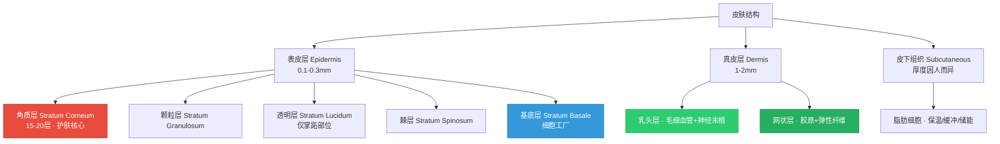
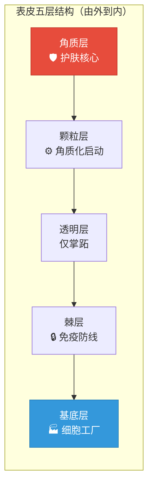
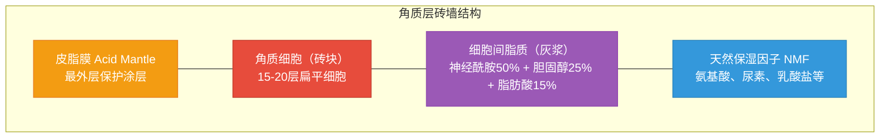
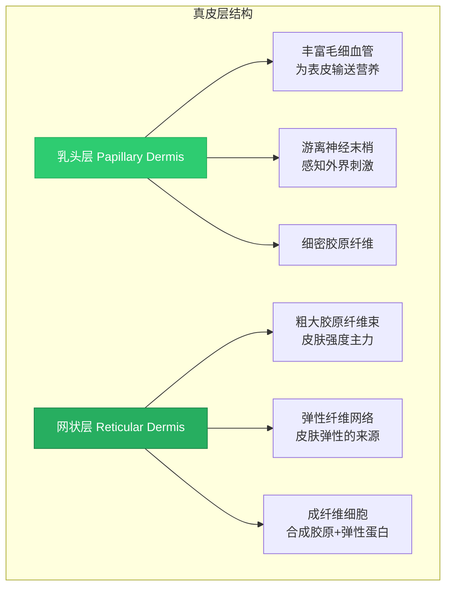
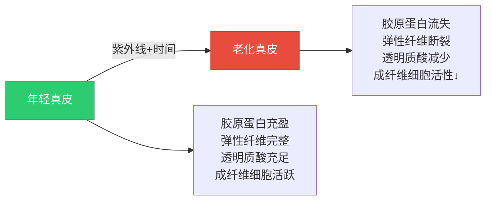
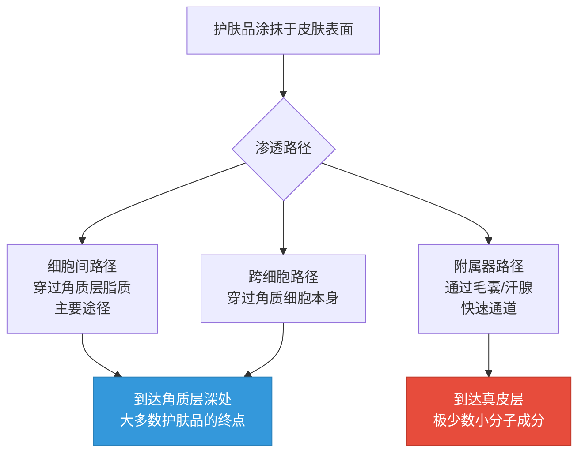
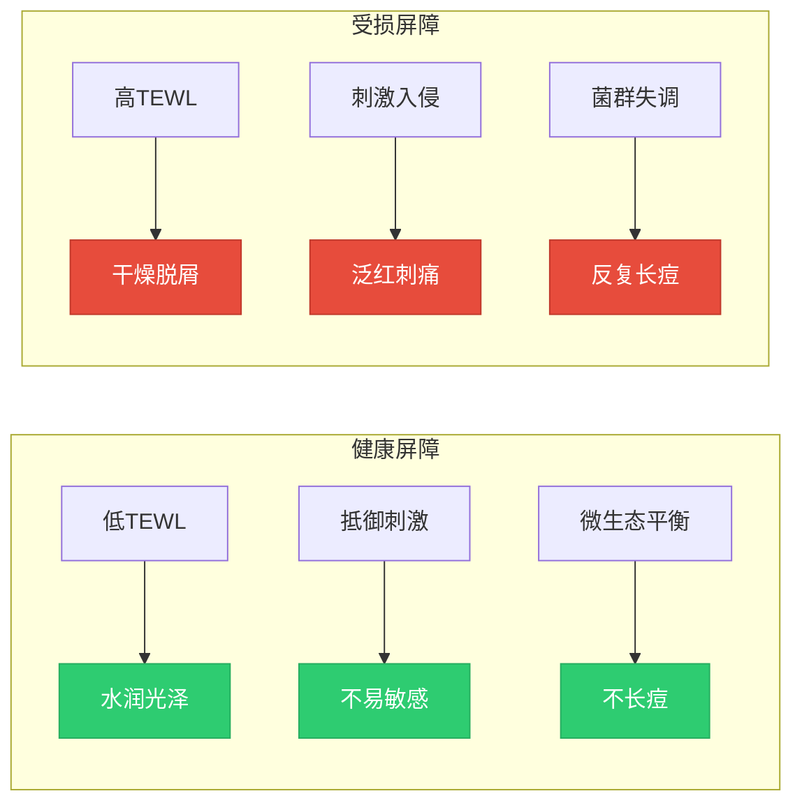
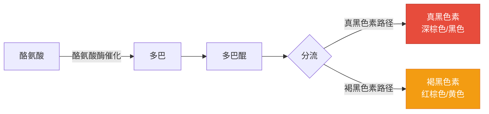

## 一、皮肤的结构

要科学护肤，首先需要了解皮肤的基本结构。皮肤并非一层简单的"膜"，而是一个由多层组织构成的复杂器官，总厚度约为0.5-4毫米（因部位而异）。皮肤是人体最大的器官，成年人的皮肤总面积约1.5-2平方米，重量约占体重的16%。皮肤由外到内分为三层：**表皮层、真皮层、皮下组织**。

### 1.0 皮肤结构总览

在深入每一层之前，先建立一个整体认知框架：

**关键数据速查表：**

| 结构层 | 厚度 | 主要功能 | 护肤相关性 |
|--------|------|----------|------------|
| 角质层 | 10-15μm | 屏障防御 | ★★★★★ 直接接触护肤品 |
| 颗粒层 | 几层细胞 | 角质化启动 | ★★★★ 屏障形成起点 |
| 棘层 | 表皮最厚层 | 免疫+机械强度 | ★★★ 免疫防线 |
| 基底层 | 单层细胞 | 细胞分裂+色素生成 | ★★★★ 色斑根源 |
| 真皮层 | 1-2mm | 弹性+紧致度 | ★★★★★ 老化核心 |
| 皮下组织 | 因人而异 | 保温+缓冲 | ★★ 轮廓塑形 |

### 1.1 表皮层（Epidermis）

表皮是皮肤最外层，厚度约0.1-0.3毫米，是护肤产品直接作用的区域。表皮本身又分为五层（由内到外）：

#### （1）基底层（Stratum Basale）

基底层位于表皮最底部，是整个表皮的"发动机"。理解基底层是理解护肤很多问题的起点——无论是色斑、痘印还是皮肤更新，都从这里开始。

**核心功能：**

- **细胞分裂与更新**：基底细胞（Keratinocytes）不断进行有丝分裂，产生新的角质形成细胞。新生细胞从基底层向上推移，约28天完成一个更新周期（这就是"28天焕肤周期"的来源）。这个周期并非固定不变——25岁时可能只需要24-26天，而40岁时可能延长到35-40天。护肤品中的果酸、水杨酸等成分的作用原理之一，就是加速这个更新周期
- **黑色素生成**：基底层含有**黑色素细胞**（Melanocytes），通过酪氨酸酶催化反应产生黑色素。黑色素的本职工作是保护皮肤免受紫外线伤害，但当生成过多或分布不均时，就会形成色斑、痘印。美白成分（如烟酰胺、熊果苷、377等）的作用靶点主要就在这里
- **默克尔细胞**（Merkel cells）：负责感知轻微的触觉刺激，数量随年龄增长而减少，这与老年人触觉敏感度下降有关
- **基底膜带**（Basement Membrane Zone）：这层半透膜结构连接表皮与真皮，是营养物质从真皮向上输送、信号分子上下传递的关键通道。随着年龄增长，基底膜带会逐渐变平，导致表皮-真皮连接减弱，皮肤变薄、营养供应不足

**护肤意义：** 基底层是皮肤更新的源头。维持基底层的健康活性，是抗衰老、改善肤色的根本。维A酸类成分能直接作用于基底层细胞的受体，促进细胞更新和胶原合成，这也是为什么视黄醇被称为"抗老金标准"。

#### （2）棘层（Stratum Spinosum）

棘层由4-8层多角形细胞组成，是表皮中最厚的一层。

**核心功能：**

- **细胞间连接**：细胞之间通过桥粒（Desmosomes）连接，形成"棘突"状结构，为皮肤提供机械强度。这些桥粒就像"铆钉"一样把细胞固定在一起
- **免疫防御**：棘层中含有**朗格汉斯细胞**（Langerhans cells），这是皮肤免疫系统的重要组成部分，负责识别和呈递外来抗原，相当于皮肤的"巡逻兵"
- **脂质前体合成**：棘层细胞开始合成**层板颗粒**（Lamellar Bodies），这些颗粒会在后续的角质化过程中释放脂质，形成细胞间脂质层——这就是"砖墙结构"中"灰浆"的来源

**护肤意义：** 棘层的健康直接影响皮肤的免疫能力和屏障脂质的正常合成。过度去角质（频繁刷酸、使用磨砂膏）会损伤棘层，导致免疫功能下降和屏障脂质合成不足。

#### （3）颗粒层（Stratum Granulosum）

颗粒层由2-3层扁平细胞组成，是从"活细胞"到"死细胞"的过渡区域。

**核心功能：**

- **角质化启动**：细胞内含有**透明角质颗粒**（Keratohyalin Granules），标志着角质化的正式开始
- **丝聚蛋白释放**：颗粒层细胞会释放**丝聚蛋白**（Filaggrin），这是角质层中天然保湿因子（NMF）的前体物质。丝聚蛋白的降解产物（如尿刊酸、吡咯烷酮羧酸等）是角质层天然保湿因子的重要组成部分
- **脂质屏障形成**：层板颗粒在此层释放其内容物（神经酰胺、胆固醇、脂肪酸），填充到细胞间隙中，开始构建"砖墙结构"的"灰浆"

**护肤意义：** 丝聚蛋白基因突变是特应性皮炎（湿疹）的重要遗传因素。对于普通人来说，颗粒层的正常运作保证了角质层有充足的天然保湿因子。干燥环境、过度清洁都会加速NMF的流失。

#### （4）透明层（Stratum Lucidum）

- 仅存在于手掌、脚掌等角质层较厚的部位
- 面部皮肤基本不含有透明层
- 由2-3层扁平、无核、嗜酸性的细胞组成
- 这层结构在掌跖部位起到额外的物理防护作用

透明层在面部护肤中几乎没有直接意义，了解即可。

#### （5）角质层（Stratum Corneum）——护肤的核心关注区域

角质层是护肤的第一战场。绝大多数护肤品的作用靶点都在角质层，屏障功能的核心也在这里。

**"砖墙结构"详解：**

- 由15-20层扁平的角质细胞组成，是皮肤屏障的主体
- 角质细胞之间由**脂质**（神经酰胺、胆固醇、脂肪酸）填充，形成"砖墙结构"
  - 角质细胞 = 砖块
  - 细胞间脂质 = 灰浆
  - 皮脂膜 = 墙面涂料
- **"砖墙结构"的完整性决定了皮肤屏障功能的强弱**
- 当屏障受损时，皮肤会出现干燥、敏感、泛红、刺痛等问题
- 角质层的脂质成分中，神经酰胺约占50%，胆固醇约占25%，游离脂肪酸约占15%
- 这三种脂质的比例对屏障功能至关重要——任何一种的比例失调都可能导致屏障功能下降

**天然保湿因子（NMF）：** 角质层中的天然保湿因子是一组水溶性低分子量物质，包括氨基酸（约40%）、吡咯烷酮羧酸（约12%）、乳酸盐（约12%）、尿素（约7%）、无机离子（约18%）等。这些成分共同作用，能从环境中吸收水分并将其锁定在角质层中。NMF的含量直接影响皮肤的含水量和柔软度。

**护肤品渗透的现实：** 大多数护肤品成分只能渗透到角质层。能够穿过基底膜带进入真皮层的成分非常有限（如小分子透明质酸、部分维A酸衍生物）。这也是为什么护肤品的效果往往需要长期使用才能显现——它们主要作用于角质层，而角质层本身会不断更新脱落。

#### 皮脂膜（Acid Mantle）

皮脂膜覆盖在角质层最外层，是皮肤的"第一道防线"。

**组成成分：**
- 皮脂腺分泌的皮脂
- 汗腺分泌的汗液
- 角质细胞降解产物
- 表皮脂质

**功能与特性：**

- 呈弱酸性（pH 4.5-6.5），这个酸性环境能抑制有害细菌生长，维持皮肤微生态平衡
- 皮脂膜中的**游离脂肪酸**（如油酸、棕榈酸）具有天然的抗菌作用
- 皮脂膜还能吸收紫外线中的部分UVB，起到一定的光防护作用
- 皮脂的组成包括：甘油三酯（约40%）、蜡酯（约25%）、角鲨烯（约12%）、胆固醇酯（约5%）等
- **角鲨烯**是人类皮脂中特有的成分，也是护肤品中角鲨烷的天然来源

**护肤意义：** 过度清洁（特别是使用皂基洗面奶）会破坏皮脂膜的酸性环境，导致pH值升高，有害菌增殖，屏障功能下降。这也是为什么氨基酸洗面奶比皂基洗面奶更温和——氨基酸体系的pH值接近皮肤天然酸碱度。

### 1.2 真皮层（Dermis）

真皮位于表皮之下，厚度约1-2毫米，是皮肤弹性和紧致度的决定性因素。如果说表皮决定了皮肤的"表面状态"（光滑度、水润度、肤色），那么真皮决定了皮肤的"内在质量"（弹性、紧致度、皱纹深度）。

真皮分为**乳头层**（Papillary Dermis）和**网状层**（Reticular Dermis）两部分。

#### 真皮层的核心成分

**胶原蛋白（Collagen）——皮肤的"钢筋"**

占真皮干重的70-80%，提供皮肤的结构支撑和强度。人体皮肤中主要含有I型胶原（约80%）和III型胶原（约15%）。胶原蛋白由成纤维细胞合成，其合成过程需要维生素C作为辅因子——这就是口服维生素C有助于皮肤健康的原因。

| 胶原蛋白类型 | 占比 | 功能 | 与护肤的关系 |
|-------------|------|------|-------------|
| I型胶原 | ~80% | 提供抗张强度 | 皱纹深度的决定因素 |
| III型胶原 | ~15% | 提供弹性 | 婴儿皮肤含量高，随年龄下降 |
| 其他类型 | ~5% | 辅助结构 | 基底膜带等特殊位置 |

**胶原蛋白的生命周期：** 随着年龄增长，胶原蛋白的合成速度下降（每年约减少1%），降解速度增加（基质金属蛋白酶MMP活性增加），导致净含量逐渐减少。25岁以后，真皮中的胶原蛋白开始"入不敷出"，这是皮肤老化的根本原因之一。

**弹性蛋白（Elastin）——皮肤的"弹簧"**

赋予皮肤弹性，使皮肤在拉伸后能恢复原状。弹性蛋白的含量虽然远低于胶原蛋白（约占真皮干重的2-5%），但对皮肤的弹性至关重要。弹性蛋白的降解是皮肤松弛和弹性丧失的主要原因之一。紫外线会显著加速弹性蛋白的降解——这就是为什么光老化会导致皮肤松弛下垂。

**透明质酸/玻尿酸（Hyaluronic Acid）——皮肤的"海绵"**

真皮中的天然保湿因子，1克透明质酸可吸收约1000克水分。透明质酸不仅具有保湿功能，还参与细胞信号传导、组织修复和炎症调节。真皮中的透明质酸半衰期约为24小时，不断被合成和降解。随着年龄增长，透明质酸含量逐渐减少，这也是老年皮肤干燥的原因之一。

**成纤维细胞（Fibroblasts）——真皮的"工厂细胞"**

负责合成胶原蛋白、弹性蛋白和透明质酸。成纤维细胞的活性受到多种因素影响：
- **年龄**：活性随年龄增长而下降
- **紫外线**：UVA能穿透到真皮层，直接损伤成纤维细胞
- **营养状态**：维生素C是胶原合成的必需辅因子
- **生长因子**：EGF、FGF等能刺激成纤维细胞增殖
- **维A酸**：能刺激成纤维细胞增加胶原蛋白合成，这也是其抗老作用的核心机制

**基质（Ground Substance）**

一种凝胶状物质，填充在胶原纤维和弹性纤维之间，主要由透明质酸、蛋白聚糖和糖胺聚糖组成，为细胞提供营养和代谢废物的交换环境。

#### 真皮层中的其他重要结构

- **血管**：为皮肤提供营养和氧气，真皮乳头层含有丰富的毛细血管网。真皮血管还参与体温调节——当体温升高时，真皮血管扩张，增加散热。这也是为什么运动后脸色会发红
- **神经末梢**：感知触觉（梅斯纳小体和默克尔细胞）、温度（鲁菲尼小体）、疼痛（游离神经末梢）。真皮中还有帕奇尼小体，负责感知深压和振动
- **毛囊和皮脂腺**：皮脂腺分泌皮脂，过多分泌会导致油光和痤疮。皮脂腺的活性受雄激素（特别是二氢睾酮）调控，这也是青春期容易长痘的原因之一
- **汗腺**：分为小汗腺（调节体温）和大汗腺（与体味有关）。小汗腺分布全身，大汗腺主要分布在腋下、会阴等部位
- **肥大细胞**（Mast Cells）：参与过敏反应和炎症反应，释放组胺等介质

#### 真皮层与抗衰老

理解真皮层结构，是理解抗衰老护肤的关键：

这就是为什么防晒是抗衰老的第一步——UVA能穿透表皮到达真皮层，直接破坏胶原蛋白和弹性纤维。而视黄醇、维生素C、胜肽等抗老成分的作用靶点，主要就是刺激成纤维细胞或抑制胶原降解。

### 1.3 皮下组织（Subcutaneous Tissue）

- 主要由脂肪细胞组成，起到保温、缓冲、储能的作用
- 厚度因人而异，面部皮下脂肪的分布影响面部轮廓
- 护肤产品一般不会渗透到这一层
- 皮下组织中的脂肪细胞以**脂肪小叶**（Adipose Lobules）的形式排列，由结缔组织分隔
- 面部不同区域的皮下脂肪厚度差异很大，这也是面部各区域外观差异的原因之一
- 皮下组织中还含有较大的血管和神经，以及**环层小体**（Pacinian Corpuscles）等感受器

**皮下组织与面部老化：** 随着年龄增长，面部皮下脂肪会发生重分布和萎缩。具体表现为：
- 额部脂肪垫下移，导致眉下垂
- 眶隔脂肪萎缩，导致眼窝凹陷
- 颊脂垫下移，导致法令纹加深
- 下颌脂肪堆积，形成"双下巴"

这些变化是面部衰老的重要原因，单纯的护肤品无法逆转——需要通过医美手段（如玻尿酸填充、脂肪移植）来改善。

### 1.4 皮肤附属器

除了上述三层主要结构外，皮肤还有多种附属器结构，了解这些结构对护肤也很重要：

**毛囊（Hair Follicles）**
- 毛囊是皮肤中的一种管状结构，毛发从中生长出来
- 毛囊壁含有丰富的干细胞，参与皮肤损伤后的修复
- 毛囊是护肤品渗透的"快速通道"之一（附属器路径）
- 毛囊口堵塞是痤疮形成的重要原因之一
- 毛囊的生长周期分为生长期（Anagen，2-6年）、退行期（Catagen，2-3周）和休止期（Telogen，3-4个月）

**皮脂腺（Sebaceous Glands）**
- 大多数皮脂腺与毛囊相连，分泌皮脂到毛囊口
- 面部（特别是T区）的皮脂腺密度最高、最活跃
- 皮脂腺的大小和活性受激素（特别是雄激素）调控
- 皮脂分泌过多是油性皮肤和痤疮的主要原因之一
- 皮脂腺分泌的皮脂中含有**角鲨烯**，氧化后的角鲨烯可能是痤疮炎症的诱因之一

**汗腺（Sweat Glands）**
- 小汗腺（Eccrine Glands）：遍布全身，主要功能是调节体温
- 大汗腺（Apocrine Glands）：主要分布在腋下、会阴等部位，与体味有关
- 汗液中的水分蒸发有助于散热，汗液中的乳酸和尿素也是天然保湿因子的组成部分

**指甲（Nails）**
- 由角质化的甲板组成，生长速度约每月3mm
- 指甲的健康状态可以反映整体营养状况

### 1.5 护肤品如何渗透皮肤？

理解皮肤结构后，一个自然的问题是：护肤品涂在脸上，到底去了哪里？

**各层能被什么成分到达：**

| 皮肤层次 | 可到达的成分 | 作用方式 |
|----------|-------------|----------|
| 皮脂膜 | 所有外用产品 | 直接接触 |
| 角质层 | 大多数保湿、屏障修复成分 | 滋润、封闭、补充脂质 |
| 活性表皮层 | 烟酰胺、小分子透明质酸、部分美白成分 | 渗透发挥作用 |
| 真皮层 | 极少数成分：小分子透明质酸、维A酸衍生物、部分胜肽 | 刺激成纤维细胞、信号传导 |

**渗透深度的决定因素：**
- **分子量**：分子量小于500道尔顿的成分更容易渗透
- **脂溶性**：脂溶性成分更容易穿过角质层的脂质屏障
- **浓度梯度**：浓度越高，渗透驱动力越大
- **角质层状态**：屏障受损时渗透增加（但也意味着刺激风险增加）
- **促渗技术**：脂质体包裹、纳米载体等技术能帮助成分渗透

### 1.6 皮肤屏障功能——护肤的核心概念

#### 为什么屏障功能如此重要？

皮肤屏障是皮肤健康的基础。它的主要功能包括：

1. **防止水分流失**（TEWL，经皮水分流失）：健康屏障能将TEWL控制在较低水平。TEWL是衡量屏障功能的金标准指标——数值越低，屏障越好
2. **抵御外界刺激**：阻挡细菌、污染物、过敏原的入侵
3. **抵御紫外线**：虽然主要靠黑色素和角质层，但屏障完整性也起辅助作用
4. **维持皮肤微生态平衡**：健康的屏障有助于维持皮肤表面有益菌群的平衡
5. **防止机械损伤**：角质层提供物理防护，抵抗摩擦、压力等机械刺激
6. **免疫监视**：皮肤中的免疫细胞（如朗格汉斯细胞）能识别和应对入侵的病原体

#### 屏障受损的表现

- 洗脸后皮肤紧绷、干燥
- 使用护肤品时有刺痛、灼热感
- 皮肤容易泛红、发痒
- 外油内干（皮脂分泌旺盛但水分不足）
- 反复长痘、闭口
- 皮肤对环境变化（如温度、湿度）异常敏感
- 原本耐受的产品突然变得刺激
- 皮肤暗沉、粗糙、缺乏光泽

#### 屏障受损的常见原因

| 原因 | 机制 | 典型场景 |
|------|------|----------|
| 过度清洁 | 溶解皮脂膜+细胞间脂质 | 皂基洗面奶、频繁洗脸 |
| 过度去角质 | 物理/化学剥脱角质层 | 频繁刷酸、磨砂膏 |
| 高浓度功效成分 | 破坏角质层完整性 | 高浓度维A酸、果酸 |
| 紫外线损伤 | 降解脂质+损伤细胞 | 不防晒或防晒不足 |
| 环境因素 | 加速水分流失 | 干燥、寒冷、空调房 |
| 精神压力 | 皮质醇升高影响屏障修复 | 长期高压、睡眠不足 |
| 不当医美 | 过度损伤角质层 | 过度激光、频繁刷酸 |

#### 屏障修复的方法

**修复原则：停、简、修、等**

1. **停**：停用一切刺激性产品（酸类、高浓度维A醇、酒精含量高的产品）
2. **简**：简化护肤流程，只做基础的清洁-保湿-防晒
3. **修**：使用含有屏障修复成分的产品
4. **等**：给皮肤时间，屏障修复通常需要4-8周

**屏障修复的关键成分：**

| 成分 | 作用 | 产品示例 |
|------|------|----------|
| 神经酰胺 | 补充细胞间脂质的核心成分 | CeraVe保湿乳 |
| 胆固醇 | 与神经酰胺协同修复脂质层 | 理肤泉B5修复霜 |
| 脂肪酸 | 补充"灰浆"的第三种成分 | 凡士林（封闭） |
| 角鲨烷 | 模拟皮脂，温和封闭 | Haba角鲨烷油 |
| 泛醇（B5） | 促进屏障修复，舒缓炎症 | 理肤泉B5精华 |
| 积雪草提取物 | 促进伤口愈合，抗炎 | 薇诺娜特护霜 |

### 1.7 皮肤微生态（Skin Microbiome）

近年来，皮肤微生态成为护肤领域的研究热点。了解皮肤微生态有助于更全面地理解皮肤健康。

#### 什么是皮肤微生态？

- 皮肤表面生活着数以亿计的微生物，包括细菌、真菌、病毒和螨虫
- 这些微生物与皮肤共同构成一个"生态系统"
- 健康皮肤上的微生物群落具有多样性，有益菌和有害菌保持平衡
- 主要的皮肤细菌包括：表皮葡萄球菌（有益）、痤疮丙酸杆菌（条件致病）、棒状杆菌等

#### 皮肤微生态与护肤的关系

- 健康的微生态有助于抑制有害菌的生长，减少感染和炎症
- 微生态失调（如痤疮丙酸杆菌过度增殖）与痤疮、湿疹等皮肤问题有关
- 过度清洁和使用抗菌产品可能破坏微生态平衡
- 益生菌（Probiotics）和益生元（Prebiotics）护肤是新兴的研究方向
- 一些护肤品开始添加益生元（如α-葡聚糖寡糖）来支持皮肤有益菌的生长

### 1.8 皮肤的色素系统

理解色素系统对于解决色斑、痘印、肤色不均等问题至关重要。

**黑色素的生成过程：**

**关键知识点：**
- 黑色素细胞位于基底层，通过树突将黑色素传递给周围的角质形成细胞
- 每个黑色素细胞大约"服务"36个角质形成细胞，形成一个"表皮黑色素单元"
- 亚洲人的黑色素细胞产生的主要是真黑色素（Eumelanin），这也是亚洲人肤色偏黄的原因
- 色斑的形成 = 黑色素生成过多 + 分布不均 + 代谢缓慢
- 美白成分的作用靶点：抑制酪氨酸酶活性（熊果苷、377）、阻断黑色素转运（烟酰胺）、加速黑色素代谢（果酸、维A酸）

### 1.9 皮肤老化的结构变化

理解皮肤老化的结构变化，是制定抗衰老策略的基础：

| 年龄段 | 表皮变化 | 真皮变化 | 皮下组织变化 |
|--------|----------|----------|-------------|
| 20-25岁 | 更新周期正常（24-28天） | 胶原蛋白开始缓慢流失 | 脂肪分布均匀 |
| 25-30岁 | 更新周期开始延长 | 胶原蛋白每年减少约1% | 脂肪垫开始轻微下移 |
| 30-35岁 | 皮肤开始变薄 | 弹性纤维开始退化 | 法令纹区域脂肪萎缩 |
| 35-40岁 | 色素沉着增加 | 胶原蛋白明显减少 | 面部轮廓开始改变 |
| 40岁以上 | 更新周期显著延长（35-40天） | 真皮变薄、弹性丧失 | 脂肪重分布明显 |

**内源性老化 vs 外源性老化：**

- **内源性老化**（自然老化）：由基因决定，表现为细纹、皮肤变薄、弹性下降，过程缓慢均匀
- **外源性老化**（光老化为主）：由紫外线、污染、吸烟等外部因素引起，表现为深皱纹、色斑、皮肤粗糙，过程不均匀——曝光部位比遮挡部位老得快得多

这就是为什么防晒被称为"最便宜的抗衰老手段"——它能阻止外源性老化，让皮肤只经历自然老化过程。

***

## 本节小结

理解皮肤结构是科学护肤的起点。核心要点回顾：

1. **角质层是护肤的第一战场**——大多数护肤品作用于此，屏障功能是皮肤健康的基础
2. **基底层是皮肤更新的源头**——色斑、痘印、肤色问题的根源在这里
3. **真皮层决定皮肤的"内在质量"**——胶原蛋白、弹性蛋白、透明质酸是抗衰老的核心
4. **皮脂膜是皮肤的第一道防线**——过度清洁是屏障受损的首要原因
5. **防晒是抗衰老的第一步**——UVA能穿透到真皮层，直接破坏胶原蛋白和弹性纤维

接下来，我们将深入了解**肤质类型与判断方法**，帮助你根据自己的肤质制定个性化的护肤方案。
