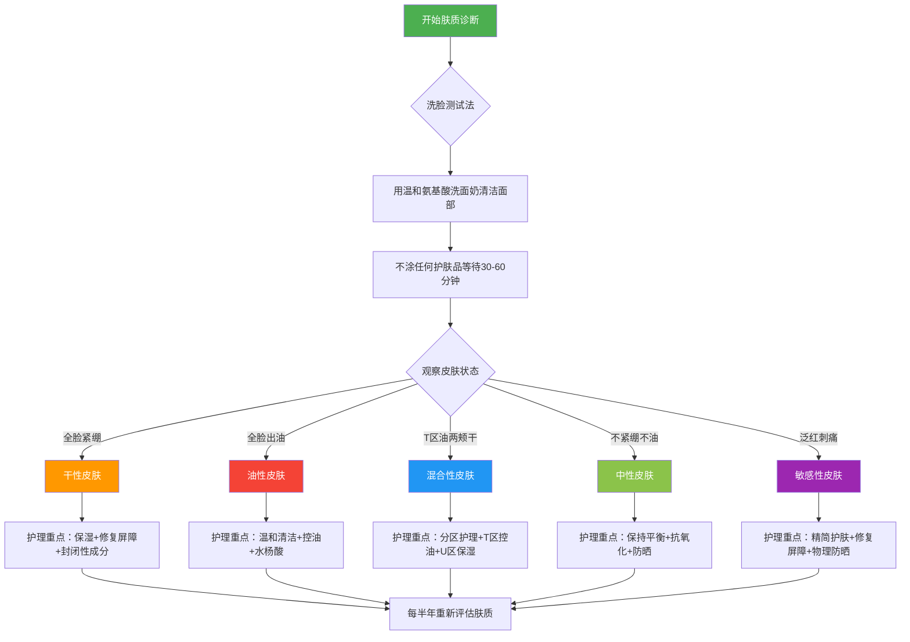

## 二、肤质类型与判断方法

护肤的第一步，不是买产品，而是**搞清楚自己的皮肤是什么类型**。用错产品比不用产品更糟糕——干性皮肤的人用了强效控油洗面奶，油性皮肤的人糊上厚重面霜，都是在给皮肤帮倒忙。正如皮肤科医生常说的："没有最好的护肤品，只有最适合你肤质的护肤品。"

本节将从三个维度系统展开：首先介绍国际通用的**Baumann肤质分类体系**和国内常用的**五型分类法**，帮助你建立完整的认知框架；然后提供四种由简入繁的**实操判断方法**，让你能准确识别自己的肤质；最后讨论肤质的**动态变化规律**和**常见认知误区**，避免把肤质当成一成不变的标签。

读完后，你应该能准确判断自己的肤质类型和状态组合，并知道后续护肤方案该往哪个方向走。

### 2.0 皮肤类型诊断流程图

### 2.1 两大分类体系：建立完整认知框架

市面上关于肤质的分类方法很多，但国际上真正有系统性研究支撑的主要有两套体系。理解这两套体系，能帮你更立体地认识自己的皮肤。

#### 五型分类法（最常用）

这是皮肤科临床和日常护肤中最广泛使用的分类方式，将皮肤按**皮脂分泌量**和**角质层含水量**两个核心维度划分为五种基本类型：

| 肤质类型 | 核心特征 | 皮脂分泌 | 角质层含水量 | 毛孔状态 | 高发问题 |
|---------|------|---------|---------|------|---------|
| **干性皮肤** | 紧绷、脱皮、细纹早现 | 少（<0.5μg/cm²） | 低（<10%） | 细小不明显 | 干燥脱屑、细纹、屏障受损 |
| **油性皮肤** | 全脸油光、易长痘 | 多（>1.5μg/cm²） | 正常或偏高 | 粗大明显 | 痤疮、黑头、毛孔粗大 |
| **中性皮肤** | 水油平衡、状态稳定 | 适中（0.5-1.5μg/cm²） | 适中（15-20%） | 细小 | 问题较少 |
| **混合性皮肤** | T区油、U区干 | 区域差异大 | 区域差异大 | T区较大 | 分区失衡、护理复杂 |
| **敏感性皮肤** | 泛红、刺痛、不耐受 | 不定 | 偏低 | 不定 | 过敏、红血丝、灼热感 |

> **重要认知**：敏感性皮肤严格来说不是一种"肤质类型"，而是一种"皮肤状态"。任何肤质——干性、油性、混合性——都可能叠加敏感状态。比如"油性敏感肌"就是油性肤质+敏感状态的组合，护理时需要同时兼顾控油和修复屏障。国际研究（2019年发表在《Journal of the European Academy of Dermatology and Venereology》）显示，约60-70%的女性自我报告为敏感肌，但经临床验证的实际比例约为30-40%，说明很多人会误判。

#### Baumann皮肤类型分类系统（16型）

美国皮肤科医生Leslie Baumann在2004年提出的**Baumann Skin Type Indicator（BSTI）**是目前最系统化的肤质分类框架。它从**四个维度**对皮肤进行编码，每个维度两个极端，组合出16种肤质类型：

| 维度 | 两个极端 | 缩写 | 判断依据 |
|------|---------|------|---------|
| **油性 vs 干性** | Oily / Dry | O / D | 皮脂分泌量 + 角质层含水量 |
| **敏感 vs 耐受** | Sensitive / Resistant | S / R | 屏障完整性 + 神经反应性 |
| **色素沉着 vs 非色素沉着** | Pigmented / Non-pigmented | P / N | 色素沉着倾向 + 色斑易发程度 |
| **皱纹 vs 紧致** | Wrinkled / Tight | W / T | 光老化程度 + 皮肤弹性 |

四个字母的组合就是你的皮肤类型，例如：
- **OSPW**：油性、敏感、有色沉、有皱纹——最常见的"问题肌肤"类型
- **DRNT**：干性、耐受、无色沉、紧致——最理想的皮肤状态
- **OSPT**：油性、敏感、有色沉、紧致——年轻油痘肌的典型编码

> **Baumann系统的价值**：它不只告诉你"你是什么肤质"，而是告诉你"你的皮肤在哪些方面需要关注"。比如同样是油皮，OSPW和OSTW的护理方案完全不同——前者需要同时关注色沉和皱纹，后者只需要关注皱纹预防。建议有条件的读者可以做一次Baumann官方问卷（英文，免费版本网上可搜到），获得自己的四维编码。

#### 亚洲人皮肤的特殊性

大部分皮肤研究以欧美人群为样本，但亚洲人的皮肤有一些独特的生理特征，直接影响肤质判断和护理策略：

| 特征 | 与高加索人种对比 | 护肤意义 |
|------|----------------|---------|
| **角质层更厚** | 平均厚约15-20层 vs 欧美人约10-15层 | 对物理去角质的耐受性稍强，但化学去角质仍需谨慎 |
| **黑色素细胞更活跃** | 基底层数量相当但合成效率更高 | 更容易产生色沉和色斑，紫外线防护需求更高 |
| **皮脂腺密度较低** | 面部皮脂分泌量平均低10-20% | 干性和混合偏干的比例更高 |
| **真皮胶原密度较高** | 同年龄段胶原纤维更致密 | 皱纹出现较晚，但一旦出现则较深（法令纹尤其明显） |
| **经皮水分流失（TEWL）较低** | 屏障功能相对更强 | 皮肤整体耐受性较好，但不代表不会敏感 |
| **毛孔形状更圆** | 椭圆vs圆形 | 黑头更容易形成"火山口"状突起 |

这些差异意味着：直接照搬欧美护肤博主的推荐不一定合适。例如，亚洲干性皮肤的人可能不需要欧美那种极厚重的封闭剂（如纯凡士林厚涂），而更需要轻薄但高效的保湿组合。

### 2.2 五种基本肤质深入分析

#### 干性皮肤（Dry Skin）

**核心问题**：皮脂分泌不足 + 角质层含水量低，导致皮肤屏障功能薄弱。

**成因拆解**：
- **内在因素**：皮脂腺功能较弱，天然保湿因子（NMF）合成不足，角质层"砖墙结构"中的"灰浆"（神经酰胺、胆固醇、游离脂肪酸等细胞间脂质）不够致密，经皮水分流失（TEWL）偏高
- **外在因素**：干燥寒冷气候、低湿度环境（空调房是重灾区）、过度清洁破坏皮脂膜
- **年龄因素**：皮脂分泌量在20岁左右达到峰值，之后逐年下降。女性绝经后雌激素骤降，皮脂分泌可再减少30-50%，这也是为什么很多女性在50岁后感觉皮肤"突然变干"
- **遗传因素**：部分人天生皮脂腺密度低、活性弱
- **药物因素**：异维A酸（泰尔丝）会将皮脂腺缩小60-80%，是药物性干皮的典型原因；某些降压药（利尿剂）、抗组胺药也会导致皮肤干燥

**典型场景**：洗完脸不涂东西，15分钟内脸颊就开始紧绷；秋冬季节小腿和手臂出现蛇皮纹；涂粉底容易卡粉起皮；眼角、嘴角等表情丰富区域容易出现干纹。

**屏障功能量化指标**：
- TEWL值（经皮水分流失）：干性皮肤通常 >15 g/m²/h（正常应 <10 g/m²/h）
- 角质层含水量：干性皮肤通常 <10%（正常应 15-20%）
- 这两个指标在皮肤科仪器检测中可以直接测量，居家判断用"洗脸测试法"（见2.3节）即可

**护理要点**：
1. 洁面选择氨基酸或葡糖苷类表活，远离皂基。推荐成分：椰油酰甘氨酸钾、月桂酰谷氨酸钠、癸基葡糖苷
2. 洗脸水温不超过37°C，热水会加速皮脂流失
3. 洗完脸3分钟内涂保湿——皮肤微湿时涂抹，锁水效果最好
4. 保湿三层次（缺一不可）：
   - **吸湿剂**（抓水层）：透明质酸、甘油、尿素、吡咯烷酮羧酸钠（PCA-Na），从环境中和皮肤深层抓取水分
   - **润肤剂**（填充层）：角鲨烷、霍霍巴油、辛酸/癸酸甘油三酯，填充角质细胞间的空隙
   - **封闭剂**（锁水层）：凡士林、矿脂、聚二甲基硅氧烷，在皮肤表面形成疏水膜
5. 重点补充屏障成分：神经酰胺、胆固醇、脂肪酸，比例接近**3:1:1**（摩尔比）最佳——这个比例是2006年发表在《British Journal of Dermatology》上的经典研究确定的，最接近皮肤天然脂质组成
6. 避免含酒精的爽肤水和强效去角质产品
7. 夜间可使用含维A醇（视黄醇）的产品，促进角质层正常化和胶原合成，但干皮需从低浓度（0.025%）起步，建立耐受后再逐步提高

**干性皮肤的常见陷阱**：
- **只涂水不涂油**：很多人用了保湿爽肤水就觉得够了，但水性保湿剂如果不配合封闭剂，蒸发时反而会带走皮肤自身水分（这叫"反向蒸发"）
- **过度依赖面膜**：天天敷面膜看似补水，实际上频繁的角质层水合会破坏屏障结构，建议每周2-3次即可
- **忽略身体皮肤**：面部护理做得好但身体干到起皮，别忘了身体也需要沐浴后3分钟内涂身体乳

#### 油性皮肤（Oily Skin）

**核心问题**：皮脂腺分泌旺盛，面部持续产油。

**成因拆解**：
- **激素主导**：雄激素（尤其是二氢睾酮/DHT）是皮脂腺的"油门踏板"。青春期雄激素水平上升，皮脂分泌随之暴增；月经前黄体酮升高也会短暂增加出油；多囊卵巢综合征（PCOS）患者常伴有异常的油性皮肤和痤疮
- **饮食影响**：高GI食物（白米饭、甜食、奶茶）会升高胰岛素水平，间接促进皮脂分泌。研究显示低GI饮食8周后，皮脂分泌量可降低约20%（2007年《American Journal of Clinical Nutrition》）
- **环境因素**：温度每升高1°C，皮脂分泌量增加约10%。这就是为什么夏天脸比冬天油得多。湿度也有影响——极端干燥环境下，皮肤可能代偿性出油
- **遗传决定上限**：皮脂腺的大小和数量主要由基因决定（研究估计遗传贡献率约50-60%），后天能改变的是分泌量的波动范围
- **压力与皮脂的关系**：皮质醇（压力激素）能直接刺激皮脂腺细胞上的受体，增加脂质合成。长期高压状态下，痤疮反复发作往往与皮质醇水平持续偏高有关

**一个容易被忽略的好处**：皮脂含有角鲨烯和维生素E，有一定的抗氧化和光防护作用。油性皮肤的人通常比同龄干性皮肤的人晚5-10年出现明显皱纹。所以"爱出油"不全是坏事——从抗衰老角度看，油皮是有先天优势的。

**典型场景**：早上洗完脸，中午T区就能"煎蛋"；粉底液到下午就斑驳脱妆；鼻头黑头反复长，挤了又来；枕头套每周不换就有明显黄渍。

**护理要点**：
1. **千万不要过度清洁**——这是油皮最容易犯的错。一天洗脸超过2次、使用皂基洁面、频繁使用清洁面膜，都会破坏皮脂膜，反而刺激皮脂腺"报复性出油"。皮肤科研究证实，过度清洁后皮脂腺的代偿性分泌可在2-4周内达到原来的1.5-2倍
2. 温和清洁 + 清爽保湿的组合才是正道。即使是油皮，也需要保湿——油脂≠水分
3. 水杨酸（BHA）2%浓度是油皮的好朋友：脂溶性，能深入毛孔溶解油脂和角栓，还能轻微抗炎。使用频率从每周2次开始，逐步增加到每天1次
4. 烟酰胺（维生素B3）控油+缩毛孔+提亮，一举三得，建议浓度2-5%。注意少数人对烟酰胺不耐受（会泛红），可从2%起步建立耐受
5. 防晒选择化学防晒或控油型物理防晒，避免厚重的纯物理防晒霜。含硅粉体的防晒能吸附多余油脂，一举两得
6. 每周1-2次泥膜（高岭土/膨润土）吸附深层油脂，但不要天天用
7. 吸油纸可以用，但不要过于频繁——轻轻按压代替擦拭，避免拉扯皮肤

**油性皮肤的常见陷阱**：
- **"洗到涩感才干净"**：涩感是皮脂膜被完全破坏的信号，不是"洗干净"的标志
- **拒绝一切油脂类护肤品**：荷荷巴油、角鲨烷等"好油脂"反而能帮助调节皮脂分泌，因为它们在化学结构上与人体皮脂相似，能给皮脂腺发送"已经够油了"的信号
- **只控油不抗炎**：油皮的核心困扰往往是痤疮，而痤疮的本质是炎症。只控油不处理炎症，治标不治本

#### 中性皮肤（Normal Skin）

**核心特征**：皮脂分泌和水分含量处于理想平衡区间。

中性皮肤并不是"什么都不用做"的皮肤。它更像是一个维护良好的发动机——虽然不坏，但需要定期保养才能保持状态。事实上，中性皮肤在成年人中的比例不到20%，如果你是中性皮肤，已经属于"基因彩票"的赢家。

**特征识别**：
- 洗脸后不涂任何东西，30分钟后皮肤感觉舒适，不紧绷也不油腻
- 毛孔细小，远看几乎看不到
- 肤色均匀，很少冒痘，偶有也只是零星一两颗
- 对大部分护肤品耐受性好，试错成本低
- 换季时皮肤状态变化不大

**护理要点**：
1. 别因为"皮肤好"就掉以轻心，抗氧化和防晒是长期投资——中性皮肤的优势维持取决于防护
2. 根据季节微调：夏季偏清爽，冬季偏滋润
3. 可以适度尝试功效性成分（维A醇、维C等），容错率比其他肤质高
4. 做好基础三件事就够了：温和清洁 + 适度保湿 + 严格防晒
5. 不要盲目跟风使用"猛药"（高浓度酸类、高浓度维A醇），中性皮肤的稳定性是最大的资产，一旦破坏很难恢复
6. 定期观察：中性皮肤在25岁后会逐渐向干性偏移（尤其女性），提前储备抗老知识

#### 混合性皮肤（Combination Skin）

**核心特征**：面部不同区域的皮脂腺密度和活性差异显著。

这是**最常见的肤质类型**，亚洲人中约70%以上属于混合性皮肤。很多人的护肤困惑——"到底该用控油还是保湿"——本质上就是混合性皮肤的分区护理问题没解决。

**为什么是混合的**：面部T区（额头、鼻子、下巴）的皮脂腺密度约是U区（两颊、眼周）的2-3倍。这不是"皮肤出了问题"，而是面部皮肤的天然异质性。解剖学上，鼻翼两侧的皮脂腺密度可达400-900个/cm²，而两颊仅200-400个/cm²。

**混合性皮肤还有亚型之分**：

| 亚型 | 表现 | 护理难度 | 比例估算 |
|------|------|---------|---------|
| 混合偏油 | T区很油，U区稍油或正常 | ★★☆ | 约40%的混合肌 |
| 混合偏干 | T区微油，U区明显干燥 | ★★★ | 约35%的混合肌 |
| 混合偏敏 | T区正常，U区偏干且敏感 | ★★★★ | 约15%的混合肌 |
| 季节混合 | 夏季偏油全脸、冬季偏干全脸 | ★★★ | 约10%的混合肌 |

**典型场景**：鼻子和额头总是亮晶晶的，但两颊偶尔脱皮；用控油产品两颊会刺痛，用滋润产品T区会闷痘；化妆时需要在T区用散粉、两颊用高光，否则要么T区脱妆要么两颊卡粉。

**护理要点**：
1. 分区护理是核心——同一张脸，两套方案。听起来麻烦，但掌握原理后并不复杂
2. T区：控油洁面 + 清爽保湿 + 水杨酸/烟酰胺
3. U区：温和洁面 + 滋润保湿 + 屏障修复
4. 洗脸时T区多按摩30秒，U区轻轻带过即可
5. 面膜也可以分区：T区泥膜（高岭土/膨润土），U区补水面膜
6. 如果预算有限，优先保证"U区不刺激"，T区的控油可以后补
7. 精华可以分区域涂抹：控油精华只涂T区，保湿精华重点涂U区，全脸共用的步骤（如防晒）统一用清爽型

**混合肌的分区护理实操表**：

| 护理步骤 | T区操作 | U区操作 | 产品选择建议 |
|---------|---------|---------|------------|
| 洁面 | 重点打圈按摩30秒 | 轻轻带过，10秒内 | T区可用皂基/氨基酸复配；U区必须氨基酸 |
| 爽肤 | 控油型（含水杨酸/金缕梅） | 保湿型（含透明质酸/甘油） | 可以备两瓶，或用棉片分区 |
| 精华 | 烟酰胺/水杨酸 | 神经酰胺/泛醇 | 分区涂抹 |
| 乳液/面霜 | 清爽乳液（凝胶质地） | 滋润面霜（霜状质地） | T区可以只用乳液不用面霜 |
| 防晒 | 控油哑光型 | 同左即可 | 全脸统一，选控油型 |
| 面膜 | 高岭土泥膜（每周1-2次） | 保湿面膜（每周2-3次） | 同一天分区使用 |

#### 敏感性皮肤（Sensitive Skin）

**核心定义**：敏感性皮肤是一种**皮肤状态**，不是一种肤质。它的本质是**皮肤屏障受损 + 神经末梢过度反应**。

**三重机制**：
1. **物理屏障破损**：角质层变薄，细胞间脂质不足，外界刺激物容易渗透进入。正常角质层有15-20层角质细胞，敏感肌可能只有8-12层
2. **神经屏障过敏**：真皮中的感觉神经末梢（C纤维）反应阈值降低，正常刺激也会引发刺痛、灼热感。研究发现敏感肌皮肤中的C纤维密度比正常皮肤高20-30%
3. **免疫屏障过度**：皮肤免疫系统释放过多炎症因子（如IL-1、TNF-α、IL-6），出现泛红、肿胀。这三重机制互相加强，形成"屏障破损→刺激物入侵→炎症→屏障进一步破损"的恶性循环

**敏感肌的临床分级**（供参考，方便与皮肤科医生沟通）：

| 级别 | 表现 | 持续时间 | 建议处理 |
|------|------|---------|---------|
| Ⅰ级（轻度） | 偶尔刺痛，换季时泛红 | 数分钟自行消退 | 精简护肤+屏障修复 |
| Ⅱ级（中度） | 频繁泛红，护肤品刺激明显 | 需30分钟以上消退 | 停用所有功效产品，就医评估 |
| Ⅲ级（重度） | 持续泛红，灼热感，可见红血丝 | 持续不退 | 必须就医，可能需要药物治疗 |
| Ⅳ级（极重度） | 脓疱、渗液、大面积炎症 | — | 紧急就医，排除玫瑰痤疮等皮肤病 |

**常见诱因**（按概率排序）：
- 长期使用皂基洁面、频繁刷酸、去角质过度——这是**最常见**的原因。据调查，约40%的敏感肌是"自己作出来的"
- 滥用含激素的产品（某些"速效美白""三天祛痘"产品暗含糖皮质激素），导致激素依赖性皮炎
- 环境因素：紫外线（UV会直接损伤角质形成细胞和朗格汉斯细胞）、极端温度、空气污染、花粉
- 精神压力和睡眠不足会通过神经-免疫轴加剧敏感。皮质醇升高→皮肤屏障蛋白合成减少→屏障功能下降
- 不当的医美操作：频繁光电项目、高浓度果酸换肤后护理不当

**典型场景**：涂个爽肤水都刺痛；换季脸就红成关公；戴口罩摩擦的地方起小疹子；别人说好用的产品到自己脸上就是灾难；去角质后脸火辣辣地疼好几天。

**护理要点**：
1. 精简、精简、再精简——暂停所有功效性产品，只留洁面+保湿+防晒三步
2. 选择无香精、无酒精、无精油、无刺激性防腐剂（避开MIT/CMIT，即甲基异噻唑啉酮/甲基氯异噻唑啉酮）的产品
3. 屏障修复是第一优先级：神经酰胺（尤其是神经酰胺1、3、6-II型）、泛醇（维生素B5，浓度2-5%）、积雪草提取物（羟基积雪草苷是核心活性成分）
4. 防晒优先选择物理防晒（氧化锌/二氧化钛），化学防晒剂（如阿伏苯宗、奥克立林）可能刺激
5. 急性期可以用冷敷（不是冰敷，冰敷会导致血管反射性扩张）缓解灼热感：用浸透生理盐水的纱布敷5-10分钟
6. 如果持续4周以上不改善，请看皮肤科——可能需要药物干预（如外用他克莫司、吡美莫司等非激素免疫调节剂）
7. 记录"刺激日记"：每次使用新产品记录日期、产品名、使用后反应，2-4周后就能发现自己的具体刺激源

**敏感肌的恢复时间线**：
- 第1-2周：停用所有刺激性产品，仅保留洁面+保湿+防晒
- 第2-4周：屏障开始修复，刺痛频率下降
- 第4-8周：泛红减轻，可以逐步引入一种温和功效产品（如含泛醇的精华）
- 第8-12周：皮肤基本恢复稳定，可以谨慎扩展护肤步骤
- 关键原则：每次只新增一种产品，观察至少一周无不良反应后再添加下一种

### 2.3 如何准确判断自己的肤质

判断肤质不能只靠"感觉"，需要标准化的方法。以下四种方法，从简单到专业，建议至少用两种方法交叉验证。

#### 方法一：洗脸测试法（最推荐）

这是最经典也最可靠的居家判断方法，皮肤科医生在没有仪器的情况下也会使用类似思路。

**操作步骤**：
1. 晚上用温和的氨基酸洗面奶清洁面部（不要用皂基，会干扰结果）
2. 用毛巾轻轻按干水分，**不要涂任何护肤品**
3. 等待30-60分钟，期间不要触摸面部，不要处于空调直吹或高湿度环境
4. 在自然光下观察，用手指轻触T区和两颊

**结果判读**：

| 观察结果 | 判断 | 进一步确认 |
|---------|------|-----------|
| 全脸紧绷，甚至有起皮 | 干性 | 两颊是否能看到细小干纹？ |
| 全脸明显油光，手指触碰有油感 | 油性 | 鼻翼两侧毛孔是否粗大？ |
| T区油光、两颊紧绷或正常 | 混合性 | 两颊是否偶尔脱皮？ |
| 不紧绷、不油腻，感觉舒适 | 中性 | 是否偶尔才冒一两颗痘？ |
| 任何区域出现泛红、刺痛、瘙痒 | 敏感性叠加 | 持续多久才消退？ |

**最佳测试时间**：换季期间（春秋），此时皮肤状态波动最大，最容易暴露真实肤质。避免在以下时段测试：经期前后3天（激素波动影响皮脂分泌）、感冒生病期间、刚做完医美项目后一周内。

**常见操作错误**：
- 用热水洗脸：热水会暂时溶解更多皮脂，导致结果偏干
- 搓脸太用力：物理摩擦会导致泛红，干扰敏感性判断
- 在空调房等待：空调的低湿度会夸大干性表现
- 洗完脸立刻判断：至少等30分钟，皮肤需要时间"回到基线"

#### 方法二：吸油纸分区测试法

**操作步骤**：
1. 早上正常洁面后，不涂任何产品
2. 2小时后，分别用吸油纸按压额头、鼻翼、两颊、下巴
3. 对着光观察吸油纸

**判读标准**：
- 吸油纸几乎透明 → 该区域偏干
- 中等油渍、可见圆形油印 → 该区域正常
- 大片深色油渍、几乎整张纸都透了 → 该区域偏油

这个方法的好处是可以**量化不同区域的出油差异**，特别适合判断混合性皮肤的亚型。建议连续测试3天取平均值，避免单日偶然因素干扰。

**吸油纸选择建议**：普通麻纤维吸油纸即可，不需要买贵的。彩色吸油纸（蓝膜/绿膜）方便观察油渍但不影响准确性。避免使用含散粉的"定妆吸油纸"——那已经不只是测试了，相当于在脸上补妆。

#### 方法三：全天观察法

在一天中不同时间点记录皮肤状态，能反映皮肤在真实生活场景中的表现。

**观察时间点与记录要点**：
- **早上起床**（未洗脸）：枕头上有没有油迹？脸上是油还是紧绷？鼻翼两侧有没有白头冒出？
- **上午10点**：T区开始出油了吗？两颊状态如何？
- **下午2-3点**：皮肤状态的"低谷期"——最油或最干的时候。妆容状态如何？鼻翼是否已经泛油光？
- **晚上回家**：妆容是否斑驳？哪个区域最先脱妆？整体皮肤触感如何？

**记录模板**（建议用手机备忘录，坚持记录7天）：

| 日期 | 早起状态 | 上午10点 | 下午3点 | 晚间状态 | 当日特殊因素 |
|------|---------|---------|---------|---------|------------|
| 例：3/15 | 两颊微紧，T区正常 | T区微油 | 全脸出油 | 妆容斑驳 | 室外温度28°C |

记录一周，就能看出稳定的规律，而非某一天的偶然状态。特别注意标注当天的温度、湿度、是否运动、是否熬夜等干扰因素。

#### 方法四：专业皮肤检测

去专柜或皮肤科做专业仪器检测，如VISIA皮肤检测仪、CK皮肤检测仪等。

**能测什么**：
- 角质层含水量（电容法，Corneometer）
- 皮脂分泌量（脂质带法，Sebumeter）
- 经皮水分流失量（TEWL，蒸发仪法，Tewameter）
- 毛孔密度和大小（图像分析法）
- 红色素含量（判断敏感/炎症程度）
- 黑色素含量（判断色沉倾向）

**适合人群**：用前三种方法仍然判断不准的人，或者想获得量化数据作为护肤方案的人。

**检测费用参考**：专柜检测通常免费（但会推销产品），皮肤科收费约50-200元/次，医美机构可能200-500元/次（含更详细的报告）。建议去皮肤科做，数据更客观，且医生可以结合临床判断给出专业建议。

**如何看懂检测报告**：
- TEWL值 >15 g/m²/h → 屏障功能偏弱，需要修复
- 角质层含水量 <10% → 严重缺水
- 皮脂值 >1.5μg/cm² → 偏油
- 红色素值偏高 → 存在炎症或敏感

### 2.4 肤质会变化——动态认知

很多人把肤质当成固定标签，一旦判断"我是油皮"就十年不变。事实是，**肤质是动态的**，受多种内外因素影响而持续变化。理解这些变化规律，才能在正确的时间做出正确的护理调整。

#### 六大变化因素

| 变化因素 | 影响方向 | 典型场景 | 机制说明 |
|---------|---------|---------|---------|
| **年龄增长** | 油→中→干（大趋势） | 20岁大油田，35岁变混油，50岁变干性 | 皮脂腺活性随年龄下降，女性绝经后尤甚 |
| **季节轮转** | 夏偏油、冬偏干 | 同一个人，7月和12月的肤质判断可能不同 | 温度影响皮脂分泌速率，湿度影响TEWL |
| **地域迁移** | 湿润→干燥=偏干 | 从广州搬到北京，皮肤明显变干 | 环境湿度直接影响角质层含水量 |
| **激素波动** | 经期前偏油、孕期可能变干或变油 | 每个月总有几天皮肤特别差 | 雌激素/孕激素/雄激素的周期性波动 |
| **药物影响** | 视具体药物 | 异维A酸让大油田变沙漠皮；避孕药可能改善或恶化痤疮 | 药物通过激素通路或直接作用于皮脂腺 |
| **长期护肤习惯** | 可正向也可负向 | 过度清洁可把油皮作成敏感肌 | 屏障损伤→代偿性出油→误判为油性→继续控油→恶性循环 |

#### 人生关键节点的肤质变化

| 人生阶段 | 肤质变化 | 原因 | 应对建议 |
|---------|---------|------|---------|
| **青春期（12-18岁）** | 中性→油性/混合偏油 | 肾上腺皮质功能启动，雄激素升高 | 重点控油+防晒，不要过度清洁 |
| **大学期（18-25岁）** | 油性维持或开始向混合性过渡 | 激素水平趋于稳定 | 建立基础护肤习惯，开始预防性抗老 |
| **25-35岁** | 油性减少，混合性或中性为主 | 皮脂腺活性缓慢下降 | 逐步引入功效性成分（维A醇、维C等） |
| **35-45岁** | 混合偏干或干性趋势明显 | 雌激素开始波动下降 | 加强保湿和抗老，关注色沉问题 |
| **围绝经期（45-55岁）** | 干性化加速，敏感度增加 | 雌激素骤降→皮脂分泌↓、胶原↓、TEWL↑ | 全面升级保湿+修复+抗老方案 |
| **孕期** | 不定（有人变油有人变干） | 孕激素+雌激素大幅升高 | 避免维A酸类，选择安全的保湿和防晒 |
| **哺乳期** | 通常偏干 | 泌乳素升高可能抑制雌激素 | 加强保湿，注意睡眠对皮肤的影响 |

**实操建议**：每半年重新做一次肤质判断，换季时（3-4月、9-10月）重点关注皮肤状态变化，及时调整护肤方案。建议在手机日历设置半年提醒，做一个"季度皮肤体检"——用洗脸测试法+吸油纸法重新评估一次。

### 2.5 肤质与产品成分匹配速查表

知道自己是什么肤质后，下一步就是选择正确的产品成分。以下速查表列出了每种肤质的**核心需求成分**和**应避开成分**，帮你建立"成分思维"而非"品牌思维"。

| 肤质 | 核心需求成分 | 辅助成分 | 应避开/慎用成分 |
|------|------------|---------|---------------|
| **干性** | 神经酰胺、角鲨烷、透明质酸、甘油、凡士林 | 尿囊素、泛醇、牛油果树脂 | 高浓度酒精、皂基表活、水杨酸（>1%）、果酸（>10%） |
| **油性** | 水杨酸（2%）、烟酰胺（2-5%）、壬二酸 | 锌PCA、绿茶提取物、硅粉体 | 矿物油、厚重油脂（可可脂）、封闭性强的凡士林 |
| **中性** | 维生素C、维A醇、烟酰胺 | 透明质酸、角鲨烷 | 无特别禁忌，但避免"猛药叠猛药" |
| **混合性** | T区：水杨酸+烟酰胺；U区：神经酰胺+角鲨烷 | 泛醇、积雪草 | T区避开厚重封闭剂，U区避开高浓度酸类 |
| **敏感性** | 神经酰胺、泛醇、积雪草、β-葡聚糖 | 红没药醇、甘草酸二钾 | 香精、酒精、MIT/CMIT防腐剂、精油、果酸、维A酸 |

> **使用建议**：不要一次引入太多新成分。每次只新增一种功效成分，观察至少1周无不良反应后再添加下一种。出现持续刺痛、泛红加重、起疹子等情况，立刻停用并用清水冲洗。

### 2.6 常见认知误区

**误区一："我是油皮所以不用保湿"**
错。油性皮肤的"油"是皮脂，"水"是角质层含水量，两者是独立的指标。很多油皮实际上是"外油内干"——皮脂分泌旺盛但角质层缺水。不保湿会导致屏障受损，反而刺激更多皮脂分泌。油皮需要的是**清爽型保湿**（如含透明质酸的凝胶/乳液），不是不保湿。

**误区二："敏感肌用什么都刺痛，说明产品不好"**
不完全对。刺痛可能有两种原因：(1) 产品确实含刺激成分；(2) 皮肤屏障破损时，即使是温和成分也会引发刺痛（这叫"stinging"，不等于过敏）。判断方法：刺痛在30秒内消退且没有持续泛红，多半是屏障问题而非产品问题。此时应该做的是修复屏障，而不是不断换产品。

**误区三："T区油就是混合皮"**
不一定。真正的油性皮肤也可能T区比U区更油，但U区也是偏油的。混合性皮肤的关键特征是**U区偏干或正常**，而不是T区有多油。判断时重点看U区——如果U区也是油的，那不管T区多油，都是油性皮肤。

**误区四："洗完脸紧绷说明洗得干净"**
恰恰相反，紧绷说明清洁过度，皮脂膜被破坏了。好的洁面产品洗完应该是"不紧绷、不滑腻、微微有涩感"的状态。紧绷感持续10分钟以上，说明这款洁面对你来说太强了。

**误区五："中性皮肤最好，其他肤质都是问题"**
肤质没有好坏之分，只有不同的护理策略。每种肤质都有优势：油性皮肤抗老（皮脂自带抗氧化成分）、干性皮肤细腻（毛孔不明显）、混合性皮肤适应性强、敏感肌虽然麻烦但会迫使人建立科学的护肤习惯。护理得当，任何肤质都能有好状态。

**误区六："敏感肌是天生的，改不了"**
大多数敏感肌是后天造成的（过度清洁、滥用产品、不当医美等），也可以通过正确的护理逐步恢复。只有少数人确实是先天性屏障功能缺陷（如特应性皮炎患者），需要长期管理。后天形成的敏感肌，坚持精简护肤+屏障修复3-6个月，通常可以显著改善。

**误区七："皮肤测试一次就够了"**
肤质不是固定不变的标签。年龄、季节、地域、激素、药物、护肤习惯都会导致肤质变化。很多人年轻时的油皮到了30多岁变成混合偏干，如果还在用20岁时的控油方案，皮肤只会越来越差。至少每半年重新评估一次。

**误区八："网上测试问卷比自我观察更准"**
不一定。大部分网上的肤质测试问卷选项模糊（"你觉得你的皮肤偏油还是偏干？"），受主观感受影响太大。自我观察法（洗脸测试+吸油纸测试+全天记录）虽然简单，但因为是基于实际皮肤表现的判断，反而更接近真实肤质。

***

**本节小结**：判断肤质是所有护肤决策的起点。用洗脸测试法+吸油纸测试法交叉验证，记住肤质会随年龄和环境变化，每半年重新评估一次。同时理解"肤质类型"和"皮肤状态"是两个不同维度——前者相对稳定，后者随时变化。下一节我们将基于肤质判断的结果，进入具体的护肤方案设计。
