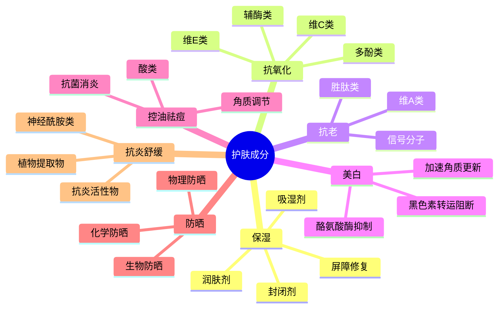
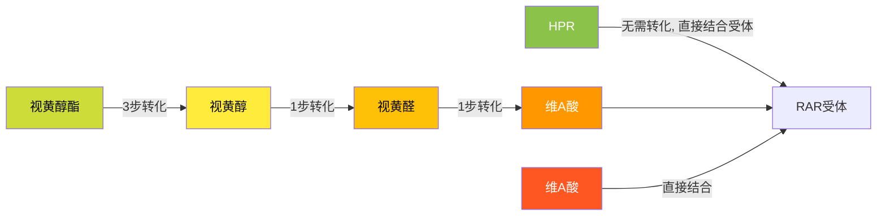
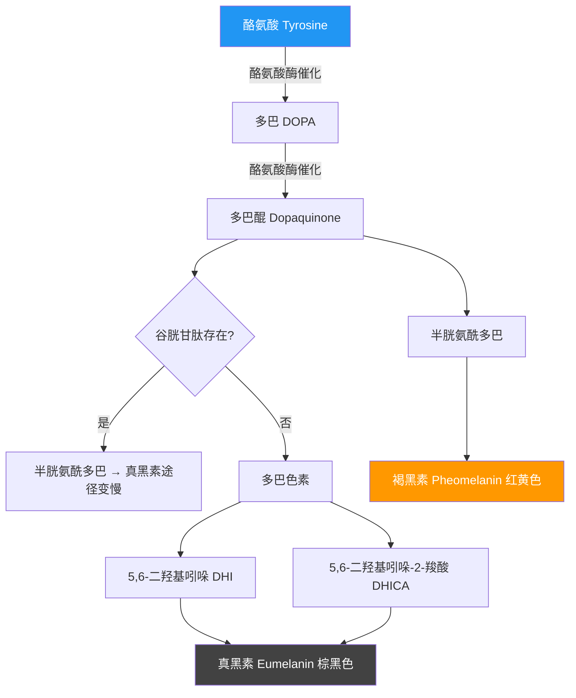
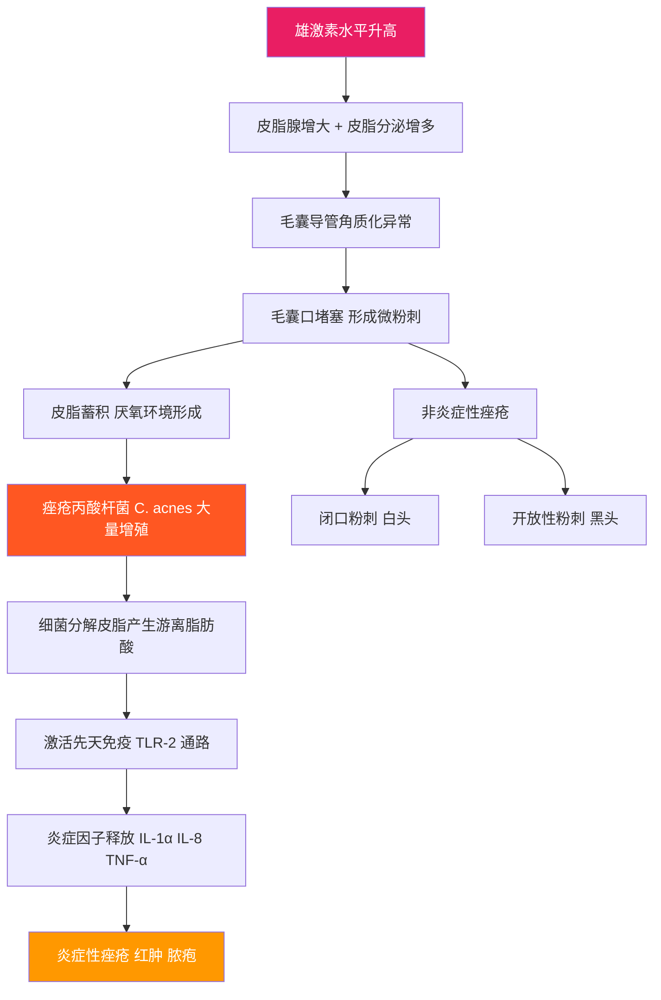
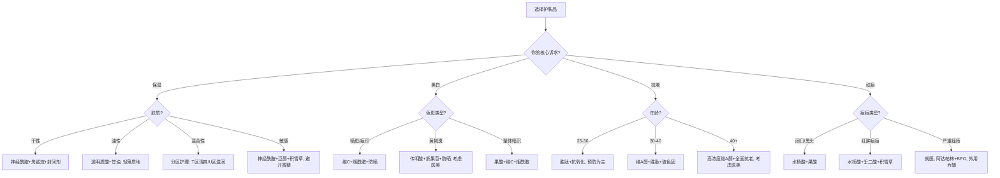

## 三、核心护肤成分解析

> 成分是护肤品的灵魂。同一瓶精华液，决定它能否起效的不是品牌、不是包装、不是广告语，而是瓶子里到底装了什么、装了多少、以什么形式存在。学会看成分，你就拥有了穿透营销迷雾的能力——从此不再为"贵妇面霜"交智商税，也不会因为盲目跟风而踩雷。

### 3.0 成分知识的学习框架

在逐个拆解成分之前，先建立一个全局认知框架。护肤成分按照**核心功效目标**可以分为七大类：

**学习路径建议**：先掌握每个类别的"代表成分"（标 ★ 的），再逐步了解其他成分。不需要一次记住所有成分——在实际选购产品时对照查阅即可。

**成分表阅读的基本规则**：
- 成分表按含量从高到低排列（法规要求）
- 排在前面的通常是水、甘油等基础溶剂
- 真正的功效成分通常排在防腐剂之后，浓度一般在 1% 以下
- 如果一个"明星成分"排在成分表最后几位，含量可能微乎其微

### 3.1 保湿类成分

皮肤含水量低于 10% 时，角质层会出现肉眼可见的脱屑、粗糙和细纹。保湿是所有护肤的基础——无论你的目标是美白、抗老还是祛痘，第一步都是把保湿做好。

完整的保湿体系包含三个层次：

| 层次 | 作用 | 典型成分 | 形象比喻 |
|------|------|----------|----------|
| **吸湿剂**（Humectants） | 从环境和真皮层吸收水分到角质层 | 透明质酸、甘油、尿素、PCA-Na | 海绵——吸收水分 |
| **润肤剂**（Emollients） | 填充角质细胞间隙，使皮肤平滑 | 角鲨烷、荷荷巴油、脂肪酸酯 | 水泥——填补缝隙 |
| **封闭剂**（Occlusives） | 在皮肤表面形成疏水膜，防止水分蒸发 | 凡士林、矿物油、羊毛脂、二甲硅油 | 保鲜膜——锁住水分 |

好的保湿产品通常三者兼备。只用吸湿剂（比如单纯涂一层玻尿酸原液）而不配合封闭剂，在干燥环境中反而会加速水分流失——这是很多人"越保湿越干"的原因。

#### 3.1.1 透明质酸（Hyaluronic Acid / 玻尿酸）★

**什么是透明质酸？**

透明质酸是一种天然存在于人体真皮层中的糖胺聚糖（GAG），一个分子可以结合自身重量 1000 倍的水分子。人体内约 50% 的透明质酸存在于皮肤中，但随年龄增长逐渐减少——25 岁时皮肤中透明质酸含量约为出生时的 60%，到 60 岁时仅剩 25%。

**分子量的差异直接影响使用效果**

透明质酸并非单一物质，不同分子量的透明质酸作用层次完全不同：

| 分子量 | 渗透深度 | 主要作用 | 肤感 |
|--------|----------|----------|------|
| >1000 kDa（大分子） | 停留在皮肤表面 | 形成透气保湿膜，减少 TEWL | 有明显的膜感 |
| 100-1000 kDa（中分子） | 角质层表面 | 在角质层形成保湿层 | 较为清爽 |
| 10-100 kDa（小分子） | 表皮深层 | 从内部补充水分 | 清爽无负担 |
| <10 kDa（超小分子） | 可达真皮层 | 促进皮肤自身合成透明质酸和胶原蛋白 | 极清爽 |

**选购建议**：优先选择含多种分子量透明质酸的产品（成分表中会列出 Sodium Hyaluronate、Hydrolyzed Hyaluronic Acid 等不同形式），这样可以同时覆盖表层锁水和深层补水。

**使用注意**：
- 在干燥环境（湿度 <30%）中，透明质酸可能反向吸收皮肤水分，导致越涂越干。应对方法：先拍水/喷雾湿润皮肤，再涂含透明质酸的产品，最后用封闭性产品锁水
- 透明质酸本身不是"补水神器"，它更像一个"水分搬运工"——需要环境中有足够的水分供它搬运
- 不要迷信"高浓度玻尿酸"，浓度超过 2% 时会过于黏稠，实际渗透效果反而下降

**成分表名称**：Sodium Hyaluronate（透明质酸钠，最常见）、Hyaluronic Acid、Hydrolyzed Hyaluronic Acid（水解透明质酸，小分子形式）

#### 3.1.2 神经酰胺（Ceramide）★

**为什么神经酰胺如此重要？**

把角质层想象成一堵砖墙：角质细胞是"砖块"，细胞间脂质是"水泥"。神经酰胺就是这"水泥"中最主要的成分，占细胞间脂质总量的约 50%（另外还有胆固醇约 25%、脂肪酸约 15%）。如果神经酰胺不足，这堵墙就会出现裂缝——水分从裂缝中蒸发，外界刺激物也更容易侵入。

**神经酰胺的类型**

人体皮肤中已发现至少 12 种神经酰胺，按照脂肪酸链和鞘氨醇碱基的不同组合分类。护肤品中最常用的是：
- **Ceramide 1（EOP）**：与亚油酸结合，对屏障功能至关重要
- **Ceramide 3（NP）**：最丰富的类型，保湿和屏障修复的主力
- **Ceramide 6（AP）**：参与角质层的正常代谢

**理想的修复配方**：研究表明，神经酰胺、胆固醇、脂肪酸三者以 3:1:1 的摩尔比混合时，屏障修复效果最佳。单纯补充神经酰胺而不配合胆固醇和脂肪酸，修复效果会打折扣。

**适用肤质**：屏障受损、敏感肌、干性皮肤、湿疹/特应性皮炎辅助护理。你正在使用的 CeraVe 适乐肤 PM 乳含有神经酰胺 1、3、6-II，配方中还包含胆固醇和脂肪酸前体，是一个很好的选择。

**成分表名称**：Ceramide NP、Ceramide AP、Ceramide EOP、Ceramide NS

#### 3.1.3 角鲨烷（Squalane）★

**来源与特性**

角鲨烷是角鲨烯（Squalene）的氢化衍生物。角鲨烯天然存在于人体皮脂中（约占皮脂的 12%），是皮脂膜的重要组成部分，但角鲨烯含有双键，容易被氧化（这就是为什么皮脂暴露在空气中会变黄变臭的原因）。将角鲨烯氢化后得到的角鲨烷，既保留了极好的亲肤性，又大大提高了抗氧化稳定性。

**为什么油皮也能用？**

角鲨烷的分子结构与人体皮脂高度相似，这意味着它能被皮肤"认出来"并快速吸收，而不会浮在表面造成油腻感。临床测试中，角鲨烷的油腻感评分远低于矿物油和椰子油。

**功效层次**：
1. **物理层面**：填充角质细胞间隙，减少水分蒸发
2. **化学层面**：作为抗氧化剂的溶剂载体，帮助活性成分渗透
3. **生物层面**：参与皮肤自身的脂质代谢

**来源说明**：传统角鲨烷从鲨鱼肝脏提取，现在主流品牌已转向植物来源（橄榄、甘蔗、米糠），品质和效果没有差异，但更环保。

**成分表名称**：Squalane（注意不要和 Squalene 混淆，后者是未氢化形式，容易氧化）

#### 3.1.4 甘油（Glycerin）

甘油可能是护肤品中使用历史最悠久的保湿成分——从 19 世纪就开始使用。它是天然保湿因子（NMF）的组成部分，也是皮肤脂质代谢的中间产物。

**工作原理**：甘油是小分子多元醇，含有三个羟基（-OH），能与水分子形成氢键。它不仅从环境中吸收水分，还能将水分"锚定"在角质层中，减缓水分蒸发。

**使用浓度**：
- 2-5%：清爽保湿，适合油皮和夏季使用
- 5-10%：中等滋润度，适合中性/混合性皮肤
- 10% 以上：较为黏腻，适合干皮或身体护理
- 纯甘油直接涂抹皮肤反而会吸走皮肤水分，必须稀释后使用

**安全性**：甘油是护肤品中安全等级最高的成分之一，几乎所有肤质都适用，孕妇、婴儿均可使用。

**成分表名称**：Glycerin、Glycerol

#### 3.1.5 泛醇（Panthenol / 维生素 B5）

泛醇是泛酸（维生素 B5）的前体，涂抹在皮肤上后会被酶催化转化为泛酸。泛酸是辅酶 A（CoA）的组成部分，而辅酶 A 参与了超过 70 种代谢反应，包括脂质合成、细胞能量代谢和伤口愈合。

**功效**：
- **保湿**：泛醇能渗透到表皮深层，从内部提升皮肤含水量，效果优于甘油
- **修复**：促进成纤维细胞增殖和角质形成细胞迁移，加速伤口愈合
- **舒缓**：降低皮肤炎症因子的表达，缓解泛红和刺激

**与其他保湿成分的区别**：透明质酸和甘油主要在皮肤表面和角质层起作用，而泛醇能渗透到更深层，从内部改善皮肤的保水能力。两者搭配使用效果更佳。

**成分表名称**：Panthenol、D-Panthenol、Dexpanthenol

#### 3.1.6 尿素（Urea）

尿素是天然保湿因子（NMF）的成分之一，约占 NMF 总量的 7%。它在护肤品中的作用因浓度而异：

| 浓度范围 | 主要作用 | 适用场景 |
|----------|----------|----------|
| 2-5% | 保湿，增强角质层含水量 | 日常保湿 |
| 5-10% | 轻度角质软化 + 保湿 | 轻度粗糙皮肤 |
| 10-20% | 明显角质软化，促进角质脱落 | 足部、肘部角质增厚 |
| 20-40% | 强力角质溶解 | 足部老茧、甲癣辅助治疗 |

**注意**：高浓度尿素（>10%）不适合用在面部，可能导致过度刺激和屏障损伤。低浓度尿素则非常温和，甚至可用于敏感肌。

**成分表名称**：Urea

#### 3.1.7 天然保湿因子（NMF）

天然保湿因子不是单一成分，而是一组存在于角质层中的水溶性低分子量物质的统称。NMF 的主要组成：

| 成分 | 占比 | 来源 |
|------|------|------|
| 氨基酸 | ~40% | 角蛋白降解产物 |
| 吡咯烷酮羧酸钠（PCA-Na） | ~12% | 谷氨酰胺转化 |
| 乳酸和乳酸钠 | ~12% | 汗液分泌 + 糖酵解 |
| 尿素 | ~7% | 蛋白质代谢终产物 |
| 氯化物、钠、钾等离子 | ~10% | 汗液 |
| 其他（糖类、有机酸等） | ~19% | 多种代谢途径 |

**NMF 的重要性**：NMF 吸收的水分占角质层总含水量的 20-30%。当 NMF 不足时，角质层含水量下降，皮肤变得干燥粗糙。**过度清洁是 NMF 流失的最主要原因**——这就是为什么频繁使用强力洁面产品会导致"越洗越干"。

**如何保护 NMF**：
- 使用温和的氨基酸系洁面产品（如你正在使用的氨基酸洁面）
- 避免长时间热水洗脸（热水会加速 NMF 溶出）
- 洁面后及时涂抹保湿产品，补充 NMF 类成分

### 3.2 抗氧化类成分

**为什么抗氧化如此重要？**

自由基（Free Radicals）是含有未配对电子的化学基团，化学性质极其活泼，会攻击细胞膜、DNA、蛋白质等生物分子。皮肤中的自由基来源包括：

1. **紫外线**：最主要的外源性自由基来源，UVA 可穿透到真皮层，产生大量活性氧（ROS）
2. **蓝光**：电子屏幕发出的高能可见光（HEV），长期暴露也会产生自由基
3. **空气污染**：PM2.5 中的多环芳烃可激活皮肤中的芳香烃受体，产生氧化应激
4. **代谢**：正常的细胞代谢（尤其是线粒体呼吸链）会产生少量自由基
5. **压力和睡眠不足**：通过升高皮质醇水平间接增加氧化应激

抗氧化成分的作用就是"牺牲自己"——主动捐献电子给自由基，使其变得稳定，从而终止自由基对细胞的攻击链式反应。

#### 3.2.1 维生素 C（抗坏血酸 / Ascorbic Acid）★

维生素 C 是护肤领域研究最充分、证据最扎实的抗氧化成分之一。

**四大功效机制**：

1. **抗氧化**：维生素 C 是水溶性抗氧化剂，能直接中和超氧阴离子、羟自由基等多种活性氧
2. **美白**：抑制酪氨酸酶活性，减少黑色素生成（详见 3.4 美白部分）
3. **抗老**：作为脯氨酰羟化酶和赖氨酰羟化酶的辅因子，促进胶原蛋白合成
4. **光保护**：与维 E 协同，减轻紫外线引起的红斑和晒伤细胞形成

**纯维 C 的稳定性困境**

L-抗坏血酸（纯维 C）是所有维 C 形式中活性最高的，但也是最不稳定的。它的分子结构中有两个容易失去电子的烯二醇基团，一旦失去电子就被氧化为脱氢抗坏血酸（DHAA），进一步水解后不可逆地失活。

加速维 C 氧化的因素：
- 光照（紫外线）
- 高温
- 溶解在水中（水溶液比粉末/油溶液不稳定得多）
- 金属离子（铁、铜）
- 高 pH 值

**维 C 衍生物的比较**

| 衍生物 | 稳定性 | 渗透性 | 温和度 | 是否需要转化 | 代表产品 |
|--------|--------|--------|--------|-------------|----------|
| L-抗坏血酸（纯维 C） | ★★ | ★★★★ | ★★ | 直接起效 | 修丽可 CE 精华 |
| 抗坏血酸葡糖苷（AA2G） | ★★★★ | ★★ | ★★★★ | 需酶解转化 | HABA VC 美容液 |
| 抗坏血酸磷酸酯镁（MAP） | ★★★★ | ★★★ | ★★★★ | 需酶解转化 | 乐敦 CC 美容液 |
| 抗坏血酸磷酸酯钠（SAP） | ★★★★ | ★★★ | ★★★★ | 需酶解转化 | SAP 还有抗菌活性 |
| 乙基维 C（3-O-乙基抗坏血酸） | ★★★★ | ★★★★ | ★★★★ | 不需要转化 | 珀莱雅抗氧化精华（含此成分） |
| 抗坏血酸四异棕榈酸酯（VC-IP） | ★★★★ | ★★★★ | ★★★★ | 不需要转化 | IPSA 自律循环乳 |

**维 C 的黄金搭配：CEF 配方**

研究发现，维 C + 维 E + 阿魏酸（Ferulic Acid）三者组合时，光保护效果可以提升 8 倍。这是因为：
- 维 C 中和水相中的自由基，维 E 中和脂相中的自由基——二者分工覆盖
- 维 C 能再生被氧化的维 E（把电子还给维 E）
- 阿魏酸在 pH 3.5 以下能稳定维 C 和维 E，并额外提供紫外吸收能力

**使用指南**：
- 有效浓度：L-抗坏血酸 10-20%，低于 8% 效果不明显，高于 20% 不再增效且刺激性增大
- 最佳 pH：3.0-3.5（pH 越低渗透越好，但刺激性也越大）
- 使用时间：早晚均可。早上使用可增强防晒效果（在防晒霜之前涂抹），晚上使用可对抗日间积累的自由基损伤
- 判断维 C 产品是否氧化：新鲜的维 C 精华应该是无色或淡黄色，如果变成深黄、棕色或橙色，说明已经严重氧化，应停止使用

**成分表名称**：Ascorbic Acid（纯维 C）、Ascorbyl Glucoside（AA2G）、Magnesium Ascorbyl Phosphate（MAP）、Sodium Ascorbyl Phosphate（SAP）、3-O-Ethyl Ascorbic Acid（乙基维 C）、Ascorbyl Tetraisopalmitate（VC-IP）

#### 3.2.2 维生素 E（生育酚 / Tocopherol）★

维生素 E 是最重要的脂溶性抗氧化剂，主要存在于细胞膜的磷脂双分子层中。它的作用机制是捐献氢原子给脂质过氧自由基（LOO·），终止脂质过氧化的链式反应——这就像在多米诺骨牌链中插入一个阻挡物。

**与维 C 的协同关系**：

这个再生循环使得维 C 和维 E 的组合效果远超两者之和。

**成分表形式**：
- **Tocopherol**：天然维 E，活性最高但不太稳定
- **Tocopheryl Acetate**：维 E 醋酸酯，更稳定，涂抹后需要被皮肤中的酯酶水解才能发挥活性
- **Tocopheryl Linoleate**：维 E 亚油酸酯，兼具保湿和抗氧化功能

#### 3.2.3 烟酰胺（Niacinamide / 维生素 B3）★

烟酰胺是护肤界的"全能选手"——一瓶含 5% 烟酰胺的产品，理论上可以同时改善肤色、控油、缩小毛孔、修复屏障和抗炎。

**作用机制拆解**：

烟酰胺是 NAD+（烟酰胺腺嘌呤二核苷酸）和 NADP+ 的前体。NAD+/NADH 是细胞内最重要的氧化还原辅酶之一，参与超过 400 种酶促反应。通过补充烟酰胺，可以：
1. **美白**：抑制黑色素小体从黑色素细胞向角质细胞的转运（注意：不是抑制黑色素生成，而是阻断转运）
2. **控油**：减少皮脂腺中脂肪酸和甘油三酯的合成，降低皮脂分泌量
3. **修复屏障**：促进神经酰胺和脂肪酸的合成，增加角质层脂质含量
4. **抗炎**：降低 TNF-α、IL-8 等炎症因子的表达
5. **抗老**：促进胶原蛋白合成，减少皱纹深度

**浓度指南**：
- 2%：控油、修复屏障
- 4-5%：美白、改善毛孔（研究中常用的浓度）
- 10% 以上：高浓度，可能增加刺激性，需要建立耐受

**不耐受问题**：少数人使用烟酰胺后会出现面部潮红、刺痛、发热。这通常不是对烟酰胺本身过敏，而是对其中残留的杂质——烟酸（Nicotinic Acid）——的血管扩张反应。烟酸会导致皮肤毛细血管扩张，引起潮红。

**应对策略**：
1. 从 2% 低浓度开始，逐步建立耐受
2. 先在耳后或下颌线小面积测试
3. 如果持续不耐受，选择纯度更高的产品（药用级烟酰胺纯度 >99.9%）

**与你当前护肤方案的关系**：你使用的 CeraVe PM 乳中含有烟酰胺，浓度约 4%。由于烟酰胺是水溶性的，在产品配方中排位靠前通常意味着浓度较高。

**成分表名称**：Niacinamide（最常见）、Nicotinamide

#### 3.2.4 虾青素（Astaxanthin）★

虾青素是一种酮式类胡萝卜素，天然存在于雨生红球藻（Haematococcus pluvialis）中。火烈鸟、三文鱼、虾蟹的红色就来自虾青素。

**抗氧化能力的量化比较**：

| 抗氧化剂 | 相对于维 E 的抗氧化能力 |
|----------|------------------------|
| 维生素 E | 1× |
| 维生素 C | 0.017× |
| 虾青素 | 500-1000× |
| β-胡萝卜素 | 10× |
| 辅酶 Q10 | 2-5× |

虾青素之所以如此强大，是因为其分子结构两端各有一个酮基环，能同时跨越细胞膜的磷脂双分子层——一个分子同时保护膜的内外两侧，这是其他类胡萝卜素做不到的。

**在护肤中的应用**：
- 中和紫外线产生的单线态氧和过氧化物
- 抑制 NF-κB 信号通路，减轻炎症反应
- 保护成纤维细胞免受光老化损伤

**稳定性问题**：虾青素对光和热非常敏感，暴露在空气中数小时就会显著降解。含有虾青素的产品应避光密封保存，开封后尽快使用。

**与你的关系**：珀莱雅抗氧化精华的核心成分之一就是虾青素。**建议早晚都使用**——抗氧化不仅是对抗紫外线，还要对抗蓝光、污染和代谢产生的全天候自由基损伤。晚上使用可以帮助修复白天积累的氧化损伤。

**成分表名称**：Astaxanthin、Haematococcus Pluvialis Extract

#### 3.2.5 麦角硫因（Ergothioneine）

麦角硫因是一种含硫的天然氨基酸衍生物，主要存在于蘑菇（尤其是牛肝菌、香菇）、黑豆、燕麦等食物中。有趣的是，人体细胞表面有专门的麦角硫因转运蛋白（OCTN1），这意味着进化过程"认为"这种物质对细胞足够重要，值得专门设计一个转运系统。

**独特的抗氧化机制**：
1. **金属螯合**：螯合游离的铁离子和铜离子，减少金属催化的 Fenton 反应（这是细胞内产生羟自由基的主要途径）
2. **直接清除自由基**：在生理 pH 下，麦角硫因的硫酮基团能高效清除羟自由基和次氯酸
3. **保护线粒体**：在线粒体中富集，保护线粒体 DNA 免受氧化损伤

**稳定性优势**：与维 C 和虾青素不同，麦角硫因在高温（100°C 以上）和极端 pH（pH 2-12）条件下仍能保持稳定，这使得它在化妆品配方中非常"好用"。

**成分表名称**：Ergothioneine

#### 3.2.6 白藜芦醇（Resveratrol）

白藜芦醇是一种多酚类化合物，最初因"法国悖论"（法国人吃高脂饮食但心血管疾病发病率低，被认为与饮红酒有关）而广受关注。

**SIRT1 通路的激活**：白藜芦醇能激活 SIRT1（沉默信息调节因子 1），这是一种依赖 NAD+ 的去乙酰化酶。SIRT1 被称为"长寿基因"，它参与调控细胞的 DNA 修复、抗氧化防御、炎症反应和能量代谢。通过激活 SIRT1，白藜芦醇可以：
- 延缓细胞衰老
- 增强皮肤细胞的抗氧化能力
- 减少炎症因子的产生

**局限性**：白藜芦醇的生物利用度较低（口服和外用都是如此），且对光和氧敏感。护肤品中通常需要特殊包裹技术（如脂质体包裹）来提高稳定性和渗透性。

**成分表名称**：Resveratrol

#### 3.2.7 辅酶 Q10（泛醌 / Ubiquinone）

辅酶 Q10 天然存在于线粒体内膜中，是电子传递链的重要组成部分——它在复合物 I/II 和复合物 III 之间传递电子，是细胞产生 ATP（能量货币）的关键分子。

**随年龄下降**：人体辅酶 Q10 水平在 20 岁达到峰值，之后逐年下降。40 岁时皮肤中的辅酶 Q10 水平约为 20 岁时的 60-70%。

**护肤功效**：
- 中和线粒体呼吸链中泄漏的自由基
- 减少紫外线诱导的 DNA 损伤
- 促进胶原蛋白合成

**成分表名称**：Ubiquinone、Coenzyme Q10

### 3.3 抗老类成分

衰老分为**内源性衰老**（随年龄自然发生的细胞功能下降）和**外源性衰老**（紫外线、污染、生活方式等外部因素导致的加速衰老）。护肤能干预的主要是外源性衰老，而抗老成分的目标是：减少已有的衰老迹象 + 预防进一步的衰老。

#### 3.3.1 维 A 酸及其衍生物（Retinoids）★

**为什么维 A 类被称为抗老"金标准"？**

在所有抗老成分中，维 A 类是研究最充分、证据等级最高的。截至目前，有超过 500 篇经过同行评审的临床研究证明了维 A 类成分在抗皱、改善肤质、促进胶原蛋白合成方面的效果。FDA 在 1971 年就批准了全反式维 A 酸（Tretinoin）用于治疗光老化——这比大多数护肤"新成分"的历史都要长。

**维 A 类的作用靶点**

维 A 类成分进入皮肤细胞后，与细胞核内的维 A 酸受体（RAR-α/β/γ 和 RXR-α/β/γ）结合，形成受体-配体复合物。这个复合物作为转录因子，与 DNA 上的维 A 酸反应元件（RARE）结合，启动或抑制特定基因的表达。由此产生的生物学效应包括：

1. **促进角质更新**：上调角质形成细胞的增殖和分化相关基因，加速老旧角质脱落
2. **刺激胶原合成**：激活真皮层成纤维细胞的 I 型和 III 型胶原蛋白基因表达
3. **抑制胶原降解**：下调基质金属蛋白酶（MMP-1、MMP-3、MMP-9）的表达——这些酶是降解胶原蛋白的"剪刀"
4. **调节皮脂**：缩小皮脂腺体积，减少皮脂分泌
5. **抑制黑色素**：干扰黑色素合成过程中的酪氨酸酶基因转录
6. **促进血管新生**：增加真皮层的血管密度，改善营养供应

**维 A 类衍生物的效果排序**

| 衍生物 | 转化步骤 | 刺激性 | 效果 | 获取方式 | 适合人群 |
|--------|----------|--------|------|----------|----------|
| 维 A 酸（Tretinoin） | 无需转化 | ★★★★★ | ★★★★★ | 处方药 | 严重光老化/痤疮，需医生指导 |
| 阿达帕林（Adapalene） | 无需转化 | ★★★ | ★★★★ | 处方药（OTC 在部分国家） | 痤疮为主 |
| 视黄醛（Retinal） | 1 步 | ★★★ | ★★★★ | OTC | 追求效果与温和的平衡 |
| 视黄醇（Retinol） | 2 步 | ★★★ | ★★★ | OTC | 最常见的非处方选择 |
| HPR（Hydroxypinacolone Retinoate） | 无需转化 | ★★ | ★★★★ | OTC | 敏感肌/新手入门 |
| 视黄醇棕榈酸酯（Retinyl Palmitate） | 3 步 | ★ | ★★ | OTC | 完全新手/孕妇替代 |

**使用建立耐受的详细方案**

维 A 类成分的"适应期"是大多数人放弃的原因。以下是经过临床验证的渐进方案：

| 阶段 | 时间 | 频率 | 停留时间 | 注意事项 |
|------|------|------|----------|----------|
| 第 1 阶段 | 第 1-2 周 | 每 3 天 1 次 | 涂抹后 30 分钟洗掉 | "短时接触法"，减少刺激 |
| 第 2 阶段 | 第 3-4 周 | 每 2 天 1 次 | 隔夜保留 | 出现轻微脱皮属正常 |
| 第 3 阶段 | 第 5-6 周 | 隔天 1 次 | 隔夜保留 | 皮肤应已基本适应 |
| 第 4 阶段 | 第 7 周起 | 每天 1 次 | 隔夜保留 | 维持阶段 |

**关键使用规则**：
- **只在晚上使用**：视黄醇在紫外线下会迅速降解为无活性形式，且维 A 类会增加皮肤的光敏感性
- **必须配合防晒**：使用维 A 类产品期间，防晒是刚性需求，不是可选项
- **避免同时使用的成分**：高浓度果酸、水杨酸、高浓度维 C（pH <3.5）——同时使用可能导致过度刺激和屏障损伤。建议早上用维 C，晚上用维 A，错开使用
- **孕妇/哺乳期禁用**：维 A 酸类成分有明确的致畸风险（FDA 妊娠分类 X 级）
- **"爆痘期"不是所有人都会有**：初期可能出现的痘痘增多是因为角质更新加速，将深层闭口推到表面。通常持续 2-6 周后自行缓解。如果 8 周后仍在加重，应停用并咨询医生

#### 3.3.2 胜肽（Peptides）★

胜肽是由 2-50 个氨基酸通过肽键连接而成的短链蛋白质片段。与蛋白质不同，胜肽分子量足够小（通常 <5000 Da），可以穿透角质层进入皮肤深层发挥作用。

**胜肽的四大类别**

| 类别 | 作用机制 | 代表成分 | 功效 |
|------|----------|----------|------|
| **信号肽** | 模拟胶原蛋白降解片段，"欺骗"成纤维细胞以为胶原在流失，从而加速合成 | 棕榈酰五肽-4（Matrixyl）、棕榈酰三肽-1 | 抗皱、紧致 |
| **神经递质抑制肽** | 抑制 SNARE 复合物的组装，阻断神经肌肉接头处乙酰胆碱的释放 | 乙酰基六肽-8（Argireline）、SYN-AKE | 减少表情纹 |
| **载体肽** | 携带铜离子到伤口愈合部位，促进胶原蛋白和弹性蛋白的合成 | 铜肽（GHK-Cu） | 修复、抗老、促进伤口愈合 |
| **酶抑制肽** | 抑制基质金属蛋白酶（MMPs）的活性，减缓胶原蛋白降解 | 大豆蛋白肽、棕榈酰四肽-7 | 预防胶原流失 |

**胜肽 vs 维 A 醇——如何选择？**

| 维度 | 维 A 醇 | 胜肽 |
|------|---------|------|
| 效果强度 | 强 | 中等 |
| 见效速度 | 4-12 周 | 8-16 周 |
| 刺激性 | 中-高 | 极低 |
| 建立耐受 | 需要 | 不需要 |
| 适用人群 | 健康皮肤 | 所有肤质，特别是敏感肌 |
| 使用限制 | 只能晚上用 | 早晚均可 |
| 与酸类冲突 | 有 | 无 |

**最佳策略**：维 A 醇和胜肽并不冲突，可以搭配使用。例如：早上用胜肽精华 + 防晒，晚上用维 A 醇。

**成分表名称**：各种以 -peptide 结尾的成分名，如 Palmitoyl Pentapeptide-4、Acetyl Hexapeptide-8、Copper Tripeptide-1 等

#### 3.3.3 玻色因（Pro-Xylane / 羟丙基四氢吡喃三醇）

玻色因是欧莱雅集团历时 7 年研发的专利成分，化学名称为羟丙基四氢吡喃三醇（Hydroxypropyl Tetrahydropyrantriol），是一种木糖衍生物。

**作用机制**：
1. **促进糖胺聚糖（GAGs）合成**：GAGs 包括透明质酸、硫酸软骨素等，是真皮层基质的主要成分。GAGs 含量下降是皮肤出现皱纹和松弛的重要原因之一
2. **促进 IV 型和 VII 型胶原蛋白合成**：这两种胶原蛋白位于表皮-真皮连接处（DEJ），负责将表皮"锚定"在真皮上。DEJ 的退化导致皮肤出现"塌陷"感和深层皱纹
3. **增强表皮-真皮连接**：增加 DEJ 的厚度和紧密度

**优势**：
- 温和不刺激，敏感肌可直接使用
- 不需要建立耐受
- 可以与维 A 醇、维 C 等活性成分搭配使用

**浓度说明**：玻色因的起效浓度约为 3%，高端产品通常含 10-30%。30% 玻色因的代表产品是赫莲娜黑绷带面霜。

**成分表名称**：Hydroxypropyl Tetrahydropyrantriol（注意：成分表中通常用化学名，不会出现"玻色因"三个字）

#### 3.3.4 二裂酵母发酵产物溶胞物（Bifida Ferment Lysate）

这是一种由双歧杆菌（Bifida）发酵后裂解得到的混合物，含有细菌代谢产物、DNA 片段、多糖、氨基酸、维生素等多种成分。

**作用机制**：
- **DNA 修复增强**：其中的发酵产物（可能是特定的酶或多糖）能增强皮肤细胞的 DNA 修复酶活性，帮助修复紫外线造成的 DNA 损伤（如嘧啶二聚体）
- **抗氧化**：增强皮肤自身的抗氧化防御系统
- **免疫调节**：调节皮肤的免疫反应，减少紫外线引起的炎症

**代表产品**：雅诗兰黛小棕瓶精华（Advanced Night Repair）、兰蔻小黑瓶精华（Advanced Génifique）。这两个产品的核心成分都是二裂酵母发酵产物溶胞物。

**成分表名称**：Bifida Ferment Lysate

### 3.4 美白类成分

#### 黑色素合成的完整路径

要理解美白成分，先要了解黑色素是怎么产生的：

美白成分通过以下四种机制发挥作用：

| 机制 | 作用靶点 | 代表成分 |
|------|----------|----------|
| 抑制酪氨酸酶活性 | 直接抑制黑色素合成的限速酶 | 熊果苷、377、曲酸、光甘草定 |
| 抗氧化/还原 | 中和黑色素合成中的氧化中间体，还原已生成的黑色素 | 维 C 及衍生物 |
| 阻断黑色素转运 | 阻止黑色素小体从黑色素细胞转移到角质细胞 | 烟酰胺 |
| 加速角质更新 | 让含黑色素的老旧角质更快脱落 | 果酸、维 A 类 |

**重要认知**：美白不等于"漂白"。任何合法的美白成分都只能帮助你恢复到"基因决定的最白程度"（通常以大腿内侧或上臂内侧的肤色为参照），不可能让你白过基因极限。

#### 3.4.1 熊果苷（Arbutin）★

熊果苷是氢醌（对苯二酚）的糖苷衍生物——在氢醌分子上接了一个葡萄糖分子。这个改变至关重要：氢醌虽然美白效果强，但有潜在毒性（长期使用可能导致褐黄病），而接上糖分子后，安全性大幅提高，同时保留了抑制酪氨酸酶的能力。

**α vs β 熊果苷**：

| 维度 | α-熊果苷 | β-熊果苷 |
|------|----------|----------|
| 酪氨酸酶抑制活性 | β 的 10 倍以上 | 基准 |
| 稳定性 | 更好 | 较差，容易水解 |
| 价格 | 较高 | 较低 |
| 有效浓度 | 1-2% | 2-7% |
| 常见于 | 日系高端产品 | 中低端产品 |

**安全性**：熊果苷的美白效果源于对酪氨酸酶的竞争性抑制，这种抑制是可逆的——停止使用后，酪氨酸酶活性会恢复，皮肤不会出现"反黑"。但需要注意：熊果苷可能在极端条件下降解产生微量氢醌，因此选择正规品牌很重要。

**成分表名称**：Alpha-Arbutin（α-熊果苷）、Arbutin（通常指 β-熊果苷）

#### 3.4.2 传明酸（Tranexamic Acid / 氨甲环酸）★

传明酸最初是作为止血药开发的（它能抑制纤溶酶的活性，减少出血），后来意外发现它对黄褐斑有显著改善作用。

**美白机制**：
传明酸并非直接抑制酪氨酸酶，而是通过以下途径减少黑色素生成：
1. 抑制纤溶酶活性 → 减少花生四烯酸的释放 → 减少前列腺素 PGE2 的合成 → 降低黑色素细胞的活化信号
2. 阻断紫外线诱导的黑色素细胞活化通路（UV → 纤溶酶 → 黑色素细胞刺激）
3. 抑制血管内皮生长因子（VEGF），减少黄褐斑区域的异常血管增生

**为什么传明酸特别适合黄褐斑？**

黄褐斑的成因比普通色斑更复杂，涉及激素、血管、炎症等多种因素。传明酸的多靶点作用机制——同时抑制黑色素生成、抗炎、减少异常血管——使其成为黄褐斑治疗中证据最充分的成分之一。

**使用形式**：
- **外用**：2-5% 传明酸精华，通常搭配烟酰胺、熊果苷等成分
- **口服**：250mg 每日 2 次（需在医生指导下使用，有增加血栓风险的可能）
- **微针/导入**：配合医美手段渗透更深层

**安全性**：外用非常安全，几乎无刺激性。口服需排除血栓风险因素（如长期卧床、口服避孕药等）。

**成分表名称**：Tranexamic Acid

#### 3.4.3 377（苯乙基间苯二酚 / Phenylethyl Resorcinol）

377 是 Symrise 公司开发的美白活性成分，代号 SymWhite 377。它是一种氢醌的衍生物，但在结构上进行了修饰，既保留了强效抑制酪氨酸酶的能力，又避免了氢醌的毒性问题。

**数据对比**：377 对酪氨酸酶的抑制活性是：
- 熊果苷的 **2000-5000 倍**
- 曲酸的 **200-500 倍**

**使用浓度**：0.1-0.5%（低浓度即有效，无需追求高浓度）

**注意事项**：
- 377 本身有轻微刺激性，敏感肌建议先小面积测试
- 不宜与高浓度酸类同时使用
- 需要配合防晒以维持美白效果

**成分表名称**：Phenylethyl Resorcinol

#### 3.4.4 曲酸（Kojic Acid）

曲酸是某些真菌（如曲霉菌）在发酵过程中产生的代谢产物。日本清酒酿造工人的手特别白嫩，这个观察引发了对曲酸美白作用的研究。

**作用机制**：曲酸通过螯合酪氨酸酶活性中心的铜离子来使其失活。酪氨酸酶是一种含铜的金属酶，其催化活性依赖于活性中心的两个铜离子（CuA 和 CuB），曲酸与这些铜离子结合后，酶就无法催化黑色素合成了。

**缺点**：
- 稳定性差：在空气中容易被氧化变黄变棕
- 与金属离子反应：不能与铁、铜等金属容器接触
- 可能引起接触性皮炎（概率约 1-2%）

**改良形式**：曲酸二棕榈酸酯（Kojic Dipalmitate）是曲酸的脂溶性衍生物，稳定性更好，刺激性更低。

**成分表名称**：Kojic Acid、Kojic Dipalmitate

#### 3.4.5 光甘草定（Glabridin）

光甘草定是从光果甘草（Glycyrrhiza glabra）根部提取的异黄酮类化合物，被誉为"美白黄金"——因为提取率极低（约 0.1%），价格昂贵。

**多重功效**：
1. **美白**：抑制酪氨酸酶活性（IC50 约 0.38 μg/mL，效果优于熊果苷）
2. **抗炎**：抑制环氧合酶（COX）活性，减少前列腺素合成
3. **抗氧化**：清除自由基的能力是维 E 的数倍

**为什么甘草提取物在护肤品中如此常见？** 因为甘草提取物同时具有美白、抗炎、抗氧化三重功效，是少见的"一专多能"植物活性物。

**成分表名称**：Glabridin、Glycyrrhiza Glabra Root Extract（光果甘草根提取物）

#### 3.4.6 维 C 及衍生物（美白维度）

维 C 在美白方面的作用已在 3.2.1 节详细介绍。从美白角度补充关键点：

- **双重美白机制**：① 抑制酪氨酸酶活性（竞争性抑制）② 还原已生成的黑色素（将深色的黑色素还原为浅色的无色黑色素前体）
- **协同增效**：维 C + 传明酸 或 维 C + 烟酰胺 的美白效果优于单一成分
- **见效时间**：通常需要 8-12 周的持续使用才能看到明显效果

### 3.5 控油祛痘类成分

#### 痤疮的完整发病机制

痤疮（Acne Vulgaris）的形成涉及四个关键因素，理解这些因素有助于选择正确的成分：

**痤疮分级与成分选择**

| 痤疮类型 | 严重程度 | 首选成分 | 辅助成分 |
|----------|----------|----------|----------|
| 闭口/黑头（非炎症性） | 轻度 | 水杨酸、果酸 | 维 A 醇 |
| 红肿痘痘（炎症性） | 轻-中度 | 水杨酸、壬二酸 | 积雪草、烟酰胺 |
| 脓疱 | 中度 | 过氧化苯甲酰 + 水杨酸 | 积雪草 |
| 囊肿/结节 | 重度 | 必须就医，处方药为主 | 外用成分作为辅助 |

#### 3.5.1 水杨酸（Salicylic Acid / BHA）★

水杨酸是 β-羟基酸（BHA），也是唯一的脂溶性酸类成分——这意味着它能溶解在油脂中，深入毛孔内部发挥作用。

**多靶点作用机制**：
1. **溶解角栓**：水杨酸能渗透到充满皮脂的毛囊中，溶解堵塞毛孔的角质和油脂混合物
2. **抗炎**：通过抑制环氧合酶-2（COX-2），减少前列腺素和白三烯等炎症介质的合成
3. **抗菌**：低 pH 环境对痤疮丙酸杆菌有一定抑制作用
4. **控油**：轻度减少皮脂分泌

**浓度与频率**：
- 0.5-1%：日常控油、预防闭口
- 1-2%：治疗轻度痤疮、疏通毛孔
- 使用频率：从每周 1-2 次开始，根据耐受情况逐步增加

**你正在使用的理肤泉 K 乳**：主要活性成分是水杨酸（LHA，辛酰水杨酸，是水杨酸的温和衍生物），一周一次的频率对于预防闭口和角质管理是合理的。

**与阿司匹林的关系**：阿司匹林（乙酰水杨酸）在体内会代谢为水杨酸。如果你对阿司匹林过敏，外用水杨酸也可能引起过敏反应，应避免使用。

**成分表名称**：Salicylic Acid、Betaine Salicylate（水杨酸甜菜碱，更温和）、Capryloyl Salicylic Acid（辛酰水杨酸/LHA）

#### 3.5.2 果酸（AHA）★

果酸是 α-羟基酸的统称，因最初从水果中提取而得名。果酸是水溶性的，主要作用于皮肤表面。

**不同果酸的详细比较**

| 果酸类型 | 来源 | 分子量 | 渗透深度 | 刺激性 | 特殊功效 | 适合肤质 |
|----------|------|--------|----------|--------|----------|----------|
| 甘醇酸（Glycolic Acid） | 甘蔗 | 76 Da | 最深 | ★★★★ | 促进胶原合成 | 健康耐受皮肤 |
| 乳酸（Lactic Acid） | 酸奶/发酵食品 | 90 Da | 较深 | ★★★ | 保湿、美白 | 中性至干性皮肤 |
| 杏仁酸（Mandelic Acid） | 苦杏仁 | 152 Da | 较浅 | ★★ | 控油、抗菌 | 敏感肌、油性皮肤 |
| 柠檬酸（Citric Acid） | 柑橘类水果 | 192 Da | 最浅 | ★★ | 螯合金属、抗氧化 | 所有肤质（主要作pH调节） |
| 葡萄糖酸内酯（PHA） | - | 较大 | 最浅 | ★ | 保湿、抗氧化 | 敏感肌首选 |

**果酸的使用关键**：
- **浓度**：护肤品中 5-10% 日常使用，10-30% 需要建立耐受，30% 以上属于"果酸焕肤"，必须在专业人士操作下进行
- **pH 值**：果酸在 pH 3.0-4.0 之间活性最佳。pH >4.5 时大部分果酸以离子形式存在，渗透效率大幅下降
- **光敏感性**：果酸会破坏角质层的完整性，降低皮肤对紫外线的防御能力。使用果酸期间必须严格防晒

**果酸 vs 水杨酸——如何选择？**

| 维度 | 果酸（AHA） | 水杨酸（BHA） |
|------|------------|---------------|
| 溶解性 | 水溶性 | 脂溶性 |
| 作用层次 | 皮肤表面 + 浅表皮 | 毛孔内部 |
| 最适合的问题 | 肤色暗沉、细纹、粗糙 | 黑头、闭口、毛孔堵塞 |
| 控油效果 | 一般 | 好 |
| 抗炎效果 | 弱 | 中等 |
| 光敏感 | 明显增加 | 中度增加 |
| 可搭配维 A 醇 | 需谨慎（避免同时使用） | 需谨慎 |

#### 3.5.3 壬二酸（Azelaic Acid）

壬二酸是一种天然存在于谷物（小麦、黑麦、大麦）中的二元酸（含有两个羧基的饱和脂肪酸）。

**为什么壬二酸被称为"多面手"？**

壬二酸能同时作用于痤疮的多个环节：
1. **抗菌**：抑制痤疮丙酸杆菌的蛋白质合成，对革兰氏阳性菌有广谱抗菌活性
2. **抗角质化**：减少毛囊导管的角质化异常，防止毛孔堵塞
3. **抗炎**：抑制活性氧的产生和 NF-κB 信号通路
4. **美白**：竞争性抑制酪氨酸酶活性，对炎症后色素沉着（痘印）效果尤佳
5. **抗玫瑰痤疮**：减轻玫瑰痤疮的红斑和丘疹

**安全性**：
- 孕期和哺乳期可安全使用（FDA 妊娠分类 B 级）
- 刺激性低于果酸和水杨酸
- 长期使用不会产生耐药性

**有效浓度**：护肤品 10%，处方药 15-20%（如 Skinoren / 思丽安）

**成分表名称**：Azelaic Acid

#### 3.5.4 过氧化苯甲酰（Benzoyl Peroxide / BPO）

过氧化苯甲酰是一种强氧化剂，涂抹在皮肤上后会分解产生苯甲酸和活性氧自由基，后者能快速杀灭痤疮丙酸杆菌。

**核心优势**：痤疮丙酸杆菌不会对 BPO 产生耐药性——这与抗生素形成了鲜明对比。抗生素耐药性是痤疮治疗中的严重问题，而 BPO 在使用了几十年后仍然有效。

**浓度选择**：

| 浓度 | 杀菌效果 | 刺激性 | 适用场景 |
|------|----------|--------|----------|
| 2.5% | 与 10% 相当 | 较低 | 推荐起始浓度 |
| 5% | 与 10% 相当 | 中等 | 2.5% 效果不足时升级 |
| 10% | 基准 | 较高 | 通常不必要 |

研究表明，2.5% 和 10% 的 BPO 在治疗痤疮的效果上没有显著差异，但 10% 的刺激性明显更高。因此，**从 2.5% 开始就足够了**。

**注意事项**：
- BPO 会漂白头发、眉毛、衣物和毛巾——涂完 BPO 后要洗手，用白色枕巾
- 可能导致干燥、脱皮——配合保湿产品使用
- 开封后注意保存，BPO 对光和热敏感
- 不要与维 A 酸同时使用（BPO 可能氧化维 A 酸，使其失活）

**成分表名称**：Benzoyl Peroxide

#### 3.5.5 维 A 酸类（祛痘维度）

维 A 酸类在抗老部分（3.3.1）已详细介绍。从祛痘角度补充：

**处方维 A 酸在痤疮治疗中的地位**：
- **阿达帕林凝胶（0.1%/0.3%）**：FDA 批准的痤疮一线外用药，第三代维 A 酸，选择性作用于 RAR-β/γ 受体，刺激性低于维 A 酸
- **维 A 酸凝胶/乳膏（0.025%/0.05%/0.1%）**：经典痤疮用药，效果强但刺激性大
- **他扎罗汀（0.05%/0.1%）**：第三代维 A 酸，对 RAR-β/γ 有高选择性

**祛痘机制**：
1. 调节毛囊导管角质化 → 防止毛孔堵塞
2. 缩小皮脂腺 → 减少皮脂分泌
3. 抑制炎症因子 → 减轻痤疮炎症
4. 加速角质更新 → 推出深层闭口

#### 3.5.6 积雪草提取物（Centella Asiatica）★

积雪草（又名雷公根、崩大碗）在中医和印度阿育吠陀医学中使用了数千年。现代研究已分离出其主要活性成分并阐明了作用机制。

**四大活性成分及其功效**：

| 活性成分 | 占比 | 主要作用 |
|----------|------|----------|
| 积雪草苷（Asiaticoside） | ~40% | 促进 I 型胶原蛋白合成，促进伤口愈合 |
| 羟基积雪草苷（Madecassoside） | ~30% | 抗炎、抗氧化、促进 III 型胶原合成 |
| 积雪草酸（Asiatic Acid） | ~20% | 抗菌、促进胶原合成、抗炎 |
| 羟基积雪草酸（Madecassic Acid） | ~10% | 抗炎、修复皮肤屏障 |

**在祛痘护理中的价值**：
- 痘印修复：促进胶原蛋白合成，帮助修复痤疮后留下的凹陷性疤痕
- 抗炎：减轻痤疮区域的炎症反应
- 屏障修复：修复因酸类产品或过度清洁导致的屏障损伤

**代表产品**：薇诺娜舒敏保湿特护霜（含马齿苋+积雪草）、Dr.Jart+蒂佳婷积雪草修复精华

**成分表名称**：Centella Asiatica Extract、Asiaticoside、Madecassoside、Asiatic Acid、Madecassic Acid

### 3.6 防晒类成分

**为什么防晒是护肤的第一要务？**

皮肤衰老约 80% 来自光老化（Photoaging），而非自然衰老。光老化的表现包括：深皱纹、皮革样皮肤质地、色素不均匀、毛细血管扩张、甚至皮肤癌。一张被长期日晒的卡车司机左脸和未被日晒的右脸的对比照片，可能是皮肤科学中最具说服力的光老化证据。

#### 3.6.1 化学防晒剂（有机防晒剂）

化学防晒剂通过分子中的共轭双键结构吸收紫外线光子，将光能转化为分子振动能量（热能），然后通过振动弛豫回到基态。

**常用化学防晒剂详解**

| 成分 | 防护波段 | 特点 | 光稳定性 | 安全性争议 |
|------|----------|------|----------|------------|
| 阿伏苯宗（Avobenzone） | UVA I（320-340nm） | 最常用的 UVA 吸收剂 | 差，需配合稳定剂 | 低 |
| 桂皮酸乙基己酯（Octinoxate/OMC） | UVB（280-320nm） | 常用 UVB 吸收剂 | 中等 | 环境争议（珊瑚礁） |
| 天来施 S（Tinosorb S） | UVA+UVB 广谱 | 光稳定优秀，可稳定阿伏苯宗 | 优秀 | 极低 |
| 天来施 M（Tinosorb M） | UVA+UVB 广谱 | 兼有物理散射特性 | 优秀 | 极低 |
| 麦素宁滤光环（Mexoryl XL） | UVA II（320-340nm） | 欧莱雅专利 | 优秀 | 极低 |
| Uvinul A Plus | UVA I | 新型 UVA 吸收剂 | 好 | 低 |
| Uvinul T 150 | UVB | 高效 UVB 吸收剂 | 好 | 低 |

**化学防晒剂的使用要点**：
- 需要出门前 15-20 分钟涂抹（等待成膜）
- 每 2 小时补涂一次（户外活动时）
- 部分成分可能刺激敏感肌（如 OMC、二苯酮-3）

#### 3.6.2 物理防晒剂（无机防晒剂）

| 成分 | 防护波段 | 特点 |
|------|----------|------|
| 氧化锌（ZnO） | UVA + UVB 广谱 | 防护范围最广的单一成分，同时有抗菌和舒缓作用 |
| 二氧化钛（TiO2） | UVB + UVA II | 主要防 UVB，对 UVA I（长波）防护不足 |

**物理防晒 vs 化学防晒的深度比较**

| 维度 | 物理防晒 | 化学防晒 |
|------|----------|----------|
| 作用原理 | 反射/散射紫外线 | 吸收紫外线转化为热能 |
| 防护起效 | 即涂即防护 | 需要 15-20 分钟成膜 |
| 防护波段 | 天然广谱 | 单一成分通常只覆盖部分波段 |
| 温和度 | 极温和，适合敏感肌和儿童 | 部分成分可能刺激 |
| 肤感 | 可能泛白、厚重 | 轻薄、透明 |
| 补涂 | 物理防晒剂不会降解，理论上不需要频繁补涂 | 光化学反应后会逐渐降解 |
| 安全性争议 | 极低 | 部分成分存在内分泌干扰争议 |

**纳米化技术**：传统物理防晒剂（粒径 >100nm）会明显泛白。现代纳米化技术将粒径减小到 20-50nm，大大减少了泛白问题，但引发了关于纳米颗粒是否能渗透皮肤的讨论。目前的研究共识是：完整的皮肤屏障能有效阻挡纳米颗粒的渗透，但破损/炎症皮肤需要谨慎。

#### 3.6.3 混合防晒

混合防晒结合了化学和物理防晒剂的优势，是目前市面上最常见的类型。通过合理搭配：
- 物理防晒剂提供即时防护和广谱覆盖
- 化学防晒剂改善肤感、减少泛白
- 两者协同实现 UVA/UVB 全面防护

#### 3.6.4 生物防晒剂

生物防晒剂严格来说不是传统意义上的"防晒剂"——它们不能直接阻挡紫外线，但能通过以下途径减轻光损伤：
1. **中和紫外线产生的自由基**（抗氧化成分：维 C、维 E、虾青素）
2. **修复 DNA 损伤**（二裂酵母发酵产物、烟酰胺）
3. **抑制光老化信号通路**（白藜芦醇、绿茶多酚）

**关键认知**：生物防晒剂是物理/化学防晒的**补充**，而非替代。即使涂了含有大量抗氧化成分的精华，仍然需要使用传统防晒霜。

### 3.7 抗炎舒缓类成分

皮肤炎症是一切皮肤问题的"隐形推手"——即使看不到明显的红肿，慢性低度炎症（Subclinical Inflammation）也在持续损伤皮肤，加速衰老。这就是为什么"抗炎"在护肤中与"保湿"和"防晒"同样重要。

#### 3.7.1 积雪草提取物

已在 3.5.6 节详细介绍。在抗炎方面，积雪草的主要作用是抑制 IL-1β、TNF-α 等促炎细胞因子的表达，同时促进抗炎因子 IL-10 的产生。

#### 3.7.2 红没药醇（Bisabolol）

α-红没药醇是从洋甘菊（Matricaria chamomilla）精油中分离得到的倍半萜类化合物，含量约占洋甘菊精油的 50%。

**作用机制**：
1. **抑制炎症介质**：降低环氧合酶（COX）活性，减少前列腺素 PGE2 的合成
2. **抑制 NF-κB 通路**：减少促炎基因的转录
3. **促进修复**：加速表皮细胞迁移和增殖
4. **镇痛**：对皮肤微痛觉有一定的麻痹作用

**使用浓度**：通常在 0.1-1% 之间，安全性极高。

**成分表名称**：Bisabolol、Alpha-Bisabolol、(-)-alpha-Bisabolol

#### 3.7.3 甘草酸二钾（Dipotassium Glycyrrhizinate）

甘草酸二钾是从甘草（Glycyrrhiza）根部提取的三萜皂苷类化合物的钾盐。

**作用机制**：
1. **抑制磷脂酶 A2**：这是炎症级联反应的"上游"酶，抑制它可以减少花生四烯酸的释放，从而减少下游所有炎症介质（前列腺素、白三烯、血栓素）的生成
2. **抑制补体系统**：补体过度激活会加重皮肤炎症
3. **抗过敏**：稳定肥大细胞膜，减少组胺释放

**适用场景**：
- 敏感肌日常维稳
- 换季时的皮肤不适
- 刷酸后的泛红修复
- 玫瑰痤疮的辅助护理

**与甘草酸单铵盐的比较**：甘草酸二钾的水溶性更好，更适合用于水基配方（化妆水、精华液）。甘草酸单铵盐则更适合油基配方。

**成分表名称**：Dipotassium Glycyrrhizinate、Glycyrrhizinic Acid Dipotassium Salt

#### 3.7.4 马齿苋提取物（Portulaca Oleracea Extract）

马齿苋是一种常见的药食两用植物，在中国传统医学中用于治疗湿疹、皮炎等皮肤问题。现代研究发现其含有丰富的活性成分：

- **多糖类**：增强皮肤免疫功能，促进皮肤屏障修复
- **黄酮类**（如芦丁、槲皮素）：抗氧化、抗炎
- **生物碱**（如去甲肾上腺素）：收缩血管，减轻泛红
- **ω-3 脂肪酸**（α-亚麻酸）：抗炎

**国货代表**：薇诺娜是将马齿苋提取物应用于敏感肌护理的代表品牌，其舒敏保湿系列产品以马齿苋为核心成分之一。

**成分表名称**：Portulaca Oleracea Extract

### 3.8 成分搭配与冲突指南

了解单一成分只是第一步，真正的难点在于：哪些成分可以一起用？哪些会互相抵消甚至产生刺激？

#### 3.8.1 最佳搭配组合

| 搭配 | 增效机制 | 使用方式 |
|------|----------|----------|
| 维 C + 维 E + 阿魏酸 | 水相+脂相抗氧化全面覆盖，互相再生 | 早上同一产品 |
| 维 C + 防晒 | 维 C 增强光保护效果 4-8 倍 | 早上，维 C → 防晒 |
| 烟酰胺 + 神经酰胺 | 烟酰胺促进神经酰胺合成 | 早晚均可 |
| 维 A 醇 + 胜肽 | 维 A 促胶原合成 + 胜肽促胶原信号 | 晚上 |
| 水杨酸 + 积雪草 | 酸类疏通 + 积雪草修复抗炎 | 酸后使用修复产品 |
| 透明质酸 + 封闭性成分 | 吸湿 + 封闭 = 完整保湿 | 早晚均可 |
| 传明酸 + 烟酰胺 | 多靶点美白（生成+转运） | 早晚均可 |

#### 3.8.2 需要避免的组合

| 组合 | 风险 | 解决方案 |
|------|------|----------|
| 维 A 醇 + 高浓度酸类（AHA/BHA） | 过度刺激，屏障损伤 | 早上用酸，晚上用维 A；或隔天交替 |
| 维 A 醇 + 高浓度维 C（pH<3.5） | 刺激叠加 | 早上用维 C，晚上用维 A |
| 过氧化苯甲酰 + 维 A 酸 | BPO 氧化维 A 酸使其失活 | 分开使用或间隔 30 分钟 |
| 多种高浓度酸类叠加 | pH 过低，化学灼伤风险 | 一次只用一种酸 |
| 烟酰胺 + 低 pH 酸类 | 烟酰胺在低 pH 下水解为烟酸，引起潮红 | 先用酸，等待 15-20 分钟皮肤 pH 回升后再用烟酰胺产品 |

#### 3.8.3 成分 pH 依赖性速查

某些成分的渗透和活性高度依赖 pH 值：

| 成分 | 最佳 pH 范围 | 备注 |
|------|-------------|------|
| L-抗坏血酸（纯维 C） | 2.5-3.5 | pH >4 时渗透率急剧下降 |
| 甘醇酸 | 3.0-4.0 | pH >4.5 时以离子形式存在，无法渗透 |
| 水杨酸 | 3.0-4.0 | 脂溶性受 pH 影响较小 |
| 烟酰胺 | 5.0-7.0 | pH <5 时可能水解为烟酸 |
| 透明质酸 | 4.0-7.0 | 宽 pH 范围内稳定 |
| 神经酰胺 | 4.5-6.5 | 接近皮肤天然 pH |

### 3.9 成分谣言与常见误区

#### 误区 1："天然成分比化学成分更安全"

事实：毒蘑菇是天然的，砒霜也是天然的。"天然"不等于"安全"，"化学"不等于"有害"。许多天然植物提取物含有已知的致敏原（如肉桂醛、柠檬烯），而许多合成成分（如角鲨烷、神经酰胺）的安全性经过了大量临床验证。评判成分应该看**安全性数据**，而不是看来源。

#### 误区 2："成分表排位越靠前，效果越好"

事实：成分表按含量排序没错，但"含量高"不等于"效果好"。377 只需要 0.1% 就能起效，而甘油排在前面只是因为它是溶剂基质。关键要看：① 活性成分是否达到了有效浓度 ② 产品配方是否能保证活性成分的稳定性和渗透性。

#### 误区 3："护肤品浓度越高越好"

事实：每种成分都有一个"边际效益递减"的浓度区间。以维 C 为例，15% 的效果已经接近 20% 的天花板，再高只会增加刺激性而不增加效果。烟酰胺超过 5% 后，美白效果不再线性增加，但刺激性会明显上升。追求"高浓度"往往是营销话术。

#### 误区 4："用了一周没效果就换产品"

事实：皮肤的代谢周期约为 28 天（随年龄延长）。大多数功效成分需要至少 4-8 周才能看到可量化的效果。维 A 醇的抗皱效果通常在 12 周后才开始显现。频繁更换产品不仅浪费钱，还可能因不同产品的 pH 和成分冲突导致皮肤屏障紊乱。

#### 误区 5："敏感肌什么都不能用"

事实：敏感肌需要更谨慎地选择成分，但不意味着只能用清水洗脸。以下成分对敏感肌非常友好：神经酰胺、泛醇、透明质酸、积雪草、红没药醇、甘草酸二钾。关键是从低浓度、单一活性成分开始，逐步建立皮肤的耐受能力。

### 3.10 成分选择决策树

面对琳琅满目的产品，如何快速判断是否适合自己？以下是基于核心诉求的决策路径：

### 3.11 本节小结

核心成分是科学护肤的基石。记住以下几个优先级原则：

1. **防晒 > 保湿 > 抗氧化 > 其他**：再好的精华也挡不住不防晒的伤害
2. **先建立屏障，再追求功效**：屏障受损时用任何功效成分都可能适得其反
3. **温和有效 > 猛药堆叠**：与其同时用 5 种活性成分互相冲突，不如选 2-3 个搭配得当的
4. **坚持 > 频繁更换**：给产品至少 8 周的观察期，皮肤代谢需要时间
5. **个体差异 > 通用推荐**：任何成分都有少数人不耐受，观察自己的皮肤反应比迷信数据更重要

最后，成分只是工具，**你的皮肤状态才是唯一的裁判**。学会阅读成分表、理解作用机制、关注自身反应——这三者结合，就是科学护肤的全部。
