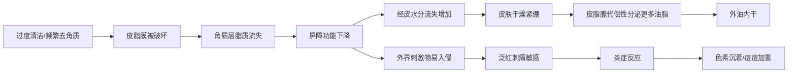
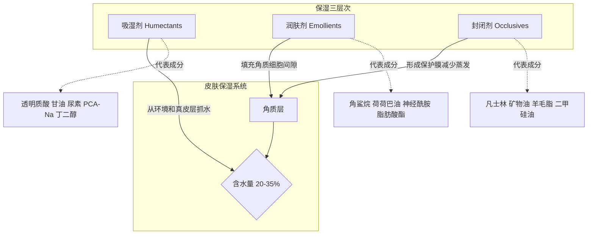
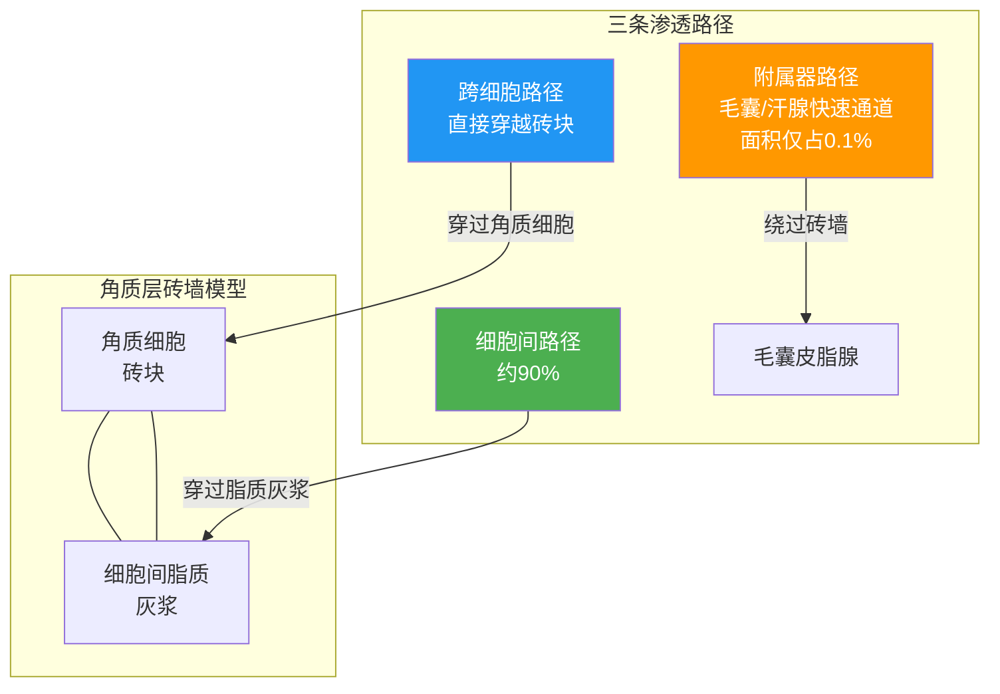
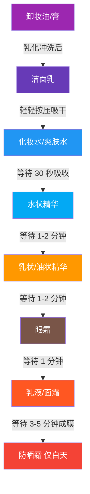
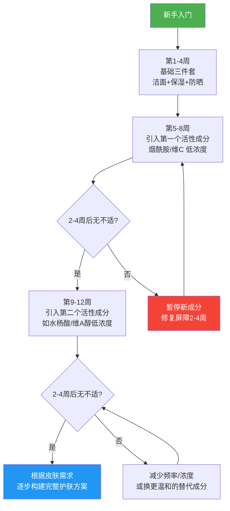
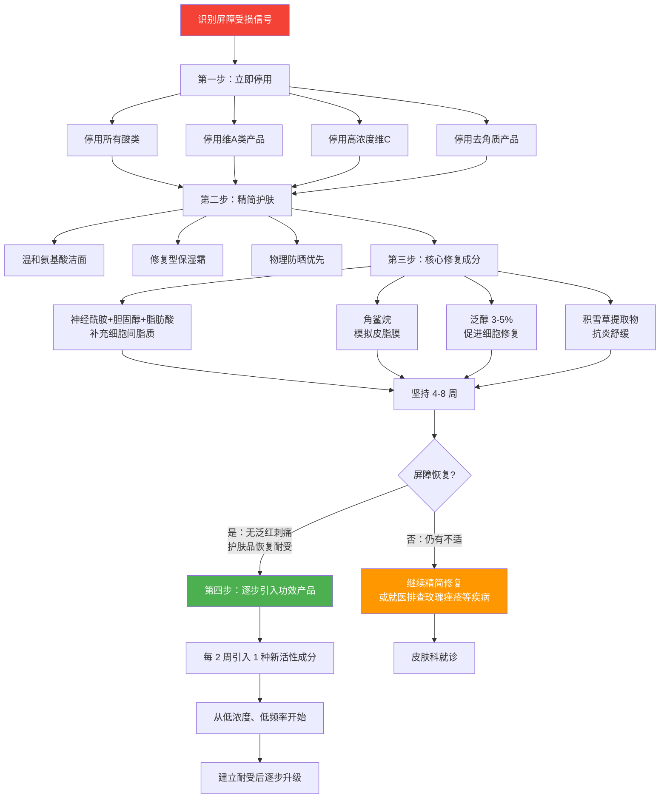

## 四、护肤的基本原理

护肤看似复杂，但底层逻辑可以归结为一套清晰的原理体系。理解这些原理，你就不会被营销话术牵着走，也能根据自己的皮肤状态灵活调整方案。本章从护肤的四大核心目标出发，逐步深入渗透机制、使用顺序、成分搭配、配方基础等关键知识，帮你建立一套「知其然，更知其所以然」的护肤认知框架。

### 4.1 护肤的四大核心目标

所有护肤行为，无论产品形态如何花哨，本质上都在做四件事：**清洁、保湿、防护、修护**。这四者之间不是并列关系，而是有明确的优先级——清洁、保湿、防护是地基，修护/功效是上层建筑。地基不稳，上层建筑就是空中楼阁。

#### 4.1.1 清洁：护肤的第一步，也是最容易踩坑的一步

**清洁的目的**：去除皮肤表面的污垢、多余油脂、老化角质、汗液残留、防晒霜和彩妆残留。清洁做不好，后续护肤品的渗透效率会大打折扣；但清洁过度，反而会破坏皮肤屏障，引发一连串连锁反应。

**清洁过度的连锁反应**：

**表面活性剂的分类与选择**：

洁面产品的核心是表面活性剂（Surfactant），它一头亲水、一头亲油，能把油脂和污垢从皮肤上「拽」下来带走。不同的表活对皮肤的刺激程度差异极大，选错表活是很多人护肤踩坑的起点。

| 表活类型 | pH 范围 | 清洁力 | 刺激性 | 代表成分 | 适用肤质 | 价格 |
|---------|---------|--------|--------|---------|---------|------|
| **皂基** | 9-10（碱性） | ★★★★★ | ★★★★★ | 硬脂酸+氢氧化钾/钠、肉豆蔻酸+氢氧化钾 | 大油皮偶尔用 | 低 |
| **SLS/SLES** | 7-8 | ★★★★ | ★★★-★★★★ | SLS（月桂醇硫酸酯钠）刺激性强；SLES（月桂醇聚醚硫酸酯钠）刺激性较低 | 健康油皮 | 低 |
| **氨基酸系** | 5.5-6.5 | ★★★ | ★★ | 椰油酰谷氨酸钠、月桂酰谷氨酸钠、椰油酰甘氨酸钾 | 所有肤质，日常首选 | 中 |
| **甜菜碱系** | 5.5-7 | ★★★ | ★ | 椰油酰胺丙基甜菜碱、月桂酰胺丙基甜菜碱 | 敏感肌、干皮 | 中 |
| **APG（葡糖苷类）** | 5-7 | ★★★★ | ★★ | 癸基葡糖苷、椰油基葡糖苷 | 所有肤质，清洁力温和兼得 | 中高 |
| **酰基磺酸钠** | 5-6 | ★★★★ | ★★ | 酰基磺酸钠（Sodium Cocoyl Isethionate） | 所有肤质 | 中 |

**为什么皂基伤害大？** 皮肤表面的天然 pH 值在 4.5-6.5 之间（弱酸性），这个酸性环境是「酸 mantle」的一部分，能抑制有害菌生长、维持酶的正常活性。皂基 pH 高达 9-10，会暂时性地大幅提高皮肤 pH 值，破坏酸性保护层，同时皂基的强脱脂力会把皮脂膜和细胞间脂质一起洗掉。偶尔用一次问题不大，但天天用，屏障迟早出问题。

**判断洁面产品类型的简易方法**：看成分表前五位——如果同时出现「脂肪酸（硬脂酸/肉豆蔻酸/月桂酸）+ 碱剂（氢氧化钾/氢氧化钠/三乙醇胺）」，那就是皂基；如果前几位是「XX 酰谷氨酸钠/钾」或「XX 酰甘氨酸钠/钾」，就是氨基酸系。

**洁面的正确操作**：
1. 先洗手（手上的细菌不该上脸）
2. 用温水打湿面部（水温 32-35°C，接近体温，不要用热水——热水会加速皮脂流失）
3. 取适量洁面产品在手心搓出泡沫（不要直接在脸上搓，局部浓度过高会刺激）
4. 泡沫轻柔按摩面部 30-60 秒，重点清洁 T 区
5. 用流动温水彻底冲洗，发际线、下巴边缘不要有残留
6. 用干净毛巾或一次性洗脸巾轻轻按压吸干水分（不要擦，摩擦会刺激角质层）

**关于「二次清洁」**：如果你已经用了卸妆产品充分乳化并冲洗干净，再用洁面产品洗一次就够了。「二次清洁」（卸妆后再用化妆水擦拭）对大多数人来说是过度清洁。只有在使用了防水型防晒/彩妆且卸妆不彻底时才需要。

#### 4.1.2 保湿：不只是「补水」那么简单

很多人的保湿认知停留在「补水」层面，觉得皮肤干就是缺水，涂点水就行。但皮肤干的本质不是「缺水」，而是「留不住水」。皮肤的含水量由角质层决定，健康角质层含水量在 20-35% 之间。低于 10% 就会出现肉眼可见的干燥脱屑。

**保湿的三层机制**：

| 层次 | 作用机制 | 代表成分 | 特点 | 适合肤质 |
|------|---------|---------|------|---------|
| **吸湿剂** | 含多个亲水基团，能与水分子形成氢键，从环境和真皮层吸引水分到角质层 | 透明质酸（HA）、甘油、尿素、PCA-Na、丁二醇、丙二醇、山梨醇、海藻糖 | 环境湿度低于 70% 时，可能反向从皮肤深层吸水导致更干 | 所有肤质，但干燥环境下必须配合封闭剂 |
| **润肤剂** | 填充角质细胞之间的空隙，模拟天然细胞间脂质，使皮肤表面平滑柔软 | 角鲨烷、荷荷巴油、乳木果油、神经酰胺、胆固醇、脂肪酸酯类（如棕榈酸异丙酯） | 不直接增加含水量，但改善皮肤质感和屏障功能 | 所有肤质，干皮和屏障受损肌尤其需要 |
| **封闭剂** | 在皮肤表面形成疏水性薄膜，物理性阻止水分蒸发 | 凡士林（封闭性最强，可减少 98% 水分流失）、矿物油、羊毛脂、二甲硅油、蜂蜡 | 封闭性强可能闷痘，质地偏厚重 | 干皮首选；油皮选轻薄封闭剂如二甲硅油 |

**一个关键知识点：透明质酸的「双面性」**

透明质酸（玻尿酸）是目前最火的保湿成分，1 克 HA 能结合 1000 克水。但它有两个容易被忽略的问题：

1. **分子量差异巨大**：大分子 HA（>1000kDa）无法渗透皮肤，只在表面形成保湿膜；中分子 HA（100-1000kDa）有一定渗透性；小分子 HA（<100kDa）能渗入角质层深处，但小分子 HA 本身可能引发炎症反应。所以「分子量越小越好」是错误的认知。
2. **干燥环境下会「反吸水」**：当空气湿度低于 70%（冬季室内、空调房），HA 不仅从环境吸不到水，还会从皮肤深层吸水往表面蒸发，导致越涂越干。所以含 HA 的产品必须配合封闭剂使用。

**不同肤质的保湿策略**：

| 肤质 | 核心策略 | 推荐配方特点 | 避免 |
|------|---------|-------------|------|
| 干性皮肤 | 吸湿剂+大量润肤剂+封闭剂 | 含神经酰胺、胆固醇、脂肪酸的修复型面霜；质地厚重 | 过度清洁、含酒精产品 |
| 油性皮肤 | 吸湿剂+轻薄润肤剂，少用封闭剂 | 透明质酸精华+轻薄乳液；选二甲硅油做封闭而非凡士林 | 厚重面霜、矿物油 |
| 混合性皮肤 | 分区护理——T 区控油，两颊保湿 | T 区用凝胶/乳液，两颊用面霜 | 全脸统一用同一款产品 |
| 敏感性皮肤 | 温和成分+修复屏障 | 无香精、无酒精、无刺激性防腐剂；含泛醇、积雪草 | 高浓度活性成分、复杂配方 |

#### 4.1.3 防护：抗老的第一要务

如果你的预算只够买一样护肤品，买防晒霜。这不是夸张——皮肤衰老 80% 来自光老化（Photoaging），只有 20% 来自自然老化。换句话说，你花在抗老精华上的钱，如果没有防晒配合，等于打了八折。

**紫外线的完整分类与危害**：

| 类型 | 波长 | 穿透力 | 主要危害 | 特点 |
|------|------|--------|---------|------|
| **UVA-I** | 340-400nm | 极强，直达真皮层 | 光老化主因：降解胶原蛋白、弹性蛋白，导致皱纹、松弛、色斑 | 全年强度稳定，能穿透玻璃，阴天也有 |
| **UVA-II** | 320-340nm | 强，可达真皮浅层 | 色素沉着、光老化 | 同上 |
| **UVB** | 280-320nm | 中等，主要作用于表皮 | 晒伤、晒红、晒黑、DNA 损伤 | 强度随季节/时间/纬度变化明显，不能穿透玻璃 |
| **UVC** | 100-280nm | 弱 | 杀菌能力强 | 被臭氧层完全阻挡，不到达地面 |
| **蓝光 HEV** | 400-500nm | 强，可达真皮层 | 色素沉着、氧化应激、可能影响昼夜节律 | 来自太阳光和电子屏幕，争议较大 |

**光老化的深层机制**：

紫外线对皮肤的伤害不是单一路径，而是多条通路同时作用：

1. **自由基链式反应**：UV → 激发氧分子生成单线态氧（¹O₂）和超氧阴离子（O₂⁻）→ 攻击 DNA、蛋白质、脂质 → 细胞损伤
2. **基质金属蛋白酶（MMPs）激活**：UV → 激活 AP-1 转录因子 → 上调 MMP-1/3/9 表达 → 降解 I 型和 III 型胶原蛋白 → 皮肤松弛、皱纹
3. **DNA 直接损伤**：UVB → 使相邻嘧啶碱基形成环丁烷嘧啶二聚体（CPD）→ 如果核苷酸切除修复（NER）失败 → 突变积累 → 可能导致皮肤癌
4. **免疫抑制**：UV → 诱导角质细胞释放 IL-10、TNF-α → 抑制朗格汉斯细胞功能 → 局部免疫监视下降
5. **慢性炎症**：UV → 激活 NF-κB 通路 → 持续低度炎症 → 组织纤维化、色素异常

**防晒指标解读**：

| 指标 | 含义 | 数值解读 | 测试标准 |
|------|------|---------|---------|
| **SPF** | 防 UVB 能力（防晒伤） | SPF15=93.3% UVB，SPF30=96.7%，SPF50=98%。从 30 到 50 只多了 1.3%，但 SPF30 以下差异明显 | 国际通用 |
| **PA** | 防 UVA 能力（防晒老） | PA+=轻度，PA++=中度，PA+++=高度，PA++++=极高 | 日系/亚洲标准 |
| **PPD** | 持续性色素黑化（防 UVA） | PPD 10 ≈ PA+++，PPD 16+ ≈ PA++++ | 欧系标准 |
| **Broad Spectrum** | 广谱防护 | 同时防护 UVA 和 UVB | 美系标准 |

**防晒霜的分类**：

| 类型 | 原理 | 优点 | 缺点 | 代表成分 |
|------|------|------|------|---------|
| **物理防晒** | 在皮肤表面反射/散射紫外线 | 即涂即生效，温和不易致敏 | 泛白、厚重、可能堵塞毛孔 | 氧化锌（ZnO）、二氧化钛（TiO₂） |
| **化学防晒** | 吸收紫外线并转化为热能释放 | 质地轻薄、透明不泛白 | 部分成分有刺激性或争议，需要 15-20 分钟成膜 | 阿伏苯宗、甲氧基肉桂酸乙基己酯、奥克立林 |
| **物化结合** | 兼具两者原理 | 综合优缺点 | — | 市面上大多数产品 |

**防晒使用的正确姿势**：
1. **用量要足**：面部标准用量是 2mg/cm²，大约一枚一元硬币大小。用量不足，防护力直线下降——涂一半量，SPF50 可能只剩 SPF7 左右
2. **出门前 15-20 分钟涂好**（化学防晒需要成膜时间，物理防晒可即涂即走）
3. **每 2 小时补涂一次**（大量出汗、游泳后需立即补涂）
4. **阴天也要防晒**：UVA 穿透云层的能力很强，阴天的 UVA 强度仍可达晴天的 80%
5. **室内靠近窗户也要防晒**：普通玻璃能挡 UVB 但挡不住 UVA
6. **不要只靠防晒霜**：帽子、墨镜、防晒衣、遮阳伞是物理硬防晒，效果比防晒霜更可靠

#### 4.1.4 修护与功效：在稳固地基上盖楼

修护和功效护肤是解决特定皮肤问题的环节——美白、抗老、祛痘、修复屏障等。**核心原则：先建立健康的屏障，再使用功效性成分。**

为什么？因为功效性成分（酸类、维 A 类、高浓度维 C 等）本身就带有一定刺激性。如果屏障已经受损，这些成分的渗透速度会异常加快，刺激反应也会成倍放大。这就好比一面墙已经有裂缝，你不去修补裂缝反而在上面使劲刷漆，结果只会让裂缝更严重。

**常见功效诉求与对应成分体系**：

| 功效诉求 | 核心成分 | 作用机制 | 起效浓度参考 | 注意事项 |
|---------|---------|---------|------------|---------|
| **美白提亮** | 烟酰胺 | 抑制黑色素向角质细胞转运；促进角质更新 | 2-5% | 部分人对烟酰胺中的杂质烟酸不耐受，会泛红刺痛，从低浓度开始 |
| | 维 C（L-抗坏血酸） | 抑制酪氨酸酶活性；还原已生成的黑色素；抗氧化 | 10-20% | 需要低 pH（<3.5）环境，有一定刺激性，需建立耐受 |
| | 熊果苷（α-熊果苷） | 抑制酪氨酸酶活性 | 2-7% | β-熊果苷效果弱于 α-熊果苷 |
| | 苯乙基间苯二酚（377） | 强效酪氨酸酶抑制剂 | 0.1-0.5% | 效果强但可能有刺激性 |
| **抗老抗皱** | 维 A 醇（视黄醇） | 促进胶原蛋白合成；加速角质更新；调节皮脂分泌 | 0.025-1% | 必须建立耐受；只在晚间使用；孕期禁用 |
| | 胜肽（多肽） | 信号肽刺激胶原合成；神经肽抑制肌肉收缩（类肉毒素效果） | 因肽而异 | 温和但起效较慢 |
| | 玻色因（Pro-Xylane） | 促进糖胺聚糖（GAGs）合成，改善真皮-表皮连接 | 3-30% | 温和，适合不耐受维 A 的人群 |
| **控油祛痘** | 水杨酸（BHA） | 脂溶性，能深入毛孔溶解油脂；抗炎 | 0.5-2% | 敏感肌慎用，注意保湿 |
| | 壬二酸 | 抑制角质化异常；抗菌；抑制酪氨酸酶 | 10-20% | 温和度优于水杨酸 |
| | 过氧化苯甲酰 | 杀灭痤疮丙酸杆菌 | 2.5-10% | 有漂白织物的风险 |
| **修复屏障** | 神经酰胺 | 补充细胞间脂质的主要成分（占细胞间脂质约 50%） | 0.5-2% | 与胆固醇、脂肪酸以 3:1:1 比例复配效果最佳 |
| | 角鲨烷 | 模拟皮脂膜成分，抗氧化 | 纯油或配方中 | 温和，几乎不致敏 |
| | 泛醇（维生素 B5） | 促进伤口愈合；增强屏障；保湿 | 1-5% | 非常温和 |
| **抗炎舒缓** | 积雪草提取物（CICA） | 促进胶原合成；抗炎；促进伤口愈合 | 1-5% | 敏感肌的核心修护成分 |
| | 甘草酸二钾 | 抑制炎症因子；抗敏 | 0.05-0.5% | 温和 |
| | 红没药醇 | 抗炎；促进渗透 | 0.2-1% | 来自洋甘菊 |

**功效护肤的进阶原则**：
- **引入新成分时遵循「低频率、低浓度、短接触」原则**：第一周隔天用一次，无不适再逐步增加频率
- **同一时间只引入一种新活性成分**：出问题时能快速定位原因
- **观察期至少 2-4 周**：皮肤代谢周期约 28 天，急于求成反而会打乱节奏
- **活性成分之间有搭配禁忌**（详见 4.4 节）

### 4.2 护肤品的渗透原理

理解渗透原理，才能明白为什么有些产品「涂了等于没涂」，为什么有些产品需要特殊使用方式才能发挥效果。

#### 4.2.1 皮肤的渗透屏障

皮肤最外层的角质层（Stratum Corneum）是护肤品渗透的最大障碍。它由 15-20 层扁平的死亡角质细胞组成，细胞之间填充着致密的脂质基质，结构就像「砖墙」——角质细胞是砖块，细胞间脂质是灰浆。

**三条渗透路径详解**：

1. **细胞间路径（Intercellular pathway）**：活性成分沿着角质细胞之间的脂质基质迂回渗透。这是最主要的渗透路径，约占 90% 的渗透量。脂溶性成分在这条路径上有天然优势——因为「灰浆」本身就是脂质。
2. **跨细胞路径（Transcellular pathway）**：活性成分直接穿过角质细胞本身。需要同时具备水溶性（穿过细胞内部的水性环境）和脂溶性（穿过细胞膜的脂质双分子层），难度较高。
3. **附属器路径（Transappendageal pathway）**：通过毛囊、汗腺、皮脂腺等皮肤附属器渗透。虽然这些结构占皮肤面积不到 0.1%，但对某些大分子成分（如某些多肽）和离子型成分来说是重要的渗透通道。一些新型促渗技术（如微针、电穿孔）也是利用这条路径。

#### 4.2.2 影响渗透的六大因素

| 因素 | 原理 | 实际影响 | 如何利用/应对 |
|------|------|---------|-------------|
| **分子量** | 「500 道尔顿规则」——分子量 <500Da 的成分更容易穿透角质层。大于 500Da 的成分渗透效率急剧下降 | 大分子透明质酸（>1000kDa）无法渗透，只在表面成膜；小分子肽（<500Da）渗透更好 | 选择分子量合适的成分；关注品牌的透皮技术（脂质体、纳米乳等） |
| **脂溶性 vs 水溶性** | 角质层脂质屏障对脂溶性成分更友好。logP 值（辛醇/水分配系数）在 1-3 之间的成分渗透效率最高 | 维 A 醇（脂溶性）比维 C（水溶性）更容易穿透角质层 | 水溶性成分可借助促渗剂（如乙醇、丙二醇）或包裹技术提升渗透 |
| **浓度梯度** | 根据 Fick 扩散定律，浓度梯度越大，渗透驱动力越强 | 浓度翻倍，渗透量大致翻倍（但不绝对，因为皮肤本身也有吸附容量限制） | 不要盲目追求高浓度——过高浓度可能超过皮肤耐受阈值，引发刺激而非性效提升 |
| **pH 值** | 弱酸性成分在低 pH 下以非离子化形式存在，更易穿透脂质屏障（离子化形式水溶性太强，不易穿膜） | 维 C（L-抗坏血酸，pKa=4.2）在 pH<3.5 时渗透效率最高；果酸（AHA）也需要低 pH 才能以游离酸形式发挥作用 | 使用维 C 精华后等 15-20 分钟再涂后续产品，避免 pH 被中和 |
| **皮肤状态** | 屏障完整时渗透慢（保护机制）；屏障受损时渗透快但刺激风险也大 | 刷酸后皮肤变薄，后续产品渗透加快——既是机会也是风险 | 屏障受损期间暂停所有活性成分，只做温和清洁+保湿+防晒 |
| **使用方式** | 湿敷增加角质层含水量（水合），角质细胞吸水膨胀后细胞间隙变大，渗透加快；按摩增加局部血液循环 | 「先敷面膜再涂精华」确实能提升精华渗透量，但同时也会增加刺激成分的渗透 | 敏感肌不要用湿敷来「促渗」刺激性成分；温和成分可以借助水合提升效果 |

**现代促渗技术**：

| 技术 | 原理 | 优点 | 代表应用 |
|------|------|------|---------|
| **脂质体包裹** | 用磷脂双分子层包裹活性成分，模拟细胞膜结构，更容易与皮肤脂质融合 | 提高稳定性+渗透性 | 一些高端精华 |
| **纳米乳/微乳** | 将油相液滴做到纳米级（<200nm），增大接触面积 | 渗透效率高，质地轻薄 | 防晒霜、精华 |
| **环糊精包裹** | 环糊精的疏水空腔包裹活性分子，到皮肤表面释放 | 提高不稳定成分（如维 C、维 A）的稳定性 | 稳定化维 C 产品 |
| **微针贴片** | 可溶性微针物理穿透角质层，直接将成分送到表皮深处 | 绕过角质层屏障，渗透效率极高 | 祛痘贴、美白贴（新兴品类） |

### 4.3 护肤品的使用顺序——「先水后油」原则

护肤品的使用顺序不是随意的，它遵循一个核心物理原则：**水溶性产品先用，油溶性产品后用**。

为什么？因为油性成分会在皮肤表面形成一层连续的疏水膜。如果先涂油性产品，后续的水溶性成分就无法穿透这层膜到达皮肤表面，渗透效率会大幅降低。反过来，先涂水溶性产品让它渗透进角质层，再用油性产品「封住」，既保证了水溶性成分的渗透，又借助油膜减少水分蒸发。

**完整的使用顺序与等待时间**：

**特殊情况的顺序调整**：

- **含硅产品（如含二甲硅油的妆前乳）**：含硅产品会形成一层光滑的膜，影响后续产品附着。如果你同时用含硅妆前乳和防晒霜，防晒应该在妆前乳之后
- **面膜**：片状面膜用在化妆水之后、精华之前（面膜本质是高浓度精华液的湿敷）；泥膜用在洁面之后
- **刷酸产品**：水杨酸/果酸产品用在洁面后、化妆水前（需要直接接触皮肤、低 pH 环境才能发挥作用）；或者用在化妆水之后（看产品说明）
- **维 A 醇**：可以在乳液/面霜之前或之后使用。在面霜之后使用可以「缓冲」——减少渗透速度，降低刺激，适合新手

### 4.4 成分搭配的协同与冲突

成分之间的关系远比「越贵越好」复杂。搭配得当，1+1>2；搭配失误，轻则浪费产品，重则烂脸。

#### 4.4.1 经典高效搭配

| 搭配组合 | 协同机制 | 使用建议 | 效果 |
|---------|---------|---------|------|
| **维 C + 维 E + 阿魏酸** | 维 C 和维 E 都是抗氧化剂，但作用位点不同（水相 vs 脂相）；阿魏酸能稳定两者并提升光防护效果 8 倍 | 早上使用，配合防晒 | 经典抗氧化铁三角，代表产品：修丽可 CE 精华 |
| **烟酰胺 + 透明质酸** | 烟酰胺美白控油+HA 保湿，功能互补且 pH 兼容 | 任何时间 | 温和且全面 |
| **维 C（早）+ 维 A 醇（晚）** | 早抗氧化防护，晚修复再生；两者 pH 和使用时间冲突，分开最佳 | 早上维 C+防晒，晚上维 A 醇 | 全天候抗老方案 |
| **神经酰胺 + 胆固醇 + 脂肪酸** | 模拟角质层细胞间脂质的天然组成（3:1:1 比例） | 任何时候，屏障修复必备 | 屏障修复的黄金组合 |
| **水杨酸 + 烟酰胺** | BHA 清理毛孔+烟酰胺控油抗炎 | 先酸后烟酰胺，间隔 15 分钟 | 痘肌优选 |

#### 4.4.2 需要注意的搭配

| 冲突组合 | 问题 | 正确做法 |
|---------|------|---------|
| **多种酸类同时使用**（水杨酸+果酸+维 A 酸） | 叠加刺激，屏障受损风险极高 | 一次只用一种酸，至少间隔一天轮换 |
| **维 C（L-抗坏血酸）+ 高 pH 产品** | 维 C 需要 pH<3.5 才能有效渗透，后续高 pH 产品会中和 | 维 C 精华后等 15-20 分钟再涂后续 |
| **铜肽（GHK-Cu）+ 酸类/维 C** | 酸性环境和还原性环境会影响铜肽的稳定性，铜离子可能被还原 | 铜肽产品单独使用或与温和保湿产品搭配 |
| **维 A 醇 + 高浓度酸类** | 两者都加速角质更新，叠加后皮肤可能过度脱皮 | 不在同一晚使用，至少间隔一天 |
| **烟酰胺 + 低 pH 环境**（传统误区澄清） | 早期研究认为低 pH 下烟酰胺会水解为烟酸导致泛红，但实际在正常使用条件下反应极其缓慢 | 现代配方已基本解决此问题，可以放心叠加 |

#### 4.4.3 新手引入活性成分的路线图

### 4.5 护肤的「木桶理论」

皮肤状态取决于最薄弱的环节，而不是你花了最多钱的那个环节。

**典型场景**：
- 花 500 块买抗老精华，但每天不涂防晒——抗老精华的效果被光老化抵消了 80%
- 用高浓度维 A 醇刷酸，但不修复屏障——皮肤越来越敏感，反而加速老化
- 每天精心涂护肤品，但卸妆用化妆棉大力擦拭——物理摩擦造成的微损伤比护肤品的修护还多
- 疯狂美白，但不做防晒——紫外线持续刺激黑色素生成，美白速度永远追不上晒黑速度

**基础护肤三件套（清洁-保湿-防晒）是一切功效护肤的前提。** 在这三件事做好的基础上，再考虑美白、抗老、祛痘等功效性诉求。顺序搞反了，花再多钱都是浪费。

### 4.6 护肤品配方基础知识

了解基础配方知识，你就能看懂成分表，不被营销话术忽悠。

#### 4.6.1 乳化体系

大多数乳液和面霜都是乳化体系——把本来不相溶的油和水通过乳化剂混合在一起。

| 类型 | 结构 | 质地 | 吸收感 | 适合肤质 | 判断方法 |
|------|------|------|--------|---------|---------|
| **水包油 O/W** | 水为连续相，油为分散相 | 清爽、轻薄 | 快速吸收，不油腻 | 油性/混合性皮肤 | 涂在手上，用水能冲洗掉 |
| **油包水 W/O** | 油为连续相，水为分散相 | 滋润、厚重 | 吸收较慢，有油润感 | 干性皮肤 | 涂在手上，用水冲不掉，需要洁面产品 |

#### 4.6.2 防腐体系

所有含水的护肤品都必须防腐——水是微生物生长的温床，不防腐的产品开封后几天就会变质。宣称「无防腐」的产品通常使用多元醇（戊二醇、辛甘醇、1,2-己二醇）等成分替代传统防腐剂，但这些成分本身也有一定刺激性，且防腐效果不如传统防腐剂明确。

| 防腐剂类型 | 代表成分 | 温和度 | 争议性 |
|-----------|---------|--------|--------|
| 有机酸类 | 苯甲酸钠、山梨酸钾 | 较温和 | 低 |
| 醇类 | 苯氧乙醇 | 中等 | 低，但浓度>1% 可能有灼热感 |
| 尼泊金酯类 | 羟苯甲酯、羟苯乙酯 | 较温和 | 有内分泌干扰争议，但 EU/CIR 等权威机构认为在规定浓度内安全 |
| 甲醛释放体 | DMDM 乙内酰脲、咪唑烷基脲 | 刺激性较高 | 有释放甲醛的争议，敏感肌避免 |
| 多元醇替代 | 戊二醇、辛甘醇 | 较温和 | 不是严格意义上的防腐剂，防腐效力有限 |

#### 4.6.3 增稠体系与使用感

卡波姆、黄原胶、丙烯酸（酯）类共聚物是常见的增稠剂。它们不影响产品功效，但决定了产品的质地——是水润的还是厚实的，是流动的还是膏状的。看到成分表里有这些不用紧张，它们是配方必需的基础成分。

#### 4.6.4 香精与色素

香精是护肤品中排名前列的致敏原。欧盟化妆品法规要求标注 26 种常见致敏香精成分。如果你是敏感肌，选择「无香精（Fragrance-Free）」产品，而非「无香型（Un-Scented）」——后者可能仍含香精来掩盖原料气味。

色素对皮肤没有任何实际功效，唯一的用途是让产品更好看。敏感肌应尽量避免含色素的产品。

### 4.7 皮肤屏障修复流程

当屏障受损时（表现为泛红、刺痛、紧绷、脱屑、对护肤品不耐受），需要一套系统的修复流程：

**屏障修复期间的常见误区**：
1. **「裸脸修复」**：什么都不涂。皮肤本身有修复能力，但提供修复原料（神经酰胺等）能加速修复过程。什么都不涂反而让皮肤在干燥中挣扎
2. **频繁敷面膜「补水」**：过度水合本身也会削弱屏障。屏障受损期间每周敷 1-2 次温和的修复面膜即可
3. **急于求成**：屏障修复是一个以「周」为单位的过程，不可能一夜之间恢复。频繁更换产品只会让皮肤更混乱

### 4.8 常见护肤误区与科学纠正

| 误区 | 真相 | 科学依据 |
|------|------|---------|
| 「出油是因为缺水，补水就能控油」 | 油脂分泌由雄激素调控，与皮肤含水量无直接关系。过度补水反而可能破坏屏障 | 皮脂腺受 DHT（双氢睾酮）和 IGF-1 调控 |
| 「天然/有机的一定比化学的好」 | 天然≠安全，化学≠有害。毒蘑菇是天然的，水也是化学物质。关键是成分的安全性和有效性 | 毒理学原则：剂量决定毒性 |
| 「护肤品能收缩毛孔」 | 毛孔大小由基因和皮脂分泌决定，护肤品无法改变毛孔的实际大小。含硅产品可以暂时性填充毛孔使其看起来更小，含酸产品可以清洁毛孔使其看起来更小 | 皮肤结构学 |
| 「护肤品要经常换，不然皮肤会产生耐受性」 | 皮肤不会对护肤品「产生耐受性」。如果一个产品一直有效，没必要换。需要换的是因为季节变化、年龄变化导致的需求变化 | 药理学 |
| 「贵的一定比便宜的好」 | 护肤品的价格由品牌溢价、包装、营销、渠道成本等决定，与功效不完全正相关。很多平价产品配方科学、成分到位 | 成分分析 |
| 「拍打能促进吸收」 | 轻柔按摩确实能促进血液循环和渗透，但大力拍打只是在物理震动皮肤表面，对渗透帮助不大，反而可能引起刺激 | 渗透动力学 |

***

本章建立的「四大目标—渗透原理—使用顺序—成分搭配—配方基础—屏障修复—误区纠正」知识框架，是后续所有护肤实操的理论基石。掌握了这些原理，面对任何产品、任何成分、任何营销话术，你都能用科学的视角做出独立判断。
