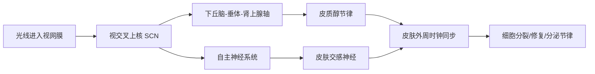
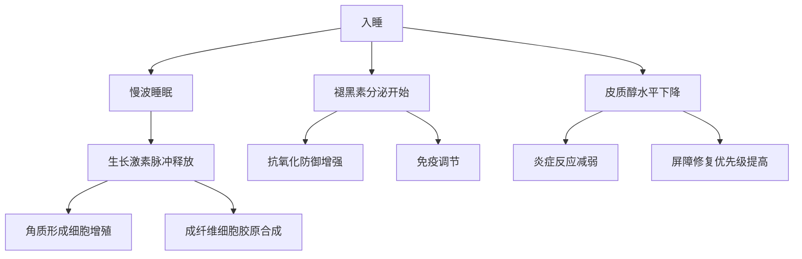
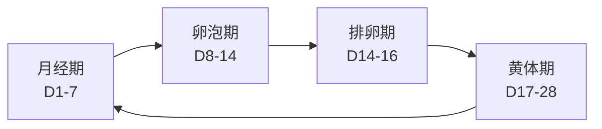

## 五、皮肤的生理节律

你有没有发现，早上起来皮肤状态特别好，到了下午就开始出油暗沉？熬夜之后第二天皮肤明显变差？冬天皮肤比夏天更容易脱皮？这些都不是错觉——皮肤拥有独立的"生物钟系统"，它在24小时、28天（女性）、四季乃至一生中的功能状态都在有节律地变化。皮肤科权威期刊《Journal of Investigative Dermatology》的研究明确指出：皮肤的屏障功能、细胞增殖、DNA修复、皮脂分泌、温度调节、药物经皮吸收均呈现显著的昼夜波动，波动幅度可达20%-100%。

理解这些节律，不是"锦上添花"，而是决定护肤方案是否有效的底层逻辑。在错误的时间做正确的事，效果大打折扣；在正确的时间做正确的事，效果事半功倍。

### 5.1 昼夜节律：皮肤的24小时

#### 5.1.1 生物钟的分子机制

皮肤的昼夜节律并非凭空产生，而是由一套精密的分子钟驱动。这套时钟系统包含以下核心组件：

**核心时钟基因回路**：

| 基因/蛋白 | 功能 | 节律特征 |
|-----------|------|----------|
| CLOCK/BMAL1 | 正向调控因子，形成异二聚体启动转录 | 白天表达较高 |
| PER1/2/3, CRY1/2 | 负向调控因子，抑制CLOCK/BMAL1活性 | 夜间表达较高 |
| REV-ERBα/β | 辅助回路，精细调节BMAL1表达 | 与核心回路耦合 |
| RORα | 辅助回路，与REV-ERB竞争性调控 | 调节振幅和相位 |

这四组基因构成一个"转录-翻译负反馈环路"（TTFL），周期约24小时。CLOCK和BMAL1蛋白在白天形成复合体，结合到PER和CRY基因的启动子区域（E-box元件），启动它们的转录。PER和CRY蛋白积累到一定浓度后，反过来抑制CLOCK/BMAL1的活性，使自身转录下降。当PER/CRY蛋白降解后，抑制解除，新一轮循环开始。

**关键事实**：皮肤细胞拥有独立于大脑主时钟（视交叉上核，SCN）的外周时钟。即使将皮肤成纤维细胞在体外培养，其生物钟基因的振荡仍能持续数天。但主时钟通过体温节律、皮质醇分泌、自主神经信号等途径对外周时钟进行"授时"（entrainment），使全身节律同步。

**2017年诺贝尔奖背景**：Jeffrey C. Hall、Michael Rosbash、Michael W. Young因发现控制昼夜节律的分子机制（Period基因的转录-翻译负反馈环路）获得诺贝尔生理学或医学奖。这一发现直接证明了昼夜节律不是简单的"习惯"，而是由基因编码的、进化保守的生理过程。

#### 5.1.2 白天模式：防御优先（约6:00-18:00）

白天的皮肤处于"防御工事"状态，所有功能围绕抵御外界侵害展开：

**皮脂分泌的双峰节律**：

皮脂腺的活性并非全天均匀，而是呈现"双峰曲线"：
- **第一峰值**：上午10:00-11:00，受皮质醇和睾酮的昼夜节律驱动
- **第二峰值**：下午14:00-15:00，与体温节律的午后峰值相关
- **最低值**：凌晨2:00-4:00

皮脂分泌速率的变化幅度可达基础值的50%以上。这意味着油皮在中午和下午的控油需求是早上的1.5倍。2006年《Skin Pharmacology and Physiology》的研究测量了健康志愿者24小时皮脂分泌率，证实了这一双峰模式。

**屏障功能的日间增强**：

角质层的紧密排列程度在白天达到最高。这由以下机制维持：
- 角质形成细胞在白天表达更多的紧密连接蛋白（claudin-1、occludin）
- 神经酰胺和胆固醇的合成在白天保持稳定
- 角质层含水量在早上起床后最高（经过夜间修复），随后逐渐下降

**DNA修复能力的午后峰值**：

2017年《Journal of Investigative Dermatology》的一项关键研究发现：紫外线诱导的胸腺嘧啶二聚体（CPD）的核苷酸切除修复（NER）效率在下午达到峰值。这意味着如果你不幸在上午被晒伤，皮肤在下午的自我修复能力最强。但从护肤策略角度，更应该在上午加强防晒，因为DNA修复能力尚未达到峰值。

**皮肤温度和血流节律**：

| 时段 | 皮肤温度 | 皮下血流 | 特征 |
|------|----------|----------|------|
| 06:00-10:00 | 逐渐升高 | 逐渐增加 | 从夜间低谷回升 |
| 10:00-14:00 | 相对稳定（约32-33°C） | 中等 | 防御模式稳定运行 |
| 14:00-18:00 | 略有下降 | 略有减少 | 午后低谷（post-lunch dip） |

**白天护肤的科学策略**：

1. **抗氧化优先**（早间精华）：白天紫外线、蓝光、污染产生的活性氧（ROS）是夜间的3-5倍。维C（L-抗坏血酸）在上午使用效果最佳，因为它既是ROS清除剂，又能增强防晒效能——研究表明维C+防晒霜的组合可将UVB伤害降低约20%（《Journal of the American Academy of Dermatology》）。
2. **防晒全天候**：上午10点至下午4点紫外线最强，但UVA全年无休。SPF30可阻隔约96.7%的UVB，SPF50阻隔约98%——差距不大但关键。PA值（UVA防护）的选择比SPF值更重要。
3. **控油节奏化**：中午12:00-13:00补涂防晒时，先用吸油纸按压（不要擦），再补涂。直接在油脂上叠加防晒霜会稀释防护膜。
4. **保湿轻薄化**：白天选择含透明质酸、甘油等水溶性保湿剂的轻薄乳液，避免厚重油脂堵塞毛孔。

#### 5.1.3 夜间模式：修复优先（约20:00-6:00）

夜间是皮肤的"施工高峰期"，从防御切换到修复和再生：

**细胞分裂的夜间爆发**：

角质形成细胞的有丝分裂指数（mitotic index）在午夜至凌晨4:00达到峰值，是白天的约2倍。2003年《Journal of Investigative Dermatology》的经典研究使用胸腺嘧啶标记法追踪了表皮细胞分裂，发现有丝分裂高峰出现在凌晨2:00左右。这与生长激素（GH）的夜间分泌脉冲密切相关——GH在入睡后1-2小时的慢波睡眠期分泌最旺盛，直接刺激皮肤细胞增殖。

**修复机制的夜间激活**：

| 修复过程 | 夜间特征 | 关键驱动因素 |
|----------|----------|--------------|
| DNA修复 | 从午后的NER高峰逐渐下降，但碱基切除修复（BER）夜间活跃 | PARP酶、APE1 |
| 胶原蛋白合成 | 午夜至凌晨达到峰值 | 生长激素、TGF-β |
| 屏障修复 | 经皮水分流失（TEWL）增加，但修复机制同时启动 | 神经酰胺合成酶 |
| 血管修复 | 毛细血管扩张，血液循环加快 | NO（一氧化氮）释放 |

**经皮水分流失（TEWL）的夜间增加**：

这是一个容易被忽视但非常关键的节律：TEWL在夜间比白天高约20-30%。这意味着皮肤在夜间虽然修复能力最强，但同时也是最"缺水"的时段。这就是为什么夜间使用封闭性更强的保湿产品（如含角鲨烷、矿脂的面霜）有明确的科学依据——它们不是简单地"保湿"，而是减少TEWL，为皮肤修复创造最佳含水量环境。

**激素的夜间协同**：

**褪黑素的皮肤作用**：褪黑素不仅是"睡眠激素"，还是强效抗氧化剂。它能直接清除羟基自由基（·OH），其抗氧化能力是谷胱甘肽的4倍。褪黑素受体（MT1、MT2）在皮肤角质形成细胞、成纤维细胞和黑素细胞上均有表达。2019年《Antioxidants》的综述指出，褪黑素通过Nrf2-ARE通路增强皮肤内源性抗氧化酶系统，包括超氧化物歧化酶（SOD）、过氧化氢酶（CAT）和谷胱甘肽过氧化物酶（GPx）。

**皮肤渗透性的夜间增强**：

夜间皮肤的经皮吸收效率比白天高约10-25%。原因包括：
- 角质层含水量下降后，脂质双层结构略有松散
- 毛细血管扩张增加了活性成分的系统吸收
- 体温略升促进分子扩散

这既是机会（功效成分吸收更好），也是风险（刺激性成分的不良反应概率增加）。因此，维A醇、果酸等刺激性成分建议在夜间使用，但需要从低浓度起步。

**夜间护肤的科学策略**：

1. **清洁彻底但温和**：使用双重清洁法——先用油溶性卸妆产品溶解防晒和彩妆，再用氨基酸类或APG类表面活性剂清洁。水温32-35°C（接近皮肤温度），避免热水破坏皮脂膜。
2. **功效成分窗口期**：维A醇（促进细胞更新，与夜间细胞分裂高峰协同）、烟酰胺（修复屏障，减少TEWL）、胜肽类（信号肽刺激胶原合成，与生长激素夜间脉冲协同）。
3. **修复性保湿**：含神经酰胺、胆固醇、脂肪酸的仿生脂质配方，补充角质层间质；面霜选择含角鲨烷、乳木果油等封闭剂的配方，减少TEWL。
4. **睡眠环境优化**：室温18-22°C，湿度40-60%。干燥的睡眠环境（如暖气房、空调房）会加速TEWL，可在床头放置加湿器。

> **早晚分治的科学总结**：早间护肤的核心逻辑是"降低氧化应激+阻断紫外线"，晚间护肤的核心逻辑是"支持内源性修复+补充屏障原料"。这不是营销话术，是基于昼夜节律生物学的合理推导。

#### 5.1.4 轮班工作者和夜猫子的特殊策略

全球约20%的人口从事轮班工作，长期昼夜节律紊乱（circadian disruption）对皮肤的影响不容忽视：

**轮班工作对皮肤的具体影响**：
- 皮质醇节律逆转，导致皮肤炎症标志物（IL-1β、TNF-α）持续升高
- 褪黑素分泌受抑，抗氧化防御下降
- 细胞分裂节律紊乱，DNA修复效率降低
- 皮肤微生物组组成改变，痤疮丙酸杆菌比例上升

**实用调整建议**：
- 即使是夜班，也维持固定的"白天"和"夜间"护肤时间——用闹钟设定，不要因为作息不同就跳过
- 夜班工作者的"早上"（即起床后的护肤时间）仍应执行防御性护肤（抗氧化+防晒，即使是晚上上班，日间睡眠前也要涂防晒，因为室内蓝光和窗户透过的UVA仍在产生伤害）
- 使用含烟酰胺的产品有助于稳定皮肤节律——研究表明烟酰胺能调节生物钟基因CLOCK的表达（《Biochemical and Biophysical Research Communications》）

### 5.2 月度节律：激素周期与皮肤（女性）

女性皮肤状态受卵巢激素（雌激素和孕激素）的月度周期调控，周期平均约28天（正常范围21-35天）。

#### 5.2.1 四阶段详解

**月经期（第1-7天）：低潮期**

- **激素环境**：雌激素和孕激素均处于周期最低点
- **皮肤表现**：角质层含水量下降，经皮水分流失增加；微循环减弱导致面色暗沉；免疫功能下降，皮肤屏障减弱
- **科学原理**：雌激素是天然的"皮肤保护因子"——它促进透明质酸合成、增加胶原蛋白密度、增强屏障功能。雌激素低谷时，这些保护作用暂时减弱
- **护肤策略**：以温和修复为主。使用含神经酰胺、角鲨烷的屏障修复产品；避免高浓度维A醇、果酸等刺激性成分；加强保湿，选择含透明质酸和甘油的产品
- **常见错误**：月经期看到皮肤变差就急于使用强效产品，反而加重刺激

**卵泡期（第8-14天）：上升期**

- **激素环境**：雌激素水平持续上升，FSH（卵泡刺激素）促进卵泡发育
- **皮肤表现**：胶原蛋白合成增加，皮肤厚度和弹性改善；皮脂分泌适中；毛孔收细；含水量回升
- **科学原理**：雌激素通过与皮肤成纤维细胞上的ER-α受体结合，上调I型和III型前胶原基因表达。雌激素还抑制基质金属蛋白酶（MMP-1/3/9）的活性，减少胶原降解
- **护肤策略**：这是皮肤状态最佳的窗口期，适合引入新的功效成分、尝试刷酸或进行光电项目。皮肤耐受性在此阶段最强

**排卵期（第14-16天）：巅峰期**

- **激素环境**：雌激素达到峰值，LH（黄体生成素）激增触发排卵
- **皮肤表现**：皮肤光泽度、弹性、含水量均达到周期最高点；面部血色最好；毛孔最小
- **护肤策略**：维持性护理即可。这是尝试新产品的最安全时期——皮肤耐受性最强，不良反应概率最低

**黄体期（第17-28天）：下降期**

- **激素环境**：孕激素快速上升（黄体分泌），雌激素出现二次小幅升高后下降。若未受孕，黄体退化，两种激素均急剧下降
- **皮肤表现**：
  - 孕激素促进皮脂腺增大和皮脂分泌增加（这是痤疮的主要触发因素之一）
  - 睾酮的相对比例升高（孕激素的代谢产物有弱雄激素活性），进一步促进皮脂分泌
  - 体温升高约0.3-0.5°C，汗腺活性增加
  - 水钠潴留导致面部轻微浮肿
  - 黑色素细胞活性增加（孕激素可直接刺激黑素细胞）
- **护肤策略**：
  - 控油清洁：使用含水杨酸（BHA，2%）的清洁产品，水杨酸是脂溶性的，能深入毛孔清除多余皮脂
  - 预防痤疮：黄体期后期（月经前5-7天）开始使用水杨酸或壬二酸点涂易长痘区域
  - 抗炎：黄体期后期皮肤炎症标志物升高，可使用含甘草酸二钾、红没药醇等抗炎成分的产品
  - 避免厚重妆容：皮脂分泌增加+封闭性彩妆=毛孔堵塞

#### 5.2.2 男性皮肤的激素节律

男性皮肤同样存在激素相关节律，但周期更短、波动更小：

- **睾酮的昼夜节律**：睾酮在清晨6:00-8:00达到峰值（约比夜间高30%），随后逐渐下降。这直接影响皮脂分泌——男性的皮脂分泌在上午比下午更旺盛
- **DHT（双氢睾酮）**：是睾酮的活性代谢产物，由5α-还原酶转化。DHT对皮脂腺的刺激作用是睾酮的5-10倍。头皮和面部皮脂腺密度最高，因此也是DHT作用最强的区域
- **皮质醇的应激节律**：男性在工作压力下皮质醇升高更显著（相比女性的HPA轴反应），这会进一步刺激皮脂分泌并削弱屏障功能

**男性护肤节律建议**：
- 早间（起床后30分钟内）是皮脂分泌上升最快的时段，应尽早完成清洁和控油
- 工作日压力大时（皮质醇偏高），晚间护肤应增加抗炎成分（如积雪草苷、泛醇）
- 剃须后的皮肤是最脆弱的时刻——剃须损伤角质层，应立即使用含神经酰胺和泛醇的修复产品

#### 5.2.3 皮肤日记记录法

系统记录是发现个人节律的唯一可靠方法。以下是记录模板：

**每日记录（30秒完成）**：

| 项目 | 记录内容 | 记录方式 |
|------|----------|----------|
| 日期 | 日期+月经第几天 | 数字 |
| 出油程度 | 无/轻/中/重 | 用吸油纸数量判断 |
| 干燥程度 | 无/轻/中/重 | 两颊紧绷感 |
| 痘痘 | 数量+位置 | 记具体数量 |
| 暗沉程度 | 无/轻/中/重 | 自然光下观察 |
| 敏感 | 无/轻/中/重 | 泛红、刺痛、灼热 |
| 特殊事件 | 熬夜/换产品/饮食异常 | 文字备注 |

坚持记录2-3个月（至少2个完整月经周期），你就能识别出：
- 哪几天是你的"皮肤好日子"，适合安排重要场合
- 哪几天是"皮肤危险期"，需要提前预防
- 哪些产品在什么周期阶段效果最好

### 5.3 季节性节律：四季护肤的科学依据

季节变化通过温度、湿度、紫外线强度、花粉浓度等环境因素，系统性地影响皮肤的每一个功能。

#### 5.3.1 春季（3-5月）：苏醒与敏感

**环境特征**：
- 温差大（日温差可达10-15°C），湿度波动剧烈
- 紫外线强度从冬季低谷开始回升（UVB月均辐射量比冬季增加约40%）
- 花粉浓度急剧升高
- 空气中PM2.5和臭氧水平上升

**皮肤生理变化**：
- 从冬季的低代谢状态逐渐恢复，角质形成细胞更新加快
- 皮脂腺活性从冬季低谷开始回升，但恢复速度慢于气温上升——这就是"外油内干"的高发期
- 皮肤屏障在季节转换期间最容易出现"窗口期"——旧的屏障适应了冬季低湿环境，新的屏障尚未建立

**春季护肤要点**：

| 问题 | 原因 | 解决方案 |
|------|------|----------|
| 季节性过敏 | 花粉接触皮肤引发IgE介导的过敏反应 | 口服抗组胺药（如氯雷他定）；外用含红没药醇、泛醇的舒缓产品；减少户外活动后的清洁 |
| "外油内干" | 皮脂腺活性上升但屏障尚未修复 | 先修复屏障（神经酰胺），再逐步引入控油产品 |
| 春季痤疮爆发 | 皮脂腺从冬季低谷恢复，角质代谢加快但毛孔适应滞后 | 提前2周开始使用低浓度水杨酸（0.5-1%） |
| 紫外线恢复性伤害 | 冬季几乎没有UVB暴露，皮肤对紫外线的耐受最低 | SPF30+PA+++起步，逐步建立光防护习惯 |

#### 5.3.2 夏季（6-8月）：活跃与防护

**环境特征**：
- UVB达到年度峰值（6-7月），UVA全年稳定
- 高温高湿（>80%相对湿度在南方常见）
- 空调环境导致室内外温差巨大（可达15°C）
- 出汗量增加，汗液pH偏碱性

**皮肤生理变化**：
- 皮脂分泌达到年度峰值
- 汗腺活跃，汗液蒸发散热是主要温度调节方式
- 角质层含水量因高湿环境而相对充足
- 黑色素合成活跃（黑色素细胞在UVB刺激下合成更多黑色素用于光防护）

**夏季护肤要点**：

1. **防晒是头等大事**：
   - 选择SPF50+、PA++++的广谱防晒
   - 每2小时补涂一次（出汗后立即补涂）
   - 防晒霜用量：面部约1元硬币大小（约1g），不足量等于不足防护——SPF50用半量效果约等于SPF7
   - 物理遮挡（帽子、墨镜、防晒衣）的防护效果优于防晒霜

2. **控油但不破坏屏障**：
   - 使用含水杨酸（BHA）或壬二酸的控油产品，而非频繁洗脸
   - 过度清洁（一天洗脸>3次）会破坏皮脂膜，反而刺激皮脂腺代偿性分泌更多油脂
   - 中午补涂防晒前，先用吸油纸按压，再用含水的防晒喷雾补涂

3. **空调环境的隐形威胁**：
   - 空调房湿度可低至20-30%（相当于沙漠环境），导致TEWL急剧增加
   - 在空调房内应使用保湿精华或保湿喷雾（注意：喷雾后需用纸巾吸干多余水分并涂保湿霜，否则蒸发反而带走更多水分）

4. **晒后修复的黄金72小时**：
   - 晒后0-6小时：红斑期，使用冷敷+含泛醇的舒缓产品
   - 晒后6-24小时：炎症期，使用含烟酰胺、积雪草苷的抗炎修复产品
   - 晒后24-72小时：修复期，加强保湿，避免使用任何酸类和维A醇
   - 晒后72小时后：可开始使用维C精华修复氧化损伤

#### 5.3.3 秋季（9-11月）：修复与储备

**环境特征**：
- 气温逐渐下降，空气湿度明显降低
- 紫外线强度开始回落但UVA仍然强劲
- 夏季累积的光损伤开始显现

**皮肤生理变化**：
- 皮脂分泌开始减少，皮肤由油转干
- 夏季紫外线造成的DNA损伤可能延迟显现——色斑、细纹可能在秋季才开始明显
- 皮肤代谢从夏季高峰开始回落

**秋季护肤要点**：
- **修复夏季损伤**：秋季是修复光损伤的最佳时机。使用维A醇（促进细胞更新、淡化色斑）、维C（抗氧化、抑制黑色素）、烟酰胺（抑制黑色素转运、修复屏障）的"三剑客"组合
- **渐进式换季**：不要一次性更换所有护肤品。每1-2周替换一件产品，让皮肤逐步适应。从轻薄乳液过渡到中等质地面霜
- **开始储备屏障**：为冬季做准备，提前使用含神经酰胺的屏障修复产品

#### 5.3.4 冬季（12-2月）：保湿与屏障

**环境特征**：
- 气温最低，空气湿度最低（室内暖气环境下可低至15-20%）
- 紫外线强度最低但UVA不变（穿透玻璃和云层）
- 室内外温差大（可达20°C以上），皮肤血管反复收缩-扩张

**皮肤生理变化**：
- 皮脂分泌达到年度最低点
- 角质层变薄，屏障功能减弱
- 经皮水分流失显著增加
- 皮肤表面微循环减弱，面色容易苍白

**冬季护肤要点**：

1. **清洁降级**：从氨基酸洁面换成更温和的APG（烷基糖苷）洁面或免洗洁面水；水温控制在32-34°C，热水会加速皮脂膜流失
2. **屏障重建**：使用含"生理脂质"（神经酰胺、胆固醇、脂肪酸，比例约3:1:1）的产品。这三种成分是角质层脂质基质的主要组成，缺少任何一种都会导致屏障功能障碍
3. **封闭性保湿**：面霜中应含封闭剂（角鲨烷、矿脂、牛油果树果脂），形成物理屏障减少TEWL
4. **减少去角质频率**：冬季角质层已变薄，频繁去角质（磨砂、高浓度酸类）会导致屏障进一步损伤。建议将去角质频率减半
5. **室内加湿**：使用加湿器将室内湿度维持在40-60%

### 5.4 一生的节律：年龄相关变化

皮肤的节律不仅随昼夜、月度和季节变化，还随年龄发生系统性改变：

#### 5.4.1 各年龄段的节律特征

| 年龄段 | 昼夜节律特征 | 主要影响 |
|--------|-------------|----------|
| 青春期（12-18岁） | 皮脂分泌节律振幅最大，峰值可达成人的2-3倍 | 痤疮高发期 |
| 青年期（18-30岁） | 节律稳定，修复能力强 | 皮肤状态最好的阶段 |
| 30-40岁 | 细胞分裂速度开始下降（约每10年降低10-15%） | 修复速度变慢，开始需要主动补充修复成分 |
| 40-50岁 | 女性围绝经期，雌激素波动导致节律紊乱 | 皮肤干燥加剧，胶原流失加速，色斑增加 |
| 50岁以上 | 男性和女性的生物钟振幅均减弱 | 节律波动变平缓，皮肤对外界刺激的适应能力下降 |

#### 5.4.2 年龄相关的护肤节律调整

- **20岁以下**：以清洁和防晒为主，不需要功效成分。皮脂分泌旺盛是正常生理现象，不要过度控油
- **20-30岁**：开始使用维C（早）和基础保湿（晚），建立防晒习惯
- **30-40岁**：引入维A醇（促进细胞更新以补偿下降的分裂速度），加强抗氧化
- **40-50岁**：雌激素下降导致胶原蛋白流失加速（绝经后5年内可流失约30%的胶原蛋白），需要更强的抗老成分（如维A酸处方药、胜肽类）
- **50岁以上**：屏障功能显著减弱，以屏障修复和深层保湿为优先级最高的护肤目标

### 5.5 影响节律的现代生活方式因素

#### 5.5.1 蓝光与昼夜节律

电子屏幕发出的蓝光（波长450-495nm）是现代社会中最大的节律干扰因素之一：

- **对生物钟的影响**：蓝光通过ipRGC（内在光敏视网膜神经节细胞）中的黑视蛋白（melanopsin）传递信号到SCN，抑制褪黑素分泌。睡前2小时暴露于蓝光可使褪黑素峰值延迟约1.5小时，入睡时间延迟约30分钟
- **对皮肤的直接损伤**：2014年《Journal of Investigative Sciences》的研究发现，可见光（特别是蓝光）可诱导皮肤产生色素沉着，尤其在Fitzpatrick III-VI型（亚洲和深色肤质）人群中更显著
- **实用对策**：
  - 晚上9点后启用设备的"夜间模式"（暖色调滤光）
  - 睡前1小时尽量远离屏幕
  - 使用含氧化铁的防晒产品——氧化铁不仅阻隔紫外线，还能阻隔可见光和蓝光

#### 5.5.2 压力与皮质醇

慢性压力通过HPA轴（下丘脑-垂体-肾上腺轴）持续升高皮质醇水平，直接破坏皮肤的昼夜节律：

- 皮质醇正常节律：晨高夜低（峰值在早上8:00，谷值在午夜）
- 慢性压力下：节律振幅减小，夜间基线水平升高，晨间峰值反而可能降低
- 皮质醇对皮肤的影响：抑制胶原合成、促进胶原降解（MMP-1/3上调）、增加皮脂分泌、削弱屏障功能、延迟伤口愈合

**应对策略**：规律运动（降低基线皮质醇水平）、充足睡眠（恢复皮质醇节律）、冥想/深呼吸（直接降低急性皮质醇反应）

#### 5.5.3 时差和跨时区旅行

跨3个以上时区后，生物钟需要约1天调整1个时区。在此期间：

- 皮肤的修复窗口与实际睡眠时间不同步，导致修复效率下降
- 皮质醇节律与目的地时间不匹配，屏障功能临时减弱
- 长途飞行的机舱湿度仅约15-20%，比沙漠还干

**跨时区护肤对策**：
- 飞行中：每2小时补涂保湿精华，使用封闭性面霜
- 到达后：立即执行目的地时间的护肤方案（即使与身体感觉不同步），帮助皮肤时钟重置
- 时差恢复期内：避免使用高浓度活性成分，以温和保湿为主

### 5.6 常见误区深度辨析

#### 误区一："晚上皮肤不需要管"

**错误程度**：严重错误

夜间皮肤的TEWL增加20-30%，如果裸脸入睡，皮肤实际上处于"失水-修复"的矛盾状态——有修复动力但缺修复材料。2018年《Clinical, Cosmetic and Investigational Dermatology》的研究表明，使用夜间修复产品可使角质层含水量在8小时睡眠后保持在较高水平，而裸脸对照组含水量下降约15%。

#### 误区二："熬夜后补觉就行"

**错误程度**：部分错误

补觉确实能部分恢复生长激素分泌（因为慢波睡眠的深度与GH释放直接相关），但生物钟基因的表达不会因为补觉而立即重置。2019年《PNAS》的研究发现，一次时差（或一次熬夜打乱节律后），核心时钟基因PER2的恢复需要约5-7天的规律作息。这期间皮肤的修复效率持续偏低。

**正确做法**：熬夜后不要一次性"补"很多觉（这会进一步打乱节律），而是尽快恢复固定的睡眠时间。即使只有6小时睡眠，规律的6小时比不规律的8小时对皮肤节律的维护效果更好。

#### 误区三："护肤品24小时都要一样"

**错误程度**：明显错误

早间和晚间皮肤的代谢状态、屏障状态、渗透性都不同，使用相同产品意味着在两个完全不同的生理环境下用同一套方案，效率必然低下。具体来说：
- 早间皮肤偏油（皮脂分泌上午开始上升），需要质地轻薄的产品
- 晚间皮肤偏干（TEWL增加），需要封闭性更强的产品
- 某些成分只在特定时间有最佳效果（维C在早间+防晒协同，维A醇在晚间避免光降解）

#### 误区四："阴天冬天不用防晒"

**错误程度**：严重错误

- 阴天：UVA（导致光老化和色斑的主要波段）穿透云层的能力是UVB的3倍。阴天仍有约80%的UVA到达地表
- 冬季：UVB确实大幅减弱（约为夏季的20-30%），但UVA全年稳定。雪地可反射80%的紫外线（相当于双倍暴露）
- 玻璃：普通玻璃可阻隔UVB但几乎不阻隔UVA。长时间开车或坐窗边，UVA累积损伤不可忽视

#### 误区五："皮肤好就是基因好，节律不重要"

**错误程度**：过度简化

基因确实决定了皮肤类型的"出厂设置"（如皮脂腺密度、黑色素合成能力），但表观遗传学研究表明，生活方式通过DNA甲基化、组蛋白修饰等机制可显著影响基因表达。一个拥有"好基因"但长期熬夜、不防晒的人，其皮肤状态可能远不如基因一般但生活规律、科学护肤的人。

### 5.7 节律优化的高级策略

#### 5.7.1 产品搭配时间表

以下是一个基于昼夜节律的完整护肤时间表：

**早间流程（起床后15-30分钟内执行）**：

| 步骤 | 产品 | 节律依据 |
|------|------|----------|
| 1. 温和洁面 | 氨基酸洁面乳 | 清除夜间分泌的皮脂和代谢产物 |
| 2. 抗氧化精华 | 维C精华（15-20% L-AA） | 配合日间ROS峰值的防御 |
| 3. 保湿 | 轻薄透明质酸精华 | 补充日间蒸发的水分 |
| 4. 防晒 | SPF50/PA++++广谱防晒 | 阻断UVA+UVB+可见光 |

**晚间流程（睡前30-60分钟执行）**：

| 步骤 | 产品 | 节律依据 |
|------|------|----------|
| 1. 卸妆 | 油溶性卸妆产品 | 清除防晒膜和彩妆 |
| 2. 洁面 | APG或氨基酸洁面 | 深层清洁，为后续吸收做准备 |
| 3. 功效精华 | 维A醇（0.1-0.5%） | 与夜间细胞分裂高峰协同 |
| 4. 修复精华 | 烟酰胺（5%）或胜肽精华 | 修复屏障，促进胶原合成 |
| 5. 保湿面霜 | 含神经酰胺+角鲨烷 | 封闭减少TEWL，为修复提供环境 |

#### 5.7.2 关键成分的最优使用时间

| 成分 | 最佳使用时间 | 科学依据 |
|------|-------------|----------|
| 维C（L-AA） | 早间 | 协同防晒；在日间ROS高峰期发挥清除作用 |
| 维A醇 | 晚间 | 光降解风险；与夜间细胞分裂高峰协同 |
| 烟酰胺 | 晚间 | 修复屏障功能，减少夜间TEWL |
| 水杨酸（BHA） | 晚间 | 去角质后皮肤光敏感性增加 |
| 透明质酸 | 早晚均可 | 水溶性保湿剂，无时间限制 |
| 神经酰胺 | 晚间 | 与夜间屏障修复高峰期协同 |
| 胜肽类 | 晚间 | 与生长激素夜间脉冲协同促进胶原合成 |
| 果酸（AHA） | 晚间 | 光敏感性增加，需配合次日防晒 |
| 防晒剂 | 早间 | 阻断日间紫外线 |
| 褪黑素（外用） | 晚间 | 与内源性褪黑素节律叠加，增强抗氧化 |

#### 5.7.3 皮肤日记进阶分析

在积累了2-3个月的记录数据后，进行以下分析：

1. **周期定位**：将皮肤状态与月经周期对齐，识别"好日子"和"坏日子"的具体天数
2. **产品效果评估**：在不同周期阶段引入新产品，比较效果差异
3. **季节模式**：比较同一季节不同年份的数据，识别季节性规律
4. **触发因素量化**：统计熬夜、饮食异常、压力事件与皮肤变差的时间延迟（通常是24-48小时）

这些数据将成为你定制个人护肤方案的核心依据——比任何博主推荐都更准确，因为它是你自己的皮肤在告诉你答案。

***

**本章小结**：皮肤的生理节律是护肤的底层操作系统。昼夜节律决定了"早晚分治"的科学基础，月度节律（女性）决定了产品和强度的周期调整策略，季节性节律决定了换季方案的逻辑，年龄节律决定了不同人生阶段的护肤重点。掌握这些节律，不是为了让护肤变得复杂，而是为了让每一步都踩在正确的时间点上——在对的时间做对的事，效果才能最大化。
