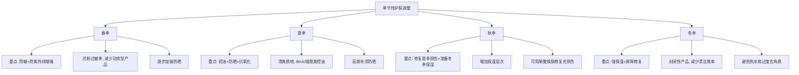

## 六、环境因素对皮肤的影响

皮肤是人体与外界环境的第一道屏障，每时每刻都在承受来自环境的物理、化学和辐射性刺激。环境因素对皮肤的影响是多维度的——从微观的DNA损伤到宏观的肤色暗沉，从短期的水分流失到长期的结构性老化。理解这些影响机制，是制定科学护肤策略的基础。

根据《英国皮肤病学杂志》(British Journal of Dermatology) 的综述，外源性老化因素占皮肤可见老化的80%以上，其中紫外线是头号杀手，其次是污染、温度和湿度等环境变量。这意味着：**环境防护的重要性不亚于任何护肤步骤。**

### 6.1 紫外线——皮肤老化的头号外因

紫外线（UV）是皮肤最大的外源性老化因素。光老化（Photoaging）占皮肤外源性老化的80%。紫外线的损伤具有累积性——你今天晒的太阳，可能在10-20年后才显现为皱纹、色斑和皮肤松弛。

#### 6.1.1 紫外线的分类与穿透深度

| 类型 | 波长 | 穿透深度 | 占到达地表UV比例 | 主要损伤 |
|------|------|----------|------------------|----------|
| UVA（长波） | 320-400nm | 真皮层（可达皮下脂肪） | 约95% | 光老化、色素沉着、DNA间接损伤 |
| UVB（中波） | 280-320nm | 表皮层 | 约5% | 晒伤、DNA直接损伤、黑色素激活 |
| UVC（短波） | 100-280nm | 被臭氧层吸收 | 几乎为0 | 杀菌灯使用（人工源） |

UVA穿透力强，能穿过玻璃和薄衣物，全年强度变化不大，是光老化的主因。UVB强度随季节和时段变化明显（夏季10-14点最强），是晒伤和皮肤癌的主要元凶。

#### 6.1.2 紫外线损伤的分子机制

紫外线对皮肤的损伤涉及多条信号通路，远比"晒黑"复杂得多：

**DNA直接损伤（主要由UVB引起）：** UVB的光子能量直接被DNA吸收，导致相邻的嘧啶碱基（胸腺嘧啶和胞嘧啶）形成环丁烷嘧啶二聚体（CPD）和6-4光产物。如果这些损伤未被及时修复，会导致基因突变，长期累积可诱发皮肤癌。

**氧化应激（UVA和UVB共同作用）：** 紫外线激活皮肤中的光敏剂（如卟啉、核黄素），通过I型和II型反应产生大量活性氧自由基（ROS），包括超氧阴离子、羟自由基和单线态氧。ROS攻击细胞膜的不饱和脂肪酸，引发脂质过氧化链式反应，破坏细胞结构完整性。

**胶原蛋白降解：** 紫外线通过AP-1转录因子通路激活基质金属蛋白酶（MMP-1、MMP-3、MMP-9），这些酶专门降解真皮层的I型和III型胶原蛋白。同时，紫外线抑制TGF-β信号通路，减少新胶原蛋白的合成。降解增加、合成减少——双向夹击导致真皮层结构塌陷。

**色素沉着：** 紫外线通过p38 MAPK和cAMP/PKA通路激活酪氨酸酶，促进黑色素合成。黑色素本身是一种光保护机制（吸收UV、清除自由基），但过度生成会导致色斑和肤色不均。

**免疫抑制：** 紫外线诱导角质形成细胞释放IL-10、TNF-α等免疫抑制因子，同时促进调节性T细胞生成，削弱皮肤的局部免疫监视功能。这也是为什么长期日晒区域更容易出现皮肤癌。

**血管损伤：** 长期紫外线暴露导致真皮血管壁基底膜增厚、弹性纤维变性，同时诱导血管内皮生长因子（VEGF）表达，导致毛细血管扩张，出现肉眼可见的红血丝和酒糟鼻样改变。

#### 6.1.3 防晒的实操策略

**防晒ABC原则：**

- **A（Avoid）——避开：** 尽量避免在紫外线最强时段（10:00-16:00）长时间户外活动
- **B（Block）——遮挡：** 使用物理遮挡（帽子、太阳镜、防晒衣、遮阳伞）
- **C（Cream）——涂抹：** 使用防晒霜作为最后一道防线

**防晒霜选择要点：**

| 指标 | 推荐 | 说明 |
|------|------|------|
| 防护范围 | 广谱（Broad Spectrum） | 必须同时标注PA值和SPF值 |
| SPF值 | 日常SPF30，户外SPF50 | SPF30可阻挡约96.7%的UVB，SPF50为98% |
| PA等级 | 日常PA+++，户外PA++++ | PFA值越高，UVA防护越强 |
| 防水性 | 户外/出汗时选择防水型 | 防水型需每80分钟补涂 |
| 用量 | 面部约一元硬币大小（约1g） | 用量不足会使防护效果大幅下降 |

**防晒霜的正确使用：**
1. 出门前15-20分钟涂抹，让防晒膜成型
2. 面部用量不少于1g（约一元硬币大小），颈部同量
3. 每隔2小时补涂一次（室内靠窗也需要）
4. 游泳、大量出汗后立即补涂
5. 不要遗漏耳后、发际线、嘴唇、手背

**常见防晒误区：**

| 误区 | 真相 |
|------|------|
| 阴天不用防晒 | 云层仅阻挡约20%的UV，UVA几乎不受影响 |
| 室内不用防晒 | UVA可穿透普通玻璃，靠窗办公也需要 |
| 防晒霜涂一次管一天 | 化学防晒剂会光降解，物理防晒剂会脱落，必须补涂 |
| 深色皮肤不需要防晒 | 深色皮肤虽然天然SPF约为8-13，但仍会光老化和长色斑 |
| 防晒指数越高越好 | SPF50以上增量极小，且高倍数往往配方更厚重、刺激性更强 |

### 6.2 蓝光（高能可见光HEV）

蓝光（波长380-500nm）属于高能可见光（High Energy Visible Light, HEV），约占太阳可见光谱的25-30%。蓝光的来源包括太阳光（最主要来源，强度远高于人造源）和电子屏幕（手机、电脑、平板、LED灯）。

#### 6.2.1 蓝光的穿透与作用机制

蓝光的穿透深度介于UVA和UVB之间，可到达表皮全层和真皮浅层。蓝光通过激活皮肤中的光敏色素（特别是视黄醛和黄素类化合物），产生单线态氧和超氧自由基。

2010年发表在《Journal of Investigative Dermatology》上的研究发现，蓝光诱导的氧化应激模式与UV不同——蓝光更倾向于产生持久性的色素沉着，且在深色皮肤上效果更显著。Mann等人2014年的研究表明，可见光（包括蓝光）可以独立于紫外线诱导持久性色素沉着。

#### 6.2.2 蓝光对皮肤的具体影响

**色素沉着：** 蓝光激活黑素细胞上的视蛋白3（OPN3），通过钙离子信号通路促进黑色素合成。研究显示，蓝光诱导的色素沉着比UVB更持久，在深色皮肤（Fitzpatrick III-VI型）中尤其明显。

**光老化：** 蓝光可诱导MMP-1表达增加，促进胶原蛋白降解。虽然单次屏幕暴露的剂量远低于引起显著损伤的阈值，但长期累积效应仍需关注。

**昼夜节律紊乱：** 蓝光通过视网膜的内在光敏视网膜神经节细胞（ipRGCs）抑制褪黑素分泌，影响全身的昼夜节律。皮肤本身也有独立的外周生物钟，夜间蓝光暴露可能干扰皮肤的夜间修复程序（DNA修复、细胞增殖主要在夜间进行）。

**睡眠质量间接影响：** 蓝光对皮肤的影响更多通过影响睡眠质量间接实现——睡眠不足会升高皮质醇水平，加速胶原蛋白降解，削弱皮肤屏障修复。

#### 6.2.3 蓝光防护的理性认知

**客观评估屏幕蓝光：** 手机屏幕的蓝光强度约为太阳光的1/100到1/1000。国际非电离辐射防护委员会（ICNIRP）的标准下，正常距离使用电子设备不会造成急性光损伤。防护重点应放在太阳光的蓝光，而非过度焦虑屏幕蓝光。

**防护策略：**
- **抗氧化护肤品：** 含有维生素C、维生素E、烟酰胺、虾青素的护肤品可以中和蓝光诱导的自由基。烟酰胺（维生素B3）尤其值得关注，研究显示它可以减少黑色素转运，同时支持皮肤屏障修复。
- **含氧化铁的防晒霜/底妆：** 氧化铁对可见光有物理屏蔽作用，普通纯化学防晒剂不防蓝光。
- **软件层面：** 启用手机和电脑的"夜间模式"/"护眼模式"（减少蓝光发射），调整屏幕亮度。
- **夜间节律保护：** 睡前1小时尽量不使用电子设备，或佩戴防蓝光眼镜。

### 6.3 空气污染

空气污染物是皮肤的隐形杀手。世界卫生组织数据显示，全球92%的人口生活在空气质量超标的地区。污染对皮肤的损伤不像紫外线那样有即时反馈（晒伤），而是缓慢积累的慢性过程。

#### 6.3.1 主要污染物及其作用机制

| 污染物 | 来源 | 对皮肤的损伤机制 |
|--------|------|------------------|
| PM2.5/PM10 | 汽车尾气、工业排放、燃煤 | 携带多环芳烃（PAHs）穿透毛孔，诱导氧化应激和AhR通路激活 |
| 臭氧（O₃） | 光化学反应、汽车尾气 | 强氧化剂，直接攻击皮肤脂质和蛋白质，破坏皮肤屏障 |
| 多环芳烃（PAHs） | 燃烧产物、汽车尾气 | 通过AhR受体激活CYP1A1酶，产生大量ROS，诱导炎症 |
| 二氧化氮（NO₂） | 交通排放 | 氧化应激，加速脂质过氧化 |
| 挥发性有机物（VOCs） | 装修材料、工业排放 | 刺激皮肤，加重敏感和炎症 |
| 重金属（铅、汞、镉） | 工业排放、土壤扬尘 | 沉积在皮肤中，干扰酶活性，诱导氧化损伤 |

#### 6.3.2 污染对皮肤的具体影响

**加速老化：** 2016年《Journal of Investigative Dermatology》发表的德国大型队列研究（约800名女性）发现，空气污染暴露水平每增加一个标准差，额头色斑增加20%，脸颊色斑增加25%。PM10暴露与鼻唇沟加深和老年斑增加显著相关。

**皮肤屏障破坏：** 臭氧消耗皮肤表面的抗氧化剂（维生素C、维生素E、尿酸），同时破坏角质层的脂质结构（特别是神经酰胺），导致经皮水分流失（TEWL）增加。屏障受损后，更多污染物和过敏原可以穿透皮肤，形成恶性循环。

**炎症与敏感：** 污染物激活皮肤的NF-κB和NLRP3炎症小体通路，促进IL-1β、IL-6、TNF-α等促炎因子释放。长期低度炎症（"inflammaging"）是皮肤老化的加速器。

**色素异常：** PAHs通过AhR通路促进黑色素合成，同时污染诱导的炎症后色素沉着（PIH）也会加重色斑和暗沉。

**痤疮加重：** 污染物堵塞毛孔，加上氧化应激加重皮脂氧化，可能加重痤疮和毛囊炎。

#### 6.3.3 污染防护策略

**清洁层面：**
- 每晚双重清洁（卸妆油/膏 + 水溶性洁面），彻底去除附着在皮肤表面的颗粒物
- 选择含有螯合剂（如EDTA）的洁面产品，帮助去除重金属离子
- 不要过度清洁——破坏皮肤屏障反而让污染物更容易渗透

**抗氧化层：**
- 早间使用含有维生素C（L-抗坏血酸，浓度10-20%）的精华，它既是抗氧化剂又能再生维生素E
- 搭配维生素E（生育酚）和阿魏酸（Ferulic Acid），三者协同可将光保护效果提升8倍（皮内尔等人2005年经典研究）
- 烟酰胺（5%）可以增强皮肤屏障，同时具有抗氧化和抗炎作用

**屏障修复层：**
- 使用含有神经酰胺、胆固醇和脂肪酸的护肤品，模拟天然角质层脂质结构
- 含有烟酰胺的产品可以促进神经酰胺合成
- 在严重污染天气考虑使用物理屏障（面罩/围巾）

**室内空气：**
- 使用HEPA空气净化器减少室内PM2.5
- 新装修房间注意通风，减少VOCs暴露
- 室内绿植（如吊兰、虎皮兰）可辅助净化空气

### 6.4 湿度与水分环境

湿度是影响皮肤水合状态的关键环境因素。角质层含水量维持在20-35%时皮肤状态最佳，低于10%时会出现可见的干燥、脱屑和紧绷感。

#### 6.4.1 低湿度环境（干燥）

**影响机制：** 空气相对湿度低于40%时，皮肤与环境之间的水蒸气压力梯度增大，角质层水分加速蒸发。TEWL（经皮水分流失）增加，角质层含水量下降，天然保湿因子（NMF）的保水效率降低。

**典型场景：** 北方冬季（室内湿度可低至10-20%）、空调环境、高原地区、沙漠气候、飞机机舱（湿度约10-20%）。

**皮肤表现：**
- 紧绷、干燥、脱屑
- 细纹和干纹显现（含水量不足导致的暂时性皱纹）
- 敏感性增加（屏障功能下降，外界刺激物更易渗入）
- 湿疹和特应性皮炎加重

**应对策略：**
- **加湿器：** 室内湿度维持在45-60%，是皮肤最舒适的范围
- **封闭性保湿：** 使用含有凡士林、角鲨烷、矿物油等封闭剂的产品，在皮肤表面形成疏水膜，减少水分散失
- **吸湿剂：** 甘油、透明质酸、尿素、PCA钠等，从真皮和环境中吸收水分到角质层
- **修复类成分：** 神经酰胺（补充角质层脂质）、泛醇（B5，促进屏障修复）、积雪草提取物
- **减少清洁频率：** 干燥期可以只在晚间使用洁面产品，晨间用清水

#### 6.4.2 高湿度环境

**影响机制：** 高湿度环境下角质层水合度较高，但皮脂腺分泌也相对旺盛。过多的水分和油脂混合，容易导致毛孔堵塞、痤疮和真菌感染。

**典型场景：** 南方梅雨季、热带气候、夏季闷热天气、浴室/泳池周边。

**皮肤表现：**
- 油光满面、毛孔粗大
- 痤疮和闭口粉刺加重
- 真菌感染风险增加（花斑癣、股癣等）
- 汗液滞留（痱子/汗疹）
- 防晒产品被汗水冲刷，防护效果下降

**应对策略：**
- **清爽保湿：** 选择水基、凝胶质地的保湿产品，避免厚重霜状质地
- **控油：** 含有烟酰胺（5%）、水杨酸（BHA，2%）的产品帮助调节皮脂
- **清洁频率：** 可以早晚都使用温和洁面产品，必要时中午用清水冲洗
- **防水型防晒：** 选择防水/耐汗型防晒霜，并缩短补涂间隔
- **吸湿粉末：** 含有硅石、高岭土的散粉可以吸收多余油脂和汗水
- **衣物透气：** 穿着透气、吸湿排汗的衣物，减少皮肤褶皱处的摩擦和潮湿

#### 6.4.3 特殊湿度场景

**飞机机舱：** 湿度约10-20%，比沙漠还干燥。长途飞行建议：登机前做好完整保湿流程，携带保湿喷雾（纯水喷雾反而加速蒸发，需要含甘油/透明质酸的配方），涂抹封闭性强的面霜，减少酒精和咖啡摄入。

**空调房间：** 长时间处于空调环境（制冷或制热）都会降低室内湿度。建议每2-3小时补涂一次保湿产品，工位附近放置加湿器或一盆水。

### 6.5 温度

温度通过影响皮脂腺活性、角质层含水量、血管反应和酶活性等多个途径影响皮肤状态。

#### 6.5.1 高温环境

**皮脂分泌增加：** 温度每升高1°C，皮脂分泌量约增加10%（Mack Correa等人2012年研究）。35°C以上的高温下，皮脂分泌可比常温增加50%以上，导致油光、毛孔堵塞和痤疮加重。

**水分蒸发加速：** 高温增加皮肤表面的蒸发速率，但大量出汗可以部分补偿水分损失。需要注意的是出汗后的盐分结晶会刺激皮肤。

**血管扩张与泛红：** 高温诱导皮肤血管扩张以散热，可能导致面部持续泛红，长期可能加重酒糟鼻。

**热老化（Thermal Aging）：** 2009年发表在《Journal of Dermatological Science》的研究表明，热刺激可以像紫外线一样激活MMP-1和MMP-3，降解胶原蛋白。红外辐射（如烤火、桑拿、长时间热水洗脸）也能通过热休克蛋白（HSP）通路加速胶原蛋白降解。

**热源损伤的典型场景：**
- 热水洗脸（>40°C）：破坏皮肤屏障，增加TEWL
- 桑拿/蒸汽浴：高温+高湿双重刺激，敏感肌应限制时间
- 冬季取暖设备：电暖器、壁炉的红外辐射
- 烹饪时的热油和蒸汽：面部皮肤长期暴露可导致色斑

#### 6.5.2 低温环境

**皮脂分泌减少：** 低温抑制皮脂腺活性，皮肤表面的皮脂膜变薄，天然保护能力下降。

**屏障功能下降：** 低温使角质层脂质的流动性降低（相变温度效应），神经酰胺等脂质的排列从液晶态转变为凝胶态，屏障完整性受损。研究表明，当皮肤温度低于约15°C时，角质层脂质的流动性显著下降。

**微循环减慢：** 低温导致皮肤血管收缩，血流量减少，营养物质和氧气供应减少，代谢废物清除效率降低。这会减缓皮肤的自我修复能力，使皮肤看起来苍白、缺乏光泽。

**冷风损伤：** 寒冷环境中的干燥寒风是皮肤的大敌——低温+低湿度+风速的三重打击，可在短时间内导致皮肤严重干燥、皲裂。手部和面部因为暴露在外，受损最为明显。

**室内外温差：** 频繁进出暖气房和寒冷室外，皮肤血管反复收缩-扩张，会损伤毛细血管弹性，长期可导致永久性红血丝。

#### 6.5.3 温度相关的护理策略

| 场景 | 核心策略 | 具体措施 |
|------|----------|----------|
| 高温夏季 | 控油+抗氧化+防晒 | 清爽质地、BHA控油、VC抗氧化、防水防晒 |
| 低温冬季 | 保湿+屏障修复+封闭 | 层叠保湿（水-精华-乳-霜-封闭）、减少清洁 |
| 空调环境 | 持续保湿 | 加湿器、定期补涂、避免直吹 |
| 温差频繁 | 舒缓镇静 | 含积雪草/泛醇的产品、避免热水刺激 |
| 桑拿/温泉 | 控制时间+事后修复 | 不超过15分钟、及时补充保湿和抗氧化 |

**洗脸水温建议：** 最佳洗脸水温为32-36°C（略低于体温），手感微温即可。过热的水（>40°C）会溶解过多皮脂、破坏屏障；过冷的水（<20°C）清洁力不足且可能刺激敏感皮肤。

### 6.6 风速与空气流动

风对皮肤的影响经常被忽视，但实际上风速是影响TEWL的重要物理因素。

**风速对皮肤的影响：**
- 高风速加速皮肤表面水分子的扩散，显著增加TEWL
- 寒冷+大风（风寒效应）可在数分钟内导致暴露皮肤出现冻伤
- 干燥热风（如沙漠气候）同时带走水分和破坏皮脂膜
- 强风携带的沙尘颗粒对皮肤有物理磨损作用

**防护措施：**
- 高风速环境下使用高封闭性面霜（含凡士林、蜂蜡的配方）
- 佩戴围巾、口罩等物理屏障
- 骑行、滑雪等户外运动后及时清洁并加强保湿

### 6.7 高海拔环境

海拔每升高1000米，紫外线强度增加约10-12%。高海拔环境同时具备多种对皮肤不利的因素：

- **紫外线增强：** 大气层变薄，UV散射和吸收减少
- **空气干燥：** 高海拔地区空气湿度通常很低
- **温度低：** 叠加干燥和风速的三重打击
- **臭氧层较薄：** 部分高纬度高海拔地区臭氧层更薄

**高原护肤重点：** 高倍广谱防晒（SPF50+/PA++++）+ 强封闭性保湿 + 唇部防护 + 补水喷雾随身携带。

### 6.8 季节性护肤调整

不同季节环境因素的组合不同，护肤策略需要相应调整：

### 6.9 环境因素的综合防护框架

环境因素从来不是单独作用的，而是多因素叠加。一个夏天在户外工作的油皮男士，面对的是：高温（皮脂↑）+ 强紫外线（光老化）+ 高湿度（闷痘）+ 污染（炎症）的四重打击。一个冬天在北方暖气房的干皮女生，面对的是：低温（屏障↓）+ 低湿度（水分散失）+ 室内外温差（血管损伤）的三重考验。

**日常环境防护的优先级：**

1. **防晒**——影响最大、证据最强、防护收益最高（任何季节、任何天气）
2. **清洁**——去除附着的污染物和多余皮脂，但不过度
3. **保湿**——维持角质层含水量，修复屏障
4. **抗氧化**——中和环境诱导的自由基，减少氧化损伤累积
5. **屏障修复**——神经酰胺、胆固醇等脂质补充，保持皮肤防御能力

### 6.10 常见误区

| 误区 | 真相 |
|------|------|
| 冬天/阴天不用防晒 | UVA全年强度稳定，冬天仍可造成光老化 |
| 蓝光比紫外线更伤皮肤 | 太阳蓝光强度是屏幕的数百倍，屏幕蓝光剂量远低于损伤阈值 |
| 污染严重就少出门 | 室内也有VOCs（装修）和烹饪油烟，室内也需要抗氧化 |
| 保湿喷雾能补水 | 纯水喷雾蒸发时会带走皮肤水分，需要含保湿剂的配方或喷后涂保湿霜 |
| 桑拿排毒对皮肤好 | 高温长时间桑拿会降解胶原蛋白，敏感肌和酒糟鼻患者应避免 |
| 油皮不需要保湿 | 油脂≠水合度，油皮在干燥环境中同样会缺水（外油内干） |
| 空气净化器能替代皮肤防护 | 减少PM2.5不等于防护臭氧和UV，仍需配合护肤品 |
