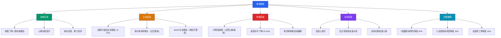
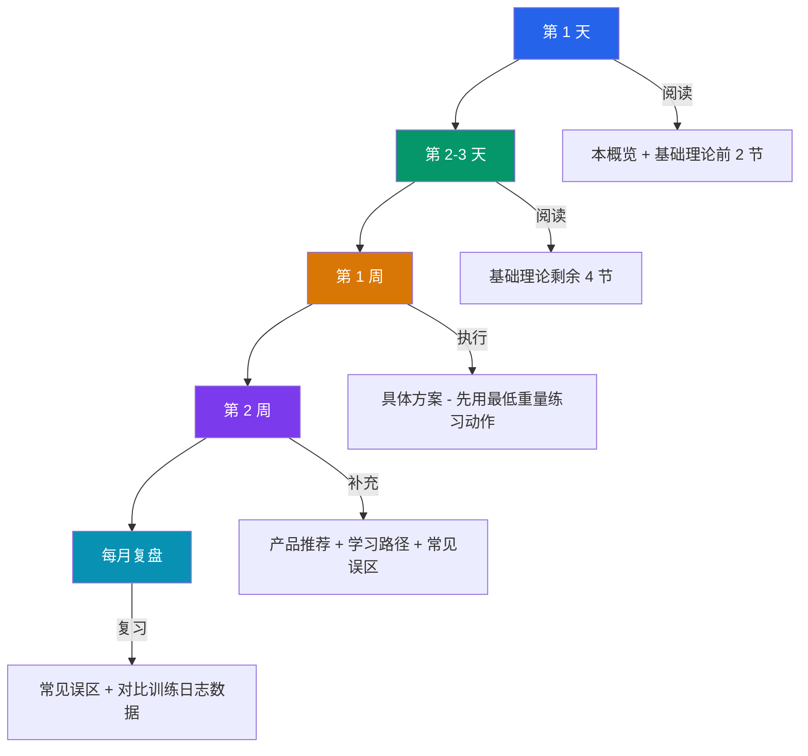

# 第二章：锻炼——用身体重塑人生

> "Take care of your body. It's the only place you have to live." — Jim Rohn

## 为什么锻炼是个人提升的基石

"身体是革命的本钱"——这句话你听过无数遍，但真正理解它的人少之又少。多数人把锻炼等同于"减肥"或"练出腹肌"，这种认知窄化导致了大量半途而废：目标太单一，一旦达成或受挫，训练就停止了。

事实上，锻炼是一场关于**自我认知、身体管理和人生掌控力**的全面升级。它的价值远超体态改变，涵盖认知能力、情绪管理、睡眠质量、社交自信等多个维度。理解这一点，你才有足够的内在驱动力把训练变成终身习惯。

### 锻炼的多维度收益



以上每一项都有大量循证研究支撑。哈佛大学长达 20 年的追踪研究（Lee et al., 2012, *JAMA Internal Medicine*）显示，每天仅 15-20 分钟中等强度运动就能将预期寿命延长 3 年。而对于 28 岁的你来说，现在开始训练，收获的不只是当下的体态改变，更是未来 30-40 年的健康储备。

### 锻炼对认知能力的具体影响

这不是心灵鸡汤。神经科学领域近 10 年的研究已经建立了清晰的因果链：

| 机制 | 具体变化 | 研究来源 | 实际表现 |
|------|---------|----------|---------|
| BDNF 分泌 | 运动后 2-3 小时内血浆 BDNF 升高 2-3 倍 | Erickson et al., 2011, *PNAS* | 学习新技能更快，记忆力增强 |
| 前额叶血流 | 中等强度运动后增加 15-20% | Lucas et al., 2015, *NeuroImage* | 决策能力、专注力提升 |
| 海马体体积 | 有氧训练 12 个月后体积增长 2% | Erickson et al., 2011, *PNAS* | 空间记忆、情景记忆改善 |
| 多巴胺系统 | 运动上调 D2 受体密度 | Robertson et al., 2016, *Brain Plasticity* | 动力增强，拖延减少 |

对于需要长时间编程、阅读或写作的人来说，这些认知收益可能是锻炼最被低估的价值——它直接提升了你的"大脑硬件性能"。

---

## 你的起点评估

在开始任何训练计划之前，你需要对自己的身体有一个客观、量化的认知。这不仅是为了制定合理的训练目标，更是为了在 3 个月、6 个月后进行对比——当你看到具体数字的变化，那种成就感会远超"感觉瘦了"这种模糊判断。

### 身体指标全面评估

| 指标 | 你的数据 | 参考范围 | 评估 | 优先级 |
|------|---------|----------|------|--------|
| 身高 | 165 cm | 中国男性平均 169.7 cm | 偏矮 4.7 cm，非劣势 | — |
| 体重 | 67 kg（134 斤） | 55-70 kg（正常） | 接近上限 | 关注 |
| BMI | 24.6 | 18.5-24.9（正常） | 临界值，偏上限 | 关注 |
| 体脂率（估算） | 约 20-22% | 男性 15-20%（理想） | 略高于理想范围 | 核心目标 |
| 肌肉量（估算） | 约 24-25 kg | 同身高理想值 26-28 kg | 略低于理想值 | 核心目标 |
| 年龄 | 28 岁 | — | 黄金训练年龄 | 优势 |
| 身材比例 | 55 开（躯干≈腿长） | 中国男性平均 47:53 | 重心低 | 优势 |
| 训练经验 | 零基础 | — | 新手福利期 | 优势 |

> **关于体脂率和肌肉量的说明**：以上数据为基于 BMI 和身材描述的合理估算。建议在开始训练后 1 周内，到健身房使用 InBody 或类似设备进行精确测量，获得你的真实基线数据。

### 你的四大优势

**1. 新手福利期（Newbie Gains）**

这是训练生涯中最美好的阶段。在前 6-12 个月，你的肌肉增长速度是训练 2 年以上者的 2-3 倍。原因是你的神经系统从未经历过系统性的力量训练，肌肉募集效率极低。训练初期的"增肌"很大一部分来自神经系统适应——你的大脑学会了更高效地激活现有的肌肉纤维，而不是真正增加了肌肉纤维数量。这种神经适应在前 3 个月尤为显著。

具体数据：新手男性在训练第一年，在合理饮食和训练条件下可以增加 4-8 kg 纯肌肉。这对于体态的改变是极其显著的。

**2. 年龄优势（28 岁的黄金窗口）**

男性睾酮水平在 25-30 岁之间仍处于生理巅峰期（约 300-1000 ng/dL，个体差异大）。睾酮是合成代谢的关键激素，直接影响肌肉蛋白合成速率。28 岁的优势在于：你有成年人的自律和理解能力，同时身体的激素环境和恢复能力仍然接近巅峰。

与 18 岁相比，你的优势是**执行力和计划性**；与 38 岁相比，你的优势是**恢复速度和激素水平**。28 岁开始，时间站在你这边。

**3. 身材比例的隐藏优势**

55 开比例在日常穿搭中可能让人纠结，但在力量训练中是一个实实在在的优势：

- **深蹲**：较短的股骨意味着你不需要过度前倾躯干就能保持重心在脚掌中段，脊柱压力更小，动作模式更容易学习
- **硬拉**：较短的四肢意味着杠铃行程更短，同样的重量做更少的功，力学效率更高
- **卧推**：较短的手臂意味着杠铃行程更短，更容易突破重量瓶颈
- **重心低**：整体稳定性好，在需要平衡的动作（如过头推举）中表现更稳

举重运动中，矮个子运动员的比例非常高。吕小军（172 cm）、廖辉（168 cm）等奥运冠军都证明了身材比例在力量项目中的优势。

**4. 体态重组的窗口期**

BMI 24.6 意味着你处于"可塑性最强"的区间——既不是过度肥胖需要先大幅减脂，也不是极度瘦弱需要大量进食。在这个阶段，新手可以通过"体态重组"（Body Recomposition）实现同时减脂和增肌：体重可能变化不大，但体脂率下降、肌肉量上升，体型发生显著改善。

这不是神话。多项研究（Antonio et al., 2015; Campbell et al., 2020）表明，新手在高蛋白饮食配合力量训练的条件下，可以实现 3-6 个月的体态重组期。

### 你需要关注的三个风险

**1. 关节保护**

67 kg 对于 165 cm 的身高来说并不算超重，但如果缺乏运动基础，膝关节和腰椎周围的肌肉力量可能不足以在高强度训练中保护关节。尤其是在深蹲、硬拉等复合动作中，错误的动作模式会将压力集中在关节和韧带而非肌肉上。

应对策略：前 4 周以动作学习为主，使用轻重量甚至空杆练习正确模式。详见本章「基础理论 → 柔韧性与灵活性」和「具体方案 → 热身与放松」。

**2. 动作质量 > 训练重量**

零基础阶段最常犯的错误是急于上大重量。你看到健身房里别人在用 100 kg 深蹲，你也会想尝试——这是人类的社会比较本能。但事实是：用 30 kg 做 12 次完美的深蹲，肌肉刺激效果和安全性都远好于用 60 kg 做 8 次动作变形的深蹲。

**在你能用控制力十足的动作完成一组训练之前，任何重量的增加都是自欺欺人。**

应对策略：前 8 周的训练日志中，"动作感受"栏比"使用重量"栏更重要。

**3. 过度训练的风险**

新手的一个常见陷阱是"练得越多越好"。实际上，肌肉不是在训练中生长的，而是在训练后的恢复期中生长的。训练是"破坏"，恢复才是"建设"。如果训练频率过高、容量过大，恢复跟不上，你会出现以下症状：

- 训练表现持续下降（而不是偶尔波动）
- 睡眠质量变差
- 静息心率升高
- 情绪烦躁、动力下降
- 小伤小痛频繁出现

应对策略：遵循本章推荐的 PPL 训练计划中的休息安排。记住：**训练是刺激，食物是原料，睡眠是施工时间**——三者缺一不可。

---

## 本章内容架构

本章共包含六个核心板块，从理论到实操层层递进，从入门到进阶逐步深入。下面是整体架构的全景图：

```mermaid
graph LR
    subgraph 第二章：锻炼知识体系
        A[基础理论] --> B[具体方案]
        B --> C[产品推荐]
        B --> D[学习路径]
        B --> E[常见误区]
        A --> E
        D --> F[本章小结]
        C --> F
    end

    A --- A1[运动生理学]
    A --- A2[力量训练理论]
    A --- A3[有氧训练理论]
    A --- A4[运动营养学]
    A --- A5[柔韧性与灵活性]

    B --- B1[PPL训练计划]
    B --- B2[有氧安排]
    B --- B3[矮个子塑形策略]
    B --- B4[训练日志]

    C --- C1[健身装备]
    C --- C2[营养补剂]
    C --- C3[饮食工具]
    C --- C4[健身房选择]

    D --- D1[入门期 0-3月]
    D --- D2[进阶期 3-12月]
    D --- D3[高级期 1年+]

    E --- E1[十大常见误区]

    style A fill:#2563eb,color:#fff
    style B fill:#059669,color:#fff
    style C fill:#d97706,color:#fff
    style D fill:#7c3aed,color:#fff
    style E fill:#dc2626,color:#fff
    style F fill:#0891b2,color:#fff
```

### 板块一：基础理论（运动科学基石）

在盲目开始训练之前，你必须理解身体是如何运作的。这不是为了让你成为运动科学家，而是为了让你在遇到瓶颈时知道问题出在哪里，在看到营销话术时能识别真假。

这一板块包含五个子章节：

| 子章节 | 核心内容 | 解决的问题 |
|--------|---------|-----------|
| 运动生理学基础 | 肌肉收缩原理、三大能量系统（磷酸肌酸/糖酵解/有氧）、心肺功能 | 为什么练完会酸？为什么有时候力竭得很快？ |
| 训练原则 | 渐进超负荷、专项性、个体差异、可逆性、超量恢复 | 为什么原地踏步？计划该怎么调整？ |
| 力量训练理论 | 肌肥大的三大机制、训练容量与强度、RPE/RIR 自评体系 | 怎么判断今天练够了没有？ |
| 有氧训练理论 | 心率区间、最大摄氧量、乳酸阈值、有氧与力量的冲突与协调 | 跑步会不会掉肌肉？有氧该做多久？ |
| 运动营养学 | 宏量营养素需求、热量计算、进食时机、水分补充 | 吃多少蛋白质？训练前该不该吃？ |
| 柔韧性与灵活性 | 静态拉伸 vs 动态拉伸、灵活性训练、泡沫轴使用 | 为什么深蹲蹲不下去？拉伸到底有没有用？ |

> **建议**：不要跳过理论部分直接去练。花 2-3 天通读基础理论，建立基本认知框架，能让你后续的训练效率提升数倍，也能避免大量新手常犯的错误。

### 板块二：具体方案（可直接执行的计划）

理论的价值在于指导实践。这一板块提供了一套为你量身定制的训练方案，每个训练日都有详细的组数、次数、休息时间、替代动作——你只需要照着做。

**核心训练体系：PPL（Push/Pull/Legs）**

PPL 是将训练按动作模式分为"推"（胸/肩/三头）、"拉"（背/二头）、"腿"三大板块的分化方式。它被选为你的核心训练体系，原因如下：

- **频率适中**：每个肌群每周训练 2 次，符合运动科学推荐的最佳频率（Schoenfeld et al., 2016, *Sports Medicine*）
- **恢复充分**：同一肌群两次训练间隔 48-72 小时，避免过度训练
- **灵活性高**：可以根据每周安排调整为 3 天、4 天或 6 天版本
- **上手简单**：每天只需要关注一类动作模式，降低了认知负担

| 训练日 | 目标肌群 | 核心动作 | 预计时长 |
|--------|---------|---------|---------|
| Push（推日） | 胸、肩前束/中束、三头 | 卧推、肩推、侧平举、臂屈伸 | 60-75 分钟 |
| Pull（拉日） | 背、二头、后束 | 引体向上/高位下拉、划船、弯举、面拉 | 60-75 分钟 |
| Legs（腿日） | 股四、股二、臀、小腿 | 深蹲、罗马尼亚硬拉、腿举、提踵 | 70-85 分钟 |

详细的训练动作、组数、次数安排见「具体方案」板块各子章节。

**额外板块内容**：

- **有氧训练安排**：如何科学地安排有氧训练，避免"掉肌肉"的同时维持心肺健康
- **针对矮个子的塑形策略**：如何利用身材比例优势，打造视觉效果最佳的体型（宽肩→V 型→显高）
- **训练日志的重要性**：如何记录训练数据，以及为什么数据记录是持续进步的关键
- **训练计划的渐进调整**：什么时候加重量、什么时候换动作、什么时候减载
- **热身与放松**：一套完整的热身流程（5-8 分钟）和训练后放松方案

### 板块三：产品推荐（装备与补剂）

好的装备能提升训练效率和安全性，科学的补剂能加速恢复和进步。但健身行业充斥着智商税——你需要知道什么值得买、什么不值得买、什么时候该买。

| 类别 | 推荐内容 | 核心原则 |
|------|---------|---------|
| 健身装备 | 训练鞋、衣物、手套、护具 | 安全性 > 舒适度 > 外观 |
| 营养补剂 | 蛋白粉、肌酸、咖啡因、维生素D | 只推荐有 meta-analysis 级别证据支持的 |
| 饮食工具 | 厨房秤、食物秤、TDEE 计算工具 | 精确度决定你的饮食控制效果 |
| 健身房选择 | 选址标准、设备清单、避坑指南 | 好的训练环境能显著提升坚持率 |

> **核心原则**：任何没有至少 3 项随机对照试验支持的补剂，都不值得花钱。本章只推荐经过 meta-analysis 验证的补剂，如肌酸（Kreider et al., 2017）和咖啡因（Grgic et al., 2020）。

### 板块四：学习路径（从零到进阶）

健身是一门需要持续学习的技能。和编程一样，它有清晰的成长阶梯：入门→进阶→高级。每个阶段有不同的目标、方法和注意事项。

| 阶段 | 时间跨度 | 核心目标 | 关键指标 |
|------|---------|---------|---------|
| 入门期 | 0-3 个月 | 掌握基本动作模式，建立训练习惯 | 能用正确动作完成所有基础复合动作 |
| 进阶期 | 3-12 个月 | 提升训练强度和容量，突破新手瓶颈 | 深蹲 1.2×体重、硬拉 1.5×体重、卧推 0.8×体重 |
| 高级期 | 1 年以上 | 个性化调整和专项突破 | 根据个人目标定制（力量/体态/运动表现） |

**不要跳级**。基础打牢了后面才能走得更远。在入门期花 3 个月把动作模式刻入肌肉记忆，比急于追求重量、最后受伤停练 2 个月要明智得多。

### 板块五：常见误区（避坑指南）

健身圈流传着大量错误信息——从"深蹲膝盖不能超过脚尖"到"蛋白粉伤肾"，从"有氧 30 分钟才开始燃脂"到"局部减脂"。这些误区不仅浪费你的时间和金钱，更可能导致训练效果倒退甚至受伤。

本板块将逐一拆解 **10 个最常见的健身误区**，每个误区都包含：

- 误区的来源（为什么大家会这么认为）
- 真相（科学依据是什么）
- 正确做法（你该怎么做）

> **建议**：每过一个月重读一次误区板块。随着训练经验增长，你会对每个误区有不同的理解。

### 板块六：本章小结

回顾核心要点，给出可立即执行的行动清单。确保你在读完本章后，不是"学到了很多"而是"明天就知道该做什么"。

---

## 如何使用本章

本章内容较多，不建议一次性全部读完。推荐以下学习路径：



**具体操作指南**：

1. **第一天**：通读本概览，了解全貌；然后阅读「基础理论 → 运动生理学基础」和「训练原则」，建立基本认知框架
2. **第 2-3 天**：阅读基础理论的剩余 4 个子章节。重点关注「力量训练理论」和「运动营养学」——这两个直接影响你的训练和饮食决策
3. **第一周**：开始执行「具体方案」中的训练计划。前两周使用**最低可用重量**，专注于动作模式的正确性。在训练日志中记录每组的动作感受，而非追求重量
4. **第二周**：阅读「产品推荐」「学习路径」和「常见误区」。根据需要采购装备，建立长期学习规划
5. **每月复盘**：重读「常见误区」，对比训练日志中的数据变化。很多误区在你有了一些训练经验之后会有全新的理解

> **最重要的原则**：健身是一场马拉松，不是百米冲刺。最好的训练计划，是你能坚持下去的那个。如果你因为读完本章觉得内容太多而感到压力，记住——你只需要知道"今天练什么"就够了。其他的，边练边学。

让我们开始吧。
