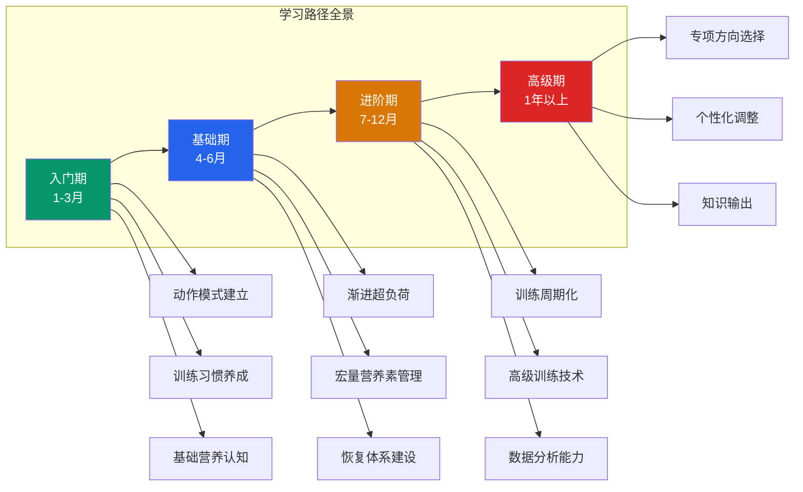
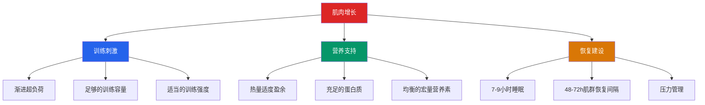
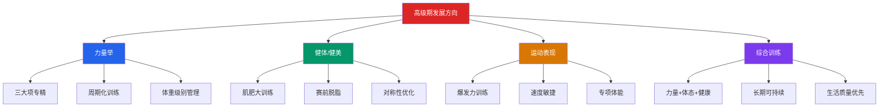
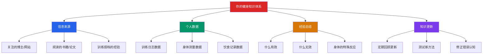
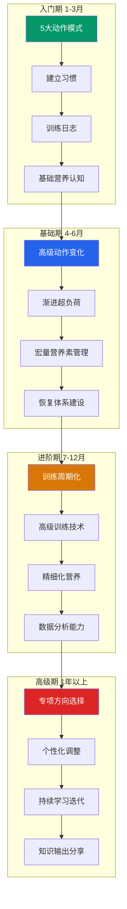

# 第五节 学习路径：从零基础到精通

> "师父领进门，修行在个人。但首先，你得找到正确的门。"

健身是一门需要系统学习的技能——和编程、乐器一样，它有明确的成长阶梯、可量化的能力指标、以及绕不开的刻意练习阶段。本节将为你规划一条从零基础到高级训练者的完整学习路径：每个阶段该学什么、怎么学、学到什么程度、如何判断自己是否准备好了进入下一阶段。更重要的是，本节会告诉你**如何高效学习**——不是看更多视频，而是把知识转化为身体能力。

***

## 一、学习阶段总览

| 阶段 | 时长 | 目标 | 核心关键词 | 每周投入 |
|------|------|------|-----------|---------|
| **入门期** | 第1-3个月 | 掌握基本动作模式，建立训练习惯 | 动作质量、习惯养成、本体感觉 | 训练6-9h + 学习2-3h |
| **基础期** | 第4-6个月 | 巩固动作，开始渐进超负荷 | 重量增长、训练记录、营养管理 | 训练8-12h + 学习2h |
| **进阶期** | 第7-12个月 | 提升训练容量和强度，学习高级技术 | 周期化、营养优化、数据分析 | 训练10-15h + 学习3h |
| **高级期** | 1年以上 | 个性化调整，专项突破 | 自我评估、持续学习、知识输出 | 训练12-18h + 学习3-4h |

> **关键原则**：不要跳级。每个阶段的积累都是下一阶段的基础。在入门期花3个月把动作模式刻入肌肉记忆，比急于追求重量、最后受伤停练2个月要明智得多。阶段的划分不是死板的时间表——你可以根据自己的进度加速或减速，但**每个阶段的学习目标必须达成**才能进入下一阶段。

***

## 二、入门期（第1-3个月）：打好地基

入门期是整个训练生涯中最重要的阶段。这个阶段你建立的动作模式、训练习惯和心理框架，将决定你未来几年的进步速度和受伤概率。**基础不牢，地动山摇**——这句话在健身领域比任何地方都更真实。

### 2.1 学习目标

**目标一：掌握5大基本动作模式**

人体的运动可以被拆解为5种基本动作模式，几乎所有训练动作都是这5种模式的变体或组合：

| 动作模式 | 代表动作 | 训练的主要肌群 | 功能价值 |
|---------|---------|--------------|---------|
| **蹲（Squat）** | 高脚杯深蹲、颈后深蹲 | 股四头肌、臀大肌、核心 | 从椅子上站起来、蹲下捡东西 |
| **铰链（Hinge）** | 罗马尼亚硬拉、传统硬拉 | 腘绳肌、臀大肌、竖脊肌 | 弯腰搬重物、从地上拉起重物 |
| **推（Push）** | 哑铃卧推、过头推举 | 胸肌、三角肌、肱三头肌 | 推开门、把物体举过头顶 |
| **拉（Pull）** | 哑铃划船、引体向上 | 背阔肌、菱形肌、肱二头肌 | 拉门、爬墙、拔河 |
| **承重行走（Carry）** | 农夫行走、过头行走 | 全身（核心为主） | 搬行李箱、提购物袋 |

掌握这5个模式的含义不仅仅是"会做"——而是**在任何负重下都能保持正确的关节排列和发力顺序**。用空杆做深蹲时动作完美不叫掌握，用80%的努力程度做深蹲时仍然保持脊柱中立、膝盖追踪脚尖方向、重心在脚掌中段，这才叫掌握。

**目标二：建立训练习惯**

习惯是行为的自动化。当训练变成像刷牙一样的日常行为，你不再需要消耗意志力去"坚持"。行为科学的研究表明，建立一个新的行为习惯平均需要66天（Lally et al., 2010, *European Journal of Social Psychology*），而不是流行的"21天"说法。

建立习惯的实操策略：

1. **固定时间**：每次训练安排在同一时间段，让身体形成生物钟
2. **固定地点**：同一个健身房，减少决策疲劳
3. **降低启动成本**：前一晚准备好训练包，放在门口
4. **不要追求完美**：去了健身房哪怕只练20分钟也比不去强
5. **使用习惯叠加**：把训练绑定在已有习惯之后（如"下班后直接去健身房"）

**目标三：学会感受肌肉发力（本体感觉）**

本体感觉（Proprioception）是你感知身体位置和运动状态的能力。在健身中，它表现为"念动一致"——你能准确地感受到目标肌肉在收缩和拉长。

为什么这个技能重要？因为训练的本质是给目标肌肉施加足够的机械张力。如果你做卧推时感觉最强烈的是肩膀而不是胸肌，那你的胸肌就没有得到应有的刺激——不管你的重量多大。

培养本体感觉的方法：

1. **触觉提示**：训练时用另一只手触摸目标肌肉，感受它的收缩。例如做二头弯举时，用另一只手抓住上臂，感受肱二头肌的收缩
2. **轻重量慢速**：使用较轻的重量，用4秒向心、4秒离心的节奏完成动作，把注意力集中在肌肉收缩的感觉上
3. **挤压停顿**：在动作顶端刻意挤压目标肌肉1-2秒
4. **闭眼训练**：在安全的前提下（如固定器械上），闭上眼睛完成一组，增强对肌肉感觉的专注力

### 2.2 学习资源

#### 视频教程

| 资源 | 平台 | 特点 | 推荐指数 | 适合阶段 |
|------|------|------|---------|---------|
| **Jeff Nippard** | YouTube | 科学派健身博主，讲解深入，引用大量文献 | ★★★★★ | 全阶段 |
| **Athlean-X** | YouTube | 运动物理治疗师背景，注重动作细节和伤病预防 | ★★★★ | 入门-基础 |
| **健身BOSS老胡** | B站 | 中文健身科普，语言通俗易懂，适合零基础 | ★★★★ | 入门 |
| **杰夫·尼帕德（中文翻译）** | B站 | Jeff Nippard的中文字幕版，信息密度高 | ★★★★★ | 入门-进阶 |
| **帅soserious** | B站 | 中文健身教学，内容实用，风格接地气 | ★★★★ | 入门-基础 |
| **Scott Herman Fitness** | YouTube | 动作演示清晰，适合模仿学习 | ★★★★ | 入门 |
| **Mind Pump TV** | YouTube/Podcast | 三位资深教练的讨论，信息全面客观 | ★★★★ | 基础-高级 |

**看视频的正确方式**：不是"看完了就算学了"。每看完一个动作的教学视频，你要能**闭眼复述**出关键要点，然后去健身房用空杆实际练习。看100个深蹲视频不如认真练3次空杆深蹲。

#### 书籍

| 书名 | 作者 | 特点 | 推荐指数 | 阅读时机 |
|------|------|------|---------|---------|
| **《力量训练基础》（Starting Strength）** | Mark Rippetoe | 经典入门书籍，详细讲解5大动作的生物力学 | ★★★★★ | 第1个月 |
| **《运动解剖学》** | 顾德明等 | 中文解剖学教材，理解肌肉起止点和功能 | ★★★★ | 第2-3个月 |
| **《施瓦辛格健身全书》** | Arnold Schwarzenegger | 百科全书式健身指南，覆盖面广 | ★★★★ | 基础期参考 |
| **《肌肉与力量训练全书》** | Christian Thibaudeau | 综合训练指南，理论与实践并重 | ★★★★ | 基础-进阶期 |
| **《力量训练原理》（Science and Practice of Strength Training）** | Zatsiorsky & Kraemer | 训练科学权威教材，内容深入 | ★★★★★ | 进阶-高级期 |

> **阅读建议**：入门期只需要读《力量训练基础》的前5章（深蹲、卧推、硬拉、推举、划船的动作讲解），其他书籍作为参考查阅。不要试图在开始训练前读完所有书——理论和实践要交替进行。

#### App

| App | 功能 | 推荐指数 | 说明 |
|-----|------|---------|------|
| **Strong** | 训练记录 | ★★★★★ | 最好的训练日志App，界面简洁，支持自定义动作和计划，自动生成历史图表 |
| **薄荷健康** | 饮食记录 | ★★★★ | 中文食物数据库最全，扫码查热量，适合入门期学习食物的宏量营养素含量 |
| **Keep** | 训练教程+社区 | ★★★ | 适合完全零基础的入门引导，但训练计划模板不够灵活 |
| **JEFIT** | 训练计划+记录 | ★★★★ | 有大量用户分享的训练计划，适合寻找灵感 |
| **Hevy** | 训练记录 | ★★★★ | Strong的免费替代品，社区功能丰富 |

### 2.3 入门期的12周学习计划

#### 第1周：认知建立

| 天数 | 学习任务 | 实践任务 | 预计时间 |
|------|---------|---------|---------|
| 第1天 | 阅读本章「基础理论 → 运动生理学基础」和「训练原则」 | 无 | 1-2h |
| 第2天 | 观看5大基本动作的教学视频（每个动作至少看3个不同来源） | 无 | 2h |
| 第3天 | 去健身房熟悉环境：了解器材位置、更衣室、储物柜 | 在镜子前空手练习深蹲和硬拉的起始姿势 | 1h |
| 第4-5天 | 阅读「力量训练理论」和「运动营养学」 | 无 | 2h |
| 第6-7天 | 阅读《力量训练基础》深蹲章节 | 使用空杆练习深蹲（每组5次，做5组） | 2h |

> **第1周的核心**：不急于训练，先建立认知框架。这就像学编程前先了解什么是变量、函数、循环——你知道了这些，后面的学习效率会高10倍。

#### 第2周：动作实践

| 训练日 | 练习内容 | 重点 |
|--------|---------|------|
| 第1天 | 空杆深蹲 5×5 + 空杆卧推 5×5 | 关注膝盖追踪脚尖、脊柱中立 |
| 第2天 | 空杆硬拉 5×5 + 哑铃划船（轻重量）3×10 | 关注髋铰链模式、背部发力感 |
| 第3天 | 哑铃肩推 3×10 + 高脚杯深蹲（轻重量）3×10 | 关注核心稳定、肩关节活动度 |

**第2周的检查清单**：

- [ ] 深蹲能蹲到大腿平行地面且膝盖不内扣
- [ ] 硬拉时腰椎能保持中立（不弓背）
- [ ] 卧推时肩胛骨能稳定收紧
- [ ] 能区分"肌肉酸痛"和"关节不适"

#### 第3-4周：建立训练节奏

- 每周去健身房3次（如周一/周三/周五）
- 使用固定的训练计划（参考「具体方案」板块）
- 开始使用Strong App记录每次训练的组数、次数、重量
- 重量选择：使用能轻松完成12-15次的重量，最后2-3次有挑战感但动作不变形

#### 第5-12周：巩固基础

- 每个动作的重量逐步增加（线性进阶）：每次训练比上次多2.5kg（上肢）或5kg（下肢）
- 学会区分"好的疼痛"（肌肉酸痛/DOMS）和"坏的疼痛"（关节疼痛/锐痛）
- 开始关注饮食：计算每日蛋白质摄入量，目标为每公斤体重1.6克
- 每周拍摄一段训练视频（至少一个主项动作），对比动作变化

### 2.4 入门期的常见问题

#### Q：需要请私教吗？

**建议**：如果预算允许（¥200-500/节课），购买3-5节私教课专门学习基本动作是值得的。但不要长期依赖私教——你需要学会自主训练。

**选择私教的标准**：

| 标准 | 为什么重要 | 如何判断 |
|------|----------|---------|
| 有认证资质 | 确保专业水平 | ACSM、NSCA-CSCS、ACE、NASM |
| 自身有训练痕迹 | 身体力行才有说服力 | 体态良好，有明显的训练痕迹 |
| 愿意教你而非带你 | 你的目标是学会自主训练 | 会解释"为什么这样做"而不只是"做这个" |
| 不过度推销 | 避免被商业利益绑架 | 第一节课就疯狂推课的要警惕 |
| 擅长你的目标领域 | 术业有专攻 | 你想练力量就找力量举教练，不是瑜伽教练 |

**一个判断私教是否靠谱的快速测试**：问教练"为什么深蹲时膝盖不能内扣？"如果他的回答是"因为会受伤"——这是及格线；如果他能解释"膝盖内扣会导致ACL承受剪切力，同时股内侧肌和臀中肌无法有效发力"——这是优秀的教练。

#### Q：应该用多大的重量？

**入门期的重量选择原则**：

1. **起始重量**：使用能轻松完成15次的重量（通常是空杆或比空杆略重）
2. **进阶标准**：当一组能用标准动作完成15次以上时，增加重量
3. **增加幅度**：上肢增加2.5kg，下肢增加5kg
4. **安全线**：最后2-3次应该有挑战感，但动作绝对不变形
5. **宁轻勿重**：动作质量永远优先于重量

**具体的重量参考表**（以67kg体重为例）：

| 动作 | 第1周起始重量 | 第4周参考重量 | 第8周参考重量 | 第12周参考重量 |
|------|-------------|-------------|-------------|--------------|
| 深蹲 | 空杆20kg | 40kg | 55kg | 65-70kg |
| 硬拉 | 30kg | 50kg | 65kg | 80kg |
| 卧推 | 空杆20kg | 30kg | 40kg | 45-50kg |
| 肩推 | 10kg哑铃 | 14kg哑铃 | 18kg哑铃 | 20kg哑铃 |
| 划船 | 15kg哑铃 | 20kg哑铃 | 25kg哑铃 | 28kg哑铃 |

> **注意**：以上数据仅供参考，个体差异很大。不要因为自己的数字高于或低于这个表而焦虑——重要的是**每次训练都在进步**，而不是达到某个绝对数字。

#### Q：每次训练后都很酸痛，正常吗？

**正常的DOMS（延迟性肌肉酸痛）**：

- 训练后24-72小时出现
- 肌肉酸痛，但关节不痛
- 按压肌肉有明显酸痛感
- 休息2-3天后自然消退
- 伸展该肌肉时酸痛感增强

**需要警惕的信号**：

| 信号 | 可能原因 | 处理方式 |
|------|---------|---------|
| 关节疼痛（膝盖、肩膀、腰部） | 动作模式错误或关节损伤 | 立即停止该动作，评估动作质量 |
| 锐利的、刺痛的感觉 | 可能是韧带或肌腱损伤 | 停止训练，冰敷，必要时就医 |
| 持续一周以上的酸痛 | 训练量过大或深层组织损伤 | 减少训练量，增加休息日 |
| 肿胀或发热 | 炎症反应 | 冰敷，休息，如持续则就医 |
| 麻木或刺痛 | 可能是神经压迫 | 立即就医 |

**减少DOMS的实用策略**：

1. **训练后5-10分钟低强度有氧**（如慢走）：促进血液循环，加速代谢废物排出
2. **训练后静态拉伸**：每个目标肌群拉伸30秒×2组
3. **充足睡眠**：生长激素在深度睡眠期间分泌最多
4. **足够的蛋白质摄入**：提供修复肌肉的原料
5. **渐进增加训练量**：不要在第一周就用最大训练量

***

## 三、基础期（第4-6个月）：量变到质变

基础期是从"学习动作"到"开始真正训练"的过渡。在入门期，你的主要任务是学会动作；在基础期，你的任务是**用这些动作制造越来越大的训练刺激**。这是新手福利期的后半段，进步速度仍然很快——但你需要更加系统地管理训练和营养。

### 3.1 学习目标

**目标一：巩固所有基本动作**

到了第4个月，你应该能够在不刻意思考的情况下完成所有基本复合动作的正确形式。这不是说你可以完全忽略动作——你仍然需要在每组训练前有意识地设置好起始姿势和发力模式——但动作的基础框架应该已经内化为肌肉记忆。

检验标准：你能一边和人聊天一边做一组标准的深蹲。

**目标二：开始真正的渐进超负荷**

渐进超负荷（Progressive Overload）是肌肉增长的核心驱动力。它的含义很简单：**每次训练都要比上次多做一点**——多一点重量、多一次次数、多一组、或者用更好的动作质量完成相同的训练。

渐进超负荷的实操方式：

| 方法 | 具体操作 | 适用场景 |
|------|---------|---------|
| 增加重量 | 比上次多2.5-5kg | 当前重量能轻松完成目标次数时 |
| 增加次数 | 在相同重量下多做1-2次 | 当前重量接近极限但还有余力时 |
| 增加组数 | 多做1组 | 需要增加训练容量时 |
| 缩短休息时间 | 减少15-30秒休息 | 提高训练密度 |
| 改善动作质量 | 更完整的行程、更强的顶峰收缩 | 优先选择 |

**目标三：优化饮食**

基础期需要建立完整的营养管理能力：

- **蛋白质**：每公斤体重1.6-2.2克（67kg体重 → 每天107-147克蛋白质）
- **碳水化合物**：每公斤体重3-5克（67kg体重 → 每天201-335克碳水）
- **脂肪**：每公斤体重0.8-1.2克（67kg体重 → 每天54-80克脂肪）
- **总热量**：增肌期每日2200-2500千卡，维持期2000-2200千卡

**目标四：建立训练-饮食-恢复三位一体体系**

训练、饮食、恢复是肌肉增长的三个支柱。到了基础期，你需要同时管理这三个方面：

> **三者缺一不可的比喻**：训练是刺激（告诉身体"需要变强"），食物是原料（提供变强所需的建筑材料），睡眠是施工时间（身体在这个时间里完成建设）。你不能指望在没有砖头的情况下盖房子（训练不吃），也不能指望在没有工人的情况下让房子自己长出来（吃够了但不训练）。

### 3.2 进阶学习内容

#### 训练方面的学习

**高级动作变化**：

| 基础动作 | 变体 | 区别 | 什么时候用 |
|---------|------|------|-----------|
| 深蹲 | 高杠深蹲 | 杠铃放在斜方肌上，更强调股四头肌 | 一般训练 |
| 深蹲 | 低杠深蹲 | 杠铃放在三角肌后束上，更强调后链 | 力量举训练 |
| 深蹲 | 前蹲 | 杠铃放在三角肌前束上，股四头肌和核心需求更高 | 运动表现训练 |
| 硬拉 | 传统硬拉 | 双脚与肩同宽，更强调竖脊肌和背部 | 一般训练 |
| 硬拉 | 相扑硬拉 | 宽站距，更强调髋内收肌和股四头肌 | 力量举（看个人比例） |
| 卧推 | 宽握卧推 | 握距1.5倍肩宽，更强调胸肌外侧 | 增肌 |
| 卧推 | 窄握卧推 | 握距与肩同宽，更强调肱三头肌 | 三头发展 |
| 划船 | T杠划船 | 用T杠器械，能使用更大重量 | 增加背部厚度 |
| 划船 | Meadows划船 | 单臂哑铃划船变体，行程更长 | 背部细节 |

**训练技术进阶**：

**Valsalva呼吸法**——力量训练中最核心的呼吸技术：

1. 在动作开始前深吸一口气到腹部（不是胸部）
2. 收紧腹肌，像被人要打你肚子一样绷紧
3. 屏住呼吸完成整个动作
4. 在最轻松的位置呼气，重新吸气
5. 重复

原理：腹内压增加 → 脊柱稳定性增加 → 能传递更大力量且保护腰椎。这在深蹲和硬拉中尤为重要——正确使用Valsalva可以让你的深蹲重量立即提升5-10%。

**离心控制**：

向心阶段（肌肉缩短）决定你能不能完成动作，离心阶段（肌肉拉长）决定你能不能增长肌肉。研究表明，离心阶段的机械张力对肌肥大的刺激可能比向心阶段更强。

实操：在所有动作的下放阶段刻意控制速度（至少2-3秒），不要让重力替你完成工作。例如深蹲时用3秒蹲下去，卧推时用3秒把杠铃放到胸口。

**顶峰收缩**：

在动作的最顶端位置，刻意挤压目标肌肉1-2秒。这不是为了做样子——顶峰收缩能增加肌肉在最大缩短位置的激活程度，同时增加训练的代谢压力（肌肥大的三大机制之一）。

**训练容量和强度管理**：

| 概念 | 定义 | 测量方法 | 建议范围 |
|------|------|---------|---------|
| 训练容量 | 总训练量 | 组数×次数×重量 | 每肌群每周10-20组 |
| 训练强度 | 使用的重量占最大重量的比例 | 1RM百分比或RPE | 增肌用65-80% 1RM |
| RPE（主观疲劳度） | 一组动作结束时的疲劳程度 | 1-10分量表 | 大部分训练在RPE 7-8 |
| RIR（剩余次数） | 一组结束时还能再做几次 | 自我评估 | 大部分训练留1-2次余量 |

RPE与RIR的对照表：

| RPE | RIR | 含义 | 适用场景 |
|-----|-----|------|---------|
| 10 | 0 | 力竭，一次也做不了了 | 偶尔用于单关节动作的最后一组 |
| 9 | 1 | 还能做1次 | 大部分训练的主要组 |
| 8 | 2 | 还能做2次 | 热身组和积累期的主要组 |
| 7 | 3 | 还能做3次 | 减量周或热身 |

#### 营养方面的学习

**学会计算宏量营养素**：

宏量营养素的热量密度：

| 营养素 | 每克热量 | 主要功能 | 食物来源 |
|--------|---------|---------|---------|
| 蛋白质 | 4千卡 | 肌肉修复和生长 | 鸡胸肉、鱼、鸡蛋、牛奶、豆腐 |
| 碳水化合物 | 4千卡 | 提供训练能量 | 米饭、面条、红薯、香蕉、燕麦 |
| 脂肪 | 9千卡 | 激素合成、维生素吸收 | 橄榄油、坚果、牛油果、鸡蛋黄 |

**食物热量速查表**（常用食物每100g的宏量营养素）：

| 食物 | 蛋白质(g) | 碳水(g) | 脂肪(g) | 热量(千卡) | 说明 |
|------|----------|---------|---------|-----------|------|
| 鸡胸肉（水煮） | 31 | 0 | 3.6 | 165 | 最高性价比蛋白质来源 |
| 鸡蛋（全蛋） | 13 | 1.1 | 11 | 155 | 完美蛋白质，营养全面 |
| 牛肉（瘦肉） | 26 | 0 | 15 | 250 | 铁和锌含量高 |
| 三文鱼 | 20 | 0 | 13 | 208 | Omega-3丰富 |
| 豆腐 | 8 | 1.9 | 4.8 | 76 | 植物蛋白来源 |
| 米饭（熟） | 2.7 | 28 | 0.3 | 130 | 基础碳水来源 |
| 红薯 | 1.6 | 20 | 0.1 | 86 | 低GI碳水 |
| 燕麦 | 13 | 66 | 6.9 | 389 | 优质碳水+纤维 |
| 香蕉 | 1.1 | 23 | 0.3 | 89 | 训练前后快速补充碳水 |
| 牛奶（全脂） | 3.2 | 4.8 | 3.3 | 61 | 方便的蛋白质+碳水组合 |

**使用食物秤和记录App**：

入门期你只需要"大致知道"自己吃了多少蛋白质；基础期则需要精确记录。方法如下：

1. 购买一个厨房电子秤（精度1g，¥30-50）
2. 使用薄荷健康App记录每餐食物
3. 前2周每天记录，之后你会对食物的热量有直觉判断
4. 每周称一次体重：体重稳定说明热量平衡，体重上升说明有盈余

#### 恢复方面的学习

| 恢复策略 | 具体操作 | 频率 | 重要程度 |
|---------|---------|------|---------|
| 睡眠 | 每晚7-9小时，固定时间入睡和起床 | 每天 | ★★★★★ |
| 泡沫轴放松 | 每个紧张肌群滚压30-60秒 | 训练后+休息日 | ★★★★ |
| 静态拉伸 | 每个目标肌群拉伸30秒×2组 | 训练后 | ★★★★ |
| 轻度活动 | 散步、游泳、瑜伽 | 休息日 | ★★★ |
| 营养补充 | 训练后30分钟内摄入蛋白质和碳水 | 训练后 | ★★★★ |
| 水分补充 | 每天至少2升水，训练期间每15分钟喝150-200ml | 每天 | ★★★★★ |

**过度训练的早期信号**（发现2个以上就需要调整）：

- 训练表现持续下降超过1周
- 静息心率比平时高5-10次/分钟
- 睡眠质量变差（入睡困难或频繁醒来）
- 情绪低落、烦躁、对训练失去兴趣
- 频繁出现小伤小痛
- 食欲明显下降
- 免疫力下降（容易感冒）

### 3.3 推荐的学习资源

| 资源 | 类型 | 内容 | 推荐指数 |
|------|------|------|---------|
| **Jeff Nippard的"Science Applied"系列** | YouTube | 训练科学的实际应用，每期深入一个主题 | ★★★★★ |
| **Revive Stronger** | YouTube/Podcast | 深入的训练和营养讨论，有大量专家访谈 | ★★★★ |
| **Stronger By Science** | 网站/Podcast | Greg Nuckols的训练科学研究，最权威的免费资源之一 | ★★★★★ |
| **《力量训练原理》** | 书籍 | 更深入的训练理论，涵盖周期化和高级方法 | ★★★★ |
| **3D4Medical** | App | 3D解剖学学习，直观理解肌肉结构 | ★★★★ |

### 3.4 基础期的里程碑

在基础期结束时（第6个月末），你应该达到以下标准。**如果大部分标准未达成，不要急于进入进阶期**——延长基础期1-2个月是完全正常的。

| 里程碑 | 标准（以67kg体重为例） | 自评 |
|--------|---------------------|------|
| 深蹲力量 | 体重×1倍（67kg）×5次 | [ ] |
| 硬拉力量 | 体重×1.2倍（80kg）×5次 | [ ] |
| 卧推力量 | 体重×0.8倍（54kg）×5次 | [ ] |
| 引体向上 | 至少5次（自重） | [ ] |
| 体脂率 | 下降2-3% | [ ] |
| 体重 | 变化±2kg以内（体态重组） | [ ] |
| 动作质量 | 所有基本动作能用标准形式完成 | [ ] |
| 训练习惯 | 连续8周每周至少3次训练 | [ ] |
| 营养管理 | 能估算日常食物的蛋白质含量（误差<20%） | [ ] |
| 训练日志 | 连续记录至少4周的训练数据 | [ ] |

***

## 四、进阶期（第7-12个月）：突破瓶颈

进阶期是新手到中级训练者的过渡。在前6个月，你几乎每次训练都能增加重量或次数——这是新手福利期的魔力。但到了第7-12个月，进步速度会明显放缓。你可能会经历第一个**平台期**——连续几周甚至几个月力量不增长。

这不是你的训练出了问题，而是**身体适应了当前的刺激水平**。解决方案不是"更努力"，而是"更聪明"。进阶期需要你学会周期化训练、高级技术、以及精细化的自我管理。

### 4.1 学习目标

**目标一：引入训练周期化**

线性进阶（每次训练都加重量）在进阶期已经不可持续。你需要学会**周期化安排**——在不同的时间段使用不同的训练量和强度，让身体有计划地恢复和超量适应。

周期化的基本逻辑：

**目标二：掌握高级训练技术**

高级训练技术不是"花架子"——每一种技术都有明确的训练学原理，用于解决特定的训练需求。

**目标三：精细化营养管理**

基础期你学会了"吃什么、吃多少"；进阶期你需要学会"什么时候吃、根据目标怎么调整"。

**目标四：学会自我评估和数据分析**

你不再是"照着计划做"的执行者，而是需要成为自己训练的"数据分析师"——通过分析训练日志中的数据来发现趋势、诊断问题、调整策略。

### 4.2 高级训练技术详解

#### 递减组（Drop Sets）

**原理**：当一组训练达到力竭时，肌肉中仍有部分纤维未被募集。通过减少重量继续训练，可以激活这些剩余的肌纤维，增加总训练刺激。

**做法**：完成一组到力竭后，立即减少20-30%重量，继续做到力竭。可以连续减2-3次。

**示例**：
侧平举：12kg × 12次（力竭）→ 8kg × 10次（力竭）→ 5kg × 8次（力竭）
总计：30次 vs 正常组的12次

**适用场景**：训练的最后一个动作（避免影响后续动作的表现）

**注意事项**：
- 递减组的疲劳累积很大，每周每个肌群使用1-2次即可
- 最好用固定器械或哑铃（方便快速减重）
- 不适合深蹲、硬拉等需要高度神经募集的动作

#### 超级组（Supersets）

**原理**：两个动作之间不休息，连续完成。通过缩短训练时间提高训练密度，或者利用对抗肌的交互抑制原理提高效率。

**类型**：

| 类型 | 原理 | 示例 | 效果 |
|------|------|------|------|
| 对抗肌超级组 | 一个肌肉收缩时，其对抗肌自然放松 | 卧推+划船 | 推拉肌群同时发展，节省时间 |
| 同肌群超级组 | 同一肌群的不同角度刺激 | 卧推+飞鸟 | 增加该肌群的总训练容量 |
| 上下肢超级组 | 不相关的肌群交替训练 | 深蹲+弯举 | 利用非相关肌群的休息时间 |

#### 暂停休息法（Rest-Pause）

**原理**：在力竭后短暂休息（10-15秒），让磷酸肌酸部分恢复，然后继续训练。这样可以在一组内完成更多的次数，增加机械张力的总时间。

**做法**：
卧推 80kg：做到力竭（假设8次）→ 休息10秒 → 继续做（假设3次）→ 休息10秒 → 继续做（假设2次）
总次数：13次 vs 正常组的8次

**适用场景**：器械动作的最后一个组

#### 离心超负荷（Eccentric Overload）

**原理**：肌肉在离心阶段（拉长过程中）能承受比向心阶段（缩短过程中）更大的负荷。通过使用超过向心1RM的重量进行离心训练，可以提供更强的机械张力刺激。

**做法**：使用超过1RM约10-20%的重量，由训练搭档辅助完成向心阶段，自己控制离心阶段（3-5秒）。

**注意**：需要有经验的训练伙伴。离心超负荷产生的肌肉损伤较大，需要更长的恢复时间。不适合新手，建议至少有1年训练经验后再尝试。

#### 血流限制训练（BFR）

**原理**：通过在肢体近端绑上加压带，限制静脉血回流（但不阻断动脉供血），造成肌肉缺氧环境。在低重量（20-30% 1RM）下就能产生显著的代谢压力，刺激肌肥大。

**适用场景**：
- 受伤期间无法使用大重量时
- 关节敏感不能承受大重量时
- 作为训练末尾的补充训练

**注意**：需要专业的BFR绑带，不能用普通弹力带代替。压力设置为肢体闭塞压的40-80%。

### 4.3 周期化训练的引入

**月度周期示例（适合进阶期）**：

| 周数 | 阶段 | 重量（占1RM%） | 每组次数 | 每肌群组数 | RPE目标 |
|------|------|---------------|---------|-----------|---------|
| 第1-3周 | 积累期 | 65-75% | 8-12次 | 16-20组 | 7-8 |
| 第4周 | 减量周 | 50-60% | 10-15次 | 8-12组 | 5-6 |
| 第5-7周 | 强度期 | 75-85% | 5-8次 | 12-16组 | 8-9 |
| 第8周 | 减量周 | 50-60% | 10-15次 | 8-12组 | 5-6 |
| 第9-11周 | 峰值期 | 85-95% | 3-5次 | 8-12组 | 9-10 |
| 第12周 | 减量/测试周 | 测试新1RM | 1-3次 | 4-8组 | 10 |

**为什么要减量周？**

减量周（Deload Week）不是"偷懒"——它是训练计划中不可或缺的一部分。在高强度训练3周后，身体积累了大量的神经疲劳和肌肉损伤。减量周的作用：

1. **消除累积疲劳**：让神经系统从高强度训练中恢复
2. **促进超量恢复**：身体在减量期间完成修复，变得比之前更强
3. **预防过度训练**：避免疲劳累积到不可恢复的程度
4. **心理恢复**：减少对训练的厌倦感

> **减量周的做法**：减少训练重量30-40%，减少训练组数30-50%，保持训练频率不变。感觉就像"没练一样"就对了——这是减量周正确的打开方式。

### 4.4 进阶期的里程碑

| 里程碑 | 标准（以67kg体重为例） | 说明 |
|--------|---------------------|------|
| 深蹲力量 | 体重×1.5倍（100kg）×5次 | 中级力量水平 |
| 硬拉力量 | 体重×1.8倍（120kg）×5次 | 中级力量水平 |
| 卧推力量 | 体重×1.2倍（80kg）×5次 | 中级力量水平 |
| 引体向上 | 至少10次（自重） | 上肢拉力量基准 |
| 体脂率 | 降至15%以下 | 体态明显改善 |
| 训练知识 | 能独立设计和调整训练计划 | 知识内化 |
| 营养管理 | 能根据目标调整饮食策略（增肌/减脂/维持） | 灵活应用 |

***

## 五、高级期（1年以上）：持续精进

经过1年的系统训练，你已经从零基础成长为一个有经验的中级训练者。这个阶段不再有通用的学习路径——你需要根据自己的目标、身体反馈和兴趣选择发展方向。

### 5.1 发展方向选择

| 方向 | 核心目标 | 训练特点 | 适合人群 |
|------|---------|---------|---------|
| **力量举** | 最大化三大项重量 | 低次数、高重量、长休息 | 喜欢挑战极限重量的人 |
| **健体/健美** | 最大化肌肉发展和对称性 | 中高次数、中等重量、短休息 | 追求体态美感的人 |
| **运动表现** | 提升运动中的力量、速度、耐力 | 混合训练、功能性动作 | 有运动项目需求的人 |
| **综合训练** | 力量、体态、健康的平衡 | 灵活组合 | 大多数普通训练者 |

**对于28岁、以个人提升为目标的你来说，"综合训练"可能是最合理的选择**——它让你在力量、体态和健康之间取得平衡，训练方式灵活，可持续性强，不容易因为过度专精而产生倦怠或伤病。

### 5.2 高级学习资源

| 资源 | 类型 | 内容 | 推荐指数 |
|------|------|------|---------|
| **Stronger By Science** | 网站 | Greg Nuckols的训练科学研究，每月发布深入的综述文章 | ★★★★★ |
| **Renaissance Periodization** | YouTube/网站 | Dr. Mike Israetel的训练科学，尤其擅长肌肥大训练理论 | ★★★★★ |
| **Juggernaut Training Systems** | YouTube | Chad Wesley Smith的力量训练，力量举方向的权威资源 | ★★★★ |
| **Barbell Medicine** | 网站/Podcast | 两位医生兼力量举选手，循证训练和营养 | ★★★★★ |
| **《周期训练理论与方法》** | 书籍 | 训练周期化的权威教材 | ★★★★ |
| **《运动营养学》** | 书籍 | 系统的运动营养知识 | ★★★★ |
| **《运动生理学》** | 书籍 | 深入理解身体对训练的适应机制 | ★★★★ |

### 5.3 持续学习的习惯

到了高级期，学习不再是"从零开始"，而是"持续迭代"。建立以下习惯：

1. **每周阅读1-2篇训练相关的文章或论文**：关注Stronger By Science、Barbell Medicine等高质量来源
2. **每月尝试一个新的训练方法或技术**：在小范围测试后决定是否纳入长期计划
3. **每3个月进行一次全面自我评估**：测量、拍照、力量测试、体脂测量
4. **每年参加一次健身相关的培训或工作坊**（可选）：如力量举训练营、运动营养讲座
5. **建立自己的训练知识库**：把有用的文章、数据、经验记录下来

### 5.4 高级期的核心能力

| 能力 | 具体表现 | 如何培养 |
|------|---------|---------|
| **自我诊断能力** | 能判断训练停滞的原因是容量不足、强度不够、还是恢复不足 | 分析训练日志数据，对比不同阶段的变化 |
| **计划设计能力** | 能根据目标独立设计8-12周的训练计划 | 学习周期化理论，结合自身经验 |
| **营养调控能力** | 能根据训练阶段调整饮食策略 | 学习运动营养学，记录不同饮食方案的效果 |
| **伤病预防能力** | 能识别早期伤病信号并主动调整 | 学习运动医学基础，关注身体反馈 |
| **信息筛选能力** | 能快速判断一条健身信息是否可靠 | 培养批判性思维，了解研究方法论 |

***

## 六、阶段过渡的判断标准

什么时候应该从一个阶段进入下一个阶段？这不是一个时间问题，而是一个**能力问题**。以下是每个阶段过渡的明确判断标准：

### 6.1 入门期→基础期的判断标准

**必须全部达成**才能进入基础期：

- [ ] 能用标准形式完成深蹲、硬拉、卧推、划船、推举5个动作
- [ ] 连续4周每周至少训练3次
- [ ] 开始使用训练日志记录数据
- [ ] 了解基本的营养概念（蛋白质、碳水、脂肪的功能）
- [ ] 知道如何区分好的疼痛和坏的疼痛

**不满足怎么办**：继续留在入门期，延长2-4周。这不是失败，而是对身体负责。

### 6.2 基础期→进阶期的判断标准

**必须全部达成**才能进入进阶期：

- [ ] 深蹲达到体重×1倍×5次
- [ ] 硬拉达到体重×1.2倍×5次
- [ ] 卧推达到体重×0.8倍×5次
- [ ] 能够独立计算每日宏量营养素摄入
- [ ] 连续4周完整记录训练和饮食数据
- [ ] 了解RPE/RIR的概念并能在训练中应用

**不满足怎么办**：分析哪个方面是短板。如果是力量不够，可能是训练量或营养不足；如果是知识不够，花1-2周集中学习。

### 6.3 进阶期→高级期的判断标准

**全部达成**进入高级期：

- [ ] 深蹲达到体重×1.5倍×5次
- [ ] 硬拉达到体重×1.8倍×5次
- [ ] 卧推达到体重×1.2倍×5次
- [ ] 能够独立设计8-12周的周期化训练计划
- [ ] 能够根据身体反馈调整训练和饮食
- [ ] 了解至少3种高级训练技术的原理和适用场景
- [ ] 完整经历过至少1次训练周期（积累→强度→峰值→减量）

***

## 七、学习方法论

### 7.1 80/20法则

在健身学习中，80%的效果来自20%的核心知识。以下是每个阶段的"最重要的20%"：

**入门期的20%**：
1. 5大基本动作模式的正确形式
2. 渐进超负荷的概念
3. 蛋白质的重要性（每公斤体重1.6克）
4. 训练日志的价值
5. 充足睡眠的重要性

**基础期的20%**：
1. 如何执行渐进超负荷（每次训练增加一点）
2. 宏量营养素的计算和管理
3. RPE/RIR的使用
4. 训练容量的概念（每肌群每周多少组）
5. 恢复策略（睡眠、拉伸、泡沫轴）

**进阶期的20%**：
1. 周期化训练的原理和实施
2. 高级训练技术的正确使用时机
3. 数据分析（从训练日志中发现趋势）
4. 营养的精细化调整（增肌/减脂/维持期切换）
5. 自我评估和计划调整

**不需要在初期深入学习的80%**：
- 高级训练技术的细节变体
- 微量营养素的精确补充
- 极端的饮食策略（如生酮、间歇性断食）
- 最新的"网红"训练法
- 竞技级别的体重管理
- 运动补剂的高级堆叠方案

### 7.2 实践 > 理论

**最重要的学习发生在健身房里，而不是在屏幕前。**

每天花1小时看健身视频，不如花1小时在健身房练习动作。理论指导实践，但实践才是进步的根本。很多健身知识是**默会知识**（Tacit Knowledge）——你知道"深蹲时膝盖应该追踪脚尖方向"这个理论，但只有在蹲了1000次之后，你的身体才能自动执行这个模式。

**建议的学习时间分配**：

| 阶段 | 理论学习 | 实践训练 | 比例 |
|------|---------|---------|------|
| 入门期 | 每周2-3小时 | 每周6-9小时 | 1:3 |
| 基础期 | 每周1-2小时 | 每周8-12小时 | 1:5 |
| 进阶期 | 每周2-3小时 | 每周10-15小时 | 1:5 |
| 高级期 | 每周3-4小时 | 每周12-18小时 | 1:4 |

### 7.3 刻意练习原则

健身中的刻意练习（Deliberate Practice）和学乐器、学编程一样，有4个核心要素：

1. **明确的目标**：每次训练知道今天要改进什么（不是"练胸"，而是"卧推时左肩胛骨的稳定性"）
2. **专注的注意力**：训练时放下手机，全神贯注于动作和肌肉感觉
3. **即时的反馈**：通过视频、训练搭档或镜子获得动作反馈
4. **走出舒适区**：每次训练都要比上次多做一点

**常见的"假练习"**：
- 去了健身房但每组之间刷5分钟手机
- 每次训练都用相同的重量和次数
- 从来不拍训练视频检查动作
- 训练时脑子里想着工作的事情

### 7.4 批判性思维

健身圈信息鱼龙混杂，学会辨别信息的可靠性是高级训练者必备的能力。

**可靠信息的信号**：

| 信号 | 说明 | 示例 |
|------|------|------|
| 有同行评审的科学研究支持 | 经过其他科学家审查的研究 | "Schoenfeld et al. (2016) 发现..." |
| 来自有认证资质的专业人士 | CSCS、PhD、MD等 | 运动科学博士的建议 |
| 逻辑自洽，有明确的机制解释 | 能解释"为什么"而不只是"做什么" | "因为离心阶段的机械张力更高，所以..." |
| 承认不确定性和个体差异 | 没有绝对的"保证" | "对大多数人有效，但个体差异较大" |
| 多个独立来源相互验证 | 不是只有一个人这么说 | 3篇不同作者的论文得出相似结论 |

**不可靠信息的信号**：

| 信号 | 说明 | 示例 |
|------|------|------|
| 夸张承诺 | "保证一周见效" | "7天练出腹肌" |
| 依赖个人轶事 | "我就是这样练的" | "我吃这个补剂长了10kg肌肉" |
| 过度简化 | 忽略复杂性 | "只要吃蛋白质就能增肌" |
| 隐藏的商业利益 | 推荐产品或课程 | "只有这个训练计划才有效（购买链接）" |
| 拒绝接受质疑 | 对不同意见反应激烈 | "质疑我的都是不懂的人" |

### 7.5 建立自己的知识体系

随着学习的深入，你需要建立一个属于自己的、持续更新的知识体系：

**具体操作**：

1. **收藏夹整理**：把你关注的高质量信息来源（网站、博主、播客）整理成一个清单，定期更新
2. **训练日志分析**：每个月花1小时回顾训练日志，发现趋势——哪些动作进步快？哪些停滞？与饮食、睡眠、压力有什么关联？
3. **知识笔记**：把学到的重要知识点记录下来（可以用Notion、Obsidian等工具），建立自己的"健身百科"
4. **经验分享**：和其他训练者交流经验——教别人是最好的学习方式

***

## 八、学习路径总结

**最后的话**：

学习是一条永无止境的路，但每一步都算数。你不需要在第一天就知道所有事情——你只需要知道"今天练什么"就够了。其他的，边练边学。

对于28岁的你来说，现在开始系统训练，你拥有新手福利期的快速进步、黄金年龄的激素水平、以及足够的时间来见证复利效应。两年后，你会感谢今天的自己。

> 从今天开始，迈出你的第一步。
