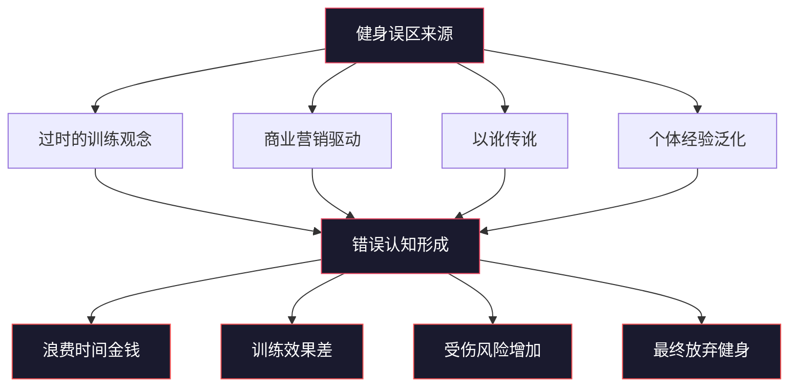
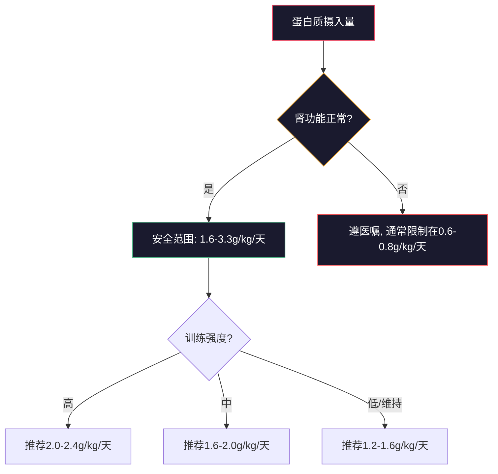
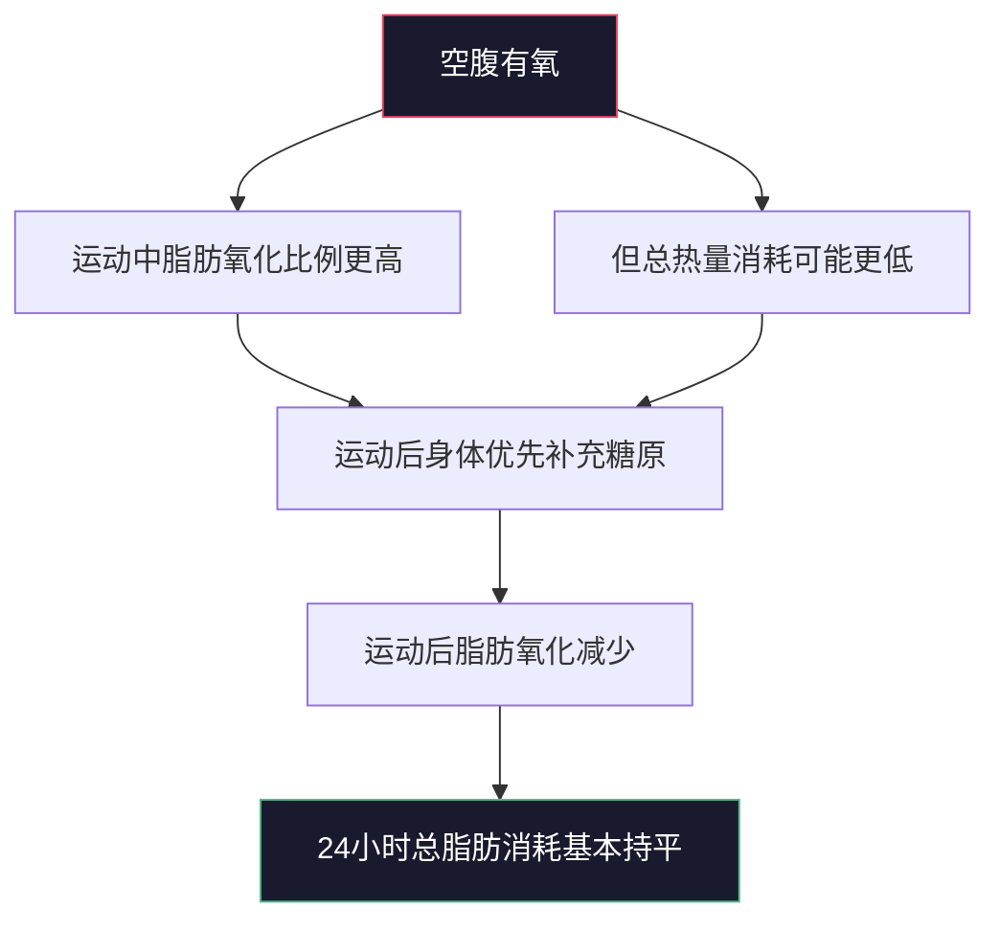
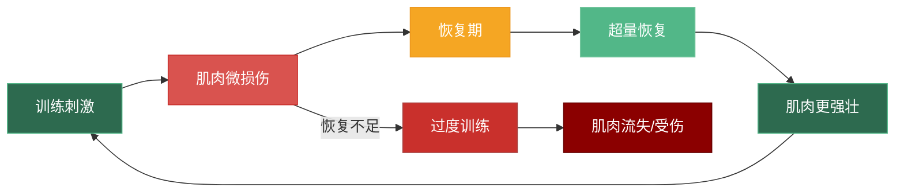
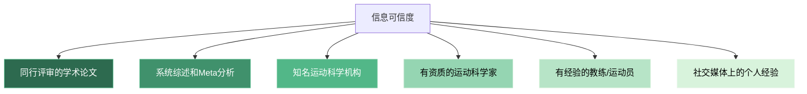

# 第六节 常见误区：健身路上的10个陷阱

> "最大的错误不是不知道，而是知道错误的东西还坚信不疑。"

健身圈流传着大量错误信息，有些来自过时的观念，有些来自商业营销，有些来自以讹传讹。这些误区不仅浪费你的时间和金钱，更可能导致受伤、阻碍进步，甚至让你彻底放弃健身。

本节将逐一拆解10个最常见的健身误区。每个误区都遵循统一的分析框架：先还原错误观念，再用科学研究揭示真相，最后给出可执行的正确做法。读完本节，你将拥有辨别健身信息真伪的基本能力。

---

## 误区一：局部减脂——"练腹肌就能减肚子"

### 错误观念

"我肚子大，所以要多做仰卧起坐/卷腹，把肚子上的脂肪减掉。"

这个误区可能是健身界流传最广、最根深蒂固的错误观念之一。它的逻辑看似直觉合理——练哪里就瘦哪里——但人体的脂肪代谢机制完全不是这样运作的。

### 科学事实

**局部减脂（Spot Reduction）是一个被反复证伪的神话。**

1971年，科学家在网球运动员身上发现了一个关键证据：惯用手和非惯用手的皮下脂肪厚度没有显著差异，尽管惯用手的运动量远大于非惯用手。这意味着即使某块肌肉长期大量运动，覆盖在它上面的脂肪也不会因此优先减少。

2013年发表在《Journal of Strength and Conditioning Research》上的系统综述明确指出：**局部运动不能导致局部脂肪减少**。2015年的一项针对网球运动员的研究进一步证实了这一点——尽管惯用手的肌肉量更大，但双臂的脂肪厚度基本相同。

脂肪的减少是全身性的，受以下因素共同决定：

| 因素 | 影响机制 | 可控程度 |
|------|---------|---------|
| **基因** | 决定脂肪分布和减少的优先顺序 | 不可控 |
| **激素** | 胰岛素、皮质醇、性激素等影响脂肪储存位置 | 部分可控 |
| **性别** | 男性通常先瘦腹部，女性通常先瘦四肢（但腹部更难减） | 不可控 |
| **热量赤字** | 全身脂肪减少的唯一必要条件 | 完全可控 |
| **体脂率** | 体脂越低，顽固脂肪越难减 | 部分可控 |

### 脂肪减少的优先级

人体脂肪减少遵循一个基本规律：**先存储的脂肪最后被消耗**。对于大多数男性，脂肪减少的典型顺序是：

这就是为什么腹部往往是最后瘦下来的部位——不是因为你练得不够，而是因为腹部脂肪在进化上具有保护内脏的功能，身体会优先保留它。

### 正确做法

1. **创造热量赤字**：通过饮食控制（每天减少300-500大卡）和有氧运动结合，实现每周减重0.5-1斤
2. **力量训练**：增加全身肌肉量，提高基础代谢率，让身体在静息状态下消耗更多热量
3. **针对腹部的训练**：做，但目的是**增肌**（让腹肌更厚、线条更明显），不是减脂
4. **耐心等待**：腹部通常是最后瘦下来的部位之一，男性一般需要体脂降到15%以下才能看到明显腹肌线条，12%以下才有清晰的六块腹肌
5. **避免极端节食**：过度节食会导致肌肉流失，降低代谢率，反而让腹部脂肪更难减

---

## 误区二：重量越大越好——"不蹲两倍体重不算健身"

### 错误观念

"深蹲至少要蹲两倍体重，卧推至少要推1.5倍体重，否则就是在浪费时间。"

社交媒体上充斥着大重量训练的视频，似乎只有举起惊人重量才配称为"真正的训练"。这种氛围给新手带来了巨大的心理压力，也催生了大量因追求重量而导致的伤病。

### 科学事实

**训练效果取决于刺激质量，而不是绝对重量。**

2015年发表在《Journal of Applied Physiology》上的一项重要研究发现：在相同的训练容量（组数×次数×重量）下，使用30% 1RM做到力竭的效果与使用80% 1RM做到力竭的增肌效果**没有显著差异**。这意味着，只要你练到接近力竭，轻重量和重重量的增肌效果是相当的。

2017年的另一项系统综述进一步确认：**训练容量（总工作量）是肌肉增长的主要驱动因素**，而不是单次使用的重量。

更重要的是，使用过大的重量会导致：

| 后果 | 具体表现 | 长期影响 |
|------|---------|---------|
| **动作变形** | 借力、半程、弹胸、膝盖内扣 | 养成错误动作模式 |
| **受伤风险增加** | 关节、韧带、椎间盘承受过大压力 | 可能导致慢性损伤 |
| **目标肌肉刺激不足** | 其他肌群代偿发力 | 训练效果打折扣 |
| **心理依赖** | 重量成为唯一追求，忽视动作质量 | 长期进步受限 |

### 不同训练目标的次数范围

| 训练目标 | 次数范围 | 强度（%1RM） | 组间休息 |
|---------|---------|-------------|---------|
| **力量** | 1-5次 | 85-100% | 3-5分钟 |
| **增肌** | 6-12次 | 65-85% | 60-90秒 |
| **肌耐力** | 12-20次 | 50-65% | 30-60秒 |
| **爆发力** | 1-3次（快速） | 50-70% | 2-3分钟 |

### 正确做法

1. **动作质量永远优先于重量**——宁可用轻重量做标准动作，也不要用大重量做变形动作
2. **使用正确的次数范围**：增肌用8-12次，力量用3-6次，不要盲目追求大重量
3. **在保持动作标准的前提下逐步增加重量**：每周增加2.5-5%的重量，而不是跳跃式加重
4. **不要与他人比较重量**——每个人的身体条件、训练年限、基因都不同
5. **学会评估训练质量**：关注目标肌肉的收缩感、动作的控制性、训练后的泵感，而不仅仅是数字

---

## 误区三：有氧运动会掉肌肉——"跑步会掉光肌肉"

### 错误观念

"做有氧会掉肌肉，所以增肌期间完全不做有氧。"

这个误区源于一个被过度简化的事实：在极端情况下，有氧运动确实可能影响肌肉增长。但从"极端情况下的可能影响"到"任何有氧都会掉肌肉"，这个逻辑跳跃导致了无数人放弃了心肺功能训练。

### 科学事实

**适量的有氧运动不会导致肌肉流失，反而可能促进肌肉增长。**

2018年发表在《Sports Medicine》上的Meta分析指出：在蛋白质摄入充足、力量训练持续进行的前提下，每周3-4次、每次30分钟的中低强度有氧**不会影响肌肉增长**。

更有趣的是，有氧运动对增肌有以下积极作用：

| 积极作用 | 机制 |
|---------|------|
| **改善胰岛素敏感性** | 营养更容易被肌肉细胞利用 |
| **增加毛细血管密度** | 营养和氧气输送效率提高 |
| **提高训练容量** | 组间恢复更快，能做更多组数 |
| **促进恢复** | 轻度有氧有助于代谢废物清除 |
| **改善食欲** | 对于吃不够的人来说，更容易摄入足够热量 |

导致肌肉流失的真正条件是：

1. **过度的有氧量**：每周超过5小时高强度有氧
2. **蛋白质摄入不足**：低于每公斤体重1.2克
3. **热量赤字过大**：每天赤字超过1000大卡
4. **停止力量训练**：只做有氧不做力量

### 正确做法

1. **增肌期间**：每周3次、每次20-30分钟中低强度有氧（心率保持在最大心率的60-70%）
2. **减脂期间**：可以增加到每周4-5次，但控制强度，避免影响力量训练
3. **有氧和力量训练间隔至少6小时**，或在力量训练后做（先力量后有氧）
4. **确保蛋白质摄入充足**（每公斤体重1.6克以上）
5. **优先选择低冲击有氧**：如骑车、游泳、椭圆机，减少对关节的压力和对恢复的影响

---

## 误区四：蛋白质伤肾——"吃太多蛋白质会把肾吃坏"

### 错误观念

"每顿只能吸收30克蛋白质，多余的会伤肾。"

这个误区在健身圈和普通大众中都很流行，它让很多人对高蛋白饮食产生了不必要的恐惧。

### 科学事实

**对于肾功能正常的健康人群，高蛋白饮食不会损害肾脏。**

2018年发表在《British Journal of Sports Medicine》上的系统综述（涵盖了49项研究）明确指出：在健康人群中，每公斤体重2.2-3.3克的蛋白质摄入量**没有显示出肾脏损害的迹象**。

"每顿只能吸收30克蛋白质"也是一个流传甚广的误解。真相是：

| 说法 | 事实 |
|------|------|
| "每顿只能吸收30克" | 身体可以在更长时间窗口内消化和利用蛋白质，单次摄入50-80克也能被利用 |
| "多余的蛋白质会排出" | 蛋白质会被分解为氨基酸，用于合成新蛋白质或转化为能量 |
| "蛋白质伤肾" | 只对已有肾脏疾病的人群有风险，健康人群无需担心 |
| "高蛋白导致骨质疏松" | 恰恰相反，充足的蛋白质摄入有助于维持骨密度 |

### 蛋白质摄入的真正考量

### 正确做法

1. **肾功能正常的人**：每天每公斤体重1.6-2.2克蛋白质是安全且有效的
2. **分散摄入**：将蛋白质分散在3-5餐中，每餐20-40克，优化肌肉蛋白合成
3. **保持水分充足**：每天至少2-3升水，帮助肾脏代谢蛋白质的副产物
4. **如果你有肾脏疾病史**：请先咨询医生，按医嘱调整蛋白质摄入量
5. **定期体检**：每年检查肾功能指标（肌酐、尿素氮、GFR），确保一切正常

---

## 误区五：肌肉酸痛=训练效果——"没有DOMS就白练了"

### 错误观念

"训练后不酸痛说明训练没效果，要追求DOMS。"

很多健身者把训练后的肌肉酸痛当作衡量训练质量的唯一标准，甚至为了追求酸痛感而刻意使用极端训练方法。

### 科学事实

**延迟性肌肉酸痛（DOMS, Delayed Onset Muscle Soreness）与肌肉增长没有直接因果关系。**

DOMS主要由以下因素导致：

| 因素 | 说明 |
|------|------|
| **离心收缩** | 肌肉在拉长过程中产生的微损伤（如下蹲的下降阶段） |
| **新动作** | 不习惯的运动模式导致肌肉受力方式改变 |
| **过度训练量** | 超出当前恢复能力的训练量 |
| **训练间隔过长** | 两周以上不训练后恢复训练 |

DOMS只能说明你的肌肉经历了不习惯的刺激，但**不能说明这个刺激是促进增长的最佳刺激**。事实上，很多高质量的训练——比如渐进超负荷的常规训练——几乎不会产生明显的DOMS。

随着训练经验的增加，DOMS会逐渐减少，这是身体适应的表现，**不是训练效果下降的信号**。相反，经常出现严重DOMS可能意味着：
- 训练安排不合理（变化过多）
- 恢复不足（睡眠、营养不够）
- 训练间隔过长

### 正确做法

1. **不要追求DOMS**——它不是训练效果的可靠指标
2. **关注训练表现**：力量是否在增长？次数是否在增加？这才是衡量进步的可靠指标
3. **关注渐进超负荷**：这才是肌肉增长的核心驱动力
4. **评估训练质量的正确指标**：
   - 力量增长趋势（每2-4周对比）
   - 训练容量（组数×次数×重量）的提升
   - 目标肌肉的泵感和收缩感
   - 训练后24-48小时的恢复状态
5. **如果持续没有DOMS但也没有进步**：可以尝试改变动作角度、增加离心控制或调整训练频率

---

## 误区六：女生练力量会变壮——"我不想练成金刚芭比"

### 错误观念

"女生练力量会变得很壮，应该只做有氧和小重量高次数。"

虽然这个误区主要影响女性，但了解它很重要——因为当你有了女性训练伙伴时，你可能需要帮助她们打破这个错误认知。

### 科学事实

**女性的睾酮水平只有男性的1/10-1/20，自然训练几乎不可能练出"金刚芭比"的体型。**

那些看起来非常壮硕的女性健美运动员，绝大多数使用了合成代谢类固醇等药物。对于自然训练的女性来说，力量训练的结果是紧致、有线条感的身材，而不是"变壮"。

女性进行力量训练的科学依据和益处：

| 益处 | 机制 | 数据支撑 |
|------|------|---------|
| **塑形** | 增加肌肉线条感，改善身体比例 | 自然女性增肌速度约为男性的50% |
| **骨密度** | 力量训练刺激骨骼生长 | 可降低骨质疏松风险30-50% |
| **代谢率** | 每增加1公斤肌肉，每天多消耗约50大卡 | 长期效果显著 |
| **体态改善** | 强化核心和背部肌群 | 减少腰背疼痛 |
| **心理健康** | 提升自信，减少焦虑 | 多项研究支持 |

### 正确做法

1. **放心进行力量训练**，女性自然训练的结果是紧致有线条，不是"变壮"
2. **使用复合动作**：深蹲、硬拉、卧推、划船，这些动作能最有效地塑造全身线条
3. **不必限制重量**：使用能完成8-12次的重量，接近力竭
4. **关注体脂率而不是体重**：同样的体重，体脂率不同，外观差异巨大
5. **不要害怕碳水化合物**：碳水是力量训练的燃料，限制碳水会严重影响训练表现

---

## 误区七：空腹有氧更燃脂——"早上空腹跑步燃脂效率最高"

### 错误观念

"空腹做有氧，身体会直接燃烧脂肪，减脂效率更高。"

这个误区的逻辑链条是：空腹→血糖低→身体直接燃烧脂肪→减脂更快。逻辑看似通顺，但忽略了人体能量代谢的复杂性。

### 科学事实

**空腹有氧在运动中确实会燃烧更多脂肪，但24小时总脂肪消耗并没有显著增加。**

原因在于人体的能量代谢是一个动态平衡系统：

2014年发表在《Journal of the International Society of Sports Nutrition》上的Meta分析明确指出：**空腹有氧与非空腹有氧在减脂效果上没有显著差异**。

更关键的是，空腹有氧存在以下问题：

| 问题 | 影响 |
|------|------|
| **强度受限** | 没有能量支撑，只能做低强度 |
| **肌肉流失风险** | 长时间空腹有氧可能分解肌肉蛋白 |
| **训练表现差** | 无法维持高质量训练 |
| **皮质醇升高** | 空腹+有氧双重刺激，增加皮质醇分泌 |

### 正确做法

1. **选择你能坚持的方式**：如果你喜欢空腹有氧，可以做；如果你更喜欢饭后做，也完全可以
2. **关注24小时总热量赤字**，而不是运动中的脂肪氧化比例
3. **空腹做高强度运动可能影响表现**，强度训练建议饭后做
4. **如果空腹有氧导致头晕、低血糖**，请改为饭后
5. **如果选择空腹有氧**：控制在30分钟以内，强度保持在最大心率的60-65%，训练后尽快补充蛋白质和碳水

---

## 误区八：拉伸能预防受伤——"训练前一定要拉伸"

### 错误观念

"训练前做静态拉伸可以预防受伤。"

这个误区在学校体育课和传统健身观念中根深蒂固。很多人训练前花15-20分钟做静态拉伸，以为这样就能保护自己不受伤。

### 科学事实

**训练前的静态拉伸不仅不能预防受伤，还可能降低力量输出和运动表现。**

2012年发表在《Medicine & Science in Sports & Exercise》上的系统综述发现：训练前的静态拉伸会导致力量下降约5.5%，爆发力下降约2%。这个效应在拉伸时间超过60秒时更为明显。

原因在于：静态拉伸会暂时降低肌肉的刚度（muscle stiffness），而肌肉刚度是力量输出和关节稳定性的重要保障。

**不同热身方式的效果对比**：

| 热身方式 | 对力量的影响 | 对受伤预防的效果 | 最佳时机 |
|---------|------------|----------------|---------|
| **动态热身** | 轻微提升 | 有效 | 训练前 |
| **渐进热身组** | 提升 | 有效 | 训练前 |
| **静态拉伸（<60秒）** | 轻微下降 | 证据不足 | 训练后 |
| **静态拉伸（>60秒）** | 明显下降 | 无证据支持 | 训练后/休息日 |
| **泡沫轴放松** | 中性或轻微提升 | 有一定效果 | 训练前/后 |

### 动态热身的具体方案

一个完整的训练前动态热身应包含以下步骤（总时长5-10分钟）：

1. **全身激活**（2分钟）：原地慢跑或开合跳，提升心率和体温
2. **关节活动度练习**（2分钟）：
   - 手臂环绕（前后各10次）
   - 髋关节环绕（每侧10次）
   - 膝关节环绕（每侧10次）
   - 踝关节环绕（每侧10次）
3. **动态拉伸**（2-3分钟）：
   - 高抬腿（每侧10次）
   - 弓步走（每侧8次）
   - 侧弓步（每侧8次）
   - 胸椎旋转（每侧8次）
4. **针对性热身组**（2-3分钟）：用训练动作的50%重量做1-2组，每组10-15次

### 正确做法

1. **训练前**：动态热身 + 渐进热身组（5-10分钟）
2. **训练后**：静态拉伸 + 泡沫轴放松（10-15分钟）
3. **不要在力量训练前做长时间的静态拉伸**——特别是超过60秒的单个肌群拉伸
4. **静态拉伸的最佳时机**：训练后、休息日、睡前
5. **如果你有特定的肌肉紧张问题**：在训练前用泡沫轴放松紧张肌群，而不是静态拉伸

---

## 误区九：补剂是必需的——"不吃蛋白粉就练不出来"

### 错误观念

"必须吃蛋白粉、肌酸、BCAA等各种补剂才能练出肌肉。"

补剂行业是一个价值数百亿美元的产业，其营销投入远超科学研究。很多健身者把大量预算花在补剂上，却忽视了饮食和训练的基础。

### 科学事实

**补剂只占训练效果的约2%。** 良好的饮食（约90%）、充足的睡眠（约5%）和科学的训练（约3%）才是决定性因素。

这个比例来自运动科学界的共识：补剂的作用是在饮食和训练已经做好的基础上，提供微小的额外优势。

**常见补剂的科学评估**：

| 补剂 | 有效性 | 证据等级 | 实际作用 | 价格/月 |
|------|-------|---------|---------|--------|
| **蛋白粉** | 有效 | A级 | 便利的蛋白质来源，等同于食物 | ¥100-200 |
| **肌酸** | 有效 | A级 | 提升力量和爆发力5-10% | ¥50-100 |
| **咖啡因** | 有效 | A级 | 提升训练表现和专注力 | ¥20-50 |
| **维生素D** | 有效（缺乏时） | A级 | 改善免疫和骨骼健康 | ¥30-60 |
| **鱼油** | 可能有效 | B级 | 抗炎，改善关节健康 | ¥80-150 |
| **BCAA** | 基本无效 | C级 | 如果蛋白质充足，无额外益处 | ¥150-300 |
| **谷氨酰胺** | 基本无效 | C级 | 对健康人群无显著作用 | ¥100-200 |
| **睾酮促进剂** | 无效 | D级 | 没有科学证据支持 | ¥200-400 |

> **关键洞察**：如果你的蛋白质摄入已经充足（每公斤体重1.6克以上），蛋白粉和BCAA都是多余的。蛋白粉只是"方便"，不是"必需"。

### 正确做法

1. **先把饮食基础打好**，再考虑补剂——食物永远是第一位的
2. **只使用有科学依据的补剂**：蛋白粉（便利性）、肌酸（提升表现）、咖啡因（提神）
3. **不要相信"神奇"补剂**——如果一个产品听起来好得不真实，它很可能就是假的
4. **预算有限时**：优先投资食物和健身房会员，补剂排在最后
5. **学会看成分表**：很多补剂的有效成分含量远低于研究中使用的剂量

---

## 误区十：每天都要训练——"休息日是浪费时间"

### 错误观念

"要练出好身材就要每天去健身房，休息日是浪费时间。"

这种"苦行僧"式的训练观念在社交媒体上被过度美化，似乎越努力、越频繁就越好。但科学告诉我们，训练和恢复是一个硬币的两面。

### 科学事实

**肌肉不是在训练中增长的，而是在恢复中增长的。**

训练的本质是"破坏"——给肌肉施加超过其当前能力的压力，造成微损伤。恢复才是"建设"——身体修复损伤，让肌肉变得更强壮以应对未来的挑战。如果破坏的速度持续超过建设的速度，结果就是过度训练。

过度训练的后果：

| 症状 | 短期表现 | 长期后果 |
|------|---------|---------|
| **肌肉流失** | 力量下降，肌肉围度减小 | 皮质醇持续升高，分解肌肉蛋白 |
| **免疫力下降** | 容易感冒、感染 | 慢性炎症 |
| **训练表现下降** | 力量和耐力都降低 | 恶性循环 |
| **心理问题** | 焦虑、抑郁、对训练失去兴趣 | 可能发展为运动依赖或厌恶 |
| **受伤风险增加** | 疲劳状态下动作质量下降 | 慢性损伤 |
| **睡眠质量下降** | 入睡困难、易醒 | 恢复能力进一步下降 |

### 识别过度训练的信号

当你出现以下多个信号时，说明需要增加休息：

- 连续3天以上感到异常疲劳
- 静息心率比平时高5-10次/分钟
- 睡眠质量明显下降
- 训练欲望显著降低
- 力量出现非预期的下降
- 情绪波动增大
- 食欲异常（暴食或厌食）

### 正确做法

1. **每周至少休息1-2天**——这不是偷懒，而是训练计划的必要组成部分
2. **每4-6周安排一个减量周**：训练量减少40-60%，让身体充分恢复
3. **倾听身体的声音**——如果感到持续疲劳，多休息一天
4. **休息日可以做轻度活动**：散步、瑜伽、泡沫轴放松、轻度游泳
5. **优化恢复条件**：每晚7-9小时睡眠、充足蛋白质摄入、控制压力水平
6. **使用分化训练**：不同肌群轮流训练，每个肌群有48-72小时的恢复时间

---

## 总结：10个误区一览表

| # | 误区 | 真相 | 行动建议 |
|---|------|------|---------|
| 1 | 练哪瘦哪 | 脂肪减少是全身性的 | 创造热量赤字 + 全身力量训练 |
| 2 | 重量越大越好 | 动作质量 > 重量 | 优先动作标准，渐进加重 |
| 3 | 有氧掉肌肉 | 适量有氧不影响增肌 | 每周3次30分钟中低强度有氧 |
| 4 | 蛋白质伤肾 | 健康人群高蛋白饮食安全 | 1.6-2.2g/kg/天，充足水分 |
| 5 | 酸痛=效果 | DOMS不是训练效果指标 | 关注力量增长和渐进超负荷 |
| 6 | 女生练力量会变壮 | 女性睾酮低，不会轻易变壮 | 放心使用中等重量力量训练 |
| 7 | 空腹更燃脂 | 24小时总热量赤字才是关键 | 选择能坚持的方式，关注总赤字 |
| 8 | 拉伸预防受伤 | 训练前应做动态热身 | 训练前动态热身，训练后静态拉伸 |
| 9 | 补剂是必需的 | 补剂只占2%，饮食占90% | 先打好饮食基础，再考虑补剂 |
| 10 | 每天都要练 | 肌肉在恢复中增长 | 每周休息1-2天，每4-6周减量 |

> 记住这10个误区，你就已经超越了90%的健身新手。健身路上，少犯错误就是最大的进步。真正的高手不是知道更多技巧的人，而是能避免最基本错误的人。

---

## 进阶：如何辨别健身信息的真伪

在信息爆炸的时代，辨别健身信息的真伪是一项必备技能。以下是几个实用的判断标准：

### 信息来源可信度排序

### 五个判断标准

1. **看证据**：这个说法有没有被科学研究支持？引用的研究是单个小样本还是多项大型研究？
2. **看利益**：信息提供者是否在销售相关产品？商业利益会严重影响信息的客观性
3. **看逻辑**：这个说法是否符合基本的生理学原理？有没有被过度简化？
4. **看普遍性**：这个说法是否适用于所有人，还是只适用于特定人群（如专业运动员）？
5. **看时间**：这个信息是否过时？运动科学在不断发展，5年前的共识可能已经被推翻

### 红旗信号——这些说法几乎一定是假的

- "快速见效"：任何承诺短期内显著效果的方法都值得怀疑
- "唯一方法"：健身没有唯一的正确方法，只有适合不同人的不同方法
- "科学研究证明"但不引用具体研究：真正的科学引用会给出论文标题和作者
- "某某明星/网红都在用"：名人效应不等于科学证据
- "100%有效"：人体差异巨大，没有任何方法对100%的人有效
