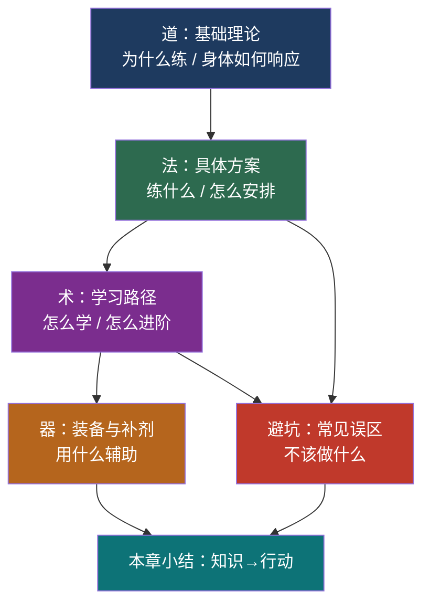
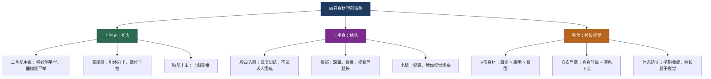
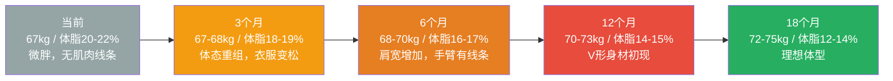
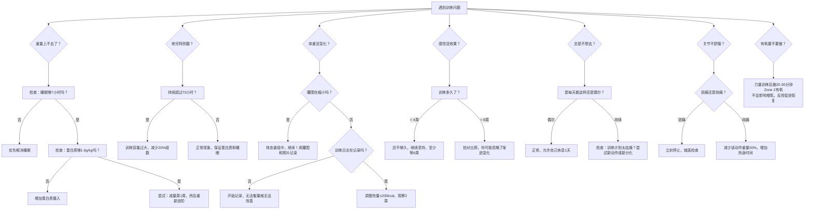

# 本章小结：从知识到行动的完整闭环

> "The difference between who you are and who you want to be is what you do." — Bill Phillips

本章用了五节篇幅，从运动生理学原理出发，穿过训练方案设计、装备补剂选择、学习路径规划、常见误区拆解，最终抵达一个完整的行动体系。这一节的目标不是简单地复述前文——而是在你脑中建立一张**可随时调用的知识地图**，让你在训练的任何一个阶段遇到问题时，都能快速定位原因并找到解决方案。

***

## 一、知识体系全景回顾

### 1.1 本章知识架构总览

整章内容按照"道→法→术→器"的逻辑层层递进。理解这个结构，你就不会迷失在细节中：

### 1.2 核心知识点速查表

下面这张表把全章最关键的30个知识点压缩到一张表中。每个知识点后面标注了它在本章的出处位置，方便你回溯查阅。

| 分类 | 知识点 | 核心结论 | 出处 |
|------|--------|----------|------|
| **生理基础** | 肌肉生长三机制 | 机械张力 > 代谢压力 > 肌肉损伤 | 基础理论·第一节 |
| | 三大能量系统 | 磷酸肌酸（0-10秒）→ 糖酵解（10秒-2分钟）→ 有氧（2分钟以上） | 基础理论·第一节 |
| | 滑丝学说 | Ca²⁺释放→肌动蛋白暴露结合位点→肌球蛋白横桥拉动→肌肉缩短 | 基础理论·第一节 |
| **训练原则** | 渐进超负荷 | 每次训练比上次多一点——重量/次数/组数/缩短休息时间 | 基础理论·第二节 |
| | 专项性原则 | 你想获得什么能力，就练什么动作 | 基础理论·第二节 |
| | 超量恢复 | 训练后48-72小时，身体修复到超过原来水平 | 基础理论·第二节 |
| **力量训练** | 最佳肌肥大参数 | 65-85% 1RM，6-12次/组，每周每肌群10-20组 | 基础理论·第三节 |
| | RPE/RIR自评 | RPE 8-9 = 还能做1-2次，是最有效的训练强度区 | 基础理论·第三节 |
| | 训练容量 | 重量 × 次数 × 组数 = 总容量，是增肌的核心变量 | 基础理论·第三节 |
| **有氧训练** | 心率区间 | Zone 2（60-70%最大心率）= 最佳脂肪氧化区 | 基础理论·第四节 |
| | 有氧不掉肌肉 | 适量有氧（每周150分钟中低强度）不会影响增肌 | 基础理论·第四节 |
| | EPOC效应 | 高强度间歇训练后，身体持续消耗额外热量24-48小时 | 基础理论·第四节 |
| **运动营养** | 蛋白质需求 | 每公斤体重1.6-2.2克/天，分3-5餐摄入 | 基础理论·第六节 |
| | 热量平衡 | 增肌：热量盈余200-300kcal；减脂：热量赤字300-500kcal | 基础理论·第六节 |
| | 碳水化合物 | 训练前1-2小时摄入，为高强度训练供能 | 基础理论·第六节 |
| **柔韧性** | 动态拉伸 | 训练前使用，提高关节活动度和肌肉温度 | 基础理论·第五节 |
| | 静态拉伸 | 训练后使用，每个肌群保持30秒以上 | 基础理论·第五节 |
| **训练方案** | PPL分化 | Push（胸/肩/三头）→ Pull（背/二头）→ Legs（腿/臀） | 具体方案·第一节 |
| | 训练频率 | 每周5-6天，每4-6周安排一次减量周 | 具体方案·第二节 |
| | 有氧安排 | 力量训练后20-30分钟，或单独安排3-5次/周 | 具体方案·第三节 |
| | 矮个子塑形 | 重点发展三角肌中束和背阔肌，打造V形视觉 | 具体方案·第四节 |
| **装备补剂** | 训练鞋 | 力量训练选平底硬底鞋（如匡威、Vans） | 产品推荐·第一节 |
| | 肌酸 | 每天3-5克一水肌酸，最有科学依据的补剂 | 产品推荐·第二节 |
| | 蛋白粉 | 仅作为蛋白质摄入不足时的补充，非必需品 | 产品推荐·第二节 |
| | 食物秤 | 控制饮食的基础工具，精确到克 | 产品推荐·第三节 |
| **学习路径** | 入门期（1-3月） | 掌握5大基本动作模式，建立训练习惯 | 学习路径·第一节 |
| | 基础期（4-6月） | 巩固动作，开始线性渐进超负荷 | 学习路径·第二节 |
| | 进阶期（7-12月） | 引入周期化训练，学习高级技术（暂停、递减组） | 学习路径·第三节 |
| | 高级期（1年以上） | 个性化调整，持续学习，可能需要教练指导 | 学习路径·第四节 |
| **常见误区** | 局部减脂不存在 | 脂肪减少是全身性的，由基因决定减脂顺序 | 常见误区·误区1 |
| | DOMS≠有效训练 | 延迟性肌肉酸痛只是新刺激的反应，不代表训练效果 | 常见误区·误区5 |

这张表的价值在于：当你在训练中遇到任何疑问，先扫一眼这张表，找到对应的知识点，然后回到对应的章节深入阅读。它是一张**速查索引**，不是学习材料。

***

## 二、五大核心原理深度提炼

### 2.1 原理一：渐进超负荷——一切进步的发动机

渐进超负荷不只是"每次加重量"这么简单。它的完整定义是：**系统性地、持续地增加训练刺激，迫使身体产生适应性反应。**

增加训练刺激的五种方式：

| 方式 | 具体操作 | 适用阶段 | 举例 |
|------|----------|----------|------|
| 增加负荷 | 提升使用重量 | 所有阶段 | 上次深蹲60kg×8，这次62.5kg×8 |
| 增加次数 | 同重量多做几次 | 入门-进阶 | 上次60kg×8，这次60kg×10 |
| 增加组数 | 同动作多做一组 | 进阶-高级 | 从3组增加到4组 |
| 缩短休息 | 减少组间休息时间 | 进阶-高级 | 从90秒缩短到75秒 |
| 提升动作质量 | 更好的控制、更大的活动范围 | 所有阶段 | 卧推底部停顿1秒 |

**新手最重要的进阶方式是第一种（增加负荷）**，因为神经系统适应带来的力量增长在前期最快。进入进阶期后，需要综合运用五种方式来避免平台期。

### 2.2 原理二：恢复是训练的一部分

很多新手把"去健身房"等同于"训练"，但实际上，一次完整的训练周期是这样的：

恢复的四大支柱：

| 支柱 | 具体要求 | 为什么重要 |
|------|----------|-----------|
| **睡眠** | 7-9小时/晚，固定作息 | 生长激素的70%在深睡眠中分泌；睡眠不足直接降低睾酮10-15% |
| **营养** | 蛋白质1.6-2.2g/kg，热量充足 | 肌肉修复的原料；热量不足时身体会分解肌肉供能 |
| **压力管理** | 皮质醇水平控制 | 长期高皮质醇抑制蛋白质合成，促进脂肪堆积 |
| **主动恢复** | 轻度活动、泡沫轴、拉伸 | 促进血液循环，加速代谢废物清除 |

**一个判断恢复是否充分的简单方法**：如果连续3次训练你的表现（重量或次数）都在下降，不是你练得不够，而是你恢复得不够。

### 2.3 原理三：体态重组——新手的独特窗口

BMI 24.6、体脂率约20-22%、零训练经验——这三个条件同时满足时，你处于一个极其有利的"体态重组窗口期"。在这个阶段，你可以同时实现两个通常被认为矛盾的目标：**减脂和增肌**。

体态重组的三个前提条件：
1. **新手状态**（训练经验 < 1年）：肌肉对训练刺激极度敏感
2. **中等体脂**（男性18-25%）：既不缺热量储备，也不需要大幅减脂
3. **高蛋白饮食**（1.6-2.2g/kg/天）：为肌肉合成提供充足原料

这意味着什么？你不需要经历"先减脂再增肌"的漫长周期。前6个月，你的体重可能只变化1-2kg，但体型会发生显著改善——因为脂肪减少、肌肉增加，重量相互抵消，但密度不同。

### 2.4 原理四：训练周期化——线性进步终会结束

新手可以每次训练都加重量（线性进阶），但这种进步不会永远持续。通常在3-6个月后，你会遇到第一个平台期。这就是为什么本章介绍了训练周期化的概念：

| 周期化类型 | 描述 | 适用阶段 |
|-----------|------|----------|
| 线性周期化 | 每次训练增加重量或次数 | 新手期（0-6个月） |
| 波动周期化 | 不同训练日使用不同强度和容量 | 进阶期（6-12个月） |
| 区块周期化 | 每个阶段集中发展一个能力维度 | 高级期（1年以上） |

**对新手来说，只需要掌握线性周期化就够了**。但你需要知道前方的路是什么样的，这样当线性进步停止时，你不会恐慌——不是你出了问题，是身体适应了当前刺激，需要换一种刺激方式。

### 2.5 原理五：55开身材比例的塑形策略

对于普通身高、55开身材比例的人来说，塑形的核心策略是：**拉宽上半身，收紧下半身，打造V形视觉效果**。

这不是"不练腿"——腿仍然需要训练（深蹲是最好的全身复合动作之一），但不需要像健美运动员那样追求大腿围度。训练目标是紧致有力，而非粗壮。

***

## 三、行动清单与里程碑

### 3.1 本周行动清单（立刻执行）

这是你读完本章后需要在7天内完成的事项。每一条都附带了为什么要做和怎么做的说明：

**1. 阅读基础理论前两节**
- **为什么**：运动生理学和训练原则是所有训练决策的基础。跳过理论直接练，等于闭眼开车
- **怎么做**：花2-3小时通读，不需要记住所有细节，但要理解核心概念：三大能量系统、渐进超负荷、超量恢复
- **预计时间**：2-3小时

**2. 观看三大复合动作教学视频**
- **为什么**：深蹲、硬拉、卧推是力量训练的基石，也是最容易受伤的动作。视频比文字更直观
- **怎么做**：在B站搜索以下关键词，各找一个播放量高、评论正向的教学视频：
  - "深蹲动作教学 新手"
  - "传统硬拉动作教学"
  - "平板卧推动作教学"
- **推荐频道**：Jeff Nippard（科学训练体系）、Athlean-X（动作解析）、叔贵（中文解说）
- **预计时间**：每个动作15-20分钟，共约1小时

**3. 准备基础训练装备**
- **为什么**：装备不齐会成为拖延的借口。最低配置只需要三样东西
- **怎么做**：
  - 运动鞋：平底硬底鞋即可（匡威帆布鞋、Vans Old Skool，或任何鞋底不软不厚的鞋）。不要穿跑步鞋做力量训练——过厚的鞋底会降低稳定性
  - 速干T恤：不要穿纯棉T恤，汗水浸透后贴在身上影响动作
  - 运动短裤：弹性好、不卡裆即可
- **预计花费**：200-400元

**4. 选择并考察一家健身房**
- **为什么**：距离是决定健身坚持率的第一因素。离家或公司超过15分钟的健身房，放弃率翻倍
- **怎么做**：参照本章「产品推荐 → 健身房选择」的评估清单，实地考察2-3家。重点关注：距离（<15分钟）、深蹲架数量（≥2个）、高峰时段拥挤程度
- **建议**：先办月卡或次卡，不要一上来就办年卡。确认自己能坚持1个月后，再考虑长期卡

**5. 下载训练记录App**
- **为什么**：训练日志是持续进步的基石。没有数据，你无法判断自己是否在进步
- **怎么做**：下载Strong（iOS/Android均可），免费版功能完全够用。预设好PPL模板，记录每组的重量和次数
- **预计时间**：10分钟

### 3.2 第一个月里程碑（28天目标）

| 周次 | 目标 | 验证标准 |
|------|------|----------|
| 第1周 | 用空杆/最轻重量完成3次训练 | 每次训练完成推/拉/腿各一次 |
| 第2周 | 掌握深蹲、卧推的动作模式 | 能用控制力十足的动作完成3组×10次 |
| 第3周 | 开始线性进阶 | 每次训练复合动作增加2.5kg（卧推）或5kg（深蹲/硬拉） |
| 第4周 | 建立稳定习惯 | 训练日志连续记录12次训练数据 |

**营养目标**：
- 每天蛋白质摄入达到每公斤体重1.6克（约107克蛋白质）
- 蛋白质来源分配：鸡蛋（2-3个/天）+ 鸡胸肉/鱼肉（200-300克/天）+ 牛奶（500ml/天）+ 蛋白粉（可选，1勺/天补充不足部分）
- 用食物秤称量至少一周，建立"目测份量"的直觉

### 3.3 第三个月里程碑（90天目标）

| 指标 | 目标值 | 备注 |
|------|--------|------|
| 深蹲 | 体重×0.8倍（约54kg） | 全程深蹲，大腿平行地面以下 |
| 硬拉 | 体重×1.0倍（约67kg） | 传统硬拉，脊柱中立 |
| 卧推 | 体重×0.6倍（约40kg） | 杠铃触胸，全程控制 |
| 引体向上 | 至少1次完整引体 | 辅助引体或弹力带辅助也算里程碑 |
| 体脂率 | 下降1-2% | 目标18-20%，用同一台设备测量 |
| 训练频率 | 稳定每周4-5次 | 不跳周，不找借口 |

### 3.4 第六个月里程碑（180天目标）

| 指标 | 目标值 | 备注 |
|------|--------|------|
| 深蹲 | 体重×1.0倍（约67-70kg） | 新手进阶期标准 |
| 硬拉 | 体重×1.2倍（约80-84kg） | 力量增长最快的复合动作 |
| 卧推 | 体重×0.8倍（约54-56kg） | 上肢力量基准线 |
| 引体向上 | 至少5次 | 自重引体，无辅助 |
| 体脂率 | 下降3-5% | 目标16-18% |
| 体型变化 | 肩膀明显变宽，手臂有线条 | V形身材初现 |

### 3.5 目标体重路线图

根据你的身体数据（普通身高、67kg、体脂率约20-22%），以下是科学合理的目标路线图：

**关键说明**：

- **体重可能变化不大**：前6个月你可能只增重1-3kg，但体脂率会下降、肌肉量会增加。体重秤不是唯一指标——量腰围、拍对比照、测体脂率更重要
- **体重增长应控制在每月0.5-1kg**：超过这个速度，增加的大部分是脂肪而非肌肉
- **体脂率测量要一致**：每次用同一台设备、同一时间（建议晨起空腹）、同一状态（未训练日）
- **12个月后可能需要调整策略**：从体态重组模式切换到明确的"增肌期-减脂期"交替模式

***

## 四、关键公式与计算速查

### 4.1 TDEE（每日总能量消耗）计算

你的基础代谢率（BMR）使用Mifflin-St Jeor公式（目前最准确的公式）：

BMR = 10 × 体重(kg) + 6.25 × 身高(cm) - 5 × 年龄 - 161（女性）/+ 5（男性）

以你的数据计算：
BMR = 10 × 67 + 6.25 × 165 - 5 × 28 + 5 = 670 + 1031.25 - 140 + 5 = 1566 kcal

TDEE = BMR × 活动系数：

| 活动水平 | 系数 | 你的TDEE | 适用场景 |
|---------|------|----------|---------|
| 久坐（几乎不运动） | 1.2 | ~1,879 kcal | 休息日 |
| 轻度活动（每周1-3次） | 1.375 | ~2,153 kcal | 训练初期每周3天 |
| 中度活动（每周3-5次） | 1.55 | ~2,427 kcal | 稳定训练期每周4-5天 |
| 高度活动（每周6-7次） | 1.725 | ~2,701 kcal | PPL全开每周6天 |

**体态重组期建议**：取中度活动的TDEE（约2,427kcal），在此基础上不增不减或微调±100kcal。新手期不需要严格热量赤字，高蛋白+力量训练本身就能驱动体态重组。

### 4.2 蛋白质需求速算

每日蛋白质(g) = 体重(kg) × 1.6~2.2
你的需求 = 67 × 1.6~2.2 = 107~147克/天

常见食物蛋白质含量速查（每100克可食用部分）：

| 食物 | 蛋白质(g) | 热量(kcal) | 性价比 |
|------|----------|-----------|--------|
| 鸡胸肉 | 31 | 165 | ⭐⭐⭐⭐⭐ |
| 鸡蛋（1个约50g） | 6.5 | 78 | ⭐⭐⭐⭐⭐ |
| 牛奶（全脂） | 3.3 | 64 | ⭐⭐⭐⭐ |
| 三文鱼 | 20 | 208 | ⭐⭐⭐ |
| 牛肉（瘦） | 26 | 250 | ⭐⭐⭐ |
| 豆腐（北豆腐） | 12.2 | 98 | ⭐⭐⭐⭐ |
| 希腊酸奶 | 10 | 59 | ⭐⭐⭐⭐ |
| 乳清蛋白粉 | 80 | 370 | ⭐⭐⭐（便捷性高） |

### 4.3 训练容量计算

单次训练容量 = Σ（每个动作的重量 × 次数 × 组数）
例：深蹲 60kg × 8次 × 3组 = 1,440kg
    卧推 40kg × 10次 × 3组 = 1,200kg
    当日总容量 = 2,640kg

**监测训练容量的意义**：训练容量是判断渐进超负荷是否发生的最客观指标。如果连续2-3周你的总容量没有增长（在相同训练频率下），说明你需要调整计划了。

***

## 五、常见问题决策树

在训练过程中，你会遇到各种困惑。下面这棵决策树覆盖了新手最常遇到的7个场景：

***

## 六、你需要警惕的七个认知陷阱

在本章的最后，我需要指出七个比"训练错误"更危险的"认知错误"——它们会让你在正确的道路上走偏：

### 陷阱一：追求速度，忽略过程

**错误想法**："我要在3个月内练出腹肌。"

**真相**：对于从体脂20-22%开始的新手，出现明显腹肌线条需要体脂降到12-14%。这在科学上需要6-12个月的持续努力。3个月的目标应该是：养成训练习惯、掌握基本动作、体脂下降1-2%。

**正确心态**：把健身看作终身习惯，而不是一个有截止日期的项目。

### 陷阱二：和别人比较

**错误想法**："他练了3个月就有这样的效果，我怎么没有？"

**真相**：每个人的基因、训练基础、饮食条件、恢复能力都不同。你看到的可能是别人训练了一年之后的"第3个月"。更重要的是，你只看到了别人的体型，不知道他的力量水平、关节健康状况、训练方法是否可持续。

**正确做法**：只和上周的自己比。训练日志中记录的数据才是你的唯一参照物。

### 陷阱三：迷信"最佳方案"

**错误想法**："我需要找到最完美的训练计划再开始。"

**真相**：对于新手，执行一个"足够好"的计划比找到"完美"的计划重要100倍。PPL计划、全身体计划、上下肢分化——对新手来说差异微乎其微。最大的变量是你能否坚持。

**正确做法**：用本章推荐的PPL计划开始，执行8周后再评估是否需要调整。

### 陷阱四：忽视身体信号

**错误想法**："疼也要坚持，这才是意志力。"

**真相**：关节锐痛、持续疲劳、睡眠变差、情绪低落——这些都是身体发出的"需要调整"的信号。忽视它们只会导致更严重的后果：受伤停练2个月，比主动休息1周损失大得多。

**正确做法**：区分"好的不适"（肌肉酸痛、呼吸急促）和"坏的不适"（关节疼痛、头晕、持续疲劳）。前者继续，后者停训并排查原因。

### 陷阱五：过度依赖补剂

**错误想法**："吃了肌酸和蛋白粉，效果应该更好。"

**真相**：补剂在整个训练效果中的贡献大约是2%。你的98%的成果来自训练质量、饮食一致性和恢复充分性。先把这些做好，补剂才是锦上添花。

**正确做法**：在训练习惯和饮食习惯稳定之前（至少前1-2个月），不需要购买任何补剂。

### 陷阱六：只练不学

**错误想法**："看视频跟着练就行了，不需要学理论。"

**真相**：不知道原理的训练者遇到平台期时，唯一的反应是"练得不够"——于是增加训练量，导致过度训练。知道原理的训练者会分析：是训练容量不够？是恢复不足？是营养没跟上？然后对症下药。

**正确做法**：花2-3天读完基础理论部分，这是一次性投入，终身受益。

### 陷阱七：完美主义导致放弃

**错误想法**："今天没时间练完整计划，不如不去了。"

**真相**：完成一次不完美的训练，远好于跳过一次训练。哪怕只有20分钟，做3组深蹲和3组卧推也比什么都不做强。习惯的维持比单次训练的质量更重要。

**正确做法**：准备一个"应急训练方案"——只需要20分钟，包含2-3个复合动作，每个动作2-3组。当你时间不够或状态不好时，执行这个方案。

***

## 七、训练日志模板

下面是一个可以直接使用的训练日志模板。建议打印出来或在App中设置好格式，每次训练后花2分钟填写：

═══════════════════════════════════════════
日期：____年____月____日  训练类型：推 / 拉 / 腿
═══════════════════════════════════════════

【热身】
□ 5分钟低强度有氧（跑步机/划船机）
□ 目标肌群动态拉伸
□ 空杆热身组 × 2组

【训练记录】
┌──────────────┬──────┬──────┬──────┬──────────┬──────────┐
│ 动作         │ 组1  │ 组2  │ 组3  │ 组4(可选)│ RPE(1-10)│
├──────────────┼──────┼──────┼──────┼──────────┼──────────┤
│              │kg×次 │kg×次 │kg×次 │ kg×次    │          │
│              │      │      │      │          │          │
│              │      │      │      │          │          │
│              │      │      │      │          │          │
│              │      │      │      │          │          │
│              │      │      │      │          │          │
└──────────────┴──────┴──────┴──────┴──────────┴──────────┘

【今日总容量】_______ kg（重量×次数×组数的总和）

【训练感受】
□ 动作质量（1-10分）：____
□ 体能状态（1-10分）：____
□ 哪个动作感觉最好：__________
□ 哪个动作需要改进：__________

【放松】
□ 5分钟静态拉伸
□ 泡沫轴放松（可选）

【备注】
_________________________________
═══════════════════════════════════════════

**为什么这个模板有效**：
- **RPE记录**：帮助你判断训练强度是否合适，避免每次都练到力竭
- **总容量计算**：最客观的进步指标，比"今天用了多重"更有意义
- **动作感受**：帮助你识别需要改进的动作模式
- **训练感受**：追踪身体状态趋势，及时发现过度训练的征兆

***

## 八、你的知识检验清单

在翻到下一章之前，花5分钟确认你是否掌握了以下内容。如果某一条不确定，回到对应的章节重新阅读：

| # | 检验问题 | 自查 | 出处 |
|---|---------|------|------|
| 1 | 你能说出肌肉生长的三个机制，并指出哪个最重要吗？ | □ 能 / □ 不能 | 基础理论·第一节 |
| 2 | 你知道自己的TDEE大概是多少吗？ | □ 知道 / □ 不知道 | 基础理论·第六节 |
| 3 | 你能解释"渐进超负荷"的5种实现方式吗？ | □ 能 / □ 不能 | 基础理论·第二节 |
| 4 | 你知道深蹲、卧推、硬拉的正确动作模式吗？ | □ 知道 / □ 不知道 | 基础理论·第三节 + 教学视频 |
| 5 | 你知道PPL三个训练日分别练哪些肌群吗？ | □ 知道 / □ 不知道 | 具体方案·第一节 |
| 6 | 你知道每天需要吃多少克蛋白质吗？ | □ 知道 / □ 不知道 | 基础理论·第六节 |
| 7 | 你能说出至少3个常见健身误区及真相吗？ | □ 能 / □ 不能 | 常见误区 |
| 8 | 你知道训练前需要做什么热身吗？ | □ 知道 / □ 不知道 | 具体方案·第七节 |
| 9 | 你知道肌酸的正确用法吗？ | □ 知道 / □ 不知道 | 产品推荐·第二节 |
| 10 | 你有一张清晰的3-6-12个月目标路线图吗？ | □ 有 / □ 没有 | 本章小结·第三节 |

如果10题中你能答对8题以上，说明你已经建立了扎实的健身知识基础。如果有3题以上不确定，建议先回到基础理论板块重新通读一遍，再开始训练。

***

## 九、最后的话：行动比完美更重要

> "最好的开始时间是十年前，其次是现在。"

读完这一章，你可能有两种感受：

**第一种**："内容太多了，我需要消化一下。"——这是正常的。你不需要记住所有细节。你需要记住的是：渐进超负荷是核心、恢复和训练同样重要、蛋白质要吃够、动作质量优先于重量。其他的，边练边查。

**第二种**："我已经准备好了，明天就去健身房。"——很好，但请注意：准备好了≠完美准备好了。你永远不会100%准备好。你可能还不确定深蹲的膝盖到底能不能超过脚尖（答案是可以，适度前移是正常的），你可能不知道自己的1RM是多少（不需要知道，新手用RPE评估就够了），你可能还在纠结要不要买蛋白粉（先不吃，稳定训练1个月后再说）。

**这些都是正常的不确定。解决它们的唯一方式不是继续阅读，而是开始训练。**

锻炼给你的东西远超体型改变：

1. **自律能力**：坚持训练需要纪律，这种纪律会渗透到工作的每一个角落——你会发现自己写代码时更专注，解决问题时更有耐心，deadline面前更从容
2. **自信心**：当你第一次用体重×1倍的重量完成深蹲，你会真切地感受到"我可以变得更强"——这种感受会迁移到生活的其他领域
3. **抗压能力**：每一次训练都是对不适的主动拥抱。当你习惯了一组让你喘不过气的深蹲后，面对工作中的压力事件，你会发现自己更沉得住气
4. **健康资本**：28岁开始的每一分训练投入，都会在未来30-40年持续回报。研究显示，中年时期的心肺功能是预测老年生活质量的最强指标之一（Myers et al., 2002, *New England Journal of Medicine*）

**现在，你的任务只有一个：**

穿上运动鞋，走进健身房，完成你的第一次训练。用空杆做5组深蹲，用最轻的哑铃做3组卧推，然后回家。这就是你的全部任务。

不是"完美地完成一次训练"，而是"完成一次训练"。

每一步都算数。

***

**下一步**：翻到第三章，我们继续。
