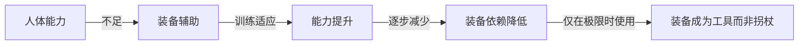
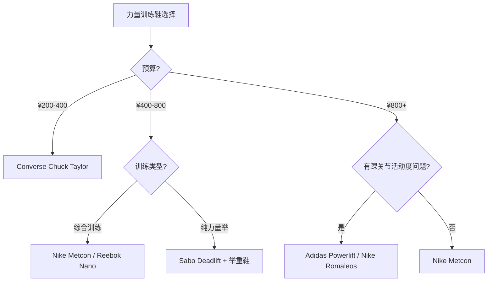
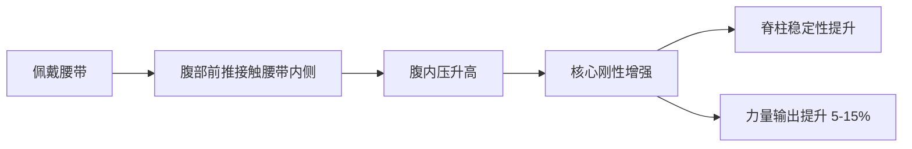
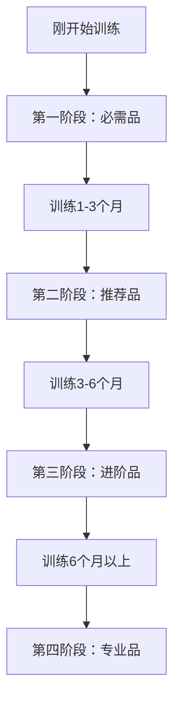

## 一、健身装备

健身装备不是"买了就能变强"的魔法道具，但选对装备能让你的训练更安全、更高效、更持久。本节从**力学原理**出发，告诉你每件装备为什么有用、什么时候需要、怎么选、怎么用，最后给出分阶段采购策略，避免花冤枉钱。

### 1.1 装备选择的底层逻辑

在逐项介绍装备之前，先建立一个认知框架：**装备的本质是弥补人体能力的暂时不足，而不是替代人体能力的发展。**

这个框架决定了三条核心采购原则：

1. **先练后买**：至少训练 1-2 个月，了解自己的真实需求再花钱。很多装备在你不知道自己需要什么的时候买了就是浪费。
2. **先必需后推荐**：鞋子和服装是必需品，腰带和护具是进阶品，辅助工具是锦上添花。
3. **质量优先**：一双好鞋比三双烂鞋更有价值。宁可少买，买好的。

---

### 1.2 训练鞋——最重要的装备

训练鞋是全身力量传导链的起点。深蹲时，力量从脚底通过鞋底传到地面，鞋底的形变直接影响力量传导效率和关节对齐。一双不合适的鞋可能让你的深蹲少 10-20kg，甚至增加膝盖和脚踝受伤风险。

#### 力量训练鞋的力学原理

力量训练需要**稳定的支撑面**。当你深蹲 100kg 时，双脚承受的总重量是 100kg + 体重，分布在大约 500cm² 的脚底面积上。如果鞋底太软，踩下去的瞬间支撑面会变形，导致：

- **力量泄漏**：鞋底压缩吸收了本该传到地面的力，就像在沙子上推车比在水泥地面上费力
- **重心偏移**：软底不均匀压缩导致左右脚受力不均，增加膝关节扭转风险
- **踝关节不稳定**：软底让脚踝在鞋内滑动，降低深蹲底部的稳定性

因此，力量训练鞋的核心指标是：**平底、硬底、薄底、抓地力强**。

#### 力量训练鞋详细对比

| 鞋款 | 价格区间 | 鞋底硬度 | 跟差 | 重量 | 适用动作 | 耐久度 | 推荐指数 |
|------|----------|----------|------|------|----------|--------|----------|
| **Nike Metcon 系列** | ¥600-900 | 硬 | 4mm | 中 | 综合力量训练、CrossFit | 1-2年 | ★★★★★ |
| **Reebok Nano 系列** | ¥500-800 | 中硬 | 4mm | 轻 | 力量+功能性训练 | 1-2年 | ★★★★☆ |
| **Converse Chuck Taylor** | ¥200-400 | 硬 | 0mm | 中 | 深蹲、硬拉 | 6-12月 | ★★★★☆ |
| **Adidas Powerlift** | ¥400-600 | 硬 | 15mm | 中 | 深蹲（踝关节活动度不足者） | 2-3年 | ★★★★☆ |
| **Nike Romaleos** | ¥800-1500 | 极硬 | 20mm | 重 | 专业深蹲、奥举 | 3-5年 | ★★★★★ |
| **Sabo Deadlift** | ¥300-500 | 极硬 | 0mm | 轻 | 硬拉专项 | 2-3年 | ★★★★☆ |

**选购决策树：**

**跟差（Heel-to-Toe Drop）详解：**

跟差是指鞋跟与前掌的厚度差。跟差越大，脚踝相对背屈的角度越小，等效于增加了踝关节的背屈能力。

- **0mm 跟差**（Converse、Sabo）：适合踝关节活动度良好的人，硬拉首选
- **4mm 跟差**（Metcon、Nano）：微小差异，综合训练万金油
- **15-20mm 跟差**（Powerlift、Romaleos）：显著帮助深蹲底部位置，但不适合硬拉（会增加前倾力矩）

如果你深蹲时脚跟会离地、或蹲到底部时身体严重前倾，优先考虑增加踝关节活动度（见拉伸章节），而不是直接买举重鞋。举重鞋是"治标"，活动度训练是"治本"。

#### 有氧训练鞋

有氧训练鞋的需求与力量训练完全不同：需要缓震、轻量、透气。

| 训练类型 | 推荐鞋款 | 核心指标 | 价格区间 |
|----------|----------|----------|----------|
| **路跑** | Nike Pegasus、Asics Gel-Kayano、Brooks Ghost | 缓震、支撑、耐磨 | ¥400-1000 |
| **健身房跑步机** | 与路跑鞋通用 | 同上 | 同上 |
| **椭圆机/划船机** | 普通运动鞋即可 | 舒适、透气 | ¥100-300 |
| **动感单车** | 骑行鞋或硬底运动鞋 | 硬底传力 | ¥200-600 |
| **综合有氧（HIIT）** | CrossFit 鞋或综合训练鞋 | 灵活、稳定 | ¥400-800 |

**跑步鞋选购要点：**

- **足型判断**：去专业跑步店做足型分析（足弓高度、内旋程度），或在家做"湿脚测试"——湿脚踩在纸上，看足印形状
- **尺码选择**：跑步鞋比日常鞋大半码到一码，因为跑步时脚会充血膨胀
- **更换周期**：跑量 500-800km 或使用 6-12 个月后缓震性能显著下降

#### 特殊需求鞋款

- **扁平足**：选择支撑型（Stability）跑鞋，如 Asics GT-2000、Brooks Adrenaline，或使用定制矫正鞋垫
- **高足弓**：选择缓震型（Neutral）跑鞋，如 Nike Pegasus、New Balance 1080
- **宽脚掌**：New Balance 和 Altra 品牌提供宽版选项；力量训练鞋中 Reebok Nano 前掌较宽

#### 鞋子维护

- **力量训练鞋**：训练后通风晾干，不要水洗帆布鞋（会变软变形）
- **跑鞋**：避免暴晒和烘干机，可用旧牙刷清洁鞋底纹路中的小石子
- **寿命判断**：鞋底纹路磨平、中底出现明显褶皱或塌陷时更换

---

### 1.3 训练服装

训练服装的核心需求是：**不妨碍动作幅度、快速排汗、适度耐穿**。不需要追求品牌溢价，但材质选择比你想象的重要。

#### 运动面料科学

| 面料类型 | 优点 | 缺点 | 适用场景 | 价格参考 |
|----------|------|------|----------|----------|
| **聚酯纤维（Polyester）** | 速干、耐磨、不易变形 | 透气性一般，容易产生异味 | 力量训练、HIIT | ¥15-80/件 |
| **尼龙（Nylon）** | 柔软、耐磨、弹性好 | 速干性略差于聚酯 | 综合训练 | ¥20-100/件 |
| **氨纶/莱卡（Spandex）** | 极高弹性 | 单独使用不耐磨，需混纺 | 压缩衣、训练裤 | 通常混纺使用 |
| **纯棉** | 亲肤、透气 | 吸汗不排汗、变重、贴身 | ❌ 不适合运动 | ¥10-30/件 |
| **美利奴羊毛** | 天然抗菌、温控好 | 价格高、不耐磨 | 冬季户外运动 | ¥200-500/件 |

**关键结论**：训练服装选聚酯纤维或尼龙混纺面料，远离纯棉。纯棉T恤吸汗后变重、贴在身上、摩擦皮肤，是健身房最常见的服装错误。

#### 训练上衣

- **版型**：合身但不紧绷。力量训练需要观察肌肉收缩轨迹（念动一致），过于宽松的衣服会掩盖动作细节
- **领口**：圆领最百搭；V领在做卧推时可能走光；无袖背心适合手臂训练日
- **推荐配置**：3-5 件速干T恤轮换，每次训练后更换，避免细菌滋生

**品牌分层：**

- **高端（¥150-400/件）**：Under Armour、Nike Pro、Lululemon — 面料科技更先进，剪裁更贴合，耐洗不变形
- **中端（¥50-150/件）**：迪卡侬 KALENJI 系列、安踏、李宁 — 性能足够，性价比高
- **性价比（¥15-50/件）**：1688/拼多多工厂店的聚酯纤维速干T恤 — 功能性完全达标，但做工和耐久度稍差

#### 训练裤/短裤

力量训练的下装需要满足一个核心需求：**不限制髋关节和膝关节的活动范围**。深蹲到底部时髋关节屈曲角度超过 120°，普通牛仔裤或运动裤的面料弹性不够会限制下蹲深度。

- **力量训练首选**：弹性好的运动短裤或压缩裤。裤长在膝盖以上 10-15cm 为佳，避免蹲下时裤腿卡在膝盖
- **有氧训练**：轻便的运动短裤，透气性优先
- **带内衬短裤**：省去穿内层的麻烦，减少摩擦，是力量训练最实用的裤型选择
- **压缩裤外穿**：直接穿压缩裤训练没问题，但注意选择裆部有加固设计的款式

#### 压缩衣——需要还是不需要？

压缩衣的宣称功效包括"促进血液循环、减少肌肉振动、加速恢复"。但科学研究的结果是**混合的**：

- **运动表现提升**：多项 meta 分析显示，压缩衣对力量输出和耐力的直接提升效果**微乎其微**（<2%）
- **恢复效果**：运动后穿着压缩衣 12-24 小时，可以**轻微减少延迟性肌肉酸痛（DOMS）**的主观感受
- **实际价值**：保暖（寒冷环境训练）、减少肌肉晃动（大体重训练者）、心理安慰效应

**结论**：压缩衣不是必需品。如果你在寒冷环境下训练、体重较大感觉肌肉晃动不适、或者单纯喜欢压缩衣的包裹感，可以购买；否则普通速干衣完全够用。

**压缩衣品牌推荐**：2XU（压缩效果最强）、SKINS（舒适度好）、Under Armour（性价比高）。

---

### 1.4 手部装备

#### 训练手套 vs 液体镁粉 vs 裸手

这是力量训练圈争议最大的话题之一。每种方式都有道理，关键是理解各自的适用场景。

| 方式 | 握力表现 | 手掌保护 | 握杆手感 | 便利性 | 适用人群 |
|------|----------|----------|----------|--------|----------|
| **裸手** | ★★★★★ | ★★☆☆☆ | ★★★★★ | ★★★★★ | 进阶者，追求握力发展 |
| **半指手套** | ★★★★☆ | ★★★★☆ | ★★★☆☆ | ★★★★☆ | 新手，手掌敏感者 |
| **液体镁粉** | ★★★★★ | ★★★★☆ | ★★★★★ | ★★★☆☆ | 所有人群，推荐首选 |
| **粉状镁粉** | ★★★★★ | ★★★★☆ | ★★★★★ | ★★☆☆☆ | 有固定训练位的人 |

**老茧问题**：握杆产生的老茧是角质层对反复摩擦的适应性增厚。老茧本身不是问题，但**过厚的老茧反而危险**——在大重量硬拉时，过厚的茧可能被撕裂，导致出血和感染。正确的做法是：

1. 训练后用浮石或专用茧刀磨平过厚的茧
2. 洗手后涂抹护手霜保持皮肤弹性
3. 如果选择裸手训练，接受适度的老茧作为正常适应

**新手建议**：前 3 个月使用半指手套或液体镁粉保护手掌，之后根据个人偏好选择。液体镁粉（如 Liquid Grip、Spider Chalk）是最均衡的选择——既防滑又不过度保护，握杆手感接近裸手。

#### 护腕

护腕的作用是限制腕关节过度伸展，在推类动作中提供支撑。

**需要护腕的场景**：
- 卧推、肩推等大重量推举动作
- 腕关节有旧伤或活动度受限
- 做俯卧撑时手腕疼痛

**不需要护腕的场景**：
- 轻重量热身组
- 深蹲、硬拉等不涉及腕部负荷的动作
- 孤立训练（二头弯举、三头下压等）

**护腕选购要点**：

- **材质**：棉质弹性绑带式（如 SBD、Cerberus）支撑力最强；尼龙魔术贴式（如 Harbinger）穿脱方便
- **长度**：标准长度 30cm 足够大多数人的腕围缠绕 2-3 圈
- **缠绕方式**：从腕关节下方开始，斜向上缠绕，覆盖腕关节后在手背处固定
- **价格**：¥50-300，SBD 护腕约 ¥200-300，Harbinger 约 ¥80-150

---

### 1.5 腰带——最重要的护具

腰带是力量训练中最值得投资的护具，但也是被误解最多的装备。

#### 腰带的力学原理

很多人以为腰带是"绑住腰保护脊柱"，这是**错误的**。腰带的真正作用机制是：

2017 年发表在 *Sports Medicine* 上的 meta 分析汇总了 12 项研究，发现使用腰带进行深蹲训练可以平均提升 5-15% 的最大重量。机制是：腰带为腹壁提供了一个可以"推靠"的外部阻力面，当你进行 Valsalva 呼吸法（深吸气后屏住呼吸并用力推腹部向外）时，腹部推到腰带上产生的反作用力显著提高了腹内压，从而增强了整个躯干的刚性。

**这意味着**：如果你不会做 Valsalva 呼吸法，腰带的效果会大打折扣。学习正确的呼吸技术比买腰带更重要。

#### 腰带类型详解

| 类型 | 厚度 | 宽度 | 闭合方式 | 适用场景 | 价格区间 | 推荐指数 |
|------|------|------|----------|----------|----------|----------|
| **力量举腰带（杠杆扣）** | 10-13mm | 后10cm/前7cm | 杠扣 | 深蹲、硬拉 | ¥300-1500 | ★★★★★ |
| **力量举腰带（针扣）** | 10-13mm | 后10cm/前7cm | 针扣 | 深蹲、硬拉 | ¥200-1200 | ★★★★☆ |
| **举重腰带** | - | 前后等宽10cm | 针扣/快扣 | 奥林匹克举重 | ¥200-800 | ★★★★☆ |
| **尼龙腰带** | - | 可调节5-10cm | 快扣/Velcro | 综合训练、CrossFit | ¥100-300 | ★★★☆☆ |

**力量举腰带的宽度差异**：后宽前窄的设计（如 10cm/7cm）是因为后腰需要更大的支撑面积来增加腹内压的传递效率，而前部较窄是为了不妨碍深蹲底部的髋关节屈曲。前后等宽的腰带更适合举重动作（抓举、挺举），因为这些动作需要更多的躯干活动范围。

**闭合方式选择**：

- **杠杆扣（Lever）**：穿脱最快（1 秒扣上/松开），但调节松紧需要螺丝刀拆卸杠杆。适合训练重量固定的进阶者
- **针扣（Prong）**：调节灵活，可以随时根据需要调整松紧。适合新手和训练重量波动大的人
- **快扣（Quick Release）**：介于两者之间，单手操作，但耐久度不如前两者

#### 腰带品牌分级

**高端（¥800-1500）**：
- **SBD**：力量举腰带的标杆，13mm 厚度，做工一流，终身保用
- **Inzer**：美国老牌，Forever 系列经典耐用，但正品难买（国内假货多）
- **Pioneer**：美国定制品牌，可选厚度和宽度，定制周期 4-8 周

**中端（¥300-800）**：
- **Rogue**：品质稳定，型号齐全，是国内能买到的最高性价比进口品牌
- **Gymreapers**：性价比不错的进口选择
- **Cerberus**：英国品牌，力量举圈口碑好

**性价比（¥100-300）**：
- **迪卡侬**：入门级力量举腰带，功能基本达标，但厚度和刚性不如专业品牌
- **淘宝国产品牌**：选择评价数量多、好评率高的店铺，注意看材质是否为真牛皮

#### 腰带使用时机

**新手阶段（训练 < 3 个月）**：**不使用腰带**。这个阶段需要先建立自身的核心力量和正确的呼吸模式。过早依赖腰带会掩盖核心发力不足的问题。

**进阶阶段**：在以下场景使用腰带——
- 深蹲、硬拉的最后 1-2 组（接近或超过 85% 1RM）
- 大重量划船
- 站姿推举

**热身组和轻重量组不使用腰带**，让核心肌群持续得到刺激。

**腰带松紧度**：扣上后应该能插入一个手掌的厚度。太松没有支撑效果，太紧会影响呼吸和血液循环。

---

### 1.6 关节护具

#### 护膝（膝套/膝缠绕）

护膝分为两种类型：

**膝套（Knee Sleeves）**：
- **材质**：7mm 氯丁橡胶（Neoprene）
- **作用**：保暖（维持关节液温度和粘度）、轻度压缩支撑、本体感觉增强
- **使用时机**：深蹲重量超过 1.5 倍体重时考虑使用
- **品牌推荐**：SBD（最强支撑）、Rehband（经典舒适）、Gymreapers（性价比）

**膝缠绕（Knee Wraps）**：
- **材质**：弹性编织带
- **作用**：比膝套更强的弹性回弹力，可以在深蹲底部提供额外的向上推力
- **使用时机**：力量举比赛或极限重量测试，日常训练不推荐（会影响深蹲动作模式）
- **缠绕方式**：从膝盖下方开始，斜向上螺旋缠绕 3-5 圈，在膝盖上方固定

**护膝选购要点**：
- **尺寸**：量膝盖中心周长，参照品牌的尺码表。太松没有支撑，太紧影响血液循环
- **厚度**：5mm 适合轻度支撑和保暖，7mm 是力量训练标准厚度
- **单只还是一对**：力量训练买一对，不要只买一只

#### 护肘

- **适用场景**：卧推、肩推超过 1 倍体重时，或肘关节有旧伤
- **材质**：与膝套相同，5mm 或 7mm 氯丁橡胶
- **品牌**：SBD、Rehband、Stoic

#### 护踝

- **适用场景**：踝关节活动度不足影响深蹲深度时
- **类型**：轻度压缩套（保暖为主）vs 举重鞋（提供刚性跟差）
- **建议**：优先通过拉伸和活动度训练改善踝关节功能，而非依赖护踝

---

### 1.7 辅助训练工具

#### 弹力带（Resistance Bands）

弹力带是最被低估的训练工具之一。它提供的**可变阻力**（随着拉伸长度增加，阻力线性增大）是自由重量无法替代的。

**弹力带阻力等级参考**：

| 颜色（通用标准） | 阻力范围 | 宽度 | 适用场景 |
|------------------|----------|------|----------|
| 黄色/超轻 | 2-7kg | 6mm | 热身、肩袖训练、康复 |
| 红色/轻 | 7-16kg | 13mm | 辅助引体向上、热身 |
| 黑色/中 | 16-25kg | 21mm | 辅助引体向上、增加阻力 |
| 绿色/重 | 25-38kg | 32mm | 大体重辅助引体、深蹲辅助 |
| 蓝色/超重 | 38-55kg | 45mm | 硬拉辅助、大阻力训练 |

**核心用途**：

1. **热身激活**：弹力带绕膝深蹲（Monster Walk）激活臀中肌，是深蹲前的标配热身
2. **辅助引体向上**：绕在单杠上踩住，减轻自身体重的一部分阻力
3. **增加阻力**：挂在杠铃两端，在动作顶部阻力最大，适合突破粘滞点
4. **肩袖训练**：外旋、内旋等动作强化肩关节稳定性
5. **拉伸辅助**：辅助进行胸椎、髋关节等活动度训练

**选购建议**：买一套 5 条不同阻力的（¥30-100/套），比买单条实用得多。品牌差异不大，选材质厚实、弹性恢复好的即可。

#### 拉力带/握力带（Lifting Straps）

拉力带的作用是在硬拉、划船等拉类动作中，当握力成为瓶颈时提供辅助。

**工作原理**：将带子缠绕在杠铃杆上，形成一个"套索"，将杠铃的重量通过带子传递到手腕，绕过手指握力的限制。

**使用原则**：
- **握力瓶颈判断**：如果你硬拉时其他部位还有余力但手先松开了，说明握力是瓶颈
- **不要过早使用**：先通过握力训练自然发展握力（农夫行走、悬吊、粗杠训练）
- **仅用于大重量组**：热身组和正常组用正反握或正握助力握
- **训练后补练握力**：使用拉力带的训练日后单独加 5-10 分钟握力训练

**类型对比**：

| 类型 | 使用难度 | 支撑力 | 适用动作 | 价格 |
|------|----------|--------|----------|------|
| **普通布带** | ★★★☆☆ | ★★★★☆ | 硬拉、划船 | ¥30-80 |
| **八字环形带** | ★★☆☆☆ | ★★★☆☆ | 硬拉、高翻 | ¥40-100 |
| **Versa Gripps** | ★☆☆☆☆ | ★★★★★ | 所有拉类动作 | ¥200-400 |

#### 泡沫轴（Foam Roller）与筋膜放松

泡沫轴通过**自我筋膜释放（Self-Myofascial Release, SMR）**原理工作：对肌肉和筋膜施加持续压力，帮助打破粘连、改善组织滑动性、降低肌肉张力。

**硬度选择**：

| 硬度 | 触感 | 适用人群 | 价格 |
|------|------|----------|------|
| **软（低密度）** | 像海绵 | 初学者、疼痛敏感者 | ¥30-60 |
| **中（中密度）** | 适中的压力 | 大多数训练者 | ¥50-100 |
| **硬（高密度）** | 像木头 | 进阶者、大面积肌肉放松 | ¥80-150 |
| **振动泡沫轴** | 可调节频率 | 全人群（效果更好但价格高） | ¥200-800 |
| **花生球/Lacrosse球** | 小面积深层压力 | 精准放松（足底、胸椎旁） | ¥20-60 |

**使用方法**：
1. 在目标肌肉上缓慢滚动，速度约 1cm/秒
2. 找到痛点（Trigger Point）后停留 20-30 秒，直到痛感降低 50% 以上
3. 避免直接滚压关节和骨骼突出处
4. 训练前使用：激活目标肌群（快速滚动 30 秒/部位）
5. 训练后使用：放松紧张肌群（慢速滚动 60-90 秒/部位）

**新手建议**：从中等硬度的泡沫轴开始（¥50-80），配一个网球或筋膜球做深层放松，足够应对前 6 个月的需求。

#### 按摩枪（筋膜枪）

按摩枪是泡沫轴的便携替代方案，通过高频振动（2000-3200 次/分钟）放松肌肉。

- **优势**：操作简单、省力、可以够到泡沫轴难以覆盖的部位（如上背部、小腿后侧）
- **局限**：对大面积筋膜粘连的效果不如泡沫轴深层按压
- **选购要点**：选择噪音 < 60dB、续航 > 2 小时、带 4 个以上按摩头的型号
- **价格区间**：¥200-2000，中端（¥500-800）的性价比最高
- **品牌推荐**：Theragun（高端）、Hyperice（中高端）、云麦/麦瑞克（国产性价比）

---

### 1.8 装备采购策略

#### 分阶段采购路线图

**第一阶段：必需品（预算 ¥300-600）**——训练第 1 天就需要

| 装备 | 预算 | 选购建议 |
|------|------|----------|
| 训练鞋 | ¥200-400 | Converse Chuck Taylor 或迪卡侬力量训练鞋 |
| 速干T恤 ×3 | ¥45-150 | 1688/拼多多工厂店聚酯纤维款 |
| 运动短裤 ×2 | ¥40-120 | 带内衬的弹性运动短裤 |
| 运动袜 ×3 | ¥30-60 | 中筒棉混纺运动袜 |

**第二阶段：推荐品（预算 ¥200-500）**——训练 1-3 个月后

| 装备 | 预算 | 选购建议 |
|------|------|----------|
| 弹力带套装 | ¥30-80 | 5 条不同阻力的套装 |
| 泡沫轴 | ¥50-100 | 中等硬度 EVA 材质 |
| 液体镁粉 | ¥30-80 | Liquid Grip 或国产替代品 |
| 训练水壶 | ¥30-60 | 1L 以上，带刻度 |

**第三阶段：进阶品（预算 ¥500-1500）**——训练 3-6 个月后

| 装备 | 预算 | 选购建议 |
|------|------|----------|
| 力量举腰带 | ¥300-800 | 针扣式 10mm 厚度（新手友好） |
| 护腕 | ¥80-200 | Harbinger 或 SBD |
| 膝套 | ¥150-400 | 一对 7mm 氯丁橡胶 |
| 正式训练鞋 | ¥400-800 | Nike Metcon 或 Reebok Nano |

**第四阶段：专业品（按需购买）**——训练 6 个月以上

| 装备 | 预算 | 触发条件 |
|------|------|----------|
| 举重鞋 | ¥800-1500 | 踝关节活动度问题持续存在 |
| 拉力带 | ¥50-200 | 握力成为硬拉瓶颈 |
| 按摩枪 | ¥500-1000 | 恢复需求增加、时间紧张 |
| 高端腰带 | ¥800-1500 | 力量举比赛准备 |

#### 消费陷阱与避坑指南

**常见错误**：

1. **一开始就买高端装备**：新手阶段用 ¥200 的 Converse 和用 ¥1500 的 Romaleos 做深蹲，体验差异远小于你的想象。等你知道自己需要什么再花钱
2. **品牌信仰**：同一个代工厂出来的速干T恤，贴上 Under Armour 的标就贵 10 倍。1688 工厂店的聚酯纤维速干衣功能性完全达标
3. **过度护具**：戴护腕、护膝、护肘、腰带做轻重量弯举——这不是训练，这是 cosplay。护具只在大重量复合动作时使用
4. **忽略尺码**：鞋子、护膝、腰带的尺码选错，装备就成了伤害源而不是保护源。购买前量好尺寸，参照品牌尺码表
5. **便宜的举重鞋**：¥300 以下的举重鞋通常鞋底硬度不够，形同虚设。举重鞋的核心价值就是硬底，软底的举重鞋不如不买

**省钱技巧**：

- **二手市场**：闲鱼上可以淘到品质不错的二手训练鞋和腰带，检查磨损程度即可
- **节日大促**：618、双 11 期间运动品牌折扣力度大，提前加购物车
- **1688 批发**：速干衣、运动袜、弹力带等标准化产品直接从工厂买，价格是零售的 1/3-1/5
- **国产替代**：护膝、腰带等护具的国产品牌品质在近年大幅提升，不必迷信进口

---

### 1.9 家庭健身房装备建议

如果你选择在家训练而非去健身房，以下是最低配置清单：

**基础配置（预算 ¥2000-5000）**：
- 可调节哑铃一对（2.5-25kg）：¥500-1500
- 可调节卧推凳：¥300-800
- 引体向上杆（门框式）：¥50-150
- 瑜伽垫：¥50-100
- 弹力带套装：¥30-80

**进阶配置（追加 ¥3000-8000）**：
- 杠铃 + 杠铃片（100kg）：¥1500-4000
- 深蹲架/半框架：¥800-3000
- 地垫（保护地板和隔音）：¥200-500

**投资回报分析**：按一线城市健身房年卡 ¥3000-6000 计算，家庭健身房的初始投资在 1-2 年内就能回本，且省去了通勤时间。但缺点是缺少训练氛围和社交互动，自律性要求更高。

---

### 1.10 常见误区

| 误区 | 正确认知 |
|------|----------|
| "装备越贵训练效果越好" | 装备是辅助，训练强度、动作质量、营养和恢复才是核心变量。一双 ¥1500 的举重鞋不能替代正确的深蹲技术 |
| "不戴腰带练不好" | 腰带是大重量的辅助工具，不是日常训练的必需品。学会正确的呼吸和核心发力比买腰带重要 10 倍 |
| "护具越多越安全" | 过度依赖护具会削弱自身稳定肌群的发展，反而增加受伤风险。护具只在高强度训练时使用 |
| "跑步鞋可以做所有运动" | 跑步鞋的软底在力量训练中是安全隐患，尤其影响深蹲和硬拉的稳定性 |
| "压缩衣能提升运动表现" | 科学证据不支持这一说法。压缩衣的实际价值在于保暖和轻度恢复辅助 |
| "训练手套越贵越好" | 手套的核心功能是防滑和保护手掌，¥30-50 的手套和 ¥200 的手套在功能上差异很小 |
| "泡沫轴越硬越好" | 过硬的泡沫轴会让新手因为疼痛而放弃使用。从中等硬度开始，适应后再升级 |
