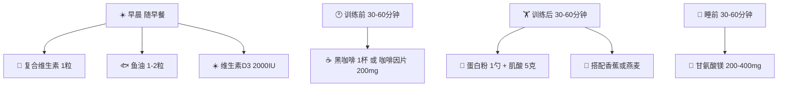

## 二、营养补剂

### 2.1 补剂的正确认知：先搞清楚它是什么

很多人对补剂存在两种极端认知：一种是"吃补剂就能变壮"，另一种是"补剂都是骗人的"。这两种认知都不准确。

**补剂的本质是"补充"——补充饮食中难以获取或摄入不足的营养素。** 它的作用是在良好饮食、充足睡眠、科学训练的基础上，提供额外的便利性和边际收益。如果前三者没做好，补剂就是在浪费钱。

可以用一个量化框架来理解各因素的贡献占比：

| 因素 | 贡献占比 | 说明 |
|------|---------|------|
| 饮食 | ~60-70% | 蛋白质摄入充足、热量达标、营养素全面 |
| 训练 | ~15-20% | 渐进超负荷、动作质量、训练量合理 |
| 睡眠与恢复 | ~10-15% | 7-9小时高质量睡眠、压力管理 |
| 补剂 | ~2-5% | 在前三者做好的前提下，锦上添花 |

这个比例来自运动营养学领域的共识——国际运动营养学会（ISSN）的立场声明反复强调：补剂是"锦上添花"而非"雪中送炭"。

**什么情况下你才需要补剂？**

- 你的饮食中蛋白质确实无法通过食物达到目标摄入量（每天107-147g蛋白质对67kg体重的增肌目标）
- 你的训练强度和容量已经达到一定水平，边际收益变得重要
- 你有特定的营养素缺乏（如维生素D不足，这在中国人群中非常普遍）
- 你需要便利性——比如训练后不方便立刻吃到正餐

**什么情况下你不需要补剂？**

- 饮食结构已经非常均衡，宏量和微量营养素都达标
- 训练处于新手阶段，力量增长主要靠神经适应而非营养补给
- 预算有限，优先把钱花在优质食材上

### 2.2 第一梯队：证据充分、推荐日常使用的补剂

这一梯队的补剂经过大量随机对照试验（RCT）验证，安全性高、效果确切，几乎所有运动营养学家都会推荐。

#### 2.2.1 肌酸一水合物（Creatine Monohydrate）

**为什么排在第一位？** 肌酸是运动营养领域研究最充分的补剂，没有之一。截至目前，PubMed上关于肌酸的研究超过500项，涵盖了从力量表现到认知功能的多个维度。

**作用机制**：

人体肌肉中天然储存着磷酸肌酸（PCr），它是高强度运动（持续5-15秒的爆发性运动，如举重、冲刺）的快速能量来源。当肌肉收缩时，ATP（三磷酸腺苷）分解为ADP释放能量，磷酸肌酸迅速将ADP重新合成为ATP。肌肉中PCr的储量决定了你在高强度运动中能维持多久的峰值输出。

口服肌酸补充可以将肌肉中的PCr储量提高20-40%，这意味着：
- 你可以多做1-2次重复（比如卧推从8次提升到10次）
- 组间恢复更快，组间休息效率更高
- 长期来看，更多的训练量 = 更多的肌肉增长

**有据可查的效果**：
- **力量提升**：Meta分析显示，补充肌酸可使力量训练者的最大力量提升5-10%
- **肌肉增长**：长期使用可增加瘦体重1-2kg（含水分，实际肌肉增长约0.5-1kg）
- **认知功能**：2018年的一项Meta分析表明，肌酸对短期记忆和推理能力有改善作用，尤其在睡眠不足或精神疲劳时效果更明显
- **安全性**：国际运动营养学会2017年的立场声明确认：长期每天3-5克肌酸补充对健康成年人无已知不良影响

**使用方法**：

有两种方案，选一种即可：

| 方案 | 操作 | 达到饱和时间 | 适合人群 |
|------|------|------------|---------|
| **直接维持** | 每天3-5克，持续服用 | 约28天 | 推荐，简单无副作用 |
| **加载期+维持** | 前5-7天每天20克（分4次×5克），之后每天3-5克 | 约7天 | 想快速见效，但可能有轻微胃肠不适 |

**具体操作**：
- **剂量**：以你的体重（67kg），每天5克即可
- **服用时间**：无严格限制。训练日随训后餐服用效果最佳（训练后胰岛素敏感性升高，有助于肌酸转运入肌肉细胞）；非训练日随任意一餐服用
- **搭配**：与含碳水的食物或饮品一起服用可提高吸收率（胰岛素促进肌酸转运）
- **不需要循环服用**：可以每天持续服用，无需"停用周期"
- **不需要堆叠更高剂量**：超过每天5克没有额外收益，多出来的只是通过尿液排出

**常见疑问解答**：

- **肌酸会导致脱发吗？** 2009年的一项研究发现肌酸可能升高DHT（二氢睾酮）水平，但该研究样本量小（20人）、未被重复验证，且后续多项大型研究未发现此关联。目前没有确凿证据表明肌酸导致脱发。
- **肌酸伤肾吗？** 对于肾功能正常的人，长期每天3-5克的剂量不会损害肾功能。肌酸代谢产物肌酐会升高（这是肌酐的来源之一），导致血液检查中肌酐值偏高——如果你要做肾功能检查，提前告知医生你在服用肌酸。
- **体重会增加？** 刚开始服用的1-2周，体重可能增加1-2kg，这是肌肉细胞内水分滞留（不是皮下水肿），对肌肉维度和力量有正面作用。

**推荐品牌与价格**：

肌酸一水合物是高度标准化的原料，品牌间差异极小，选纯度达标、价格合理的即可：

| 品牌 | 规格 | 参考价格 | 特点 |
|------|------|---------|------|
| Nutricost | 500g | ¥80-120 | 性价比之选，第三方检测 |
| MyProtein | 500g | ¥70-100 | 经常打折，粉质细腻 |
| ON（Optimum Nutrition） | 300g | ¥100-140 | 国际大牌，品质稳定 |
| 康比特 | 300g | ¥60-90 | 国内品牌，购买方便 |

**选购要点**：认准"Creatine Monohydrate"（肌酸一水合物），不要买"盐酸肌酸""肌酸乙酯"等变体——它们没有更多证据支持，价格却更贵。

#### 2.2.2 乳清蛋白粉（Whey Protein）

**为什么需要蛋白粉？** 这不是必需品，而是一个高效的蛋白质来源。以你的增肌目标为例，每天需要约134g蛋白质。这意味着你每天需要吃：约430g鸡胸肉（约31g蛋白质/100g）或约22个鸡蛋。对于大多数人来说，完全从食物中获取这么多蛋白质是可以做到的，但需要非常好的饮食规划和烹饪准备。蛋白粉的价值在于：用30秒冲一杯就能获得25-30g蛋白质，省时省力。

**蛋白粉的三种类型**：

| 类型 | 蛋白质含量 | 乳糖含量 | 吸收速度 | 价格 | 适合谁 |
|------|-----------|---------|---------|------|-------|
| **浓缩乳清蛋白（WPC）** | 70-80% | 较高 | 中等 | 低 | 大多数人，性价比最高 |
| **分离乳清蛋白（WPI）** | 90%+ | 极低 | 较快 | 中 | 乳糖不耐受者、追求更高蛋白含量 |
| **水解乳清蛋白（WPH）** | 90%+ | 极低 | 最快 | 高 | 消化敏感者，大多数人不需要 |

**实际选择建议**：如果你没有乳糖不耐受症状（喝牛奶不胀气不拉肚子），WPC就足够了。WPI每份多出的那几克蛋白质，完全可以通过多吃一口鸡胸肉来弥补。WPH更是过度消费——吸收速度快慢对增肌效果几乎没有影响，因为肌肉蛋白质合成的窗口期长达24-48小时，不是只有训练后的30分钟。

**使用方法**：

- **训练后**：训练结束后30-60分钟内，1勺（约25-30g蛋白质），用水或牛奶冲泡
- **加餐补充**：如果某一餐蛋白质不够，可以在两餐之间补充1勺
- **每日上限**：蛋白粉提供的蛋白质不应超过每日总蛋白质摄入的50%。如果你需要134g蛋白质，蛋白粉最多提供67g（约2勺），其余应来自真实食物
- **睡前可选**：酪蛋白（Casein）是缓释蛋白，睡前服用可以在夜间持续提供氨基酸。但如果你晚餐已经摄入了足够的蛋白质，这不是必须的

**如何冲泡**：
- 300-400ml水或牛奶（牛奶会增加热量和口感）
- 先加液体，再加粉，用摇摇杯摇匀
- 想要口感更好可以加半根香蕉一起用搅拌机打

**常见错误**：
- **用开水冲**：高温会使蛋白质变性结块（虽然不影响营养价值，但影响口感和溶解性）。用温水或冷水。
- **以为喝了蛋白粉就够了**：蛋白粉只是补充，不是正餐替代品。长期只喝蛋白粉不吃正餐会导致微量营养素缺乏。
- **训练后不吃饭只喝蛋白粉**：训练后需要碳水化合物来刺激胰岛素分泌、补充糖原，配合蛋白质效果更好。单独喝蛋白粉不如蛋白粉+香蕉或蛋白粉+燕麦。

**推荐品牌与价格**：

| 品牌 | 产品 | 规格 | 参考价格 | 特点 |
|------|------|------|---------|------|
| ON Gold Standard | WPI | 2.27kg | ¥350-450 | 全球销量第一，品质标杆 |
| MyProtein Impact Whey | WPC | 2.5kg | ¥200-300 | 性价比之选，口味选择多 |
| Dymatize ISO100 | WPI | 2.27kg | ¥400-500 | 纯度极高，口感好 |
| 汤臣倍健 | WPC | 900g | ¥150-200 | 国内大牌，渠道方便 |
| 海德力 | WPI | 2.27kg | ¥200-280 | 国产性价比之选 |

#### 2.2.3 咖啡因（Caffeine）

**作用机制**：咖啡因通过拮抗腺苷受体发挥作用。腺苷是大脑中一种促进困倦感的神经递质——当你清醒时间越长，腺苷积累越多，你就越困。咖啡因与腺苷受体结合，阻断腺苷的作用，从而降低主观疲劳感、提高警觉性。此外，咖啡因还能促进肾上腺素分泌，增加脂肪酸释放入血，提高脂肪氧化率。

**对训练的直接影响**：
- **力量输出**：研究显示，训练前摄入咖啡因可使最大力量提升3-5%
- **耐力表现**：有氧运动表现提升2-4%
- **主观疲劳感**：RPE（主观运动强度感知）降低，让你感觉"没那么累"
- **脂肪氧化**：运动中脂肪供能比例增加（但总热量消耗差异不大）

**使用方法**：

- **剂量**：3-6mg/kg体重。以你67kg计算，约200-400mg。建议从低剂量（200mg）开始，评估耐受性
- **时间**：训练前30-60分钟服用。咖啡因的血浆浓度峰值出现在摄入后30-60分钟
- **来源选择**：

| 来源 | 咖啡因含量 | 优点 | 缺点 |
|------|-----------|------|------|
| 黑咖啡（250ml） | 80-150mg | 自然来源，含抗氧化物 | 含量不精确，需要频繁上厕所 |
| 咖啡因片 | 100-200mg/片 | 精确剂量，携带方便 | 没有咖啡的享受感 |
| 预锻炼补剂 | 150-350mg/份 | 含多种协同成分 | 贵，部分成分证据不足 |

**重要注意事项**：
- **下午3点后避免使用**：咖啡因的半衰期约5-6小时，下午摄入会显著影响睡眠质量。睡眠对肌肉恢复和生长激素分泌至关重要——为了提升训练表现而牺牲睡眠质量，得不偿失
- **耐受性问题**：长期每天使用会导致耐受性——你逐渐需要更多剂量才能获得同样的效果。建议采用"周期化使用"：仅在高强度训练日使用，休息日不使用；或者每使用4-6周后停用1-2周
- **不要空腹大量摄入**：可能引起恶心、心悸。至少搭配少量食物
- **不要与其他兴奋剂叠加**：如果已经在用预锻炼补剂，不要再额外喝咖啡，避免咖啡因过量（每天不超过6mg/kg）

**过量症状**：心悸、手抖、焦虑、恶心、失眠。如果出现这些症状，减少剂量或停用。

### 2.3 第二梯队：有一定证据支持、根据个人情况选用的补剂

这一梯队的补剂有科学研究支持，但效果不如第一梯队确切，或者只对特定人群有意义。

#### 2.3.1 鱼油（Omega-3脂肪酸）

**为什么要关注Omega-3？** 现代饮食中Omega-6脂肪酸（存在于植物油、加工食品中）摄入过多，Omega-3（存在于深海鱼、亚麻籽中）摄入严重不足，两者的理想比例应该是1:1到1:4，但实际饮食中往往达到1:15甚至1:20。这种失衡会促进慢性炎症，影响训练恢复和整体健康。

**鱼油中的两种关键成分**：
- **EPA（二十碳五烯酸）**：主要负责抗炎作用，改善心血管健康
- **DHA（二十二碳六烯酸）**：主要负责大脑和神经系统功能

**对健身人群的价值**：
- **减少运动后炎症**：高强度训练会造成肌肉微损伤和炎症反应，适量Omega-3可以调节炎症水平，促进恢复（但不要过度抑制——适度的炎症是肌肉适应的信号）
- **改善关节健康**：如果你有训练导致的关节不适，鱼油可能有帮助
- **心血管保护**：降低甘油三酯水平，改善血管内皮功能

**使用方法**：
- **剂量**：每天EPA+DHA总量1-3克（注意：这是EPA+DHA的总量，不是鱼油胶囊的总量。一粒1000mg的鱼油胶囊通常只含300mg EPA+DHA）
- **服用时间**：随含脂肪的餐食服用（脂溶性，空腹吸收差）
- **选择标准**：看EPA+DHA含量，不是看"鱼油1000mg"。优选高浓度产品（每粒EPA+DHA>500mg），减少需要吞服的粒数

**来源对比**：

| 来源 | EPA+DHA浓度 | 价格 | 特点 |
|------|------------|------|------|
| 普通鱼油 | 30% | 低 | 需要吃很多粒 |
| 高浓度鱼油 | 60-80% | 中 | 推荐，粒数少 |
| 磷虾油 | 15-25% | 高 | 含虾青素，但浓度低性价比差 |
| 藻油 | 30-50% | 高 | 素食者选择 |

**推荐品牌**：Nature Made、Nordic Naturals、Swisse（选择标注EPA+DHA含量的产品）。

**需要注意**：如果你每周吃2-3次深海鱼（三文鱼、鲭鱼、沙丁鱼），可能已经摄入了足够的Omega-3，不需要额外补充。

#### 2.3.2 维生素D

**为什么值得单独补？** 维生素D缺乏在中国人群中极其普遍。2019年的一项荟萃分析显示，中国成年人维生素D不足率（血清25(OH)D < 30ng/mL）高达72%。原因很简单：现代人大部分时间在室内工作，防晒意识增强，食物中维生素D含量有限。

**维生素D对健身的影响**：
- **骨骼健康**：维生素D促进钙吸收，缺乏时骨密度下降，训练中应力性骨折风险增加
- **肌肉功能**：维生素D受体存在于骨骼肌细胞中，缺乏时肌肉力量和爆发力下降
- **睾酮水平**：多项研究发现，维生素D缺乏的男性补充至正常水平后，睾酮水平有所改善（但如果你已经不缺了，额外补充不会继续提升睾酮）
- **免疫功能**：缺乏时上呼吸道感染风险增加，影响训练出勤率

**使用方法**：
- **剂量**：每天1000-4000 IU（以你的体重，2000-3000 IU是合理的日常维持量）
- **优先检测**：建议做一次血清25(OH)D检测。如果低于30ng/mL，可以先用较高剂量（4000 IU/天）补充2-3个月，然后降到维持剂量。如果已经在正常范围内，1000-2000 IU/天即可
- **服用时间**：随含脂肪的餐食服用（脂溶性维生素）
- **形式**：选择维生素D3（胆钙化醇），比D2（麦角钙化醇）吸收利用率更高

**注意**：维生素D是脂溶性维生素，过量摄入会导致高钙血症。每天不超过4000 IU是安全上限，除非在医生指导下短期使用更高剂量。

#### 2.3.3 复合维生素

**定位**：复合维生素是"保险策略"——不是用来替代均衡饮食的，而是在你的饮食偶尔不完美时，填补微量营养素的缺口。

**什么时候需要**：
- 饮食种类不够丰富，经常吃同样的食物
- 处于减脂期，热量受限导致食物总量减少，微量营养素摄入可能不足
- 经常外食，蔬菜水果摄入不足

**选择标准**：
- 优先选择含以下成分的产品：维生素A、B族（B1/B2/B6/B12）、C、D3、E、K2，以及矿物质锌、镁、硒
- 避免含量过高的产品——很多复合维生素的剂量远超每日推荐量，过量的水溶性维生素会被排出（浪费钱），过量的脂溶性维生素可能有害
- 选择每日1粒的剂型，比每日3粒的更方便坚持

**使用方法**：随早餐服用（空腹可能引起恶心），不要与高钙食物同时服用（影响铁吸收）。

**推荐品牌**：Centrum（善存）、GNC Mega Men、Nature Made。

#### 2.3.4 镁（Magnesium）

**为什么单独列镁而不是ZMA？** 镁是中国人群中缺乏率第二高的矿物质（仅次于钙）。研究显示约60%的中国成年人镁摄入未达到推荐量。而ZMA（锌镁复合物）的配方中镁含量通常不够——你真正需要的是单独的镁补充剂。

**镁对健身的价值**：
- **肌肉功能**：镁参与肌肉收缩和放松的调节，缺乏时容易抽筋
- **睡眠质量**：镁可以调节GABA（γ-氨基丁酸）受体，促进放松和睡眠。这是少数几个有证据支持的"助眠"矿物质
- **蛋白质合成**：镁是300+种酶的辅因子，包括参与蛋白质合成的酶
- **胰岛素敏感性**：镁有助于改善胰岛素功能，对碳水化合物代谢有正面影响

**使用方法**：
- **剂量**：每天200-400mg元素镁
- **形式选择**：

| 形式 | 吸收率 | 特点 | 推荐度 |
|------|-------|------|-------|
| 甘氨酸镁 | 高 | 助眠效果好，不易引起腹泻 | ⭐⭐⭐⭐⭐ |
| 苏氨酸镁 | 高 | 可能有认知益处 | ⭐⭐⭐⭐ |
| 柠檬酸镁 | 中高 | 性价比好，大剂量可能腹泻 | ⭐⭐⭐ |
| 氧化镁 | 低 | 便宜但吸收差，容易腹泻 | ⭐ |

- **服用时间**：睡前30-60分钟服用甘氨酸镁，既补充镁又辅助睡眠

#### 2.3.5 益生菌

**对健身人群的特殊意义**：肠道健康影响营养吸收效率——如果肠道功能不好，你吃进去的蛋白质、碳水化合物、脂肪就不能被充分吸收，训练和饮食做得再好也会打折扣。

**使用建议**：
- 选择含多种菌株的产品，重点关注：乳杆菌属（Lactobacillus）和双歧杆菌属（Bifidobacterium）
- CFU（菌落形成单位）在100亿-300亿之间即可，不是越多越好
- 搭配膳食纤维（益生元）效果更好——多吃蔬菜、水果、全谷物
- 如果你饮食中已经有发酵食品（酸奶、泡菜、味噌），益生菌的额外收益有限

### 2.4 第三梯队：不推荐或证据不足的补剂

这一节很重要——了解哪些补剂不值得花钱，可以帮你把预算用在刀刃上。

#### 2.4.1 BCAA（支链氨基酸）

**为什么不推荐？** BCAA包含三种氨基酸：亮氨酸、异亮氨酸、缬氨酸。它们确实是肌肉蛋白质合成的重要信号分子——但问题在于，如果你已经摄入了足够的蛋白质（每天1.6g/kg以上），乳清蛋白粉或食物中的蛋白质已经提供了充足的BCAA。单独补充BCAA不会带来额外的肌肉增长益处。

多项直接对比BCAA和安慰剂的研究（在蛋白质摄入充足的前提下）显示：BCAA组在肌肉增长、力量提升、恢复速度上没有显著优势。

**唯一可能有用的场景**：在低热量饮食期间、训练前无法进食时，BCAA可能有轻微的抗分解作用——但效果微乎其微，不值得花那个钱。

#### 2.4.2 谷氨酰胺（Glutamine）

谷氨酰胺是体内含量最丰富的氨基酸，对于重症患者、烧伤患者的免疫支持有重要作用。但对于健康健身人群，身体可以自行合成足够的谷氨酰胺，补充剂不能进一步促进肌肉增长或加速恢复。多项系统综述已经得出这一结论。

#### 2.4.3 睾酮促进剂（Testosterone Boosters）

市面上绝大多数睾酮促进剂（如蒺藜皂苷、D-天冬氨酸、南非醉茄等）要么在人体研究中没有效果，要么效果微弱到不足以影响肌肉增长。真正能显著提升睾酮的物质属于处方药物，有严重副作用，普通健身者绝不应该使用。

**真正能自然维持健康睾酮水平的方法**：充足睡眠（7-9小时）、保持健康体重、力量训练、减少酒精摄入、管理压力、补充维生素D（如果你缺乏的话）。这些方法虽然听起来不够"刺激"，但效果远超任何补剂。

#### 2.4.4 脂肪燃烧器（Fat Burners）

脂肪燃烧剂的主要有效成分就是咖啡因——你直接喝黑咖啡就能获得同样的效果（而且便宜得多）。其他常见的成分如绿茶提取物、左旋肉碱等，减脂效果要么微乎其微，要么在人体研究中未得到证实。

#### 2.4.5 其他不推荐补剂

| 补剂 | 不推荐的原因 |
|------|------------|
| CLA（共轭亚油酸） | 动物实验有效，但人体减脂效果极微（<0.1kg/月），不值得花钱 |
| β-丙氨酸 | 可能对持续60-240秒的运动有帮助，但对典型的增肌训练（每组15-60秒）意义不大。副作用是皮肤刺痛感 |
| HMB（β-羟基-β-甲基丁酸） | 在新手或恢复期可能有微弱的抗分解作用，但对规律训练者无额外益处 |
| 睾酮酯/合成代谢类固醇 | 属于处方药物，有严重副作用（心血管损害、肝损伤、内分泌紊乱），非竞技运动员不建议使用 |

### 2.5 补剂时间表与日常操作指南

把补剂融入日常生活，关键是简单、可执行。以下是一个实操时间表：

**每日清单（简化版）**：

| 时段 | 补剂 | 操作要点 |
|------|------|---------|
| 早餐时 | 复合维生素、鱼油、维生素D3 | 随餐服用，不要空腹 |
| 训练前30-60分钟 | 咖啡因 | 黑咖啡或咖啡因片，下午3点后不再摄入 |
| 训练后30-60分钟 | 蛋白粉+肌酸 | 用水冲泡蛋白粉，肌酸直接倒入一起喝 |
| 睡前30-60分钟 | 镁（甘氨酸镁） | 辅助睡眠，空腹或轻食后均可 |
| 任意时间 | 蛋白粉（补充餐） | 如果某一餐蛋白质不够，随时可以补充1勺 |

### 2.6 补剂预算规划：不同预算怎么花

补剂花费可以很便宜，也可以很贵。关键是把钱花在边际收益最高的地方。

| 月预算 | 推荐配置 | 月成本估算 | 效果预期 |
|--------|---------|-----------|---------|
| **¥0** | 不用补剂，专注于饮食质量 | ¥0 | 饮食做好了，95%的效果已经拿到 |
| **¥80-150** | 肌酸（¥15/月）+ 蛋白粉（¥80-120/月） | ¥95-135 | 拿到补剂80%的收益 |
| **¥150-300** | 上述 + 鱼油 + 维生素D3 | ¥160-250 | 覆盖抗炎、骨骼、激素优化 |
| **¥300-500** | 上述 + 复合维生素 + 镁 | ¥250-350 | 全面覆盖，微量营养素保险 |
| **¥500+** | 上述 + 咖啡因片 + 益生菌 | ¥350-500 | 锦上添花，边际收益递减 |

**新手推荐起步方案**：月预算¥100-150，只买肌酸和蛋白粉。这两样是性价比最高的组合，能覆盖补剂收益的大头。等你的训练和饮食都稳定了，再逐步添加其他补剂。

**省钱技巧**：
- 肌酸买大包装（500g），每次5克可以用100天
- 蛋白粉在大促期间囤货（618、双11），价格能便宜30-40%
- 黑咖啡自己冲，比买预锻炼补剂便宜10倍
- 鱼油买高浓度的，虽然单价高但每粒EPA+DHA含量高，实际性价比更好

### 2.7 补剂与药物的相互作用

如果你正在服用任何处方药，使用补剂前务必咨询医生。以下是常见的相互作用：

| 补剂 | 可能的相互作用 |
|------|--------------|
| 肌酸 | 与非甾体抗炎药（布洛芬等）合用可能增加肾损伤风险 |
| 鱼油 | 与抗凝血药物（华法林等）合用可能增加出血风险 |
| 咖啡因 | 与某些抗焦虑药物、甲状腺药物可能相互影响 |
| 维生素D | 与地高辛等心脏药物合用需注意钙水平 |
| 镁 | 与某些抗生素（四环素、喹诺酮类）间隔2小时服用 |

### 2.8 常见误区与纠正

**误区一："蛋白粉是激素/对身体有害"**

纠正：乳清蛋白粉就是牛奶的副产品——奶酪制作过程中分离出来的蛋白质。它和你喝牛奶吃鸡蛋获取的蛋白质在化学上没有本质区别。只要是正规品牌的产品，安全性完全没有问题。

**误区二："训练后必须在30分钟内摄入蛋白质，否则白练了"**

纠正："合成代谢窗口"的理论被严重夸大了。研究显示，训练后的肌肉蛋白质合成升高可以持续24-48小时，不是只有30分钟。当然，训练后尽早摄入蛋白质是好习惯（尤其训练前几小时没有进食的情况下），但如果你训练后1-2小时才吃饭，也不会"白练"。

**误区三："吃的补剂越多越好"**

纠正：补剂有递减边际收益。第一种补剂（肌酸）带来的收益最大，后面的每一种补剂带来的额外收益越来越小。把10种补剂全部吃上，效果可能只比只吃肌酸+蛋白粉好5%，但花费可能多了3倍。

**误区四："进口的一定比国产的好"**

纠正：对于标准化原料（如肌酸一水合物），只要纯度达标，进口和国产没有实质区别。蛋白质含量可以通过第三方检测报告来验证。不要为"进口"标签多花冤枉钱。

**误区五："天然食物永远优于补剂"**

纠正：对于大多数营养素来说确实如此。但有些情况下补剂更高效——比如肌酸，你不可能通过日常饮食获得每天5克的肌酸补充（需要每天吃1-2kg生肉）。维生素D也很难仅通过食物获得足够量。在这些特定场景下，补剂是更实际的选择。

### 2.9 进阶话题：补剂堆叠策略

当你已经使用第一梯队补剂一段时间（至少3个月），训练和饮食都稳定了，可以考虑以下"堆叠"策略：

**力量训练堆叠**：
- 肌酸（5g/天）+ 咖啡因（训练前200-300mg）
- 理由：肌酸提升磷酸肌酸储备，咖啡因降低疲劳感知，两者协同提升训练容量

**恢复优化堆叠**：
- 鱼油（EPA+DHA 2g/天）+ 镁（甘氨酸镁 400mg/天，睡前）+ 蛋白质（全天1.6-2.2g/kg）
- 理由：鱼油调节炎症，镁促进睡眠和放松，蛋白质提供修复原料

**减脂期堆叠**：
- 蛋白粉（提高蛋白质占比，维持饱腹感）+ 咖啡因（提高脂肪氧化，降低饥饿感）+ 复合维生素（弥补热量限制下的微量营养素缺口）
- 注意：减脂期是微量营养素最容易缺乏的时期，复合维生素在这个阶段价值最大

**不要同时引入多种新补剂**——一次只加一种，使用2-3周观察效果和身体反应，再决定是否继续使用或添加下一种。这样如果出现不适，你才能确定是哪种补剂引起的。

***

