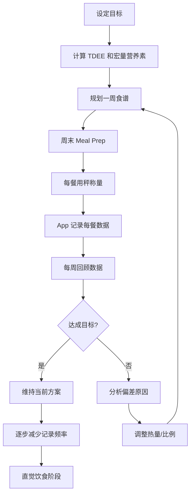

## 三、饮食工具

"三分练，七分吃"——这句话在健身圈流传已久，背后是运动科学的铁律：**能量平衡决定了体重变化的方向，而宏量营养素的比例决定了身体成分的变化质量**。哈佛公共卫生学院 2023 年的综述指出，在同等热量赤字条件下，蛋白质摄入充足（≥1.6g/kg 体重）的受试者，减脂期保留的肌肉量比低蛋白组多 47%。

但"知道该吃什么"和"实际做到"之间，隔着一整套工具链。你需要：

1. **精确计量**——知道吃了多少
2. **数据记录**——把摄入量转化为可分析的数据
3. **烹饪执行**——把计划变成实际的餐食
4. **持续反馈**——根据身体反应调整策略

本节系统梳理从厨房到餐桌、从记录到分析的完整饮食工具体系。

---

### 3.1 食物秤：精确计量的基石

#### 3.1.1 为什么必须用食物秤

人的视觉估量极其不可靠。康奈尔大学食物与品牌实验室的研究表明，普通人对食物份量的估量误差在 **30%-50%** 之间——你以为的一碗米饭（约 150g）实际可能是 220g，差出来的 70g 白饭就是约 90 大卡，一个月下来就是 2700 大卡，接近 0.4 公斤脂肪的热量差。

对于以下人群，食物秤不是可选项，而是必需品：

| 人群 | 核心需求 | 精度要求 |
|------|----------|----------|
| 减脂期控制热量 | 确保热量赤字真实存在 | ±1g |
| 增肌期精确蛋白质 | 达到 1.6-2.2g/kg 蛋白质目标 | ±1g |
| 备赛/竞技运动员 | 严格的饮食周期化 | ±1g |
| 糖尿病患者 | 碳水化合物精确计量 | ±1g |
| 日常健康饮食 | 建立正确的份量概念 | ±5g |

#### 3.1.2 食物秤选购指南

**基本参数：**

- **精度**：至少 1g，推荐 0.1g（称量调味料、营养补剂时需要）
- **量程**：至少 5kg，日常够用；称量整鸡、大块肉需要 10kg
- **单位切换**：g / oz / ml / lb，多单位方便对照不同食谱
- **去皮功能（Tare）**：最基本的功能，逐层添加食材时归零
- **显示屏**：背光显示，厨房光线不好时也能看清
- **供电**：AAA 电池最方便，USB 充电的更环保但需要记得充电

**推荐产品矩阵：**

| 档位 | 价格区间 | 代表产品 | 特点 |
|------|----------|----------|------|
| 入门 | ¥15-30 | 得力、荣事达基础款 | 精度 1g，量程 5kg，够用 |
| 中端 | ¥50-100 | 香山、小米 | 精度 1g，不锈钢面板，耐用 |
| 专业 | ¥100-300 | Ozeri、Etekcity | 精度 0.1g，营养数据库联动 |
| 智能 | ¥200-500 | 赤兔智能秤 | 自动识别食材，App 联动记录 |

**选购建议：** 对大多数人来说，¥30-80 的中端秤完全够用。不要买精度 5g 的廉价秤——它对小份量食材（坚果 10g、橄榄油 8g）的误差太大。

#### 3.1.3 正确使用食物秤的方法

**基础称量法：**

1. 将秤放在平整、坚硬的台面上（软垫会影响精度）
2. 开机，等待归零
3. 放上容器（碗、盘子），按 Tare 去皮归零
4. 逐个添加食材，记录每个食材的重量
5. 称量完毕后关机节省电量

**逐层去皮法（推荐）：**

这是最实用的方法——不需要多个容器，一个碗就能称量所有食材：

```text
步骤 1: 空碗放上秤 → 按 Tare → 显示 0g
步骤 2: 倒入米饭 → 显示 180g → 记录"米饭 180g"
步骤 3: 按 Tare → 显示 0g
步骤 4: 放入鸡胸肉 → 显示 150g → 记录"鸡胸肉 150g"
步骤 5: 按 Tare → 显示 0g
步骤 6: 淋入橄榄油 → 显示 10g → 记录"橄榄油 10g"
```

#### 3.1.4 常见误区

- **误区一：生熟不分**。食物数据库通常标注的是生重，而你可能吃的是熟的。米饭生熟比约 1:2.2，肉类生熟比约 1:0.7-0.8。原则：**称生重**，查数据库时选"生"的条目。
- **误区二：不称调味料**。一勺老干妈约 15g，热量 90 大卡；一勺沙拉酱约 15g，热量 100 大卡。三餐的调味料轻松贡献 200-400 大卡。
- **误区三：忽略液体热量**。牛奶、果汁、含糖饮料、烹饪用油——液体热量是最容易被忽视的。一杯全脂牛奶 250ml 约 160 大卡，一天两杯就是 320 大卡。
- **误区四：只称一次就记住了**。同一道菜每次做的份量都不同，养成每餐都称的习惯。

---

### 3.2 食物记录与营养分析 App

#### 3.2.1 为什么需要记录 App

食物秤告诉你"吃了多少克"，但你需要知道"吃了多少热量、多少蛋白质"。营养数据库 App 将重量数据转化为营养数据，是饮食管理的核心数据层。

#### 3.2.2 主流 App 深度对比

| 维度 | 薄荷健康 | MyFitnessPal | FatSecret | 轻+ (Lifesum) |
|------|----------|-------------|-----------|---------------|
| 中文支持 | ★★★★★ 原生中文 | ★★★☆ 基本翻译 | ★★☆ 有限 | ★★★★ 较好 |
| 中国食物数据库 | ★★★★★ 最全 | ★★☆ 主要靠UGC | ★★☆ 较少 | ★★★☆ 中等 |
| 国际食物数据库 | ★★★☆ 可用 | ★★★★★ 最全 | ★★★★ 丰富 | ★★★★ 丰富 |
| 条形码扫描 | ✅ 中国商品优秀 | ✅ 国际商品优秀 | ✅ 可用 | ✅ 可用 |
| 自定义食物 | ✅ | ✅ | ✅ | ✅ |
| 宏量营养素追踪 | ✅ | ✅ | ✅ | ✅ |
| 微量营养素 | ✅ | ✅ 付费功能 | ✅ | ✅ 付费功能 |
| 运动数据联动 | ✅ | ✅ 与主流运动App联动 | ✅ | ✅ |
| 价格 | 基础免费，高级 ¥198/年 | 基础免费，高级 $79.99/年 | 完全免费 | 基础免费，高级 ¥168/年 |

#### 3.2.3 推荐策略

**中国大陆用户首选方案：**

- **主力 App：薄荷健康**。中国食物数据库最全，包括食堂菜、外卖常见菜品、中式烹饪方式（红烧、清蒸、爆炒的热量差异很大）。扫描中国商品条形码成功率最高。
- **辅助 App：MyFitnessPal**。当你需要查询进口食品、西餐食材、或者在国外旅行时使用。

**使用技巧：**

1. **建立常吃食物清单**。把你日常吃的 20-30 种食物加入收藏或自定义，每次记录只需点几下，而不是每次都搜索。
2. **利用"一餐模板"功能**。工作日早餐几乎一样，建立模板一键记录。
3. **先记再吃 vs 先吃再记**。推荐"先记再吃"——提前输入今天的饮食计划，按计划执行，而不是吃完再记（容易超标）。
4. **不要追求 100% 精确**。数据库的数据本身就有 ±10-20% 的误差，关键是趋势和大致方向，而不是纠结 5 大卡的差异。
5. **每周回顾一次**。看本周的宏量营养素比例是否达标，热量是否在目标区间，而不是每天焦虑地盯着数字。

#### 3.2.4 自建食物数据库模板

如果你经常吃食堂或者自制菜品，建议建立自己的食物数据库：

```text
【自制番茄炒蛋】（每份）
- 鸡蛋 2 个 (100g): 144 kcal, P 12.6g, F 9.6g, C 1.5g
- 番茄 200g: 36 kcal, P 1.6g, F 0.4g, C 7.2g
- 食用油 8g: 72 kcal, F 8g
- 白糖 3g: 12 kcal, C 3g
- 盐 2g: 0 kcal
──────────────────
合计：264 kcal, P 14.2g, F 18g, C 11.7g
```

把这个录入 App 的自定义食物，以后每次做这道菜直接按份量比例输入即可。

---

### 3.3 厨房烹饪工具

饮食管理的落地依赖于烹饪——外卖和餐馆的用油量、调味料远超你的想象。一套基础的健康烹饪工具，能让你在 20-30 分钟内做出营养均衡的一餐。

#### 3.3.1 烹饪方式的热量对比

| 烹饪方式 | 额外用油量 | 额外热量 | 适用场景 |
|----------|-----------|----------|----------|
| 蒸 | 0g | 0 kcal | 鱼、蔬菜、蛋类 |
| 水煮 | 0g | 0 kcal | 鸡胸肉、西兰花、面条 |
| 气炸 | 0-5g | 0-45 kcal | 鸡翅、薯条、蔬菜 |
| 煎（不粘锅） | 3-5g | 27-45 kcal | 牛排、鸡蛋、三文鱼 |
| 炒（铁锅） | 10-15g | 90-135 kcal | 中式快炒 |
| 油炸 | 完全浸没 | 200+ kcal | 不推荐日常使用 |

#### 3.3.2 核心厨具清单

**① 空气炸锅**

空气炸锅通过高速热空气循环实现类似油炸的口感，用油量减少 70-80%。对于减脂期想吃"脆脆的"食物的人来说，这是最有价值的单一厨具。

- **容量选择**：1-2 人用 3.5L，3-4 人用 5.5L
- **推荐品牌**：飞利浦（品质标杆）、小米（性价比）、九阳（国内老牌）
- **价格区间**：¥200-600
- **使用要点**：不要堆叠食物，留出空气流通空间；中途翻面一次；喷少量油而非完全不放油

**② 不粘锅**

煎蛋、煎鸡胸、煎三文鱼——不粘锅让你用最少的油完成烹饪。

- **材质选择**：涂层不粘锅（便宜、2-3 年换一次）> 陶瓷涂层（更安全、更贵）> 蜂窝不粘锅（耐用、中高端）
- **尺寸**：28cm 平底锅最通用，能煎两块鸡胸或四个鸡蛋
- **保养**：不要用金属铲，不要空烧，不要用钢丝球清洗
- **推荐**：苏泊尔、美的（¥80-200），双立人、WMF（¥300-800）

**③ 电蒸锅/蒸箱**

蒸是最健康的烹饪方式——零额外油脂，保留食材原味和营养素。维生素 C 在蒸制中的保留率（约 90%）远高于水煮（约 60%）和炒制（约 70%）。

- **电蒸锅**：美的、苏泊尔三层电蒸锅，¥100-300，能同时蒸鱼+蔬菜+主食
- **使用技巧**：食材切大小均匀，厚的放下层；水开后再放食材；蒸制时间精准控制

**④ 慢炖锅/电压力锅**

适合批量备餐（Meal Prep）——周末做一大锅炖牛肉、卤鸡腿，分装冷藏，工作日直接加热。

- **电压力锅**：美的、苏泊尔、Instant Pot，¥200-500
- **优势**：炖煮时间缩短 60-70%，牛肉 40 分钟软烂
- **备餐场景**：炖汤、卤肉、煮杂粮饭、蒸红薯

**⑤ 搅拌机/破壁机**

蛋白质奶昔、果蔬汁、代餐——搅拌机是快速补充营养的利器。

- **便携杯式**：适合做蛋白奶昔，随打随喝，¥100-200
- **台式破壁机**：能打果蔬汁、坚果酱、豆浆，¥300-1000
- **蛋白奶昔配方示例**：

```text
经典增肌奶昔（约 450 kcal）
- 脱脂牛奶 300ml: 105 kcal, P 10g
- 乳清蛋白粉 1 勺 (30g): 120 kcal, P 24g
- 香蕉 1 根 (120g): 107 kcal, C 27g
- 燕麦 30g: 113 kcal, P 4g, C 19g
- 花生酱 5g: 30 kcal, F 2.5g
──────────────────
合计：约 475 kcal, P 38g, F 8g, C 48g
```

**⑥ 便当盒/餐盒**

带饭是控制饮食最有效的方式——你完全掌控食材和用量。

| 材质 | 优点 | 缺点 | 推荐品牌 |
|------|------|------|----------|
| 高硼硅玻璃 | 安全、不串味、可微波、可烤箱 | 重、易碎 | 乐扣乐扣、Glasslock、Snapware |
| 不锈钢 | 耐摔、轻便 | 不能微波、看不到内容 | 银鹰、膳魔师 |
| PP 塑料 | 轻、便宜 | 易染色、老化后不安全 | 乐扣乐扣（BPA-free） |
| 硅胶折叠 | 极省空间 | 不太适合汤类 | 挪客、硅元素 |

**选购建议**：首选玻璃材质，2-3 个容量组合（500ml 装主食 + 800ml 装菜），带分隔的款式能防止菜串味。一次性买 5 个，一周五天工作日轮换。

#### 3.3.3 健康调味替代方案

调味是烹饪中最容易失控的环节。一勺老干妈 90 大卡，一勺花生酱 95 大卡，一勺沙拉酱 100 大卡——三勺调味料就抵得上一碗米饭。

| 传统调味料 | 热量 (每 15g) | 健康替代 | 热量 (每 15g) | 风味补偿策略 |
|-----------|--------------|---------|--------------|-------------|
| 花生酱 | 95 kcal | PB2 脱脂花生粉 | 25 kcal | 加少许酱油+蒜末提味 |
| 沙拉酱 | 100 kcal | 希腊酸奶+柠檬汁 | 15 kcal | 加黑胡椒+芥末 |
| 老干妈 | 90 kcal | 低油辣椒酱/是拉差 | 15-30 kcal | 加醋增鲜 |
| 蚝油 | 25 kcal | 蒸鱼豉油（减盐） | 10 kcal | 鲜味足够 |
| 番茄酱 | 20 kcal | 新鲜番茄丁 | 5 kcal | 加少许盐+罗勒 |

---

### 3.4 营养计算与规划工具

#### 3.4.1 TDEE 计算器

在开始任何饮食计划之前，你需要知道自己每天消耗多少热量（TDEE = Total Daily Energy Expenditure）。

**Harris-Benedict 公式（修订版）：**

```text
男性 BMR = 88.362 + (13.397 × 体重kg) + (4.799 × 身高cm) - (5.677 × 年龄)
女性 BMR = 447.593 + (9.247 × 体重kg) + (3.098 × 身高cm) - (4.330 × 年龄)

TDEE = BMR × 活动系数
  久坐（几乎不运动）     × 1.2
  轻度活动（每周1-3次）   × 1.375
  中度活动（每周3-5次）   × 1.55
  高度活动（每周6-7次）   × 1.725
  极高活动（体力劳动+训练）× 1.9
```

**举例：** 28 岁男性，170cm，70kg，每周锻炼 4 次

```text
BMR = 88.362 + (13.397 × 70) + (4.799 × 170) - (5.677 × 28)
    = 88.362 + 937.79 + 815.83 - 158.956
    = 1683 kcal

TDEE = 1683 × 1.55 ≈ 2609 kcal

减脂目标：2609 - 500 = 2109 kcal/天（每周减约 0.45kg）
增肌目标：2609 + 300 = 2909 kcal/天
```

**在线工具推荐：** Calculator.net TDEE Calculator、SailRabbit TDEE Calculator（更详细）

#### 3.4.2 宏量营养素分配计算器

知道总热量后，需要分配蛋白质、脂肪、碳水化合物的比例。

**通用推荐比例（以减脂 2100 kcal 为例）：**

```text
蛋白质：2g/kg 体重 = 140g = 560 kcal (27%)
脂肪：0.8g/kg 体重 = 56g = 504 kcal (24%)
碳水：剩余热量 = 1036 kcal ÷ 4 = 259g (49%)
```

**不同目标的宏量比例参考：**

| 目标 | 蛋白质 | 脂肪 | 碳水 | 说明 |
|------|--------|------|------|------|
| 减脂（通用） | 30% | 25% | 45% | 高蛋白保肌肉 |
| 减脂（低碳） | 35% | 35% | 30% | 碳水敏感人群 |
| 增肌 | 25% | 20% | 55% | 高碳水促合成 |
| 维持/健康 | 20% | 25% | 55% | 均衡饮食 |
| 生酮 | 20% | 75% | 5% | 极低碳水，需医嘱 |

#### 3.4.3 膳食规划工具

**方法一：Excel/Google Sheets 自建模板**

最灵活的方式，完全自定义。基本结构：

```text
| 餐次   | 食材       | 重量(g) | 热量  | 蛋白质 | 脂肪 | 碳水 |
|--------|-----------|---------|-------|--------|------|------|
| 早餐   | 燕麦      | 60      | 228   | 7.8    | 4.0  | 40.2 |
| 早餐   | 鸡蛋      | 100     | 144   | 12.6   | 9.6  | 1.5  |
| 早餐   | 脱脂牛奶  | 250     | 88    | 8.5    | 0.5  | 12.5 |
| 午餐   | 鸡胸肉    | 150     | 165   | 31.0   | 3.6  | 0    |
| 午餐   | 糙米饭    | 180     | 210   | 4.5    | 1.5  | 43.5 |
| 午餐   | 西兰花    | 200     | 68    | 5.6    | 0.8  | 13.6 |
| ...    | ...       | ...     | ...   | ...    | ...  | ...  |
| 合计   |           |         | 2100  | 142    | 58   | 255  |
```

**方法二：使用 App 内置计划功能**

薄荷健康和 MyFitnessPal 都支持"提前规划明天的饮食"，可以在睡前把明天三餐+加餐全部录入，第二天按计划执行。

**方法三：AI 辅助规划**

利用 AI 工具（ChatGPT、Kimi 等）生成膳食计划：

```text
提示词示例：
"帮我制定一周减脂食谱，每日热量 2100 大卡，
蛋白质 140g 以上，以中国家常菜为主，
食材容易购买，烹饪时间不超过 30 分钟，
列出每道菜的食材和重量。"
```

拿到 AI 的建议后，用食物秤+记录 App 验证实际热量是否准确。

---

### 3.5 水分摄入追踪

#### 3.5.1 为什么喝水也是"饮食工具"

水参与几乎所有代谢反应。脱水 2% 就会导致运动表现下降 10-20%，而口渴感往往滞后于实际脱水——当你感到口渴时，身体已经缺水 1-2% 了。

**每日饮水量参考公式：**

```text
基础量 = 体重(kg) × 30-40 ml
运动补偿 = 每小时运动额外 + 500-800 ml
环境补偿 = 高温/干燥环境额外 + 300-500 ml

示例：70kg 男性，每天运动 1 小时
= 70 × 35 + 600 = 3050 ml ≈ 3L
```

#### 3.5.2 饮水追踪工具

- **智能水杯**：HidrateSpark、Gululu，通过 LED 提醒喝水，App 记录饮水量，¥200-500
- **App 记录**：WaterMinder（iOS）、喝水时间（Android），设定目标后每次喝水点一下
- **简单方案**：买一个 1L 的水壶，每天装满 3 次，喝完标记。零成本，效果一样

#### 3.5.3 喝水技巧

- **起床即喝 300-500ml 温水**：经过 7-8 小时睡眠，身体处于轻度脱水状态
- **餐前 20 分钟喝 200ml**：研究显示餐前喝水可以减少 12-15% 的食物摄入量
- **训练中每 15-20 分钟补水 150-200ml**：不要等到口渴才喝
- **尿液颜色自检**：浅黄色=正常，深黄色=需要补水，透明无色=可能过量

---

### 3.6 备餐（Meal Prep）工具与流程

#### 3.6.1 什么是 Meal Prep

Meal Prep（备餐）是饮食管理的核武器——周末花 2-3 小时做好一周的餐食，工作日只需加热即可。它解决的最大问题是：**"今天太忙了随便吃吧"**——当你有现成的健康餐，就不会点外卖。

#### 3.6.2 备餐工具清单

| 工具 | 用途 | 推荐 |
|------|------|------|
| 电子秤 | 称量每份食材 | 同 3.1 节 |
| 食物分装盒 | 分装每餐份量 | 玻璃材质，5-10 个 |
| 保鲜袋（大号） | 腌制肉类 | Ziploc、宜家 |
| 真空封口机 | 延长冷藏保鲜期 | 得力、太力，¥100-300 |
| 一次性手套 | 腌制食材时保持卫生 | 丁腈手套 |
| 标签贴纸 | 标注日期和内容 | 必须！防止过期 |

#### 3.6.3 备餐实操流程

```text
周六上午（2.5 小时）：

阶段 1：采购（30 分钟）
  - 鸡胸肉 1.5kg、三文鱼 500g、牛肉 500g
  - 西兰花 1kg、胡萝卜 500g、菠菜 500g
  - 糙米 1kg、红薯 1kg、燕麦 500g
  - 鸡蛋 30 个

阶段 2：批量烹饪（90 分钟）
  - 电饭锅：糙米饭（做好分装冷冻）
  - 蒸锅：红薯切块蒸熟（分装冷冻）
  - 烤箱/气炸锅：鸡胸肉腌制后批量烤制
  - 平底锅：三文鱼煎制（每块 3 分钟）
  - 水煮：西兰花、胡萝卜焯水

阶段 3：分装（30 分钟）
  - 每个盒子：主食 150g + 蛋白质 150g + 蔬菜 200g
  - 贴标签：日期 + 内容
  - 冷藏：近 3 天的份量放冰箱冷藏
  - 冷冻：后 3-4 天的份量放冷冻
```

#### 3.6.4 备餐食物保鲜指南

| 食物类型 | 冷藏（0-4°C） | 冷冻（-18°C） | 复热方式 |
|----------|--------------|---------------|----------|
| 煮熟鸡胸肉 | 3-4 天 | 2-3 个月 | 微波 2 分钟 |
| 煮熟牛肉 | 3-4 天 | 2-3 个月 | 微波 2.5 分钟 |
| 煮熟鱼类 | 2-3 天 | 1-2 个月 | 微波 1.5 分钟 |
| 蒸红薯 | 4-5 天 | 1-2 个月 | 微波 3 分钟 |
| 糙米饭 | 3-4 天 | 1-2 个月 | 微波 2 分钟，洒少许水 |
| 焯水蔬菜 | 2-3 天 | 不推荐冷冻 | 微波 1 分钟 |

**关键提示**：冷冻的餐食提前一晚放冷藏解冻，不要直接微波冷冻食物（加热不均匀）。

---

### 3.7 营养标签阅读工具

#### 3.7.1 学会看营养成分表

中国预包装食品的营养成分表是强制标注的，学会读它能避免大量"隐形热量"。

```text
营养成分表（某品牌全麦面包，每 100g）
┌─────────────────────┬────────────┬──────────────┐
│ 项目                 │ 每 100g    │ NRV%         │
├─────────────────────┼────────────┼──────────────┤
│ 能量                 │ 1050 kJ   │ 13%          │
│ 蛋白质               │ 9.0g      │ 15%          │
│ 脂肪                 │ 4.5g      │ 8%           │
│   — 饱和脂肪酸       │ 1.0g      │              │
│ 碳水化合物           │ 45.0g     │ 15%          │
│   — 糖               │ 5.0g      │              │
│ 钠                   │ 400mg     │ 20%          │
│ 膳食纤维             │ 6.0g      │ 24%          │
└─────────────────────┴────────────┴──────────────┘
```

**关键阅读技巧：**

1. **先看"每份量"**：上表是"每 100g"，但一个面包可能是 350g，你需要乘以 3.5
2. **关注糖和钠**：即使标注"全麦"，糖含量超过 8g/100g 就偏高
3. **NRV% 的含义**：占每日推荐摄入量的百分比。脂肪 NRV% 为 8% 说明这 100g 提供了你一天脂肪需求的 8%
4. **警惕"低脂"陷阱**：低脂产品往往加糖补偿口感，总热量未必低

#### 3.7.2 常见"健康食品"的真实热量

| 食品 | 标签营销话术 | 实际热量（每 100g） | 隐患 |
|------|-------------|--------------------|----|
| 果蔬脆片 | "天然果蔬" | 450-550 kcal | 低温油炸，脂肪含量 25-35% |
| 酸奶（风味） | "富含益生菌" | 80-120 kcal | 含糖量 10-15g/100g |
| 全麦面包 | "粗粮健康" | 220-280 kcal | 部分产品全麦粉含量仅 10-20% |
| 坚果混合 | "每日坚果" | 550-600 kcal | 一小包 25g 就是 140 kcal |
| 运动饮料 | "补充电解质" | 25-40 kcal/100ml | 不运动时喝等于喝糖水 |
| 即食鸡胸肉 | "高蛋白低脂" | 110-140 kcal | 钠含量可能高达 800mg/100g |

---

### 3.8 补剂管理工具

#### 3.8.1 补剂不是必须的

先明确：**没有任何补剂能替代均衡饮食**。补剂（Supplement）的英文原意就是"补充"——在饮食无法满足需求时作为补充手段。

#### 3.8.2 有循证依据的补剂

| 补剂 | 适用人群 | 推荐剂量 | 证据等级 | 价格参考 |
|------|----------|----------|----------|----------|
| 乳清蛋白 | 蛋白质摄入不足者 | 20-40g/次 | A 级（强证据） | ¥200-400/kg |
| 肌酸 | 力量训练者 | 5g/天 | A 级 | ¥80-150/kg |
| 维生素 D | 室内工作者/冬季 | 1000-2000 IU/天 | A 级 | ¥50-100/年 |
| 鱼油 (Omega-3) | 不吃鱼的人 | 1-2g EPA+DHA/天 | B 级（中等证据） | ¥100-200/年 |
| 咖啡因 | 运动前提神 | 3-6mg/kg 体重 | A 级 | ¥0.5-1/次（黑咖啡） |
| 复合维生素 | 饮食极不规律者 | 按说明书 | C 级（弱证据） | ¥100-200/年 |

#### 3.8.3 补剂管理 App

- **SuppTrack**（iOS）：记录每日补剂服用情况，设置提醒
- **简单方案**：手机闹钟 + 一周药盒（¥10-20），每天早上装好当天的补剂

**一周药盒用法：** 周日晚上花 5 分钟把 7 天的补剂分装好，每个格子标注星期几。早上拿对应格子的即可，避免忘记或重复服用。

---

### 3.9 饮食工具使用常见误区与纠正

#### 误区一：工具依赖症

**表现**：不带秤就不吃饭，App 崩溃就焦虑，每天称体重三次。

**纠正**：工具是辅助，不是枷锁。建立"直觉饮食"能力才是终极目标。建议在严格记录 3-6 个月后，逐步减少记录频率，靠目测和经验控制——就像学自行车，最终要拆掉辅助轮。

#### 误区二：只看热量不看营养密度

**表现**：1500 大卡全吃薯片和可乐 vs 1500 大卡吃鸡胸+蔬菜+糙米。热量相同，身体反应天差地别。

**纠正**：热量控制是必要条件，不是充分条件。在热量目标内，优先选择营养密度高的食物——每大卡提供更多蛋白质、纤维、维生素和矿物质的食物。

#### 误区三：忽略烹饪过程中的热量变化

**表现**：数据库显示"鸡胸肉 100g = 165 kcal"，但你炒鸡胸肉用了 20ml 油。

**纠正**：烹饪用油是最大的隐藏热量来源。20ml 油 = 180 kcal，比鸡胸肉本身还多。记录时一定要把烹饪用油、调味料单独计入。

#### 误区四：盲目追求"零糖零脂"

**表现**：只买标注"零糖""零脂"的加工食品。

**纠正**：零糖饮料用代糖，部分代糖（如三氯蔗糖、阿斯巴甜）可能影响肠道菌群和胰岛素敏感性（研究仍在进行中）。零脂食品往往用碳水补偿口感。**天然、少加工的食物永远优于任何"健康"加工食品。**

#### 误区五：一次性购齐所有工具

**表现**：买了秤、破壁机、空气炸锅、真空封口机、智能水杯……最后大部分吃灰。

**纠正**：分阶段购入。第一阶段只需：一个食物秤（¥30）+ 一个记录 App（免费）+ 3-4 个玻璃饭盒（¥60）。运行一个月，确认自己能坚持后，再按需购入其他工具。

---

### 3.10 不同预算的工具配置方案

#### 入门方案（¥100 以内）

```text
- 电子厨房秤（得力/荣事达）：¥25
- 薄荷健康 App（免费版）：¥0
- 玻璃饭盒 ×3（乐扣乐扣）：¥50
- 1L 水壶（富光/希乐）：¥20
──────────────────
合计：约 ¥95
```

够用吗？**完全够用。** 这套工具覆盖了"称量-记录-带饭-喝水"四个核心环节。大多数人坚持用好这一套就够了。

#### 标准方案（¥300-500）

```text
入门方案全部 + 以下升级：
- 空气炸锅 3.5L（小米/九阳）：¥200
- 不粘锅 28cm（苏泊尔）：¥100
- 一周药盒：¥15
- 标签贴纸：¥10
──────────────────
合计：约 ¥420
```

能做什么？可以自己做气炸鸡胸、煎三文鱼、备餐分装。把外卖频率从每周 10 次降到 2-3 次，一个月省下的外卖钱就回本了。

#### 进阶方案（¥800-1500）

```text
标准方案全部 + 以下升级：
- 电压力锅（美的/Instant Pot）：¥300
- 便携搅拌机（摩飞/九阳）：¥150
- 电蒸锅三层（美的）：¥150
- 真空封口机（太力）：¥120
- 玻璃饭盒 ×5（补充）：¥80
──────────────────
合计：约 ¥1220
```

适合认真执行 Meal Prep 的人。从采购到烹饪到分装，全程机械化，效率极高。

---

### 3.11 工具到习惯：饮食管理系统

工具只是起点，建立系统化的饮食管理习惯才是目标。



**习惯养成的 21-66 天法则：**

- **第 1-7 天（最难）**：每餐称量+记录，感觉很麻烦。坚持！
- **第 8-21 天（适应）**：开始记住常吃食物的份量，记录速度加快
- **第 22-42 天（习惯）**：不用秤也能比较准确地估量份量
- **第 43-66 天（自动化）**：健康饮食变成默认行为，不再需要意志力维持

---

### 3.12 本节小结

| 工具类别 | 核心工具 | 最低投入 | 核心价值 |
|----------|----------|----------|----------|
| 计量工具 | 电子食物秤 | ¥25 | 消除份量幻觉 |
| 记录工具 | 营养 App | ¥0 | 数据驱动决策 |
| 烹饪工具 | 不粘锅+气炸锅 | ¥300 | 减少外食依赖 |
| 备餐工具 | 玻璃饭盒+电压力锅 | ¥350 | 消除"没时间做饭"借口 |
| 饮水工具 | 水壶+手机提醒 | ¥20 | 维持代谢效率 |
| 营养标签 | 自学+对照表 | ¥0 | 识别隐藏热量 |
| 补剂管理 | 一周药盒 | ¥15 | 避免遗忘和重复 |

**最终建议：从入门方案开始，先用一个月证明自己能坚持。** 工具不在多，在于用。一个秤+一个 App+三个饭盒，就是你改变饮食习惯的全部装备。
