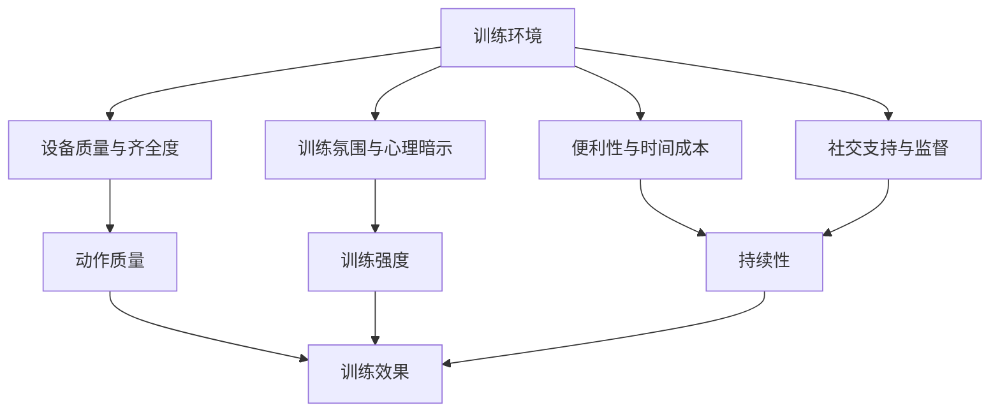
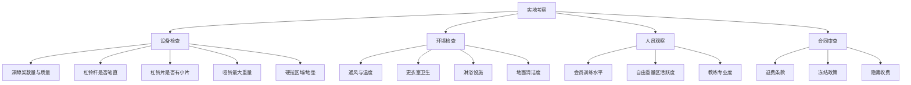
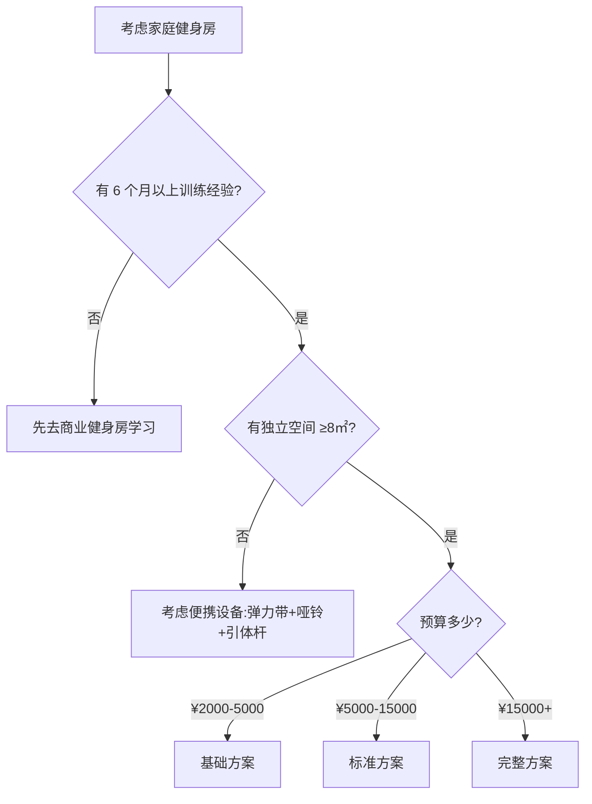
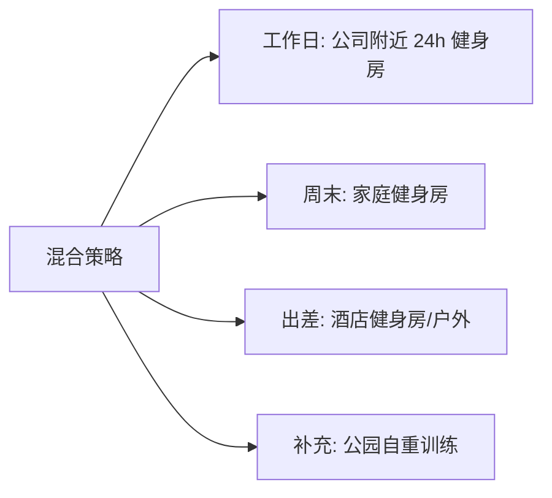

## 四、健身房选择

选择在哪里训练，本质上是在选择一种训练环境——它决定了你能接触到什么设备、在什么氛围下训练、以及能否长期坚持。很多人花了大量精力研究训练计划和饮食，却忽略了训练环境这个"底层基础设施"。本节从**训练环境对训练效果的影响机制**出发，系统讲解健身房类型、选择标准、避坑策略，以及家庭健身房的搭建方案，帮你做出最适合自己的选择。

---

### 4.1 训练环境为什么重要

训练效果的核心变量是**训练强度、动作质量和持续性**。训练环境对这三个变量都有直接影响：

**具体影响机制：**

- **设备决定动作选择**：没有深蹲架就无法做杠铃深蹲，没有足够的哑铃重量就无法渐进超负荷。设备不足会迫使你用次优动作替代，直接影响训练效果
- **氛围影响训练强度**：环境心理学研究表明，周围人的行为模式会显著影响个体的行为投入程度。在一群认真训练的人旁边，你的训练强度自然会提高 10-20%
- **便利性决定出勤率**：健身房离你越远，"今天不去了"的概率就越高。一项针对 500 名健身者的研究发现，通勤时间超过 20 分钟的人，训练出勤率比 10 分钟以内的人低 40%
- **社交支持增强坚持性**：有固定训练伙伴的人，训练坚持率比独自训练的人高 65%（*Journal of Sports Sciences*, 2015）

理解了这些机制，你就知道选择训练环境的核心不是"哪个健身房最贵最好"，而是**"哪个环境能让我练得最久、最投入"**。

---

### 4.2 训练场所类型全景对比

训练场所不只是"商业健身房 vs 家庭健身房"两种选择。以下是所有主流训练场所类型的详细分析：

#### 4.2.1 全景对比表

| 维度 | 大型连锁健身房 | 24小时自助健身房 | 精品工作室 | CrossFit Box | 家庭健身房 | 户外/公园 |
|------|--------------|----------------|----------|-------------|----------|----------|
| **月均费用** | ¥200-500 | ¥100-300 | ¥150-400/次 | ¥800-2000 | 前期¥3000-15000 | 免费 |
| **设备齐全度** | ★★★★★ | ★★★★☆ | ★★★☆☆ | ★★★☆☆ | ★★★☆☆（可定制） | ★☆☆☆☆ |
| **自由重量** | ★★★★★ | ★★★★☆ | ★★★☆☆ | ★★★★★ | ★★★★☆ | ★★☆☆☆ |
| **训练氛围** | ★★★★☆ | ★★★☆☆ | ★★★★★ | ★★★★★ | ★★☆☆☆ | ★★☆☆☆ |
| **教练资源** | ★★★★☆ | ★☆☆☆☆ | ★★★★★ | ★★★★★ | ★☆☆☆☆ | ★☆☆☆☆ |
| **便利性** | ★★★☆☆ | ★★★★★ | ★★☆☆☆ | ★★☆☆☆ | ★★★★★ | ★★★★☆ |
| **隐私性** | ★★☆☆☆ | ★★★★☆ | ★★★★★ | ★★★☆☆ | ★★★★★ | ★★★★☆ |
| **适合人群** | 中阶训练者 | 时间不固定者 | 需要指导的新手 | 功能性训练爱好者 | 有经验的自律者 | 预算有限/补充训练 |

#### 4.2.2 大型连锁健身房

大型连锁健身房是最常见的选择，典型品牌包括威尔仕（Will's）、一兆韦德（Megafit）、金吉鸟、浩沙、英派斯等。

**核心优势：**
- 设备种类最齐全，从固定器械到自由重量区域、有氧区、操房一应俱全
- 通常配有游泳池、桑拿、团操课等附加服务
- 会员众多，训练氛围好，容易找到训练伙伴
- 部分连锁品牌支持异地通用（出差时不受影响）

**核心劣势：**
- **销售压力大**：大多数连锁健身房采用预售制，进门就会遇到销售顾问推销年卡甚至多年卡。这是连锁健身房最大的体验痛点
- **高峰时段拥挤**：工作日晚 6-9 点，深蹲架和卧推架可能需要排队 15-30 分钟
- **合同陷阱多**：退费困难、转卡收费、门店关闭不退费等问题频发
- **部分器械维护差**：固定器械的滑轮、坐垫磨损后维修不及时

**适合人群**：训练 3 个月以上、有固定训练时间、需要丰富设备选择的中阶训练者。

**选购建议**：
- 优先选择离家或公司步行 15 分钟以内的门店
- 不要一次性购买超过 1 年的会籍（健身房跑路风险）
- 优先选择月付或季付模式，虽然单价稍高但风险可控
- 实地考察时重点看自由重量区（杠铃、哑铃、深蹲架），而不是有氧区

#### 4.2.3 24小时自助健身房

典型品牌：乐刻运动、光猪圈、快快、Liking Fit。这类健身房通常面积较小（200-500㎡），采用月付或次付模式，24小时自助进出。

**核心优势：**
- **月付制**：没有年卡压力，按月扣费，不满意随时走人
- **24小时开放**：适合作息不规律、夜猫子、早起型训练者
- **无销售骚扰**：全程自助，扫码进门，没有销售顾问
- **价格透明**：月费 ¥99-299，没有隐藏收费

**核心劣势：**
- **设备有限**：面积小，器械种类和数量都少于大型连锁。深蹲架通常只有 1-2 个，杠铃片重量上限可能不够
- **无人值守**：没有教练在场，新手遇到动作问题无人指导
- **空间拥挤**：高峰时段人挤人，做大幅度动作可能受限
- **缺少附加设施**：通常没有淋浴间、更衣室简陋、没有团操课

**适合人群**：有基础训练经验、时间不固定、追求性价比的训练者。对于能够自主安排训练计划、不需要教练指导的人来说，24小时健身房是性价比最高的选择。

**选购建议**：
- 实地考察时重点数深蹲架和杠铃数量——如果只有 1 个深蹲架且经常有人用，高峰期体验会很差
- 确认哑铃的最大重量（至少需要 30kg 以上）
- 查看是否配有引体向上杆、双杠等自重训练设备
- 注意通风和空调——24小时健身房夜间通常不开空调

#### 4.2.4 精品私教工作室

精品工作室是面积较小（100-300㎡）、以私教课程为主要收入来源的训练场所。

**核心优势：**
- **一对一指导**：教练全程陪伴，动作纠正及时，训练效率高
- **预约制**：同一时段人数有限，不会拥挤
- **环境私密**：适合体型焦虑者、公众人物、或不喜欢大健身房氛围的人
- **针对性强**：通常有明确的训练方向（力量举、体态矫正、产后恢复等）

**核心劣势：**
- **价格高**：单次课程 ¥200-600，长期训练费用是健身房的 3-5 倍
- **设备有限**：面积小决定了设备种类有限，训练多样性受限
- **教练水平参差不齐**：行业准入门槛低，很多教练只有几天速成证书
- **时间不灵活**：需要提前预约，临时取消可能扣费

**适合人群**：预算充足、需要专业指导的新手，或有特殊训练需求（康复、备赛、体态矫正）的人。

**选购建议**：
- 选择前先体验 1-2 节课，观察教练的专业度和沟通方式
- 查看教练的认证资质（NSCA-CSCS、ACE、ACSM 等国际认证优于国内短期培训证书）
- 不要一次性购买超过 50 节课（教练离职或工作室关闭的风险）

#### 4.2.5 CrossFit Box

CrossFit Box 是专注于功能性训练和 CrossFit 课程的训练场所。

**核心优势：**
- **社区氛围极强**：小团体训练模式，成员之间相互鼓励和监督，坚持率远高于普通健身房
- **训练多样性强**：每次 WOD（Workout of the Day）不同，不会感到枯燥
- **全面体能发展**：力量、耐力、灵活性、协调性综合提升
- **教练资质要求高**：CrossFit 教练需要 L1/L2 认证，整体水平高于普通健身房

**核心劣势：**
- **价格高**：月费 ¥800-2000，是普通健身房的 3-8 倍
- **不适合纯力量训练**：CrossFit 的训练模式偏重代谢调节，纯力量举训练者可能觉得不够专注
- **受伤风险较高**：部分动作（如高次数翻站、蝶式引体）技术要求高，新手在疲劳状态下完成容易受伤
- **时间固定**：课程时间固定，不像普通健身房随时去

**适合人群**：喜欢团体训练氛围、追求全面体能发展、预算充足的训练者。

#### 4.2.6 户外/公园训练

利用公园的健身器材、单杠、双杠进行自重训练，或者在户外跑步、做 HIIT。

**核心优势**：完全免费，空气好，不受营业时间限制。

**核心劣势**：设备极其有限（通常只有单杠、双杠、简易器械），无法进行杠铃训练，天气影响大，冬季和雨天无法训练。

**适合人群**：以自重训练为主、预算极有限、或作为健身房训练的补充。

---

### 4.3 健身房选择的十个核心标准

选择健身房不能只看"哪个便宜"或"哪个离家近"。以下是十个核心评估维度，按重要性排序：

#### 标准一：器械齐全度（权重最高）

器械齐全度直接决定了你的训练计划能否完整执行。以下是一个力量训练者**必须关注的设备清单**：

**必备设备（缺一不可）：**

| 设备 | 用途 | 最低数量要求 |
|------|------|-------------|
| 深蹲架/全框架 | 深蹲、卧推、肩推、引体向上 | ≥2个 |
| 杠铃（奥林匹克杆） | 所有杠铃动作 | ≥3根 |
| 杠铃片 | 配重 | 总重≥200kg，含1.25kg小片 |
| 可调节哑铃 | 辅助训练、孤立动作 | 最大≥30kg |
| 可调节卧推凳 | 卧推、哑铃飞鸟等 | ≥3个 |
| 引体向上杆 | 引体向上、悬吊 | ≥1个 |

**加分设备（锦上添花）：**

| 设备 | 用途 | 说明 |
|------|------|------|
| 罗马椅 | 背部伸展、仰卧起坐 | 比较常见 |
| 双杠架 | 双杠臂屈伸 | 也可用引体向上杆替代 |
| 腿举机 | 腿部训练辅助 | 深蹲日补充 |
| 绳索机 | 高位下拉、面拉、三头下压 | 动作多样性 |
| 划船机/滑雪机 | 有氧训练、热身 | 比跑步机更适合力量训练者 |
| 地垫/平台 | 硬拉放下时保护地板和杠铃 | 没有硬拉台的健身房不专业 |

**红线信号**（看到以下情况建议直接排除）：
- 没有深蹲架，只有史密斯机——这说明健身房的目标客群不是认真训练的人
- 杠铃片最大只有 25kg，没有小片（1.25kg/2.5kg）——无法精确渐进超负荷
- 杠铃杆弯曲变形——维护不到位，且有安全隐患
- 自由重量区域面积太小——高峰期根本没法练

#### 标准二：距离与通勤时间

距离是影响训练出勤率的最关键因素之一。

| 通勤时间 | 出勤率影响 | 建议 |
|----------|-----------|------|
| 步行 10 分钟以内 | 出勤率最高，几乎不受天气和情绪影响 | 最优选择 |
| 步行 10-20 分钟 | 出勤率良好，恶劣天气可能影响 | 可接受 |
| 骑行/开车 10-20 分钟 | 出勤率中等，需要额外的"出发意志力" | 权衡利弊 |
| 通勤 20 分钟以上 | 出勤率显著下降，容易找借口不去 | 不推荐 |

**最佳策略**：选择离家或公司步行 15 分钟以内的健身房。如果两个健身房的其他条件相似，永远选更近的那个。你可以换训练计划、换教练、换装备，但你没法换健身房和你之间的距离。

#### 标准三：高峰时段拥挤程度

高峰时段的拥挤程度直接影响训练效率。

**典型高峰时段**：
- 工作日：18:00-21:00（最拥挤）
- 周末：10:00-12:00、15:00-18:00

**评估方法**：
- 在你计划训练的时间段去实地考察，数一数深蹲架前排队的人数
- 观察高峰期杠铃片是否够用——经常出现"抢片"现象的健身房体验极差
- 询问工作人员高峰时段的会员密度

**应对策略**：
- 如果你的时间灵活，选择早晨（6:00-8:00）或中午（12:00-13:30）训练，人少且训练效率高
- 如果只能晚上练，优先选择面积大、设备多的健身房
- 24小时健身房的深夜时段（22:00以后）几乎没人，适合夜猫子

#### 标准四：环境卫生

健身房是公共空间，卫生状况直接关系到你的健康。

**重点检查区域**：
- **更衣室**：是否有异味、地面是否干净、储物柜是否完好
- **淋浴间**：水压是否正常、是否有热水、排水是否通畅
- **训练区**：器械表面是否有汗渍残留、地面是否定期清洁
- **通风系统**：空气是否流通，还是闷热且有异味

**卫生隐患**：
- 公共瑜伽垫是细菌和真菌的温床——永远自带瑜伽垫或使用消毒湿巾
- 哑铃和杠铃杆的手柄是高频接触表面——训练前后洗手，或使用液体镁粉形成隔离层
- 桑拿和泳池的卫生管理差异很大——观察是否有定期消毒记录

#### 标准五：价格与付费模式

**价格参考区间**（以一线城市为例）：

| 健身房类型 | 月均费用 | 年费范围 | 付费模式 |
|-----------|---------|---------|---------|
| 大型连锁 | ¥200-500 | ¥2000-5000 | 年卡/季卡 |
| 24小时自助 | ¥99-299 | — | 月付/次付 |
| 精品工作室 | ¥200-600/次 | — | 课时包 |
| CrossFit Box | ¥800-2000 | — | 月付 |

**价格合理性判断**：年费不超过月收入的 5%。例如月收入 10000 元，年健身预算控制在 500 元/月、6000 元/年以内。

**付费模式建议**：
- **绝对不要**一次性支付超过 1 年的费用。健身房行业倒闭率高，预付款越多损失越大
- **优先选择**月付或季付模式，即使单价稍高
- **警惕**"买三年送两年"之类的超长会籍促销——这是现金流紧张的信号

#### 标准六：营业时间

根据你的作息规律选择：

| 作息类型 | 推荐营业时间 | 推荐健身房类型 |
|----------|------------|--------------|
| 早起型（5:30-7:30训练） | 6:00开门 | 大型连锁（部分门店） |
| 正常型（18:00-20:00训练） | 标准营业时间 | 所有类型 |
| 夜猫子（22:00后训练） | 24小时 | 24小时自助健身房 |
| 轮班制 | 24小时 | 24小时自助健身房 |

#### 标准七：教练资源

即使你不需要私教，健身房的教练团队质量也能间接反映整体水平。

**评估要点**：
- 教练是否有国际认证（NSCA-CSCS、ACE、ACSM、ISSA）而非只有国内速成证书
- 教练自身是否有训练痕迹——一个没有训练经历的教练很难理解力量训练的真实需求
- 是否提供免费的初次体测和训练建议（而不是只推销课程）
- 教练流动性——频繁换教练说明管理有问题

**不请私教时的替代方案**：
- 自学训练动作（本书的训练方案章节提供了详细指导）
- 利用手机录像自我检查动作
- 找有经验的训练伙伴互相指导
- 前期投入 2-3 节私教课学习基础动作模式，之后独立训练

#### 标准八：合同条款

签合同前逐条确认以下内容：

1. **退费政策**：是否可以中途退费？手续费多少？退款周期多长？
2. **冻结政策**：出差、伤病期间是否可以暂停会籍？
3. **转卡政策**：能否转让给他人？手续费多少？
4. **门店关闭**：连锁品牌的其他门店是否承接？不承接如何处理？
5. **自动续费**：是否默认自动续费？如何取消？
6. **附加费用**：储物柜租金、淋浴费、停车费等是否额外收费？

**谈判技巧**：
- 健身房的标价通常有 30-50% 的议价空间，尤其在月末（销售冲业绩）和淡季（6-8月暑假、春节后）
- 多家健身房比较后，用竞品的报价作为谈判筹码
- 要求赠送 1-2 个月的免费期或附加服务（如体测、储物柜）

#### 标准九：社群与训练氛围

训练氛围虽然难以量化，但对训练质量的影响非常显著。

**正面信号**：
- 会员之间有交流和互相帮助的习惯
- 自由重量区训练者比例高（说明会员水平较高）
- 有人做深蹲、硬拉等复合动作（而不只是在固定器械上坐坐）
- 有力量举或举重的小社群

**负面信号**：
- 大部分人在跑步机上走路、玩手机
- 自由重量区空荡荡，固定器械区人满为患
- 深蹲架永远被用来做二头弯举
- 没有人做硬拉（可能是因为不允许硬拉发出声音——这种健身房不欢迎力量训练者）

#### 标准十：附加服务

附加服务是加分项，不是决定因素。不要因为"有游泳池"就忽略了核心力量训练设备的不足。

| 附加服务 | 实用度 | 说明 |
|----------|--------|------|
| 团操课 | ★★★★☆ | 增加训练多样性，有氧补充 |
| 游泳池 | ★★★☆☆ | 额外有氧选择，但维护成本转嫁给会员 |
| 桑拿/汗蒸 | ★★☆☆☆ | 放松享受，对训练效果无直接影响 |
| 停车场 | ★★★★☆ | 开车通勤者的刚需 |
| 储物柜 | ★★★☆☆ | 省去每次带装备的麻烦 |
| Wi-Fi | ★★☆☆☆ | 训练时不需要（除非你跟着视频学动作） |

---

### 4.4 实地考察清单

去健身房实地考察时，带上这份清单逐项检查：

**必做的三件事**：

1. **在你计划训练的时间段去**：晚上 7 点去看到的拥挤程度，才是你未来每天面对的真实情况
2. **要求免费体验一次**：大多数健身房提供 1-3 次免费体验，用这次机会完整感受训练环境
3. **和正在训练的会员聊聊**：他们的真实体验比销售顾问的介绍有价值 100 倍

---

### 4.5 不同阶段的健身房选择策略

#### 新手期（训练 0-6 个月）

新手期的核心需求是**学习正确的动作模式**和**建立训练习惯**。这个阶段对设备的要求不是最高，但对指导的需求最高。

**最优选择**：
- 有靠谱教练的精品工作室（2-3 个月基础课程）
- 设备齐全的大型连锁健身房 + 前 2-3 节私教课学习基础动作
- 24小时健身房 + 自学能力强 + 本书的训练指导

**不推荐**：直接搭建家庭健身房（没有基础时缺乏动作反馈和纠正）

#### 进阶期（训练 6-18 个月）

进阶期需要更大的训练重量、更多的动作变化、以及更强的渐进超负荷能力。

**最优选择**：
- 设备齐全的大型连锁健身房（深蹲架、杠铃重量上限足够）
- 24小时健身房（如果设备够用且不需要教练）

**关键考量**：杠铃片的重量上限。如果你深蹲已经 100kg+，需要确认健身房的杠铃片总重足够，且有 1.25kg/2.5kg 的小片用于微调重量。

#### 高阶期（训练 18 个月以上）

高阶训练者对自己的需求非常明确，选择标准更聚焦。

**最优选择**：
- 力量举/举重专项健身房（如果当地有）
- 设备最全的大型健身房
- 家庭健身房（如果已经积累了足够的训练经验和知识）

**关键考量**：
- 是否允许硬拉自由落地（有些健身房禁止摔杠铃）
- 是否有硬拉平台/地垫保护地板
- 杠铃杆的质量（滚花是否清晰、弹性是否合适）

---

### 4.6 家庭健身房搭建完全指南

家庭健身房是长期训练者的终极选择——完全自主、不受营业时间限制、通勤时间为零。但搭建一个实用的家庭健身房需要系统规划。

#### 搭建决策流程

#### 基础方案（¥2000-5000）

适合空间和预算有限的训练者，覆盖 80% 的训练需求。

| 设备 | 价格区间 | 选购建议 |
|------|----------|----------|
| 可调节哑铃（2.5-25kg） | ¥500-1500 | 快速调节式优于传统旋钮式，效率差 3 倍 |
| 可调节卧推凳 | ¥300-800 | 必须能调节到上斜角度（30°-45°） |
| 门框式引体向上杆 | ¥50-150 | 确认门框宽度和承重（≥150kg） |
| 弹力带套装 | ¥30-80 | 5 条不同阻力 |
| 瑜伽垫 | ¥50-100 | 厚度≥10mm |

**可完成的动作**：哑铃深蹲、哑铃卧推、哑铃划船、引体向上、哑铃推举、弯举、臂屈伸、保加利亚分腿蹲、弹力带面拉等。

**局限**：无法做杠铃深蹲、杠铃硬拉、杠铃卧推等大重量复合动作。

#### 标准方案（¥5000-15000）

在基础方案上增加杠铃训练体系，覆盖 95% 的训练需求。

| 设备 | 价格区间 | 选购建议 |
|------|----------|----------|
| 杠铃（奥林匹克杆 20kg） | ¥400-1500 | 国产杠铃杆（如海德、创思维）性价比最高 |
| 杠铃片套装（100kg） | ¥800-2500 | 包含 1.25kg/2.5kg/5kg/10kg/20kg |
| 深蹲架/半框架 | ¥800-3000 | 必须有安全销（Safety Pin），用于独自训练时的保护 |
| 杠铃卧推凳 | ¥300-800 | 可替代可调节哑铃凳 |
| 地垫/橡胶垫 | ¥200-500 | 厚度≥15mm，保护地板和隔音 |
| 杠铃片收纳架 | ¥100-300 | 保持训练区域整洁 |

**品牌推荐**：
- **杠铃杆**：国产海德/创思维（¥400-800）、进口 Rogue/Ohio Bar（¥1500-3000）
- **杠铃片**：国产包胶片（¥8-12/kg）、进口 Rogue Echo/Hi-Temp（¥20-40/kg）
- **深蹲架**：国产半框架（¥800-1500）、Rogue Monster Lite（¥3000-8000）

#### 完整方案（¥15000+）

在标准方案上增加辅助设备，打造接近商业健身房的训练体验。

**追加设备**：

| 设备 | 价格区间 | 用途 |
|------|----------|------|
| 全框架（带拉索系统） | ¥3000-8000 | 安全性最高，可做拉索动作 |
| 六角杠铃 | ¥500-1500 | 变式硬拉，对腰椎更友好 |
| 壶铃套装 | ¥300-800 | 爆发力训练、热身 |
| 划船机/风阻单车 | ¥2000-8000 | 有氧训练 |
| 镜子 | ¥200-500 | 动作自查 |
| 音响系统 | ¥200-1000 | 训练音乐，提升氛围 |

#### 家庭健身房的注意事项

**空间规划**：
- **最低面积**：8㎡（基础方案）。杠铃长度 2.2m，深蹲架宽度 1.2m，两侧各留 0.5m 安全空间，前后留 1.5m 做动作
- **推荐面积**：15-20㎡（标准方案以上）
- **层高**：至少 2.2m，做过头推举和引体向上时需要头顶空间
- **地面**：必须铺设橡胶地垫，保护地板、降低噪音、防止杠铃滑动

**噪音控制**：
- 硬拉和杠铃放下时的噪音是家庭健身房最大的邻里投诉来源
- 解决方案：厚橡胶地垫（≥20mm）+ 哑铃减震垫 + 控制离心阶段的放下速度
- 如果住在公寓楼，考虑在硬拉时使用泡沫垫片（Silencer Pads）降低噪音

**安全措施**：
- 深蹲架必须配备安全销（Safety Pin）或安全臂（Safety Arm）——独自训练时这是你的最后一道保护
- 不要使用无安全装置的简易架子做大重量训练
- 卧推时使用安全销，设置在胸部上方 2-3cm 的位置，这样杠铃压下来时你可以从安全销下方滑出

**投资回报计算**：

假设一线城市健身房年卡 ¥3000，标准方案家庭健身房总投入 ¥10000：

| 时间点 | 健身房累计花费 | 家庭健身房累计花费 | 差额 |
|--------|--------------|----------------|------|
| 第 1 年 | ¥3000 | ¥10000 | 家庭方案多花 ¥7000 |
| 第 2 年 | ¥6000 | ¥10000 | 家庭方案多花 ¥4000 |
| 第 3 年 | ¥9000 | ¥10000 | 家庭方案多花 ¥1000 |
| 第 3.5 年 | ¥10500 | ¥10000 | 家庭方案开始省钱 |
| 第 5 年 | ¥15000 | ¥10000 | 家庭方案省 ¥5000 |

家庭健身房在 3-4 年内回本，之后持续省钱。更重要的是节省了通勤时间——按每天往返 30 分钟计算，一年节省约 150 小时。

---

### 4.7 混合训练策略

不必只选一种训练场所。很多有经验的训练者采用混合策略：

**推荐组合**：
- **工作日 + 周末**：工作日中午去公司附近的健身房，周末在家训练
- **力量 + 有氧分离**：力量训练去健身房（需要杠铃），有氧在家或户外（跑步、跳绳不需要健身房）
- **主健身房 + 备用**：以一家健身房为主，偶尔去另一家体验不同设备（部分连锁品牌支持）

---

### 4.8 常见误区与避坑

#### 误区一：健身房越贵越好

价格和训练效果之间没有直接关系。一个设备齐全的 24小时自助健身房（月费 ¥150）的训练效果，可能好过一个有游泳池和桑拿但深蹲架只有 1 个的高端健身房（月费 ¥500）。**核心是设备能否支持你的训练计划，而不是装修有多豪华。**

#### 误区二：办了卡就等于去练了

健身房行业的商业模式依赖一个残酷的事实：**大部分年卡会员的实际出勤率不到 30%**。办卡是消费行为，不是训练行为。在办卡之前，先确认自己能坚持每周去 3 次以上，持续 1 个月。

**验证方法**：先买月卡或次卡体验一个月。如果能坚持每周 3 次以上，再考虑年卡。

#### 误区三：被销售话术牵着走

健身房销售顾问的常见话术和应对：

| 销售话术 | 真实含义 | 应对方式 |
|---------|---------|---------|
| "今天办卡享受最低价" | 制造紧迫感，逼你冲动消费 | 说"我再考虑"，回去比较其他健身房 |
| "买三年送两年，算下来每天才 X 元" | 锁定你的预付款，降低他们的现金流压力 | 只买你需要的时间长度 |
| "我们的教练都是国际认证" | 可能只有 1-2 个有认证，其他是速成培训 | 要求查看具体教练的认证证书 |
| "设备都是进口顶级品牌" | 部分可能是国产贴牌 | 自己检查设备铭牌 |
| "名额有限，就剩最后几个" | 经典逼单话术 | 名额从来不会真的"只剩几个" |

#### 误区四：只关注有氧设备

很多人第一次去健身房，直奔跑步机和椭圆机。如果你的目标是增肌或力量提升，**自由重量区才是你应该花最多时间的地方**。评估健身房时，重点看深蹲架、杠铃、哑铃，而不是数跑步机有多少台。

#### 误区五：不敢用自由重量区

新手常见的心理障碍：觉得自由重量区都是"大佬"，自己去会被嘲笑。

**事实是**：健身房里 99% 的人只关注自己的训练，没有人会嘲笑一个在认真学习动作的新手。每个人都是从空杆开始的。相反，一个认真做深蹲的新手比一个在蝴蝶机上晃荡的"老会员"更受尊重。

#### 误区六：忽略合同细节

以下合同条款必须逐字阅读：
- 自动续费条款（有些默认到期自动扣款）
- 退费手续费（有的高达 30%）
- 冻结条件和时长限制
- 门店关闭时的处理方案
- 私教课程的有效期和退费政策

---

### 4.9 特殊情况处理

#### 出差/旅行期间

- 提前查询目的地城市的连锁健身房（威尔仕等品牌支持异地通用）
- 酒店健身房通常设备有限，但足够做一次维持性训练
- 弹力带是出差神器——轻便、不占空间，可以在酒店房间完成全身训练
- 户外跑步和公园自重训练是零成本的替代方案

#### 预算极有限

如果预算确实紧张，以下是零成本或极低成本的训练方案：
- **公园训练**：利用单杠、双杠做引体向上和臂屈伸，完全免费
- **弹力带训练**：一套弹力带 ¥30-50，可以覆盖大部分基础训练动作
- **自重训练**：俯卧撑、深蹲、弓步、平板支撑等自重动作不花一分钱
- **次卡/体验卡**：利用各健身房的免费体验机会轮流体验

#### 女性训练者

女性训练者在选择健身房时可能需要额外关注：
- 是否有女性专用区域或时段（部分健身房提供）
- 更衣室的私密性和安全性
- 淋浴间是否有隔间和门锁
- 训练氛围是否包容（不会因为女性做大重量训练而被异样看待）

---

### 4.10 决策总结

根据你的具体情况，快速选择最适合的训练场所：

| 你的情况 | 推荐选择 | 理由 |
|---------|---------|------|
| 新手，零经验 | 精品工作室或大型连锁 + 前期私教 | 需要专业指导建立动作基础 |
| 有 3-6 个月经验 | 设备齐全的 24h 健身房 | 性价比高，可以自主训练 |
| 训练 1 年以上，自律性强 | 家庭健身房 | 长期性价比最高，时间最灵活 |
| 训练 1 年以上，需要氛围 | 大型连锁或 CrossFit Box | 社群氛围增强训练动力 |
| 预算极有限 | 公园 + 弹力带 + 自重训练 | 零成本也能获得训练效果 |
| 作息不规律 | 24h 健身房 | 随时可以训练 |
| 不确定 | 先月卡体验 1 个月 | 用最小成本验证需求 |

**最终建议**：不要在选择训练场所上花太多时间纠结。选一个设备够用、距离够近、价格能接受的地方，开始训练。训练场所可以随时换，但你浪费在纠结上的时间换不回来。最好的健身房，是你能坚持去的那一个。

