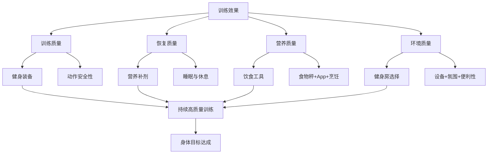
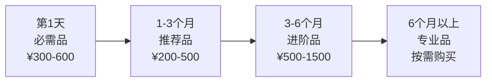
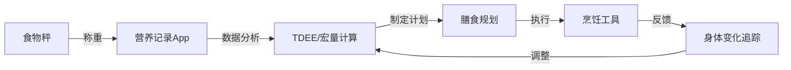

## 五、本节要点回顾

本节从装备、补剂、饮食工具、训练环境四个维度，系统梳理了"训练之外影响效果的关键变量"。很多人把全部注意力放在训练计划上，却忽略了这些支撑系统——就像一辆赛车，引擎再强，轮胎不行也跑不快。本节回顾不是简单的要点罗列，而是帮你建立一个**完整的决策框架**，让你在未来面对各种选择时有据可依。

---

### 5.1 四大模块核心逻辑总览

产品推荐的四个模块之间存在严密的逻辑递进关系：装备解决"怎么练"，补剂解决"怎么恢复"，饮食工具解决"怎么吃"，健身房解决"在哪练"。这四个问题共同构成了训练效果的**外部支撑系统**。

**关键认知**：这四个模块的投入优先级完全不同。如果你的预算和精力有限，必须知道先做什么、后做什么。以下是一个基于**边际收益递减原理**的优先级排序：

| 优先级 | 模块 | 核心投入 | 月均成本 | 边际收益 |
|--------|------|----------|----------|----------|
| ⭐⭐⭐⭐⭐ | 饮食工具 | 食物秤 + 记录App | ¥30-80 | 最高——直接影响热量和蛋白质摄入的精确性 |
| ⭐⭐⭐⭐ | 健身房选择 | 选对训练场所 | ¥100-500 | 很高——决定设备可及性和训练持续性 |
| ⭐⭐⭐ | 健身装备 | 训练鞋 + 基础服装 | ¥300-600（一次性） | 中等——提升安全性和舒适度 |
| ⭐⭐ | 营养补剂 | 肌酸 + 蛋白粉 | ¥95-135 | 较低——在前三者做好的前提下锦上添花 |

---

### 5.2 健身装备：三个核心原则 + 分阶段采购

#### 装备的本质认知

装备的核心定位是**弥补人体能力的暂时不足，而不是替代人体能力的发展**。这个认知决定了你的所有装备决策：

- 腰带不是"绑住腰保护脊柱"，而是为腹壁提供推靠面、提高腹内压——如果你不会 Valsalva 呼吸法，腰带效果大打折扣
- 举重鞋不是"深蹲神器"，而是补偿踝关节活动度不足——如果你的活动度够好，平底硬底鞋就是最佳选择
- 护具不是"越戴越安全"，过度依赖会削弱自身稳定肌群的发展

#### 三条采购原则

1. **先练后买**：至少训练 1-2 个月，了解自己的真实需求再花钱。训练第一天只需要一双运动鞋、一件速干T恤、一条运动短裤
2. **先必需后推荐**：鞋子和服装是必需品，腰带和护具是进阶品，辅助工具是锦上添花
3. **质量优先**：一双好鞋比三双烂鞋更有价值。¥200 的 Converse 比 ¥60 的杂牌运动鞋深蹲稳定性好 10 倍

#### 分阶段采购路线图

**第一阶段（第 1 天）**：训练鞋（Converse Chuck Taylor 或迪卡侬力量训练鞋，¥200-400）+ 速干T恤 ×3（1688工厂店，¥45-150）+ 运动短裤 ×2（带内衬弹性款，¥40-120）+ 运动袜 ×3（¥30-60）。

**第二阶段（1-3 个月）**：弹力带套装（¥30-80）+ 泡沫轴中等硬度（¥50-100）+ 液体镁粉（¥30-80）+ 训练水壶 1L+（¥30-60）。

**第三阶段（3-6 个月）**：力量举腰带针扣式 10mm（¥300-800）+ 护腕（¥80-200）+ 7mm 膝套一对（¥150-400）+ 正式训练鞋如 Nike Metcon（¥400-800）。

**第四阶段（6 个月以上，按需购买）**：举重鞋（踝关节问题持续存在时）、拉力带（握力成为硬拉瓶颈时）、按摩枪（恢复需求增加时）、高端腰带（力量举比赛准备时）。

#### 最重要的单一装备

**训练鞋是所有装备中最重要的**。它直接影响力量传导效率和关节安全。力量训练鞋的核心指标：平底、硬底、薄底、抓地力强。选鞋决策：

| 预算 | 推荐 | 特点 |
|------|------|------|
| ¥200-400 | Converse Chuck Taylor | 硬底平底，深蹲硬拉万金油 |
| ¥400-800 | Nike Metcon / Reebok Nano | 综合训练最佳，4mm微跟差 |
| ¥800+ | Adidas Powerlift / Nike Romaleos | 15-20mm跟差，专治踝关节活动度不足 |

---

### 5.3 营养补剂：三层梯队 + 2%哲学

#### 补剂的真实权重

补剂在整体效果中的贡献占比仅约 **2-5%**。这不是一个可以忽略的数字，但它告诉你一个关键信息：**在饮食、训练、睡眠这三大支柱做好之前，补剂的投入产出比极低**。

| 因素 | 贡献占比 | 核心要求 |
|------|----------|----------|
| 饮食 | 60-70% | 蛋白质充足、热量达标、营养素全面 |
| 训练 | 15-20% | 渐进超负荷、动作质量、训练量合理 |
| 睡眠与恢复 | 10-15% | 7-9小时高质量睡眠、压力管理 |
| 补剂 | 2-5% | 在前三者做好的前提下锦上添花 |

#### 三层梯队决策表

| 梯队 | 补剂 | 证据等级 | 月成本 | 是否推荐 |
|------|------|----------|--------|----------|
| **第一梯队** | 肌酸一水合物 | A级（500+项RCT） | ¥15/月 | ✅ 几乎所有人都应该用 |
| **第一梯队** | 乳清蛋白粉 | A级 | ¥80-120/月 | ✅ 蛋白质摄入不足时 |
| **第一梯队** | 咖啡因 | A级 | ¥0.5-1/次 | ✅ 高强度训练日 |
| **第二梯队** | 维生素D3 | A级（中国人群72%不足） | ¥5-10/月 | ✅ 室内工作者 |
| **第二梯队** | 鱼油（Omega-3） | B级 | ¥15-30/月 | ⚠️ 不吃鱼的人 |
| **第二梯队** | 镁（甘氨酸镁） | B级 | ¥10-20/月 | ⚠️ 睡眠质量差的人 |
| **第二梯队** | 复合维生素 | C级 | ¥10-15/月 | ⚠️ 饮食不规律时 |
| **第三梯队** | BCAA | 多项RCT显示无效 | ¥50-100/月 | ❌ 蛋白质充足时无意义 |
| **第三梯队** | 谷氨酰胺 | 系统综述否定 | ¥30-60/月 | ❌ 健康人群无需补充 |
| **第三梯队** | 睾酮促进剂 | 人体研究无显著效果 | ¥100-300/月 | ❌ 智商税 |

#### 新手起步方案

月预算 ¥100-150，只买**肌酸 + 蛋白粉**。这两样是性价比最高的组合，能覆盖补剂收益的大头。等训练和饮食都稳定了（至少 3 个月），再逐步添加维生素D3、鱼油、镁等第二梯队补剂。

#### 最关键的使用原则

- **肌酸**：每天 5 克，无需加载期，无需循环，随训后餐服用，与碳水同服提高吸收率
- **蛋白粉**：训练后 30-60 分钟 1 勺，每日不超过总蛋白质的 50%，搭配碳水效果更好
- **咖啡因**：训练前 30-60 分钟，3-6mg/kg 体重，下午 3 点后避免使用，采用周期化使用防止耐受
- **不要同时引入多种新补剂**——一次只加一种，用 2-3 周观察身体反应

---

### 5.4 饮食工具：食物秤是核心武器

#### 为什么食物秤是最重要的饮食工具

人的视觉估量误差在 **30-50%** 之间。你以为的一碗米饭 150g 实际可能是 220g，差出来的 70g 白饭约 90 大卡，一个月就是 2700 大卡，接近 0.4 公斤脂肪。食物秤将这种不确定性变成精确数据——它是所有饮食管理的基础。

#### 饮食管理工具链

#### 核心工具速查

| 工具 | 核心作用 | 推荐选择 | 预算 |
|------|----------|----------|------|
| 食物秤 | 精确计量 | 中端（精度1g，量程5kg+） | ¥30-80 |
| 营养App | 数据记录与分析 | 薄荷健康（中文首选） | 免费/¥198年 |
| TDEE计算器 | 确定热量目标 | Harris-Benedict公式 + 在线工具 | 免费 |
| 空气炸锅 | 低油烹饪 | 飞利浦/小米，3.5-5.5L | ¥200-600 |
| 不粘锅 | 最少油煎制 | 28cm平底，苏泊尔/美的 | ¥80-200 |
| 便当盒 | 带饭控饮食 | 玻璃材质带分隔，5个轮换 | ¥100-200 |

#### 最容易被忽视的三个饮食管理细节

**第一，调味料热量**。一勺老干妈 90 大卡，一勺沙拉酱 100 大卡，一勺花生酱 95 大卡。三餐调味料轻松贡献 200-400 大卡——相当于多吃了一碗米饭。健康替代方案：PB2 脱脂花生粉（25 kcal/15g 替代花生酱 95 kcal）、希腊酸奶+柠檬汁（15 kcal/15g 替代沙拉酱 100 kcal）。

**第二，生熟换算**。食物数据库标注的通常是生重，而你吃的是熟的。米饭生熟比约 1:2.2，肉类生熟比约 1:0.7-0.8。原则：**永远称生重**，查数据库时选"生"的条目。

**第三，备餐（Meal Prep）**。周末花 2-3 小时做好一周餐食，工作日只需加热。这是解决"今天太忙了随便吃吧"这个最大饮食杀手的核武器。核心流程：采购（30分钟）→ 批量烹饪（90分钟）→ 分装贴标签（30分钟）→ 冷藏近 3 天 + 冷冻后 3-4 天。

---

### 5.5 健身房选择：距离 > 设备 > 价格

#### 选择的核心逻辑

训练效果的核心变量是训练强度、动作质量和持续性。训练环境通过四条路径影响这三个变量：

1. **设备决定动作选择**：没有深蹲架就无法做杠铃深蹲，设备不足迫使你用次优动作替代
2. **氛围影响训练强度**：周围人认真训练，你的强度自然提高 10-20%
3. **便利性决定出勤率**：通勤超过 20 分钟的人，训练出勤率比 10 分钟以内的人低 40%
4. **社交支持增强坚持性**：有固定训练伙伴的人，训练坚持率高 65%

因此，选择健身房的核心不是"哪个最贵最好"，而是**"哪个环境能让我练得最久、最投入"**。

#### 五大类型速查

| 类型 | 月均费用 | 最大优势 | 最大劣势 | 适合谁 |
|------|----------|----------|----------|--------|
| 大型连锁 | ¥200-500 | 设备最全 | 销售压力大、高峰期拥挤 | 中阶训练者 |
| 24小时自助 | ¥99-299 | 月付无压力、24h开放 | 设备有限、无人指导 | 有经验、时间不固定者 |
| 精品工作室 | ¥200-600/次 | 一对一指导、预约制 | 价格高、设备有限 | 需要指导的新手 |
| CrossFit Box | ¥800-2000 | 社区氛围最强 | 价格高、不适合纯力量训练 | 功能性训练爱好者 |
| 家庭健身房 | 前期¥3000-15000 | 零通勤、完全自主 | 需要空间和自律 | 有经验的长期训练者 |

#### 选择的黄金法则

**永远选更近的那个**。如果两个健身房的其他条件相似，距离近 5 分钟的价值远大于多一台高端器械。你可以换训练计划、换教练、换装备，但你没法换健身房和你之间的距离。

#### 实地考察必查三项

1. **在你计划训练的时间段去**：晚上 7 点去看到的拥挤程度，才是你未来每天面对的真实情况
2. **数深蹲架和杠铃片**：深蹲架 ≥2 个，杠铃片总重 ≥200kg，必须有 1.25kg/2.5kg 小片
3. **和正在训练的会员聊**：他们的真实体验比销售顾问的介绍有价值 100 倍

#### 家庭健身房的决策门槛

**不要在训练不足 6 个月时搭建家庭健身房**。新手期需要动作反馈和纠正，没有基础时独自训练容易养成错误动作模式。6 个月以上训练经验 + 独立空间 ≥8㎡ + 预算 ¥5000+ 才考虑标准方案。

---

### 5.6 最常见的七个决策误区

以下误区在实际操作中出现频率最高，每个都可能导致数百元甚至上千元的浪费：

| 误区 | 真相 | 正确做法 |
|------|------|----------|
| **一开始就买齐所有装备** | 新手不知道自己的真实需求，买了也是浪费 | 第 1 天只买鞋子+服装，其余训练 1-3 个月后按需采购 |
| **蛋白粉是激素/有害** | 乳清蛋白就是牛奶副产品，化学上与食物蛋白质无区别 | 正规品牌即可，与喝牛奶吃鸡蛋的蛋白质本质相同 |
| **训练后必须30分钟内吃蛋白质** | "合成代谢窗口"被严重夸大，肌肉蛋白合成升高持续24-48小时 | 训练后尽快吃是好习惯，但1-2小时后吃不会"白练" |
| **补剂越多越好** | 补剂有递减边际收益，10种全部吃上效果可能只比肌酸+蛋白粉好5% | 先从肌酸+蛋白粉起步，3个月后按需逐步添加 |
| **跑步鞋可以做所有运动** | 跑步鞋的软底在力量训练中是安全隐患，严重影响深蹲稳定性 | 力量训练必须穿平底硬底鞋 |
| **食物秤不重要，目测就行** | 视觉估量误差30-50%，一个月累计差异可达0.4kg脂肪 | 购买精度1g的食物秤，养成每餐称量的习惯 |
| **健身房越贵越好** | 贵的健身房可能有游泳池桑拿，但深蹲架只有1个 | 先查设备齐全度（尤其自由重量区），再看附加服务 |

---

### 5.7 不同预算的完整配置方案

根据月预算的不同，以下是经过优先级排序的完整配置方案。每一分钱都花在边际收益最高的地方：

#### 月预算 ¥0（纯食物 + 公园训练）

| 模块 | 配置 | 说明 |
|------|------|------|
| 装备 | 现有运动鞋 + T恤 + 短裤 | 够用即可 |
| 补剂 | 不使用 | 专注饮食质量，95%的效果已经拿到 |
| 饮食 | 自制量杯估量（不精确但有方向感） | 至少知道一碗饭大概多少克 |
| 环境 | 公园单杠双杠 + 自重训练 | 引体向上、俯卧撑、深蹲、弓步 |

#### 月预算 ¥100-200（性价比之选）

| 模块 | 配置 | 月成本 |
|------|------|--------|
| 装备 | Converse（¥300一次性）+ 1688速干衣 | 分摊约¥30/月 |
| 补剂 | 肌酸 5g/天（¥15）+ 蛋白粉（¥80-120） | ¥95-135/月 |
| 饮食 | 食物秤（¥50一次性）+ 薄荷健康免费版 | 分摊约¥5/月 |
| 环境 | 24小时自助健身房 | ¥99-199/月 |

#### 月预算 ¥300-500（全面优化）

| 模块 | 配置 | 月成本 |
|------|------|--------|
| 装备 | Nike Metcon + 腰带 + 膝套 + 护腕 | 分摊约¥50/月 |
| 补剂 | 肌酸 + 蛋白粉 + 鱼油 + 维生素D3 + 镁 | ¥160-250/月 |
| 饮食 | 食物秤 + 空气炸锅 + 便当盒 + 薄荷健康高级版 | 分摊约¥30/月 |
| 环境 | 大型连锁健身房或精品工作室 | ¥200-500/月 |

#### 月预算 ¥500+（极致投入）

在 ¥300-500 方案基础上：增加按摩枪（分摊约¥40/月）、高端腰带SBD（一次性¥1200）、举重鞋（一次性¥1000，按需）、复合维生素 + 咖啡因片 + 益生菌（约¥50-80/月）、智能食物秤或营养App高级版。

---

### 5.8 记忆锚点：七句话概括全节

如果你只能记住七句话，记住这七句——它们浓缩了整节的核心智慧：

1. **训练鞋是最重要的装备**——力量训练选平底硬底鞋，它是一切训练的起点
2. **腰带是进阶护具，新手前 3 个月不使用**——先建立自身核心力量和正确呼吸模式
3. **肌酸和蛋白粉是最有科学依据的补剂**——两者组合覆盖补剂收益的大头
4. **咖啡因是训练前的合法"兴奋剂"**——但下午 3 点后避免使用，保护睡眠质量
5. **补剂只占 2%，饮食和训练才是关键**——不要用买补剂来逃避真正的努力
6. **食物秤是控制饮食的基础工具**——视觉估量误差 30-50%，精确计量才能精确控制
7. **装备分阶段采购，不要一开始就买齐所有**——先练后买，先必需后推荐，质量优先

---

### 5.9 自检清单：你现在处于哪个阶段？

用以下清单快速评估自己的装备和工具体系是否到位：

**基础层（第 1 天就应该有）**
- [ ] 有一双适合力量训练的平底硬底鞋
- [ ] 有 3-5 件速干T恤轮换
- [ ] 有 2 条不限制活动范围的运动短裤
- [ ] 知道自己每天应该吃多少热量和蛋白质

**进阶层（训练 1-3 个月后）**
- [ ] 有一台精度 1g 的食物秤并每天使用
- [ ] 在用营养App记录饮食（至少坚持了 2 周）
- [ ] 有弹力带套装用于热身和辅助训练
- [ ] 有泡沫轴用于训练后放松
- [ ] 选定了一个合适的训练场所并稳定出勤

**优化层（训练 3-6 个月后）**
- [ ] 使用肌酸和蛋白粉
- [ ] 有力量举腰带（大重量复合动作时使用）
- [ ] 有护腕和膝套
- [ ] 掌握了备餐流程，每周至少备餐 1 次
- [ ] 了解自己的TDEE并能灵活调整热量目标

**精通层（训练 6 个月以上）**
- [ ] 根据训练强度周期化使用咖啡因
- [ ] 补剂方案根据个人情况定制（维生素D3、鱼油、镁等）
- [ ] 装备选择完全基于自身需求而非跟风
- [ ] 饮食管理已形成自动化习惯，不需要每天刻意坚持
- [ ] 训练环境选择经过理性评估，没有为"高端"多花冤枉钱

---

> 不要让装备成为不训练的借口。一双运动鞋、一件T恤、一条短裤，就是你开始的全部装备。当你用最基础的装备坚持训练 3 个月后，你会比任何装备都更有价值——因为你已经拥有了**持续行动的习惯**，而这是任何花钱都买不到的东西。

