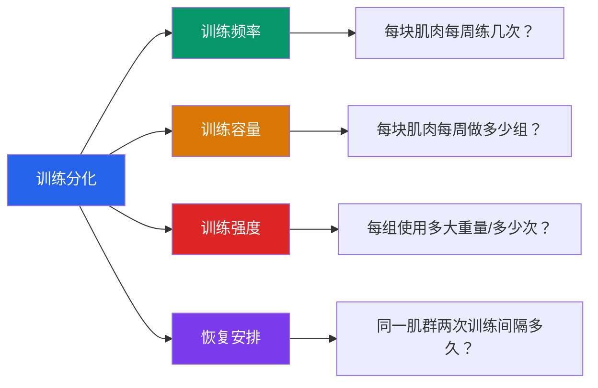
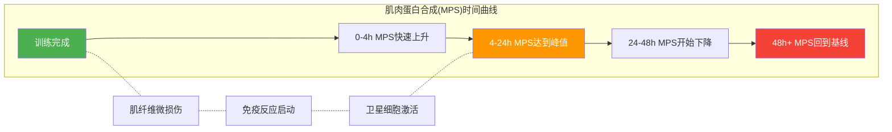
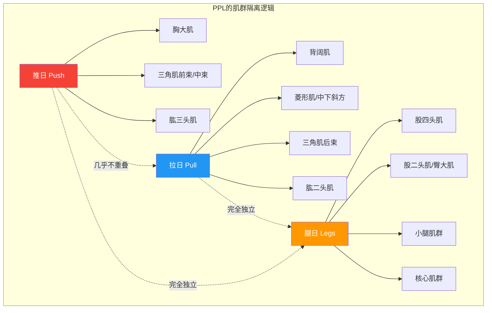
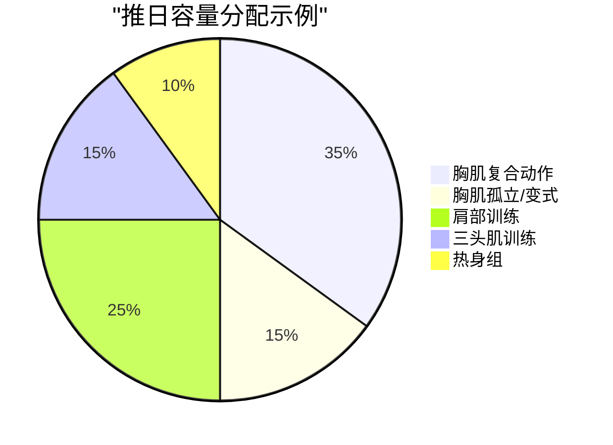
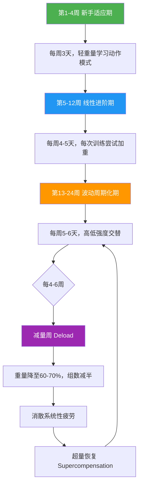

## 一、为什么选择PPL？

在「基础理论」板块中，你已经理解了肌肉生长的三大机制（机械张力、代谢压力、肌肉损伤）、渐进超负荷原则、以及训练容量与强度的关系。现在面临一个关键决策：**如何把这些理论组织成一套可执行的训练计划？**

这个决策的核心就是「训练分化」（Training Split）——你把身体的不同肌群分配到不同训练日的方式。分化方案选得好，训练效率事半功倍；选错了，要么恢复不足导致过度训练，要么刺激不够导致进步停滞。

本节将完整推导为什么 PPL（Push/Pull/Legs）是最适合你的分化方案。

---

### 1.1 什么是训练分化？

训练分化是力量训练中最基础的计划架构决策。它的本质是一个资源分配问题：**在有限的训练时间和恢复能力约束下，如何最大化肌肉生长刺激？**

这四个变量互相制约。高频率训练需要控制单次容量以保证恢复；低频率训练则需要在单次训练中堆积大量容量来弥补频率不足。训练分化的意义就是找到这四个变量的最佳平衡点。

---

### 1.2 主流训练分化方案全景对比

在选择 PPL 之前，你需要了解所有主流分化方案各自的逻辑、适用场景和局限性。以下是六种最常见的训练分化方式：

#### 1.2.1 全身训练（Full Body）

**逻辑**：每次训练覆盖全身所有主要肌群，每周训练 3 天。

| 维度 | 说明 |
|------|------|
| 典型安排 | 周一/周三/周五：全身 |
| 每肌群频率 | 每周 3 次 |
| 单次时长 | 60-90 分钟 |
| 适用人群 | 纯新手（0-6 个月）、时间极度有限者 |
| 优势 | 频率最高，神经适应快，动作学习效率高 |
| 劣势 | 单次容量受限，难以对单一肌群深度刺激；每次训练内容多，认知负担大 |

**关键局限**：当你的训练水平超过新手期，单次训练能容纳的容量不足以满足高级训练者的增长需求。深蹲 4 组 + 硬拉 4 组 + 卧推 4 组 + 划船 4 组 + 肩推 4 组……光是复合动作就要花 60 分钟以上，还没做任何孤立动作。

#### 1.2.2 上下肢分化（Upper/Lower Split）

**逻辑**：将身体分为上肢和下肢两个训练日交替进行。

| 维度 | 说明 |
|------|------|
| 典型安排 | 周一上肢/周一下肢/周三上肢/周四下肢（4天版） |
| 每肌群频率 | 每周 2 次 |
| 单次时长 | 60-75 分钟 |
| 适用人群 | 中级训练者（6-24 个月） |
| 优势 | 频率适中，上/下肢互不干扰，恢复充分 |
| 劣势 | 上肢训练日内容过多（胸、背、肩、手臂全在一天），肩关节负担大 |

**关键局限**：「上肢」这个分类过于粗糙。胸肌是推的动作模式，背肌是拉的动作模式——把它们放在同一天训练，意味着你的肩关节在同一次训练中既要完成推又要完成拉，累积的关节压力不可忽视。

#### 1.2.3 传统分化（Body Part Split / "Bro Split"）

**逻辑**：每个训练日只训练 1-2 个身体部位，一周内轮换一遍。

| 维度 | 说明 |
|------|------|
| 典型安排 | 周一胸/周二背/周三肩/周四腿/周五手臂 |
| 每肌群频率 | 每周 1 次 |
| 单次时长 | 45-60 分钟 |
| 适用人群 | 高级训练者、使用合成代谢药物的训练者 |
| 优势 | 单次训练可对目标肌群进行深度刺激（16-20 组） |
| 劣势 | 频率过低，肌肉蛋白合成窗口被浪费；一周内某天受伤则该肌群全周空白 |

**关键局限**：这是 20 世纪 80-90 年代健美运动员的经典方案，但它有一个致命缺陷——肌肉蛋白合成（MPS）在训练后 24-48 小时达到峰值并回落到基线水平（MacDougall et al., 1995）。一周只练一次意味着 MPS 窗口只有 2 天被利用，剩下 5 天处于「空转」状态。Schoenfeld 等人 2016 年在 *Sports Medicine* 上发表的 meta-analysis 明确指出：**每周训练频率 2 次优于 1 次**，效应量差异显著（ES = 0.32）。

#### 1.2.4 推/拉/腿分化（PPL）

**逻辑**：按动作模式将肌群分为三组——推（水平推 + 垂直推）、拉（水平拉 + 垂直拉）、腿（下肢伸展 + 屈曲）。

| 维度 | 说明 |
|------|------|
| 典型安排 | 推→拉→腿→推→拉→腿→休息（6天版） |
| 每肌群频率 | 每周 2 次（6天版）或 1.5 次（5天版） |
| 单次时长 | 55-75 分钟 |
| 适用人群 | 初级到高级训练者均可 |
| 优势 | 分组逻辑符合生物力学，频率适中，灵活可调 |
| 劣势 | 6 天版对时间要求较高；腿部恢复需要关注 |

#### 1.2.5 上肢推/上肢拉/腿分化（Arnold Split）

**逻辑**：将 PPL 中的推日和拉日进一步细分，上肢单独训练。

| 维度 | 说明 |
|------|------|
| 典型安排 | 胸+肩/背+二头/腿（经典阿诺德分化） |
| 每肌群频率 | 每周 2 次 |
| 单次时长 | 50-65 分钟 |
| 适用人群 | 中级及以上、以审美为导向的训练者 |
| 优势 | 胸背超级组训练效率高，泵感强 |
| 劣势 | 肩关节训练量大，容易过度使用 |

#### 1.2.6 综合对比表

| 维度 | 全身训练 | 上下肢 | Bro Split | **PPL** | Arnold |
|------|---------|--------|-----------|---------|--------|
| 每肌群频率 | 3次/周 | 2次/周 | 1次/周 | **2次/周** | 2次/周 |
| 每周最少天数 | 3天 | 4天 | 5天 | **3天（弹性）** | 6天 |
| 单次训练复杂度 | 高 | 中高 | 低 | **中** | 中 |
| 关节友好度 | 中 | 中 | 高 | **高** | 中低 |
| 对新手友好度 | 高 | 中 | 低 | **高** | 低 |
| 中高级可扩展性 | 低 | 中 | 高 | **高** | 高 |
| 肌群平衡性 | 中 | 中 | 低 | **高** | 中 |
| 科学循证支持 | 强 | 强 | 弱 | **强** | 中 |

---

### 1.3 PPL的六大核心优势

#### 优势一：频率符合肌肉蛋白合成的科学规律

这是选择 PPL 最根本的原因。

肌肉生长的基本机制是：训练造成肌纤维微损伤 → 身体启动修复机制 → 肌肉蛋白合成（MPS）速率升高 → 修复后的肌纤维比原来更粗更强。这个 MPS 升高窗口在训练后 **24-48 小时**达到峰值，之后回落到基线水平。

这意味着什么？如果你一周只练一次某个肌群（Bro Split），MPS 在第 2 天就回到基线了，第 3-7 天完全浪费。而 PPL 让你每 72 小时训练同一肌群一次，完美覆盖了整个 MPS 窗口。

**关键研究**：Schoenfeld, Ogborn & Krieger（2016）对 10 项研究的 meta-analysis 发现，每周 2 次训练频率相比 1 次，肌肉增长的效应量差异为 0.32（95% CI: 0.05-0.59），在统计学上显著。另一项研究（Rå̊stam et al., 2016）发现每周 3 次 vs 1.5 次的训练频率，高频率组的 II 型肌纤维横截面积增长显著更多。

#### 优势二：按动作模式分组，避免肌肉冲突

PPL 的分组逻辑不是随意的——它遵循生物力学原则：

- **推日**：所有涉及「推」的动作模式（水平推：卧推、俯卧撑；垂直推：肩推、臂屈伸），参与肌群为胸大肌、三角肌前束/中束、肱三头肌
- **拉日**：所有涉及「拉」的动作模式（水平拉：划船；垂直拉：引体向上、高位下拉），参与肌群为背阔肌、菱形肌、三角肌后束、肱二头肌
- **腿日**：所有涉及下肢的动作模式，参与肌群为股四头肌、股二头肌、臀大肌、小腿肌群

这种分组的关键优势是：**推日和拉日使用的肌肉几乎完全不重叠**。当你在推日练完胸肌和三头肌后，第二天的拉日不会受到任何影响——背肌和二头肌是完全独立的肌群。这意味着：

1. 不存在「辅助肌群疲劳」的问题（上下肢分化中常见的痛点）
2. 每个训练日可以全力以赴，不用担心影响第二天的训练
3. 每个肌群的恢复时间充分且规律

#### 优势三：灵活性极高——适配 3 到 6 天的任何时间安排

这是 PPL 最实用的优势之一。与 Bro Split（必须 5-6 天）或全身训练（最多 4 天效率递减）不同，PPL 可以灵活适配你每周实际可用的训练天数：

**3天版（最低要求）**

| 周一 | 周二 | 周三 | 周四 | 周五 | 周六 | 周日 |
|------|------|------|------|------|------|------|
| 推 | 休息 | 拉 | 休息 | 腿 | 休息 | 休息 |

每肌群每周 1 次，适合工作极忙或刚起步阶段。

**4天版**

| 周一 | 周二 | 周三 | 周四 | 周五 | 周六 | 周日 |
|------|------|------|------|------|------|------|
| 推 | 拉 | 休息 | 腿 | 上肢综合 | 休息 | 休息 |

第三天可选上肢综合或重复任意一个薄弱环节。

**5天版（推荐）**

| 周一 | 周二 | 周三 | 周四 | 周五 | 周六 | 周日 |
|------|------|------|------|------|------|------|
| 推 | 拉 | 腿 | 休息 | 上肢 | 下肢 | 休息 |

上肢日整合推+拉的精华动作，下肢日做腿日的补充。适合大多数上班族。

**6天版（经典）**

| 周一 | 周二 | 周三 | 周四 | 周五 | 周六 | 周日 |
|------|------|------|------|------|------|------|
| 推 | 拉 | 腿 | 推 | 拉 | 腿 | 休息 |

每肌群每周恰好 2 次，最大化 MPS 窗口利用。适合时间充裕且恢复能力好的训练者。

> **如何选择**：新手推荐从 3 天或 4 天版开始，建立习惯后逐步过渡到 5 天或 6 天。不要一上来就 6 天——恢复跟不上，两周后你就会放弃。

#### 优势四：天然适合渐进超负荷

渐进超负荷是肌肉增长的第一原则，而 PPL 的结构让执行渐进超负荷变得非常简单直观。

原因是：PPL 中每个训练日的核心复合动作是固定的。推日的核心是卧推，拉日的核心是引体向上/划船，腿日的核心是深蹲。你每周至少做两次同样的动作，这意味着：

1. **你每周有两次机会在同一动作上尝试进步**——加 2.5 kg 或多做 1 次
2. **你可以精确追踪进步**——训练日志中记录的数据频率足够高，趋势清晰
3. **神经适应效率最高**——重复相同的动作模式，神经系统能更快优化运动单元募集模式

对比 Bro Split：你一周只做一次卧推，下一次卧推是 7 天后。两次训练之间隔了太久，很难精确对比每次的进步幅度。而且如果某天状态不好导致卧推表现下降，整个「胸肌周」就浪费了。

#### 优势五：训练效率高——每分钟都在做有用的事

PPL 每个训练日的肌群逻辑清晰，不会有「什么都练一点、什么都不深入」的问题。

以推日为例，你的每一组训练都直接或间接服务于「推」的动作模式：卧推练胸（主力）→ 上斜哑铃卧推补上胸（变式）→ 肩推练三角肌（辅助推）→ 侧平举补中束宽度（补充）→ 绳索夹胸强化胸肌内侧（精雕）→ 三头肌训练（协同肌）。整条链路逻辑清晰，每一组都有明确的训练目的。

对比全身训练：你可能在深蹲 4 组后已经疲劳了，但还有卧推、划船、肩推等着你——后面的训练质量必然下降。PPL 避免了这种「前半段精力充沛、后半段敷衍了事」的问题。

#### 优势六：关节负担分散，损伤风险低

PPL 按动作模式分组的另一个好处是关节保护。

在同一天内，推的动作对肩关节施加的是同一方向的压力，肌腱和韧带只需要适应一种应力模式。而上下肢分化中，上肢日你需要在同一训练中完成卧推（肩关节水平内收+外旋）和划船（肩关节水平外展+内旋），肩关节需要在同一次训练中反复切换受力方向，累积的关节压力更大。

PPL 还天然包含了训练平衡：拉日的面拉、划船等动作可以抵消推日大量卧推造成的胸肌紧张和圆肩倾向，从结构上预防肩关节问题。

---

### 1.4 PPL的适用人群与不适用场景

#### 最适合 PPL 的人群

| 人群特征 | 为什么 PPL 适合 |
|---------|----------------|
| 新手到中级训练者（0-3 年） | 频率适中，动作学习路径清晰 |
| 每周能训练 4-6 天的人 | PPL 的多种频率版本适配不同时间安排 |
| 追求体型改善的人 | 推/拉/腿的分组确保全身均衡发展 |
| 喜欢力量训练的人 | 核心复合动作（卧推、深蹲、划船）是力量增长的基础 |
| 想要持续进步的人 | 高频率同动作训练便于执行渐进超负荷 |

#### PPL 可能不是最佳选择的场景

| 场景 | 更好的替代方案 | 原因 |
|------|--------------|------|
| 每周只能训练 1-2 天 | 全身训练 | 3 天 PPL 的肌群频率只有 1 次/周，不如全身训练的 2-3 次 |
| 专项运动员（篮球、游泳等） | 运动专项计划 | PPL 不考虑运动专项性，需要结合技术训练 |
| 力量举竞技训练 | 以深蹲/卧推/硬拉为核心的专项计划 | 力量举需要更频繁地练习比赛动作 |
| 使用合成代谢药物的训练者 | Bro Split 可能更适用 | 药物使用者的 MPS 窗口更长（72-96 小时），恢复能力远超自然训练者 |

> **重要说明**：如果你的训练目标只是基础的健康和体能，每周 3 次全身训练就够了，不需要 PPL。PPL 的价值在追求体型和力量的系统性训练中才充分体现。

---

### 1.5 PPL背后的科学原理深度解析

#### 肌肉蛋白合成（MPS）的周期性

理解 MPS 的周期性是理解 PPL 设计逻辑的钥匙。

当一组肌纤维在训练中被充分刺激后，MPS 速率会显著升高。这个升高的持续时间取决于多个因素：

| 因素 | 对 MPS 窗口的影响 | 说明 |
|------|-----------------|------|
| 训练经验 | 新手窗口更长（约 48-72h），老手更短（约 24-36h） | 新手的肌肉对训练刺激更敏感 |
| 训练容量 | 中等容量窗口最长，过高容量反而缩短 | 过度训练会提前关闭 MPS 窗口 |
| 蛋白质摄入 | 充足蛋白（1.6-2.2g/kg/天）延长有效窗口 | 蛋白质是 MPS 的原料 |
| 睡眠质量 | 睡眠不足会缩短 MPS 窗口约 30% | 生长激素主要在深睡眠期分泌 |

这意味着：**随着训练经验增长，你需要更频繁地刺激同一肌群来维持高效的 MPS 周期**。PPL 的 6 天版（每 72 小时刺激一次）恰好覆盖了新手和中级训练者的 MPS 窗口。

#### 训练容量的分配逻辑

PPL 的容量分配遵循「复合优先、孤立补充」的原则。每个训练日的容量分配大致为：

每个肌群在单次训练中的有效组数（不含热身组）推荐为：

| 肌群 | 单次有效组数 | 每周总量（6天版） | 科学依据 |
|------|------------|-----------------|---------|
| 胸大肌 | 8-12 组 | 16-24 组 | Krieger (2010): >10 组/周有显著额外收益 |
| 三角肌 | 8-12 组 | 16-24 组 | 三角肌恢复快，可承受较高容量 |
| 背部 | 10-14 组 | 20-28 组 | 背部面积大、肌群多，需要更多容量 |
| 股四头肌 | 8-12 组 | 16-24 组 | 深蹲类动作的系统疲劳较高 |
| 股二头肌 | 6-10 组 | 12-20 组 | 硬拉类动作已提供部分刺激 |
| 肱二/三头 | 6-9 组 | 12-18 组 | 复合动作中已参与，孤立训练做补充 |

> **注意**：以上容量推荐适用于中等水平训练者。新手从推荐值的 60-70% 开始，随着训练水平提升逐步增加。详见下一节「详细训练计划」中的具体安排。

#### 神经适应与动作熟练度

PPL 固定的训练日结构有一个常被忽略的好处：**动作重复频率高，神经系统适应快**。

力量增长有两个来源：1）肌肉横截面积增大（肌肥大），2）神经系统更高效地募集运动单元（神经适应）。对于新手来说，前 3-6 个月的力量增长中，神经适应的贡献可能高达 50-70%（Sale, 1988）。

PPL 让你在每周 2 次的频率下反复练习卧推、深蹲、划船等核心动作，神经系统的运动模式优化速度远高于每周只练 1 次的方案。这也是为什么很多 PPL 训练者在前几个月的力量增长速度令人惊喜——不完全是肌肉长了，更多的是大脑「学会了」如何发力。

---

### 1.6 PPL的训练周期化进阶图

当你已经掌握了基础的 PPL 训练计划（前 4-8 周），接下来需要引入「周期化」的概念——系统性地变化训练变量（重量、容量、强度），避免平台期并持续进步。

**三个阶段详解**：

**阶段一：新手适应期（第 1-4 周）**

| 训练变量 | 目标 |
|---------|------|
| 频率 | 每周 3 天（推/拉/腿各 1 次） |
| 重量 | 使用 RPE 6-7 的重量（还有 3-4 次余力） |
| 组数 | 每动作 2-3 组（总有效组数 12-16 组/次） |
| 核心目标 | 掌握所有基础动作的正确模式 |

这一阶段不追求重量进步，唯一目标是「做对每一个动作」。如果动作变形了，立刻减轻重量。

**阶段二：线性进阶期（第 5-12 周）**

| 训练变量 | 目标 |
|---------|------|
| 频率 | 每周 4-5 天 |
| 重量 | 每次训练尝试比上次多 2.5 kg 或多 1 次 |
| 组数 | 每动作 3-4 组（总有效组数 16-22 组/次） |
| 核心目标 | 执行渐进超负荷，建立训练日志习惯 |

线性加重不可能永远持续。当你连续 2 次训练无法在同一动作上进步时，进入下一阶段。

**阶段三：波动周期化期（第 13-24 周）**

| 训练变量 | 目标 |
|---------|------|
| 频率 | 每周 5-6 天 |
| 重量 | 每 3 周为一个小周期：重→中→轻 |
| 组数 | 高容量周 18-24 组/次，低容量周 10-14 组/次 |
| 核心目标 | 通过系统性变化训练刺激避免平台期 |

**减量周（Deload）的重要性**

每 4-6 周安排一次减量周是 PPL 周期化的核心环节。减量周不是「偷懒」，而是有明确的生理学目的：

1. **消散累积性疲劳**：连续数周的高强度训练会在神经系统和结缔组织中积累微损伤，减量周让身体完成全面修复
2. **超量恢复**：减量后，身体不仅恢复到基线水平，还会超过基线——这就是「超量恢复」窗口，接下来的训练你会明显感觉更有力量
3. **心理恢复**：持续高强度训练带来的心理疲劳同样需要休息

减量周的具体执行：重量降至平时的 60-70%，组数减半，保持动作不变，训练天数可以减少 1 天。

---

### 1.7 PPL 常见疑问解答

#### Q1：PPL 会不会导致腿和手臂训练不足？

不会。PPL 的设计逻辑是「复合优先」——推日的卧推和肩推已经大量刺激了三头肌，拉日的划船和引体向上已经大量刺激了二头肌。孤立的臂屈伸和弯举只是「查漏补缺」。同理，腿日的深蹲和罗马尼亚硬拉覆盖了股四、股二和臀部，额外的孤立动作只是补充。

真正需要担心的是训练量不够，而不是分化方式。只要你的推日有 8-12 组胸 + 8-10 组肩 + 6-8 组三头，总量就足够了。

#### Q2：我可以把腿日拆成股四日和股二日吗？

不建议。腿部肌群之间高度协同——深蹲同时刺激股四、股二和臀部。拆分训练会导致动作选择受限，训练效率下降。除非你的腿部发展严重不平衡（比如股二明显落后），才考虑在腿日中加入额外的股二孤立动作。

#### Q3：PPL 适合减脂期吗？

完全适合。减脂期的训练原则是**尽量维持训练强度和容量**以保留肌肉量，同时通过饮食制造热量缺口。PPL 的结构在减脂期唯一需要调整的是：如果恢复能力下降（因为热量限制），可以将 6 天版降为 4-5 天版，减少总容量但保持每肌群每周 2 次的频率。

#### Q4：女性适合 PPL 吗？

非常适合。PPL 是按动作模式分组，不区分性别。女性训练者通常希望重点发展臀部和背部，只需要在腿日增加臀部动作（如臀推、后踢腿），在拉日增加高位下拉和面拉的比例即可。女性的恢复能力通常不如男性，建议从 3-4 天版开始。

#### Q5：练 PPL 多久需要换方案？

PPL 本身不是一个固定的计划，而是一个**框架**。你可以在 PPL 框架内通过更换具体动作、调整组数次数、改变训练节奏等方式持续变化训练刺激，而不需要抛弃整个分化方案。很多高级训练者用了 3-5 年 PPL 仍然在持续进步，因为他们在框架内不断微调。

真正需要换分化方案的信号是：你在 PPL 框架内尝试了所有周期化策略（线性、波动、块状周期化），仍然连续 3 个月以上无法进步。这时可以尝试上下肢分化或全身训练，给身体全新的刺激模式。

---

### 1.8 本节要点总结

| 要点 | 核心内容 |
|------|---------|
| 训练分化的本质 | 在有限的时间和恢复能力下，优化训练频率、容量和强度的分配 |
| PPL 的核心逻辑 | 按动作模式（推/拉/腿）分组，避免肌群冲突，实现高频刺激 |
| 科学依据 | 每周 2 次训练频率显著优于 1 次（Schoenfeld et al., 2016） |
| MPS 窗口 | 训练后 24-48 小时，PPL 每 72 小时刺激一次恰好覆盖 |
| 灵活性 | 适配 3-6 天/周的任何时间安排 |
| 进阶路径 | 新手适应期（4周）→ 线性进阶期（8周）→ 波动周期化期 |
| 减量周 | 每 4-6 周一次，重量降至 60-70%，组数减半 |

下一节「二、详细训练计划」将基于 PPL 框架，给出每个训练日的完整动作、组数、次数和替代方案——你可以直接拿着去健身房执行。
