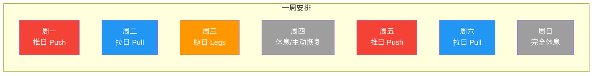
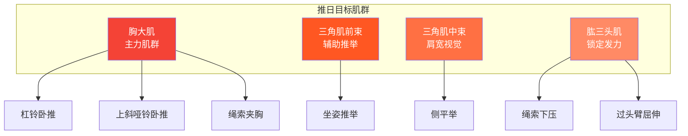
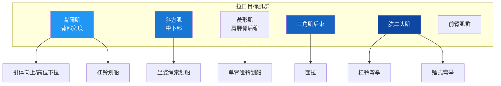
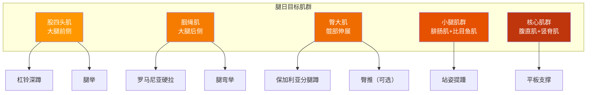
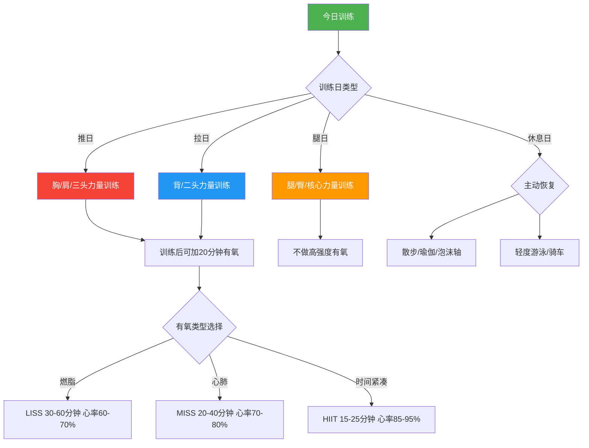

## 二、详细训练计划

上一节我们论证了PPL分化为什么是最优选择。现在进入最核心的部分——**每个训练日到底练什么、怎么练、练多少**。本节提供完整的推日、拉日、腿日训练方案，包含动作选择原理、标准动作描述、呼吸节奏、常见错误纠正、替代动作和完整的训练模板。你不需要自己设计任何东西，照着执行即可。

### 2.0 一周总览：三个训练日如何排布

在展开每个训练日的细节之前，先明确一周的宏观安排。PPL的核心逻辑是**推-拉-腿**循环，每个循环后休息一天，然后开始下一个循环。

#### 推荐周安排（5天/周，适合大多数人）

**为什么这样安排？**

| 安排要素 | 说明 |
|----------|------|
| 推-拉-腿连续三天 | 三个训练日的肌群互不重叠，连续训练不会互相影响 |
| 腿日后安排休息 | 深蹲和硬拉对中枢神经系统负担最大，之后需要一天恢复 |
| 周五重复推日 | 每个肌群一周被训练2次，覆盖蛋白质合成窗口 |
| 周六拉日后周日休息 | 一周训练结束，给身体完整的48小时恢复 |

#### 其他频率方案

| 频率 | 周一 | 周二 | 周三 | 周四 | 周五 | 周六 | 周日 | 每肌群/周 |
|------|------|------|------|------|------|------|------|-----------|
| **3天（入门）** | 推 | 休息 | 拉 | 休息 | 腿 | 休息 | 休息 | 1次 |
| **4天（进阶）** | 推 | 拉 | 休息 | 腿 | 推 | 休息 | 休息 | ~1.3次 |
| **5天（推荐）** | 推 | 拉 | 腿 | 休息 | 推 | 拉 | 休息 | ~1.7次 |
| **6天（高阶）** | 推 | 拉 | 腿 | 推 | 拉 | 腿 | 休息 | 2次 |

> **选择建议**：新手从3天开始，4-6周后适应了再升级到4天，再过4-6周升级到5天。不要一上来就6天——恢复跟不上等于白练。

#### 单次训练时长规划

| 阶段 | 时长 | 构成 |
|------|------|------|
| 热身 | 10-15分钟 | 全身激活 + 目标肌群专项热身 + 渐进负重热身 |
| 主训练 | 40-60分钟 | 6-7个正式动作，每组间严格计时休息 |
| 放松 | 5-10分钟 | 静态拉伸 + 呼吸调整 |
| **合计** | **55-85分钟** | 超过90分钟说明休息时间过长或动作太多 |

***

### 2.1 推日（Push Day）——胸、肩、三头

推日的目标肌群是所有负责"推"这个动作模式的肌肉：胸大肌、三角肌（前束和中束为主）、肱三头肌。这三个肌群在功能上高度协同——卧推时胸肌是主力，三角肌前束辅助，三头肌在锁定阶段发力。因此放在同一天训练是科学合理的。

#### 热身（10-15分钟）

热身不是浪费时间，而是训练质量的保障。一个充分的热身可以提升训练表现10-15%，同时大幅降低受伤概率。以下是推日的专项热身流程：

| 顺序 | 动作 | 组数×次数 | 目的 |
|------|------|-----------|------|
| 1 | 原地慢跑或开合跳 | 2分钟 | 提升核心体温，加速血液循环 |
| 2 | 弹力带外旋 | 2×15/侧 | 激活肩袖肌群（冈下肌、小圆肌），保护肩关节 |
| 3 | 猫牛式 | 10次 | 活动胸椎，改善上背部灵活性 |
| 4 | 俯卧撑Plus（俯卧撑+前推肩胛骨） | 2×10 | 激活前锯肌，稳定肩胛骨 |
| 5 | 空杆卧推 | 1×15 | 激活目标肌群的神经肌肉连接 |
| 6 | 渐进负重热身 | 2-3组 | 从空杆到正式组重量的50%→70%→85% |

**渐进负重热身详解**：假设你的正式组卧推重量是60kg，热身组应该这样安排：
- 空杆（20kg）× 15次
- 40kg × 8次（正式重量的67%）
- 50kg × 5次（正式重量的83%）
- 休息1分钟后开始正式组

> **为什么需要渐进热身？** 直接用大重量训练，神经系统和关节都还没准备好。渐进热身让中枢神经系统逐步"招募"更多运动单位，让关节液充分润滑关节面，让肌腱和韧带进入工作状态。跳过热身组直接上大重量，受伤概率至少增加3倍。

#### 主训练

| 顺序 | 动作 | 组数 | 次数 | 休息 | RPE | 说明 |
|------|------|------|------|------|-----|------|
| 1 | **杠铃平板卧推** | 4 | 6-8 | 2-3分钟 | 7-8 | 主力复合动作，发展胸肌整体厚度 |
| 2 | **上斜哑铃卧推**（30°） | 3 | 8-10 | 2分钟 | 7-8 | 重点发展上胸，改善胸部视觉饱满度 |
| 3 | **坐姿哑铃推举** | 3 | 8-10 | 2分钟 | 7-8 | 三角肌前束和中束，增加肩宽 |
| 4 | **哑铃侧平举** | 3 | 12-15 | 60秒 | 8-9 | 三角肌中束孤立，打造肩宽视觉 |
| 5 | **绳索夹胸**（高位到低位） | 3 | 12-15 | 60秒 | 8 | 胸肌内侧和下沿，增加胸部线条 |
| 6 | **绳索下压** | 3 | 12-15 | 60秒 | 8 | 肱三头肌长头和外侧头 |
| 7 | **过头臂屈伸** | 2 | 10-12 | 60秒 | 8 | 肱三头肌长头拉伸位刺激 |

> **关于RPE**：RPE（Rate of Perceived Exertion，主观疲劳等级）是衡量训练强度的标尺。RPE 7 = 还能做3次；RPE 8 = 还能做2次；RPE 9 = 还能做1次；RPE 10 = 力竭。推日的复合动作保持RPE 7-8（留有余量），孤立动作可以推到RPE 8-9。详见2.4节的完整RPE说明。

#### 每个动作的详细执行指南

##### 动作1：杠铃平板卧推

**为什么是第一个动作？** 卧推是推日的"主菜"，需要最多的神经肌肉协调和最大的力量输出。放在第一个做，体力和注意力最充沛，能举起最大的重量，获得最好的训练效果。

**标准执行步骤**：

1. **躺姿设置**：平躺于卧推凳，眼睛正对杠铃。双脚踩实地面（脚跟发力），臀部和上背紧贴凳面，腰部自然弓起（可以插入一个拳头的空隙）
2. **握距**：双手握住杠铃，握距略宽于肩宽（约1.5倍肩宽）。小臂在最低点应垂直于地面
3. **起杠**：深吸一口气，核心收紧，伸直手臂将杠铃从架子上移出，移动到胸部正上方
4. **下放**：控制杠铃缓慢下放至胸部中下沿（乳头连线位置），肘部与身体呈约60-75°夹角
5. **推起**：双脚蹬地，胸部发力将杠铃推回起始位置，在顶部完全伸直手臂
6. **呼吸**：下放前深吸气并憋住（Valsalva呼吸法，增加核心压力保护脊柱），推起时呼气

**关键发力感觉**：
- 想象"用胸肌夹碎一个核桃"——注意力集中在胸肌的收缩
- 肩胛骨始终后缩下沉（想象把肩胛骨塞进后裤兜），这能稳定肩关节并更好地激活胸肌
- 不要让杠铃"弹胸"——触胸后稍停0.5秒再推起，这能确保是真的在发力而非借助惯性

**常见错误与纠正**：

| 错误 | 后果 | 纠正方法 |
|------|------|----------|
| 肩膀前伸（耸肩） | 肩关节压力大，容易受伤，胸肌刺激减少 | 训练前加强肩胛骨后缩的意识，想象"把肩胛骨装进口袋" |
| 杠铃弹胸 | 惯性代替肌肉发力，训练效果打折，肋骨受伤风险 | 下放时控制2秒，触胸后停0.5秒再推 |
| 臀部离凳 | 腰椎过度伸展，下背压力大 | 双脚用力蹬地，臀部"钉"在凳子上 |
| 握距过窄 | 三头肌代偿过多，胸肌刺激不足 | 确保小臂在最低点垂直于地面 |
| 手腕后翻 | 手腕承受剪切力，长期导致手腕疼痛 | 杠铃放在掌根而非手指根部，可使用护腕 |
| 呼吸混乱 | 核心不稳定，力量输出下降 | 养成"下放吸气-憋气推起-顶部呼气"的固定节奏 |

**替代动作**：

| 替代动作 | 适用场景 | 优劣对比 |
|----------|----------|----------|
| **杠铃上斜卧推** | 上胸薄弱时可替换 | 更多上胸参与，但整体重量会降低 |
| **哑铃平板卧推** | 哑铃训练更均衡 | 活动范围更大，但起始重量受限 |
| **器械卧推（史密斯机）** | 安全性更高，适合新手 | 轨迹固定，减少了稳定肌群的参与 |
| **俯卧撑** | 家庭训练或无杠铃时 | 自重限制了渐进超负荷，可通过改变角度增加难度 |

##### 动作2：上斜哑铃卧推（30°）

**为什么用30°而不是45°？** 研究（Lehman, 2005）表明，30°角对上胸（锁骨部胸大肌）的激活效果最好，而45°角会过多地将负荷转移到三角肌前束，反而减少了胸肌的参与。大多数可调节卧推凳的30°标记就是最佳角度。

**标准执行步骤**：

1. 将卧推凳调至30°，双手各持一只哑铃，坐在凳子上，将哑铃置于大腿上
2. 借力将哑铃举至起始位置（大腿"踢"起哑铃的同时后仰）
3. 双手向两侧打开，肘部略低于肩部，哑铃下放至胸部两侧
4. 胸肌发力将哑铃推起，在顶部让两个哑铃轻轻靠近（不必碰触），挤压胸肌1秒
5. 呼吸：下放吸气，推起呼气

**关键发力感觉**：
- 下放时感受上胸的拉伸感
- 推起时想象"用手肘内侧夹紧一条毛巾"
- 哑铃的运动轨迹不是直上直下，而是一个微微的弧线——从胸部两侧到胸部正上方

**常见错误与纠正**：

| 错误 | 后果 | 纠正 |
|------|------|------|
| 角度太陡（>45°） | 变成了肩部推举，胸肌刺激大幅减少 | 确认凳子角度在30°左右 |
| 哑铃下放太低 | 肩关节过度伸展，肩袖受伤风险 | 下放到大臂与地面平行即可 |
| 两只手不同步 | 左右力量不均衡加剧 | 用眼睛看哑铃，确保同时运动 |

##### 动作3：坐姿哑铃推举

**标准执行步骤**：

1. 调节卧推凳至接近垂直（约80-85°），双手各持哑铃，起始位置在肩膀两侧，掌心朝前
2. 核心收紧，将哑铃推举至头顶，在顶部伸直手臂但不锁死肘关节
3. 缓慢下放至起始位置，哑铃与耳朵平齐

**关键发力感觉**：
- 三角肌前束和中束的收缩感
- 避免过度弓腰——如果需要弓腰才能推起，说明重量太重

**常见错误与纠正**：

| 错误 | 后果 | 纠正 |
|------|------|------|
| 腰部过度弓起 | 腰椎压力大，而且用胸肌代偿了肩部发力 | 减轻重量，保持核心收紧，臀部紧贴凳面 |
| 手臂完全锁死 | 肘关节承受全部重量 | 在顶部保持肘关节微屈（约170°） |
| 下放过低导致肩膀不适 | 肩关节囊压力过大 | 下放到大臂略低于肩膀即可 |

**替代动作**：

| 替代动作 | 适用场景 |
|----------|----------|
| **杠铃过头推举（OHP）** | 更大的重量，更强的核心参与，但对肩关节灵活性要求更高 |
| **阿诺德推举** | 旋转掌心的动作模式能更全面地刺激三角肌三个束 |
| **器械推举** | 更安全，适合新手，但减少了稳定肌群的训练 |

##### 动作4：哑铃侧平举

**这是推日最重要的"细节动作"。** 侧平举直接针对三角肌中束——中束的宽度决定了你正面看起来有多"宽"。对于55开比例的人来说，这是改善视觉比例最有效的动作。

**标准执行步骤**：

1. 站立，双脚与肩同宽，膝盖微屈，上半身微微前倾（约10°），双手各持一只轻哑铃垂于身体两侧
2. 肘关节保持微屈（约150°），像"倒水"一样将哑铃向两侧举起
3. 举到大臂与地面平行时停住1秒，然后缓慢下放
4. 想象"用肘尖去碰天花板"——发力点在肘部而非手腕

**关键发力感觉**：
- 三角肌中束的灼烧感——这个动作用轻重量高次数效果最好
- 如果你的斜方肌上束先感到疲劳，说明你在耸肩——降低重量，专注于中束发力

**常见错误与纠正**：

| 错误 | 后果 | 纠正 |
|------|------|------|
| 使用过大重量 | 借力甩动，斜方肌代偿，中束刺激不足 | 降低到能控制的重量（通常5-10kg），做15次比做8次效果好 |
| 耸肩 | 斜方肌上束过度参与，中束反而没练到 | 想象"肩膀往下压"，保持肩胛骨下沉 |
| 举得太高 | 超过肩膀高度后，斜方肌接管发力 | 只举到大臂与地面平行，不需要更高 |
| 身体摇晃 | 借助惯性，训练效果打折 | 减轻重量，或者坐姿做侧平举 |

##### 动作5：绳索夹胸（高位到低位）

**标准执行步骤**：

1. 将两侧滑轮调至最高位，双手各持一个D型手柄，向前迈一步形成弓步站姿
2. 上半身微微前倾，双手从高位开始，肘关节保持微屈
3. 胸肌发力将双手向下向内"合拢"，在身体前方汇合
4. 挤压胸肌1-2秒，然后缓慢回到起始位置

**关键发力感觉**：
- 胸肌下沿和内侧的收缩感
- 想象"拥抱一棵大树"——这个动作的本质是"水平内收"

**替代动作**：

| 替代动作 | 适用场景 |
|----------|----------|
| **哑铃飞鸟** | 没有绳索器械时的替代，但绳索的恒定张力优于哑铃 |
| **蝴蝶机夹胸** | 更稳定，适合新手找到胸肌发力感 |
| **俯卧撑Plus（宽距）** | 家庭训练替代，宽距俯卧撑能更多地刺激胸肌内侧 |

##### 动作6：绳索下压

**标准执行步骤**：

1. 面对高位绳索机，双手握住直杆或V型手柄，大臂紧贴身体两侧
2. 起始位置：前臂与地面平行，肘关节弯曲约90°
3. 三头肌发力将手柄向下压至手臂完全伸直（但不锁死肘关节）
4. 在底部挤压三头肌1秒，然后缓慢回到起始位置

**关键发力感觉**：
- 只有前臂在运动，大臂应该纹丝不动
- 想象"用手背去推一扇很重的门"

**常见错误与纠正**：

| 错误 | 后果 | 纠正 |
|------|------|------|
| 大臂前后摆动 | 用身体重量代替三头肌发力 | 大臂用胶带"粘"在身体两侧，只动前臂 |
| 身体前倾借力 | 减少三头肌负荷 | 减轻重量，保持躯干直立 |
| 速度太快 | 惯性代替肌肉控制，离心阶段的训练效果丢失 | 下压2秒，回放3秒 |

##### 动作7：过头臂屈伸

**标准执行步骤**：

1. 坐在卧推凳上（或站立），双手合握一只哑铃，举过头顶，手臂伸直
2. 保持大臂不动（指向天花板），弯曲肘关节让哑铃缓慢下落到头后方
3. 三头肌发力将哑铃推回起始位置
4. 全程保持大臂稳定不动

**为什么放在最后？** 过头臂屈伸拉伸三头肌长头的幅度最大，放在最后做可以在肌肉已经疲劳的状态下给予最大的拉伸位刺激，促进肌肥大。

**替代动作**：

| 替代动作 | 适用场景 |
|----------|----------|
| **仰卧臂屈伸（Skull Crusher）** | 三头肌整体刺激更强，但对肘关节压力更大 |
| **窄距卧推** | 复合动作，可以使用更大重量，但三头肌不是唯一发力肌群 |
| **弹力带下压** | 家庭训练替代，弹力带的阻力曲线与绳索类似 |

#### 推日关键要点总结

| 要点 | 说明 |
|------|------|
| **卧推是核心** | 每次训练尝试比上次多加2.5kg或多做1次（详见第五节渐进调整） |
| **侧平举用轻重量** | 控制动作质量，感受中束收缩，12-15次比8次更有效 |
| **肩胛骨后缩下沉** | 卧推和飞鸟时都要做到，这是保护肩关节的基础 |
| **针对55开比例** | 推日中加入更多肩部训练（侧平举增加到4组），增加肩宽视觉效果 |
| **复合动作先做** | 卧推→推举→孤立动作，这个顺序不能变 |
| **不要忽略三头** | 三头肌是卧推的"短板"，三头强了卧推才能更强 |

***

### 2.2 拉日（Pull Day）——背、二头

拉日的目标肌群是所有负责"拉"这个动作模式的肌肉：背阔肌、斜方肌、菱形肌、三角肌后束、肱二头肌、肱肌、肱桡肌、前臂屈肌群。拉日和推日的肌群几乎完全不重叠，这就是PPL分化科学性的体现。

#### 热身（10-15分钟）

| 顺序 | 动作 | 组数×次数 | 目的 |
|------|------|-----------|------|
| 1 | 原地慢跑或跳绳 | 2分钟 | 提升核心体温 |
| 2 | 弹力带外旋 | 2×15/侧 | 肩袖激活（保护肩关节） |
| 3 | 猫牛式 | 10次 | 胸椎和腰椎活动度 |
| 4 | Band Pull-Apart | 2×15 | 后三角肌和菱形肌激活 |
| 5 | 轻重量划船 | 1×15 | 背部肌肉神经激活 |
| 6 | 死悬挂（Dead Hang） | 2×20秒 | 肩关节和握力预热 |

> **为什么拉日需要死悬挂？** 拉日的王牌动作是引体向上，肩关节需要在悬挂位保持稳定。死悬挂让肩关节适应悬挂负荷，同时拉伸背阔肌和肩袖肌群。

#### 主训练

| 顺序 | 动作 | 组数 | 次数 | 休息 | RPE | 说明 |
|------|------|------|------|------|-----|------|
| 1 | **引体向上/高位下拉** | 4 | 6-10 | 2-3分钟 | 7-8 | 背部宽度，V形身材的关键动作 |
| 2 | **杠铃划船** | 4 | 6-8 | 2-3分钟 | 7-8 | 背部厚度，核心复合动作 |
| 3 | **坐姿绳索划船** | 3 | 10-12 | 2分钟 | 7-8 | 中背厚度，挤压肩胛骨 |
| 4 | **单臂哑铃划船** | 3 | 10-12/侧 | 90秒 | 7-8 | 改善左右不对称 |
| 5 | **面拉（Face Pull）** | 3 | 15-20 | 60秒 | 8 | 后三角肌、肩袖健康 |
| 6 | **杠铃弯举** | 3 | 8-10 | 90秒 | 8 | 肱二头肌整体 |
| 7 | **锤式弯举** | 2 | 10-12 | 60秒 | 8 | 肱肌、肱桡肌，前臂厚度 |

#### 每个动作的详细执行指南

##### 动作1：引体向上 / 高位下拉

**引体向上是背部训练的"深蹲"。** 没有任何其他动作能像引体向上一样全面地发展背阔肌、大圆肌和核心稳定性。如果你能做6个以上标准引体向上，它应该是你的第一个动作。如果做不了，用高位下拉替代，同时在每次训练结束前用弹力带辅助引体向上练习。

**引体向上标准执行步骤**：

1. 双手正握（掌心朝前）单杠，握距略宽于肩宽（约1.5倍肩宽）
2. 从完全悬挂开始（手臂伸直，肩胛骨放松上提）
3. 第一步：肩胛骨下沉后缩（想象"把肩膀装进口袋"）
4. 第二步：肘关节弯曲，将身体拉起，想象"用肘尖去碰髋骨"
5. 拉到下巴超过杠面，停顿1秒
6. 控制身体缓慢下放，回到完全悬挂位置
7. 呼吸：拉起前吸气，拉起过程中憋气，顶部呼气，下放时吸气

**引体向上的进阶路径**：

**高位下拉标准执行步骤**（引体向上的替代）：

1. 坐在高位下拉机上，大腿固定在垫子下方
2. 双手正握横杆，握距略宽于肩宽
3. 身体微微后倾（约15°），挺胸
4. 背阔肌发力将横杆拉到锁骨位置（想象"把手肘塞进后裤兜"）
5. 在底部挤压背部1-2秒，然后控制回放
6. 回放时手臂完全伸直，感受背阔肌的拉伸

**常见错误与纠正**：

| 错误 | 后果 | 纠正 |
|------|------|------|
| 身体大幅度摇摆 | 用惯性完成动作，背阔肌刺激不足 | 控制身体不要前后摆动，如果必须摆动才能完成，降低重量或用弹力带辅助 |
| 只拉到头顶 | 活动范围不足，训练效果减半 | 必须拉到下巴过杆/横杆到锁骨 |
| 握距太窄 | 二头肌代偿过多，背阔肌外侧刺激不足 | 至少1.5倍肩宽 |
| 耸肩 | 斜方肌上束代偿，背阔肌没有充分参与 | 先做肩胛骨下沉，再开始拉 |
| 下放太快 | 离心阶段的训练效果丢失 | 下放应该花2-3秒，控制速度 |

**替代动作**：

| 替代动作 | 适用场景 |
|----------|----------|
| **反握引体向上** | 更多二头肌参与，对新手来说可能更容易 |
| **中性握（对握）引体向上** | 肩关节压力最小，适合有肩部不适的人 |
| **辅助引体向上机** | 健身房有此设备时，比弹力带更容易控制辅助力度 |

##### 动作2：杠铃划船

**杠铃划船是发展背部厚度的王牌动作。** 如果说引体向上决定了你有多"宽"，杠铃划船就决定了你有多"厚"。它同时训练背阔肌、斜方肌中下部、菱形肌、竖脊肌和核心肌群。

**标准执行步骤**：

1. 双脚与肩同宽站立，膝盖微屈，髋关节铰链（屁股往后推），上半身前倾约45°
2. 双手正握杠铃，握距略宽于肩宽
3. 核心收紧，保持脊柱中立（不要弓背也不要过度挺腰）
4. 背部发力将杠铃拉向下腹部（肚脐位置）
5. 在顶部挤压肩胛骨1秒
6. 控制杠铃缓慢下放至手臂完全伸直

**呼吸节奏**：拉起前吸气，拉起过程中憋气（Valsalva），顶部呼气，下放时吸气。划船时的Valsalva呼吸尤为重要——它能保护你的腰椎在前倾姿势下保持稳定。

**常见错误与纠正**：

| 错误 | 后果 | 纠正 |
|------|------|------|
| 弓背 | 腰椎间盘压力极大，受伤风险高 | 挺胸，想象"有人要看你胸口的logo" |
| 身体抬得太高 | 变成了"耸肩划船"，背部刺激减少 | 保持45°前倾，宁可减轻重量 |
| 杠铃拉到胸部 | 三角肌后束和上背参与过多，背阔肌刺激不足 | 拉到肚脐位置，肘部贴近身体 |
| 用二头肌"拽" | 二头肌代偿，背部只是"被拖着走" | 想象"手只是钩子"，用肘部发力 |

**替代动作**：

| 替代动作 | 适用场景 |
|----------|----------|
| **T杠划船** | 轨道更固定，可以使用更大重量 |
| **Pendlay划船** | 每次从地面拉起，爆发力训练 |
| **器械划船** | 对核心要求更低，适合新手 |

##### 动作3：坐姿绳索划船

**标准执行步骤**：

1. 坐在绳索划船机上，双脚踩实踏板，膝盖微屈
2. 双手握住V型手柄（或宽握横杆），挺胸坐直
3. 背部发力将手柄拉向腹部，在底部挤压肩胛骨2秒
4. 缓慢回放至手臂完全伸直，感受背部的拉伸

**关键发力感觉**：
- 肩胛骨的后缩和下沉——想象"用肩胛骨夹住一支铅笔"
- 如果你只感受到手臂发力，尝试用"钩握"（拇指不包绕杠）来减少手臂参与

**替代动作**：

| 替代动作 | 适用场景 |
|----------|----------|
| **哑铃划船（双臂）** | 没有绳索机时的替代 |
| **弹力带划船** | 家庭训练替代 |
| **胸部支撑划船** | 消除核心参与，更专注于背部发力 |

##### 动作4：单臂哑铃划船

**为什么需要单侧训练？** 大多数人的左右两侧力量不均衡（惯用手侧通常更强）。双侧训练时，强势侧会悄悄多做功，导致不对称越来越严重。单侧训练强制每侧独立完成相同的训练量，是纠正不对称的最佳手段。

**标准执行步骤**：

1. 一只手和同侧膝盖跪在卧推凳上（三点支撑），另一只手持哑铃自然下垂
2. 保持背部平直，核心收紧
3. 背部发力将哑铃拉向髋部（不是胸部），肘部超过身体后方
4. 在顶部挤压背部1-2秒，然后缓慢下放

**关键发力感觉**：
- 想象"把哑铃放进后裤兜"——这个发力方向最能激活背阔肌
- 如果你感受到二头肌先发力，尝试"钩握"或想象"手只是钩子"

##### 动作5：面拉（Face Pull）

**面拉是拉日最重要的"健康动作"。** 它训练三角肌后束、冈下肌和菱形肌——这些肌群负责肩关节的稳定性和外旋功能。现代人长时间伏案工作，这些肌群普遍薄弱，导致圆肩、驼背、肩关节不稳定。面拉是预防所有这些问题的最佳动作。

**标准执行步骤**：

1. 将绳索滑轮调至面部高度（或略高），双手各持绳索一端
2. 后退一步，手臂伸直，身体微微后倾以保持平衡
3. 将绳索拉向面部两侧，同时做"投降"姿势——肘部向外展开，大臂与地面平行
4. 在终点位置，双手应该在耳朵两侧，大臂与身体呈90°
5. 挤压后三角肌和肩胛骨2秒，然后缓慢回放

**关键发力感觉**：
- 后三角肌的收缩和肩胛骨之间的挤压感
- 想象"把绳索掰成两半"——这个外旋的意图能更好地激活肩袖肌群

**为什么15-20次而不是8-10次？** 面拉的目标不是增加肌肉维度，而是强化肩袖肌群的耐力和神经控制能力。高次数、低重量的训练方式更适合这个目标。同时，肩袖肌群是慢肌纤维主导的肌群，对高次数低重量的反应更好。

##### 动作6：杠铃弯举

**标准执行步骤**：

1. 站立，双脚与肩同宽，双手反握杠铃（掌心朝上），握距与肩同宽
2. 大臂紧贴身体两侧，肘关节固定不动
3. 二头肌发力将杠铃弯举到肩膀位置
4. 在顶部挤压二头肌1秒，然后缓慢下放（3秒下放）
5. 呼吸：弯举时呼气，下放时吸气

**常见错误与纠正**：

| 错误 | 后果 | 纠正 |
|------|------|------|
| 身体前后摇晃 | 用惯性代替二头肌发力 | 靠墙站或背靠柱子做，减少摇晃空间 |
| 手肘前后移动 | 三角肌前束代偿 | 大臂贴紧身体两侧，想象手臂"焊"在躯干上 |
| 下放太快 | 离心训练效果丢失，弯举进步缓慢 | 下放花3秒，这是弯举最有效的部分 |
| 使用过大重量 | 动作变形，训练效果差 | 选择能做8-10次且动作标准的重量 |

**替代动作**：

| 替代动作 | 适用场景 |
|----------|----------|
| **EZ杠弯举** | 手腕角度更舒适，减少手腕压力 |
| **哑铃交替弯举** | 可以旋转手腕（旋前→旋中），更全面刺激二头肌 |
| **牧师凳弯举** | 消除身体摇晃，更孤立地训练二头肌短头 |

##### 动作7：锤式弯举

**标准执行步骤**：

1. 双手各持一只哑铃，掌心相对（中性握）
2. 大臂紧贴身体，肘关节固定
3. 弯举哑铃到肩膀位置，保持掌心始终相对
4. 缓慢下放

**为什么需要锤式弯举？** 标准弯举主要训练肱二头肌，而锤式弯举额外训练肱肌（位于二头肌深层）和肱桡肌（前臂外侧）。肱肌的增大会从"底层"撑起二头肌，让手臂看起来更厚实。肱桡肌的发达则让前臂和上臂的衔接处更有线条感。

#### 拉日关键要点总结

| 要点 | 说明 |
|------|------|
| **引体向上是王牌** | 能做就做，不能做就用高位下拉替代，同时练习辅助引体向上 |
| **杠铃划船保护腰椎** | 保持脊柱中立，核心收紧，如果腰酸说明动作有问题 |
| **面拉不可跳过** | 肩关节健康的保险，预防圆肩和肩袖损伤 |
| **针对55开比例** | 重点发展背部宽度（V形身材），引体向上和高位下拉是核心 |
| **弯举不要太大重量** | 控制动作质量，离心阶段（下放）是增肌的关键 |

***

### 2.3 腿日（Legs Day）——股四、股二、臀部、小腿、核心

腿日训练的是全身最大的肌群群组。股四头肌和臀大肌合计占全身肌肉量的40%以上，深蹲和硬拉是所有复合动作中负荷最大的。腿日对心肺系统和中枢神经系统的压力远超推日和拉日，因此安排在一周中间（周三），前后各有一天的训练或休息来缓冲。

#### 热身（15分钟）

腿日的热身比推日和拉日更重要。深蹲涉及膝关节、髋关节和踝关节三个大关节的协同运动，任何一个关节的活动度不足都会导致动作代偿和受伤。

| 顺序 | 动作 | 时间/组数 | 目的 |
|------|------|-----------|------|
| 1 | 原地高抬腿或慢跑 | 2分钟 | 提升核心体温 |
| 2 | 泡沫轴放松：股四头肌 | 30秒/侧 | 释放筋膜粘连，改善股四头肌柔韧性 |
| 3 | 泡沫轴放松：髂胫束 | 30秒/侧 | 缓解ITB紧张，改善膝关节力学 |
| 4 | 泡沫轴放松：小腿 | 30秒/侧 | 改善踝关节活动度 |
| 5 | 弓步走 | 10步/侧 | 髋关节和膝关节的动态拉伸 |
| 6 | 臀桥 | 2×15 | 激活臀大肌，防止深蹲时膝盖内扣 |
| 7 | 踝关节绕环 | 10次/侧 | 改善踝关节活动度，深蹲时脚跟不抬起的前提 |
| 8 | 空杆深蹲 | 1×15 | 激活深蹲模式的神经肌肉通路 |
| 9 | 渐进负重热身 | 2-3组 | 从空杆到正式组重量的50%→70%→85% |

> **为什么腿日热身这么长？** 深蹲时膝关节承受的负荷是体重的3-5倍。如果踝关节活动度不足，深蹲到最低点时脚跟会抬起，导致重心前移，膝关节承受额外的前向剪切力。如果髋关节活动度不足，身体会通过弓背来代偿。充分的热身能打开这些关节，让深蹲在正确的力学轨道上运行。

#### 主训练

| 顺序 | 动作 | 组数 | 次数 | 休息 | RPE | 说明 |
|------|------|------|------|------|-----|------|
| 1 | **杠铃深蹲** | 4 | 6-8 | 3分钟 | 7-8 | 腿部训练之王，全身复合动作 |
| 2 | **罗马尼亚硬拉（RDL）** | 3 | 8-10 | 2分钟 | 7-8 | 腘绳肌和臀部拉伸位刺激 |
| 3 | **保加利亚分腿蹲** | 3 | 10-12/侧 | 90秒 | 7-8 | 单腿力量、稳定性、臀部激活 |
| 4 | **腿举** | 3 | 10-12 | 2分钟 | 8 | 股四头肌补充训练 |
| 5 | **腿弯举** | 3 | 10-12 | 90秒 | 8 | 腘绳肌孤立 |
| 6 | **站姿提踵** | 4 | 12-15 | 60秒 | 8 | 小腿肌群 |
| 7 | **平板支撑** | 3 | 30-60秒 | 60秒 | 7 | 核心稳定性 |

#### 每个动作的详细执行指南

##### 动作1：杠铃深蹲

**深蹲是人类最重要的运动模式。** 它不仅仅是一个腿部训练动作——它训练了从脚踝到肩膀的整个运动链。在所有复合动作的研究中，深蹲被反复证实是增肌效果最好、激素分泌反应最强、运动能力迁移最高的动作。没有任何理由跳过深蹲。

**标准执行步骤（高杠深蹲）**：

1. **设置杠铃位置**：杠铃放在斜方肌上部（不是颈椎上），双手握紧杠铃，肘部向下向后拉
2. **出杠**：深吸一口气，核心收紧，后退2-3步，双脚与肩同宽或略宽，脚尖外展15-30°
3. **下蹲**：同时弯曲髋关节和膝关节，想象"坐在身后的椅子上"
4. **深度**：蹲到大腿至少与地面平行（髋关节折痕低于膝盖），如果灵活性允许可以更深
5. **站起**：臀部和股四头肌同时发力，保持胸部抬起，站直回到起始位置
6. **呼吸**：下蹲前深吸气并憋住（Valsalva），下蹲和站起全程憋气，站直后呼气

**深蹲深度的科学**：

| 深度 | 髋关节角度 | 肌肉激活 | 适用人群 |
|------|-----------|----------|----------|
| 四分之一蹲 | ~120° | 主要是股四头肌 | 不推荐，关节压力大且训练效果差 |
| 半蹲 | ~100° | 股四头肌为主 | 膝关节有伤病时的妥协方案 |
| 平行蹲 | ~80° | 股四头肌+臀大肌均衡 | 大多数训练者的标准深度 |
| 全蹲（Ass-to-Grass） | ~60° | 臀大肌和腘绳肌参与更多 | 踝关节和髋关节灵活性好的人 |

**关于"膝盖不能超过脚尖"的迷思**：这个说法来自1970年代的一项片面研究，已被现代生物力学研究反复推翻。膝盖超过脚尖是深蹲的正常力学表现，尤其是在"高杠深蹲"和"全蹲"中。限制膝盖前移反而会导致躯干过度前倾，增加腰椎压力。正确做法是：膝盖自然跟随脚尖方向移动，不要刻意限制。

**常见错误与纠正**：

| 错误 | 后果 | 纠正 |
|------|------|------|
| 膝盖内扣（膝外翻） | 膝关节内侧韧带压力大，ACL受伤风险增加 | 在膝盖上套弹力带来增加本体感受；在深蹲底部"推膝盖向外" |
| 弓背（胸椎屈曲） | 腰椎间盘压力极大 | 挺胸，想象"胸口有一盏探照灯，要照亮前面的墙" |
| 脚跟抬起 | 重心前移，膝关节压力增加 | 穿深蹲鞋（后跟垫高1-2cm），或在脚跟下垫2.5kg杠铃片 |
| 重心前移到脚尖 | 膝关节剪切力增大，平衡不稳 | 重心放在脚掌中后部，想象"用脚跟推开地板" |
| 深蹲到底部时"屁股眨眼" | 腰椎屈曲，椎间盘受伤风险 | 改善髋关节灵活性（拉伸髋屈肌和梨状肌），或减小深蹲幅度 |
| 出杠距离太远 | 负重行走消耗体力，回杠困难 | 出杠只需2-3小步 |

**针对55开比例的调整**：
- 使用**中等站距**（与肩同宽），脚尖外展20-30°——这个站距对股四头肌和臀大肌的激活比较均衡
- 避免过宽的站距（相扑深蹲），它会更多地刺激内收肌，增加大腿内侧维度
- 深蹲幅度以平行或略低于平行为目标，不需要全蹲——全蹲会更多地刺激臀部和腘绳肌

**替代动作**：

| 替代动作 | 适用场景 |
|----------|----------|
| **高脚杯深蹲（Goblet Squat）** | 学习深蹲模式的最佳入门动作 |
| **前蹲（Front Squat）** | 更多股四头肌参与，对脊柱压力更小，但对腕关节灵活性要求高 |
| **哈克深蹲机** | 轨道固定，对核心要求更低，适合膝盖有不适的人 |
| **腿举** | 膝关节压力更小，但全身肌肉参与度大幅降低 |

##### 动作2：罗马尼亚硬拉（RDL）

**RDL是训练腘绳肌和臀部最有效的动作之一。** 与传统硬拉不同，RDL保持膝关节微屈但角度不变，通过髋关节铰链来拉伸腘绳肌。它在拉伸位对腘绳肌施加巨大的负荷，这是其他动作很难做到的。

**标准执行步骤**：

1. 双手正握杠铃，握距与肩同宽，站距与肩同宽
2. 膝关节微屈（约15-20°），全程保持这个角度不变
3. 以髋关节为轴（屁股向后推），让杠铃沿着大腿前侧缓慢下滑
4. 当你感受到腘绳肌被充分拉伸时（通常杠铃到膝盖下方一点），停住
5. 臀部发力向前推，回到站立位置，在顶部挤压臀部1秒
6. 呼吸：下放时吸气，拉起时呼气

**关键发力感觉**：
- 想象"屁股去碰身后的墙"——髋关节铰链是RDL的核心
- 腘绳肌的拉伸感——如果你感觉不到拉伸，可能是膝盖弯曲太多（减小膝关节角度）
- 背部全程保持平直——如果弓背了，说明重量太大

**常见错误与纠正**：

| 错误 | 后果 | 纠正 |
|------|------|------|
| 膝盖角度变化 | 变成了传统硬拉，腘绳肌刺激减少 | 在侧面放一面镜子观察，膝盖角度全程不变 |
| 杠铃远离身体 | 腰椎力矩增大，下背压力增大 | 杠铃全程贴着大腿前侧下滑 |
| 弓背 | 腰椎受伤风险 | 挺胸，核心收紧，如果弓背就减轻重量 |
| 躯干降得太低 | 腰椎过度伸展 | 只要感受到腘绳肌拉伸就可以停，不需要杠铃碰到地面 |

**替代动作**：

| 替代动作 | 适用场景 |
|----------|----------|
| **哑铃RDL** | 更大的活动范围，更容易控制 |
| **单腿RDL** | 增加平衡训练和单侧力量 |
| **早安式（Good Morning）** | 杠铃放在背上，对核心要求更高 |
| **腿弯举机** | 完全孤立腘绳肌，不需要核心参与 |

##### 动作3：保加利亚分腿蹲

**保加利亚分腿蹲是"单腿训练之王"。** 它同时训练股四头肌、臀大肌、腘绳肌和核心稳定性，还能暴露和纠正左右两侧的力量不对称。对于55开比例来说，它的臀部激活效果优于传统深蹲，有助于拉长下半身的视觉比例。

**标准执行步骤**：

1. 背对卧推凳站立，一只脚的脚背搭在凳面上（凳子高度约与膝盖同高）
2. 前脚向前迈1-2步，找到一个舒适的站距
3. 核心收紧，垂直下蹲，直到后膝接近地面
4. 前脚脚跟发力站起，回到起始位置
5. 呼吸：下蹲吸气，站起呼气

**关键发力感觉**：
- 前腿的股四头肌和臀大肌应该是主要发力点
- 如果你感觉膝盖内扣，在膝盖外侧套一个弹力带来提醒自己"推膝盖向外"
- 前脚的站位决定了肌群侧重：站得越靠前，臀部参与越多；站得越靠后，股四头肌参与越多

**常见错误与纠正**：

| 错误 | 后果 | 纠正 |
|------|------|------|
| 前膝过度超过脚尖 | 膝关节压力增加 | 前脚适当往前迈一点，找到膝盖和脚尖对齐的位置 |
| 身体前倾太多 | 下背压力大，减少了腿部刺激 | 保持躯干直立，想象"头顶有根绳子把你往上拉" |
| 后脚承受太多重量 | 前腿训练效果打折 | 前脚脚跟发力，后脚只起平衡作用（约20%体重） |
| 左右两侧次数不一致 | 不对称加剧 | 从弱侧开始做，强侧跟着弱侧的次数 |

**替代动作**：

| 替代动作 | 适用场景 |
|----------|----------|
| **前腿抬高分腿蹲** | 前脚踩在台阶上，增加股四头肌的拉伸深度 |
| **行走弓步** | 更多动态平衡训练，但对膝关节冲击更大 |
| **单腿腿举** | 轨道固定，对平衡能力要求低 |

##### 动作4：腿举

**标准执行步骤**：

1. 坐在腿举机上，背部和臀部紧贴靠垫
2. 双脚放在踏板上，与肩同宽，脚的位置偏踏板中上部
3. 解除安全锁，弯曲膝关节让重量下降
4. 下降到大腿接近腹部（膝关节约90°），然后推起
5. 不要完全锁死膝关节——保持微屈

**关于脚的位置**：

| 脚部位置 | 效果 |
|----------|------|
| 脚放在踏板高处 | 更多臀大肌和腘绳肌参与 |
| 脚放在踏板低处 | 更多股四头肌参与 |
| 脚距宽于肩 | 更多内收肌参与 |
| 脚距窄于肩 | 更多股四头肌外侧参与 |

**针对55开比例**：脚放在踏板中上部，中等站距——均衡刺激股四头肌和臀部，避免过度发展大腿前侧。

##### 动作5：腿弯举

**标准执行步骤**：

1. 俯卧在腿弯举机上，膝关节对准器械的旋转轴
2. 踝垫放在脚踝后方
3. 腘绳肌发力将小腿向臀部弯曲
4. 在顶部挤压腘绳肌2秒
5. 缓慢下放（3秒），不要完全放到底——保持张力

**替代动作**：

| 替代动作 | 适用场景 |
|----------|----------|
| **坐姿腿弯举** | 对下背压力更小，适合有腰痛的人 |
| **瑞士球腿弯举** | 自重训练版本，同时训练核心 |
| **北欧腿弯举（Nordic Curl）** | 高难度版本，腘绳肌拉伸位负荷极大 |

##### 动作6：站姿提踵

**标准执行步骤**：

1. 站在提踵机上（或台阶边缘），前脚掌踩实，脚跟悬空
2. 先让脚跟尽可能下沉（拉伸小腿），然后用脚尖发力将身体推起
3. 在顶部停留2秒，挤压小腿肌肉
4. 缓慢下放至起始位置

**为什么小腿用4组？** 小腿肌群（腓肠肌和比目鱼肌）的慢肌纤维比例很高，天生耐疲劳。研究表明小腿需要更高的训练量（每周12-16组）才能有效增长。4组×12-15次的安排是在单次训练中给予足够刺激的最小有效量。

**小腿训练的真相**：小腿是最"基因决定"的肌群之一——跟腱长度和小腿肌腹形状主要由遗传决定。训练可以让小腿变得更粗更有力量，但形状的改变是有限的。对于55开比例，小腿训练保持适度即可——穿鞋时小腿的视觉影响不大。

##### 动作7：平板支撑

**标准执行步骤**：

1. 俯卧，前臂和脚尖支撑身体，肘关节在肩膀正下方
2. 身体从头到脚呈一条直线——不塌腰、不撅屁股
3. 核心收紧，想象"肚脐要碰到脊柱"
4. 保持呼吸，不要憋气

**进阶变体**：

| 变体 | 难度 | 说明 |
|------|------|------|
| 标准平板支撑 | ★★ | 基础版本 |
| 侧平板支撑 | ★★★ | 训练腹斜肌和腰方肌 |
| 平板支撑+交替抬手/抬脚 | ★★★★ | 增加抗旋转挑战 |
| 健腹轮 | ★★★★★ | 核心训练的终极版本 |

**核心训练在腿日的原因**：深蹲和硬拉都需要核心来稳定脊柱。在腿日最后做核心训练，可以让核心在已经疲劳的状态下得到额外刺激，同时避免在深蹲前做核心训练导致核心疲劳影响深蹲表现。

#### 腿日关键要点总结

| 要点 | 说明 |
|------|------|
| **深蹲是最重要的动作** | 不要跳过深蹲，它对全身增肌的贡献无可替代 |
| **55开比例调整** | 适当减少股四头肌孤立训练，增加臀部训练（保加利亚分腿蹲、臀推） |
| **不要跳过腿部训练** | 下肢训练刺激全身激素分泌（睾酮和生长激素），促进上半身增长 |
| **RDL保护腘绳肌** | 腘绳肌发达能保护膝关节，减少ACL受伤风险 |
| **小腿适度训练** | 4组足够，不必过度——穿鞋时小腿视觉影响有限 |
| **核心训练放最后** | 不要在深蹲前做核心训练，否则会影响深蹲表现和安全性 |

***

### 2.4 强度控制：RPE与渐进超负荷

#### 什么是RPE？

RPE（Rate of Perceived Exertion，主观疲劳等级）是一个1-10的量表，用于衡量你每一组训练的"辛苦程度"。它是比"固定重量"更科学的强度控制方式——因为你的状态每天都在变化（睡眠、压力、营养都会影响训练表现），RPE让你根据当天的实际状态来调整训练强度。

| RPE | 含义 | 用通俗的话说 | 适用场景 |
|-----|------|-------------|----------|
| 6 | 还能做4次 | "轻松，没怎么费力" | 热身组 |
| 7 | 还能做3次 | "有点吃力，但还能再来几个" | 复合动作的主要组 |
| 8 | 还能做2次 | "吃力，但不到极限" | 复合动作的最后一组 |
| 9 | 还能做1次 | "非常接近极限了" | 孤立动作或偶尔冲击 |
| 10 | 力竭 | "一个都做不了了" | 不推荐常规使用 |

> **为什么不用每次都练到力竭（RPE 10）？** 力竭训练会极大增加中枢神经系统的疲劳，延长恢复时间，并增加受伤风险。研究表明（Helms et al., 2016），在RPE 7-9的范围内训练，增肌效果与力竭训练相当，但恢复速度更快。将RPE 10留给每4-6周一次的"冲击日"即可。

#### 渐进超负荷的执行策略

渐进超负荷是力量训练的核心原理——只有持续增加训练刺激，身体才会持续适应和增长。具体到你的训练计划：

**阶段一：线性进阶（第1-12周）**

每次训练尝试在主要复合动作上增加重量或次数：

卧推第1周：40kg × 6-8次
卧推第2周：40kg × 7-8次（次数增加）
卧推第3周：40kg × 8次（达到目标上限）
卧推第4周：42.5kg × 6次（增加2.5kg，次数回到下限）
卧推第5周：42.5kg × 7次
...循环

**进阶规则**：

| 情况 | 操作 |
|------|------|
| 完成目标次数范围的上限 | 下次增加2.5kg（上肢）或5kg（下肢），次数回到下限 |
| 无法完成目标次数范围的下限 | 保持重量，下次再试 |
| 连续2次无法完成下限 | 减少10%重量，重新开始线性进阶 |
| 孤立动作（侧平举、弯举等） | 用0.5-1kg的小幅度增重，或增加1-2次 |

**阶段二：波动周期化（第13周以后）**

每周变化训练的强度和次数范围，避免适应停滞：

| 训练日 | 强度 | 次数范围 | 目的 |
|--------|------|----------|------|
| 第一次推/拉/腿 | 高 | 4×4-6 | 力量发展 |
| 第二次推/拉/腿 | 中 | 3×8-12 | 肌肥大 |

更详细的渐进调整方案见第五节《训练计划的渐进调整》。

***

### 2.5 动作替代与场景适配

不是每个人都有条件使用完整的商业健身房设备。以下是每个训练日的替代方案：

#### 家庭训练（仅哑铃+弹力带+引体向上杆）

| 原动作 | 家庭替代 | 说明 |
|--------|----------|------|
| 杠铃卧推 | 哑铃卧推 + 俯卧撑 | 俯卧撑可以做多组高次数来弥补重量不足 |
| 杠铃深蹲 | 高脚杯深蹲 + 保加利亚分腿蹲 | 单腿训练可以用较轻的重量达到足够的刺激 |
| 杠铃划船 | 单臂哑铃划船 | 单侧训练，用次数弥补重量 |
| 引体向上 | 引体向上（门框杆） | 家庭训练的最佳投资 |
| 坐姿推举 | 站姿哑铃推举 | 对核心要求更高 |
| 绳索动作 | 弹力带替代 | 弹力带的阻力曲线与绳索类似 |
| 腿举 | 保加利亚分腿蹲 + 深蹲 | 自重和哑铃的组合足以训练腿部 |

#### 时间紧张时的精简方案（30-40分钟）

如果某天时间不够，可以使用以下精简方案——只保留每个训练日的2-3个高优先级动作：

| 训练日 | 必做动作 | 组数×次数 | 时间 |
|--------|----------|-----------|------|
| **推日精简** | 杠铃卧推 + 坐姿推举 + 侧平举 | 4×6-8, 3×8-10, 3×12-15 | ~30分钟 |
| **拉日精简** | 引体向上 + 杠铃划船 + 面拉 | 4×6-10, 4×6-8, 3×15-20 | ~30分钟 |
| **腿日精简** | 杠铃深蹲 + RDL + 站姿提踵 | 4×6-8, 3×8-10, 4×12-15 | ~35分钟 |

> **精简方案的原则**：保留复合动作，删除孤立动作。复合动作覆盖的肌群最多，训练效率最高。孤立动作是"锦上添花"，复合动作才是"地基"。

#### 伤病/不适时的替代策略

| 问题部位 | 避免的动作 | 替代为 |
|----------|-----------|--------|
| 肩关节疼痛 | 杠铃卧推、过头推举 | 哑铃卧推（控制角度）、器械推举、地板卧推 |
| 腰椎不适 | 杠铃深蹲、杠铃划船 | 哈克深蹲、器械划船、腿举 |
| 膝关节不适 | 深蹲（全蹲幅度） | 限制深蹲幅度为半蹲、腿举（限制角度）、腿弯举 |
| 手腕疼痛 | 杠铃弯举、杠铃卧推 | EZ杠弯举、哑铃卧推（中性握） |

> **重要提醒**：如果某个动作引起"尖锐的刺痛"而非"肌肉的灼烧感"，立即停止该动作。持续的关节疼痛需要就医，不要硬撑。训练的目的是变得更强，不是证明自己能忍痛。

***

### 2.6 训练日志模板

**训练日志是进步的唯一客观证据。** 人的记忆是不可靠的——你不会记得上周卧推用了多少公斤、做了多少次。没有记录，渐进超负荷就无从谈起。

#### 单次训练记录模板

日期：____年____月____日
训练日类型：推日 / 拉日 / 腿日
身体状态：★☆☆☆☆ → ★★★★★（1-5分）
睡眠时间：____小时
训练时长：____分钟

| 序号 | 动作 | 组1 | 组2 | 组3 | 组4 | RPE | 备注 |
|------|------|-----|-----|-----|-----|-----|------|
| 1    |      | kg×次 | kg×次 | kg×次 | kg×次 |     |      |
| 2    |      |      |      |      |      |     |      |
| 3    |      |      |      |      |      |     |      |
| 4    |      |      |      |      |      |     |      |
| 5    |      |      |      |      |      |     |      |
| 6    |      |      |      |      |      |     |      |
| 7    |      |      |      |      |      |     |      |

训练感受/问题记录：
_________________________________
下次训练目标：
_________________________________

#### 记录的关键信息

| 信息 | 为什么重要 |
|------|-----------|
| 每组的重量和次数 | 渐进超负荷的直接依据 |
| RPE | 判断是否需要增重或减重 |
| 身体状态评分 | 关联训练表现与生活因素（睡眠、压力） |
| 睡眠时间 | 睡眠不足时的训练表现下降是可预见的 |
| 训练感受/问题 | 记录疼痛、不适、动作调整，供后续参考 |

**推荐的记录方式**：
- **手机备忘录**：最简单，随时可以记录
- **健身App**（如Strong、JEFIT）：自动计算训练容量、生成图表
- **纸质笔记本**：有些训练者更喜欢手写的感觉，也能在训练时快速翻阅

***

### 2.7 运动类型选择决策图

这张图帮你快速判断每次训练应该做什么：

> **有氧训练的详细安排**见第三节《有氧训练安排》。这里只提供决策框架。

***

### 2.8 常见问题

#### Q1：训练过程中某个动作肩膀/膝盖不舒服怎么办？

**立即停止该动作**，用替代动作完成剩余训练。记录不适的具体位置和动作角度，下次训练前用较轻的重量试探。如果连续2-3次训练同一位置都不适，就医检查。训练中的"不舒服"有两种：肌肉灼烧感（正常，继续）和关节刺痛/尖锐痛（异常，停止）。区分这两种感觉是健身最重要的安全意识之一。

#### Q2：每次训练都需要按这个计划做完全套7个动作吗？

不一定。7个动作是完整方案，适用于状态好、时间充裕的日子。如果状态差或时间紧，使用2.5节的精简方案——保留2-3个高优先级的复合动作即可。**完成精简方案比跳过训练好100倍**。

#### Q3：组间休息时间真的需要严格计时吗？

是的。组间休息时间直接影响训练的代谢压力，而代谢压力是肌肥大的三大机制之一（另外两个是机械张力和肌肉损伤）。休息时间太短，下一组的力量输出会大幅下降，训练容量减少；休息时间太长，代谢压力降低，肌肥大效果打折。建议用手机计时器严格执行。

#### Q4：如果某天推日做到了第4个动作但已经很累了，还要继续吗？

取决于"累"的类型。如果是全身疲劳（睡眠不足、工作压力大），可以在第4-5个动作后结束训练，用剩余时间做拉伸放松。如果是目标肌群的疲劳（胸肌已经"泵"得不行了），这恰恰说明训练效果很好——后面的孤立动作（三头、侧平举）用较轻的重量完成即可，不需要中断训练。

#### Q5：训练计划多久需要调整一次？

- **动作选择**：每8-12周更换部分动作变式（如将杠铃卧推换成哑铃卧推），避免神经适应
- **训练量和强度**：根据渐进超负荷规则持续调整（每次训练都可能有微调）
- **整体计划框架**：PPL的推-拉-腿结构至少可以用6-12个月，不需要频繁更换

> 记住：**一致性是进步的基石**。频繁更换计划是新手最常见的错误之一。与其每周换一个"更好"的计划，不如坚持一个合理的计划12周以上。

***

### 本节要点

1. **三个训练日覆盖全身**：推日（胸/肩/三头）、拉日（背/二头）、腿日（股四/腘绳/臀/小腿/核心），每个肌群每周被训练2次
2. **每个动作都有标准执行流程**：起始位置→运动轨迹→呼吸节奏→发力感觉，按步骤执行才能保证训练效果和安全性
3. **RPE是强度控制的标尺**：复合动作保持RPE 7-8（留有余量），孤立动作可以推到RPE 8-9，不要每次都练到力竭
4. **渐进超负荷是进步的核心**：每次训练尝试比上次多一点重量或多一次，这是你变强的唯一途径
5. **训练日志是必须的**：没有记录就没有进步——你不会记得上周用了多少重量
6. **灵活应对**：时间紧就用精简方案，设备不足就用替代动作，身体不适就调整——但不要停止训练

> **下一步**：确定了详细训练计划后，下一节将为你安排有氧训练——力量训练和有氧如何搭配、什么时间做有氧、选择什么类型的有氧。
