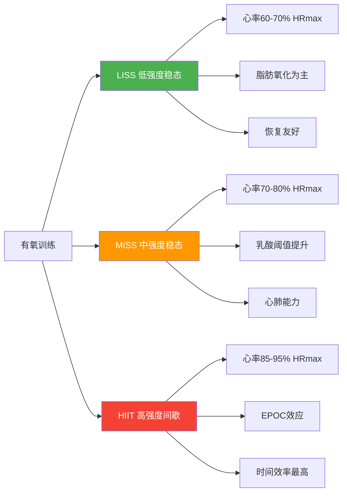

## 三、有氧训练安排

有氧训练是整体训练计划中不可或缺的一环。对增肌期而言，有氧维持心肺健康、促进恢复、控制体脂；对减脂期而言，有氧是创造热量缺口的核心手段之一。本节将有氧训练从分类、强度控制到具体方案逐层展开，确保你能根据自身阶段灵活安排。

---

### 3.1 有氧训练的三大类型

根据强度和持续模式，有氧训练分为三类。每种类型训练的能量系统不同，适应效果也不同，不能互相替代。

#### LISS（Low-Intensity Steady State，低强度稳态有氧）

- **心率范围**：60-70% HRmax（约 115-134 bpm，以28岁为例）
- **持续时间**：30-60 分钟
- **频率**：每周 3-5 次
- **典型方式**：快走、椭圆机低阻力、自行车轻松骑、游泳慢速、划船机低阻力
- **主观感受**：轻松，可以用鼻子呼吸，能完整说一句话不喘气
- **能量来源**：以脂肪氧化为主（约 60-70% 能量来自脂肪）
- **核心价值**：
  - 建立有氧基础，优化线粒体功能
  - 几乎不产生额外疲劳，不影响力量训练恢复
  - 适合在力量训练后立即进行
  - 心理压力小，容易坚持

#### MISS（Medium-Intensity Steady State，中强度稳态有氧）

- **心率范围**：70-80% HRmax（约 134-154 bpm）
- **持续时间**：20-40 分钟
- **频率**：每周 2-3 次
- **典型方式**：慢跑、动感单车中等阻力、椭圆机中阻力、游泳中速
- **主观感受**：中等，说话开始有些吃力，呼吸明显加快
- **能量来源**：脂肪和糖原各占约 50%
- **核心价值**：
  - 提升乳酸阈值，改善有氧耐力
  - 热量消耗比 LISS 更高
  - 心肺适应效果更好
- **注意**：强度处于"不上不下"的尴尬区间——对减脂不如 LISS 高效（因为脂肪供比下降），对心肺提升不如 HIIT 彻底。适合有一定训练基础、追求心肺能力的人。

#### HIIT（High-Intensity Interval Training，高强度间歇训练）

- **心率范围**：85-95% HRmax（约 163-182 bpm）
- **持续时间**：15-25 分钟（含热身冷却）
- **频率**：每周 1-2 次（不超过 2 次）
- **典型方式**：冲刺跑、战绳、波比跳、动感单车冲刺、划船机冲刺
- **主观感受**：非常困难，无法说完整句子，每组冲刺后需要大口喘气
- **能量来源**：以糖原和磷酸肌酸为主
- **核心价值**：
  - EPOC（运动后过量氧耗）效应显著，运动结束后 24-48 小时仍维持较高代谢率
  - 时间效率最高——20 分钟 HIIT 的总热量消耗（含 EPOC）接近 45 分钟 LISS
  - 最大程度提升 VO2max
- **注意**：对恢复需求高，不能安排在腿日前后，每周不超过 2 次



### 3.2 心率区间与自我监控

心率是有氧训练最实用的强度指标。你不需要昂贵的实验室设备，一块心率手表或心率带就能精确控制训练强度。

#### 最大心率估算

| 公式 | 计算方法 | 28岁结果 | 精度 |
|------|---------|---------|------|
| 传统公式 | 220 - 年龄 | 192 bpm | ±10 bpm，偏粗糙 |
| Tanaka公式 | 208 - 0.7 × 年龄 | 188 bpm | ±5 bpm，更准确 |
| 实测法 | 递增负荷跑到力竭 | 需实测 | 最准确 |

> **建议**：初期用 Tanaka 公式（188 bpm）作为基准。训练 2-3 个月后，找一次安全的环境做递增负荷测试（跑步机每 2 分钟提速 1 km/h，直到无法继续），记录最高心率作为个人基准。

#### 心率区间对照表（以 HRmax = 188 bpm 计算）

| 区间 | %HRmax | 心率范围 | 主观感受 | 训练效果 | 适合场景 |
|------|--------|---------|---------|---------|---------|
| **Zone 1 恢复区** | 50-60% | 94-113 bpm | 非常轻松，正常聊天 | 恢复性训练、热身冷却 | 休息日主动恢复 |
| **Zone 2 燃脂区** | 60-70% | 113-132 bpm | 轻松，完整句子 | 脂肪氧化、有氧基础 | LISS 训练 |
| **Zone 3 有氧区** | 70-80% | 132-150 bpm | 中等，说话困难 | 有氧能力、乳酸阈值 | MISS 训练 |
| **Zone 4 无氧阈** | 80-90% | 150-169 bpm | 困难，只能说几个词 | 无氧能力、速度耐力 | HIIT 工作期 |
| **Zone 5 最大区** | 90-100% | 169-188 bpm | 极限，无法说话 | VO2max 峰值输出 | 短冲刺、测试 |

#### 实用心率监控方法

**方法一：心率设备（推荐）**
- **入门**：小米手环/华为手环（100-200 元），光电心率精度 ±3-5 bpm，足够日常使用
- **进阶**：Polar H10 心率带（精度 ±1 bpm），配合任何支持蓝牙的手表
- **高端**：Garmin Forerunner / Apple Watch，内置心率 + GPS + 训练分析

**方法二：说话测试（无设备时）**
- 能完整唱歌 → Zone 1 以下
- 能说完整句子 → Zone 2（113-132 bpm）
- 能说短句但需要喘气 → Zone 3（132-150 bpm）
- 只能说几个词 → Zone 4（150-169 bpm）
- 无法说话 → Zone 5

**方法三：手动测量**
- 运动暂停后立即用食指和中指按压颈动脉或桡动脉
- 计数 15 秒的心跳次数 × 4 = 每分钟心率
- 缺点：需要中断训练，且停止后心率会快速下降，结果偏保守

### 3.3 HIIT 具体协议

HIIT 不是"拼命跑"就行，科学的间歇协议能最大化训练效果，同时降低受伤风险。以下是经过验证的几种经典协议：

#### Tabata 协议（经典 4 分钟）

| 参数 | 值 |
|------|-----|
| 工作时间 | 20 秒全力冲刺 |
| 休息时间 | 10 秒完全休息 |
| 重复次数 | 8 轮 |
| 总时间 | 4 分钟 |
| 强度 | 170%+ VO2max（极限） |
| 适合人群 | 有训练基础者，不推荐新手 |

#### 4×4 挪威协议（最有效提升 VO2max）

| 参数 | 值 |
|------|-----|
| 工作时间 | 4 分钟 @ 90-95% HRmax |
| 休息时间 | 3 分钟 @ 60-70% HRmax（主动恢复） |
| 重复次数 | 4 轮 |
| 总时间 | 约 28 分钟（含热身冷却） |
| 强度 | 高 |
| 适合人群 | 有至少 2 个月训练基础者 |

#### 30-30 间歇（新手友好）

| 参数 | 值 |
|------|-----|
| 工作时间 | 30 秒 @ 85-90% HRmax |
| 休息时间 | 30 秒 @ 60% HRmax（慢走/慢骑） |
| 重复次数 | 10-15 轮 |
| 总时间 | 10-15 分钟 |
| 强度 | 中高 |
| 适合人群 | HIIT 新手首选 |

#### 推荐选择

- **前 3 个月**：用 30-30 间歇，培养间歇训练的节奏感
- **3-6 个月**：过渡到 4×4 挪威协议，系统提升 VO2max
- **6 个月以上**：可以尝试 Tabata 或自定义间歇比例

**HIIT 注意事项**：
- 必须有 5-10 分钟热身（从 Zone 1 逐步升到 Zone 3）再开始间歇
- 结束后必须有 5 分钟冷却（慢走，心率降到 120 bpm 以下）
- 不要在空腹状态下做 HIIT——低血糖风险高，运动表现也差
- 不要在力量训练（尤其腿日）当天做 HIIT
- 两次 HIIT 之间至少间隔 48 小时

### 3.4 有氧与力量训练的时间安排

有氧和力量训练的先后顺序、间隔时间直接影响两者的训练效果。核心原则是：**力量训练永远优先**。

#### 三种安排方式对比

| 安排方式 | 优点 | 缺点 | 适用场景 |
|---------|------|------|---------|
| **力量后立即有氧** | 节省总时间；糖原消耗后脂肪供比更高 | 有氧表现可能下降 10-15% | 时间紧张时首选 |
| **单独安排有氧日** | 两者互不干扰，各自发挥最佳 | 需要更多时间 | 有充足训练时间时 |
| **早晚分开** | 效果最佳，各自独立 | 对作息要求高，实际执行难度大 | 竞技运动员 / 高阶训练者 |

**绝对不要做的事**：力量训练前做有氧。这会提前消耗糖原，导致力量训练时无法达到应有的强度，直接降低增肌效果。

#### 具体时间间隔建议

- **力量后做有氧**：力量训练结束后 5 分钟内开始，趁肌肉还热着
- **分开安排**：间隔至少 6 小时（例如早上力量、晚上有氧）
- **HIIT 与力量**：绝不在同一天安排（除非是上肢力量 + 下肢 HIIT，但依然不推荐）

### 3.5 有氧方案选择

根据训练目标不同，有氧方案差异很大。以下是三种典型方案，覆盖增肌期、减脂期和新手起步期。

#### 方案 A：增肌为主、减脂为辅（推荐起步方案）

适合：体脂 18-22%，训练经验 < 6 个月，首要目标是增肌

| 项目 | 安排 |
|------|------|
| 力量训练 | 6 天/周（PPL × 2） |
| 有氧训练 | 3 次/周，每次 20-30 分钟 LISS |
| 有氧时机 | 力量训练后进行，或单独安排在休息日 |
| 有氧方式 | 椭圆机、快走、自行车（避免跑步以减少关节负担） |
| 心率目标 | 113-132 bpm（Zone 2） |

**为什么这个方案适合起步**：
- 有氧量不大，不会干扰增肌的恢复需求
- LISS 对关节友好，新手关节和肌腱尚未适应高冲击
- 建立有氧习惯，为后期增加强度打基础

#### 方案 B：减脂为主

适合：体脂 > 20%，需要快速降低体脂，同时尽量保留肌肉

| 项目 | 安排 |
|------|------|
| 力量训练 | 4-5 天/周 |
| 有氧训练 | 5 次/周（3 次 LISS + 2 次 HIIT） |
| LISS 安排 | 30-40 分钟/次，可每天做 |
| HIIT 安排 | 20 分钟/次，安排在非腿日 |
| 心率目标 | LISS: 113-132 bpm / HIIT: 150-182 bpm |

**减脂期有氧的关键**：
- 不要只靠有氧减脂——热量赤字（饮食控制）才是根本，有氧只是辅助
- HIIT 的 EPOC 效应能在运动后 24-48 小时额外消耗 50-200 kcal
- 减脂期力量训练不能停，否则流失的不只是脂肪，还有肌肉

#### 方案 C：前 3 个月推荐方案

考虑到 28 岁、普通身高、67kg、体脂约 20-22%、训练新手的综合情况，采用方案 A 为基础，配合 PPL 六天训练：

```text
周一：推日（力量训练）+ 20 分钟椭圆机（Zone 2）
周二：拉日（力量训练）
周三：腿日（力量训练）
周四：30 分钟快走（主动恢复，Zone 1）
周五：推日（力量训练）+ 20 分钟椭圆机（Zone 2）
周六：拉日（力量训练）
周日：完全休息或 30 分钟散步
```

**周训练量统计**：
- 力量训练：6 次/周，约 7-8 小时
- 有氧训练：4 次/周（2 次 LISS + 1 次主动恢复 + 1 次散步），约 2 小时
- 总训练时间：约 9-10 小时/周

### 3.6 不同训练阶段的有氧调整

有氧方案不是一成不变的。随着训练经验和体脂变化，需要动态调整。

#### 阶段性调整路线图

| 阶段 | 时间 | 体脂目标 | 有氧方案 | 调整依据 |
|------|------|---------|---------|---------|
| **适应期** | 第 1-3 个月 | 20%→18% | 方案 A（3 次 LISS/周） | 新手优先建立运动习惯 |
| **进阶期** | 第 4-6 个月 | 18%→16% | 增加到 4 次（3 LISS + 1 HIIT） | 适应后提升强度 |
| **强化期** | 第 7-12 个月 | 16%→14% | 按需切换方案 A 或 B | 根据增肌/减脂阶段选择 |
| **维持期** | 12 个月后 | 12-15% | 3-4 次/周，灵活安排 | 体脂达标后减少有氧量 |

#### 何时增加有氧量

- 连续 2 周体重/体脂不再下降，且饮食已严格执行 → 增加 1 次 LISS 或 1 次 HIIT
- 体脂到达目标值 → 逐步减少到维持量（3 次/周 LISS）

#### 何时减少有氧量

- 力量训练表现持续下降（推举重量倒退、组数做不到） → 有氧可能过量，减少 1 次
- 持续感到疲劳、睡眠质量下降 → 恢复不足，优先减有氧
- HIIT 后 48 小时仍然肌肉酸痛 → 降低 HIIT 频率或强度

### 3.7 步行——被严重低估的有氧方式

在所有有氧方式中，步行的性价比最高。它不需要任何设备、不需要换装、不产生额外疲劳，却能实实在在地提升每日热量消耗。

#### 步行的热量消耗

| 步数 | 大约距离 | 额外热量消耗 | 等效食物 |
|------|---------|------------|---------|
| 6,000 步 | 4.2 km | 150-200 kcal | 1 个苹果 + 1 杯牛奶 |
| 8,000 步 | 5.6 km | 200-300 kcal | 1 碗米饭 |
| 10,000 步 | 7 km | 300-400 kcal | 1 份鸡胸肉沙拉 |
| 12,000 步 | 8.4 km | 350-500 kcal | 约 1 小时慢跑的热量 |

> 以上数据基于 67kg 体重、正常步速（5 km/h）估算，实际消耗因步速、地形、体重而异。

#### 步行的核心优势

1. **零疲劳成本**：不像跑步会增加腿部肌肉疲劳，步行几乎不影响力量训练恢复
2. **关节友好**：没有跑步的冲击力，膝盖和踝关节不会额外负担
3. **日常可嵌入**：通勤走路、午休散步、晚饭后遛弯——不需要专门腾出时间
4. **心理无压力**：不需要换运动装、不需要热身、不会出汗到需要洗澡
5. **长期可坚持**：跑步可能因为膝盖疼、天气差等原因中断，步行几乎没有"不能做"的理由

#### 如何将步行融入日常

| 场景 | 做法 | 预计增加步数 |
|------|------|------------|
| 通勤 | 提前 1-2 站下车步行 | +2,000-3,000 步 |
| 午休 | 饭后步行 15-20 分钟 | +1,500-2,000 步 |
| 晚饭后 | 散步 20-30 分钟 | +2,000-3,000 步 |
| 工作间隙 | 每小时起身走动 5 分钟 | +1,000-2,000 步 |
| 接打电话 | 边走边聊 | +500-1,000 步 |

**目标**：日常活动步数达到 8,000-10,000 步/天。这不包括专门的有氧训练时间。

#### 步行进阶：坡度快走

当普通步行变得太轻松时，可以在跑步机上做坡度快走：

| 参数 | 设置 |
|------|------|
| 速度 | 5.5-6.5 km/h |
| 坡度 | 5-10% |
| 时间 | 20-30 分钟 |
| 心率 | 120-140 bpm（Zone 2-3 之间） |
| 热量消耗 | 约 250-350 kcal/30 分钟 |

坡度快走的燃脂效率接近慢跑，但对膝盖的冲击力只有跑步的 1/3，是增肌期最理想的有氧方式之一。

### 3.8 有氧设备选择与使用指南

不同有氧设备对关节的冲击、热量消耗、肌肉参与度各不相同。选择适合自己的设备能提高训练效果和舒适度。

#### 设备对比

| 设备 | 关节冲击 | 热量消耗 | 肌肉参与 | 适合场景 | 推荐指数 |
|------|---------|---------|---------|---------|---------|
| **椭圆机** | 极低 | 中等 | 全身（手臂参与） | 力量训练后有氧 | ★★★★★ |
| **自行车** | 极低 | 中等 | 下肢为主 | 腿部恢复日 | ★★★★☆ |
| **划船机** | 低 | 较高 | 全身（背部参与） | 拉日搭配 | ★★★★☆ |
| **跑步机快走** | 低 | 中等 | 下肢 | 坡度快走燃脂 | ★★★★☆ |
| **跑步机跑步** | 高 | 高 | 下肢 | 减脂期专用 | ★★★☆☆ |
| **游泳** | 极低 | 较高 | 全身 | 关节问题者首选 | ★★★★☆ |
| **跳绳** | 高 | 极高 | 下肢 + 核心 | 短时高效 | ★★☆☆☆ |

#### 各设备使用要点

**椭圆机**：
- 阻力设置：力量训练后用 6-8 档（12 档制），休息日可用 8-10 档
- 注意事项：脚掌全程贴合踏板，不要踮脚；手臂推拉要到位，不要只是搭着
- 心率校准：椭圆机显示的卡路里通常偏高 20-30%，以心率为准

**自行车（固定式）**：
- 座椅高度：踩到最低点时膝盖微弯（约 170 度）
- 阻力设置：保持踏频 80-100 rpm，通过阻力调节强度
- 注意事项：上半身保持稳定，不要左右摇晃

**划船机**：
- 动作顺序：腿→腰→手臂（拉），手臂→腰→腿（放）
- 阻力设置：新手用 4-5 档（10 档制），不要追求大阻力
- 常见错误：用手臂硬拉、腰部过度后仰、节奏混乱

### 3.9 有氧训练的常见误区

#### 误区一：有氧必须做满 30 分钟才开始燃脂

**真相**：脂肪从运动第一分钟就在参与供能。只是在低强度时脂肪供比更高（约 60-70%），高强度时糖原供比更高。总热量消耗才是决定减脂效果的关键——20 分钟 HIIT 的总热量消耗（含 EPOC）可能超过 40 分钟慢跑。

#### 误区二：空腹有氧燃脂效率更高

**真相**：空腹状态下脂肪氧化比例确实更高，但研究表明 24 小时总脂肪氧化量并无显著差异。空腹有氧的风险包括：低血糖导致头晕、力量下降、肌肉分解增加。如果一定要空腹做，只做 Zone 1-Zone 2 的低强度有氧（如散步），不超过 30 分钟。

#### 误区三：跑步会掉肌肉

**真相**：适量的 LISS（每周 3-4 次、每次 20-30 分钟）不会导致肌肉流失。真正掉肌肉的原因是：热量赤字过大 + 蛋白质摄入不足 + 有氧量过大（每周跑步超过 30-40 公里）。控制好有氧量和饮食，跑步和增肌可以并行。

#### 误区四：出汗多 = 燃脂多

**真相**：出汗是体温调节机制，与脂肪消耗没有直接关系。裹保鲜膜、穿暴汗服只会让你脱水，不会让你多消耗脂肪。脱水反而会降低运动表现，减少实际热量消耗。

#### 误区五：有氧训练后不能吃东西，否则白练了

**真相**：30 分钟 LISS 消耗约 200-300 kcal，你不可能通过"不吃"来放大这个数字。训练后补充适量蛋白质和碳水（如一根香蕉 + 一杯牛奶，约 200 kcal）反而有助于恢复和肌肉保留。

### 3.10 有氧训练的渐进策略

和力量训练一样，有氧训练也需要渐进超负荷——持续增加训练刺激才能持续获得适应。但有氧的渐进方式和力量训练不同。

#### 渐进优先级（按顺序执行）

1. **先增加时间**：从 20 分钟 → 30 分钟 → 40 分钟（LISS）
2. **再增加频率**：从 3 次/周 → 4 次/周 → 5 次/周
3. **最后增加强度**：提高心率区间或引入 HIIT

#### 具体渐进计划

| 周次 | LISS 时间 | LISS 频率 | HIIT | 总有氧时间 |
|------|----------|----------|------|----------|
| 第 1-4 周 | 20 分钟 | 3 次/周 | 无 | 60 分钟/周 |
| 第 5-8 周 | 25 分钟 | 3 次/周 | 无 | 75 分钟/周 |
| 第 9-12 周 | 30 分钟 | 3 次/周 | 无 | 90 分钟/周 |
| 第 13-16 周 | 30 分钟 | 3 次/周 | 1 次（15 分钟） | 105 分钟/周 |
| 第 17 周起 | 30 分钟 | 3-4 次/周 | 1-2 次（20 分钟） | 110-160 分钟/周 |

**不要跳步**：每次只调整一个变量（时间、频率或强度），稳定 2-3 周后再调整下一个。

### 3.11 本节要点

1. **三种有氧各有定位**：LISS 做基础、MISS 做提升、HIIT 做突破，不可互相替代
2. **心率是核心指标**：用 Tanaka 公式估算 HRmax，配合心率设备精确控制训练区间
3. **力量永远优先**：有氧安排在力量训练后或单独安排在休息日，绝不在力量前做
4. **前 3 个月用方案 A**：3 次/周 LISS，每次 20-30 分钟，够用且不干扰增肌
5. **步行是最好的隐形有氧**：日行 8,000-10,000 步，零疲劳成本，积少成多
6. **有氧也要渐进**：先加时间 → 再加频率 → 最后加强度，每次只变一个变量
7. **设备优先选椭圆机**：关节冲击最低、全身参与、力量训练后直接可用
8. **别踩误区**：出汗不等于燃脂、空腹有氧不更高效、适量有氧不掉肌肉

***
