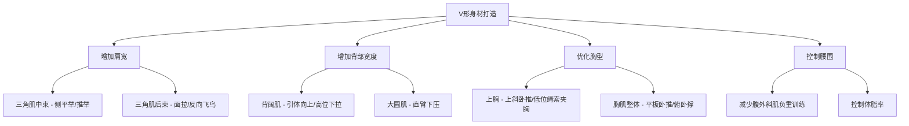

## 四、针对矮个子的塑形策略

身高普通身高、55开身材比例——很多人会把这当作"先天劣势"。但从运动生物力学和视觉美学两个角度看，这个体型有独特的塑造路径。本节将从优势分析、V形身材打造、腿部策略、比例优化训练、体脂管理、穿搭配合到常见误区，逐层展开一套完整的矮个子塑形体系。

---

### 4.1 矮个子的身材优势：生物力学视角

很多矮个子健身者带着"补偿心理"走进健身房，觉得自己天生吃亏。但运动生物力学的研究表明，矮个子在力量训练中有若干结构性优势，这些优势不是安慰剂，而是可量化的力学事实。

#### 杠杆优势

杠杆原理是力量训练的核心物理基础。在杠铃深蹲中，阻力矩 = 杠铃重量 × 力臂长度。力臂长度取决于肢体长度——股骨越短，髋关节到杠铃的水平距离越小，力臂越短，所需的髋关节力矩就越小。

**具体数据**：
- 一个身高普通身高、股骨长约42cm的人，深蹲时髋关节力臂约为身高185cm、股骨长约48cm的人的87%
- 这意味着在相同的杠铃重量下，矮个子的髋关节需要产生的力矩更小
- 实际训练中，矮个子往往能在更短时间内达到更高的深蹲/体重比（例如2倍体重深蹲）

**受影响的主要动作**：

| 动作 | 杠杆优势体现 | 优势幅度 |
|------|-------------|---------|
| 深蹲 | 股骨短→力臂短→髋关节力矩小 | 显著 |
| 卧推 | 上臂短→运动行程短→做功距离短 | 显著 |
| 硬拉 | 躯干短→背部力臂短→腰椎压力小 | 中等 |
| 肩推 | 上臂短→锁定距离短→肩关节负荷周期短 | 中等 |
| 引体向上 | 躯干+腿总长短→自重较轻 | 轻微 |

#### 运动行程优势

卧推是最典型的例子。在标准卧推中，杠铃从胸口到锁定的垂直距离取决于臂长。身高普通身高的人上臂约30cm，而185cm的人上臂约35cm——这5cm的差距意味着每组少做约15%的机械功。在大重量训练中，这个差距被放大：同样推100kg，矮个子每组少做约1500焦耳的功，累积疲劳更低，组间恢复更快。

#### 视觉冲击力

肌肉增长的视觉效果与体表面积有关。体表面积 ≈ 0.007184 × 身高(cm)^0.725 × 体重(kg)^0.425。身高越小，同样的肌肉量在更小的体表上"堆叠"，视觉上显得更饱满。

**实际意义**：增肌10kg后，普通身高的人看起来比185cm的人"壮"约20-25%（以肩宽/腰围比衡量）。这不是主观感受，而是几何学的结果——肌肉体积相同，截面面积与身高的平方成反比。

#### 重心与稳定性优势

重心高度直接影响稳定性。重心越低，在深蹲、硬拉、过头推举等需要抗旋转/抗侧屈的动作中越稳定。普通身高的重心高度约93cm，而185cm约104cm——11cm的重心差距在大重量深蹲中意味着显著更好的平衡能力。

---

### 4.2 V形身材的打造策略

55开比例的核心视觉问题不是"腿短"，而是**上下半身宽度差不够大**。标准"好身材"的肩腰比约为1.618（黄金比例），而大多数55开身材的人肩腰比在1.3-1.4之间。训练的核心目标是：**把肩宽推上去，把腰围控制住**。



#### 4.2.1 三角肌中束：肩宽的第一优先级

三角肌中束是决定肩宽的直接肌群。中束发达的肩部从正面看有明显的"球形"轮廓，视觉上直接拓宽肩线。

**最佳动作选择**：

**1. 哑铃侧平举**
- **目标肌群**：三角肌中束为主，上斜方肌为辅
- **执行要点**：
  - 站立位，双脚与肩同宽，膝盖微屈
  - 手臂微屈（约15°），避免肘关节锁死
  - 以肩关节为轴心，向两侧举起哑铃至肩高
  - 举起时小指略高于拇指（内旋位），更好激活中束
  - 下放时控制离心，不要自由落体
- **常见错误**：
  - 耸肩——用斜方肌代偿，降低中束刺激。解决：想象"把手往外推"而不是"往上抬"
  - 重量太大——借力摆动，变成"体侧提拉"。解决：选择能控制12-15次的重量
  - 手臂完全伸直——肘关节压力大。解决：保持15°微屈
- **训练参数**：
  - 组数：每周12-15组（分3-4次训练）
  - 次数：12-15次（中束是慢肌纤维主导，高次数效果更好）
  - 组间休息：60-90秒
  - 渐进策略：先增加次数到20次，再加重回到12次

**2. 机械侧平举（Cable Lateral Raise）**
- **优势**：全程张力恒定（哑铃在底部几乎无负荷），肌肉激活更充分
- **执行要点**：站在龙门架侧面，单手持把，从体侧向外拉至肩高
- **适合场景**：作为哑铃侧平举的替代或补充动作

**3. 器械侧平举（Machine Lateral Raise）**
- **优势**：固定轨迹，适合新手学习发力模式
- **适合场景**：训练初期学习阶段，或作为最后一组的"力竭组"

#### 4.2.2 背阔肌：V形的"翅膀"

背阔肌是人体最大的肌肉之一，从肩胛骨下角延伸到髂嵴，是形成V形的"翅膀"。背阔肌发达的人从正面看，腋下到腰有明显的向内收窄线条。

**最佳动作选择**：

**1. 引体向上（Pull-up）**
- **目标肌群**：背阔肌、大圆肌、肱二头肌、菱形肌
- **执行要点**：
  - 握距略宽于肩（约1.2-1.5倍肩宽）
  - 起始位：手臂完全伸展，肩胛骨上提
  - 发力顺序：先下沉肩胛骨（"把肩膀塞进口袋"），再屈肘拉起
  - 拉至下巴过杠或胸部触杠
  - 下放时控制离心（2-3秒），完全伸展
- **渐进策略**：
  - 阶段1：体重引体做满8次 → 进入阶段2
  - 阶段2：负重引体，从+2.5kg开始，每组5-8次
  - 阶段3：负重达到体重的30%时，引入不同握法变化
- **替代动作**：体重做不了8次时，用弹力带辅助或器械高位下拉过渡

**2. 高位下拉（Lat Pulldown）**
- **优势**：可精确调节重量，适合各阶段训练者
- **执行要点**：
  - 握距与引体向上一致
  - 身体微后倾（约15-20°）
  - 下拉至锁骨水平，挤压背部1-2秒
  - 回放时充分伸展背阔肌
- **与引体向上的关系**：高位下拉是引体向上的"退阶版"，负重引体是"进阶版"。优先练习引体向上，高位下拉作为补充容量

**3. 直臂下压（Straight-Arm Pulldown）**
- **价值**：孤立训练背阔肌，去除手臂代偿
- **执行要点**：站在龙门架前，双手握直杆，手臂微屈，从头顶前方下压至大腿前
- **适合场景**：作为背部训练的收尾动作，做15-20次高次数

#### 4.2.3 三角肌后束：被忽视的肩宽要素

很多人只关注中束，但后束对肩宽的贡献不可忽视。后束发达时，肩部从侧面和后面看都有饱满的轮廓，整体肩部更"立体"。

**最佳动作**：
- **面拉（Face Pull）**：绳索滑轮设在面部高度，双手拉向面部两侧，外旋至大拇指朝后。每周4组×15-20次
- **反向飞鸟（Reverse Fly）**：俯身或坐姿器械，双手向两侧展开。每周3组×12-15次
- **绳索后束划船**：单臂，绳索设在腰部高度，向后上方拉至耳朵位置

#### 4.2.4 胸肌优化：上胸优先

55开比例的人通常胸腔较短，平板卧推容易让胸肌显得"下垂"。上胸（锁骨部）发达时，胸型更挺拔，穿衣服时领口有自然的胸肌轮廓。

**最佳动作**：
- **上斜杠铃/哑铃卧推**：上斜角度30°（不是45°，45°太多三角肌前束参与）。每周4组×8-12次
- **低位绳索夹胸**：绳索设在最低位，向斜上方夹，角度与上胸纤维方向一致。每周3组×12-15次
- **俯卧撑（脚部抬高）**：脚放在凳子上，手在地面，相当于自重上斜推。适合在家补充训练

#### 4.2.5 腰围控制

V形的"V"不仅靠肩宽，还靠腰细。控制腰围有两个层面：

1. **体脂管理**：腰腹是男性脂肪最先堆积的区域，体脂每降1%，腰围约减0.5-1cm
2. **避免腰腹过度增肌**：
   - 减少负重体侧屈（练腹外斜肌会让腰变粗）
   - 减少负重转体（同理）
   - 腹肌训练以自重为主：悬垂举腿、卷腹、平板支撑
   - 腹外斜肌可做自重转体或Pallof Press（抗旋转训练），不额外加负重

---

### 4.3 腿部训练策略：有型但不过粗

55开比例的腿部训练目标不是"越粗越好"，而是**线条清晰、比例协调**。核心原则：保持深蹲（全身性复合动作不可替代），但调整孤立动作的侧重。

#### 4.3.1 深蹲：照常练，但关注细节

深蹲是"动作之王"，对全身激素分泌、核心稳定性、整体力量都有不可替代的作用。55开比例的人不应该跳过深蹲，但可以做一些调整：

- **站距**：略宽于肩（1.2-1.3倍肩宽），脚尖外展15-30°。宽站距更多激活臀部和内收肌，减少股四头肌前侧的孤立刺激
- **深度**：至少到大腿平行（髋低于膝），全蹲更好。深度越大，臀部参与越多
- **杠位**：高杠位（斜方肌上）或低杠位（三角肌后束上）都可以。低杠位更偏髋主导，对股四头肌前侧压力稍小
- **频率**：每周1-2次，3-5组×5-8次（偏力量）或8-12次（偏肌肥大）

#### 4.3.2 臀部训练：拉长下半身视觉比例

臀部是连接躯干和腿部的"枢纽"。臀部翘而饱满时，从侧面看下半身的"起点"上移，视觉上拉长了腿部。这是55开比例改善下半身观感的关键。

**推荐动作**：
- **臀推（Hip Thrust）**：背部靠在凳子上，杠铃放在髋部，向上推起。每周3组×10-12次
  - 顶峰收缩2秒，挤压臀部
  - 下放时不要让臀部完全触地，保持张力
- **臀桥（Glute Bridge）**：臀推的简化版，躺在地上做。适合热身或收尾
- **罗马尼亚硬拉**：臀部和股二头肌协同发力。每周3组×10-12次
  - 膝盖微屈，髋部后推，感受臀部和大腿后侧的拉伸
- **保加利亚分腿蹲**：单腿动作，对臀部激活极高。每侧3组×10次

#### 4.3.3 股二头肌：后侧链的线条感

股二头肌发达时，大腿从侧面看有清晰的"弧线"，而不是只有前侧的"方块"。后侧链的训练还能预防膝关节伤病（前后肌力平衡）。

**推荐动作**：
- **俯卧腿弯举（Lying Leg Curl）**：每周3组×10-12次
- **罗马尼亚硬拉**：（与臀部训练重叠，一次训练同时练两个目标）
- **北欧腿弯举（Nordic Curl）**：自重动作，难度较高，膝盖跪在软垫上，身体前倾，控制下放。做不了全程可以做半程或用弹力带辅助

#### 4.3.4 股四头肌：适度而非过度

股四头肌是大腿前侧的"大块头"。对于55开比例，股四头肌前侧（股直肌、股外侧肌）过度发达会让大腿从正面看过于突出，破坏腿部线条。

**调整策略**：
- **保留深蹲**（已包含股四头肌训练）
- **减少或去掉腿屈伸（Leg Extension）**：这个动作孤立刺激股四头肌前侧，容易造成"大腿前侧鼓包"
- **用腿举替代**：腿举（Leg Press）是多关节动作，负荷分散到臀部和股四头肌，不会过度孤立前侧
- **站距调整**：腿举时脚放高位、宽站距，更多激活臀部和内收肌

#### 4.3.5 小腿：宁细勿粗

小腿过粗会让小腿肚的最高点下移，视觉上缩短小腿长度。对于矮个子，小腿训练的目标是"有型"——线条修长、有清晰的跟腱线条，而不是"粗壮"。

**调整策略**：
- **训练频率**：每周1次，2-3组即可
- **动作选择**：站姿提踵（腓肠肌）+ 坐姿提踵（比目鱼肌），每组15-20次
- **不要追求大重量**：小腿是日常负重行走的肌肉，已经有一定基础，不需要额外大量刺激
- **拉伸更重要**：训练后充分拉伸小腿，保持肌肉弹性，线条更修长

#### 4.3.6 小结：腿部训练优先级矩阵

| 肌群 | 优先级 | 每周组数 | 原因 |
|------|--------|---------|------|
| 臀部 | ★★★★★ | 9-12组 | 拉长下半身比例，提升侧面观感 |
| 股二头肌 | ★★★★ | 6-9组 | 后侧链线条，膝关节保护 |
| 股四头肌 | ★★★（通过深蹲） | 6-8组（深蹲内含） | 保持基础力量，不过度孤立 |
| 小腿 | ★★ | 2-3组 | 维持线条，不过度增粗 |
| 内收肌 | ★★★ | 3-4组 | 宽站距深蹲已包含 |

---

### 4.4 比例优化的训练调整

在标准PPL（Push-Pull-Legs）计划基础上，针对55开比例做以下具体调整。调整的核心原则是：**增强上半身视觉宽度，控制下半身过度增粗**。

#### 标准PPL vs 优化PPL对比

| 动作 | 标准PPL | 优化PPL | 调整原因 |
|------|---------|---------|---------|
| 侧平举 | 3组 | **4-5组** | 增加肩宽，最高优先级 |
| 面拉 | 3组 | **4组** | 后三角肌发达显肩宽，改善圆肩 |
| 引体向上 | 4组 | **4组（含负重）** | V形身材关键动作，保持并进阶 |
| 背阔肌下拉 | 4组 | **3组** | 引体向上足够时作为补充 |
| 上斜卧推 | 3组 | **4组** | 上胸优先，改善胸型 |
| 平板卧推 | 4组 | **3组** | 降低优先级，让位给上斜 |
| 臀桥/髋推 | 不含 | **加入3组** | 拉长下半身视觉比例 |
| 罗马尼亚硬拉 | 不含或偶尔 | **加入3组** | 后侧链线条 |
| 腿屈伸 | 3组 | **去掉或减为2组** | 避免大腿前侧过粗 |
| 小腿训练 | 4组 | **2-3组** | 宁细勿粗 |
| 直臂下压 | 不含 | **加入3组** | 孤立背阔肌，增强V形 |

#### 每周训练安排示例

```text
周一：推日（Push）
  1. 上斜杠铃卧推       4×8-10
  2. 平板哑铃卧推       3×10-12
  3. 哑铃肩推           3×10-12
  4. 侧平举             4×15（最后一组做drop set）
  5. 低位绳索夹胸       3×12-15
  6. 绳索下压           3×12-15

周二：拉日（Pull）
  1. 负重引体向上       4×6-8
  2. 杠铃划船           3×8-10
  3. 坐姿绳索划船       3×10-12
  4. 面拉               4×15-20
  5. 直臂下压           3×12-15
  6. 哑铃弯举           3×10-12

周三：腿日（Leg）
  1. 深蹲               4×6-8
  2. 罗马尼亚硬拉       3×10-12
  3. 臀推               3×10-12
  4. 保加利亚分腿蹲     3×10（每侧）
  5. 俯卧腿弯举         3×10-12
  6. 站姿提踵           2×15-20

周四：休息

周五：推日（Push）——变化动作
  1. 哑铃上斜卧推       4×10-12
  2. 器械推胸           3×12
  3. 阿诺德推举         3×10-12
  4. 侧平举             4×12-15（绳索版）
  5. 蝴蝶机夹胸         3×12-15
  6. 俯身哑铃臂屈伸     3×10-12

周六：拉日（Pull）——变化动作
  1. 引体向上（宽握）   4×力竭
  2. 单臂哑铃划船       3×10-12
  3. 高位下拉           3×10-12
  4. 反向飞鸟           3×12-15
  5. 绳索弯举           3×12
  6. 锤式弯举           3×10

周日：腿日（Leg）——变化动作
  1. 前蹲               3×8-10
  2. 腿举（高位宽距）   3×12
  3. 单腿臀推           3×10（每侧）
  4. 北欧腿弯举         3×6-8（或弹力带辅助）
  5. 坐姿提踵           2×15-20
```

---

### 4.5 体脂管理：穿衣显瘦、脱衣有肉

对于普通身高的男性，健身的终极视觉目标可以概括为六个字：**穿衣显瘦、脱衣有肉**。这个目标需要同时满足两个条件：肌肉量足够 + 体脂率足够低。

#### 4.5.1 目标体脂率

| 体脂率范围 | 视觉效果 | 适合阶段 |
|-----------|---------|---------|
| 20-25% | 穿衣显胖，肌肉线条不可见 | 需要减脂 |
| 16-20% | 穿衣正常，隐约有胸肌轮廓 | 减脂中期 |
| 13-16% | 穿衣显瘦，脱衣有肌肉线条 | 增肌期维持 |
| 10-13% | 腹肌清晰可见，血管明显 | 减脂目标/夏天状态 |
| <10% | 极度干瘦，力量和免疫力下降 | 竞赛状态，不建议长期维持 |

**对普通身高男性的建议**：长期维持在13-16%是最优区间。这个体脂率下：
- 穿衣服不会显臃肿
- 脱衣服有清晰的肌肉线条
- 力量和运动表现不受影响
- 激素水平（睾酮等）处于健康范围

#### 4.5.2 目标体重规划

基于普通身高身高、当前67kg（体脂约20-22%）的起点：


**各阶段策略**：

**阶段1：减脂期（0-6个月）**
- 热量缺口：每天-300~-500kcal
- 蛋白质：1.6-2.0g/kg体重（107-134g/天）
- 训练：力量训练保持强度不降，有氧增加2-3次LISS
- 目标：每4周减重0.5-1kg，同时保持力量水平

**阶段2：体态重组（6-12个月）**
- 热量：维持或微盈余（+100~200kcal）
- 蛋白质：1.8-2.2g/kg体重
- 训练：力量训练为主，有氧维持心肺
- 目标：体重回升但体脂率继续下降（肌肉增加、脂肪减少同时进行）

**阶段3：增肌期（12-18个月）**
- 热量盈余：每天+200~400kcal（干净增肌，不要脏增肌）
- 蛋白质：1.6-2.0g/kg体重
- 训练：高强度力量训练，逐渐增加负荷
- 目标：每月增重0.5-1kg，体脂率控制在15%以内

#### 4.5.3 腰臀比：比BMI更靠谱的身体指标

对于矮个子，BMI容易高估肥胖程度（因为身高在分母的平方项）。腰臀比（WHR）是更精准的指标：

- **测量方法**：腰围（肚脐水平）÷ 臀围（臀部最宽处）
- **男性目标**：< 0.85（良好）→ < 0.80（优秀）
- **当前估算**：假设腰围约82cm、臀围约95cm，WHR ≈ 0.86，需要改善
- **改善路径**：减脂降腰围 + 臀部训练增臀围

---

### 4.6 穿搭配合训练：视觉比例的"外挂"

训练改变身体的实际比例需要数月甚至数年，但穿搭可以在几秒钟内改变视觉比例。对于普通身高的男性，穿搭的核心原则是：**上移视觉重心，拉长纵向线条**。

#### 4.6.1 裤装策略

| 选择 | 推荐 | 避免 | 原因 |
|------|------|------|------|
| 裤型 | 直筒或微锥形 | 紧身裤/阔腿裤 | 直筒修饰腿型，紧身暴露比例，阔腿压低重心 |
| 裤长 | 刚好盖住鞋面 | 堆叠/拖地 | 堆叠的裤脚视觉上"截断"腿部长度 |
| 腰线 | 中高腰 | 低腰 | 高腰线拉长腿部比例 |
| 颜色 | 深色（黑/深蓝/深灰） | 浅色/大面积花纹 | 深色收缩视觉，浅色膨胀 |
| 口袋 | 侧口袋简洁 | 大贴袋/工装口袋 | 贴袋增加大腿宽度视觉 |

#### 4.6.2 上装策略

| 选择 | 推荐 | 避免 | 原因 |
|------|------|------|------|
| 领口 | V领/圆领/U领 | 高领/立领 | V领拉长颈部线条 |
| 肩线 | 正肩或微宽肩 | 落肩/无肩线 | 正肩强化肩宽，落肩模糊肩线 |
| 长度 | 刚好到腰带或略低 | 过长盖住臀部 | 过长上衣缩短腿部视觉 |
| 合身度 | 修身但不紧身 | 宽松/oversize | 修身展示训练成果，宽松掩盖身材 |
| 图案 | 竖条纹/纯色 | 横条纹/大面积图案 | 竖条纹拉长视觉 |

#### 4.6.3 鞋子与配饰

- **鞋子**：选择有一定鞋底厚度的款式（3-5cm增高效果），如厚底运动鞋、切尔西靴、马丁靴。不要选择明显的"增高鞋"（看起来假），选择自然增高的款式
- **皮带**：与裤子同色，不截断视觉线条
- **手表/手链**：不要过大的配饰，避免在纤细手腕上显得突兀
- **背包**：选择贴合背部的款式，不要过大

---

### 4.7 常见误区与纠正

#### 误区1："矮个子不用练腿"

**为什么错误**：腿部是人体最大的肌群群组（股四头肌+臀部+股二头肌占全身肌肉的60%以上）。不练腿会导致：上下半身比例失衡（上大下小像"倒三角怪人"）、激素分泌下降（深蹲/硬拉刺激睾酮和生长激素）、膝关节缺乏保护容易受伤。

**正确做法**：腿必须练，但调整策略——重深蹲、轻孤立，重后侧链、轻前侧。

#### 误区2："矮个子要疯狂增重来弥补身高"

**为什么错误**：过度增重会导致体脂飙升，普通身高的骨架承载过多体重会显得"矮胖"而不是"壮"。而且高体脂会掩盖肌肉线条，违背"穿衣显瘦、脱衣有肉"的目标。

**正确做法**：干净增肌（lean bulk），热量盈余控制在200-400kcal/天，每月增重不超过1kg。优先保证蛋白质摄入。

#### 误区3："只练上半身就行"

**为什么错误**：这和误区1类似，但更隐蔽。有些人虽然练腿，但把90%的精力放在胸、肩、手臂上。结果上半身练得不错，但整体比例失调——穿短裤时腿细得像筷子。

**正确做法**：推拉腿均匀分配训练时间。腿日的训练量不应该比推日或拉日少。

#### 误区4："侧平举用大重量才有效"

**为什么错误**：侧平举是单关节孤立动作，大重量会导致斜方肌上束和三角肌前束代偿，中束反而得不到充分刺激。更糟糕的是，大重量侧平举容易导致肩峰撞击综合征。

**正确做法**：选择能控制12-15次的重量，做4-5组。如果能做超过20次才力竭，再考虑加重。中束是慢肌纤维主导，对高次数、高张力时间的反应更好。

#### 误区5："腹肌练多了腰会粗"

**部分正确，但被误解**：腹直肌（六块腹肌）的训练不会让腰变粗。让腰变粗的是腹外斜肌和腹横肌的负重训练（如负重体侧屈、负重俄罗斯转体）。

**正确做法**：腹直肌可以正常训练（悬垂举腿、卷腹、平板支撑），腹外斜肌只做自重或抗旋转训练（Pallof Press），不做负重侧屈。

#### 误区6："体脂越低越好"

**为什么错误**：体脂率低于10%时，睾酮水平开始下降，免疫力降低，训练恢复变慢，情绪容易低落。对非竞赛目的的健身者，长期维持极低体脂弊大于利。

**正确做法**：长期维持在13-16%，夏天可以短期降到11-13%。关注体脂率的变化趋势，而不是绝对值。

---

### 4.8 阶段性目标与自我评估

#### 12周塑形评估表

每4周做一次自我评估，跟踪以下指标：

| 指标 | 基线（第0周） | 第4周 | 第8周 | 第12周 | 测量方法 |
|------|-------------|-------|-------|--------|---------|
| 体重 | ___kg | ___kg | ___kg | ___kg | 晨起空腹 |
| 腰围 | ___cm | ___cm | ___cm | ___cm | 肚脐水平，呼气末 |
| 肩宽 | ___cm | ___cm | ___cm | ___cm | 两侧肩峰距离 |
| 臀围 | ___cm | ___cm | ___cm | ___cm | 臀部最宽处 |
| 腰臀比 | ___ | ___ | ___ | ___ | 腰围÷臀围 |
| 肩腰比 | ___ | ___ | ___ | ___ | 肩宽÷腰围 |
| 侧平举重量 | ___kg | ___kg | ___kg | ___kg | 15RM重量 |
| 引体向上 | ___次 | ___次 | ___次 | ___次 | 自重最大次数 |
| 深蹲重量 | ___kg | ___kg | ___kg | ___kg | 5RM重量 |

**关键比值目标**：
- 肩腰比：从当前约1.3逐步推到1.5+（每0.1的提升都是显著的视觉改善）
- 腰臀比：从当前约0.86降到0.80以下

#### 4周检查点：该调整的信号

- **体重不变但腰围在减**：体态重组进行中，继续当前计划
- **体重增加但力量没涨**：可能脂肪增加过多，减少热量盈余
- **肩宽/腰围比没有变化**：检查侧平举和背阔肌训练是否到位
- **腿部太粗影响比例**：减少腿屈伸等孤立动作，降低腿部训练容量
- **训练疲劳累积严重**：安排1周减载（所有重量降低40-50%，组数不变）

---

### 4.9 长期视角：从"显壮"到"好身材"

矮个子的塑形是一个长期过程，可以分为三个阶段：

**第一阶段（0-6个月）：显壮**
- 目标：让别人能看出你在健身
- 关键：肩膀开始变宽，手臂有线条，穿T恤不再松垮
- 心态：不要和高个子比，专注于自己的进步

**第二阶段（6-18个月）：身材好**
- 目标：脱衣服时有明显的训练痕迹
- 关键：V形初现，胸肌有型，体脂率降到15%以下
- 心态：开始有人问"你是不是健身的"

**第三阶段（18个月+）：衣架子**
- 目标：穿任何衣服都好看
- 关键：肩腰比接近1.5+，体脂稳定在13-16%，肌肉线条清晰
- 心态：身高的"劣势"已经被身材完全弥补，自信来自实力

**记住**：对于普通身高的男性，健身的回报比高个子更显著——同样的训练量，你的视觉改善幅度更大。这不是安慰，是几何学的馈赠。

***
