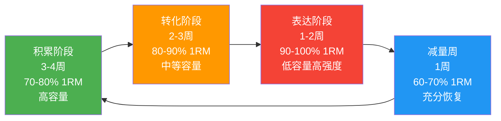

## 五、训练计划的渐进调整

训练计划不是一成不变的蓝图，而是一份需要随身体适应能力动态调整的"活文件"。本节将系统讲解从新手到进阶的完整渐进路径——什么时候该加重量、什么时候该减重量、什么时候该改变训练结构、什么时候该休息。掌握这些原则，你就能从"照着计划练"升级为"自己管理训练"。

### 5.1 为什么需要渐进调整？——适应与超负荷的博弈

人体对训练刺激的反应遵循一个基本规律：**刺激→适应→新的刺激→新的适应**。当你第一次用50kg做卧推时，身体会觉得"这太重了"，于是它会通过修复肌纤维、增加神经募集效率来适应这个负荷。等你适应了50kg，同样的重量就不再构成足够的刺激——你的身体已经"见怪不怪"了。

这就是训练学中最核心的概念之一：**渐进超负荷（Progressive Overload）**。


渐进超负荷有五种实现方式，不限于加重量：

| 渐进方式 | 说明 | 适用阶段 | 示例 |
|----------|------|----------|------|
| **增加重量** | 最直观的方式 | 所有阶段 | 卧推从50kg→52.5kg |
| **增加次数** | 同一重量做更多次 | 新手期为主 | 3×6→3×8 |
| **增加组数** | 增加总训练量 | 中期 | 3组→4组 |
| **缩短休息时间** | 提高训练密度 | 中后期 | 组间休息从2分钟→90秒 |
| **提高动作质量** | 更好的肌肉激活 | 所有阶段 | 从借力甩动→标准控制 |

> **关键认知**：新手最容易犯的错误是认为"只有加重量才算进步"。事实上，在你掌握标准动作之前，通过提高动作质量获得的进步远比盲目加重量更有价值。一个做3×8标准卧推50kg的人，训练效果远好于做3×8借力弹胸60kg的人。

### 5.2 新手期（第1-4周）：动作学习期

#### 5.2.1 阶段目标

新手期的核心目标不是"练出肌肉"，而是**建立正确的动作模式和训练习惯**。这个阶段是地基——地基打歪了，上面的楼盖得越高越危险。

具体目标分解：

| 目标维度 | 具体指标 | 验证方法 |
|----------|----------|----------|
| 动作模式 | 掌握PPL计划中所有主要动作的标准执行方式 | 对着镜子或录像自查，关节轨迹正确 |
| 肌肉感知 | 能在训练中感受到目标肌肉的发力（而非手臂或腰代偿） | 做动作时有意识地感受目标肌群的收缩和拉伸 |
| 训练习惯 | 固定每周3天去健身房，形成自动化的行为模式 | 连续4周不中断，训练时间固定 |
| 身体感知 | 能区分"肌肉酸痛"和"关节疼痛"，知道什么时候该停 | 训练后24-48小时的延迟性酸痛（DOMS）是正常的，但关节锐痛必须停止 |

#### 5.2.2 训练安排

- **频率**：每周3天（推/拉/腿各1次）
- **重量选择**：RPE 6-7的重量（感觉还能做5次的重量）
- **组数×次数**：每个动作3组×10次
- **力竭程度**：绝不训练到力竭（最后一组最多RPE 8）

#### 5.2.3 为什么新手期不能练到力竭？

力竭（RPE 10）意味着你在一组中已经无法再完成一次标准动作。对于有经验的训练者，力竭是一种有效的训练手段。但对于新手，它有三个严重问题：

1. **动作变形**：力竭时神经系统无法维持标准动作模式，你会下意识地用代偿肌群"帮忙"，这等于在训练错误的动作模式
2. **恢复不足**：新手的恢复能力远弱于有经验者，力竭训练的恢复时间可能长达72-96小时，直接影响下次训练
3. **心理打击**：每次都练到"趴下"会让人对训练产生恐惧和抵触，不利于习惯的养成

#### 5.2.4 新手期常见问题与应对

**问题1："感觉不到胸肌发力，做卧推只觉得手臂酸"**

这是最常见的新手问题。原因不是"练错了"，而是你的大脑和胸肌之间的神经肌肉连接还不够强。解决方案：

- **轻重量孤立热身**：卧推前先做2组弹力带夹胸或哑铃飞鸟（非常轻的重量），专注于感受胸肌收缩
- **触觉提示**：做卧推时让同伴用手指轻触你的胸肌，或自己用一只手摸着胸肌做动作（适用于哑铃卧推）
- **降低重量**：如果50kg做卧推完全感觉不到胸肌，降到40kg，用3秒下放+1秒停顿+2秒推起的节奏做
- **接受现实**：神经肌肉连接的建立需要4-6周，不要着急

**问题2："训练第二天全身酸痛，影响日常生活"**

延迟性肌肉酸痛（DOMS）是新手期最普遍的现象。它是肌纤维微损伤的正常反应，不代表训练过度。应对方法：

- 前2周的DOMS最严重，第3-4周会明显减轻
- 训练后进行10分钟轻度有氧（慢走或骑车）可以加速血液循环，减轻酸痛
- 保证每天7-8小时睡眠，睡眠是恢复的第一要素
- 补充足够蛋白质（每公斤体重1.6-2.2g），为肌纤维修复提供原料
- 如果酸痛严重到无法正常活动（比如手臂无法伸直），说明上一次训练量过大，下次减少1-2组

**问题3："不知道用多重的重量"**

新手期的重量选择遵循"2次储备"原则：选择一个你做10次时感觉"还能再做2次"的重量。宁可轻一点，不要重一点。如果做完3×10感觉毫无疲劳感，下次增加2.5kg；如果最后一组做不满10次，保持当前重量直到能完成3×10。

### 5.3 适应期（第5-12周）：线性进阶期

#### 5.3.1 阶段目标

经过4周的动作学习，你的身体已经熟悉了基本训练动作，神经肌肉连接基本建立。现在可以开始**线性进阶**——每次训练尝试比上次增加一点负荷。

#### 5.3.2 训练安排

- **频率**：每周4-5天（按PPL计划执行）
- **进阶方式**：每次训练尝试比上次多2.5kg或多1-2次
- **力竭程度**：每个动作最后一组可以接近力竭（RPE 8-9）

#### 5.3.3 线性进阶的黄金规则

线性进阶是新手增长最快的阶段，但需要遵守几条铁律：

**规则1：双重复进阶法（Double Progression）**

这是最适合初中期训练者的进阶方式。逻辑很简单：

设定次数范围 → 达到上限 → 加重量 → 回到下限 → 再次达到上限 → 再加重量

具体操作示例（杠铃卧推，目标次数范围6-8次）：

| 训练次数 | 重量 | 组数×次数 | 下次操作 |
|----------|------|-----------|----------|
| 第1次 | 50kg | 3×6, 6, 5 | 保持重量，目标做到3×6 |
| 第2次 | 50kg | 3×6, 6, 6 | 继续保持 |
| 第3次 | 50kg | 3×7, 7, 6 | 接近上限 |
| 第4次 | 50kg | 3×8, 8, 7 | 接近上限 |
| 第5次 | 50kg | 3×8, 8, 8 | **达到上限！下次加重量** |
| 第6次 | 52.5kg | 3×6, 6, 5 | 回到下限，重新积累 |

> **为什么要回到下限而不是维持8次加重量？** 因为重量增加2.5kg后，你能完成的次数自然会减少。从下限重新积累给了你足够的空间来适应新重量。直接在8次基础上加重量，很可能只能做4-5次，强度跳升太大。

**规则2：小重量递增原则**

上肢动作每次增加2.5kg（用1.25kg的小杠铃片），下肢动作每次增加5kg。不要心急用更大的增量——每周稳定增长2.5kg，12周就是30kg的进步，这已经是巨大的进步了。

如果健身房没有1.25kg的杠铃片，自购一副带去。这是最值得投资的训练装备之一，成本不到50元，但能让你的线性进阶延长数月。

**规则3：连续2次失败则减重**

如果连续2次训练都无法完成最低次数（比如连续2次卧推52.5kg只能做3×5，达不到目标6次），执行**10%减重重置**：

当前重量：52.5kg
减重10%：52.5 × 0.9 ≈ 47.5kg
从47.5kg重新开始线性进阶

减重不是失败，而是策略。减重后你会发现轻重量做起来得心应手，重新积累的过程中动作质量会更高，神经效率也会提升，通常2-3周后就能突破之前的瓶颈重量。

#### 5.3.4 适应期的进阶速率参考

以下是适应期各动作的合理进阶速率（每周增长量），供参考：

| 动作 | 每周合理增量 | 12周预期增长 | 备注 |
|------|-------------|-------------|------|
| 杠铃卧推 | 2.5kg | 15-30kg | 上肢进步最慢，耐心积累 |
| 杠铃划船 | 2.5kg | 15-30kg | 与卧推进步速率接近 |
| 杠铃深蹲 | 2.5-5kg | 30-50kg | 下肢进步最快 |
| 杠铃硬拉 | 2.5-5kg | 30-60kg | 神经适应期进步最快 |
| 哑铃侧平举 | 1-2kg | 2-6kg | 小肌群进步极慢，不要着急 |
| 杠铃弯举 | 2.5kg | 5-15kg | 受限于杠杆和小肌群 |

> **注意**：以上数据假设训练、睡眠、营养三方面都做到位。任何一项缺失都会显著降低进阶速率。如果你发现自己的进步速率远低于参考值，先检查这三方面。

#### 5.3.5 适应期常见瓶颈与突破

**瓶颈1："卧推卡在60kg很久了"**

上肢水平推是最容易遇到瓶颈的动作。突破策略：

- **检查动作质量**：录一段卧推视频，检查是否有肩胛骨松散、杠铃轨迹不直、下放位置偏高等问题
- **调整训练顺序**：如果卧推前做了大量的哑铃飞鸟或绳索夹胸做热身，消耗了太多体力，改为先做卧推
- **加入辅助动作**：窄距卧推（强化三头肌锁定能力）、暂停卧推（消除弹胸惯性，强化底部发力）
- **尝试微加载**：每次只增加1.25kg甚至0.5kg（用磁力小杠铃片）

**瓶颈2："深蹲进步停滞"**

下肢复合动作的瓶颈通常与技术或柔韧性有关：

- **检查深度**：如果你的深蹲不够深（大腿没有低于平行），可能是踝关节或髋关节灵活性不足，需要加入相关拉伸
- **检查呼吸**：深蹲时的Valsalva呼吸是否到位？核心是否收紧？
- **检查辅助肌群**：有时候深蹲卡在某个重量不是因为股四头肌弱，而是因为核心（腹横肌、竖脊肌）或臀部肌群跟不上，需要针对性强化

### 5.4 成长期（第13-24周）：波动周期化

#### 5.4.1 为什么需要周期化？

线性进阶不会永远有效。当你从50kg卧推进步到80kg时，身体已经积累了大量训练疲劳，神经系统长期处于高负荷状态。继续一味地追求"每次加重量"，结果往往是：力量停滞不前、关节开始疼痛、训练动力下降。

这时候需要引入**周期化训练（Periodization）**——通过有计划地变化训练变量（重量、次数、组数、频率），让身体在"刺激-恢复-超量恢复"的循环中持续进步。

```mermaid
graph TD
    A["线性进阶期<br/>力量稳步增长"] --> B["进步放缓<br/>疲劳累积"]
    B --> C{"选择策略"}
    C -->|"简单波动"| D["每周交替力量日/容量日"]
    C -->|"中周期化"| E["以月为单位安排阶段"]
    C -->|"高阶周期化|F["块状周期化<br/>先积累→再转化→再表达"]

    D --> G["适合13-36周训练者"]
    E --> H["适合6-12个月训练者"]
    F --> I["适合1年+训练者"]

    style C fill:#FF9800,color:#fff
    style G fill:#4CAF50,color:#fff
```

#### 5.4.2 波动周期化实施方案

**核心逻辑**：一周内安排不同强度的训练日，让身体在高强度日和中等强度日之间交替恢复。

| 训练日 | 类型 | 重量 | 次数 | 组数 | RPE | 目的 |
|--------|------|------|------|------|-----|------|
| 第1次推日 | 力量日 | 高（85-90% 1RM） | 4×5-6 | 4 | 8-9 | 发展最大力量 |
| 第1次拉日 | 力量日 | 高（85-90% 1RM） | 4×5-6 | 4 | 8-9 | 发展最大力量 |
| 第1次腿日 | 力量日 | 高（85-90% 1RM） | 4×5-6 | 4 | 8-9 | 发展最大力量 |
| 第2次推日 | 容量日 | 中（70-75% 1RM） | 3×10-12 | 3 | 7-8 | 肌肥大训练量 |
| 第2次拉日 | 容量日 | 中（70-75% 1RM） | 3×10-12 | 3 | 7-8 | 肌肥大训练量 |
| 第2次腿日 | 容量日 | 中（70-75% 1RM） | 3×10-12 | 3 | 7-8 | 肌肥大训练量 |

**一周示例排布**：

周一：推日-力量日（卧推5×5 @ 80kg，推举4×6 @ 50kg，侧平举3×12）
周二：拉日-力量日（引体向上4×5，杠铃划船4×6 @ 70kg，弯举3×10）
周三：腿日-力量日（深蹲5×5 @ 100kg，罗马尼亚硬拉4×6 @ 80kg）
周四：休息/主动恢复（轻度有氧20分钟+拉伸）
周五：推日-容量日（卧推3×10 @ 65kg，上斜哑铃推举3×12，侧平举4×15）
周六：拉日-容量日（高位下拉3×12，坐姿划船3×12，面拉3×15，锤式弯举3×12）
周日：腿日-容量日（深蹲3×10 @ 75kg，腿举3×12，腿弯举3×12，小腿提踵4×15）

#### 5.4.3 力量日与容量日的关键区别

| 维度 | 力量日 | 容量日 |
|------|--------|--------|
| **重量** | 85-90% 1RM | 70-75% 1RM |
| **次数** | 4-6次/组 | 10-12次/组 |
| **组间休息** | 3-4分钟（神经系统恢复） | 90秒-2分钟 |
| **动作数量** | 较少（4-5个） | 较多（6-7个） |
| **总训练时间** | 50-65分钟 | 60-80分钟 |
| **RPE** | 8-9（接近力竭） | 7-8（留有余量） |
| **训练目标** | 神经效率+最大力量 | 代谢压力+肌肥大 |
| **力竭** | 最后1-2组可以力竭 | 不建议力竭 |

> **为什么力量日用长休息？** 大重量训练主要依赖磷酸原系统（ATP-CP），这个系统的完全恢复需要3-5分钟。如果力量日只休息1分钟，你的ATP还没恢复，下一组的表现会大幅下降，等于在练耐力而非力量。

#### 5.4.4 力量日的热身方案调整

力量日的热身比容量日更重要也更耗时，因为大重量对关节和神经系统的冲击更大：

| 热身步骤 | 重量 | 次数 | 休息 | 说明 |
|----------|------|------|------|------|
| 全身激活 | 无负重 | 5分钟 | — | 慢跑/跳绳+动态拉伸 |
| 关节激活 | 弹力带 | 2×15 | 30秒 | 肩袖/臀部激活 |
| 热身组1 | 空杆（20kg） | 15次 | 1分钟 | 激活神经肌肉连接 |
| 热身组2 | 正式重量50% | 8次 | 1分钟 | 渐进加载 |
| 热身组3 | 正式重量70% | 5次 | 2分钟 | 接近工作重量 |
| 热身组4 | 正式重量85% | 3次 | 2-3分钟 | 神经系统激活 |

#### 5.4.5 容量日的辅助动作策略

容量日是补充弱点的最佳时机。力量日因为重量大、疲劳感强，不适合做太多辅助动作。容量日重量较轻、恢复快，可以针对自己的薄弱环节安排专项辅助：

| 常见弱点 | 推荐辅助动作 | 容量日安排 |
|----------|-------------|-----------|
| 卧推锁定困难（推不上去） | 窄距卧推、绳索下压 | 推日容量日加3×10 |
| 卧推底部无力（推不起来） | 暂停卧推（底部停2秒） | 替代常规卧推 |
| 背部宽度不足 | 宽握高位下拉、直臂下压 | 拉日容量日加3×12 |
| 深蹲深度不够 | 高脚杯深蹲、箱式深蹲 | 腿日容量日作为热身动作 |
| 硬拉锁定困难 | 臀推、罗马尼亚硬拉 | 腿日容量日加3×10 |

### 5.5 减量周：恢复的艺术

#### 5.5.1 什么是减量周？

减量周（Deload Week）是有计划地降低训练负荷的一周，目的是让累积的训练疲劳充分消散，让身体完成超量恢复，为下一阶段的训练积蓄能量。

把训练想象成"挖坑"：每次训练都在身体里挖了一个"疲劳之坑"，休息和恢复是在"填坑"。正常训练周期里，挖坑速度比填坑速度快，所以疲劳会逐渐累积。减量周就是"停工一周"，让身体把坑填满。


#### 5.5.2 什么时候需要减量？

| 信号 | 说明 | 行动 |
|------|------|------|
| **时间到了** | 每4-6周计划性减量 | 按计划执行，不要等身体发出信号 |
| **力量下降** | 连续2次训练某动作重量或次数下降 | 可能是过度训练的早期信号 |
| **持续疲劳** | 训练前就感觉疲惫，睡眠质量变差 | 训练累积的中枢神经疲劳 |
| **关节疼痛** | 肩关节、膝盖、腰部出现持续不适 | 过度使用导致的炎症反应 |
| **动力缺失** | 对训练完全提不起兴趣 | 心理疲劳的体现 |
| **频繁生病** | 免疫力下降，容易感冒 | 训练量超过身体恢复能力 |

> **原则**：宁可提前减量，不要推迟减量。4周减一次和6周减一次的长期效果差异不大，但如果不减量导致受伤，可能要停训数月。

#### 5.5.3 减量周执行方案

| 维度 | 正常训练周 | 减量周 |
|------|-----------|--------|
| **训练频率** | 5-6天 | 保持不变（不要减少训练天数） |
| **训练重量** | 100% | 正常重量的60-70% |
| **训练组数** | 正常 | 平时的一半 |
| **训练次数** | 接近力竭 | 远离力竭（RPE 5-6） |
| **动作选择** | 正常 | 保持相同的动作，不引入新动作 |
| **有氧训练** | 正常 | 保持或减少 |
| **拉伸/放松** | 正常 | 增加！多做泡沫轴、拉伸、按摩 |

**减量周的具体操作**：

假设你正常训练日卧推做4×6 @ 80kg，减量周这样安排：

正常周：卧推 4×6 @ 80kg，上斜推举 3×8 @ 30kg，侧平举 3×12 @ 10kg，绳索下压 3×12
减量周：卧推 3×6 @ 50kg，上斜推举 2×8 @ 20kg，侧平举 2×12 @ 6kg，绳索下压 2×12

所有动作重量降低到60-70%，组数减半，次数保持不变，力竭程度大幅降低。用这个重量做起来会觉得"太轻了"——这就对了，减量周的目标不是制造新的训练刺激，而是让之前的刺激充分转化为力量和肌肉增长。

#### 5.5.4 减量周的心理管理

很多训练者对减量周有心理抵触："不练会不会退步？""浪费了一整周的时间！"这些担心完全没有必要。研究表明，减量周不仅不会让你退步，反而会带来显著的力量和肌肉增长——这就是"超量恢复"效应。

| 担心 | 事实 |
|------|------|
| 不练一周会掉肌肉 | 肌肉流失需要2-3周的完全停训，减量周仍有训练 |
| 力量会下降 | 减量周后力量通常会提升5-10%（超量恢复） |
| 浪费时间 | 减量周是训练计划的一部分，不是"偷懒" |

减量周结束后，你会明显感觉训练状态回升——同样的重量做起来更轻松，握力更足，精神更集中。这就是减量周的价值。

### 5.6 长期训练规划：阶段性目标

#### 5.6.1 训练阶段总览

下表给出了从零基础到高级训练者的完整阶段性规划：

| 阶段 | 时间 | 频率 | 进阶方式 | 核心策略 |
|------|------|------|----------|----------|
| 新手期 | 第1-4周 | 3天/周 | 学习动作，不追求重量增长 | 动作质量>重量 |
| 适应期 | 第5-12周 | 4-5天/周 | 线性进阶（每次+2.5kg或+1-2次） | 双重复进阶法 |
| 成长期 | 第13-24周 | 5-6天/周 | 波动周期化（力量日/容量日交替） | 力量+容量并行 |
| 进阶期 | 第25-48周 | 5-6天/周 | 中周期化（月度阶段划分） | 积累→转化→表达 |
| 高阶期 | 1年+ | 5-6天/周 | 块状周期化+专项突破 | 针对性补弱 |

#### 5.6.2 进阶期（第25-48周）：中周期化

进入进阶期，简单的"力量日/容量日"交替已经不够用了。你需要以**月为单位**安排训练阶段：

**积累阶段（3-4周）**：
- 重量：70-80% 1RM
- 次数：8-12次
- 目标：增加总训练量（总重量×总次数），为后续的力量增长打基础
- 特点：组数多，次数多，重量适中

**转化阶段（2-3周）**：
- 重量：80-90% 1RM
- 次数：5-8次
- 目标：将积累阶段增加的训练量转化为力量
- 特点：重量提升，组数略减，RPE提高

**表达阶段（1-2周）**：
- 重量：90-100% 1RM
- 次数：1-5次
- 目标：测试或冲击新的个人最好成绩
- 特点：重量最大，组数最少，RPE 9-10

**减量阶段（1周）**：
- 正常重量的60-70%
- 组数减半
- 恢复所有疲劳



每个中周期结束后，你的力量水平应该比上一个周期的起点更高。这就是长期进步的方式——螺旋式上升，而不是直线上升。

#### 5.6.3 各阶段力量参考标准

以下是男性训练者（体重70-80kg）在各个阶段结束时的合理力量水平参考：

| 动作 | 新手期结束 | 适应期结束 | 成长期结束 | 进阶期结束 | 高阶水平 |
|------|-----------|-----------|-----------|-----------|---------|
| 杠铃卧推 | 40-50kg | 60-70kg | 80-90kg | 100-110kg | 120kg+ |
| 杠铃深蹲 | 50-60kg | 80-100kg | 110-130kg | 140-160kg | 180kg+ |
| 杠铃硬拉 | 60-70kg | 90-110kg | 130-150kg | 160-180kg | 200kg+ |
| 杠铃推举 | 25-35kg | 40-50kg | 55-65kg | 70-80kg | 85kg+ |

> **免责声明**：以上数据仅为参考范围，个体差异很大。体重、骨架、训练年限、基因天赋、营养状况都会影响力量水平。不要和别人比，和自己的上周比。

### 5.7 训练日志：渐进调整的数据基础

没有数据的渐进调整是盲人摸象。你需要一个系统来记录每次训练的重量、次数、组数和主观感受，才能做出有据可依的调整决策。

#### 5.7.1 必须记录的数据

| 数据项 | 示例 | 用途 |
|--------|------|------|
| 日期 | 2025-06-24 | 追踪训练频率 |
| 动作名称 | 杠铃平板卧推 | — |
| 组数×次数 | 4×8, 7, 6, 5 | 判断是否达到进阶标准 |
| 使用重量 | 62.5kg | 渐进超负荷的核心数据 |
| RPE | 8, 9, 9, 10 | 评估强度，指导下次调整 |
| 身体状态 | 睡眠6小时，略微疲劳 | 解释表现波动 |
| 备注 | 右肩略有不适 | 预防伤病 |

#### 5.7.2 基于日志数据的决策流程

每次训练后，花2分钟根据日志数据决定下次训练的安排：

如果 所有组都达到目标次数上限 → 下次增加重量
如果 部分组达到目标次数 → 保持重量，目标在下次全部达到
如果 连续2次都无法达到最低次数 → 减重10%重新开始
如果 出现关节疼痛 → 降低重量20%，检查动作质量
如果 睡眠/饮食/状态明显不佳 → 保持当前重量，不要追加

具体的日志模板和记录工具推荐详见下一节《训练日志的重要性》。

### 5.8 渐进调整的常见误区

#### 误区1："每次都必须加重量"

**真相**：线性进阶不是每次都加重量，而是在目标次数范围内逐步提升。如果你连续3次训练卧推重量不变但次数从3×6提高到3×8，这就是显著的进步——总训练量（重量×次数）增加了33%。

#### 误区2："减量说明我退步了"

**真相**：减量是训练策略的一部分，不是退步的信号。有计划的减量和"因为太累被迫停训"是完全不同的事情。前者是主动恢复，后者是被动崩溃。

#### 误区3："重量不涨就应该换计划"

**真相**：当你遇到瓶颈时，首先检查的不是计划本身，而是以下三个方面：
1. **睡眠**：是否每晚保证7-8小时高质量睡眠？
2. **营养**：是否摄入了足够的蛋白质（每公斤体重1.6-2.2g）和总热量？
3. **一致性**：是否每周不缺席地完成了所有计划中的训练？

这三个变量解决之前，换计划毫无意义。绝大多数训练者的瓶颈不是计划问题，而是恢复和一致性问题。

#### 误区4："别人进步比我快，我是不是天赋不行"

**真相**：力量增长的个体差异极大。基因、骨架、激素水平、训练年限、运动背景都会影响进步速率。有人卧推半年破百公斤，有人需要两年——这都是正常的。唯一有效的比较对象是你自己上周的记录。

#### 误区5："疼痛了就扛着，突破就好了"

**真相**：训练中应该区分"肌肉灼烧感"和"关节/肌腱锐痛"。前者是正常的训练反应，后者是身体发出的警告信号。关节疼痛时继续加重只会导致更严重的伤病，可能需要停训数周甚至数月。正确做法是：降低重量20-30%，检查动作质量，必要时咨询运动医学专业人士。

#### 误区6："每个阶段都必须严格按时间表切换"

**真相**：阶段划分的时间只是参考。如果你在线性进阶期的进步速率仍然很好，不需要在第13周强行切换到波动周期化——继续用有效的方法，直到它不再有效。反之，如果第8周就已经出现明显的疲劳累积和进步停滞，可以提前进入减量周或调整训练结构。**身体说了算，不是日历说了算。**

### 5.9 实操清单：本周就能开始的行动

1. **建立训练日志**：从下一次训练开始，记录每个动作的重量、次数、RPE
2. **评估当前阶段**：根据训练经验判断自己处于哪个阶段（新手/适应/成长）
3. **设置下次训练目标**：基于双重复进阶法，确定每个主要动作的重量和目标次数
4. **规划减量周**：在日历上标记4-6周后的减量周，提前安排
5. **录一段训练视频**：选择你最常做的1-2个动作，录制并回看动作质量

***

