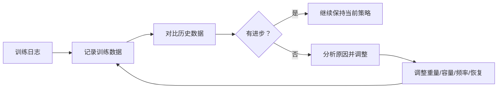
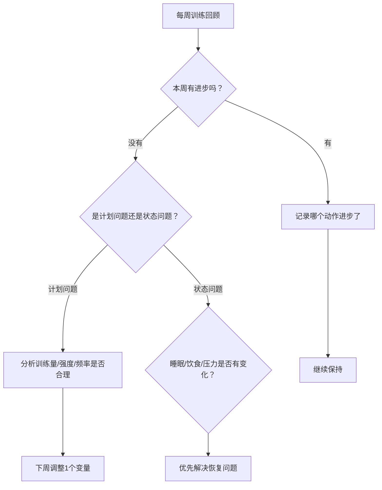
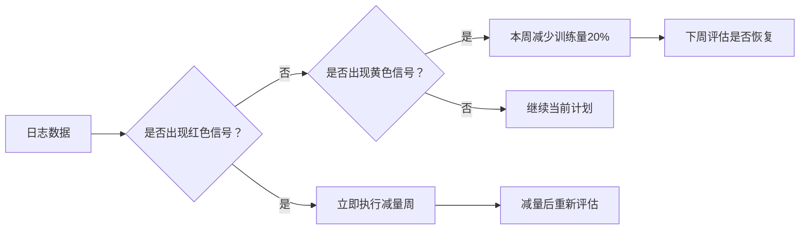

## 六、训练日志的重要性

训练日志是力量训练中被严重低估的工具。大多数人凭感觉走进健身房，"上次好像用了40公斤做卧推"，然后要么重复同样的重量停滞不前，要么冒进加片导致动作变形受伤。训练日志的本质是**把你从"凭感觉训练"升级到"凭数据训练"**——这不是锦上添花，而是区分进步与原地踏步的关键分水岭。

本节将系统讲解训练日志的价值、记录方法、数据分析技巧，以及如何用日志驱动训练决策。

---

### 6.1 为什么要记训练日志？

#### 6.1.1 追踪进步：建立可量化的反馈系统

人体对自身能力变化的感知极其不准确。你以为自己卧推一直"差不多"，但翻开日志发现：三周前你用60公斤做3×8，现在还是60公斤做3×8——零进步。而如果你有记录，你会立刻意识到问题，主动调整。

训练日志提供的是一种**客观的、不可篡改的进步轨迹**：



具体来说，日志让你能回答以下问题：

- **我的卧推1RM在这三个月增长了多少？**（而不是"好像强了一点"）
- **我的深蹲从3×5进步到3×8了吗？**（具体次数的变化）
- **我上一次受伤时的训练量是多少？**（找到过度训练的阈值）
- **哪种训练编排让我进步最快？**（A方案 vs B方案的对比）

#### 6.1.2 发现规律：从数据中提取训练洞察

训练日志积累到一定量后，你会从数据中发现凭直觉不可能察觉的规律：

**个人瓶颈模式**：比如你发现自己的卧推总是卡在70公斤——每次加到72.5就做不满组数。这提示你需要针对瓶颈点做专项训练（如暂停卧推、窄距卧推强化三头）。

**最佳训练参数**：通过对比不同阶段的日志，你会发现某些参数组合效果更好：

| 对比维度 | 可能的发现 |
|---------|-----------|
| 训练频率 | 每周练胸2次比1次进步更快 |
| 每组次数 | 8-10次范围比5-6次增肌更明显 |
| 组间休息 | 复合动作休息3分钟比2分钟能多做2次 |
| 训练时段 | 下午训练的重量普遍比早上多5% |
| 恢复周期 | 连续训练4周后必须减量，否则受伤 |

**周期性规律**：你可能发现每次出差回来力量下降5%，或者每次生理期前一周训练状态最佳。这些只有持续记录才能发现。

#### 6.1.3 保持动力：用数据对抗训练倦怠

训练倦怠（Training Burnout）是健身者放弃的主要原因之一。当你觉得"练了这么久也没什么效果"时，日志是最好的反驳工具。

翻开三个月前的日志："2024年1月，卧推40公斤，3×6，最后两次需要辅助。"再看今天的记录："卧推60公斤，3×8，全程无辅助。"——这20公斤的进步是真实的、可验证的、属于你的。

心理学研究表明，**可见的进步反馈**是维持内在动机最有效的手段之一。训练日志把抽象的"变强了"转化为具体的数字增长，每次翻阅都是一次正向强化。

#### 6.1.4 调整计划：数据驱动 vs 凭感觉

没有日志的训练者做计划调整时，唯一的依据是"感觉"——"感觉最近没进步""感觉训练量太大了"。这种模糊的判断经常出错：

- 你以为没进步，实际上卧推停滞但卧推变式（如窄距卧推）在稳定进步
- 你以为训练量太大导致疲劳，实际上是睡眠不足
- 你以为需要换计划，实际上只需要调整一个变量（如增减一个辅助动作）

有日志的训练者做调整时，依据是**可验证的数据**：

1. 打开日志，看过去4-6周的数据
2. 识别哪些动作进步了，哪些停滞了
3. 分析停滞动作的可能原因（训练量不足？重量卡住了？疲劳累积？）
4. 针对性地调整一个变量
5. 记录调整后的效果，验证假设

---

### 6.2 训练日志应该记录什么？

一份好的训练日志需要在**信息量**和**可执行性**之间取得平衡。记录太少无法分析，记录太多坚持不下去。以下是分层的记录策略。

#### 6.2.1 必记项（每次训练必须记录）

这些是数据分析的核心数据点，缺一不可：

**1. 日期和训练日类型**

日期：2024-03-15（周五）
训练日：推日 A（力量日）

标明日期是为了追踪进度，标明训练日类型是为了后续按类型筛选分析。

**2. 每个动作的详细记录**

动作：杠铃卧推（平板）
- 第1组：60kg × 8次（RPE 7）
- 第2组：60kg × 7次（RPE 8）
- 第3组：60kg × 6次（RPE 9）
- 备注：第3组最后一次有轻微卡顿

每个动作记录以下要素：

| 要素 | 说明 | 示例 |
|------|------|------|
| 动作名称 | 要具体到变式 | "杠铃卧推（平板）"而非"卧推" |
| 使用重量 | 包含杆的重量 | "60kg"（奥杆20kg + 两侧各20kg） |
| 完成次数 | 每组分别记录 | "8/7/6"而非"3×6-8" |
| RPE/RIR | 主观用力程度 | "RPE 8"或"RIR 2" |
| 辅助情况 | 是否有人保护 | "第3组后2次有spot" |

**RPE（Rate of Perceived Exertion，主观用力感知量表）** 是训练日志中最实用的强度指标：

| RPE值 | 含义 | 对应RIR（保留次数） | 实际感受 |
|-------|------|-------------------|---------|
| 10 | 力竭 | 0 | 完全做不了下一个 |
| 9.5 | 接近力竭 | 0-1 | 可能再做半个 |
| 9 | 差1次力竭 | 1 | 还能做1个，但很费力 |
| 8 | 差2次力竭 | 2 | 还能做2个 |
| 7 | 差3次力竭 | 3 | 还能做3个，节奏稳定 |
| 6 | 中等 | 4 | 轻松但能感觉到 |
| 5及以下 | 轻松 | 5+ | 热身或技术练习 |

**3. 训练总时长**

训练时长：72分钟（不含热身和拉伸）

时长数据可以帮你评估训练效率——如果同样的内容以前50分钟完成，现在需要80分钟，可能是组间休息过长或状态不佳。

#### 6.2.2 建议记录项（有余力时记录）

这些数据能让分析更加深入：

**4. 睡眠质量**

昨晚睡眠：7小时，质量中等（中途醒了一次）

睡眠是影响训练表现的第一大恢复因素。记录睡眠可以帮你发现"训练状态差"的真正原因——是计划问题还是恢复问题。

**5. 训练前的身体状态**

身体状态：左侧肩部轻微酸痛（昨天练了推举），整体精神状态良好

这帮你识别伤病前兆——如果肩部不适持续出现，说明需要调整动作或加入康复训练。

**6. 补剂/饮食情况**

训练前餐：鸡胸肉150g + 米饭200g（训练前1.5小时）
训练中：BCAA 5g + 500ml水

饮食直接影响训练表现。当你某次训练状态特别好或特别差时，回查饮食可能找到原因。

**7. 训练环境**

环境：室温约24°C，健身房人少，深蹲架空闲

环境看似无关紧要，但在分析"为什么今天状态特别好/差"时，这些细节可能提供线索。

#### 6.2.3 周期性记录项（每周或每月回顾时填写）

这些不需要每天记录，但定期回顾时必须填写：

**8. 体重和身体围度（每周1次，同一时间测量）**

2024-03-15 体重：73.5kg（晨起空腹）
胸围：98cm | 腰围：80cm | 臂围：36cm | 大腿围：58cm

体重和围度的变化是评估增肌/减脂效果的核心指标。必须在相同条件下测量才有对比价值。

**9. 动作1RM估算或测试记录（每月1次）**

2024-03月 最大重量估算：
卧推：75kg × 3 → 估算1RM ≈ 80kg
深蹲：100kg × 2 → 估算1RM ≈ 105kg
硬拉：120kg × 1 → 1RM = 120kg

不需要每月都冲1RM，用公式估算即可。常用的1RM估算公式（Epley公式）：

估算1RM = 重量 × (1 + 次数/30)

例如：60kg做了8次 → 60 × (1 + 8/30) = 76kg

**10. 训练感受总结（每次训练结束时写2-3句）**

本次总结：卧推后两组掉次数明显，可能是昨天没睡好。
侧平举尝试新重量12.5kg能完成3×8，下次继续。
整体训练质量7/10。

这段文字是最有价值的定性数据——它把数字背后的"为什么"记录下来，是纯数字无法替代的。

---

### 6.3 训练日志的记录格式

#### 6.3.1 推荐格式：结构化模板

以下是一个经过验证的每日训练日志模板，兼顾完整性和易用性：

```markdown
## 2024-03-15 | 推日A（力量日）

**状态**：睡眠7h | 体重73.5kg | RPE感觉中等
**训练时长**：68分钟

### 动作记录

| # | 动作 | 组1 | 组2 | 组3 | 组4 | 备注 |
|---|------|-----|-----|-----|-----|------|
| 1 | 杠铃卧推 | 60×8 | 60×7 | 60×6 | - | RPE:7/8/9 |
| 2 | 上斜哑铃卧推 | 22.5×10 | 22.5×9 | 22.5×8 | - | RPE:7/8/8.5 |
| 3 | 坐姿肩推 | 30×8 | 30×8 | 30×7 | - | RPE:8/8/9 |
| 4 | 侧平举 | 10×12 | 10×12 | 10×10 | 10×10 | RPE:7/7/8/8 |
| 5 | 绳索下压 | 20×12 | 20×12 | 20×11 | - | RPE:7/8/9 |

### 总结
卧推后两组掉次数，下次尝试60kg先做3×7再看。
肩推进步了，上周只有3×7。
整体训练质量 7/10。
```

#### 6.3.2 不同工具的实现方式

训练日志可以用任何工具记录，关键是**能坚持**。以下是几种常见工具的对比：

| 工具 | 优点 | 缺点 | 适合人群 |
|------|------|------|---------|
| 纸质笔记本 | 无需充电，写入快，健身房不被看手机分心 | 不便于统计分析，容易丢失 | 喜欢纸笔感、不想带手机训练的人 |
| 手机备忘录 | 随身携带，随时可记 | 格式不统一，搜索不方便 | 记录量少的初学者 |
| Excel/Google Sheets | 可计算、可制图、可筛选 | 输入效率较低，需要设计模板 | 喜欢数据分析的进阶训练者 |
| 专业健身App | 自带计时器、动作库、图表分析 | 功能臃肿、可能收费、数据绑定在App里 | 想要一站式解决方案的人 |
| Markdown文件 | 纯文本、可版本管理、跨平台 | 需要一定技术基础 | 程序员或技术背景训练者 |

**专业健身App推荐**：

- **Strong**（iOS/Android）：界面极简，记录效率最高，支持自定义动作和计划模板，免费版足够个人使用
- **Hevy**（iOS/Android）：类似Strong但有社区功能，可以看朋友的训练记录
- **JEFIT**（iOS/Android）：动作库最全，带3D肌肉图解，适合需要动作参考的初学者
- **健身宝典**（国内）：中文界面，动作库包含国内健身房常见的器械型号

#### 6.3.3 自动化记录方案

如果你是技术背景的训练者，可以考虑半自动化记录：

**方案一：Apple Watch / 智能手表 + 数据同步**

大部分智能手表可以记录心率、训练时长、消耗卡路里。虽然这些数据不够精确用于力量训练分析，但可以作为训练强度的参考指标。

**方案二：IFTTT / 快捷指令自动化**

用手机快捷指令实现：训练结束后一键填写模板，自动填入日期和时间，只需要输入重量和次数。

**方案三：语音记录 + 后期整理**

训练间隙用语音备忘录快速记下数据（"卧推60乘8，60乘7，60乘6"），训练结束后统一整理到日志中。这比在手机上打字高效得多。

---

### 6.4 如何分析和利用训练日志？

记录只是第一步，**分析数据并据此做决策**才是训练日志的真正价值所在。

#### 6.4.1 每次训练前：回顾上次记录

这是最简单也最有效的习惯。在开始今天的训练之前，花1分钟看上次同类型训练的记录：

1. 上次卧推用了多少重量？完成了几次？
2. 上次有没有什么注意事项？（如"肩部不适，减少肩推重量"）
3. 这次的目标是什么？（"上次60kg做3×8，今天目标62.5kg做3×6-7"）

这个习惯确保你**每次训练都有明确的目标**，而不是走进健身房才想"今天练什么"。

#### 6.4.2 每周回顾：识别短期趋势

每周日花10分钟回顾本周的训练记录，关注以下问题：



**进步的判断标准**：

- 同一重量下完成更多次数（如60kg从3×6进步到3×8）
- 同一次数下使用更大重量（如3×8从55kg进步到60kg）
- 同等训练量下RPE降低（如3×8@RPE8变成3×8@RPE7）
- 训练感受变好（动作更流畅，节奏更稳定）

#### 6.4.3 每月回顾：评估计划效果

每月进行一次更宏观的回顾：

**步骤一：整理本月的关键数据**

3月训练数据汇总：
- 训练次数：16次（计划18次，完成率89%）
- 卧推：从55kg×3×7进步到60kg×3×8（+5kg，+1次/组）
- 深蹲：从80kg×3×6进步到85kg×3×6（+5kg，次数持平）
- 硬拉：从100kg×3×5进步到100kg×3×8（重量持平，+3次/组）
- 体重：从72.5kg增至73.5kg（+1kg）
- 腰围：从80cm变为80cm（持平）

**步骤二：评估是否需要调整**

根据数据做以下判断：

| 观察结果 | 可能原因 | 建议调整 |
|---------|---------|---------|
| 所有动作都在进步 | 计划适合当前水平 | 继续执行，不改动 |
| 部分动作停滞 | 该动作可能需要变式或调整训练量 | 增加该动作的辅助训练 |
| 所有动作停滞 | 整体计划可能需要大调整 | 考虑减量周或更换计划 |
| 体重增加但力量不增 | 可能脂肪增长过多 | 减少热量盈余100-200kcal |
| 体重不变但力量增长 | 新手增肌减脂同时进行 | 保持当前饮食 |
| 频繁受伤 | 训练量过大或热身不足 | 减少训练量，加入热身流程 |

**步骤三：设定下月目标**

基于本月数据设定具体的、可衡量的下月目标：

4月目标：
- 卧推达到62.5kg×3×8
- 深蹲达到87.5kg×3×7
- 训练完成率≥90%（至少16次/月）
- 每周记录体重≥3次

#### 6.4.4 长期数据分析：绘制进步曲线

如果你使用电子表格记录，可以绘制进步曲线来直观地看到趋势。以下是绘制进步曲线的方法：

**在Excel/Google Sheets中的操作步骤**：

1. 建立数据表，列分别为：日期、动作名称、重量、总次数（组×次）
2. 用筛选功能选择特定动作（如"杠铃卧推"）
3. 以日期为X轴，重量或总训练量（重量×总次数）为Y轴，绘制折线图
4. 添加趋势线，观察长期走势

**训练量的计算公式**：

单次训练量 = 重量 × 次数 × 组数

例如：60kg × 8次 × 3组 = 1440kg

训练量（Volume Load）是评估训练刺激最直观的指标。当训练量持续增长时，肌肉在持续接受更大的刺激。

---

### 6.5 训练日志的常见误区

#### 误区一：记录太详细，坚持不下去

**问题**：每次训练花10分钟记录，从动作角度到肌肉收缩速度，事无巨细。

**纠正**：训练日志不是实验报告。对于大多数人，记录"动作+重量+次数+RPE"就够了。如果记录成为负担，你会放弃记录。**80%准确的日志远好过100%完美但只记了两周的日志。**

先建立每天记录的习惯，再逐步增加记录维度。

#### 误区二：只记录成功，不记录失败

**问题**：训练状态差、做砸了的动作、受伤的情况都不记。

**纠正**：失败记录和成功记录同样重要，甚至更重要。"卧推60kg尝试3×8，只完成3×5，原因是昨晚只睡了4小时"——这条记录帮你建立了"睡眠不足→表现下降"的因果关系，是纯数字无法体现的。

#### 误区三：记录后从不回看

**问题**：日志变成了"写完就忘"的形式主义。

**纠正**：记录的价值在于**使用**。至少在以下三个时刻必须翻阅日志：

1. **每次训练开始前**：看上次同类型的记录，确定今天的目标
2. **每周训练结束后**：做一次简短的周回顾
3. **每次感觉"没进步"时**：翻出3个月前的记录对比

#### 误区四：被数字绑架，忽略身体感受

**问题**：执着于日志上的数字，为了"打破记录"而不顾身体状态，硬冲重量导致受伤。

**纠正**：RPE的引入就是为了防止这个问题。如果日志显示上次卧推60kg×8@RPE7，但今天你60kg×6就已经RPE9——不要硬撑到8次。记录真实的RPE，然后分析为什么今天状态差，而不是为了"完成记录"勉强自己。

#### 误区五：跟别人的数据盲目比较

**问题**：看到别人的日志"卧推100kg×5"，觉得自己"卧推60kg太菜了"。

**纠正**：训练日志是**跟自己比**的工具。每个人的起点不同、基因不同、训练年限不同。60kg×3×6进步到60kg×3×8，这个进步的含金量不亚于100kg×3×5进步到105kg×3×5。

---

### 6.6 高级技巧：用日志做周期化规划

当你的训练日志积累了3个月以上，就可以用它来指导周期化训练规划。

#### 6.6.1 识别你的"最佳训练区间"

通过分析日志中的历史数据，你可以找到自己进步最快的训练参数：

分析结果示例：
- 当每组次数在6-8次范围时，卧推进步最快
- 当每组次数超过10次时，进步速度放缓
- 当每周训练量（卧推）在8-12组时，进步最稳定
- 当每周训练量超过14组时，肩部不适出现频率增加

这些个性化的数据比任何通用计划都更有价值，因为它是从**你自己的身体**中提取的规律。

#### 6.6.2 预测和规划进阶目标

有了历史数据，你可以用趋势外推来设定合理的未来目标：

卧推趋势分析（过去3个月）：
- 1月：平均重量55kg，月增长+2.5kg
- 2月：平均重量57.5kg，月增长+2.5kg
- 3月：平均重量60kg，月增长+2.5kg

按当前增速，预计：
- 4月底：~62.5kg
- 5月底：~65kg
- 注意：新手线性进步终将放缓，预计在70-80kg进入平台期

#### 6.6.3 过度训练的早期预警

训练日志是识别过度训练最灵敏的工具。以下信号需要警惕：

**红色信号（立即减量）**：
- 连续2次训练中，所有主要动作的重量或次数同时下降
- 训练中出现此前没有的关节疼痛
- 训练后48小时仍然极度疲劳

**黄色信号（注意调整）**：
- 单个动作连续3次训练停滞
- 睡眠质量连续1周下降
- 训练前对训练感到异常抗拒（不是懒，是身体在发出信号）



---

### 6.7 本节要点

1. **训练日志是"凭数据训练"的基础**：它让进步可追踪、规律可发现、决策有依据、动力有来源。

2. **必记项精简到四要素**：动作名称、使用重量、每组次数、RPE——这四项能覆盖90%的分析需求。

3. **RPE是连接主观感受和客观数据的桥梁**：学会使用RPE量表（1-10），让日志不仅记录"做了什么"，还记录"做到什么程度"。

4. **记录后必须使用**：每次训练前回顾上次记录，每周做简短回顾，每月做数据汇总和计划评估。

5. **避免过度记录**：80%准确但持续记录的日志，远好过100%完美但两周就放弃的日志。先建立习惯，再优化细节。

6. **日志是跟自己比的工具**：不要用别人的数据否定自己的进步。每一次重量增加、每一次多做的一次，都是真实的成长。

7. **积累3个月以上的数据后**：可以用来识别个人最佳训练区间、规划进阶目标、以及早期发现过度训练信号。

> 训练日志不是额外的负担，它是你训练计划的一部分。就像运动员需要教练记录数据一样，你就是自己的教练——而训练日志就是你的数据板。从今天开始记录，三个月后的你会感谢现在的自己。
